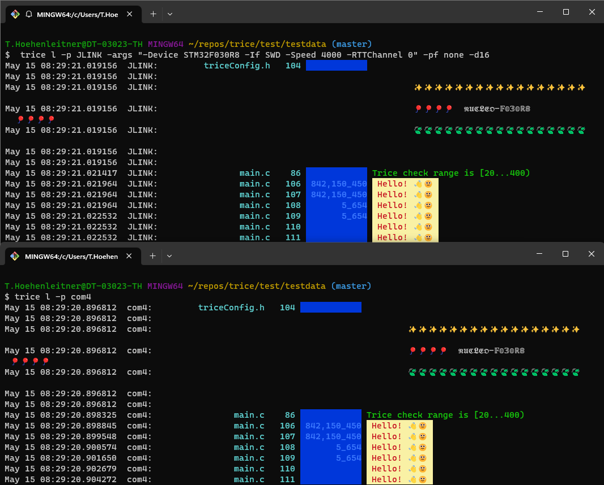

<!-- vscode-markdown-toc -->
- [1. v0.60.1 Twice Log Screen Shot](#1-v0601-twice-log-screen-shot)
- [2. v0.56.0 Changes](#2-v0560-changes)
	- [2.1. Legacy `TRICE*` macros](#21-legacy-trice-macros)
	- [2.2. Function call macros `TRice`, `Trice` and `trice`](#22-function-call-macros-trice-trice-and-trice)
	- [2.3. Common improvements](#23-common-improvements)
	- [2.4. CLI changes](#24-cli-changes)
	- [2.5. Changes under the hood](#25-changes-under-the-hood)
- [3. v063. Changes](#3-v063-changes)
- [4. v0.64.0 Changes (unsorted)](#4-v0640-changes-unsorted)
- [5. v0.64.1 changes (unsorted)](#5-v0641-changes-unsorted)
- [6. v0.65.0 Changes](#6-v0650-changes)
- [7. v0.66.0 Changes](#7-v0660-changes)
- [8. v0.67.0 Changes](#8-v0670-changes)
- [9. v0.68.0 Changes](#9-v0680-changes)
- [10. v0.69.0 Changes](#10-v0690-changes)
- [11. master branch changes](#11-master-branch-changes)

<!-- vscode-markdown-toc-config
	numbering=true
	autoSave=true
	/vscode-markdown-toc-config -->
<!-- /vscode-markdown-toc --># Changelog


date        | version | comment
------------|--------:|-------------------------------------------------------------------------------------------------------------------------------------------------------------------------------------------------------------------------------------------------------------------------------------------------------------------------------------------------------------------------------------------------------------------------------------------
2020-02-11  |     0.1 | initial version
2020-02-14  |     0.2 | SHORT_MEMORY switch added
2020-02-18  |     0.3 | C macros renamed into TRICE
2020-02-20  |     0.4 | trice printf() adapter added
2020-02-22  |     0.5 | support for auto param count
2020-03-01  |     0.6 | encryption support, TRICE64_2 added
2020-03-12  |     0.7 | `trice u -src dir1 -src file -src dir2` any now possible, -ts added, effective runtime strings
2020-03-29  |     0.8 | auto-logfile, remoteDisplay added, check issues!
2020-04-07  |   0.8.2 | display server supports many receiver-clients, no line mixes, code partially restructured, line prefix
2020-04-22  |     0.9 | fileWatcher added (no need to re-load til.json anymore), now `trice s` possible for COMport scan, NUCLEO-F070 demo project added, now with ANSI color (faster), default log filename with timestamp, remote displayServer shutdown possible
2020-05-12  |   0.9.1 | `SeggerRTT` & `SeggerRTTD` added, docs extended, more test examples, TRICE16_1 critical section bugfix
2020-06-29  |   0.9.2 | CLI slightly changed (no more 'r'), doc extended, added: Tests, Examples, JLINK, RND, SIM, FILE, TRICE_SYNC, TRICE_VARIANT, TRICE_ASSERT, now no semi-colon after `TRICE` is tolerated (macros), several `TRICE` in one code line are now ok
...         |         |
2022-FEB-11 |  0.48.0 | FILE & TCP4 input ports added
2022-APR-27 |  0.49.1 | FILEBUFFER support added
2022-APR-27 |  0.49.1 | Darwin binaries added
2022-MAY-14 |  0.49.2 | Legacy comport Tarm driver code deactivated, TRICE_S usage clarification in [TriceUserGuide.md](./doc/TriceUserGuide.md), `\t` support inside format strings added, `TRICE` macro in one line demand added., FILEBUFFER issue fixed (workaround)
2022-MAY-16 |  0.50.0 | Switch `-tcp` added allowing trice TCP output for reception with 3rd party tools.
2022-MAY-17 |  0.51.0 | Switch `-binaryLogfile`added.
2022-MAY-22 |  0.51.1 | Display server works again. Simple Shell added.
2022-JUN-05 |  0.52.0 | UART Command option added (MDK-ARM_STM32F030R8 example), Colors extended.
2022-JUN-14 |  0.53.0 | Macros added: TRICE_B, TRICE8_B, TRICE16_B, TRICE32_B, TRICE64_B, TRICE8_F, TRICE16_F, TRICE32_F, TRICE64_F.
2022-JUL-06 |  0.54.0 | Location information file `li.json` now generated with `trice u`. This makes the 4 bytes location information inside the binary data obsolete and reduces the transmitted data. You should adapt your `triceConfig.h` - disable `TRICE_LOCATION` there.
2022-JUL-07 |  0.54.1 | Test data adapted
2022-AUG-25 |  0.55.1 | Switching to TREX (see ./doc/TriceV1.0Specification.md) as default encoding. Legacy projects need "trice log -enc TLE" now. In project specific `triceConfig.h` file switch between `TRICE_TREX_ENCODING` and `TRICE_LEGACY_ENCODING`. For TREX framing TCOBSv1 is active. As default the `Id(n)  sub-macro uses a 16-bit timestamp, so be careful changing legacy projects. See issue [#317](https://github.com/rokath/trice/issues/317).
2023-FEB-19 |  0.56.0 | Many changes - see below
2023-FEB-21 |  0.56.2 | TriceUserManual.md changed
2023-FEB-21 |  0.56.3 | Target Modbus Code deactivated (anyway not usable yet)
2023-MAR-05 |  0.56.4 | Maintenance release: all 3 modes work parallel over RTT0 and UARTA in MDK-ARM_STM32F030R8.
2023-MAY-04 |  0.57.0 | Target code reworked. Now 4 buffer types: `STACK`,`STATIC` for direct mode only and `DOUBLE`, `RING` for deferred plus optional direct mode. A RTT 32-bit write function allows direct SEGGER_RTT output within less 100 MCU clocks (^=1.5µs@64MHz).
2023-MAY-05 |  0.58.0 | Target files all now direct in src folder and need to be included all. Direct XTEA with RTT32 (experimental).
2023-MAY-10 |  0.59.0 | Target code better structured. Automatic target tests working and now extendable with more configuration variants. Auxiliary support for direct and deferred. Common RTT Diagnostics for all RTT Modes as part of TRICE_DIAGNOSTICS.
2023-MAY-14 |  0.60.0 | XTEA working with doubleBuffer in multi-pack mode and also with ringBuffer (safe-single mode). Tests for that added and also a test for twin mode (direct plus deferred output) is working. more target code tests
2023-MAY-15 |  0.60.1 | Twice Log enabled in https://github.com/rokath/trice/tree/master/test/MDK-ARM_STM32F030R8_instrumented as `triceConfig.h` example.
2023-MAY-16 |  0.60.2 | Target code linted.
2023-JUN-09 |  0.60.3 | vsCode with Clang\|GCC examples added
2023-JUL-24 |  0.61.0 | `trice insert` as new command is successor for `trice update`. With `trice zero` all IDs in source can be set to 0. A following `trice insert` will restore the IDs. Experimental `trice clean` command added. `trice update|renew|refresh` depreciated now and will be removed in the future.
2023-JUL-24 |  0.61.1 | Fixed [#407](https://github.com/rokath/trice/issues/407)
2023-JUL-24 |  0.61.2 | Fixed [#423](https://github.com/rokath/trice/issues/423)
2023-AUG-06 |  0.62.0 | Examples moved from ./test to ./examples. ReadMe.md and scripts adapted. This includes the movement of TriceDiagnostics() to `triceCheck.c` because this is more a user specific and no library functionality.
2023-AUG-06 |  0.62.1 | In some cases, when Trice16() returned a 32-bit value the cycle counter got disturbed. This is solved now.
2023-SEP-10 |  0.62.2 | Fixes issue [#427](https://github.com/rokath/trice/issues/427). TCOBS decoder more robust against data garbage.
2023-SEP-22 |  0.62.3 | Incorporated pull requests [#433](https://github.com/rokath/trice/issues/433) && [#435](https://github.com/rokath/trice/issues/435). Minor clarification in trice user guide.
2024-Mar-17 |  0.63.0 | See [3. v063. Changes](#3-v063-changes)
2024-JUL-18 |  0.64.0 | See [4. v0.64.0 Changes (unsorted)](#4-v0640-changes-unsorted)
2024-JUL-26 |  0.64.1 | See [v0.64.1 changes (unsorted)](#v0.64.1changesunsorted)
2024-JUL-26 |  0.64.2 | minor cleanups
2024-JUL-27 |  0.64.3 | ID management improved for special cases
2024-AUG-08 |  0.65.0 | See [6. v0.65.0 Changes](#6-v0650-changes)
2024-AUG-17 |  0.66.0 | See [7. v0.66.0 Changes](#7-v0660-changes)
2024-AUG-18 |  0.66.1 | Documetation and tests improved
2024-AUG-23 |  0.67.0 | See [8. v0.67.0 Changes](#8-v0670-changes)
2024-AUG-30 |  0.68.0 | See [9. v0.68.0 Changes](#9-v0680-changes)
2024-AUG-23 |  master | See [10. v0.69.0 Changes](#10-v0690-changes)
2024-AUG-23 |  master | See [11. master branch changes](#11-master-branch-changes)

##  1. <a name='v0.60.1TwiceLogScreenShot'></a>v0.60.1 Twice Log Screen Shot

- Please look at the used command lines carefully, expecially the `-d16` switch


##  2. <a name='v0.56.0Changes'></a>v0.56.0 Changes

This is a major release hopefully not breaking too much!

###  2.1. <a name='LegacyTRICEmacros'></a>Legacy `TRICE*` macros

* Using the `TRICE*` macros generally is not recommended anymore, but they are still supported.
* `TRICE*` macros with an `Id(n)` inside are now with 16-bit stamps. To have 32-bit stamps use `ID(n)` instead and `id(n)` is for no stamps. The ID numbers can stay the same.
* The `TRICE*` macros are inlining the trice code, what could lead to significant memory usage if you use these MACROs heavily.
* The very little time advantage of code inlining will not count in most cases.
* The `TRICE_*` macros, like `TRICE_S` are still needed.

###  2.2. <a name='FunctioncallmacrosTRiceTriceandtrice'></a>Function call macros `TRice`, `Trice` and `trice`

* `TRice*` macros insert a 32-bit stamp.
* `Trice*` macros insert a 16-bit stamp.
* `trice*` macros insert no stamp.
* ATTENTION: For some reason these macros cause with CGO issues when used with parameters, but they work fine with ARM6 and ARM CLANG6 (Select the g11 option). If your compiler has issues, use the bit width extension: Write `trice32( "%u", 1)` instead of `trice( "%u", 1)` for example or stay with `TRICE*`.
* These macros are function call macros. They call internally a trice function incrementing the code amount like a usual function call.
* You can write them down like the `TRICE*` macros, but do not insert `ID(0)`, `Id(0)` or `id(0)`! After executing `trice u` they get an `iD(n)` inserted automatically.
* To save space and bandwidth you can use the `*8` and `*16`, macro extensions like with the `TRICE*` macros.
* The default bitwidth is 32-bit but that is changeable in the configuration.
* The `*64` macro extensions are usable for 64-bit values, like `double`.
* See `test\testdata\triceCheck.c` for examples.

###  2.3. <a name='Commonimprovements'></a>Common improvements

- Target time stamps now better formatted, Default is `µs`, `ms` is selectable.
- A new document TriceConfigProjectImageSizeOptimization.md was written.
- Trice messages containing several `\n` are better formatted.
- Multiple physical channels parallel usable now, like RTT and UART.
- A space after ShowID inserted, also after target stamp for better visibility.
- `triceConfig.h` was heavily restructured.
- Target code split in several files now, but only `trice.c` needs to be added to the target project.

###  2.4. <a name='CLIchanges'></a>CLI changes

- `ts` ist now target stamp. Host stamps are switchable with `-hs`.
- `-packageFraming` is new.
- Switch `-newlineIndent` added.
- `li off` is now possible.
- `trice s` now shows if a port is used already.
- `my/path/auto` now possible with log files.

###  2.5. <a name='Changesunderthehood'></a>Changes under the hood

* MemFs `afero.Afero` is used now, what is for better tests.
* A `til.json.c|h` is generated when `trice u` is called with `-v` switch.
* Trices over Modbus are prepared (not usable yet).
* Better protection against panic, when data garbage is fed to the trice tool (wrong til.json for example).
* RTT log file file access rights in Windows11 solved. They are now collected in a project temp folder (you can play them later again).
* Complete target code test over CGO.
* `cobs` & `tcobs` now external packages.
* False positive windows vet warning removed.
* Endianness updated and tested.

##  3. <a name='v063.Changes'></a>v063. Changes

- Issue [#436](https://github.com/rokath/trice/issues/436) done (faster now).
- Issue [#438](https://github.com/rokath/trice/issues/438) done (minor). 
- Issue [#439](https://github.com/rokath/trice/issues/439) done (no more trice macros inside header files).
- Now unified `__restrict` keyword. `RESTRICT` keyword removed and `#include <stdint.h>` into all **triceConfig.h** files. Obsolete 'RESTRICT' code removed.
- Code cleanup, tests now ok with `-race`. **Added: `triceAssertTrue` and `triceAssertFalse`**.
- CLI switch `-d16` better documented. 
- **`UserNonBlockingDirectWrite8AuxiliaryFn` and `UserNonBlockingDeferredWrite8AuxiliaryFn` invented for a cleaner auxiliary interface adaption**.
- Doc updated in `TriceUserGuide.md`, `TriceVsPrintfSimilaritiesAndDifferences.md`, `TriceTargetCode.md`, `TriceColor.md` and preface extended. 
- Folder `examples` fixed. 
- Merge pull request [#442](https://github.com/rokath/trice/pull/442) from rokath/dependabot/go_modules/golang.org/x/crypto-0.17.0. 
- Merge pull request [#437](https://github.com/rokath/trice/pull/437) from hugobpontes/fix_ID_Id_compiler_warnings (add  `do ... while (0)` to Id and ID macros.

##  4. <a name='v0.64.0Changesunsorted'></a>v0.64.0 Changes (unsorted)

- additional configuration checks 
- TriceNonBlockingDirectWrite re-coded 
- auxiliary output 32bit support
- example projects folder re-worked
- According issue #456 inside trice.h some renaming to avoid name clashes with other libraries. Only ID, Id, id and iD stayed the same for user code readability and compability.
- BuildInfo added to self-compiled Trice compiled binary.
- CGO test dokumentation extended.
- CYCLE error now with sound in Trice tool.
- Chapter "Trice Limitations" re-worked.
- FreeRTOS example added
- Merge pull request #454 from hugobpontes/master
- More checks for dynamic strings
- More descriptive  error  messages when running out of IDs
- Naming for TRICE_DEFERRED_TRANSFER_MODE improved
- New test cases added
- Now only one common TriceEncode Function. (Code clean-up)
- Overflow checks successful
- SEGGER_RTT_32BIT now also with framing possible
- TRICE_CONFIG_WARNINGS switch added
- TRICE_PROTECT test added
- TRICE_PROTRCT switch added
- TriceEnoughSpace() better commented for ring buffer.
- TriceEnoughSpace() corrected and commented for ring buffer.
- TriceOvewrflowCount added as diagnostics value
- Undefine ID, Id, id, iD at the trice.h start to avoid name clashes just in case a previous header file used them (see issue #456)
- Update README.md
- Update TriceUserGuide.md
- Update cgo_test.go
- Update trice.c
- Update triceConfig.h
- triceDefaultConfig.h file added. 
- additional configuration checks
- additional id processing methods
- additional test cases
- automated tests now with all test lines
- automatic tests extended and adapted
- code cleanup, formatting, comments updated
- cycle error message compacted
- dead code removed
- Test for double buffer multi packaging now ok with encryption
- encryption code improved
- test folder names adapted to pattern
- example folder names unified
- full build info displayed (only) with *trice version  -verbose*
- improved id management and testing
- "no package framing" fix
- trice configuration switches added
- triceAsssertTrue and triceAssertFalse are now covered by TRICE_CLEAN too.
- triceDefaultConfig.h eases settings now
- "simulated" UART 
- Most config switches with 0 or 1 only (removed #ifdef) 
- +triceUart.c (User provides triceUart.h)
- better id procesing
- compiler switches variants
- improved id testing
- triceDefaultConfig.h

##  5. <a name='v0.64.1changesunsorted'></a>v0.64.1 changes (unsorted)

- `b171458c` (origin/debug, debug) Bugfix: Temp buffer was too small
- `478bfa7d` diagnostics re-ordered to get more secure output if buffers are very small
- `3714af9f` double buffer re-worked, tests ok
- `43c327bc` Minor ID management improvement
- `7ac98469` remove unused commands from install with renaming
- `b2824c07` TRICE_DATA_OFFSET diagnostics added.
- `0be73a55` TRICE_SINGLE_MAX_SIZE now disables Trice functions needing more space.
- `2fa74111` Issue [#476](https://github.com/rokath/trice/issues/476) solved
- `f6fdb28f` Update ReadMe.md
- `67fc2879` small encryption bugfix
- `2bd02c25` Links corrected
- `74b2449d` examples doc improved
- `1b3ae219` doc updated
- `ba18d165` smaller improvements
- `f714c213` duplicate information removed and referenced to origin
- `a2ec33fe` hint added
- `4df3bfa5` ReadMe.md added to some examples

##  6. <a name='v0.65.0Changes'></a>v0.65.0 Changes

- `5af9c2bb664e11e5e2663e56116d842719ca6f8d` Issue #431 solved
- `430c6a4dde817bc39ec35d595341efbe069cf482` Issue #466 solved
- You can now use `trice8B( "msg: %02x\n", buffer, len);` functions and the like. See [test/testdata/triceCheck.c](test/testdata/triceCheck.c) for examples.

##  7. <a name='v0.66.0Changes'></a>v0.66.0 Changes

- `3b607b44d6681e2d6aa60eea7eba24a939b81e4b` (HEAD -> master, origin/master, origin/devel, origin/HEAD, devel) wip
- `5db46f255a669a4407af8a255af4413a548a18cf` issue #485 solved: li.json now extended instead of re-generated to keep legacy location information 
- `d0bb82d35446c67ab4337cab033c5957d8c8571b` triceB ok AND logLevel ok
- `97a3a2a33eb7f56f98626971ba5f844b2754fe93` small bugfix resulting from more test cases
- `8a4d1c3bfa98ac240d0fda0d961b4a9c94b4f911` Issue #356 solved
- `58351b3c338957053758f128bbf8837dcfc0f28e` Check added for valid ID range.
- `a617c97317a08c34cb7e923cf6595a95eac67560` Legacy sub commands refresh and renew replace with sub command add.
- `e87234851ea1e6dccf33c547657460953c5fd870` changelog update
- `b28ab89295d2fa38f6ea0c935aa701ac82384ff6` issue #363 solved: Remove legacy "i" artifacts from code (example: updateParamCountAndID0) 
- `fe82bc6e27c32504f3102705de7f82b8d764b20c` issue #478 solved: : Add Trice tool CLI switch for automated \n after each trice message to avoid the need to write it all the time. 
- `832e4c1e438a3499b557bb778a91a56dc57edc34` function signature more universal
- `d99e06341f871bc9b0e38686ea36f336bfb8a84f` folder renamed
- `287239db4940c401b395ed9b9f7c91bc210ebc46` Testig slightly improved

##  8. <a name='v0.67.0Changes'></a>v0.67.0 Changes

| hash       | comment                                                                            |
|------------|------------------------------------------------------------------------------------|
| `cec916e4` | ++ skipAdditionalChecks CLI flag                                                   |
| `71076aae` | Additional verbosity logs                                                          |
| `0e4c8c53` | ++ CompactSrcs, ++ evaluateTriceParameterCount, ++ matchBracketLiteral             |
| `8cd8cba8` | patNextFormatSpecifier improved                                                    |
| `5131533c` | Special cases handling extended                                                    |
| `9ff5f5c1` | more compact error messages                                                        |
| `b70088c3` | Srcs value processed on one place only                                             |
| `80aa4773` | Optional CLI flag SkipAdditionalChecks added                                       |
| `815f3a47` | id.CompactSrc added to avoid double file processing                                |
| `bd59e4bd` | obsolete rand.Seed deactivated, args.Handler retval into main with log.Fatal there |
| `a37ca3ca` | -port JLINK -args now extended if given only partially                             |
| `1d46adc2` | "-tcp" switch test added                                                           |
| `390d55e1` | New port aliases and some tests added                                              |
| `f686f808` | Test for "trice -p TCP4" added.                                                    |
| `c0ba68fb` | TCP4 default param bug fix                                                         |
| `603a36fb` | TCP4 tests merged                                                                  |
| `c444a081` | clean-up                                                                           |
| `cff67738` | Issue #358 done                                                                    |
| `5d1ede2b` | Update README.md                                                                   |
| `7468ee0f` | Update FUNDING.yml                                                                 |
| `c5ca8482` | Merge branch 'devel'                                                               |
| `a33627dc` | founding                                                                           |

##  9. <a name='v0.68.0Changes'></a>v0.68.0 Changes

| hash       | comment                                                                                                   |
|------------|-----------------------------------------------------------------------------------------------------------|
| `5746d892` | include files order changed back and locked now for *tcobsv1\*.c* to avoid compilation errors             |
| `0b1258aa` | SEGGER files updated                                                                                      |
| `5324f415` | updated with .clang-format-ignore info                                                                    |
| `edee74ad` | Merge pull request #491 from Sazerac4/feat/upd_style_segger                                               |
| `f0e41ede` | (github-desktop-Sazerac4/feat/upd_style_segger) Add .clang-format-ignore for SEGGER files                 |
| `9625d073` | (github-desktop-Sazerac4/master, github-desktop-Sazerac4/HEAD) // clang-format off & on at 2 places added |
| `4f22fa94` | Merge pull request #490 from Sazerac4/feat/update_style                                                   |
| `34735bf9` | (github-desktop-Sazerac4/feat/update_style) preprocessor directives indentations                          |
| `71d4a418` | A line starting with # serves as a comment in .gitattributes                                              |
| `f70ddaf0` | use tabs instead of spaces for indentation                                                                |
| `e8af2a78` | Files and Folders into one place                                                                          |
| `4ba15703` | *.svg added to .gitattributes                                                                             |
| `29c4047f` | devel merged into master                                                                                  |
| `84fc77e1` | Merge pull request #487 from Sazerac4/feat/add_style                                                      |
| `55b71eae` | (origin/devel, devel) SingleTricesRingCount--; into critical section and some formatting                  |
| `580af89a` | Add .editorconfig file                                                                                    |
| `0aafdf60` | (pullRequest487, pr/487) Change PointerAlignment to Left                                                  |
| `63adada8` | Format code: - LLVM style - IndentWidth: 4 - ColumnLimit: 0                                               |
| `272eb16d` | add clang-format default style from llvm for c source code                                                |
| `db54a8dd` | add .gitattibutes to avoid problem in git diff with end of line                                           |
| `653ec4a1` | Automatic TRICE_CLEAN modification added.                                                                 |

##  10. <a name='v0.69.0Changes'></a>v0.69.0 Changes

- Big-endian MCUs should now be usable with the complete Trice macro set (automatic test added).
- Trice code auto-formatted with `clang-format.sh`. (Special thanks to @Sazerac)

Used git log command: `git log --pretty=oneline --abbrev-commit`

hash       | comment
-----------|-------------------------------------------------------------------------------------------------------------------------------------------
`2486b5f5` | (HEAD -> master, origin/master, origin/HEAD) clang-format run
`7eb0f831` | IDs regenerated
`18b28063` | bash script updateExampleData.sh safer
`9fd84ae8` | Avoid multi-line comment
`3a5fde0f` | v0.69.0 infos added to CHANGELOG.md
`59a37670` | (HEAD -> master, origin/master, origin/HEAD) refactor -> devel -> master merge
`fe74f99b` | (origin/devel, devel) clang-format.sh added and applied
`856ead46` | MCU Viewer link added
`83faced9` | (origin/refactor, refactor) code auto-formatted with `clang-format -i ./src/trice*.* ./test/*/*.h ./test/*/*.c ./examples/*/triceConfig.h`
`8bd838e7` | TRICE_HTOTS partially removed (where not needed)
`33cbf8e1` | Only SEGGER_RTT.* files remain unformatted.
`02d8394e` | TCP4 input hint added
`d248c3f7` | changed to: IndentPPDirectives: None and formatted with clang-format
`765f883e` | small edits
`65330574` | bigEndian test added
`fcab7f87` | typo correction
`46594d3d` | formatting a bit improved
`d5068d4d` | TRICE_TRANSFER_ORDER_IS_NOT_MCU_ENDIAN == 1 parts added/corrected
`297e94c1` | TRICE_PUT16_1616 invented for better speed
`d89bf5b7` | More accurate handling of TRICE_OFF and TRICE_CLEAN
`a9074897` | Trice tool log.Fatal replaced with fmt.Println to not abort on log data errors
`76fc0844` | Trice tool error output better formatted
`68c11e91` | updateTestData.sh executed
`aa260c1b` | Linux execute mode enabled
`df3c2bf7` | TRICE_TRANSFER_ORDER_IS_NOT_MCU_ENDIAN code refactored
`b233614b` | Update triceDefaultConfig.h
`c2456425` | Update TriceUserGuide.md
`44a86a0c` | (github-desktop-Sazerac4/master, github-desktop-Sazerac4/HEAD) Update TriceVsPrintfSimilaritiesAndDifferences.md
`2f08a633` | Update TriceVsPrintfSimilaritiesAndDifferences.md
`e57064c2` | trice.h & trice.c removed from filter
`af07feea` | 1 comment adapted
`bb27fd03` | Merge pull request #495 from Sazerac4/fixes/tests_lib
`fc7fba02` | (github-desktop-Sazerac4/fixes/tests_lib) try add labeler.yml file
`dc2480c4` | Remove unused extern variable
`a94e58a2` | TRICE_DIAGNOSTICS==0 fixes
`4c0717bb` | Add missing TRICE_INLINE
`7f600914` | - Fix unused "pFmt" variable use - Fix trice function don't pass fmt to macros ( -Wunused ) - Fix undef preprocessor ( -Wundef )
`944c4982` | clang-format: don't sort include
`85ae6d65` | clang-format off/on added for TriceCheck
`72bd7449` | #493 fix (hopefully, untested)
`9a7a2eeb` | Update TraceWithTrice.md
`b6fe0a31` | Update README.md
`bfb430d0` | Typo correction
`8bb96662` | edit error corrected
`95ea617f` | comments updated
`00771e2e` | indentiation adapted
`f8fcc07c` | c++ frame added
`05982811` | indentiation manually adapted and .clang-format-ignore extended
`651aac37` | TRICE_BUFFER_SIZE now with 4 additional scratch bytes
`afd0da98` | indentiation manually changed for readability
`771754fd` | formatting and comments changed slightly
`5b4b40d8` | Update README.md
`b6e68494` | (tag: v0.68.0) rlcp added to .goreleaser.yaml

- Test results (`be_dblB_de_tcobs_ua` is the "big-endian" test using `TRICE_TRANSFER_ORDER_IS_NOT_MCU_ENDIAN == 1` setting and `trice log ...   -triceEndianness bigEndian`):

```bash
ms@DESKTOP-7POEGPB MINGW64 ~/repos/trice (master)
$ go clean -cache && time go test ./...
?       github.com/rokath/trice/internal/do     [no test files]
?       github.com/rokath/trice/internal/translator     [no test files]
?       github.com/rokath/trice/pkg/ant [no test files]
ok      github.com/rokath/trice/cmd/trice       1.456s
ok      github.com/rokath/trice/internal/args   0.380s
ok      github.com/rokath/trice/internal/charDecoder    0.296s
ok      github.com/rokath/trice/internal/com    16.145s
ok      github.com/rokath/trice/internal/decoder        0.216s [no tests to run]
ok      github.com/rokath/trice/internal/dumpDecoder    0.265s
ok      github.com/rokath/trice/internal/emitter        0.276s
ok      github.com/rokath/trice/internal/id     0.488s
ok      github.com/rokath/trice/internal/keybcmd        0.324s
ok      github.com/rokath/trice/internal/link   0.276s
ok      github.com/rokath/trice/internal/receiver       0.311s
ok      github.com/rokath/trice/internal/trexDecoder    0.454s
ok      github.com/rokath/trice/pkg/cipher      0.372s
ok      github.com/rokath/trice/pkg/endian      0.318s
ok      github.com/rokath/trice/pkg/msg 0.330s
ok      github.com/rokath/trice/pkg/tst 0.511s
ok      github.com/rokath/trice/test/be_dblB_de_tcobs_ua        181.798s
ok      github.com/rokath/trice/test/dblB_de_cobs_ua    181.500s
ok      github.com/rokath/trice/test/dblB_de_multi_cobs_ua      181.854s
ok      github.com/rokath/trice/test/dblB_de_multi_nopf_ua      181.942s
ok      github.com/rokath/trice/test/dblB_de_multi_tcobs_ua     181.803s
ok      github.com/rokath/trice/test/dblB_de_multi_xtea_cobs_ua 181.545s
ok      github.com/rokath/trice/test/dblB_de_multi_xtea_tcobs_ua        181.492s
ok      github.com/rokath/trice/test/dblB_de_nopf_ua    181.424s
ok      github.com/rokath/trice/test/dblB_de_tcobs_ua   181.532s
ok      github.com/rokath/trice/test/dblB_de_xtea_cobs_ua       181.414s
ok      github.com/rokath/trice/test/dblB_de_xtea_tcobs_ua      182.096s
ok      github.com/rokath/trice/test/dblB_di_nopf_rtt32__de_cobs_ua     369.640s
ok      github.com/rokath/trice/test/dblB_di_nopf_rtt32__de_multi_cobs_ua       368.721s
ok      github.com/rokath/trice/test/dblB_di_nopf_rtt32__de_multi_tcobs_ua      369.936s
ok      github.com/rokath/trice/test/dblB_di_nopf_rtt32__de_tcobs_ua    368.893s
ok      github.com/rokath/trice/test/dblB_di_nopf_rtt32__de_xtea_cobs_ua        369.048s
ok      github.com/rokath/trice/test/dblB_di_nopf_rtt8__de_cobs_ua      365.871s
ok      github.com/rokath/trice/test/dblB_di_nopf_rtt8__de_multi_cobs_ua        365.722s
ok      github.com/rokath/trice/test/dblB_di_nopf_rtt8__de_multi_tcobs_ua       365.961s
ok      github.com/rokath/trice/test/dblB_di_nopf_rtt8__de_tcobs_ua     365.561s
ok      github.com/rokath/trice/test/protect_dblB_de_tcobs_ua   0.529s
ok      github.com/rokath/trice/test/ringB_de_cobs_ua   183.393s
ok      github.com/rokath/trice/test/ringB_de_nopf_ua   183.600s
ok      github.com/rokath/trice/test/ringB_de_tcobs_ua  183.679s
ok      github.com/rokath/trice/test/ringB_de_xtea_cobs_ua      183.259s
ok      github.com/rokath/trice/test/ringB_de_xtea_tcobs_ua     183.558s
ok      github.com/rokath/trice/test/ringB_di_cobs_rtt32__de_tcobs_ua   365.939s
ok      github.com/rokath/trice/test/ringB_di_cobs_rtt8__de_tcobs_ua    366.267s
ok      github.com/rokath/trice/test/ringB_di_nopf_rtt32__de_tcobs_ua   365.590s
ok      github.com/rokath/trice/test/ringB_di_nopf_rtt32__de_xtea_cobs_ua       365.096s
ok      github.com/rokath/trice/test/ringB_di_nopf_rtt8__de_tcobs_ua    365.035s
ok      github.com/rokath/trice/test/ringB_di_tcobs_rtt32__de_tcobs_ua  365.350s
ok      github.com/rokath/trice/test/ringB_di_xtea_cobs_rtt32__de_xtea_cobs_ua  365.447s
ok      github.com/rokath/trice/test/ringB_protect_de_tcobs_ua  0.513s
ok      github.com/rokath/trice/test/stackB_di_nopf_aux32       183.045s
ok      github.com/rokath/trice/test/stackB_di_nopf_aux8        182.956s
ok      github.com/rokath/trice/test/stackB_di_nopf_rtt32       183.280s
ok      github.com/rokath/trice/test/stackB_di_nopf_rtt8        183.130s
ok      github.com/rokath/trice/test/stackB_di_xtea_cobs_rtt8   183.119s
ok      github.com/rokath/trice/test/staticB_di_nopf_aux32      181.814s
ok      github.com/rokath/trice/test/staticB_di_nopf_aux8       181.779s
ok      github.com/rokath/trice/test/staticB_di_nopf_rtt32      181.849s
ok      github.com/rokath/trice/test/staticB_di_nopf_rtt8       181.717s
ok      github.com/rokath/trice/test/staticB_di_tcobs_rtt32     181.645s
ok      github.com/rokath/trice/test/staticB_di_tcobs_rtt8      181.081s
ok      github.com/rokath/trice/test/staticB_di_xtea_cobs_rtt32 180.932s

real    16m1.486s
user    0m0.000s
sys     0m0.000s
```

##  11. <a name='masterbranchchanges'></a>master branch changes

Used git log command: `git log --pretty=oneline --abbrev-commit` and less importand lines removed

hash       | comment
-----------|----------------------------------------------------------------------------------------------------
`2252b09d` | (HEAD -> master, origin/master, origin/HEAD) TRICE_TRANSFER_ORDER_IS_NOT_MCU_ENDIAN comment updated
`1f4ef31a` | spacing CLI switch added to `trice insert`
`43c0d0ab` | tests adapted for SpaceBetweenTriceOpeningBraceAndIDName=false (default)
`66d032d3` | SpaceBetweenTriceOpeningBraceAndIDName code added
`4880fb29` | SpaceBetweenTriceOpeningBraceAndIDName removed
`f7691e36` | ./updateTestData.sh run result
`30cf050e` | Trice Cache Specification Draft added
`3c1b3aba` | (tag: v0.69.0) .goreleaser.yaml adapted to goreleaser version 2
