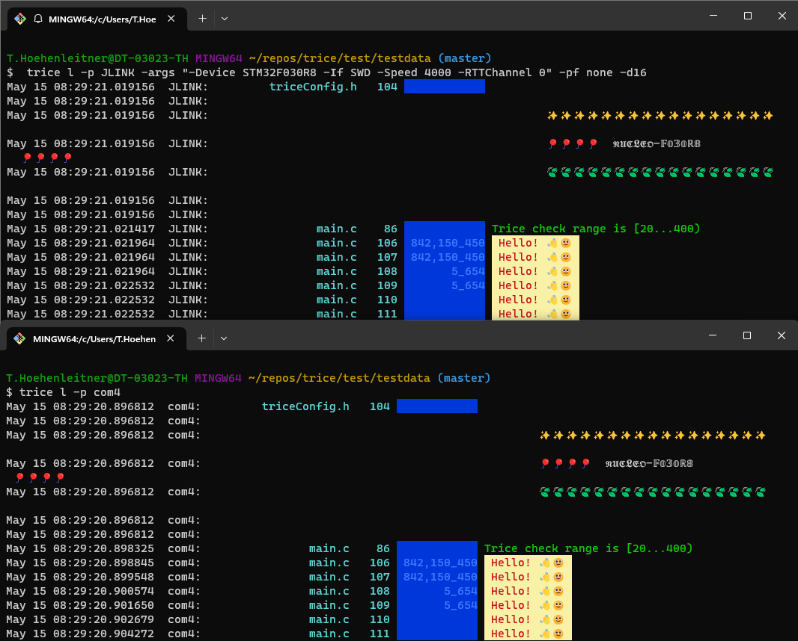

# Changelog


## <a id='v1.2.1-changes'></a>v1.2.1 Changes (2026-04-11)

### <a id='v1.2.1-overview'></a>v1.2.1 Overview

* Patch release with no intentional breaking changes and no new user-facing feature set compared to `v1.2.0`.
* Target-side string elimination robustness improved for compilers without LTO:
  * zero-argument `trice`/`Trice`/`TRice` paths no longer keep format strings alive unnecessarily
  * `triceS`/`TriceS`/`TRiceS` now discard format strings before code generation while keeping runtime-string handling compact
  * Assert message strings are likewise removed earlier from the generated path
* These target-side fixes were added in response to user reports around compiler optimization behavior:
  * [#618](https://github.com/rokath/trice/issues/618)
  * [#619](https://github.com/rokath/trice/issues/619)
  * [#620](https://github.com/rokath/trice/issues/620)
* Test coverage and regression protection were expanded substantially:
  * focused coverage increases across `cmd`, `receiver`, `translator`, `link`, `com`, `keybcmd` and `id`
  * new compiler-artifact regression tests now verify that unwanted format/message strings are not retained in representative object code
  * file watcher logic in `internal/id` was refactored for deterministic tests and broader package coverage
* Build and repository scripts were hardened:
  * `buildTriceTool.sh` no longer silently overwrites an existing installed tool
  * explicit target-file builds were added for test workflows so local installations stay untouched
  * `_clean-dsstore.sh` gained `--silent` support while preserving expected status behavior
  * repository formatting and shell-format workflows were reworked and aligned
  * manual maintenance now includes a best-effort VS Code TOC/PDF refresh wrapper with non-fatal fallback behavior
* CI and documentation polish:
  * link-check configuration was tuned further for flaky external sites
  * badge ordering and README presentation were cleaned up
  * changelog, workflow notes, and repository guidance were clarified and normalized
  * release assets were split more clearly into tool archives, target sources, and the generated user manual PDF
* Example and header housekeeping:
  * SPDX/file-header normalization was extended across Trice-owned example files
  * a link-temp-file panic in `internal/id`/`link` cleanup code was fixed

### <a id='v1.2.1-git-log'></a>v1.2.1 Git Log

Used git range: v1.2.0..v1.2.1

```txt
* 4fee5729 2026-04-11 docs(release): prepare assets and manual workflow
* 046ca826 2026-04-11 docs(changelog): prepare v1.2.1 release notes
* 47b7fb18 2026-04-10 fix(trice): elide assert message strings before codegen
* 1098adf4 2026-04-10 docs(link-check): stabilize llvm link guidance
* 616762e3 2026-04-10 fix(trice): preserve triceS string elision with compact helpers
* a2729578 2026-04-09 Badges formatted differently
* 42c0677b 2026-04-09 empty lines added for better formatting
* be3263db 2026-04-09 docs(readme): regroup and streamline project badges
* 9e5c845d 2026-04-09 fix(trice): drop zero-arg format strings before codegen
* 71d508a9 2026-04-09 style(test): align scripted translator decoder fields
* 55dfd764 2026-04-09 test(coverage): expand translator and receiver coverage
* 1960b46b 2026-04-09 docs: move local coverage examples into temp log
* a5db0752 2026-04-09 test(id): keep deterministic insert repro disabled
* 9ae74031 2026-04-09 test(id): refactor file watcher for deterministic tests
* ccbf7055 2026-04-09 test(id): cover alias, path, and range helpers
* 5570b42c 2026-04-09 test(id): expand generator and helper coverage
* c1d8073c 2026-04-09 fix(id): avoid panic when closing link temp file
* b3decc6e 2026-04-09 docs: refine repository title
* 3f095de1 2026-04-09 test(go): extend coverage in non-id packages
* 8ab9b512 2026-04-08 ci(link-check): exclude flaky external docs links
* 8e7b6575 2026-04-08 docs: refine commit guidance and reorder badges
* 70305904 2026-04-08 feat(scripts): isolate trice tool builds from local installs
* 0b6bd7a4 2026-04-08 test(coverage): expand low-coverage package coverage
* 39d7ecbb 2026-04-07 feat(scripts): protect existing trice install in build helper
* d6353917 2026-04-07 chore(scripts): extend repository formatting workflow
* 37eeff3f 2026-04-07 feat(scripts): add silent mode to dsstore cleanup
* 586e4808 2026-04-07 chore(demoLI): refresh recorded line mappings
* 82c62c2e 2026-04-07 chore(examples): normalize SPDX headers and file comments
* 7f7402fe 2026-04-08 wip (#614)
* ec9f8262 2026-04-07 ci(scripts): fix renamed formatter references
* f5d00da2 2026-04-07 test(scripts): disable tracked-worktree guard for now
* 29fb8626 2026-04-07 wip (#613)
* e0ec5cd9 2026-04-07 test(scripts): keep testAll read-only
* 9f6d6fb3 2026-04-07 refactor(scripts): rename formatter entrypoints
* 055472db 2026-04-07 style(go): apply formatting cleanups
* 0b7786d4 2026-04-07 ci(clang-format): update actions and disable go cache
* f13996b6 2026-04-07 test(receiver): focus parser helper coverage
* 8ae7d971 2026-04-07 test(keybcmd): cover loopAction behaviors
* 8b569355 2026-04-07 test(decoder): refresh registry and helper coverage
* 59218ecc 2026-04-07 test(com): simplify serial port tests
* 7a9ea355 2026-04-07 test(internal): add missing comments in test helpers
* 044160e5 2026-04-07 test(pkg): add missing test comments and SPDX headers
* 60771f99 2026-04-07 test(cmd): add missing comments in test files
* b1eb026f 2026-04-07 test(link): cover rtt default args
* 71cd352f 2026-04-07 Removed empty lined between badges
* ba5d3761 2026-04-07 wip (#612)
* ca28acce 2026-04-07 fix(scripts): keep shell formatter changes and diff log
* 1b3578d3 2026-04-07 style(scripts): add shfmt workflow and shell formatter
* 6fa0afcd 2026-04-07 fix(scripts): avoid shellcheck SC2155 in build setup
* b5fb8974 2026-04-07 docs: remove broken temp artifact link
* 7fadb340 2026-04-07 docs(readme): add workflow badges
* e50a1b36 2026-04-07 docs: update site theme and page metadata
* eadfdb01 2026-04-07 style: unify SPDX and file header comments
* bb19ef54 2026-04-07 docs(agents): add SPDX and truncated-input rules
* 38e87c63 2026-04-07 test(scripts): avoid global go install in coverage step
* 9ab3af4d 2026-04-07 test(scripts): build trice into temp bin for testAll
* c107262d 2026-04-07 Normalize repository links in documentation
* 78081c20 2026-04-07 Restore executable bits for shell scripts
* e2ded074 2026-04-07 Reorganize scripts and update build flows
* 3b6485c7 2026-04-07 fix(testAll): keep shared trice json defaults in repo root
* 87b28bdd 2026-04-07 simplify testAll runner summary
* 91d87144 2026-04-07 stabilize lychee checks on Windows
* d0e52598 2026-04-07 skip listener tests on Windows by default
* 5057bc59 2026-04-07 refactor testAll step scripts
* c536ddc7 2026-04-07 fix(testAll): align PC target tests with repo JSON files
* a09c57de 2026-04-07 fix(clang): stop auto-injecting gcc toolchain on darwin
* aca457c2 2026-04-07 chmod(testAll): make step scripts directly executable
* 12a6d97f 2026-04-07 wip: record local demoLI line updates
* 3b245814 2026-04-06 wip: update agent collaboration rules
* 967e28ae 2026-04-06 wip: add insert regression test for assert aliases
* 0e3ce635 2026-04-06 wip: refine clang cross environment detection
* 0bbd2046 2026-04-06 wip: split testAll into step scripts
* 0518b0f4 2026-04-06 Use repo-local Go cache for test workflows
* 6c373f84 2026-04-06 Clarify commit splitting in AGENTS
* 52b37587 2026-04-06 Keep testAll artifacts out of tracked demo files
* 62693c0a 2026-04-06 chore: remove tracked log files
* 42efc296 2026-04-06 test: standardize assertions on testify
* c4f7a824 2026-04-06 docs: clarify status, security policy, and agent rules
* d1f6ed38 2026-04-06 docs: refine README presentation and links
* a3f9203d 2026-04-06 docs: refine github pages wording
* ab7a6b9f 2026-04-06 docs: update github pages wording
* 5382ce43 2026-04-06 docs: update changelog markdown links
* 9857dbe2 2026-04-06 docs: link changelog issue references
* 902ebf8e 2026-04-06 docs: update changelog details
* 4d4f5183 2026-04-06 docs: enrich changelog overviews from legacy notes
* 1398f9a4 2026-04-06 docs: fix garbled changelog entries
* b8b86b8c 2026-04-06 docs: add release dates to changelog headings
* 1e63a6a4 2026-04-06 docs: reorder changelog by newest releases first
* 4ba7a5f6 2026-04-06 fix: improve git log range resolution
```


## <a id='v1.2.0-changes'></a>v1.2.0 Changes (2026-03-26)

### <a id='v1.2.0-overview'></a>v1.2.0 Overview

* New CLI support for target timestamp delta columns, including width handling, explicit disable semantics and documentation updates (Issue [#611](https://github.com/rokath/trice/issues/611) solved)
* Compile as C++ now possible (Issue [#610](https://github.com/rokath/trice/issues/610) solved with accepted PR [#609](https://github.com/rokath/trice/pull/609))
* Support for compilers without 64-bit integers (Issue [#607](https://github.com/rokath/trice/issues/607) solved with accepted PR [#609](https://github.com/rokath/trice/pull/609))
* Support for architecture with 16-bit integers (Issue [#608](https://github.com/rokath/trice/issues/608) solved with accepted PR [#609](https://github.com/rokath/trice/pull/609))
* Decoder initialization was reworked around a shared registry and constructor path, reducing duplication across char, dump and trex decoders.
* Testing and maintainability were improved significantly:
  * broader coverage in `args`, `emitter`, `com`, `do`, `decoder`, `trexDecoder` and several package-level tests
  * source and package comments normalized and expanded
  * SPDX headers and include-block formatting cleaned up across the code base
* Target-side and formatting robustness were improved:
  * deferred transfer path cleanup
  * variadic formatting fix in `msg` tests
  * clearer debug-buffer rendering in `trexDecoder`
* Repository and CI polish:
  * PR template added
  * generated help links refreshed
  * markdown lint fixes
  * lychee link check tuned to ignore a flaky `circuitcellar.com` response
This release is primarily a quality and maintainability release. No intentional breaking CLI or target API changes are documented here.
* triceS chapter extended
* Binary data example for Trices without timestamps added
* Bump super-linter/super-linter from 8.3.0 to 8.3.1 in /.github/workflows ([#605](https://github.com/rokath/trice/pull/605))
* Reasons added for "Not applicable for a large legacy code basis."

### <a id='v1.2.0-git-log'></a>v1.2.0 Git Log

Used git range: v1.1.1..v1.2.0

```txt
* c831846ce 2026-02-09 triceS chapter extended
* 7182f4eea 2026-02-09 Binary data example for Trices without timestamps added
* 0e5dcac21 2026-02-10 Bump super-linter/super-linter from 8.3.0 to 8.3.1 in /.github/workflows (#605)
* 9f8eb54b9 2026-02-10 Reasons added for "Not applicable for a large legacy code basis."
* afce26f24 2026-02-10 Merge remote-tracking branch 'origin/main'
* 176b47c44 2026-02-11 README.md slightly improved
* 75933887c 2026-02-13 ReflowComments type adapted to newer versions
* cc1256723 2026-02-13 clion test project added for code review
* 2b539664d 2026-02-13 all txt file forced to have \n as line separator
* bdc044f17 2026-02-15 Remove workspace.xml from version control
* e5de93c0a 2026-02-16 Clion Inspection Hints incorporated into C Src Code
* 7fc664513 2026-02-16 Names ...LinebyLine into ...LineByLine
* 44a35d9f7 2026-02-16 no changes
* f89624107 2026-02-16 ringB_de_multi_nopf_ua excluded from tests
* 2752bea5e 2026-02-16 .idea/workspace.xml now git ignored
* 4372fb6f8 2026-02-16 comment typos corrected
* 18f5fd921 2026-02-16 Trice compare sheet added to Readme
* c86420f7c 2026-02-16 small HTML syntax correction
* 51e1d128a 2026-02-16 clion inspections settings adapted
* 5698f4673 2026-02-16 Trice Compare Added
* 8c0a338b1 2026-02-16 small code cleanup
* a9828fbee 2026-02-17 Smaller typos corrected in TriceUsermanual.md
* dec6598e6 2026-02-17 first shot of a AI reworked UM (experimental)
* ef5a68f70 2026-02-17 code cleaning
* eb8875363 2026-02-17 Merge remote-tracking branch 'origin/main'
* 0aa0cc14a 2026-02-18 Global \n as line separator.
* fefcf74c8 2026-02-19 dead code removed
* 831405b9e 2026-02-19 code more robust
* 9d55c020b 2026-02-19 codex adaptions accepted.
* 8c0394ba6 2026-03-11 Add TriceTransfer call for deferred mode
* b07729865 2026-03-13 Merge branch 'main' into codexRefactoring
* 46f94c9b3 2026-03-19 Compile without (u)int64 and with 16-bit (u)int, solving rokath/trice#607 and rokath/trice#608 (#609)
* b29d0e8da 2026-03-20 feat(cli): add target timestamp delta columns
* db4c87b79 2026-03-23 test(docs): generate and verify help-all output
* 0017f2a42 2026-03-23 docs: link manuals to generated CLI help
* e6c4344bf 2026-02-19 p.Read more robust now
* a1aa91831 2026-02-19 tests splitted
* 0bbe52295 2026-02-19 tests improved with serial port dummy
* 81b7cc002 2026-02-19 code more robust and comments improved
* 3dda3aaf9 2026-02-20 docs: add PR template and refine contributing guide
* b30e146e4 2026-02-20 decoder: add shared registry and constructor infrastructure
* c2a431ae6 2026-02-20 decoder: migrate char/dump/trex packages to shared init path
* 370e1842d 2026-02-20 chore: normalize Go file headers to SPDX MIT
* a662e47a6 2026-02-21 args: add package docs and improve CLI comments
* 62686ea2c 2026-02-21 tests: harden args/msg coverage and remove brittle line-number checks
* 18f12875a 2026-02-21 tests(args): increase help and subcommand coverage
* 514a91433 2026-02-21 tests(args): increase handler branch coverage to 88%
* 90da07f13 2026-02-21 docs(pkg): add doc.go files and clean package comments
* dc9e54c58 2026-02-21 tests(pkg): expand ant/cipher/msg/tst coverage
* a42389398 2026-02-21 chore(src): normalize SPDX headers and include-block spacing
* 40e66f5bc 2026-02-21 docs(src): refine doxygen API docs and remove duplicate impl comments
* 413f55508 2026-02-21 test(decoders): improve coverage and tighten decoder comments
* f1d47ce4b 2026-02-21 test(trexDecoder): cover read and sprint error/resync branches
* 29661f35c 2026-02-21 refactor(trexDecoder): extract formatting helpers and raise coverage
* cd745f420 2026-02-21 refactor(trexDecoder): reduce duplication and expand branch coverage
* 3fd16b658 2026-02-21 refactor(trexDecoder): use tagged switch in removeZeroHiByte
* 6630a9f69 2026-02-21 test(trexDecoder): cover doubled-id and framed cleanup paths
* 98f78d9a4 2026-02-21 test(trexDecoder): cover password-enabled decrypt stage
* ed419ed22 2026-02-21 refactor(trexDecoder): print debug buffers as strings
* 97a83ff70 2026-02-21 test(trexDecoder): adapt debug assertions to string buffer output
* b734ae720 2026-02-21 test(trexDecoder): add none-framing edge-case coverage
* d70191319 2026-02-21 refactor(trexDecoder): stringify removeZeroHiByte debug bytes
* 7ff365ed9 2026-02-21 test(com): cover open/close verbose and list-error paths
* ac2c2df36 2026-02-21 docs(com): clarify package and interface comments
* 6896d7cd5 2026-02-21 chore(decoder): remove unused decoder testdata binary
* 2f642de03 2026-02-21 test(do): improve docs and add tcpWriter coverage
* 5638a6a28 2026-02-22 docs(emitter): add package doc and improve code comments
* 8d9925b57 2026-02-22 refactor(emitter): simplify banOrPickFilter with slices.Contains
* e1ccdeab9 2026-02-22 test(emitter): increase coverage across filters, RPC paths, and helpers
* f25933095 2026-03-25 Merge branch 'codexRefactoring'
* 6c1082cb1 2026-03-25 Fix variadic formatting in msg whitebox test
* 85d5f72d7 2026-03-25 Merge branch 'main' into tsdelta
* 16c0d931e 2026-03-25 Snapshot current worktree state
* 7a37648dc 2026-03-25 Merge branch 'main' into tsdelta
* 1b61ea548 2026-03-25 Adjust target delta column spacing
* 4a4c4650f 2026-03-26 test(translator): fix ts0delta auto-width expectations
* 380e11ab7 2026-03-26 docs: fix generated help links
* 2494f1b58 2026-03-26 Merge branch 'codexRefactoring'
* 367be8491 2026-03-26 Merge branch 'main' into tsdelta
* 2719b9188 2026-03-26 Keep uppercase timestamp tags in width calculation
* 3be7aea90 2026-03-26 Ignore local Go build cache
* 5f6193bef 2026-03-26 Extend ANSI time tag aliases
* 345b6447e 2026-03-26 Treat explicit empty tsdelta flags as disabled
* 4aca9335d 2026-03-26 Document tsdelta disable semantics and examples
* a4254eb28 2026-03-26 Make ant verbose exclude test path-portable
* 726a9dfd6 2026-03-26 docs: fix markdown lint issues
* 502faf29d 2026-03-26 ci: exclude flaky circuitcellar link from lychee
* 8329dc5e2 2026-03-26 docs: update changelog for v1.1.1 and v1.2.0
```

## <a id='v1.1.1-changes'></a>v1.1.1 Changes (2026-01-26)

### <a id='v1.1.1-overview'></a>v1.1.1 Overview

* Maintenance release with no intentional breaking changes.
* Target-side warning cleanup and portability improvements:
  * pointer type warnings/errors fixed in target code
  * CI setup extended for `arm-none-eabi-gcc`
* Documentation and release artifact improvements:
  * Trice User Manual improved and PDF re-generated
  * README links corrected and relative links replaced where needed to keep generated PDF links valid
* CI and repository maintenance:
  * CodeQL workflow refreshed and extended
  * `testAll.sh` hardened
  * smaller test and script corrections
* Update README.md
* Improvements to Trice User Manual. Fixes [#595](https://github.com/rokath/trice/issues/595) ([#598](https://github.com/rokath/trice/pull/598))
* Fix pointer type warnings/errors. Fixes [#594](https://github.com/rokath/trice/issues/594) ([#597](https://github.com/rokath/trice/pull/597))
* tests corrected

### <a id='v1.1.1-git-log'></a>v1.1.1 Git Log

Used git range: v1.1.0..v1.1.1

```txt
* 536c7b125 2025-12-22 Update README.md
* 8eee86e24 2026-01-21 Improvements to Trice User Manual. Fixes rokath/trice#595 (#598)
* 7ad703999 2026-01-21 Fix pointer type warnings/errors. Fixes rokath/trice#594 (#597)
* 4848d6a1f 2026-01-21 tests corrected
* d62466777 2026-01-22 minor adaptions
* 195ccfb04 2026-01-22 Relative links replaced with absolute links, to keep them valid also in the generated TriceUserManusl.pdf
* 0f9c509cb 2026-01-22 script correction
* 256e6a9ba 2026-01-22 case in links corrected
* 1c1337e86 2026-01-22 testAll.sh script hardened
* f77c56105 2026-01-22 2 links corrected
* 3587e3dc5 2026-01-22 codeql.yml updated: use v4 and manual builds
* b8316ade0 2026-01-22 arm-none-eabi-gcc CI setup added
* 930078e8b 2026-01-22 job name analyze-cpp changed to analyze
* 3bba2a358 2026-01-26 codeQL script extended to fight security issue message
* 17cb59c81 2026-01-26 temporarily remove CodeQL workflow to reset configuration
* 2839f32c3 2026-01-26 re-add CodeQL workflow after reset
* b99f5ea39 2026-01-26 codeQL status badge added
* f4e4022e4 2026-01-26 user manual PDF re-generated
```

## <a id='v1.1.0-changes'></a>v1.1.0 Changes (2025-12-19)

### <a id='v1.1.0-overview'></a>v1.1.0 Overview

* Thanks to some contributions
  * Trice now supports aliases. That means, you can use legacy user code with the Trice technology without changing it or the adaptions are marginal.
  * We also can have additional tags "user labels" without changing the Trice tool source code and the need to re-build it.
  * When filtering Trices in the target with enabled cycle counter in target code, the Trice tool complains about cycle errors because of the missing Trices. Those false positive error messages you now can suppress.
  * Some users want to have the 32-bit target time stamps as a epoch second counter. The Trice tool can now display the epoch seconds as human readable time. 
  * Some traget devices use UDP for Trice message transfer. Trice can that handle now too.
* No breaking changes!
* New CLI switches / switches extensions:
  * `-exclude`
  * `-ulabel`
  * `-noCycleCheck` Add flag to disable CYCLE_ERROR in log
  * `-ts32 epoch` option added
  * `-alias`
  * `trice version` now with git hash during compile time and `-verbose` gives list of local changed files
  * `-port` supports now also IPv4 UDP receiver
* Issue fixing:
  * [#526](https://github.com/rokath/trice/issues/526)
  * [#529](https://github.com/rokath/trice/issues/529)
  * [#536](https://github.com/rokath/trice/issues/536)
  * [#538](https://github.com/rokath/trice/issues/538)
  * [#539](https://github.com/rokath/trice/issues/539)
  * [#553](https://github.com/rokath/trice/issues/553)
* Improved Testing
  * Global vars saved and restored
  * Inhibit system sleep during test execution
* Slightly restructured, enhanced and reworked TriceUserManual
  * Chapter *Future Development* contains now specification draft for structured logging and log level logging 
* `trice version -verbose` now with list of local changed files and git hash during compile time
* goreleaser now with linux arm 6/7 build to run `trice log` on embedded Linux platforms
* Github Actions reworked including clang-format and bash format.
* Github pages enabled
* Link Check added to avoid broken links
* Trice user manual enhanched
* Go coverage tests updated
* New Github Actions
  * clang-format check
  * YAML Linting
  * Markdown Linting
  * Link checks
* Additional Trice Assert macros 
* triceSingleBufferStartWritePosition now a global variable for all 4 buffer variants
* all tests pass
* clang-format
* Update README.md

### <a id='v1.1.0-git-log'></a>v1.1.0 Git Log

Used git range: v1.0.0..v1.1.0

```txt
* 0c4626590 2025-05-07 wip issue 526
* 4f4e916ef 2025-05-09 wip, all tests ok
* b73577ead 2025-05-10 triceSingleBufferStartWritePosition now a global variable for all 4 buffer variants
* 1112a97ae 2025-05-16 all tests pass
* f032d5d11 2025-05-16 clang-format
* 362e47c0b 2025-05-17 Update README.md
* 6737da72a 2025-05-21 Update TriceUserManual.md
* c0419731b 2025-05-15 Add an IPv4 UDP receiver and introduce the '-exclude' flag to omit specified sources from scanning.
* 5d211019e 2025-05-28 pr 529 added, ChatGPT Trice compare added
* 5fd220fbb 2025-05-28 link adapted
* 79aa354cd 2025-05-28 minor edits
* 3316fc2b9 2025-05-28 Merge branch 'issue526shadow'
* a9c39f46f 2025-05-28 tests ok
* f9180b17b 2025-05-30 small correction
* 395b5ed3b 2025-05-22 Add support for dynamic trice and triceS macro aliases
* b02c6492a 2025-05-29 Refactor alias handling logic, fixing custom macro handling where the format string isn't the first arg after Trice ID.
* 63355ee3a 2025-06-01 Refine format specifier checks to exclude alias macros, ensuring reliable evaluation for built-in trice macros only.
* 50b5e4b6e 2025-06-01 args trim from PR #533 deactivated
* 4791e43c8 2025-06-05 testAll.sh checks first for tool existence and has a (default) quick mode now. Also clang translation is included partially.
* 5caa90a17 2025-06-05 Update README.md
* 7f9413b09 2025-06-06 all tests enabled
* 979690b2b 2025-06-06 Chapter CD-card writing added
* 4648aeeb4 2025-06-07 Update TriceUserManual.md
* bd299fe99 2025-06-10 testAll.sh extended with context information
* 75c520601 2025-06-11 Structured Logging Specification Draft added.
* 9d4cca2b8 2025-06-11 minor edits
* 1cd509284 2025-06-11 Compact JSON example added.
* ddc21e496 2025-06-12 Update StructuredLoggingWithTrice.md
* ecce3f91d 2025-06-13 bracket test inserted to catch unwanted parser  behaviour changes
* 06c3aae9d 2025-06-13 Structured Logging Spec a bit improved
* f0f92c85c 2025-06-14 Typo corrected
* c74fac8cc 2025-06-14 Update StructuredLoggingWithTrice.md
* 18822b44d 2025-06-14 questions added
* ce5cfbfb3 2025-06-14 questions corrected
* cf5c7e847 2025-06-14 typo in questions corrected
* 36e37b2f9 2025-06-14 Update README.md
* 1ef58606c 2025-06-14 Wrong use of -ts switch now inhibits trice log to run
* 86c082d95 2025-06-15 Chapter "Questions" reworked
* 5fcc17e87 2025-06-16 -ts32 epoch tryout code
* b1a8ee6b6 2025-06-16 -ts32=epoch CLI switch added and documented (untested!)
* 0f42ac939 2025-06-03 Refactored matchTrice for better custom macro support, added resolveTriceAlias, and expanded tests for alias handling.
* 2e90daa69 2025-06-08 Omit the Alias field from serialization to minimize the til.json size
* a248cd0d5 2025-06-08 Updated G0B1_inst example to demonstrate the use of the Alias feature.
* e88c25f63 2025-06-16 Add Homebrew check and dynamic gcc-arm-embedded version setup in build_environment.sh
* 8f75007fa 2025-06-16 Fix missing closing parenthesis in exampleOfManualJSONencoding() in triceCheck.c
* 7b41a67e0 2025-06-16 Fix TestInsertWithBrackets by updating findClosingParentis to handle escaped quotes and parentheses in string literals.
* 8a4d019a4 2025-06-19 wip after merging pr #536
* 67934b223 2025-06-20 deactivated PATH extension for objcopy
* 3217fb348 2025-06-20 New -alias CLI switch chapter
* 0d13934fa 2025-06-20 minor code clean-up
* 95a48deff 2025-06-20 automatic error checks and early exit on errors
* f1fbc0b40 2025-06-20 update
* e8115933c 2025-06-20 Merge branch 'ts32epoch'
* 76f2adcb8 2025-06-21 Better support for '-ts32 epoch'
* a2cfb0e43 2025-06-21 Update StructuredLoggingWithTrice.md
* 6dd9a9568 2025-06-22 renamed
* dcd546d84 2025-06-22 text moved
* c22557894 2025-06-23 Update TriceUserManual.md
* e63610047 2025-06-23 not referenced anymore
* b89e57aed 2025-06-23 issue #539 fix
* a635dd021 2025-06-23 colon in comment added
* 468ac3741 2025-06-23 issue #538 fix
* 3420c8a19 2025-06-23 trouble shooting hints improved
* 3468d8f6d 2025-06-23 trouble shooting & changelog updated
* ab0cf1dc9 2025-06-24 Internal SAlias handling modified
* 6ed615e51 2025-06-25 testAll.sh full passes
* 56b936d77 2025-06-26 trice settings more centralized to avoid issues
* 04bb7484a 2025-06-26 trice is build automatically before executing tests
* 6daefe446 2025-06-26 error message more descriptive
* 5491c8f02 2025-06-26 alias insertion test extended with normal triceS
* 8f0b52783 2025-06-26 Better handling of aliases
* 7fcef8576 2025-06-26 TRICE_CLEAN included into evaluation
* 097815895 2025-06-27 Update README.md
* 049a67f87 2025-06-27 line "#define TRICE_CLEAN 0" removed
* d0ad42264 2025-06-27 -alias added to ./testAll.sh
* 28799243a 2025-06-27 Merge branch 'master' into devel
* 46c0a3351 2025-06-29 Structured Logging chapter extended
* ab7ab8c47 2025-06-29 Merge branch 'master' into devel
* 1240ca763 2025-06-30 -ts32 epoch doc improved
* 5c3064b62 2025-06-30 Merge branch 'master' into devel
* d227f2b65 2025-06-30 Changelog updated
* dd8fd6f12 2025-06-30 Add flag to disable CYCLE_ERROR in log
* 421b75aaf 2025-07-01 Change flag naming
* d735a5282 2025-07-01 experimental: user labels
* 22fbf2912 2025-07-01 wip aliases tests
* c7b8146c5 2025-07-01 Merge branch 'devel'
* b307a9578 2025-07-02 wip Structured Logging Draft
* 4647558d9 2025-07-02 Merge branch 'master' into devel
* 8bd3a3462 2025-07-02 Merge branch 'master' into newTagsIssue541.1
* e61c5caf5 2025-07-02 master merge commit
* d110c9ce1 2025-07-02 master merged
* 9385471b4 2025-07-02 Merge branch 'master' into devel
* 8c10b8894 2025-07-03 wip Structured Logging
* d11327e91 2025-07-03 Merge branch 'master' into devel
* f30c09864 2025-07-03 wip Structured Logging
* c276ae67d 2025-07-03 minor typo corrected
* 569b6766e 2025-07-03 comment added
* ba916083a 2025-07-03 missing switch -d16 added, time->Time to let tests pass
* f7f384309 2025-07-03 Test special_dblB_de_tcobs_ua fixed.
* 26b4407b4 2025-07-04 Test fixed
* 36cea2722 2025-07-04 wip alias test
* 09c30e7f7 2025-07-04 Merge branch 'master' into devel
* 85c2196a0 2025-07-04 Level Specific Configuration added
* a53d5c3dd 2025-07-04 comments added
* 3aae3a4ec 2025-07-04 Merge branch 'master' into devel
* 9603454f3 2025-07-04 CLI switch `-ulabel`example added.
* 0b06e8f76 2025-07-04 alias test added (incomplete)
* 17412b2c3 2025-07-04 Merge branch 'master' into devel
* 72854c821 2025-07-04 Typo fixed
* 49610015e 2025-07-04 Test fixed
* d045e6ff2 2025-07-04 fixed test renamed
* c84b69f2b 2025-07-05 renamed
* 9a67b7a9c 2025-07-05 minor edits
* c5ef1add8 2025-07-05 remamed
* dc02d9eea 2025-07-05 typo fixed
* 45747968a 2025-07-05 renaming fixed
* 81b891cbc 2025-07-05 syntax improved
* cb71772da 2025-07-06 Inhibit system sleep during test execution
* 0c4799309 2025-07-06 Merge remote-tracking branch 'origin/devel' into devel
* 40f18153c 2025-07-06 ./testAll.sh with CLI config switch
* 41d46c419 2025-07-06 typo
* 91ebd1300 2025-07-08 C_INCLUDE_PATH determination with which command
* 6bb105874 2025-07-08 darwin all tests pass
* 6dcc61bd8 2025-07-08 darwin path fixed again
* f627b2d0f 2025-07-08 trial
* 674cfad11 2025-07-08 linux ok
* 88e3eab2b 2025-07-08 Merge remote-tracking branch 'origin/devel' into devel
* 75b1e480e 2025-07-08 comment added
* 41cfd4f51 2025-07-01 Transferring trices one by one for TRICE_SINGLE_PACK_MODE in double buffer
* 4b44c0690 2025-07-08 comments added
* adc6ddbf1 2025-07-08 readability improved
* ad10f8469 2025-07-08 go static check hints followed
* b2ce95aaa 2025-07-08 comments added
* d03124280 2025-07-08 go lint fixes
* a7ae2e39f 2025-07-09 //nolint:staticcheck added
* 50010366d 2025-07-09 run_with_inhibit_windows deactivated
* eba35d4c6 2025-07-09 $MAKE_JOBS invented to tackle Windows blocking
* 5f99fe46e 2025-07-09 run_without_inhibit for eindows
* e2080fa53 2025-07-09 Date for done added
* c8510ea5c 2025-07-10 alias and alias assert CGO tests added
* dbaaeaa06 2025-07-10  -Wno-format-security added to allow all _test/aliasassert... tests
* d205c6658 2025-07-10 triceAssertTrue and triceAssertFalse tests added
* 49ce4499f 2025-07-10 Chapter Legacy User Code Trice Adaption added
* 3a396fc7f 2025-07-13 typo corrected
* 797d91a3f 2025-07-13 example G0B1 TRICE_OFF=1translation with and without IDs
* f607b7a29 2025-07-13 triceAssert now as empty macros in TRICE_OFF state
* febd9dc19 2025-07-13 Exclude custom macros for TRICE_OFF == 1 && TRICE_CLEAN == 0
* 4d88a3cfb 2025-07-13 typeX0 handler for counted strings added
* 7d8abc168 2025-07-13 user print test over typeX0 added
* 2a4b227dc 2025-07-13 file renamed
* 512412480 2025-07-13 countedString typeX0 handler ok
* 210b2436f 2025-07-21 typo in comment corrected
* 5e34294c4 2025-07-21 minor formatting
* b0984d4a8 2025-07-21 comments added
* 14be75d12 2025-07-21 comment improved
* d56756f9f 2025-07-21 Trice stream parsing info added
* 4a6b98a4e 2025-07-21 Save and restore global vars
* 04ce19455 2025-07-21 minor fix
* 08441eda1 2025-07-21 comment added
* e284a0efb 2025-07-21 renamed
* 6ad44427b 2025-07-23 added
* 0283a37f0 2025-07-24 Darwin check added
* 19190d409 2025-07-29 comment added
* e7c288342 2025-07-29 minor ++
* a53e76541 2025-08-30 Issue #553 fixed
* 28f1594d5 2025-08-30 Update TriceUserManual.md
* d406f1cc4 2025-10-16 Chapter 10 reworked
* e8f4cad06 2025-11-07 Update README with branch structure changes
* 3b214e776 2025-11-07 Update README.md
* d0e446a9b 2025-11-09 Comments corrected
* 677577686 2025-11-16 TRICE_OFF=1 translation for triceAssert fixed
* 4ef534ad9 2025-11-16 Comment added
* ea0f17586 2025-11-16 comments added and formatting
* 91284eac8 2025-11-16 typeX0 Trices chapter added
* 0d37831e1 2025-11-16 renamed to exclude temporary from tests
* 84af1cd0f 2025-11-16 generated results
* e7895afbe 2025-11-16 Global vars saved and restored
* 93fa69adf 2025-11-16 test adaptions
* 972c00e16 2025-11-17 Merge remote-tracking branch 'origin/main'
* ccfc8e27c 2025-11-17 Auto stash before merge of "main" and "origin/main"
* 755d4fcbc 2025-11-17 renamed
* 9b9a6f471 2025-11-17 Test TRICE_OFF=1 translation with and without IDs
* f434203b0 2025-11-17 typeX0Handler temporary roll back
* e0f156f69 2025-11-17 minor G01B example adaptions
* bf1285770 2025-11-17 trice tool compile time information extended
* ae1b9c2f4 2025-11-17 typo corrected
* cb7a188db 2025-11-17 parts from dev branch included
* f83cf04ee 2025-11-17 helper scripts added
* a84cc0dfc 2025-11-18 Add Scratch Pad section to user manual
* a9da49f04 2025-11-18 TestVersion disabled
* 80b2f5e3e 2025-11-18 TestVersion removed
* 720740cb6 2025-11-18 Function `SomeExampleTrices()` now in TRICE_OFF bracket
* 02e952419 2025-11-18 Chapter Future Development added
* d215075c1 2025-11-18 Fix typos and enhance clarity in TriceUserManual
* dee62a9b7 2025-11-18 Chapter "Working with the Git Repo" moved to the end
* eb7aa9586 2025-11-18 hint before headline adapted
* f2f417c56 2025-11-18 unneeded line removed
* 91eb24957 2025-11-19 minor adaption
* c709b4959 2025-11-19 comment corrected
* 61b63d495 2025-11-19 comments added
* ec5d4868a 2025-11-19 comments added / changed
* 02b709a3f 2025-11-19 A few (deactivated) tests added
* 7980361f7 2025-11-19 minor test adaption
* 025d0915b 2025-11-19 generated changes only
* 453975e16 2025-11-20 Bump golang.org/x/crypto from 0.35.0 to 0.45.0
* a6983eb0e 2025-11-20 random tests fixed, more robust now
* d462829e3 2025-11-20 fmt.Sprintf  -> fmt.Sprint correction
* 260cc2252 2025-11-20 "trice version -verbose" now with list of local changed files and git hash during compile time
* 0abe6255a 2025-11-20 Syntax improvements & file list more fine granular
* 1b2f3e031 2025-11-20 File name as comment added
* 0b6d1041a 2025-11-20 *.zip file handling corrected
* 395c85f24 2025-11-20 renamed for goreleaser config
* 51e971df9 2025-11-20 moved to deb branch User manual
* 5e88de2e3 2025-11-20 Now with linux arm 6/7 build and better selected files
* 37f09ccb1 2025-11-24 wip CHANGELOG.md
* c26ce5a5e 2025-11-25 Version information output cleanup.
* 9681d45d7 2025-11-25 colors enabled again
* 85cd09d6c 2025-11-25 comments adapted
* 02de3783c 2025-11-25 Trouble Shooting Hints enhanced
* edb7ccae1 2025-11-25 reformatted
* 0b63894f6 2025-11-25 Again "<a id="
* 121c1dba5 2025-11-26 issue #571 fix
* 24f666f51 2025-11-26 origin info added to `trice version`
* 3de3f4d6a 2025-11-26 Restructured Tests copied from deb branch. Some need further adaption.
* 9b54d008e 2025-11-26 executable flags set
* c3fdd6873 2025-11-26 Hit to use buildTriceTool.sh added
* fca6fd9b9 2025-11-26 \#572 fixed
* 1cc430cec 2025-11-27 All enabled tests in MacOS & Windows ok (Linux probably also)
* f7edcc518 2025-11-27 Merge remote-tracking branch 'origin/main'
* a2a3126ce 2025-11-27 Chapters clone & fork added
* 4f6cfbbd7 2025-11-27 newLineComposer function reformatted and commented
* 41bf189d7 2025-11-27 tests wip
* 3b5c8234f 2025-11-28 wip _ringB_protect_de_tcobs_ua
* f0c62f2f3 2025-11-28 test  ringB_protect_de_tcobs_ua/ active again
* c4ac7ab05 2025-11-28 wip tests
* 25fee4d4f 2025-11-28 renamed
* 5f648912c 2025-11-28 wip tests
* 5d7bef8b5 2025-11-29 all tests pass (Darwin)
* c8aaee85b 2025-11-29 wip tests refactoring
* 339284620 2025-11-29 wip tests
* 7412ad00c 2025-11-30 test excluded
* f74643e64 2025-11-30 param variation added
* 04773696e 2025-11-27 allowing sending override
* 117e65705 2025-12-01 __weak to TRICE_WEAK changed to be conform to different compilers.
* 00929c9b6 2025-11-28 fix: 576 - promote char* to const
* 2ecdfcca0 2025-12-01 Formatting for ID warning with tabs now
* 46184778d 2025-12-02 issue #567 solved. SEGGER_RTT settings now checked as well
* 94377a342 2025-12-02 typo fixed
* 70318bd48 2025-12-02 #578 issue adaptions
* 8a604d847 2025-12-03 legacy comment restored
* decb4612b 2025-12-03 renamed
* 8b36fe7d3 2025-12-03 comment adapted
* 3973a8d63 2025-12-03 formatting
* f8ace303d 2025-12-04 updated action-versions
* c0551f1df 2025-12-04 Builds better commented and explicit without darwin/386
* 43d0eefed 2025-12-04 renamed
* c07fed5db 2025-12-04 .github folder explanation chapter added
* 050018a0f 2025-12-05 comment added
* 89890ebc1 2025-12-05 Changed according ChatGPT recommendations
* dbac16f02 2025-12-05 shfmt applied
* b30808928 2025-12-05 Comments added, smaller adaptions according ChatGPT
* b53c6ecc4 2025-12-05 shfmt applied after adapting .editorconfig
* dbc376aa6 2025-12-05 superlinter updated
* ace650372 2025-12-05 updated according ChatGPT recommendation
* 3e41ef914 2025-12-05 Minimum enabled
* a844f849b 2025-12-05 ludeeus/action-shellcheck@v2 changed to ludeeus/action-shellcheck@latest
* d1d587814 2025-12-05 -> ludeeus/action-shellcheck@2.0.0
* 11968e4d6 2025-12-05 superlinter.yml changed to whitelist mode
* 0b466d0c2 2025-12-05 shell check hints incorporated
* 96d1009eb 2025-12-05 lint hints incorporated
* 9955ff22e 2025-12-05 no c build
* 2382907ef 2025-12-05 linted
* e67453793 2025-12-05 update
* 98a3f792a 2025-12-05 .github chapter extended
* 4af477852 2025-12-05 to check if goreleaser runs on the server
* baad4669c 2025-12-05 clang-format action added
* 1987b6b01 2025-12-06 clang-format.sh executed
* 52eba90b2 2025-12-07 clang-format applied
* 7116cde54 2025-12-07 clang-format.sh with check CLI switch
* 7bccb8a6c 2025-12-07 clang-filter Go code added
* b7ecdbd78 2025-12-07 wip clang-format-ignore
* b2b69792f 2025-12-07 missing lines added
* 9d68ec08f 2025-12-07 update with v1.1.0 information
* 13efa3b4c 2025-12-07 golreleaser CLI switch corrected
* cb28b3f1f 2025-12-07 first shot
* 62951d533 2025-12-08 TriceUserManual.md linted
* d689cecef 2025-12-08 redundant newline removed
* 3baf5336e 2025-12-08 TRICE_DEFERRED_AUXILIARY32 excluded until needed
* 0c97caeae 2025-12-08 small readme added for cmd/clang-format
* a6be62cd1 2025-12-08 markdown linted
* fed394fb0 2025-12-08 Chapter Trice Folder Maintenance added
* a35c70a44 2025-12-09 comment added
* 4378c4961 2025-12-09 Ignore legacy vendor folders from markdownlint
* 740284d0a 2025-12-09 markdown linted
* 82e04a4a3 2025-12-09 feat(trice): 582 - Only includes XTEA if it is enabled
* 37c1e9fbc 2025-12-10 Issue #584 solution incorporated
* f761fa60f 2025-12-10 Merge remote-tracking branch 'origin/main'
* e4a055696 2025-12-11 #579 fixed
* a3b17d9e7 2025-12-11 utf-8 idempotent tests added
* 8d9deb3d1 2025-12-11 fix to pass packet tests
* 757455b64 2025-12-11 missing global vars added to test function Setup(t)
* 139762985 2025-12-11 AI generated improvement for build_environment.sh
* 61268035d 2025-12-11 build_environment.sh again silent by default
* 4e2842e3e 2025-12-12 render GH pages
* a3ff63509 2025-12-12 wip GH pages
* fd64bfdcf 2025-12-12 GH action Pages workflow added
* 27ac0850f 2025-12-12 linted
* be4527203 2025-12-12 minor re-ordeing for GH pages rendering
* 4121bd4e7 2025-12-12 DEBUG for super linter enabled
* 4a57315ba 2025-12-12 </div> correction
* bd2337eb4 2025-12-12 super linter forced to look into project root
* e10f01e33 2025-12-12 anchor correction
* efa7be28c 2025-12-12 paths ./docs/... to docs/...
* 7c15915f2 2025-12-12 added MARKDOWN_CONFIG_FILE: .markdownlint.yaml
* a93de00f7 2025-12-12 legacy file deleted
* 737189054 2025-12-12 test
* 7942b411e 2025-12-13 Disable Jekyll build step in pages.yml
* e4c924c81 2025-12-13 Merge remote-tracking branch 'origin/rokath-patch-1'
* 476606b26 2025-12-13 test
* e8070c521 2025-12-13 GH Action link check added
* c2a17c412 2025-12-13 minor link syntax correction
* 45822b71e 2025-12-13 Links corrected, TOC syntax better GH Actions Chapter extended
* aa5d223b9 2025-12-13 Links corrected
* 65246b791 2025-12-14 toc tweak script added
* 0dbd137a6 2025-12-14 gh pages link enabled
* 4b9d0ae62 2025-12-14 Colons removed from headlines
* 032ffc1b9 2025-12-14 improved dumeng TOC patch
* 5b5493bb3 2025-12-14 feat: 581 - allow to implement different Asserts functions. implement some more assert utility functions (#590)
* 3415f43cd 2025-12-14 wrong triceAssertFail removed
* 2c7f4e090 2025-12-14 comment adapted.
* d6bf3ab13 2025-12-15 wip title
* c788d5785 2025-12-15 wip Trice User Manual
* 9e24daf7b 2025-12-16 wip pages & repo check
* 35e5f212c 2025-12-16 scan repo added
* df9864b3d 2025-12-16 `temp/` not as link - is does not exist on the server
* 960329907 2025-12-17 go coverage stuff added/updated
* 42400a4a9 2025-12-17 Create SECURITY.md for security policy (#593)
* d00afd617 2025-12-17 sp
* 7b327d03a 2025-12-18 Update CHANGELOG.md
* 808be65c2 2025-12-18 Update README.md
* f36adb3d9 2025-12-18 updated
* 6a440bc3a 2025-12-18 go test coverage added to testAll.sh
* e9b283bc0 2025-12-18 trice lib build ci workflow added
* 61e3bd36e 2025-12-19 trice lib build scripts hardened for CI
* 9e17252fd 2025-12-19 improved detect_arm_include_dir()
* c101f177f 2025-12-19 trice build & install steps added
* 3fc39014c 2025-12-19 Adaptions for clang
```

## <a id='v1.0.0-changes'></a>v1.0.0 Changes (2025-04-25)

### <a id='v1.0.0-overview'></a>v1.0.0 Overview

* Changes in this release are summarized by the git log below.

### <a id='v1.0.0-git-log'></a>v1.0.0 Git Log

Used git range: 0.74.0..v1.0.0

```txt
* ef6f30468 2025-04-25 Release 1.0
```

## <a id='v0.74.0-changes'></a>v0.74.0 Changes (2025-04-25)

### <a id='v0.74.0-overview'></a>v0.74.0 Overview

* Upper-Lower case adaptions in some comments.
* Update README.md
* Issue [#519](https://github.com/rokath/trice/issues/519) fix
* Update LICENSE.md

### <a id='v0.74.0-git-log'></a>v0.74.0 Git Log

Used git range: v0.73.1..0.74.0

```txt
* a6ca0372a 2025-01-31 Upper-Lower case adaptions in some comments.
* 663917560 2025-01-31 Merge remote-tracking branch 'origin/master'
* 4e156fae5 2025-02-10 Update README.md
* cb48e8581 2025-02-13 Issue #519 fix
* 182a28b63 2025-02-13 Merge remote-tracking branch 'origin/master'
* 80e9e87b7 2025-03-11 Update LICENSE.md
* 8d109dfdf 2025-03-14 Update TriceUserManual.md
* 23c198273 2025-03-26 display server info extended
* cf2c80667 2025-03-29 typo corrected
* 807b2be63 2025-04-13 Issue #523 fix
* 085218a2b 2025-04-13 Merge branch 'master' into devel
* 50c36e151 2025-04-14 Bump golang.org/x/crypto from 0.31.0 to 0.35.0
* e03031d81 2025-04-16 Merge pull request #524 from rokath/dependabot/go_modules/golang.org/x/crypto-0.35.0
* 29dde1dcd 2025-04-16 Merge branch 'master' into devel
* 47bb43b72 2025-04-25 more file extensions supported now
* 5ef0a23bf 2025-04-25 updated
```

## <a id='v0.73.1-changes'></a>v0.73.1 Changes (2025-01-25)

### <a id='v0.73.1-overview'></a>v0.73.1 Overview

* legacy debug log removed
* [#517](https://github.com/rokath/trice/issues/517) solved
* TriceUserManual extended
* Update trice.h
* 2 chapters added: library? and possible variadic macros issue
* v0.73.1 changes added

### <a id='v0.73.1-git-log'></a>v0.73.1 Git Log

Used git range: v0.73.0..v0.73.1

```txt
* d105a8da5 2025-01-20 Update trice.h
* f6aaddeb9 2025-01-20 2 chapters added: library? and possible variadic macros issue
* a1c216e48 2025-01-24 legacy debug log removed
* b44c17993 2025-01-24 Merge remote-tracking branch 'origin/devel' into devel
* a64df2e49 2025-01-24 v0.73.1 changes added
```

## <a id='v0.73.0-changes'></a>v0.73.0 Changes (2025-01-19)

### <a id='v0.73.0-overview'></a>v0.73.0 Overview

* RTT Log support for Linux and Darwin improved
* Trice User Manual extended
* Example improved
* empty lines added
* Chapters Protect, Diag and Acoid False-Positives added
* Update TriceUserManual.md
* Update ReadMe.md

### <a id='v0.73.0-git-log'></a>v0.73.0 Git Log

Used git range: v0.72.5..v0.73.0

```txt
* 9878294bd 2024-12-20 empty lines added
* 6a36774e0 2024-12-20 Chapters Protect, Diag and Acoid False-Positives added
* cd00e784e 2024-12-20 Update TriceUserManual.md
* a41a68164 2024-12-20 Update ReadMe.md
* 9bd2dfd43 2024-12-20 Merge branch 'master' into devel
* 100efb3c3 2024-12-20 2 chapters added
* a65202d8c 2024-12-20 Link repair
* 1b8621384 2024-12-20 Example added
* 48a1776e2 2024-12-21 Update TriceUserManual.md
* f52f29626 2024-12-21 Merge remote-tracking branch 'origin/devel' into devel
* e29c69fe2 2024-12-22 Update README.md
* 073af057a 2024-12-22 generated
* 82356e6df 2024-12-22 layout changed slightly
* a30c68476 2024-12-24 Update README.md
* a6f0956a5 2024-12-27 Merge branch 'devel'
* 506906d94 2024-12-29 CLI -liPathRelative bool replaced with -liPath string
* d8312a090 2024-12-30 Chapter "Trice location information file li.json" extended.
* 5318ddff0 2025-01-01 Merge branch 'master' into devel
* 7379ef414 2025-01-01 Comment adapted
* aec94373c 2025-01-01 ++caffeinate
* 839d0ea3f 2025-01-04 Linux setup added
* 60695a167 2025-01-04 CLI pars reordered
* 36ff00f44 2025-01-05 Merge remote-tracking branch 'origin/devel' into devel
* 41be494b6 2025-01-08 Verbose ID log extended and improved
* 6fd091de2 2025-01-08 Change to global demoTIL.json and demoLI.json
* dd5828f8e 2025-01-09 SeveraL Minor improvements
* c3e304e45 2025-01-09 - Scripts improved - Only one common trice-clean... and trice-insert... script - Trice cache warning added in case no cache folder exists and -cache switch is applied
* bb9f0d23c 2025-01-09 Update TriceUserManual.md
* b354653f8 2025-01-10 LI now shows only base name during trice log to keep lines shorter
* 1d0de0402 2025-01-10 Merge remote-tracking branch 'origin/devel' into devel
* 38f84f303 2025-01-10 typo corrected
* ffb2201a5 2025-01-10 -defaultStampSize for legacy upper case only TRICE messages changed to 0
* 0d8cf7c75 2025-01-10 minor adaptions for Windows
* e469901a8 2025-01-10 win setup updated
* 780168272 2025-01-10 example folder finetuning
* c282f65df 2025-01-10 wip SEGGER in Linux
* 73fa701c5 2025-01-10 Update TriceUserManual.md
* 45fd60225 2025-01-11 comments improved
* be72b93c5 2025-01-11 JLinkRTTLogger Issue chapter added
* fdeaeb916 2025-01-12 bg & fg wip
* f2dbf365a 2025-01-13 RTT script for Linux ok
* c3dbfd9c3 2025-01-13 wip RTT in Unix
* 6dc63dd1f 2025-01-13 examples finetuned
* 985de7c3e 2025-01-13 Chapter Add-On Hints added
* c27462995 2025-01-14 Update TriceUserManual.md
* 7b86ee492 2025-01-14 example scripts simplified
* c20e95d70 2025-01-14 RTT Support unified and improved,
* 5279680fa 2025-01-14 OpenCM3 example now part of user manual
* 75c4ec1c8 2025-01-14 example logs improved
* 443cfc7f6 2025-01-14 Merge branch 'master' into devel
* d55f0aad6 2025-01-14 Merge remote-tracking branch 'origin/devel' into devel
* 7c386c821 2025-01-14 comment added
* 33c4cd946 2025-01-15 RTTLog with tmux added (experimental)
* 427aaaa60 2025-01-17 Update TriceUserManual.md
* 7897918cd 2025-01-19 Merge remote-tracking branch 'origin/devel' into devel
* 4748c60dd 2025-01-19 Better RTT Log support for Darwin and Linux.
* 7f0854b17 2025-01-19 User manual PDF re-generated
* c4f28ec6c 2025-01-19 v0.73.0 changes incorporated
```

## <a id='v0.72.5-changes'></a>v0.72.5 Changes (2024-12-18)

### <a id='v0.72.5-overview'></a>v0.72.5 Overview

* All documents merged into [Trice User Manual](./docs/TriceUserManual.md)
* The `trice generate` now checks format soecifier count in Trices against their values count.
* Update TriceUserManual.md
* typo corrected
* special test for debugging added
* Hint added

### <a id='v0.72.5-git-log'></a>v0.72.5 Git Log

Used git range: v0.72.4..v0.72.5

```txt
* 355427e21 2024-12-12 Update TriceUserManual.md
* 3b23aec76 2024-12-13 typo corrected
* 4cc18f306 2024-12-17 special test for debugging added
* 7af720a27 2024-12-17 Hint added
* bcc184c4c 2024-12-17 Special test for debug added
* 27c42b484 2024-12-17 ConstruvrFullTriceInfo reworked and environment adapted
* 72db3de7f 2024-12-17 maintenance
* 367ea55b6 2024-12-17 comment added
* 914508308 2024-12-18 ./renewIDs_in_examples_and_test_folder.sh now usese relative paths does not delete history per default
* a7e3c986c 2024-12-18 wrong character deleted
* 61f8cfbf6 2024-12-18 stop on parse errors immediately
* 141c1cde7 2024-12-18 v0.72.5 changes incorporated
* bb838ad74 2024-12-18 Links corrected
```

## <a id='v0.72.4-changes'></a>v0.72.4 Changes (2024-12-12)

### <a id='v0.72.4-overview'></a>v0.72.4 Overview

* A new `trice generate` command added.
* A statistics switch `trice log -stat` added to display, how often each Trice message occurred. 
* Documentation extended and improved
  * `./examples folder`
  *  All documentation moved to TriceUserManual.md
  *  Previous documentation locations link into approriate places inside the TriceUserManual.md
* TOC improved
* image sizes adapted
* Markdown doc files formatting improved
* Link added

### <a id='v0.72.4-git-log'></a>v0.72.4 Git Log

Used git range: v0.72.3..v0.72.4

```txt
* f4b4c6ed8 2024-11-27 TOC improved
* c9027ee3e 2024-11-27 image sizes adapted
* f4057c5e9 2024-11-27 Markdown doc files formatting improved
* 63b3cba77 2024-11-27 Link added
* eb8ec7bad 2024-11-28 UM wip
* d329e003b 2024-11-28 wip doc
* 364a44cab 2024-11-28 UM wip until 4.9 done
* 800b0d409 2024-12-01 wip doc
* e681a2a7b 2024-12-01 moved/renamed
* a2356fdc1 2024-12-01 folder renamed/removed
* 7966ca7b8 2024-12-01 Links now direct into user manual
* d91133ced 2024-12-01 link typo fixed
* 39caef309 2024-12-01 contend moved to Trice User Manual
* 97b04cef3 2024-12-01 CLI switch renamed: spaceAfterOpeningBrace -> spaceInsideTriceBrace
* 0564a3749 2024-12-01 CLI long name now -spaceInsideParenthesis
* 4307c15d4 2024-12-02 wip until 7
* 915d592ce 2024-12-03 link repair
* c253b7d3e 2024-12-03 link redirection
* 1c30f5939 2024-12-03 Update README.md
* 1ba89570f 2024-12-04 devel merged into master
* de22b2bc7 2024-12-04 Update _config.yml
* 59f5a1800 2024-12-05 Update TriceUserManual.md
* d2ed07f49 2024-12-05 config speed examples added to user manual
* ac27fddef 2024-12-05 test
* 892348cac 2024-12-05 devel merged into master
* cfaf10e5a 2024-12-06 F030 examples reworked
* b8dc081b2 2024-12-06 clang-format adaptions
* 20f269c6d 2024-12-06 small correction
* b7c450e83 2024-12-07 statistics wip
* 5e0132b52 2024-12-07 "trice log -p com1 -stat" is working
* 656559988 2024-12-08 -stat wip
* 232b2db98 2024-12-08 -stat ok
* d7bae4943 2024-12-08 trice generate works (partially
* be61b9d5c 2024-12-09 CLI generate extended
* 1514f8dd7 2024-12-09 Show all colors now only with trice generate
* dbd7550a1 2024-12-09 wip generate
* 264ac98be 2024-12-09 wip generate -c
* a9984a688 2024-12-10 refactored
* 1eb30e194 2024-12-10 bugfix
* e53b705d5 2024-12-10 now ok
* 437565717 2024-12-10 comment removed
* 048679eb6 2024-12-10 generate added
* fd6693351 2024-12-10 C# generator base function ok
* 002a48935 2024-12-10 finetuning generate
* 07e6cdfdf 2024-12-11 Update README.md
* 3d4ac1f5d 2024-12-11 Update TriceUserManual.md
* 78fbd3a5d 2024-12-11 Unique names for function pointers
* cf402d36f 2024-12-11 generate ok
* bdc7f1f4c 2024-12-11 Bump golang.org/x/crypto from 0.17.0 to 0.31.0
* 9e0038a76 2024-12-12 RPC info added test info moved
* bfdfd9cdb 2024-12-12 Link repaired
* 35cd7d63e 2024-12-12 legacy comment removed
* 7964225e7 2024-12-12 triceF treated differently
* 300681f89 2024-12-12 Avoids panic on running out on IDs in non-random case
* 17f95d917 2024-12-12 Chapter Test Results added
* 3bab2a2ac 2024-12-12 Merge pull request #513 from rokath/dependabot/go_modules/golang.org/x/crypto-0.31.0
* 0017f7c32 2024-12-12 test results updated
* 0dd99828a 2024-12-12 Merge branch 'devel'
* 2f9eeb38f 2024-12-12 v0.72.4 info added
```

## <a id='v0.72.3-changes'></a>v0.72.3 Changes (2024-11-25)

### <a id='v0.72.3-overview'></a>v0.72.3 Overview

Minor bug fix release. `trice insert` CLI `-spacing` renamed into `spaceInsideParenthesis` and added t0 `trice clean`.
* empty lines added
* CLI switch -spaceAfterOpeningBrace added to `tice clean`
* exec mode added to scripts
* auto formatter changes

### <a id='v0.72.3-git-log'></a>v0.72.3 Git Log

Used git range: v0.72.2..v0.72.3

```txt
* 52386b0cd 2024-11-21 empty lines added
* 05eede217 2024-11-24 CLI switch -spaceAfterOpeningBrace added to `tice clean`
* e028a42b9 2024-11-24 Merge branch 'master' into devel
* f7fbfb108 2024-11-24 exec mode added to scripts
* 01b18c481 2024-11-24 auto formatter changes
* 1677111ba 2024-11-24 auto formatting reults
* 47a9404cb 2024-11-24 comment added
* a2738843a 2024-11-24 date command added
* 647aec832 2024-11-24 gcc selected
* 1564d0911 2024-11-24 partial "-Wmaybe-uninitialized" added
* acd8c7b34 2024-11-24 Merge branch 'master' into devel
* c6852b8f1 2024-11-24 partial "-Wmaybe-uninitialized" added
* 040759719 2024-11-25 v0.72.3 prepared
* 6cc0d795f 2024-11-25 CHANGELOG.md updated
```

## <a id='v0.72.2-changes'></a>v0.72.2 Changes (2024-11-21)

### <a id='v0.72.2-overview'></a>v0.72.2 Overview

Maintenance release, more build variants tests in L432 project, OpenOCD experiments
* In build.s args handling improved
* error messages improved
* Update README.md
* Update TriceVsPrintfSimilaritiesAndDifferences.md

### <a id='v0.72.2-git-log'></a>v0.72.2 Git Log

Used git range: v0.72.1..v0.72.2

```txt
* bc1d8a6e9 2024-11-06 In build.s args handling improved
* a14271cbc 2024-11-06 error messages improved
* 6b106ebbc 2024-11-08 Update README.md
* 29e5522b4 2024-11-10 Update TriceVsPrintfSimilaritiesAndDifferences.md
* 5ac9ec50e 2024-11-10 Update TriceColor.md
* 816490f66 2024-11-10 Update README.md
* 50dfce09d 2024-11-10 Merge branch 'master' into devel
* 6c47db08a 2024-11-10 obsolete code removed
* fa0536c4b 2024-11-11 Update FilesAndFolders.md
* e02f547ef 2024-11-11 Update TriceUserGuide.md
* 784e2da98 2024-11-11 TriceUserGuide.md updted
* 2be95fd60 2024-11-12 Build scripts reworked for G01B_inst example
* 74b026fd2 2024-11-12 TRICE_DEFERRED_OUTPUT and TRICE_DIRECT_OUTPUT switches added to diagnostic code
* b8f63c384 2024-11-12 G0B1_inst example SEGGER_RTT_Conf.h finetuned to needs
* 1024170a5 2024-11-12 Similar projects extended with postform
* 470aab1b0 2024-11-12 trice.c code extendedn with #if TRICE_DIRECT_OUTPUT == 1 and #if TRICE_DEFERRED_OUTPUT == 1
* ec77575eb 2024-11-12 wip build on several OS
* b16024d27 2024-11-12 Merge remote-tracking branch 'origin/master'
* 577641aca 2024-11-12 Merge branch 'master' into devel
* 4d3d68547 2024-11-13 devel merged into master
* 71884858a 2024-11-13 example folder renamed from ..._instr to ..._inst
* 3589a5584 2024-11-13 Now at top level a renew... sript for the example & test IDs
* b4afac118 2024-11-13 examples now with triceExamples.c to avoid repetition
* 0d685236d 2024-11-14 JLINK wait time replaced by try loop. The wait time was too long for macOs
* fb4f06d8a 2024-11-14 RTT handling improved
* b152a30b8 2024-11-14 Added info about Darwin
* 75bb0f5b2 2024-11-14 openocd trial
* ddbd40f4c 2024-11-14 wip openocd
* c77172be1 2024-11-14 RTT support with open-ocd for Darwin added
* dc1cea131 2024-11-14 openocd automation wip
* 427afb3a5 2024-11-14 openocd wip
* 715d076e0 2024-11-15 Update README.md
* eed77f1ef 2024-11-16 doc wip
* 1cae53ad3 2024-11-16 Update TriceOverRTT.md
* 50a4dc18a 2024-11-15 CYCLE changed to CYCLE_ERROR and reserved for the Trice tool exclusively
* 7d0caebf8 2024-11-17 Merge remote-tracking branch 'origin/devel' into devel
* 4d5f636e4 2024-11-17 triceCheck.c now without IDs checked in
* 2d46233d5 2024-11-17 minor Go lint action
* faba8336c 2024-11-19 Fixed some seldom config variants
* fb28cc789 2024-11-19 TriceLogConfiguration function added to examples
* 9940dbb69 2024-11-19 OpenOCD for ST-Link and J-Link added and tested
* 234dd2980 2024-11-19 CONFIGURATION switch added to L432 example
* 86dff423d 2024-11-19 workspace file added to L432 example
* 07c59a3f5 2024-11-19 compiler switch error fixed
* 5dcd029a8 2024-11-21 v0.72.2 Changes incorporated
* 588cb266d 2024-11-21 .goreleaser.yaml updated
```

## <a id='v0.72.1-changes'></a>v0.72.1 Changes (2024-11-06)

### <a id='v0.72.1-overview'></a>v0.72.1 Overview

* Issue [#509](https://github.com/rokath/trice/issues/509) fixed (better `TRICE_OFF` handling)
* Update ReadMe.md
* ignore MacOS specific files
* Option for MacOS added
* TRICE_OFF used to exclude additional Trice code

### <a id='v0.72.1-git-log'></a>v0.72.1 Git Log

Used git range: v0.72.0..v0.72.1

```txt
* fb734ff53 2024-11-01 Update ReadMe.md
* 010f8edb7 2024-11-04 ignore MacOS specific files
* f07d95711 2024-11-04 Option for MacOS added
* c250d2084 2024-11-04 TRICE_OFF used to exclude additional Trice code
* 75bffcfac 2024-11-04 CLI switch TRICE_OFF=1 added, MacOS support addded, gcc as default
* f298632b4 2024-11-04 Issue #509 fixed
* 241b73254 2024-11-04 testdata extended/updated
* a415d3bcb 2024-11-05 No more default TRICE_BUFFER, User needs to decide
* 43d53078b 2024-11-05 update
* 5f228e555 2024-11-05 Better TRICE_OFF handling (issue #509)
* 46c95093b 2024-11-05 Linker flags now all under $LFLAGS and warnings eliminated
* 58249ac9a 2024-11-06 v0.72.1 Changes added
```

## <a id='v0.72.0-changes'></a>v0.72.0 Changes (2024-10-31)

### <a id='v0.72.0-overview'></a>v0.72.0 Overview

* Trice cache folders now with correct permissions.
* Trice deferred mode for ring buffer now also supports multi pack mode.
* Multi pack mode now as default setting for deferred modes.
* Trice cache Issue chapter added
* Scripts adapted to better work with the Trice cache.
* Issue [#508](https://github.com/rokath/trice/issues/508) solved
* fileWatcher enabled again, Verbose Logging extended, 100ms sleep added before re-reading til.json & li.json

### <a id='v0.72.0-git-log'></a>v0.72.0 Git Log

Used git range: v0.71.0..v0.72.0

```txt
* 9b3099259 2024-10-17 Trice cache Issue chapter added
* 88cb164b2 2024-10-17 Scripts adapted to better work with the Trice cache.
* 7e2e034ae 2024-10-21 WIP #508
* 89d9a97ed 2024-10-21 Issue #508 solved
* d7704c933 2024-10-21 fileWatcher enabled again, Verbose Logging extended, 100ms sleep added before re-reading til.json & li.json
* bb0ac2f3d 2024-10-21 wip #306
* 76d9c8b30 2024-10-22 Update trexDecoder.go
* 6f2bd38c0 2024-10-22 goreleaser.yaml adapted
* 0a775eb58 2024-10-22 WIP on master
* 25137ccef 2024-10-22 Merge remote-tracking branch 'origin/devel' into devel
* 32bf83bfc 2024-10-22 The tests in folder "_test" now executable with `cd _test && go test ./... && cd -`
* bdc6e5fce 2024-10-22 master merged into devel
* 14d65fbce 2024-10-22 100ms Sleep moved from "fromFile" to "FileWatcher"
* 5d8214208 2024-10-22 CANGELOG.md updated with master branch changes.
* 44f2b31b4 2024-10-22 Optional CLI switch "-singleFraming" added.
* 933b33100 2024-10-22 test script added
* b7c52eb6e 2024-10-22 CLI switch "-singleFraming" deactivated in staticB_di_tcobs_rtt32 test
* 18f24827d 2024-10-22 #506 wip
* 732b36a42 2024-10-22 Merge remote-tracking branch 'origin/devel' into devel
* 10f7901e7 2024-10-22 macOS adaptions (wip)
* 90716d690 2024-10-22 wip ring buffer multi framing
* 453701884 2024-10-22 As function
* 12cdc6f03 2024-10-23 Cache MkdirAll permissions fixed
* 90219e45f 2024-10-24 wip #506
* 753d115f7 2024-10-25 Additional config error warnings added
* c520f76d4 2024-10-25 Variable renamed.
* bcb8786c9 2024-10-25 ring buffer multi pack tests added
* ad040436d 2024-10-25 updated
* 69ec730c6 2024-10-26 ring buffer multi pack mode debug wip
* bc41fc800 2024-10-29 Diagnostics data example refined
* bb34d508b 2024-10-31 Issue #506 done
* d13d18fd5 2024-10-31 Default for TRICE_RING_BUFFER_SIZE added.
* 6b491c094 2024-10-31 2 tests deactivated, needs debugging
* 74d0a6ad4 2024-10-31 double buffer code slightly refactored to avoid editor warnings
* 8062bf42e 2024-10-31 tmp buffer offset changed from 4 to TRICE_DATA_OFFSET/2
* 198c179e1 2024-10-31 TRICE_MULTI_PACK_MODE is now default config for deferred mode
* 8330b41fd 2024-10-31 MacOS adapted
* 46677957f 2024-10-31 more stressing settings
* 2289bd9dc 2024-10-31 TRICE_SINGLE_PACK_MODE set explicit
* c84b5daf4 2024-10-31 clang-format.sh run
* 515c1bf17 2024-10-31 adapted to _test
* eecfdd71a 2024-10-31 v0.72.0 changelog added
```

## <a id='v0.71.0-changes'></a>v0.71.0 Changes (2024-10-17)

### <a id='v0.71.0-overview'></a>v0.71.0 Overview

* A new CLI switch for `trice insert` is invented: `-IDRange`. See `trice help -insert` for details.
* CHANGELOG.md minor correction
* Doubled used ID test added
* array flag IDPolicy added (wip)
* master merged into IDPolicy

### <a id='v0.71.0-git-log'></a>v0.71.0 Git Log

Used git range: v0.70.0..v0.71.0

```txt
* c3893b55a 2024-10-10 CHANGELOG.md minor correction
* 62eacd081 2024-10-10 Doubled used ID test added
* a911c36cb 2024-10-10 array flag IDPolicy added (wip)
* d27083cbd 2024-10-10 Merge branch 'master' of https://github.com/rokath/trice
* a9a1b2014 2024-10-11 master merged into IDPolicy
* d5c3f84dc 2024-10-11 wip -IDRange, todo testing
* d687b92d9 2024-10-11 https://github.com/rokath/trice/issues/507 fixed
* 09c655a25 2024-10-11 Update id_setup_test.go
* 23e71ebf9 2024-10-11 Update cache_help_test.go
* f5311b099 2024-10-13 id package tests refactored
* 3694c0ea5 2024-10-13 obsolete files removed from id package tests
* 95c31262c 2024-10-13 obsolete code removed from id package tests
* 74760198e 2024-10-13 master merged into IDPolicy
* d4753f5cd 2024-10-13 all id test ok
* ef626e298 2024-10-13 id testing wip
* 566d4363b 2024-10-14 CLI switch -IDRange added, emitter "channels" renamed to "tags"
* 68c46c832 2024-10-15 minor adaptions
* 1775726fa 2024-10-16 cache path error corrected for linux/mac os
* 31d33f72d 2024-10-16 Path handling improved to work with linux, mac & windows.
* 53c7080ba 2024-10-16 IDRange code refactored.
* 84fc13627 2024-10-16 code clean-up
* ac0f0834b 2024-10-17 Windows drive letter issue for the tests fixed.
* 387bb6fdc 2024-10-17 rename
* 581bb4748 2024-10-17 renameBack
* e4dd17679 2024-10-17 rename
* 7a0e64c92 2024-10-17 renameBack
* 014ebdfcc 2024-10-17 v0.71.0 ChangeLog added
```

## <a id='v0.70.0-changes'></a>v0.70.0 Changes (2024-10-09)

### <a id='v0.70.0-overview'></a>v0.70.0 Overview

* Trice cache option added
* Trice commands `trice update` and `trice zero` removed
* Better handling of target MCU endianness - now mostly automatically detected (Special thanks to [Sazerac4](https://github.com/Sazerac4))
* TRICE_OFF switch without warnings: unused parameter
* Tests changed to hexadecimal stamps to see issues easier
* spacing CLI switch added to `trice insert`
* Target code test folder `test` renamed into `_test` to avoid vsCode slowdown. To execute these tests rename this folder temporary back and run `go test ./test/...`.
* comment extended
* Trice Cache Specification Draft added
* ./updateTestData.sh run result
* SpaceBetweenTriceOpeningBraceAndIDName removed

### <a id='v0.70.0-git-log'></a>v0.70.0 Git Log

Used git range: v0.69.0..v0.70.0

```txt
* 369e2088f 2024-09-18 comment extended
* 30cf050e7 2024-09-19 Trice Cache Specification Draft added
* f7691e36e 2024-09-19 ./updateTestData.sh run result
* 4880fb292 2024-09-20 SpaceBetweenTriceOpeningBraceAndIDName removed
* 66d032d32 2024-09-20 SpaceBetweenTriceOpeningBraceAndIDName code added
* 43c0d0ab5 2024-09-20 tests adapted for SpaceBetweenTriceOpeningBraceAndIDName=false
* 1f4ef31af 2024-09-20 spacing CLI switch added to `trice insert`
* 2252b09d9 2024-09-20 TRICE_TRANSFER_ORDER_IS_NOT_MCU_ENDIAN comment updated
* 6d2514136 2024-09-20 TRICE_HEADER_PUT renamed into TRICE_PUT_HEADER
* 0044f8f2f 2024-09-20 trice8m_1 experimental rewritten
* a8418a1da 2024-09-21 CHANGELOG updated
* 2f91e1d9e 2024-09-21 TRICE_HEADER_PUT removed
* 75104edc6 2024-09-21 comment adapted
* a6285b982 2024-09-21 comment corrected
* 9d2d3167f 2024-09-24 TRICE_TRANSFER_ORDER_IS_NOT_MCU_ENDIAN comment updated
* 8aa486e56 2024-09-24 TRICE_REVERSE switch added
* b312601bc 2024-09-24 Merge remote-tracking branch 'origin/endianness' into endianness
* 754c0c3d2 2024-09-24 Merge branch 'master' into endianness
* 8dff6d79f 2024-09-25 More usage of TRICE_PUT_AS_IS (wip)
* 4d2247413 2024-09-25 Explaining comment added
* 2f424d25f 2024-09-25 Chapter Target Macros added
* 487859b07 2024-09-25 "gopls": {"build.directoryFilters": added, but seems not to work
* 6a23710f7 2024-09-25 Tests changed to hexadecimal stamps to see issues easier
* 8ea539d02 2024-09-25 All Trice header with TRICE_PUT_AS_IS, when TRICE_REVERSE==1
* 9db0b8fcb 2024-09-25 clang-format.sh applied
* 820920bbe 2024-09-25 branch endianness merged
* 15987908e 2024-09-26 All TRICE_PUT macros replaced now with TRICE_PUT_AS_IS
* 3ba3ecc44 2024-09-27 code reordered to reduce compiler switches
* 646c29f02 2024-09-27 Code reordering (wip)
* a9f9e4256 2024-09-27 Code replaced
* 6e1ebd10e 2024-09-27 TRICE_TRANSFER_ORDER_IS_NOT_MCU_ENDIAN renamed to TRICE_TRANSFER_ORDER_IS_BIG_ENDIAN
* 37aed8a73 2024-09-27 Code reordering wip
* 20385f533 2024-09-28 merge
* a5fdc1c42 2024-09-28 typo correction
* 760279c66 2024-09-28 minor cleanup
* 3e6174309 2024-09-28 minor changes
* a2d765464 2024-09-28 code moved only
* 5344b4539 2024-09-28 file renaming
* 6aff69e4b 2024-09-28 big endian test for XTEA example added.
* 39308c602 2024-09-30 TRICE_OFF switch without warnings: unused parameter
* 811ed1df8 2024-09-30 endian dependent code now concentrated
* 0d022acef 2024-09-30 cache wip
* 2b35d503d 2024-10-01 trice cache wip
* b162702e3 2024-10-01 Small additional information
* 1394d8e7f 2024-10-01 id.Verbose temporary disabled
* 20a3a28e7 2024-10-01 check renamed to testRefreshIDs
* 2fbcd79ff 2024-10-01 msg.OnErrFv added
* 7fa560681 2024-10-01 trice cache implementation wip
* 4d99a7607 2024-10-01 trice cache seams to work
* 5b07e1558 2024-10-02 Update comment in trice.h
* 566b2a8b5 2024-10-02 Update trice.h
* a8e91da3f 2024-10-02 New CLI switch `-cache` for `trice i` and `trice c``
* 3a528a4d9 2024-10-02 Additional remark added.
* 750104871 2024-10-02 Hint "EXPERIMENTAL!" to `-cache` switch
* 7e2494bb9 2024-10-02 Bugfix in helpinfo.go: update params where shown in insert params.
* 25c760e3a 2024-10-02 minor changes
* 35fece939 2024-10-02 trice commands `update` and `zero` removed.
* 2cd13fdb2 2024-10-02 minor changes
* f7cffccf2 2024-10-03 Update TriceCacheSpec.md
* c5eb2a545 2024-10-03 Update insertIDs.go
* aa465ca57 2024-10-03 code refactored
* f4c10e19e 2024-10-03 first cache test ok
* a3898529a 2024-10-03 obsolete code removed
* 30f6f61bc 2024-10-03 cache tests wip
* 0b119c7fd 2024-10-04 Update cachedInsert.go
* 774e5aaa9 2024-10-04 missing comma added
* bbd38066a 2024-10-04 correction
* 6788972f8 2024-10-04 dead code (after removing command update) commented out
* 2ff9fa583 2024-10-06 Adds several resolutions around endianess -Add byte orders detection, remove default TRICE_MCU_IS_BIG_ENDIAN. User need to set it if not detected -Add Detection on <byteswap.h> libc include to use it -Remove full macros byteswap option, use always "TriceReverse" inline function (same effect) -Remove endianess configurations options -Add compilers buid-in when available to swap endianess (GCC and clang supported) -Add C23 endianess detection resolution
* 0859236e6 2024-10-07 cache tests wip
* 04cfbcaa6 2024-10-07 - Add missing control on user definition on HTOTS,HTOTL,HTOTS - Correction on error message - Format: find ./src  -name '*.c' -o  -name '*.h'| xargs clang-format-18 -style=file -i
* c2c53481d 2024-10-07 cache test overview table added
* 7abd9dfb2 2024-10-07 trice cache testing wip
* a6b36b8eb 2024-10-08 trice cache tests complete
* 377b7a1cc 2024-10-08 test folder renamed into _test
* e10f984f6 2024-10-08 rename info added
* b600c0397 2024-10-08 Update ReadMe.md rename info
* ddeb703df 2024-10-09 Merge pull request #505 from Sazerac4/feat/update/endian
* 40f928cb0 2024-10-09 comment added
* 087fffc3d 2024-10-09 cache switch added, renamed test to _test incorporated to examples
* 0242c1e3a 2024-10-09 Trice cache info added.
* e631ec27b 2024-10-09 comment added for big endian MCUs
* 85686181b 2024-10-09 v0.70.0 changelog added
```

## <a id='v0.69.0-changes'></a>v0.69.0 Changes (2024-09-18)

### <a id='v0.69.0-overview'></a>v0.69.0 Overview

* Big-endian MCUs should now be usable with the complete Trice macro set (automatic test added).
* Trice code auto-formatted with `clang-format.sh`. (Special thanks to @Sazerac)
* Update README.md
* formatting and comments changed slightly
* indentiation manually changed for readability
* TRICE_BUFFER_SIZE now with 4 additional scratch bytes

* Test results (`be_dblB_de_tcobs_ua` is the "big-endian" test using `TRICE_TRANSFER_ORDER_IS_NOT_MCU_ENDIAN == 1` setting and `trice log ...   -triceEndianness bigEndian`):

```bash
ms@DESKTOP-7POEGPB MINGW64 ~/repos/trice (master)
$ go clean -cache && time go test ./...
?       github.com/rokath/trice/internal/do     [no test files]
?       github.com/rokath/trice/internal/translator     [no test files]
?       github.com/rokath/trice/pkg/ant [no test files]
ok      github.com/rokath/trice/cmd/trice       1.456s
ok      github.com/rokath/trice/internal/args   0.380s
ok      github.com/rokath/trice/internal/charDecoder    0.296s
ok      github.com/rokath/trice/internal/com    16.145s
ok      github.com/rokath/trice/internal/decoder        0.216s [no tests to run]
ok      github.com/rokath/trice/internal/dumpDecoder    0.265s
ok      github.com/rokath/trice/internal/emitter        0.276s
ok      github.com/rokath/trice/internal/id     0.488s
ok      github.com/rokath/trice/internal/keybcmd        0.324s
ok      github.com/rokath/trice/internal/link   0.276s
ok      github.com/rokath/trice/internal/receiver       0.311s
ok      github.com/rokath/trice/internal/trexDecoder    0.454s
ok      github.com/rokath/trice/pkg/cipher      0.372s
ok      github.com/rokath/trice/pkg/endian      0.318s
ok      github.com/rokath/trice/pkg/msg 0.330s
ok      github.com/rokath/trice/pkg/tst 0.511s
ok      github.com/rokath/trice/test/be_dblB_de_tcobs_ua        181.798s
ok      github.com/rokath/trice/test/dblB_de_cobs_ua    181.500s
ok      github.com/rokath/trice/test/dblB_de_multi_cobs_ua      181.854s
ok      github.com/rokath/trice/test/dblB_de_multi_nopf_ua      181.942s
ok      github.com/rokath/trice/test/dblB_de_multi_tcobs_ua     181.803s
ok      github.com/rokath/trice/test/dblB_de_multi_xtea_cobs_ua 181.545s
ok      github.com/rokath/trice/test/dblB_de_multi_xtea_tcobs_ua        181.492s
ok      github.com/rokath/trice/test/dblB_de_nopf_ua    181.424s
ok      github.com/rokath/trice/test/dblB_de_tcobs_ua   181.532s
ok      github.com/rokath/trice/test/dblB_de_xtea_cobs_ua       181.414s
ok      github.com/rokath/trice/test/dblB_de_xtea_tcobs_ua      182.096s
ok      github.com/rokath/trice/test/dblB_di_nopf_rtt32__de_cobs_ua     369.640s
ok      github.com/rokath/trice/test/dblB_di_nopf_rtt32__de_multi_cobs_ua       368.721s
ok      github.com/rokath/trice/test/dblB_di_nopf_rtt32__de_multi_tcobs_ua      369.936s
ok      github.com/rokath/trice/test/dblB_di_nopf_rtt32__de_tcobs_ua    368.893s
ok      github.com/rokath/trice/test/dblB_di_nopf_rtt32__de_xtea_cobs_ua        369.048s
ok      github.com/rokath/trice/test/dblB_di_nopf_rtt8__de_cobs_ua      365.871s
ok      github.com/rokath/trice/test/dblB_di_nopf_rtt8__de_multi_cobs_ua        365.722s
ok      github.com/rokath/trice/test/dblB_di_nopf_rtt8__de_multi_tcobs_ua       365.961s
ok      github.com/rokath/trice/test/dblB_di_nopf_rtt8__de_tcobs_ua     365.561s
ok      github.com/rokath/trice/test/protect_dblB_de_tcobs_ua   0.529s
ok      github.com/rokath/trice/test/ringB_de_cobs_ua   183.393s
ok      github.com/rokath/trice/test/ringB_de_nopf_ua   183.600s
ok      github.com/rokath/trice/test/ringB_de_tcobs_ua  183.679s
ok      github.com/rokath/trice/test/ringB_de_xtea_cobs_ua      183.259s
ok      github.com/rokath/trice/test/ringB_de_xtea_tcobs_ua     183.558s
ok      github.com/rokath/trice/test/ringB_di_cobs_rtt32__de_tcobs_ua   365.939s
ok      github.com/rokath/trice/test/ringB_di_cobs_rtt8__de_tcobs_ua    366.267s
ok      github.com/rokath/trice/test/ringB_di_nopf_rtt32__de_tcobs_ua   365.590s
ok      github.com/rokath/trice/test/ringB_di_nopf_rtt32__de_xtea_cobs_ua       365.096s
ok      github.com/rokath/trice/test/ringB_di_nopf_rtt8__de_tcobs_ua    365.035s
ok      github.com/rokath/trice/test/ringB_di_tcobs_rtt32__de_tcobs_ua  365.350s
ok      github.com/rokath/trice/test/ringB_di_xtea_cobs_rtt32__de_xtea_cobs_ua  365.447s
ok      github.com/rokath/trice/test/ringB_protect_de_tcobs_ua  0.513s
ok      github.com/rokath/trice/test/stackB_di_nopf_aux32       183.045s
ok      github.com/rokath/trice/test/stackB_di_nopf_aux8        182.956s
ok      github.com/rokath/trice/test/stackB_di_nopf_rtt32       183.280s
ok      github.com/rokath/trice/test/stackB_di_nopf_rtt8        183.130s
ok      github.com/rokath/trice/test/stackB_di_xtea_cobs_rtt8   183.119s
ok      github.com/rokath/trice/test/staticB_di_nopf_aux32      181.814s
ok      github.com/rokath/trice/test/staticB_di_nopf_aux8       181.779s
ok      github.com/rokath/trice/test/staticB_di_nopf_rtt32      181.849s
ok      github.com/rokath/trice/test/staticB_di_nopf_rtt8       181.717s
ok      github.com/rokath/trice/test/staticB_di_tcobs_rtt32     181.645s
ok      github.com/rokath/trice/test/staticB_di_tcobs_rtt8      181.081s
ok      github.com/rokath/trice/test/staticB_di_xtea_cobs_rtt32 180.932s

real    16m1.486s
user    0m0.000s
sys     0m0.000s
```

### <a id='v0.69.0-git-log'></a>v0.69.0 Git Log

Used git range: v0.68.0..v0.69.0

```txt
* 5b4b40d85 2024-08-30 Update README.md
* 771754fdd 2024-09-01 formatting and comments changed slightly
* afd0da98e 2024-09-01 indentiation manually changed for readability
* 651aac37d 2024-09-02 TRICE_BUFFER_SIZE now with 4 additional scratch bytes
* 05982811b 2024-09-02 indentiation manually adapted and .clang-format-ignore extended
* f8fcc07cd 2024-09-03 c++ frame added
* 00771e2e8 2024-09-03 indentiation adapted
* 95ea617ff 2024-09-03 comments updated
* 8bb966621 2024-09-03 edit error corrected
* bfb430d0c 2024-09-04 Typo correction
* 902d5fca5 2024-09-04 Update README.md
* fc8313851 2024-09-04 Update TraceWithTrice.md
* 72bd74493 2024-09-05 #493 fix (hopefully, untested)
* 85ae6d657 2024-09-05 clang-format off/on added for TriceCheck
* 944c49822 2024-09-05 clang-format: don't sort include
* 7f6009145 2024-09-05 - Fix unused "pFmt" variable use - Fix trice function don't pass fmt to macros ( -Wunused ) - Fix undef preprocessor ( -Wundef )
* 4c0717bbc 2024-09-05 Add missing TRICE_INLINE
* a94e58a26 2024-09-05 TRICE_DIAGNOSTICS==0 fixes
* dc2480c43 2024-09-05 Remove unused extern variable
* fc7fba026 2024-09-06 try add labeler.yml file
* bb27fd034 2024-09-06 Merge pull request #495 from Sazerac4/fixes/tests_lib
* af07feea6 2024-09-06 1 comment adapted
* e57064c2d 2024-09-06 trice.h & trice.c removed from filter
* a144c85b2 2024-09-07 Update TriceVsPrintfSimilaritiesAndDifferences.md
* c24564250 2024-09-09 Update TriceUserGuide.md
* b233614b2 2024-09-09 Update triceDefaultConfig.h
* df3c2bf73 2024-09-15 TRICE_TRANSFER_ORDER_IS_NOT_MCU_ENDIAN code refactored
* aa260c1be 2024-09-15 Linux execute mode enabled
* 68c11e913 2024-09-15 updateTestData.sh executed
* 76fc08443 2024-09-17 Trice tool error output better formatted
* a90748971 2024-09-17 Trice tool log.Fatal replaced with fmt.Println to not abort on log data errors
* d89bf5b73 2024-09-17 More accurate handling of TRICE_OFF and TRICE_CLEAN
* 297e94c16 2024-09-17 TRICE_PUT16_1616 invented for better speed
* d5068d4d1 2024-09-17 TRICE_TRANSFER_ORDER_IS_NOT_MCU_ENDIAN == 1 parts added/corrected
* 46594d3d7 2024-09-17 formatting a bit improved
* fcab7f877 2024-09-17 typo correction
* 65330574d 2024-09-17 bigEndian test added
* 765f883e1 2024-09-17 small edits
* d248c3f71 2024-09-17 changed to: IndentPPDirectives: None and formatted with clang-format
* 02d8394ee 2024-09-17 TCP4 input hint added
* 33cbf8e11 2024-09-17 Only SEGGER_RTT.* files remain unformatted.
* 8bd838e7c 2024-09-17 TRICE_HTOTS partially removed (where not needed)
* 83faced92 2024-09-17 code auto-formatted with `clang-format -i ./src/trice*.* ./test/*/*.h ./test/*/*.c ./examples/*/triceConfig.h`
* 856ead46f 2024-09-17 MCU Viewer link added
* fe74f99b3 2024-09-17 clang-format.sh added and applied
* 59a376702 2024-09-18 refactor -> devel -> master merge
* 3a5fde0fa 2024-09-18 v0.69.0 infos added to CHANGELOG.md
* 9fd84ae87 2024-09-18 Avoid multi-line comment
* 18b280632 2024-09-18 bash script updateExampleData.sh safer
* 7eb0f831e 2024-09-18 IDs regenerated
* 2486b5f58 2024-09-18 clang-format run
* 751def350 2024-09-18 v0.69.0 infos and test results added to CHANGELOG.md
* 3c1b3aba7 2024-09-18 .goreleaser.yaml adapted to goreleaser version 2
```

## <a id='v0.68.0-changes'></a>v0.68.0 Changes (2024-08-30)

### <a id='v0.68.0-overview'></a>v0.68.0 Overview

* Formatting and repository hygiene were tightened, especially around SEGGER sources and shared style configuration.
* The detailed commit list is preserved in the following git log table.
* Automatic TRICE_CLEAN modification added.
* minor update
* add .gitattibutes to avoid problem in git diff with end of line
* add clang-format default style from llvm for c source code

### <a id='v0.68.0-git-log'></a>v0.68.0 Git Log

Used git range: v0.67.0..v0.68.0

```txt
* 653ec4a12 2024-08-27 Automatic TRICE_CLEAN modification added.
* 66b66e8fa 2024-08-27 minor update
* db54a8dd3 2024-08-28 add .gitattibutes to avoid problem in git diff with end of line
* 272eb16da 2024-08-28 add clang-format default style from llvm for c source code
* 63adada86 2024-08-28 Format code: - LLVM style - IndentWidth: 4 - ColumnLimit: 0
* 0aafdf60a 2024-08-28 Change PointerAlignment to Left
* 580af89ae 2024-08-29 Add .editorconfig file
* 55b71eae6 2024-08-29 SingleTricesRingCount--; into critical section and some formatting
* 84fc77e1c 2024-08-29 Merge pull request #487 from Sazerac4/feat/add_style
* 29c4047ff 2024-08-29 devel merged into master
* 4ba157039 2024-08-29 *.svg added
* e8af2a78f 2024-08-29 Files and Folders into one place
* f70ddaf0d 2024-08-29 use tabs instead of spaces for indentation
* 71d4a4188 2024-08-29 A line starting with # serves as a comment in gitattributes
* 34735bf91 2024-08-29 preprocessor directives indentations
* 4f22fa94b 2024-08-30 Merge pull request #490 from Sazerac4/feat/update_style
* 04b755c17 2024-08-30 typo in comment corrected
* 912f51863 2024-08-30 original source again with "// clang-format off" to ease compare against updates
* 9625d073f 2024-08-30 // clang-format off & on at 2 places added
* f0e41ede9 2024-08-30 Add .clang-format-ignore for SEGGER files
* edee74ad5 2024-08-30 Merge pull request #491 from Sazerac4/feat/upd_style_segger
* 5324f415f 2024-08-30 updated with .clang-format-ignore info
* 0b1258aa6 2024-08-30 SEGGER files updated
* 5746d8921 2024-08-30 include files order changed back and locked now
* 64a8e06d5 2024-08-30 v0.68.0 update
* cdb1d86f0 2024-08-30 .goreleaser.yaml extended/adapted
* b6e68494a 2024-08-30 rlcp added to .goreleaser.yaml
```

## <a id='v0.67.0-changes'></a>v0.67.0 Changes (2024-08-23)

### <a id='v0.67.0-overview'></a>v0.67.0 Overview

* CLI checking, parameter parsing and transport support were extended further in this release.
* The detailed commit list is preserved in the following git log table.
* founding
* donate
* Update README.md
* Update FUNDING.yml

### <a id='v0.67.0-git-log'></a>v0.67.0 Git Log

Used git range: v0.66.1..v0.67.0

```txt
* a33627dcf 2024-08-19 founding
* c35d6a33e 2024-08-19 Merge branch 'devel'
* 77b707e5f 2024-08-19 donate
* c5ca8482e 2024-08-19 Merge branch 'devel'
* e494ea748 2024-08-19 Update README.md
* e91acff2a 2024-08-19 Update FUNDING.yml
* 6ad2b41d2 2024-08-19 Update README.md
* 1cb93462b 2024-08-19 Update FUNDING.yml
* c57003040 2024-08-20 Update README.md
* cff677388 2024-08-20 Issue #358 done
* c444a081d 2024-08-20 clean-up
* 603a36fbd 2024-08-20 TCP4 tests merged
* c0ba68fbb 2024-08-20 TCP4 default param bug fix
* f686f808f 2024-08-21 Test for "trice -p TCP4" added.
* 390d55e13 2024-08-21 New port aliases and some tests added
* 1d46adc27 2024-08-21 "-tcp" switch test added
* a37ca3ca9 2024-08-21 -port JLINK -args now extended if given only partially
* bd59e4bd4 2024-08-23 obsolete rand.Seed deactivated, args.Handler retval into main with log.Fatal there
* 815f3a472 2024-08-23 id.CompactSrc added to avoid double file processing
* 80aa47739 2024-08-23 Optional CLI flag SkipAdditionalChecks added
* b70088c3f 2024-08-23 Srcs value processed on one place only
* 9ff5f5c1f 2024-08-23 more compact error messages
* 5131533c0 2024-08-23 Special cases handling extended
* 8cd8cba81 2024-08-23 patNextFormatSpecifier improved
* 2d886d7fc 2024-08-23 Srcs processing at one place only
* 0e4c8c536 2024-08-23 ++ CompactSrcs, ++ evaluateTriceParameterCount, ++ matchBracketLiteral
* 71076aae5 2024-08-23 Additional verbosity logs
* cec916e49 2024-08-23 ++ skipAdditionalChecks CLI flag
* d7fb31a41 2024-08-23 Updated
* 31d042f0b 2024-08-23 CHANGELOG.md updated
* 35e18967c 2024-08-23 examples build
* 3f57b88d4 2024-08-23 examples cleaned
```

## <a id='v0.66.1-changes'></a>v0.66.1 Changes (2024-08-18)

### <a id='v0.66.1-overview'></a>v0.66.1 Overview

* doc updated TriceUserGuide.md updated
* link corrected
* Doc and tests updated
* fSys changed to MemMapFs
* Documetation and tests improved

### <a id='v0.66.1-git-log'></a>v0.66.1 Git Log

Used git range: v0.66.0..v0.66.1

```txt
* 1453fb6b1 2024-08-18 doc updated TriceUserGuide.md updated
* 9d05256f7 2024-08-18 link corrected
* 496e32aa1 2024-08-18 Doc and tests updated
* aff3eb896 2024-08-18 fSys changed to MemMapFs
* 1231938c6 2024-08-18 update for v0.66.1
```

## <a id='v0.66.0-changes'></a>v0.66.0 Changes (2024-08-17)

### <a id='v0.66.0-overview'></a>v0.66.0 Overview

* Selected changes summarized from the release log are listed below.
* Testig slightly improved
* folder renamed
* function signature more universal
* issue [#478](https://github.com/rokath/trice/issues/478) solved

### <a id='v0.66.0-git-log'></a>v0.66.0 Git Log

Used git range: v0.65.0..v0.66.0

```txt
* 287239db4 2024-08-08 Testig slightly improved
* d99e06341 2024-08-10 folder renamed
* 832e4c1e4 2024-08-10 function signature more universal
* fe82bc6e2 2024-08-10 issue #478 solved
* b28ab8929 2024-08-10 issue #363 solved
* e87234851 2024-08-11 changelog update
* a617c9731 2024-08-11 Legacy sub commands refresh and renew replace with sub command add.
* 58351b3c3 2024-08-13 Check added for valid ID range.
* 8a4d1c3bf 2024-08-13 Issue #356 solved
* 97a3a2a33 2024-08-16 small bugfix resulting from more test cases
* d0bb82d35 2024-08-16 triceB ok AND logLevel ok
* 5db46f255 2024-08-17 li.json now extended instead of re-generated to keep legacy location information
* 48f1e19bc 2024-08-17 CHANGELOG.md updated
```

## <a id='v0.65.0-changes'></a>v0.65.0 Changes (2024-08-08)

### <a id='v0.65.0-overview'></a>v0.65.0 Overview

* Two tracked issues were closed and byte-buffer helper logging was extended.
* The preserved per-commit notes are listed below.
* Issue [#466](https://github.com/rokath/trice/issues/466) fixed
* Issue [#466](https://github.com/rokath/trice/issues/466) solved
* Update ReadMe.md
* tests ok

### <a id='v0.65.0-git-log'></a>v0.65.0 Git Log

Used git range: v0.64.3..v0.65.0

```txt
* 52882cbb0 2024-07-27 Issue #466 fixed
* 430c6a4dd 2024-07-27 Issue #466 solved
* e99a30909 2024-07-29 Update ReadMe.md
* 70ffb5fd2 2024-08-08 tests ok
* 5af9c2bb6 2024-08-08 Issue #431 solved
* 136c4366d 2024-08-08 Merge branch 'issue_#429'
* f96c0c831 2024-08-08 v0.65.0
```

## <a id='v0.64.3-changes'></a>v0.64.3 Changes (2024-07-27)

### <a id='v0.64.3-overview'></a>v0.64.3 Overview

* double buffer trice offset max depth diagnostics re-worked
* comments added
* mor safe TriceTransfer interval especially for ring buffer
* TestAddIDToTilJSON added
* ID management improved for special cases

### <a id='v0.64.3-git-log'></a>v0.64.3 Git Log

Used git range: v0.64.2..v0.64.3

```txt
* d792a8e4a 2024-07-27 double buffer trice offset max depth diagnostics re-worked
* 716d5144c 2024-07-27 comments added
* b22fefab0 2024-07-27 mor safe TriceTransfer interval especially for ring buffer
* 6c4975af0 2024-07-27 TestAddIDToTilJSON added
* cc8edb157 2024-07-27 ID management improved
* f795aa97a 2024-07-27 v0.64.3 info added
```

## <a id='v0.64.2-changes'></a>v0.64.2 Changes (2024-07-26)

### <a id='v0.64.2-overview'></a>v0.64.2 Overview

* Diagnostics for all ring buffer modes
* old files removed
* updated
* minor cleanups

### <a id='v0.64.2-git-log'></a>v0.64.2 Git Log

Used git range: v0.64.1..v0.64.2

```txt
* 49478ce05 2024-07-26 Update CHANGELOG.md
* 6696a5436 2024-07-26 Diagnostics for all ring buffer modes
* d7be70d7f 2024-07-26 old files removed
* 63d232619 2024-07-26 updated
```

## <a id='v0.64.1-changes'></a>v0.64.1 Changes (2024-07-26)

### <a id='v0.64.1-overview'></a>v0.64.1 Overview

* Buffer sizing, diagnostics and ID-management details were tightened in this maintenance release.
* The preserved per-commit notes are listed below.
* minor
* ReadMe.md added to some examples
* hint added
* new

### <a id='v0.64.1-git-log'></a>v0.64.1 Git Log

Used git range: v0.64.0..v0.64.1

```txt
* 4df3bfa58 2024-07-20 ReadMe.md added to some examples
* a2ec33fe2 2024-07-20 hint added
* 6e7ea6d3b 2024-07-20 new
* f714c2131 2024-07-20 duplicate information removed an referenced to origin
* 41f06396b 2024-07-20 renamed
* f48ad4876 2024-07-20 clean-up
* ba18d1650 2024-07-20 smaller improvements
* 591890beb 2024-07-20 extended
* 1b3ae219d 2024-07-21 doc updated
* 74b2449d3 2024-07-22 examples doc improved
* e103d764d 2024-07-22 Link corrected
* 94889eb8d 2024-07-22 Update ReadMe.md
* 2bd02c25f 2024-07-22 Links corrected
* ac322fff1 2024-07-22 Link corrected
* 4823caf1b 2024-07-22 Update ReadMe.md
* cfef7e4a5 2024-07-22 Update triceConfig.h
* 21ef64168 2024-07-22 Update ReadMe.md
* 67fc28793 2024-07-22 small encryption bugfix
* 07b4d83b1 2024-07-22 Update ReadMe.md
* 2fa741111 2024-07-23 Issue #476 solved
* b219068b5 2024-07-23 Merge branch 'master' of github.com:rokath/trice
* 0be73a55b 2024-07-24 TRICE_SINGLE_MAX_SIZE now disables Trice functions needing more space.
* c7fb54d6c 2024-07-24 bug fix
* b2824c076 2024-07-24 TRICE_DATA_OFFSET diagnostics added.
* 7ac984693 2024-07-25 remove from install with renaming
* 43c327bc9 2024-07-25 Minor ID management improvement
* 13f05c02b 2024-07-25 tests ok
* 3714af9f7 2024-07-25 doble buffer re-worked, tests ok
* 478bfa7d5 2024-07-25 diagnostics re-ordered to get more secure output is buffers are very small
* b171458c7 2024-07-25 Bugfix: Temp buffer was too small
* 32ddb6fd1 2024-07-25 merge debug into master
* 8edbb8d0b 2024-07-26 F030_inst checked and configured
* a0007a128 2024-07-26 G0B1_inst finetuned
* 0fe89ae6d 2024-07-26 0.64.1 info added
```

## <a id='v0.64.0-changes'></a>v0.64.0 Changes (2024-07-18)

### <a id='v0.64.0-overview'></a>v0.64.0 Overview

* additional configuration checks 
* TriceNonBlockingDirectWrite re-coded 
* auxiliary output 32bit support
* example projects folder re-worked
* According issue [#456](https://github.com/rokath/trice/issues/456) inside trice.h some renaming to avoid name clashes with other libraries. Only ID, Id, id and iD stayed the same for user code readability and compability.
* BuildInfo added to self-compiled Trice compiled binary.
* CGO test documentation extended.
* CYCLE error now with sound in Trice tool.
* Chapter "Trice Limitations" re-worked.
* FreeRTOS example added
* Merge pull request [#454](https://github.com/rokath/trice/pull/454) from [hugobpontes](https://github.com/hugobpontes)
* More checks for dynamic strings
* More descriptive  error  messages when running out of IDs
* Naming for TRICE_DEFERRED_TRANSFER_MODE improved
* New test cases added
* Now only one common TriceEncode Function. (Code clean-up)
* Overflow checks successful
* SEGGER_RTT_32BIT now also with framing possible
* TRICE_CONFIG_WARNINGS switch added
* TRICE_PROTECT test added
* TRICE_PROTRCT switch added
* TriceEnoughSpace() better commented for ring buffer.
* TriceEnoughSpace() corrected and commented for ring buffer.
* TriceOvewrflowCount added as diagnostics value
* Undefine ID, Id, id, iD at the trice.h start to avoid name clashes just in case a previous header file used them (see issue [#456](https://github.com/rokath/trice/issues/456))
* Update README.md
* Update TriceUserGuide.md
* Update cgo_test.go
* Update trice.c
* Update triceConfig.h
* triceDefaultConfig.h file added.
* additional id processing methods
* additional test cases
* automated tests now with all test lines
* automatic tests extended and adapted
* code cleanup, formatting, comments updated
* cycle error message compacted
* dead code removed
* Test for double buffer multi packaging now ok with encryption
* encryption code improved
* test folder names adapted to pattern
* example folder names unified
* full build info displayed (only) with *trice version  -verbose*
* improved id management and testing
* "no package framing" fix
* trice configuration switches added
* triceAsssertTrue and triceAssertFalse are now covered by TRICE_CLEAN too.
* triceDefaultConfig.h eases settings now
* "simulated" UART 
* Most config switches with 0 or 1 only (removed #ifdef) 
* +triceUart.c (User provides triceUart.h)
* better id procesing
* compiler switches variants
* improved id testing
* triceDefaultConfig.h
* Minor help test correcion. The build time is visible now always.
* BuildInfo added to self-compiled compiled binary.
* Fixed constness of TriceNonBlockingDeferredWriteAuxiliary

### <a id='v0.64.0-git-log'></a>v0.64.0 Git Log

Used git range: v0.63.0..v0.64.0

```txt
* e0f56393f 2024-03-21 Minor help test correcion. The build time is visible now always.
* 3a4630d83 2024-03-21 BuildInfo added to self-compiled compiled binary.
* f7e53f320 2024-04-02 Fixed constness of TriceNonBlockingDeferredWriteAuxiliary
* b80d9eae6 2024-04-02 Merge pull request #454 from hugobpontes/master
* 7d00ee391 2024-04-03 triceAsssertTrue and triceAssertFalse are now covered by TRICE_CLEAN too.
* e78c5c5aa 2024-04-12 According issue #456 inside trice.h some renaming to avoid name clashes with other libraries. Only ID, Id, id and iD stayed the same for user code readability and compability.
* ace978521 2024-04-12 Undefine ID, Id, id, iD at the trice.h start to avoid name clashes just in case a previous header file used them (see issue #456)
* 502ae862c 2024-04-28 typo corrected
* d869e2e41 2024-05-02 Update README.md
* 8fb7a2406 2024-05-13 Update TriceUserGuide.md
* 48037e5aa 2024-05-15 explaining comment added
* 7762712da 2024-05-19 Chapter \Trice Limitations" re-worked.
* fbbb0f22d 2024-05-19 Update TriceUserGuide.md
* 9021f3858 2024-05-22 typo corrected
* ee0ae709b 2024-05-22 full build info displayed only with *trice version  -verbose*
* d7c242903 2024-05-22 2 vsCode example projects fore STMF030 added
* 0f1dd1303 2024-05-22 Merge branch 'master' of https://github.com/rokath/trice
* 54dcaa032 2024-05-25 tryout, untested
* 5490e8ebb 2024-05-25 fixed forgotten 2 lines
* 8a91c95a0 2024-06-01 TriceEnoughSpace() corrected and commented for ring buffer.
* 61e9dd6bc 2024-06-01 TriceEnoughSpace() better commented for ring buffer.
* 7f20da097 2024-06-01 Functin TriceEnoughSpace recoded and better commented. Still untested.
* 27f442ab9 2024-06-01 error fix
* 3383aeeef 2024-06-02 typo in comment corrected
* 2f9f3d79f 2024-06-02 typo corrected
* e601d5112 2024-06-02 baud=1M
* e175156c9 2024-06-02 TriceOvewrflowCount addedTrice, SinglemaxWordCount refactored, SingleTricesRingCountMax removed
* c8a4c62c2 2024-06-02 first overflow tests ok
* eb7b29116 2024-06-03 Overflow checks successful
* aaced218d 2024-06-05 work in progress
* a5d5e8657 2024-06-07 Now only one common TriceEncode Function. (Code clean-up)
* e4afd12f0 2024-06-10 dead code removed
* aea0a0ee8 2024-06-10 internal code move
* 74c33c73d 2024-06-10 small code clean-up
* 377d35833 2024-06-10 CGO test dokumentation extended.
* c542a7a58 2024-06-10 code formatting
* 6adba246d 2024-06-10 dual mode works, but needs debugging
* c5ecb0369 2024-06-11 Update trice.c work in progress
* 0504446be 2024-06-11 Update trice.c wip
* e255c78bd 2024-06-12 wip compiler switches variants
* 4fa895352 2024-06-13 cleaner code
* 651e4d728 2024-06-14 wip testing
* a5805d50b 2024-06-19 More checks for dynamic strings
* 5a2049d9e 2024-06-19 gcc 13.2.1 used now
* 16fe8fde9 2024-06-19 Naming for TRICE_DEFERRED_TRANSFER_MODE improved
* 95f083de6 2024-06-19 trice configuration switches added
* 27905edc5 2024-06-19 More descriptive  error  messages when running out of IDs
* f889f1a92 2024-06-19 CYCLE error now with sound
* 500d81fc5 2024-06-19 automated tests now with all test lines
* 40cb2e089 2024-06-19 automatic tests extended and adapted
* c601542ab 2024-06-19 automatic tests extended
* 754c75fef 2024-06-19 Improvements
* fb7c01b8b 2024-06-19 encryption code improved
* 4d82bb73c 2024-06-19 cycle error message compacted
* e4aa993fc 2024-06-19 double buffer multi packaging now ok with encryption
* 55a9f7c49 2024-06-20 only comments changed
* 1f3770807 2024-06-20 minor clean-up
* 7ee52907d 2024-06-20 Dedicated TriceEncode prepared
* f43e523ef 2024-06-22 additional configuration checks
* f6b94bd1b 2024-06-24 - additional configuration checks - TriceNonBlockingDirectWrite re-coded - auxiliary 32bit support
* 99c233d20 2024-06-26 no package framing fix
* 936771c72 2024-06-26 TRICE_CONFIG_WARNINGS switch added
* a3a2adc9a 2024-06-26 additional test cases
* 43328985d 2024-06-26 folder names unified
* 9dbed8504 2024-06-27 clean up
* 697109400 2024-06-27 folder name adapted to pattern
* f4d19db20 2024-06-27 Makefile correction
* 0ff12ae31 2024-06-27 FreeRTOS example
* 459c11e12 2024-06-27 SEGGER_RTT_32BIT now also with framing possible
* 08d28e2b9 2024-06-27 TRICE_CGO switch removed
* b2d77c409 2024-06-27 folders renamed
* faa41e7a8 2024-06-27 Max Trice size increase to 400 for extensive dynamic string tests
* 2698b6091 2024-06-27 New test cases
* d556363d2 2024-06-27 wip testing
* ccb913a33 2024-06-27 paddig bytes remove commented out
* fa5fb6e92 2024-06-27 Merge branch 'experimentalProtectOption' of https://github.com/rokath/trice into experimentalProtectOption
* 6c105c301 2024-06-27 wip testing
* 8bc96d259 2024-06-28 wip triceDefaultConfig.h
* f0f439324 2024-06-29 wip testing
* 3d27a63e4 2024-07-01 triceDefaultConfig.h eases settings now a few tests still failing simulated UART Most switches with 0 or 1 only (removed #ifdef) TRICE_PROTECT need tests +triceUart.c (User provides triceUart.h)
* 4bf561d68 2024-07-02 wip testing & code cleaning
* 80a76861e 2024-07-02 Merge branch 'experimentalProtectOption' of https://github.com/rokath/trice into experimentalProtectOption
* f1aed0d12 2024-07-02 testing wip
* ea6fd1a03 2024-07-04 test debugging wip
* 5f948bd3f 2024-07-04 testing wip
* 0f37823d9 2024-07-04 restored and updated
* 89304ca34 2024-07-04 duration test prepared
* 9ed23ed51 2024-07-04 newline add as comment
* fb83ab61e 2024-07-05 branch experimentalTriceProtect merged
* 91cf64e61 2024-07-06 Update triceConfig.h
* 14ddc261e 2024-07-06 Update cgo_test.go
* a83f5f738 2024-07-07 Update README.md
* 5bafdc04a 2024-07-07 Update triceDefaultConfig.h
* a0830cfad 2024-07-10 folder renamed
* d009ff894 2024-07-10 Makefile more silent, triceCheck.c - only one instance, wip
* 57bcf576f 2024-07-12 wip testing
* eb702083e 2024-07-14 wip improved id testing
* f8d78a5bf 2024-07-15 wip better id procesing
* 47936ee26 2024-07-15 additional id processing methods
* 3823b3ff7 2024-07-15 updated
* 317c41fb3 2024-07-15 comments updated
* f41377ebd 2024-07-15 cleanup
* af5aa6d53 2024-07-16 TRICE_PROTECT test added
* 904601079 2024-07-16 Merge branch 'master' of https://github.com/rokath/trice
* 8792d9516 2024-07-16 TRICE_PROTRCT for double buffer
* 2d738c8c7 2024-07-16 code cleanup
* 483b7070a 2024-07-17 improved id management and testing
* 47eaaf709 2024-07-17 test adapted
```

## <a id='v0.63.0-changes'></a>v0.63.0 Changes (2024-03-17)

### <a id='v0.63.0-overview'></a>v0.63.0 Overview

* Issue [#436](https://github.com/rokath/trice/issues/436) done (faster now).
* Issue [#438](https://github.com/rokath/trice/issues/438) done (minor). 
* Issue [#439](https://github.com/rokath/trice/issues/439) done (no more trice macros inside header files).
* Now unified `__restrict` keyword. `RESTRICT` keyword removed and `#include <stdint.h>` into all **triceConfig.h** files. Obsolete 'RESTRICT' code removed.
* Code cleanup, tests now ok with `-race`. **Added: `triceAssertTrue` and `triceAssertFalse`**.
* CLI switch `-d16` better documented. 
* **`UserNonBlockingDirectWrite8AuxiliaryFn` and `UserNonBlockingDeferredWrite8AuxiliaryFn` invented for a cleaner auxiliary interface adaption**.
* Doc updated in `TriceUserGuide.md`, `TriceVsPrintfSimilaritiesAndDifferences.md`, `TriceTargetCode.md` (now in TriceUserManual.md), `TriceColor.md` and preface extended. 
* Folder `examples` fixed. 
* Merge pull request [#442](https://github.com/rokath/trice/pull/442) from rokath/dependabot/go_modules/golang.org/x/crypto-0.17.0. 
* Merge pull request [#437](https://github.com/rokath/trice/pull/437) from hugobpontes/fix_ID_Id_compiler_warnings (add  `do ... while (0)` to Id and ID macros.
* [#436](https://github.com/rokath/trice/issues/436) issue done
* Update TriceUserGuide.md
* Add do while (0) to Id and ID macros
* TriceAssert experimental implementation

### <a id='v0.63.0-git-log'></a>v0.63.0 Git Log

Used git range: v0.62.3..v0.63.0

```txt
* 48db6ac4a 2023-09-26 #436 issue done
* 4e7a44fcb 2023-09-29 Update TriceUserGuide.md
* 7a84d5e70 2023-09-30 Update CHANGELOG.md
* 36f347e1b 2023-10-01 Add do while (0) to Id and ID macros
* 432a31f67 2023-10-03 Merge pull request #437 from hugobpontes/fix_ID_Id_compiler_warnings
* 200771481 2023-10-03 TriceAssert experimental implementation
* 27e563b4e 2023-10-03 Issue [#438](https://github.com/rokath/trice/issues/438) done
* 9d2a202a4 2023-10-03 Issue [#439](https://github.com/rokath/trice/issues/439) done
* 34e83847b 2023-12-18 Bump golang.org/x/crypto from 0.13.0 to 0.17.0
* f136d550a 2023-12-21 Update ReadMe.md
* 1d618bd73 2023-12-23 unified __restrict keyword
* 6046bab98 2023-12-23 typo corrected
* 71b9d91cb 2023-12-23 unified __restrict keyword
* 9f443034b 2023-12-23 Adapted to Debian
* 3f13b7e79 2023-12-24 preset
* 256d1cf38 2023-12-25 not needed cases removed
* 521ad96be 2023-10-03 TriceAssert experimental implementation
* d446c5729 2023-10-03 Issue [#438](https://github.com/rokath/trice/issues/438) done
* efd4e7d8e 2023-10-03 Issue [#439](https://github.com/rokath/trice/issues/439) done
* 2f33d1a36 2024-01-25 git merge 9d2a202a4
* 7421f9ae8 2024-01-25 Merge pull request #442 from rokath/dependabot/go_modules/golang.org/x/crypto-0.17.0
* 9ce35c057 2024-01-28 code cleanup, tests now ok with -race
* 417d7f434 2024-01-28 info added
* 69acb8494 2024-01-28 extended
* b2b50b12b 2024-01-28 triceAssertTrue and triceAssertFalse added
* d177b2c76 2024-01-28 wip test improvement
* 9b5961d96 2024-02-12 Update ReadMe.md
* 699912354 2024-02-12 CLI switch -d16 better documented
* 24a1cf541 2024-02-13 Update TriceUserGuide.md
* 891c67bab 2024-02-14 Preface extended
* e7219d3c0 2024-02-14 Merge branch 'master' of github.com:rokath/trice
* 5d804d52c 2024-02-22 UserNonBlockingDirectWriteAuxiliaryFn and UserNonBlockingDeferredWriteAuxiliaryFn invented for a cleaner auxiliary interface adaption
* 4ae884455 2024-03-05 RESTRICT keyword removed and #include <stdint.h> into all triceConfig.h files.
* b1e1c8b1b 2024-03-05 examples folder fixed
* 84b76d6f3 2024-03-05 Obsolete 'RESTRICT' code removed.
* 40c6a1cd1 2024-03-08 Update TriceColor.md
* 1fcde0efa 2024-03-09 Update TriceTargetCode.md
* 59aa07ef9 2024-03-09 Update TriceVsPrintfSimilaritiesAndDifferences.md
* e559b0168 2024-03-10 Update TriceUserGuide.md
* b3047c57e 2024-03-17 Release 0.63.0 preparation
```

## <a id='v0.62.3-changes'></a>v0.62.3 Changes (2023-09-22)

### <a id='v0.62.3-overview'></a>v0.62.3 Overview

* Update TriceSpeed.md
* Update TriceUserGuide.md
* fix TRICE_OFF
* RESTRICT adaption inside triceConfig.h
* Incorporated pull requests [#433](https://github.com/rokath/trice/pull/433) && [#435](https://github.com/rokath/trice/pull/435). Minor clarification in trice user guide.

### <a id='v0.62.3-git-log'></a>v0.62.3 Git Log

Used git range: v0.62.2..v0.62.3

```txt
* b0efc639d 2023-09-16 Update TriceSpeed.md
* bb65ef72d 2023-09-17 Update TriceUserGuide.md
* 51dca5ca8 2023-09-20 fix TRICE_OFF
* 226e08b24 2023-09-21 Merge pull request #435 from Magamanny/master
* 98273c1d6 2023-09-22 RESTRICT adaption inside triceConfig.h
* ac73f46c6 2023-09-22 Merge branch 'development'
* 73de1f679 2023-09-22 Update TriceUserGuide.md
* ff4ecd8bc 2023-09-22 v0.62.3
```

## <a id='v0.62.2-changes'></a>v0.62.2 Changes (2023-09-10)

### <a id='v0.62.2-overview'></a>v0.62.2 Overview

* Update ReadMe.md
* Minimal CLang adaptions project added.
* Update README.md
* Auto stash before merge of "development" and "origin/development"
* Fixes issue [#427](https://github.com/rokath/trice/issues/427). TCOBS decoder more robust against data garbage.

### <a id='v0.62.2-git-log'></a>v0.62.2 Git Log

Used git range: v0.62.1..v0.62.2

```txt
* 533de9457 2023-08-07 Update ReadMe.md
* 0a293eeb1 2023-08-07 Merge branch 'development'
* 2cab77ca8 2023-08-08 Minimal CLang adaptions project added.
* 55ae29c43 2023-08-08 Merge branch 'development'
* 919fca8c0 2023-08-08 Update ReadMe.md
* 3ce4e8478 2023-08-18 Auto stash before merge of "development" and "origin/development"
* 7594b4273 2023-08-26 Update README.md
* 493c480ba 2023-08-30 add ons
* 158b1765e 2023-08-30 development merged into main
* 6b453e0eb 2023-08-30 iD macro hint added.
* 8c26da468 2023-09-03 additional hint
* b3694fc2a 2023-09-06 Fixes issue #427
* 4d21fdc6b 2023-09-09 data error logs only in verbose mode
* 286cb225a 2023-09-10 packages updated
* e3fde2778 2023-09-10 updated
```

## <a id='v0.62.1-changes'></a>v0.62.1 Changes (2023-08-07)

### <a id='v0.62.1-overview'></a>v0.62.1 Overview

* TimeStamp16 bugfix
* In some cases, when Trice16() returned a 32-bit value the cycle counter got disturbed. This is solved now.

### <a id='v0.62.1-git-log'></a>v0.62.1 Git Log

Used git range: v0.62.0..v0.62.1

```txt
* d7179bf2c 2023-08-07 TimeStamp16 bugfix
* d4430d24a 2023-08-07 v0.62.1
```

## <a id='v0.62.0-changes'></a>v0.62.0 Changes (2023-08-06)

### <a id='v0.62.0-overview'></a>v0.62.0 Overview

* first -liPathIsRelative test works
* Update TriceUserGuide.md
* Update TriceConfigProjectImageSizeOptimization.md
* minor corrections
* Examples moved from ./test to ./examples. ReadMe.md and scripts adapted. This includes the movement of TriceDiagnostics() to [triceCheck.c](./_test/testdata/triceCheck.c) because this is more a user specific and no library functionality.

### <a id='v0.62.0-git-log'></a>v0.62.0 Git Log

Used git range: v0.61.2..v0.62.0

```txt
* a7ae67def 2023-07-31 first -liPathIsRelative test works
* 4deb0622e 2023-08-03 Update TriceUserGuide.md
* 73ae93baf 2023-08-03 Update TriceConfigProjectImageSizeOptimization.md
* a04270a55 2023-08-03 Update TriceUserGuide.md
* 2f14921ac 2023-08-03 Merge branch 'master' into development
* f146e3ecf 2023-08-03 Merge remote-tracking branch 'origin/development' into development
* 643e22dc6 2023-08-03 Update TriceUserGuide.md
* fe1fcdf42 2023-08-04 Merge branch 'master' into development
* 3b1614be0 2023-08-04 examples into separate folder
* 03fddcaaf 2023-08-05 examples and target code tests separated
* b8fe4cf8f 2023-08-06 v0.62.0 log added.
```

## <a id='v0.61.2-changes'></a>v0.61.2 Changes (2023-07-30)

### <a id='v0.61.2-overview'></a>v0.61.2 Overview

* repeated clean doea not delete til.json anymore
* Fixed [#423](https://github.com/rokath/trice/issues/423)

### <a id='v0.61.2-git-log'></a>v0.61.2 Git Log

Used git range: v0.61.1..v0.61.2

```txt
* 075d14845 2023-07-29 v0.61.2
* 506c313f1 2023-07-30 repeated clean doea not delete til.json anymore
```

## <a id='v0.61.1-changes'></a>v0.61.1 Changes (2023-07-29)

### <a id='v0.61.1-overview'></a>v0.61.1 Overview

* path.Join() added for correctness
* Linux adapted
* with `trice clean`
* Update README.md
* Fixed [#407](https://github.com/rokath/trice/issues/407)

### <a id='v0.61.1-git-log'></a>v0.61.1 Git Log

Used git range: v0.61.0..v0.61.1

```txt
* d1b58db93 2023-07-25 path.Join() added for correctness
* 7cd537f61 2023-07-25 Linux adapted
* b05ebeed0 2023-07-26 with `trice clean`
* 300f36d6d 2023-07-27 Update README.md
* b3f905d2a 2023-07-29 Update TriceUserGuide.md
* 6cfcd801d 2023-07-29 fixed #407
* fe0e83ad5 2023-07-29 Merge branch 'development' of https://github.com/rokath/trice.git into development
* d5fcaa2ad 2023-07-29 Merge branch 'master' of https://github.com/rokath/trice
* 36691ddf4 2023-07-29 #407 fixed
```

## <a id='v0.61.0-changes'></a>v0.61.0 Changes (2023-07-24)

### <a id='v0.61.0-overview'></a>v0.61.0 Overview

* Port It part updated
* id tests clean up wip
* no-ids algorithm plan refined
* CLI for insertIDs and cleanIDs prepared (wip)
* `trice insert` as new command is successor for `trice update`. With `trice zero` all IDs in source can be set to 0. A following `trice insert` will restore the IDs. Experimental `trice clean` command added. `trice insert` depreciated now and will be removed in the future.

### <a id='v0.61.0-git-log'></a>v0.61.0 Git Log

Used git range: v0.60.3..v0.61.0

```txt
* e2dff0db1 2023-06-09 Port It part updated
* 46471ab8a 2023-06-10 id tests clean up wip
* 592ebe3b8 2023-06-10 no-ids algorithm plan refined
* 3fb610b19 2023-06-11 Merge branch 'development'
* 9e6d82fe7 2023-06-11 CLI for insertIDs and cleanIDs prepared (wip)
* a2ee88238 2023-06-12 Update TriceUserGuide.md
* a29d9b52e 2023-06-12 Merge branch 'master' into development
* dfa7f17e9 2023-06-12 typos corrected
* 813772899 2023-06-17 insert & clean added formally
* a07144df7 2023-06-17 first formal insert test ok
* fb5539eba 2023-06-18 insert as update copy in a separate file
* 9e38699ca 2023-06-18 insertIDs wip
* 77060dd57 2023-06-23 insert parallel processing prepared
* 4057f723b 2023-06-23 wip parallel
* c88848ff6 2023-06-23 universal ID action prepared
* 57002feaa 2023-06-24 Update insertIDs.go
* 5a6a5e954 2023-06-24 walk package prepared
* 19e61fb35 2023-06-24 ant package added
* 270eda4b9 2023-06-25 ant works
* 8d827058c 2023-06-25 naming into clean
* 367f6b6de 2023-06-25 trice clean works principially
* 8acbef660 2023-06-25 comment
* 89f7b4834 2023-06-26 wip insert
* da42680c0 2023-06-29 insertIDs wip
* 37ea6dfa8 2023-07-01 insert wip, tests not ok
* ffb9a53d3 2023-07-04 insert IDs debug wip
* af6b2c9ff 2023-07-06 modeonly
* 0d0cdb86a 2023-07-10 match wip
* 279b7b84a 2023-07-11 MatcTice ok
* 7aff294d0 2023-07-12 Update TriceUserGuide.md
* 57719d8c3 2023-07-14 First TestInsert works!
* 54936b7be 2023-07-15 Update insertIDs.go
* 768aa01a0 2023-07-15 insertIDs many tests ok
* dacaf68b9 2023-07-15 insert tests ok,but not runni8ng parallel
* 5310fdb8a 2023-07-16 li.json added to git
* 37f7baba1 2023-07-16 renamed
* e36abd3e9 2023-07-16 cleanIDs re-implemented based on insertIDs
* 823e23a3a 2023-07-16 insert & clean seam to work correctly
* 397fae277 2023-07-16 insert & clean ok,but tests need to be reworked
* 8c648748c 2023-07-17 Merge branch 'master' into development
* 6be13fb80 2023-07-17 wip tests debugging
* cb54bbd6b 2023-07-17 comment added
* 8a438f06c 2023-07-21 filepath.ToSlash++
* 2e1c96d96 2023-07-22 parser improved
* 7fd8238f4 2023-07-22 all tests ok
* e2c89545f 2023-07-23 insert command now ok with empty til.json
* 9c496ae4d 2023-07-23 help info adapted
* 1e17700d4 2023-07-23 wip tests ok
* 054a099c8 2023-07-23 TRICE_CLEAN macro prepared
* c97a420d7 2023-07-23 zeroIDs added in a new way
* 7d25024a7 2023-07-24 all tests ok
* fb09f2c4c 2023-07-24 spaces corrected
* 6e8ce3297 2023-07-24 help text improved
* ded6dd0ad 2023-07-24 insert, clean & zero force an existing li.json now
* c76e59ca5 2023-07-24 minor improvements, like zero now
* 389bc8f96 2023-07-24 clean now removes iD(n) completely.
* e39c2897d 2023-07-24 hept text adapted
* cac803565 2023-07-24 Clean test added
* d04b4a4e7 2023-07-24 zeroed IDs
* 224a0a16d 2023-07-24 empty
* ddbca0a1b 2023-07-24 sync
* 76c5eda56 2023-07-24 tests ok
* 304ae87e1 2023-07-24 v0.61.0
```

## <a id='v0.60.3-changes'></a>v0.60.3 Changes (2023-06-09)

### <a id='v0.60.3-overview'></a>v0.60.3 Overview

* just comment
* Update triceRingBuffer.c
* Update TriceUserGuide.md
* Update TriceSpeed.md
* vsCode with Clang\|GCC examples added

### <a id='v0.60.3-git-log'></a>v0.60.3 Git Log

Used git range: v0.60.2..v0.60.3

```txt
* d00820a79 2023-05-17 just comment
* 180937aba 2023-05-26 Update triceRingBuffer.c
* b94845394 2023-05-26 Update TriceUserGuide.md
* 92888e6ac 2023-05-26 Merge branch 'master' into development
* 8e5def486 2023-05-29 Update TriceSpeed.md
* 329e2f4f5 2023-05-29 Update TriceSpace.md
* f968d9532 2023-05-29 Update TriceConfigProjectImageSizeOptimization.md
* b6ed7a64a 2023-05-30 Merge branch 'master' into development
* 116253887 2023-05-31 Update README.md
* c3fb08cea 2023-05-31 Update TriceUserGuide.md
* cea2875d7 2023-05-31 formatting
* aa21c1d17 2023-05-31 Merge branch 'master' into development
* 396a39501 2023-06-01 Update TriceUserGuide.md
* b7e1566a0 2023-06-02 Merge branch 'master' into development
* e59fea56e 2023-06-02 VS code Demo Project added
* 5133c30bc 2023-06-03 Update TriceUserGuide.md
* 11afc09a7 2023-06-04 Merge branch 'master' into development
* 144e15890 2023-06-08 wip vscode
* b627d36e3 2023-06-08 trice instrumentation ok
* 0147ea104 2023-06-08 trice ok
* 80129c964 2023-06-09 vsCode examples ok
* 2acb80a6b 2023-06-09 all builds ok
* c89b2eaef 2023-06-09 update
```

## <a id='v0.60.2-changes'></a>v0.60.2 Changes (2023-05-16)

### <a id='v0.60.2-overview'></a>v0.60.2 Overview

* target code linted, all test ok
* Update _TriceUnsused.c
* Update trice.c
* Target code linted.

### <a id='v0.60.2-git-log'></a>v0.60.2 Git Log

Used git range: v0.60.1..v0.60.2

```txt
* 364ebac3d 2023-05-15 target code linted, all test ok
* 28e8da3cd 2023-05-15 Update _TriceUnsused.c
* 970da2cc9 2023-05-15 Update trice.c
* a0a39183c 2023-05-16 v0.60.2
```

## <a id='v0.60.1-changes'></a>v0.60.1 Changes (2023-05-15)

### <a id='v0.60.1-overview'></a>v0.60.1 Overview

* v0.60.1 with twice log example Please look at the used command lines carefully, expecially the `-d16` switch



* Trice Log enabled in [F030_inst](https://github.com/rokath/trice/tree/master/examples/F030_inst) as `triceConfig.h` example.

### <a id='v0.60.1-git-log'></a>v0.60.1 Git Log

Used git range: v0.60.0..v0.60.1

```txt
* 19ffa535a 2023-05-15 v0.60.1 with twice log example
```

## <a id='v0.60.0-changes'></a>v0.60.0 Changes (2023-05-14)

### <a id='v0.60.0-overview'></a>v0.60.0 Overview

* more target code tests
* target code test folders renamed
* double buffer direct nopf test works principially.
* Update TriceUserGuide.md
* XTEA working with doubleBuffer in multi-pack mode and also with ringBuffer (safe-single mode). Tests for that added and also a test for twin mode (direct plus deferred output) is working. more target code tests

### <a id='v0.60.0-git-log'></a>v0.60.0 Git Log

Used git range: v0.59.0..v0.60.0

```txt
* 128660fdf 2023-05-10 more target code tests
* 66bdb60f7 2023-05-10 Merge branch 'master' of https://github.com/rokath/trice
* 614f11c2f 2023-05-10 target code test folders renamed
* 33fc40c3c 2023-05-10 Merge branch 'development'
* 19a60a746 2023-05-10 double buffer direct nopf test works principially.
* 7a260d420 2023-05-10 Merge branch 'master' into development
* aae39168f 2023-05-11 Update TriceUserGuide.md
* f525c7b7c 2023-05-11 Update ReadMe.md
* c1293e65c 2023-05-11 Update TriceUserGuide.md
* 1a32d0243 2023-05-11 Update trice.c
* b8182f1bc 2023-05-11 Merge branch 'development'
* 3fc071f7c 2023-05-11 links updated
* 4aa8a4e28 2023-05-11 automatic target code tests improved
* a6f65404a 2023-05-11 xtea test added (needs debugging)
* 30888cfb0 2023-05-12 var Doubled16BitID added, clear XTEA paddding bytes, buffer sizes minimized
* ec580a5ba 2023-05-12 Update cgoPackage.go
* a1826f488 2023-05-12 wip xtea test automation
* 40270dafd 2023-05-12 some additional comments
* 093903e5a 2023-05-13 TrriceInit() added. Now automatic XTEA test ok.
* b64ddcc1a 2023-05-13 Update triceRingBuffer.c
* 773a68dca 2023-05-13 ringBuffer_deferred_xtea_cobs need d16 debugging
* 3f1a5b0b6 2023-05-13 bigEndian test wip
* 062b50001 2023-05-14 twin output tests prepared (not working yet)
* 02b48837a 2023-05-14 first twin test ok
* ddf361739 2023-05-14 TRICE_TRANSFER_ORDER_IS_NOT_MCU_ENDIAN deactivated
* 59c306292 2023-05-14 XTEA and ringbuffer working
* a8c5a4473 2023-05-14 XTEA with ringbuffer ok
* 0947686bb 2023-05-14 v0.60.0
```

## <a id='v0.59.0-changes'></a>v0.59.0 Changes (2023-05-10)

### <a id='v0.59.0-overview'></a>v0.59.0 Overview

* Update TriceUserGuide.md
* Common RTT Diagnostics for all RTT Modes as part of TRICE_DIAGNOSTICS
* Formatting
* auxiliary support for direct and deferred
* Target code better structured. Automatic target tests working and now extendable with more configuration variants. Auxiliary support for direct and deferred. Common RTT Diagnostics for all RTT Modes as part of TRICE_DIAGNOSTICS.

### <a id='v0.59.0-git-log'></a>v0.59.0 Git Log

Used git range: v0.58.0..v0.59.0

```txt
* 743ba6677 2023-05-07 Update TriceUserGuide.md
* aecae58a6 2023-05-07 Common RTT Diagnostics for all RTT Modes as part of TRICE_DIAGNOSTICS
* d69202065 2023-05-08 wip TRICE_DIRECT_OUTPUT_WITH_ROUTING
* 6f69cdf92 2023-05-08 Formatting
* 6ef1c7d0a 2023-05-10 auxiliary support for direct and deferred
* ad4877a76 2023-05-10 tests passing mainly
* c7ea3a96f 2023-05-10 all tests work
* 03ecc920a 2023-05-10 updated
```

## <a id='v0.58.0-changes'></a>v0.58.0 Changes (2023-05-06)

### <a id='v0.58.0-overview'></a>v0.58.0 Overview

* modbus removed
* Update TriceTargetCode.md
* Update TriceSpeed.md
* Update TriceOverRTT.md
* Target files all now direct in src folder and need to be included all. Direct XTEA with RTT32 (experimental).

### <a id='v0.58.0-git-log'></a>v0.58.0 Git Log

Used git range: v0.57.0..v0.58.0

```txt
* 2a2933e98 2023-05-05 modbus removed
* 7ad1c8d67 2023-05-05 Update TriceTargetCode.md
* d41e37201 2023-05-05 Update TriceSpeed.md
* c847e2169 2023-05-05 Update TriceOverRTT.md
* c031352fd 2023-05-05 Update TriceUserGuide.md
* 2341c91fb 2023-05-05 target files re-organized, TRICE_DIAGNOSTICS switch added
* 3c0bfdbd6 2023-05-05 ring buffer diagnostics added
* 8e994bde8 2023-05-05 experimental code for XTEA over RTT32 added (untested)
* d08ca9d33 2023-05-06 tests repaired
* 3bc0d75cd 2023-05-06 direct XTEA works principially but with issues
* 361543b24 2023-05-06 Direct XTEA works generally but lacks duration stability
* a65bbc6ab 2023-05-06 XTEA option removed from triceConfig.h
* 4367d7fa9 2023-05-06 v0.58.0 change log added
```

## <a id='v0.57.0-changes'></a>v0.57.0 Changes (2023-05-04)

### <a id='v0.57.0-overview'></a>v0.57.0 Overview

* experimental direct RTT0 with deferred UART transfer (double buffer) is working.
* explanatory comment added
* github.com/rokath/trice/test/cgo_streamBuffer_noCycle_tcobs_short fails (no output)
* RTT0 & UARTA work parallel only in direct mode
* Target code reworked. Now 4 buffer types: `STACK`,`STATIC` for direct mode only and `DOUBLE`, `RING` for deferred plus optional direct mode. A RTT 32-bit write function allows direct SEGGER_RTT output within less 100 MCU clocks (^=1.5µs@64MHz).

### <a id='v0.57.0-git-log'></a>v0.57.0 Git Log

Used git range: v0.56.4..v0.57.0

```txt
* fde059b37 2023-03-03 experimental direct RTT0 with deferred UART transfer (double buffer) is working.
* 7191dbdc9 2023-03-03 explanatory comment added
* fa4ca80f6 2023-03-03 Merge branch 'master' into development
* bd3df0943 2023-03-03 github.com/rokath/trice/test/cgo_streamBuffer_noCycle_tcobs_short fails (no output)
* 9793abac5 2023-03-05 Merge branch 'master' into development
* 11153d48d 2023-03-05 RTT0 & UARTA work parallel only in direct mode
* 12f466cea 2023-03-05 wip multi channels
* 7e00328ea 2023-03-05 master v0.56.4 merged
* c80ed3639 2023-03-05 cgo COBS test added
* 6c4c3469f 2023-03-05 single UARTA ok in all 3 modes
* 8309e1dc0 2023-03-05 direct RTT0 and double buffer UART work parallel, but not other variants.
* 7bc046712 2023-03-05 additional log comments
* efc4e1f6d 2023-03-10 Update CHANGELOG.md
* 9977bb5cb 2023-03-12 renamed back accidently rename
* 9ea4cc3b1 2023-03-19 cgo_doubleBuffer... works, but only for 2 triceCheck calls
* 0ca8245de 2023-03-19 deferred mode only for 2 trices ok
* 310c327ae 2023-03-19 all deferred tests ok
* ce9fb9f72 2023-03-28 lower case with jlink and stlink works now too
* e29a620f2 2023-03-28 Merge remote-tracking branch 'origin/master'
* 364c568b8 2023-03-28 comment only
* 51dbcf011 2023-03-28 temp folder ingnored
* d35e24312 2023-04-03 openocd works with NUCLEO-F030R8 flashed wit JLink OB SW
* 2f519e051 2023-04-03 gdbserver works directly with: trice l -p TCP4 -args localhost:4444
* 5e513a415 2023-04-04 gdbserver wip
* a412d4999 2023-04-05 jinkGDBserver wip
* 48eb20cfd 2023-04-05 FF n checks
* ae5aa63b8 2023-04-05 Separated Headlines from Segger JLinkGDBServer
* 3673a498a 2023-04-05 exec switch added (not active yet)
* bd6061971 2023-04-16 temp/ folder excluded
* b3304b9db 2023-04-16 comments from experimental
* d59f6677e 2023-04-16 Indent error for trices with values fixed
* f01ab4bf2 2023-04-16 wip TRICE_STATIC_BUFFER
* 62c0a21de 2023-04-17 TRICE_STATIC_BUFFER works with RTT but needs improvement
* 66ae0e65f 2023-04-18 comments only
* 0777356b7 2023-04-19 deferred buffer wip
* 433f03920 2023-04-20 package framing "none" for RTT prepared.
* 069047b3b 2023-04-22 experimental fast RTT (32-bit writes) ok
* 474441780 2023-04-23 re-sync improved
* 5108d4e68 2023-04-23 Time measurement: <100 clocks in direct RTT mode per trice
* 0b1ce17b2 2023-04-23 Update stm32f0xx_it.c
* 6ac236f98 2023-04-23 wip code refactoring (RTT works)
* b7b48761f 2023-04-25 better buffer macro names
* d8577f542 2023-04-30 Update TriceSpeed.md
* 0c443de2b 2023-04-30 Update TriceUserGuide.md
* 723f0c79a 2023-05-01 wip target code refactoring
* 1584e3031 2023-05-02 wip refactoring
* 7e4cb81b8 2023-05-02 code linted
* e48536fa4 2023-05-03 wip debugging, ring buffer works partially
* 0b192e563 2023-05-03 doublebuffer ok with optioal parallel direct RTT32 TriceStamp as macro faster
* 9cf112fe5 2023-05-03 trice version -v shows all possible console colors
* cca1ed215 2023-05-03 CYCLE color adapted
* 396ce4992 2023-05-03 error messages with sound equipped
* aaafbacca 2023-05-03 bugfix (ring buffer related)
* 98be03f78 2023-05-03 All 4 buffer types are working wit direct RTT32 and ring&double buffer work deferred parallel over UART
* 98454761f 2023-05-04 linted
* 14fb2f9ec 2023-05-04 help tests repaired
* f1e992e06 2023-05-04 all tests ok
* 45cab4893 2023-05-04 Development branch merged
* 9fd3506d9 2023-05-04 v0.57.0 ChangeLog added
```

## <a id='v0.56.4-changes'></a>v0.56.4 Changes (2023-03-05)

### <a id='v0.56.4-overview'></a>v0.56.4 Overview

* minor correction
* Trice 1.0 specification copied into
* legacy CLI switches corrected
* Update TriceUserGuide.md
* Maintenance release: all 3 modes work parallel over RTT0 and UARTA in MDK-ARM_STM32F030R8.

### <a id='v0.56.4-git-log'></a>v0.56.4 Git Log

Used git range: v0.56.3..v0.56.4

```txt
* f3715c1bd 2023-02-21 minor correction
* 0dcd9d5b8 2023-02-21 Trice 1.0 specification copied into
* fd1993023 2023-02-21 legacy CLI switches corrected
* 160e77604 2023-02-21 Update TriceUserGuide.md
* df73ea874 2023-02-22 wip TriceUserGuide.de
* 33fd85141 2023-02-22 Update TriceUserGuide.md
* 47bc37a4d 2023-02-22 Fixed values in triceConfig.h replaced with TRICE_DATA_OFFSET
* 504644fc2 2023-02-23 Update TriceUserGuide.md
* 976033ab3 2023-02-23 Merge remote-tracking branch 'origin/master'
* 2336c19fd 2023-02-23 minor adaptions
* 03748041c 2023-02-24 Update stm32f0xx_it.c
* 7f4ce54a6 2023-02-24 Update TriceUserGuide.md
* 5ed6cd05c 2023-02-24 Update triceCheck.c.txt
* 5d6dc2c53 2023-02-24 Update triceCheck.c
* 2d6b7e1e2 2023-02-24 Update README.md
* 43bbf7165 2023-02-25 Update TriceUserGuide.md
* ac0433d2f 2023-02-25 Update ReadMe.md
* a12fa1d8f 2023-02-25 Update TriceOverRTT.md
* 0b9399db8 2023-02-25 Update TriceUserGuide.md
* c3fb385a8 2023-02-25 doc wip
* c8910d888 2023-02-25 merge
* a38d23ebd 2023-02-25 doc wip
* 4ca336e74 2023-02-25 v0.16.0
* 638a5c36c 2023-02-25 Update TriceUserGuide.md
* 5d6ace952 2023-02-25 v0.16.0
* dfd2b1b38 2023-02-26 Update TriceUserGuide.md
* c46a223f9 2023-02-26 Update stm32f0xx_it.c
* 8a4f7e34c 2023-02-26 Update TriceVsPrintfSimilaritiesAndDifferences.md
* 66ee0f407 2023-02-26 test projects re-generated and updated
* 251a0ae67 2023-02-26 testing wip
* 61cce970c 2023-02-28 Update triceConfig.h
* d1a1c8c16 2023-02-28 wip tests
* 75b11693a 2023-03-01 Update CHANGELOG.md
* 9607d98b2 2023-03-01 Update TriceUserGuide.md
* 6bcf70cc0 2023-03-03 minor CLI tests correction
* b82cca057 2023-03-05 Update TriceUserGuide.md
* 2d73a628c 2023-03-05 All 3 modes manually checked, all tests ok
* 57dd00c70 2023-03-05 v0.56.4
```

## <a id='v0.56.3-changes'></a>v0.56.3 Changes (2023-02-21)

### <a id='v0.56.3-overview'></a>v0.56.3 Overview

* Target Modbus Code deactivated (anyway not usable yet)

### <a id='v0.56.3-git-log'></a>v0.56.3 Git Log

Used git range: v0.56.2..v0.56.3

```txt
* b59fd66f3 2023-02-21 Target Modbus Code deactivated (anyway not usable yet)
```

## <a id='v0.56.2-changes'></a>v0.56.2 Changes (2023-02-21)

### <a id='v0.56.2-overview'></a>v0.56.2 Overview

* update

### <a id='v0.56.2-git-log'></a>v0.56.2 Git Log

Used git range: v0.56.1..v0.56.2

```txt
* 632a0d0bd 2023-02-21 update
```

## <a id='v0.56.1-changes'></a>v0.56.1 Changes (2023-02-21)

### <a id='v0.56.1-overview'></a>v0.56.1 Overview

* clean-up
* TriceUserGuide.md improved
* TriceStamp*() as part of TriceUserGuide.md
* .goreleaser.yml updated

### <a id='v0.56.1-git-log'></a>v0.56.1 Git Log

Used git range: v0.56.0..v0.56.1

```txt
* bda1242ed 2023-02-20 clean-up
* 306026fbe 2023-02-20 TriceUserGuide.md improved
* 7a0710739 2023-02-20 TriceStamp*() as part of TriceUserGuide.md
* 954f9cf84 2023-02-21 .goreleaser.yml updated
```

## <a id='v0.56.0-changes'></a>v0.56.0 Changes (2023-02-20)

This is a major release hopefully not breaking too much!

### <a id='v0.56.0-overview'></a>v0.56.0 Overview

* li.json is empty && no target time stamps
* Update TriceMessagesEncoding.md
* Update TriceV1.0Specification.md
* Update TriceUserGuide.md
* Many changes - see below

#### <a id='legacy-`trice*`-macros'></a>Legacy `TRICE*` macros

* Using the `TRICE*` macros generally is not recommended anymore, but they are still supported.
* `TRICE*` macros with an `Id(n)` inside are now with 16-bit stamps. To have 32-bit stamps use `ID(n)` instead and `id(n)` is for no stamps. The ID numbers can stay the same.
* The very little time advantage of code inlining will not count in most cases.
* The `TRICE_*` macros, like `TRICE_S` are still needed.

#### <a id='function-call-macros-`trice`,-`trice`-and-`trice`'></a>Function call macros `TRice`, `Trice` and `trice`

* The `TRICE*` macros are inlining the trice code, what could lead to significant memory usage if you use these MACROs heavily.

* `TRice*` macros insert a 32-bit stamp.
* `Trice*` macros insert a 16-bit stamp.
* `trice*` macros insert no stamp.
* ATTENTION: For some reason these macros cause with CGO issues when used with parameters, but they work fine with ARM6 and ARM CLANG6 (Select the g11 option). If your compiler has issues, use the bit width extension: Write `trice32( "%u", 1)` instead of `trice( "%u", 1)` for example or stay with `TRICE*`.
* These macros are function call macros. They call internally a trice function incrementing the code amount like a usual function call.
* You can write them down like the `TRICE*` macros, but do not insert `ID(0)`, `Id(0)` or `id(0)`! After executing `trice u` they get an `iD(n)` inserted automatically.
* To save space and bandwidth you can use the `*8` and `*16`, macro extensions like with the `TRICE*` macros.
* The default bitwidth is 32-bit but that is changeable in the configuration.
* The `*64` macro extensions are usable for 64-bit values, like `double`.
* See [triceCheck.c](./_test/testdata/triceCheck.c) for examples.

#### <a id='common-improvements'></a>Common improvements

* Target time stamps now better formatted, Default is `µs`, `ms` is selectable.
* A new document TriceConfigProjectImageSizeOptimization.md was written. (Now part of TriceUserManual.md)
* Trice messages containing several `\n` are better formatted.
* Multiple physical channels parallel usable now, like RTT and UART.
* A space after ShowID inserted, also after target stamp for better visibility.
* `triceConfig.h` was heavily restructured.
* Target code split in several files now, but only `trice.c` needs to be added to the target project.

#### <a id='cli-changes'></a>CLI changes

* `ts` ist now target stamp. Host stamps are switchable with `-hs`.
* `-packageFraming` is new.
* Switch `-newlineIndent` added.
* `li off` is now possible.
* `trice s` now shows if a port is used already.
* `my/path/auto` now possible with log files.

#### <a id='changes-under-the-hood'></a>Changes under the hood

* MemFs `afero.Afero` is used now, what is for better tests.
* A `til.json.c|h` is generated when `trice u` is called with `-v` switch.
* Trices over Modbus are prepared (not usable yet).
* Better protection against panic, when data garbage is fed to the trice tool (wrong til.json for example).
* RTT log file file access rights in Windows11 solved. They are now collected in a project temp folder (you can play them later again).
* Complete target code test over CGO.
* `cobs` & `tcobs` now external packages.
* False positive windows vet warning removed.
* Endianness updated and tested.

### <a id='v0.56.0-git-log'></a>v0.56.0 Git Log

Used git range: v0.55.1..v0.56.0

```txt
* 077098c53 2022-08-14 li.json is empty && no target time stamps
* 43ff33b14 2022-08-26 Update TriceMessagesEncoding.md
* e4b442092 2022-08-26 Update TriceV1.0Specification.md
* 43aa05944 2022-08-27 Update TriceUserGuide.md
* d0039769e 2022-08-28 Update README.md
* 1c581af7e 2022-08-28 master merged into idslice
* 7a37cdefe 2022-08-28 CLI switc -packageFraming supported now.
* e13971602 2022-08-28 idslice merged
* 273895889 2022-08-28 merge wip
* c6595f213 2022-08-28 lint
* 8bc34b356 2022-08-28 Id -> ID
* b26b89410 2022-08-28 Update TriceV1.0Specification.md
* 933fa84fa 2022-08-30 Update TriceUserGuide.md
* fb36eb10b 2022-09-12 Fix AC6 adaption in trice_config.h
* 39b3778aa 2022-09-12 AC6 @escherstair patch distributed
* 311e2299d 2022-09-13 triceCheck.c linted, mainly messages disabled, needs detailed review
* f1e70f1a6 2022-09-15 Update TriceMessagesEncoding.md
* 42edb938c 2022-09-15 Update TriceV1.0Specification.md
* 444b032b2 2022-09-17 Merge branch 'master' into pc-lint
* 47f766551 2022-09-17 linted
* a3702a399 2022-09-18 Update CHANGELOG.md
* 960c3a4f9 2022-09-18 Merge branch 'pc-lint'
* d1f630dc0 2022-09-18 pc-lint merged into main
* 78f8d76a3 2022-10-01 triceCheck.c made smaller
* 4fbba2b28 2022-10-01 comments added
* 07d7b6a02 2022-10-01 Merge branch 'master' into refactor
* 2c06a0847 2022-10-02 all compiles
* bf1bafa74 2022-10-05 STACK_ & DOUBLE_BUFFER ok, STREAM_BUFFER probably with wrap problem
* 803da3af8 2022-10-08 Update TriceV1.0Specification.md
* ef72fa502 2022-10-17 table update
* 2c70524b9 2022-10-17 merge conflict solved
* 90df24fe6 2022-10-18 empty line removed
* 7386af3df 2022-10-29 Update README.md
* aaf7a1bc5 2022-11-03 Merge branch 'master' into refactor
* 408e1e67f 2022-11-03 comments updated
* 8cbbf543a 2022-11-03 Update ReadMe.md
* a54753749 2022-11-03 folder src renamed to trice
* c1374df3b 2022-11-03 Merge remote-tracking branch 'origin/refactor' into refactor
* c3929646f 2022-11-03 Update README.md
* d9758e23f 2022-11-05 wip stream buffer and 64-bit stamp
* 7ad1f2f27 2022-11-06 Merge remote-tracking branch 'origin/refactor' into refactor
* 623e73273 2022-11-06 Merge branch 'master' into refactor
* 5eaeb135c 2022-11-06 Stream Buffer ok, others too
* bbf268195 2022-11-09 Update TriceV1.0Specification.md
* b88c939eb 2022-11-12 Parallel RTT & UART output possible, todo: 2 UARTs parallel too.
* fc96cf864 2022-11-12 Two UARTs parallel usable (untested)
* 37641aa5c 2022-11-13 Multiple physical channels parallel seems ok (needs more tests) TREX now with 13 bit IDs instead of 14 bit.
* 079b99757 2022-11-14 RS485 works first time
* 7f0a28558 2022-11-14 Potential TCOBS bug catch added
* eaf0d7f29 2022-11-15 Optional log switch IDBits invented for backward copmability
* 8dee77cda 2022-11-16 trex decoder tests added
* 33b9c3700 2022-11-17 TREX C-Code inside tests executed ok
* dbe6d3d92 2022-11-17 Some old tests re-activated
* 702f7a56c 2022-11-18 minor renaming & comments extended
* ff468b6c6 2022-11-20 tryout code
* ff12e3599 2022-11-20 Generate til.json.c works
* c2a36d4e6 2022-11-20 tests repaired
* c523658b9 2022-11-20 refinement
* 7d0a7d63b 2022-11-23 code maintenance
* 589339d72 2022-11-23 Update manage.go
* 581772d30 2022-11-25 initial c#
* 1cf1f77ab 2022-11-25 Merge remote-tracking branch 'origin/refactor' into refactor
* c8107b662 2022-11-25 initiial c# stuff
* 4b3dd095d 2022-11-25 Merge remote-tracking branch 'origin/refactor' into refactor
* 035be6b86 2022-11-25 update
* 98f56d544 2022-11-26 Update TriceV1.0Specification.md
* 14b989e71 2022-11-27 wip CGO tests
* 24e4dd6b4 2022-12-02 triceComandBuffer adapted and CLANG 6 as compiler
* 0bc1e8ad6 2022-12-03 +COBS on target side
* e937cda7d 2022-12-04 XTEA refactored
* 16146a712 2022-12-06 wip COBS as option
* 57cec0079 2022-12-07 wip cgo multi tests
* 2e1e215ef 2022-12-07 Update ReadMe.md
* 8425268c5 2022-12-11 endianness updated
* afc4048ec 2022-12-11 IDBits 14 again
* 5696350c2 2022-12-11 wip endian
* 2606ba882 2022-12-11 Update trice.h
* 2f3e0eb6f 2022-12-12 g071 UART ok but not RTT
* 63e6133f3 2022-12-12 endianness now ok
* f8927b232 2022-12-13 wip C# list
* b2bd81e5e 2022-12-14 US TIMESTAMPS WITH UNDERSCORES
* 7047db454 2022-12-15 green OK now possible
* ed2cdc4b5 2022-12-17 `trice s` now shows if a port is used already
* 895903969 2022-12-17 binary logfile ok, show input bytes ok
* 872e6c2e7 2022-12-17 logfile works again
* 9abd105d1 2022-12-18 tests for help improved
* a32ad66ad 2022-12-18 display server ok
* e0b5bb22e 2022-12-18 wip tests
* d011a2a06 2022-12-18 wip, tests ok
* 07e3a89a4 2022-12-18 wip stim with common packages
* 406d004bd 2022-12-21 Update TriceV1.0Specification.md
* f243da160 2022-12-21 space after tts
* 2b2a95fee 2022-12-22 `-li no` is possible
* 8d4da74ef 2022-12-24 wip goreleaser
* 54cdce55d 2022-12-25 Id -> ID wip
* e714143ea 2022-12-25 Update trice.c
* bbe06c43e 2022-12-25 Update trice.h
* 0c8dfa1e8 2022-12-26 improved tsf16 & tsf32 display
* 40c1ab49c 2022-12-26 improved triceCheck
* 411febc03 2022-12-27 wip, trice8 C-Code works
* bec705807 2022-12-27 16-bit timestamp with Trice8 works
* 5837bdb45 2022-12-27 32-bit timestamp with Trice8 works
* e03313324 2022-12-28 wip trice8 & trice16 ok
* dcbda435b 2022-12-29 all bitwidths ok
* 0ffd0e6bb 2022-12-29 tests ok again
* 851a277bf 2022-12-30 help improved
* 6f1dbe5d1 2022-12-31 ms timestamps ok too
* c4e4ad99e 2022-12-31 `ioutil.{Read,Write}File` replaced with `os.{Read,Write}File`.
* b540c9059 2023-01-02 wip fs testing
* 0e7f02c7a 2023-01-03 wip afero tests
* 93f3d9fc5 2023-01-03 wip afero ok
* ad88404a2 2023-01-03 wip afero
* ca31d19a8 2023-01-08 *afero.Afero as replacement for os.DirFS("")
* 1e48af58c 2023-01-08 First MemFs test with CLI interface ok
* c9b827236 2023-01-09 Update code improved
* 0d7e13746 2023-01-10 trice.h files better formatted
* 655e91911 2023-01-10 ok
* 61e333f7b 2023-01-10 Update internalTrice16.h
* 3e413bbe4 2023-01-10 Update internalTrice8.h
* 331b14d19 2023-01-10 Update internalTrice32.h
* 76bc8a2e3 2023-01-10 Update internalTrice64.h
* 07ecf6855 2023-01-10 Update trice.h
* b4d1460cd 2023-01-10 Update triceConfig.h
* a4ee014c3 2023-01-12 wip update
* 6d39e624d 2023-01-13 trice(...) now works
* 1c0494616 2023-01-14 Update triceConfig.h
* 1820a7ec9 2023-01-14 wip, ENABLE_*, Spec
* 34eb4c078 2023-01-14 toc
* afd1333f5 2023-01-15 Update TriceV1.0Specification.md
* fa7d73340 2023-01-15 wip TID algo
* d96ccbe37 2023-01-15 wip noids spec
* fc88fb91c 2023-01-16 Update TriceV1.0Specification.md
* a089bf204 2023-01-16 noids method reworked
* 01ef47418 2023-01-16 refinement
* f119af241 2023-01-16 16-bit µs timestamp ok
* 753accc75 2023-01-16 now ok
* 4fa312ff0 2023-01-16 16 & 32-bit Target Timestamp support improved
* 7e3ddb53b 2023-01-17 Update TriceV1.0Specification.md
* af44e0dee 2023-01-17 refactored
* de1838d3b 2023-01-18 Update TriceV1.0Specification.md
* beb23f020 2023-01-18 speed
* 91fa179f4 2023-01-19 +triceCodeSizeOptimizations.h
* 3ecdae30f 2023-01-20 Windows11 file access issue solved
* ca17ce211 2023-01-20 Fix tests.
* d843fbb1a 2023-01-20 Use test instead of vet.
* c2e50dff7 2023-01-20 merge
* ad5e1d669 2023-01-21 Update TriceV1.0Specification.md
* 04d798061 2023-01-21 Merge remote-tracking branch 'origin/master' into noids
* 5bd083b2f 2023-01-21 merge clean-up
* 69e279c9c 2023-01-21 Better id update tests
* 0296adeed 2023-01-21 unsafe.Pointer issue solved & code better readable
* 4efdbec16 2023-01-21 RTT log file file access rights in Windows11 solved
* 55540477c 2023-01-22 false positive windows vet warning removed
* 14035a2da 2023-01-22 Update TriceUserGuide.md
* b8b73d84d 2023-01-22 wip cgo2
* 0d6b98d10 2023-01-22 Build info updated
* d01b3f332 2023-01-22 Merge branch 'master' into noids
* e85249939 2023-01-22 wip cgo2-test
* afd3ae25c 2023-01-23 Update cgo.go
* 0b5ca311a 2023-01-23 Update cgo_test.go
* 16f8a7e01 2023-01-23 RTT works in Windows 11
* fda58bd48 2023-01-24 Update README.md
* 0603dc0f6 2023-01-24 wip table test
* d8ba96e0c 2023-01-25 cgo test wip
* b38418b12 2023-01-26 cgo tests wip
* 86ff8fcf2 2023-01-26 minor change
* 3ddb00135 2023-01-26 Merge remote-tracking branch 'origin/noids' into noids
* b5f685ce4 2023-01-26 cgo test wip
* a82aec994 2023-01-27 Create ReadMe.md
* a65192a39 2023-01-27 Update ReadMe.md
* 0658b75a0 2023-01-27 wip debug tiln.json
* 2dc1db281 2023-01-29 Modbus option added
* 4ac92f74b 2023-01-29 TRICE modbus buffer parallel option
* 717a637eb 2023-01-31 til.json.* generation only with -v flag
* 9646311d8 2023-01-31 better help text
* f47f10ee4 2023-01-31 wip cgo tests
* 1a0ba0bee 2023-02-02 cgo test works
* 541cfe1b7 2023-02-02 wip cgo test improved
* 9c82c0a70 2023-02-03 "BUFFER" now ends after 100ms
* 23de61a51 2023-02-03 cgo test ok
* 8766d92b0 2023-02-03 trice sources in box now
* 18a439fd6 2023-02-04 Update ReadMe.md
* cfea51783 2023-02-04 Update cgoPackage.go
* 6d44ac213 2023-02-04 Update updateTestData.sh
* f30f1a147 2023-02-04 Update cgo_test.go
* faad61a59 2023-02-04 Update ReadMe.md
* 9cdb1221f 2023-02-04 Update main.go
* 6ad849d85 2023-02-04 clean up
* 73daa64a0 2023-02-05 Update trice.c
* 450dd5f0d 2023-02-05 cobs & tcobs now external packages
* 1266e75dd 2023-02-05 update
* 34669a709 2023-02-06 iD handling wip
* ed673023f 2023-02-08 wip full target code tests
* aa8727a57 2023-02-09 triceCheck tests ok
* a8546a132 2023-02-10 wip tests
* 42ddc679d 2023-02-10 testing wip
* dcc5f9719 2023-02-12 wip CGO does not build anymore
* 6e97a1efe 2023-02-13 wip trice macro, tests && F030 ok
* c11e7b67d 2023-02-14 li fixed
* 822cbeeb7 2023-02-14 Merge remote-tracking branch 'origin/noids' into noids
* c0ae338e5 2023-02-15 triceCodeSizeOptimization.h into triceConfig.h
* c352af49a 2023-02-15 doc improved
* 018704c03 2023-02-15 Update TriceConfigProjectImageSizeOptimization.md
* 22a81e208 2023-02-16 example builds added
* 57a84f44d 2023-02-16 Update
* 970806e8a 2023-02-17 my/path/auto now possible with log files
* 58af88c1e 2023-02-17 -ts renamed in -hs, -tsf* renamed in -ts*, Param Count Check added to avoid Panic
* 2acf7faf2 2023-02-18 Better output formatting especially for tices with several line breaks
* 9be9184d6 2023-02-19 switch NewlineIndent added, tests improved
* a89bf8e94 2023-02-19 all ok
* cdfdf5ce4 2023-02-19 renamed into -newlineIndent
* 6bc36ef14 2023-02-19 Space after ShowID inserted
* 0c884dcf8 2023-02-19 ok
* 90c8abcdf 2023-02-20 v0.55.0 -> v0.56.0 changes noted
* 308f934bb 2023-02-20 Update README.md
* 0a94b2c7a 2023-02-20 UserGuide adapted
```

## <a id='v0.55.1-changes'></a>v0.55.1 Changes (2022-08-25)

### <a id='v0.55.1-overview'></a>v0.55.1 Overview

* Update README.md
* comment changed
* update
* first shot on C side

### <a id='v0.55.1-git-log'></a>v0.55.1 Git Log

Used git range: v0.54.1..v0.55.1

```txt
* c88ceac30 2022-07-10 Update README.md
* 1af831afe 2022-08-11 comment changed
* b8b90941c 2022-08-11 update
* 5f4704605 2022-08-13 first shot on C side
* 81d531bf6 2022-08-13 verbose flag added to zeroIDs
* 29b1f85b8 2022-08-13 Bugfix #239 (needs more tests)
* 5a883e0ff 2022-08-13 Merge branch 'master' into trex2 #239 issue fix
* dcf836bf6 2022-08-13 ID range 1000-16000 && zeroIDs with multi -src
* 44915135d 2022-08-14 comment changed
* f6c917902 2022-08-14 ID management chapter added
* a3977aae5 2022-08-14 master merged and IDs set 0
* c41e8b48b 2022-08-14 location information ok
* 7d474fc16 2022-08-14 trex host side wip
* 2a5720ec3 2022-08-14 sync
* 23a397913 2022-08-15 restored to original state
* ab4947f52 2022-08-15 trex code deactivated
* 684e6c9e1 2022-08-15 case no CYCLE_COUNTER corrected
* 9c7ae17bc 2022-08-15 IDs changed
* b00eaf3a2 2022-08-15 ids added
* 18fa9972b 2022-08-15 code maintenance
* 540a0af88 2022-08-15 update
* 0272d0f73 2022-08-15 files moved
* c970b7818 2022-08-15 code refactoring, each decoder gets its own package now
* 21bd0dcba 2022-08-15 refactoring wip
* 37cbd05da 2022-08-15 trex decoder wip
* f9c09bf92 2022-08-16 code refactoring wip
* aa48467fd 2022-08-17 Update README.md
* 8b9df1b80 2022-08-17 wip debugging
* a728f19cc 2022-08-18 cycle message color changed
* f9fd4ae78 2022-08-18 trice.h included first
* 4209add0e 2022-08-18 ReadUs16 & ReadUs32 added
* 99a580135 2022-08-18 ReadUs16() added
* a56539933 2022-08-18 TRICE_READ_TICK16 & 32 added
* ae8b966c8 2022-08-18 trex working!
* f9b2862a2 2022-08-18 Alignment issue deactivated
* 99640a923 2022-08-19 Update TriceSpace.md
* 4f485243e 2022-08-19 extendend
* a1e16f040 2022-08-19 ++ TriceOutMultiSafeMode but not tested yet
* 9938bc3ac 2022-08-19 Update trice.c
* d342a5c7c 2022-08-19 trex multi wip
* 4b1570678 2022-08-11 Add defines for the several trice modes
* 0196656ca 2022-08-20 InnerBuffer added for better performance
* 03dffc350 2022-08-20 trex working but has issue in multiPack mode
* 784fbc829 2022-08-21 TriceOutMultiPackMode0 debug wip
* d5ba4c42f 2022-08-21 trex works reliable in all modes
* 572f58681 2022-08-21 @escherstair patch distributed
* 84e9957e9 2022-08-21 Obsolete TRICE_FILE removed
* bbfe57836 2022-08-21 patID modified (without success)
* e71ddb280 2022-08-22 Update trice.c
* 10a7a3382 2022-08-22 minimal text formatting
* 11ba32341 2022-08-22 obsolete code removed
* b4eb63054 2022-08-22 ID and id are working too  with update
* 1ae0dec17 2022-08-22 some tests deactivated for id ID patch
* b8cace480 2022-08-22 trex works with TCOBSv1
* 62cd00a41 2022-08-23 Update ReadMe.md
* 97e4ce114 2022-08-23 TCOBSv2 works with trex
* 296914173 2022-08-23 master merged into trex and conflicts resolved
* 30530b73d 2022-08-23 TRICE_TREX_ENCODING with -e trex and TRICE_LEGACY_ENCODING with - COBS are selectable
* 7b16f5340 2022-08-23 trex2 branch merging into master wip
* 180e59312 2022-08-24 TREX wip
* 9fc10d14f 2022-08-25 Update README.md
* f0ad6d16d 2022-08-25 Default encoding is now TREX, use -enc TLE for legacy projects.
* 39b10a9ec 2022-08-25 Merge remote-tracking branch 'origin/master'
* 6887a8d8b 2022-08-25 v0.55.0
* bfc1e39fd 2022-08-25 v0.55.1
```

## <a id='v0.54.1-changes'></a>v0.54.1 Changes (2022-07-07)

### <a id='v0.54.1-overview'></a>v0.54.1 Overview

* changelog updated
* testdata adapted
* Test data adapted

### <a id='v0.54.1-git-log'></a>v0.54.1 Git Log

Used git range: v0.54.0..v0.54.1

```txt
* df5717b66 2022-07-06 changelog updated
* a0c4f20ba 2022-07-07 testdata adapted
```

## <a id='v0.54.0-changes'></a>v0.54.0 Changes (2022-07-06)

### <a id='v0.54.0-overview'></a>v0.54.0 Overview

* manual struct serialization example
* comments added
* Update TriceV1.0Specification.md
* struct manual serialization ok
* Location information file `li.json` now generated with `trice u`. This makes the 4 bytes location information inside the binary data obsolete and reduces the transmitted data. You should adapt your `triceConfig.h` - disable `TRICE_LOCATION` there.

### <a id='v0.54.0-git-log'></a>v0.54.0 Git Log

Used git range: v0.53.0..v0.54.0

```txt
* d4be3d77b 2022-06-17 manual struct serialization example
* 90fad7cd5 2022-06-17 comments added
* fad001731 2022-06-19 Update TriceV1.0Specification.md
* a1a299954 2022-06-19 struct manual serialization ok
* c33d8be27 2022-06-19 Merge branch 'structToBuffer'
* 21b045042 2022-06-19 li.json works
* 458adcf20 2022-06-19 help improved
* 42a2bbf39 2022-07-05 Update README.md
* 7f1148346 2022-07-06 location information finalized
* 5c255f62b 2022-07-06 Merge branch 'locationInformation'
```

## <a id='v0.53.0-changes'></a>v0.53.0 Changes (2022-06-14)

### <a id='v0.53.0-overview'></a>v0.53.0 Overview

* location information file generation
* li read when trice log
* triceCommand ok but untested
* Silence compiler warning.
* Macros added: TRICE_B, TRICE8_B, TRICE16_B, TRICE32_B, TRICE64_B, TRICE8_F, TRICE16_F, TRICE32_F, TRICE64_F.

### <a id='v0.53.0-git-log'></a>v0.53.0 Git Log

Used git range: v0.52.0..v0.53.0

```txt
* 0527d0539 2022-06-06 location information file generation
* f1b001e92 2022-06-06 li read when trice log
* a5e790992 2022-06-07 triceCommand ok but untested
* ae8d85c9d 2022-06-04 Silence compiler warning.
* 3f943f36e 2022-06-04 Remove double declaration.
* 813fcace0 2022-06-04 OpenCM3 example's interrupt mode (200) works.
* fd2eff825 2022-06-12 Rename OpenCM3 folder.
* 7d748b298 2022-06-07 fix wrong command  line examples
* 049fe7b44 2022-06-07 Fix and add missing comments on #endif and #else
* c66c7e406 2022-06-07 Fix wrong comment in #endif
* d32d5b5e6 2022-06-14 Merge branch 'master' into master
* c46370031 2022-06-14 Merge branch 'kraiskil-master'
* a98c1cab9 2022-06-14 generated
* 3190cedcd 2022-06-14 command tested with G031 & G071 as well
* e57e6abd3 2022-06-14 stackoverflow warning documented
* 5fc7c1e20 2022-06-14 TRICE_B added
* 06097a87b 2022-06-14 TRICEn_F macros added
* 8cb1b1dc2 2022-06-14 v0.53.0
```

## <a id='v0.52.0-changes'></a>v0.52.0 Changes (2022-06-06)

### <a id='v0.52.0-overview'></a>v0.52.0 Overview

* Update README.md
* rd & wr color enabled again
* Update TriceUserGuide.md
* Better comments
* UART Command option added (MDK-ARM_STM32F030R8 example), Colors extended.

### <a id='v0.52.0-git-log'></a>v0.52.0 Git Log

Used git range: v0.51.1..v0.52.0

```txt
* cb46c6cd9 2022-05-23 Update README.md
* 7ee47a56a 2022-05-24 rd & wr color enabled again
* 8d91c1ee9 2022-05-24 Merge branch 'master' of https://github.com/rokath/trice
* 9e0b8f18d 2022-05-27 Update TriceUserGuide.md
* 62aa6d3e5 2022-05-28 Better comments
* 119f5a78e 2022-05-28 Merge remote-tracking branch 'origin/master'
* 473d5df4f 2022-06-04 UART write added in -ds mode
* 07e5150a2 2022-06-04 colors extended
* ea1747083 2022-06-04 target RX command working
* 4a60e75e1 2022-06-06 Colors extended
```

## <a id='v0.51.1-changes'></a>v0.51.1 Changes (2022-05-22)

### <a id='v0.51.1-overview'></a>v0.51.1 Overview

* tests. not working concurrently deactivated
* Doc added & Doc Formatting
* Update README.md
* Update TriceUserGuide.md
* Display server works again. Simple Shell added.

### <a id='v0.51.1-git-log'></a>v0.51.1 Git Log

Used git range: v0.51.0..v0.51.1

```txt
* 8fd028b4e 2022-05-18 tests. not working concurrently deactivated
* f065c3513 2022-05-18 Merge remote-tracking branch 'origin/master'
* e69891936 2022-05-20 Doc added & Doc Formatting
* 20c8b5cf5 2022-05-21 Update README.md
* 61b64ee70 2022-05-21 Update TriceUserGuide.md
* 21a06903c 2022-05-22 DisplayServer works again (was broken due to renaming)
* 1d8954e73 2022-05-22 simple shell active
* a983387fb 2022-05-22 Merge remote-tracking branch 'origin/master'
```

## <a id='v0.51.0-changes'></a>v0.51.0 Changes (2022-05-17)

### <a id='v0.51.0-overview'></a>v0.51.0 Overview

* sleepCounter added
* switch -binaryLogfile added
* Switch `-binaryLogfile`added.

### <a id='v0.51.0-git-log'></a>v0.51.0 Git Log

Used git range: v0.50.0..v0.51.0

```txt
* c44c40ff0 2022-05-17 sleepCounter added
* c2bc75a29 2022-05-17 switch -binaryLogfile added
```

## <a id='v0.50.0-changes'></a>v0.50.0 Changes (2022-05-16)

### <a id='v0.50.0-overview'></a>v0.50.0 Overview

* cage removed, logfile works again
* -tc witch added
* Switch `-tcp` added allowing trice TCP output for reception with 3rd party tools.

### <a id='v0.50.0-git-log'></a>v0.50.0 Git Log

Used git range: v0.49.2..v0.50.0

```txt
* 24d0e9e1d 2022-05-15 cage removed, logfile works again
* 4ad3a75ba 2022-05-15 WIP TCP4 output
* 132964ba2 2022-05-16 wip tcp writer
* 066b6c880 2022-05-16 -tc witch added
```

## <a id='v0.49.2-changes'></a>v0.49.2 Changes (2022-05-14)

### <a id='v0.49.2-overview'></a>v0.49.2 Overview

* CHANGELOG.md updated
* TRICE on one line demand added.
* tarm test code deactivated
* TRICE_S clarification
* Legacy comport Tarm driver code deactivated, TRICE_S usage clarification, `\t` support inside format strings added, `TRICE` macro in one line demand added., FILEBUFFER issue fixed (workaround)

### <a id='v0.49.2-git-log'></a>v0.49.2 Git Log

Used git range: v0.49.1..v0.49.2

```txt
* 282cf9a4e 2022-05-10 CHANGELOG.md updated
* aa70d63f4 2022-05-10 TRICE on one line demand added.
* eecd0f43f 2022-05-14 tarm test code deactivated
* c555eee91 2022-05-14 TRICE_S clarification
* 47dcaa354 2022-05-14 __VA_ARGS__ comment improved
* 74c1b99b8 2022-05-14 \t support added (Issue #282)
* 358ee3aba 2022-05-14 F030 tests and Go tests work parallel, UserGuide improved
* 2f8b42304 2022-05-14 FILEBUFFER ends after 100ms,
* d9b23b16d 2022-05-14 binary logfile WIP
* eb9e5b358 2022-05-14 v0.49.2
```

## <a id='v0.49.1-changes'></a>v0.49.1 Changes (2022-04-26)

### <a id='v0.49.1-overview'></a>v0.49.1 Overview

* xx
* tarm removed
* Darwin binaries added
* FILEBUFFER support added

### <a id='v0.49.1-git-log'></a>v0.49.1 Git Log

Used git range: v0.49.0..v0.49.1

```txt
* 96249fa0f 2022-04-26 xx
* 7d9c7761c 2022-04-26 tarm removed
```

## <a id='v0.49.0-changes'></a>v0.49.0 Changes (2022-04-26)

### <a id='v0.49.0-overview'></a>v0.49.0 Overview

* comments & code linted a bit
* linted
* code linted & typos fixed
* Update README.md

### <a id='v0.49.0-git-log'></a>v0.49.0 Git Log

Used git range: v0.48.0..v0.49.0

```txt
* 27703cc54 2022-02-12 comments & code linted a bit
* 3f1b420e4 2022-02-13 linted
* a024079bb 2022-02-13 code linted & typos fixed
* 8d0afbd11 2022-02-20 Update README.md
* 3b9d2e82e 2022-02-23 Update TriceUserGuide.md
* eb701f5c9 2022-02-25 ++Doc
* 1fa8ab109 2022-02-27 wip DUMP & CHAR encoding
* fc621bbb7 2022-02-27 wip COBS file testing
* 5c2e44ff3 2022-02-28 pmtLoc=20chars
* 3fe8fbcfd 2022-03-03 Update TriceMessagesEncoding.md
* e81608680 2022-03-12 Ex encoding draft
* 478eef83f 2022-03-12 Update TriceMessagesEncoding.md
* 714fe1bea 2022-03-13 TREX draft
* 50d783403 2022-03-13 Update NextGenerationTrice.md
* da34ff829 2022-03-14 v1.0 Draft wip
* e8aca7149 2022-03-14 Update TriceV1.0Encoding.md
* 7ada68d0b 2022-03-15 initial draft
* 572f13afe 2022-03-15 Update TriceV1.0Specification.md
* 7e9c246b3 2022-03-15 COM parameters extended
* 86ad6f3af 2022-03-15 Trice v1.0 Specification Draft v0.2
* 0fdd56923 2022-03-15 v0.3 Spec
* 3bbb4a383 2022-03-15 v1.0 Draft v0.4
* 71d25bd33 2022-03-15 Update TriceV1.0Specification.md
* ebeaac032 2022-03-17 Draft v0.6
* 1cf79a85b 2022-03-17 Update TriceV1.0Specification.md
* d59fb4803 2022-03-17 TCOBS Draft v0.0.0
* 677a2d4c0 2022-03-17 Update TCOBSSpecification.md
* aa8b2495e 2022-03-17 Update TriceV1.0Specification.md
* 82c2cf006 2022-03-17 Update TCOBSSpecification.md
* 2db5c8bbe 2022-03-18 TCOBS spec v0.3
* 7802194e7 2022-03-18 Update TCOBSSpecification.md
* 21288fd81 2022-03-18 TCOBS v0.3.1 wip
* f7efc0c67 2022-03-18 Update TCOBSSpecification.md
* 8852d8b9f 2022-03-19 TCOBS wip
* a4513d75e 2022-03-19 Update TriceV1.0Specification.md
* 6531e69c9 2022-03-19 Update TCOBSSpecification.md
* 0f8aef5fe 2022-03-20 Update TCOBS.c
* 7194a5971 2022-03-20 Update TriceV1.0Specification.md
* 0810333ae 2022-03-20 Update TCOBSSpecification.md
* b9ea55276 2022-03-20 TCOBS v0.4.2 and C-code finished (untested!)
* aa85dc9f9 2022-03-20 compiles error free
* 9cfd6999f 2022-03-20 TCOBS wip
* fb6fac4e9 2022-03-20 Update TCOBS.c
* 2aee6ce96 2022-03-21 TCOBS first test ok, but bug detected
* 07a0d2598 2022-03-21 TCOBS debugging work in progress
* 13ad8f433 2022-03-21 TCOBS spec v0.5.0
* 514b8e389 2022-03-21 TCOBS coding wip
* 41f4e700c 2022-03-21 TCOBS  wip
* 87cd5d464 2022-03-22 Update TCOBS.c
* 2a57bdb1f 2022-03-22 TCOBS Spec v0.5.1
* 587bd645f 2022-03-22 TCOBS coding WIP
* 1fd4d7c63 2022-03-22 linted
* 74c547ad0 2022-03-22 First tests ok
* 06117cc21 2022-03-22 Update TCOBS.c
* f1870cbbe 2022-03-23 Update TCOBSSpecification.md
* 13e06daa5 2022-03-23 TCOBS spec v0.5.2
* a91ac591f 2022-03-24 Update TCOBS.c
* 6e6819a8f 2022-03-24 TCOBS wip
* 795340954 2022-03-24 TCOBS some tests ok
* 2c49a2580 2022-03-24 TCOBS spec v0.6.0
* 900197a32 2022-03-24 Update TCOBSSpecification.md
* 898531fe8 2022-03-24 Update TCOBS.c
* f2f6a9527 2022-03-25 TCOBS wip
* f4674522f 2022-03-26 TCOMS wip
* f480045e3 2022-03-26 TCOBS decode implemented (untested)
* a6d2e03ef 2022-03-27 TCOBS decoder bugfix
* f4636a5e7 2022-03-27 TCOBS tests added
* 180061e76 2022-03-27 Update TCOBS_test.go
* eb15781c2 2022-03-27 Update TCOBS.go
* 1e370dc7c 2022-03-28 Update TriceV1.0Specification.md
* 57041e685 2022-03-28 TCOBS spec v0.7.0
* 48efde56b 2022-03-28 all tests pass
* 0a49c1529 2022-03-28 Update TCOBSSpecification.md
* 62727373d 2022-03-28 TCOBS spec v0.7.1
* 7863820fa 2022-03-29 Update TCOBSSpecification.md
* 0fc2632dd 2022-03-29 TCOBS spec v0.8.0
* 310ca50f9 2022-03-29 TCOBS futher tests & bugfixing
* d272fdab3 2022-03-26 Add example adapatation to LibOpenCM3
* 7e1fecb38 2022-03-27 Silence compiler warnings.
* 8f951ba77 2022-03-29 linted
* 0827af3cf 2022-03-29 TCOBS further bugfixing
* b2491e083 2022-03-30 TCOBS testing & debugging wip
* 910ca8634 2022-03-30 TCOBS linted
* ee9968f9b 2022-04-01 No known TCOBS bugs anymore
* c5d38e506 2022-04-01 bumped serial version to work on macos
* b993829ff 2022-04-01 MacOs support into goreleaser
* 6b5f6dce2 2022-04-02 TCOBS moved into separate GitHub project https://github.com/rokath/TCOBS.
* 144eff400 2022-04-02 Link added
* bdb1f3970 2022-04-09 Update TriceV1.0Specification.md
* 3296f2b82 2022-04-12 Trice v1.0 Spec v0.8.0
* 306d493c2 2022-04-12 Update TriceV1.0Specification.md
* 46021634b 2022-04-15 wip CGO tests
* edb64af2b 2022-04-15 =CGO test tabe wip
* 897132f5c 2022-04-15 Update trice_test.c
* 041d823ed 2022-04-16 Merge branch 'testing' of github.com:rokath/trice into testing
* be5dd5d34 2022-04-16 TestLoop ok
* 1a2d60afe 2022-04-16 testing merged into main
* 22cfc87dd 2022-04-16 tests ok in Linux
* 126e4af47 2022-04-26 maintenance, partial merge from branch trex
* e286a135a 2022-04-26 Merge remote-tracking branch 'origin/master'
* b685c1048 2022-04-26 WIP maintenance
* 4402e1475 2022-04-26 update
* acaec205c 2022-04-26 yml
* 43297e9e7 2022-04-26 mm
* cf9960e71 2022-04-26 xx
```

## <a id='v0.48.0-changes'></a>v0.48.0 Changes (2022-02-07)

### <a id='v0.48.0-overview'></a>v0.48.0 Overview

* Segger update
* images added
* RTT doc extended and corrected
* code refactored
* FILE & TCP4 input ports added

### <a id='v0.48.0-git-log'></a>v0.48.0 Git Log

Used git range: v0.47.0..v0.48.0

```txt
* b56c9a2eb 2022-02-06 Segger update
* 51dc7f513 2022-02-06 images added
* fb851e28b 2022-02-06 RTT doc extended and corrected
* 896f5ddb3 2022-02-06 code refactored
* 78beaf348 2022-02-06 TCP4 and FILE added as port option
* d4ee25bd9 2022-02-06 third party update
* 0857de0c0 2022-02-06 error handling changed
* 05ee37c53 2022-02-06 help info improved
* 37529a80d 2022-02-07 Error handling improved
* bbef702f1 2022-02-07 minor info added to RTT document
```

## <a id='v0.47.0-changes'></a>v0.47.0 Changes (2022-02-05)

### <a id='v0.47.0-overview'></a>v0.47.0 Overview

* Update TraceWithTrice.md
* Update TriceUsageGuide.md
* Update README.md
* Update TriceMessagesEncoding.md

### <a id='v0.47.0-git-log'></a>v0.47.0 Git Log

Used git range: v0.46.0..v0.47.0

```txt
* 4e0e61bae 2022-01-03 Update TraceWithTrice.md
* eaa4c653e 2022-01-03 Update TriceUsageGuide.md
* 93e14e78e 2022-01-03 Update README.md
* c0305acd6 2022-01-03 Update TriceUsageGuide.md
* 13f081a03 2022-01-03 Update README.md
* 4f5bcf92a 2022-01-04 Update TriceMessagesEncoding.md
* 0ee2c11cd 2022-01-04 Update TraceWithTrice.md
* aec3391b1 2022-01-04 minor adaptions
* 5c9a3be41 2022-01-04 Merge remote-tracking branch 'origin/master'
* e12189b5b 2022-01-04 comment corrected
* 26104447f 2022-01-05 Update TraceWithTrice.md
* 0dca981ea 2022-01-06 minor adjustments
* 76da6aad3 2022-01-06 Merge remote-tracking branch 'origin/master'
* 232ff7263 2022-01-07 Update TriceColor.md
* 17fb8097d 2022-01-07 Update TriceConfiguration.md
* 3b7499a5f 2022-01-07 Update TriceColor.md
* 58d67b0bf 2022-01-07 Update TriceConfiguration.md
* 623b71f3f 2022-01-07 Update TriceColor.md
* c6affede5 2022-01-07 Update TriceConfiguration.md
* bd9f924ea 2022-01-09 ID management reworked
* fb15e5f90 2022-01-09 Smaller edits and file renaming
* aafb9cf5c 2022-01-09 Minor edits
* 4f85fa958 2022-01-10 moved
* 280e5a076 2022-01-12 Link added
* aae7e7746 2022-01-12 Update README.md
* 13840055a 2022-01-17 hits message extended
* 2c9f8cff4 2022-01-17 slightly improved aFloat()
* 80599d71f 2022-01-21 deb channel added
* 5049e9ea1 2022-01-21 TriceDepthMax dor direct mode added
* de1e9e0d8 2022-01-21 TRICE_OFF bugfix
* 83a87819c 2022-01-22 improved us time mesurement
* fc64c7f96 2022-01-22 improved us measurement
* 1fe7788b5 2022-01-22 us measurement bugfix
* c68da5eb3 2022-01-23 doc wip
* e07bed8c4 2022-01-23 smaller improvements
* 3d297c1fe 2022-01-23 vendor update
* a1d1fe1c3 2022-01-23 additional remarks
* 401d2be3c 2022-01-23 slightly restructured
* 83199e467 2022-01-23 16 -> 64 MHz
* bc28178bf 2022-01-23 comment corrected
* 9c6af9d98 2022-01-23 rebuild & tests ok
* 27a1105d1 2022-01-23 not needed
* 06687dc9a 2022-01-23 Improved doc
* 05cd77658 2022-01-23 Update TriceUserGuide.md
* e49a92134 2022-01-23 Update TriceConfigFile.md
* d111a2bca 2022-01-23 Update TriceUserGuide.md
* 5c67769df 2022-01-23 Some add on doc
* 390e5cd2f 2022-01-23 Update TriceUserGuide.md
* 91f635761 2022-01-25 qspy link added
* 8b91772b9 2022-01-27 Update README.md
* bc8707c85 2022-01-29 Update TraceWithTrice.md
* 95e107d83 2022-01-30 Update README.md
* 6f0c2b0b2 2022-01-30 Update TriceUserGuide.md
* 788d242c4 2022-02-02 Update README.md
* 86bfaf3a1 2022-02-05 RX & TX channel color deactivated
* 31aafebd5 2022-02-05 Additional *Trice* mode hits
* 1e3beb94b 2022-02-05 TRICE_N macro doc added
* 9e9e667ca 2022-02-05 TRICE_N macro added
* 82f38f0ac 2022-02-05 Default is RTT and immediate mode
* c9ffb53a4 2022-02-05 old version removed
* a50f9a0c5 2022-02-05 TRICE_N added
```

## <a id='v0.46.0-changes'></a>v0.46.0 Changes (2022-01-02)

### <a id='v0.46.0-overview'></a>v0.46.0 Overview

* Update TraceWithTrice.md
* Update README.md
* Update TriceUsageGuide.md
* Minor bugfixes & UTF-8 support mentioned and checked

### <a id='v0.46.0-git-log'></a>v0.46.0 Git Log

Used git range: v0.45.0..v0.46.0

```txt
* 345e3e879 2021-12-31 Update TraceWithTrice.md
* edb953bc2 2021-12-31 Update README.md
* ffca7ab03 2022-01-01 Update TraceWithTrice.md
* cd01331fc 2022-01-02 Update TriceUsageGuide.md
* 50d84241a 2022-01-02 Minor bugfixes & UTF-8 support mentioned and checked
* 1adacc144 2022-01-02 Merge branch 'master' of https://github.com/rokath/trice
```

## <a id='v0.45.0-changes'></a>v0.45.0 Changes (2021-12-31)

### <a id='v0.45.0-overview'></a>v0.45.0 Overview

* Update TraceWithTrice.md
* Update COBSREncoding.md
* Update PrintfUsageSimilaritiesAndDifferences.md
* Update CommandLineExamples.md

### <a id='v0.45.0-git-log'></a>v0.45.0 Git Log

Used git range: v0.44.1..v0.45.0

```txt
* 2c16eb652 2021-12-23 wip Trace with Trice
* 49e81eee7 2021-12-24 Update TraceWithTrice.md
* df14f0a16 2021-12-25 wip documentation
* ebd0f3ff1 2021-12-25 Update COBSREncoding.md
* 4217559a2 2021-12-25 Update PrintfUsageSimilaritiesAndDifferences.md
* e034a08e2 2021-12-25 Update CommandLineExamples.md
* 1d090f896 2021-12-25 wip doc
* 138a39d3f 2021-12-26 doc wip
* d14e388f8 2021-12-27 Update TraceWithTrice.md
* 749877316 2021-12-28 doc wip
* f9dcc1d93 2021-12-28 Update README.md
* 83ffc7aef 2021-12-28 Update UsageGuide.md
* 552875f38 2021-12-28 doc wip
* 150484a5d 2021-12-29 Update README.md
* fde2c95a1 2021-12-29 Update TraceWithTrice.md
* 49eeeb567 2021-12-30 doc wip
* ab008a1a2 2021-12-30 Update README.md
* 0e9945c60 2021-12-31 doc & -logLevel
* 5cbef117b 2021-12-31 darwin trial
* c406cf6a2 2021-12-31 tryout back
```

## <a id='v0.44.1-changes'></a>v0.44.1 Changes (2021-12-23)

### <a id='v0.44.1-overview'></a>v0.44.1 Overview

* bugfix

### <a id='v0.44.1-git-log'></a>v0.44.1 Git Log

Used git range: v0.44.0..v0.44.1

```txt
* 621fbc474 2021-12-23 bugfix
```

## <a id='v0.44.0-changes'></a>v0.44.0 Changes (2021-12-22)

### <a id='v0.44.0-overview'></a>v0.44.0 Overview

* preface changed
* README updated
* Update README.md
* update

### <a id='v0.44.0-git-log'></a>v0.44.0 Git Log

Used git range: v0.43.0..v0.44.0

```txt
* 667c2125a 2021-11-29 preface changed
* 18b699ee6 2021-11-30 README updated
* c49a50600 2021-11-30 Update README.md
* d25466090 2021-11-30 update
* 12bbee699 2021-11-30 testTable update
* cd502c7c4 2021-11-30 update
* 32da6707a 2021-11-30 Update README.md
* 605c35c66 2021-12-01 Doc updated
* f0480ce18 2021-12-01 Merge remote-tracking branch 'origin/master'
* fa7c5b117 2021-12-02 Update README.md
* a21fef004 2021-12-02 README.md update
* aba520112 2021-12-02 correction
* bac4c8ddd 2021-12-03 Update README.md
* 604133d30 2021-12-03 Update OnOff.md
* 1d5790d84 2021-12-03 Update README.md
* 81d5810bf 2021-12-03 Update COBSREncoding.md
* 9327998c9 2021-12-03 Update README.md
* 1a19cb2ed 2021-12-03 README.me update
* 8789137e0 2021-12-03 Update README.md
* 940ae6615 2021-12-03 Update COBSREncoding.md
* ca55c5788 2021-12-05 +STM32G031K8 fresh generated
* fee35c7f0 2021-12-05 instrumentation wip
* 116b90c7b 2021-12-06 NUCLEO STM32G031K8 works
* 54ec43e9f 2021-12-09 Update TraceWithTrice.md
* 4ae621783 2021-12-10 first draft
* ec621c316 2021-12-10 draft
* f19520e7d 2021-12-10 Merge remote-tracking branch 'origin/master'
* 5b9224c5c 2021-12-10 draft2
* b6621efb6 2021-12-10 draft3
* 019651fc7 2021-12-11 Update TraceWithTrice.md
* 43652bcf2 2021-12-11 float wip
* e02b8363c 2021-12-11 Merge remote-tracking branch 'origin/master'
* cdb9a76b9 2021-12-12 float wip, but works already a bit
* e8db74d23 2021-12-12 wip float, most ok, `TRICE` somhow partial buggy
* 76ce3a029 2021-12-13 float & double works, but %9.2f not
* 95c65483c 2021-12-13 Update TraceWithTrice.md
* 55d476ede 2021-12-14 updated
* ffbf97a8f 2021-12-14 commant added
* 8a11bd251 2021-12-15 Update TraceWithTrice.md
* 9115c5670 2021-12-18 wip location
* 1e0c0199c 2021-12-20 float, bool, pointer ok
* ed6aefa0c 2021-12-20 target location works partially
* f143f8e78 2021-12-22 wip file ids
* 78d84d458 2021-12-22 Now with optional target source location
* cc2430973 2021-12-22 +archs (try out)
* 6a176c61b 2021-12-22 tryout back
```

## <a id='v0.43.0-changes'></a>v0.43.0 Changes (2021-11-28)

### <a id='v0.43.0-overview'></a>v0.43.0 Overview

* update
* fresh generated
* improved compile time checks
* mainly fmtFprintf(io.Writer... now

### <a id='v0.43.0-git-log'></a>v0.43.0 Git Log

Used git range: v0.42.0..v0.43.0

```txt
* e8af0eabc 2021-11-15 update
* 83b61e141 2021-11-15 fresh generated
* 6dc60257d 2021-11-17 improved compile time checks
* 14cc0e764 2021-11-21 Merge branch 'rokath:master' into development
* e1aa1db5d 2021-11-21 mainly fmtFprintf(io.Writer... now
* 7ca4cef07 2021-11-21 Merge remote-tracking branch 'origin/iowriter' into iowriter
* b94766f4a 2021-11-21 wip iowriter
* 69c909b1d 2021-11-22 Merge remote-tracking branch 'origin/iowriter' into iowriter
* 1abcb0b91 2021-11-23 COM tests improved
* 0a380154f 2021-11-25 test ok
* 43e596df5 2021-11-15 fresh generated
* 15abc9b22 2021-11-17 improved compile time checks
* 54c41c26c 2021-11-25 test ok
* 954c1d323 2021-11-28 Merge branch 'rokath:master' into development
* 8a2a340d7 2021-11-28 Yoda conditions removed
* e36625d97 2021-11-28 Merge branch 'development' of github.com:th-sabik/trice into development
* 04095571e 2021-11-28 Merge branch 'th-sabik-development'
* 998bfa91e 2021-11-28 Merge pull request #227 from th-sabik/development
* 56e919d54 2021-11-28 Merge remote-tracking branch 'origin/iowriter'
* e32694d95 2021-11-28 Merge pull request #229 from rokath/devel
* 9ebd35753 2021-11-28 Merge branch 'rokath:master' into master
* fcb21706f 2021-11-28 go for it
* cfff0cacc 2021-11-28 Merge branch 'master' of github.com:th-sabik/trice
* 0dcad6e2f 2021-11-28 small improvements & first COBS test
* bc79f61ba 2021-11-28 go for it
* 2921a2c27 2021-11-28 small improvements & first COBS test
* e2ece8026 2021-11-28 update
* 2f366d249 2021-11-28 Merge branch 'rokath-master'
* 0648b389a 2021-11-28 Merge branch 'rokath:master' into development
* 242ab3446 2021-11-28 Merge branch 'th-sabik-development'
* a56949e77 2021-11-28 Merge pull request #231 from th-sabik/development
* 6fa8ea4b0 2021-11-28 Merge pull request #232 from rokath/devel
* 6e9256235 2021-11-28 Merge branch 'rokath:master' into master
* ca2a1f524 2021-11-28 Merge pull request #233 from th-sabik/master
```

## <a id='v0.42.0-changes'></a>v0.42.0 Changes (2021-11-21)

### <a id='v0.42.0-overview'></a>v0.42.0 Overview

* update
* help text updated
* additional tests WIP
* Not several TRICE macros in one line possible

### <a id='v0.42.0-git-log'></a>v0.42.0 Git Log

Used git range: v0.41.0..v0.42.0

```txt
* aac0afaf8 2021-11-15 update
* 1cda9a640 2021-11-15 help text updated
* ec386cd0e 2021-11-15 additional tests WIP
* fb900f699 2021-11-20 wip tests
* 14a9f932b 2021-11-20 Not several TRICE macros in one line possible
* 08551c892 2021-11-21 more tests added
* d9747d92f 2021-11-21 Auto stash before merge of "master" and "origin/master"
* e8a1c52ab 2021-11-21 id tests ok, til now only upper case TRICE
* 01ad69841 2021-11-21 improved tests
```

## <a id='v0.41.0-changes'></a>v0.41.0 Changes (2021-11-14)

### <a id='v0.41.0-overview'></a>v0.41.0 Overview

* TRICE macro works also without parameter values.
* Update README.md
* Tests WIP
* Update trice.c

### <a id='v0.41.0-git-log'></a>v0.41.0 Git Log

Used git range: v0.40.0..v0.41.0

```txt
* 3ea4ce391 2021-11-08 wip TRICE macro
* cf8910a56 2021-11-09 TRICE macro works also without parameter values.
* 3b926b463 2021-11-09 Update README.md
* c3f638a2d 2021-11-10 Tests WIP
* 9ff2eb354 2021-11-10 Merge remote-tracking branch 'origin/master'
* 17c4f09d4 2021-11-10 Update trice.c
* 171eb09c4 2021-11-10 Update trice.h
* 8e99cbe19 2021-11-14 improved testing wip
* a48bf43bf 2021-11-14 TRICE macro works (wip!)
```

## <a id='v0.40.0-changes'></a>v0.40.0 Changes (2021-11-08)

### <a id='v0.40.0-overview'></a>v0.40.0 Overview

* Update README.md
* Update trice.h
* Update trice.c
* Update triceConfig.h

### <a id='v0.40.0-git-log'></a>v0.40.0 Git Log

Used git range: v0.39.0..v0.40.0

```txt
* d565e1034 2021-11-07 Update README.md
* 4aa6bce20 2021-11-07 Update trice.h
* c2b38fb99 2021-11-07 Update trice.c
* b06328a83 2021-11-08 Update triceConfig.h
* a49e0af33 2021-11-08 Update trice.h
* 79c6ab320 2021-11-08 minor fix
```

## <a id='v0.39.0-changes'></a>v0.39.0 Changes (2021-11-07)

### <a id='v0.39.0-overview'></a>v0.39.0 Overview

* Update README.md
* Renamed PUT -> TRICE_PUT
* Encryption works again with double buffering
* TRICE_MODE 1 added

### <a id='v0.39.0-git-log'></a>v0.39.0 Git Log

Used git range: v0.38.0..v0.39.0

```txt
* ce38fbc92 2021-11-04 Update README.md
* 30bdc18f8 2021-11-06 Renamed PUT -> TRICE_PUT
* ec90f2ed5 2021-11-06 Update README.md
* 635239abf 2021-11-06 Encryption works again with double buffering
* deab2eb58 2021-11-06 TRICE_MODE 1 added
* c5d282478 2021-11-07 TRICE_MODE 200 with encryption over RTT does not work - all other ok
* 0d47ebcf2 2021-11-07 v0.39.0 with encryption
```

## <a id='v0.38.0-changes'></a>v0.38.0 Changes (2021-11-04)

### <a id='v0.38.0-overview'></a>v0.38.0 Overview

* Update README.md
* Target timestamps added as option

### <a id='v0.38.0-git-log'></a>v0.38.0 Git Log

Used git range: v0.37.0..v0.38.0

```txt
* 19ff283eb 2021-11-03 Update README.md
* 30c13deb6 2021-11-04 Target timestamps added as option
```

## <a id='v0.37.0-changes'></a>v0.37.0 Changes (2021-11-02)

### <a id='v0.37.0-overview'></a>v0.37.0 Overview

* TRICE8, ..., TRICE64 now also without param count in name possible

### <a id='v0.37.0-git-log'></a>v0.37.0 Git Log

Used git range: v0.36.0..v0.37.0

```txt
* 4f4e26bd9 2021-11-02 TRICE8, ..., TRICE64 now also without param count in name possible
```

## <a id='v0.36.0-changes'></a>v0.36.0 Changes (2021-11-01)

### <a id='v0.36.0-overview'></a>v0.36.0 Overview

* Tests ok

### <a id='v0.36.0-git-log'></a>v0.36.0 Git Log

Used git range: v0.35.0..v0.36.0

```txt
* 01778219d 2021-11-01 Tests ok
```

## <a id='v0.35.0-changes'></a>v0.35.0 Changes (2021-11-01)

### <a id='v0.35.0-overview'></a>v0.35.0 Overview

* Update README.md
* Update decoder.go
* renamings
* -dist/

### <a id='v0.35.0-git-log'></a>v0.35.0 Git Log

Used git range: v0.34.0..v0.35.0

```txt
* 6ccc1d65d 2021-10-29 Update README.md
* c2f7135d4 2021-10-29 Update decoder.go
* 741e8060e 2021-10-31 renamings
* 2dfaef3be 2021-10-31 -dist/
* 88bcddab0 2021-10-31 debugging, wip
* 3196fb70b 2021-11-01 Update triceConfig.h
* 2f9019490 2021-11-01 long dynamic string limitation ok now
* 2b70d5ff5 2021-11-01 target code cleanup
* 3be438647 2021-11-01 -unsigned switch per default true (for %x, ...)
* a204c0090 2021-11-01 TRICE8 - 64 now with any parameter count up to 1000 bytes payload up to 12 implemented
```

## <a id='v0.34.0-changes'></a>v0.34.0 Changes (2021-10-29)

### <a id='v0.34.0-overview'></a>v0.34.0 Overview

* Update README.md
* minor typo
* Updated to FW 11.3
* COBSR condition enabled

### <a id='v0.34.0-git-log'></a>v0.34.0 Git Log

Used git range: v0.33.0..v0.34.0

```txt
* cd027b451 2021-09-24 Update README.md
* 88ce4bf55 2021-09-26 minor typo
* 863561969 2021-09-26 Updated to FW 11.3
* 6707dde52 2021-09-26 COBSR condition enabled
* 552302e9f 2021-09-26 FLEX condition enabled
* 07a802578 2021-09-26 missing 0 at end added
* 19a73761b 2021-09-26 COBSR compiler switch condition corrected
* 8c2df4e3e 2021-09-26 CumbeMX 6.3 update
* 659ac48a4 2021-09-26 moved to COBSR option
* 02d716bf3 2021-09-26 prepared for debugging
* a48ebed30 2021-09-26 Firmware driver update
* ccc9841b8 2021-09-26 Migration to CubeMX 6.3
* 9b7078714 2021-09-27 Update ReadMe.md
* ba795018c 2021-09-27 Update main.c
* 91caffe51 2021-09-27 Update triceCobsrEncoder.h
* 3127f51b6 2021-09-27 cobsr encoding seem to work
* c9adab2c7 2021-09-28 Update main.c
* 8c02a62ba 2021-09-28 Update trice.c
* 97cf0e6a0 2021-09-28 Update triceCobsrEncoder.h
* 3df7b5b38 2021-09-28 Update trice.c
* f138256a7 2021-09-28 Update triceCobsrEncoder.h
* e6cf6fd30 2021-10-01 typos corrected
* 4328e17fa 2021-10-01 temporary deactivated
* 9aa3f2549 2021-10-01 encoding switch now case insensitive
* ea0bd3c44 2021-10-01 cobs tryout code
* 3d6e33fd9 2021-10-01 shows raw bytes
* c08ffb71a 2021-10-01 COBSR added
* 943f48688 2021-10-01 cobs added
* 3a2e94ef3 2021-10-03 COBS works until IDs  with and without cycle counter
* ad77572de 2021-10-03 TRICE_CYCLE_COUNTER added
* cc7b4882d 2021-10-03 COBS encoding works! Needs refinement & tests.
* d3d2040bf 2021-10-08 PUT macro works i first config
* 4724c6c8d 2021-10-08 Auto stash before merge of "master" and "origin/master"
* 86003cb58 2021-10-09 cycleCounter switch added
* 856763f2d 2021-10-09 multi config started
* 899d601b5 2021-10-09 fn renamed
* d80f58642 2021-10-09 CYCLE_COUNTER as switch
* c73e72e24 2021-10-09 bugfix
* bdc959bda 2021-10-09 fn renamed
* bb5f58d37 2021-10-09 flexl tests deactivated
* fbbc8b1fe 2021-10-09 include path config added
* 84e7a8a62 2021-10-09 temp buffer decreased
* d4793fb2c 2021-10-09 just a copy for go test
* 015a93672 2021-10-09 title renamed
* 3fe861031 2021-10-09 Update ReadMe.md
* c77a49ecc 2021-10-10 wip, Example COBS works with -e COBS switch
* ae062b3f1 2021-10-12 DUMP debug case added
* f28f0e2cf 2021-10-12 Add ON
* 23b6bccaf 2021-10-12 Sync pattern check now obsolete
* d6eea4a9c 2021-10-13 triceCOBSEncode exported
* 6c9cf0478 2021-10-13 Working Cypress example with direct out
* bdb6007dc 2021-10-13 Code refactored
* 1d7cb2884 2021-10-13 COBS Encoder displays now all trices immediately
* 441d3a339 2021-10-13 Comment added
* 30c0398b3 2021-10-14 Dynamic Strings up to 251 bytes ok
* 9d2b0cdea 2021-10-14 Headline only after reset
* fafc91c45 2021-10-14 .gitignore added
* 084ec12ec 2021-10-14 TRICE_MODE added
* 75513ad23 2021-10-14 Code reordered.
* 710396c34 2021-10-14 exit trice on invalid handle
* 06fa7890a 2021-10-14 TRICE_MODE 2 removed (no relevance)
* 870e00ec3 2021-10-14 cypress TRICE_MODE 1 works
* 333726346 2021-10-15 show input bytes format changed
* dd2a9521a 2021-10-15 Read waits 10ms before next try
* d36fb57b1 2021-10-15 LastTriceID added
* 5345dacec 2021-10-15 No Sleep inside decodeAndComposeLoop()
* fb818d1e4 2021-10-15 Input( ... ) again
* 1cdce079a 2021-10-15 Template added
* 1ba4ca1ea 2021-10-15 Segger 7.56a added
* 1b6ed63d4 2021-10-15 TRICE_MODE 2 added (RTT)
* 5075c0cfd 2021-10-15 COBSDecoder Read now not with stuck-in-pipe-effect
* da2232113 2021-10-15 Only TRICE_MODE 101 (indirect UART) seems to be ok
* d4b82be18 2021-10-16 TRICE_MODE 2 ok
* 1a5d7630b 2021-10-16 ColorChannel event counters added
* 4ed3d1dc0 2021-10-16 duplicate entry removed
* 5208a5255 2021-10-16 TRICE_MODE part of HEADLINE
* 13886c6c4 2021-10-16 TRICE_MODEs renumbered
* 53543b107 2021-10-16 TRICE_UART moved to trceConfig.h
* b8ff3956b 2021-10-17 Folder renamed
* 85b348ab7 2021-10-17 +Backup/**
* 58a7bd221 2021-10-17 Project renamed
* 468e5a61e 2021-10-17 Obsolete test projects removed
* 08b476ffa 2021-10-17 Folder renamed. ReadMe.txt updated
* 77f6f29f5 2021-10-17 Driver files included
* 0c90531c0 2021-10-17 tryout idea coded
* 028ef58af 2021-10-17 code reordered
* cf0118a6a 2021-10-17 Update ReadMe.md
* 947d68c6d 2021-10-18 Update trice.c
* 713f0e7ee 2021-10-22 Update README.md
* 61fcc6e56 2021-10-22 u32cnt update
* 146413f0d 2021-10-22 Merge pull request #205 from th-sabik/master
* 09ef3715b 2021-10-22 Update README.md
* 16b451b1e 2021-10-23 TRICE_MODE 0, 10, 100, 101, 110 ok 200 needs tool changes
* e7936805d 2021-10-23 kick off
* c6962a873 2021-10-23 tm200 works but small string length issue
* bb4a8ad3c 2021-10-24 TRICE_MODE 200 ok now
* 43f687e42 2021-10-24 cycle counter automatic added
* e08a9cbb7 2021-10-24 debug extended
* c863ae7c4 2021-10-24 target code refactored (needs further refinement)
* 2022e2dbf 2021-10-26 target code simplified. single trice write eliminated
* 140984a5a 2021-10-27 WIP %u
* fa82f0c2d 2021-10-27 %u conversion works
* 327a345e3 2021-10-28 Update triceConfig.h
* b14ae71e9 2021-10-28 Create triceConfig.h
* e2d21932a 2021-10-28 Update trice.c
* a194170b8 2021-10-28 code cleaned
* bac2e168f 2021-10-28 Merge pull request #207 from th-sabik/master
* 8ae4d48ae 2021-10-28 Update trice.c
* 7ea12b961 2021-10-28 target code refactored
* 47efa153a 2021-10-28 renaming to avoid name issues
* d2aa5f75e 2021-10-29 attention updated
```

## <a id='v0.33.0-changes'></a>v0.33.0 Changes (2021-09-23)

### <a id='v0.33.0-overview'></a>v0.33.0 Overview

* very first tryout code
* Update triceCheck.c
* Update TriceEncodings.md
* Update README.md

### <a id='v0.33.0-git-log'></a>v0.33.0 Git Log

Used git range: v0.32.0..v0.33.0

```txt
* e641736e0 2021-05-09 very first tryout code
* 74efa4d29 2021-05-09 Merge remote-tracking branch 'refs/remotes/origin/rpc'
* 464fb1206 2021-05-10 Update triceCheck.c
* 8c99f9f96 2021-05-15 Update TriceEncodings.md
* 091e91057 2021-06-11 Update README.md
* 770927056 2021-08-29 cobs initial and untested
* 1d6e99901 2021-09-02 Merge branch 'master' into th-sabik-patch-1
* 0aa1dbadd 2021-09-02 Merge pull request #133 from rokath/th-sabik-patch-1
* 1562916ea 2021-09-02 Merge branch 'master' into th-sabik-patch-2
* 0dfdffe85 2021-09-02 Merge pull request #134 from rokath/th-sabik-patch-2
* f819a589f 2021-09-02 Merge branch 'master' into th-sabik-patch-3
* 6bab0fa90 2021-09-02 Merge pull request #135 from rokath/th-sabik-patch-3
* 40c270b14 2021-09-02 Merge remote-tracking branch 'origin/master' into rpc
* a092da7a8 2021-09-03 COBS/R encoding design draft ok
* 29c25ae5a 2021-09-03 COBS/R as design draft
* d9b093577 2021-09-03 Refinement
* 1fd7ebd83 2021-09-03 refined
* 9dec9d1b5 2021-09-04 orig
* a47782352 2021-09-04 fork from FLEX
* 94f89173f 2021-09-04 cycle counter added
* ff5c828a1 2021-09-04 COBSR option added
* fbd411275 2021-09-04 typo fixed
* e103256b0 2021-09-04 COBSR added
* e7331c46c 2021-09-04 first tests ok
* e5c6a0962 2021-09-05 + triceCOBSREncode (tested)
* 319f43c1d 2021-09-05 renamed file
* 9fd23b19d 2021-09-05 COBSR encoder partially implemented but Go side not yet.
* 8ae499cf7 2021-09-06 minor correction
* 95b14b12a 2021-09-12 first layout ok
* 642ec8d58 2021-09-12 id range mentioned
* 83e8ce5c1 2021-09-12 typo fixed
* cc41d5ade 2021-09-13 Merge pull request #137 from rokath/typos
* c45f95bf8 2021-09-18 Merge remote-tracking branch 'origin/master' into rpc
* 41db84ccb 2021-09-18 Merge pull request #138 from rokath/cui
* fb4e03964 2021-09-18 Merge pull request #139 from rokath/rpc
* 3ef4dc99e 2021-09-18 Merge branch 'master' into cobs
* ceae890d2 2021-09-19 solved
* 8a031b4a8 2021-09-19 manually merged
* c7d9cbae1 2021-09-19 Merge branch 'tmp' into HEAD
* 551db91a5 2021-09-19 Update README.md
* df5c2b1a7 2021-09-19 Update flexDecoder.go
* e2318dd80 2021-09-19 Update TriceEncodings.md
* 98a9b08ae 2021-09-19 MDK-ARM_LL_UART_RTT0_COBSR_STM32F030R8-NUCLEO-64 compiles
* f0f68147e 2021-09-22 legacy info added
* 52b81f6a3 2021-09-22 Merge pull request #141 from rokath/legacy
* 363ddfe83 2021-09-23 tests ok again
* 52e11bd50 2021-09-23 Merge pull request #149 from rokath/legacyFiles
* 7a8f7686a 2021-09-23 #143 fix
* 8144a91da 2021-09-23 #107 fix
```

## <a id='v0.32.0-changes'></a>v0.32.0 Changes (2021-08-29)

### <a id='v0.32.0-overview'></a>v0.32.0 Overview

* Update TriceEncodings.md
* TDM-GCC info added
* bugfix for issue [#129](https://github.com/rokath/trice/issues/129)
* bugfix for issue [#125](https://github.com/rokath/trice/issues/125)

### <a id='v0.32.0-git-log'></a>v0.32.0 Git Log

Used git range: v0.31.1..v0.32.0

```txt
* 77ea10098 2021-04-26 Update TriceEncodings.md
* bb023b327 2021-05-10 TDM-GCC info added
* 3a9764fed 2021-05-10 Merge pull request #123 from rokath/tdmgcc
* 545d2aefb 2021-08-28 bugfix for issue #129
* 9c8e4fc3b 2021-08-28 bugfix for issue #125
* c39f0593d 2021-08-28 doc typo fixed
* f7743fbb3 2021-08-28 some doc added
* 071e5dfa3 2021-08-28 infos added
* 806754548 2021-08-28 target timestamp info added
* cd028ea54 2021-08-29 subcommand -> sub-command (partial)
* 22b56cb7d 2021-08-29 subcommand -> sub-command
* daed3bfb9 2021-08-29 typo corrected
```

## <a id='v0.31.1-changes'></a>v0.31.1 Changes (2021-04-18)

### <a id='v0.31.1-overview'></a>v0.31.1 Overview

* case corrected
* Link update
* update

### <a id='v0.31.1-git-log'></a>v0.31.1 Git Log

Used git range: v0.31.0..v0.31.1

```txt
* 9604317a1 2021-04-18 case corrected
* 27f7c5a8f 2021-04-18 Link update
* 97d94c74b 2021-04-18 update
* 2a1111c63 2021-04-18 Merge remote-tracking branch 'origin/master'
* 9cff71e3e 2021-04-18 update
```

## <a id='v0.31.0-changes'></a>v0.31.0 Changes (2021-04-18)

### <a id='v0.31.0-overview'></a>v0.31.0 Overview

* Update README.md
* Update CONTRIBUTING.md
* -ban and -pick added (not functional yet)
* doc extended

### <a id='v0.31.0-git-log'></a>v0.31.0 Git Log

Used git range: v0.30.1..v0.31.0

```txt
* 8a6226812 2021-04-14 Update README.md
* 8c3a43f94 2021-04-18 Update CONTRIBUTING.md
* a0f3a3d08 2021-04-18 -ban and -pick added (not functional yet)
* af517f4b2 2021-04-18 doc extended
* 3f50678f9 2021-04-18 -ban and -pick switches working
```

## <a id='v0.30.1-changes'></a>v0.30.1 Changes (2021-04-14)

### <a id='v0.30.1-overview'></a>v0.30.1 Overview

* minor correction
* maybe good for `trice log -ds -a`
* Update SeggerRTT.md
* Update README.md

### <a id='v0.30.1-git-log'></a>v0.30.1 Git Log

Used git range: v0.30.0..v0.30.1

```txt
* be3734b3d 2021-04-11 minor correction
* 90cec9c37 2021-04-11 maybe good for `trice log -ds -a`
* 457c88018 2021-04-12 Update SeggerRTT.md
* eec147d5f 2021-04-12 Update README.md
* e493a6f11 2021-04-12 Update Common.md
* 74b0da001 2021-04-13 Update triceCheck.c
* 404dda879 2021-04-13 Update trice.h
* 0a101b566 2021-04-13 Update TriceEncodings.md
* 0999fd64c 2021-04-13 file cleanup
* 31f3ba68b 2021-04-13 Merge remote-tracking branch 'origin/master'
* 4d8989094 2021-04-14 displayServer autostart option deactivated
* 32d1ab7bb 2021-04-14 preparation for structured logging
* c8bf260da 2021-04-14 minor bugfix
* 57418ff65 2021-04-14 Structured logging info added
```

## <a id='v0.30.0-changes'></a>v0.30.0 Changes (2021-04-11)

### <a id='v0.30.0-overview'></a>v0.30.0 Overview

* Update README.md
* Update Common.md
* Update TriceEncodings.md
* tests added

### <a id='v0.30.0-git-log'></a>v0.30.0 Git Log

Used git range: v0.29.3..v0.30.0

```txt
* 348344bca 2021-04-08 Update README.md
* ed68e65c1 2021-04-08 Update Common.md
* 0a9253879 2021-04-08 Update TriceEncodings.md
* 3f9fe35a1 2021-04-10 tests added
* 865968d3f 2021-04-11 Update ReadMe.md
* d302af802 2021-04-11 Update src.go
* 28a0988bb 2021-04-11 Update src_test.go
* 3ef06c345 2021-04-11 Update trice.h
* c8be31bc2 2021-04-11 Update triceConfigCompiler.h
* 39f7b7ba9 2021-04-11 Update triceConfig.h
* d6095a909 2021-04-11 Update triceInterfaceUART.h
* a7e3ebb4c 2021-04-11 TRICE_NO_CODE_GENERATION works now ok, LL_STM32 separated
* dc4e48b70 2021-04-11 Update README.md
* f4effd74f 2021-04-11 Doc extended
* c071b63cd 2021-04-11 Auto stash before merge of "master" and "origin/master"
* 5b11916ea 2021-04-11 Merge remote-tracking branch 'origin/master'
* 21b0da405 2021-04-11 F070RB added
```

## <a id='v0.29.3-changes'></a>v0.29.3 Changes (2021-04-05)

### <a id='v0.29.3-overview'></a>v0.29.3 Overview

* Update README.md
* Update OneWireOption.md
* Minor ID display bugfix, more tests

### <a id='v0.29.3-git-log'></a>v0.29.3 Git Log

Used git range: v0.29.2..v0.29.3

```txt
* a9ce67592 2021-04-04 Update README.md
* 48515c975 2021-04-04 Update OneWireOption.md
* 3d13acbe2 2021-04-05 Minor ID display bugfix, more tests
* 810644245 2021-04-05 Merge remote-tracking branch 'origin/master'
```

## <a id='v0.29.2-changes'></a>v0.29.2 Changes (2021-04-04)

### <a id='v0.29.2-overview'></a>v0.29.2 Overview

* Trice girl added
* Logo resized
* Trice now png
* update

### <a id='v0.29.2-git-log'></a>v0.29.2 Git Log

Used git range: v0.29.1..v0.29.2

```txt
* 114a13d54 2021-04-02 wip tests
* 10a74db3c 2021-04-03 Trice girl added
* a030510ec 2021-04-03 Logo resized
* bacaa0059 2021-04-03 Trice now png
* 867139dc3 2021-04-03 update
* 974b1e7f6 2021-04-04 TestTranslate added
```

## <a id='v0.29.1-changes'></a>v0.29.1 Changes (2021-04-02)

### <a id='v0.29.1-overview'></a>v0.29.1 Overview

* more tests

### <a id='v0.29.1-git-log'></a>v0.29.1 Git Log

Used git range: v0.29.0..v0.29.1

```txt
* efb7c97b0 2021-04-02 more tests
```

## <a id='v0.29.0-changes'></a>v0.29.0 Changes (2021-04-01)

### <a id='v0.29.0-overview'></a>v0.29.0 Overview

* Update go.yml
* -showID switch added

### <a id='v0.29.0-git-log'></a>v0.29.0 Git Log

Used git range: v0.28.3..v0.29.0

```txt
* d03ff417d 2021-03-30 Update go.yml
* 3a42d402c 2021-04-01 -showID switch added
```

## <a id='v0.28.3-changes'></a>v0.28.3 Changes (2021-03-30)

### <a id='v0.28.3-overview'></a>v0.28.3 Overview

* Update go.yml
* go 1.16.x
* test pass added
* baseName changed

### <a id='v0.28.3-git-log'></a>v0.28.3 Git Log

Used git range: v0.28.2..v0.28.3

```txt
* d78122e4e 2021-03-30 Update go.yml
* 4d2b1c5f4 2021-03-30 go 1.16.x
* b209fd176 2021-03-30 test pass added
* 5d67ccaa8 2021-03-30 baseName changed
```

## <a id='v0.28.2-changes'></a>v0.28.2 Changes (2021-03-30)

### <a id='v0.28.2-overview'></a>v0.28.2 Overview

* refactored
* tests added

### <a id='v0.28.2-git-log'></a>v0.28.2 Git Log

Used git range: v0.28.1..v0.28.2

```txt
* c12b1a346 2021-03-30 refactored
* 5ce1aee58 2021-03-30 tests added
```

## <a id='v0.28.1-changes'></a>v0.28.1 Changes (2021-03-29)

### <a id='v0.28.1-overview'></a>v0.28.1 Overview

* more tests

### <a id='v0.28.1-git-log'></a>v0.28.1 Git Log

Used git range: v0.28.0..v0.28.1

```txt
* f77952dae 2021-03-29 more tests
```

## <a id='v0.28.0-changes'></a>v0.28.0 Changes (2021-03-29)

### <a id='v0.28.0-overview'></a>v0.28.0 Overview

* cli BUFFER input works, more tests

### <a id='v0.28.0-git-log'></a>v0.28.0 Git Log

Used git range: v0.27.8..v0.28.0

```txt
* 530fc156c 2021-03-29 cli BUFFER input works, more tests
```

## <a id='v0.27.8-changes'></a>v0.27.8 Changes (2021-03-28)

### <a id='v0.27.8-overview'></a>v0.27.8 Overview

* tests improved
* refactoring & more tests

### <a id='v0.27.8-git-log'></a>v0.27.8 Git Log

Used git range: v0.27.7..v0.27.8

```txt
* 1433d3e0f 2021-03-27 tests improved
* d3edf7bc5 2021-03-28 refactoring & more tests
```

## <a id='v0.27.7-changes'></a>v0.27.7 Changes (2021-03-27)

### <a id='v0.27.7-overview'></a>v0.27.7 Overview

* TestDummy added
* TestDummy added, Test calling trice disabled

### <a id='v0.27.7-git-log'></a>v0.27.7 Git Log

Used git range: v0.27.6..v0.27.7

```txt
* f19d92cd4 2021-03-27 TestDummy added
* ab7828eac 2021-03-27 TestDummy added, Test calling trice disabled
```

## <a id='v0.27.6-changes'></a>v0.27.6 Changes (2021-03-27)

### <a id='v0.27.6-overview'></a>v0.27.6 Overview

* some obsolete tests removed

### <a id='v0.27.6-git-log'></a>v0.27.6 Git Log

Used git range: v0.27.5..v0.27.6

```txt
* be05cc40a 2021-03-27 some obsolete tests removed
```

## <a id='v0.27.5-changes'></a>v0.27.5 Changes (2021-03-27)

### <a id='v0.27.5-overview'></a>v0.27.5 Overview

* goveralls tryout

### <a id='v0.27.5-git-log'></a>v0.27.5 Git Log

Used git range: v0.27.4..v0.27.5

```txt
* fb941b3e3 2021-03-27 goveralls tryout
```

## <a id='v0.27.4-changes'></a>v0.27.4 Changes (2021-03-27)

### <a id='v0.27.4-overview'></a>v0.27.4 Overview

* token name corrected
* trial
* no relevant changes

### <a id='v0.27.4-git-log'></a>v0.27.4 Git Log

Used git range: v0.27.3..v0.27.4

```txt
* 9cc0724e1 2021-03-27 token name corrected
* 75da48cfd 2021-03-27 trial
* ec1756591 2021-03-27 no relevant changes
```

## <a id='v0.27.3-changes'></a>v0.27.3 Changes (2021-03-26)

### <a id='v0.27.3-overview'></a>v0.27.3 Overview

* more tests

### <a id='v0.27.3-git-log'></a>v0.27.3 Git Log

Used git range: v0.27.2..v0.27.3

```txt
* 1cbc3c721 2021-03-26 more tests
```

## <a id='v0.27.2-changes'></a>v0.27.2 Changes (2021-03-25)

### <a id='v0.27.2-overview'></a>v0.27.2 Overview

* tests added

### <a id='v0.27.2-git-log'></a>v0.27.2 Git Log

Used git range: v0.27.1..v0.27.2

```txt
* 73dfe6c0d 2021-03-25 tests added
```

## <a id='v0.27.1-changes'></a>v0.27.1 Changes (2021-03-25)

### <a id='v0.27.1-overview'></a>v0.27.1 Overview

* actions modified

### <a id='v0.27.1-git-log'></a>v0.27.1 Git Log

Used git range: v0.27.0..v0.27.1

```txt
* fd6ddefcc 2021-03-25 actions modified
```

## <a id='v0.27.0-changes'></a>v0.27.0 Changes (2021-03-25)

### <a id='v0.27.0-overview'></a>v0.27.0 Overview

* re-ordered
* excluded because ok
* code linted
* variadic macros extended, tests decoupled

### <a id='v0.27.0-git-log'></a>v0.27.0 Git Log

Used git range: v0.26.1..v0.27.0

```txt
* d220817a8 2021-03-25 re-ordered
* 76d51f607 2021-03-25 excluded because ok
* 019d94df3 2021-03-25 code linted
* a617ca3c1 2021-03-25 variadic macros extended, tests decoupled
```

## <a id='v0.26.1-changes'></a>v0.26.1 Changes (2021-03-24)

### <a id='v0.26.1-overview'></a>v0.26.1 Overview

* doc adapted to variadic macros

### <a id='v0.26.1-git-log'></a>v0.26.1 Git Log

Used git range: v0.26.0..v0.26.1

```txt
* a2c3820b5 2021-03-24 doc adapted to variadic macros
```

## <a id='v0.26.0-changes'></a>v0.26.0 Changes (2021-03-24)

### <a id='v0.26.0-overview'></a>v0.26.0 Overview

* dist is a generated dir
* code refactoring
* comment removed
* variadic macros try out added

### <a id='v0.26.0-git-log'></a>v0.26.0 Git Log

Used git range: v0.25.6..v0.26.0

```txt
* c9ed03da6 2021-03-21 dist is a generated dir
* 154111723 2021-03-21 code refactoring
* d816c469f 2021-03-21 comment removed
* e805e290d 2021-03-21 variadic macros try out added
* eea138a44 2021-03-21 generated dir
* f1913e015 2021-03-21 change
* e1fd7d8ec 2021-03-21 linted
* c57138928 2021-03-21 comment corrected
* e2e744562 2021-03-21 regex simplified
* ea5f4e254 2021-03-21 variadic marcros test ok (C-side)
* 2c5c07e74 2021-03-23 + ExtendMacrosWithParamCount as option
* 5a18822cf 2021-03-23 old outcommented code removed
* 5c7b5bdb8 2021-03-23 uniq IDs prepared
* b4e784240 2021-03-23 linted
* 27c5ebc74 2021-03-24 code linted
* 4be0fb1de 2021-03-24 SharedIDs per default false
* aecd0f680 2021-03-24 refactored
* 3bec9c8d9 2021-03-24 tests refactored
```

## <a id='v0.25.6-changes'></a>v0.25.6 Changes (2021-03-15)

### <a id='v0.25.6-overview'></a>v0.25.6 Overview

* manual trigger option, windows-latest, less tests

### <a id='v0.25.6-git-log'></a>v0.25.6 Git Log

Used git range: v0.25.4..v0.25.6

```txt
* 56a78d58a 2021-03-15 manual trigger option, windows-latest, less tests
```

## <a id='v0.25.4-changes'></a>v0.25.4 Changes (2021-03-15)

### <a id='v0.25.4-overview'></a>v0.25.4 Overview

* code refactoring

### <a id='v0.25.4-git-log'></a>v0.25.4 Git Log

Used git range: v0.25.2..v0.25.4

```txt
* 174c748b8 2021-03-15 code refactoring
```

## <a id='v0.25.2-changes'></a>v0.25.2 Changes (2021-03-14)

### <a id='v0.25.2-overview'></a>v0.25.2 Overview

* mainly some tests refactored

### <a id='v0.25.2-git-log'></a>v0.25.2 Git Log

Used git range: v0.25.1..v0.25.2

```txt
* afab7d60b 2021-03-14 mainly some tests refactored
```

## <a id='v0.25.1-changes'></a>v0.25.1 Changes (2021-03-14)

### <a id='v0.25.1-overview'></a>v0.25.1 Overview

* polish 0 according superlinter job

### <a id='v0.25.1-git-log'></a>v0.25.1 Git Log

Used git range: v0.25.0..v0.25.1

```txt
* a714339d3 2021-03-14 polish 0 according superlinter job
```

## <a id='v0.25.0-changes'></a>v0.25.0 Changes (2021-03-14)

### <a id='v0.25.0-overview'></a>v0.25.0 Overview

* garbage packed or removed

### <a id='v0.25.0-git-log'></a>v0.25.0 Git Log

Used git range: v0.24.10..v0.25.0

```txt
* 7db3d4360 2021-03-14 garbage packed or removed
```

## <a id='v0.24.10-changes'></a>v0.24.10 Changes (2021-03-13)

### <a id='v0.24.10-overview'></a>v0.24.10 Overview

* 2nd job to goreleaser

### <a id='v0.24.10-git-log'></a>v0.24.10 Git Log

Used git range: v0.24.9..v0.24.10

```txt
* 9e5ef5b03 2021-03-13 2nd job to goreleaser
```

## <a id='v0.24.9-changes'></a>v0.24.9 Changes (2021-03-13)

### <a id='v0.24.9-overview'></a>v0.24.9 Overview

* github actions added

### <a id='v0.24.9-git-log'></a>v0.24.9 Git Log

Used git range: v0.24.8..v0.24.9

```txt
* b933b7911 2021-03-13 github actions added
```

## <a id='v0.24.8-changes'></a>v0.24.8 Changes (2021-03-13)

### <a id='v0.24.8-overview'></a>v0.24.8 Overview

* minor

### <a id='v0.24.8-git-log'></a>v0.24.8 Git Log

Used git range: v0.24.7..v0.24.8

```txt
```

## <a id='v0.24.7-changes'></a>v0.24.7 Changes (2021-03-13)

### <a id='v0.24.7-overview'></a>v0.24.7 Overview

* fresh copy

### <a id='v0.24.7-git-log'></a>v0.24.7 Git Log

Used git range: v0.24.6..v0.24.7

```txt
* 3ac1f1fc1 2021-03-13 fresh copy
```

## <a id='v0.24.6-changes'></a>v0.24.6 Changes (2021-03-13)

### <a id='v0.24.6-overview'></a>v0.24.6 Overview

* comments removed

### <a id='v0.24.6-git-log'></a>v0.24.6 Git Log

Used git range: v0.24.5..v0.24.6

```txt
* 09d6c2068 2021-03-13 comments removed
```

## <a id='v0.24.5-changes'></a>v0.24.5 Changes (2021-03-13)

### <a id='v0.24.5-overview'></a>v0.24.5 Overview

* fetch-depth: 0 removed

### <a id='v0.24.5-git-log'></a>v0.24.5 Git Log

Used git range: v0.24.4..v0.24.5

```txt
* 6dee926f4 2021-03-13 fetch-depth: 0 removed
```

## <a id='v0.24.4-changes'></a>v0.24.4 Changes (2021-03-13)

### <a id='v0.24.4-overview'></a>v0.24.4 Overview

* Unexpected input(s) 'key' removed

### <a id='v0.24.4-git-log'></a>v0.24.4 Git Log

Used git range: v0.24.3..v0.24.4

```txt
* 6b5ce2713 2021-03-13 Unexpected input(s) 'key' removed
```

## <a id='v0.24.3-changes'></a>v0.24.3 Changes (2021-03-11)

### <a id='v0.24.3-overview'></a>v0.24.3 Overview

* .github/workflows/goreleaser.yml - unshallow removed

### <a id='v0.24.3-git-log'></a>v0.24.3 Git Log

Used git range: v0.24.2..v0.24.3

```txt
* 896d454e7 2021-03-11 .github/workflows/goreleaser.yml - unshallow removed
```

## <a id='v0.24.2-changes'></a>v0.24.2 Changes (2021-03-11)

### <a id='v0.24.2-overview'></a>v0.24.2 Overview

* minor corrections
* github workflow adaption to v2

### <a id='v0.24.2-git-log'></a>v0.24.2 Git Log

Used git range: v0.24.1..v0.24.2

```txt
* 447c0aad4 2021-03-11 github workflow adaption to v2
```

## <a id='v0.24.1-changes'></a>v0.24.1 Changes (2021-03-11)

### <a id='v0.24.1-overview'></a>v0.24.1 Overview

* flex encryption now re-syncing in case of data disruption

### <a id='v0.24.1-git-log'></a>v0.24.1 Git Log

Used git range: v0.24.0..v0.24.1

```txt
* aa3b5548a 2021-03-11 flex encryption now re-syncing in case of data disruption
```

## <a id='v0.24.0-changes'></a>v0.24.0 Changes (2021-03-09)

### <a id='v0.24.0-overview'></a>v0.24.0 Overview

* Update IDManagement.md
* optional flex encryption added

### <a id='v0.24.0-git-log'></a>v0.24.0 Git Log

Used git range: v0.23.0..v0.24.0

```txt
* 794198861 2021-03-08 Update IDManagement.md
* 143d3b021 2021-03-09 optional flex encryption added
```

## <a id='v0.23.0-changes'></a>v0.23.0 Changes (2021-03-07)

### <a id='v0.23.0-overview'></a>v0.23.0 Overview

* C-code test added

### <a id='v0.23.0-git-log'></a>v0.23.0 Git Log

Used git range: v0.22.3..v0.23.0

```txt
* a665f8da4 2021-03-07 C-code test added
```

## <a id='v0.22.3-changes'></a>v0.22.3 Changes (2021-03-04)

### <a id='v0.22.3-overview'></a>v0.22.3 Overview

* doc update
* update
* typo fixed
* Update Common.md

### <a id='v0.22.3-git-log'></a>v0.22.3 Git Log

Used git range: v0.22.2..v0.22.3

```txt
* e93579daa 2021-03-04 doc update
* 3418b095a 2021-03-04 update
* 2ce409775 2021-03-04 typo fixed
* 8a05cb245 2021-03-04 Update Common.md
* fe131066e 2021-03-04 pack, bare & wrap removed
```

## <a id='v0.22.2-changes'></a>v0.22.2 Changes (2021-03-03)

### <a id='v0.22.2-overview'></a>v0.22.2 Overview

* updated
* bugfix
* typos
* regex improved

### <a id='v0.22.2-git-log'></a>v0.22.2 Git Log

Used git range: v0.22.0..v0.22.2

```txt
* d2ab981a2 2021-03-03 updated
* 2e92226d0 2021-03-03 bugfix
* 98aff72ba 2021-03-03 typos
* a36d647e7 2021-03-03 regex improved
* 1f26ddee1 2021-03-03 better tests
* bc28b70a1 2021-03-03 update
* d57287da3 2021-03-03 more tests
* 60b581034 2021-03-03 adjusted
```

## <a id='v0.22.0-changes'></a>v0.22.0 Changes (2021-03-02)

### <a id='v0.22.0-overview'></a>v0.22.0 Overview

* Changes in this release are summarized by the git log below.

### <a id='v0.22.0-git-log'></a>v0.22.0 Git Log

Used git range: v0.21.2..v0.22.0

```txt
```

## <a id='v0.21.2-changes'></a>v0.21.2 Changes (2021-03-02)

### <a id='v0.21.2-overview'></a>v0.21.2 Overview

* Changes in this release are summarized by the git log below.

### <a id='v0.21.2-git-log'></a>v0.21.2 Git Log

Used git range: v0.21.1..v0.21.2

```txt
* da88d50be 2021-03-02 wip FLEX target tests added
```

## <a id='v0.21.1-changes'></a>v0.21.1 Changes (2021-03-02)

### <a id='v0.21.1-overview'></a>v0.21.1 Overview

* FLEX encoding debugged

### <a id='v0.21.1-git-log'></a>v0.21.1 Git Log

Used git range: v0.21.0..v0.21.1

```txt
* a9d43e1ca 2021-03-02 FLEX encoding debugged
```

## <a id='v0.21.0-changes'></a>v0.21.0 Changes (2021-02-28)

### <a id='v0.21.0-overview'></a>v0.21.0 Overview

* FLEX encoding C code added
* text
* FLEX encoding ready in C-Code
* flex decoder added

### <a id='v0.21.0-git-log'></a>v0.21.0 Git Log

Used git range: v0.20.4..v0.21.0

```txt
* 06b56c72f 2021-02-26 FLEX encoding C code added
* 524183b8f 2021-02-27 text
* f5c5701d4 2021-02-27 FLEX encoding ready in C-Code
* 8a8a868e0 2021-02-27 flex decoder added
* 4a0d329d8 2021-02-27 FLEX encoding done
* 84dd3e241 2021-02-28 FLEX encoding / decoding ok
* a9734240c 2021-02-28 Adapted to FLEX encoding
```

## <a id='v0.20.4-changes'></a>v0.20.4 Changes (2021-02-26)

### <a id='v0.20.4-overview'></a>v0.20.4 Overview

* code refactoring
* design
* code refactored
* renaming

### <a id='v0.20.4-git-log'></a>v0.20.4 Git Log

Used git range: v0.20.3..v0.20.4

```txt
* 5092a5f52 2021-02-25 code refactoring
* a3e50855c 2021-02-25 design
* 094d553b9 2021-02-26 code refactored
* 7e4ae2ce0 2021-02-26 renaming
```

## <a id='v0.20.3-changes'></a>v0.20.3 Changes (2021-02-25)

### <a id='v0.20.3-overview'></a>v0.20.3 Overview

* code refactoring

### <a id='v0.20.3-git-log'></a>v0.20.3 Git Log

Used git range: v0.20.2..v0.20.3

```txt
* 11eb8b0bd 2021-02-24 wip Linux port
* d38a32cfa 2021-02-25 code refactoring
```

## <a id='v0.20.2-changes'></a>v0.20.2 Changes (2021-02-22)

### <a id='v0.20.2-overview'></a>v0.20.2 Overview

* sync.RWMutex added

### <a id='v0.20.2-git-log'></a>v0.20.2 Git Log

Used git range: v0.20.1..v0.20.2

```txt
* 899c3e236 2021-02-22 sync.RWMutex added
```

## <a id='v0.20.1-changes'></a>v0.20.1 Changes (2021-02-21)

### <a id='v0.20.1-overview'></a>v0.20.1 Overview

* SIGTERM handled gracefully

### <a id='v0.20.1-git-log'></a>v0.20.1 Git Log

Used git range: v0.20.0..v0.20.1

```txt
* 80682a369 2021-02-21 SIGTERM handled gracefully
```

## <a id='v0.20.0-changes'></a>v0.20.0 Changes (2021-02-19)

### <a id='v0.20.0-overview'></a>v0.20.0 Overview

* -unsignedHex switch added

### <a id='v0.20.0-git-log'></a>v0.20.0 Git Log

Used git range: v0.19.1..v0.20.0

```txt
* db8e9a497 2021-02-19 -unsignedHex switch added
```

## <a id='v0.19.1-changes'></a>v0.19.1 Changes (2021-02-19)

### <a id='v0.19.1-overview'></a>v0.19.1 Overview

* %nu replacement in pack2 trice81 ok and tested
* %u support implemented

### <a id='v0.19.1-git-log'></a>v0.19.1 Git Log

Used git range: v0.18.4..v0.19.1

```txt
* 53103343b 2021-02-18 %nu replacement in pack2 trice81 ok and tested
* 7ae6ca005 2021-02-19 %u support implemented
* b66d6a540 2021-02-19 v0.19.1
```

## <a id='v0.18.4-changes'></a>v0.18.4 Changes (2021-02-04)

### <a id='v0.18.4-overview'></a>v0.18.4 Overview

* Changes in this release are summarized by the git log below.

### <a id='v0.18.4-git-log'></a>v0.18.4 Git Log

Used git range: 0.18.1..v0.18.4

```txt
```

## <a id='v0.18.1-changes'></a>v0.18.1 Changes (2021-02-04)

### <a id='v0.18.1-overview'></a>v0.18.1 Overview

* minor update bugfix

### <a id='v0.18.1-git-log'></a>v0.18.1 Git Log

Used git range: 0.18.0..0.18.1

```txt
* e7ee2e3cb 2021-02-04 minor update bugfix
```

## <a id='v0.18.0-changes'></a>v0.18.0 Changes (2021-02-04)

### <a id='v0.18.0-overview'></a>v0.18.0 Overview

* Update README.md
* obsolete tests removed
* renew flag added, refresh working
* minor help  renew bug fixed

### <a id='v0.18.0-git-log'></a>v0.18.0 Git Log

Used git range: 0.17.0..0.18.0

```txt
* 20ad58490 2021-02-03 Update README.md
* 28bb984cd 2021-02-03 obsolete tests removed
* 460dcabe5 2021-02-03 renew flag added, refresh working
* 723fb2de6 2021-02-03 wip parser
* 8699dbad7 2021-02-03 minor help  renew bug fixed
* 99134061d 2021-02-04 parsing improved
* 14fb56912 2021-02-04 minor code clean-up
```

## <a id='v0.17.0-changes'></a>v0.17.0 Changes (2021-02-02)

### <a id='v0.17.0-overview'></a>v0.17.0 Overview

* Update OneWireOption.md
* Update README.md
* help improved
* partial help works

### <a id='v0.17.0-git-log'></a>v0.17.0 Git Log

Used git range: 0.16.0..0.17.0

```txt
* 24072a271 2021-01-25 Update OneWireOption.md
* 70f41a951 2021-01-25 wip ID code refactoring
* aa36e9b17 2021-01-26 wip refactoring & typos
* be62f3600 2021-01-26 wip ID's only as map
* a2d887a33 2021-01-27 wip ID map
* c592199d9 2021-01-27 Update README.md
* 868980fc9 2021-01-27 wip test panic
* b2a92debf 2021-01-28 wip UpdateFn
* 146f06b4a 2021-01-29 wip Update
* b42b19a78 2021-01-31 wip update ok again now with maps
* 606c72758 2021-02-01 help improved
* 1126ed190 2021-02-01 partial help works
* 5ffa3d3b9 2021-02-02 decoder tests pack & pack2 ok
* c8cee7271 2021-02-02 todo: fileWatcher
* f176f5b25 2021-02-02 fileWatcher ok, pack & pack2 ok
* cbe7833e8 2021-02-02 to do: encryption test
* acb17718e 2021-02-02 encrypt switched off
* bbead9ce7 2021-02-02 wrap & encrypt test ok
* 3f7e80806 2021-02-02 ok but need package id tests & improvement
```

## <a id='v0.16.0-changes'></a>v0.16.0 Changes (2021-01-24)

### <a id='v0.16.0-overview'></a>v0.16.0 Overview

* pack2 now with 20-bit IDs possible
* ID range options added
* > 16-Bit IDs supported now.
* upward & downward ok now

### <a id='v0.16.0-git-log'></a>v0.16.0 Git Log

Used git range: 0.15.0..0.16.0

```txt
* c3ca4a5eb 2021-01-19 pack2 now with 20-bit IDs possible
* 6367babbb 2021-01-19 ID range options added
* 97f77e513 2021-01-19 > 16-Bit IDs supported now.
* 538a1becb 2021-01-19 upward & downward ok now
* 887f72cb8 2021-01-20 WIP DOC
* 9eeda2444 2021-01-20 MDK-ARM_LL_UART_RTT0_BARE_STM32F030R8-NUCLEO-64 direct out
* 195da8f2b 2021-01-20 wip doc
* de6f39a15 2021-01-20 wip SPACE_OVER_TIME
* aabf3fcac 2021-01-21 bare[L] SPACE_OVER_SPEED working
* 36c3eb67a 2021-01-23 wip trice_*
* 06ddab661 2021-01-24 Support for lower case trice*
* 6196e87ee 2021-01-24 Merge remote-tracking branch 'origin/master'
* 2b177234e 2021-01-24 wip trice & TRICE (pack2)
* e4b032db0 2021-01-24 lower case trice* support
```

## <a id='v0.15.0-changes'></a>v0.15.0 Changes (2021-01-18)

### <a id='v0.15.0-overview'></a>v0.15.0 Overview

* GENERATED DEMO ADDED
* minor code clean-up
* ID generation for TRICE_S is working.
* update tests completed.

### <a id='v0.15.0-git-log'></a>v0.15.0 Git Log

Used git range: 0.14.0..0.15.0

```txt
* b36400f01 2021-01-11 GENERATED DEMO ADDED
* 0921f686f 2021-01-11 minor code clean-up
* cdef632d8 2021-01-12 ID generation for TRICE_S is working.
* 989435d62 2021-01-12 update tests completed.
* c83351748 2021-01-12 wip encoding variants
* 11fc952f0 2021-01-13 wip cleanUp
* 5be21ad79 2021-01-14 wip documentation
* 1f13296e8 2021-01-14 Update SeggerRTT.md
* f9c77bfef 2021-01-14 wip pack2
* afbdaf03e 2021-01-15 wip pack2 tests
* d50e1ddc0 2021-01-17 pack2 ok
* 34a1e0a69 2021-01-17 pack2 ok with strings
* 9c9b59505 2021-01-17 pack2 tests complete
* 49e22c452 2021-01-17 pack2 long count still a bit buggy
* b90a79ded 2021-01-18 pack2L ok
* 2634a2726 2021-01-18 todo: decrypt test
* 6ceb33fef 2021-01-18 all test ok
```

## <a id='v0.14.0-changes'></a>v0.14.0 Changes (2021-01-10)

### <a id='v0.14.0-overview'></a>v0.14.0 Overview

* Encryption works with wrapped barel

### <a id='v0.14.0-git-log'></a>v0.14.0 Git Log

Used git range: 0.13.0..0.14.0

```txt
* 0a04f4847 2021-01-10 wip encryption
* 14eae7c46 2021-01-10 Encryption works with wrapped barel
```

## <a id='v0.13.0-changes'></a>v0.13.0 Changes (2021-01-09)

### <a id='v0.13.0-overview'></a>v0.13.0 Overview

* wrap & wrapl work with the same code
* esc decoder re-implemented
* esc with timing issue
* esc decoder working

### <a id='v0.13.0-git-log'></a>v0.13.0 Git Log

Used git range: 0.12.1..0.13.0

```txt
* a19182334 2021-01-03 wrap & wrapl work with the same code
* 89b5dbc33 2021-01-03 esc decoder re-implemented
* f8d2eef43 2021-01-04 esc with timing issue
* e3871e76a 2021-01-05 esc decoder working
* da36abb2e 2021-01-05 UART interruptable now
* 8bdd31a7a 2021-01-05 all encodings work, FTDI-UART plug off-on & CTRL-C ok
* 426d910cc 2021-01-06 decoder code improved
* 75284ce47 2021-01-06 esc duration ok too
* 975be0174 2021-01-07 code refactored
* e4bf2a2ae 2021-01-07 assert2 renamed into tst
* dfd72514c 2021-01-07 code clean up
* ad8239822 2021-01-07 packet msg refactored
* f7430c6e3 2021-01-07 wip decoder table tests
* 7cbca60db 2021-01-08 prefix bug fixed
* ee8c2a049 2021-01-08 wip Testtable. msg improved, til.json shrinked
* 8bdd600e3 2021-01-09 TestTableMode added, logFile ok again
* 7a888cba6 2021-01-09 packle table testing ok
* efddd096e 2021-01-09 full packl & esc decoder tests
* 7c5a6fb8a 2021-01-09 full bareL and wrappedBareL tests
* bbbe88124 2021-01-09 all decoders are tested now
```

## <a id='v0.12.1-changes'></a>v0.12.1 Changes (2021-01-03)

### <a id='v0.12.1-overview'></a>v0.12.1 Overview

* bare and bareL working with the same code too
* minor

### <a id='v0.12.1-git-log'></a>v0.12.1 Git Log

Used git range: 0.12.0..0.12.1

```txt
* e8b4f149f 2021-01-02 bare and bareL working with the same code too
```

## <a id='v0.12.0-changes'></a>v0.12.0 Changes (2021-01-01)

### <a id='v0.12.0-overview'></a>v0.12.0 Overview

* TRICE_ENDIANESS added
* pack and packl working with same code

### <a id='v0.12.0-git-log'></a>v0.12.0 Git Log

Used git range: 0.11.0..0.12.0

```txt
* 5dc433b55 2020-12-30 TRICE_ENDIANESS added
* 4e32e9963 2021-01-01 pack and packl working with same code
```

## <a id='v0.11.0-changes'></a>v0.11.0 Changes (2020-12-29)

### <a id='v0.11.0-overview'></a>v0.11.0 Overview

* bareL coding started
* LESS_BAREL test project added
* bareL compiles but needs debugging
* renamings only

### <a id='v0.11.0-git-log'></a>v0.11.0 Git Log

Used git range: 0.10.5..0.11.0

```txt
* 5bcadebd2 2020-12-21 bareL coding started
* be9cdaab3 2020-12-21 LESS_BAREL test project added
* c1050da4c 2020-12-21 bareL compiles but needs debugging
* be9922101 2020-12-22 renamings only
* 3c1dae352 2020-12-22 fast bare format improved
* 5acf2721e 2020-12-26 Pack32 in Target implemented
* 30b0fe8a9 2020-12-26 pack32 on host implemented
* f33549c0c 2020-12-27 pack on Go rewritten
* 9a9bbcf9d 2020-12-28 pack encoding works
* 8334ad77b 2020-12-29 renaming PACK32 -> PACK
* f441906af 2020-12-29 target code cleared
* 383a90345 2020-12-29 pack, bare, esc, wrap are ok
```

## <a id='v0.10.5-changes'></a>v0.10.5 Changes (2020-12-20)

### <a id='v0.10.5-overview'></a>v0.10.5 Overview

* tryout back modification
* NewEscFormat fn moved for tryout
* files renamed
* code moved

### <a id='v0.10.5-git-log'></a>v0.10.5 Git Log

Used git range: 0.10.3..0.10.5

```txt
* bc266abe9 2020-12-20 tryout back modification
* cd64730f5 2020-12-20 NewEscFormat fn moved for tryout
* ad8e21118 2020-12-20 files renamed
* 5a0b034e8 2020-12-20 code moved
* e3e883b91 2020-12-20 small correction in includes
```

## <a id='v0.10.3-changes'></a>v0.10.3 Changes (2020-12-20)

### <a id='v0.10.3-overview'></a>v0.10.3 Overview

* doc moved
* esc dyn strings started
* esc format now with runtime strings
* target header restructured, bare documented

### <a id='v0.10.3-git-log'></a>v0.10.3 Git Log

Used git range: 0.10.2..0.10.3

```txt
* d81dfc2a9 2020-12-17 doc moved
* 0a6a02e45 2020-12-17 esc dyn strings started
* 42a0fa773 2020-12-18 wip esc strings work better
* b9909c981 2020-12-18 esc format now with runtime strings
* 4df766b69 2020-12-18 target header restructured, bare documented
* 6d8e01f5b 2020-12-19 triceConfig.h updated
* cbc4de338 2020-12-20 TriceBareFifo now obsolet
* 7970c9020 2020-12-20 bare++
* b33691e55 2020-12-20 fifo++
* 1730d9e38 2020-12-20 Backup
* e0230595f 2020-12-20 target code restructured
* 5f7c60e86 2020-12-20 output checked
* aed96ff35 2020-12-20 NewEsc -> NewEscFormat renamed
* 5d5f84a47 2020-12-20 tryout modification
```

## <a id='v0.10.2-changes'></a>v0.10.2 Changes (2020-12-16)

### <a id='v0.10.2-overview'></a>v0.10.2 Overview

* first page doc shorter and improved
* shorter first page
* doc wip
* first page reworked

### <a id='v0.10.2-git-log'></a>v0.10.2 Git Log

Used git range: 0.10.1..0.10.2

```txt
* 6edc5977c 2020-12-15 first page doc shorter and improved
* 197107c16 2020-12-15 shorter first page
* b06f72107 2020-12-15 doc wip
* 7e6fad465 2020-12-16 first page reworked
* 46e8c30c1 2020-12-16 random ID info added
* 471f453b4 2020-12-16 maintenance
* 6f0dfbbfe 2020-12-16 text reordered
* a853af814 2020-12-16 unneeded code zipped
```

## <a id='v0.10.1-changes'></a>v0.10.1 Changes (2020-12-13)

### <a id='v0.10.1-overview'></a>v0.10.1 Overview

* Changes in this release are summarized by the git log below.

### <a id='v0.10.1-git-log'></a>v0.10.1 Git Log

Used git range: v0.10.0..0.10.1

```txt
```

## <a id='v0.10.0-changes'></a>v0.10.0 Changes (2020-12-13)

### <a id='v0.10.0-overview'></a>v0.10.0 Overview

* Parameter doc improved
* baretrice tests ok
* bare & wrap ok
* intermediate

### <a id='v0.10.0-git-log'></a>v0.10.0 Git Log

Used git range: v0.9.2..v0.10.0

```txt
* 9a92c861d 2020-06-30 Parameter doc improved
* 3ba47fa3b 2020-07-01 baretrice tests ok
* 4d1b008f9 2020-07-01 bare & wrap ok
* 0dfcf876f 2020-07-01 intermediate
* 407bf0e26 2020-07-02 WIP - does not build!
* 2d84c5a1d 2020-07-03 WIP all tests ok
* c85d6a819 2020-07-03 prefix improved
* 47f79bba6 2020-07-03 JLINK ok, tests ok
* 6903330c8 2020-07-04 EqualTextFiles added
* e3fd7a3ea 2020-07-04 display has line Writer interface but uses still legacy disp packages
* a573eafd4 2020-07-05 decoder interface defined
* a8fb3de8a 2020-07-10 u
* f6b8c8251 2020-07-10 rename
* 3c0063a63 2020-07-13 bare added as RTT0 and UART
* c23912cfc 2020-07-13 all builds
* 40daff07f 2020-08-17 Update display.go
* 6dcc43e90 2020-08-19 moved
* 35583b057 2020-08-24 Update emitter.go
* 92c724919 2020-08-24 Update emitter_test.go
* c91fb105b 2020-08-30 HandleArgs in separate package args
* 606f6f97b 2020-08-30 tests ok
* 2cfd11b32 2020-09-02 bare works over UART
* d45bd5e50 2020-09-02 bare ok with UART
* e564c3262 2020-09-06 automatic sync trice added
* 3629a2e4d 2020-09-08 update tests ok
* 46fe3c1e5 2020-09-08 not needed anymore
* 9268164f6 2020-09-12 BARE runs stable
* 4b6234b1d 2020-09-13 UART BARE ready to use
* 8c48ba426 2020-09-15 wip JLINK & UART working with bare
* 3316c13a6 2020-09-16 wip RTT&UART together
* bf8d8c0da 2020-09-16 wip working state
* 2f8a0f044 2020-09-16 wip wrap prepared
* d74c53224 2020-09-18 minor corrections in test projects
* a9746a3ed 2020-09-18 MDK-ARM_LL_UART_BARE_NUCLEO-F070RB fresh generated
* 06725c0a0 2020-09-19 ESC implemented (not tested yet)
* 4f5173c1e 2020-09-19 AUTOFORMAT
* 1c24526ad 2020-09-20 wip: Targets OK
* 9ce1e73eb 2020-09-20 targets ok
* 99101d2c7 2020-09-20 wip: 030 prepared for BARE -> ESC
* 6474363df 2020-09-22 can switch between tarm and bug.st
* dc35e8e34 2020-09-22 COM DEBUG setup
* 55b50c733 2020-09-23 all builds
* 3bd6a03b9 2020-09-23 STLINK working
* b1d70c3c5 2020-09-27 good state
* 5fe0fd528 2020-09-27 unused stuff hidden
* 334dacd9f 2020-09-27 good state
* 4daf36f92 2020-09-28 Auto stash before merge of "devel" and "origin/devel"
* f4c796260 2020-09-28 to be checked
* c5649c181 2020-09-28 DISCO works with stRttlogger
* e5f8be18c 2020-10-09 STILL NOT FUll FUCTIONAL
* a95db391d 2020-10-09 REMOTE DISPLAY WORKING AGAIN
* cbd35fc3a 2020-10-09 Discovery example added
* f4c4746ab 2020-10-09 help test improved
* da3a342ef 2020-10-09 clean up
* 2896001fd 2020-10-12 temporary unplugging UART with bare is ok
* 4f327a457 2020-10-14 stRttLogger v0.3 added
* 195daef10 2020-10-14 -largs "-RTTSearchRanges 0x20000000_0x1000,_0x20003000_0x800" ok
* 50d3baea5 2020-10-15 JLINK works again automatically, slow esc decoding solved
* 1cbb175c0 2020-10-18 decoder package added, but inactive
* 89e746a67 2020-12-03 todo: receiving line 136!
* 66daf94b5 2020-12-04 tests ok
* 2756a7de4 2020-12-06 args as default
* 76beecc62 2020-12-06 args refactored
* d549ef243 2020-12-06 renamed
* dd8800ed9 2020-12-06 bare works in refactored code but endianess unclear
* 6fdcb8b66 2020-12-07 +F091
* e49425d69 2020-12-07 bare byte order needs fix
* 3a8ac641d 2020-12-08 bare2 ok
* 890e1743d 2020-12-08 translator code removed
* b33567208 2020-12-08 receiver code removed
* 5ce2f104e 2020-12-08 + package receiver
* 61ab64c34 2020-12-08 code refactored
* 60fe0e3bf 2020-12-09 wrap first test ok
* 4337a86e2 2020-12-09 test projects copied from master to devel branch
* 5f287cc43 2020-12-09 test & examples changed
* 7fe01dead 2020-12-09 bare decoder refactored
* edca49e03 2020-12-09 test multi project ok
* d7d15bca4 2020-12-09 update
* 7bf803fb4 2020-12-10 WRAP container added
* 7bc64d9d8 2020-12-10 BARE macros bugfix
* 482066999 2020-12-10 wrap ok
* eff45b5f2 2020-12-10 doc added
* 5fa2d3568 2020-12-10 new master
* 2546e23fd 2020-12-11 doc wip
* 73ca8ef98 2020-12-11 reworked
* 7d6e3e79b 2020-12-12 Update remoteDisplay.go
* 018fed7e5 2020-12-12 Update handler_test.go
* 41bb41fa4 2020-12-12 Update keybcmd.go
* 19b3894d2 2020-12-12 Update list_test.go
* f189dd8e5 2020-12-12 Update decoder_test.go
* 96334083d 2020-12-13 help info pmproved
```

## <a id='v0.9.2-changes'></a>v0.9.2 Changes (2020-06-29)

### <a id='v0.9.2-overview'></a>v0.9.2 Overview

* moved
* doc added
* first try
* tested & ok
* CLI slightly changed (no more 'r'), doc extended, added: Tests, Examples, JLINK, RND, SIM, FILE, TRICE_SYNC, TRICE_VARIANT, TRICE_ASSERT, now no semi-colon after `TRICE` is tolerated (macros), several `TRICE` in one code line are now ok

### <a id='v0.9.2-git-log'></a>v0.9.2 Git Log

Used git range: v0.9.1..v0.9.2

```txt
* 19d13b7c3 2020-05-12 moved
* dea84b6a0 2020-05-12 doc added
* cc07d58fd 2020-05-12 first try
* e7cb025fa 2020-05-12 tested & ok
* c3b2a679e 2020-05-12 STM32F030-DISC example added
* d3d14a121 2020-05-12 f4 download examples
* 800f6a362 2020-05-13 doc extended
* 5b4d5d9b5 2020-05-14 intermediate
* eb1bdf29f 2020-05-14 EUSART code generated & built
* 7bd81c04e 2020-05-14 doc added
* caa55e043 2020-05-17 all tests ok
* fa9bde3f0 2020-05-17 renaming
* 961037672 2020-05-18 refactored
* db92a5e61 2020-05-18 receiver split in packages
* d5a1ff112 2020-05-18 ok
* 3e51f6cd5 2020-05-19 refactored but needs debugging
* 385292570 2020-05-20 receiver refactored
* 59766a764 2020-05-20 Create index.html
* c8e023871 2020-05-20 Update README.md
* 03adf447e 2020-05-20 Merge branch 'devel'
* 3997b7ee2 2020-05-20 doc -> docs
* 9b3f02f85 2020-05-25 RTT direct receiver added (not tested yet)
* cd2fdf9ae 2020-05-25 test doc extended
* 2accfcf28 2020-05-25 RTTD added
* faf99318e 2020-05-25 tests checked
* 5d2690c02 2020-05-25 RTTD is working
* c1715dfc0 2020-05-25 doc added
* 6f03ab8d6 2020-05-26 TASKING F030 RTTD works
* a44099c57 2020-05-27 TASKING_GenericsSTM070RB_RTTD added
* fa5f49993 2020-05-27 fresh added
* ff7652989 2020-05-28 TASKING_GenericSTMF030R8_RTT ok
* 2c4285770 2020-05-28 images enabled
* 7a6ccfbe7 2020-05-28 intermediate
* 14420c626 2020-05-28 IAR_EWARM_RTTD DISCOVERY-STM32F4 added
* f2eabf585 2020-05-29 renamed
* b92dd234a 2020-05-29 MDK & IAR compile all
* bdf895566 2020-05-29 STCubeIDE added
* 1e145d612 2020-06-02 intermediate state
* dfab3b5ea 2020-06-02 atollic trueSTUDIO Eclise IDE projects added
* a4869d13a 2020-06-02 doc updated
* 9e460c2e6 2020-06-02 F070 examples done
* 14fbbbe92 2020-06-02 in-deep renaming
* b4b3ab15d 2020-06-02 ARM-MDK in good state
* f2445ba57 2020-06-03 TASKING RTTB example
* 0be9637dd 2020-06-03 examples improved
* a1a72b674 2020-06-03 IAR done
* 98a83b844 2020-06-04 TASKING_RTTD_cpp_Example ok
* 48b841d6c 2020-06-04 TASKING_STM32F4DISC_Audio_Service NOT working for some reason
* 96bc95e8e 2020-06-04 - ~190 clocks ok
* a60ab73a9 2020-06-04 examples in good shape
* f25cb2663 2020-06-04 ok for merge
* 76d601f1b 2020-06-04 Merge branch 'devel' test examples restructured
* f45d9b417 2020-06-05 some test examples added
* 7ae92c0e1 2020-06-05 doc added
* 510e6c6a1 2020-06-05 link corrected
* cc76c8702 2020-06-06 RTTF added (just as tryout code)
* 0d08a4c0d 2020-06-08 doc extended
* d532f5058 2020-06-08 Update SeggerRTT.md
* 009f6fdbc 2020-06-11 update
* d22d29567 2020-06-11 intermediate
* a899b5051 2020-06-12 -device JLinkRTTLogger working
* 45489bdf0 2020-06-13 Fresh generated
* f464560cf 2020-06-13 Renamed
* ada442316 2020-06-13 update
* 208d19ddd 2020-06-16 temp
* 96cb8d17f 2020-06-16 fresh generated
* 521af05b7 2020-06-16 intermediate
* ed160b9b5 2020-06-18 new
* 2d1edd07a 2020-06-18 all tests ok
* bda17225e 2020-06-19 ok, but needs sync implementation
* 4885c544a 2020-06-19 test ok
* 7d5399514 2020-06-19 help test deactivated
* 54c92adec 2020-06-19 ok
* a3136cc28 2020-06-20 100% test ok
* f25cf963d 2020-06-20 extended
* eb29564ff 2020-06-20 adapted
* b922e6a5f 2020-06-20 now io.ReadFull instead of own fn
* 546d9a9bd 2020-06-20 tests added
* 8d061ed23 2020-06-21 refactoring intermediate
* 18ff20be4 2020-06-21 Update CommandLine.md
* 10cbc1638 2020-06-21 draft
* 950166032 2020-06-22 Update CommandLine.md
* ccfe28723 2020-06-22 checks added
* fae22a26b 2020-06-22 package name changed
* 3bfa42ab6 2020-06-22 gofmt
* 40d94a467 2020-06-22 renaming
* 5836c458e 2020-06-22 refactored
* fe0d49979 2020-06-22 minor correction
* 1ee8ac073 2020-06-22 minor correction, now ok
* a63a668a2 2020-06-22 TRICE_SYNC renamed
* 2126be2a0 2020-06-23 extended
* e127ac9db 2020-06-23 added
* 640738643 2020-06-23 extended
* ac580af29 2020-06-23 renamed
* 4fca1c510 2020-06-23 renaming
* afd97dc17 2020-06-23 parameter intermediate
* 0a559ee92 2020-06-25 intermediate
* 674ea298f 2020-06-25 u
* 33896cf7c 2020-06-25 ok
* 4b0283ccb 2020-06-26 parameter refactored
* bc9bc784b 2020-06-27 tests improved
* 513c811d1 2020-06-27 Verbose now only one instance
* 4c0208d10 2020-06-28 space error corrected
* 6755ba334 2020-06-28 copy
* 5705d1eea 2020-06-28 space error corrected
* 563d716c6 2020-06-28 tests improved
* 3faf1319e 2020-06-29 improved tests
* f5b8343c7 2020-06-29 better tests
* 4065935b9 2020-06-29 Merge branch 'devel' updating master branch
* 9fbfae4c2 2020-06-29 update
```

## <a id='v0.9.1-changes'></a>v0.9.1 Changes (2020-05-12)

### <a id='v0.9.1-overview'></a>v0.9.1 Overview

* donloaded material
* initial arduino setup compiles
* example files restructured
* refactoring not finished yet
* `SeggerRTT` & `SeggerRTTD` added, docs extended, more test examples, TRICE16_1 critical section bugfix

### <a id='v0.9.1-git-log'></a>v0.9.1 Git Log

Used git range: v0.9.0..v0.9.1

```txt
* e90368a7a 2020-04-23 donloaded material
* aa878dc57 2020-04-24 initial arduino setup compiles
* ca8814ae9 2020-04-24 example files restructured
* deb5bf0dc 2020-04-24 refactoring not finished yet
* ddc202cda 2020-04-24 io refactoring not finished yet
* ddd9c43aa 2020-04-26 intermediate refactoring
* 5248d0184 2020-04-27 intermediate state
* 704018107 2020-04-27 triceWrite is working, needs more tests and refactorings
* 1ed52af83 2020-04-28 with cyclic fillstates
* 8e02185f0 2020-04-28 triceWrite now ok
* e69953e9a 2020-04-29 comment
* 6333f9599 2020-04-29 more comments
* fd34d4f67 2020-04-29 comment
* 0a47e85ce 2020-04-29 code restructured
* d10e8770b 2020-04-30 moved
* 057c08f8c 2020-04-30 renamed
* 650db2408 2020-04-30 new
* 3108ab670 2020-04-30 demos added
* 548153744 2020-04-30 + .gitignore & build
* a4348b04a 2020-04-30 intermediate example state
* c75770d22 2020-04-30 new example
* a2d755d34 2020-04-30 1st trice output
* 75ec9bb6a 2020-05-02 minor adaptions
* b85aaa10c 2020-05-02 obsolet
* e2324d2c4 2020-05-02 fresh generated
* 6ec24cf02 2020-05-03 IAR works
* ad7e37453 2020-05-03 STM32CubeIDE example added
* af35172d7 2020-05-03 Cast from uint16_t to uint32_t to avoid IAR compiler warning
* 21f4cd3d9 2020-05-03 typo bugfix
* 24fd96007 2020-05-04 TRICE_VARIANT as project settings
* 74215cf09 2020-05-04 Segger ES imports MDK-ARM
* f258e80c0 2020-05-05 tryout code
* 280ad4373 2020-05-05 just a check
* 0c17830c6 2020-05-06 intermediate
* ff3504e4b 2020-05-06 Bugfix: Forgotten CRITICAL_SECTION in TRIC16_1 added
* 7739eca3a 2020-05-06 some notes added
* 42c7fd436 2020-05-06 Now with internal Lib files and relative paths
* 0c1876bae 2020-05-06 ST libs now local included
* 75aa3e900 2020-05-06 regenerated with user independent path to ST libs
* 45b9b2254 2020-05-07 STM32 lib files added
* e98bdef99 2020-05-07 triceConfig.h restructured
* 924480789 2020-05-07 Now with ST drivers inside
* c1c2e0978 2020-05-07 with ST lib inside
* 052e18e19 2020-05-07 untracked files removed
* 56d5d45d9 2020-05-07 downloaded Segger RTT target code
* fcda49184 2020-05-07 Segger RTT example transmits "Hi5!" to Segger viewer
* f03384ed4 2020-05-07 untested project
* 573b6610f 2020-05-07 untested
* be9089749 2020-05-07 refactored
* 99ce734da 2020-05-07 work in progress
* 964576134 2020-05-07 intermediate state
* 2b944a855 2020-05-09 Segger RTT prepared, but not ready
* d6d29dca4 2020-05-09 minor refactoring
* 25844e9b6 2020-05-09 SeggerRTT now working
* 2d0e4123d 2020-05-09 adapted, needs test
* 8ec0faecb 2020-05-09 Changed to linked driver lib
* 81d4bab89 2020-05-10 ok
* 466c47ee0 2020-05-10 obsolete
* 74bf96b6d 2020-05-10 test todo
* af54ee3e0 2020-05-10 SeggerRTT infos added
* 0415aab82 2020-05-10 renamed
* 773d6a98e 2020-05-10 Broken links repaired
* 82499d37d 2020-05-10 Multi Workspace added for ARM-MDK
* 8258167b3 2020-05-10 driver lib as link
* 58f438262 2020-05-10 id updated
* d345645e4 2020-05-10 lib as link
* fb7c3d0f3 2020-05-10 id added
* 644f69739 2020-05-10 st libs as link
* a6ef421e5 2020-05-10 .gitignore
* c63f261c8 2020-05-10 prebuild step adjusted
* 89f7385b1 2020-05-10 SeggerRTT is working
* bfb906617 2020-05-11 IAR multi workspace added
* 1614fb9ea 2020-05-11 IAR multri workspace added
* d1411487a 2020-05-11 F070 tested
* 393098386 2020-05-11 gitignore
* 645a9bd78 2020-05-11 derived from triceDemo_NUCLEO-F070RB_LL_SeggerRTT_MDK-ARM
* 88d30eaa8 2020-05-11 first try
* ff2178138 2020-05-11 SeggerRTTunbufferd working
* 096208d4d 2020-05-11 renamed
* 1828b6caa 2020-05-11 move & rename
* 13bf871f9 2020-05-11 rename & move
* 442428ac6 2020-05-11 first shot
* c2ba5c10a 2020-05-12 Builds error free, needs test
* 71c77bdaa 2020-05-12 gitignore
* d20ce4548 2020-05-12 demoBoard_STM32F030F4P6 added
* 42d682689 2020-05-12 update
* 73788ebd6 2020-05-12 doc extended
* 1f9487137 2020-05-12 info added
* 2123debde 2020-05-12 renamed
* 476ad7509 2020-05-12 gitignore
```

## <a id='v0.9.0-changes'></a>v0.9.0 Changes (2020-04-22)

### <a id='v0.9.0-overview'></a>v0.9.0 Overview

* fileWatcher added (no need to re-load til.json anymore), now `trice s` possible for COMport scan, NUCLEO-F070 demo project added, now with ANSI color (faster), default log filename with timestamp, remote displayServer shutdown possible

### <a id='v0.9.0-git-log'></a>v0.9.0 Git Log

Used git range: v0.8.3..v0.9.0

```txt
* abb6e1a95 2020-04-22 v0.9.0
```

## <a id='v0.8.3-changes'></a>v0.8.3 Changes (2020-04-22)

### <a id='v0.8.3-overview'></a>v0.8.3 Overview

* better regex - now no semi-conlon after TRICE* is tolerated (macros) - several TRICE* in one code line are now ok
* testdata improved
* FileWatcher added
* broken test fixed

### <a id='v0.8.3-git-log'></a>v0.8.3 Git Log

Used git range: v0.8.2..v0.8.3

```txt
* a596168dc 2020-04-09 better regex - now no semi-conlon after TRICE* is tolerated (macros) - several TRICE* in one code line are now ok
* acc3a359e 2020-04-09 testdata improved
* 9d755905f 2020-04-11 FileWatcher added
* 1d9a25ecd 2020-04-11 broken test fixed
* 7c96edd6c 2020-04-14 intermediate state (cs-test endless!)
* 8649daa80 2020-04-14 subcommand scan added
* 87489a061 2020-04-14 intermediate state
* f54db598c 2020-04-17 initial F070 project setup
* eb4882b5d 2020-04-17 naming correction
* dc2e8b8c4 2020-04-17 compiled
* 1ee7e11b8 2020-04-17 project renaming
* 6fb98f0bd 2020-04-17 code restructured
* 25f9fd2e9 2020-04-17 added ansi color
* 2d695f6a9 2020-04-19 some defaults added
* 584545b16 2020-04-19 cage pkg moved into trice repo
* c730c03e9 2020-04-20 good intermediate state - build time added for development version - some tests deactivated (some Examples & StartServer not working) Todo:  - check "read:" and the like  - StartServer!  - tests review  - shutdown Server method not the best (needs 2 cycles)
* 69cd142a6 2020-04-20 minor - test timing issue
* 174ee9bd8 2020-04-20 logfile name now with timestamp "off" or "none" now synonyms
* 229818792 2020-04-21 improved tests
* c5f0cebd5 2020-04-21 remote server shutdown now ok
* b03904db6 2020-04-21 improved test
* 177020cda 2020-04-22 lgf package merged into cage
* d49c9c1e8 2020-04-22 minor code cleaning
* ba5af947a 2020-04-22 comment only
```

## <a id='v0.8.2-changes'></a>v0.8.2 Changes (2020-04-07)

### <a id='v0.8.2-overview'></a>v0.8.2 Overview

* color off issue after errors handled
* no color in Windows terminal issue addressed
* ro filmode issue solved, log now with prefix
* configurable prefix and postfix added timestamps now in receiver
* display server supports many receiver-clients, no line mixes, code partially restructured, line prefix

### <a id='v0.8.2-git-log'></a>v0.8.2 Git Log

Used git range: v0.8.1..v0.8.2

```txt
* 7ff2ebc45 2020-03-30 color off issue after errors handled
* 5d86c6eeb 2020-03-30 no color in Windows terminal issue addressed
* 742b7353e 2020-04-04 ro filmode issue solved, log now with prefix
* 0d3605eed 2020-04-05 configurable prefix and postfix added timestamps now in receiver
* 5ce0d9b7d 2020-04-05 code refactored
* 8173d4d4e 2020-04-05 code refactored, comments added
* e832430c1 2020-04-06 Update visualize.go
* f9b474b2f 2020-04-06 exitServer command added
* fca2a0172 2020-04-06 renamed visualize -> disp
* 01af6fe31 2020-04-06 visualze renamed into out
* 8c0968921 2020-04-07 server mutex test ok
* e3d20c609 2020-04-07 tests ok
* 41c86d738 2020-04-07 v0.8.2
```

## <a id='v0.8.1-changes'></a>v0.8.1 Changes (2020-03-29)

### <a id='v0.8.1-overview'></a>v0.8.1 Overview

* v0.8.0

### <a id='v0.8.1-git-log'></a>v0.8.1 Git Log

Used git range: v0.8.0..v0.8.1

```txt
* c44449d09 2020-03-29 v0.8.0
```

## <a id='v0.8.0-changes'></a>v0.8.0 Changes (2020-03-29)

### <a id='v0.8.0-overview'></a>v0.8.0 Overview

* Update ReadMe.md
* improved log timestamp (small bugfix), emit.Visualize exported
* client server functionality started
* client & server working
* auto-logfile, remoteDisplay added, check issues!

### <a id='v0.8.0-git-log'></a>v0.8.0 Git Log

Used git range: v0.7.1..v0.8.0

```txt
* f8e677747 2020-03-15 Update ReadMe.md
* e4b8fdc5d 2020-03-18 improved log timestamp (small bugfix), emit.Visualize exported
* 39f144bdf 2020-03-19 client server functionality started
* 4f5a49307 2020-03-19 client & server working
* 0152d01b8 2020-03-19 kexboardInput added (untested)
* 4b9a3eb7f 2020-03-20 default ip port 61497 added
* 2f364d821 2020-03-20 error output to remoteDisplay
* ca7169944 2020-03-20 error output to remote display
* fe683d605 2020-03-20 some command shortcuts added, -ds option for remoteServer added
* b27ed26cf 2020-03-20 display server auto start for Windows and prepared for Linux
* 73f84e9ab 2020-03-20 doc extended, args refactored
* 1dce97d19 2020-03-21 doc extended
* ba7bd3fbb 2020-03-21 Update ReadMe.md
* 5d9f2a014 2020-03-22 doc extended
* 9fd8d9e36 2020-03-22 display server gif added
* 2471ccbc9 2020-03-22 bugfixes for check subcommand
* a195e5e21 2020-03-22 emit_test.go refactored
* 947fb9195 2020-03-22 emit.go refactored
* 11595685d 2020-03-22 auto logfile prepared, works now with `trice ver`
* d8b94505b 2020-03-23 auto logging added for log and rd subcommands
* 823808cc7 2020-03-24 logfile intermediate state not working yet
* b01a57ac6 2020-03-25 takeNotes does not work :-(
* dd07b0326 2020-03-25 trice rd -ds now also for gnome-terminal
* 5ce352884 2020-03-25 comment
* 2c09b6fcf 2020-03-25 tmp
* 1d3d45dfd 2020-03-25 slightly modified
* 8d5b3a0a3 2020-03-25 trice h output now all os.Stderr, doc extended
* 108924f90 2020-03-27 Update ReadMe.md
* c65554db6 2020-03-28 lgf package added, file logfile0.go enabled, works with some errors
* c7ec114a0 2020-03-29 logfile view info added
* c71dc4c61 2020-03-29 lgf variants for investigation, see "pkg/lgf/ReadMe.md"
* 54f239fa2 2020-03-29 comments only change
* fc980a878 2020-03-29 lgf package improved
* 5cc1ed45e 2020-03-29 comments only change
* a9bfcc71b 2020-03-29 color handling improved
* 20dcd7234 2020-03-29 subcommand remoteDisplay renamed into receiver for clearer understanding
* 5e331f039 2020-03-29 v0.8
```

## <a id='v0.7.1-changes'></a>v0.7.1 Changes (2020-03-15)

### <a id='v0.7.1-overview'></a>v0.7.1 Overview

* TRICE_QUICK_AND_DIRTY_ONLY_PUTCHAR option added ASSERT renamed to TRICE_ASSERT

### <a id='v0.7.1-git-log'></a>v0.7.1 Git Log

Used git range: v0.7.0..v0.7.1

```txt
* 9c245c339 2020-03-14 TRICE_QUICK_AND_DIRTY_ONLY_PUTCHAR option added ASSERT renamed to TRICE_ASSERT
```

## <a id='v0.7.0-changes'></a>v0.7.0 Changes (2020-03-12)

### <a id='v0.7.0-overview'></a>v0.7.0 Overview

* legacy comment removed
* files reordered
* intermediate state
* intermediate state, completely working buffered strings arrive in trice tool but disappear from slice
* `trice u -src dir1 -src file -src dir2` any now possible, -ts added, effective runtime strings

### <a id='v0.7.0-git-log'></a>v0.7.0 Git Log

Used git range: v0.6.2..v0.7.0

```txt
* 1111e7dbb 2020-03-02 legacy comment removed
* ffba2131a 2020-03-02 files reordered
* 47328efd2 2020-03-02 intermediate state
* 7c0472dc2 2020-03-05 intermediate state, completely working buffered strings arrive in trice tool but disappear from slice
* 58b43bf94 2020-03-05 go conform renaming
* 78f8c41d9 2020-03-06 trice u now with multiple -src flags
* 64278108b 2020-03-06 intermediate state buffer transfer
* 3df77a745 2020-03-08 intermediate state, trice string buffer still not continuous
* 3b55572dd 2020-03-09 intermediate state buffer transfer
* 60264d23c 2020-03-09 intermediate state, trice string buffer still not continuous
* d0375b5cd 2020-03-10 working runtime strings
* 23e911468 2020-03-10 working runtime strings code partially re-factored, not finished
* faaa7e05b 2020-03-11 code reordered, all combinations working
* 28f667d54 2020-03-11 working runtime strings code partially re-factored, not finished
* 263863985 2020-03-11 code reordered, all combinations working
* b988ec063 2020-03-12 working runtime strings code partially re-factored, not finished
* 2f900f1a7 2020-03-12 triceDemo ok
* 667dcf7c1 2020-03-12 scr.C ok
* 99d64e954 2020-03-12 ts switch added, go code refactored, life.gif changed
* d94f5dfb6 2020-03-12 ts switch added, go code refactored, life.gif changed, change log updated
```

## <a id='v0.6.2-changes'></a>v0.6.2 Changes (2020-03-02)

### <a id='v0.6.2-overview'></a>v0.6.2 Overview

* Update ReadMe.md
* Update README.md
* Set theme jekyll-theme-cayman
* Bugfix: ENCRYPT switch activated again

### <a id='v0.6.2-git-log'></a>v0.6.2 Git Log

Used git range: v0.6.1..v0.6.2

```txt
* 0f4ffa239 2020-03-01 Update ReadMe.md
* aae821900 2020-03-02 Set theme jekyll-theme-cayman
* f2964de41 2020-03-02 Update README.md
* 6448870f4 2020-03-02 Bugfix: ENCRYPT switch activated again
* 821c2d3bd 2020-03-02 treyfer code removed, not needed anymore
* c24d86940 2020-03-02 smaller corrections
```

## <a id='v0.6.1-changes'></a>v0.6.1 Changes (2020-03-01)

### <a id='v0.6.1-overview'></a>v0.6.1 Overview

* minor

### <a id='v0.6.1-git-log'></a>v0.6.1 Git Log

Used git range: v0.6.0..v0.6.1

```txt
```

## <a id='v0.6.0-changes'></a>v0.6.0 Changes (2020-03-01)

### <a id='v0.6.0-overview'></a>v0.6.0 Overview

* Update README.md
* improved auto param count (%%* now excluded)
* minor bugfix for TRICE_SHORT_MEMORY switch
* minor
* encryption support, TRICE64_2 added

### <a id='v0.6.0-git-log'></a>v0.6.0 Git Log

Used git range: v0.5.0..v0.6.0

```txt
* eb74e4284 2020-02-24 Update README.md
* ea34f6abf 2020-02-24 improved auto param count (%%* now excluded)
* 6066d24bf 2020-02-24 minor bugfix for TRICE_SHORT_MEMORY switch
* 1a8de1890 2020-02-24 Update README.md
* d2c99a22d 2020-02-25 treyfer added into C-code
* 0dde4b063 2020-02-26 Update issue templates
* e224fd0c4 2020-02-26 Create CODE_OF_CONDUCT.md
* ad44da74d 2020-02-26 Merge pull request #27 from rokath/add-code-of-conduct-1
* de0f75fd5 2020-02-26 Update README.md
* e7f3d904a 2020-02-26 Update Update.go
* dc1b72eec 2020-02-26 Headerguard and include fixes
* a69af6bd8 2020-02-26 Added  missing header to proj_config.h
* 2f04064d3 2020-02-26 Added missing header guard changes
* 431da1ef5 2020-02-26 Merge pull request #29 from bbnote/typofixes
* c88a6eee5 2020-02-26 Update CHANGELOG.md
* 9a7848e36 2020-02-26 Update Update.go
* c92c02f47 2020-02-26 Update emit.go
* cb2196cc0 2020-02-27 read timeout message suppressed
* dbe7685b3 2020-02-27 Update ReadMe.md
* e6a3eac99 2020-02-27 triceUtilities added TRICE_OFF -> now TRICE_LEVEL
* be89b6ca0 2020-02-27 pullrequest from basti
* eefe1a7ca 2020-02-27 go vet ./... ok
* a09c04cca 2020-02-27 obsolete com pkg removed
* d033761e1 2020-02-27 treyfer coding started
* 73363d670 2020-02-28 list none for raw data display added smaller changes for better tests
* b14b4db83 2020-02-28 tea added
* c38a52cd3 2020-02-29 optional XTEA enryption added (log -key password" in trice tool
* a9b1acdb0 2020-03-01 optional XTEA enryption tested ok and smaller improvements
* 4166aa847 2020-03-01 TRICE64_2 added, improved checks
* bdef3f3f6 2020-03-01 Encryption doc added
```

## <a id='v0.5.0-changes'></a>v0.5.0 Changes (2020-02-24)

### <a id='v0.5.0-overview'></a>v0.5.0 Overview

* Update proj_config.h
* Update trice.c
* Update ReadMe.md
* Update README.md
* support for auto param count

### <a id='v0.5.0-git-log'></a>v0.5.0 Git Log

Used git range: v0.4.3..v0.5.0

```txt
* ebadbdaa1 2020-02-21 Update proj_config.h
* 63180f1a3 2020-02-21 Update trice.c
* 4eae5ffaf 2020-02-21 Update ReadMe.md
* bb938da76 2020-02-23 Parameter detection (incomlete)
* f947a6966 2020-02-24 add support for auto param count a & TRICE32_[3|4] & TRICE64_1
```

## <a id='v0.4.3-changes'></a>v0.4.3 Changes (2020-02-21)

### <a id='v0.4.3-overview'></a>v0.4.3 Overview

* arm removed
* minor
* .gitignore optimized
* renamed

### <a id='v0.4.3-git-log'></a>v0.4.3 Git Log

Used git range: v0.4.2..v0.4.3

```txt
* 303323180 2020-02-20 arm removed
* f198fe084 2020-02-20 .gitignore optimized
* 34e0f55a2 2020-02-20 renamed
* 41817962b 2020-02-21 verbose switch added
* 23e122ef5 2020-02-21 Update README.md
* 4ad310d6d 2020-02-21 comment changed
* d4ba5a5f3 2020-02-21 1 sec read timeout added
* 4ce727508 2020-02-21 1 sec read timeout & 0x60 for c & s
* 9214ecbe9 2020-02-21 bugfix: IDs with less than 5 digits where not exchanged properly
```

## <a id='v0.4.2-changes'></a>v0.4.2 Changes (2020-02-20)

### <a id='v0.4.2-overview'></a>v0.4.2 Overview

* delivery improved

### <a id='v0.4.2-git-log'></a>v0.4.2 Git Log

Used git range: v0.4.1..v0.4.2

```txt
* fbc727512 2020-02-20 delivery improved
```

## <a id='v0.4.1-changes'></a>v0.4.1 Changes (2020-02-20)

### <a id='v0.4.1-overview'></a>v0.4.1 Overview

* 0.4 added
* more architectures supported

### <a id='v0.4.1-git-log'></a>v0.4.1 Git Log

Used git range: v0.4.0..v0.4.1

```txt
* 4968308f4 2020-02-20 0.4 added
* d84a45a7e 2020-02-20 more architectures supported
```

## <a id='v0.4.0-changes'></a>v0.4.0 Changes (2020-02-20)

### <a id='v0.4.0-overview'></a>v0.4.0 Overview

* bugfix in TRICE8_7 SHORT_MEMORY
* testcode for dynamic strings added
* critical section out of compiler specific part
* minor
* trice printf() adapter added

### <a id='v0.4.0-git-log'></a>v0.4.0 Git Log

Used git range: v0.3.1..v0.4.0

```txt
* 11741ca32 2020-02-18 bugfix in TRICE8_7 SHORT_MEMORY
* 91425f06b 2020-02-18 testcode for dynamic strings added
* 0fcfed41e 2020-02-18 critical section out of compiler specific part
* 63e8f3c85 2020-02-18 Update AUTHORS.md
* 440898d35 2020-02-19 tricePrintfAdapter added
* 858012eb4 2020-02-19 issues shield added
* 6cbde216d 2020-02-19 + darwin
* a1a6eca8e 2020-02-19 + Downloads shield
* f7d7ec03f 2020-02-19 workflow shield added
* 879d18142 2020-02-19 Update README.md
* cc1d1299c 2020-02-19 Update LICENSE.md
* 784d886b9 2020-02-19 Update README.md
* 19376abf9 2020-02-19 Update .goreleaser.yml
* 1c20464a1 2020-02-19 Update ReadMe.md
* c80844cfd 2020-02-20 TRICE_ADAPTER_BUFFERSIZE added
* d2ba7ed00 2020-02-20 doc improved
```

## <a id='v0.3.1-changes'></a>v0.3.1 Changes (2020-02-18)

### <a id='v0.3.1-overview'></a>v0.3.1 Overview

* Update proj_config.h
* helper functions renamed, triceSting now with riht bound parameter.
* Use GitHub handle not mails
* Add goreleaser Action

### <a id='v0.3.1-git-log'></a>v0.3.1 Git Log

Used git range: v0.3.00..v0.3.1

```txt
* 63e6db3ce 2020-02-18 Update proj_config.h
* ac2009ebe 2020-02-18 helper functions renamed, triceSting now with riht bound parameter.
* 0a9ae4aa6 2020-02-18 Use GitHub handle not mails
* c67f7e3ad 2020-02-18 Merge pull request #23 from reicheltp/patch-1
* 47f9a1dca 2020-02-18 Add goreleaser Action
```

## <a id='v0.3.00-changes'></a>v0.3.00 Changes (2020-02-18)

### <a id='v0.3.00-overview'></a>v0.3.00 Overview

* Now as issues
* Update README.md
* Update ReadMe.md
* PC lint link added
* C macros renamed into TRICE

### <a id='v0.3.00-git-log'></a>v0.3.00 Git Log

Used git range: v0.2.00..v0.3.00

```txt
* d5ea27425 2020-02-14 Now as issues
* d80941e01 2020-02-14 Update README.md
* 0aa450d45 2020-02-17 PC lint link added
* 69f49d5f9 2020-02-17 rename traceLog -> trice (filenames & file contents)
* ad8e4ada3 2020-02-17 testdata corrected
* 2953b132f 2020-02-17 renaming to TRICE finished
* b53dcc57d 2020-02-17 Update README.md
* b624214ba 2020-02-18 check image updated
* f0abf3b00 2020-02-18 minor changes
* d4ab45532 2020-02-18 Update README.md
* 2c98a48dd 2020-02-18 renaming to TRICE finished
* 33def726e 2020-02-18 add on
* c666ffc8a 2020-02-18 update
```

## <a id='v0.2.00-changes'></a>v0.2.00 Changes (2020-02-14)

### <a id='v0.2.00-overview'></a>v0.2.00 Overview

* Update README.md
* Update ReadMe.md
* Update traceLogCheck.c
* Update traceLog.c
* SHORT_MEMORY switch added

### <a id='v0.2.00-git-log'></a>v0.2.00 Git Log

Used git range: v0.1.09..v0.2.00

```txt
* 1cc0a2e5b 2020-02-13 Update README.md
* 7e1333cff 2020-02-13 Update traceLogCheck.c
* b1b9702f1 2020-02-13 Update traceLog.c
* 80785b9d2 2020-02-13 Sebastian Kasanzev added
* 55a784c7d 2020-02-13 camelCase for traceLog in doc
* c446737d5 2020-02-13 doc extended
* 9cebe6941 2020-02-13 TL_SHORT_MEMORY switch invented
* 2f7fe0f4f 2020-02-13 Update README.md
* f0b4fd047 2020-02-14 TL_SHORT_MEMORY switch improved
* 53746e76f 2020-02-14 memory table improved
```

## <a id='v0.1.09-changes'></a>v0.1.09 Changes (2020-02-12)

### <a id='v0.1.09-overview'></a>v0.1.09 Overview

* Update README.md
* png replaced with gif
* md
* format changed

### <a id='v0.1.09-git-log'></a>v0.1.09 Git Log

Used git range: v0.1.08..v0.1.09

```txt
* 8514ef361 2020-02-12 Update README.md
* b5249dcd7 2020-02-12 png replaced with gif
* 641872973 2020-02-12 md
* c0f99645e 2020-02-12 format changed
* 44b435de5 2020-02-12 "The" remeoved
* a945e2f78 2020-02-12 Lic temporarely removed
* 4279a4664 2020-02-12 testdata renamed to examples animated gif added doc restructured
* 47c581931 2020-02-12 add on
* b8ad6425c 2020-02-12 camel case filename
* ff1896486 2020-02-12 camelcase filename change
* f76db99dd 2020-02-12 traeLogInterface.h merged into traceLogConfig.h
* bbbc47016 2020-02-12 traceLogInterface.h integrated into traceLogConfig.h
* 5bbde673d 2020-02-12 duplicate block removed
* bd3551742 2020-02-12 no effective change
* bd533bb6c 2020-02-12 doc improved
* cd564ea89 2020-02-12 Update README.md
* 3ae55f8ba 2020-02-12 link to example ID list added
* f14671014 2020-02-12 link correction
* d5a01f7ed 2020-02-12 Update ReadMe.md
* b83196bf6 2020-02-12 typos fixed
```

## <a id='v0.1.08-changes'></a>v0.1.08 Changes (2020-02-12)

### <a id='v0.1.08-overview'></a>v0.1.08 Overview

* doc restructured

### <a id='v0.1.08-git-log'></a>v0.1.08 Git Log

Used git range: v0.1.07..v0.1.08

```txt
* d30038d29 2020-02-12 doc restructured
```

## <a id='v0.1.07-changes'></a>v0.1.07 Changes (2020-02-12)

### <a id='v0.1.07-overview'></a>v0.1.07 Overview

* bin removed

### <a id='v0.1.07-git-log'></a>v0.1.07 Git Log

Used git range: v0.1.06..v0.1.07

```txt
* dceb7d0ee 2020-02-12 bin removed
```

## <a id='v0.1.06-changes'></a>v0.1.06 Changes (2020-02-12)

### <a id='v0.1.06-overview'></a>v0.1.06 Overview

* Changes in this release are summarized by the git log below.

### <a id='v0.1.06-git-log'></a>v0.1.06 Git Log

Used git range: v0.1.05..v0.1.06

```txt
```

## <a id='v0.1.05-changes'></a>v0.1.05 Changes (2020-02-12)

### <a id='v0.1.05-overview'></a>v0.1.05 Overview

* dist -> bin renamed

### <a id='v0.1.05-git-log'></a>v0.1.05 Git Log

Used git range: v0.1.04..v0.1.05

```txt
* 36b77a8e0 2020-02-12 dist -> bin renamed
```

## <a id='v0.1.04-changes'></a>v0.1.04 Changes (2020-02-12)

### <a id='v0.1.04-overview'></a>v0.1.04 Overview

* Update README.md
* binaries added for Linux & Windows
* Update traceLog.c
* Update traceLog.h

### <a id='v0.1.04-git-log'></a>v0.1.04 Git Log

Used git range: v0.1.03..v0.1.04

```txt
* 2e10c6249 2020-02-11 Update README.md
* 6a0326e8f 2020-02-11 binaries added for Linux & Windows
* 22ba4d33d 2020-02-12 Update README.md
* 3c7fcc2da 2020-02-12 Update traceLog.c
* 269209525 2020-02-12 Update traceLog.h
* c7bed254e 2020-02-12 Update README.md
```

## <a id='v0.1.03-changes'></a>v0.1.03 Changes (2020-02-11)

### <a id='v0.1.03-overview'></a>v0.1.03 Overview

* visual studio code config removed from table

### <a id='v0.1.03-git-log'></a>v0.1.03 Git Log

Used git range: v0.1.02..v0.1.03

```txt
* 05921f037 2020-02-11 visual studio code config removed from table
```

## <a id='v0.1.02-changes'></a>v0.1.02 Changes (2020-02-11)

### <a id='v0.1.02-overview'></a>v0.1.02 Overview

* Gitlab -> GitHub relocation
* ACCESS TOKEN corrected

### <a id='v0.1.02-git-log'></a>v0.1.02 Git Log

Used git range: v0.1.01..v0.1.02

```txt
* 03d991ac1 2020-02-11 Gitlab -> GitHub relocation
* 7355a4d13 2020-02-11 ACCESS TOKEN corrected
```

## <a id='v0.1.01-changes'></a>v0.1.01 Changes (2020-02-11)

### <a id='v0.1.01-overview'></a>v0.1.01 Overview

* Gitlab -> GitHub relocation

### <a id='v0.1.01-git-log'></a>v0.1.01 Git Log

Used git range: v0.1.00..v0.1.01

```txt
* 62731a2f0 2020-02-11 Gitlab -> GitHub relocation
```

## <a id='v0.1.00-changes'></a>v0.1.00 Changes (2020-02-11)

### <a id='v0.1.00-overview'></a>v0.1.00 Overview

* Initial commit
* initial commit to GitHub
* name update
* Update traceLog.c
* initial version

### <a id='v0.1.00-git-log'></a>v0.1.00 Git Log

Used git range: v0.1.00

```txt
* c5eed7c2a 2020-02-11 Initial commit
* 9e15e1e7c 2020-02-11 initial commit to GitHub
* 3a01b08fb 2020-02-11 name update
* e433e11c9 2020-02-11 Update traceLog.c
* 43075f974 2020-02-11 Update README.md
* 59ae9b922 2020-02-11 Update CHANGELOG.md
```
