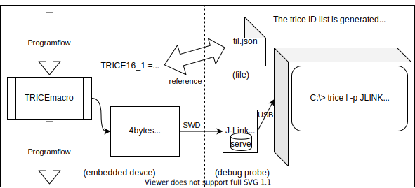
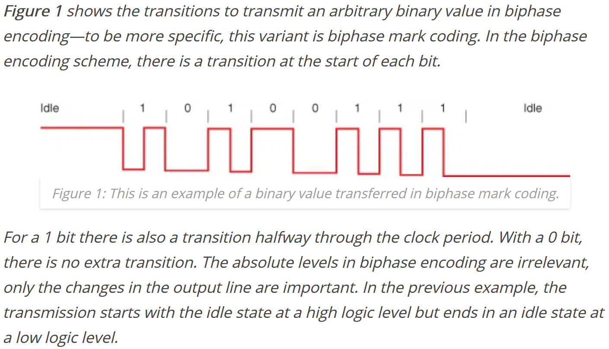
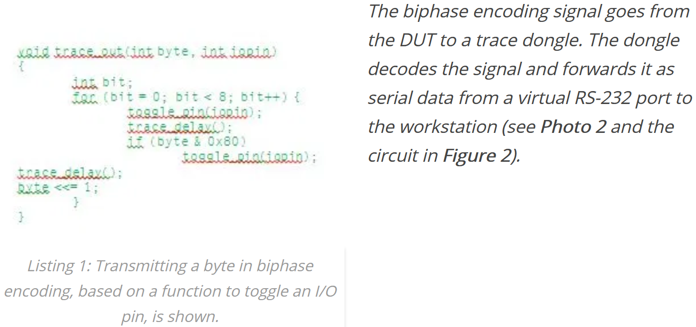

# **trice** - **TR**ace **I**ds **C** **E**mbedded *(printf() - replacement)*
embedded device C printf-like trace code and real-time PC logging (trace ID visualization) over any port

## Info shields


## Link shields
[](https://goreportcard.com/report/github.com/rokath/trice) 
[](http://makeapullrequest.com)
[](https://coveralls.io/github/rokath/trice)

## Search counters


<!---
- [docs folder](https://github.com/rokath/trice/tree/master/docs)
- [doc index](https://rokath.github.io/trice/docs/)
--->
- [github.io/trice/](https://rokath.github.io/trice/)

## About

- C trace code (`TRICE` macros)  and real-time PC logging with `trice` (tool written in [Go](https://en.wikipedia.org/wiki/Go_(programming_language))).
- Communication without string transfer, just with IDs. Prerequisite: byte transmission to PC, low bandwidth is ok:
  - method does'nt matter: serial port, i2c, spi, DAC->ADC, toggle pin, RTT, ...
- "log in (a) trice" 
- Main idea: Logging strings **not** into an embedded device to display them later on a PC but keep usage comfortable and simple. The `TRICE` macros look like printf() but work under the hood completely different.

## `TRICE` macros for C|C++ code

- Real fast (**under 20 CPU clocks per trace possible!!!**) and small loggging technique, a tracer in software usable.
  - for debugging dynamic behaviour during development, 
  - as runtime logger or simply for narrow bandwidth logging in the field even with encryption.
- Usage is similar to 'printf()' and TRICE in your code reduces the needed FLASH memory because the instrumentation code is very small (can be less 150 bytes FLASH and about 100 bytes RAM) and no printf library code nor log strings are inside the embedded device anymore.
- Not much to do:
  - Copy config file [_triceConfig.h](https://github.com/rokath/trice/tree/master/srcTrice.C/_triceConfig.h) as `triceConfig.h` to your project or take it from one of the [test projects](https://github.com/rokath/trice/tree/master/test/) 
  - Add a few [small C-files](https://github.com/rokath/trice/tree/master/srcTrice.C/) to your project and include [trice.h](https://github.com/rokath/trice/tree/master/srcTrice.C/trice.h) where trices are used.

## How it works

- For example change source code:
```
printf( "msg: %d Kelvin\n", temperature );
```
```
TRICE16( "msg: %d Kelvin\n", temperature );
```

  `trice update` (run it automatically in the tool chain) changes this line to  

```
TRICE16_1( Id(12345), "msg: %d Kelvin\n", temperature );
```
in source code and adds the *ID 12345* together with *"msg: %d Kelvin\n"* into a **t**rice **I**D **l**ist, a JSON referece file named [til.json](https://github.com/rokath/trice/blob/master/til.json).
- With the `16` in TRICE**16** you adjust the parameter size to 16 bit what allows more runtime efficient code compared to `32` or `64`.
- The appended **_1** sets the expected parameter count to 1 allowing further optimization and also a compile time parameter count check.
- During compilation the `TRICE16_1` macro is expanded to only a *12345* reference and the variable *temperature* and the format string never sees the target.


- When the programflow passes the line `TRICE16_1( Id(12345), "msg: %d Kelvin\n", temperature );` the 16 bit ID *12345* and the 16 bit *15* are transfered as one 32 bit value into the triceFifo, what goes really fast. This way the program flow is nearly undisturbed, so TRICE macros are usable also inside interrupts or in the scheduler.
- For visualization a background service is needed. The `triceServe` takes the 4 bytes trice values from the triceFifo, adds control information and puts that into the triceWriteBuffer, with at least 8 bytes size.
  - At this stage the trice out format is done (all optionally encrypted): 
    - bare with sync packages 
    - wrapped bare
    - escaped transmit format
    - your decision ...
  - The triceFifo can be also a direct writeBuffer for TRICEmacro generated output format. This is useful with escaped transmit format to incorporate dynamic strings in an efficient way. Check code of test example [MDK-ARM_LL_UART_RTT0_ESC_STM32F030R8_NUCLEO-64](https://github.com/rokath/trice/tree/master/test/MDK-ARM_LL_UART_RTT0_ESC_STM32F030R8_NUCLEO-64) for example.
- The bytes go from triceWriteBuffer to the PC and there the `trice` tool receives them.
- With the help of the [til.json](https://github.com/rokath/trice/blob/master/til.json) file the trices get then visualized on the PC.
- It is also possible to let the debug probe transfer the buffer to the PC (see *SeggerRTT* explanation for details). This keeps the implementation clearer and allows to see the trice strings directly during debugging.

  


## `trice` PC tool
- Manages `TRICE` macro IDs inside a C|C++ source tree and extracts the strings in an ID-string list during target device compile time.
- Displays `TRICE` macros like printf() output in realtime during target device runtime. The received IDs and parameters are printed out.
- Written in [Go](https://en.wikipedia.org/wiki/Go_(programming_language)), simply usage, no installer.

## Quick setup (See also test examples)
- Add [triceBareFifo.c](https://github.com/rokath/trice/tree/master/srcTrice.C/triceBareFifo.c) or [triceEscFifo.c](https://github.com/rokath/trice/tree/master/srcTrice.C/triceEscFifo.c)  and acompanying files as they are to your project
- #include [trice.h](https://github.com/rokath/trice/tree/master/srcTrice.C/trice.h) as is in your source file to use trice
- Copy [_triceConfig.h](https://github.com/rokath/trice/tree/master/srcTrice.C/_triceConfig.h), rename to `triceConfig.h` and adapt to your needs.
- [triceCheck.c](https://github.com/rokath/trice/tree/master/srcTrice.C/triceCheck.c) 
is example code and for testing
- Run `trice u` in root of your C|Cpp source project after code instrumentation with `TRICE*` statements to generate a project specific or common [til.json](https://github.com/rokath/trice/tree/master/til.json) file.
- Compile, flash & run `trice log -port COMm -baud n` with correct values m and n.

## Possible Use Cases
- Using trice not only for **dynamic debugging** but also as **logging** technique
    is possible and gives the advantage to have very short messages (no strings) for transmission, 
    but keep in mind that the file `til.json` is the key to read all output if your devices in the field for 10 or more years.
- You can consider TRICE also as **a kind of intelligent data compression** what could be interesting for IoT things, especially NB-IoT, where you have very low data rates.
- Also it is possible to **encrypt the 8 byte transfer packets** to get a reasonable protection for many cases.
  - This way you can deliver firmware images with encrypted TRICE output only readable with the appropriate key and til.json.
  - XTEA is a recommendation and implemented as option.
- You can even translate the til.json in **different languages**, so changing a language is just changing the til.json file.
- trice has intentionally no target timestamps for performance reasons. On the PC you can display the *reception timestampts*. But you can add own **timestamps as parameters** for exact embedded times measuremnets. Having several devices with trice timestamps, **network timing measurements** are possible.
- Using trice with an **RTOS** gives the option for detailed **task timing analysis**. Because of the very short execution time of a trice you could add `TRICE16( "tim:%d us, task=%d\n", us, nexTask );` to the scheduler and vizualize the output on PC. The same is possible for **interrupt timing analysis**.
- `TRICE16( "tim:%d us\n", sysTick );` before and after a function call lets you easy measure the function execution time.
- As graphical vizualisation you could use a tool similar to https://github.com/sqshq/sampler.

## Documentation
### Common
- see [./docs/Common.md](https://github.com/rokath/trice/tree/master/docs/Common.md)
### RealTimeTransfer
- see [./docs/SeggerRTT.md](https://github.com/rokath/trice/tree/master/docs/SeggerRTT.md)
### Examples
- follow [./docs/TestExamples.md](https://github.com/rokath/trice/tree/master/docs/TestExamples.md)
### Hints
- One free GPIO-Pin is already enough for using TRICE. You can transmit each basic trice (4 bytes) as bare messages over one pin:
  - 
  - 
  - See [https://circuitcellar.com/cc-blog/a-trace-tool-for-embedded-systems/](https://circuitcellar.com/cc-blog/a-trace-tool-for-embedded-systems/) for more information. As trace dongle you can use any spare microcontroller board with an UART together with an FTDI USB converter.
  - This slow path is usable because trice needs only few bytes for transmission.
- If you run tests apply the `-p=1` flag to avoid parallel execution: `go test ./... -p=1` This is slower but avoids trouble with the displayserver tests.

