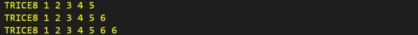
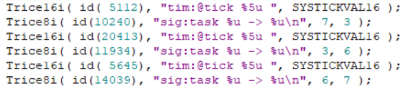

#  **Trice** <- **TR**~~ace~~ **I**~~ds~~ **C** **E**~~mbedded~~  

[github.io/trice/](https://rokath.github.io/trice/)


[](https://goreportcard.com/report/github.com/rokath/trice)
[](http://makeapullrequest.com)
[](https://coveralls.io/github/rokath/trice)
[](https://coveralls.io/github/rokath/trice?branch=master)

"log in (a) trice" ([S>G](https://www.screentogif.com/)) 

## About

- Replace `printf` or `log` in **C**-code for getting:
  - **[SPEED](./docs/TriceSpeed.md)**, to be usable also **inside interrupts**,
  - **[SPACE](./docs/TriceSpace.md)**, to reduce needed FLASH memory size,
  - and various **[FEATURES](./docs/TraceWithTrice.md#Tricefeatures)** delighting the developers heart.
- <u>Main idea:</u> Logging strings **not** into an embedded device to display them later on a PC but keep [usage comfortable and simple](./docs/TriceUserGuide.md#2-get-started).
- *Trice* consists of 2 parts:
  1. **C** code `TRICE` macros generating tiny & super-fast embedded device real-time trace/log code
  2. Tool **trice** for managing and visualization.
      - Written in [Go](https://golang.org/) and therefore usable on all platforms Go supports.
      - You can also use your own environment to receive the *Trice* packages, exchange the carried IDs with the format string and print out.
- [Trice Usage guide](./docs/TriceUserGuide.md)

## Possible Use Cases

- Using *Trice* not only for **dynamic debugging** but also as **logging** technique is possible and gives the advantage to have very short messages (no strings) for transmission, but keep in mind that the file [til.json](./til.json) is the key to read all output if your devices in the field for 10 or more years.
  - Optionally add [til.json](./til.json) as a (compressed) resource to your target image. One possibility is using [SRecord](http://srecord.sourceforge.net/download.html). Or simply provide a download link.
- You can see *Trice* also as a kind of **data compression** what could be interesting for [IoT](https://en.wikipedia.org/wiki/Internet_of_things) things, especially [NB-IoT](https://en.wikipedia.org/wiki/Narrowband_IoT), where you have very low data rates.
- Storing *Trice* messages in [FLASH memory](https://en.wikipedia.org/wiki/Flash_memory) for later log analysis saves memory because a typical `TRICE` occupies only about 8 bytes independently of the format string length.
- Also, it is possible to **encrypt** the *Trice* transfer packets to get a reasonable protection for many cases.
  - This way you can deliver firmware images with encrypted *Trice* output, only readable with the appropriate key and [til.json](./til.json).
  - XTEA is implemented as one option.
- You can even translate the [til.json](./til.json) file in **different languages**, so changing a language is just changing the [til.json](./til.json) file without touching the target binary.
- With *Trice* it is easy to do **timing analysis** on distributed embedded systems. Host and target timestamps are supported.

## How it approximately works (UART example)

This slightly simplified [view](https://github.com/jgraph/drawio) is explained [here](./docs/TraceWithTrice.md#4-how-it-works---the-main-idea)


## Data Transfer

- Implemented:
  - [UART](https://en.wikipedia.org/wiki/Universal_asynchronous_receiver-transmitter) connectable to virtual UART over USB
  - [RTT](https://www.segger.com/products/debug-probes/j-link/technology/about-real-time-transfer/) over [J-Link](./third_party/segger.com/ReadMe.md) and [RTT over ST-Link](./third_party/goST/ReadMe.md)
- A small separate microcontroller is always usable as interfaces bridge to [GPIO](https://circuitcellar.com/cc-blog/a-trace-tool-for-embedded-systems/), [I²C](https://en.wikipedia.org/wiki/I%C2%B2C), [SPI](https://en.wikipedia.org/wiki/Serial_Peripheral_Interface), [CAN](https://en.wikipedia.org/wiki/CAN_bus), [LIN](https://en.wikipedia.org/wiki/Local_Interconnect_Network), ...

## Display server option

Start `trice ds` inside a console, option: [third_party/alacritty](./third_party/alacritty), locally or on a remote PC and connect with several **trice** tool instances like with `trice log -p COM15 -ds` for example.

## Documentation

- [https://interrupt.memfault.com/blog/trice](https://interrupt.memfault.com/blog/trice)
- [Trice User Guide](./docs/TriceUserGuide.md)
- Check the [docs](./docs) folder. No need to read all this stuff - it is just for help and reference.

## Support?

Yes please - or simply :star: it. ☺

Cloning the repo:

```b
git clone https://github.com/rokath/trice.git
```

## Similar projects

- [baical.net](http://baical.net/up7.html) (C)
- [defmt](https://github.com/knurling-rs/defmt) (Rust)
- [NanoLog](https://github.com/PlatformLab/NanoLog) (Linux C++)
- [A tool to record and visualize system activities](https://www.codeinsideout.com/blog/stm32/j-link-sysview/) (SEGGER J-Link System View)
- [qpspy](https://www.state-machine.com/qtools/qpspy.html) (C/C++)
- [Minimal Structured Logging for Autonomous Vehikles](https://youtu.be/FyJI4Z6jD4w) (C++, closed source talk)
- [Debugging with Dynamic Printf Breakpoints](https://mcuoneclipse.com/2022/02/09/debugging-with-dynamic-printf-breakpoints/) (Eclipse IDE option)

<!--- B A C K U P

## `TRICE` macros for C & C++ code

- Real fast: **12 CPU clocks per (short) *trice* possible!!!**
  - With a 48MHz clock this is 250ns. Light travels about 80 meters in that time.
- TRICE in your code **reduces the needed FLASH memory** because the instrumentation code is very small (can be less 200 bytes FLASH and about 100 bytes RAM) and no printf library code nor log strings are inside the embedded device anymore.


## ATTENTION 4

- In release v0.41.0 now the `TRICE` macro works additionally. To use it, simply use it like `printf`:
  - No need for parameter count and bit width.
    - The internal used parameter bit width is 32 bit, but you can use also `TRICE8`, `TRICE16`, `TRICE32`, `TRICE64`, 
    - 0 to 12 parameters possible (extendable).
  - No strings supported ("%s"). Use `TRICE_S` than.
  - Many usage options inside `pkg/src/triceCheck.c` visible.
- Needs better tests and updated documentation.

## ATTENTION 3

In release v0.39.0 now encryption works again. To implement it well and open for future, the additional COBS package descriptor is now 4 bytes long. That means the **trice** tool version 0.39.0 does not work with older target code. Please update your target code or stay with an older release.
Probably the COBS encoding will not change in the next time anymore.

## ATTENTION 2

In release v0.38.0 now target timestamps possible. To implement it well and open for future, an additional COBS package descriptor byte was added. That means the **trice** tool version 0.38.0 does not work with older target code. Please update your target code or stay with an older release.

## ATTENTION

The **TRICE** technique changed heavily between release 0.33.0 and 0.34.0. The `flex` and `esc` encodings are replaced by a [COBS](https://en.wikipedia.org/wiki/Consistent_Overhead_Byte_Stuffing) encoding which will be the default now. The stuff works already well but is not in its final state and is not documented vet. It lacks also automated tests. The internal speed goes to its limit (~6 clocks per *trice* on M0+ possible) by using a double buffer instead of a fifo. Also porting is easier now. The documentation is outdated but gets updated soon. But first the tests. If you have a project with `flex` or `esc` encoding, please update the target code or stay with version 0.33.0.

 Because of the very short execution time of a *trice* you could add to the scheduler:

```c
    Trice16i( "tim:@tick %5u ", clock );
    Trice8i( "sig:task %u -> %u\n", previousTaskID, nexTaskID );
```

 The execution of this code block produces totally 8 log bytes to visualize the output on PC, what looks similar to this for 3 task switches:


First are the PC reception timestamps and after the port info are the used *trice* ids just for easy location inside the source code. See the diferences between the (blue) ticks in this 3 lines. These are 28 or 36 processor clocks only. The code producing this is:



  The same is possible for **interrupt timing analysis**.

- Mixed case TRICE macros are [short](./docs/TriceEncodings.md#flex-short-sub-encoding) *Trices* and the letter i at the end says **i**nside critical section. (FLEX encoding)
- `Trice16( "tim: myFunc %d\n", sysTick );` before and after a function call lets you easy measure the function execution time.
- As graphical visualization you could use a tool similar to [https://github.com/sqshq/sampler](https://github.com/sqshq/sampler).

<!---
## Target timestamps?

- TRICE has intentionally no target timestamps for performance reasons. Also it is not foreseeable which time base is needed in which application. On the PC you can display the *reception timestamps*.
- Because several *trice* statements can form a single log line, a generally added timestamp would cause difficulties with that. This could be handled but adds complexity not worth the effort.
- But you can add own **timestamps as parameters** for exact embedded time measurements. Having several devices with *trice* timestamps, **network timing measurement** is possible.

### Target timestamp examples

- Lets say you have a 16 bit systick, called `SYSTICKVAL16` and 16 bit timestamps are fine for you:
  - Simply add `trice16( "time:@%5u:", SYSTICKVAL16 );` everywhere you need exact time.
  - Or use `trice16( "time:@%5u:My values are %d, %d, %d\n", SYSTICKVAL16, my0, my1, my2 );`
- Same with a 32 bit systick, called `SYSTICKVAL32`:
  - Simply add `trice32( "time:@%9u:", SYSTICKVAL32 );` everywhere you need exact time.
  - Or use `trice32( "time:@%9u:My values are %d, %d, %d\n", SYSTICKVAL32, my0, my1, my2 );`

This is a slightly simplified [view](https://github.com/jgraph/drawio):


- When the program flow passes the line `Trice16( Id(12345), "MSG: %d Kelvin\n", k );` the ID *12345* and the 16 bit temperature value are transferred as one combined 32 bit value into the triceFifo, what goes really fast. Different encodings are possible. The program flow is nearly undisturbed, so **TRICE macros are usable also inside interrupts or in the scheduler**.
- For visualization a background service is needed. In the simplest case it is just an UART triggered interrupt for triceFIFO reading. Or you can use [RTT](./docs/TriceOverRTT.md).
- So the whole target instrumentation are the *trice* macros, the *trice* fifo and the UART  ISR.
- During runtime the PC **trice** tool receives the *trice* as a 4 byte package `0x30 0x39 0x00 0x0e` from the UART port.
- The `0x30 0x39` is the ID 12345 and a map lookup delivers the format string *"MSG: %d Kelvin\n"* and also the format information *"TRICE16_1"*. Now the **trice** tool is able to execute `printf("MSG: %d Kelvin\n", 0x000e);` and the full log information is displayed in the MSG color.
- Only the parameter count and size affect encoding size but not the format string length.

## `trice` PC tool

- Manages `TRICE` macro IDs inside a C or C++ source tree and extracts the strings in an ID-string list during target device compile time.
- Displays `TRICE` macros like printf() output in real-time during target device runtime. The received IDs and parameters are printed out.
- Can receive trices on several PCs and display them on a remote display server.
- Written in [Go](https://github.com/golang/go), simply usage, no installer, needs to be in $PATH.

## Structured Logging?

Right now only event logging is implemented.

According to the design aim **"Keep embedded device code small and fast"** there is no structuring code inside the target device, **but** you can add channel information to the *trice* log strings:

```c
trice32( Id(12345), "Verbose: bla bla")
```

These can be understood as tags too. But only one tag per *trice* right now.
Look into [lineTransformerANSI.go](./internal/emitter/lineTransformerANSI.go) for options or extensions.

Also you can at compile time disable *trice* code generation on file level with `#define TRICE_OFF` before including `trice.h`.

Because [one *trice* consists typically only of 4 to 8 bytes](./docs/TriceEncodings.md#flex-encoding) there is usually no need to dynamically switch trices on and off inside the embedded device. This can be done on the display side inside the **trice** tool with the command line switches `-ban` or `-pick`. For example `-pick err,wrn` disables all output despite error and warning messages.
Switching trices on and off inside the target increases the overhead and demands some kind of command interface.
If needed, always an `if` is usable.

The **trice** tool can also perform further tasks like JSON encoding with additional log information and transferring this information to some webserver in the future.

## Search counters


-->
