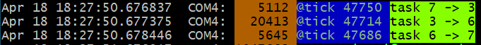
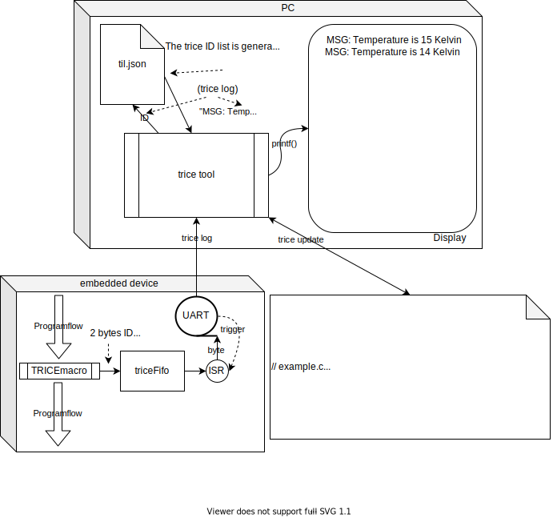

#  **Trice** <- **TR**~~ace~~ **I**~~ds~~ **C** **E**~~mbedded~~  

Trice consists of 2 parts: Tiny & super fast embedded device real-time trace **C** code (`TRICE` macros) and PC tool `trice` for managing and visualization. The aim is to replace `printf` in a conveinient and much faster way. The PC **trice** tool itself is written in [Go](https://golang.org/) and therefore usable on all platforms Go supports. 
It is also easy to receive the COBS packges, exchange the IDs with the format string and to print out in your own environment if you want.

## Info shields


## Link shields

[](https://goreportcard.com/report/github.com/rokath/trice)
[](http://makeapullrequest.com)
[](https://coveralls.io/github/rokath/trice)
[](https://coveralls.io/github/rokath/trice?branch=master)

## Search counters


- [github.io/trice/](https://rokath.github.io/trice/)

## ATTENTION 3

In release v0.39.0 now encryption works again. To implement it well and open for future, the additional COBS package descriptor is now 4 bytes long. That means the trice tool version 0.39.0 does not work with older target code. Please update your target code or stay with an older release.
Probably the COBS encoding will not change in the next time anymore.

## ATTENTION 2

In release v0.38.0 now target timestamps possible. To implement it well and open for future, an additional COBS package descriptor byte was added. That means the trice tool version 0.38.0 does not work with older target code. Please update your target code or stay with an older release.

## ATTENTION

The **TRICE** technique changed heavily between release 0.33.0 and 0.34.0. The `flex` and `esc` encodings are replaced by a [COBS](https://en.wikipedia.org/wiki/Consistent_Overhead_Byte_Stuffing) encoding which will be the default now. The stuff works already well but is not in its final state and is not documented vet. It lacks also automated tests. The internal speed goes to its limit (~6 clocks per trice on M0+ possible) by using a double buffer instead of a fifo. Also porting is easier now. The documentation is outdated but gets updated soon. But first the tests. If you have a project with `flex` or `esc` encoding, please update the target code or stay with version 0.33.0.

## Quick start guide

- Copy 3 files to your embedded project:
  - `./pkg/src/trice.h`
  - `./pkg/src/trice.c`
  - `./test/.../triceConfig.h`
- In your source.c: `#include "trice.h"`
- In a function: `TRICE0( "Hi!\n" );`
- In project root:
  - Create emty file: `touch til.json`.
  - Run `trice u` should:
    - patch source.c to `TRICE0( Id(12345), "Hi!\n" );`
    - extend `til.json`
- Modify `triceConfig.h` acording your needs.
  - With `#define TRICE_MODE 0` just provide a **putchar()** function.
- Compile & load your app.
- In project root: `trice l -p COM1` should show `Hi!` after app start.

## About

- Printf-like trace macros `TRICE` and PC `trice` tool (written in [Go](https://en.wikipedia.org/wiki/Go_(programming_language))) for automatic ID managing & logging.
- Communication without string transfer, just with IDs. Prerequisite: byte transmission to PC, low bandwidth is ok:
  - method does not matter: \
  USB via virtual COM using FTDI \
  [UART](https://en.wikipedia.org/wiki/Universal_asynchronous_receiver-transmitter), \
  [I²C](https://en.wikipedia.org/wiki/I%C2%B2C), \
  [SPI](https://en.wikipedia.org/wiki/Serial_Peripheral_Interface), \
  [GPIO](https://circuitcellar.com/cc-blog/a-trace-tool-for-embedded-systems/), \
  [RTT](https://www.segger.com/products/debug-probes/j-link/technology/about-real-time-transfer/), \
  [CAN](https://en.wikipedia.org/wiki/CAN_bus), \
  [LIN](https://en.wikipedia.org/wiki/Local_Interconnect_Network), ...
- "log in (a) trice" ([S>G](https://www.screentogif.com/)) 
- Main idea: Logging strings **not** into an embedded device to display them later on a PC but keep **usage comfortable and simple**.

## `TRICE` macros for C & C++ code

- Real fast: **12 CPU clocks per (short) trice possible!!!**
  - With a 48MHz clock this is 250ns. Light travels about 80 meters in that time.
- TRICE in your code **reduces the needed FLASH memory** because the instrumentation code is very small (can be less 200 bytes FLASH and about 100 bytes RAM) and no printf library code nor log strings are inside the embedded device anymore.

## Possible Use Cases

- Using trice not only for **dynamic debugging** but also as **logging** technique
    is possible and gives the advantage to have very short messages (no strings) for transmission,
    but keep in mind that the file [til.json](https://github.com/rokath/trice/blob/master/til.json) is the key to read all output if your devices in the field for 10 or more years.
  - Optionally add til.json as a (compressed) resource.
- You can see TRICE also as a kind of **data compression** what could be interesting for IoT things, especially NB-IoT, where you have very low data rates.
- Storing trices in FLASH for later log analysis saves memory because a typical `TRICE` occupies only 4 or 8 bytes.
- Also it is possible to **encrypt** the trice transfer packets to get a reasonable protection for many cases.
  - This way you can deliver firmware images with encrypted TRICE output only readable with the appropriate key and til.json.
  - XTEA is implemented as one option.
- You can even translate the til.json in **different languages**, so changing a language is just changing the til.json file.
- Using trice with an **RTOS** gives the option for detailed **task timing analysis**. Because of the very short execution time of a trice you could add to the scheduler:

```c
    Trice16i( "tim:@tick %5u ", clock );
    Trice8i( "sig:task %u -> %u\n", previousTaskID, nexTaskID );
```

 The execution of this code block produces totally 8 log bytes to visualize the output on PC, what looks similar to this for 3 task switches:



First are the PC reception timestamps and after the port info are the used trice ids just for easy location inside the source code. See the diferences between the (blue) ticks in this 3 lines. These are 28 or 36 processor clocks only. The code producing this is:


  The same is possible for **interrupt timing analysis**.

- Mixed case trice macros are [short](./docs/TriceEncodings.md#flex-short-sub-encoding) trices and the letter i at the end says **i**nside critical section. (FLEX encoding)
- `Trice16( "tim: myFunc %d\n", sysTick );` before and after a function call lets you easy measure the function execution time.
- As graphical visualization you could use a tool similar to [https://github.com/sqshq/sampler](https://github.com/sqshq/sampler).

<!---
## Target timestamps?

- TRICE has intentionally no target timestamps for performance reasons. Also it is not foreseeable which time base is needed in which application. On the PC you can display the *reception timestamps*.
- Because several trice statements can form a single log line, a generally added timestamp would cause difficulties with that. This could be handled but adds complexity not worth the effort.
- But you can add own **timestamps as parameters** for exact embedded time measurements. Having several devices with trice timestamps, **network timing measurement** is possible.

### Target timestamp examples

- Lets say you have a 16 bit systick, called `SYSTICKVAL16` and 16 bit timestamps are fine for you:
  - Simply add `trice16( "time:@%5u:", SYSTICKVAL16 );` everywhere you need exact time.
  - Or use `trice16( "time:@%5u:My values are %d, %d, %d\n", SYSTICKVAL16, my0, my1, my2 );`
- Same with a 32 bit systick, called `SYSTICKVAL32`:
  - Simply add `trice32( "time:@%9u:", SYSTICKVAL32 );` everywhere you need exact time.
  - Or use `trice32( "time:@%9u:My values are %d, %d, %d\n", SYSTICKVAL32, my0, my1, my2 );`
--->

## How it approximately works

For example change the source code line

```c
printf( "MSG: %d Kelvin\n", k );
```

into

```c
Trice16( "MSG: %d Kelvin\n", k );
```

`trice update` (run it automatically in the tool chain) changes it to  

```c
Trice16( Id(12345), "MSG: %d Kelvin\n", k );
```

or (if `-addParamCount` is used)

```c
Trice16_1( Id(12345), "MSG: %d Kelvin\n", k );
```

and adds the *ID 12345* together with *"MSG: %d Kelvin\n"* into a **t**rice **I**D **l**ist, a JSON reference file named [til.json](https://github.com/rokath/trice/blob/master/til.json).

- The *12345* is a randomly or policy generated ID not used so far.
- With the `16` in Trice**16** you adjust the parameter size to 16 bit what allows more runtime efficient code compared to `32` or `64`.
- The optional appended **_1** sets the expected parameter count to 1, allowing a compile time parameter count check.
- During compilation the `Trice16[_1]` macro is translated to only a *12345* reference and the variable *k*. The format string never sees the target.

This is a slightly simplified [view](https://github.com/jgraph/drawio):



- When the program flow passes the line `Trice16( Id(12345), "MSG: %d Kelvin\n", k );` the ID *12345* and the 16 bit temperature value are transferred as one combined 32 bit value into the triceFifo, what goes really fast. Different encodings are possible. The program flow is nearly undisturbed, so **TRICE macros are usable also inside interrupts or in the scheduler**.
- For visualization a background service is needed. In the simplest case it is just an UART triggered interrupt for triceFIFO reading. Or you can use [RTT](./docs/SeggerRTT.md).
- So the whole target instrumentation are the trice macros, the trice fifo and the UART  ISR.
- During runtime the PC trice tool receives the trice as a 4 byte package `0x30 0x39 0x00 0x0e` from the UART port.
- The `0x30 0x39` is the ID 12345 and a map lookup delivers the format string *"MSG: %d Kelvin\n"* and also the format information *"TRICE16_1"*. Now the trice tool is able to execute `printf("MSG: %d Kelvin\n", 0x000e);` and the full log information is displayed in the MSG color.
- Only the parameter count and size affect encoding size but not the format string length.

## `trice` PC tool

- Manages `TRICE` macro IDs inside a C or C++ source tree and extracts the strings in an ID-string list during target device compile time.
- Displays `TRICE` macros like printf() output in real-time during target device runtime. The received IDs and parameters are printed out.
- Can receive trices on several PCs and display them on a remote display server.
- Written in [Go](https://github.com/golang/go), simply usage, no installer, needs to be in $PATH.

## Structured Logging?

Right now only event logging is implemented.

According to the design aim **"Keep embedded device code small and fast"** there is no structuring code inside the target device, **but** you can add channel information to the trice log strings:

```c
trice32( Id(12345), "Verbose: bla bla")
```

These can be understood as tags too. But only one tag per trice right now.
Look into [lineTransformerANSI.go](./internal/emitter/lineTransformerANSI.go) for options or extensions.

Also you can at compile time disable trice code generation on file level with `#define TRICE_OFF` before including `trice.h`.

Because [one trice consists typically only of 4 to 8 bytes](./docs/TriceEncodings.md#flex-encoding) there is usually no need to dynamically switch trices on and off inside the embedded device. This can be done on the display side inside the trice tool with the command line switches `-ban` or `-pick`. For example `-pick err,wrn` disables all output despite error and warning messages.
Switching trices on and off inside the target increases the overhead and demands some kind of command interface.
If needed, always an `if` is usable.

The trice tool can also perform further tasks like JSON encoding with additional log information and transferring this information to some webserver in the future.

## Display server option?

Yes, you can simply start `trice ds` inside a console, option: [third_party/alacritty](./third_party/alacritty), locally or on a remote PC and connect with several trice tool instances like with `trice log -p COM15 -ds` for example.

## How to keep ID reference file til.json for a long period?

- Of course `git`, **but** it is not forbidden to compile til.json as a resource into the embedded device and get it later back if you have enough flash memory.

## How to start

- Get [trice](https://github.com/rokath/trice) or download latest release assets for your system: Source code and compressed binaries.
- A port to Darwin should be easy possible.  

### Either use pre-compiled `trice` binary

- Place the extracted `trice` binary somewhere in your $PATH.

### Or build `trice` from Go sources

- Install [Go](https://golang.org/).
- On Windows you need to install [TDM-GCC](https://jmeubank.github.io/tdm-gcc/download/) - recommendation: Minimal online installer.
  - GCC is only needed for [./pkg/src/src.go](https://github.com/rokath/trice/blob/master/pkg/src/src.go), what gives the option to test the C-code on the host.
  - Make sure TDM-GCC is found first in the path.
  - Other gcc variants could work also but not tested.
- Open a console inside the `trice` directory.
- Check and install:

```b
go vet ./...
go test ./...
go install ./...
```

Afterwards you should find an executable `trice` inside $GOPATH/bin/

### Running

```b
trice help
```

### Quick target setup

- It is sufficient for most cases just to use the `trice32` macro with max 4 parameters as a replacement for `printf` and to use the default settings.
- Compare the **not** instrumented test project [MDK-ARM_LL_generatedDemo_STM32F030R8-NUCLEO-64](https://github.com/rokath/trice/tree/master/test/MDK-ARM_LL_generatedDemo_STM32F030R8-NUCLEO-64) with one of the instrumented test projects in [test](https://github.com/rokath/trice/tree/master/test/) to see what to to.
  - Recommendation: FLEX encoding
- **Or** follow these steps for instrumentation information even your target processor is not an ARM (any bit width will do):
  - Install the free [STCubeMX](https://www.st.com/en/development-tools/stm32cubemx.html).
  - Choose from [test examples](https://github.com/rokath/trice/tree/master/test) the for you best fitting project `MyExample`.
  - Open the `MyExample.ioc` file with [STCubeMX](https://www.waveshare.com/wiki/STM32CubeMX_Tutorial_Series:_Overview) and generate without changing any setting.
  - Make an empty directory `MyProject` inside the `test` folder and copy the `MyExample.ioc` there and rename it to `MyProject.ioc`.
  - Open `MyProject.ioc` with [STCubeMX](https://www.waveshare.com/wiki/STM32CubeMX_Tutorial_Series:_Overview), change in projects settings `MyExample` to `MyProject` and generate.
  - Now compare the directories `MyExample` and `MyProject` to see the trice instrumentation as differences.
- For compiler adaption see [triceConfigCompiler.h](./pkg/src/intern/triceConfigCompiler.h).
- For hardware adaption see [triceUART_LL_STM32](./pkg/src/intern/triceUART_LL_STM32.h)

## Documentation

No need to read all this stuff - is is just for help and reference.

- [fix color issues under windows](./docs/Common.md#color-issues-under-windows)
- [Command Line Examples](./docs/CommandLineExamples.md)
- [Common.md](./docs/Common.md)
- [TriceEncodings.md](./docs/TriceEncodings.md)
- [ID management](./docs/IDManagement.md)
- [OneWireOption](./docs/OneWireOption.md)
- [SeggerRTT](./docs/SeggerRTT.md)

## Support?

Yes please: May be you create a graphical display server, have a cool idea, a port to other hardware, some correction or simply like to :star: it. ☺

## Cloning the repo

```b
git clone https://github.com/rokath/trice.git
```

## Similar projects

Maybe you find this project interesting too: [baical.net](http://baical.net/index.html)
