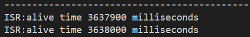

# **trice** - **TR**ace **I**ds **C** **E**mbedded 
embedded device C printf-like trace code and real-time PC logging (trace ID visualization) over serial port

## About
- C trace code (`TRICE` macros)  and real-time PC logging with `trice` (tool with Go sources).
- Communication over serial port without strings, just with IDs
- "log in (a) trice" 
- Main idea: Logging strings **not** into an embedded device to display them later on a PC but keep usage simple.

## `TRICE` macros for C|C++ code
- Real fast (**~16 clocks per trace!!!**) and small loggging technique, a tracer in software usable 
  - for debugging dynamic behaviour during development, 
  - as runtime logger or simply for narrow bandwidth logging in the field even with encryption.
- Usage is similar to 'printf()', but the format strings go not into the target image.
- The needed code instrumentation is minimal:
  - Adapt a [config file](./scrC/proj_config.h) (hardware specific).
  - Add [one small C-file](./scrC/trice.c) to your project and include a [C-header](./scrC/trice.h) where trices are used.
  - Core instrumentation needs less 150 bytes FLASH and about 100 bytes RAM.

## `trice` PC tool
- Written in Go
- Manages trices inside a C|C++ source tree during target compile time.
- Displays trices in realtime during target runtime.

## Quick setup
- add [trice.c](./scrC/trice.c) as is to your project
- #include [trice.h](./scrC/trice.h) as is in your source file to use trice
- copy [proj_config.h](./scrC/proj_config.h), rename to `config.h` and adapt to your needs
- [triceCheck.c](./examples/triceDemoF030R8/Src/triceCheck.c) 
is example code and for testing
- run `trice u` in root of your C|Cpp source project after code instrumentation with TRICE* statements to generate a prroject specific til.json file 
- compile, flash & run `trice log -port COMm -baud n` with correct values m and n

## Possible Use Cases
- Using trice not only for **dynamic debugging** but also as **logging** technique
    is possible and gives the advantage to have very short messages (no strings) for transmission, 
    but keep in mind that the file `til.json` is the key to read all output if your devices in the field for 10 or more years.
- You can consider TRICE also as **a kind of intelligent data compression** what could be interesting for IoT things, especially NB-IoT, where you have very low data rates.
- Also it is possible to **encrypt the 8 byte transfer packets** to get a reasonable protection for many cases.
  - This way you can deliver firmware images with encrypted TRICE output only readable with the appropriate key and til.json.
  - Treyfer is a recommendation and planned as a coming option.
- You can even translate the til.json in **different languages**, so changing a language is just changing the til.json file.
- trice has intentionally no timestamps for performance reasons. But you can add own **timestamps as parameters**. Having several devices with trice timestamps, **network timing measurements** are possible.
- Using trice with an **RTOS** gives the option for detailed **task timing analysis**. Because of the very short execution time of a trice you could add `TRICE16( Id(0), "tim:%d us, task=%d\n", us, nexTask );` to the scheduler and vizualize the output on PC. The same is possible for **interrupt timing analysis**.
- As graphical vizualisation you could use a tool similar to https://github.com/sqshq/sampler.

## Documentation
- see [./doc/ReadMe.md](./doc/ReadMe.md)
