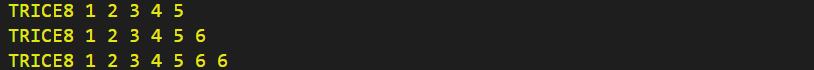

# Trice - Trace IDs for Embedded C/C++ 

> 🅃🅁ace 🄸d's for 🄲 🄴mbedded

[View Github Pages](https://rokath.github.io/trice/)

<a id="top"> </a>

##  *Hi, I am Trice.*

---

**Trice** is an ultra-low-overhead logging framework for embedded C/C++. It provides printf-like usability with only ~6–100 CPU cycles per log call, making logging practical even when used from interrupt handlers in real-time firmware systems.

     [](https://makeapullrequest.com)   [](https://goreportcard.com/report/github.com/rokath/trice) [](https://coveralls.io/github/rokath/trice?branch=main) [](https://github.com/rokath/trice/actions/workflows/trice_lib_ci_full.yml) 
<!--
[](https://pkg.go.dev/github.com/rokath/trice) 
[](https://github.com/rokath/trice/actions/workflows/coverage.yml) 
[](https://github.com/rokath/trice/actions/workflows/clang-format.yml) 
[](https://github.com/rokath/trice/actions/workflows/trice_lib_ci.yml) 
[](https://github.com/rokath/trice/actions/workflows/stale.yml) 
 
[](https://github.com/rokath/trice/actions/workflows/codeql.yml) 
 
[](https://coveralls.io/github/rokath/trice) 
 
[](https://github.com/sponsors/rokath)

-->

*Log in a trice — with Trice, even from **↯ interrupt handlers** in less than 1 µs ❗*

 <!-- ([S>G](https://www.screentogif.com/)) -->

**Trice User Manual:** [GitHub](./docs/TriceUserManual.md) • [GH Pages](https://rokath.github.io/trice/docs/TriceUserManual.html) • [PDF](https://github.com/rokath/trice/releases/latest/download/TriceUserManual.pdf)

## What is Trice?

Trice is designed for systems where traditional logging is too slow, too large, or not safe to use in interrupt or real-time contexts.

Trice replaces `printf`-style logging in embedded C/C++ systems with a much faster and more efficient approach.

Instead of formatting and storing strings on the target, Trice encodes log messages as compact IDs and keeps the actual strings on the host. This reduces runtime overhead, memory usage, and data transfer size.

### Key Benefits

* **[🚀 Speed](./docs/TriceUserManual.md#trice-speed)** – ~6–100 CPU cycles per log call. This makes logging practical even when used from interrupt handlers in real-time firmware systems.
* **[📦 Small Size](./docs/TriceUserManual.md#trice-memory-needs)** – no format strings stored in target FLASH  
* **[🧱 Version Stability](./docs/TriceUserManual.md#versions-and-variants-trice-stability)** – decode logs from older firmware without requiring matching tool versions
* **[🛠 Easy Migration](./docs/TriceUserManual.md#trice-and-legacy-user-code)** – reuse existing `printf`-style code with minimal changes via the `-alias` option
* **[➕ More Features](./docs/TriceUserManual.md#trice-features-(overview))** – flexible logging, transport options, and tooling  

### How it works

1. Use Trice macros instead of `printf` in your firmware (or use the `trice i -alias` option)
2. Each log message is replaced by a compact ID  
3. The target sends only IDs and data  
4. The host reconstructs the original messages using the Trice ID list  

```diff
- printf("Temperature: %d°C", t);
+ trice("Temperature: %d°C", t);   // fast, compact, ID-based
```

### Result

* Faster execution
* Smaller binaries
* Reliable logging in time-critical code paths

### Two Parts of Trice

1. **C code macros** - Works like `printf` but creates very fast trace and log code for your embedded device
2. **Trice tool** - Manages and displays the logs
   - Written in [Go](https://go.dev/) - works on all platforms that Go supports
   - You can also build your own tool to receive Trice packages, replace IDs with text, and display the output

***Ready to use:*** [Start with Trice](./docs/TriceUserManual.md#start-with-trice)

## Quickstart: First RTT Log with J-Link

Install the `trice` tool. Use a [latest release binary](https://github.com/rokath/trice/releases/latest) and put it into your `PATH`.

For a first setup, SEGGER RTT is usually fastest: it needs no MCU-specific UART driver and works via J-Link. Install the SEGGER J-Link software package so `JLinkRTTLogger` is in `PATH`.

1. Add the complete [`src`](./src) folder to your target project unchanged and add `./src` to the compiler include path.
2. Create a project-specific `triceConfig.h` file with this minimal direct RTT configuration:

```c
#define TRICE_DIRECT_OUTPUT 1
#define TRICE_BUFFER TRICE_STACK_BUFFER
#define TRICE_DIRECT_SEGGER_RTT_32BIT_WRITE 1
```

3. Add Trice to your code, for example in `main.c`:

```c
#include "trice.h"

int main(void) {
    TriceInit(); // RTT-specific
    // ... system init
    trice("Hello world!\n");
    // ...
}
```

4. Create empty `til.json` and `li.json` files in your project root and run `trice insert -src ./` before compiling. This assigns IDs to your `trice(...)` calls and fills both JSON files.
5. Build and flash your target.
6. Start logging with your device name (add `-v` for details)

```bash
trice log -p JLINK -args "-Device STM32G0B1RE -if SWD -Speed 4000 -RTTChannel 0" -pf none -prefix off -hs off -d16 -i ./til.json -li ./li.json
```

Or use the file-based RTT logger workflow manually:

```bash
# Terminal 1
rm -f ./temp/trice.bin
JLinkRTTLogger -Device STM32G0B1RE -If SWD -Speed 4000 -RTTChannel 0 ./temp/trice.bin
```

```bash
# Terminal 2
touch ./temp/trice.bin
trice log -p FILE -args ./temp/trice.bin -pf none -prefix off -hs off -d16 -ts ms -i ./til.json -li ./li.json
```

For more setup details, see [Start with Trice](./docs/TriceUserManual.md#start-with-trice), [Configuration file triceConfig.h](./docs/TriceUserManual.md#configuration-file-triceconfig.h), and [Trice over RTT](./docs/TriceUserManual.md#trice-over-rtt).

## When to Use Trice

### Logging and Debugging

You can use Trice for `printf` debugging and as a logging system. The advantage is very short messages (no strings) for data transfer. Keep your project-specific `til.json` file available to decode field logs later. The repository example file is [demoTIL.json](./demoTIL.json).

- **Optional:** Add your project-specific `til.json` as a compressed resource to your target image. You can use [SRecord](https://srecord.sourceforge.net/download.html) or provide a download link.

### Data Compression

Trice looks like data compression (IDs instead of strings), which is useful for [IoT](https://en.wikipedia.org/wiki/Internet_of_things) devices, especially [NB-IoT](https://en.wikipedia.org/wiki/Narrowband_IoT) with very low data rates.

### FLASH Memory Storage

[Store Trice messages in FLASH memory](./docs/TriceUserManual.md#writing-the-trice-logs-into-an-sd-card-(or-a-user-specific-output)) for later analysis. A typical `trice` uses only 4 bytes, no matter how long the format string is.

### Encryption

You can **encrypt** Trice transfer packets for security.

- Deliver firmware images with encrypted Trice output that only works with the right key and the matching `til.json`
- [XTEA](https://en.wikipedia.org/wiki/XTEA) encryption is available

### Translation

Translate the `til.json` file into **different languages**. Change the language by changing the `til.json` file without changing the target binary.

### Timing Analysis

Trice makes **timing analysis** easy on distributed embedded systems. It supports both host and target timestamps.

## How Trice Works (UART Example)

This simplified [diagram](https://github.com/jgraph/drawio) shows how Trice works. [Read the detailed explanation here](./docs/TriceUserManual.md#how-it-works---the-main-idea).


## Data Transfer Options

### Implemented Transfer Methods

- [UART](https://en.wikipedia.org/wiki/Universal_asynchronous_receiver-transmitter) - Can connect to virtual UART over USB
- [RTT](https://www.segger.com/products/debug-probes/j-link/technology/about-real-time-transfer/) - Works with [J-Link](./third_party/segger.com/ReadMe.md) and [ST-Link](./third_party/goST/ReadMe.md)
- TCP4 ([TCP4 input](./docs/TriceUserManual.md#tcp4-input) and [TCP4 output](./docs/TriceUserManual.md#tcp4-output))
- UDP4 ([UDP4 input](./docs/TriceUserManual.md#udp4-input))

### Other Transfer Options

- Use a small separate microcontroller as a bridge from [GPIO](https://circuitcellar.com/cc-blog/a-trace-tool-for-embedded-systems/), [I²C](https://en.wikipedia.org/wiki/I%C2%B2C), [SPI](https://en.wikipedia.org/wiki/Serial_Peripheral_Interface), [CAN](https://en.wikipedia.org/wiki/CAN_bus), [LIN](https://en.wikipedia.org/wiki/Local_Interconnect_Network) to UART
- Use FTDI chips like [Adafruit FT232H Breakout](https://learn.adafruit.com/adafruit-ft232h-breakout) for easy GPIO, I2C, and SPI access

## Display Server

- Start `trice ds` in a console on your local PC or a remote PC. Then connect several **trice** tool instances using commands like `trice log -p COM15 -ds`
- This allows to see the Trice logs of several devices line-by-line intermixed in one terminal.

## Documentation

The [Trice User Manual](./docs/TriceUserManual.md) includes all information from the [Memfault Interrupt Blog](https://interrupt.memfault.com/blog/trice) which is slightly outdated.
- Check [issues](https://github.com/rokath/trice/issues) and [discussions](https://github.com/rokath/trice/discussions), including closed items
- Read the target source code, especially [triceDefaultConfig.h](./src/triceDefaultConfig.h)
- View [CLI](https://en.wikipedia.org/wiki/Command-line_interface) options by running `trice help -all` in a terminal or reading the generated file [trice-help-all.txt](./docs/ref/trice-help-all.txt)
- Refresh the checked-in CLI help documentation with `go generate ./internal/args`
- Look at and modify [./internal/emitter/lineTransformerANSI.go](./internal/emitter/lineTransformerANSI.go) if needed (requires running `go install ./cmd/trice/...` afterwards)

## Debugging with VS Code and Clang

Debug a Trice project in Direct-Out Mode over SEGGER-RTT. (See [Development Environment Setup](./docs/TriceUserManual.md#development-environment-setup) for details.)


## Trice Cache

<details markdown="1"> <!-- parse this block as markdown -->
<summary>(click to expand)</summary>

---

You can use the `-cache` CLI switch with `trice insert` and `trice clean` commands. This only works when you create the **`.trice/cache`** folder in your home directory. ([Trice Cache Details](./docs/TriceUserManual.md#trice-cache-for-compilation-speed))

### When to Use Cache

Use cache when you:
- Use `trice i ...` before compiling
- Use `trice c ...` after compiling
- Want to keep IDs out of your source code when working
- Want faster compilation

### How Cache Works

The Trice cache saves copies of all files after processing them with `trice i` or `trice c`. This avoids inserting and removing IDs repeatedly. **The copies are used to get the same results for files that have not been edited.** Edited files are processed normally and the cache updates afterwards. File modification times do not change, so **the build system does not reprocess unchanged files even when IDs are temporarily removed**.

### Important Note

```diff
-> Be careful when your build system also modifies source files!
```

For example, run an auto-formatter **before** the `trice insert` command.

---

</details>

## Which Mode Should You Use?

- **For development:** Direct mode with SEGGER_RTT is recommended
- **For most use cases:** Deferred mode with TRICE_BUFFER == TRICE_RING_BUFFER (uses less RAM) in TRICE_MULTI_PACK_MODE (transfers less data)


## Project Status

Trice is fully usable.

```diff
+ Use the latest release or main branch to build from source.
- Do not use the "dev" branch. It may not work properly.
```

## Future Plans

- The documentation could better explain advanced use cases, such as **deferred remote procedure calls**.
- A **separate tlog tool** written in C or Python would allow logging on any platform, not just platforms supported by **Go**.
- A [draft specification](./docs/TriceUserManual.md#trice-structured-logging) for **structured logging** in Trice is available, based on feedback from [#531](https://github.com/rokath/trice/discussions/531).
- Proposals and feedback on these topics are welcome.

## Support the Project

- Trice takes a lot of my free time. I want to keep it MIT licensed in the future.
- If you make profit using Trice in your products, donations help convince my family to continue improving Trice.
- :star: Star this project! ☺
- Support options:
  - [Become a Sponsor with your GitHub account](https://github.com/sponsors/rokath/)
  - <a href="https://buymeacoffee.com/rokath" target="_blank"></a>
  - <a href="https://www.paypal.com/paypalme/rolfkarlthomas"></a>

## Similar Projects

<details markdown="1"> <!-- parse this block as markdown -->
<summary>(click to expand)</summary>

---

- ARM ITM/SWO (hardware-native)
- ARM Keil Event Recorder (hardware-native)
- [baical.net](https://baical.net/up7.html) (C)
- [call stack logger function instrumentation](https://dev.to/taugustyn/call-stack-logger-function-instrumentation-as-a-way-to-trace-programs-flow-of-execution-419a) (trace program execution flow)
- [Debugging with Dynamic Printf Breakpoints](https://mcuoneclipse.com/2022/02/09/debugging-with-dynamic-printf-breakpoints/) (Eclipse IDE option)
- [defmt (Rust)](https://github.com/knurling-rs/defmt)
- [Diagnostic Log and Trace](https://github.com/COVESA/dlt-daemon) (AUTOSAR)
- [Embedded Logger (elog)](https://github.com/martinribelotta/elog) (Embedded logger with minimal footprint and memory usage)
- [Logging with symbols - The Embedonomicon](https://docs.rust-embedded.org/embedonomicon/logging.html)
- [McuLog (McuOnEclipse)](https://mcuoneclipse.com/2020/06/01/mculog-logging-framework-for-small-embedded-microcontroller-systems/)
- [MCUViewer](https://github.com/klonyyy/MCUViewer)
- [Memfault Compact Log Library](https://docs.memfault.com/docs/mcu/compact-logs/#host-decoding) (part of firmware SDK)
<!-- - [Metal Serial Library](https://github.com/metal-ci/_test/tree/master/doc/metal.serial.md) -->
- [Minimal Structured Logging for Autonomous Vehicles](https://youtu.be/FyJI4Z6jD4w) (C++, closed source talk)
- [NanoLog (C++11)](https://github.com/PlatformLab/NanoLog) (Linux C++)
- [Percepio Tracealyzer (with TraceRecorder)](https://percepio.com/tracealyzer/) (Visual Trace Diagnostics)
- [Pigweed Trace Tokenized](https://pigweed.dev/pw_trace_tokenized/)
- [Postform](https://github.com/Javier-varez/Postform) (Postponed formatting experiments with string interning in C++, inspired by the defmt Rust crate)
- [qpspy](https://www.state-machine.com/qtools/qpspy.html) (C/C++)
- [Real-time binary data logging/tracing toolkit](https://github.com/RTEdbg/RTEdbg)
- [SEGGER System View](https://www.segger.com/products/development-tools/systemview/technology/what-is-systemview/)
- [Serial-Studio](https://github.com/Serial-Studio/Serial-Studio) (Data visualisation)
- [Tonbandgerät](https://github.com/schilkp/Tonbandgeraet) (Small embedded systems tracer with support for bare-metal and FreeRTOS-based targets)
- [Traces](https://github.com/yotamr/traces) (API tracing framework for Linux C/C++ applications)
- [uLog (RD Poor)](https://github.com/rdpoor/ulog)
- [Zephyr Dictionary Based Logging](https://docs.zephyrproject.org/3.1.0/services/logging/index.html#dictionary-based-logging)

Additional comparison material:

- [Trice Compare (generated 2025-05-26)](https://htmlpreview.github.io/?https://github.com/rokath/trice/blob/main/docs/ChatGPTo4-mini-high_TriceCompare.html) - compact generated comparison with related tools
- [Logging & Tracing Solutions for Embedded Systems (generated 2026-02-16)](https://htmlpreview.github.io/?https://github.com/rokath/trice/blob/main/docs/2026-02-16_ChatGPT5.2ProExtThinking_embedded_logging_tracing_comparison_trice_focus.html) - longer generated overview of the broader tool landscape

</details>

<p align="right">(<a href="#top">back to top</a>)</p>
