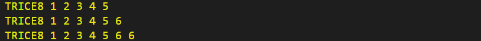

# Trice — Trace IDs for Embedded C

*Hi, I am Trice.*

**Log and trace in as few as 6 CPU clocks per call.**[1](#note-speed) 
Printf-like calls.[2](#note-calls) Compact records.[3](#note-records) Even from interrupt handlers.[4](#note-interrupts) 
Compiler-independent.[5](#note-compiler) ID-free user code.[6](#note-ids) Aliases for legacy code.[7](#note-aliases)

**[Explore Trice in the Guide](./docs/TriceGuide.md)**

See the moments that matter: a fleeting interrupt, a changing sensor value, or the response to a command.[8](#note-commands) Trice brings them into view while your firmware runs. Read events as text,[9](#note-text) work with structured values,[10](#note-fields) or watch measurements come alive in a plot.[11](#note-plots)

The Guide helps you choose your first experiment, discover the features, and find the details for your own project. Start on your PC, then explore what Trice can do on your hardware.

Small demo animation

If Trice helps your work, [support the project](./docs/TriceReferenceManual.md#support-and-sponsoring).

---

Footnotes:
<!-- Keep these links in an ordinary list: GitHub does not rewrite relative document links inside Markdown footnotes. -->

1. Record creation in an optimized configuration; transmission is handled separately. See the [measurement and configuration](./docs/TriceReferenceManual.md#trice-speed).
2. [Printf-like syntax and supported formats](./docs/TriceReferenceManual.md#trice-similarities-and-differences-to-printf-usage).
3. [Compact binary records and transfer size](./docs/TriceReferenceManual.md#minimal-transfer-bytes-amount).
4. Trice calls can be used directly inside interrupt handlers. The [example output](./docs/TriceReferenceManual.md#trice-tool-in-logging-action) shows interrupt-originated `ISR:` messages mixed with events from normal application code.
5. [Target-code portability and modularity](./docs/TriceReferenceManual.md#portability-and-modularity).
6. [Bind](./docs/TriceReferenceManual.md#trice-bind) keeps numeric IDs out of user log calls; see its [supported constructs and compiler requirements](./docs/TriceReferenceManual.md#bind-limits).
7. [Aliases for existing logging and assert macros](./docs/TriceReferenceManual.md#legacy-user-code-option-trice-aliases-adaptation).
8. [Asynchronous Broadcast Commands and responses](./docs/TriceReferenceManual.md#trice-abc---asynchronous-broadcast-commands).
9. [Text output and event boundaries](./docs/TriceReferenceManual.md#output-formats-and-event-boundaries).
10. [Structured Logging with named values](./docs/TriceReferenceManual.md#structured-logging).
11. [Live visualization with the LabPlot demo](./docs/TriceReferenceManual.md#setting-up-the-labplot-demo).
