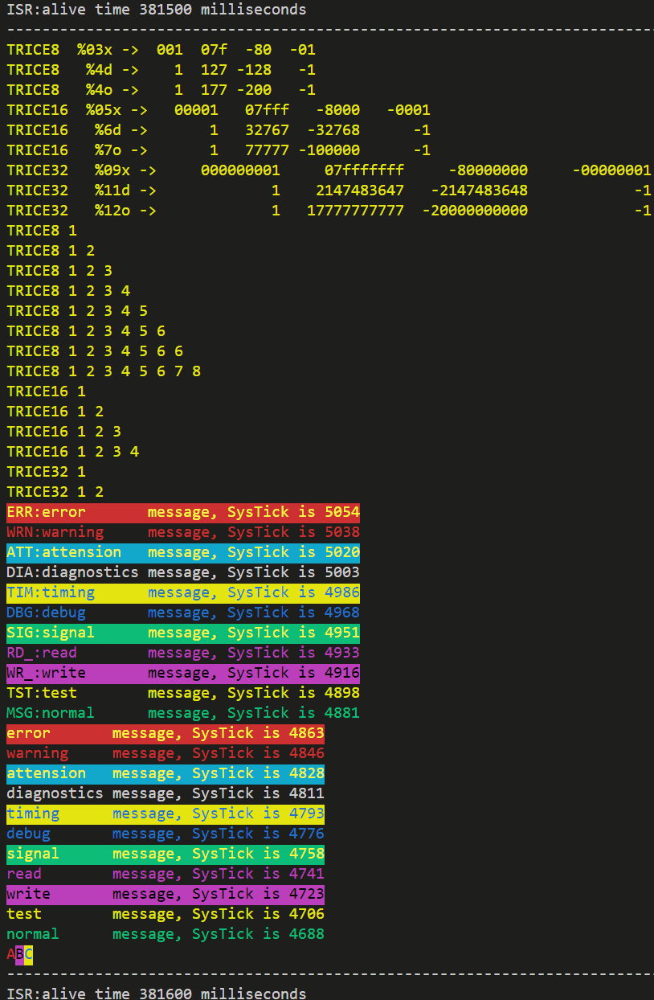

## `traceLog`
It is avoiding all the internal overhead (space and time) of a `printf()` 
statement. For example instead of writing 

```
printf("time is %d:%d:%d\n", hour, min, sec);
```
you can write
```
TL8("time is %d:%d:%d\n", hour, min, sec);
```
into a source file of your project. The `8` stays here for 8 bit values (`0`, `16` and `32` also possibe)

When performing  ```trice update``` this line changes to
```
TL8_3( Id(12345), "time is %d:%d:%du\n", hour, min, sec);
```
where ```12345``` is an as ID generated random number not used so far. Automatically
the ID is added to an ID list together with the appropriate format string 
information. The TL`8_3` means 3 bytes as parameters in
this example and allows efficient code and a compile time check.

*Right now the automatic replacement of TL8( ... ) with TL8_3( Id(12345), ...) is not fully implemented yet, so write TL8_3( Id(0), "time is %d:%d:%du\n", hour, min, sec); Also the total amount of data is currently limitated to 8 bytes, but this is easy to extend.*

When the embedded project is compiled, only the ID goes into the source image
but not the format string, what results in a smaller memory footprint.

During TL* runtime, inside the microcontroller only the ID (together with the 
parameters like hour, min, sec) is copied to a buffer. Execution time for a TL16_1
(as example) on a 48 MHz ARM is about 16 systicks resulting in 250 nanoseconds duration,
so you can use `tracelog` also inside interrupts. The needed buffer space is
one 32 bit word per normal traceLog (for up to 2 data bytes). Just in case the internal fifo overflows, the data are still in sync, you simply loose traces.

Slightly delayed in the background the trace goes to the communication port,
what is also fast compared to all the actions behind a `printf()` statement.

The buffered 4 byte traceLog is transmitted as an 8 byte packet allowing start byte, sender and
receiver addresses and CRC8 check to be used later in parallel with different
software protocols.

Please understand, that when debugging code containing TL* statements, during a 
TL* step-over only  one ore more 32 bit values go into the internal fifo buffer and no output
is visible because of the stopped target.

## `trice`

Executing `trice update` at the root of your project source updates the TL* statements inside the source code and the ID list (only where changes occured).

With `trice log -port COM12 -baud 115200` you can visualize the traceLogs on the PC, 
if for example `COM12` is receiving the data from the embedded device.

The following capture output comes from an example project inside`../examples`



See [traceLogCheck.c](../examples/traceLogDemoF030R8/Src/traceLogCheck.c) for reference.
The traceLogs can come mixed from inside interrupts (white `ISR:...`) or from normal code. For usage with a RTOS protect TL* against breaks. Regard the differences in the read SysTick values. These differeces are the MCU clocks needed for one tracelog (~0,25µs@48MHz).

Use `-color off` switch for piping output in a file or `-color alternate` for a different color set. *(color set designs are welcome, see func colorSetAlternate() in [emit.go](../pkg/emit/emit.go))*

## Setup

### Project structure
   name        | info                                                    |
---------------|---------------------------------------------------------|
cmd/           | the `trice` sources                                     |
pkg/           | the internal `trice`packages                            |
srcC/          | C sources for your embedded project                     | 
examples/      | example target projects                                 |
doc/           | documentation                                           |

### Check the `trice` binary
- Copy command trice into a path directory.
- Run inside a shell `trice check -list path/to/til.json`. You should see output like this:


### Instrument a target source code project (How to use tracelog in your project)

#### The part with the details
- Copy [proj_traceLogConfig.h](../scrC/proj_traceLogConfig.h) into your C|C++ source project, rename it to `traceLogConfig.h` and adapt it to your needs.
  - You may need to define the compiler specific stuff for your compiler.
  - If you short of RAM reduce the TL_FIFO_SIZE value - beware: it must be a power of 2! For many cases 64 bytes will do.
  - Next step is the adaption to your hardware. If you are using an STM32 device you can probably use the file [../examples/traceLogDemoF030R8/Inc/traceLogConfig.h](../examples/traceLogDemoF030R8/Inc/traceLogConfig.h) as a starting point and nearly unchanged, just the UART number may be different.
#### The easy going part
  - Include [traceLog.c](../scrC/traceLog.c) unchanged into your project and make sure the [traceLog.h](../scrC/traceLog.h) header file is found by your compiler.
- Add `#include "traceLog.h"` to your main.c[pp] and put `TL0( Id(0), "msg:Hello world!\n" );` after your initialization code.
- Run `trice u` at the root of your source code. Afterwards:
    - The `Id(0)` should have changed into `Id(12345)` as example. (The `12345` stays here for a 16bit non-zero random number).
    - A file til.json (**t**race **i**d **l**ist) should be generated.
    - Running `trice check` should show your message, indicating everything is fine so far.
- `trice help` is your friend if something fails.
- For help have a look at the differences between these 2 projects:
  - `../examples/generatedDemoF030R8` - It is just the STM32 CubeMX generated code.
  - `../examples/traceLDemoF030R8` - It is a copy of the above enhanced with traceLog check code.
- After compiling and flashing run `trice -port COMn -baud m` with n and m set to correct values
- Now start your device and you should see the hello world message coming from your target.
- If you use a legacy project containing `printf()` statements you can  simply transform them to **TL*** statements.
- It could be helpful to add `trice u ...` as prebuild step into your toolchain for each file or for the project as a whole. 
  This way you cannot forget the update step, it performs automatically.

## Notes
- Using traceLog not only for dynamic debugging but also as logging technique
    is possible and gives the advantage to have very short messages (no strings) for transmission, 
    but keep in mind that the file `til.json` is the key to read all 
    output if your devices in the field for 10 or more years.
- You can consider this also as a kind of intelligent data compression what could
    be interesting for IoT things, especially NB-IoT, where you have very low data rates.
- Also it is possible to encrypt the 8 byte transfer packets to get a reasonable protection for many cases.
  - Treyfer is a recommendation and planned as a coming option.
- You can even translate the til.json in different languages, so changing a 
    language is just changing the til.json file.
- traceLog has intentionally no timestamps for performance reasons. But you can add own timestamps as parameters. Having several devices with traceLog timestamps, network timing measurements are possible.
- During `trice update` so far unknown IDs are added to the ID list 
    (case new sources added) with a `Created` utc timestamp.
- If an ID was deleted inside the source tree (or file removal) the appropriate 
    ID's stay inside the ID list but get a `Removed` utc timestamp. *TODO*
- If the same ID appears again the appropriate `Removed` timestamp is deleted 
    inside the ID list and the ID is aktive again.
- If duplicate ID's with different format strings found inside the source tree 
  (case several developer) the newer ID is replaced by a new ID.
  - The probability for such case is low, because of the random ID generation.
- If the format string was modified, the ID goes into the `Removed` state and a 
  new ID is generated.
- Keeping obsolete IDs makes it more comfortable during development to deal with 
  dfferent firmware variants at the same time.
- This way you can simply copy a TL* statement and modify it without dealing with
  the ID. The trice tool will do for you.
- The ID list should go into the version control repository.
- For a firmware release it makes sense to remove all unused IDs from 
    til.json.
  - This could be done by deleting til.json, getting the legacy til.json from the former firmware release 
      from the source control system and enhance it with the actual release
      software IDs by simply calling 'trice update'.

## Build `trice` from Go sources
- Install Go, download the trice sources and cd into the `trice` directory
- Testing
```
go test ./...
```
- Build & Install
```
go install ./...
```
Afterwards you should find an executable `trice` inside $GOPATH/bin/
- Running
```
trice help
```

## Demo project setup
- see [ReadMeDemoF030R8.md](./ReadMeDemoF030R8.md)
