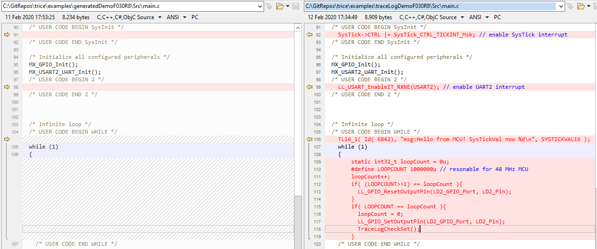
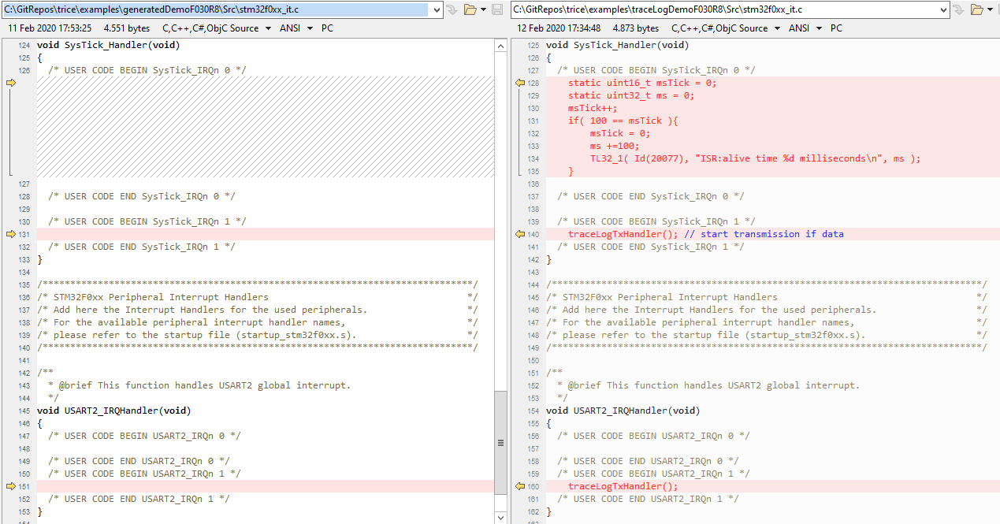

# TraceLog Demo Project NUCLEO-F030R8
## Prerequisites (as example)
- ST Microelectronic evaluation board NUCLEO-F030R8 or similar
  - costs about 10 EUR
- ST Microelectronic CubeMX
  - free
- ARMkeil IDE
  - free for small projects, also free license for some STM devices

## Demo Project setup steps (This is STM32 specific and shown here only for absolute beginners)

### CubeMx setup
- New project, select NUCLEO-F030R8 (answer "Yes")

  
- Enable USART2 interrupt: 

  
- Select LL instead of HAL for USART: 

  
- Necessary library files as reference:

  
- Set project name, location and toolchain: 

  
- Adjust baudrate of UART2 if you like. In the example project 115200 is used.
- Generate Code and open project: 
  
  

### ARMkeil IDE setup
#### Project settings
  - Add `traceLog.c` to the project
  - Extend include path with traceLog folder
  - Edit project settings: 
  
    
#### File compare
- `generatedDemoF030R8` - fresh empty STM32 CubMX project after CubeMX setup
- `traceLogDemoF030R8` - the `generatedDemoF030R8` equipped with traceLog
- Directories

  

  [traceLogConfig.h](../examples/traceLogDemoF030R8/Inc/traceLogConfig.h)

  [traceLogCheck.h](../examples/traceLogDemoF030R8/Inc/traceLogCheck.h)
  [traceLogCheck.c](../examples/traceLogDemoF030R8/Src/traceLogCheck.c)

  [til.json](../examples/traceLogDemoF030R8/MDK-ARM/til.json)

- Changes in main.c

  

- Changes in stm32f0xx_it.c

  

- Compile and flash

### Run

- Connect evaluation board over USB with PC and detect the virtual COM port `trice log -port COMscan`
- Execute `trice log -port COM12 -baud 115200`, when COM12 is your interface port