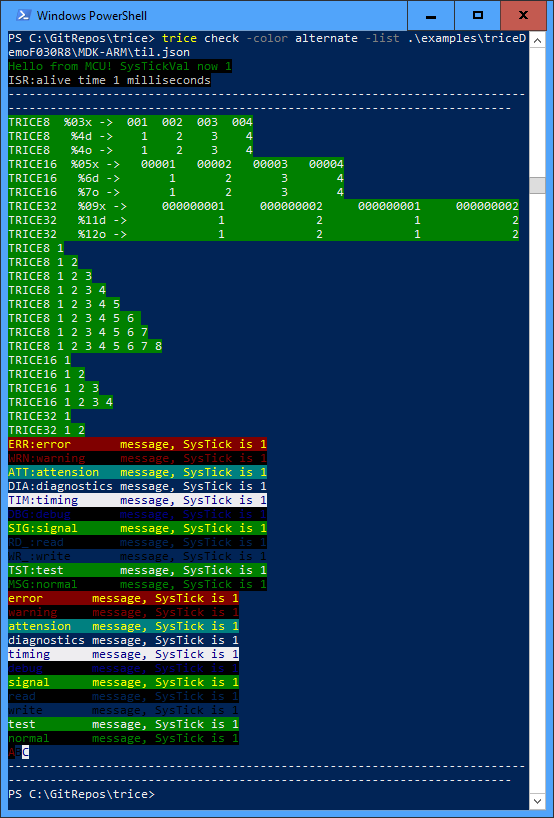

## `TRICE0` |`TRICE8` |`TRICE16` |`TRICE32` |`TRICE64` macro
It is avoiding all the internal overhead (space and time) of a `printf()` 
statement but is easy to use. For example instead of writing 

```
printf("time is %d:%d:%d\n", hour, min, sec);
```
you can write
```
TRICE8("time is %d:%d:%d\n", hour, min, sec);
```
into a source file of your project. The `8` stands here for 8 bit values (`0`, `16`, `32` and `64` also possibe). Only values of the same size are allowed in one TRICE* statement, but you can use `TRICE32` consequently to match most cases.

When performing `trice update` the source is parsed and in result this line changes to
```
TRICE8_3( Id(12345), "time is %d:%d:%d\n", hour, min, sec);
```
where ```12345``` is an as ID generated 16 bit random number not used so far. Automatically
the ID is added to an [ID list](../test/til.json) together with the appropriate format string information. The TRICE`8_3` means 3 bytes as parameters in
this example and allows efficient code and a compile time check.

*The total amount of data is currently limitated to 8 parameters for TRICE8 or 4 parameters for TRICE16 and TRICE32 and two parameters for TRICE64, but this is easy to extend.*

When the embedded project is compiled, only the ID goes to the binary
but not the format string, what results in a smaller memory footprint.

During TRICE* runtime, inside the microcontroller only the ID (together with the 
parameters like hour, min, sec) is copied to a buffer. Execution time for a TRICE16_1
(as example) on a 48 MHz ARM is about 16 systicks resulting in 250 nanoseconds duration,
so you can use `trice` also inside interrupts. The needed buffer space is
one 32 bit word per normal trice (for up to 2 data bytes). Just in case the internal fifo overflows, the data are still in sync, you simply loose trices.

Slightly delayed in the background the TRICE trace goes to the communication port,
what is also fast compared to all the actions behind a `printf()` statement.

The buffered 4 byte trice is transmitted as an 8 byte packet allowing start byte, sender and
receiver addresses and CRC8 check to be used later in parallel with different
software protocols.

Please understand, that when debugging code containing TRICE* statements, during a 
TRICE* step-over only  one ore more 32 bit values go into the internal fifo buffer and no output
is visible because of the stopped target.

## `trice`

Executing `trice update` at the root of your project source updates the TRICE* statements inside the source code and the ID list (only where changes occured).

With `trice log -port COM12 -baud 115200` you can visualize the trices on the PC, 
if for example `COM12` is receiving the data from the embedded device.

The following capture output comes from an example project inside`../examples`


See [triceCheck.c](../srcTrice.C/triceCheck.c) for reference.
The trices can come mixed from inside interrupts (white `ISR:...`) or from normal code. For usage with a RTOS protect TRICE* against breaks. Regard the differences in the read SysTick values inside the GIF above These differeces are the MCU clocks needed for one trice (~0,25µs@48MHz).

Use `-color off` switch for piping output in a file or `-color alternate` for a different color set. *(color set designs are welcome, see func colorSetAlternate() in [emit.go](../internal/emit/emit.go))*

## Setup

### Project structure
   name        | info                                                    |
---------------|---------------------------------------------------------|
cmd/           | the `trice` sources                                     |
pkg/           | the internal `trice`packages                            |
src.C/         | C sources for your embedded project                     | 
examples/      | example target projects                                 |
doc/           | documentation                                           |

### Check the `trice` binary
- Copy command trice into a path directory.
- Run inside a shell `trice check -list path/to/trice/examples/triceDemoF030R8/MDK-ARM/`[til.json](../examples/triceDemoF030R8/MDK-ARM/til.json). You should see output like this:


### Instrument a target source code project (How to use trice in your project)

  - Include [trice.c](../srcTrice.C/trice.c) unchanged into your project and make sure the [trice.h](../srcTrice.C/trice.h) header file is found by your compiler.
- Add `#include "trice.h"` to your project files where to use TRICE and put `TRICE0( Id(0), "msg:Hello world!\n" );` after your initialization code.
- Run `trice u` at the root of your source code. Afterwards:
    - The `Id(0)` should have changed into `Id(12345)` as example. (The `12345` stays here for a 16-bit non-zero random number).
    - A file [til.json](../test/til.json)  (**t**race **i**d **l**ist) should be generated.
    - Running `trice check` should show your message, indicating everything is fine so far.
- `trice help` is your friend if something fails.
- For help have a look at the differences between these 2 projects or into [DemoF030R8.md](./DemoF030R8.md)
  - `../examples/generatedDemoF030R8` - It is just the STM32 CubeMX generated code.
  - `../examples/traceLDemoF030R8` - It is a copy of the above enhanced with trice check code.
```
Quick and dirty option
======================
- Leave these definitions empty: 
  - TRICE_ENTER_CRITICAL_SECTION & TRICE_LEAVE_CRITICAL_SECTION
  - triceTxDataRegisterEmpty()
  - triceEableTxEmptyInterrupt() & triceDisableTxEmptyInterrupt()
- Use:
  - void triceTransmitData8( uint8_t d ){
    my_putchar( (char)d); // your code
  }
  Call TxStart();TxContinue(); cyclicylly in sufficient long intervals like 1 ms
```

- After compiling and flashing run `trice -port COMn -baud m` with n and m set to correct values
- Now start your device and you should see the hello world message coming from your target. In fact the hello-world string never went to the embedded device, only the ID comes from  there and the string is found in the [til.json](../test/til.json) file of your project.
- If you use a legacy project containing `printf()` statements you can simply transform them to **TRICE\*** statements. TRICE32 will do in most cases but for better performance take **TRCE8** or **TRICE16** where possible.
- `printf(...)` statements containing string format specifier are quickly portable by using `TRICE_P(...)` but without the trice space and speed advantage. The TRICE_P() is intended only for the few dynamic strings in a ported  projekt.  Enable `TRICE_PRINTF_ADAPTER` increases the needed code size by a few KB.
- It could be helpful to add `trice u ...` as prebuild step into your toolchain for each file or for the project as a whole. 
  This way you cannot forget the update step, it performs automatically.

## Memory needs (ARM example project)
Program Size (STM32-F030R8 demo project)     |trice instrumentation|buffer size|compiler optimze for time| comment
---------------------------------------------|------------------------|-----------|-------------------------|-----------------------------
Code=1592 RO-data=236 RW-data= 4 ZI-data=1028|        none            |        0  |         off             | CubeMX generated, no trice
Code=1712 RO-data=240 RW-data=24 ZI-data=1088|        core            |       64  |         off             | core added without trices
Code=3208 RO-data=240 RW-data=36 ZI-data=1540|    TriceCheckSet()  |      512  |         off             | TRICE_SHORT_MEMORY is 1 (small)
Code=3808 RO-data=240 RW-data=36 ZI-data=1540|    TriceCheckSet()  |      512  |         on              | TRICE_SHORT_MEMORY is 0 (fast)

- The core instrumentation needs less 150 bytes FLASH and about 100 bytes RAM when buffer size is 64 bytes.
- The about 50 trices in TriceCheckSet() allocate roughly 2100 (fast mode) or 1500 (small mode) bytes.
- trices are removable without code changes by defining `TRICE_OFF` on file or project level. 

## ID management internals & hints
- During `trice update` so far unknown IDs are added to the ID list (case new sources added) with a `Created` utc timestamp.
- If an ID was deleted inside the source tree (or file removal) the appropriate ID's stays inside the ID list but gets a `Removed` utc timestamp.
- If the same ID appears again the appropriate `Removed` timestamp is deleted inside the ID list and the ID is aktive again.
- If duplicate ID's with different format strings found inside the source tree (case several developers) the newer ID is replaced by a new ID. The probability for such case is low, because of the random ID generation.
- If the format string was modified, the ID goes into the `Removed` state and a new ID is generated.
- Keeping obsolete IDs makes it more comfortable during development to deal with different firmware variants at the same time.
- This way you can simply copy a TRICE* statement and modify it without dealing with the ID. The trice tool will do for you.
- The ID list should go into the version control repository of your project.
- For a firmware release it makes sense to remove all unused IDs (development garbage) from til.json.
  - This could be done by deleting til.json, getting the legacy til.json from the former firmware release from the source control system and enhance it with the actual release software IDs by simply calling 'trice update'.

## Encryption
- You can deliver your device with encrypted trices. This way nobody is able to read the trices despite the service guy.
- Implementd is XTEA but this is easy exchangeable.
- The 8 byte blocks can get enrypted by enabling `#define ENRYPT...` inside *config.h*. You need to add `-key test` as **log** switch and you're done.
- Any password is usable instead of `test`. Simply add once the `-show` switch and copy the displayed passphrase into the *config.h* file.


## Build `trice` from Go sources
- Install Go, download the trice sources and cd into the `trice` directory
- Testing
```
go test ./...
```
- Build & Install
```
go install ./...
```
Afterwards you should find an executable `trice` inside $GOPATH/bin/
- Running
```
trice help
```

## Demo project setup
- see [DemoF030R8.md](./DemoF030R8.md)

## Otions for `trice` tool
The trice tool can be started in several modes (subcommands), each with several mantadory or optional switches. Switches can have parameters or not.
```
trice subcommand -switch1 -switch2 parameter -switch3 ...
```
Which subcommand switches are usable for each subcommand is shown with `trice help`. This gives also information about their default values.
The common subcommand switches are documented the the [subcommand switches](#common-subcommand-switches-reference) section below.

Output of `trice h`:
```
syntax: 'trice subcommand' [params]
subcommand 'help', 'h'
subcommand 'u', 'upd', 'update'
  -dry-run
    	no changes are applied
  -list string
    	trice ID list path, "none" possible (default "til.json")
  -src value
    	source dir or file, multi use possible (default "./")
  -v	verbose
subcommand 'check'
  -color string
    	color set, options: off|alternate (default "default")
  -dataset string
    	parameters, option: negative (default "position")
  -list string
    	trice ID list path (default "til.json")
subcommand 'l', 'log'
  -baud int
    	COM baudrate (default 115200)
  -color string
    	color set, options: off|alternate (default "default")
  -key string
    	decrypt passphrase (default "none")
  -lf string
    	append all output to logfile, set to "off" (default "trice.log")
  -list string
    	trice ID list path (default "til.json")
  -port string
    	COM port, options: COM1|...|COM999 (default "COMscan")
  -show
    	show passphrase
  -ts string
    	timestamp, options: off|UTCmicro (default "LOCmicro")
subcommand 'zeroSourceTreeIds' (avoid using this subcommand normally)
  -dry-run
    	no changes are applied
  -src string
    	zero all Id(n) inside source tree dir (required)
subcommand 'v', 'ver', 'version'
  -lf string
    	append all output to logfile, set to "off" (default "trice.log")
subcommand 'ds', 'displayServer'
  -color string
    	color set, options: off|alternate (default "default")
  -ipa string
    	ip address (default "localhost")
  -ipp string
    	16 bit port number (default "61497")
  -lf string
    	append all output to logfile, set to "off" (default "trice.log")
  -ts string
    	timestampm options: off|UTCmicro (default "LOCmicro")
subcommand 'r', 'rec', 'receiver'
  -baud int
    	COM baudrate (default 115200)
  -ds
    	start display server 
  -ipa string
    	ip address (default "localhost")
  -ipp string
    	16 bit ip port number (default "61497")
  -key string
    	decrypt passphrase (default "none")
  -list string
    	trice ID list path (default "til.json")
  -port string
    	COM port, options: COM1|...|COM999 (default "COMscan")
  -show
    	show passphrase
examples:
    'trice update [-src sourcerootdir]', default sourcerootdir is ./
    'trice log [-port COMn] [-baud m]', default port is COMscan, default m is 38400, fixed to 8N1
    'trice zeroSourceTreeIds -dir sourcerootdir]'
    'trice version'
```

**You must not run `trice update...` inside the downloaded trice directory!** It would change files inside the test directories rsulting later in failed tests.

### Subcommand `help` (shortcut `h`)
- `trice help` will give you a short commandline options overview.

No additional switches available.

### Subcommand `version` (shortcut `v` or `ver`)
- `trice v` will print the version information.

No additional switches available.

### Subcommand `update` (shortcut `u` or `upd`)
- `trice update` will parse source tree(s) for changed TRICE macros, modify them appropirate and update/generate the JSON list

The `update` subcommand has no mantadory switches. Omitted optional switches are used with their default parameters. You **must not** run `trice update` on the downloaded trice directory. It would modify test files resulting in failed tests later on. But you can use the `-dry-run` switch.

### Subcommand `check` 
- `trice check` will check the JSON list and emit all TRICE statements inside the list once with a dataset.

#### `check` switch '-dataset'
- This is a `string` switch. It has one parameter. Its default value is `position`. That means each parameter has a different value. This is useful for testing.
- The `negative` value is uses a dataset with negative values for testing.

### Subcommand `log` (shortcut `l`)
With `trice log` the display mode is activated. 

### Subcommand `zeroSourceTreeIds`
Set all Id(n) inside source tree dir to Id(0). This subcommand is mainly for testing. Avoid using this subcommand normally. The switch `-src` is mantadory and no multi-flag here - for several source directories you need several runs.

### Subcommand `displayServer` (shortcut `ds`)
Running `trice ds` opens a display server to be used for displaying the TRICE logs remotely.

### Subcommand `receiver` (shortcut `r` or `rec)
Instead of `log`ging into the current window you can run `trice r` to log into a remote display. This is useful for sending keyboard commands to the target device because of the empty window. An other option would be to send different trice logs to different remote displays. For both the trice tool needs source code adaption. For now the `r` option is useful for example with an older notebook just as trice display.

#### `remoteDisplay` switch '-ds'
As example executing `trice rd -list examples/til.json  -port COM38 -ds` opens a separate display window automatically on the same PC.


### Common subcommand switches reference

Which subcommand switches are usable for each subcommand is shown with `trice help`. This gives also information about their default values.

#### subcommand switch '-baud' (COM port baudrate)
- This is an `int` switch. It has one parameter. Its default value is `115200`. 
- It is the only setup parameter. The other values default to 8N1 (8 data bits, no parity, one stopbit)

#### subcommand switch '-color' (palette)
- This is a `string` switch. It has one parameter. Its default value is `default`. 
- The `alternate` value uses a different color palette.
- 'off' suppresses all color information. Useful for redirecting in a file.

#### subcommand switch '-dry-run' (no changes)
- This is a `bool` switch. It has no parameters. Its default value is **false**. If the switch is applied its value is **true**.
- `trice u -dry-run` will change nothing but show changes it would perform without the `-dry-run` switch.

#### subcommand switch '-ipa' (IP address)
- This is a `string` switch. It has one parameter. Its default value is `localhost` (127.0.0.1).
You can specify this swich if you intend to use the remote display option to show the output on a different PC in the network. 

#### subcommand switch '-ipp' (IP port)
- This is a `string` switch. It has one parameter. Its default value is `61497`.
You can specify this swich if you want to change the used port number for the remote display functionality.

#### subcommand switch '-key' (encryption password)
- This is a `string` switch. It has one parameter. Its default value is `none`. If you change this value you need to compile the target with the appropriate key.
- This option is recommended if you deliver firmware to customers and want protect the trice log output. This does not work together with the `#define TRICE_STRINGS FULL_RUNTIME` option right now.

#### subcommand switch '-lf' (logfile)
- This is a `string` switch. It has one parameter. Its default value is `trice.log`. All trice output of the appropriate subcommands is appended per default into the logfile trice additionally to the normal output. Change the filename with `-lf myName.txt` or switch logging off with `-lf off`. See also
[logfile viewing](#Logfile-viewing).

#### subcommand switch '-list' (JSON ID list)
- This is a `string` switch. It has one parameter. Its default value is `./til.json` (the **t**race **i**d **l**ist inside the actual directory). The with '-list' specified JSON file is the key to display the ID coded trices during runtime and should be under version control.

#### subcommand switch '-port' (COM port)
- This is a `string` switch. It has one parameter. Its default value is `COMscan`. 
- Using a virtual serial COM port on the PC over a FTDI USB adapter is a most likely variant. Usually trice tool needs this switch in the form `-port COM9` if for example COM port 9 is used.
- With the default value trice scans for available COM ports.

#### subcommand switch '-show' (show passphrase)
- This is a `bool` switch. It has no parameters. Its default value is **false**. If the switch is applied its value is **true**.
- Use this switch for creating your own password keys. If applied together with `-key MyPwd` it shows the encryption key. Simply copy this key than into the line `#define ENCRYPT XTEA_KEY( a9, 4a, 8f, e5, cc, b1, 9b, a6, 1c, 4c, 08, 73, d3, 91, e9, 87 ); //!< -key test` inside triceConfig.h. 

#### subcommand switch '-src' (source directory)
- This is a `string` switch. It has one parameter. Its default value is `./` (the actual directory). 
- This is a multi-flag switch. It can be used several times and for directories and also for files. Right now not usable yet in the form "-src *.c".
- Example: `trice u  -dry-run -v -src ./examples/ -src src.C/trice.h` will scan all C|C++ header and source code files inside directory ./examples and scan also file trice.h inside src.C directory. It would create|extend a list file til.json in the current directory without the **-dry-run** Switch.

#### subcommand switch '-ts' (timestamp)
This timestamp switch generates the timestamps on the PC only, what is good enough for many cases. If you need precise target timestamps you need to generate them inside the target and send them as TRICE* parameters.
- This is a `string` switch. It has one parameter. Its default value is `LOCmicro`. That means local time with microseconds.
- `UTCmicro` shows timestamps in universal time.
- `off` no timestamps

#### subcommand switch '-v' (verbose)
- This is a `bool` switch. It has no parameters. Its default value is **false**. If the switch is applied its value is **true**.
- For example `trice u -dry-run -v` is the same as `trice u -dry-run` but with more descriptive output.

## Additional hints

### Logfile viewing
`trice` generated logfiles with subcommand switch `-color off` are normal ASCII files. If they are with color codes, these are ANSI excape sequences.
- One easy view option is `less -R trice.log`. The linux command `less` is also available inside the VScode terminal. 
- Under Windows one could also download and use [ansifilter](https://sourceforge.net/projects/ansifilter/) for logfile viewing. A monospaced font is recommended. 

### Color issues under Windows
**Currently CMD console colors are not enabled by default in Win10**, so if you see no color but escape sequences on your powershell or cmd window, please refer to
[Windows console with ANSI colors handling](https://superuser.com/questions/413073/windows-console-with-ansi-colors-handling/1050078#1050078) or simply use a Linux like terminal under windows, like git-bash. One option is also to install Microsoft *Windows Terminal (Preview)* from inside the Microsoft store and to start trice inside there. Unfortunally this can not be done automatically right now because of missing commandline switches.
