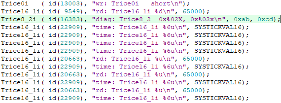

# Common information

A trice instruction is avoiding all the internal overhead (space and time) of a `printf()` statement but is easy to use. For example instead of writing

```c
printf("time is %d:%d:%d\n", hour, min, sec);
```

you can write

```c
TRICE8("time is %d:%d:%d\n", hour, min, sec);
```

into a source file of your project. The `8` stands here for 8 bit values (`0`, `16`, `32` and `64` also possibe). Only values of the same size are allowed in one TRICE* statement, but you can use `TRICE32` consequently to match most cases for the prize of little overhead.

When performing `trice update` the source (tree) is parsed and in result this line changes to

```c
TRICE8_3( Id(12345), "time is %d:%d:%d\n", hour, min, sec);
```

where ```12345``` is an as ID generated 20-bit (15-bit for short trices) random (upward|downward also possible) number not used so far. This is valid for the recommended **flex[L]** encoding. It supports more than 1 Million different trice IDs.
Automatically the ID is added to an [ID list](https://github.com/rokath/trice/blob/master/til.json) together with the appropriate format string information. The TRICE`8_3` means 3 bytes as parameters in this example and allows efficient code and a compile time check.

*The total amount of data is currently limitated to 8 parameters for TRICE8 or 4 parameters for TRICE16 and TRICE32 and two parameters for TRICE64, but this is easy to extend if needed.*

When the embedded project is compiled, only the ID goes to the binary
but not the format string, what results in a smaller memory footprint.

On execution the ID is pushed into a FIFO together with the optional trice parameters and that is the real fast and important part which could be finished within 12-14 processor clocks (measured on a ARM M0 with `Trice16_1i`). At 48 MHz the in time needed light travels less than 100 meters. Slightly delayed in the background the TRICE trace goes to the communication port, what is also fast compared to all the actions behind a `printf()` statement.

Please understand, that when debugging code containing TRICE\* statements, during a TRICE\* step-over only  one ore more 32 bit values go into the internal fifo buffer and no serial output
is visible because of the stopped target. But the SEGGER debug probe reads out the RTT memory and this way also during debug stepping realtime trice output is visible. That is (right now) not true for the STLINK interface because the is only one USB enpoint.

## trice instructions: `TRICE`, `Trice` or `trice` with or without ending letter 'i'?

There are several types of trice statements. All trice statements can have an additional letter 'i'. This means **i**nside critical section. You can use these when it is sure not to get interrupted by other trices. If for example an interrupt contains a trice statement this can be an i-trice but other trices not allowed to be an i-trice, they need to be normal trices, which are protected against interruption. If you are not sure it is always safe to use normal trices (without ending 'i'). The i-trices are a bit faster what is not relevant in most cases because of the general speed.

- `Trice0`, `Trice8_1`, `Trice16_1` and `Trice8_2` are so called short trice macros. They use internal a smaller encoding and have only a 15-bit ID size, means ID's 1-32767 are usable. These are the fastest trices and with them the speed limit is reached.  The number in the blue lines is the current processor tick. For `Trice16_1i` the difference between neibours is about 13 clocks. Short trices need 'id(0)' instead 'Id(0)' as important difference to normal trices.
- `TRICE0`, `TRICE8_1`, ... `TRICE8_8`, `TRICE16_1`, ... `TRICE16_4`, `TRICE32_1`, ... `TRICE32_4`, `TRICE64_1`, `TRICE64_2` are normal trice macros. They insert code directly (no function call) for better performance but the drawback is the rising code amount when many trices are used.
- `trice0`, `trice8_1`, ... `trice8_8`, `trice16_1`, ... `trice16_4`, `trice32_1`, ... `trice32_4`, `trice64_1`, `trice64_2` are normal trice functions. The function call overhead is reasonable and the advantage is significant less code amount when many trices are used.
- For most flexibility the code for each trice function can be enabled or not inside the triceConfig.h.

## `trice` tool

Executing `trice update` at the root of your project source updates in case of changes the trice statements inside the source code and the ID list. The `-src` switch can be used multiple times to keep the amount of parsed data small for better speed.

With `trice log -port COM12 -baud 115200` you can visualize the trices on the PC, if for example `COM12` is receiving the data from the embedded device.

The following capture output comes from an example project inside`../test`


See [triceCheck.c](https://github.com/rokath/trice/blob/master/srcTrice.C/triceCheck.c) for reference.
The trices can come mixed from inside interrupts (light blue `ISR:...`) or from normal code. For usage with a RTOS trices are protected against breaks (CRITICAL_SECTION). Regard the differences in the read SysTick values inside the GIF above These differeces are the MCU clocks needed for one trice (~0,25µs@48MHz).

Use the `-color off` switch for piping output in a file.

## Setup

### Project structure

   name        | info                                                    |
---------------|---------------------------------------------------------|
cmd/trice      | `trice` tool command Go sources                         |
docs/          | documentation                                           |
internal/      | `trice` tool internal Go packages                       |
pkg/           | `trice` tool common Go packages                         |
srcTrice.C/    | C sources for trice instrumentation                     |
test/          | example target projects                                 |
third_party/   | external components                                     |

<!---
### Check the `trice` binary
- Copy command trice into a path directory.
- Run inside a shell `trice check -list path/to/trice/examples/triceDemoF030R8/MDK-ARM/`[til.json](../examples/triceDemoF030R8/MDK-ARM/til.json). You should see output like this:

--->

### Instrument a target source code project (How to use trice in your project)

Look at one of the appropriate test projects as example. In general:

- Copy [_triceConfig.h](https://github.com/rokath/trice/tree/master/srcTrice.C/_triceConfig.h), rename to `triceConfig.h` and adapt to your needs.

- Make sure the [trice.h](https://github.com/rokath/trice/blob/master/srcTrice.C/trice.h) header file is found by your compiler and for

<!---
  - bare or wrap transfer format
    Include [triceBareFifo.c](https://github.com/rokath/trice/blob/master/srcTrice.C/triceBareFifo.c) together with [triceBareFifoToBytesBuffer.c](https://github.com/rokath/trice/blob/master/srcTrice.C/triceBareFifoToBytesBuffer.c) into your project.

    Include [trice.c](https://github.com/rokath/trice/blob/master/srcTrice.C/trice.c)

  - esc transfer format
    Include [triceEscFifo.c](https://github.com/rokath/trice/blob/master/srcTrice.C/triceEscFifo.c) into your project.
--->
Next steps:

- Add `#include "trice.h"` to your project files where to use TRICE macros and put `TRICE0( "msg:Hello world!\n" );` after your initialization code.
- Run `trice u` at the root of your source code. Afterwards:
  - It should have changed into `TRICE0( Id(12345), "msg:Hello world!\n" );` as example. (The `12345` stays here for a 16-bit non-zero random number).
  - A file [til.json](https://github.com/rokath/trice/blob/master/til.json)  (**t**race **i**d **l**ist) should be generated.
- Set up timer and UART interrupt and main loop in the right way. Analyze the test example projects for advice.

<!---    - Running `trice check` should show your message, indicating everything is fine so far.--->

- For help have a look at the differences between these 2 projects:
  - `../test/MDK-ARM_LL_generatedDemo_STM32F030R8-NUCLEO-64` - It is just the STM32 CubeMX generated code.
  - `../test/MDK-ARM_LL_UART_RTT0_FLEX_STM32F030R8-NUCLEO-64` - It is a copy of the above enhanced with trice check code.

```b
Quick and dirty option
======================
- Leave these definitions empty: 
  - TRICE_ENTER_CRITICAL_SECTION & TRICE_LEAVE_CRITICAL_SECTION
  - triceTxDataRegisterEmpty()
  - triceEableTxEmptyInterrupt() & triceDisableTxEmptyInterrupt()
- Use:
  - void triceTransmitData8( uint8_t d ){
    my_putchar( (char)d); // your code
  }
  Call TxStart();TxContinue(); cyclicylly in sufficient long intervals like 1 ms
```

- After compiling and flashing run `trice -port COMn -baud m` with n and m set to correct values
- Now start your device and you should see the hello world message coming from your target. In fact the hello-world string never went to the embedded device, only the ID comes from  there and the string is found in the [til.json](../test/til.json) file of your project.
- If you use a legacy project containing `printf()` statements you can simply transform them to **TRICE\*** statements. TRICE32 will do in most cases but for better performance take **TRCE8** or **TRICE16** where possible.
- `printf(...)` statements containing string format specifier are quickly portable by using `TRICE_P(...)` but without the trice space and speed advantage. The TRICE_P() is intended only for the few dynamic strings in a ported  projekt.  Enable `TRICE_PRINTF_ADAPTER` increases the needed code size by a few KB.
- It could be helpful to add `trice u ...` as prebuild step into your toolchain for each file or for the project as a whole.
  This way you cannot forget the update step, it performs automatically.

## Memory needs (ARM example project)

Program Size (STM32-F030R8 demo project)     |trice instrumentation|buffer size|compiler optimze for time| comment
---------------------------------------------|------------------------|-----------|-------------------------|-----------------------------
Code=1592 RO-data=236 RW-data= 4 ZI-data=1028|        none            |        0  |         off             | CubeMX generated, no trice
Code=1712 RO-data=240 RW-data=24 ZI-data=1088|        core            |       64  |         off             | core added without trices
Code=3208 RO-data=240 RW-data=36 ZI-data=1540|    TriceCheckSet()  |      512  |         off             | TRICE_SHORT_MEMORY is 1 (small)
Code=3808 RO-data=240 RW-data=36 ZI-data=1540|    TriceCheckSet()  |      512  |         on              | TRICE_SHORT_MEMORY is 0 (fast)

- The core instrumentation needs less 150 bytes FLASH and about 100 bytes RAM when buffer size is 64 bytes.
- The about 50 trices in TriceCheckSet() allocate roughly 2100 (fast mode) or 1500 (small mode) bytes.
- trices are removable without code changes by defining `TRICE_OFF` on file or project level.

## Encryption

- You can deliver your device with encrypted trices. This way nobody is able to read the trices despite the service guy.
- Implementd is XTEA but this is easy exchangeable.
- The 8 byte blocks can get enrypted by enabling `#define ENRYPT...` inside *triceConfig.h*. You need to add `-key test` as **log** switch and you're done.
- Any password is usable instead of `test`. Simply add once the `-show` switch and copy the displayed passphrase into the *config.h* file.

## Options for `trice` tool

The trice tool is very easy to use even it has a plenty of options. Most of them normally not needed.
The trice tool can be started in several modes (subcommands), each with several mantadory or optional switches. Switches can have parameters or not.

```b
trice subcommand -switch1 -switch2 parameter -switch3 ...
```

Which subcommand switches are usable for each subcommand is shown with `trice help -all`. This gives also information about their default values.

Output of `trice h -all`: (Actual version could slightly differ)

```b
$ trice help -all
syntax: 'trice subcommand' [params]
subcommand 'ds|displayServer': Starts a display server.
        Use in a separate console. On Windows use wt (https://github.com/microsoft/terminal) or a linux shell like git-bash to avoid ANSI color issues.
        Running "trice ds" inside a console opens a display server to be used for displaying the TRICE logs remotely.
        Several instances of 'trice l -ds -port ...' (for different ports) will send output there in parallel.
  -color string
        The format strings can start with a lower or upper case channel information.
        See https://github.com/rokath/trice/blob/master/srcTrice.C/triceCheck.c for examples. Color options:
        "off": Disable ANSI color. The lower case channel information is kept: "w:x"-> "w:x"
        "none": Disable ANSI color. The lower case channel information is removed: "w:x"-> "x"
        "default|color": Use ANSI color codes for known upper and lower case channel info are inserted and lower case channel information is removed.
         (default "default")
  -ipa string
        IP address like '127.0.0.1'.
        You can specify this swich if you intend to use the remote display option to show the output on a different PC in the network.
         (default "localhost")
  -ipp string
        16 bit IP port number.
        You can specify this swich if you want to change the used port number for the remote display functionality.
         (default "61497")
  -logfile string
        Append all output to logfile. Options are: 'off|none|filename|auto':
        "off": no logfile (same as "none")
        "none": no logfile (same as "off")
        "auto": Use as logfile name "2006-01-02_1504-05_trice.log" with actual time.
        "filename": Any other string than "auto", "none" or "off" is treated as a filename. If the file exists, logs are appended.
        All trice output of the appropriate subcommands is appended per default into the logfile trice additionally to the normal output.
        Change the filename with "-logfile myName.txt" or switch logging off with "-logfile none".
         (default "off")
example: 'trice ds': Start display server.
subcommand 'h|help': For command line usage.
        "trice h" will print this help text as a whole.
  -all
        Show all help.
  -displayserver
        Show ds|displayserver specific help.
  -ds
        Show ds|displayserver specific help.
  -h    Show h|help specific help.
  -help
        Show h|help specific help.
  -l    Show l|log specific help.
  -log
        Show l|log specific help.
  -logfile string
        Append all output to logfile. Options are: 'off|none|filename|auto':
        "off": no logfile (same as "none")
        "none": no logfile (same as "off")
        "auto": Use as logfile name "2006-01-02_1504-05_trice.log" with actual time.
        "filename": Any other string than "auto", "none" or "off" is treated as a filename. If the file exists, logs are appended.
        All trice output of the appropriate subcommands is appended per default into the logfile trice additionally to the normal output.
        Change the filename with "-logfile myName.txt" or switch logging off with "-logfile none".
         (default "off")
  -r    Show r|refresh specific help.
  -refresh
        Show r|refresh specific help.
  -renew
        Show renew specific help.
  -s    Show s|scan specific help.
  -scan
        Show s|scan specific help.
  -sd
        Show sd|shutdown specific help.
  -shutdown
        Show sd|shutdown specific help.
  -u    Show u|update specific help.
  -update
        Show u|update specific help.
  -v    short for verbose
  -ver
        Show ver|version specific help.
  -verbose
        Gives more informal output if used. Can be helpful during setup.
        For example "trice u -dry-run -v" is the same as "trice u -dry-run" but with more descriptive output.
        This is a bool switch. It has no parameters. Its default value is false. If the switch is applied its value is true.
  -version
        Show ver|version specific help.
  -z    Show zeroSourceTreeIds specific help.
  -zeroSourceTreeIds
        Show zeroSourceTreeIds specific help.
example 'trice h': Print short help.
example 'trice h -all': Print all help.
example 'trice h -log': Print log help.
subcommand 'l|log': For displaying trice logs coming from port. With "trice log" the trice tool display mode is activated.
  -a    Short for '-autostart'.
  -args string
        Use to pass port specific parameters. The "default" value depends on the used port:
        port "COMn": default="", use "TARM" for a different driver. (For baud rate settings see -baud.)
        port "J-LINK": default="-Device STM32F030R8 -if SWD -Speed 4000 -RTTChannel 0 -RTTSearchRanges 0x20000000_0x1000",
                The -RTTSearchRanges "..." need to be written without "" and with _ istead of space.
                For args options see JLinkRTTLogger in SEGGER UM08001_JLink.pdf.
        port "ST-LINK": default="-Device STM32F030R8 -if SWD -Speed 4000 -RTTChannel 0 -RTTSearchRanges 0x20000000_0x1000",
                The -RTTSearchRanges "..." need to be written without "" and with _ istead of space.
                For args options see JLinkRTTLogger in SEGGER UM08001_JLink.pdf.
        port "BUFFER": default="0 0 0 0", Option for args is any byte sequence.
         (default "default")
  -autostart
        Autostart displayserver @ ipa:ipp.
        Works not perfect with windows, because of cmd and powershell color issues and missing cli params in wt and gitbash.
        Example: "trice l -port COM38 -displayserver -autostart" opens a separate display window automatically on the same PC.
        This is a bool switch. It has no parameters. Its default value is false. If the switch is applied its value is true.
  -baud int
        Set the serial port baudrate.
        It is the only setup parameter. The other values default to 8N1 (8 data bits, no parity, one stopbit).
         (default 115200)
  -color string
        The format strings can start with a lower or upper case channel information.
        See https://github.com/rokath/trice/blob/master/srcTrice.C/triceCheck.c for examples. Color options:
        "off": Disable ANSI color. The lower case channel information is kept: "w:x"-> "w:x"
        "none": Disable ANSI color. The lower case channel information is removed: "w:x"-> "x"
        "default|color": Use ANSI color codes for known upper and lower case channel info are inserted and lower case channel information is removed.
         (default "default")
  -displayserver
        Send trice lines to displayserver @ ipa:ipp.
        Example: "trice l -port COM38 -ds -ipa 192.168.178.44" sends trice output to a previously started display server in the same network.
  -ds
        Short for '-displayserver'.
  -e string
        Short for -encoding. (default "flexL")
  -encoding string
        The trice transmit data format type, options: 'esc|ESC|(flex|FLEX)[(L|l)]'. Target device encoding must match. (default "flexL")
  -i string
        Short for '-idlist'.
         (default "til.json")
  -idlist string
        The trice ID list file.
        The specified JSON file is needed to display the ID coded trices during runtime and should be under version control.
         (default "til.json")
  -ipa string
        IP address like '127.0.0.1'.
        You can specify this swich if you intend to use the remote display option to show the output on a different PC in the network.
         (default "localhost")
  -ipp string
        16 bit IP port number.
        You can specify this swich if you want to change the used port number for the remote display functionality.
         (default "61497")
  -logfile string
        Append all output to logfile. Options are: 'off|none|filename|auto':
        "off": no logfile (same as "none")
        "none": no logfile (same as "off")
        "auto": Use as logfile name "2006-01-02_1504-05_trice.log" with actual time.
        "filename": Any other string than "auto", "none" or "off" is treated as a filename. If the file exists, logs are appended.
        All trice output of the appropriate subcommands is appended per default into the logfile trice additionally to the normal output.
        Change the filename with "-logfile myName.txt" or switch logging off with "-logfile none".
         (default "off")
  -p string
        short for -port (default "J-LINK")
  -password string
        The decrypt passphrase. If you change this value you need to compile the target with the appropriate key (see -showKeys).
        Encryption is recommended if you deliver firmware to customers and want protect the trice log output. This does work right now only with flex and flexL format.
  -port string
        receiver device: 'ST-LINK'|'J-LINK'|serial name.
        The serial name is like 'COM12' for Windows or a Linux name like '/dev/tty/usb12'.
        Using a virtual serial COM port on the PC over a FTDI USB adapter is a most likely variant.
         (default "J-LINK")
  -prefix string
        Line prefix, options: any string or 'off|none' or 'source:' followed by 0-12 spaces, 'source:' will be replaced by source value e.g., 'COM17:'. (default "source: ")
  -pw string
        Short for -password. (default "none")
  -s    Short for '-showInputBytes'.
  -showInputBytes
        Show incoming bytes, what can be helpful during setup.
        This is a bool switch. It has no parameters. Its default value is false. If the switch is applied its value is true.
  -showKey
        Show encryption key. Use this switch for creating your own password keys. If applied together with "-password MySecret" it shows the encryption key.
        Simply copy this key than into the line "#define ENCRYPT XTEA_KEY( ea, bb, ec, 6f, 31, 80, 4e, b9, 68, e2, fa, ea, ae, f1, 50, 54 ); //!< -password MySecret" inside triceConfig.h.
        This is a bool switch. It has no parameters. Its default value is false. If the switch is applied its value is true.
  -suffix string
        Append suffix to all lines, options: any string.
  -testTable
        Generate testTable output and ignore -prefix, -suffix, -ts, -color. This is a bool switch. It has no parameters. Its default value is false. If the switch is applied its value is true.
  -ts string
        PC timestamp for logs and logfile name, options: 'off|none|UTCmicro|zero'
        This timestamp switch generates the timestamps on the PC only (reception time), what is good enough for many cases.
        "LOCmicro" means local time with microseconds.
        "UTCmicro" shows timestamps in universal time.
        When set to "off" no PC timestamps displayed.
        If you need target timestamps you need to get the time inside the target and send it as TRICE* parameter.
         (default "LOCmicro")
  -u    Short for '-unsignedHex'.
  -unsignedHex
        Hex and Bin values are printed as unsigned values.
  -v    short for verbose
  -verbose
        Gives more informal output if used. Can be helpful during setup.
        For example "trice u -dry-run -v" is the same as "trice u -dry-run" but with more descriptive output.
        This is a bool switch. It has no parameters. Its default value is false. If the switch is applied its value is true.
example: 'trice l -p COM15 -baud 38400': Display trice log messages from serial port COM15
example: 'trice l': Display flexL data format trice log messages from default source J-LINK over Segger RTT protocol.
example: 'trice l -port ST-LINK -v -s': Shows verbose version information and also the received raw bytes.
subcommand 'r|refresh': For updating ID list from source files but does not change the source files.
        "trice refresh" will parse source tree(s) for TRICE macros, and refresh/generate the JSON list.
        This command should be run on adding souce files to the project before the first time "trice update" is called.
        If the new source files contain TRICE macros with IDs these are added to til.json if not already used.
        Already used IDs are reported, so you have the chance to remnove them from til.son and then do "trice u" again.
        This way you can make sure to get the new sources unchanged in your list. (to do: -force switch)
        Already used IDs are replaced by new IDs during the next "trice update", so the old IDs in the list will survive.
        If you do not refresh the list after adding source files and perform an "trice update" new generated IDs could be equal to
        IDs used in the added sources with the result that IDs in the added sources could get changed what you may not want.
        Using "trice u -IDMethod random" (default) makes the chance for such conflicts very low.
        The "refresh" subcommand has no mantadory switches. Omitted optional switches are used with their default parameters.
  -dry-run
        No changes applied but output shows what would happen.
        "trice refresh -dry-run" will change nothing but show changes it would perform without the "-dry-run" switch.
        This is a bool switch. It has no parameters. Its default value is false. If the switch is applied its value is true.
  -i string
        Short for '-idlist'.
         (default "til.json")
  -idlist string
        The trice ID list file.
        The specified JSON file is needed to display the ID coded trices during runtime and should be under version control.
         (default "til.json")
  -s value
        Short for src.
  -src value
        Source dir or file, It has one parameter. Not usable in the form "-src *.c".
        This is a multi-flag switch. It can be used several times for directories and also for files.
        Example: "trice refresh -dry-run -v -src ./test/ -src srcTrice.C/trice.h" will scan all C|C++ header and
        source code files inside directory ./test and scan also file trice.h inside srcTrice.C directory.
        Without the "-dry-run" switch it would create|extend a list file til.json in the current directory.
         (default "./")
  -v    short for verbose
  -verbose
        Gives more informal output if used. Can be helpful during setup.
        For example "trice u -dry-run -v" is the same as "trice u -dry-run" but with more descriptive output.
        This is a bool switch. It has no parameters. Its default value is false. If the switch is applied its value is true.
example: 'trice refresh': Update ID list from source tree.
subcommand 'renew': It is like refresh, but til.json is cleared first, so all 'old' trices are removed. Use with care.
  -dry-run
        No changes applied but output shows what would happen.
        "trice renew -dry-run" will change nothing but show changes it would perform without the "-dry-run" switch.
        This is a bool switch. It has no parameters. Its default value is false. If the switch is applied its value is true.
  -i string
        Short for '-idlist'.
         (default "til.json")
  -idlist string
        The trice ID list file.
        The specified JSON file is needed to display the ID coded trices during runtime and should be under version control.
         (default "til.json")
  -s value
        Short for src.
  -src value
        Source dir or file, It has one parameter. Not usable in the form "-src *.c".
        This is a multi-flag switch. It can be used several times for directories and also for files.
        Example: "trice renew -dry-run -v -src ./test/ -src srcTrice.C/trice.h" will scan all C|C++ header and
        source code files inside directory ./test and scan also file trice.h inside srcTrice.C directory.
        Without the "-dry-run" switch it would create|extend a list file til.json in the current directory.
         (default "./")
  -v    short for verbose
  -verbose
        Gives more informal output if used. Can be helpful during setup.
        For example "trice u -dry-run -v" is the same as "trice u -dry-run" but with more descriptive output.
        This is a bool switch. It has no parameters. Its default value is false. If the switch is applied its value is true.
example: 'trice renew': Rebuild ID list from source tree, discard old IDs.
subcommand 's|scan': Shows available serial ports)
example: 'trice s': Show COM ports.
subcommand 'sd|shutdown': Ends display server at IPA:IPP, works also on a remote mashine.
  -ipa string
        IP address like '127.0.0.1'.
        You can specify this swich if you intend to use the remote display option to show the output on a different PC in the network.
         (default "localhost")
  -ipp string
        16 bit IP port number.
        You can specify this swich if you want to change the used port number for the remote display functionality.
         (default "61497")
example: 'trice sd': Shut down remote display server.
subcommand 'ver|version': For displaying version information.
        "trice v" will print the version information. In trice is unversioned the build time will be displayed instead.
  -logfile string
        Append all output to logfile. Options are: 'off|none|filename|auto':
        "off": no logfile (same as "none")
        "none": no logfile (same as "off")
        "auto": Use as logfile name "2006-01-02_1504-05_trice.log" with actual time.
        "filename": Any other string than "auto", "none" or "off" is treated as a filename. If the file exists, logs are appended.
        All trice output of the appropriate subcommands is appended per default into the logfile trice additionally to the normal output.
        Change the filename with "-logfile myName.txt" or switch logging off with "-logfile none".
         (default "off")
  -v    short for verbose
  -verbose
        Gives more informal output if used. Can be helpful during setup.
        For example "trice u -dry-run -v" is the same as "trice u -dry-run" but with more descriptive output.
        This is a bool switch. It has no parameters. Its default value is false. If the switch is applied its value is true.
subcommand 'u|update': For updating ID list and source files.
        "trice update" will parse source tree(s) for new or changed TRICE macros, modify them appropriate and update/generate the JSON list.
        The "update" subcommand has no mantadory switches. Omitted optional switches are used with their default parameters.
  -IDMax value
        Upper end of ID range for normal trices. (default 65535)
  -IDMaxShort value
        Upper end of ID range for short trices. (default 32767)
  -IDMethod string
        Search method for new ID's in range- Options are 'upward', 'downward' & 'random'. (default "random")
  -IDMin value
        Lower end of ID range for normal trices. (default 32768)
  -IDMinShort value
        Lower end of ID range for short trices. (default 1)
  -dry-run
        No changes applied but output shows what would happen.
        "trice update -dry-run" will change nothing but show changes it would perform without the "-dry-run" switch.
        This is a bool switch. It has no parameters. Its default value is false. If the switch is applied its value is true.
  -i string
        Short for '-idlist'.
         (default "til.json")
  -idlist string
        The trice ID list file.
        The specified JSON file is needed to display the ID coded trices during runtime and should be under version control.
         (default "til.json")
  -s value
        Short for src.
  -sharedIDs
        New ID policy:
        true: TriceFmt's without TriceID get equal TriceID if an equal TriceFmt exists already.
        false: TriceFmt's without TriceID get a different TriceID if an equal TriceFmt exists already. (default true)
  -src value
        Source dir or file, It has one parameter. Not usable in the form "-src *.c".
        This is a multi-flag switch. It can be used several times for directories and also for files.
        Example: "trice update -dry-run -v -src ./test/ -src srcTrice.C/trice.h" will scan all C|C++ header and
        source code files inside directory ./test and scan also file trice.h inside srcTrice.C directory.
        Without the "-dry-run" switch it would create|extend a list file til.json in the current directory.
         (default "./")
  -v    short for verbose
  -verbose
        Gives more informal output if used. Can be helpful during setup.
        For example "trice u -dry-run -v" is the same as "trice u -dry-run" but with more descriptive output.
        This is a bool switch. It has no parameters. Its default value is false. If the switch is applied its value is true.
example: 'trice update -src ../A -src ../../B': Parse ../A and ../../B with all subdirectories for TRICE IDs to update and adjusts til.json
subcommand 'zeroSourceTreeIds': Set all Id(n) inside source tree dir to Id(0).
        Avoid using this subcommand normally. The switch "-src" is mantadory and no multi-flag here.
        This subcommand is mainly for testing. For several source directories you need several runs.
  -dry-run
        No changes applied but output shows what would happen.
        "trice zeroSourceTreeIds -dry-run" will change nothing but show changes it would perform without the "-dry-run" switch.
        This is a bool switch. It has no parameters. Its default value is false. If the switch is applied its value is true.
  -src string
        Zero all Id(n) inside source tree dir, required.
example: 'trice zeroSourceTreeIds -src ../A': Sets all TRICE IDs to 0 in ../A. Use with care!
```

<!---
### Subcommand `check` 
- `trice check` will check the JSON list and emit all TRICE statements inside the list once with a dataset.

#### `check` switch '-dataset'
- This is a `string` switch. It has one parameter. Its default value is `position`. That means each parameter has a different value. This is useful for testing.
- The `negative` value is uses a dataset with negative values for testing.
--->

## Additional hints

### Logfile viewing

`trice` generated logfiles with subcommand switch `-color off` are normal ASCII files. If they are with color codes, these are ANSI excape sequences.

- One easy view option is `less -R trice.log`. The linux command `less` is also available inside the VScode terminal.
- Under Windows one could also download and use [ansifilter](https://sourceforge.net/projects/ansifilter/) for logfile viewing. A monospaced font is recommended.

### Color issues under Windows

**Currently CMD console colors are not enabled by default in Win10**, so if you see no color but escape sequences on your powershell or cmd window, please refer to
[Windows console with ANSI colors handling](https://superuser.com/questions/413073/windows-console-with-ansi-colors-handling/1050078#1050078) or simply use a Linux like terminal under windows, like git-bash. One option is also to install Microsoft *Windows Terminal (Preview)* from inside the Microsoft store and to start trice inside there. Unfortunally this can not be done automatically right now because of missing commandline switches.
