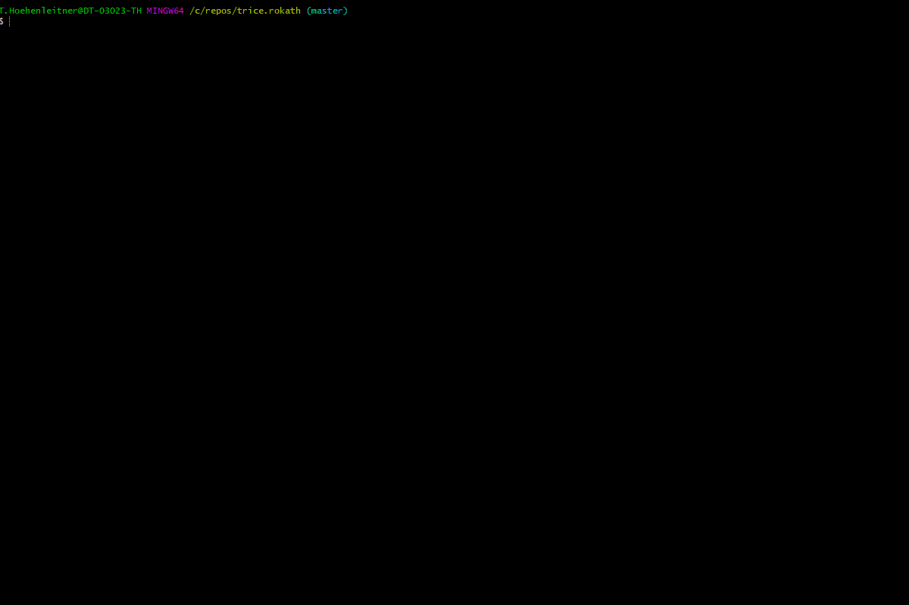

# *Trice* Similarities and differences to `printf` usage

* Each `TRICE` caries an [ID](./IDManagement.md) as runtime replacement for the format string.

## *Trice* values bit width

* No need to explicit express the value bit width.
* The default parameter width for the `TRICE` macro is 32 bit. It is changeable and recommended for 16-bit MCUs.
  * Adapt settings inside `triceConfig.h` and use `-defaultTRICEBitwidth` switch during logging.
* The macros `TRICE8`, `TRICE16`, `TRICE32`, `TRICE64` are usable too, to define the bit width explicit.
  * This leads for the smaller bit-widths to a data packing and less needed space and bandwidth.
* The fastest `TRICE` macro execution is, when MCU bit width matches the `TRICE`macro bit width.

## Many value parameters

* No need to explicit express the values count.
* Up to 12 values are supported directly. Example:
  * `TRICE( "%p | %04x %04x %04x %04x %04x %04x %04x %04x %04x | %f\n", p, p[0], p[1], p[2], p[3], p[4], p[5], p[6], p[7], p[8], p[9], aFloat(x));`
  * To support more than 12 values for each `TRICE` macro the *Trice* code on target and host is straightforward extendable up to a total payload of 1008 bytes.
* Each macro can be prolonged with the used parameter count, for example `TRICE8_3` or `TRICE_2` to improve compile time checks.
  * It can be done automatically using `trice u -addParamCount`.
* There is no variadic values scanning during runtime. The C preprocessor does the work.

## `float` and `double` values

These types are mixable with integer types but need to be covered by converter function.

* *float* types use the `aFloat()` function and need a minimal value bit width of 32, to secure correct data transfer.
  * Example:
  
  ```c
   float x = 7.2;
   TRICE32( "%f", aFloat(x));
  ```

* *double* types use the `aDouble()` function and need need a value bit width of 64, to secure correct data transfer.
  * Example:

  ```c
   double y = 7.2;
   TRICE64( "float %f and double %f", aFloat(x), aDouble(y));
  ```

## Runtime generated strings transfer

* The `%s` format specifier is not directly supported by the `TRICE` macro.
* Strings, known at compile time should be a part of a format string to reduce runtime overhead.
* Strings created at runtime, need a special `TRICE_S` macro, which accepts exactly one type `%s` format specifier. Generated strings are allowed to a size of 1000 bytes each, if the configured *Trice* buffer size matches.
  * Example:

  ```c
   char s[] = "Hello again!";
   TRICE_S( "A runtime string %20s\n", s;
  ```

## Extended format specifier possibilities

* Because the format string is interpreted by the **trice** tool written in [Go](https://en.wikipedia.org/wiki/Go_(programming_language)), the **Go** capabilities partial usable.
* See [FormatSpecifier.md](./FormatSpecifier.md) for more details.
