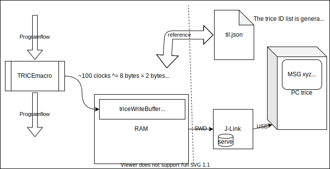
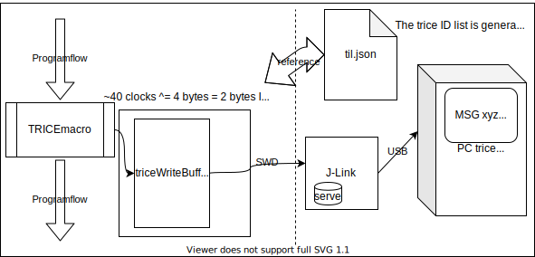

# Segger RTT
- Segger RTT is a technique to transfer data from target to host without using an interface despite the debug probe.
  - This does not occupy any physical device port nedded for the app during developmemt.
  - The transfer can be done in background without occupying the target processor despite memcopy actions.
- If you have a compatible ST-Link (board), the Segger J-Link on-Board firmware is needed or you can use a physical Segger debug probe. This way all target communication interfaces are usable for the application during development.

## Convert a NUCLEO 
- Following steps describe the needed steps for a STM NUCLEO board and windows - adapt them to your environment.
  - Get & install [STM32 ST-LINK utility](https://www.st.com/en/development-tools/stsw-link004.html) 
  - Run from default install location `"C:\Program Files (x86)\STMicroelectronics\STM32 ST-LINK Utility\ST-LINK Utility\ST-LinkUpgrade.exe"`)
  - Enable checkbox `Change Type` and select radio button `STM32 Debug+Mass storage + VCP` The `STM32 Debug+ VCP` won´t be detected by Segger reflash utility.
  - Check [https://www.segger.com/products/debug-probes/j-link/models/other-j-links/st-link-on-board/](https://www.segger.com/products/debug-probes/j-link/models/other-j-links/st-link-on-board/)
  - Use `STLinkReflash.exe` to convert NUCLEO from ST-Link on-board to J-Link on-board. `STM32 Debug+ VCP` won´t be detected by Segger reflash utility.

## Software Setup
  - Build and flash `triceDemo_NUCLEO-F030RB_LL_SeggerRTT_MDK-ARM`
  - Download [J-Link Software and Documentation Pack](https://www.segger.com/downloads/jlink/#J-LinkSoftwareAndDocumentationPack) and install
  - Start `"C:\Program Files (x86)\SEGGER\JLink\JLinkRTTViewer.exe"` and connect to the J-Link. You only need this as a running server to connect to.
    - Unfortunately the JLinkRTTViewer "steals" from time to time some trice data packages and display them as data garbage.
    - It is relatively seldom. For now I have no solution despite the *Segger J-Link SDK*.
    - May be **libusb** can help.
  - Run `trice log -list /c/GitRepos/trice/examples/til.json -device RTT`. It should now connect to JLinkLogViewer.
  - Also `trice receiver -list /c/GitRepos/trice/examples/til.json -device RTT` is possible when trice display server is active (`trice ds`).
  - Now the trice output is visible.
- In the SeggerRTT example projects you see how to setup.

## Segger RTT buffered (PC side receiver -device=RTT)
- Uses trice buffering for very fast trice execution.
- The trices go into the trice fifo and the the app software needs to background transfer the trices to the Segger RTT write buffer.
- Normally no need to use that, because the unbuffered variants will do better.

## Segger RTT unbuffered 
- The main advantage here is, that no `triceServe()` is needed in the background, because this job is automatically done by SeggerRTT. This way one can debug code as comfortable as with `printf()` but with all the TRICE advantages. Have a look here: 

## Segger RTT unbuffered (PC side receiver -device=RTT)
- Avoid trice buffering inside target and write with TRICE macro directly into the RTT buffer
- Write the 8 bytes per trace directly (little time & some space overhead on target, but no changes on host side) - this is implemented as test example.
  
  

- Normally no need to use that, because the unbuffered direct mode will do better.

## Segger RTTD unbuffered direct mode (PC side receiver -device=RTTD)
- Write directly the 4 byte trices to RTT (faster and less RAM & code on target side and litte extension on host side). 
- Doing so leds to the question how to reliable sync the data stream, because there is no control information in the data stream.
  - A sync package does fine here (`TRICE_RTTD_SYNC`)
    - A one time sync package after reset will do, but to re-connect to a running target a repetition every second or so is recommended.
    - The trice data stream cannot contain a 4-bytes sequence 0x16161616, when the ID 5654 is reserved for the sync package.
    - The sync package itself gets invisible because it deletes itself 
```
//! trice sync message for RTTdirect environments. The value 5654 is a reserved pattern used as ID and value.
//! It cannot occure in the trice stream. You must not change that. Otherwise the RTTD syncing will not work.
//! If for some reason the Id changes during 'trice u', probably when the string changed, you need to remove
//! the old pattern from til.json and put Id(5654) manually here
#define TRICE_RTTD_SYNC do{ TRICE16_1( Id(5654), "%d\b\b\b\b", 5654 ); }while(0)
```

  

## Segger J-Link SDK (~800 EUR) Option
- Segger offers a SeggerRTT SDK which allows to use more than just channel 0 and you can develop your own tooling with it.
- The `trice -device RTT` is ok for usage **as is** right now. However if you with more comfort check here:
- Question: [How-to-access-multiple-RTT-channels](https://forum.segger.com/index.php/Thread/6688-SOLVED-How-to-access-multiple-RTT-channels-from-Telnet/)
  - "Developer pack used to write your own program for the J-Link. Please be sure you agree to the terms of the associated license found on the Licensing Information tab before purchasing this SDK. You will benefit from six months of free email support from the time that this product is ordered."
  - [https://www.segger.com/products/debug-probes/j-link/technology/j-link-sdk/](https://www.segger.com/products/debug-probes/j-link/technology/j-link-sdk/)

## Additrional Notes (leftovers)
- `Downloading RTT target package` from [https://www.segger.com/products/debug-probes/j-link/technology/about-real-time-transfer/](https://www.segger.com/products/debug-probes/j-link/technology/about-real-time-transfer/).
- Read the manual `"C:\Program Files (x86)\SEGGER\JLink\Doc\Manuals\UM08001_JLink.pdf"`.
- Extract `"C:\Program Files (x86)\SEGGER\JLink\Samples\RTT\SEGGER_RTT_V672b.zip"` to target project. 
- Add `SEGGER_RTTI.c` to target project
- Put into main(): `char* s = "Hi5!\n"; SEGGER_RTT_Write(0, s, strlen(s));`, compile & flash image
- Start `"C:\Program Files (x86)\SEGGER\JLink\JLinkRTTViewer.exe"` & connect.
- Reset target & `Hi5!` should be visible inside viewer window.
- Now `Hi5!` should be visible inside terminal window when resetting target board.
- Instead of `"C:\Program Files (x86)\SEGGER\JLink\JLinkRTTViewer.exe"` also `"C:\Program Files (x86)\SEGGER\JLink\JLink.exe"` could be started & then `https://github.com/stalehd/jlinklogviewer`.
- What also works: `"C:\Program Files (x86)\SEGGER\JLink\JLink.exe"` followed by a terminal program like TeraTerm connected to `localhost:19021`.
- [https://github.com/stalehd/jlinklogviewer](https://github.com/stalehd/jlinklogviewer) is integrated into the trice tool (`-device RTT` option)

## Further development
- Maybe `libusb` together with `libjaylink` offer some options too.
- Checkout [https://github.com/deadsy/jaylink[(https://github.com/deadsy/jaylink).
- `"C:\Program Files (x86)\SEGGER\JLink\JMem.exe"` shows a memory dump.

- Go to (https://libusb.info/)[https://libusb.info/] 
  - -> Downloads -> Latest Windows Binaries
  - extract `libusb-1.0.23` (or later version)
```
libusb-1.0.23\examples\bin64> .\listdevs.exe
2109:2811 (bus 2, device 8) path: 6
1022:145f (bus 1, device 0)
1022:43d5 (bus 2, device 0)
0a12:0001 (bus 2, device 1) path: 13
1366:0105 (bus 2, device 10) path: 5
```
- Repeat without connected Segger JLink
```
libusb-1.0.23\examples\bin64> .\listdevs.exe
2109:2811 (bus 2, device 8) path: 6
1022:145f (bus 1, device 0)
1022:43d5 (bus 2, device 0)
0a12:0001 (bus 2, device 1) path: 13
```  
- In this case `1366:0105 (bus 2, device 10) path: 5` is missing, so `vid=1366`, `did=0105` as example
- On Windows install WSL2. The real Linux kernel is needed for full USB access.
