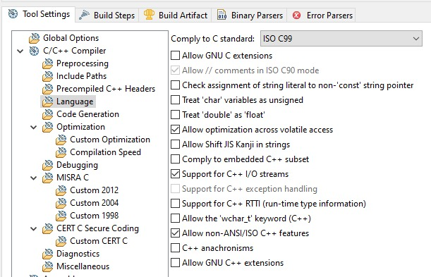

TASKING_RTTD_cpp_Example

- TASKING_cpp-Example
- About: [SeggerRTT.md](SeggerRTT.md)
- Import TASKING C/C++ -> TASKING ARM Example Projects -> cpp Project

- remove new cpp Project reference from workspace
- rename cpp directory in workspace to TASKING_RTTD_cpp_Example, adapt names internally and move to projects folder
- Import existing project
- Next steps like first steps in - [TASKING_STM32F4DISC_Audio_Service](TASKING_STM32F4DISC_Audio_Service.md)

- Also:
  - Set `Allow GNU C++ extensions`

    
    
  - Set Hardware
  
    
  - When selecting NUCLEO, the SeggerRTT debug probe is not selectable, so going for Generic:

    
- Output:    

