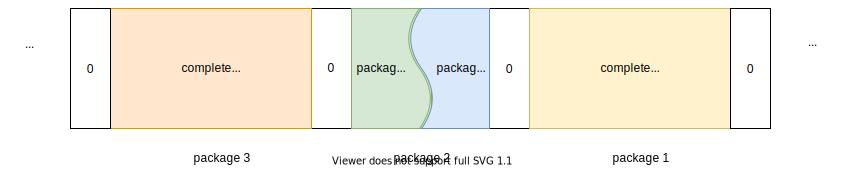

<!-- vscode-markdown-toc -->
* 1. [ Preface](#Preface)
* 2. [COBS Data Disruption](#COBSDataDisruption)
* 3. [TCOBS Encoding Principle](#TCOBSEncodingPrinciple)
	* 3.1. [Assumptions](#Assumptions)
	* 3.2. [Symbols](#Symbols)
		* 3.2.1. [NOP Sigil Byte `N`](#NOPSigilByteN)
		* 3.2.2. [Zero Sigil Byte `Z1`, `Z2`, `Z3`](#ZeroSigilByteZ1Z2Z3)
		* 3.2.3. [Full Sigil Byte `F2`, `F3`, `F4`](#FullSigilByteF2F3F4)
		* 3.2.4. [Repeat Sigil Byte `R2`, `R3`, `R4`, `R5`](#RepeatSigilByteR2R3R4R5)
	* 3.3. [Fragment Examples](#FragmentExamples)
		* 3.3.1. [Simple Encoding Algorithm](#SimpleEncodingAlgorithm)
		* 3.3.2. [Extended Encoding Algorithm (Possibilities)](#ExtendedEncodingAlgorithmPossibilities)
* 4. [TCOBS Software Interface](#TCOBSSoftwareInterface)
	* 4.1. [C Interface](#CInterface)
	* 4.2. [Go interface](#Gointerface)
* 5. [TCOBS Encoding Details](#TCOBSEncodingDetails)
	* 5.1. [Sigil Bytes Chaining](#SigilBytesChaining)
		* 5.1.1. [First any Sigil Byte](#FirstanySigilByte)
	* 5.2. [TCODE C-code](#TCODEC-code)
* 6. [Changelog](#Changelog)

<!-- vscode-markdown-toc-config
	numbering=true
	autoSave=true
	/vscode-markdown-toc-config -->
<!-- /vscode-markdown-toc -->

##  1. <a name='Preface'></a> Preface

* TCOBS is a different kind of [COBS](https://en.wikipedia.org/wiki/Consistent_Overhead_Byte_Stuffing) encoding, inspired by [rlercobs](https://docs.rs/kolben/0.0.3/kolben/rlercobs/index.html) with focus on speed and future improvement.
* TCOBS uses various chained sigil bytes to achieve an additional lossless compression if possible.
* Each encoded package ends with an additional sigil byte and has in the worst case 1 additional byte per 32 bytes, but usually the encoded data are smaller than the unencoded because of the compression.
* 0 is used as delimiter byte.

##  2. <a name='COBSDataDisruption'></a>COBS Data Disruption
  
* In case of data disruption, the receiver will wait for the next 0-delimiter byte. As a result it will get a packet start and end of 2 different packages A and B.



* For the COBS decoder it makes no difference if the COBS packages start or end with a sigil byte. In any case it will run into issues in such case.
  * An additional CRC, like a simple XOR inside could be added but would not really help.
* The receiver calls continuously a `Read()` function. The received buffer can contain 0-delimited COBS packages and the receiver assumes them all to be valid because there is no known significant time delay between package start and end.
* If a package start was received and the next package end reception is more than ~100ms away, a data disruption is likely and the receiver should ignore these data.
  * To minimise data loss, each *Trice* should get COBS encoded separately.
* Of course, when the receiver starts, the first buffer can contain broken COBS data, but we have to live with that on a PC. Anyway there is a reasonable likelihood that the COBS decoder will detect a data inconsistency.

##  3. <a name='TCOBSEncodingPrinciple'></a>TCOBS Encoding Principle

###  3.1. <a name='Assumptions'></a>Assumptions

* Most *Trices* consist of 16 or less bytes.
* Some *Trices* or user data are longer.
* Several zeros in a row are a common pattern (example:`00 00 00 05`).
* Several 0xFF in a row are a common pattern too (example -1 as 32 bit value).
* Maybe some other bytes appear also in a row.
* TCOBS should not know the inner data structure and therefore be usable also on any user data.

###  3.2. <a name='Symbols'></a>Symbols

* `o` = offset bit to next sigil byte
* `n` = number bit

* `101ooooo` NOP  sigil byte **No**: `ooooo` = 1-31, `ooooo`:00000 = 32
* `001ooooo` Zero sigil byte **Z1**: `ooooo` = 1-31, `ooooo`:00000 = 32
* `010ooooo` Zero sigil byte **Z2**: `ooooo` = 1-31, `ooooo`:00000 = 32
* `011ooooo` Zero sigil byte **Z3**: `ooooo` = 1-31, `ooooo`:00000 = 32
* `110ooooo` Full sigil byte **F2**: `ooooo` = 1-31, `ooooo`:00000 = 32
* `111ooooo` Full sigil byte **F3**: `ooooo` = 1-31, `ooooo`:00000 = 32
* `100ooooo` Full sigil byte **F4**: `ooooo` = 1-31, `ooooo`:00000 = 32
* `00010ooo` Repeat sigil byte **R2**:  `ooo` = 1-7, `ooo`:000 = 8
* `00011ooo` Repeat sigil byte **R3**:  `ooo` = 1-7, `ooo`:000 = 8
* `00001ooo` Repeat sigil byte **R4**:  `ooo` = 1-7, `ooo`:000 = 8
* `00000ooo` Repeat sigil byte **R5**:  `ooo` = 1-7, `ooo`:000 forbidden

####  3.2.1. <a name='NOPSigilByteN'></a>NOP Sigil Byte `N`

This does not represent data in the stream and only serves to keep the chain linked. The remaining 5 bits encode the distance to the next sigil (1 <= n <=32).
* N_1 = `101000001`
* ...
* N_31 = `10111111`
* N_32 = `10100000`

####  3.2.2. <a name='ZeroSigilByteZ1Z2Z3'></a>Zero Sigil Byte `Z1`, `Z2`, `Z3`

* This sigil represents 1 to 3 zeroes in the data stream, and is a `00` to `00 00 00` replacement to reduce data and keep the chain linked.
* The remaining 5 bits encode the distance to the next sigil (1 <= n <= 31), `00000`=32.
* Z1 = `001ooooo`
  * Z1_1 = `00100001`
  * ...
  * Z1_31 = `00111111`
  * Z1_32 = `00100000`
* ...
* Z3 = `011ooooo`
  * Z3_1 = `01100001`
  * ...
  * Z3_31 = `01111111`
  * Z3_32 = `01100000`

####  3.2.3. <a name='FullSigilByteF2F3F4'></a>Full Sigil Byte `F2`, `F3`, `F4`

* This sigil represents 2 to 4 0xFF in the data stream, and is a `FF FF` to `FF FF FF FF` replacement to reduce data and keep the chain linked.
* The remaining 5 bits encode the distance to the next sigil (1 <= n <= 31), `00000`=32.
* F2 = `110ooooo`
  * F2_1 = `11000001`
  * ...
  * F2_31 = `11011111`
  * F2_32 = `11000000`
* ...
* F4 = `100ooooo`
  * F4_1 = `10000001`
  * ...
  * F4_31 = `10011111`
  * F4_32 = `10000000`

####  3.2.4. <a name='RepeatSigilByteR2R3R4R5'></a>Repeat Sigil Byte `R2`, `R3`, `R4`, `R5`

* This sigil represents 2 to 5 repetitions of previous byte in the data stream, and is a replacement to reduce data and keep the chain linked.
  * Alternatively replacing R4 with a R7 allow better compression especially for longer sequences.
* The remaining 3 bits encode the distance to the next sigil (1 <= n <= 7), 000=8 but not for R5
* R2 = `00010ooo`
  * R2_1 = `00010001`
  * ...
  * R2_7 = `00010111`
  * R2_8 = `00010000`
* ...
* R5 = `00000ooo`
  * R5_1 = `00000001`
  * ...
  * R5_7 = `00000111`
  * forbidden = `00000000`

###  3.3. <a name='FragmentExamples'></a>Fragment Examples

* `xx` represents any non-zero byte
* `xx xx ...` represents any non-zero equal bytes

####  3.3.1. <a name='SimpleEncodingAlgorithm'></a>Simple Encoding Algorithm

* [x] Easy to implement.
* [x] Longer sequences are possible by repetition. 

| unencoded data             | encoded data | comment     |
| -                          | -            | -           |
| `00`                       | `Z1`         |             |
| `00 00`                    | `Z2`         |             |
| `00 00 00`                 | `Z3`         |             |
| `00 00 00  00`             | `Z3 Z1`      | repetition  |
| `00 00 00  00 00`          | `Z3 Z2`      | repetition  |
| `00 00 00  00 00 00`       | `Z3 Z3`      | repetition  |
| `00 00 00  00 00 00  00`   | `Z3 Z3 Z1`   | repetition  |
| ...                        | ...          | repetition  |
| `xx`                       | `xx`         |             |
| `xx xx`                    | `xx xx`      |             |
| `xx xx xx`                 | `xx R2`      |             |
| `xx xx xx xx`              | `xx R3`      |             |
| `xx xx xx xx xx`           | `xx R4`      |             |
| `xx xx xx xx xx xx`        | `xx R5`      |             |
| `xx xx xx xx xx xx  xx`    | `xx R5 xx`   | repetition  |
| `xx xx xx xx xx xx  xx xx` | `xx R5 xx xx`| repetition  |
| ...                        | ...          | repetition  |
| `FF`                       | `FF`         |             |
| `FF FF`                    | `F2`         |             |
| `FF FF FF`                 | `F3`         |             |
| `FF FF FF FF`              | `F4`         |             |
| `FF FF FF FF  FF`          | `F4 FF`      | repetition  |
| `FF FF FF FF  FF FF`       | `F4 F2`      | repetition  |
| `FF FF FF FF  FF FF FF`    | `F4 F3`      | repetition  |
| `FF FF FF FF  FF FF FF FF` | `F4 F4`      | repetition  |
| ...                        | ...          | repetition  |

####  3.3.2. <a name='ExtendedEncodingAlgorithmPossibilities'></a>Extended Encoding Algorithm (Possibilities)

Sometimes several minimal encodings possible. The encoder has than the choice.

* [ ] Just to show, what is further possible especially for user data.

| unencoded data             | encoded data | comment     |
| -                          | -            | -           |
| `00 00 00 00 00 00 00 00`  | `Z2 R4`      | extension   |
| ...                        | ...          | extension   |
| 9 \* `xx`                  | `xx R4 R2`   | extension   |
| ...                        | ...          | extension   |
|   9 \* `FF`                | `F3 R3`      | extension   |
|  10 \* `FF`                | `F2 R5`      | extension   |
|  11 \* `FF`                | `F2 R5 FF`   | extension   |
|  12 \* `FF`                | `F4 R3`      | extension   |

##  4. <a name='TCOBSSoftwareInterface'></a>TCOBS Software Interface

###  4.1. <a name='CInterface'></a>C Interface

[TCOBS.h](./TCOBS.h)

###  4.2. <a name='Gointerface'></a>Go interface

```Go
// TCOBSEncode a slice of bytes to a null-terminated frame
func TCOBSEncode(p []byte) []byte 
```

```Go
// TCOBSDecode a null-terminated frame to a slice of bytes
func TCOBSDecode(p []byte) []byte {
```

##  5. <a name='TCOBSEncodingDetails'></a>TCOBS Encoding Details

###  5.1. <a name='SigilBytesChaining'></a>Sigil Bytes Chaining

* The encoding starts at first buffer address.
* The encoded buffer ends with a sigil byte.
* The decoding then, starts at the sigil byte which is the last address of the encoded data.

####  5.1.1. <a name='FirstanySigilByte'></a>First any Sigil Byte

* The first sigil byte carries as offset the byte count before it.

| Position | 0 | ... | 32 |
| -        | - | -   | -  |
| offset   | 0 | ... | 32 |

* Any next sigil byte  carries as offset the byte count to the sigil byte before,

###  5.2. <a name='TCODEC-code'></a>TCODE C-code

[TCOBS.h](./TCOBS.h)

##  6. <a name='Changelog'></a>Changelog

| Date | Version | Comment |
| - | - | - |
| 2022-MAR-17 | 0.0.0 | Moved from Trice1.0Specification and reworked |
| 2022-MAR-17 | 0.1.1 | Clarification |
| 2022-MAR-18 | 0.2.0 | Correction & Simplifocation |
| 2022-MAR-18 | 0.3.0 | Software Interface added |
| 2022-MAR-18 | 0.3.1 | wip TCOBS Encoding |
| 2022-MAR-19 | 0.4.0 | TCOBS Encoding as C-Code in separate file TCOBS.C |

<!--
| 2022-MAR-   | 0.3.0 | |
| 2022-MAR-   | 0.4.0 | |
| 2022-MAR-   | 0.5.0 | |
| 2022-MAR-   | 0.6.0 | |
-->

- [1. <a name='Preface'></a> Preface](#1--preface)
- [2. <a name='COBSDataDisruption'></a>COBS Data Disruption](#2-cobs-data-disruption)
- [3. <a name='TCOBSEncodingPrinciple'></a>TCOBS Encoding Principle](#3-tcobs-encoding-principle)
  - [3.1. <a name='Assumptions'></a>Assumptions](#31-assumptions)
  - [3.2. <a name='Symbols'></a>Symbols](#32-symbols)
    - [3.2.1. <a name='NOPSigilByteN'></a>NOP Sigil Byte `N`](#321-nop-sigil-byte-n)
    - [3.2.2. <a name='ZeroSigilByteZ1Z2Z3'></a>Zero Sigil Byte `Z1`, `Z2`, `Z3`](#322-zero-sigil-byte-z1-z2-z3)
    - [3.2.3. <a name='FullSigilByteF2F3F4'></a>Full Sigil Byte `F2`, `F3`, `F4`](#323-full-sigil-byte-f2-f3-f4)
    - [3.2.4. <a name='RepeatSigilByteR2R3R4R5'></a>Repeat Sigil Byte `R2`, `R3`, `R4`, `R5`](#324-repeat-sigil-byte-r2-r3-r4-r5)
  - [3.3. <a name='FragmentExamples'></a>Fragment Examples](#33-fragment-examples)
    - [3.3.1. <a name='SimpleEncodingAlgorithm'></a>Simple Encoding Algorithm](#331-simple-encoding-algorithm)
    - [3.3.2. <a name='ExtendedEncodingAlgorithmPossibilities'></a>Extended Encoding Algorithm (Possibilities)](#332-extended-encoding-algorithm-possibilities)
- [4. <a name='TCOBSSoftwareInterface'></a>TCOBS Software Interface](#4-tcobs-software-interface)
  - [4.1. <a name='CInterface'></a>C Interface](#41-c-interface)
  - [4.2. <a name='Gointerface'></a>Go interface](#42-go-interface)
- [5. <a name='TCOBSEncodingDetails'></a>TCOBS Encoding Details](#5-tcobs-encoding-details)
  - [5.1. <a name='SigilBytesChaining'></a>Sigil Bytes Chaining](#51-sigil-bytes-chaining)
    - [5.1.1. <a name='FirstanySigilByte'></a>First any Sigil Byte](#511-first-any-sigil-byte)
  - [5.2. <a name='TCODEC-code'></a>TCODE C-code](#52-tcode-c-code)
- [6. <a name='Changelog'></a>Changelog](#6-changelog)

<!--
Module kolben::rlercobs
[−][src]

Run Length Encoded Reverse Cobs

This works very similarly to rcobs, however the behavior of sigil bytes are slightly changed.
Sigils

There are now four different kind of sigil bytes, defined by their two msbits:

    0b00 - NOP sigil.
        This does not represent data in the stream, and only serves to keep the reverse chain linked
        The remaining six bits encode the distance back to the previous sigil (1 <= n <= 63)
    0b01 - Zero sigil.
        This sigil represents a zero in the data stream, and has been replaced to preserve framing
        The remaining six bits encode the distance back to the previous sigil (1 <= n <= 63)
    0b10 - Exponential Repeat sigil.
        This sigil is a directive to repeat the previous non-sigil character (or Zero sigil representing a data-zero) 2 ** n times, where 3 <= n <= 10.
        If multiple repeats (exponential or linear) appear in a row, their repeating counts should be added together.
        The remaining three bits encode the distance back to the previous sigil (1 <= n <= 7)
    0b11 - Linear Repeat sigil.
        This sigil is a directive to repeat the previous non-sigil character (or Zero sigil representing a data-zero) n times, where 1 <= n <= 7.
        If multiple repeats (exponential or linear) appear in a row, their repeating counts should be added together.
        The remaining three bits encode the distance back to the previous sigil (1 <= n <= 7)

All sigil types encode the number of bytes back until the next sigil, and all messages must end with a sigil. This allows for decoding by walking the data stream backwards, which is done to preserve encoder simplicity.
-->


<!-- ## Small Size Logs (ideas)


* `01iiiiii I N C  ...` 14 bit ID, Legacy COBS no timestamp inside: TRICE
* `0001iiii I D D`      12 bit ID, no timestamp, 16 bit data: TRICE82, TRICE161
* `0010iiii I D D D D`  12 bit ID, no timestamp, 32 bit data: TRICE84, TRICE162, TRICE8216, TRICE1682, TRICE321

* `11iiiiii I N C  T T T T ...` 14 bit ID, Legacy COBS with timestamp inside: TTRICE
* `1001iiii I T T  D D`     12 bit ID, 16 bit timestamp, 16 bit data: TTRICE82, TTRICE161
* `1010iiii I T T  D D D D` 12 bit ID, 16 bit timestamp, 32 bit data: TTRICE84, TTRICE162, TTRICE8216, TTRICE1682, TTRICE321

* `0011....` sub-option -x n TRICEX
* `1011....` sub-option -y n TRICEY
* examples: s select x or y
  * `s011iidd dddddddd` 2 bit ID & 10 bit data
  * `s011dddd dddddddd` no ID, 12 bit data
  * `s011dddd` no ID, 4 bit data
  * `s011iiii I` 12 bit ID, no data
  * `s011iiii D D` 4 bit ID, 16 bit data
  * `s011iiii I D D` 12 bit ID, 16 bit data
  * `s011iiii I T T` 12 bit ID, 16 bit timestamp, no data
  * `s011iiii D D T`
  * `s011iiii C T T  D D D D`
  * `s011iiii C D D  T T T T`
  * `s011iiii I D D  T`
  * `s011iiii tttttttt ttttdddd dddddddd` 4 bit ID, 12 bit timestamp, 12 bit data
  * ...
* `0000....` user data with defined length or length code
* `1000....` reserved
-->

<!--
* Zero bytes:
  *  1 * 00 = Z1
  * ...
  *  8 * 00 = Z8
  * more done with repeats

* Possible but not needed, repetitions ok to keep code simple:
  *  9 * 00 = Z8 Z1
  * ...
  * 16 * 00 = Z8 Z8 
  * 17 * 00 = Z8 Z8 Z1
  * ...
  * 23 * 00 = Z8 Z8 Z7
  * 24 * 00 = Z8 R2
  * ...
  * 47 * 00 = Z8 R4 Z7
  * 48 * 00 = Z8 R5
  * 49 * 00 = Z8 R5 Z1 (begin again)
  * ...
  * 57 * 00 = Z8 R5 Z8 Z1
  * ...

* Non zero bytes:
  *  1 * aa = aa
  *  2 * aa = aa aa
  *  3 * aa = aa R2
  *  4 * aa = aa R3 
  *  5 * aa = aa R4
  *  6 * aa = aa R5
  * more done with repeats

* Possible but not needed, repetitions ok to keep code simple:
  *  7 * aa = aa R5 aa = aa R2 R3
  *  8 * aa = aa R5 aa aa
  *  9 * aa = aa R2 R4
  * 10 * aa = aa R3 R3
  * 11 * aa = aa R5 R2
  * 12 * aa = aa R5 R2 aa = aa R5 aa R5 
  * 13 * aa = aa R4 R3
  * ...
  * 26 * aa = aa R5 R5
  * 27 * aa = aa R5 R5 aa 
  * 28 * aa = aa R3 R3 R3
  * ...
  * 125 * aa = aa R5 R5 R4 + 24 * aa
  * 126 * aa = aa R5 R5 R5 
-->
<!-- ###  7.6. <a name='Approach2primenumbers'></a>Approach 2 (prime numbers)

* `o` = offset bit to next sigil byte
* `n` = number bit

N: 00oooooo
Z: 1nnnoooo
R: 01nnoooo R2, R3, R5, R7

* aa stays for non zero bytes. aa aa for two equal non zero bytes.
* An aa following repeat sigil byte means additional 2, 3, 5, or 7 aa bytes.
* Neighbor repeat sigil bytes are multiplied and added.
* Neighbor sigil bytes join their offset bits for bigger possible distances.
* Coding Table
| count   | multiply          |
| -       | -                 |
|  1 * aa | aa                |
|  2 * aa | aa aa             |
|  3 * aa | aa F2             |
|  4 * aa | aa F3             |
|  5 * aa | aa F2 F2          |
|  6 * aa | aa F5             |
|  7 * aa | aa F2 F3          |
|  8 * aa | aa F7             |
|  9 * aa | aa F7 aa          |
| 10 * aa | aa F3 F3          |
| 11 * aa | aa F5 F2          |
| 12 * aa | aa F5 F2 aa       |
| 13 * aa | aa F3 F2 F2       |
| 14 * aa | aa F7 aa F5       |
| 15 * aa | aa F7 F2          |
| 16 * aa | aa F5 F3          |
| 17 * aa | aa F5 F3 aa       |
| 18 * aa | aa F5 F3 aa aa    |
| 19 * aa | aa F5 F3 aa F2    |
| 20 * aa | aa F5 F3 aa F3    |
| 21 * aa | aa F5 F2 F2       |
| 22 * aa | aa F7 F3          |
| 23 * aa | aa F7 F3 aa       |
| 24 * aa | aa F7 F3 aa aa    |
| 25 * aa | aa F7 F3 aa F2    |
| 26 * aa | aa F5 F5          |
| 27 * aa | aa F5 F5 aa       |
| 28 * aa | aa F3 F3 F3       |
| 29 * aa | aa F7 F2 F2       |
| 30 * aa | aa F7 F2 F2 aa    |
| 31 * aa | aa F5 F3 F2       |
| 32 * aa | aa F5 F3 F2 aa    |
| 33 * aa | aa F5 F3 F2 aa aa |
| 34 * aa | aa F5 F3 F2 aa F2 |
| 35 * aa | aa F5 F3 F2 aa F3 |
| 36 * aa | aa F7 F5          |
| 37 * aa | aa F7 F5 aa       |
| ...     |                   |
|244 * aa | aa F7 F7 F7       |
| ...     |                   |
-->

<!--  It is better to use a multiply operations for bigger numbers. This needs a table for fast conversion.-->
 <!-- add                  | -->
 <!-- -                    | -->
 <!-- aa                   | -->
 <!-- aa aa                | -->
 <!-- aa R2                | -->
 <!-- aa R3                | -->
 <!-- aa R3 R2             | -->
 <!-- aa R5                | -->
 <!-- aa R3 R3             | -->
 <!-- aa R7                | -->
 <!-- aa R7 aa             | -->
 <!-- aa R7 R2             | -->
 <!-- aa R5 R5             | -->
 <!-- aa R5 R5 aa          | -->
 <!-- aa R7 R5             | -->
 <!-- aa R7 R5 aa          | -->
 <!-- aa R7 R7             | -->
 <!-- aa R7 R7 aa          | -->
 <!-- aa R7 R7 R2          | -->
 <!-- aa R7 R7 R3          | -->
 <!-- aa R7 R7 R3 aa       | -->
 <!-- aa R7 R7 R5          | -->
 <!-- aa R7 R7 R5 aa       | -->
 <!-- aa R7 R7 R7          | -->
 <!-- aa R7 R7 R7 aa       | -->
 <!-- aa R7 R7 R7 aa aa    | -->
 <!-- aa R7 R7 R7 aa R2    | -->
 <!-- aa R7 R7 R7 aa R3    | -->
 <!-- aa R7 R7 R7 R5       | -->
 <!-- aa R7 R7 R7 R5 aa    | -->
 <!-- aa R7 R7 R7 R7       | -->
 <!-- aa R7 R7 R7 R7 aa    | -->
 <!-- aa R7 R7 R7 R7 aa aa | -->
 <!-- aa R7 R7 R7 R7 aa R2 | -->
 <!-- aa R7 R7 R7 R7 aa R3 | -->
 <!-- aa R7 R7 R7 R7 aa R3 | -->
 <!-- aa R7 R7 R7 R7 R5    | -->
 <!-- aa R7 R7 R7 R7 R5    | -->
 <!-- aa R7 R7 R7 R7 R5 aa | -->
 <!--                      | -->
 <!--                      | -->
 <!--                      | -->
