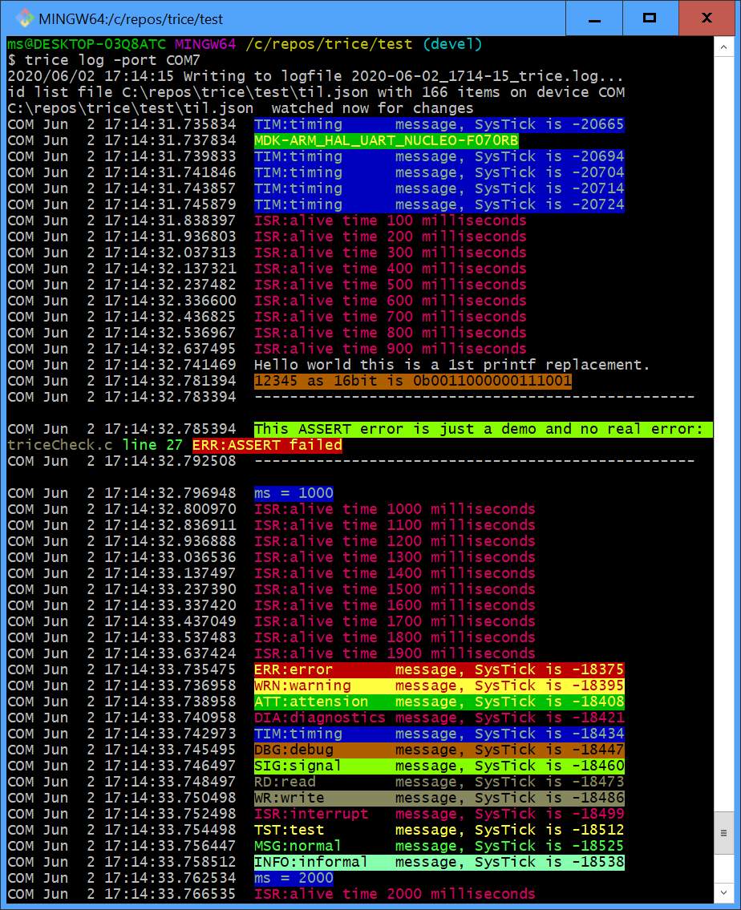
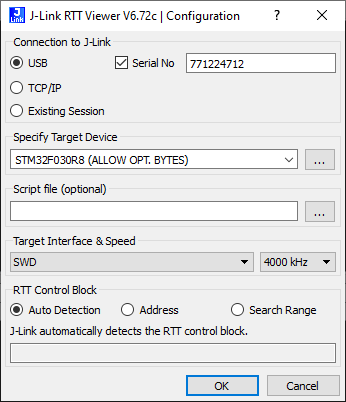
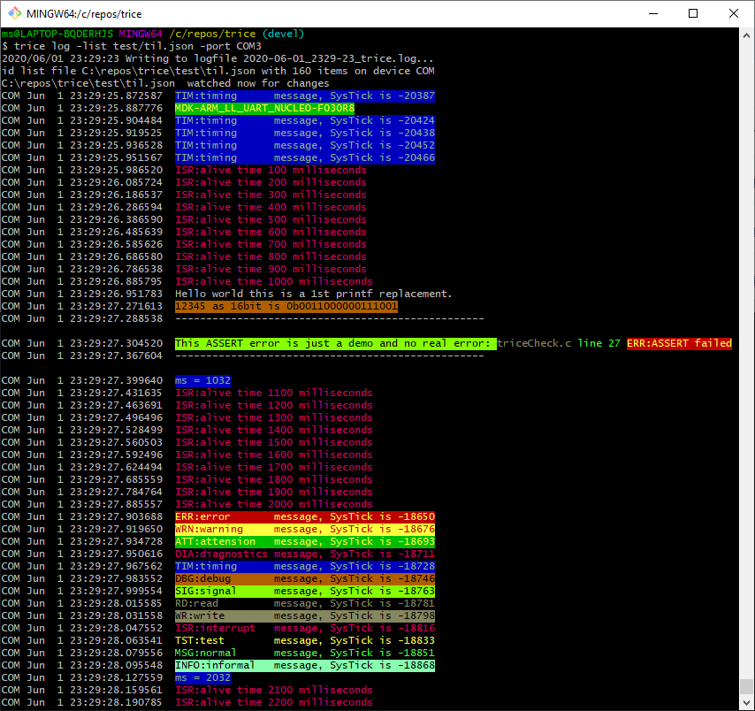

# trice examples with ARM-MDK (ARMkeil µVision)

## MDK-ARM_HAL_UART_NUCLEO-F030R8 (triceDemo_NUCLEO-F030R8_HAL_MDK-ARM)
- ~19 clocks

  

- ~10-13 clocks (without CRITICAL_SECTION)

  
## MDK-ARM_HAL_UART_NUCLEO-F070RB
- ~10-13 clocks (without CRITICAL_SECTION)

  
## MDK-ARM_LL_generatedDemo_NUCLEO-F030R8 (generatedDemo_NUCLEO-F030R8_LL_MDK-ARM)
- This is *without* TRICE instrumentation and ment for easy comparing to see quickly the intrumentation needs with MDK-ARM_LL_* projects.
- Setup details: [MDK-ARM_LL_generatedDemo_NUCLEO-F030R8]

## MDK-ARM_LL_RTT_NUCLEO-F030R8
- About: [SeggerRTT.md](SeggerRTT.md)

- ~ 300-400 clocks

## MDK-ARM_LL_RTT_NUCLEO-F070RB
- About: [SeggerRTT.md](SeggerRTT.md)
- ~ 300 clocks

## MDK-ARM_LL_RTTD_NUCLEO-F070RB
- About: [SeggerRTT.md](SeggerRTT.md)
- ~ 270 clocks: This is significant slower than with RTT but still so fast, that it is ok for many cases.
- The main advantage here is, that the trices go directly out and need no triceServe in target code.
- The SEGGER-write function is optimizable for speed in special cases.

- ~ 230 clocks

  

## MDK-ARM_LL_UART_demoBoard_STM32F030F4F4P6
- ~100 clocks (without time optimization)
- See [STM32F030F4P6-DEMO-BOARD](https://stm32-base.org/boards/STM32F030F4P6-STM32F030-DEMO-BOARD-V1.1.html) (same as No logo JF-Xuan STM32F030F4P6 Cortex M0 ARM 32 Bit 48MHz Core System Development Board) for hardware information
  - The board is very sensible against electro-static influence - be careful!
- The next 2 images show part of a NUCLEO-Board used only as ST-Link
  - The 2 jumpers at CN2 are removed
  - RED is 3.3V power supply
  - GREEN is Ground
  - YELLOW is SWCLK
  - ORANGE is SWDIO
  - BROWN is UART-TX out to UART-RX/RS232/USB/virtual UART (Ground cannection is over USB)
    - The small blue covered piece is s normal USB/Serial converter (FTDI)
- photo: 
- photo: 
- output: 
- photo: 
- Using the ST-Link it is possible to debug step the code
- An other option would be to download the HEX-File using the internal STM32 ROM-Bootloader over the USB/Serial converter. Then no ST-Link is needed but you can only run the code and not debug.
- Finally: The USB connector on the demoBoard-STM32F030F4P6 ist only used for power supply if no other connections.

## MDK-ARM_LL_UART_NUCLEO-F030R8
- Setup details: [MDK-ARM_LL_generatedDemo_NUCLEO-F030R8.md](MDK-ARM_LL_generatedDemo_NUCLEO-F030R8)

- ~14-18 clocks

  

## MDK-ARM_LL_UART_NUCLEO-F070RB 
- ~14-18 clocks (with CRITICAL_SECTION)

  
## MDK-ARM_RTTD_STM32F0300-DISCO 
- About: [SeggerRTT.md](SeggerRTT.md)
- ~250 ticks
- Inside the SysTickISR each millisecond a TRICE message is produced and every 20 milliseconds the full test bunch runs.
- The ISR:alive @20ms message is visible at about 2 3rd of the screen
- SeggerRTT gets the messages every 10ms. Therefore with is traffic the internal buffer is needed to be 7KB. Normally you get away with much less RAM needs.
- Output: 

