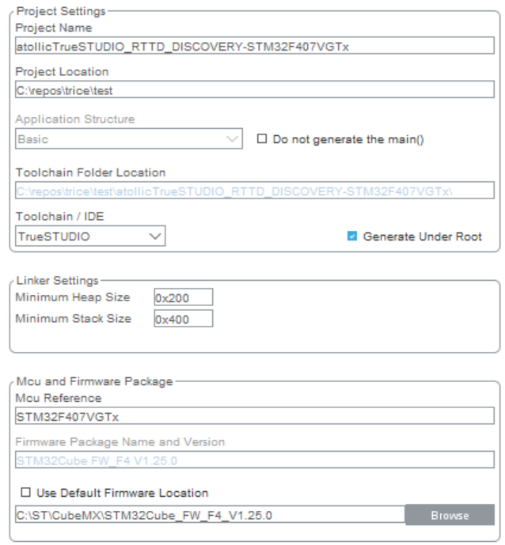
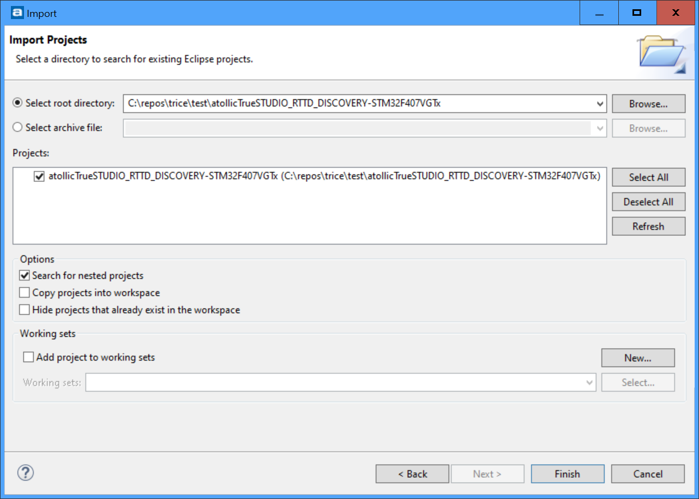
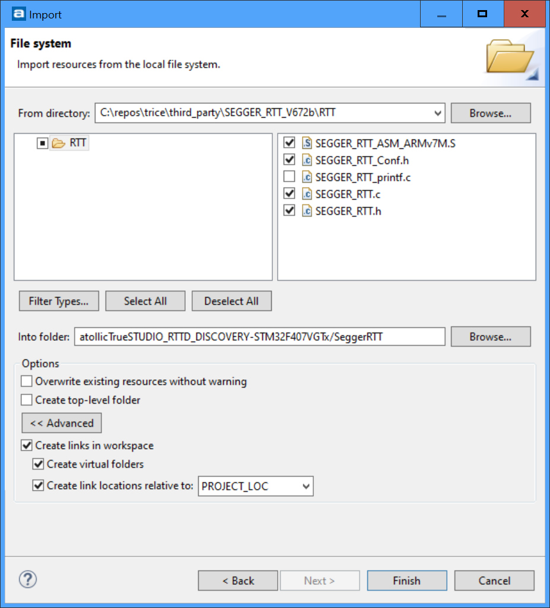
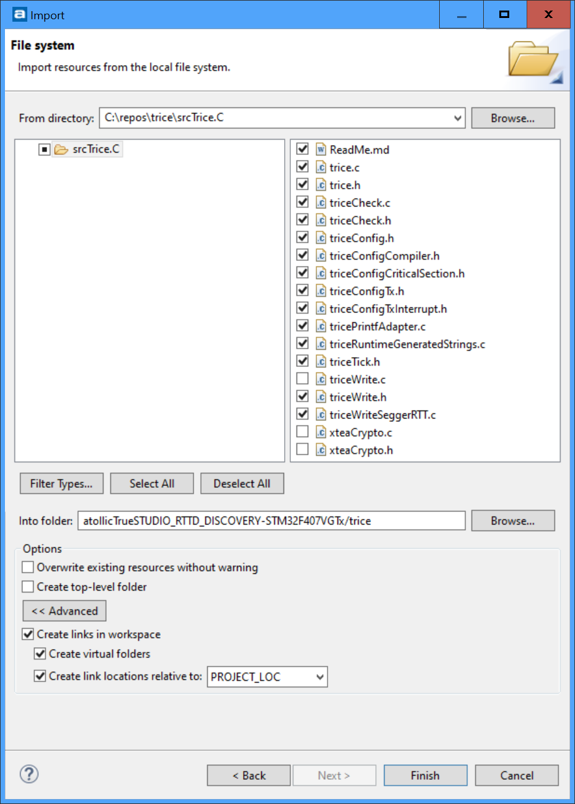
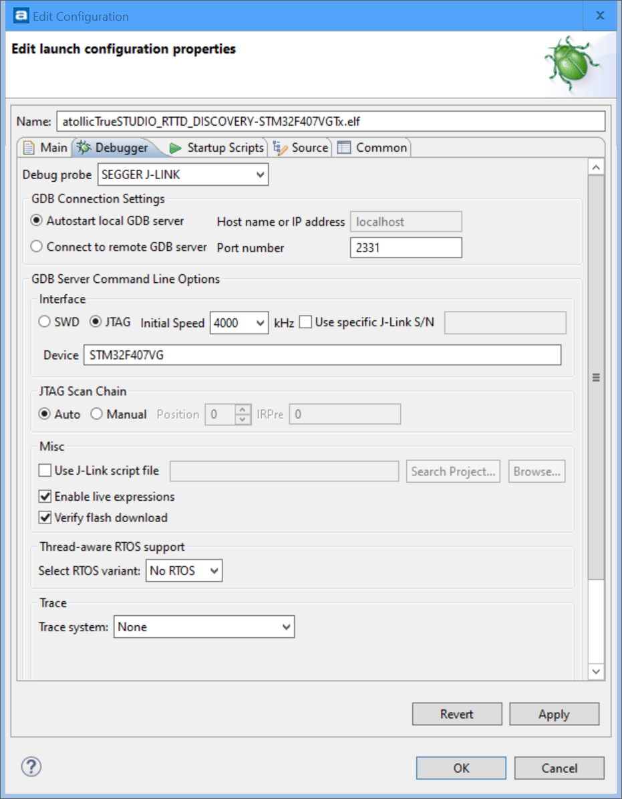
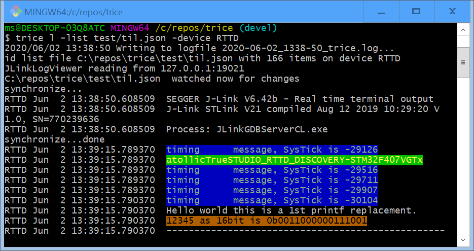
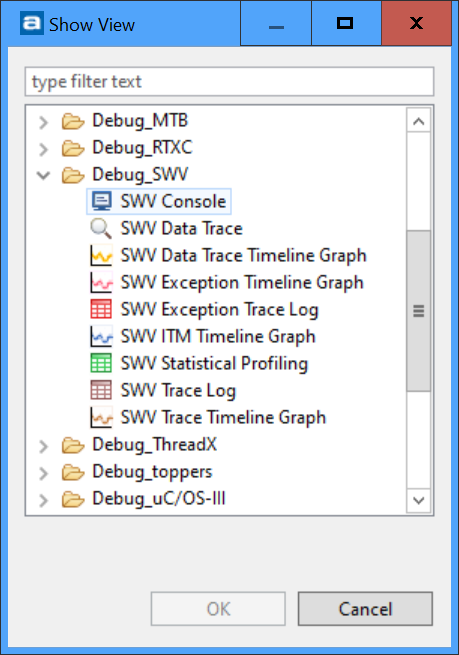

# atollic trueSTUDIO examples

- [atollicTrueSTUDIO_RTTD_DISCOVERY-STM32F407VGTx](#atollicTrueSTUDIO_RTTD_DISCOVERY-STM32F407VGTx)
  - Segger RTT in Direct mode
- [atollicTrueSTUDIO_ITM_Printf_DISCOVERY-STM32F407VGTx](#atollicTrueSTUDIO_ITM_Printf_DISCOVERY-STM32F407VGTx)
  - Usage of Instruction Trace Macrocell (ITM) on ARM M0+ cores

## atollicTrueSTUDIO_RTTD_DISCOVERY-STM32F407VGTx
### Setup steps
- Generate project with STM32CubeMX
  - Select TrueSTUDUIO as toolchain
  - Other settings as you like

  
### Inside trueStudio
- Select workspace

  
- Import existing project (do not copy into workspace)

  
- Build to verify
- New Source Folder `SeggerRTT`
  - Import file system
  - Create Links!

  
- New Source folder `trice`
  - Import file system
  - Create Links!
  
- Add include paths
- Add TRICE_VARIANT=SEGGER_RTTD in project settings
- Pre-build steps are not directly supported in trueSTUDIO, so simplply run `trice u` from inside the test folder to update the trice IDs.
- Edit Run/Debug settings and select `Segger J-Link` as Debug probe (you need to convert to the on-board J-Link firmware too, what is a restoreable process)

 

- Start J-Link RTT Viewer
- Start trice:
  - ~200 clocks

  

## atollicTrueSTUDIO_ITM_Printf_DISCOVERY-STM32F407VGTx
This example contains no trice code. it simply emits a `A` over the ITM just for test purpose.
- First steps like in `atollicTrueSTUDIO_RTTD_DISCOVERY-STM32F407VGTx`
- Reflash on-board DEbugger to ST-Link:

- Follow instructions in [http://blog.atollic.com/cortex-m-debugging-printf-redirection-to-a-debugger-console-using-swv/itm-part-1](http://blog.atollic.com/cortex-m-debugging-printf-redirection-to-a-debugger-console-using-swv/itm-part-1)

- Done:

- Additional info: 
  - Download: [Atollic_Serial_wire_viewer_realtime_tracing_whitepaper.pdf](https://cta-service-cms2.hubspot.com/ctas/v2/public/cs/c/?cta_guid=a9fb94cd-a492-4ce1-a7a8-1ca091fb448c&placement_guid=c92954ee-825c-40d4-994a-b785f7d7a5c6&portal_id=460400&canon=http%3A%2F%2Fblog.atollic.com%2Fcortex-m-debugging-printf-redirection-to-a-debugger-console-using-swv%2Fitm-part-1&redirect_url=APefjpGyT0W9LE88W87nq6QXwZTwmLnXriQZPLw9IQ8TCzA8_DA6Z5ty7But2KEAkpTgZ8Y93csjKitMoFM8BTWbwe1N6wYunE3w-ahMB52JIb2rGjr__dfnfSaIBFBRRUa3IfRFl0fiWfyZ0dMrn2VOLxj3JHsVV7x4kdeY5w05y51yNkErUXVx1pCuuEIfTUa9SjFosD5vKgLdciZqwe_gJW-AfRYjfI1ESf96OcFYA-BM3VqTHslTpTcWC2BctmccdvxlTcn3Z3QmvhBbaQuJ8FXJmLaXhrTIbg3KideZgcQgfiqk0ov_PoIJdgYu1cExqwSnQ8qtepE0GU0b0NgS8QPttn9l3_ejk-QPSpj8ufWhhoVM-QQmY4K782K09bbp7pHPcfr8XYhjKmTQWNjPXVnCjUM26g&click=3435c228-20ad-462f-bfca-a363163cda1a&hsutk=c23278c474639c1c4facdc8acaf0df14&signature=AAH58kF-CxFiZnIMOZ2P9W3apJogP29Klw&utm_referrer=https%3A%2F%2Fwww.google.com%2F&pageId=2534487833&contentType=blog-post&__hstc=62657011.c23278c474639c1c4facdc8acaf0df14.1591087383657.1591087383657.1591087383657.1&__hssc=62657011.1.1591087383657&__hsfp=2517265284)

  - Local: [Atollic_Serial_wire_viewer_realtime_tracing_whitepaper.pdf](../third_party/Manuals/Atollic_Serial_wire_viewer_realtime_tracing_whitepaper.pdf)