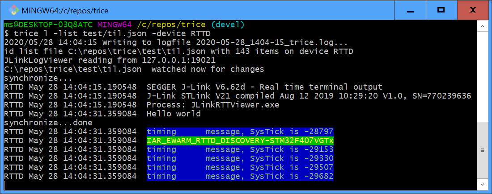
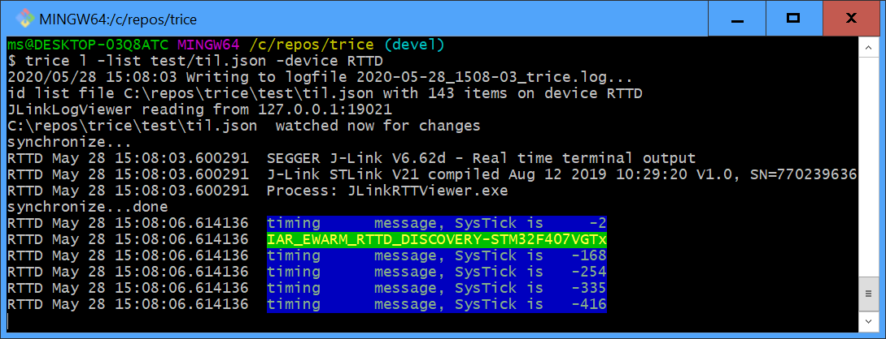

### IAR_EWARM_HAL_UART_NUCLEO-F070RB

### IAR_EWARM_LL_UART_NUCLEO-F070RB

### IAR_EWARM_LL_UART_NUCLEO-F030RB

### IAR_EWARM_RTT_NUCLEO-F030R8
- About: [SeggerRTT.md](SeggerRTT.md)

### IAR_EWARM_RTTD_DISCOVERY-STM32F407VGTx
- About: [SeggerRTT.md](SeggerRTT.md)

- Use "C:\ST\STLinkReflash_190812_Segger\STLinkReflash.exe" to convert On-board ST-Link to On-board J-Link (optional and you can undo this step)
- Start ST CubeMX
  - select DISCOVERY_STM32F407VGTx
  - generate for EWARM
- Open EWARM project & compile
  - Add Group SeggerRTT
  - Add all files from C:\repos\trice\third_party\SEGGER_RTT_V672b\RTT - also SEGGER_RTT_ASM_ARMv7M.S
  - Add group Trice
  - Add files from C:\repos\trice\srcTrice.C but not xteaCrypto.* and not triceWrite.c
  - Add TRICE_VARIANT=SEGGER_RTTD in project settings
  - Add include paths for RTT & Trice
  - Add Build action "trice u -src $PROJ_DIR$/.. -src $PROJ_DIR$/../../srcTrice.C -list $PROJ_DIR$/../../til.json -v"
  - Determine J-Link identifier (for example with J-Link-Mem)
  - Select J-Link as debugger
  - Switch J-Link to SWD
- ~ 180 clocks 
- ~ 80 clocks 

### triceDemo_NUCLEO-F030RB_LL_IAR_EWARM (ok)
### triceDemo_NUCLEO-F030RB_LL_SeggerRTT_IAR_EWARM (ok)
- About: [SeggerRTT.md](SeggerRTT.md)

### triceDemo_NUCLEO-F070RB_HAL_IAR_EWARM (ok)
### triceDemo_NUCLEO-F070RB_LL_IAR_EWARM (ok)
