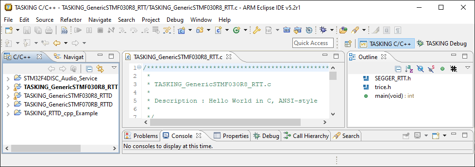

# trice examples with altium TASKING VX toolset
- It is an Eclipse IDE and an evaluation license for 2 weeks was possible.

  

- Create a workspace `TASKING.workspace` and import the **TASKING TX toolset** projects
  - [TASKING_GenericSTMF030R8_RTTB](TASKING_GenericSTMF030R8_RTTB.md)
    - ~ 22 clocks
  - [TASKING_GenericSTMF030R8_RTT](TASKING_GenericSTMF030R8_RTT.md)
    - ~ 360 clocks
  - [TASKING_GenericSTMF030R8_RTTD](TASKING_GenericSTMF030R8_RTTD.md)
    - ~ 190 clocks
  - [TASKING_GenericSTMF070RB_RTTD](TASKING_GenericSTMF070RB_RTTD.md)
  - [TASKING_RTTD_cpp_Example](TASKING_RTTD_cpp_Example.md)
    - ~ 190 clocks
  - [TASKING_STM32F4DISC_Audio_Service](TASKING_STM32F4DISC_Audio_Service.md)
    - not working for some unknown reason
