# trice examples with altium TASKING VX toolset
- It is an Eclipse IDE and an evaluation license for 2 weeks was possible.

## TASKING_GenericSTMF030R8_RTT
- About: [SeggerRTT.md](SeggerRTT.md)

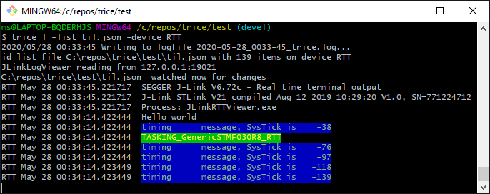

## TASKING_GenericSTMF030R8_RTTD
- About: [SeggerRTT.md](SeggerRTT.md)

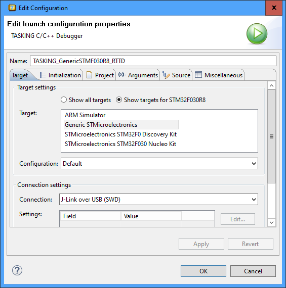
- Build and check if Debug works:
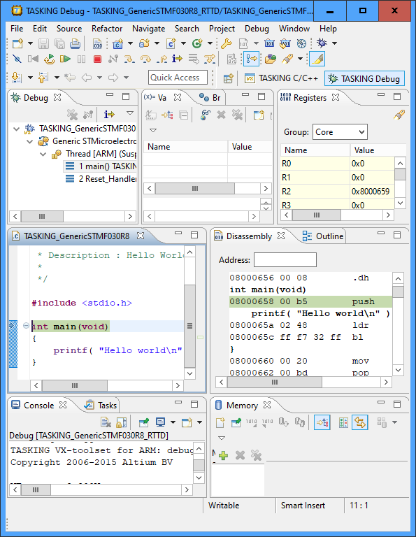
- Add New Source Folder SeggerRTT
- Import -> General -> Filesystem
  - Check "Create Top-Level Folder" and Advanced -> "Create Links in Workspace")

- Add path 
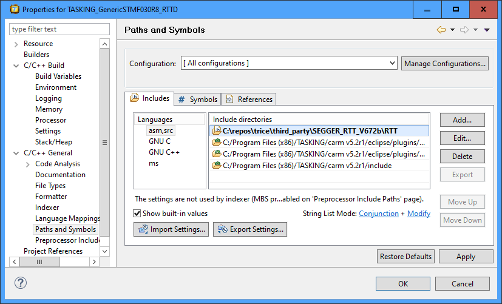
- Edit 
- Start Debug & J-Link Viewer and run:
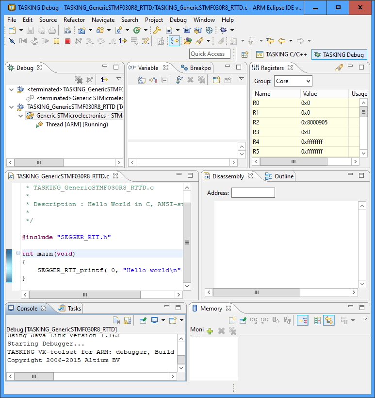

- Add New Source Folder srcTrice.C
- Import -> General -> Filesystem
  - Check "Create Top-Level Folder" and Advanced -> "Create Links in Workspace")
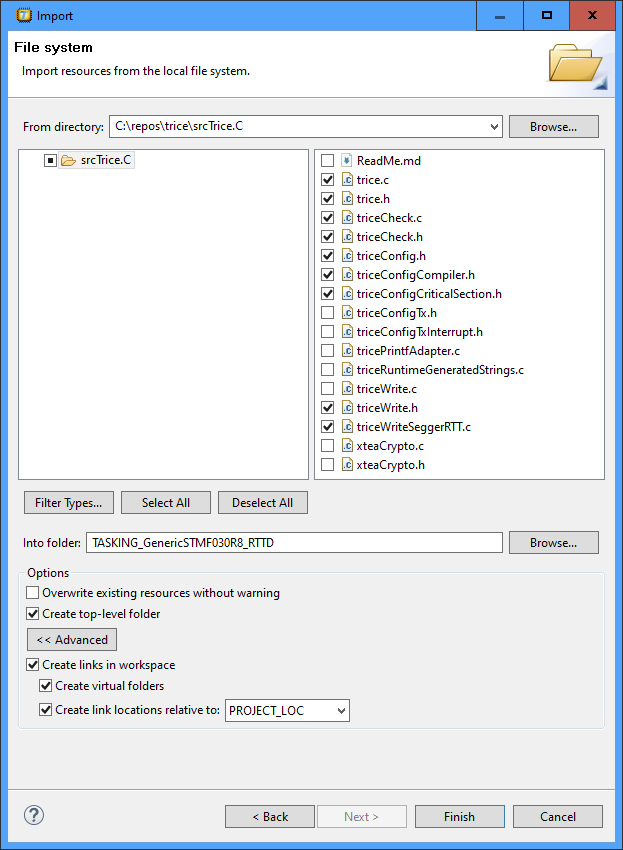
- specify in project settings:
  - TRICE_VARIANT=SEGGER_RTT
  - TRICE_PUSH=triceDirectWrite
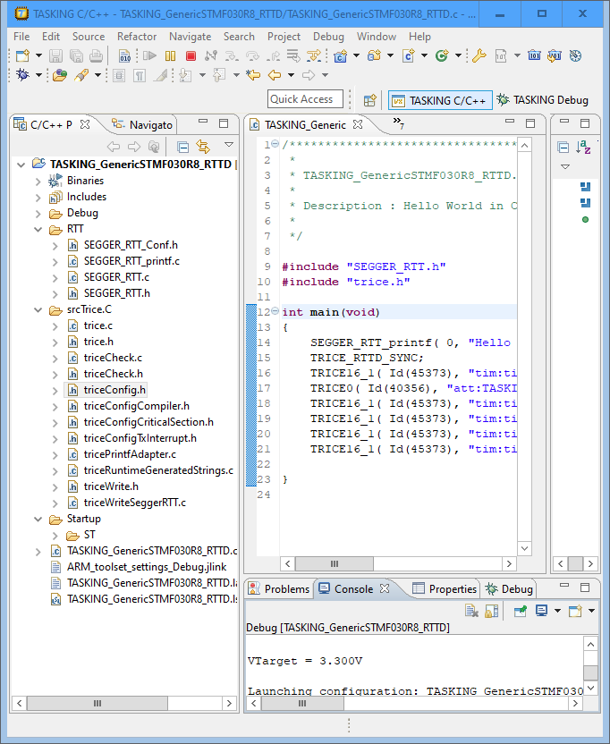
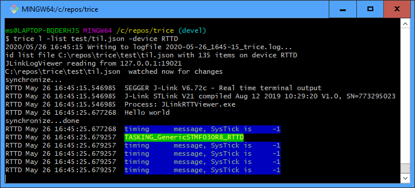

## TASKING_GenericSTMF070RB_RTTD
- About: [SeggerRTT.md](SeggerRTT.md)

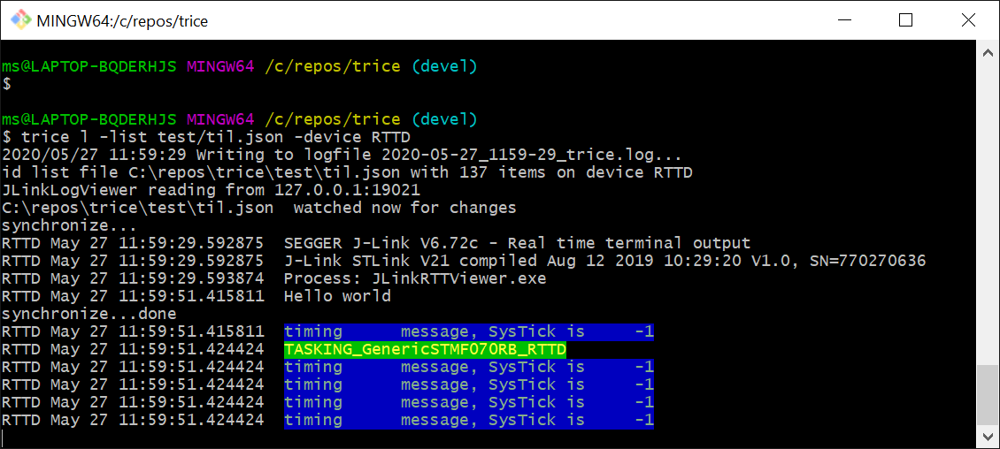
- Start TASKING ARM Eclipse IDE with some workspace
- File -> New -> TASKING Arm Project -> Hello Worls C Project
- [ ] Uncheck "Use default location"

- -> Next, select processor hardware & 
- [x] check "Add startup file(s) to the project"
- Select as target "Generic STMicroelectronics. This will allow you to 
- Right-Click on Project -> New -> Tasking Software Platform Document -> Generate Code
- Add Software Services and Device Stacks
- Needs ST-Link "STM32Debug+VCP" and **NOT** "STM32Debug+Mass storage+VCP" (change with ST-Link utility)
- Needs to ignore this:
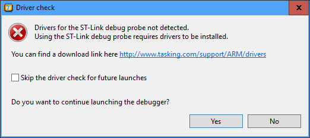

## TASKING_RTTD_cpp_Example (TASKING_cpp-Example)
- About: [SeggerRTT.md](SeggerRTT.md)

- Import TASKING C/C++ -> TASKING ARM Example Projects -> cpp Project

- remove new cpp Project reference from workspace
- rename cpp directory in workspace to TASKING_RTTD_cpp_Example, adapt names internally and move to projects folder
- Import existing project
- Next steps like first steps in [TASKING_STM32F4DISC_Audio_Service](#TASKING_STM32F4DISC_Audio_Service)

## TASKING_STM32F4DISC_Audio_Service
- About: [SeggerRTT.md](SeggerRTT.md)

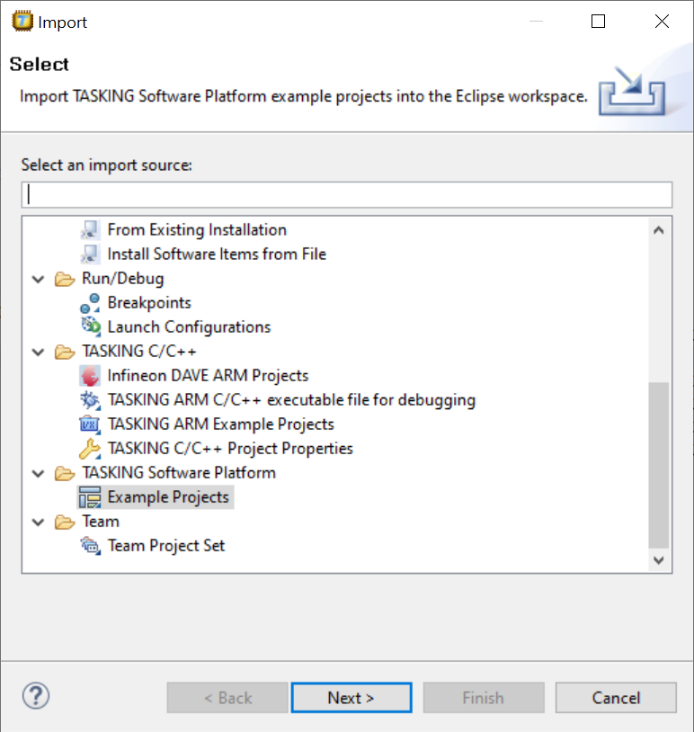

- Project is now inside .workspace folder
- Delete Project inside the IDE but not the project itself
- Move the Project out of .workspace and rename it to TASKING_STM32F4DISC_Audio_Service
- Import existing project and **do not** copy it into workspace

