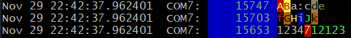
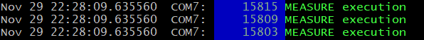

# Trace with `TRICE` and get `printf` comfort inside interrupts and everywhere

<!-- vscode-markdown-toc -->
* 1. [Description](#Description)
* 2. [Abstract](#Abstract)
* 3. [How it works - the main idea](#Howitworks-themainidea)
* 4. [*Trice* features](#Tricefeatures)
	* 4.1. [Execution speed](#Executionspeed)
	* 4.2. [Open source](#Opensource)
	* 4.3. [Simplicity](#Simplicity)
	* 4.4. [Target configuration and options](#Targetconfigurationandoptions)
	* 4.5. [Optimization](#Optimization)
	* 4.6. [Embedded device timestamps](#Embeddeddevicetimestamps)
	* 4.7. [PC timestamps](#PCtimestamps)
	* 4.8. [Runtime filterable colored channels](#Runtimefilterablecoloredchannels)
	* 4.9. [Compile time enable/disable `TRICE` on file level](#CompiletimeenabledisableTRICEonfilelevel)
	* 4.10. [Encryption option](#Encryptionoption)
	* 4.11. [Integrate several target devices in one log file](#Integrateseveraltargetdevicesinonelogfile)
	* 4.12. [Any byte capable 1-wire connection usable](#Anybytecapable1-wireconnectionusable)
	* 4.13. [Less FLASH memory needed compared to `printf` usage](#LessFLASHmemoryneededcomparedtoprintfusage)
	* 4.14. [ID Management](#IDManagement)
	* 4.15. [Runtime generated strings transfer](#Runtimegeneratedstringstransfer)
	* 4.16. [Extended format specifier possibilities](#Extendedformatspecifierpossibilities)
	* 4.17. [COBS encoding and user protocols](#COBSencodinganduserprotocols)
* 5. [Future](#Future)
* 6. [Conclusion](#Conclusion)
* 7. [References and further reading](#Referencesandfurtherreading)

<!-- vscode-markdown-toc-config
	numbering=true
	autoSave=true
	/vscode-markdown-toc-config -->
<!-- /vscode-markdown-toc -->

##  1. Description

`TRICE` is a comfortable macro, generating tiny C-code for getting PC `printf` comfort at "speed-of-light" for any micro-controller. It is supported by an in [Go](https://go.dev/) written powerful PC tool **trice** running on many platforms and comes with sample implementations. Features:
- super fast: a `TRICE` macro is executable in less than 10 clocks
- target and host timestamps
- runtime filterable colored channels
- encryption option
- enable/disable `TRICE` on file level 
- integrate several target devices in one log file
- transmit over TCP/IP to a remote server 
- any byte capable connection usable
- compared to `printf` usage, less needed FLASH memory

##  2. Abstract

If you develop software for an embedded system, you need some kind of system feedback. Debuggers are awesome tools, but when it comes to analyze dynamic behavior in the field, they are not usable.

Logging then, usually done with `printf` like functions, gets quick a result after having a `putchar()` implemented. This turns out to be an expensive way in terms of processor clocks and needed FLASH memory, when you regard the library code and all the strings needing FLASH memory space. For small micro-controllers that´s it.

Bigger micro-controllers are coming with embedded trace hardware. To use it, an expensive tool is needed. Useful for analyzing complex multi-tasking systems, but for in-field related issues at least unhandy.

Unhappy with this situation, the developer starts thinking of using digital pins or a spare analog output with an oscilloscope or starts emitting some proprietary LED blinking codes or byte sequences, difficult to interpret.

The *trice* technique tries to fill this gap trying to be minimal invasive and as comfortable as possible. It is the result of a long-year dissatisfaction and several attempts to find a loophole to make embedded programming more fun and this way more effective.

##  3. How it works - the main idea

- Executing a `printf` like function means:
  - Copy format string from FLASH memory into RAM.
  - Parse the format string for format specifiers.
  - Parse variadic parameter list.
  - Convert parameters according the format specifiers into character sequences.
    - This includes several divisions - costly function calls.
  - Concatenate the parts to an output string and deliver it to the output, what often means copying again.
  - Never ever call a `printf` like function in time critical code, like an interrupt.
- *Trice*, instead just copies an ID together with the parameters to the output and is done.
- This is goes in about 10 processor clocks. When running on a 64 MHz clock, light can travel about 30 meters in that time.
- To achieve that, a pre-compile step is needed, executing a `trice update` command.
  - The trice tool parses the the source tree for macros like `TRICE( "Hello World" );` and patches them to `TRICE( Id(nnnnn), "Hello World" );`, where `nnnnn` is a 16-bit identifier associated to the format string `"Hello World"`.
  - During compilation the `TRICE` macro is translated just to the `nnnnn` ID and the optional parameter values. The format string is ignored by the compiler.
  - At runtime just the ID with its parameter values is delivered to the PC. There the **trice** tool receives it, gets the right format string from the reference list and performs the printing task:
---
  

- The **trice** tool tries to help as much as possible, to let the developer focus on its programming task. For example, the once generated ID is not changed anymore without need. If for example the format string gets changed into `"Hello World!"`, a new ID is generated automatically and the reference list gets extended.

##  4. *Trice* features

###  4.1. Execution speed 

- During `TRICE` macro runtime, 32-bit pushing into a double buffer half occurs:
  - a target timestamp, if enabled
  - a mandatory 2-byte ID value with 1-byte data size and optionally 1-byte cycle counter
  - parameter values, if existing
- The white-on-blue numbers in the image above are the processor clock counting backwards 6 steps on each `TRICE` macro execution in this example.
- The disassembly shows, that only 3 Assembler instructions needed.
---

- That is all, what happens effectively.
- Additionally disable interrupts and restore interrupt state and cycle counter increment can consume a few processor clocks.

###  4.2. Open source

- Target code and PC tool are open source.
- The MIT license gives full usage freedom.
- Any program can decode the *trice* messages. The **trice** tool with its `log` switch is a working example written in the open source language [*Go*](https://go.dev/).

###  4.3. Simplicity

- Code instrumentation:
  - Add `trice.c` to the embedded project and `#include "trice.h"` to your source files.
  - Write for example `TRICE( "%d mV\n, voltage );` in a function.
  - `trice update` will update the source to `TRICE( Id(12345), "%d mV\n, voltage );` 
  - Use `trice log -port COMx -baud y` for logging.
- The logging does not need a restart, after changing the source again, it automatically updates the internal data.
- The **trice** tool comes with many command line switches for tailoring various needs, but usually these are not needed.

###  4.4. Target configuration and options

- Each project gets its own `triceConfig.h` file.
- Choose the *trice* mode here:
  - Direct mode: Straight output inside `TRICE` macro at the cost of the time it takes.
  - Indirect mode: Background output outside `TRICE` macro at the cost of RAM buffer needed.
- Set Options:
  - Target timestamps and their time base
  - Cycle counter
  - Allow `TRICE` usage inside interrupts
  - Buffer size

###  4.5. Optimization

- The default parameter width behind the `TRICE` macro is 32 bit. It is changeable.
- Also one can use the macros `TRICE8`, `TRICE16`, `TRICE32`, `TRICE64` to define the bit width explicit.
  - This leads for the smaller bit-widths to a data packing and less needed space and bandwidth if this is critical.
- Each macro can prolonged with the used parameter count, for example `TRICE8_3` or `TRICE_2` to improve compile time checks.
- Up to 12 parameters are supported. This is easy extendable up to a 1008 bytes payload per *trice*.

###  4.6. Embedded device timestamps

- If enabled, any 32-bit target value can be used as target timestamp, so it is in the hand of the developer if the system clock, a 10µs or a millisecond second counter is used.
- Delivered target timestamps are displayed by the **trice** tool automatically, changeable or suppressible by command line switch.
- If several `TRICE` macros form a single line, the **trice** tool only displays the target timestamp of the first `TRICE` macro.

###  4.7. PC timestamps

- Embedded devices often lack a real-time clock and some scenarios can last for weeks.
- Therefore the **trice** tool precedes each *trice* line with a PC timestamp, if not disabled. This is the *trice* reception time on the PC, what can be some milliseconds later than the *trice* event.
- With a normal setting the *trice* double buffer switches every 100ms. This is no visible display delay.

###  4.8. Runtime filterable colored channels

- Each *trice* format string can optionally start with a `pattern:` like in `TRICE( "msg:Hi!\n" );`.
- The **trice** tool, if knowing `msg:` as pattern, prepends the appropriate color code. It removes the sequence `pattern:`, if it is completely lower case.
- The user can define any pattern with any color code to create colored output with the **trice** tool.
- There is no channel enable switch inside the target code. It would need a back channel and add overhead. 
- The **trice** tool offers the 2 command line switches `-pick` and `-ban` to control channel visualization during runtime.  

###  4.9. Compile time enable/disable `TRICE` on file level 

- After debugging code in a file, there is no need to remove or comment out `TRICE` macros.
- `#define TRICE_OFF` just before `#include "trice.h"` and all `TRICE` macros in this file are ignored completely by the compiler.

###  4.10. Encryption option

- *Trice* output can be encrypted, allowing to deliver devices with access to diagnostics only with a password.

###  4.11. Integrate several target devices in one log file

- Several **trice** tool instances can run parallel on one or several PCs.
- Each **trice** tool instance receives *trices* from one embedded device.
- Instead of displaying the log lines, the **trice** tools can transmit them over TCP/IP to a **trice** tool acting as display server.
- The display server can fold these log lines in one output.
- For each embedded device a separate *trice* line prefix and suffix is definable.

###  4.12. Any byte capable 1-wire connection usable

- The usual trice output device is an UART but also SEGGER-RTT is supported over J-Link or ST-Link devices.
- It is easy to use a micro controller as *trice* bridge to a serial port from any port.

###  4.13. Less FLASH memory needed compared to `printf` usage

- Using *trice* frees FLASH memory from standard library `printf` code and also from all format strings.
- Of course the `TRICE` code needs also FLASH memory but only a fair amount and few bytes per macro. 

###  4.14. ID Management

- The 16-bit IDs support 65535 different format strings.
- Per default new IDs determined randomly to keep the chance low, that several developers grab the same ID.
- It is possible to divide the ID space - each developer gets its region.
- New IDs can be also incremental or decremental instead of random.
- `TRICE` macros commented out, are visible for the `trice update` command and therefore regarded.
- IDs get changed automatically to solve conflicts only.
- To make sure, a single ID will not be changed, change it to a hexadecimal syntax.
- The ID reference list keeps all obsolete IDs with their format strings allowing compatibility to former firmware versions.
- One can delete the ID reference list. It will be reconstructed automatically from the source tree with the next `trice update` command, but history is lost then.
- Optionally add the (compressed) ID reference list as resource into the target FLASH memory to be sure not to loose it in the next 20 years.  

###  4.15. Runtime generated strings transfer

- The `%s` format specifier is not supported by the `TRICE` macro.
- Strings, known at compile time should be a part of a format string.
- Strings created at runtime, need a special `TRICE_S` macro, which accepts exactly one type `%s` format specifier. The are allowed to a size of 1000 bytes each.

###  4.16. Extended format specifier possibilities

- Because the format string is interpreted by the **trice** tool written in [Go](https://en.wikipedia.org/wiki/Go_(programming_language)), the **Go** capabilities partial usable. For example `%b` allows output of bit patterns.

###  4.17. COBS encoding and user protocols

- One issue on data transfer is always how to re-sync after a data disruption. 
- The [**C**onsistent **O**verhead **B**yte **S**tuffing](https://en.wikipedia.org/wiki/Consistent_Overhead_Byte_Stuffing) technique is a very powerful and simple way for re-syncing.
- Just in case, wait for the next package delimiter.
- Several *trice* message can occur within one single **COBS** package.
- Each **COBS** package starts with a 32-bit descriptor:

| Descriptor     | Meaning |
| -              | -       |
| 0x00000000     | Several *trice* messages without target timestamp   |
| 0x00000001     | Several *trice* messages with target timestamp      |
| 2...0xffffffff | User protocol data, the **trice** tool ignores them |

- This allows intermixing of several data streams with *trice* data.

##  5. Future

- The *trice* technique is new and still under development.
- Plans exist: 
  - Additional tests and bug fixing
  - A **trice** PC tool configuration file
  - Interfacing [Grafana](https://grafana.com/) or similar tools
  - A target code option using a FIFO instead of double buffering. This will slow down the *trices* a bit, but needs less RAM.
  - A target code option calling a trice function behind the `Trice` macro. This will safe FLASH memory in large projects but slows down the *trices* a bit.

##  6. Conclusion

- Getting started with *trice* will take a few hours, but probably pay off during the further development.

##  7. References and further reading

- [*Trice* on Github](https://github.com/rokath/trice)
- [*Trice* example projects](https://github.com/rokath/trice/tree/master/test)
- [*Go* home](https://go.dev/)
