<!--

---

layout: default
title: Trice Reference Manual

---

-->

# Trice Reference Manual

<div id="top"></div>

```diff
+ Speed of Light `printf` Comfort Within Interrupts And Everywhere +
-   (TL;DR)   ->  Too Long; Don't Read - use it as reference only❗
```

<!-- 
PDF Generation
* Install VS Code extension "Markdown PDF" 
* Use Shift-Command-P "markdown PDF:export" to generate a PDF
* page break for PDF generation: <div style="page-break-before: always;"></div> 
-->

<p align="right">(<a href="#bottom">go to bottom</a>)</p>

---

<h2>Table of Contents</h2>

<!--
<style>
details.toc .toc-hide {
  display: none;
}

details.toc[open] .toc-show {
  display: none;
}

details.toc[open] .toc-hide {
  display: inline;
}

/* Hide the collapsible hint entirely in the PDF. */
@media print {
  details.toc > summary {
    display: none;
  }
}
</style>

<details open markdown="1" class="toc">
<summary>
  <span class="toc-show">Show</span>
  <span class="toc-hide">Hide</span>
</summary>
-->

<details open markdown="1">
<summary>Show/hide Table of Contents</summary>

<!-- mdtoc -->

* [1. Abstract](#abstract)
* [2. A brief history of Trice](#a-brief-history-of-trice)
* [3. How it works - the main idea](#how-it-works---the-main-idea)
* [4. Trice Features (Overview)](#trice-features-overview)
  * [4.1. No Dynamic Memory Management needed](#no-dynamic-memory-management-needed)
  * [4.2. Open source](#open-source)
  * [4.3. Easy-to-use](#easy-to-use)
  * [4.4. Small size - using Trice frees FLASH memory](#small-size---using-trice-frees-flash-memory)
  * [4.5. Execution speed](#execution-speed)
  * [4.6. Robustness](#robustness)
  * [4.7. Minimal Transfer Bytes Amount](#minimal-transfer-bytes-amount)
  * [4.8. More comfort than printf-like functions but small differences](#more-comfort-than-printf-like-functions-but-small-differences)
  * [4.9. Tags, Color and Log Levels](#tags-color-and-log-levels)
  * [4.10. Compile Time Enable/Disable Trice Macros on File or Project Level](#compile-time-enabledisable-trice-macros-on-file-or-project-level)
  * [4.11. Target and host timestamps](#target-and-host-timestamps)
  * [4.12. Target source code location](#target-source-code-location)
  * [4.13. Several target devices in one log output](#several-target-devices-in-one-log-output)
  * [4.14. Any byte-capable 1-wire connection usable](#any-byte-capable-1-wire-connection-usable)
  * [4.15. Scalability](#scalability)
  * [4.16. Portability and Modularity](#portability-and-modularity)
  * [4.17. Optional Trice messages encryption](#optional-trice-messages-encryption)
  * [4.18. Trice Protection](#trice-protection)
  * [4.19. Trice Diagnostics](#trice-diagnostics)
  * [4.20. Trice Cache](#trice-cache)
  * [4.21. Avoiding False-Positive Editor Warnings](#avoiding-false-positive-editor-warnings)
  * [4.22. Trice Generator](#trice-generator)
  * [4.23. Versions and Variants Trice Stability](#versions-and-variants-trice-stability)
  * [4.24. Legacy Project Code Integration](#legacy-project-code-integration)
* [5. Start with Trice](#start-with-trice)
  * [5.1. Get it](#get-it)
  * [5.2. Install It](#install-it)
  * [5.3. Try it](#try-it)
  * [5.4. Use It](#use-it)
  * [5.5. Fork It (get a contributor)](#fork-it-get-a-contributor)
    * [5.5.1. ✅ What “forking” means](#what-forking-means)
    * [5.5.2. 🧭 How to Fork (GitHub)](#how-to-fork-github)
  * [5.6. Clone It](#clone-it)
  * [5.7. Build It](#build-it)
  * [5.8. Modify It](#modify-it)
  * [5.9. Port it](#port-it)
    * [5.9.1. Target Macros](#target-macros)
    * [5.9.2. Target Trice Stamps](#target-trice-stamps)
    * [5.9.3. Trice Checks](#trice-checks)
    * [5.9.4. Communication Ports](#communication-ports)
    * [5.9.5. Target Code Overview](#target-code-overview)
    * [5.9.6. User Code Adaptation](#user-code-adaptation)
    * [5.9.7. Limitations](#limitations)
    * [5.9.8. Trice (Time) Stamps](#trice-time-stamps)
    * [5.9.9. Trice Parameter Bit Widths](#trice-parameter-bit-widths)
  * [5.10. Avoid it](#avoid-it)
    * [5.10.1. Parser Limitation](#parser-limitation)
    * [5.10.2. Trice macros in header files](#trice-macros-in-header-files)
    * [5.10.3. Trice macros inside other macros](#trice-macros-inside-other-macros)
    * [5.10.4. Upper case only TRICE macros should be written with id(0), Id(0) or ID(0)](#upper-case-only-trice-macros-should-be-written-with-id0-id0-or-id0)
* [6. Quickstarts](#quickstarts)
  * [6.1. Quickstart: Existing non-blocking byte writer, deferred auxiliary 8-bit](#quickstart-existing-non-blocking-byte-writer-deferred-auxiliary-8-bit)
    * [6.1.1. Add Trice target sources](#add-trice-target-sources)
    * [6.1.2. Configure deferred auxiliary 8-bit output](#configure-deferred-auxiliary-8-bit-output)
    * [6.1.3. Assign your writer function](#assign-your-writer-function)
    * [6.1.4. Insert IDs before compiling](#insert-ids-before-compiling)
    * [6.1.5. Decode on the PC](#decode-on-the-pc)
    * [6.1.6. Common first checks](#common-first-checks)
    * [6.1.7. Why this quickstart matters](#why-this-quickstart-matters)
  * [6.2. Quickstart: SEGGER RTT direct mode with J-Link](#quickstart-segger-rtt-direct-mode-with-j-link)
    * [6.2.1. Install tools](#install-tools)
    * [6.2.2. Add target sources](#add-target-sources)
    * [6.2.3. Configure direct RTT](#configure-direct-rtt)
    * [6.2.4. Add a first Trice call](#add-a-first-trice-call)
    * [6.2.5. Insert, build, flash](#insert-build-flash)
    * [6.2.6. Log through J-Link RTT](#log-through-j-link-rtt)
    * [6.2.7. When this path is ideal](#when-this-path-is-ideal)
    * [6.2.8. When this path is not ideal](#when-this-path-is-not-ideal)
  * [6.3. Quickstart: UART or USB-VCOM deferred output](#quickstart-uart-or-usb-vcom-deferred-output)
* [7. Trice Trouble Shooting Hints](#trice-trouble-shooting-hints)
  * [7.1. Initial Data Transfer Setup Hints](#initial-data-transfer-setup-hints)
  * [7.2. Short Trouble Shooting Hints](#short-trouble-shooting-hints)
* [8. Trice Cache for Compilation Speed](#trice-cache-for-compilation-speed)
  * [8.1. Trice Cache Idea](#trice-cache-idea)
  * [8.2. Trice Cache Logic](#trice-cache-logic)
  * [8.3. Trice Cache Remarks](#trice-cache-remarks)
  * [8.4. Trice Cache Tests](#trice-cache-tests)
  * [8.5. Possible Trice Cache Editor-Issues And How To Get Around](#possible-trice-cache-editor-issues-and-how-to-get-around)
  * [8.6. Activating the Trice Cache](#activating-the-trice-cache)
* [9. Embedded system code configuration](#embedded-system-code-configuration)
* [10. Trice tool in logging action](#trice-tool-in-logging-action)
* [11. Optional XTEA Encryption](#optional-xtea-encryption)
* [12. Trice Command Line Interface & Examples](#trice-command-line-interface--examples)
  * [12.1. Common information](#common-information)
  * [12.2. Further examples](#further-examples)
    * [12.2.1. Automated pre-build insert command example](#automated-pre-build-insert-command-example)
    * [12.2.2. Some Log examples](#some-log-examples)
    * [12.2.3. Logging over a display server](#logging-over-a-display-server)
    * [12.2.4. Logfile output](#logfile-output)
    * [12.2.5. Binary Logfile](#binary-logfile)
    * [12.2.6. TCP4 output](#tcp4-output)
    * [12.2.7. TCP4 input](#tcp4-input)
    * [12.2.8. UDP4 input](#udp4-input)
    * [12.2.9. Stimulate target with a user command over UART](#stimulate-target-with-a-user-command-over-uart)
    * [12.2.10. Explore and modify tags and their colors](#explore-and-modify-tags-and-their-colors)
    * [12.2.11. Location Information](#location-information)
  * [12.3. Visualization output with -vis](#visualization-output-with--vis)
  * [12.4. Setting up the LabPlot Demo](#setting-up-the-labplot-demo)
    * [12.4.1. The common live-data format](#the-common-live-data-format)
    * [12.4.2. ./examples/DemoDataCSV](#examplesdemodatacsv)
    * [12.4.3. ./examples/DemoDataTrice](#examplesdemodatatrice)
    * [12.4.4. Quick LabPlot demonstration](#quick-labplot-demonstration)
    * [12.4.5. Recreate the project in LabPlot](#recreate-the-project-in-labplot)
    * [12.4.6. Troubleshooting and adaptations](#troubleshooting-and-adaptations)
* [13. Limitations](#limitations-1)
  * [13.1. Permanent Limitations](#permanent-limitations)
    * [13.1.1. Limitation TRICE in TRICE not possible](#limitation-trice-in-trice-not-possible)
  * [13.2. Current Limitations](#current-limitations)
    * [13.2.1. String Concatenation Within TRICE Macros Not Possible](#string-concatenation-within-trice-macros-not-possible)
    * [13.2.2. Limited Trice Parser Capabilities](#limited-trice-parser-capabilities)
    * [13.2.3. Special Care Demands](#special-care-demands)
* [14. Additional hints](#additional-hints)
  * [14.1. Pre-built executables are available](#pre-built-executables-are-available)
  * [14.2. Configuration file triceConfig.h](#configuration-file-triceconfigh)
  * [14.3. Setting up the very first connection](#setting-up-the-very-first-connection)
  * [14.4. Avoid buffer overruns](#avoid-buffer-overruns)
  * [14.5. Buffer Macros](#buffer-macros)
  * [14.6. Logfile viewing](#logfile-viewing)
  * [14.7. Using the Trice tool with 3rd party tools](#using-the-trice-tool-with-3rd-party-tools)
  * [14.8. Several targets at the same time](#several-targets-at-the-same-time)
  * [14.9. Executing go test -race -count 100 ./...](#executing-go-test--race--count-100-)
  * [14.10. TRICESTACKBUFFER could cause stack overflow with -o0 optimization](#tricestackbuffer-could-cause-stack-overflow-with--o0-optimization)
  * [14.11. Cycle Counter](#cycle-counter)
* [15. Switching Trice ON and OFF](#switching-trice-on-and-off)
  * [15.1. Target side compile-time Trice On-Off](#target-side-compile-time--trice-on-off)
  * [15.2. Host side Trice On-Off](#host-side-trice-on-off)
* [16. Framing](#framing)
* [17. Endianness](#endianness)
* [18. Trice (Time)Stamps](#trice-timestamps)
  * [18.1. Target (Time)Stamps Formatting](#target-timestamps-formatting)
  * [18.2. Target (Time)Stamp Delta Columns](#target-timestamp-delta-columns)
    * [18.2.1. Purpose](#purpose)
    * [18.2.2. General Behavior](#general-behavior)
    * [18.2.3. Column Order](#column-order)
    * [18.2.4. Independence from -ts](#independence-from--ts)
    * [18.2.5. Formatting Rules](#formatting-rules)
    * [18.2.6. Special Case: -ts32 epoch](#special-case--ts32-epoch)
    * [18.2.7. Automatic -ts0delta Placeholder](#automatic--ts0delta-placeholder)
    * [18.2.8. Typical Use Cases](#typical-use-cases)
    * [18.2.9. Example Screenshots](#example-screenshots)
    * [18.2.10. Summary](#summary)
* [19. Binary Encoding](#binary-encoding)
  * [19.1. Symbols](#symbols)
  * [19.2. Package Format](#package-format)
    * [19.2.1. typeX0 Records](#typex0-records)
    * [19.2.2. Framing - NONE or with COBS or TCOBS encoding](#framing---none-or-with-cobs-or-tcobs-encoding)
* [20. typeX0 User Packets](#typex0-user-packets)
  * [20.1. Packet Classification](#packet-classification)
  * [20.2. The typeX0 Counted Format](#the-typex0-counted-format)
  * [20.3. CLI Option -typeX0](#cli-option--typex0)
  * [20.4. typeX0 Target Code](#typex0-target-code)
    * [20.4.1. Target-side counted helper](#target-side-counted-helper)
    * [20.4.2. typeX0 Build Switches](#typex0-build-switches)
    * [20.4.3. typeX0 Usage in ./examples/G0B1_inst](#typex0-usage-in-examplesg0b1_inst)
  * [20.5. Go implementation layout](#go-implementation-layout)
  * [20.6. Tests](#tests)
  * [20.7. Initial scope](#initial-scope)
* [21. Trice Decoding](#trice-decoding)
  * [21.1. Trice ID list til.json](#trice-id-list-tiljson)
  * [21.2. Trice location information file li.json](#trice-location-information-file-lijson)
* [22. Trice ID Numbers](#trice-id-numbers)
  * [22.1. ID number selection](#id-number-selection)
    * [22.1.1. Trice tool internal Method to get fast a random ID](#trice-tool-internal-method-to-get-fast-a-random-id)
  * [22.2. ID number usage and stability](#id-number-usage-and-stability)
  * [22.3. Trice ID 0](#trice-id-0)
* [23. Trice ID management](#trice-id-management)
  * [23.1. Trice inside source code](#trice-inside-source-code)
    * [23.1.1. Trice in source code comments](#trice-in-source-code-comments)
    * [23.1.2. Trice parser exclusion markers](#trice-parser-exclusion-markers)
    * [23.1.3. Different IDs for same Trices](#different-ids-for-same-trices)
    * [23.1.4. Same IDs for different Trices](#same-ids-for-different-trices)
    * [23.1.5. ID Routing](#id-routing)
    * [23.1.6. Possibility to create new tags without modifying trice tool source](#possibility-to-create-new-tags-without-modifying-trice-tool-source)
* [24. Trice Bind](#trice-bind)
  * [24.1. Overview](#overview)
  * [24.2. Requirements](#requirements)
  * [24.3. Quick Start](#quick-start)
    * [24.3.1. New ID-Free Project](#new-id-free-project)
    * [24.3.2. Migration from trice insert](#migration-from-trice-insert)
  * [24.4. Persistent and Generated Files](#persistent-and-generated-files)
  * [24.5. Hierarchical Metadata Reuse](#hierarchical-metadata-reuse)
  * [24.6. File Key and Sidecar Name](#file-key-and-sidecar-name)
  * [24.7. Sidecar Contents](#sidecar-contents)
  * [24.8. Why the Sidecar Include Is File-Local](#why-the-sidecar-include-is-file-local)
  * [24.9. Headers and static inline](#headers-and-static-inline)
  * [24.10. Automatic Include Position](#automatic-include-position)
  * [24.11. File Classification and Mixed Projects](#file-classification-and-mixed-projects)
    * [24.11.1. Insert-Owned](#insert-owned)
    * [24.11.2. Bind-Owned](#bind-owned)
    * [24.11.3. Mixed](#mixed)
    * [24.11.4. Insert-Owned File After a Bind Header](#insert-owned-file-after-a-bind-header)
  * [24.12. Supported Trice Calls](#supported-trice-calls)
  * [24.13. ID and Stamp Forms](#id-and-stamp-forms)
    * [24.13.1. ID-Free](#id-free)
    * [24.13.2. Zero Placeholders](#zero-placeholders)
  * [24.14. Command Line](#command-line)
  * [24.15. Build Integration](#build-integration)
  * [24.16. TRICE_CLEAN](#trice_clean)
    * [24.16.1. trice clean After trice bind](#trice-clean-after-trice-bind)
  * [24.17. Re-Migration to trice insert](#re-migration-to-trice-insert)
  * [24.18. Automatic Local Counter Rebase](#automatic-local-counter-rebase)
    * [24.18.1. When the Normal Line Path Is Sufficient](#when-the-normal-line-path-is-sufficient)
    * [24.18.2. When trice bind Rebases Locally](#when-trice-bind-rebases-locally)
    * [24.18.3. Concrete Wrapper Example](#concrete-wrapper-example)
    * [24.18.4. Preferred Form: Normal or static inline Function](#preferred-form-normal-or-static-inline-function)
    * [24.18.5. Headers and Translation Units](#headers-and-translation-units)
    * [24.18.6. Compact Source Boundaries and Generated Helper Headers](#compact-source-boundaries-and-generated-helper-headers)
    * [24.18.7. Missing &#95;&#95;COUNTER&#95;&#95;](#missing-9595counter9595)
    * [24.18.8. Unchanged Interfaces](#unchanged-interfaces)
  * [24.19. Supported Boundaries and Remaining Limitations](#supported-boundaries-and-remaining-limitations)
    * [24.19.1. bind-limits](#bind-limits)
  * [24.20. Diagnostics and Troubleshooting](#diagnostics-and-troubleshooting)
    * [24.20.1. Sidecar Not Found](#sidecar-not-found)
    * [24.20.2. File-Key Conflict](#file-key-conflict)
    * [24.20.3. File Is mixed](#file-is-mixed)
    * [24.20.4. Bind Include Is in the Wrong Place](#bind-include-is-in-the-wrong-place)
    * [24.20.5. Unexpected Message After a Source Change](#unexpected-message-after-a-source-change)
    * [24.20.6. Advanced Construct Requires &#95;&#95;COUNTER&#95;&#95;](#advanced-construct-requires-9595counter9595)
    * [24.20.7. Counter Count or Rebase Descriptor Does Not Match](#counter-count-or-rebase-descriptor-does-not-match)
  * [24.21. Result](#result)
  * [24.22. Appendix: Preprocessor Fundamentals](#appendix-preprocessor-fundamentals)
    * [24.22.1. Local Insert/Bind Dispatch](#local-insertbind-dispatch)
    * [24.22.2. Site Descriptor](#site-descriptor)
  * [24.23. Appendix: Stable ID Assignment and Binding Background](#appendix-stable-id-assignment-and-binding-background)
    * [24.23.1. Stable ID Assignment](#stable-id-assignment)
    * [24.23.2. Transfer into the Target Code](#transfer-into-the-target-code)
    * [24.23.3. Why the Source Scan Remains Authoritative](#why-the-source-scan-remains-authoritative)
    * [24.23.4. Requirements Met by the Sidecar Approach](#requirements-met-by-the-sidecar-approach)
  * [24.24. Appendix: TRICE_CLEAN States at a Glance](#appendix-trice_clean-states-at-a-glance)
  * [24.25. Appendix: Why Bind Uses Local Counter Rebasing](#appendix-why-bind-uses-local-counter-rebasing)
  * [24.26. Appendix: Bind and Insert Test Evidence](#appendix-bind-and-insert-test-evidence)
* [25. Trice version 1.0 Log-level Control](#trice-version-10-log-level-control)
  * [25.1. Trice version 1.0 Compile-time Log-level Control](#trice-version-10-compile-time-log-level-control)
  * [25.2. Trice version 1.0 Run-time Log-level Control](#trice-version-10-run-time-log-level-control)
  * [25.3. Trice Version 1.0 Compile-time - Run-time Log-level Control](#trice-version-10-compile-time---run-time-log-level-control)
* [26. ID reference list til.json](#id-reference-list-tiljson)
  * [26.1. Compatibility with firmware and host-tool versions](#compatibility-with-firmware-and-host-tool-versions)
  * [26.2. til.json Version control](#tiljson-version-control)
  * [26.3. Long Time Availability](#long-time-availability)
* [27. The Trice Insert Algorithm](#the-trice-insert-algorithm)
  * [27.1. Starting Conditions](#starting-conditions)
  * [27.2. Aims](#aims)
  * [27.3. Method](#method)
    * [27.3.1. Trice Insert Initialization](#trice-insert-initialization)
  * [27.4. User Code Patching (trice insert)](#user-code-patching-trice-insert)
  * [27.5. User Code Patching Examples](#user-code-patching-examples)
  * [27.6. Exclude folders & files from being parsed (pull request 529)](#exclude-folders--files-from-being-parsed-pull-request-529)
  * [27.7. ID Usage Options](#id-usage-options)
  * [27.8. General ID Management Information](#general-id-management-information)
    * [27.8.1. Option Cleaning in a Post-build process](#option-cleaning-in-a-post-build-process)
    * [27.8.2. Option Let the inserted Trice ID be a Part of the User Code](#option-let-the-inserted-trice-id-be-a-part-of-the-user-code)
    * [27.8.3. Option Cleaning on Repository Check-In](#option-cleaning-on-repository-check-in)
* [28. Trice Speed](#trice-speed)
  * [28.1. Target Implementation Options](#target-implementation-options)
    * [28.1.1. Trice Use Cases TRICESTATICBUFFER and TRICESTACKBUFFER - direct mode only](#trice-use-cases-tricestaticbuffer-and-tricestackbuffer---direct-mode-only)
    * [28.1.2. Trice Use Case TRICEDOUBLEBUFFER - deferred mode, fastest Trice execution, more RAM needed](#trice-use-case-tricedoublebuffer---deferred-mode-fastest-trice-execution-more-ram-needed)
    * [28.1.3. Trice Use Case TRICERINGBUFFER - deferred mode, balanced Trice execution time and needed RAM](#trice-use-case-triceringbuffer---deferred-mode-balanced-trice-execution-time-and-needed-ram)
  * [28.2. A configuration for maximum Trice execution speed with the L432inst example](#a-configuration-for-maximum-trice-execution-speed-with-the-l432inst-example)
  * [28.3. A configuration for normal Trice execution speed with the G0B1inst example](#a-configuration-for-normal-trice-execution-speed-with-the-g0b1inst-example)
* [29. Trice memory needs](#trice-memory-needs)
  * [29.1. F030bare Size](#f030bare-size)
  * [29.2. F030inst Size with TRICEOFF=1](#f030inst-size-with-triceoff1)
  * [29.3. F030inst with ring buffer](#f030inst-with-ring-buffer)
  * [29.4. F030inst with ring buffer](#f030inst-with-ring-buffer-1)
  * [29.5. A developer setting, only enabling SEGGERRTT](#a-developer-setting-only-enabling-seggerrtt)
  * [29.6. A developer setting, only enabling SEGGERRTT and without deferred output gives after running ./build.sh TRICE_DIAGNOSTICS=0 TRICE_PROTECT=0:](#a-developer-setting-only-enabling-seggerrtt-and-without-deferred-output-gives-after-running-buildsh-trice_diagnostics0-trice_protect0)
  * [29.7. Settings Conclusion](#settings-conclusion)
  * [29.8. Legacy Trice Space Example (Old Version)](#legacy-trice-space-example-old-version)
  * [29.9. Memory Needs for Old Example 1](#memory-needs-for-old-example-1)
  * [29.10. Memory Needs for Old Example 2](#memory-needs-for-old-example-2)
* [30. Trice Project Image Size Optimization](#trice-project-image-size-optimization)
  * [30.1. Code Optimization -o3 or -oz (if supported)](#code-optimization--o3-or--oz-if-supported)
  * [30.2. Compiler Independent Setting (a bit outdated)](#compiler-independent-setting-a-bit-outdated)
  * [30.3. Linker Option --split-sections (if supported)](#linker-option---split-sections-if-supported)
  * [30.4. Linker Optimization -flto (if supported)](#linker-optimization--flto-if-supported)
    * [30.4.1. ARMCC Compiler v5 Linker Feedback](#armcc-compiler-v5-linker-feedback)
    * [30.4.2. ARMCLANG Compiler v6 Link-Time Optimization](#armclang-compiler-v6-link-time-optimization)
    * [30.4.3. GCC](#gcc)
    * [30.4.4. LLVM ARM Clang](#llvm-arm-clang)
    * [30.4.5. Other IDE´s and compilers](#other-ides-and-compilers)
  * [30.5. Legacy STM32F030 Example Project - Different Build Sizes](#legacy-stm32f030-example-project---different-build-sizes)
    * [30.5.1. ARMCC compiler v5](#armcc-compiler-v5)
* [31. Trice Tags, Color, and Weights](#trice-tags-color-and-weights)
  * [31.1. How to use tags](#how-to-use-tags)
  * [31.2. Tag weights](#tag-weights)
  * [31.3. Selecting tags and priority](#selecting-tags-and-priority)
  * [31.4. Decoder diagnostics](#decoder-diagnostics)
  * [31.5. User-defined tags, weights, and colors](#user-defined-tags-weights-and-colors)
  * [31.6. Untagged application events](#untagged-application-events)
  * [31.7. Event statistics](#event-statistics)
  * [31.8. Output options](#output-options)
  * [31.9. Check color alternatives](#check-color-alternatives)
  * [31.10. Color issues under Windows](#color-issues-under-windows)
* [32. Structured Logging](#structured-logging)
  * [32.1. Placeholders and Names](#placeholders-and-names)
  * [32.2. Field Types and Display](#field-types-and-display)
  * [32.3. Instrumentation and Dictionary](#instrumentation-and-dictionary)
  * [32.4. Output Formats and Event Boundaries](#output-formats-and-event-boundaries)
  * [32.5. JSON and KV Contract](#json-and-kv-contract)
  * [32.6. Optional Metadata](#optional-metadata)
  * [32.7. Field Registry](#field-registry)
* [33. Trice Context Enrichment](#trice-context-enrichment)
  * [33.1. Getting Started with Position and Speed](#getting-started-with-position-and-speed)
  * [33.2. Rules and Selectors](#rules-and-selectors)
  * [33.3. Reversible Workflow with insert and clean](#reversible-workflow-with-insert-and-clean)
  * [33.4. Expressions, Fields and Evaluation](#expressions-fields-and-evaluation)
  * [33.5. Using Global and Local Values](#using-global-and-local-values)
  * [33.6. Build, IDs and Generated Files](#build-ids-and-generated-files)
  * [33.7. Supported Log Sites and Alternatives](#supported-log-sites-and-alternatives)
  * [33.8. Test Coverage](#test-coverage)
  * [33.9. Appendix: CE Feasibility Proofs](#appendix-ce-feasibility-proofs)
    * [33.9.1. Mechanism Under Test](#mechanism-under-test)
    * [33.9.2. Verified Behavior](#verified-behavior)
    * [33.9.3. Compiler and Editor Diagnostics](#compiler-and-editor-diagnostics)
    * [33.9.4. Reproducing the Direct-Site Proof](#reproducing-the-direct-site-proof)
    * [33.9.5. Relationship to Production Support](#relationship-to-production-support)
    * [33.9.6. Counterexample for the Original Rebase Approach](#counterexample-for-the-original-rebase-approach)
    * [33.9.7. Extended PoC for Wrapper Macros and Counter Rebasing](#extended-poc-for-wrapper-macros-and-counter-rebasing)
  * [33.10. Approach and Boundaries](#approach-and-boundaries)
* [34. Trice without UART](#trice-without-uart)
* [35. Trice over RTT](#trice-over-rtt)
  * [35.1. For the impatient (2 possibilities)](#for-the-impatient-2-possibilities)
    * [35.1.1. Start JLink commander and connect over TCP](#start-jlink-commander-and-connect-over-tcp)
    * [35.1.2. Start using JLinkRTTLogger](#start-using-jlinkrttlogger)
    * [35.1.3. JLinkRTTLogger Issue](#jlinkrttlogger-issue)
  * [35.2. Segger Real Time Transfer (RTT)](#segger-real-time-transfer-rtt)
  * [35.3. J-Link option](#j-link-option)
    * [35.3.1. Convert Evaluation Board onboard ST-Link to J-Link](#convert-evaluation-board-onboard-st-link-to-j-link)
    * [35.3.2. Some SEGGER tools in short](#some-segger-tools-in-short)
    * [35.3.3. JLinkRTTClient.exe](#jlinkrttclientexe)
    * [35.3.4. JLinkRTTViewer.exe](#jlinkrttviewerexe)
  * [35.4. Segger RTT](#segger-rtt)
  * [35.5. Segger J-Link SDK (800 EUR) Option](#segger-j-link-sdk-800-eur-option)
  * [35.6. Additional Notes (leftovers)](#additional-notes-leftovers)
  * [35.7. Further development](#further-development)
  * [35.8. NUCLEO-F030R8 example](#nucleo-f030r8-example)
    * [35.8.1. RTT with original on-board ST-LINK firmware](#rtt-with-original-on-board-st-link-firmware)
    * [35.8.2. Change to J-LINK onboard firmware](#change-to-j-link-onboard-firmware)
    * [35.8.3. RTT with J-LINK firmware on-board](#rtt-with-j-link-firmware-on-board)
  * [35.9. Possible issues](#possible-issues)
  * [35.10. OpenOCD with Darwin (macOS)](#openocd-with-darwin-macos)
  * [35.11. SEGGER J-Link on Darwin (macOS)](#segger-j-link-on-darwin-macos)
  * [35.12. Links](#links)
* [36. Writing the Trice logs into an SD-card (or a user specific output)](#writing-the-trice-logs-into-an-sd-card-or-a-user-specific-output)
* [37. Trice Target Code Implementation](#trice-target-code-implementation)
  * [37.1. TRICE Macro structure](#trice-macro-structure)
    * [37.1.1. TRICEENTER](#triceenter)
    * [37.1.2. TRICEPUT](#triceput)
    * [37.1.3. TRICELEAVE](#triceleave)
  * [37.2. TRICESTACKBUFFER](#tricestackbuffer)
  * [37.3. TRICESTATICBUFFER](#tricestaticbuffer)
  * [37.4. TRICEDOUBLEBUFFER](#tricedoublebuffer)
  * [37.5. TRICERINGBUFFER](#triceringbuffer)
  * [37.6. Deferred Out](#deferred-out)
    * [37.6.1. Double Buffer](#double-buffer)
    * [37.6.2. Ring Buffer](#ring-buffer)
    * [37.6.3. Local Deferred Text Log](#local-deferred-text-log)
  * [37.7. Direct Transfer](#direct-transfer)
  * [37.8. Possible Target Code Improvements](#possible-target-code-improvements)
* [38. Trice Similarities and Differences to printf Usage](#trice-similarities-and-differences-to-printf-usage)
  * [38.1. Printf-like functions](#printf-like-functions)
  * [38.2. Trice IDs](#trice-ids)
  * [38.3. Trice values bit width](#trice-values-bit-width)
  * [38.4. Many value parameters](#many-value-parameters)
  * [38.5. Floating Point Values](#floating-point-values)
  * [38.6. Runtime Generated 0-terminated Strings Transfer with triceS](#runtime-generated-0-terminated-strings-transfer-with-trices)
  * [38.7. Runtime Generated counted Strings Transfer with triceN](#runtime-generated-counted-strings-transfer-with--tricen)
  * [38.8. Runtime Generated Buffer Transfer with triceB](#runtime-generated-buffer-transfer-with-triceb)
  * [38.9. Extended format specifier possibilities](#extended-format-specifier-possibilities)
    * [38.9.1. Trice format specifier](#trice-format-specifier)
    * [38.9.2. Length modifier support](#length-modifier-support)
    * [38.9.3. Overview Table](#overview-table)
  * [38.10. Unsupported printf format features](#unsupported-printf-format-features)
    * [38.10.1. Dynamic field width with *](#dynamic-field-width-with-)
    * [38.10.2. Dynamic precision with *](#dynamic-precision-with-)
    * [38.10.3. Dynamic width and precision together](#dynamic-width-and-precision-together)
    * [38.10.4. Wide character and wide string formats: %lc and %ls](#wide-character-and-wide-string-formats-lc-and-ls)
    * [38.10.5. The special %n conversion specifier](#the-special-n-conversion-specifier)
    * [38.10.6. Security implications of %n](#security-implications-of-n)
    * [38.10.7. Why Trice does not support %n](#why-trice-does-not-support-n)
  * [38.11. UTF-8 Support](#utf-8-support)
  * [38.12. Switch the language without changing a bit inside the target code](#switch-the-language-without-changing-a-bit-inside-the-target-code)
  * [38.13. Format tags prototype specifier examples](#format-tags-prototype-specifier-examples)
* [39. Trice ABC - Asynchronous Broadcast Commands](#trice-abc---asynchronous-broadcast-commands)
  * [39.1. Quick use](#quick-use)
  * [39.2. ABC macro families](#abc-macro-families)
  * [39.3. Command names and handler names](#command-names-and-handler-names)
  * [39.4. Receiver selection and generated table](#receiver-selection-and-generated-table)
  * [39.5. Receive runtime contract](#receive-runtime-contract)
  * [39.6. Handler payload handling](#handler-payload-handling)
  * [39.7. Responses](#responses)
  * [39.8. What ABC is not](#what-abc-is-not)
  * [39.9. Example: examples/TriceAbc](#example-examplestriceabc)
    * [39.9.1. ABC Demo Layout, Startup, and Runtime Policy](#abc-demo-layout-startup-and-runtime-policy)
  * [39.10. BcSim Broadcast Byte-Stream Simulator](#bcsim-broadcast-byte-stream-simulator)
  * [39.11. Host tests](#host-tests)
  * [39.12. Building RPC-like protocols on top](#building-rpc-like-protocols-on-top)
  * [39.13. Security boundary](#security-boundary)
  * [39.14. Summary](#summary-1)
* [40. Development Environment Setup](#development-environment-setup)
  * [40.1. Common Information](#common-information-1)
  * [40.2. Important to know](#important-to-know)
  * [40.3. Animation](#animation)
  * [40.4. Setup Linux PC - Example with Debian12 - KDE Desktop](#setup-linux-pc---example-with-debian12---kde-desktop)
    * [40.4.1. Basic setup](#basic-setup)
    * [40.4.2. GitHub](#github)
    * [40.4.3. VS Code](#vs-code)
    * [40.4.4. Go](#go)
    * [40.4.5. Gitkraken (or other GUI for git)](#gitkraken-or-other-gui-for-git)
    * [40.4.6. arm-none-eabi toolchain (or other target system compiler)](#arm-none-eabi-toolchain-or-other-target-system-compiler)
    * [40.4.7. J-Link (if needed)](#j-link-if-needed)
    * [40.4.8. Beyond Compare (if no other diff tool)](#beyond-compare-if-no-other-diff-tool)
  * [40.5. Setup Windows PC Example](#setup-windows-pc-example)
    * [40.5.1. Choose the right Windows compiler](#choose-the-right-windows-compiler)
    * [40.5.2. Setup Trice](#setup-trice)
    * [40.5.3. Setup ARM Environment Example](#setup-arm-environment-example)
    * [40.5.4. Inventory, select, and remove compiler versions](#inventory-select-and-remove-compiler-versions)
    * [40.5.5. Setup STM32](#setup-stm32)
    * [40.5.6. Setup Onboard J-Link on NUCLEO (other ST evaluation boards too)](#setup-onboard-j-link-on-nucleo-other-st-evaluation-boards-too)
    * [40.5.7. Setup VS-Code](#setup-vs-code)
  * [40.6. Makefile with Clang too](#makefile-with-clang-too)
  * [40.7. Download Locations](#download-locations)
    * [40.7.1. Clang](#clang)
    * [40.7.2. GCC](#gcc-1)
  * [40.8. Install Locations](#install-locations)
  * [40.9. Environment Variables](#environment-variables)
  * [40.10. Build command](#build-command)
  * [40.11. Run & Debug](#run--debug)
  * [40.12. Logging](#logging)
  * [40.13. Setting up a new project](#setting-up-a-new-project)
  * [40.14. Third-party packages and retained versions](#third-party-packages-and-retained-versions)
* [41. Example Projects without and with Trice Instrumentation](#example-projects-without-and-with-trice-instrumentation)
  * [41.1. Minimal PC Demos: Direct and Deferred](#minimal-pc-demos-direct-and-deferred)
  * [41.2. PC Feature Tour](#pc-feature-tour)
    * [41.2.1. Updating the PC Tour's Output Checks](#updating-the-pc-tours-output-checks)
  * [41.3. G0B1 Feature Tour](#g0b1-feature-tour)
  * [41.4. Local Logging Example Projects](#local-logging-example-projects)
    * [41.4.1. PC Local Logging](#pc-local-logging)
    * [41.4.2. G0B1 FreeRTOS Local Logging](#g0b1-freertos-local-logging)
  * [41.5. Shared Example Producers](#shared-example-producers)
  * [41.6. Nucleo-F030R8 Examples](#nucleo-f030r8-examples)
    * [41.6.1. F030bare](#f030bare)
    * [41.6.2. F030inst](#f030inst)
  * [41.7. Nucleo-G0B1 Examples](#nucleo-g0b1-examples)
    * [41.7.1. G0B1bare](#g0b1bare)
    * [41.7.2. G0B1inst](#g0b1inst)
  * [41.8. Nucleo-L432KC Examples](#nucleo-l432kc-examples)
    * [41.8.1. L432bare](#l432bare)
    * [41.8.2. L432inst](#l432inst)
* [42. Trice Generate](#trice-generate)
  * [42.1. Colors](#colors)
  * [42.2. C-Code](#c-code)
  * [42.3. C#-Code](#c-code-1)
  * [42.4. Generating a Trice ABC Function Pointer List](#generating-a-trice-abc-function-pointer-list)
* [43. Testing the Trice Library C-Code for the Target](#testing-the-trice-library-c-code-for-the-target)
  * [43.1. General info](#general-info)
  * [43.2. How to run the tests](#how-to-run-the-tests)
  * [43.3. Tests Details](#tests-details)
  * [43.4. How to add new test cases](#how-to-add-new-test-cases)
  * [43.5. Test Internals](#test-internals)
  * [43.6. Test Results](#test-results)
  * [43.7. Special tests](#special-tests)
  * [43.8. Test Cases](#test-cases)
    * [43.8.1. Folder Naming Convention](#folder-naming-convention)
* [44. Test Issues](#test-issues)
* [45. Add-On Hints](#add-on-hints)
  * [45.1. Trice on LibOpenCM3](#trice-on-libopencm3)
    * [45.1.1. Prerequisites](#prerequisites)
    * [45.1.2. triceConfig.h](#triceconfigh)
    * [45.1.3. main.c](#mainc)
    * [45.1.4. nucleo-f411re.ld](#nucleo-f411reld)
    * [45.1.5. Makefile](#makefile)
    * [45.1.6. Usage](#usage)
  * [45.2. Get all project files containing Trice messages](#get-all-project-files-containing-trice-messages)
  * [45.3. Building a trice library?](#building-a-trice-library)
  * [45.4. Possible Compiler Issue when using Trice macros without parameters on old compiler or with strict-C settings](#possible-compiler-issue-when-using-trice-macros-without-parameters-on-old-compiler-or-with-strict-c-settings)
* [46. Trice And Legacy User Code](#trice-and-legacy-user-code)
  * [46.1. Legacy User Code Option Separate Physical Output Channel](#legacy-user-code-option-separate-physical-output-channel)
  * [46.2. Legacy User Code Option Trice Adaptation Edits](#legacy-user-code-option-trice-adaptation-edits)
  * [46.3. Legacy User Code Option Print Buffer Wrapping and Framing](#legacy-user-code-option-print-buffer-wrapping-and-framing)
  * [46.4. Legacy User Code Option Trice Aliases Adaptation](#legacy-user-code-option-trice-aliases-adaptation)
    * [46.4.1. PR533 Doc](#pr533-doc)
    * [46.4.2. PR533 Summary](#pr533-summary)
    * [46.4.3. PR533 Motivation](#pr533-motivation)
    * [46.4.4. What This PR533 Adds](#what-this-pr533-adds)
    * [46.4.5. PR533 Example](#pr533-example)
    * [46.4.6. PR536 Doc](#pr536-doc)
    * [46.4.7. Alias Example Project](#alias-example-project)
* [47. Future Development](#future-development)
  * [47.1. Further Context Enrichment Variants](#further-context-enrichment-variants)
  * [47.2. Improving the Trice Tool Internal Parser (not planned right now)](#improving-the-trice-tool-internal-parser-not-planned-right-now)
    * [47.2.1. Trice Internal Log Code Short Description](#trice-internal-log-code-short-description)
  * [47.3. Using Trice on Servers](#using-trice-on-servers)
* [48. Working with the Trice Git Repository](#working-with-the-trice-git-repository)
  * [48.1. Install opencommit on macOS](#install-opencommit-on-macos)
  * [48.2. Install opencommit on Windows](#install-opencommit-on-windows)
* [49. Trice Maintenance](#trice-maintenance)
  * [49.1. Trice Project structure (Files and Folders)](#trice-project-structure-files-and-folders)
  * [49.2. 📁 The .github Folder — Purpose and Contents](#the-github-folder--purpose-and-contents)
    * [49.2.1. 📁 .github Root](#github-root)
    * [49.2.2. 📂 .github/workflows — GitHub Actions Workflows](#githubworkflows--github-actions-workflows)
    * [49.2.3. GitHub Action clang-format.yml - Check C Code Formatting](#github-action-clang-formatyml---check-c-code-formatting)
    * [49.2.4. GitHub Action codeql.yml - Static Code Analysis](#github-action-codeqlyml---static-code-analysis)
    * [49.2.5. GitHub Action coverage.yml - Test Coverage and Coveralls Integration](#github-action-coverageyml---test-coverage-and-coveralls-integration)
    * [49.2.6. GitHub Action go.yml - Building and Testing Go Code](#github-action-goyml---building-and-testing-go-code)
    * [49.2.7. GitHub Action goreleaser.yml - Build & Pack Trice Distribution](#github-action-goreleaseryml---build--pack-trice-distribution)
    * [49.2.8. GitHub Action label.yml - Automatic Labeling Rules](#github-action-labelyml---automatic-labeling-rules)
    * [49.2.9. GitHub Action link-check.yml - Broken Links Check](#github-action-link-checkyml---broken-links-check)
    * [49.2.10. GitHub Action manual.ym - To Be Triggered Manually](#github-action-manualym---to-be-triggered-manually)
    * [49.2.11. GitHub Action shellcheck.yml - Catching Common Bash Scripts Bugs](#github-action-shellcheckyml---catching-common-bash-scripts-bugs)
    * [49.2.12. GitHub Action shfmt.yml - Ensure Consistent Shell Scripts Formatting](#github-action-shfmtyml---ensure-consistent-shell-scripts-formatting)
    * [49.2.13. GitHub Action stale.yml - Automatic Stale Issue Handling](#github-action-staleyml---automatic-stale-issue-handling)
    * [49.2.14. GitHub Action superlinter.yml - Ensure Consistent YAML and Markdown Formatting](#github-action-superlinteryml---ensure-consistent-yaml-and-markdown-formatting)
    * [49.2.15. GitHub Action pages.yml - Creates The Trice GitHub Pages](#github-action-pagesyml---creates-the-trice-github-pages)
  * [49.3. Trice Reference Manual Maintenance (or any *.md file)](#trice-reference-manual-maintenance-or-any-md-file)
  * [49.4. Cleaning the Sources](#cleaning-the-sources)
* [50. Build and Release the Trice Tool](#build-and-release-the-trice-tool)
  * [50.1. Build Trice tool from Go sources](#build-trice-tool-from-go-sources)
  * [50.2. Prepare A Release](#prepare-a-release)
    * [50.2.1. Check a GoReleaser Release before Publishing](#check-a-goreleaser-release-before-publishing)
  * [50.3. Trigger a real Trice release via CI (with git tag)](#trigger-a-real-trice-release-via-ci-with-git-tag)
    * [50.3.1. Make sure your workflow reacts to tags](#make-sure-your-workflow-reacts-to-tags)
    * [50.3.2. Final checks before tagging](#final-checks-before-tagging)
    * [50.3.3. Choose a version and create a git tag](#choose-a-version-and-create-a-git-tag)
    * [50.3.4. Push the tag to GitHub (this triggers CI)](#push-the-tag-to-github-this-triggers-ci)
    * [50.3.5. Watch the CI release run on GitHub](#watch-the-ci-release-run-on-github)
    * [50.3.6. Check the GitHub Release](#check-the-github-release)
* [51. Ctrl-C robust use of trice insert and trice clean](#ctrl-c-robust-use-of-trice-insert-and-trice-clean)
  * [51.1. Background: GitHub issue #658](#background-github-issue-658)
  * [51.2. What Bash scripts can and cannot protect against](#what-bash-scripts-can-and-cannot-protect-against)
  * [51.3. Recommended build-script ownership rule](#recommended-build-script-ownership-rule)
  * [51.4. Recommended Bash pattern](#recommended-bash-pattern)
  * [51.5. Preserve the build exit code](#preserve-the-build-exit-code)
  * [51.6. Be careful with current working directory changes](#be-careful-with-current-working-directory-changes)
  * [51.7. Prefer Makefile clean targets when available](#prefer-makefile-clean-targets-when-available)
  * [51.8. Example scripts](#example-scripts)
  * [51.9. Summary](#summary-2)

<!-- numbering=true min=2 max=4 slug=github anchor=true link=true toc=true bullets=auto -->
<!-- /mdtoc -->

<p align="right">(<a href="#top">back to top</a>)</p>

</details>

---

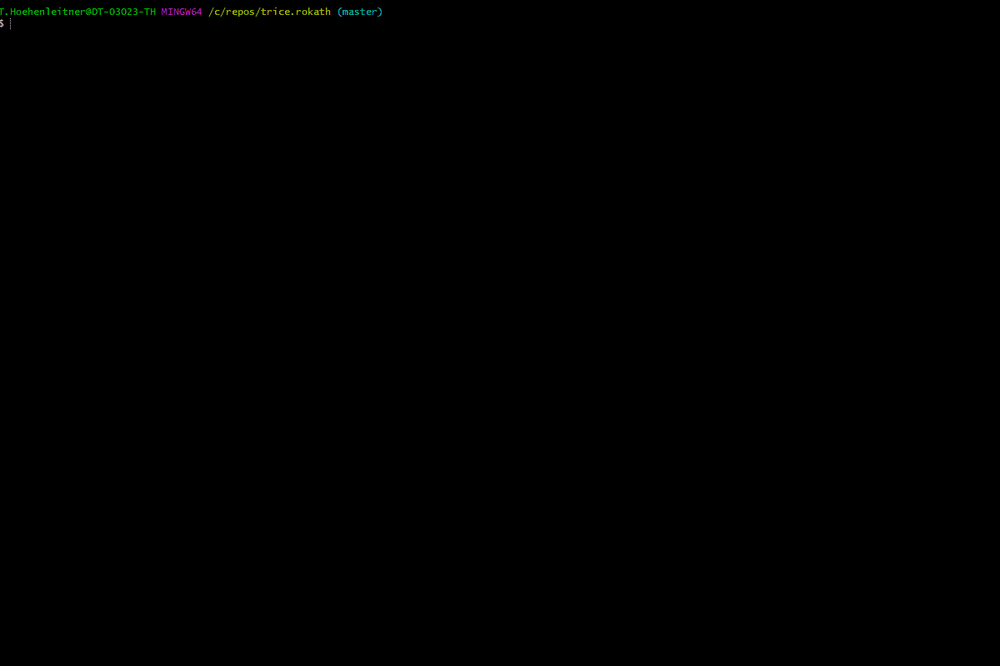
<p align="right"><small>(Animated GIFs appear as still images in PDFs.) </small></p>

---

## 1. <a id="abstract"></a>Abstract

If you develop software for an embedded system, you need some kind of system feedback. Debuggers are awesome tools, but when it comes to analyzing dynamic behavior in the field, they are not usable.

Logging then, usually done with printf-like functions, quickly yields a result after having i.e. `putchar()` implemented. This turns out to be an expensive way in terms of processor clocks and needed FLASH memory, when you regard the library code and all the strings needing FLASH memory space. For small microcontrollers that's it.

Bigger microcontrollers are coming with embedded trace hardware. To use it, an expensive tool is needed. Useful for analyzing complex systems, but for in-field related issues at least unhandy.

Unhappy with this situation, the developer starts thinking of using digital pins or starts emitting some proprietary LED blinking codes or byte sequences, difficult to interpret.

The Trice technique tries to fill this gap, being minimal invasive for the target and as comfortable as possible. It is the result of a long-year dissatisfaction and several attempts to find a loophole to make embedded programming more fun and this way more effective.

Trice is an unusual software tracer-logger, using [internally](#how-it-works---the-main-idea) IDs instead of format strings to get maximum [speed](#execution-speed) but provides the user with a printf-like comfort:

```C
trice("Hello! 👋🙂");

int a = -4;
float x = 3.14159265;
trice("info:π/%d is %f with the bit pattern %032b\n", a, aFloat(x/a), x );

string s = "world";
triceS("msg:A runtime generated string: %s", s);
```

Replacing a `printf` library, the [Trice target source code](../src) occupies 1-4 KB Flash [memory](#trice-memory-needs) and less than 1 KB RAM depending on the configuration which is done with a user file named `triceConfig.h`:

```C
#define TRICE_DEFERRED_OUTPUT 1
#define TRICE_BUFFER TRICE_DOUBLE_BUFFER
#define TRICE_DEFERRED_UARTA 1
#define TRICE_UARTA USART2
```

The open-source Trice PC tool is executable on all [Go](https://go.dev) platforms, at least:

* [x] Linux
* [x] macOS
* [x] Windows

In the future other ports are possible:

* C/C++ or Rust program to run on a separate controller board
* [Go-mobile](https://github.com/golang/mobile)
* [tinyGo](https://tinygo.org/)
* [Wasm](https://webassembly.org/)
* [Python](https://en.wikipedia.org/wiki/Python_(programming_language))


<p align="right">(<a href="#top">back to top</a>)</p>

## 2. <a id="a-brief-history-of-trice"></a>A brief history of Trice

Developing firmware means to deal also with interrupts and often with timing. How do you check, if an interrupt occurred? OK, increment a counter and display it in a background loop with some printf-like function. What about time measurement? Set a digital output to 1 and 0 and connect a measurement device. Once, developing software for a real-time image processing device, I had no clue where in detail the processing time exploded when the image quality got bad. A spare analog output with a video interrupt synced oscilloscope gave me the needed information, after I changed the analog output on several points in my algorithm. But, hey guys, I want to deal with my programming tasks and do not like all this hassle connecting wires and steer into instruments.

A `printf` is so cool on a PC, developing software there. But an embedded device often cannot use it for performance reasons. My very first attempt was writing the format string `.const` offset together with its values in a FIFO during a log statement and to do the `printf` it in the background. But that is compiler specific. OK the full string address is better but needs buffer space. [Zephyr](https://docs.zephyrproject.org/latest/) for example does something like that calling it "deferred logging".

Then, one day I had the idea to compute short checksums for the format strings in a pre-compile step and to use them as ID in a list together with the format strings. That was a step forward but needed to write a supporting PC program. I did that in C++ in the assumption to get it better done that way. Finally, it worked, but I hated my PC code, as I dislike C++ now because of all its nuts and bolts to handle, accompanied by missing libraries on the next PC. The tool usability was also unhandy and therefore error prone and the need became clear for a full automated solution. Also, what is, if 2 different format strings accidentally generate the same short checksum? There was a way around, but an ID based message filtering will never be possible that way.

The need became clear for controllable IDs and management options. And there was [Go](https://go.dev) now, an as-fast-as-**C** language, easy to learn, promising high programming efficiency and portability. It would be interesting to try it out on a real PC project.

Trying to add tags in form of partial Trice macro names was blowing up the header code amount and was a too rigid design. Which are the right tags? One lucky day I came to the conclusion to handle tags just as format string parts like `"debug:Here we are!\n"` and getting rid of them in the target code this way also giving the user [freedom](../internal/emitter/lineTransformerANSI.go) to invent any tags.

Another point in the design was the question how to re-sync after data stream interruption, because that happens often during firmware development. Several encodings were tried out and a proprietary escape sequence format and an alternative flexible data format with more ID bits were working reliably but with [COBS](https://en.wikipedia.org/wiki/Consistent_Overhead_Byte_Stuffing) things got satisfactory. A side result of that trials is the Trice tool option to add different decoders if needed. Now the default Trice message framing is [TCOBSv1](https://github.com/rokath/tcobs) which includes short message compression and this way allows very low transmit bandwidths and/or saves storage, when binary Trice data are stored in Flash memory.

There was a learning **not** to reduce the transmit byte count to an absolute minimum, but to focus more on Trice macro [speed](#execution-speed) and universality. That led to a double buffer on the target side as an alternative to the ring buffer solution. The actual binary [encoding](#binary-encoding), allowing alongside user protocols, is the result of the optional target timestamps and location info some users asked for, keeping the target code as light as possible. Float and double number support was implementable for free because this work is done mainly on the host side.

Trice grew, and as it got usable I decided to make it Open Source to say "Thank You" to the community this way.

Learning that Trice is also a [baby girl name](https://www.babynamespedia.com/meaning/Trice), our daughter Ida designed the little girl with the pen symbolizing the Trice macro for recording and the eyeglasses standing for the PC tool Trice visualizing the logs.


<p align="right">(<a href="#top">back to top</a>)</p>

## 3. <a id="how-it-works---the-main-idea"></a>How it works - the main idea

Trice performs **no** [costly](#trice-similarities-and-differences-to-printf-usage) printf-like functions on the target at all. The Trice macro, instead, just copies an ID together with the optional values to a buffer and is done. In the minimum case this can happen in [6(six!)](#trice-speed) processor clocks even with target timestamps included. When running on a 64 MHz clock, **light can travel about 30 meters in that time**.

To achieve that, a pre-compile step is needed, executing a `trice insert` command on the PC. This is fast enough not to disturb the build process. The Trice tool parses then the source tree for macros like `trice( "msg: %d Kelvin\n", k );` and patches them to `trice( iD(12345), "msg: %d Kelvin\n", k );`, where `12345` is a generated 14-bit identifier (ID) copied into a [**T**rice **I**D **L**ist](../demoTIL.json). During compilation, the Trice macro is translated to the `12345` ID only, and the optional parameter values. The format string is ignored by the compiler.

The target code is [project specific](../examples/F030_inst/Core/Inc/triceConfig.h) configurable.  In **direct mode** the stack or a static buffer is used as Trice buffer and the Trice macro execution includes optionally the quick [COBS](https://en.wikipedia.org/wiki/Consistent_Overhead_Byte_Stuffing) encoding and the data transfer. This more straightforward and slower architecture can be interesting for many cases because it is anyway much faster than printf-like functions calls. Especially when using [Trice over RTT](#trice-over-rtt) a single Trice is executable within ~100 processor clocks. See `TRICE_DIRECT_SEGGER_RTT_32BIT_WRITE` inside [triceDefaultConfig.h](../src/triceDefaultConfig.h) and look into the [examples](../examples) folder. In **deferred mode** a service swaps the Trice double buffer or reads the Trice ring buffer periodically, the configured encoding, default is TCOBS, takes part and with the filled buffer the background transfer is triggered. Out buffer and Trice buffer share the same memory for efficiency.

During runtime the PC Trice tool receives all what happened in the last ~100ms as a package from the UART port. The `0x30 0x39` is the ID 12345 and a map lookup delivers the format string *"msg: %d Kelvin\n"* and also the bit width information. Now the Trice tool can write target timestamp, set msg color and execute `printf("%d Kelvin\n", 0x0000000e);`

---

  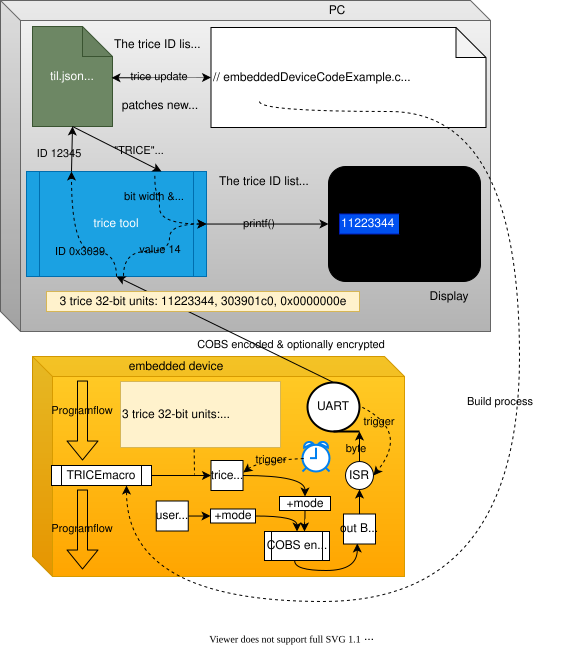

The Trice tool is a background helper giving the developer focus on its programming task. The once generated ID is not changed anymore without need. If for example the format string gets changed into `"msg: %d Kelvin!\n"`, a new ID is inserted automatically and the reference list gets extended. Obsolete IDs are kept inside the [**T**rice **I**D **L**ist](../demoTIL.json) for compatibility with older firmware versions. It could be possible, when merging code, an ID is used twice for different format strings. In that case, the ID inside the reference list wins and the additional source gets patched with a new ID. This maybe unwanted patching is avoidable with proper [Trice ID management](#trice-id-management). The reference list should be kept under source code control.

Moreover, using `trice i -cache && make && trice c -cache` in a build script makes the IDs invisible to the developer reducing the data noise giving more space to focus on the development task. See [build.sh](../examples/L432_inst/build.sh) as a working example and the [Trice Cache](#trice-cache) chapter for details.

<p align="right">(<a href="#top">back to top</a>)</p>

## 4. <a id="trice-features-overview"></a>Trice Features (Overview)

### 4.1. <a id="no-dynamic-memory-management-needed"></a>No Dynamic Memory Management needed

All internal Buffers are static allocations and usually need only a few Hundred bytes size.

### 4.2. <a id="open-source"></a>Open source

Target code and PC tool are open source. The MIT license gives full usage freedom. Users are invited to support the further Trice development.

### 4.3. <a id="easy-to-use"></a>Easy-to-use

Making it facile for a user to use Trice was the driving point just to have

* one Trice tool
* one additional [target code](../src/) source folder
* a project specific simple to use [triceConfig.h](../examples/F030_inst/Core/Inc/triceConfig.h)
* and to get away with the one macro `trice` for most situations.

Trice understands itself as a silent helper in the background to give the developer more focus on its real task. If, for example, `trice log` is running and you re-flash the target, there is ***no need to restart*** the Trice tool just to load changed decoding tables. When [til.json](../demoTIL.json) is updated in a pre-build step, the Trice tool automatically reloads it during logging. The location table selected with `-li` is also reloaded if it was present when logging started.

For example, keep `trice log -i til.json -li li.json` running while you rebuild with `trice bind` or `trice insert`. New IDs, changed structured field names, and updated source locations become available to subsequent records in text, JSON, and KV output. Both ordinary file writes and replacement by a newly generated file are supported. Each save is read after a short settling interval (normally about 100 ms), including saves made shortly after one another. Active visualization rules check new or changed records against their existing rules; a rule already disabled because of an incompatible format stays disabled until the logger is restarted.

If a file is temporarily missing, empty, or invalid JSON while being saved, the logger keeps that table's last valid contents, reports a warning on stderr, and retries automatically. The two files reload independently; updating them is not a single atomic transaction. A valid JSON object replaces the respective in-memory table completely, including removal of keys no longer in the file. `{}` intentionally clears a table. Successful reloads are silent unless `-v` is enabled; reload diagnostics never enter the application logfile or JSON/KV output.

Use `-li off` to disable location information. If no location file existed at startup, create it before starting the logger to enable its automatic reload. File watching requires an available local directory; if setup fails, the logger warns which path cannot be watched and continues using the loaded data. Restart it after resolving that problem. Reloading dictionaries does not repair a disconnected RTT server or other transport connection, and location information still needs to match the firmware actually running on the target.

The Trice tool comes with many command line switches (`trice help -all`) for tailoring various needs, but mostly these are not needed. <small>The generated file [ref/trice-help-all.txt](ref/trice-help-all.txt) contains this information as well.</small>

Normal Trice tool usage is:
* [./build.sh](../examples/L432_inst/build.sh) containing `trice insert -cache`, `make` and `trice clean -cache`
* **`make log`** containing `trice l -p COMn` for logging with default baud rate.

In this example, the user code gets **not** polluted with Trice IDs - they exists only during the compilation step and the Trice cache makes this invisible for the user and the build system.

### 4.4. <a id="small-size---using-trice-frees-flash-memory"></a>Small size - using Trice frees FLASH memory

Compared to a printf-library code which occupies [1](https://github.com/mludvig/mini-printf) to over [20](https://github.com/mpaland/printf#a-printf--sprintf-implementation-for-embedded-systems) KB FLASH memory, the Trice code is normally [smaller](#trice-memory-needs) but provides full support.

### 4.5. <a id="execution-speed"></a>Execution speed

Can it get faster than [6 clocks only](#trice-speed)? Only 3 runtime Assembler instructions per Trice needed in the minimum case! Optional target timestamp, critical sections, cycle counter, diagnostics and overflow protection can consume a few more processor clocks, if enabled, but a Trice is still incomparable fast.

### 4.6. <a id="robustness"></a>Robustness

When a Trice data stream is interrupted, the optional [COBS](https://en.wikipedia.org/wiki/Consistent_Overhead_Byte_Stuffing) or [TCOBS](https://github.com/rokath/tcobs) encoding allows an immediate re-sync with the next COBS/TCOBS package delimiter byte and a default Trice **cycle counter** gives a high chance to detect lost Trice messages. <small>See also [Versions and Variants Trice Stability](#versions-and-variants-trice-stability).</small>

### 4.7. <a id="minimal-transfer-bytes-amount"></a>Minimal Transfer Bytes Amount

A Trice message is 4 bytes long (2 ID bytes and 2 count bytes) plus optional time stamps and/or values. In conjunction with the compressing [TCOBS](https://github.com/rokath/tcobs) framing the Trice data stream is as small as possible. Use the `-debug` switch to see the compressed and framed packages alongside the decompressed ones together with the decoded messages.

To see the encoding for each single message `#define TRICE_DEFERRED_TRANSFER_MODE TRICE_SINGLE_PACK_MODE` inside the project specific _triceConfig.h_.

Without `-debug` CLI switch:

```bash
ms@MacBook-Pro G0B1_inst % trice log -p /dev/tty.usbmodem0007722641261 -prefix off -li off -hs off -ts off
...
This is a message without values and without stamp.
...
```

With `-debug` CLI switch:

```bash
ms@MacBook-Pro G0B1_inst % trice log -p /dev/tty.usbmodem0007722641261 -prefix off -li off -hs off -ts off -debug
...
TCOBSv1: c1 74 e2 23 00 
->TRICE: c1 74 e2 00 
This is a message without values and without stamp.
...
```

The TCOBS encoding cannot compress in the example above, because the data are too small, but here is a significant compression result shown:

```bash
ms@MacBook-Pro G0B1_inst % trice log -p /dev/tty.usbmodem0007722641261 -prefix off -hs off -debug
...
TCOBSv1: b8 76 7b 18 84 fe e1 fd e1 fc e1 fb e1 fa e1 00 
->TRICE: b8 76 7b 18 ff ff ff ff fe ff ff ff fd ff ff ff fc ff ff ff fb ff ff ff fa ff ff ff 
_test/testdata/triceCheck.c   805              value=-1, -2, -3, -4, -5, -6
...
```

* The `TRICE_SINGLE_PACK_MODE` inserts after each Trice a package delimiter `0`. 
* The `TRICE_MULTI_PACK_MODE` inserts after a group of Trice messages a package delimiter `0`, what minimizes the transmit data amount.

When encryption is active, a compression makes no sense, but the `TRICE_MULTI_PACK_MODE` can help to reduce the total amount of padding bytes, because each encrypted package must have a multiple of 8 as length.

```bash
ms@MacBook-Pro G0B1_inst % trice log -p /dev/tty.usbmodem0007722641261 -prefix off -hs off -pw MySecret -pf cobs -debug    
...
cobs: 21 84 b7 60 8b 21 89 1e e3 07 6d dc d9 2d 6f 59 04 8e 50 8f 24 1c a2 63 2e 3d 4a 57 ef 39 63 01 cb 00 
->TRICE: 84 b7 60 8b 21 89 1e e3 07 6d dc d9 2d 6f 59 04 8e 50 8f 24 1c a2 63 2e 3d 4a 57 ef 39 63 01 cb 
-> DEC:  cc b6 63 01 71 02 ff fe cd 76 72 03 ff fe fd ce f6 64 81 00 00 73 04 ff fe fd fc 00 00 00 00 00 
_test/testdata/triceCheck.c   827        0_355 value=-1, -2
_test/testdata/triceCheck.c   828              value=-1, -2, -3
_test/testdata/triceCheck.c   829    0,033_124 value=-1, -2, -3, -4
cobs: 19 50 70 79 d7 75 6f d7 99 dc d8 ec 06 e1 66 e7 a7 c1 0d 96 85 df 19 25 55 00 
->TRICE: 50 70 79 d7 75 6f d7 99 dc d8 ec 06 e1 66 e7 a7 c1 0d 96 85 df 19 25 55 
-> DEC:  cf b6 64 01 74 05 ff fe fd fc fb d0 76 75 06 ff fe fd fc fb fa 00 00 00 
_test/testdata/triceCheck.c   830        0_356 value=-1, -2, -3, -4, -5
_test/testdata/triceCheck.c   831              value=-1, -2, -3, -4, -5, -6
...
```

### 4.8. <a id="more-comfort-than-printf-like-functions-but-small-differences"></a>More comfort than printf-like functions but small differences

Trice is usable also inside interrupts and [extended format specifier possibilities](#extended-format-specifier-possibilities) give options like binary or bool output. Transmitting runtime generated strings could be a need, so a `triceS` macro exists supporting the `%s` format specifier for strings up to 32737 bytes long. It is possible to log float/double numbers using `%f` and its relatives, but the numbers need to be covered with the fast converter function `aFloat(x)` or `aDouble(y)`. Also UTF-8 encoded strings are implicitly supported, if you use UTF-8 for the source code. See chapter [Trice Similarities and differences to printf usage](#trice-similarities-and-differences-to-printf-usage) for more details.

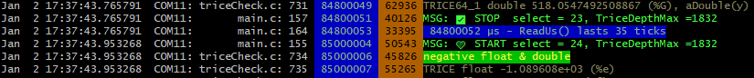

### 4.9. <a id="tags-color-and-log-levels"></a>Tags, Color and Log Levels

You can label each Trice with a tag specifier to [colorize](#trice-tags-color-and-weights) the output. This is free of any runtime costs because the tags are part of the Trice log format strings, which are not compiled into the target. The Trice tool will strip full lowercase tag descriptors from the format string after setting the appropriate color, making it possible to give each message its color.

Loggers use log levels and offer a setting like "log all above **INFO**" for example. The Trice tags can cover that but can do better: Inside package _emitter.ColorChannels_ in a single file [./internal/emitter/lineTransformerANSI.go](../internal/emitter/lineTransformerANSI.go) all common log levels defined as Trice tags alongside with user tags. The user can adjust this. The Trice tool has the `-pick` and `-ban` switches to control the display in detail. Also a `-logLevel` switch is usable to determine a display threshold as tag position inside ColorChannels.

If an inside-target log selection is needed (routing), the Trice tool can assign each log tag a separate ID range and a target side ID based log selector can control which IDs are transmitted over which output channel. See chapter [Trice ID management](#trice-id-management) or type `trice help -insert` and look for `-IDRange`.

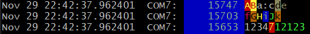

### 4.10. <a id="compile-time-enabledisable-trice-macros-on-file-or-project-level"></a>Compile Time Enable/Disable Trice Macros on File or Project Level

After debugging code in a file, there is [no need to remove or comment out Trice macros](#switching-trice-on-and-off). Write a `#define TRICE_OFF 1` just before the `#include "trice.h"` line and all Trice macros in this file are ignored completely by the compiler, but not by the Trice tool. In case of reconstructing the [**T**rice **ID** **L**ist](../demoTIL.json), these no code generating macros are regarded.

```C
#define TRICE_OFF 1 // Disable trice code generation for this file object.
#include "trice.h"
```

When you wish to build a firmware without any Trice code, it is sufficient to add

```make
C_DEFS += -DTRICE_OFF=1 // Define TRICE_OFF=1 for the whole project.
```

or similar to your Makefile.

### 4.11. <a id="target-and-host-timestamps"></a>Target and host timestamps

For each Trice you can have (time) stamps or not:

* `trice( "...", ...);` or `TRICE( id(0), ( "...", ...)`: no stamp:
* `Trice( "...", ...);` or `TRICE( Id(0), ( "...", ...)`: 16-bit stamp:
* `TRice( "...", ...);` or `TRICE( ID(0), ( "...", ...)`: 32-bit stamp:

The optional 16- or 32-bit value then carries the system clock, a millisecond counter, or another event counter configured in the project specific [triceConfig.h](../examples/G0B1_inst/Core/Inc/triceConfig.h). The Trice tool will automatically recognize and display the stamps in a mode you can control. If several Trice macros form a single line, the Trice tool only displays the target timestamp of the first Trice macro.

Embedded devices often lack a real-time clock and some scenarios can last for weeks. Therefore the Trice tool precedes each Trice line with a PC timestamp, if not disabled. This is the Trice reception time on the PC, which can be some milliseconds later than the target Trice event.

### 4.12. <a id="target-source-code-location"></a>Target source code location

Some developers like to see the `filename.c` and `line` in front of each log line for quick source location. During `trice i` a file `li.json` is generated containing the location information. If `trice log` finds this file, filename and line number are displayed in front of each log line, otherwise not.

Because software is a matter of change it could happen you get obsolete information this way. Therefore the Trice tool log option `-showID` exists to display the Trice ID in front of each log line what gives a more reliable way for event localization in some cases. Also you can get it for free, because no target code is needed for that.

### 4.13. <a id="several-target-devices-in-one-log-output"></a>Several target devices in one log output

Several Trice tool instances can run in parallel on one or different PCs. Each Trice tool instance receives *Trices* from one embedded device. Instead of displaying the log lines, the Trice tool instances can transmit them over TCP/IP (`trice l -p COMx -ds`) to a Trice tool instance acting as display server (`trice ds`). The display server can fold these log lines in one output. For each embedded device a separate Trice line prefix and suffix is definable. This allows comparable time measurements in distributed systems.

### 4.14. <a id="any-byte-capable-1-wire-connection-usable"></a>Any byte-capable 1-wire connection usable

The usual Trice output device is an UART but also [SEGGER-RTT](#trice-over-rtt) is supported over J-Link or ST-Link devices. Many microcontroller boards can act as Trice bridge to a serial port from any port ([Trice without UART](#trice-without-uart)).

### 4.15. <a id="scalability"></a>Scalability

The various [Trice ID management](#trice-id-management) options allow the organization also of bigger software systems. 16383 possible different IDs should match also large projects. Just in case: 16-bit for the ID is a not too hard changeable value.

### 4.16. <a id="portability-and-modularity"></a>Portability and Modularity

The Trice tool is written in the open source language [*Go*](https://go.dev/) and is therefore usable on many platforms. That means the automatic code patching and ID handling side with `trice insert`.

All C-compilers should be usable to compile the target Trice code and there is no hardware dependency despite the byte transmission. MCUs with 8-bit to 64-bit, little or big endian are supported.

Any user program able to read a [JSON](../demoTIL.json) file, can receive the [documented](#binary-encoding) Trice message format, look-up the ID and perform a printf-like action to translate into log strings. The Trice tool with its `log` switch is a working example.

Using no framing, [COBS](https://en.wikipedia.org/wiki/Consistent_Overhead_Byte_Stuffing) or [TCOBS](https://github.com/rokath/tcobs) packages starting with a [package descriptor](#package-format) allows alongside user protocols. The other way around is also implementable: In a user protocol embedded `Trice` messages.

The Trice tool is expandable with several decoders. So it is possible to implement a minimal Trice encoding, if bandwidth matters heavily and control that with switches.

When less RAM usage is more important the target double buffer is replaceable with a ring buffer. So the user will be able to decide at compile time about that. A ring buffer mode is selectable inside [triceConfig.h](../examples/F030_inst/Core/Inc/triceConfig.h) avoiding any buffer by paying a time toll.

The Trice tool supports [many command line switches](ref/trice-help-all.txt).

### 4.17. <a id="optional-trice-messages-encryption"></a>Optional Trice messages encryption

The encryption opportunity makes it possible to test thoroughly a binary with log output and releasing it without the need to change any bit but to make the log output unreadable for a not authorized person. Implemented is the lightweight [XTEA](https://en.wikipedia.org/wiki/XTEA) as option, what will be sufficient for many cases. It should be no big deal to add a different algorithm.

### 4.18. <a id="trice-protection"></a>Trice Protection

When using Trice, data are written into buffers. A buffer overflow is impossible with the default configuration `#define TRICE_PROTECT 1` by simply ignoring possible overflow causing Trice statements. Those cases are not detectable by the cycle counter evaluation because non-existing Trice data on the embedded system cannot cause cycle errors. Therefore overflow error counters exists, which the user can watch. In [./examples/exampleData/triceLogDiagData.c](../examples/exampleData/triceLogDiagData.c) an option is shown. Of course this buffer overflow protection costs valuable execution time. If you prefer speed over protection, simply write into your project specific _triceConfig.h_ `#define TRICE_PROTECT 0`.

### 4.19. <a id="trice-diagnostics"></a>Trice Diagnostics

A trice statement produces 4 bytes buffer data plus optional values data. When for example `TRice16("Voltage=%u\n", x);` is called inside the ms system-tick interrupt every 5th time, 10 bytes data are generated each 5 millisecond. This needs a transfer baudrate of at least 20.000 bit/s. A UART running at 115.200 baud can easily handle that.
Anyway after 100 ms, a 200 Bytes buffer is filled and the question arises what is the optimal Trice buffer size. A calculation is error prone, so measuring is better. So configure the buffer sizes bigger than estimated and watch the max depth of their usage. In [./examples/exampleData/triceLogDiagData.c](../examples/exampleData/triceLogDiagData.c) an option is shown. After you optimized your buffer sizes, you can deactivate the Trice diagnostics in your project specific _triceConfig.h_ with `#define TRICE_DIAGNOSTICS 0`.

### 4.20. <a id="trice-cache"></a>Trice Cache

One may think, automatically cleaning the IDs in the target code with `trice c` after building and re-inserting them just for the compilation needs file modifications all the time and a permanent rebuild of all files containing Trices will slow down the re-build process. That is true, but by using the Trice cache this is avoidable.
Simply one-time create a `.trice/cache` folder in your home directory and use `trice insert -cache` and `trice clean -cache` in your [build.sh](../examples/L432_inst/build.sh) script.
Find more details in chapter [Trice Cache for Compilation Speed](#trice-cache-for-compilation-speed).

### 4.21. <a id="avoiding-false-positive-editor-warnings"></a>Avoiding False-Positive Editor Warnings

When the user writes

```C
trice("msg: Hello! 👋🙂\n");
```

after `trice insert` this gets

```C
trice(iD(123), "msg: Hello! 👋🙂\n");
```

and the compiler builds and then with `trice clean`, this gets again

```C
trice("msg: Hello! 👋🙂\n");
```

Sophisticated editors may detect the missing ID and warn by underlining the trice command:

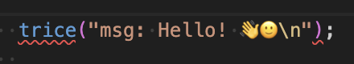

To avoid this you can add the following line to your project specific _triceConfig.h_ file:

```C
#define TRICE_CLEAN 1
```

The Trice tool, will change the value to 0 and change it back to 1, when performing the ID insertion and cleaning, when this line occurs inside the _triceConfig.h_ file. This way these false-positive editor warnings are avoidable:

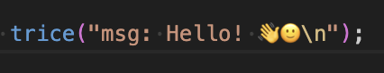
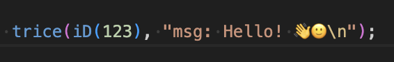

It is recommended to use the Trice cache in conjunction with this to avoid a permanent re-translation of files including Trice code.

TRICE_CLEAN==1 changes all Trice macros into empty ones. It is used only to silence sophisticated editors. In the cleaned state, when the IDs are removed from the files, the editor could underline the Trice macros indicating a false positive.

Do not use TRICE_CLEAN for disabling Trice macros. The *triceConfig.h* line `#define TRICE_CLEAN 0` changes to `1` with every `trice clean` and to `0` with every `trice insert`. This line is optional and must not be in a different file. If you want to disable Trice macros use TRICE_OFF.

### 4.22. <a id="trice-generator"></a>Trice Generator

The Trice tool is able to generate colors or code to support various tasks. One interesting option is the **A**synchronous **B**roadcast **C**ommand support, allowing ABC usage in a network of embedded devices.

Read chapter [Trice ABC - Asynchronous Broadcast Commands](#trice-abc---asynchronous-broadcast-commands) or type:

```bash
trice help -generate
```

### 4.23. <a id="versions-and-variants-trice-stability"></a>Versions and Variants Trice Stability

When developing firmware, we get often different versions and variants in the developing process. When, for example, getting an older device back, it could be, we do not know the flashed firmware version at all. Because the Trice tool adds only IDs and their Trices to the project specific _til.json_ file, the complete development history remains in that file. So connecting an old device to the Trice tool will deliver correct output. Of course the location information will be outdated. But when reading the Trice logs the compiled version should get visible and it is no big deal to get the corresponding _li.json_ from the repository. If not, using the `-showID "%6d"` Trice log option displays the Trice IDs and you can easily grab the source code file and line.

### 4.24. <a id="legacy-project-code-integration"></a>Legacy Project Code Integration

When it comes to instrument legacy project with Trice or to integrate legacy project files into a Trice instrumented project different approaches are possible:

1. Use for user specific log statements a different output channel. No special care has to be taken. This is maybe acceptable in some cases.
2. Replace user specific log statements with Trice statements using a text processor and adapt the float, double or runtime strings handling manually. This is acceptable for small code amounts and when it is no problem to edit the legacy sources.
3. Get the legacy output packages before transmitting them, add a 2-byte count in little-endian (0-16383) in front and frame them the same way the trice packages get framed (for example with COBS). This will set the 2 most significant bits to 00 and the Trice tool, can get informed via CLI switch to treat those packages accordingly. The user code containing specific logs will work unchanged together with Trice code over the same output channel.
4. Take advantage of the new support for dynamic trice and triceS macro aliases ([Legacy User Code Option Trice Aliases Adaptation](#legacy-user-code-option-trice-aliases-adaptation)).

<p align="right">(<a href="#top">back to top</a>)</p>

## 5. <a id="start-with-trice"></a>Start with Trice

### 5.1. <a id="get-it"></a>Get it

* Download [latest release assets](https://github.com/rokath/trice/releases) for your system: Compressed source code and binaries.
* OR Get the repo: 
  * Create a GitHub Account
  * Create SSH key pair inside `~/.ssh/`: `ssh-keygen -t ed25519`
  * Add content of `~/.ssh/id_ed25519.pub` as SSH key to GitHub.
  * Execute `git clone git@github.com:rokath/trice.git` to get the trice repository.
* OR use the  button

### 5.2. <a id="install-it"></a>Install It

* Place the extracted Trice [binary](https://github.com/rokath/trice/releases/latest) somewhere in your [PATH](https://en.wikipedia.org/wiki/PATH_(variable)).
* Copy the src folder into your project and add all files.
* Copy a triceConfig.h from a subfolder in the examples or test folder and optionally adapt it. See file [*triceDefaultConfig.h*](../src/triceDefaultConfig.h) for help.
  * Inside the triceConfig.h file you can control, if Trice works in direct or deferred mode or both parallel.

### 5.3. <a id="try-it"></a>Try it

* Create a file `tryTrice.c` and write in it:

```C
#include "trice.h"

int tryIt( void ){
    trice( "Hello! 👋🙂\a\n" ); // A message with sound and without target timestamp.
}
```

You can also edit any of your existing project files accordingly. Just replace any `printf` with `trice`. (Handle float or double numbers and runtime-generated strings, according to [Trice Similarities and Differences to printf Usage](#trice-similarities-and-differences-to-printf-usage). The file [_test/testdata/triceCheck.c](../_test/testdata/triceCheck.c) shows many usage examples.
The uppercase Trice macros are inlining the complete Trice code and the lowercase Trice macros are function calls, so most probably you want use `trice` to keep the overall code size smaller.

* Create 2 empty files `til.json` and `li.json` in your project root.
* Run `trice insert` and the trice code line changes to `trice( iD(1234), "Hello! 👋🙂\a\n" );`.
* The 2 JSON files are now filled with information.
* Run `trice clean` and the trice code line changes back to `trice( "Hello! 👋🙂\a\n" );`.

You can use `trice insert` as pre- and `trice clean` as post-compile step, to not spoil your source code with IDs.

> **The optional Trice cache technique avoids un-edited file changes at all, which means no Trice-related build speed disadvantages.**

See [Trice Cache for Compilation Speed](#trice-cache-for-compilation-speed) for more details and [examples/G1B1_inst/build.sh](../examples/G0B1_inst/build.sh) as example.

* Or, use `trice insert` in a post-checkout and `trice clean` in a pre-check-in script to keep just the repository clean of Trice IDs. Using only `trice insert` as pre-compile step is possible too, especially when the code is used just in a single project and you wish to have it as compiled.
* When using Trice in libraries for several projects, it may make sense to check-in the libraries with IDs and to use a dedicated ID space for them. See [../_test/testdata/triceCheck.c](../_test/testdata/triceCheck.c) as an example - especially when building several projects parallel like shown in the examples folder.

A quick setup is possible when using RTT as output channel. Otherwise you need to setup a serial port for Trice data transmission. Other output paths possible too using the auxiliary interface.

### 5.4. <a id="use-it"></a>Use It

* In a console, like [git bash](https://gitforwindows.org/), type `trice help -all`. You should see the complete Trice tool [CLI](https://en.wikipedia.org/wiki/Command-line_interface) documentation.
  * Do not worry, most of it you will never need.
  * There are only 2 important commands: `trice insert` and `trice log`. Call them with the right CLI switches.
    * `trice help -insert` and `trice help -log` show partial help.
    * Examples:

      | CLI command                                     | Description                                                                                                                                   |
      |-------------------------------------------------|-----------------------------------------------------------------------------------------------------------------------------------------------|
      | `touch ./til.json`                              | Create an empty `til.json file`. This is needed only the very first time.                                                                     |
      | `trice i -src . -src ../myLib`                  | Insert IDs to the current and your `../myLib` folder. This will read\|extend\|modify `./til.json` and use & create the `./li.json` file.      |
      | ...                                             | Compile your project                                                                                                                          |
      | `trice c -src . -src ../myLib`                  | Optionally restore the current and your `../myLib` folder. This will read\|extend\|modify `./til.json` and use & create the `./li.json` file. |
      | `trice l -p com1 -baud 921600 -lf my/path/auto` | Start Logging over UART and create automatically a new log file in `my/path/`.                                                                |
      | `cat filename.log`                              | View a recorded log file.                                                                                                                     |
      | `trice l -p JLINK -args "..."`                  | Start Logging over RTT. Binary log files are collected in `./temp`.                                                                           |
      | `trice l -p FILEBUFFER -args logfile.bin`       | Play a recorded binary log file.                                                                                                              |

    * It is recommended to add `trice insert ...` as pre-compile step into the tool chain.
    * Hint: It is possible to add `trice clean ...` as a post-compile step, so that you can check in your project sources without IDs. That is supported in v0.61.0 and later. This allows to use library sources with trices in different projects and the source code is not spoiled with IDs. The `-cache` CLI switch is recommended then. <small>See [Trice Cache for Compilation Speed](#trice-cache-for-compilation-speed)</small>.
* The command `trice` does not make any assumptions about the target processor - 8-bit to 64-bit, supports little and big endianness.
* The command `trice` is compiler agnostic - it should work with any compiler.
* The VS Code editor is free to download and use, like shown in the [`examples/F030_inst`](../examples/F030_inst) project.
  * Even if you do not have such hardware, you can compile the [`examples/F030_inst`](../examples/F030_inst) project just to get started.
  * When adding or modifying Trice macros inside [examples/F030_inst/Core/Src/main.c](../examples/F030_inst/Core/Src/main.c) and recompiling you should see automatically changed ID numbers inside the code.
* The examples and test subfolders contain several VS Code Makefile projects and they are also usable as starting points for your configuration.
* You can use Trice calls also inside header files but when running `trice insert` as pre- and `trice clean` as post-compile step, all files including these headers will be re-compiled every time, what may be too time consuming. Enable the Trice cache then. See [Trice Cache for Compilation Speed](#trice-cache-for-compilation-speed) for more information.

<p align="right">(<a href="#top">back to top</a>)</p>

### 5.5. <a id="fork-it-get-a-contributor"></a>Fork It (get a contributor)

If you wish to get a contributor please fork the Trice repository.

#### 5.5.1. <a id="what-forking-means"></a>✅ What “forking” means

Forking creates **your own copy** of someone else’s repository under your account.  
You can then:

* freely make changes,   
* push commits to your fork, 
* and later submit a **pull request** to propose changes back to the original repo.

#### 5.5.2. <a id="how-to-fork-github"></a>🧭 How to Fork (GitHub)

**1\. Go to the repository you want to fork**

Example: `https://github.com/rokath/trice`

**2\. Click the **“Fork”** button (top-right)**

You’ll be taken to a _Create Fork_ page.

**3\. Choose options (usually leave defaults)**

* **Owner** → your GitHub account
* **Repository name** → auto-filled
* Optional: copy only the default branch
    
Click **Create Fork**.

**4\. Clone your fork locally**

`git clone https://github.com/YOUR_USERNAME/trice.git && cd trice`

**5\. (Optional but recommended) Add the original repo as `upstream`**

This lets you pull updates later.

`git remote add upstream https://github.com/rokath/trice.git`

Check remotes:

`git remote -v`

**6\. Keep your fork updated**

`git fetch upstream git merge upstream/main`

Or:

`git pull upstream main`

### 5.6. <a id="clone-it"></a>Clone It

**1\. Make sure Git is installed**

Check with:

`git --version`

If not installed, download from [https://git-scm.com](https://git-scm.com/)

**2\. Clone the repository**

Run this command in your terminal or command prompt:

`git clone https://github.com/rokath/trice.git`

This creates a local folder named **trice** with the full project history.

**3\. (Optional) Enter the project folder**

`cd trice`

### 5.7. <a id="build-it"></a>Build It

See [Build Trice tool from Go sources](#build-trice-tool-from-go-sources).

### 5.8. <a id="modify-it"></a>Modify It

If for example you wish to change the logging capabilities, like changing/extending CLI switches, thanks to **Go** this is very easy also if you are not familiar with **Go**. [See this example](https://github.com/rokath/trice/issues/573#issuecomment-3585705996).

### 5.9. <a id="port-it"></a>Port it

Trice should be usable on any MCU with any compiler. On ARM MCUs the easiest way is to use SEGGER J-Link with RTT as output. Setting up UART transmission as alternative or additionally is also no big deal.

Compare folders of one of these folder groups:

| Without Instrumentation                         | With Trice Instrumentation                      | Remarks  |
|-------------------------------------------------|-------------------------------------------------|----------|
| [`./examples/F030_bare`](../examples/F030_bare) | [`./examples/F030_inst`](../examples/F030_inst) | no RTOS  |
| [`./examples/G0B1_bare`](../examples/G0B1_bare) | [`./examples/G0B1_inst`](../examples/G0B1_inst) | FreeRTOS |
| [`./examples/L432_bare`](../examples/L432_bare) | [`./examples/L432_inst`](../examples/L432_inst) | FreeRTOS |

This way you see in a quick way any needed adaptations for your target project to port trice to it.

The chapter [Example Projects without and with Trice Instrumentation](#example-projects-without-and-with-trice-instrumentation) contains further helpful information.

#### 5.9.1. <a id="target-macros"></a>Target Macros

The easiest and mostly sufficient way to use Trice on the target side is the Trice macro

```C
trice("Hello world!"); // without     timestamp
Trice("Hello world!"); // with 16-bit timestamp
TRice("Hello world!"); // with 32-bit timestamp
```

which you can mostly use as a `printf` replacement in legacy code. See [Trice Similarities and differences to printf usage](#trice-similarities-and-differences-to-printf-usage) for more details. Is uses the `TRICE_DEFAULT_PARAMETER_BIT_WIDTH` value (usually 32), which is equal for all values.

The additional macros

* `trice8`, `trice16`, `trice32`, `trice64`
* `Trice8`, `Trice16`, `Trice32`, `Trice64`
* `TRice8`, `TRice16`, `TRice32`, `TRice64`

are always usable and the number 8, 16, 32, 64 specifies the parameter width, which is equal for all values within one macro. Trice macros are partially disabled, when the value TRICE_SINGLE_MAX_SIZE is defined to be smaller than 104. For example with TRICE_SINGLE_MAX_SIZE == 8, `TRice32` can have no parameter value (4 byte Trice header, 4 byte stamp) and `trice8` can have up to 4 parameter values (4 byte Trice header, 4 byte values) That's mainly to get compiler errors rather than runtime errors.

More examples:

| Trice     | Header | Stamp | max. Values  | Trice Size |
|-----------|--------|-------|--------------|------------|
| `trice8`  | 4      | 0     | 0 \*1 byte   | 4          |
| ...       | ...    | ...   | ...          | ...        |
| `trice8`  | 4      | 0     | 12 \*1 byte  | 16         |
| `Trice8`  | 4      | 2     | 0 \*1 byte   | 6          |
| ...       | ...    | ...   | ...          | ...        |
| `Trice8`  | 4      | 2     | 12 \*1 byte  | 18         |
| `TRice8`  | 4      | 4     | 0  \*1 byte  | 8          |
| ...       | ...    | ...   | ...          | ...        |
| `TRice8`  | 4      | 4     | 12 \*1 byte  | 20         |
| `trice16` | 4      | 0     | 2  \*2 byte  | 8          |
| `Trice16` | 4      | 2     | 1  \*2 byte  | 8          |
| `trice32` | 4      | 0     | 1  \*4 byte  | 8          |
| `Trice32` | 4      | 2     | 1  \*4 byte  | 10         |
| `TRice32` | 4      | 4     | 2  \*4 byte  | 16         |
| `trice64` | 4      | 0     | 1  \*8 byte  | 12         |
| `TRice64` | 4      | 4     | 1  \*8 byte  | 16         |
| ...       | ...    | ...   | ...          | ...        |
| `TRice64` | 4      | 4     | 12  \*8 byte | 104        |

The value TRICE_DEFAULT_PARAMETER_BIT_WIDTH is the parameter bit with for the macros `trice`, `Trice`, `TRice` (without number). It can make sense to set this value to 16 on smaller machines.

The full uppercase macro Trice is a Trice macro only using inline code. Because the main design aim was speed, this was the original design. Then it became clear, that several hundred of Trice macros increase the needed code amount too much and that it is better to have just a function call instead of having inline macros. If speed matters use `TRICE(id(0)`, `TRICE(Id(0)`, `TRICE(ID(0)` else use `trice(iD(0)`, `Trice(iD(0)`, `TRice(iD(0)` or mix usage as you like. The lower case macros internally use Trice like code but each is only a function call and therefore needs less space.

#### 5.9.2. <a id="target-trice-stamps"></a>Target Trice Stamps

* If you wish to have your Trice messages stamped, most probably time stamped, add the 2 hardware specific macros/functions to your project (example in [./examples/F030_inst/Core/Inc/triceConfig.h](../examples/F030_inst/Core/Inc/triceConfig.h) and [./examples/F030_inst/Core/Src/stm32f0xx_it.c](../examples/F030_inst/Core/Src/stm32f0xx_it.c) ). The time base is in your hands and is allowed to be different for the 16-bit and 32-bit stamps. Example:

    ```c
    //! ms32 is a 32-bit millisecond counter, counting circularly in steps of 1 every ms.
    extern uint32_t ms32;
    #define TriceStamp16 (SysTick->VAL) // Counts from 31999 -> 0 in each ms.
    #define TriceStamp32  ms32
    ```
* In the code snippet above the 32-bit timestamp is used for milliseconds and the 16.bit timestamp is used as clock counter what allows fine grained time measurements.
* In the screenshot below, the 16-bit timestamp is a parallel counter running between 0-9999 milliseconds, which allows 16-bit timestamps all the time and only every 10 seconds is a full 32-bit timestamp needed.

  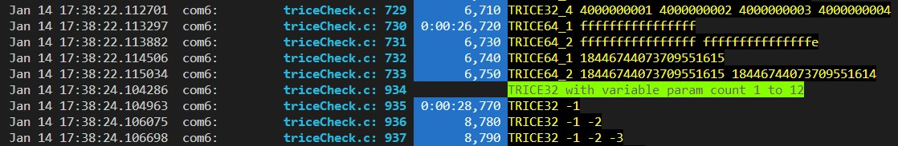


* The trice tool `-ts*` CLI switches allow customization. With `-hs off` host time stamps are suppressed.
* It is also possible to use the stamp option not for time stamps but for any values, like addresses or a voltage or a random number.

_Hint:_ I usually have the 32-bit timestamp as millisecond counter and the 16-bit timestamp as systick counter to measure short execution times.

#### 5.9.3. <a id="trice-checks"></a>Trice Checks

* Optionally copy parts of [./_test/testdata/triceCheck.c](../_test/testdata/triceCheck.c) to your project if you wish to perform some checks.
  * Do not include this file directly, because it could get changed when `updateTestData.sh` is executed inside the `./test` folder.
  * The only-uppercase `TRICE*` macros include trice code sequences what can lead to a significant code amount if you use plenty of them, whereas the lowercase macros `trice`, `Trice`, `TRice` and their relatives are just function calls and better suited to be used normally.
* In your source files add line `#include "trice.h"` at the top.
* In a function write a trice message like: `TRice( "1/11 = %g\n", aFloat( 1.0/11 ) );`.
* In **project root**:
  * Create empty file: `touch til.json`.
  * `trice insert` should perform **automatically** the following things (The numbers are just examples.):
    * Patch source.c to `TRice( iD(12363), "1/11 = %g\n", aFloat( 1.0/11 ) );`
      * C & H files containing Trice macros, are only modified if needed (missing IDs or changed format strings).
    * Extend `til.json`
      * If no `til.json` is found nothing happens. At least an empty file is needed (Safety feature).
* When the program runs later, it should output something similar to 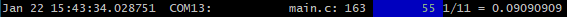
* Look into [Trice Similarities and differences to printf usage](#trice-similarities-and-differences-to-printf-usage) for options.
* Read chapter [Trice Project Image Size Optimization](#trice-project-image-size-optimization) if needed.

#### 5.9.4. <a id="communication-ports"></a>Communication Ports

* For RTT the [SEGGER](https://www.segger.com/downloads/jlink/) source is already included. See [Trice over RTT](#trice-over-rtt) for more info.
  * If RTT is used, no hardware-specific adaptations needed and it is the fastest possible data transfer. But you cannot use it in the field usually.
  * The direct trice mode is recommended for RTT. The single trice execution is a bit longer then, but the log is completely done in one shot. It takes about 100-150 processor clocks, aka 1-2 microseconds.
    * Info: All deferred trice modes are faster in the runtime execution but the Trice logs appear slightly delayed. You can tune the Trices down to only 3 Assembler instructions **executable within 6 processor clocks**. See [Trice Speed](#trice-speed) as example.
* For UART transfer add UART write functionality. The deferred mode is recommended for UART transfer.
* It is possible to log over several channels parallel and to select an ID range for each tag.
* An additional device, like local file, GPIO pin or SPI, is possible by providing an appropriate write functionality.
* See also [Trice without UART](#trice-without-uart).

#### 5.9.5. <a id="target-code-overview"></a>Target Code Overview

* `./src`: **User Interface**

| File                      | description                                                                                                                                  |
|---------------------------|----------------------------------------------------------------------------------------------------------------------------------------------|
| [trice.h](../src/trice.h) | trice runtime lib user interface, `#include trice.h` in project files, where to use Trice macros. Add `./src` to your compiler include path. |
| `triceConfig.h`           | Create this file to overwrite  [triceDefaultConfig.h](../src/triceDefaultConfig.h) as needed.                                                |

* `./src`: **Internal Components** (only partially needed, add all to your project - the configuration selects automatically)

| File                                                | description                                                                                                          |
|-----------------------------------------------------|----------------------------------------------------------------------------------------------------------------------|
| [cobs.h](../src/cobs.h)                             | message packaging, alternatively for tcobs                                                                           |
| [cobsEncode.c](../src/cobsEncode.c)                 | message encoding, alternatively for tcobs                                                                            |
| [cobsDecode.c](../src/cobsDecode.c)                 | message decoding, normally not needed                                                                                |
| [trice.c](../src/trice.c)                           | trice core lib                                                                                                       |
| [trice8McuOrder.h](../src/trice8McuOrder.h)         | trice MCU endianness lib                                                                                             |
| [trice8McuReverse.h](../src/trice8McuReverse.h)     | trice MCU reverse endianness lib                                                                                     |
| [trice16McuOrder.h](../src/trice16McuOrder.h)       | trice MCU endianness lib                                                                                             |
| [trice16McuReverse.h](../src/trice16McuReverse.h)   | trice MCU reverse endianness lib                                                                                     |
| [trice32McuOrder.h](../src/trice32McuOrder.h)       | trice MCU endianness lib                                                                                             |
| [trice32McuReverse.h](../src/trice32McuReverse.h)   | trice MCU reverse endianness lib                                                                                     |
| [trice64McuOrder.h](../src/trice64McuOrder.h)       | trice MCU endianness lib                                                                                             |
| [trice64McuReverse.h](../src/trice64McuReverse.h)   | trice MCU reverse endianness lib                                                                                     |
| [SEGGER_RTT.h](../src/SEGGER_RTT.h)                 | Segger RTT code interface                                                                                            |
| [SEGGER_RTT.c](../src/SEGGER_RTT.c)                 | Segger RTT code                                                                                                      |
| [tcobs.h](../src/tcobs.h)                           | message compression and packaging interface                                                                          |
| [tcobsv1Encode.c](../src/tcobsv1Encode.c)           | message encoding and packaging                                                                                       |
| [tcobsv1Decode.c](../src/tcobsv1Decode.c)           | message decoding and packaging, normally not needed                                                                  |
| [tcobsv1Internal.h](../src/tcobsv1Internal.h)       | message decoding and packaging internal interface                                                                    |
| [trice8.h](../src/trice8.h)                         | 8-bit trice code interface                                                                                           |
| [trice8.c](../src/trice8.c)                         | 8-bit trice code                                                                                                     |
| [trice16.h](../src/trice16.h)                       | 16-bit trice code interface                                                                                          |
| [trice16.c](../src/trice16.c)                       | 16-bit trice code                                                                                                    |
| [trice32.h](../src/trice32.h)                       | 32-bit trice code interface                                                                                          |
| [trice32.c](../src/trice32.c)                       | 32-bit trice code                                                                                                    |
| [trice64.h](../src/trice64.h)                       | 64-bit trice code interface                                                                                          |
| [trice64.c](../src/trice64.c)                       | 64-bit trice code                                                                                                    |
| [triceAuxiliary.c](../src/triceAuxiliary.c)         | trice code for auxiliary interfaces                                                                                  |
| [triceDefaultConfig.h](../src/triceDefaultConfig.h) | This file contains the most probably settings and serves also as a reference for tuning your project *triceConfig.h* |
| [triceDoubleBuffer.c](../src/triceDoubleBuffer.c)   | trice runtime lib extension needed for fastest deferred mode                                                         |
| [triceStackBuffer.c](../src/triceStackBuffer.c)     | trice runtime lib extension needed for direct mode                                                                   |
| [triceRingBuffer.c](../src/triceRingBuffer.c)       | trice runtime lib extension needed for recommended deferred mode                                                     |
| [xtea.h](../src/xtea.h)                             | XTEA message encryption/decryption interface                                                                         |
| [xtea.c](../src/xtea.c)                             | XTEA message encryption/decryption code                                                                              |

* The *tcobs\*.\** files are copied from [tcobs v1](https://github.com/rokath/tcobs). They are maintained there and extensively tested and probably not a matter of significant change.
* The SEGGER files are copied and you could check for a newer version at [https://www.segger.com/downloads/jlink/](https://www.segger.com/downloads/jlink/).

<p align="right">(<a href="#top">back to top</a>)</p>

#### 5.9.6. <a id="user-code-adaptation"></a>User Code Adaptation

* Replace all strings `puts` with the string `trice`, when the string follows immediately. For runtime generated strings see `triceS`.
* Replace all strings `printf` with the string `trice`, when the format string follows immediately.
* Check for float and double format specifiers in the format strings. The appropriate parameters need to be covered with `aFloat()` or `aDouble()`. Example:

    ```c
    printf( "%d, %3.2f EUR, %g rate\n", i, price, change );
    ```

    ```c
    trice64( "%d, %3.2f EUR, %g rate\n", i, aFloat(price), aDouble(change) );
    ```

  * Because double needs 8 bytes the trice macro in this case needs to be trice64 (see <a href="#trice-parameter-bit-widths">Trice Parameter Bit Widths</a>).

* Check for string format specifiers in the format strings. Put each in a separate trice message. Example:

    ```c
    printf( "name: %16s, surname: %32s, birthday: %4u-%02u-%02u\n", n, s, y, m, d);
    ```

    ```c
    trice( "name: %16s, ", n); trice( "surname: %32s, ", s ); trice( "birthday: %4u-%02u-%02u\n", y, m, d);
    ```

The Trice macros are designed for maximal execution speed and therefore we have to pay the price for their limited capabilities.

* Optionally add tags to get color. Example:

    ```c
    puts( "A message");
    ```

    ```c
   trice( "msg:A message");
    ```

* Add `#include trice.h` to all user files using trice.

#### 5.9.7. <a id="limitations"></a>Limitations

* The maximum parameter count per trice is 12, but buffer transfer allows up to 32764 bytes payload. See `triceB` and its relatives.
* Each trice must fit into a single line in trice versions before v0.61.0.
  * Not ok before v0.61.0 but ok for later versions:

    ```c
    trice( "hello %u\n",
            year);
    ```

* But several trices can be in one line.
  * OK:

    ```c
    trice( "hello %u\n", year); trice( "good time");
    ```

* Strings directly as parameter are possible now.
  * OK from v0.61.0 with `trice insert` and `trice clean`:

    ```c
    triceS( "hello %s\n", "world" );
    ```

  * OK always:

    ```c
    s = "world"; TRICE_S( "hello %s\n", s );
    #define WORLD "world"
    triceS( "hello %s\n", WORLD );
    ```

You should be aware that these parameter strings go into the target and slow down the execution. So, whenever a string is known at compile time it should be part of the Trice format string.

The Trice source code parser has very limited capabilities, so it cannot handle C-preprocessor string concatenation.

* Excluded trices are seen by the trice insert process.
  * Example: The following code will be patched and get an ID as well:

    ```c
    // trice( "Hi!" );
    ```

* All parameters inside one trice have the same bit width. If for example there are a single double and 10 bytes values, the needed trice macro is `trice64` providing 8 bytes space for all parameter values, therefore increasing the transmit overhead. With the default TCOBS framing the overhead is marginal because of the compression. Also this can be handled by splitting into 2 trices:

  ```C
  // 92 bytes: 4 bytes header plus 11 times 8 bytes
  trice64( "%g: %c%c%c%c%c%c%c%c%c%c", aDouble(3.14159), 61, 62, 63, 64, 65, 66, 67, 68, 69, 10 );

  // 24 bytes: 4 bytes header plus 1 times 8 bytes plus 4 bytes header plus 8 times 1 byte
  trice64( "%g: ", aDouble(3.14159)); trice8( "%c%c%c%c%c%c%c%c%c%c", 61, 62, 63, 64, 65, 66, 67, 68, 69, 10 );
  ```

* See also [Avoid it](#avoid-it).

#### 5.9.8. <a id="trice-time-stamps"></a>Trice (Time) Stamps

* Trice messages can have no or 16-bit or 32-bit (time) stamps.
  * recommended (function calling) syntax:

      ```c
      trice( "hello %u\n", year); // no (time) stamp
      Trice( "hello %u\n", year); // 16-bit (time) stamp
      TRice( "hello %u\n", year); // 32-bit (time) stamp
      ```

  * legacy (inlining) syntax (usable for fastest execution):

      ```c
      TRICE( id(0), "hello %u\n", year); // no (time) stamp
      TRICE( Id(0), "hello %u\n", year); // 16-bit (time) stamp
      TRICE( ID(0), "hello %u\n", year); // 32-bit (time) stamp
      ```

#### 5.9.9. <a id="trice-parameter-bit-widths"></a>Trice Parameter Bit Widths

* The macros `trice`, `Trice`, `TRice` and `TRICE` use 32-bit parameter values per default. See `TRICE_DEFAULT_PARAMETER_BIT_WIDTH` inside [src/triceDefaultConfig.h](../src/triceDefaultConfig.h) to change that.
* If for example the bit width of all trice parameters is 8-bit, it is writable as trice8 macro, reducing the transmitted byte count per parameter from 4 to 1:

  ```C
  char b[8] = {1,2,3,4,5,6,7,8};

  // 36 bytes: 4 bytes plus 32 (8 times 4) bytes payload
  trice( "%02x %02x %02x %02x %02x %02x %02x %02x\n", b[0], b[1], b[2], b[3], b[4], b[5], b[6], b[7]);`

  // 12 bytes: 4 bytes plus 8 (8 times 1) bytes payload
  trice8( " %02x %02x %02x %02x %02x %02x %02x %02x\n", b[0], b[1], b[2], b[3], b[4], b[5], b[6], b[7]);`

  // 12 bytes: 4 bytes plus 8 (8 times 1) bytes payload in short notation.
  triceB( "deb: %02x\n", &b, sizeof(b) );
  ```

Hint: With the default TCOBS framing 8-bit values as 32-bit parameters typically occupy only 2-bytes during transmission.

### 5.10. <a id="avoid-it"></a>Avoid it

#### 5.10.1. <a id="parser-limitation"></a>Parser Limitation

Because the implemented source code parser for `trice insert` and `trice clean` is only a simple one, there is one important limitation:

* Do not use an unescaped single double quote in source code comments. Example:

```C
trice( "hi 0" );
// An "allowed" example comment.
trice( "hi 1");
// An \" allowed example comment.
trice( "hi 2");
// A " NOT allowed example comment. This disrupts the parsing.
trice( "hi 3");
// A " NOT allowed example comment. This enables the parsing after a disruption.
trice( "hi 4");
```

* The `trice insert` and `trice clean` will not see the `trice( "hi 3");` line here, but the compiler will mark an error then.
* See also [issue #427](https://github.com/rokath/trice/issues/427), [issue #465](https://github.com/rokath/trice/issues/465) and see also [Limited Trice Parser Capabilities](#limited-trice-parser-capabilities).

#### 5.10.2. <a id="trice-macros-in-header-files"></a>Trice macros in header files

* There is nothing wrong, when putting _trice_ macros into header files.
* But: When you use `trice insert` as pre-build command and `trice clean` as post build command, those header files get touched on each build and therefore all source code files including them will be re-translated every time.
* For efficiency avoid that.
* **With inventing the [Trice Cache](#trice-cache-for-compilation-speed) this is of no relevance.**

#### 5.10.3. <a id="trice-macros-inside-other-macros"></a>Trice macros inside other macros

There is nothing wrong, when putting Trice macros into other macros. But: When running the self made macro, the location information of the inner _trice_ macro will point to the self made macro definition and not to its execution location.

**Example:** When Functions fnA and fnB are executed, the MY_MESSAGE location information points to _file.h_ and not into the appropriate lines inside _file.c_.

_file.h_:

```C
#define MY_MESSAGE trice("msg:Hi\n"); // self made macro
```

_file.c_:

```C
void fnA( void ){
  ...
  MY_MESSAGE
  ...
}

void fnB( void ){
  ...
  MY_MESSAGE
  ...
}
```

#### 5.10.4. <a id="upper-case-only-trice-macros-should-be-written-with-id0-id0-or-id0"></a>Upper case only TRICE macros should be written with id(0), Id(0) or ID(0)

The stamp size 0, 16 or 32 is usually controlled by writing `trice`, `Trice` or `TRICE` or for upper case only Trice macros by using id(0), Id(0) or ID(0). When writing `TRICE("hi");` for example, the Trice CLI switch `-defaultStampSize` controls the ID insertion, but this is then equal for all new `TRICE` messages.

<p align="right">(<a href="#top">back to top</a>)</p>

## 6. <a id="quickstarts"></a>Quickstarts

### 6.1. <a id="quickstart-existing-non-blocking-byte-writer-deferred-auxiliary-8-bit"></a>Quickstart: Existing non-blocking byte writer, deferred auxiliary 8-bit

<!--
Existing manual coverage:
`TriceReferenceManual.md#writing-the-trice-logs-into-an-sd-card-or-a-user-specific-output` already documents `TRICE_DEFERRED_AUXILIARY8`, `TRICE_DEFERRED_AUXILIARY32`, and `UserNonBlockingDeferredWrite8AuxiliaryFn`.
This section reframes that information as a first-use quickstart, not as an SD-card special case.

README legacy placement:
This should replace the README's first-time dependence on SEGGER RTT when the user already has a byte output path.
-->

Use this path when your project already has a tested output function, for example:

- a non-blocking UART TX queue,
- a USB CDC/VCOM TX queue,
- a DMA-backed byte stream,
- a socket or pipe in a host-native test program,
- a file writer in a PC-side demo.

This is often the most universal first integration because Trice does not need to know your peripheral driver.
It only needs a function that accepts a byte buffer and length.

#### 6.1.1. <a id="add-trice-target-sources"></a>Add Trice target sources

Add the complete [`src`](../src) folder to your target project unchanged and add `src` to the compiler include path.
Create a project-specific `triceConfig.h` in your application include path.

#### 6.1.2. <a id="configure-deferred-auxiliary-8-bit-output"></a>Configure deferred auxiliary 8-bit output

Minimal `triceConfig.h` starting point:

```c
#ifndef TRICE_CONFIG_H_
#define TRICE_CONFIG_H_

#define TRICE_DEFERRED_OUTPUT 1
#define TRICE_BUFFER TRICE_RING_BUFFER
#define TRICE_DEFERRED_AUXILIARY8 1

/* Adapt these to your target if Trice can run from interrupts or multiple contexts. */
#define TRICE_ENTER_CRITICAL_SECTION {
#define TRICE_LEAVE_CRITICAL_SECTION }

#endif /* TRICE_CONFIG_H_ */
```

Notes:

- `TRICE_RING_BUFFER` is a balanced default.
- `TRICE_DOUBLE_BUFFER` can be faster for the Trice call itself, at the cost of more RAM and different buffer behavior.
- Keep the writer non-blocking or at least tightly bounded. A blocking writer moves the latency problem into `TriceTransfer()`.

#### 6.1.3. <a id="assign-your-writer-function"></a>Assign your writer function

Example:

```c
#include "trice.h"

static void MyNonBlockingByteWrite(const uint8_t* data, size_t len) {
    /* Replace this with your project's existing writer. */
    ExistingTxQueueWrite(data, len);
}

void AppInit(void) {
    BoardInit();
    TriceInit(); // normally only needed when SEGGER_RTT is used. Otherwise it is an empty function.

    UserNonBlockingDeferredWrite8AuxiliaryFn = MyNonBlockingByteWrite;

    trice("boot\n");
}

void AppMainLoop(void) {
    for (;;) {
        AppRun();
        TriceTransfer();
    }
}
```

`TriceTransfer()` moves accumulated Trice records from the deferred buffer to your writer. Call it cyclically from the main loop, a low-priority task, or another context that is safe for your output driver.

#### 6.1.4. <a id="insert-ids-before-compiling"></a>Insert IDs before compiling

From your project root:

```bash
touch til.json li.json
trice insert -src ./ -i ./til.json -li ./li.json
```

Then build and flash your target.

#### 6.1.5. <a id="decode-on-the-pc"></a>Decode on the PC

For a serial or USB virtual COM port:

```bash
trice log -p COM15 -baud 921600 -i ./til.json -li ./li.json
```

On Linux/macOS, adapt the port:

```bash
trice log -p /dev/ttyACM0 -baud 921600 -i ./til.json -li ./li.json
```

If your writer produces a file, pipe, TCP stream, or another source, use the matching `trice log -p ...` input port.

#### 6.1.6. <a id="common-first-checks"></a>Common first checks

- If you see no output, first confirm that your writer is called from `TriceTransfer()`.
- If raw data appears but does not decode, check framing settings on target and host.
- If output stops under burst load, increase `TRICE_DEFERRED_BUFFER_SIZE`, call `TriceTransfer()` more often, or improve the non-blocking writer queue.
- If interrupts or multiple tasks can call Trice, provide real critical-section macros.

#### 6.1.7. <a id="why-this-quickstart-matters"></a>Why this quickstart matters

The old README led many first-time readers toward SEGGER RTT because it is convenient and fast.
That path is still valuable, but it also implies J-Link hardware and SEGGER tooling.
The auxiliary writer path is more portable: many projects already have a byte-stream output, and Trice can reuse it.

### 6.2. <a id="quickstart-segger-rtt-direct-mode-with-j-link"></a>Quickstart: SEGGER RTT direct mode with J-Link

<!--
Existing manual coverage:
See `TriceReferenceManual.md#trice-over-rtt`, especially the RTT/J-Link sections and the notes around `TRICE_DIRECT_SEGGER_RTT_32BIT_WRITE`.

README legacy placement:
This was previously the dominant README quickstart. It should remain a strong quickstart, but no longer be the only obvious first path.
-->

Use this path when you have a SEGGER J-Link and want the smallest amount of target-specific transport code.
See [Convert Evaluation Board onboard ST-Link to J-Link](#convert-evaluation-board-onboard-st-link-to-j-link) for a cheap option.

#### 6.2.1. <a id="install-tools"></a>Install tools

- Install the `trice` host tool.
- Install the SEGGER J-Link software package so that `JLinkRTTLogger` or the relevant J-Link tools are in `PATH`.

#### 6.2.2. <a id="add-target-sources"></a>Add target sources

Add the complete [`src`](../src) folder to your target project unchanged and add `src` to the compiler include path.

#### 6.2.3. <a id="configure-direct-rtt"></a>Configure direct RTT

Minimal `triceConfig.h`:

```c
#ifndef TRICE_CONFIG_H_
#define TRICE_CONFIG_H_

#define TRICE_DIRECT_OUTPUT 1
#define TRICE_BUFFER TRICE_STACK_BUFFER
#define TRICE_DIRECT_SEGGER_RTT_32BIT_WRITE 1

#endif /* TRICE_CONFIG_H_ */
```

#### 6.2.4. <a id="add-a-first-trice-call"></a>Add a first Trice call

```c
#include "trice.h"

int main(void) {
    BoardInit();
    TriceInit(); // normally only needed when SEGGER_RTT is used. Otherwise it is an empty function.

    trice("Hello RTT\n");

    for (;;) {
        AppRun();
    }
}
```

Direct RTT does not require `TriceTransfer()` for the normal direct output path.

#### 6.2.5. <a id="insert-build-flash"></a>Insert, build, flash

```bash
touch til.json li.json
trice insert -src ./ -i ./til.json -li ./li.json
```

Build and flash the target.

#### 6.2.6. <a id="log-through-j-link-rtt"></a>Log through J-Link RTT

Example command; adapt the device name and speed:

```bash
trice log -p JLINK \
  -args "-Device STM32G0B1RE -if SWD -Speed 4000 -RTTChannel 0" \
  -pf none -prefix off -hs off -d16 \
  -i ./til.json -li ./li.json
```

Alternative file-based workflow:

```bash
rm -f ./temp/trice.bin
mkdir -p ./temp
touch ./temp/trice.bin
JLinkRTTLogger -Device STM32G0B1RE -If SWD -Speed 4000 -RTTChannel 0 ./temp/trice.bin
```

In a second terminal:

```bash
trice log -p FILE -args ./temp/trice.bin \
  -pf none -prefix off -hs off -d16 \
  -i ./til.json -li ./li.json
```

#### 6.2.7. <a id="when-this-path-is-ideal"></a>When this path is ideal

Direct RTT is excellent for lab development because the target writes to RTT memory and the probe drains it. It avoids UART setup and usually feels close to `printf` debugging.

#### 6.2.8. <a id="when-this-path-is-not-ideal"></a>When this path is not ideal

It depends on J-Link/RTT infrastructure. If that hardware or closed host tooling is a blocker, start with the [Quickstart: Existing non-blocking byte writer, deferred auxiliary 8-bit](#quickstart-existing-non-blocking-byte-writer-deferred-auxiliary-8-bit) or a UART/VCOM deferred path.

<a id="quickstart-uart-vcom-deferred"></a>

### 6.3. <a id="quickstart-uart-or-usb-vcom-deferred-output"></a>Quickstart: UART or USB-VCOM deferred output

See also [Communication Ports](#communication-ports), the example projects, and the UART-related configuration examples. This section is intentionally short because UART setup is MCU/vendor-specific.

Use this path when the target has a UART, USB CDC/VCOM, or board-specific serial path and you want Trice to use the built-in UART backend rather than an auxiliary writer.

Minimal shape of `triceConfig.h`:

```c
#ifndef TRICE_CONFIG_H_
#define TRICE_CONFIG_H_

#include "main.h" /* or your MCU/vendor header */

#define TRICE_DEFERRED_OUTPUT 1
#define TRICE_BUFFER TRICE_RING_BUFFER
#define TRICE_DEFERRED_UARTA 1
#define TRICE_UARTA USART2 /* adapt to your project */

#endif /* TRICE_CONFIG_H_ */
```

Application shape:

```c
#include "trice.h"

int main(void) {
    BoardInit();
    UartInit();
    TriceInit(); // normally only needed when SEGGER_RTT is used. Otherwise it is an empty function.

    trice("boot\n");

    for (;;) {
        AppRun();
        TriceTransfer();
    }
}
```

Host side:

```bash
trice log -p COM15 -baud 921600 -i ./til.json -li ./li.json
```

On Linux/macOS:

```bash
trice log -p /dev/ttyACM0 -baud 921600 -i ./til.json -li ./li.json
```

For a quick first success, the [Quickstart: Existing non-blocking byte writer, deferred auxiliary 8-bit](#quickstart-existing-non-blocking-byte-writer-deferred-auxiliary-8-bit) may be easier if your project already has a working serial or USB write function.

<p align="right">(<a href="#top">back to top</a>)</p>

## 7. <a id="trice-trouble-shooting-hints"></a>Trice Trouble Shooting Hints

### 7.1. <a id="initial-data-transfer-setup-hints"></a>Initial Data Transfer Setup Hints

If you do not succeed initially, you can try this:

*triceConfig.h*:

```C
#define TriceStamp32 0x44434241 // a fixed value

#define TRICE_DIRECT_OUT_FRAMING TRICE_FRAMING_NONE   // default
#define TRICE_DEFERRED_OUT_FRAMING TRICE_FRAMING_NONE // no framing to interpret the byte stream manually

```

*main.c*:

```C
int main( void) {
    // system init...
    TriceInit();
    TRice(iD(170), "Fun %x!\n", 0xadded ); // with "fixed" iD(170), 32-bit stamp, and with `\n`
    TriceTransfer(); // call cyclically for deferred mode
    // system run ...
}
```

* Command line with expected output (`-s` is):

```bash
trice log -s -port com1 -v -ts32="att:%08x fix" # enter this (adapted)
#       /-------------------------------------- ID low byte (170)
#       |  /----------------------------------- ID high byte (6 bits=0) with 2 most significant bits set (32-bit stamp follows)
#       |  |       /--------------------------- 32-bit (time) stamp
#       |  |       |      /-------------------- initial cycle counter: 192
#       |  |       |      |  /----------------- payload size
#       |  |       |      |  |       /--------- payload (0x00added) 
#       |  |       |      |  |       |      / - 0-delimiter or next Trice
#       |  |       |      |  |       |      |
#       v  v  vvvvvvvvvvv v  v  vvvvvvvvvvv v
# Input(aa c0 41 42 43 44 c0 04 ed dd 0a 00 ... ) # expected byte stream
# ...
#              main.c    84 44434241 fix   170 Fun added!
# ...
```

* If you receive something different, you have to debug your system.
* To interpret the bytes see Trice Binary encoding chapter.
  * `33 ff` ID as 16-bit little endian
    * `33` low part of ID 0x3333
    * `ff` high part if ID 0x3333 - the 6 least significant bits ored with 0b11000000 to signal a 32-bit timestamp
  * `41 42 43 44` 32-bit timestamp, usually as little endian
  * `c0` cycle counter, initial value is 192
  * `04` parameter size
  * `22 22 22 22` 4 parameter bytes

### 7.2. <a id="short-trouble-shooting-hints"></a>Short Trouble Shooting Hints

| Problem                        | Hint                                                                                           |
|--------------------------------|------------------------------------------------------------------------------------------------|
| Missing `objcopy` in macOS     | `brew install binutils`                                                                        |
| Small GUI Editor for macOS     | `brew install cotedit` Usage: `cot` (not as root)                                              |
| Small In-Terminal Editor Linux | https://cte.e10labs.com/, tilde, micro, joe, https://craigbarnes.gitlab.io/dte/ (also as root) |
| Nothing shown with `trice -s`  | Check that format strings end with `\n` and/or use `-addNL`                                    |

<p align="right">(<a href="#top">back to top</a>)</p>

## 8. <a id="trice-cache-for-compilation-speed"></a>Trice Cache for Compilation Speed

The `trice insert` and `trice clean` commands are parsing and modifying the source code files. Even this is a reasonable fast procedure, this could get time consuming on large projects, especially when using these commands as permanent pre-compile and post-compile steps. It is assumed, that usually between 2 compile steps not all project files are changed. The project files majority will stay unchanged despite the ID insertion and removal. This repeated parsing and modifying of unchanged source code is avoidable with the Trice cache technique. Also it could get annoying to recompile files all the time only because they got Trice IDs removed and inserted. With the Trice cache we get also a solution not to re-compile un-edited files as well.

### 8.1. <a id="trice-cache-idea"></a>Trice Cache Idea

Lets talk about just one source file `$HOME/my/src/foo.c` and imagine we process many in one shot.

* On `trice insert foo.c`, get full path of `foo.c`, then:
  If `.trice/cache/cleaned/home/my/src/foo.c` exists and has the same modification time as `/home/my/src/foo.c`, copy `.trice/cache/inserted/home/my/src/foo.c` (if existing) to `/home/my/src/foo.c`. Otherwise insert IDs into `/home/my/src/foo.c` and afterwards copy it to `.trice/cache/inserted/home/my/src/foo.c`.
* On `trice clean  foo.c`, get full path of `foo.c`, then:
  If `.trice/cache/inserted/home/my/src/foo.c` exists and has the same modification time as `/home/my/src/foo.c`, copy `.trice/cache/cleaned/home/my/src/foo.c` (if existing) to `/home/my/src/foo.c`. Otherwise remove IDs from `/home/my/src/foo.c` and copy it to `.trice/cache/cleaned/home/my/src/foo.c`.
* On any repeated or alternate `trice insert` and `trice clean`, we are done.
* When a file in cleaned or inserted ID state was edited somehow, its IDs are inserted/cleaned and the cache is updated accordingly on `trice clean` or `trice insert` because the file modification time has changed.

### 8.2. <a id="trice-cache-logic"></a>Trice Cache Logic

When `id.TriceCacheEnabled` is true (applied `-cache` CLI switch) and the folder `~/.trice/cache` exists, we have

* optionally a _cleaned cache file_   `~/.trice/cache/cleaned/fullpath/file`  with mtime of _IDs cleaned_
* optionally an _inserted cache file_ `~/.trice/cache/inserted/fullpath/file` with mtime of _IDs inserted_
* `fullpath/file` with mtime of _IDs cleaned_ **OR** _IDs inserted_ **OR** _last edit_. When mtime of `path/file` is:
  * _IDs cleaned_:
    * On command `trice c`, nothing to do
    * On command `trice i`, copy, if existing, _inserted cache file_ into `fullpath/file`. Otherwise process `trice i` and copy result into _inserted cache file_.
  * _IDs inserted_:
    * On command `trice c`, copy, if existing, _cleaned cache file_  into `fullpath/file`. Otherwise process `trice c` and copy result into _cleaned cache file_.
    * On command `trice i`, nothing to do
  * _last edit_:
    * On command `trice c`, invalidate cache, process `trice c` and update _cleaned cache file_, file gets a new mtime, the mtime of _IDs cleaned_. <sub>On a following command `trice i`, file mtime is _IDs cleaned_, BUT the cache is invalid, so process `trice i` and update cache/inserted.</sub>
    * On command `trice i`, invalidate cache, process `trice i` and update _inserted cache file_, file gets a new mtime, the mtime of _IDs inserted_. <sub>On a following command `trice c`, file mtime is _IDs inserted_, BUT the cache is invalid, so process `trice c` and update cache/cleaned.</sub>

### 8.3. <a id="trice-cache-remarks"></a>Trice Cache Remarks

* `fullpath/file` means `/home/me/proj3/file` for example. When copied to the cache, the real "fullpath" is there `/home/me/.trice/cache/cleaned/home/me/proj3/file`.

> Should the `.trice/cache` be better located inside the project folder? What, if the user has several projects and several users on the same machine working on projects together? What about libraries containing trice code?

* The `~/.trice/cache` folder should the Trice tool **not** create automatically in the users home folder `$HOME`. The existence of this folder is user controlled. The folder must exist. If several users work on the same project and some use the cache and some not - it is possible this way, even build scripts are shared.
* The `~/.trice/cache` folder should **not** go under revision control.
* A CLI switch `-cache` does enable/disable the Trice cache. Default is off.
* The user should consider what happens, if other pre-compile or post-compile steps are modifying files as well, before enabling the Trice cache.

### 8.4. <a id="trice-cache-tests"></a>Trice Cache Tests

| Nr    | Action   | cCache  | iCache  | ID state   | Edited state | Test function                                                                 |
|-------|----------|---------|---------|------------|--------------|-------------------------------------------------------------------------------|
| 0,1   | 0:clean  | 0:inval | 0:inval | 0:cleaned  | X:any        | Test_0_1_0000X_clean_on_invalid_cCache_invalid_iCache_cleaned_file            |
| 2,3   | 0:clean  | 0:inval | 0:inval | 1:inserted | X:any        | Test_2_3_00011_clean_on_inalid_cCache_invalid_iCache_inserted_edited_file     |
| 4,5   | 0:clean  | 0:inval | 1:valid | 0:cleaned  | X:any        | Test_4_5_0010X_clean_on_invalid_cCache_valid_iCache_cleaned_file              |
| 6     | 0:clean  | 0:inval | 1:valid | 1:inserted | 0:not        | Test_6_00110_clean_on_invalid_cCache_valid_iCache_inserted_not_edited_file    |
| 7     | 0:clean  | 0:inval | 1:valid | 1:inserted | 1:yes        | Test_7_00111_clean_on_invalid_cCache_valid_iCache_inserted_edited_file        |
| 8     | 0:clean  | 1:valid | 0:inval | 0:cleaned  | 0:not        | Test_8_01000_clean_on_valid_cCache_invalid_iCache_cleaned_not_edited_file     |
| 9     | 0:clean  | 1:valid | 0:inval | 0:cleaned  | 1:yes        | Test_9_01001_clean_on_valid_cCache_invalid_iCache_cleaned_edited_file         |
| 10    | 0:clean  | 1:valid | 0:inval | 1:inserted | 0:not        | Test_10_01011_clean_on_valid_cCache_invalid_iCache_inserted_not_edited_file   |
| 11    | 0:clean  | 1:valid | 0:inval | 1:inserted | 1:yes        | Test_11_01011_clean_on_valid_cCache_invalid_iCache_inserted_edited_file       |
| 12    | 0:clean  | 1:valid | 1:valid | 0:cleaned  | 0:not        | Test_12_01100_clean_on_valid_iCache_valid_cCache_clean_file_not_edited        |
| 13    | 0:clean  | 1:valid | 1:valid | 0:cleaned  | 1:yes        | Test_13_01101_clean_on_valid_iCache_valid_cCache_clean_file_edited            |
| 14    | 0:clean  | 1:valid | 1:valid | 1:inserted | 0:not        | Test_14_01110_clean_on_valid_iCache_valid_cCache_inserted_file_not_edited     |
| 15    | 0:clean  | 1:valid | 1:valid | 1:inserted | 1:yes        | Test_15_01111_clean_on_valid_iCache_valid_cCache_inserted_file_edited         |
| 16,17 | 1:insert | 0:inval | 0:inval | 0:cleaned  | X:any        | Test_16_17_1000X_insert_on_invalid_cCache_invalid_iCache_cleaned_file         |
| 18,19 | 1:insert | 0:inval | 0:inval | 1:inserted | X:any        | Test_18_19_1001X_insert_on_invalid_cCache_invalid_iCache_inserted_edited_file |
| 20,21 | 1:insert | 0:inval | 1:valid | 0:cleaned  | X:any        | Test_20_21_1010X_insert_on_invalid_cCache_valid_iCache_cleaned_file           |
| 22    | 1:insert | 0:inval | 1:valid | 1:inserted | 0:not        | Test_22_10100_insert_on_invalid_cCache_valid_iCache_inserted_not_edited_file  |
| 23    | 1:insert | 0:inval | 1:valid | 1:inserted | 1:yes        | Test_23_10101_insert_on_invalid_cCache_valid_iCache_inserted_edited_file      |
| 24    | 1:insert | 1:valid | 0:inval | 0:cleaned  | 0:not        | Test_24_11000_insert_on_valid_cCache_invalid_iCache_cleaned_not_edited_file   |
| 25    | 1:insert | 1:valid | 0:inval | 0:cleaned  | 1:yes        | Test_25_11001_insert_on_valid_cCache_invalid_iCache_cleaned_edited_file       |
| 26,27 | 1:insert | 1:valid | 0:inval | 1:inserted | X:any        | Test_26_27_1010X_insert_on_invalid_cCache_valid_iCache_cleaned_file           |
| 28    | 1:insert | 1:valid | 1:valid | 0:cleaned  | 0:not        | Test_28_11100_insert_on_valid_cCache_valid_iCache_cleaned_not_edited_file     |
| 29    | 1:insert | 1:valid | 1:valid | 0:cleaned  | 1:yes        | Test_29_11100_insert_on_valid_cCache_valid_iCache_cleaned_edited_file         |
| 30    | 1:insert | 1:valid | 1:valid | 1:inserted | 0:not        | Test_30_11110_insert_on_valid_cCache_valid_iCache_inserted_not_edited_file    |
| 31    | 1:insert | 1:valid | 1:valid | 1:inserted | 1:yes        | Test_31_11111_insert_on_valid_cCache_valid_iCache_inserted_edited_file        |

### 8.5. <a id="possible-trice-cache-editor-issues-and-how-to-get-around"></a>Possible Trice Cache Editor-Issues And How To Get Around

* When a `trice i -cache && make && trice c -cache` sequence is executed, it could happen that the editor-view is not refreshed for opened and unedited files containing Trice statements.
  * It looks like the Trice IDs were not cleaned.
  * Closing and opening the file again shows, that the Trice IDs are indeed cleaned.
  * If the file is edited then without refreshing the view, that means with the shown Trice IDs, this is no problem, because after saving the edited file, it gets processed anyway, so no data loss is possible.
  * An automatic view refresh (close & open) for the editor could help here. But how to do that in an universal way?
* A workaround is, at least for VS Code, to first run `trice clean` in the build script.
  * See [examples/G1B1_inst/build.sh](../examples/G0B1_inst/build.sh) for an implementation.

### 8.6. <a id="activating-the-trice-cache"></a>Activating the Trice Cache

* Create Trice cache folder:

```bash
mkdir -p ~/.trice/cache
```

* Apply `-cache` CLI switch on `trice insert` and `trice clean`. See [../scripts/_230_legacy_insert_ids.sh](../scripts/_230_legacy_insert_ids.sh) and [../scripts/_240_legacy_clean_ids.sh](../scripts/_240_legacy_clean_ids.sh), which both call [../scripts/_120_setup_trice_environment.sh](../scripts/_120_setup_trice_environment.sh) and are used for example in [../examples/G0B1_inst/build.sh](../examples/G0B1_inst/build.sh).

* Do **NOT** add the Trice cache to the version control.
* It is safe to `rm -rf ~/.trice/cache` and not to use the `-cache` CLI switch anymore.

<p align="right">(<a href="#top">back to top</a>)</p>

## 9. <a id="embedded-system-code-configuration"></a>Embedded system code configuration

Check comments inside [triceDefaultConfig.h](../src/triceDefaultConfig.h) and adapt your project configuration like shown in [triceConfig.h](../examples/F030_inst/Core/Inc/triceConfig.h) as example.

A Trice macro is avoiding all the `printf()` internal overhead (space and time) but is nearly as easy to use. For example instead of writing

```c
printf("time is %d:%d:%d\n", hour, min, sec);
```

you can write

```c
trice8("time is %d:%d:%d\n", hour, min, sec);
```

into a source file of your project. The `8` stands here for 8 bit values (`16`, `32` and `64` also possible). Values of mixed size up to 32-bit size are allowed in one `trice` macro, so you can use Trice consequently to match most cases for the prize of little data overhead.

<p align="right">(<a href="#top">back to top</a>)</p>

---

## 10. <a id="trice-tool-in-logging-action"></a>Trice tool in logging action


With `trice log -port COM12` you can visualize the trices on the PC, if for example `COM12` is receiving the data from the embedded device at the 115200 default baudrate.

The following capture output comes from an (old) example project inside [../examples](../examples).

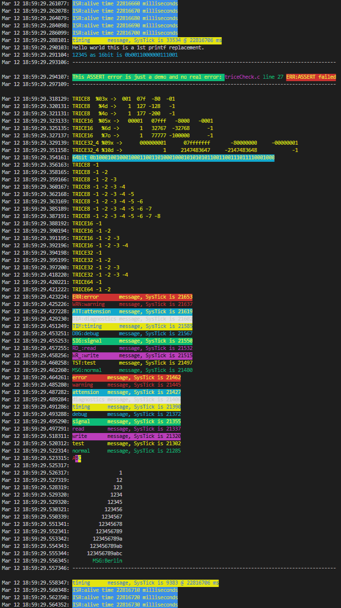

See [../_test/testdata/triceCheck.c](../_test/testdata/triceCheck.c) for reference. The *Trices* can come mixed from inside interrupts (light blue `ISR:...`) or from normal code. For usage with a RTOS, *Trices* are protected against breaks (`TRICE_ENTER_CRITICAL_SECTION`, `TRICE_LEAVE_CRITICAL_SECTION`). Regard the differences in the read SysTick values inside the GIF above These differences are the MCU clocks needed for one trice (~0,25µs@48MHz).

Use the `-color off` switch for piping output in a file. More convenient is the `-lf auto` switch.

<p align="right">(<a href="#top">back to top</a>)</p>

## 11. <a id="optional-xtea-encryption"></a>Optional XTEA Encryption

* You can deliver your device with encrypted trices. This way only the service [wo]men is able to read the *Trices*.
* Implemented is [XTEA](https://en.wikipedia.org/wiki/XTEA) but this is exchangeable.
* The to 8 byte padded blocks can get encrypted by enabling `#define ENCRYPT...` inside [triceConfig.h](../examples/F030_inst/Core/Inc/triceConfig.h). You need to add `-password MySecret` as `trice log` switch and you're done.
* Any password is usable instead of `MySecret`. Simply add once the `-show` switch and copy the displayed passphrase into the [triceConfig.h](../examples/F030_inst/Core/Inc/triceConfig.h) file.
* The encryption takes part **before** the [COBS](https://en.wikipedia.org/wiki/Consistent_Overhead_Byte_Stuffing) encoding.
* TCOBS is usable but not recommended after encryption, because it cannot compress effective arbitrary data.
* If XTEA is used, the encrypted packages have a multiple-of-8 byte length containing 1-7 padding bytes.
* The optional decryption is the next step after unpacking a data frame.
* Enabling XTEA, automatically switches to COBS framing. There is no need to use the Trice tool `-packageFraming` switch in that case because the Trice tool, when getting the CLI switch `-password "phrase"` automatically assumes COBS encoded data, overwriting the default value for `-packageFraming`.

<p align="right">(<a href="#top">back to top</a>)</p>

## 12. <a id="trice-command-line-interface--examples"></a>Trice Command Line Interface & Examples

The trice tool is very easy to use even it has a plenty of options. Most of them normally not needed.
The trice tool can be started in several modes (sub-commands), each with several mandatory or optional switches. Switches can have a single parameter string or not.

```b
trice sub-command -switch1 -switch2 parameter -switch3 ...
```

Which sub-command switches are usable for each sub-command is shown with `trice help -all`. This gives also information about their default values.

Info for a special sub-command is shown with `trice help -log` for example.

* The command history is usable for example inside the bash, simply enter CTRL-R and start typing `trice...` and you can select from the history.
* The most convenient way is to use trice inside scripts like in [this](../examples/L432_inst/build.sh) example.

### 12.1. <a id="common-information"></a>Common information

* `trice h -all` shows all options of the current version.
* `trice ver` prints version information.
* `trice s` shows you all found serial ports for your convenience.
* `trice l -p COM17` could fail if something is wrong. Additional switches are for help tracking the issue:
  * Use log witch `-s[howInputBytes]` to check if any bytes are received at all. 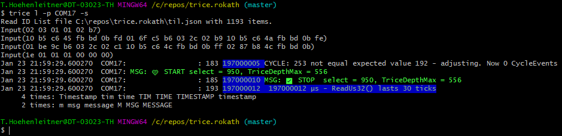
  * With `-debug` you can see the [T]COBS packages and decoded Trice packages. 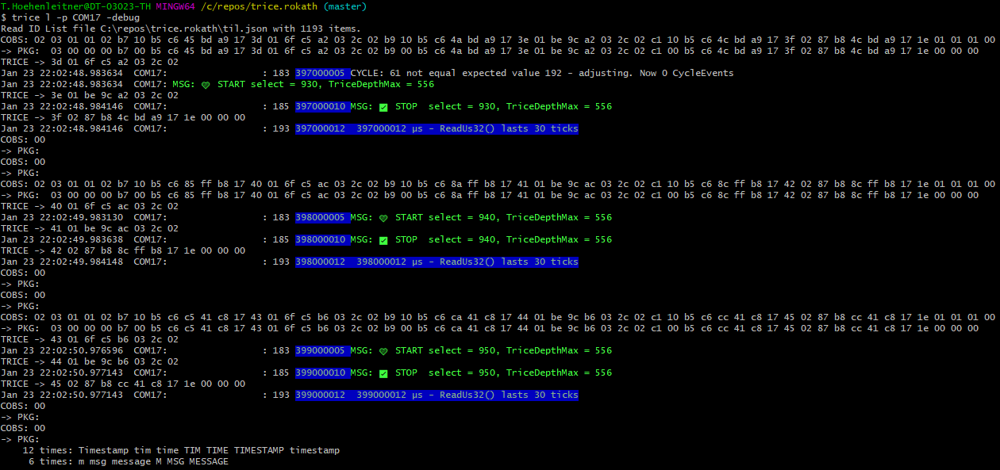

* `trice i` in the root of your project parses all source files for Trice macros, adds automatically ID´s if needed and updates a file named **til.json** containing all ID´s with their format string information. To start simply generate an empty file named **til.json** in your project root. You can add `trice i` to your build process and need no further manual execution.

* `trice ds` starts a display server listening on default ip address *127.0.0.1:61487* or any specified value. This is possible also on a remote device, lets say with ip address 192.168.1.200.
* `trice l -p COM18 -ds` sends the log strings to a display server with default ip address *127.0.0.1:61487* or any specified value, if for example `-ipa 192.168.1.200` the trice logs go to the remote device. You can start several trice log instances, all transmitting to the same display server.

### 12.2. <a id="further-examples"></a>Further examples

#### 12.2.1. <a id="automated-pre-build-insert-command-example"></a>Automated pre-build insert command example

* Scan directories `../src`, `../lib/src` and `./` to insert the IDs there and extend list file `../../../til.json`

```bash
trice i -v -i ../../../til.json -src ../src -src ../lib/src -src ./
```

This is a typical line you can add to your project as an automatic pre-compile step.

#### 12.2.2. <a id="some-log-examples"></a>Some Log examples

* Log trice messages on COM3 8N1 115200 baud

```bash
trice log -i ./myProject/til.json -p=COM3
```

* Log trice messages on COM3 8N1 9600 baud and use default til.json

```bash
trice l -s COM3 -baud=9600
```

#### 12.2.3. <a id="logging-over-a-display-server"></a>Logging over a display server

* Start displayserver on ip 127.0.0.1 (localhost) and port 61497

```bash
trice ds
```

* Log trice messages on COM3 and display on display server

```bash
trice l -ds -p COM3
```

* Shutdown remote display server on IP 192.168.1.23 port 45678

```bash
trice sd -r 192.168.1.23:45678
```

The IP address and port are free selectable. Using a display server, allows to watch the logs of one or many MCUs on a local or remote machine with the same or different display servers.

A local Trice instance sends Trice messages to a display server only, when a log line is complete (if consisting of several Trices). By using the CLI switches `-prefix` and `-suffix` you can decorate the loglines target specific to distinguish them in the output window(s).

#### 12.2.4. <a id="logfile-output"></a>Logfile output

```bash
trice l -p COM3 -logfile auto
```

This creates a new logfile `2022-05-16_2216-40_trice.log` with the actual timestamp on each Trice start.

```bash
trice l -p COM3 -logfile trice.log
```

This creates a new logfile `trice.log` on first start and appends to it on each next Trice start.

Logfiles are text files one can see with 3rd party tools. Example: `cat trice.log`. They contain also the PC reception timestamps if where enabled.

#### 12.2.5. <a id="binary-logfile"></a>Binary Logfile

```bash
trice l -p COM3 -binaryLogfile auto
```

This creates a new binary logfile `2022-05-16_2216-40_trice.bin` with the actual timestamp on each Trice start.

```bash
trice l -p COM3 -binaryLogfile trice.bin
```

This creates a new binary logfile `trice.bin` on first start and appends to it on each next Trice start.

Binary logfiles store the Trice messages as they come out of the target in binary form. They are much smaller than normal logfiles, but the Trice tool with the matching *til.json* is needed for displaying them and the PC timestamps are the displaying time: `trice l -p FILEBUFFER -args trice.bin`.

Recording happens before decoding, `-pick`, `-ban`, `-logLevel`, and visualization. These host options therefore do not remove received bytes from the binary recording, even with `-logLevel off`. Partial or malformed input is also recorded; a recording write failure is returned as an error. Data already lost or suppressed on the target cannot be recovered from this file.

Replay can use a different selection, for example `trice log -p FILEBUFFER -args trice.bin -pick err:wrn`. Keep the matching dictionary and decoding settings (encoding, framing, and encryption) with the recording. An explicit binary filename is appended to across runs; use a new filename when separate captures are needed. Keep binary recording disabled during replay, or write to a different file, never the replay input itself.

Binary logfiles are handy in the field for long data recordings.

When using RTT, the data are exchanged over a file interface. These binary logfiles are stored in the project [./temp] folder and accessible for later view: `trice l -p FILEBUFFER -args ./temp/logfileName.bin`. Of course the host timestamps are the playing time then.

#### 12.2.6. <a id="tcp4-output"></a>TCP4 output

```bash
trice l -p COM3 -tcp 127.0.0.1:23
```

This additionally sends Trice output to a 3rd party TCP listener, for example like Putty:

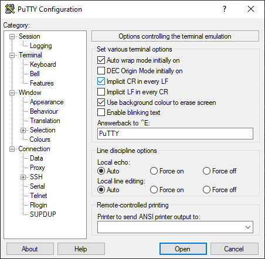 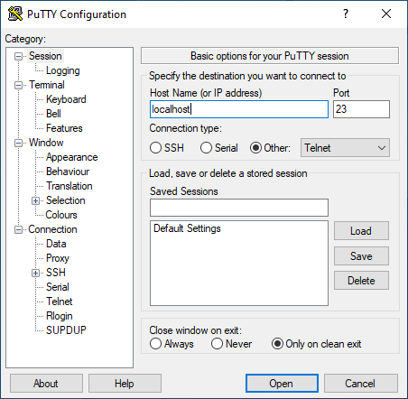
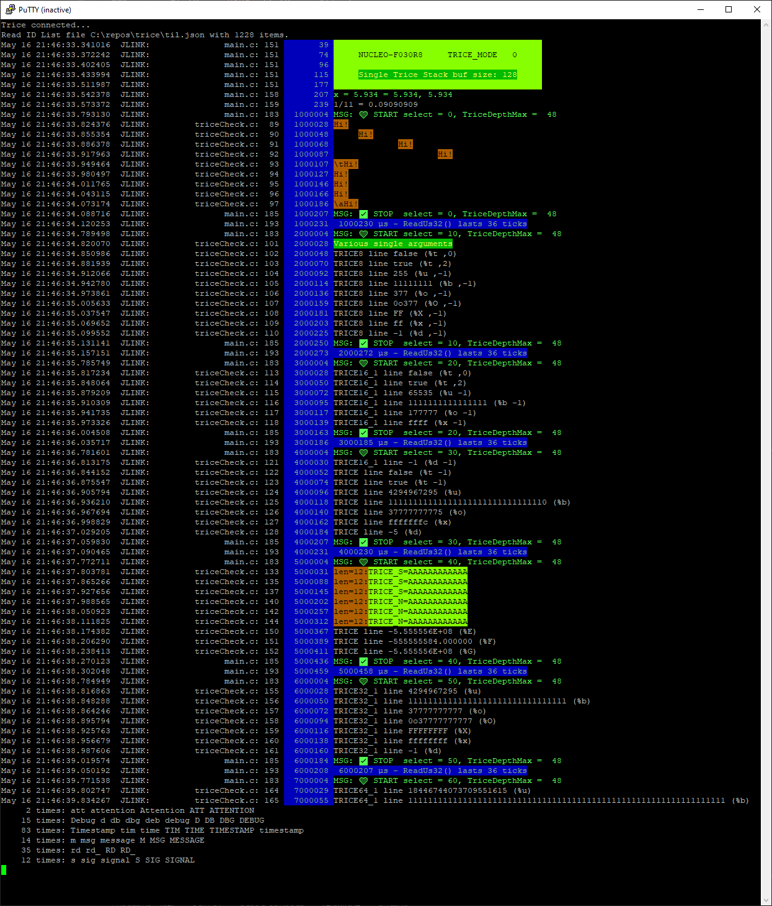

#### 12.2.7. <a id="tcp4-input"></a>TCP4 input

```bash
trice l -p TCP4 -args "192.168.2.3:45678"
```

This expects a TCP4 server at IP address `192.168.2.3` with port number `45678` to read binary Trice data from.

#### 12.2.8. <a id="udp4-input"></a>UDP4 input

The pull request [\#529](https://github.com/rokath/trice/pull/529) introduces key enhancement:

```b
    IPv4 UDP Receiver
    Adds support for receiving data over IPv4 using UDP. This enables integration with systems that broadcast or transmit telemetry, logs, or other messages over the network.
```

-port UDP4 Example

To receive Trice logs over IPv4 UDP, use the -port UDP4 option. By default, it listens on 0.0.0.0:17005, which accepts packets on all network interfaces. You can specify a different address or multicast group via -args.

trice log -p UDP4

#### 12.2.9. <a id="stimulate-target-with-a-user-command-over-uart"></a>Stimulate target with a user command over UART

Sometimes it is handy to stimulate the target during development. For that a 2nd screen is helpful what is possible using the display server option:

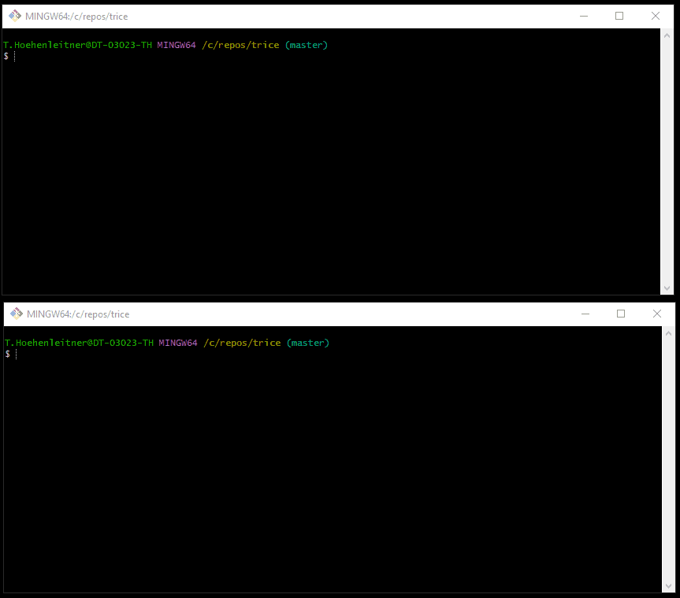

#### 12.2.10. <a id="explore-and-modify-tags-and-their-colors"></a>Explore and modify tags and their colors

See chapter [Trice Tags and Color](#trice-tags-color-and-weights).

#### 12.2.11. <a id="location-information"></a>Location Information

The `add`, `insert`, and `clean` commands generate the file selected by `-li|locationInformation`. Each entry stores one canonical source path and its line number:

```json
{
  "1234": {
    "File": "examples/TriceABC/src/main.c",
    "Line": 42
  }
}
```

`File` is relative to `-liRoot` and always uses `/` separators. The default root is the directory containing the selected `li.json`. An explicit relative `-liRoot` is resolved from the current working directory. If a relative path cannot be represented, for example across Windows volumes, Trice stores a normalized absolute path without resolving symbolic links.

For example, when `build/demoLI.json` and `examples/TriceABC/src/main.c` are below the project directory, the default stores `../examples/TriceABC/src/main.c`. To store a project-relative path instead, run:

```bash
trice insert -li build/demoLI.json -liRoot . -src examples/TriceABC
```

During logging, `-liMaxDirs` controls how much of the stored path is shown. Its default `0` shows only the filename. For `examples/TriceABC/src/main.c`, values `1`, `2`, and `3` show `src/main.c`, `TriceABC/src/main.c`, and the complete stored path respectively. Leading `..` components describe the relation to `-liRoot` and are not displayed or counted. `-liFmt` continues to control the surrounding filename and line-number format.

Location information must match the exact firmware version. In field deployments, keeping `li.json` private and showing the numeric ID with `-showID` can be preferable. When `trice clean` is used, consider versioning the matching `li.json` so later insert operations can reuse locations consistently.

### 12.3. <a id="visualization-output-with--vis"></a>Visualization output with `-vis`

`tlog` and `trice log` support the same repeatable `-vis` option for sending selected numeric measurements to external visualization tools. Consumers can, for example, be LabPlot, Serial Studio, PlotJuggler, uPlot, Grafana, or a custom program; these names do not imply a tool-specific protocol. Trice itself does not draw a graph. It transforms one typed Trice message into one user-defined text record and writes that record to a file or UDP destination.

The syntax is:

```text
-vis='<tag>:printf("<go-fmt>",<expression-list>)@<file-path-or-udp-sink>[;log=keep|drop]'
```

For example, this target message keeps its visualization details independent of the host tool:

```c
TRice("imu:ax=%f,ay=%f,az=%f\n", aFloat(ax), aFloat(ay), aFloat(az));
```

It can be written as CSV:

```bash
tlog ... \
  -vis='imu:printf("%d,%0.3f,%0.3f,%0.3f\n",ts32,v0,v1,v2)@imu.csv'
```

or sent as one UDP datagram per record:

```bash
tlog ... \
  -vis='imu:printf("%0.3f,%0.3f,%0.3f\n",v0*0.5,v1*0.5,v2*0.5)@udp://127.0.0.1:7010;log=drop'
```

The selector matches the original Trice format prefix `<tag>:`. `-pick` and `-ban` run first. A message removed by either existing filter is therefore invisible both to normal output and to `-vis`.

The supported fields are:

```text
id                unsigned Trice ID
ts                raw 16- or 32-bit Target-Stamp, with one width latched per rule
ts16              raw 16-bit Target-Stamp
ts32              raw 32-bit Target-Stamp
v0 ... v11        typed positional Trice values
```

The value fields are positional and can be reordered in the expression list. `-vis` does not extract names such as `ax` or `rpm` from the human-readable target format and does not accept those names as identifiers. For example, `printf("%g,%g\n",v2,v0)` deliberately emits the third value before the first. Structured Logging field names are not visualization expression identifiers; use `v0` through `v11` for this interface.

A Target-Stamp is an unscaled number. `-vis` does not assume that it represents time and does not perform unit conversion, wrap extension, or mixed-width reconstruction. Scaling is explicit in an expression, for example `ts32*0.001`. A rule may use `ts16` or `ts32`, but not both. A generic `ts` rule is disabled with a warning if an otherwise eligible message later changes between 16 and 32 bits.

Separate rules make the expected stamp width explicit:

```bash
tlog ... \
  -vis='fast:printf("%d,%g\n",ts16,v0)@fast.csv' \
  -vis='slow:printf("%d,%g\n",ts32,v0)@slow.csv'
```

Expressions support decimal, floating-point, and hexadecimal literals, parentheses, unary minus, and `+`, `-`, `*`, `/`. A direct field retains its signed, unsigned, floating-point, or Boolean type. Arithmetic is evaluated as `float64`. A floating result used with an integer verb must be finite and inside the `int64` range; it is then truncated toward zero.

The `printf` encoder supports:

```text
integer:       %d %b %o %x %X
floating:      %f %e %E %g %G
generic:       %v
Boolean:       %t with a direct Boolean field
literal:       %%
formatting:    literal width and precision, such as %08x or %0.3f
```

`%u`, dynamic `*` width or precision, explicit argument indexes, string conversions, and other Go formatting verbs are not supported. The expression count must equal the number of consuming verbs. The encoder adds no implicit newline; include `\n` in the format when the receiving tool expects one. A one-line JSON record is possible as well:

```bash
tlog ... \
  -vis='imu:printf("{\"stamp\":%d,\"x\":%g,\"y\":%g,\"z\":%g}\n",ts32,v0,v1,v2)@udp://127.0.0.1:7011'
```

A bare path and `file:<path>` both select an append-only file:

```text
@out.csv
@logs/imu.csv
@file:out.csv
```

Missing files are created. Rules using the same normalized file path share one open file. `file://out.csv` is rejected because standard URI parsing treats `out.csv` as a host, not as a relative path. Full file-URI semantics are not part of this implementation.

UDP destinations use:

```text
@udp://127.0.0.1:7010
@udp://localhost:7010
```

The address is resolved and opened before decoding starts. File and UDP writes are synchronous. There is no queue, retry, reconnect, acknowledgement, TCP, WebSocket, or named-pipe support in this first implementation.

`log=keep` is the default and leaves the decoded message in normal output. `log=drop` removes it from normal output only after that rule has encoded and written the visualization record successfully. All overlapping rules are still attempted; one successful `log=drop` rule wins. An ignored record or a failed encoder or sink write does not drop the normal log.

Only fixed-width numeric Trice messages are eligible. The first twelve values are addressable as `v0` through `v11`; additional values do not prevent a rule from using that addressable prefix and remain available to normal logging. `Trice` string, buffer, function-display, character, typeX0, `CHAR`, and `DUMP` inputs are not supported. Named values, specialized JSON or binary encoders, TCP, WebSocket, named pipes, and process pipes are deferred behind the same selector/encoder/sink separation. One eligible Trice must also form one complete log line by itself. Partial, multi-line, and multi-Trice lines continue through normal logging but are ignored by `-vis`; verbose mode reports every such occurrence.

At startup, each rule checks all matching historical `til.json` entries. Incompatible old entries are excluded independently, so one stale ID does not block another compatible ID. A rule with no compatible entry is disabled with a prominent warning. Rules are also disabled, never silently, after a generic Target-Stamp width conflict, an unsafe runtime expression conversion, or a sink failure. Normal logging continues.

### 12.4. <a id="setting-up-the-labplot-demo"></a>Setting up the LabPlot Demo

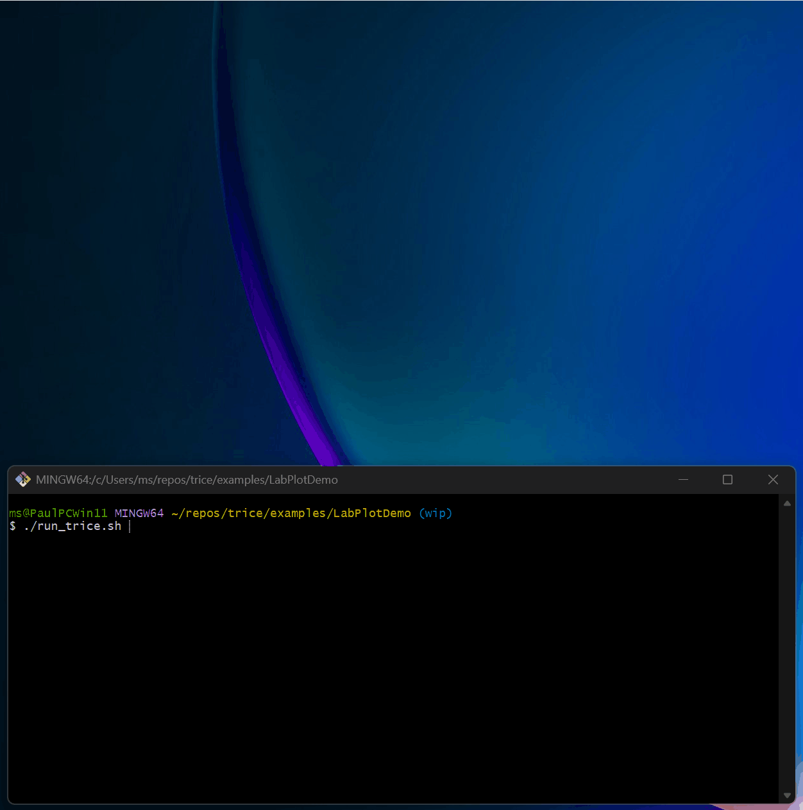

This section uses [LabPlot](https://labplot.org/), a cross-platform interactive
plotting application. The finished, ready-to-run example is in
`./examples/LabPlotDemo/`; the guided learning path is in
`./examples/LabPlotUser/`. The project uses a UDP socket so that it can
display an endless stream without repeatedly importing files.

#### 12.4.1. <a id="the-common-live-data-format"></a>The common live-data format

Both producers describe the same three signals: `x`, `y`, and `z`. LabPlot
receives normalized numeric CSV records with this column layout:

```text
time_s,x,y,z
```

The finished project predeclares the four numeric columns and performs one
initial read while loading. This prepares LabPlot's UDP socket before the
first live record arrives. The UDP stream therefore needs no header row.

The LabPlot demo rate is 50 samples per second. The project retains 500 rows.
The time plot is configured for the last 500 values, so its horizontal
resolution stays constant and it always displays approximately the most
recent ten seconds. The Lissajous plot uses only the last 150 values, which
creates a moving three-second trace instead of an increasingly dense full
history. A slow phase modulation of `y` makes the figure change continuously.
The CSV producer sends this format directly. The Trice producer sends binary
Trice records to `tlog`; `tlog` decodes them and sends the same CSV format
onward. This separation means that one LabPlot project works for both
examples.

#### 12.4.2. <a id="examplesdemodatacsv"></a>./examples/DemoData_CSV

The [CSV producer](../examples/DemoData_CSV/src/main.c) is a small C11 program
for Windows, macOS, and Linux. Each newline-terminated record contains
`time_s,x,y,z`, all represented as `double`; time is in seconds. It writes to
standard output by default, to a fresh file with `--output FILE`, or to UDP
with one record per datagram. Use `--help` for all options.

Both data producers require a C compiler and CMake 3.16 or newer. Run their
`build.sh` in Git Bash on Windows or a POSIX shell on macOS/Linux; restore its
executable permission with `chmod +x build.sh` if necessary. Executables are
installed in each project's `bin/`, with intermediate files in `build/`.
For the CSV producer, the equivalent explicit CMake commands are:

```sh
cd examples/DemoData_CSV
cmake -S . -B build
cmake --build build --config Release
cmake --install build --config Release --prefix .
```

These commands also work in PowerShell. Its executable invocation is
`.\bin\DemoData_CSV.exe`; in Git Bash use `./bin/DemoData_CSV`.

From the CSV project directory, try:

```sh
./build.sh
./bin/DemoData_CSV
./bin/DemoData_CSV --rate 50 --samples 500 --no-delay --header --output DemoData_CSV.csv
./bin/DemoData_CSV --udp 127.0.0.1 9000
```

Run these alternatives separately. The second command runs continuously at
50 Hz; interrupt it with `Ctrl-C`. The third writes ten seconds of data
without real-time waiting. On Windows PowerShell the UDP command is
`.\bin\DemoData_CSV.exe --udp 127.0.0.1 9000`.

For Serial Studio, choose **Quick Plot (Comma Separated Values)**, then
**Network Socket > UDP**, set local port `9000`, connect, and start the UDP
producer. Quick Plot treats all four columns as values. A custom project can
instead name the columns and use the first column as a timestamp axis. Its
input must be `seconds,x,y,z`; do not send `--header` on the live stream.
There is currently no versioned `DemoData.ssproj` in this repository.

Both producers use the following signal model for time `t` in seconds:

```text
phase = (pi/3) * sin(2*pi*0.04*t)
x = sin(2*pi*0.70*t)
y = sin(2*pi*0.91*t + pi/2 + phase)
z = 0.6*sin(2*pi*0.13*t) + 0.2*x*y + pulse
```

The pulse has height `0.8` during the final 250 ms of every eight-second
interval. The slow phase modulation keeps the Lissajous plot moving. The
Trice producer calculates the signals as doubles and transmits float32 values.

After running `build.sh` inside `./examples/DemoData_CSV/`, the executable is
installed in the local `bin/` folder. You can run it there:

```txt
th@Thomass-MacBook-Pro-7 bin % ./DemoData_CSV --header -o log.csv
^C
th@Thomass-MacBook-Pro-7 bin % head log.csv                           
time_s,x,y,z
0.000000,0.000000,1.000000,0.000000
0.020000,0.087851,0.992854,0.027246
0.040000,0.175023,0.971519,0.053608
0.060000,0.260842,0.936300,0.078239
0.080000,0.344643,0.887701,0.100367
0.100000,0.425779,0.826415,0.119328
0.120000,0.503623,0.753319,0.134594
0.140000,0.577573,0.669459,0.145795
0.160000,0.647056,0.576032,0.152736
th@Thomass-MacBook-Pro-7 bin % 
```

#### 12.4.3. <a id="examplesdemodatatrice"></a>./examples/DemoData_Trice

The [Trice producer](../examples/DemoData_Trice/src/main.c) transports the
same signals as binary Trice records. Keep it inside the repository: its
CMake project uses the unchanged target library from `../../src`.
Its [build script](../examples/DemoData_Trice/build.sh) prepares Bind and the
repository-root `demoTIL.json` before building; it requires the Trice host
tool in addition to the CSV producer's prerequisites. Use this script rather
than plain CMake commands that omit Bind preparation. There is no private
`til.json` or fixed `iD(1000)` for this ID-free producer.

The 32-bit target stamp uses units of **10 ms**: at 50 Hz the stamps are
`0, 2, 4, ...`. Convert with `seconds = ts/100.0` or
`milliseconds = ts*10`; `ts*100` does not give seconds.

From `examples/DemoData_Trice`:

```sh
./build.sh
./bin/DemoData_Trice --samples 500 --no-delay
trice log -p FILEBUFFER -args DemoData_Trice.bin -pf TCOBS -til ../../demoTIL.json -li off
```

Without an output option, the producer recreates `DemoData_Trice.bin` in the
current directory (`wb` truncates its previous contents). `--output FILE`
selects another fresh file, `--stdout` writes binary data to standard output,
and `--udp HOST PORT` sends one complete TCOBS-framed record per datagram.
Without `--samples` it runs until interrupted. `--samples 500` counts signal
samples, not all log records: startup and periodic diagnostic logs are extra.
Use `--help` for all options. On Windows PowerShell, run
`.\bin\DemoData_Trice.exe` with the same arguments.

After running `build.sh` inside `./examples/DemoData_Trice/`, the executable is
installed in the local `bin/` folder. You can run it there:

- Create binary log file:

```txt
th@Thomass-MacBook-Pro-7 bin % ./DemoData_Trice -o log.bin
Writing log.bin
^C
```

- Show logs in binary log file: 

```txt
th@Thomass-MacBook-Pro-7 bin % tlog -p FILEBUFFER -args log.bin -til ../../../demoTIL.json -ulabel vis_demo | head
Jul 25 15:38:55.411676  FILEBUFFER:    0,000_000 0.000000,1.000000,0.000000
Jul 25 15:38:55.411691  FILEBUFFER:    0,000_002 0.087851,0.992854,0.027246
Jul 25 15:38:55.411705  FILEBUFFER:    0,000_004 0.175023,0.971519,0.053608
Jul 25 15:38:55.411714  FILEBUFFER:    0,000_006 0.260842,0.936300,0.078239
Jul 25 15:38:55.411725  FILEBUFFER:    0,000_008 0.344643,0.887701,0.100367
Jul 25 15:38:55.411737  FILEBUFFER:    0,000_010 0.425779,0.826415,0.119328
Jul 25 15:38:55.411752  FILEBUFFER:    0,000_012 0.503623,0.753319,0.134594
Jul 25 15:38:55.411765  FILEBUFFER:    0,000_014 0.577573,0.669459,0.145795
Jul 25 15:38:55.411776  FILEBUFFER:    0,000_016 0.647056,0.576032,0.152736
th@Thomass-MacBook-Pro-7 bin %
```

- Get CSV log file:

```txt
th@Thomass-MacBook-Pro-7 bin % tlog -p FILEBUFFER -args log.bin -til ../../../demoTIL.json -ulabel vis_demo -vis='vis_demo:printf("%0.3f,%0.3f,%0.3f,%0.3f\n",ts/100.0,v0,v1,v2)@log.csv;header="time_s,X,Y,Z\n";log=drop'
th@Thomass-MacBook-Pro-7 bin % head log.csv
time_s,X,Y,Z
0.000,0.000,1.000,0.000
0.020,0.088,0.993,0.027
0.040,0.175,0.972,0.054
0.060,0.261,0.936,0.078
0.080,0.345,0.888,0.100
0.100,0.426,0.826,0.119
0.120,0.504,0.753,0.135
0.140,0.578,0.669,0.146
0.160,0.647,0.576,0.153
th@Thomass-MacBook-Pro-7 bin % 
```

The preceding file visualization rule recreates `log.csv` when `tlog` starts.
Its header is written once per sink; the quoted Go string supports `\n`.
Keep a single backslash in the shell's single-quoted rule. `log=drop` suppresses
the successfully visualized records, while unrelated diagnostic logs remain.

For a live Serial Studio or other CSV viewer listening on UDP `9000`, start
the decoder from the repository root before starting the binary producer:

```sh
trice log -p UDP4 -args 127.0.0.1:9001 -pf TCOBS -til demoTIL.json -ulabel vis_demo \
  -vis='vis_demo:printf("%0.6f,%0.6f,%0.6f,%0.6f\n",ts/100.0,v0,v1,v2)@udp://127.0.0.1:9000;log=drop'
```

In another terminal, also from the repository root:

```sh
examples/DemoData_Trice/bin/DemoData_Trice --udp 127.0.0.1 9001
```

On Windows the executable has an `.exe` suffix. The producer sends **binary
Trice** to `9001`, not CSV; connecting it directly to the viewer on `9000`
cannot work. The decoder converts its records to `seconds,x,y,z`. The LabPlot
launchers below automate this pipeline and its receiver-readiness checks.

#### 12.4.4. <a id="quick-labplot-demonstration"></a>Quick LabPlot demonstration

Install LabPlot 2.12 or newer. From the repository root, run one of these
commands in a POSIX shell:

```sh
./examples/LabPlotDemo/run_csv.sh
./examples/LabPlotDemo/run_trice.sh
```

The script opens `LabPlotDemo.lml` and starts the selected producer. The first
script sends CSV directly to UDP port `9000`. The second uses UDP port `9001`
for binary Trice input and runs `tlog` as the decoder/forwarder to port `9000`.
The script first waits until LabPlot has opened port `9000`, then starts
`tlog` and waits until its input port `9001` is ready. Only then does it start
the Trice producer. The project opens one worksheet containing two plots side
by side:

* `Time series`: `x`, `y`, and `z` versus `time_s`, always showing the last
  500 values (ten seconds).
* `Lissajous`: `y` versus `x`, showing the last 150 values (three seconds) on
  fixed axes. The producer's slow phase drift keeps the figure in motion.

Press `Ctrl-C` in the shell to stop the producer and decoder. If LabPlot is
not found automatically, set `LABPLOT` to its executable. On Windows, Git
Bash is a suitable shell; for example, use
`LABPLOT=/c/Program\ Files/LabPlot/bin/labplot.exe`.

#### 12.4.5. <a id="recreate-the-project-in-labplot"></a>Recreate the project in LabPlot

The following steps explain the project without requiring prior LabPlot
knowledge. Start `run_csv.sh` first and leave it running.

1. Create a new LabPlot project and choose **Add New > Live Data Source**.
2. Select **Network UDP Socket**, enter host `127.0.0.1` and port `9000`.
3. Select the ASCII filter, comma as separator, and disable header detection.
   Set all four data types to `Double` and enter the names `time_s`, `x`, `y`,
   and `z`.
4. Select **Update on new data** and retain `500` values. This is the moving
   ten-second window at the demo's 50 Hz rate.
5. Add a worksheet with a Cartesian plot. Add three XY curves. For every
   curve choose `time_s` as the X column and choose `x`, `y`, or `z` as the Y
   column. Enable the legend, label the axes `time [s]` and `value`, and enable
   automatic range scaling. In the plot's range
   settings select **Last values** and enter `500`; otherwise the time axis
   keeps growing and the curves become increasingly compressed.
6. Add a second Cartesian plot to the same worksheet and select a horizontal
   two-column worksheet layout. Add one XY curve with `x` as its X column and
   `y` as its Y column. Select **Last values** and enter `150`. Fixed X and Y
   ranges from `-1.1` to `1.1` keep the scale stable while the three-second
   trace and the signal's slow phase drift make the movement visible.
7. Save the project as `LabPlotUser.lml`.

The finished [LabPlotDemo.lml](../examples/LabPlotDemo/LabPlotDemo.lml) contains
these settings and no machine-specific paths. Open it manually if LabPlot is
already running. The [LabPlotUser directory](../examples/LabPlotUser/) is the
place for your recreated `LabPlotUser.lml`; this section is its complete
rebuild guide. Both producers end at the same numeric UDP stream, for example
`0.000000,0.000000,1.000000,0.000000`.

Stop the producer and start the other launcher without changing the LabPlot
project. Keep only one producer sending to UDP `9000` and keep the live source
connected. The Trice launcher first waits for LabPlot on `9000`, then for its
decoder on `9001`. The supplied project predeclares all four numeric columns
and triggers an initial read when loaded so that LabPlot prepares its socket.

#### 12.4.6. <a id="troubleshooting-and-adaptations"></a>Troubleshooting and adaptations

* `labplot` must be discoverable or selected with `LABPLOT`. macOS also checks
  its standard application bundle. Windows searches `ProgramFiles`,
  `ProgramW6432`, and `LOCALAPPDATA` for `labplot.exe` or `labplot2.exe`;
  an explicit `LABPLOT` override takes precedence. `TLOG` can select a decoder
  outside `PATH`. Producer executables stay in each demo's `bin/`, with CMake
  intermediates in `build/`.
* If the plots remain empty, verify that the producer is running and that no
  other process owns UDP port `9000`.
* If `tlog` reports that a `-vis` rule was disabled because writing to port
  `9000` was refused, LabPlot was not listening when the decoder started.
  Restart `run_trice.sh`; its readiness check normally prevents this race.
  Once a visualization rule is disabled, normal logging intentionally
  resumes, and its `log=drop` option is no longer applied.
* For the Trice path, verify that `tlog` is on `PATH` and that
  `demoTIL.json` is present at the repository root. Set `TLOG` or
  `TRICE_TIL` when using non-default locations.
* Keep the complete `-vis` expression inside one pair of quotes. The semicolon
  separates `header` and `log` options inside that expression; it must not be
  interpreted by the shell.
* To show another history length, change the retained-value count to
  `50 * seconds`. For example, `1000` values show approximately 20 seconds.
* The Trice path still uses UDP port `9001` internally between the demo and
  `tlog`. If that port is busy, stop the other receiver or change it in
  `run_trice.sh` and its `-args` value together.

<p align="right">(<a href="#top">back to top</a>)</p>

## 13. <a id="limitations-1"></a>Limitations

### 13.1. <a id="permanent-limitations"></a>Permanent Limitations

#### 13.1.1. <a id="limitation-trice-in-trice-not-possible"></a>Limitation TRICE in TRICE not possible

* No-Good Example:

```C
int f0( void ){ TRICE( "msg:f0\n"); return 0; }
void f1( void ){ TRICE( "No; %d", f0() ); }
```

* This will compile normally but corrupt TRICE output.

The reason is: When f1() gets active, the "No" Trice header is created, than the f0() Trice is executed and afterwards the "No" Trice tail is written. This works well during compile time but causes a mismatch during runtime.

* Workaround:

```C
int f0( void ){ TRICE( "msg:f0\n"); return 0; }
void f1( void ){ int x = f0(); TRICE( "Yes: %d", x ); }
```

### 13.2. <a id="current-limitations"></a>Current Limitations

#### 13.2.1. <a id="string-concatenation-within-trice-macros-not-possible"></a>String Concatenation Within TRICE Macros Not Possible

String concatenation within TRICE macros does not work. The reason lays inside the way the trice tool parser works:

```C
void f0( void ){ TRICE( "msg:" ## "Hello\n" ); } // ERROR!
```

To implement this would need to build a trice preprocessor or to run the C preprocessor first and to modify the preprocessor output with the trice tool. That would make things unneccessary complicate and fragile for now.

#### 13.2.2. <a id="limited-trice-parser-capabilities"></a>Limited Trice Parser Capabilities

The Trice tool internal parser has only limited capabilities. In works well in most cases, but could lead to problems in some cases. The compiler run will for sure end up with some error messages in the following examples, so the developer can fix the code.

An example, provided by [@KammutierSpule](https://github.com/kammutierspule), is this:

* started from a empty li.json/til.json

```C
void trice0_test() {
    Trice0( "OK");
    Trice( InvalidUse );
    Trice( "%u", Variable );
}
```

* run `trice insert`

```C
void trice0_test() {
    Trice0( iD(2740), "OK"); // ok, iD is added
    Trice( InvalidUse ); // no warning or error
    Trice( "%u", Variable ); // id is not added / inserted
}
```

As said, the compiler will complain about that in any case.

#### 13.2.3. <a id="special-care-demands"></a>Special Care Demands

<h6>More than 12 printf parameters</h6>

* use several printf-calls
* Use triceB and its relatives

<h6>Float Numbers</h6>

* surround each with `aFloat()`

<h6>Double numbers</h6>

* surround each with `aDouble()` and use the `trice64` macro and relatives

<h6>Runtime Generated Strings</h6>

* Each needs its own `triceS` macro, example:
  * Legacy code:

    ```C
    printf( "Entered name is %20s %30s, favorite numbers %d, %f\n", "Paul", "Luap", 42, 3.14159 );
    ```

  * Trice code:

    ```C
    name = "Paul"; triceS( "Entered name is %20s", name );`
    surname = "Luap";  triceS( " %30s, ", surname );`
    trice( "favorite numbers %d, %f\n", 42, aFloat(3.14159) );`
    ```

The `triceS` macro is ment to be used with strings not known at compile time.

*Usage intention and recommendation:* (given by [@escherstair](https://github.com/escherstair))

```C
char runtime_string[50];
fillRuntimeStringFromSomewhere(runtime_string); // the content of runtime_string is filled at run time
triceS( "msg:This part of the string is known at compile time. This part is dynamic: %s\n", runtime_string);
```

All the string literals (i.e. compile-time known strings) should be put inside the format string.
Only the runtime strings should be used as variables in triceS macro for best performance.

<p align="right">(<a href="#top">back to top</a>)</p>

## 14. <a id="additional-hints"></a>Additional hints

### 14.1. <a id="pre-built-executables-are-available"></a>Pre-built executables are available

See [https://github.com/rokath/trice/releases](https://github.com/rokath/trice/releases).

### 14.2. <a id="configuration-file-triceconfigh"></a>Configuration file triceConfig.h

* When setting up your first project you need a `triceConfig.h` file.
* You should **not** use the `./_test/cgo.../triceConfig.h` directly, because these are customized for internal tests with CGO. But you can use their settings as helper for a starting point.
* Please choose one of these files as starting point:
  *  [../examples/F030_inst/Core/Inc/triceConfig.h](../examples/F030_inst/Core/Inc/triceConfig.h)
  *  [../examples/G0B1_inst/Core/Inc/triceConfig.h](../examples/G0B1_inst/Core/Inc/triceConfig.h)
  *  [../examples/L432_inst/Core/Inc/triceConfig.h](../examples/L432_inst/Core/Inc/triceConfig.h)
* Comparing them and understandig the differences helps quick starting.
* The file [triceDefaultConfig.h](../src/triceDefaultConfig.h) contains all possible config keys with descriptions.

### 14.3. <a id="setting-up-the-very-first-connection"></a>Setting up the very first connection

If you see nothing in the beginning, what is normal ;-), add the `-s` (`-showInputBytes`) switch to see if any data arrive. There is also a switch `-debug` showing you the received packages, if you are interested in.

### 14.4. <a id="avoid-buffer-overruns"></a>Avoid buffer overruns

It is your responsibility to produce less data than transmittable. If this is not guarantied, a data loss is not avoidable or you have to slow down the user application. The buffers have an optional overflow protection (`TRICE_PROTECT`), which is enabled by default. Recommendation: Make the buffer big and emit the maxDepth cyclically, every 10 or 1000 seconds. Then you know the needed size. It is influenced by the max Trice data burst and the buffer switch interval. See [./examples/exampleData/triceLogDiagData.c](../examples/exampleData/triceLogDiagData.c) for help.

If the target application produces more Trice data than transmittable, a buffer overrun can let the target crash, because for performance reasons no overflow check is implemented in versions before v0.65.0. Such a check is added now per default using `TRICE_PROTECT`, but the Trice code can only throw data away in such case. Of course you can disable this protection to get more speed.

Configuring the ring buffer option with `TRICE_PROTECT == 0` makes buffer overruns not completely impossible, because due to partial Trice log overwrites, false data are not excluded anymore and overwriting the buffer boundaries is possible, because of wrong length information. Also losses will occur when producing more data than transmittable. This is detectable with the cycle counter. The internal 8-bit cycle counter is usually enabled. If Trice data are lost, the receiver side will detect that because the cycle counter is not as expected. There is a chance of 1/256 that the detection does not work for a single case. You can check the detection by unplugging the trice UART cable for a time. Also resetting the target during transmission should display a cycle error.

Gennerally it is recommended to enable `TRICE_PROTECT` during development and to disable it for performance, if you are 100% sure, that not more data are producable than transmittable.

Important to know: If the `TRICE_PROTECT` code inhibits the writing into a buffer, there will be later no cycle error because a non existing Trice cannot cause a cycle error. Therefore the `TriceDirectOverflowCount` and `TriceDeferredOverflowCount` values exist, which could be monitored.

### 14.5. <a id="buffer-macros"></a>Buffer Macros

(Examples in [../_test/testdata/triceCheck.c](../_test/testdata/triceCheck.c))

| Macro Name                                      | Description                                                                                                                                                                                                                                                                                                                   |
|-------------------------------------------------|-------------------------------------------------------------------------------------------------------------------------------------------------------------------------------------------------------------------------------------------------------------------------------------------------------------------------------|
| `triceS`  \|`TriceS`  \|`TRiceS`  \|`TRICE_S`   | Output of runtime generated 0-terminated strings.                                                                                                                                                                                                                                                                             |
| `triceN`  \|`TriceN`  \|`TRiceN`  \|`TRICE_N`   | Is for byte buffer output as string until the specified size. It allows limiting the string size to a specific value and does not rely on a terminating 0. If for example len = 7 is given and "Hello\0World\n" is in the buffer, the byte sequence "Hello\0W" is transmitted but the trice tool probably shows only "Hello". |
| `triceB`  \|`TriceB`  \|`TRiceB`  \|`TRICE_B`   | Is buffer output according to the given format specifier for a default unit according to configuration (8\|16\|32\|64-bit value) - default is `#define TRICE_B TRICE8_B`.                                                                                                                                                     |
| `trice8B` \|`Trice8B` \|`TRice8B` \|`TRICE8_B`  | Is for byte buffer output according to the given format specifier for a single byte.                                                                                                                                                                                                                                          |
| `trice16B`\|`Trice16B`\|`TRice16B`\|`TRICE16_B` | Is for 16-bit buffer output according to the given format specifier for a 16-bit value.                                                                                                                                                                                                                                       |
| `trice32B`\|`Trice32B`\|`TRice32B`\|`TRICE32_B` | Is for 32-bit buffer output according to the given format specifier for a 32-bit value.                                                                                                                                                                                                                                       |
|                                                 | See chapter [Trice ABC - Asynchronous Broadcast Commands](#trice-abc---asynchronous-broadcast-commands) for the following lines.                                                                                                                                                                                              |
| `triceC`  \|`TriceC`  \|`TRiceC`  \|`TRICE_C`   | Is for ABC buffer output according to the given function handler for a default unit according to configuration (8\|16\|32\|64-bit value) - default is `#define TRICE_C TRICE8_C`.                                                                                                                                             |
| `trice8C` \|`Trice8C` \|`TRice8C` \|`TRICE8_C`  | Is for ABC byte buffer output according to the given function handler.                                                                                                                                                                                                                                                        |
| `trice16C`\|`Trice16C`\|`TRice16C`\|`TRICE16_C` | Is for ABC 16-bit buffer output according to the given function handler for a 16-bit wide buffer.                                                                                                                                                                                                                             |
| `trice32C`\|`Trice32C`\|`TRice32C`\|`TRICE32_C` | Is for ABC 32-bit buffer output according to the given function handler for a 32-bit wide buffer.                                                                                                                                                                                                                             |

### 14.6. <a id="logfile-viewing"></a>Logfile viewing

Logfiles, Trice tool generated with sub-command switch `-color off`, are normal ASCII files. If they are with color codes, these are ANSI escape sequences.

* Simply `cat trice.log`. One view option is also `less -R trice.log`. The Linux command `less` is also available inside the windows git bash.
* Under Windows one could also download and use [ansifilter](https://sourceforge.net/projects/ansifilter/) for logfile viewing. A monospaced font is recommended.
* See also [Color issues under Windows](#color-issues-under-windows)

### 14.7. <a id="using-the-trice-tool-with-3rd-party-tools"></a>Using the Trice tool with 3rd party tools

Parallel output as logfile, TCP or binary logfile is possible. See examples above.

### 14.8. <a id="several-targets-at-the-same-time"></a>Several targets at the same time

You can connect each target over its transmit channel with an own Trice instance and integrate all transmissions line by line in an additional Trice instance acting as display server. See [https://github.com/rokath/trice#display-server-option](https://github.com/rokath/trice#display-server-option).

### 14.9. <a id="executing-go-test--race--count-100-"></a>Executing `go test -race -count 100 ./...`

The C-code is executed during some tests. Prerequisite is an installed GCC.

### 14.10. <a id="tricestackbuffer-could-cause-stack-overflow-with--o0-optimization"></a>TRICE_STACK_BUFFER could cause stack overflow with -o0 optimization

As discussed in [issue #294](https://github.com/rokath/trice/issues/294) it can happen, that several TRICE macros within one function call increase the stack usage more than expected, when compiler optimization is totally switched off.

### 14.11. <a id="cycle-counter"></a>Cycle Counter

* The trice tool expects the first cycle counter to start with 0xC0 (=192). If the target is already running and you connect the trice tool then, the first message is marked with "CYCLE: ? not equal expected value 192 - adjusting. Now 1 CycleEvents".
* If the target is resetted asynchronous, the trice tool receives a cycle counter 192. Most probably the last cycle counter was not 191, so this triggers also a message  with "CYCLE: 192 not equal expected value ?- adjusting. Now n CycleEvents".
* In the Trice tool is some heuristics to suppress such obvious false positives.

<p align="right">(<a href="#top">back to top</a>)</p>

## 15. <a id="switching-trice-on-and-off"></a>Switching Trice ON and OFF

<div id="Target side Trice On-Off"></div>

### 15.1. <a id="target-side-compile-time--trice-on-off"></a>Target side compile-time  Trice On-Off

* If your code works well after checking, you can add `#define TRICE_OFF 1` just before the `#include "trice.h"` line and no Trice code is generated anymore for that file, so no need to delete or comment out Trice macros: <!-- 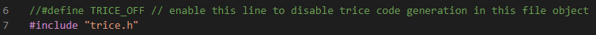 -->

```C
#define TRICE_OFF 1
#include "trice.h"
void fn(void) {
    trice( iD(123), "Hi"); // Will generate code only, when TRICE_OFF == 0.
    trice( "Lo");          // Will generate code only, when TRICE_OFF == 0.
}
```

With `#define TRICE_OFF 1`, macros in this file are ignored completely by the compiler, but not by the Trice tool. In case of reconstructing the [**T**rice **ID** **L**ist](../demoTIL.json) these no code generating macros are regarded and go into (or stay inside) the ID reference list.

* Hint from [@escherstair](https://github.com/escherstair): With `-D TRICE_OFF=1` as compiler option, the trice code diappears completely from the binary.
* No runtime On-Off switch is implemented for several reasons:
  * Would need a control channel to the target.
  * Would add little performance and code overhead.
  * Would sligtly change target timing (testing).
  * User can add its own switches anywhere.
  * The short Trice macro code is negligible.
  * The trice output is encryptable, if needed.
* Because of the low Trice bandwidth needs and to keep the target code as clear as possible the runtime On-Off decision should be done by the Trice tool.

<p align="right">(<a href="#top">back to top</a>)</p>

### 15.2. <a id="host-side-trice-on-off"></a>Host side Trice On-Off

* The PC Trice tool offers command line switches to `-pick` or `-ban` for Trice tags and will be extended with display switches.
* A Trice tool `-logLevel` switch is usable too.

<p align="right">(<a href="#top">back to top</a>)</p>

## 16. <a id="framing"></a>Framing

* Trice messages are framed binary data, if framing is not disabled.
* Framing is important for data disruption cases and is done with [TCOBS](https://github.com/rokath/tcobs) (has included data compression) but the user can force to use [COBS](https://github.com/rokath/COBS), what makes it easier to write an own decoder in some cases or disable framing at all.
  * Change the setting `TRICE_FRAMING` inside `triceConfig.h` and use the Trice tool `-packageFraming` switch accordingly.
* For robustness each Trice can get its own (T)COBS package (`TRICE_DEFERRED_TRANSFER_MODE == TRICE_SINGLE_PACK_MODE`). That is configurable for transfer data reduction. Use `#define TRICE_DEFERRED_TRANSFER_MODE TRICE_MULTI_PACK_MODE` inside `triceConfig.h` (is now default). This allows to reduce the data size a bit by avoiding many 0-delimiter bytes but results in some more data loss in case of data disruptions.

<p align="right">(<a href="#top">back to top</a>)</p>

## 17. <a id="endianness"></a>Endianness

* To interpret a decoded package, it´s endianness needs to be known.
* For efficiency, binary trice data are normally stored and transmitted in MCU endianness and the Trice tool expects binary data in little endian format as most MCUs are little endian.
* On big endian MCUs the compiler switch `TRICE_MCU_IS_BIG_ENDIAN` needs to be defined as 1 and `TRICE_TRANSFER_ORDER_IS_BIG_ENDIAN` should have the same value. The Trice tool has a CLI switch "triceEndianness" which needs to be set to "bigEndian" then.
* If trice transmit data are needed to be not in MCU order for some reason, that increases the critical trice storage time and target code amount.
* De facto different values for  `TRICE_MCU_IS_BIG_ENDIAN` and `TRICE_TRANSFER_ORDER_IS_BIG_ENDIAN` are mainly used to test the Trice CLI switch `-triceEndianness bigEndian` automatically.

<p align="right">(<a href="#top">back to top</a>)</p>

## 18. <a id="trice-timestamps"></a>Trice (Time)Stamps

* Each Trice message can carry stamp bits, which are free usable like for time, addressing or filtering.
* By selecting the letter case (**tr**ice, **Tr**ice, **TR**ice) you decide for each single Trice macro about the stamp size.
* Default notation (function call):

  | notation                     | stamp size | remark                                                                      |
  |------------------------------|------------|-----------------------------------------------------------------------------|
  | `trice( iD(n), "...", ...);` | 0-bit      | no stamp at all, shortest footprint                                         |
  | `Trice( iD(n), "...", ...);` | 16-bit     | calls internally `uint16_t TriceStamp16( void )` for trice message stamping |
  | `TRice( iD(n), "...", ...);` | 32-bit     | calls internally `uint32_t TriceStamp32( void )` for trice message stamping |

* No upper case macro, like `TRICE_S` works with the internal `iD(n)` macro. They need `id(n)`, `Id(n)` or `ID(n)`. See next table.

* Legacy notation (code inlining):

  | notation                    | stamp size | remark                                                                      |
  |-----------------------------|------------|-----------------------------------------------------------------------------|
  | `TRICE( id(n), "...", ...)` | 0-bit      | no stamp at all, shortest footprint                                         |
  | `TRICE( Id(n), "...", ...)` | 16-bit     | calls internally `uint16_t TriceStamp16( void )` for trice message stamping |
  | `TRICE( ID(n), "...", ...)` | 32-bit     | calls internally `uint32_t TriceStamp32( void )` for trice message stamping |

It is up to the user to provide the functions `TriceStamp16` and/or `TriceStamp32`. Normally they return a µs or ms tick count but any values are allowed.

The [PC feature tour](#pc-feature-tour) makes this distinction visible without hardware: its 16-bit stamp is a sample phase, while its 32-bit stamp counts milliseconds. The matching [G0B1 feature tour](#g0b1-feature-tour) uses the board's own timers.

### 18.1. <a id="target-timestamps-formatting"></a>Target (Time)Stamps Formatting

To get a short overview run `trice help -log` and read about the CLI switches `ts`, `ts0`, `ts16`, `ts32`, `ts0delta`, `ts16delta`, `ts32delta` in the generated [CLI help file](ref/trice-help-all.txt). The `ts32` switch supports also "epoch" now as format. That is useful for example, if the binary logs are stored internally in the device flash and read out later. Such usage assumes 1 second as ts32 unit in `uint32_t` format and the Trice tool displays the UTC time. It is also possible to adapt the displayed format like this for example: `trice log -ts32='epoch"06-01-02_15:04:05"'`. The additional passed string must match the Go time package capabilities. A few examples:

```bash
trice log -port FILEBUFFER -args myLogs.bin -ts32='"Mon Jan _2 15:04:05 2006"'             # ANSIC   
trice log -port FILEBUFFER -args myLogs.bin -ts32='"Mon Jan _2 15:04:05 MST 2006"'         # UnixDate    
trice log -port FILEBUFFER -args myLogs.bin -ts32='"Mon Jan 02 15:04:05 -0700 2006"'       # RubyDate      
trice log -port FILEBUFFER -args myLogs.bin -ts32='"02 Jan 06 15:04 MST"'                  # RFC822    
trice log -port FILEBUFFER -args myLogs.bin -ts32='"02 Jan 06 15:04 -0700"'                # RFC822Z     (RFC822 with numeric zone)     
trice log -port FILEBUFFER -args myLogs.bin -ts32='"Monday, 02-Jan-06 15:04:05 MST"'       # RFC850    
trice log -port FILEBUFFER -args myLogs.bin -ts32='"Mon, 02 Jan 2006 15:04:05 MST"'        # RFC1123     
trice log -port FILEBUFFER -args myLogs.bin -ts32='"Mon, 02 Jan 2006 15:04:05 -0700"'      # RFC1123Z    (RFC1123 with numeric zone)        
trice log -port FILEBUFFER -args myLogs.bin -ts32='"2006-01-02T15:04:05Z07:00"'            # RFC3339    
trice log -port FILEBUFFER -args myLogs.bin -ts32='"2006-01-02T15:04:05.999999999Z07:00"'  # RFC3339Nano        
trice log -port FILEBUFFER -args myLogs.bin -ts32='"3:04PM"'                               # Kitchen    
```

After the year 2106 the Trice tool needs a small modification to correctly compute the epoch time then. Probably I will not be alive anymore to do that then, but, hey, Trice is Open Source!

### 18.2. <a id="target-timestamp-delta-columns"></a>Target (Time)Stamp Delta Columns

`trice` can display target timestamps not only as absolute values, but also as deltas to the previous target timestamp of the same size. For that purpose the CLI provides three additional switches:

* `-ts0delta`
* `-ts16delta`
* `-ts32delta`

These switches are delta variants of `-ts0`, `-ts16`, and `-ts32`. All three default to `""`, which means disabled.

#### 18.2.1. <a id="purpose"></a>Purpose

The delta switches add a second, independent timestamp column. This makes it possible to show:

* only absolute timestamps
* only delta timestamps
* both absolute and delta timestamps side by side
* differently formatted absolute and delta columns

This is useful when absolute time is needed for long-term orientation, while delta time is needed for short-term timing analysis.

#### 18.2.2. <a id="general-behavior"></a>General Behavior

`-ts16delta` and `-ts32delta` behave like the corresponding absolute timestamp switches, except that they print the difference to the previous timestamp of the same type:

* `-ts16delta` prints `current ts16 - previous ts16`
* `-ts32delta` prints `current ts32 - previous ts32`

Wraparound is handled naturally:

* 16-bit deltas wrap modulo `2^16`
* 32-bit deltas wrap modulo `2^32`

If no previous timestamp of that type exists yet, the delta column shows an aligned placeholder:

* for simple numeric formats like `dt:%6d`, the placeholder is `-`
* for built-in delta formats like `"us"` or `"ms"`, the placeholder is blank space with the same display width as later delta values

`-ts0delta` does not calculate a delta value. It exists only to generate a matching placeholder column for trices without target timestamps, so absolute and delta columns can stay aligned independently.

An explicitly passed empty delta switch is treated as a hard disable for that stamp size:

* `-ts16delta ""` means no delta output and no auto-placeholder on 16-bit stamp lines
* `-ts32delta ""` means no delta output and no auto-placeholder on 32-bit stamp lines
* `-ts0delta ""` means no delta placeholder on no-stamp lines

#### 18.2.3. <a id="column-order"></a>Column Order

When both absolute and delta timestamps are enabled, the output order is:

1. absolute timestamp column
2. delta timestamp column
3. message text

This applies independently for `ts0`, `ts16`, and `ts32`.

#### 18.2.4. <a id="independence-from--ts"></a>Independence from `-ts`

The general switch `-ts` still sets defaults only for:

* `-ts0`
* `-ts16`
* `-ts32`

It does not set defaults for:

* `-ts0delta`
* `-ts16delta`
* `-ts32delta`

Delta columns are therefore always explicit and opt-in.

#### 18.2.5. <a id="formatting-rules"></a>Formatting Rules

The delta switches use the same general formatting logic as the corresponding absolute timestamp switches, but independently from them. Examples:

* `-ts16delta="ms"`
* `-ts32delta="time:%8d"`
* `-ts16delta="dt:%6d"`

This means the absolute column and the delta column can use different formats and widths.

For the first delta value, `trice` prints the same aligned placeholder behavior described above: `-` for simple numeric directives, blank space for the built-in `"us"`/`"ms"` delta formats.

#### 18.2.6. <a id="special-case--ts32-epoch"></a>Special Case: `-ts32 epoch`

`-ts32` supports epoch-based formatting for absolute 32-bit timestamps, for example:

```bash
-ts32=epoch
-ts32=epoch2006-01-02 15:04:05 UTC
```

This is intended only for absolute timestamps.

For `-ts32delta`, the input values are still treated as plain numeric 32-bit values, and the delta is computed from those raw values before any epoch formatting would apply. Therefore `-ts32delta` accepts numeric formats, not epoch formats.

Typical usage with epoch-based absolute timestamps is:

```bash
trice log -ts32=epoch -ts32delta="dt:%8d"
```

Here the absolute column shows human-readable UTC time, while the delta column shows the difference in seconds between consecutive 32-bit timestamps.

#### 18.2.7. <a id="automatic--ts0delta-placeholder"></a>Automatic `-ts0delta` Placeholder

If `-ts0delta` is not passed explicitly at all, `trice` can derive it automatically from the active delta formats.

The generated placeholder is blank space with the width of the widest active `-ts16delta` or `-ts32delta` column.

For that width derivation:

* a lowercase-only tag prefix ending with `:` such as `time:` or `dt:` is treated as cosmetic and ignored
* a mixed-case or uppercase tag prefix such as `Time:` or `timeStamp:` remains part of the width, because that tag text is rendered later too

This mechanism keeps the delta column aligned for messages without target timestamps even when the active delta columns use different widths.

If `-ts0delta ""` is passed explicitly, this automatic placeholder generation is disabled.

#### 18.2.8. <a id="typical-use-cases"></a>Typical Use Cases

Show only delta values instead of absolute 16-bit timestamps:

```bash
trice log -ts16="" -ts16delta="dt:%6d"
```

This suppresses absolute `ts16` output and shows only the delta to the previous 16-bit timestamp.

Show both absolute and delta 16-bit timestamps in separate columns:

```bash
trice log -ts16="t:%6d " -ts16delta="dt:%6d "
```

Show absolute 32-bit timestamps as UTC epoch time and the delta in seconds:

```bash
trice log -ts32=epoch -ts32delta="dt:%8d "
```

Show absolute timestamps for all messages, but add a delta column only for 32-bit timestamps:

```bash
trice log -ts0="time:            " -ts16="time:%6d " -ts32=epoch -ts32delta="dt:%8d "
```

If alignment for messages without target timestamps should follow the delta column too, add `-ts0delta` explicitly:

```bash
trice log -ts0="time:            " -ts0delta="           " -ts16="time:%6d " -ts32=epoch -ts32delta="dt:%8d "
```

Use only a delta column and keep no-stamp lines aligned:

```bash
trice log -ts0="" -ts16="" -ts32="" -ts16delta="dt:%6d "
```

If `-ts0delta` is omitted, `trice` derives it automatically from the widest active delta column.

#### 18.2.9. <a id="example-screenshots"></a>Example Screenshots

1) Add a column to show just the ts16 delta values (microseconds). 

```bash
trice log -p jlink -args "-Device STM32G0B1RE" -pf none -prefix off -hs off -d16 -i ../../demoTIL.json -li ../../demoLI.json -ts16delta "uS:%6d"
```

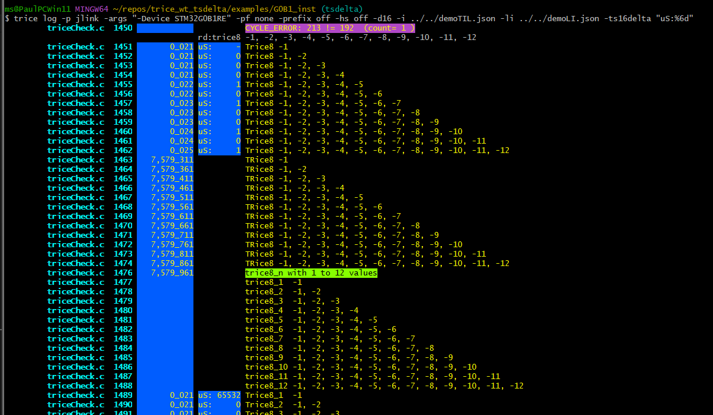

2) Same as 1) but with continuously colored row.

```bash
trice log -p jlink -args "-Device STM32G0B1RE" -pf none -prefix off -hs off -d16 -i ../../demoTIL.json -li ../../demoLI.json -ts16delta "uS:%6d" -ts0delta "time:         "
```

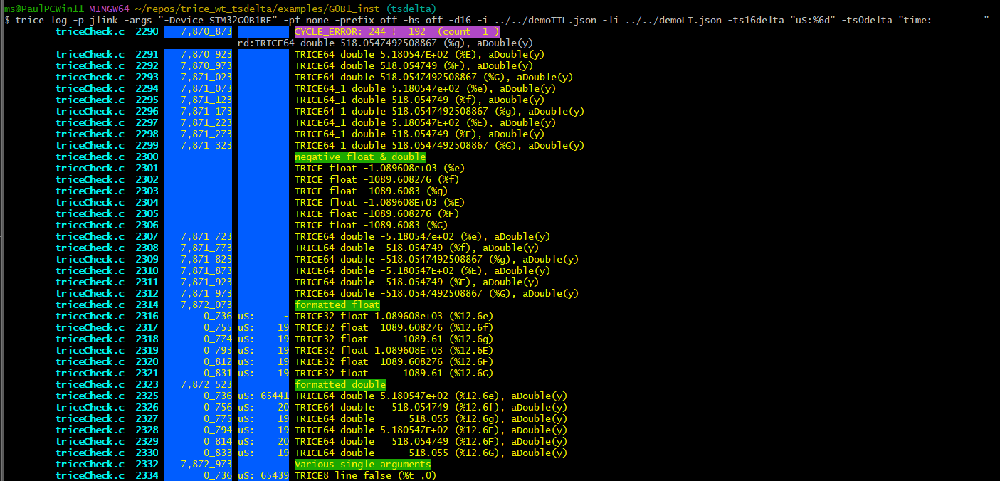

3) Add a column to show just the ts32 delta values (microseconds). 

```bash
 trice log -p jlink -args "-Device STM32G0B1RE" -pf none -prefix off -hs off -d16 -i ../../demoTIL.json -li ../../demoLI.json -ts32delta "att:%4d"
```

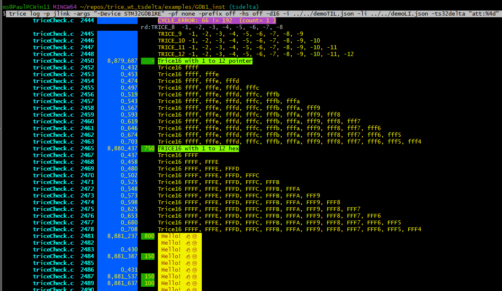

4) Show only ts16 absolute values in microseconds together with ts32delta values. Because `-ts16delta ""` is passed explicitly, ts16 lines get no delta placeholder. Lines without timestamps are decorated explicitly to show formatting options.

```bash
trice log -p jlink -args "-Device STM32G0B1RE" -pf none -prefix off -hs off -d16 -i ../../demoTIL.json -li ../../demoLI.json -ts32 "" -ts32delta "deb:%12d" -ts16 us -ts16delta "" -ts0 "rd:~~~~~~" -ts0delta "att:_____"
```

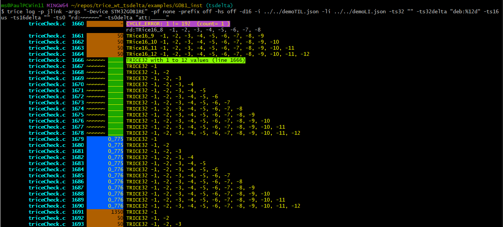

5) Show ts16 absolute values together with ts32delta values and explicit no-stamp separators. Again, `-ts16delta ""` suppresses any automatic placeholder on ts16 lines.

```bash
trice log -p jlink -args "-Device STM32G0B1RE" -pf none -prefix off -hs off -d16 -i ../../demoTIL.json -li ../../demoLI.json -ts32 "" -ts32delta "att:%12d" -ts16 us -ts16delta "" -ts0 "|    " -ts0delta "     |"
```

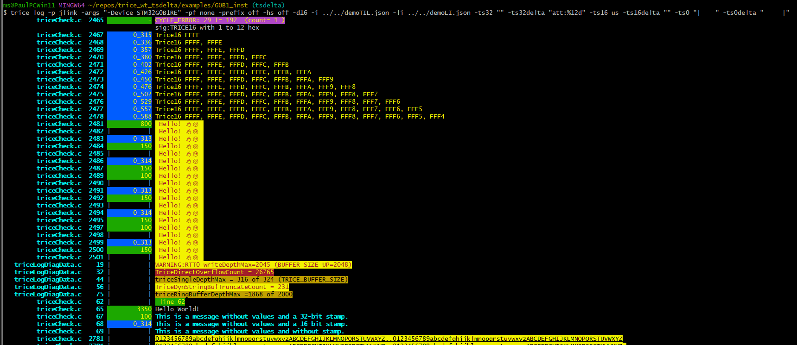

6) Show ts32 as epoch followed by ts32delta in seconds. (Hint: In translator.go inside function formatTargetStamp32 the call of `correctWrappedTimestamp(uint32(timestamp))` was temporarily deactivated for this check)

```bash
trice log -p jlink -args "-Device STM32G0B1RE" -pf none -prefix off -hs off -d16 -i ../../demoTIL.json -li ../../demoLI.json -ts32 "epoch2006-01-02_15:04:05" -ts32delta "note:%4d" -ts0delta "           "
```

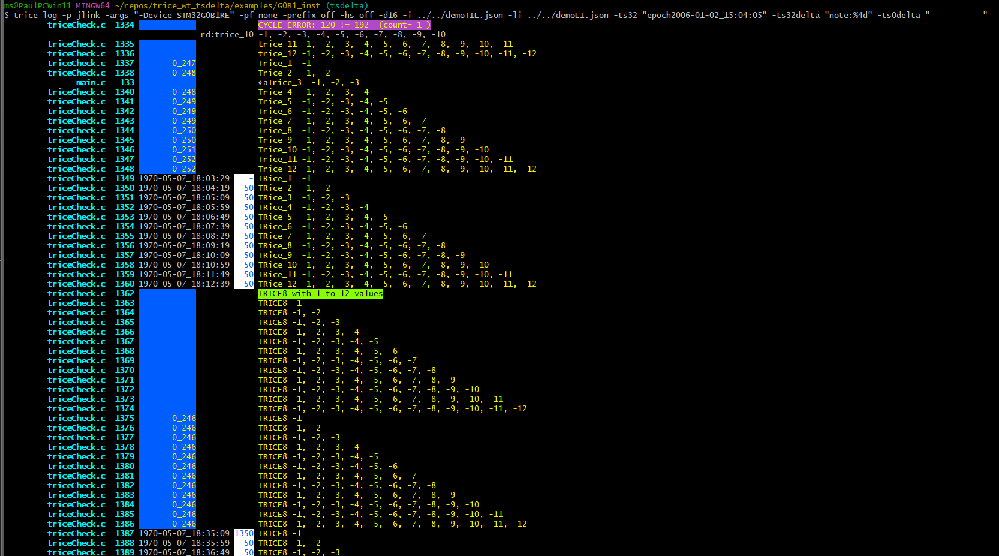

7) Like 6 but additionally show ts16delta in microseconds

```bash
trice log -p jlink -args "-Device STM32G0B1RE" -pf none -prefix off -hs off -d16 -i ../../demoTIL.json -li ../../demoLI.json -ts32 "epoch2006-01-02_15:04:05" -ts32delta "note:%5d" -ts16delta us -ts0delta "            "
```

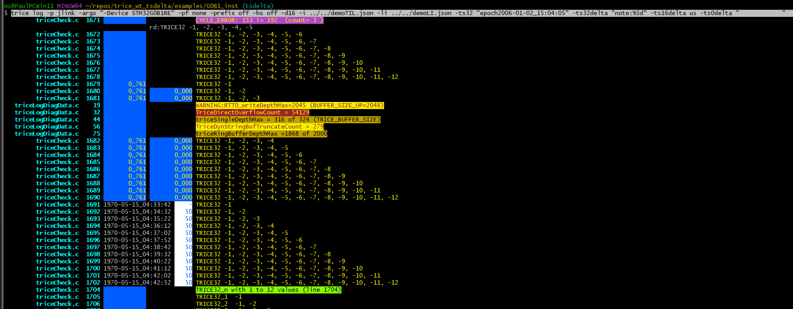

#### 18.2.10. <a id="summary"></a>Summary

The `tsdelta` switches make timestamp display more flexible by separating:

* absolute time representation
* delta time representation
* alignment of messages without target timestamps

This allows `trice` output to be tailored for debugging, profiling, timing analysis, and mixed absolute/delta log views without changing the target-side encoding.

<p align="right">(<a href="#top">back to top</a>)</p>

## 19. <a id="binary-encoding"></a>Binary Encoding

### 19.1. <a id="symbols"></a>Symbols

| Symbol  | Meaning                                                                      |
|:-------:|------------------------------------------------------------------------------|
|   `i`   | ID bit                                                                       |
|   `I`   | `iiiiiiii` = ID byte                                                         |
|   `n`   | number bit                                                                   |
|   `z`   | count selector bit                                                           |
|   `s`   | stamp selector bit                                                           |
|   `N`   | `znnnnnnnn` = count selector bit plus 7-bit number byte                      |
|   `c`   | cycle counter bit                                                            |
|   `C`   | z==0 ? `cccccccc` : `nnnnnnnn` = cycle counter byte or number byte extension |
|   `t`   | (time)stamp bit                                                              |
|   `T`   | `tttttttt` = (time)stamp byte                                                |
|   `d`   | data bit                                                                     |
|   `D`   | `dddddddd` = data byte                                                       |
|  `...`  | 0 to 32767 data bytes                                                        |
| `"..."` | format string                                                                |
|   `W`   | bit width 8, 16, 32 or 64 (uW stands for u8, u16, or u64)                    |
|   `x`   | unspecified bit                                                              |
|   `X`   | =`xxxxxxxx` unspecified byte                                                 |

### 19.2. <a id="package-format"></a>Package Format

* Because of **TCOBS** or **COBS** package framing, package sizes are detectable by the Trice tool without additional length information from the payload itself.
* A decoded frame of 0 bytes is ignored. A 1-byte frame is unsupported. Frames with 2 or 3 bytes are selector-0 candidates when their selector bits are `00`; valid counted `typeX0` handling then still depends on the embedded count. Otherwise they are unsupported short user data.

  | bytes       | Comment                                                                                                       |
  |:------------|---------------------------------------------------------------------------------------------------------------|
  | ` `         | This is an empty package, which can have also a meaning. It is detectable by 2 consecutive 0-delimiter bytes. |
  | `X`         | 1-byte message, unsupported and reserved for extensions or user data                                          |
  | `X` `X`     | 2-byte message, counted `typeX0` if selector `00`, otherwise unsupported and reserved                         |
  | `X` `X` `X` | 3-byte message, counted `typeX0` if selector `00`, otherwise unsupported and reserved                         |

* In decoded frames with at least 2 bytes, the first 2 bytes contain 2 selector bits at the most significant position in the known endianness.
* The `0` selector is usable for any user encoding. The Trice tool handles such packages according to the CLI switch `-typeX0`.
* The `1`, `2` and `3` selector bits are followed by the 14-bit ID.

  | 16-bit groups                      | Selector (2 msb) | Comment                                                                                   | Endianness sizes                |
  |:-----------------------------------|:----------------:|-------------------------------------------------------------------------------------------|:--------------------------------|
  | _________ `00xxxxxxX ...`          |        0         | [typeX0 record](#typex0-records), >= 2-byte message, reserved for extensions or user data | ___ `u16 ?...?`                 |
  | _________ `01iiiiiiI NC  ...`      |        1         | >= 4-byte message, Trice format without     stamp                                         | ___ `u16 u16 [uW] ... [uW]`     |
  | _________ `10iiiiiiI TT NC ...`    |        2         | >= 4-byte message, Trice format with 16-bit stamp                                         | ___ `u16 u16 u16 [uW] ... [uW]` |
  | `10iiiiiiI 10iiiiiiI TT NC ...`    |        2         | First 16bit are doubled. Info over `-d16` trice switch.                                   | `u16 u16 u16 u16 [uW] ... [uW]` |
  | _________ `11iiiiiiI TT TT NC ...` |        3         | >= 4-byte message, Trice format with 32-bit stamp                                         | ___ `u16 u32 u16 [uW] ... [uW]` |

* The selector `2` encoding has 2 possibilities. When using `TRICE_DIRECT_SEGGER_RTT_32BIT_WRITE` or encryption, for alignment reasons the first 16bit ID field is doubled. The Trice tool discards these 2 doubled bytes when the CLI switch `-d16` is given or encryption is active.
* Default endianness is little endian as most MCUs use little endianness. Otherwise the `-triceEndianness=bigEndian` CLI switch is needed.
* The receiving tool first evaluates the 2 selector bits and follows these rules:
  * 0: handle it according to `-typeX0` or report an error and ignore the whole package when no X0 handling is selected.
  * 1:                                    next 14 bits are the ID                                                              followed by 2 bytes u16=NC and optional parameter values. Package size is >= 4 bytes.
  * 2 and `-d16` CLI switch not provided: next 14 bits are the ID                            and convert then u16=TT=stamp16   followed by 2 bytes u16=NC and optional parameter values. Package size is >= 6 bytes.
  * 2 and `-d16` CLI switch     provided: next 14 bits are the ID, discard 2 following bytes and convert then u16=TT=stamp16   followed by 2 bytes u16=NC and optional parameter values. Package size is >= 8 bytes.
  * 3:                                    next 14 bits are the ID                            and convert then u32=TTTT=stamp32 followed by 2 bytes u16=NC and optional parameter values. Package size is >= 8 bytes.
* Use the ID to get parameter width `W`=8,16,32,64 and parameter count from file *til.json*, then convert the payload accordingly.
  * Within one trice message the parameter bit width `W` does not change.

> Example for Trices without timestamps

* The ([T]COBS decoded) binary Trice data normally starts with a little endian u16 Trice ID value.
* All following values are encoded in the known endianness.

| value   | byte offset | type              | comment                                                                                                                                                                                                                                                                                                                        |
|---------|------------:|-------------------|--------------------------------------------------------------------------------------------------------------------------------------------------------------------------------------------------------------------------------------------------------------------------------------------------------------------------------|
| IdLo    |           0 | byte              | The first byte is always the Trice ID lower 8 bits.                                                                                                                                                                                                                                                                            |
| IdHi    |           1 | byte              | The second byte 2 most significant bits are `01` and the 6 least significant bits are the Trice ID upper 6 bits.                                                                                                                                                                                                               |
| NC      |           2 | u16               | The most significant bit is the count selector bit `z` and usually **0**, telling, that the following 7 bits are the payload byte count and that the 8 least significant bits are the cycle counter. If `z` is **1**, the current Trice contains no cycle counter and has a 15-bit payload count instead (for payloads > 127). |
| payload |           4 | u8\|u16\|u32\|u64 | The payload contains a number of equal size values.                                                                                                                                                                                                                                                                            |

#### 19.2.1. <a id="typex0-records"></a>typeX0 Records

The user can insert any data with a well-defined structure into the Trice data stream. When interpreting the Trice binary data, the Trice tool handles selector-0/typeX0 records according to the CLI switch `-typeX0`.

One possible use case is to have user **printi** statements parallel to Trices (see [Legacy User Code Option Print Buffer Wrapping and Framing](#legacy-user-code-option-print-buffer-wrapping-and-framing)). For the counted typeX0 variant, the user prepends a generated **printi** buffer with its payload size as a 16-bit count smaller than `16384`. See [./_test/userprint_dblB_de_tcobs_ua/TargetActivity.c](../_test/userprint_dblB_de_tcobs_ua/TargetActivity.c) for an implementation option. See chapter [20. typeX0 User Packets](#typex0-user-packets) for further details.

#### 19.2.2. <a id="framing---none-or-with-cobs-or-tcobs-encoding"></a>Framing - NONE or with COBS or TCOBS encoding

> Summary Information for Trice Data Parsing

* With COBS or TCOBS framing (TCOBS includes compression):
  * 1-3 package delimiter zeroes possible between 2 packages.
  * One or more Trices packed together and only at the package end are 0-3(7) padding zero bytes possible.
  * Counted `typeX0` records can occur together with normal Trices in one package because their length is checkable. X0 formats without length information need their own package framing.

* With NONE framing:
  * With XTEA encryption and `-pf=none` or `-pf=none64` 64-bit alignment: 0-7 zero bytes after a single Trice.
  * Without encryption the stream is compact or 32-bit aligned. That does not change for one session and is detectable.
    * `-pf=none` -> detect stream (deprecated, only for backward compatibility)
    * `-pf=none8` -> stream is compact
    * `-pf=none32` -> stream is 32-bit aligned
  * A stream with alignment is allowed to have only a single Trice between two alignments. An alignment is just a multiple of 4(8)-bytes distance.
  * These combinations are forbidden, because we cannot safely know the actual padding count: `|TriceATriceB0|TriceC00|` <- Is the `0` after `TriceB` a padding zero or part of `TriceC`?
    * Framing NONE && TRICE_MULTI_PACK_MODE && 32-bit write
    * Framing NONE && TRICE_MULTI_PACK_MODE && XTEA encryption

> Details

* For maximum storage speed each Trice message starts at a 32-bit boundary and has 1-3 padding bytes inside the target device RAM.
* The macro `TRICE_LEAVE` and/or function `TriceTransfer` ([Trice Target Code Implementation](#trice-target-code-implementation)) are the Trice data output.
  * In **direct mode** each single message gets its own transfer buffer.
  * In **deferred mode** any count of Trice messages is in the transfer buffer.
  * Additional counted **typeX0 records** can share a transfer buffer with normal Trices. Non-counted selector-0 user data needs a separate transfer buffer because its length is not checkable.

<!--
* To create the transfer buffer, there are different policies possible:
  1. **TRICE_MULTI_PACK_MODE**: Compact RAM buffer by removing all padding bytes, encode it as a single (T)COBS package, append one 0-delimiter and transmit. This allows to reduce the transmitted data amount by paying the price of possibly more data loss in case of an error. Also the Trice tool internal data interpretation can perform less checks. TRICE_MULTI_PACK_MODE makes only sense for deferred output.
     * When Trice is used without framing, the data stream interpretation is possible, but not 100% secure for 32-bit writes, because in some cases we do not know, if 1-3 zeroes after a Trice, part of those are padding bytes or not. We allow such configuration, but will issue a warning: *Combination TRICE_MULTI_PACK_MODE && framing NONE && 32-bit write is depreachiated.*
  2. **TRICE_SINGLE_PACK_MODE**: Encode each Trice separate as (T)COBS, append a 0-delimiter for each and pack them all together before transmitting. This increases the transmit data slightly but minimizes the amount of lost data in case of a data disruption.
     * When Trice is used without framing, the data stream interpretation is possible, but not 100% secure for 32-bit writes, because in some cases we do not know, if 1-3 zeroes after a Trice, part of those are padding bytes or not. To avoid that specify `-pf=none32`. We allow such configuration, because even with `pf=none` a one-time detection will work well in almost every case.
  3. Additional **typeX0 records**: Those messages are not mixed into (T)COBS packages. They get their own (T)COBS packages.
-->

*Framing NONE Overview Table:*

| *mode* | *packed* | `-pf=`   | encr | *wr* | *use* | pad | stream  | remark   |
|--------|----------|----------|------|------|-------|-----|---------|----------|
| *di*   | *single* | `none32` | NONE | *32* | *32*  | 0-3 | aligned | done     |
| *de*   | *single* | `none8`  | NONE | *8*  | *8*   | 0   | compact | done     |
| *de*   | *single* | `none32` | NONE | *8*  | *32*  | 0   | aligned | **plan** |
| *de*   | *multi*  | `none8`  | NONE | *8*  | *8*   | 0   | compact | done     |
| *de*   | *multi*  | `none32` | NONE | *8*  | *32*  | 0   | unknown | forbid   |
| *de*   | *multi*  | `none`   | NONE | *8*  | *32*  | 0   | unknown | forbid   |
| *di*   | *single* | `none64` | XTEA | *32* | *32*  | 0-7 | aligned | done     |
| *de*   | *single* | `none64` | XTEA | *8*  | *8*   | 0-7 | aligned | done     |
| *de*   | *single* | `none64` | XTEA | *8*  | *32*  | 0-7 | aligned | **plan** |
| *de*   | *multi*  | `none`   | XTEA | *8*  | *8*   | 0-7 | unknown | forbid   |
| *de*   | *multi*  | `none`   | XTEA | *8*  | *32*  | 0-7 | unknown | forbid   |

* wr: The internal write function bit width.
* use: The possible user write function bit width (auxiliary write)


<p align="right">(<a href="#top">back to top</a>)</p>

## 20. <a id="typex0-user-packets"></a>typeX0 User Packets

Trice already has buffer macros for transferring runtime data buffers. `triceN` transfers a byte buffer as a counted string, and `trice8B`, `trice16B`, `trice32B`, `trice64B` and `triceB` transfer buffers as sequences of equally sized values formatted on the host side. These macros are the preferred choice when the data belongs to a normal Trice message and should use the usual Trice ID, `til.json` entry and format string handling.

`typeX0` is an additional, more decoupled way to move user data through the same Trice transport path. It uses selector bits `00` in the first 16-bit word, interpreted in the configured Trice byte order (default little endian), and therefore carries no 14-bit Trice ID. The host-side meaning is selected by the Trice tool option `-typeX0=...`. This makes it useful for user payloads that should share the same UART/RTT/file/framing interface as Trice messages, but should not require an ID, a `til.json` entry or a fixed Trice format string.

Important: The `typeX0` packages do not influence the cycle counter and do not carry a cycle counter value (or you implement your own). They also do not carry a Trice ID, target timestamp or location information normally. If log metadata columns such as `-showID`, `-li` or target timestamps are enabled, X0 output keeps the column alignment but blanks the actual values.

The current implementation supports `-typeX0=counted:<formatstring>`. This is intentionally just one example implementation of the selector-0 extension space. Other interpretations, for example forwarding, extended counted buffers or application-specific binary formats, can be added later without changing regular Trice messages. The counted implementation is expected to cover most use cases.

### 20.1. <a id="packet-classification"></a>Packet Classification

For each decoded record or package, the receiver first checks the available length:

```text
len == 0:
    invalid or ignored transport artifact

len == 1:
    error: unsupported short packet

len >= 2:
    read first uint16 using the configured Trice byte order
    selector = firstWord >> 14

    if selector == 0:
        handle as typeX0 packet

    else if len < 4:
        error: unsupported short packet

    else:
        handle as regular Trice packet
```

Summary:

| Packet length | Selector | Packet Type        | Trice Tool Action       |
|--------------:|---------:|--------------------|-------------------------|
|           `0` |        - | `user0B`           | ignored (reserved)      |
|           `1` |        - | `user1B`           | error (reserved)        |
|        `2..3` |   `!= 0` | `user2B`, `user3B` | error (reserved)        |
|        `>= 2` |      `0` | `typeX0`           | according `-typeX0` CLI |
|        `>= 4` |   `!= 0` | regular Trice      | default                 |

Packet length 0 is possible when framing like COBS is used and 2 delimiter bytes (usually 0) occur without a package in between.

Short user packets such as user0B, ..., user3B are intentionally not supported. They can be added later if a concrete requirement appears. They do not carry length information and therefore cannot safely share a framed group with following records.

Short non-X0 user packets are not supported initially. They should be reported as errors and can be specified later if a real requirement appears.

### 20.2. <a id="the-typex0-counted-format"></a>The typeX0 Counted Format

A counted `typeX0` record starts with one 16-bit word:

```text
bits 15..14 = 00
bits 13..0  = count
```

The lower 14 bits contain the payload byte count:

```text
firstWord = count
count     = firstWord & 0x3fff
payload   = record[2 : 2+count]
```

The logical payload length is exactly `count` bytes. Counts `0` and `1` are valid. Little endian examples without alignment padding are:

```text
00 00                         count 0, empty payload
01 00 xx                      count 1, one payload byte, little endian example
02 00 xx yy                   count 2, two payload bytes, little endian example
```

The optional target helper `src/triceX0.c` writes into the normal Trice target buffer and keeps the next record 32-bit aligned. Therefore its physical buffer use is:

```text
physicalRecordLen = align4(2 + count)
```

The zero padding bytes are not part of the payload. A host decoder shall use the count field to determine the payload and shall skip alignment padding where required by the decoded Trice buffer stream. Padding bytes written by the target helper are zero. The decoder consumes alignment padding only when the expected bytes are present and zero; otherwise following bytes can be the next record in a mixed package. Zero-only padding after a regular framed Trice message is removed before selector-0/typeX0 handling.

Malformed counted X0 examples are:

```text
available bytes < 2 + count
alignment padding is consumed but not zero
```

Configuration errors such as an unsupported `-typeX0` mode are reported separately.

### 20.3. <a id="cli-option--typex0"></a>CLI Option `-typeX0`

The Trice tool option is:

```text
-typeX0=[mode:]<format>
```

Supported values:

```text
-typeX0=error
```

Treat every `typeX0` packet as an error after normal Trice padding has been removed. This is also the default when `-typeX0` is not specified.

```text
-typeX0=counted:ignore
-typeX0=ignore
```

Silently discard valid counted `typeX0` packets. Malformed X0 packets are still errors.
The second form is a shorthand for `counted:ignore`.

```text
-typeX0=all:ignore
```

Silently discard the complete decoded selector-0 package without checking an X0 length. This is only valid for non-mixed X0 packages. If normal Trices or other counted X0 records are behind the first selector-0 word in the same decoded package, they are discarded too.

```text
-typeX0=counted:<format>
-typeX0=<format>
```

Interpret `typeX0` packets as counted payloads and print the payload with Go `fmt`. The second form is a shorthand for `counted:<format>`.
The shorthand form is valid only when `<format>` contains no colon. If the format string contains a colon, use the explicit `counted:` prefix.

A future `mode:argument` prefix is a possible extension.

The format receives exactly one Go argument:

```go
payload []byte
```

Conceptually:

```go
fmt.Fprintf(out, format, payload)
```

Go `fmt` consumes arguments, not bytes. Therefore a normal format should contain one non-indexed formatting verb. To print the same payload more than once, use Go's explicit argument index syntax.

Examples:

```text
-typeX0="%s"
```

Print payload bytes as a string.

```text
-typeX0="% x\n"
```

Print payload bytes as lower-case hex with spaces.

```text
-typeX0="counted:X0: %q\n"
```

Print the payload quoted.

```text
-typeX0="%[1]s %[1] x\n"
```

Print the same payload twice, once as string and once as spaced hex.

### 20.4. <a id="typex0-target-code"></a>typeX0 Target Code 

`typeX0` is a free format selector-0 space the user can define. The only protocol requirement is that the 2 most significant bits in the very first `uint16_t` word, in the configured endianness, are zero. If the encoding carries length information, as the `counted` example does, multiple X0 records and normal Trice messages can be interleaved in one framed package. If no length information is encoded in the X0 record, each X0 record needs individual framing with COBS, TCOBS or another application-defined framing method.

`triceX0.c` contains the counted buffer reference implementation. The Trice tool then needs the CLI switch `-typeX0=[mode:]<format>`, where `counted` is the default mode for values without a colon. Examples:

| CLI switch `trice log ...`     | Meaning                                                             |
|--------------------------------|---------------------------------------------------------------------|
| `-typeX0=all:ignore`           | ignore the complete non-mixed X0 package without length checking    |
| `-typeX0=counted:ignore`       | just check for valid length and ignore                              |
| `-typeX0=ignore`               | just check for valid length and ignore (short for `counted:ignore`) |
| `-typeX0=counted:"sig:%60s\n"` | print a right-aligned string with tag `sig:`                        |
| `-typeX0="%60s\n"`             | print a right-aligned string without a tag (short form, no colon)   |
| `-typeX0="sig:%60s\n"`         | invalid `sig:` mode because shorthand cannot contain a colon        |
| `-typeX0=sig:"%60s\n"`         | invalid `sig:` mode                                                 |
| `-typeX0=forward:<ADDRESS>`    | send X0 package to ADDRESS (not implemented)                        |

Hint: Depending on shell quoting, these forms can all pass the same raw option value `counted:sig:%60s\n` to the CLI parser:

* `-typeX0=counted:"sig:%60s\n"`
* `-typeX0="counted:sig:%60s\n"`
* `-typeX0=counted:sig:%60s\n`

The `typeX0` CLI parser takes the string in front of the first colon as typeX0 mode. Therefore format strings containing a colon cannot be given in the short form.

Known modes are:
- `error`: The Trice tool reports `typeX0` as an error by default when no `-typeX0` CLI switch is given.
- `counted`: explicit mode for counted X0 records and default mode for `-typeX0=` values without a colon.
- `all`: exact `all:ignore` mode for discarding a complete non-mixed X0 package.
- `forward`: possible extension for `trice log` functionality, not specified or implemented yet.

This can be extended in many ways. `typeX0` is just a way to mix application-defined binary data with Trice messages over the same output channel. Many cases are probably already covered by using Trice macros such as `trice8B`, `trice16B`, `trice32B`, `trice64B`, `triceS`, `triceN`, ...

#### 20.4.1. <a id="target-side-counted-helper"></a>Target-side counted helper

The counted helper is optional target code and lives in:

```text
src/triceX0.h
src/triceX0.c
```

The public function is intentionally small:

```c
void triceX0(const void* buf, uint16_t len);
```

In the counted mode (default) it writes selector `00`, stores the resulting payload length in the lower 14 bits and appends that many payload bytes. If `len` exceeds the supported range, the helper truncates to the smaller limit of `TRICE_SINGLE_MAX_SIZE - 5` and `0x3fff`, increments the dynamic buffer truncation diagnostic counter, and sends the truncated payload. It uses the normal Trice critical-section model with `TRICE_ENTER` / `TRICE_LEAVE` and the normal Trice output path. It does not use `TRICE_PUT_BUFFER()` after `TRICE_PUT16()`, because X0 has only a 2-byte header and the physical record size must be aligned as `align4(2 + len)`.

For projects or tests that want this helper, define in `triceConfig.h`:

```c
#define TRICE_TX_X0_COUNTED_BUFFER_SUPPORT 1
```

A project can also provide its own selector-0 writer. The counted helper is only the reference implementation for the `-typeX0=counted:<format>` use case.

#### 20.4.2. <a id="typex0-build-switches"></a>typeX0 Build Switches

The counted typeX0 helper is controlled independently from the normal Trice macro switch:

```c
#define TRICE_TX_X0_COUNTED_BUFFER_SUPPORT 1
```

When `TRICE_TX_X0_COUNTED_BUFFER_SUPPORT == 1`, the target-side function

```c
void triceX0(const void* buf, uint16_t len);
```

is a real function and writes counted selector-0 records into the configured Trice output backend. The project must then compile `src/triceX0.c` together with the other Trice target sources. When `TRICE_TX_X0_COUNTED_BUFFER_SUPPORT == 0`, `triceX0()` is an inline no-op helper and no X0 backend code is needed.

This switch is intentionally independent from `TRICE_OFF`:

| `TRICE_OFF` | `TRICE_TX_X0_COUNTED_BUFFER_SUPPORT` | Setting                                                                 |
|-------------|--------------------------------------|-------------------------------------------------------------------------|
| `== 0`      | `== 0`                               | normal Trice macros are active, `triceX0()` is a no-op                  |
| `== 0`      | `== 1`                               | normal Trice macros are active, `triceX0()` emits counted X0 records    |
| `== 1`      | `== 0`                               | normal Trice macros are off, `triceX0()` is a no-op                     |
| `== 1`      | `== 1`                               | normal Trice macros are off, `triceX0()` still emits counted X0 records |

The 4th combination is useful for applications that want to use only selector-0 user packets while keeping all normal Trice statements compiled out. The Trice tool can still scan normal Trice statements in the source code for ID maintenance, but the compiler receives no normal Trice output code from them.

`TRICE_CLEAN` is a tool-managed source state and should not be used as an application switch. `trice clean` may set it to `1` to make cleaned source files compile without inserted IDs and without editor warnings; `trice insert` sets it back to `0`. With `TRICE_TX_X0_COUNTED_BUFFER_SUPPORT == 1`, the counted X0 helper is intended to compile in both states. Normal Trice macros remain disabled while `TRICE_CLEAN == 1`, but `triceX0()` stays available as a real function.

In short:

* `TRICE_OFF` controls normal Trice macro code generation.
* `TRICE_CLEAN` reflects the insert/clean source state.
* `TRICE_TX_X0_COUNTED_BUFFER_SUPPORT` controls whether `triceX0()` is a real counted X0 writer.

A project configuration that wants counted X0 support and still allows command-line overrides can use:

```c
#ifndef TRICE_TX_X0_COUNTED_BUFFER_SUPPORT
#define TRICE_TX_X0_COUNTED_BUFFER_SUPPORT 1
#endif
```

Then builds can explicitly test or select the behavior with compiler defines such as:

```bash
-DTRICE_OFF=1 -DTRICE_TX_X0_COUNTED_BUFFER_SUPPORT=1
-DTRICE_OFF=1 -DTRICE_TX_X0_COUNTED_BUFFER_SUPPORT=0
```

#### 20.4.3. <a id="typex0-usage-in-examplesg0b1_inst"></a>`typeX0` Usage in `./examples/G0B1_inst`

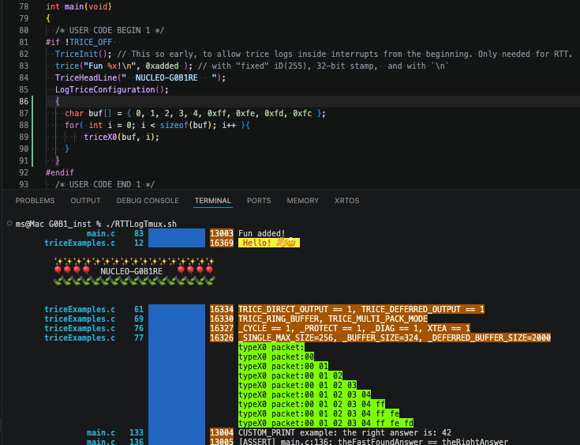

The point here is that with CLI switch `-typeX0=ignore` the counted X0 packages are invisible after their length has been checked. A future `-typeX0=forward:<ADDRESS>` option could be implemented as a `trice log` extension.

### 20.5. <a id="go-implementation-layout"></a>Go implementation layout

Keep the `typeX0` mode parsing and handling centralized so later modes can be added without spreading switch logic through the decoder.

Code layout:

```text
internal/args/...
    define CLI flag -typeX0 and help text

internal/decoder/typeX0.go
    hold the configured TypeX0 value
    parse error, ignore, all:ignore, counted:<format>, <format>
    format counted payloads with Go fmt
    reject unsupported mode prefixes clearly

internal/trexDecoder/trexDecoder.go
    detect selector == 0
    pass the remaining record buffer to the typeX0 helper
    append returned output to the decoder result
    consume the logical X0 record and zero alignment padding when present
```

Unsupported future modes shall fail with a clear diagnostic, for example:

```text
unsupported typeX0 mode "forward"
```

This structure keeps future extensions local. For example:

```text
-typeX0=forward:<ADDRESS>
```

could later forward valid X0 payload bytes to another sink instead of formatting them.

### 20.6. <a id="tests"></a>Tests

The counted X0 path is tested through the existing `_test/testdata/triceCheck.c` mechanism, because these test lines are processed by many Trice configurations.

The shared test configurations that build `triceCheck.c` define:

```c
#define TRICE_TX_X0_COUNTED_BUFFER_SUPPORT 1
```

`src/triceX0.c` is compiled into the CGO test target through the master file `_test/testdata/cgoPackage.go`. Generated `generated_cgoPackage.go` copies are refreshed from that master file by `scripts/_330_renew_ids_and_refresh_tests.sh`.

The X0 block in `_test/testdata/triceCheck.c` is guarded by `TRICE_TX_X0_COUNTED_BUFFER_SUPPORT == 1` and intentionally mixes different counted X0 lengths with normal Trices:

```c
#if TRICE_TX_X0_COUNTED_BUFFER_SUPPORT == 1
        break; case __LINE__: triceX0(x0Payload, 0);
        break; case __LINE__: triceX0(x0Payload, 5); trice8B("wr:X0-B: %02x\n", x0Payload, 5);
        break; case __LINE__: triceX0(x0Payload, 2); triceX0(x0Payload + 2, 4); trice("wr:X0 tail\n");
#endif
```

The current shared CGO test option formats the X0 payload with the `sig:` prefix:

```text
counted:sig:% x\n
```

For maintenance, keep these parts aligned:

1. The master CGO file includes `../../src/triceX0.c`.
2. `triceCheck.c` uses `TRICE_TX_X0_COUNTED_BUFFER_SUPPORT == 1` as guard.
3. The X0 test block uses different lengths and mixed packages with `trice`, `triceS`, `TriceS`, `trice8B`, `Trice8B` and `TRice8B`.
4. `_test/.../triceConfig.h` files that build `triceCheck.c` enable `TRICE_TX_X0_COUNTED_BUFFER_SUPPORT`.
5. `_test` CGO checks set `decoder.TypeX0` to `counted:sig:% x\n`.
6. The full `_test/` matrix remains the final coverage check.


Additional focused Go unit tests cover:

```text
no -typeX0        -> X0 packet is an error
-typeX0=error     -> X0 packet is an error
-typeX0=ignore    -> valid X0 packet produces no output
-typeX0=all:ignore -> complete selector-0 package is consumed without counted parsing
-typeX0="%s"      -> payload is printed as string
-typeX0="[%s]"    -> payload is printed with formatting
-typeX0="% x"     -> payload is printed as spaced hex
-typeX0=counted:sig:%s -> explicit counted mode is needed when the format contains a colon
-typeX0=sig:%s   -> unsupported mode "sig"
malformed X0      -> error, also with -typeX0=ignore
unsupported mode  -> clear error
mixed package     -> counted X0 can be followed by a regular Trice in framed data
NONE framing      -> counted X0 consumes zero alignment padding when present
```

### 20.7. <a id="initial-scope"></a>Initial scope

The initial implementation includes only:

```text
selector-0 detection for records with len >= 2
counted X0 payloads
-typeX0=error as default
-typeX0=counted:ignore
-typeX0=ignore as counted shorthand
-typeX0=all:ignore
-typeX0=counted:<format>
-typeX0=<format> as counted shorthand only when <format> contains no colon
errors for unsupported short non-X0 packets
clear errors for malformed X0 packets and unsupported modes
```

No `counted32`, `forward`, JSON descriptor, plugin interface or `user1B` / `user2B` / `user3B` handling is part of the initial scope.

<p align="right">(<a href="#top">back to top</a>)</p>

## 21. <a id="trice-decoding"></a>Trice Decoding

The 14-bit IDs are used to display the log strings. These IDs are pointing in two reference files.

### 21.1. <a id="trice-id-list-tiljson"></a>Trice ID list til.json

* This file integrates all firmware variants and versions and is the key to display the message strings. With the latest version of this file all previous deployed firmware images are usable without the need to know the actual firmware version.
* A compact C metadata table can be generated to help write a decoder or format buffered Trices on the target. First run `trice insert` or `trice bind`, then use `trice generate -src <source> -logC[=<output.c>]`. That can be interesting in environments where Go-compiled binaries are not executable, such as [PCs running QNX OS](https://github.com/rokath/trice/discussions/263#discussioncomment-4180692). See also chapter [Trice Generate](#trice-generate).

### 21.2. <a id="trice-location-information-file-lijson"></a>Trice location information file li.json

* If the generated `li.json` is available, the Trice tool automatically displays file name and line number. But that is accurate only with the exact matching firmware version. That usually is the case right after compiling and of most interest at the developers table.
* The Trice tool will silently not display location information, if the `li.json` file is not found. For in-field logging, the option `-showID "inf:%5d"` could be used. This allows later an easy location of the relevant source code.
* Another option is to record the binary trice messages (`trice log -p com1 -blf aFileName`) and to play them later with the Trice tool using the correct `li.json` (`trice log -p FILEBUFFER -args aFileName` ).
* Each entry contains only `File` and `Line`. `File` retains the normalized source path relative to `-liRoot`; the default root is the directory containing `li.json`.
* Use an explicit project root when `li.json` lives in a build directory but stable project-relative paths are wanted: `trice insert -li build/demoLI.json -liRoot .`.
* `File` uses `/` separators on every platform. Required leading `..` components are preserved. If Windows cannot make a source path relative across volumes, the normalized absolute path is stored.
* `trice log` and `tlog` show only the filename by default. `-liMaxDirs=N` adds at most `N` immediately preceding parent directories. Leading `..` components are never displayed or counted.
* The v1.3.0 option `-liPath` is replaced by `-liRoot` for storage and `-liMaxDirs` for display. Both v1.3.0 and the current location files use `File` and `Line`.
* The Trice repository uses `-liRoot .` while generating the shared `demoLI.json`, so all stored paths remain relative to the repository root across supported platforms.

<p align="right">(<a href="#top">back to top</a>)</p>

## 22. <a id="trice-id-numbers"></a>Trice ID Numbers

### 22.1. <a id="id-number-selection"></a>ID number selection

* The default encoding TREX supports 14-bit IDs, so over 16000 IDs possible. Other encodings can work with other ID sizes.
* `trice("Hi!\n");` ➡ `trice i` ➡ `trice( iD(12345), "Hi!\n");` ➡ `trice c` ➡ `trice("Hi!\n");`
* The **ID** `12345` is a number assigned to `trice( "Hi!\n");` in the above example.
  * It is a so far unused number, according to rules you can control:
    * The `-IDMethod` switch allows a selection method for new IDs.
      * Per default new IDs determined randomly to keep the chance low, that several developers grab the same ID.
      * Example: `trice insert -IDMin 1000 -IDMethod upward` will choose the smallest free ID >= 1000.
        * This allows to use the ID space without wholes.
    * The `-IDMin` and `-IDMax` switches are usable to control the ID range, a new ID is selected from, making it possible to divide the ID space. Each developer can gets it region.
      * Example: `trice insert -IDMin 6000 -IDMax 6999` will choose new randomly IDs only between 6000 and 6999.
* It is possible to give each Trice tag an **ID** range making it possible to implement Trice tag specific runtime on/off on the target side if that is needed. This could be interesting for routing purposes also. Please run `trice help -insert` and read about the `-IDRange` switch for more details.

#### 22.1.1. <a id="trice-tool-internal-method-to-get-fast-a-random-id"></a>Trice tool internal Method to get fast a random ID

* Create Slice with numbers 1...16383
* Remove all used ID numbers from this slice
* Get random number between 0 and len(slice)
* remove this ID from slice and use it as new ID

### 22.2. <a id="id-number-usage-and-stability"></a>ID number usage and stability

* If you write `trice( "msg:%d", 1);` again on a 2nd location, the copy gets a different **ID**, because each Trice gets its own **ID**.
* If you change `trice( "msg:%d", 1);` to `trice8( "msg:%d", 1);`, to reduce the needed parameter space, a new **ID** is assigned. That is because the parameter bit width is implicit a part of the now changed Trice. If you change that back, the previous **ID** is assigned again.
* If you change `trice( "msg:%d", 1);` to `TRice8( "msg:%d", 1);`, to get a 32-bit stamp, the associated **ID** remains unchanged. That is because the optional stamp is not a part of the Trice itself.
* IDs stay constant and get only changed to solve conflicts.
* To make sure, a single ID will not be changed, you could change it manually to a hexadecimal syntax.
  * This lets the `trice insert` command ignore such Trice macros and therefore a full [til.json](../demoTIL.json) rebuild will not add them anymore. Generally this should not be done, because this could cause future bugs.
  * It is possible to assign an ID manually as decimal number. It will be added to the ID list automatically during the next `trice i|c` if no conflicts occur.
* If a Trice was deleted inside the source tree (or file removal) the appropriate ID stays inside the ID list.
* If the same string appears again in the same file this ID is active again.
* If a trice occurs more than one time, each occurrence gets a different ID. If then 2 of them disappear, their ID numbers stay in `til.json`. If then one of them comes back, it gets its ID back.

### 22.3. <a id="trice-id-0"></a>Trice ID 0

* The trice ID 0 is a placeholder for "no ID", which is replaced automatically during the next `trice insert` according to the used trice switches `-IDMethod`, `-IDMin` and `IDMax`.
  * It is sufficient to write the `TRICE` macros just without the `id(0),` `Id(0),` `ID(0),`. It will be inserted automatically according the `-defaultStampSize` switch. With `trice clean` these stay with 0-values in the source code to encode the intended stamp size.
  * It is recommended to use the `trice`, `Trice` and `TRice` macros instead of `TRICE`. They encode the stamp size in their names already. There may be cases, where the user prefers to use the code inserting macros `TRICE` to get maximum performnce.

<p align="right">(<a href="#top">back to top</a>)</p>

## 23. <a id="trice-id-management"></a>Trice ID management

### 23.1. <a id="trice-inside-source-code"></a>Trice inside source code

#### 23.1.1. <a id="trice-in-source-code-comments"></a>Trice in source code comments

* Trice macros commented out, are **visible** for the `trice insert` command and therefore regarded.
  * Example: `// trice("Hi!\n");` is still regarded by the `trice i`.
* During `trice insert` commented out Trice macros, are treated in the same way as active Trice macros. Even after deletion their content stays inside til.json. This is intensionally to get best stability across several firmware versions or variants.
* The trice tool does treat trice statements inside comments or excluded by compiler switches also.

#### 23.1.2. <a id="trice-parser-exclusion-markers"></a>Trice parser exclusion markers

Use `TRICE_INSERT_OFF` and `TRICE_INSERT_ON` markers to exclude a source section from `trice insert`, `trice clean`, `trice add` and ID refresh parsing.

```C
// TRICE_INSERT_OFF
TRice("This text is ignored by the trice tool.");
// TRICE_INSERT_ON
```

The markers are case-sensitive, must be written as comments, and affect only the Trice tool parser. `TRICE_INSERT_OFF` without a following `TRICE_INSERT_ON` disables Trice parsing until the end of the file. The marker state is local to the scanned file and does not affect source files including that file. This is useful for Trice target sources or other source sections containing Trice-like comments or helper macros that should not create or change IDs.

#### 23.1.3. <a id="different-ids-for-same-trices"></a>Different IDs for same Trices

Every active textual Trice site needs its own ID so that location information remains unambiguous. Copying a call with its explicit ID does not create shared ownership: `trice insert` resolves the duplicate and allocates or reuses another eligible ID.

Both `trice insert` and `trice bind` then order **identical, interchangeable Trices** by normalized relative file path, numeric line number, and position from left to right within the line. Paths use `/` separators and an ordinal, case-sensitive comparison (`A.c` precedes `a.c`), independent of locale. The root is `-liRoot`, or the directory containing the selected LI file by default; the absolute checkout directory does not determine the order. Overlapping `-src` roots visit each physical path only once.

Within each group, the IDs already selected by normal allocation are sorted numerically ascending and assigned to the sites in that order. Identical means the same normalized transport type and exact canonical format, including any structured field schema and Context Enrichment. Equal visible messages with different types or field names are separate groups. Existing tag-specific ID ranges still apply. New ID selection through `-IDMethod random`, `upward`, or `downward` is unchanged: this rule orders the selected pool; it does not introduce a new global allocation strategy or renumber unrelated Trices.

For example, assume these three IDs belong to one group:

| Source state | Site in path order | Assigned ID |
| --- | --- | ---: |
| Before | `b.c:10` | 100 |
| Before | `d.c:20` | 200 |
| After adding `a.c:5`, with ID 300 also selected | `a.c:5` | 100 |
| After | `b.c:10` | 200 |
| After | `d.c:20` | 300 |

Both existing sites may change IDs when an identical site is added, removed, or moved. This is intentional. An unchanged source selection with the same selected ID pool produces the same mapping on subsequent runs, regardless of scan-root order or worker completion. The same rule applies after Clean/Insert; Clean itself does not allocate IDs. An explicit ID in an Insert source is not a request to exempt that site from ordering. Bind changes its own generated descriptors and leaves Insert-owned source files and their IDs alone.

A partial scan orders only its selected sites. IDs recorded in the primary LI as belonging to files outside that selection, including excluded files, are reserved and cannot be taken by the selected sites. Keep the shared LI available for partial scans: without location data, ownership of unscanned IDs cannot be inferred from TIL alone. For one order across the whole project, scan the complete intended source tree. A rename can leave the old path recorded in LI; its ID stays reserved while another eligible ID is selected for the new path.

The final assignment is written consistently to Insert sources or Bind sidecars and to LI. Historical TIL mappings remain available for older recordings. Rebuild firmware after an assignment changes and retain the matching metadata for recordings whose exact old source positions matter.

The [behavioral tests](../internal/id/orderedIDs_test.go) cover group changes, partial scans, path and column order, cache reuse, and ownership. The [target/decoder integration](../internal/args/ordered_ids_test.go) checks actual C/C++ records from both workflows against the generated mapping and decoded fields.

#### 23.1.4. <a id="same-ids-for-different-trices"></a>Same IDs for different Trices

* If duplicate ID's with different format strings found inside the source tree (case several developers or source code merging) one ID is replaced by a new ID. The probability for such case is low, because of the default random ID generation.
* Also you can simply copy a Trice statement and modify it without dealing with the ID.
* The Trice tool will detect the 2nd (or 3rd) usage of this ID and assign a new one, also extending the ID list.
* That is done silently for you during the next `trice insert`.
* When you use the [Trice Cache](#trice-cache), the IDs are invisible and all happens in the background automatically.

#### 23.1.5. <a id="id-routing"></a>ID Routing

With `trice insert` or `trice bind`, `-IDRange tag:min,max` assigns a range to a complete [tag group](#trice-tags-color-and-weights). Register a free tag with `-ulabel` first; option order does not matter. Groups without a specific range use `-IDMin` through `-IDMax`.

Tag-specific ranges include both endpoints and must satisfy `1 <= min <= max <= 16383`. They must not overlap the general range or any other tag range. A shared endpoint is an overlap; adjacent disjoint ranges and a range containing one ID are valid. Two aliases of the same group cannot define two separate ranges. Missing parts, malformed numbers, unknown tags, reversed bounds, and out-of-range values are rejected before source, dictionary, or bind-artifact changes. All supplied rules are validated together.

```sh
trice insert -src src -IDMin 1000 -IDMax 1999 -IDRange err:10,99
```

The current policy also applies to IDs recovered from sources, location data, or the dictionary. An active Error site with ID `250` is reassigned to a usable ID in `10..99` on the next run. Its old mapping remains in `til.json` so recordings from older firmware can still be decoded. A subsequent unchanged run retains the corrected ID. Only the selected source scope is processed. Bind updates its generated descriptors; an insert-owned source requiring correction must first be processed by `trice insert`. Rebuild affected firmware after reassignment.

With `-v`, each run reports historical dictionary entries outside the current policy in one additional warning: their total count, the smallest affected ID as one example, and its expected range. The historical `250` remains part of that count after reassignment; the new compliant ID does not. No warning is emitted without `-v` or when every entry complies. The warning neither changes the dictionary nor turns a successful command into a failure. A historical entry alone does not prove that an ID is still active.

Target routing is configured separately in the project-specific `triceConfig.h`. For the enabled deferred UARTA, UARTB, Auxiliary8, Auxiliary32, and SEGGER RTT 8-bit outputs, the corresponding `*_MIN_ID` and `*_MAX_ID` select inclusive ranges. Missing bounds default to zero. `0/0` disables ID selection for that output, so its ordinary output path accepts all IDs; it does not disable the output itself. Exactly one nonzero bound, reversed bounds, or bounds outside `1..16383` cause a compile-time error naming the defines.

Active deferred ID selection requires `TRICE_DEFERRED_TRANSFER_MODE` to be `TRICE_SINGLE_PACK_MODE`, with both ring and double buffers. Multi-pack is allowed when no ID range is active. This requirement concerns deferred ID routing, not TCOBS framing in general or custom/direct routing. See [triceDefaultConfig.h](../src/triceDefaultConfig.h) for the output-specific define names.

#### 23.1.6. <a id="possibility-to-create-new-tags-without-modifying-trice-tool-source"></a>Possibility to create new tags without modifying trice tool source

According to the demand in [541](https://github.com/rokath/trice/issues/541) a CLI switch `-ulabel` exists now.

Use `-ulabel` for additional user labels. Try this example in an empty folder:

* File *main.c*:

```C
#include "trice.h"

int main(void){
    trice("msg:hi\n");
    trice("man:hi\n");
    trice("wife:hi\n");
    trice("any:hi\n");
}
```

* Bash:

```bash
touch til.json li.json
trice i -IDMin 1004 -IDMax 6999 -IDRange wife:16000,16009 -IDRange man:1000,1003 -ulabel man -ulabel wife
```

* File *main.c*:

```C
#include "trice.h"

int main(void){
    trice(iD(5778), "msg:hi\n");
    trice(iD(1002), "man:hi\n");
    trice(iD(16004), "wife:hi\n");
    trice(iD(2184), "any:hi\n");
}
```

<p align="right">(<a href="#top">back to top</a>)</p>

## 24. <a id="trice-bind"></a>Trice Bind

This chapter is the reference for the current `trice bind` workflow, supported source constructs and limitations. Ordinary sites use file-and-line binding; supported ambiguous sites use automatic local counter rebasing. The restrictions for Context Enrichment are narrower and are explained under [Bind Limits](#bind-limits).

This chapter describes the supported workflow, generated files, compiler requirements and troubleshooting. Use [Bind Limits](#bind-limits) to choose between Bind and the explicit-ID `insert/clean` workflow for your source constructs.

### 24.1. <a id="overview"></a>Overview

`trice bind` assigns and manages stable Trice IDs without writing numeric IDs into bind-managed user Trice calls.

For example, the user code remains:

```c
trice("msg:module initialized\n");
```

`trice bind` scans the project sources, uses the existing ID management with `til.json` and `li.json`, and generates one temporary sidecar header for each bind-managed source or header file. The compiler still compiles the original sources directly.

The normal workflow is:

```text
trice bind
Build
```

A subsequent `trice clean` is not required in a stable bind project.

`trice bind` must be run after every change to a scanned source or header file and before the build. An outdated sidecar may still compile in some cases but contain an ID that no longer matches.

### 24.2. <a id="requirements"></a>Requirements

A bind project requires:

- the normal Trice library under `./src`,
- `til.json`,
- `li.json`,
- the PC tool with the `trice bind` subcommand,
- a build step before C/C++ compilation,
- the sidecar directory on the include path.

The default directory is:

```text
./generated
```

`trice bind` creates the directory when needed. It is normally not version-controlled.

### 24.3. <a id="quick-start"></a>Quick Start

#### 24.3.1. <a id="new-id-free-project"></a>New ID-Free Project

1. Write Trice calls without numeric IDs:

   ```c
   trice("msg:start\n");
   ```

2. Run `trice bind`:

   ```sh
   trice bind [shared insert options]
   ```

3. Add the sidecar directory to the compiler include path:

   ```text
   -I./generated
   ```

4. Build the project.

`trice bind` adds a file-local include to bind-managed files, for example:

```c
#include "trice_module_c_K73A915E9C4021B8.h" // trice-bind: keep as last include before this file's Trice calls
```

#### 24.3.2. <a id="migration-from-trice-insert"></a>Migration from `trice insert`

For a project previously managed entirely with `insert`:

```text
trice clean
trice bind
Build
```

`trice clean` removes inserted IDs. `trice bind` then generates file keys, sidecar includes, and sidecars.

### 24.4. <a id="persistent-and-generated-files"></a>Persistent and Generated Files

The following files and lines are persistent and normally version-controlled:

- user sources,
- `til.json`,
- `li.json`,
- the sidecar include lines added by `trice bind`,
- for counter-dependent constructs, one clearly marked begin and one end include line in each affected source or header file.

The following are generated and normally not version-controlled:

- owner sidecars under `./generated`,
- rebase helper headers in the same directory with the suffixes `_begin.h` and `_end.h`,
- other normal build artifacts.

The owner include line stores the stable file key. The sidecar and rebase helper headers can be regenerated by `trice bind` at any time. Rebase include pairs are validated and logically removed during every bind run, then regenerated from the current source analysis. Formatter-owned horizontal whitespace is retained when the regenerated boundary has the same identity. The lines must not be moved, renamed, or partially edited manually.

If the last managed Trice call is removed from a previously bound file, its owner include and file key remain. Bind generates an owner sidecar without site descriptors, preserving the file identity for later calls. This does not allocate an ID for an absent log site.

### 24.5. <a id="hierarchical-metadata-reuse"></a>Hierarchical Metadata Reuse

Each `trice bind` invocation has one writable primary TIL, LI, and generated-file directory selected with `-genDir`. Files selected by `-src` may be individual files or directories. Existing valid File Keys remain unchanged; a bind-owned file without a File Key receives one when needed.

For each source, `bind` performs a bounded search from its directory up to its `-src` anchor, optionally one level higher, and around the configured TIL and LI paths. Hidden directories such as `.git` and `.trice` are ignored. Immediate `*.json` files are recognized as TIL or LI data by their contents, so custom names such as `demoIDs.json` work without another option.

Discovered JSON and historical sidecars in `build/triceIDs` are read-only evidence. Sidecars are parsed to recover earlier assignments but are never copied because their line descriptors may be stale. Current sidecars are always regenerated from the current source into the selected generated-file directory.

The primary TIL always wins a numeric-ID conflict. A conflicting subproject ID quietly yields to another matching or newly allocated primary ID; `-verbose` explains such decisions. A conflict-free historical ID is retained and only its actively used mapping is added to the primary TIL. Secondary TILs, LIs, and build artifacts are never modified.

For repeated identical Trice calls (the same normalized type and exact format string) in one file, a valid sidecar assignment takes precedence over conflicting LI positions when selecting ID candidates. A sidecar in the current build directory has priority over discovered sidecars. File modification times do not decide ownership. TIL format compatibility and existing file ownership still have to match. Candidate selection is followed by the [identical-Trice ordering rule](#different-ids-for-same-trices), which determines the final per-site assignment.

Without a usable sidecar assignment, LI candidates for repeated calls are consumed in stored line order as the current calls are visited in source order. Metadata search priority is retained; equal stored lines are ordered by numeric ID. Bind does not independently choose the closest old line for each repeated call. A single current call still uses line proximity to select among matching LI candidates. These rules choose the usable pool, not its final permutation: if IDs 15982 and 15849 are selected for two identical calls, the earlier site receives 15849 and the later site 15982.

`li.json` stores one position per ID, not a sequence of past versions. Bind writes the newly assigned positions back to the primary LI. The final ordering uses the already parsed source sites; it requires no additional source scan. Adding, removing, or moving identical calls may deliberately change their earlier IDs. The original per-call association cannot be recovered from TIL alone and is not preserved across such changes.

All discovery and conflict resolution completes before regular output is written. A fatal ambiguity therefore leaves sources, JSON files, and generated outputs unchanged. The complete normative implementation strategy and fallback order are documented in [`internal/id/bindIDs_doc.go`](../internal/id/bindIDs_doc.go).

### 24.6. <a id="file-key-and-sidecar-name"></a>File Key and Sidecar Name

Every bind-managed file receives a randomly generated 64-bit key once:

```text
K73A915E9C4021B8
```

Example:

```text
module.c
→ trice_module_c_K73A915E9C4021B8.h
```

The base name improves readability. The key also distinguishes files with identical names in different directories.

The key has a `K` prefix followed by 16 uppercase hexadecimal digits. It is generated once with `crypto/rand` and retained when the file contents, path or name change. The readable sidecar name normalizes characters outside `[A-Za-z0-9_]` to `_`; the key supplies its identity. The key itself is not a transmitted Trice ID and adds no target runtime data.

If a source is copied together with its sidecar include line, both files initially have the same key. `trice bind` detects this as a conflict; one of the files must receive a new key.

Including the same header in multiple translation units is expected and supported.

### 24.7. <a id="sidecar-contents"></a>Sidecar Contents

A sidecar may look like this:

```c
/// \file trice_module_c_K73A915E9C4021B8.h
/// \brief Generated by trice bind. Do not edit.

#undef TRICE_BIND_FILE_KEY
#define TRICE_BIND_FILE_KEY K73A915E9C4021B8
#define TRICE_BIND_ROUTE_K73A915E9C4021B8 BIND

// -defaultStampSize 16
#define TRICE_BIND_SITE_K73A915E9C4021B8_L9 TRICE_BIND_AUTO, Id(12345u) // TRICE("Hello");
#define TRICE_BIND_SITE_K73A915E9C4021B8_L10 TRICE_BIND_REPLACE, id(12346u) // TRICE(id(0), "world");
#define TRICE_BIND_SITE_K73A915E9C4021B8_L11 TRICE_BIND_AUTO, iD(12347u) // trice("!\n");
```

Meaning:

- `TRICE_BIND_AUTO`: The TID expression is inserted as the missing first argument.
- `TRICE_BIND_REPLACE`: An existing zero placeholder is replaced with the stable ID.
- `iD`, `id`, `Id`, and `ID` retain the existing Trice stamp semantics.
- The comments support diagnostics.
- Each site definition occupies one physical line.

During preprocessing, the ID becomes a normal compile-time constant. The target needs neither a string lookup nor an additional runtime mapping table.

Owner sidecars intentionally have no conventional include guard: including an owner sidecar again must reactivate that physical file's bind context. Do not add a guard or maintain generated descriptors manually.

### 24.8. <a id="why-the-sidecar-include-is-file-local"></a>Why the Sidecar Include Is File-Local

The include does more than provide ID definitions. It activates the bind context of the physical file for the following Trice calls.

Within one translation unit, sidecars for several headers and the `.c` file can become active in sequence. Therefore, each file must activate its own file key before its own Trice calls.

Typical `.c` file:

```c
#include "trice.h"
#include "module.h"
#include "driver.h"
#include "trice_module_c_K73A915E9C4021B8.h" // trice-bind: keep as last include before this file's Trice calls

void moduleInit(void)
{
    trice("msg:module initialized\n");
}
```

A central include of all sidecars in `triceConfig.h` cannot replace this local selection.

### 24.9. <a id="headers-and-static-inline"></a>Headers and `static inline`

Headers containing direct Trice calls receive their own sidecar:

```c
#ifndef MODULE_H
#define MODULE_H

#include "trice.h"
#include "dependency.h"
#include "trice_module_h_K1111111111111111.h" // trice-bind: keep as last include before this file's Trice calls

static inline void moduleCheck(int value)
{
    trice("msg:value=%d\n", value);
}

#endif
```

All translation units use the same stable ID for this textual header site.

For reusable logging helpers with multiple Trice sites, a `static inline` function is normally preferable to a preprocessor macro. Its Trice sites can use the normal file-and-line path and therefore need no rebase includes at each call site. [Preferred Form: Normal or `static inline` Function](#preferred-form-normal-or-static-inline-function) shows the recommended implementation and the semantic differences.

After the header include, the `.c` file activates its own file key again through its own sidecar.

The same owner sidecar may be included several times within a file if a later header switches the active file key.

### 24.10. <a id="automatic-include-position"></a>Automatic Include Position

If the sidecar include is missing, `trice bind` uses a conservative heuristic:

1. It finds the last include before the first bindable Trice site.
2. It inserts the sidecar immediately after that include.
3. If there is no preceding include, it inserts the sidecar directly before the first bindable Trice site.
4. If a bindable Trice site appears before a later include, no unsafe automatic change is made; the user receives a diagnostic.

An existing valid include is not moved unnecessarily.

The `// trice-bind: ...` comment is a developer aid. Technical detection uses the include directive, sidecar name, and file key; removing only the comment is allowed.

### 24.11. <a id="file-classification-and-mixed-projects"></a>File Classification and Mixed Projects

`trice bind` classifies every physical file.

#### 24.11.1. <a id="insert-owned"></a>Insert-Owned

All managed Trice calls have explicit IDs greater than zero:

```c
trice(iD(123), "msg:legacy\n");
```

`trice bind` validates the file but does not modify it or generate a sidecar.

#### 24.11.2. <a id="bind-owned"></a>Bind-Owned

The file contains only ID-free calls and/or zero placeholders:

```c
trice("msg:bound\n");
TRICE(ID(0), "msg:bound with stamp\n");
```

`trice bind` manages the file key, include, and sidecar.

#### 24.11.3. <a id="mixed"></a>Mixed

A file contains both forms:

```c
trice(iD(123), "msg:legacy\n");
trice("msg:new\n");
```

This state is not allowed. The file must be managed entirely by either `insert` or `bind`. Regions excluded with `TRICE_INSERT_OFF` and `TRICE_INSERT_ON` are not managed and do not contribute to this classification.

#### 24.11.4. <a id="insert-owned-file-after-a-bind-header"></a>Insert-Owned File After a Bind Header

A bind-owned header can be included by an insert-owned file. Before its own explicitly instrumented Trice calls, the file must remove the bind context:

```c
#include "bound_header.h"

#undef TRICE_BIND_FILE_KEY

trice(iD(123), "msg:insert-owned source\n");
```

This hybrid case is possible but is not the preferred normal workflow.

### 24.12. <a id="supported-trice-calls"></a>Supported Trice Calls

`trice bind` uses the same parser, ID assignment and user-level macro detection as `trice insert`.

In particular, the following are supported:

- the public lowercase, mixed-case, and uppercase families,
- 8-, 16-, 32-, and existing 64-bit forms,
- arity-encoded forms,
- string, count, buffer, float, RPC/ABC, and assertion families,
- special macros such as `triceAssertOrReturnValue`, where they are part of the public interface,
- the `-alias` and `-salias` names supported by `insert`,
- direct calls in C, C++, and header files,
- normal, `inline`, and `static inline` functions,
- multiple ID-free calls on the same physical line,
- the ordinary statement wrappers described under [Automatic Local Counter Rebase](#automatic-local-counter-rebase).

`TRICE_INSERT_OFF` and `TRICE_INSERT_ON` behave as they do with `trice insert`.

### 24.13. <a id="id-and-stamp-forms"></a>ID and Stamp Forms

#### 24.13.1. <a id="id-free"></a>ID-Free

```c
trice("msg:hello\n");
TRICE8_3("msg:%d %d %d\n", a, b, c);
```

For macro names containing at least one lowercase letter, the sidecar uses `iD(...)`.

For all-uppercase user-level macros, `-defaultStampSize` determines the form:

- `0` → `id(...)`,
- `16` → `Id(...)`,
- `32` → `ID(...)`.

#### 24.13.2. <a id="zero-placeholders"></a>Zero Placeholders

```c
TRICE8_3(id(0), "msg:%d %d %d\n", a, b, c);
TRICE8_3(Id(0), "msg:%d %d %d\n", a, b, c);
TRICE8_3(ID(0), "msg:%d %d %d\n", a, b, c);
```

The wrapper form is retained; semantically, the sidecar replaces only the zero with the stable ID. An explicit zero placeholder therefore takes precedence over `-defaultStampSize`. Zero placeholders are supported on ordinary line-addressable sites, not in counter-selected regions.

### 24.14. <a id="command-line"></a>Command Line

Basic form:

```sh
trice bind [options]
```

Short form:

```sh
trice b [options]
```

In general, `bind` accepts the `insert` options relevant to source search, parsing, ID assignment, alias handling, `til.json`, and `li.json`.

`bind`, `insert`, and `generate` accept `-genDir`:

```text
-genDir string
    Directory for generated Trice files, relative to the invocation directory.
    Default: ./generated
```

`bind` writes sidecar headers and `trice-fields.txt` there; `insert` writes `trice-fields.txt`. `generate -logC` reads bind sidecars there and writes `til.c` there when no output path is supplied. `generate -onelineJSON` writes `<name>.oneline.json` views there; `generate -abc target` writes `target.h` and `target.c` there. Explicit `-logC=path/file.c` and `-abc path/target` paths retain their own location. Add `./generated` to the compiler include path when building bound sources. `-buildDir` and `-bindDir` are no longer accepted.

Bind automatically excludes its selected generated-file directory from the source scan. This prevents generated descriptors from being treated as new user log sites, including when `-src` names a parent directory.

With:

```sh
trice bind -dry-run
```

planned changes are calculated and displayed, but no user, JSON, or sidecar files are written.

### 24.15. <a id="build-integration"></a>Build Integration

`trice bind` is a required generator step before compilation:

```text
Source change
→ trice bind
→ C/C++ build
```

The build system should:

- run `trice bind` before dependent compilations,
- add `./generated` to the include path,
- track sidecars as normal header dependencies,
- not replace the generator with a mere compiler failure.

The generator replaces a sidecar file only if its contents change. This keeps incremental builds limited to the translation units that are actually affected.

### 24.16. <a id="trice_clean"></a>`TRICE_CLEAN`

`TRICE_CLEAN` remains optional. `trice bind` does not introduce a new global `TRICE_MODE`.

If `TRICE_CLEAN` exists in `triceConfig.h`:

- `trice bind` keeps its value at `0`,
- `trice bind` does not add the definition,
- `trice bind` does not remove it automatically.

#### 24.16.1. <a id="trice-clean-after-trice-bind"></a>`trice clean` After `trice bind`

Bind-owned Trice calls already contain no IDs greater than zero. Therefore, `trice clean` does not remove IDs from them and deletes neither sidecar includes nor sidecars.

With an existing definition:

```c
#define TRICE_CLEAN 0
```

`trice clean` changes it as before to:

```c
#define TRICE_CLEAN 1
```

The library then uses the clean/off path. Existing sidecars remain as artifacts but do not produce normal logging code.

Without `TRICE_CLEAN`, running `trice clean` after a bind run has practically no effect:

- user Trice calls remain ID-free,
- sidecar includes remain,
- sidecars remain,
- the bind context remains available for the next build.

Running `trice bind` again resets an existing definition to `0` and updates the sidecars.

`TRICE_CLEAN=1` disables logging; it does not make an included header optional. If an owner sidecar or rebase helper is physically missing, the compiler may still report a missing include even in a disabled build. Regenerate the files with `trice bind` before compiling; do not delete isolated include lines to silence the error.

### 24.17. <a id="re-migration-to-trice-insert"></a>Re-Migration to `trice insert`

A public re-migration subcommand is still not part of the normal user workflow. However, the repository helper script for returning to the clean state uses the same validated bind re-migration as the tests. It removes complete rebase include pairs, their helper headers, sidecar includes, and owner sidecars together, and corrects the affected lines in `li.json`.

Anyone performing the return manually must remove all related artifacts and must not leave behind an individual begin or end include line. The previous workflow then follows:

```text
trice insert
Build
```

### 24.18. <a id="automatic-local-counter-rebase"></a>Automatic Local Counter Rebase

Automatic local counter rebasing does not add another command to the normal workflow:

```text
trice bind
Build
```

The user neither sees nor maintains counter values or local ordinals. `__COUNTER__` is used only as a local compile-time selector; its value is never a Trice ID.

#### 24.18.1. <a id="when-the-normal-line-path-is-sufficient"></a>When the Normal Line Path Is Sufficient

Unambiguous sites continue to use only the file key and `__LINE__`. These include:

- one direct Trice call per physical line,
- Trice calls in normal, `inline`, and `static inline` functions,
- a statement wrapper with exactly one inner Trice site when its calls are unambiguous by line.

Such source and header files receive no counter guard, rebase boundaries, or rebase helper headers. A compiler without `__COUNTER__` can build them as before.

#### 24.18.2. <a id="when-trice-bind-rebases-locally"></a>When `trice bind` Rebases Locally

A local rebase is generated automatically only where file and line cannot distinguish an expansion unambiguously:

```c
trice("msg:first\n"); trice("msg:second\n"); trice("msg:third\n");
```

This also applies to wrappers with several inner Trice sites, multiple wrapper calls on the same physical line, and a wrapper call written across several lines. Before the smallest safely enclosing region, the generated code captures a local counter base value. Immediately afterwards, it restores the normal bind path. Earlier counter consumption in the same translation unit is therefore irrelevant.

The smallest region is normally exactly one physical source line. Two independent adjacent lines are deliberately not combined into a common rebase. A larger region could save include lines, but it could also contain unrelated macro expansions, conditional compilation, or an additional indirect use of `__COUNTER__`. A local change would then unnecessarily affect several log sites.

One necessary exception is a single, syntactically connected wrapper call whose argument list spans several physical lines:

```c
LOG_ERROR(
    determineErrorCode(
        fileHandle,
        operation
    )
);
```

A preprocessor directive such as `#include` must occupy its own physical line and cannot be inserted into an open argument list. Therefore, the minimal rebase in this case covers the complete call from the macro name through the terminating semicolon. This does not combine independent statements; it is the smallest syntactically possible enclosure of a single call.

#### 24.18.3. <a id="concrete-wrapper-example"></a>Concrete Wrapper Example

An ordinary statement macro can be defined and used as follows:

```c
#define LOG_ERROR(value)                                      \
    do {                                                      \
        switch (value) {                                      \
        case 0:                                               \
            break;                                            \
        case 7:                                               \
            trice("cannot open file\n");                     \
            break;                                            \
        default:                                              \
            trice("error=%d", 8);                             \
            break;                                            \
        }                                                     \
    } while (0)

void report(int status)
{
    LOG_ERROR(status);
    LOG_ERROR(7); LOG_ERROR(8);
}
```

The two Trice sites in `LOG_ERROR` receive a total of two stable IDs. The first ID permanently belongs to `cannot open file`, and the second to `error=%d`. Every wrapper call uses these two definition IDs in definition order; it does not create additional IDs. The fact that only one `switch` branch executes at runtime does not change the preprocessor order.

For both IDs, `li.json` points to the respective inner definition site in the macro. The call sites contain only generated selection descriptors.

#### 24.18.4. <a id="preferred-form-normal-or-static-inline-function"></a>Preferred Form: Normal or `static inline` Function

If a logging helper does not need genuine preprocessor functionality, it should preferably be written as a normal or `static inline` function. The recommended form of the previous example is:

```c
static inline void logError(int value)
{
    switch (value) {
    case 0:
        break;
    case 7:
        trice("cannot open file\n");
        break;
    default:
        trice("error=%d", 8);
        break;
    }
}

void report(int status)
{
    logError(status);
    logError(7);
    logError(8);
}
```

The two Trice calls now occupy two unambiguous physical lines inside the function. They use the normal file-key-plus-`__LINE__` path. The three `logError` call sites require neither local counter scopes nor additional begin/end includes. This minimizes the source insertions made by `trice bind` and the number of generated rebase helper headers. A target compiler without `__COUNTER__` can also compile this construct.

`static inline` does not imply that a runtime function call must be generated. Depending on optimization, size, and target architecture, common C and C++ compilers can insert the function directly at the call site. Whether they actually inline it remains a compiler decision; the stable Trice ID does not depend on that decision.

For a definition in a header file, the sidecar belongs to the header. All translation units use the same two textual Trice sites and therefore the same stable IDs. For a definition in a `.c` file, the sites belong to that `.c` file accordingly.

When converting a macro to a function, observe the normal C/C++ differences:

- Function arguments are evaluated exactly once and are type-checked.
- A macro may intentionally process tokens, type names, or compile-time configuration; a function cannot always replace that behavior.
- `return`, `break`, or local declarations intended to affect the caller's context must not be moved blindly from a macro into a function.
- If the call site itself is required as log metadata, a function moves the Trice site by definition into its own function body.

For ordinary helpers such as `LOG_ERROR(value)`, which merely select among several fixed Trice messages based on a value, `static inline` is the most robust and simplest form. A logging macro with several inner Trices should be used only when its preprocessor semantics are actually required.

#### 24.18.5. <a id="headers-and-translation-units"></a>Headers and Translation Units

If `LOG_ERROR` is defined in `logging.h` and called from several `.c` files, its definition IDs remain identical in all translation units. The rebase for a call resides in the respective calling file.

If the wrapper call or a line with several direct Trices is itself located in a header, the rebase is also located in that header. Every translation unit that processes this exact header region then requires `__COUNTER__`. Unrelated files and ordinary headers do not become counter-dependent. The local base value makes the number of counter values consumed before the header irrelevant.

#### 24.18.6. <a id="compact-source-boundaries-and-generated-helper-headers"></a>Compact Source Boundaries and Generated Helper Headers

An affected single-line statement is enclosed by exactly two clearly marked include lines:

```c
#include "trice_module_c_K73A915E9C4021B8_R0_begin.h" // trice-bind: generated rebase begin K73A915E9C4021B8_R0
trice("first"); trice("second");
#include "trice_module_c_K73A915E9C4021B8_R0_end.h" // trice-bind: generated rebase end K73A915E9C4021B8_R0
```

One affected user line therefore becomes three source lines. Scope definitions, phase macros, and cleanup directives that older generator versions exposed directly in the source are now located entirely in the two generated helper headers under `./generated`. The begin file captures the local counter base and activates the appropriate selection descriptor. The end file checks the consumed counter count and restores the normal bind path.

Two independent lines remain two independent regions:

```c
#include "trice_module_c_K73A915E9C4021B8_R0_begin.h" // trice-bind: generated rebase begin K73A915E9C4021B8_R0
trice("first"); trice("second");
#include "trice_module_c_K73A915E9C4021B8_R0_end.h" // trice-bind: generated rebase end K73A915E9C4021B8_R0
#include "trice_module_c_K73A915E9C4021B8_R1_begin.h" // trice-bind: generated rebase begin K73A915E9C4021B8_R1
trice("third"); trice("fourth");
#include "trice_module_c_K73A915E9C4021B8_R1_end.h" // trice-bind: generated rebase end K73A915E9C4021B8_R1
```

`trice bind` does not combine these lines even when they are adjacent. Saving two include lines does not justify increasing the region affected by the counter. In particular, an unrelated macro between two log lines must never endanger the mapping of both lines together.

A single multiline wrapper call, however, is enclosed as one syntactic unit:

```c
#include "trice_module_c_K73A915E9C4021B8_R2_begin.h" // trice-bind: generated rebase begin K73A915E9C4021B8_R2
LOG_ERROR(
    determineErrorCode(
        fileHandle,
        operation
    )
);
#include "trice_module_c_K73A915E9C4021B8_R2_end.h" // trice-bind: generated rebase end K73A915E9C4021B8_R2
```

The boundary appears before the call's first line and after the line containing its semicolon. No directive is inserted into the open argument list. If this minimal region itself contains a preprocessor directive, another unassignable Trice site on a boundary line, or a `__COUNTER__` expansion that cannot be safely bounded, `trice bind` rejects the site and changes no regular output files.

A rebase over an entire function, several independent statements, or the whole file is deliberately not generated. Technically, such a region could work as long as exactly the expected Trice macros—and no other expansion—consume `__COUNTER__`. In practice, every included line increases the dependency on unrelated macros, build configurations, and conditional compilation. Minimal enclosure limits a possible error to exactly one source site, and the final check turns a discrepancy into a compiler error instead of a silently incorrect ID.

The include lines and helper headers are related generator artifacts. They must not be moved, renamed, split, or deleted individually. After relevant source changes, `trice bind` must run again; the generator validates existing artifacts and transactionally updates source boundaries, helper headers, descriptors, IDs, and location information. Another bind run can restore missing helper headers. Modified helper headers are rejected with a diagnostic instead of being silently overwritten. Helper headers that are no longer needed are removed.

Older multiline rebase blocks from a previous generator version are still recognized. A successful new bind run replaces them with the compact include boundaries.

<a id="missing-__counter__"></a>
<!-- Keep __COUNTER__ HTML-encoded because mdtoc strips code-span markers from generated ToC labels; the preceding alias preserves existing links. -->
#### 24.18.7. <a id="missing-9595counter9595"></a>Missing &#95;&#95;COUNTER&#95;&#95;

Only the affected rebase region contains a capability guard. If `__COUNTER__` is unavailable, the target compiler stops with a message explicitly stating that normal bind sites are unaffected.

The available alternatives are:

- preferably express an ordinary logging helper as a normal or `static inline` function,
- place multiple direct Trice calls on separate physical lines,
- if the macro form is indispensable, use a target compiler with `__COUNTER__` or the `trice insert` / `trice clean` workflow.

The `static inline` form is especially advisable for frequently called `LOG_ERROR`-style helpers: one function definition replaces rebase includes and helper headers at every individual call site.

Compile-time checks also detect additional counter consumption within the region, an incorrect expansion count, and missing generated descriptors. Such discrepancies stop the build instead of silently selecting a different ID.

#### 24.18.8. <a id="unchanged-interfaces"></a>Unchanged Interfaces

The rebase introduces no mutable runtime state, dynamic allocation, or runtime ID table. `til.json`, `li.json`, the Trice wire format, decoders, and public CLI options remain unchanged.

`TRICE_CLEAN=1` and `TRICE_OFF=1` still disable the Trice macros completely. Generated rebase helper headers are processed without a counter check in these build modes, so a disabled build does not require `__COUNTER__`, even for a file that would otherwise depend on it.

### 24.19. <a id="supported-boundaries-and-remaining-limitations"></a>Supported Boundaries and Remaining Limitations

ID-free Trice calls with a statically and directly recognizable format string are supported, as are ordinary function-like statement macros with one or more direct Trice calls. A single wrapper call may span several physical lines if its complete region through the semicolon can be enclosed unambiguously and safely.

Within a counter-selected region, the following are still rejected with a precise diagnostic:

- `id(0)`, `Id(0)`, or `ID(0)`, and explicit IDs greater than zero,
- nested or recursive logging wrappers,
- token pasting in the wrapper,
- stringification that generates or changes the format string,
- dynamically composed format strings,
- indirect redefinitions of Trice macros,
- explicit or unbounded additional `__COUNTER__` consumption,
- preprocessor directives within a multiline wrapper call,
- additional Trice or wrapper sites on a physical boundary line of a multiline call,
- expression contexts and control-flow continuations across physical line boundaries that cannot be enclosed safely,
- conflicting wrapper definitions for which no unambiguous common semantics can be determined.

Zero placeholders on ordinary bind sites that are unambiguous by line remain supported. Format strings must still be statically recognizable within the scope of the shared insert/bind parser.

For an unsupported site, `trice bind` does not silently fall back to insert and does not write a numeric ID into the user Trice call.

#### 24.19.1. <a id="bind-limits"></a>bind-limits

When `bind` rejects a source construct, it cannot safely map or support the log sites it contains. The short hint `Search UM for "bind-limits".` points to this section. The error message still includes the file, line and specific cause. A compiler error for a required but unavailable `__COUNTER__` also includes this reference.

For a direct Trice call, the file and source line normally suffice for mapping. Multiple calls on the same line, or a wrapper macro containing multiple calls, may need additional support. Bind uses the compiler counter `__COUNTER__` for this. It counts during compilation; it is neither a runtime counter nor a cycle counter. Not every compiler provides it. Direct, uniquely addressable log sites work without it.

With [Context Enrichment](#trice-context-enrichment) (`bind -ce`), additional values must be available precisely at the selected log site. A variable that exists only inside one function or block must not also be required at an unrelated site. The existing implementation of complex Bind sites would make the compiler check expressions from other scopes as well. Therefore, CE currently supports only direct sites uniquely addressable by source line. A direct call spanning multiple lines is also possible if none of its lines contains another Bind log site. A selected wrapper/rebase site is rejected before files are changed. The separate architecture proof is documented in the [CE PoC appendix](#extended-poc-for-wrapper-macros-and-counter-rebasing); integrating that approach into production remains deferred. Available `__COUNTER__` alone is insufficient. Without a matching CE rule, existing Bind capabilities still apply.

Possible adjustments are:

- **Put direct calls on separate lines.** Change `trice("msg:first"); trice("msg:second");` to:

  ```c
  trice("msg:first");
  trice("msg:second");
  ```

- **Replace suitable wrappers with an ordinary or `static inline` function.** Put each Trice call on its own line within the function. Pass required local values as parameters; a function cannot automatically see its caller's local variables. For example:

  ```c
  static inline void logPosition(int x, int y)
  {
      trice("msg:x=%d, y=%d", x, y);
  }
  ```

  The caller passes its values with `logPosition(pos.x, pos.y);`. This is suitable only for wrappers that need no special macro capabilities. The [guidance on replacing wrappers with functions](#preferred-form-normal-or-static-inline-function) explains the differences.

- **Use the permanently available `insert/clean` workflow.** `trice insert` writes IDs directly into log sites; `trice clean` removes them again. This avoids Bind mapping through source lines or compiler counters. Format strings and calls must still be recognizable by the Trice parser. For already bound projects, first follow [re-migration to `trice insert`](#re-migration-to-trice-insert); do not remove individual generated Bind files or include lines in isolation.

Automatic `insert/clean -ce` is also available: Insert extends recognized source calls, including static wrapper definitions, and Clean removes matching extensions using the same rules. This path needs neither Bind line mapping nor `__COUNTER__`. Additional values can still be specified explicitly in the format string and arguments, for example `trice("msg:Value=%d, x={x}", value, x);`. Examples and removal conditions are described in the [CE chapter](#reversible-workflow-with-insert-and-clean).

### 24.20. <a id="diagnostics-and-troubleshooting"></a>Diagnostics and Troubleshooting

#### 24.20.1. <a id="sidecar-not-found"></a>Sidecar Not Found

Check:

- whether `trice bind` was run after the last source change,
- whether `./generated` exists,
- whether the directory is on the compiler include path,
- whether the sidecar name in the include line is correct.

#### 24.20.2. <a id="file-key-conflict"></a>File-Key Conflict

Typical cause: A source was copied together with its sidecar include line.

Solution: Remove the copied sidecar include from one copy and run `trice bind` again so that a new key is generated.

#### 24.20.3. <a id="file-is-mixed"></a>File Is `mixed`

Either:

- run `trice clean` for this file or managed scope and bind afterwards,
- or keep all Trice calls in this file in the inserted workflow.

#### 24.20.4. <a id="bind-include-is-in-the-wrong-place"></a>Bind Include Is in the Wrong Place

The sidecar must be active when the direct Trice calls of the physical file are expanded. In particular, headers included later can activate a different file key.

#### 24.20.5. <a id="unexpected-message-after-a-source-change"></a>Unexpected Message After a Source Change

Run `trice bind` again. The line number is part of the build-local site name.

<a id="advanced-construct-requires-__counter__"></a>
<!-- Keep __COUNTER__ HTML-encoded because mdtoc strips code-span markers from generated ToC labels; the preceding alias preserves existing links. -->
#### 24.20.6. <a id="advanced-construct-requires-9595counter9595"></a>Advanced Construct Requires &#95;&#95;COUNTER&#95;&#95;

The compiler is processing a generated rebase region but does not provide `__COUNTER__`. Only this source construct is affected. Use one of the alternatives described under [Missing `__COUNTER__`](#missing-__counter__) or a target compiler with local counter support.

#### 24.20.7. <a id="counter-count-or-rebase-descriptor-does-not-match"></a>Counter Count or Rebase Descriptor Does Not Match

The build is using outdated or manually modified generator artifacts, or an additional counter is expanded inside the region. Do not repair generated include boundaries and helper headers manually. Inspect the source construct and run `trice bind` again.

### 24.21. <a id="result"></a>Result

With `trice bind`, bind-managed user Trice calls remain free of numeric IDs. The stable ID truth remains in `til.json` and `li.json`; a reproducible sidecar passes the ID as a compile-time constant to the existing Trice transport path. Unambiguous sites continue to use the existing line path, while only ambiguous regions are locally rebased and checked at compile time.

---

### 24.22. <a id="appendix-preprocessor-fundamentals"></a>Appendix: Preprocessor Fundamentals

#### 24.22.1. <a id="local-insertbind-dispatch"></a>Local Insert/Bind Dispatch

A simple `#ifdef TRICE_BIND_FILE_KEY` while reading `trice.h` is insufficient because the sidecar is normally included later.

Instead, the selection is expanded at the actual call site:

```c
#define TRICE_BIND_ROUTE_TRICE_BIND_FILE_KEY INSERT
#define TRICE_BIND_ROUTE_I(key) TRICE_BIND_ROUTE_##key
#define TRICE_BIND_ROUTE(key) TRICE_BIND_ROUTE_I(key)

#define TRICE_DISPATCH_I(route, ...) TRICE_ROUTE_##route(__VA_ARGS__)
#define TRICE_DISPATCH(route, ...) TRICE_DISPATCH_I(route, __VA_ARGS__)

#define trice(...) TRICE_DISPATCH(TRICE_BIND_ROUTE(TRICE_BIND_FILE_KEY), __VA_ARGS__)
```

Without an active sidecar, `TRICE_BIND_FILE_KEY` remains as a token:

```text
TRICE_BIND_ROUTE(TRICE_BIND_FILE_KEY)
→ TRICE_BIND_ROUTE_TRICE_BIND_FILE_KEY
→ INSERT
```

With an active sidecar:

```c
#define TRICE_BIND_FILE_KEY K73A915E9C4021B8
#define TRICE_BIND_ROUTE_K73A915E9C4021B8 BIND
```

it expands to:

```text
TRICE_BIND_ROUTE(TRICE_BIND_FILE_KEY)
→ TRICE_BIND_ROUTE(K73A915E9C4021B8)
→ TRICE_BIND_ROUTE_K73A915E9C4021B8
→ BIND
```

#### 24.22.2. <a id="site-descriptor"></a>Site Descriptor

The site name is formed from the file key and `__LINE__`:

```c
#define TRICE_BIND_SITE_I(key, line) TRICE_BIND_SITE_##key##_L##line
#define TRICE_BIND_SITE(key, line) TRICE_BIND_SITE_I(key, line)
#define TRICE_BIND_SITE_HERE() TRICE_BIND_SITE(TRICE_BIND_FILE_KEY, __LINE__)
```

A descriptor:

```c
#define TRICE_BIND_SITE_K73A915E9C4021B8_L10 TRICE_BIND_REPLACE, id(12346u)
```

provides both the operation and the complete TID expression.

`TRICE_BIND_AUTO` inserts the TID. `TRICE_BIND_REPLACE` discards an existing `id(0)`, `Id(0)`, or `ID(0)` and uses the bound TID.

The [generated-target integration tests](../internal/id/bindIntegration_test.go) check these mechanisms using current Bind output, including C/C++ compilation, invalid counter sequences and emitted runtime IDs.

---

### 24.23. <a id="appendix-stable-id-assignment-and-binding-background"></a>Appendix: Stable ID Assignment and Binding Background

The development of `trice bind` is based on separating two tasks.

#### 24.23.1. <a id="stable-id-assignment"></a>Stable ID Assignment

The first task is:

```text
logical Trice site → stable numeric ID
```

It includes:

- recognizing known sites again,
- assigning new IDs,
- ID ranges and policy,
- maintaining `til.json` and `li.json`,
- long-term decodability.

This persistent mapping does not have to reside in the source code.

#### 24.23.2. <a id="transfer-into-the-target-code"></a>Transfer into the Target Code

The second task is:

```text
stable numeric ID → target code
```

`trice insert` solves it with a numeric ID in the user Trice call. `trice bind` solves it with a generated sidecar and standardized preprocessor facilities.

After preprocessing, the compiler likewise sees a normal constant. Therefore, there is:

- no runtime lookup,
- no target-side string search,
- no additional mapping table,
- no change to the wire format.

#### 24.23.3. <a id="why-the-source-scan-remains-authoritative"></a>Why the Source Scan Remains Authoritative

`trice bind` scans the project sources before preprocessing. This allows sites in currently inactive `#if` branches to retain a stable ID as well.

That is beneficial for ID stability: changing the build configuration does not remove the persistent identity of a log site.

A future analysis of the active configuration or the final image would be an additional reporting function. It is not required for binding.

#### 24.23.4. <a id="requirements-met-by-the-sidecar-approach"></a>Requirements Met by the Sidecar Approach

The chosen approach combines:

- ID-free bind-managed user sources,
- stable IDs and the existing ID policy,
- cumulative `til.json` and `li.json`,
- immediate compile-time constants,
- portable C/C++ preprocessor mechanisms,
- direct compilation of the original sources,
- no build-specific ELF requirement for later decoding.

The former standalone architecture paper “Trice IDs Without Source-Code Patching” has been superseded by the current Bind description in this manual. Its conclusions that remain valid are summarized in this appendix.

---

### 24.24. <a id="appendix-trice_clean-states-at-a-glance"></a>Appendix: `TRICE_CLEAN` States at a Glance

| State     |    `TRICE_CLEAN` | Own sidecar active | Effect                        |
|-----------|-----------------:|-------------------:|-------------------------------|
| Inserted  | undefined or `0` |                 no | Explicit TIDs from the source |
| Bound     | undefined or `0` |                yes | TIDs from the sidecar         |
| Clean/Off |              `1` |         irrelevant | Existing clean/off path       |

Tool effect when the definition exists:

| Tool           | Effect on `TRICE_CLEAN` |
|----------------|------------------------:|
| `trice insert` |          sets it to `0` |
| `trice clean`  |          sets it to `1` |
| `trice bind`   |          sets it to `0` |

If the definition is absent, `trice bind` does not add it.

---

### 24.25. <a id="appendix-why-bind-uses-local-counter-rebasing"></a>Appendix: Why Bind Uses Local Counter Rebasing

The original design comparison considered three ways to distinguish log sites that share a source line or occur inside a wrapper macro. These were alternatives for transferring an already assigned stable ID into the target code, not alternative ID databases. The existing TIL/LI assignment remains authoritative in all three designs.

A translation unit is one C or C++ source file together with the headers processed for that compilation. `__LINE__` cannot distinguish two calls on the same physical line. `__COUNTER__` can distinguish expansions, but its absolute value also depends on unrelated macros and headers in that translation unit. Binding a stable ID directly to that absolute value would make unrelated source edits affect the mapping.

| Approach | How it distinguishes sites | Benefit | Cost and limitation | Current status |
| --- | --- | --- | --- | --- |
| Local counter rebase | Record a counter base immediately before a small source region and select IDs by the difference from that base. | Compile the original source; no target-compiler invocation or compilation database is required by `bind`. Earlier unrelated counter use does not affect the region. | Generated begin/end includes are necessary. Counter use inside the region must match exactly; only safely bounded source constructs are accepted. | Implemented for the ordinary Bind constructs described in this chapter. |
| Exact target-preprocessor pass | Observe expansions using the actual target compiler and the build's options. | Can observe macros and active branches in a particular build configuration. | Requires the real compiler, defines, include paths, forced includes and any precompiled headers. Bind and the later build must agree; multiple configurations may require distinct mappings. Preprocessed text alone does not portably recover every wrapper's definition identity. | Considered as an alternative; not a normal Bind build step. The separate CE PoC investigates a related approach without providing production CE wrapper support. |
| Generated compiler input | Give sites explicit ordinals in generated copies of sources and headers. | Site selection need not depend on a compiler counter. | The compiler processes generated copies. Build integration must preserve relative includes, dependencies, diagnostics, debugging paths and IDE navigation. | Considered as an alternative; no supported shadow-source mode is provided. |

For example, a local base of 87 followed by three Trice counter expansions at 88, 89 and 90 gives local ordinals 0, 1 and 2. If an earlier header consumes another ten counter values, the base and those three values all increase by ten; the ordinals remain unchanged. If an unrelated macro consumes a counter value *inside* the region, that property no longer holds. Generated range and final-count checks turn the discrepancy into a compile error instead of accepting a silently shifted ID.

The implemented rebase selects stable IDs with generated constant expressions. An early design sketch used an ID array, but that sketch is not the current target interface and does not introduce a runtime lookup table. The user maintains neither counters nor ordinals. A wrapper's inner definition sites retain their IDs across invocations; runtime `if` or `switch` decisions do not change the preprocessor expansion order.

Compiler capability is checked in the generated region that needs it. Finding a host compiler on the developer's machine would not prove what an embedded target compiler supports, so `bind` does not use host-compiler discovery as an ID-binding guarantee. Ordinary file-and-line sites require no counter. For affected sites on a compiler without the necessary capability, use separate source lines, a suitable ordinary function, or the explicitly selected `insert/clean` workflow. See [Bind Limits](#bind-limits).

Checking whether a compiler defines `__COUNTER__` and checking whether a region consumes the expected sequence are different tasks; the generated code addresses both. A successful historical PoC run is evidence for that experiment's compiler and language modes, not a promise for every compiler, precompiled-header setup or build configuration. The [CE wrapper/rebase appendix](#extended-poc-for-wrapper-macros-and-counter-rebasing) describes its separate evidence and remaining integration limits.

### 24.26. <a id="appendix-bind-and-insert-test-evidence"></a>Appendix: Bind and Insert Test Evidence

Bind and Insert tests share canonical sources, ID configuration and build/test workers. The workflow wrapper prepares the source state and include paths; the shared worker performs the actual compiler or decoder checks. This avoids maintaining independent copies of `triceCheck.c` or weakening one workflow's expected output. The relevant states are ID-free without active Bind artifacts, Inserted with explicit IDs, and Bound with owner includes and generated headers.

| Check or component | What it establishes | Repository entry point |
| --- | --- | --- |
| Shared ID settings and transitions | The repository helpers use the same source scope, aliases, TIL, LI, ID policy and generated directory. | [_120_setup_trice_environment.sh](../scripts/_120_setup_trice_environment.sh), [_130_trice_id_workflow.sh](../scripts/_130_trice_id_workflow.sh) |
| Managed state restoration | Snapshot affected source/metadata bytes and generated artifacts; restore the initial state after success, failure, `SIGINT` or `SIGTERM`. Failed restoration makes the wrapper fail. | [_140_trice_test_state.sh](../scripts/_140_trice_test_state.sh), [portability tests](../scripts/portability_test.go) |
| Generator behavior | File ownership, stable IDs, stamps, include placement, idempotence, ordered diagnostics and rollback on rejected input or write failure. | [bindIDs_test.go](../internal/id/bindIDs_test.go), [bindMVP2_test.go](../internal/id/bindMVP2_test.go) |
| Generated target behavior | Compile real generated headers as C/C++; check counter guards, expansion invariants, emitted IDs and canonical Trice macro coverage. | [bindIntegration_test.go](../internal/id/bindIntegration_test.go), [_500_test_bind.sh](../scripts/_500_test_bind.sh) |
| Return from Bound to Inserted | Remove only validated owner and rebase artifacts, correct LI positions and reject ambiguous or modified artifacts without partial changes. | [bindRemigrate_test.go](../internal/id/bindRemigrate_test.go), [_250_legacy_remigrate_bind_to_clean.sh](../scripts/_250_legacy_remigrate_bind_to_clean.sh) |
| Shared PC target matrix | Run the same selected configurations and expectations in Insert and Bind state, with separate logs and restored inputs. | [_160_pc_target_test_worker.sh](../scripts/_160_pc_target_test_worker.sh), [_630_test_pc_targets_insert.sh](../scripts/_630_test_pc_targets_insert.sh), [_640_test_pc_targets_bind.sh](../scripts/_640_test_pc_targets_bind.sh) |

The compiler-build matrices also use shared workers for Insert and Bind. `TRICE_OFF` is checked separately because disabling logging does not depend on ID binding. See [Testing the Trice Library C-Code for the Target](#testing-the-trice-library-c-code-for-the-target) for current selections, required tools, parallelism, logs and failure handling. Standalone build/ID maintenance helpers can intentionally leave a new source state; the restoration contract belongs to the managed test wrappers. An uncatchable process kill or machine failure cannot execute a shell restoration trap, so retained recovery data must be reviewed in that case.


To check current Bind generation and generated C/C++ target code from the repository root:

```sh
./scripts/_500_test_bind.sh
```

To run both PC target workflows with the same quick selection:

```sh
./scripts/_170_pc_target_tests_all_workflows.sh quick
```

These focused checks do not replace the repository's final full regression run. Check each run's reported tool availability: a missing compiler causes a skip, not a successful compiler check.

---


<p align="right">(<a href="#top">back to top</a>)</p>

## 25. <a id="trice-version-10-log-level-control"></a>Trice version 1.0 Log-level Control

### 25.1. <a id="trice-version-10-compile-time-log-level-control"></a>Trice version 1.0 Compile-time Log-level Control

In Trice version 1.0 is no compile-time log-level control. You can only disable **all** Trice logs 

* on file level by adding a `#define TRICE_OFF` line before `#include "trice.h"`
* or project level by using `-DTRICE_OFF` as compiler switch.

### 25.2. <a id="trice-version-10-run-time-log-level-control"></a>Trice version 1.0 Run-time Log-level Control

Because the target Trice code is so fast and generates only a few bytes per log, in Trice version 1.0 is no direct run-time log-level control inside the target code.  The user has the Trice CLI switches `-ban`, `-pick` and `-logLevel`, to control, which Trice messages are displayed by  the Trice tool.

### 25.3. <a id="trice-version-10-compile-time---run-time-log-level-control"></a>Trice Version 1.0 Compile-time - Run-time Log-level Control

During compilation the developer can control which Trice tags, like *info* in `trice( "info:...\n");` get which ID range. Look for `-IDRange` in `trice h -i` output. By defining values like `TRICE_UARTA_MIN_ID` in the project specific *triceConfig.h* during compile-time is controllable, which Trice tags get routed to an output device or not.

<p align="right">(<a href="#top">back to top</a>)</p>

## 26. <a id="id-reference-list-tiljson"></a>ID reference list til.json

* The `trice insert` command demands a **til.json** file - it will not work without it. That is a safety feature to avoid unwanted file generations. If you are sure to create a new **til.json** file, create an empty one: `touch til.json`.
* The name **til.json** is a default one. With the command line parameter `-i` you can use any filename.
* It is possible to use several **til.json** files - for example one for each target project but it is easier to maintain only one **til.json** file for all projects.
* The ID reference list keeps obsolete IDs with their format strings. Decoding former firmware versions also requires a compatible host template parser, as described below.
* One can delete the ID reference list when IDs inside the code. It will be reconstructed automatically from the source tree with the next `trice clean` command, but history is lost then.
* Keeping obsolete IDs makes it more comfortable during development to deal with different firmware variants at the same time.

### 26.1. <a id="compatibility-with-firmware-and-host-tool-versions"></a>Compatibility with firmware and host-tool versions

Keep each released firmware together with its `til.json`, matching `li.json` if needed, host-tool version, and decoding options such as framing, byte order, and default value width. Retaining an ID preserves its dictionary entry; it does not make every dictionary compatible with every host version. Location information must describe the firmware actually running, even when one cumulative TIL covers multiple firmware versions.

| Firmware and dictionary | Host tool | Supported use |
| --- | --- | --- |
| v1.3.0 firmware with its unchanged dictionaries | v1.3.0 | Reproduce historical output with the corresponding original options. |
| Existing firmware with classic printf formats and retained IDs | Current host | Supported when the formats are valid under the current template syntax and transport settings match. Literal braces are a relevant exception; see the examples below. |
| Current firmware and current dictionaries, including structured fields or CE | Current host | Supported within the documented record families and CE limits. Current instrumentation and its matching target sources are required when building these features. |
| A dictionary containing current named fields or doubled literal braces | v1.3.0 | Not a supported interpretation of the new templates. The old host does not understand fields and prints doubled braces literally. |
| C headers, implementation files, or generated Bind sidecars mixed from different releases | Any host | No general source/build compatibility guarantee. Use target files from one release and regenerate sidecars with the corresponding host tool. |

The following examples use the same unstamped TREX record layout and ID in both host versions. `Strg` is the stored dictionary string; the scalar case carries the value `7`.

| Stored `Strg` | Record payload | v1.3.0 interpretation | Current interpretation |
| --- | --- | --- | --- |
| `msg:count=%d` | One 32-bit value | `count=7` | `count=7` |
| `hi` | No values | `hi` | `hi`; JSON/KV classify it as `untagged` without inserting a tag into `message`. |
| `msg:literal={x}` | No values | `literal={x}` | `{x}` requires a value; the record is rejected with a diagnostic. |
| `msg:set={1,2}` | No values | `set={1,2}` | Invalid field name; the record is rejected with a diagnostic. |
| `msg:literal={{x}}` | No values | `literal={{x}}` | `literal={x}` |
| `msg:value={x}` | One 32-bit value | Not a supported one-value printf format | `value=7`, with field `x=7` in structured output. |

For unchanged historical firmware that used literal braces, replay with its archived dictionary and matching old host tool. In sources built with the current tools, write literal braces as `{{` and `}}`, then regenerate IDs/dictionaries and rebuild. Logging does not rewrite supplied dictionaries, and historical dictionaries are not automatically converted. An unchanged binary record layout alone does not establish template compatibility. Replay checks must inspect output and diagnostics: a rejected record does not necessarily make the logger exit with a nonzero status.

Published command-line changes relative to v1.3.0 also matter when updating scripts:

| v1.3.0 usage | Current contract |
| --- | --- |
| `trice generate -tilC` | Use `-logC`. This is a source-based generator for current sites already resolved by Insert or Bind, not a spelling alias for dumping every historical TIL entry. Its default output is `generated/til.c`. |
| `-liPath` | Use `-liRoot` during ID management for stored source paths; use `-liMaxDirs` during logging for displayed parent directories. |
| `-ulabel alpha:beta` for two user tags | Use `-ulabel alpha -ulabel beta`. A colon now specifies a weight or color for one tag. |
| Tag selection using `-pick`, `-ban`, or `-logLevel` | Registered aliases select their whole group. `-logLevel` uses priority weights, and unknown selectors are rejected before opening the input. Untagged events participate in filtering. Metadata no longer determines application selection. |
| `trice generate -abc deviceX` | Bare names produce `generated/deviceX.h` and `.c`. Use `-genDir` to select the directory or an explicit target path to keep a chosen location. |

### 26.2. <a id="tiljson-version-control"></a>til.json Version control

* The ID list should go into the version control repository of your project.
* To keep it clean from the daily development garbage one could `git restore til.json`, and re-build just before check-in.

```diff
--> Deleting til.json should not not be done when the sources are without IDs. 
--> That would result in a loss of the complete ID history and a assignment of a complete new set of IDs.
```

You could write a small bash script similar to this (untested):

```bash
trice insert -cache # Insert the IDs into the source code.
git restore til.json # Forget the todays garbage.

# Add the todays IDs to the restored til.json and clean the code.
# We have to deactivate the cache to force the file processing to get the new IDs into til.json.
trice clean # Remove the IDs from the source code with deactivated cache.  
```

### 26.3. <a id="long-time-availability"></a>Long Time Availability

* You could place a download link for the Trice tool and the used **til.json** list.
* Optionally add the (compressed/encrypted) ID reference list as resource into the target FLASH memory to be sure not to loose it in the next 200 years.

<p align="right">(<a href="#top">back to top</a>)</p>

## 27. <a id="the-trice-insert-algorithm"></a>The Trice Insert Algorithm

### 27.1. <a id="starting-conditions"></a>Starting Conditions

```diff
@@ To understand this chapter you should look into the Trice tool source code. @@
```

* Before `trice i` is executed on a source tree, the starting conditions are partially undefined:
  * A trice ID list file `til.json` file must exist, but it is allowed to be empty.
    * The `til.json` is a serialized key-value map, where
      * the keys are the IDs i and
      * the values are Trice format string structs (bit width plus format string) named f.
      * When de-serializing, it is not impossible, that an ID is used more than one times. This can only happen, when **til.json** was edited manually, what normally is not done. But could be the result of a `git merge`.
        * The trice tool will report that as error and stop. The user then has to correct the error manually, for example by deleting one of the doubled keys.
      * This ID look-up is the key-value map `idToFmt TriceIDLookUp` as `map[TriceID]TriceFmt`.
        * Each ID i as key, points to one and only one f.
        * The TriceFmt structs contains the parameter width and the format string.
      * The idToFmt is reverted then into `fmtToId triceFmtLookUp` as map[TriceFmt]TriceIDs.
        * `TriceIDs` is a triceID slice because the identical f can have several ids (no shared IDs).
        * The format struct f look-up map fmtToId is used internally for faster access and always in sync with idToFmt.
    * idToFmt and fmtToId together are named lu.
  * A location information file `li.json` may exist or not.
    * The `li.json` is a serialized key-value map `idToLocRef TriceIDLookUpLI`, a `map[TriceID]TriceLI`, where
      * the keys are the IDs i and
      * the values are the location information (filename, line and position in line) structs.
    * Each ID as key points to one and only one location information.
* The `til.json` IDs may occur in the source tree not at all, once or several times. Also it is not guarantied, that the source tree Trices match the `til.json` value.
  * That is possible after code edit, for example or code copied or modified.
  * One and only one position is used and relevant, all others are ignored. If no `til.json` exists on the expected location the user must provide one, at least an empty file.
* The `li.json` IDs may occur in the source tree not at all, once or several times. Also it is not guarantied, that the source tree Trices match the `li.json` value.
  * One and only one position is used and relevant, all others are ignored. If no `li.json` exists on the expected location trice insert creates one there.
* The src tree can contain IDs not present inside `til.json`. This state is seldom, for example after adding sources containing IDs. <!-- To keep `trice i` short in execution. `trice refresh` could be run in such cases. -->

### 27.2. <a id="aims"></a>Aims

* The `trice insert` main aim is to have a consistent state between `til.json`, `li.json` and the source tree with no **ID** used twice.
* Also the changes should be minimal.
* As a general rule lu is only extendable.
* LI is updated for selected sites while ownership outside the scan is retained.
* Files are read in parallel. Allocation and the final assignment are planned in source order before source publication.
* The final assignment follows the [identical-Trice ordering rule](#different-ids-for-same-trices) across the selected files. A rename may require a new ID when the old LI path lies outside that selection.

### 27.3. <a id="method"></a>Method

#### 27.3.1. <a id="trice-insert-initialization"></a>Trice Insert Initialization

```Go
// insertIDsData holds the insert run specific data.
type insertIDsData struct {
    idToFmt    TriceIDLookUp     // idToFmt is a trice ID lookup map and is generated from existing til.json file at the begin of SubCmdIdInsert. This map is only extended during SubCmdIdInsert and goes back into til.json afterwards.
    fmtToId    triceFmtLookUp    // fmtToId is a trice fmt lookup map (reversed idToFmt for faster operation) and kept in sync with idToFmt. Each fmt can have several trice IDs (slice).
    idToLocRef TriceIDLookUpLI   // idToLocInf is the trice ID location information as reference generated from li.json (if exists) at the begin of SubCmdIdInsert and is not modified at all. At the end of SubCmdIdInsert a new li.json is generated from itemToId.
    itemToId   TriceItemLookUpID // itemToId is a trice item lookup ID map, extended from source tree during SubCmdIdInsert after each found and maybe modified trice item.
    idToItem   TriceIDLookupItem // idToItem is a trice ID lookup item map (reversed itemToId for faster operation) and kept in sync with itemToId.
}
```

* Create an `insertIDsData` instance.
* De-serialize `til.json` into `idToFmt` and `fmtToId`. On error abort and report for manual correction. One result is a slice with used IDs.
* De-serialize `li.json` into `idToLocRef`. On error abort and report for manual correction. As result the slice with used IDs is extended.
  * If `li.json` contains IDs not already inside `til.json`, these are reported as warning.
  * `idToLocRef` stays untouched and is used only in cases when identical f are found.
* Create a slice `IDSpace` with numbers IDMin ... IDMax (1 ... 16383, or 1000 ... 1999 if specified in the command line that way)
* Remove all used IDs from `IDSpace`.
  * If used IDs outside IDMin and IDmax, for example IDMin=1000, IDmax=1999 and some used IDs are bigger or smaller these are not removable from IDroom what is ok.
* Create empty `itemToId` and `idToItem`.
* Walk the src and create a **s**ource **t**ree **m**ap STM with
  * key=`Trice+LI` and
  * value=**ID**.
* During STM creation use these rules:
  * If the next found f src ID == n != 0:
    * If ID n already inside STM set ID = 0 (that is brutal but ok)
    * Otherwise extend STM with ID n and remove n from ID space
      * It is possible, f is used n times with different IDs, so that is no problem.
      * If f occurs several times with the same ID, the first occurrence provisionally claims it. Final group ordering can assign that ID to another site.
  * If the next found f src ID == 0 (normal case after trice z):
    * Look in flu
      * If not there, create new id and extend STM.
        * The new ID is "new", so forbidden to be inside ilu.
        * If it is accidentally somewhere in the so far unparsed src, we do not know that and therefore do not care about.
          * That is a seldom case and not worth to parse the source tree twice all the time.
        * Patch id into source and extend STM.
      * If the ID slice has len 1 (usually the case), take that n, extend STM and remove f from flu.
        * That is important because f could be copied before.
      * If the ID slice has a len > 1 (several IDs on the same string) check li
        * If li is empty, just remove the first id from the slice and extend STM
        * Loop over slice IDs
          * If a file matches, take the first occurrence, extend STM and remove id from the ID slice
          * If no file matches do the same as when li is empty.
          * That means, after file renaming or code copying between files during trice z state, new IDs are generated for that parts.
            * That is only for same f with several IDs cases
          * File changes during trice i state are ok, because STM is generated with the IDs inside the sources.

Until here the algorithm seem to be ok.

* STM is not needed but maybe helpful during debugging.
* STM than is usable to regenerate li.json and to extend til.json

* After candidate selection, sort each identical group's selected eligible IDs numerically and its sites by relative path, line, and column; then publish matching sources and LI. The Insert cache must contain that final permutation too.
* An unchanged Clean/Insert cycle with the same selected ID pool restores the same assignment. Editing the group of identical sites may change any of their IDs according to the ordering rule.

### 27.4. <a id="user-code-patching-trice-insert"></a>User Code Patching (trice insert)

* A Trice **ID** is inserted by `trice insert` as shown in the table:

  | Unpatched User Code | After `trice insert`          | Remark        |
  |---------------------|-------------------------------|---------------|
  | `trice( "Hi!\n");`  | `trice( iD(12345), "Hi!\n");` | no stamps     |
  | `Trice( "Hi!\n");`  | `Trice( iD(12345), "Hi!\n");` | 16-bit stamps |
  | `TRice( "Hi!\n");`  | `TRice( iD(12345), "Hi!\n");` | 32-bit stamps |

* `trice insert` preserves existing whitespace directly after the opening Trice parenthesis. For example, `trice("Hi!\n");` becomes `trice(iD(12345), "Hi!\n");`, while `trice( "Hi!\n");` becomes `trice( iD(12345), "Hi!\n");`. This keeps `trice insert` and `trice clean` formatting-preserving for common formatter styles.

* The `-w` or `-spaceInsideParenthesis` switch still requests wide generated ID formatting, for example `trice( iD( 12345 ), "Hi!\n");`. If whitespace after `(` already exists, it is preserved instead of being normalized.

* Legacy code is handled this way:

  | Unpatched User Code       | After `trice insert`          | Remark                                             |
  |---------------------------|-------------------------------|----------------------------------------------------|
  | `TRICE( "Hi!\n");`        | `TRICE( id(12345), "Hi!\n");` | no stamps after `trice i -defaultStampSize 0`      |
  | `TRICE( "Hi!\n");`        | `TRICE( Id(12345), "Hi!\n");` | 16-bit stamps after `trice i -defaultStampSize 16` |
  | `TRICE( "Hi!\n");`        | `TRICE( ID(12345), "Hi!\n");` | 32-bit stamps after `trice i -defaultStampSize 32` |
  | `TRICE( id(0), "Hi!\n");` | `TRICE( id(12345), "Hi!\n");` | no stamps                                          |
  | `TRICE( Id(0), "Hi!\n");` | `TRICE( Id(12345), "Hi!\n");` | 16-bit stamps                                      |
  | `TRICE( ID(0), "Hi!\n");` | `TRICE( ID(12345), "Hi!\n");` | 32-bit stamps                                      |

* A pre-build step `trice insert` generates the `Id(12345)` part. Examples:
  * `trice i` in your project root expects a til.json file there and checks sources and **til.json** for changes to insert.
  * `trice i -v -i ../../../til.json -src ../src -src ../lib/src -src ./` is a typical case as automated pre-build step in your project settings telling Trice to scan the project dir and two external directories. Even `trice i` is fast, it is generally quicker to search only relevant places.

### 27.5. <a id="user-code-patching-examples"></a>User Code Patching Examples

* A Trice **ID** is modified as shown in these cases:
  * Previously inserted (patched) user code copied to a different location:

    ```C
    trice(iD(12345), "Hi!\n"); // copied
    trice(iD(12345), "Hi!\n"); // original
    trice(iD(12345), "Hi!\n"); // copied
    ```

  * After updating (patching) again:

    ```C
    trice(iD(12345), "Hi!\n");
    trice(iD( 1233), "Hi!\n"); // re-patched
    trice(iD( 1234), "Hi!\n"); // re-patched
    ```

    * If the code is copied inside the same file, the first occurrence after the copy stays unchanged and the following are modified.
    * If the code is copied to other files only, the copies get new IDs.
  * Previously inserted (patched) user code copied and modified:

    ```C
    trice(iD(12345), "Ha!\n"); // copied and modified
    trice(iD(12345), "Hi!\n"); // original
    trice(iD(12345), "Ha!\n"); // copied and modified
    ```

  * After updating (patching) again:

    ```C
    trice(iD( 2333), "Ha!\n"); // re-patched
    trice(iD(12345), "Hi!\n"); // unchanged
    trice(iD( 1234), "Ha!\n"); // re-patched
    ```

  * If the code is copied to other files, it is re-patched.
* A Trice **ID** is stays the same if the stamp size is changed. Example:

  ```C
  trice( iD(12345), "Hi!" ); // original
  ```

  ```C
  TRice( iD(12345), "Hi!" ); // manually changed stamp size and then "trice i" performed.
  ```

### 27.6. <a id="exclude-folders--files-from-being-parsed-pull-request-529"></a>Exclude folders & files from being parsed (pull request 529)

The pull request [\#529](https://github.com/rokath/trice/pull/529) introduces key enhancement:

```b
    -exclude Flag
    Introduces a command-line flag -exclude that allows users to specify one or more source addresses to be omitted from scanning or processing. This improves flexibility in environments with known noisy or irrelevant sources.
```

-exclude Flag Example

The -exclude flag can be used multiple times to omit specific files or directories from scanning. Wildcards are not supported.

trice insert -v -src ./_test/ -exclude _test/src/trice.h -exclude _test/generated/

### 27.7. <a id="id-usage-options"></a>ID Usage Options

* Per default the `trice insert` command chooses randomly a so far unused ID for new format strings and extends `til.json`.
* After `trice c` all src IDs are removed or 0. In this state the src should go into the version management system.

### 27.8. <a id="general-id-management-information"></a>General ID Management Information

* Each format string gets its unique trice ID. If the same format string is used on different source code locations it gets different trice IDs this way allowing a reliable location information.
* The trice ID-instead-of-String idea lives from pre-compile patching of the user code.
* The user has full control how to deal with that.
* There are the 3 following options and the user has to decide which fits best for him. The [Trice Cache](#trice-cache) is probably the best fitting setup for many users.

#### 27.8.1. <a id="option-cleaning-in-a-post-build-process"></a>Option Cleaning in a Post-build process

* The code is visually free of IDs all the time.

#### 27.8.2. <a id="option-let-the-inserted-trice-id-be-a-part-of-the-user-code"></a>Option Let the inserted Trice ID be a Part of the User Code

* This is the legacy method. It allows unchanged src translation into code without using the trice tool.
* It is very robust and maybe needed in nasty debugging situations.
* It allows to reconstruct lost til.json information.
* Recommendet for small projects.

#### 27.8.3. <a id="option-cleaning-on-repository-check-in"></a>Option Cleaning on Repository Check-In

* The code is visually free of IDs only inside the repository.

<p align="right">(<a href="#top">back to top</a>)</p>

## 28. <a id="trice-speed"></a>Trice Speed

 A Trice macro execution can be as cheap like **3 Assembler instructions or 6 processor clocks**:

* Disassembly: 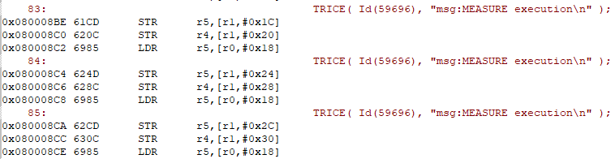
* Measurement: The blue SYSTICK clock counts backwards 6 clocks for each Trice macro (on an ARM M0+), what is less than 100 ns @64 MHz MCU clock: 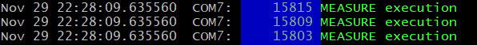

A more realistic (typical) timing with target location and µs timestamps, critical section and parameters is shown here with the STM32F030 M0 core:

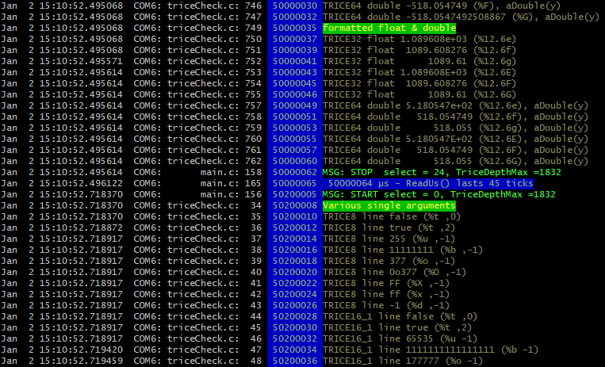

The MCU is clocked with 48 MHz and a Trice duration is about 2 µs, where alone the internal ReadUs() call is already nearly 1 µs long:

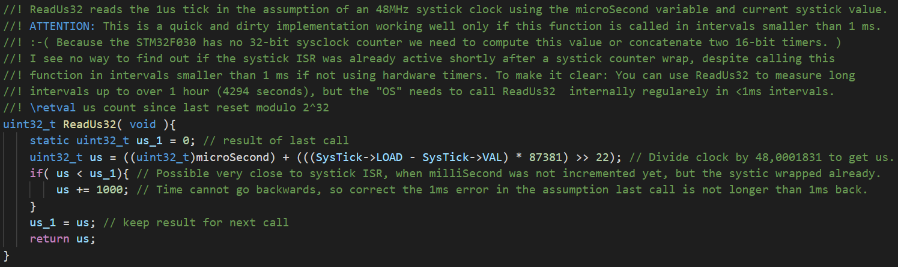

### 28.1. <a id="target-implementation-options"></a>Target Implementation Options

All trice macros use internally this sub-macro:

```C
#define TRICE_PUT(x) do{ *TriceBufferWritePosition++ = TRICE_HTOTL(x); }while(0); //! PUT copies a 32 bit x into the TRICE buffer.
```

The usual case is `#define TRICE_HTOTL(x) (x)`. The `uint32_t* TriceBufferWritePosition` points to a buffer, which is codified and used with the Trice framing sub-macros `TRICE_ENTER` and `TRICE_LEAVE` depending on the use case.

#### 28.1.1. <a id="trice-use-cases-tricestaticbuffer-and-tricestackbuffer---direct-mode-only"></a>Trice Use Cases TRICE_STATIC_BUFFER and TRICE_STACK_BUFFER - direct mode only

1. Each single Trice is build inside a common buffer and finally copied inside the sub-macro `TRICE_LEAVE`.
2. Disabled relevant interrupts between `TRICE_ENTER` and `TRICE_LEAVE` are mantadory for `TRICE_STATIC_BUFFER`.
3. Usable for multiple non-blocking physical Trice channels but **not** recommended for some time blocking channels.
4. A copy call is executed inside `TRICE_LEAVE`.

* With appropriate mapping a direct write to physical output(s) is possible:
  * RTT0 without extra copy.
    * With `TRICE_DIRECT_SEGGER_RTT_32BIT_WRITE` about 100 MCU clocks do the whole work, what is within 1.5 us @ 64 MHz.
  * AUX without extra copy.
  * Not (yet) supported UART transfer loop with polling. With 1MBit baud rate, 4-12 bytes would last 40-120 µs.

#### 28.1.2. <a id="trice-use-case-tricedoublebuffer---deferred-mode-fastest-trice-execution-more-ram-needed"></a>Trice Use Case TRICE_DOUBLE_BUFFER - deferred mode, fastest Trice execution, more RAM needed

1. Several *trices* are build in a half buffer.
1. No stack used.
1. Disabled interrupts between `TRICE_ENTER` and `TRICE_LEAVE`.
1. Usable for multiple blocking and non-blocking physical Trice channels.
1. No copy call inside `TRICE_LEAVE` but optionally an additional direct mode is supported.

#### 28.1.3. <a id="trice-use-case-triceringbuffer---deferred-mode-balanced-trice-execution-time-and-needed-ram"></a>Trice Use Case TRICE_RING_BUFFER - deferred mode, balanced Trice execution time and needed RAM

1. Each single *trices* is build in a ring buffer segment.
1. No stack used.
1. Disabled interrupts between `TRICE_ENTER` and `TRICE_LEAVE`.
1. Usable for multiple blocking and non-blocking physical Trice channels.
1. No copy call inside `TRICE_LEAVE` but optionally an additional direct mode is supported.
1. Allocation call inside `TRICE_ENTER`

### 28.2. <a id="a-configuration-for-maximum-trice-execution-speed-with-the-l432inst-example"></a>A configuration for maximum Trice execution speed with the L432_inst example

* To not loose any clocks, the function `SomeExampleTrices` in [triceExamples.c](../examples/exampleData/triceExamples.c) uses the upper case macro `TRICE` for the first "🐁 Speedy Gonzales" Trices.

* The `triceConfig.h` settings are

```C
#define TriceStamp16 (*DWT_CYCCNT) // @64MHz wraps after a bit more than 1ms (MCU clocks)
#define TriceStamp32 (*DWT_CYCCNT) // @64MHz -> 1 µs, wraps after 2^32 µs ~= 1.2 hours

#define TRICE_DEFERRED_UARTA 1
#define TRICE_UARTA USART2

#define TRICE_DEFERRED_OUTPUT 1
#define TRICE_BUFFER TRICE_DOUBLE_BUFFER

#define TRICE_PROTECT 0
#define TRICE_DIAGNOSTICS 0
#define TRICE_CYCLE_COUNTER 0
```

* Both time stamps use the debug watchdog counter running with the 64 MHz MCU clock.
* No direct output to not loose time during the Trice macro execution.
* Critical sections are disabled (default), so be careful where Trices are used.
* The Trice double buffer allows the Trice macros to write without checks.
* The Trice protection, diagnostics and cycle counter are disabled to not perform unneeded clocks.
* Additionally in file [flags.mak](../examples/L432_inst/flags.mak) the optimization is set to`C_FLAGS += -Ofast`.

After running [./build.sh](../examples/L432_inst/build.sh), executing ` arm-none-eabi-objdump.exe -D -S -l out.clang/triceExamples.o` shows:

```bash
out.clang/triceExamples.o:     file format elf32-littlearm


Disassembly of section .text.TriceHeadLine:

00000000 <TriceHeadLine>:
TriceHeadLine():
C:\Users\ms\repos\trice_wt_devel\examples\L432_inst/../exampleData/triceExamples.c:10
#include "trice.h"

//! TriceHeadLine emits a decorated name. The name length should be 18 characters.
void TriceHeadLine(char * name) {
	//! This is usable as the very first trice sequence after restart. Adapt it. Use a UTF-8 capable editor like VS-Code or use pure ASCII.
	TriceS("w: Hello! 👋🙂\n\n        ✨✨✨✨✨✨✨✨✨✨✨✨✨✨✨✨✨        \n        🎈🎈🎈🎈%s🎈🎈🎈🎈\n        🍃🍃🍃🍃🍃🍃🍃🍃🍃🍃🍃🍃🍃🍃🍃🍃🍃        \n\n\n", name);
   0:	f240 0100 	movw	r1, #0
   4:	4602      	mov	r2, r0
   6:	f2c0 0100 	movt	r1, #0
   a:	f643 70f1 	movw	r0, #16369	@ 0x3ff1
   e:	f7ff bffe 	b.w	0 <TriceS>

Disassembly of section .ARM.exidx.text.TriceHeadLine:

00000000 <.ARM.exidx.text.TriceHeadLine>:
   0:	00000000 	andeq	r0, r0, r0
   4:	00000001 	andeq	r0, r0, r1

Disassembly of section .text.SomeExampleTrices:

00000000 <SomeExampleTrices>:
SomeExampleTrices():
C:\Users\ms\repos\trice_wt_devel\examples\L432_inst/../exampleData/triceExamples.c:14
}

//! SomeExampleTrices generates a few Trice example logs and a burst of Trices.
void SomeExampleTrices(int burstCount) {
   0:	b5f0      	push	{r4, r5, r6, r7, lr}
   2:	af03      	add	r7, sp, #12
   4:	e92d 0700 	stmdb	sp!, {r8, r9, sl}
C:\Users\ms\repos\trice_wt_devel\examples\L432_inst/../exampleData/triceExamples.c:15
	TRICE(ID(0), "att:🐁 Speedy Gonzales A  32-bit timestamp\n");
   8:	f240 0100 	movw	r1, #0
   c:	f2c0 0100 	movt	r1, #0
  10:	680d      	ldr	r5, [r1, #0]
  12:	f240 0800 	movw	r8, #0
  16:	f2c0 0800 	movt	r8, #0
  1a:	4604      	mov	r4, r0
  1c:	6829      	ldr	r1, [r5, #0]
  1e:	f8d8 0000 	ldr.w	r0, [r8]
  22:	f06f 0212 	mvn.w	r2, #18
  26:	8041      	strh	r1, [r0, #2]
  28:	0c09      	lsrs	r1, r1, #16
  2a:	1cd3      	adds	r3, r2, #3
  2c:	8081      	strh	r1, [r0, #4]
  2e:	21c0      	movs	r1, #192	@ 0xc0
  30:	8003      	strh	r3, [r0, #0]
  32:	80c1      	strh	r1, [r0, #6]
C:\Users\ms\repos\trice_wt_devel\examples\L432_inst/../exampleData/triceExamples.c:16
	TRICE(ID(0), "att:🐁 Speedy Gonzales B  32-bit timestamp\n");
  34:	682b      	ldr	r3, [r5, #0]
  36:	1c96      	adds	r6, r2, #2
  38:	8143      	strh	r3, [r0, #10]
  3a:	0c1b      	lsrs	r3, r3, #16
  3c:	8106      	strh	r6, [r0, #8]
  3e:	8183      	strh	r3, [r0, #12]
  40:	81c1      	strh	r1, [r0, #14]
C:\Users\ms\repos\trice_wt_devel\examples\L432_inst/../exampleData/triceExamples.c:17
	TRICE(ID(0), "att:🐁 Speedy Gonzales C  32-bit timestamp\n");
  42:	682b      	ldr	r3, [r5, #0]
  44:	1c56      	adds	r6, r2, #1
  46:	8243      	strh	r3, [r0, #18]
  48:	0c1b      	lsrs	r3, r3, #16
  4a:	8206      	strh	r6, [r0, #16]
  4c:	8283      	strh	r3, [r0, #20]
  4e:	82c1      	strh	r1, [r0, #22]
C:\Users\ms\repos\trice_wt_devel\examples\L432_inst/../exampleData/triceExamples.c:18
	TRICE(ID(0), "att:🐁 Speedy Gonzales D  32-bit timestamp\n");
  50:	682b      	ldr	r3, [r5, #0]
  52:	8302      	strh	r2, [r0, #24]
  54:	0c1a      	lsrs	r2, r3, #16
  56:	8343      	strh	r3, [r0, #26]
  58:	8382      	strh	r2, [r0, #28]
  5a:	83c1      	strh	r1, [r0, #30]
  5c:	f64b 7ad4 	movw	sl, #49108	@ 0xbfd4
C:\Users\ms\repos\trice_wt_devel\examples\L432_inst/../exampleData/triceExamples.c:19
	TRICE(Id(0), "att:🐁 Speedy Gonzales E  16-bit timestamp\n");
  60:	682a      	ldr	r2, [r5, #0]
  62:	f6cb 7ad4 	movt	sl, #49108	@ 0xbfd4
  66:	f10a 1318 	add.w	r3, sl, #1572888	@ 0x180018
  6a:	6203      	str	r3, [r0, #32]
  6c:	8482      	strh	r2, [r0, #36]	@ 0x24
  6e:	84c1      	strh	r1, [r0, #38]	@ 0x26
C:\Users\ms\repos\trice_wt_devel\examples\L432_inst/../exampleData/triceExamples.c:20
	TRICE(Id(0), "att:🐁 Speedy Gonzales F  16-bit timestamp\n");
  70:	682a      	ldr	r2, [r5, #0]
  72:	f10a 1317 	add.w	r3, sl, #1507351	@ 0x170017
  76:	6283      	str	r3, [r0, #40]	@ 0x28
  78:	8582      	strh	r2, [r0, #44]	@ 0x2c
  7a:	85c1      	strh	r1, [r0, #46]	@ 0x2e
C:\Users\ms\repos\trice_wt_devel\examples\L432_inst/../exampleData/triceExamples.c:21
	TRICE(Id(0), "att:🐁 Speedy Gonzales G  16-bit timestamp\n");
  7c:	682a      	ldr	r2, [r5, #0]
  7e:	f10a 1316 	add.w	r3, sl, #1441814	@ 0x160016
  82:	6303      	str	r3, [r0, #48]	@ 0x30
  84:	8682      	strh	r2, [r0, #52]	@ 0x34
  86:	86c1      	strh	r1, [r0, #54]	@ 0x36
C:\Users\ms\repos\trice_wt_devel\examples\L432_inst/../exampleData/triceExamples.c:22
	TRICE(Id(0), "att:🐁 Speedy Gonzales H  16-bit timestamp\n");
  88:	682a      	ldr	r2, [r5, #0]
  8a:	f10a 1315 	add.w	r3, sl, #1376277	@ 0x150015
  8e:	8782      	strh	r2, [r0, #60]	@ 0x3c
  90:	f647 72e8 	movw	r2, #32744	@ 0x7fe8
C:\Users\ms\repos\trice_wt_devel\examples\L432_inst/../exampleData/triceExamples.c:23
	TRICE(id(0), "att:🐁 Speedy Gonzales I without timestamp\n");
  94:	f8a0 2040 	strh.w	r2, [r0, #64]	@ 0x40
  98:	f647 72e7 	movw	r2, #32743	@ 0x7fe7
C:\Users\ms\repos\trice_wt_devel\examples\L432_inst/../exampleData/triceExamples.c:24
	TRICE(id(0), "att:🐁 Speedy Gonzales J without timestamp\n");
  9c:	f8a0 2044 	strh.w	r2, [r0, #68]	@ 0x44
  a0:	f647 72e6 	movw	r2, #32742	@ 0x7fe6
C:\Users\ms\repos\trice_wt_devel\examples\L432_inst/../exampleData/triceExamples.c:25
	TRICE(id(0), "att:🐁 Speedy Gonzales K without timestamp\n");
  a4:	f8a0 2048 	strh.w	r2, [r0, #72]	@ 0x48
  a8:	f647 72e5 	movw	r2, #32741	@ 0x7fe5
C:\Users\ms\repos\trice_wt_devel\examples\L432_inst/../exampleData/triceExamples.c:22
	TRICE(Id(0), "att:🐁 Speedy Gonzales H  16-bit timestamp\n");
  ac:	6383      	str	r3, [r0, #56]	@ 0x38
  ae:	87c1      	strh	r1, [r0, #62]	@ 0x3e
C:\Users\ms\repos\trice_wt_devel\examples\L432_inst/../exampleData/triceExamples.c:23
	TRICE(id(0), "att:🐁 Speedy Gonzales I without timestamp\n");
  b0:	f8a0 1042 	strh.w	r1, [r0, #66]	@ 0x42
C:\Users\ms\repos\trice_wt_devel\examples\L432_inst/../exampleData/triceExamples.c:24
	TRICE(id(0), "att:🐁 Speedy Gonzales J without timestamp\n");
  b4:	f8a0 1046 	strh.w	r1, [r0, #70]	@ 0x46
C:\Users\ms\repos\trice_wt_devel\examples\L432_inst/../exampleData/triceExamples.c:25
	TRICE(id(0), "att:🐁 Speedy Gonzales K without timestamp\n");
  b8:	f8a0 104a 	strh.w	r1, [r0, #74]	@ 0x4a
C:\Users\ms\repos\trice_wt_devel\examples\L432_inst/../exampleData/triceExamples.c:26
	TRICE(id(0), "att:🐁 Speedy Gonzales L without timestamp\n");
  bc:	f8a0 204c 	strh.w	r2, [r0, #76]	@ 0x4c
  c0:	f8a0 104e 	strh.w	r1, [r0, #78]	@ 0x4e
TRice0():
C:\Users\ms\repos\trice_wt_devel\examples\L432_inst/../../src/trice.h:741
	Trice32m_0(tid);
	TRICE_UNUSED(pFmt)
}

...
```

* There are only 7 assembler instructions between two `TRICE` macros(around line 17).
* The log output is:

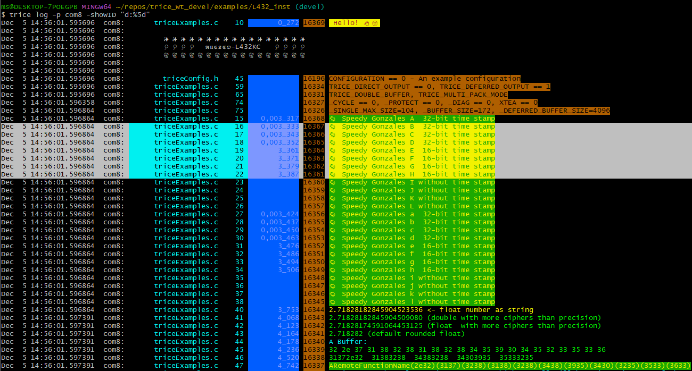

As you can see in the highlighted blue timestamp bar, typical 8-10 clocks are needed for one Trice macro. One clock duration @64MHz is 15.625 ns, so we need about 150 ns for a Trice. Light can travel about 50 meter in that time.

### 28.3. <a id="a-configuration-for-normal-trice-execution-speed-with-the-g0b1inst-example"></a>A configuration for normal Trice execution speed with the G0B1_inst example

* The `triceConfig.h` settings are

```C
// hardware specific trice lib settings
#include "main.h"
#define TriceStamp16 TIM17->CNT     // 0...999 us
#define TriceStamp32 HAL_GetTick()  // 0...2^32-1 ms (wraps after 49.7 days)

#define TRICE_BUFFER TRICE_RING_BUFFER

// trice l -p JLINK -args="-Device STM32G0B1RE -if SWD -Speed 4000 -RTTChannel 0" -pf none  -d16 -ts ms
//#define TRICE_DIRECT_OUTPUT 1
//#define TRICE_DIRECT_SEGGER_RTT_32BIT_WRITE 1

// trice log -p com7 -pw MySecret -pf COBS
#define TRICE_DEFERRED_OUTPUT 1
#define TRICE_DEFERRED_XTEA_ENCRYPT 1
#define TRICE_DEFERRED_OUT_FRAMING TRICE_FRAMING_COBS
#define TRICE_DEFERRED_UARTA 1
#define TRICE_UARTA USART2

#include "cmsis_gcc.h"
#define TRICE_ENTER_CRITICAL_SECTION { uint32_t primaskstate = __get_PRIMASK(); __disable_irq(); {
#define TRICE_LEAVE_CRITICAL_SECTION } __set_PRIMASK(primaskstate); }
```

* The 16-bit timestamp counts the microseconds within 1 millisecond.
* The 32-bit timestamp counts the milliseconds.
* The ring buffer uses the RAM more effectively for the price of a bit speed.
* The encryption and framing has no influence on the Trice execution speed becuse this is done in the background.
* The critical section protects Trices in different tasks from each-other interruption and allows Trices inside interrupts parallel to normal usage.
* Per default are Trice protection, diagnostics and cycle counter active.

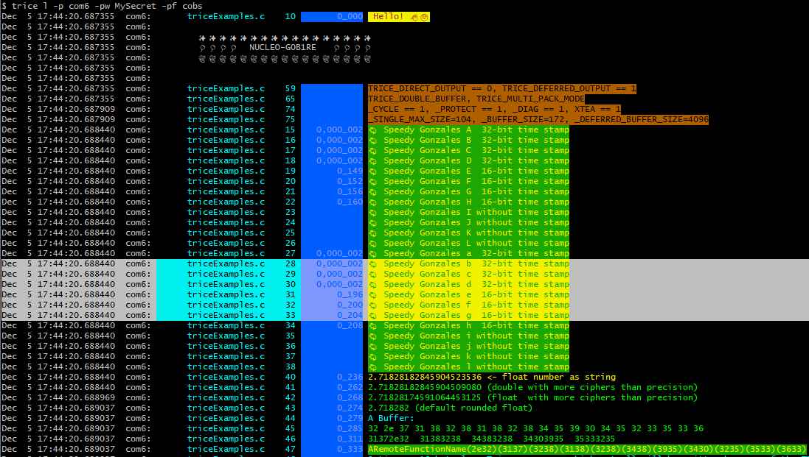

* A typical Trice duration is here 4 microseconds (with `-Ospeed`)
* Switcing the optimization to `-Oz` can result in typical 4-5 µs Trice execution time.
* Additionally enabling the Trice direct out over Segger RTT has this impact:

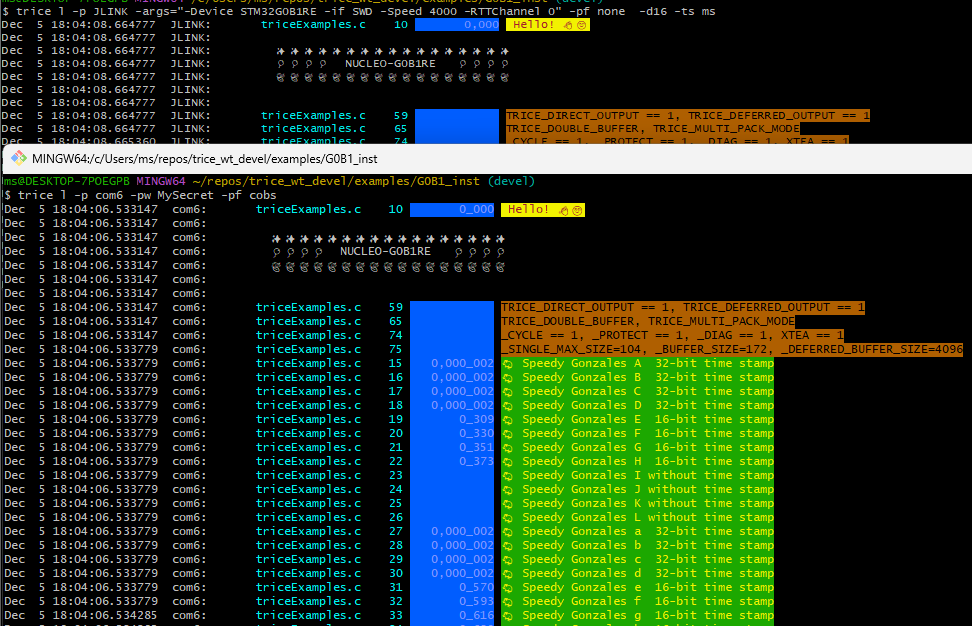

> 🛑 The Trice execution time is now over 20 microseconds❗

Still fast enough for many cases but you hopefully have a good knowledge now how to tune Trice best for your application.

<p align="right">(<a href="#top">back to top</a>)</p>

## 29. <a id="trice-memory-needs"></a>Trice memory needs

Depending on your target configuration the needed space can differ:

### 29.1. <a id="f030bare-size"></a>F030_bare Size

* `./build.sh`:

```bash
arm-none-eabi-size build/F030_bare.elf
   text    data     bss     dec     hex filename
   2428      12    1564    4004     fa4 build/F030_bare.elf
```

That is the basic size of an empty generated project just containing some drivers.

### 29.2. <a id="f030inst-size-with-triceoff1"></a>F030_inst Size with TRICE_OFF=1

* `./build.sh TRICE_OFF=1` :

```bash
arm-none-eabi-size build/F030_inst.elf
   text    data     bss     dec     hex filename
   2428      12    1564    4004     fa4 build/F030_inst.elf
```

This is exactly the same result, proofing that `TRICE_OFF 1` is working correctly.

### 29.3. <a id="f030inst-with-ring-buffer"></a>F030_inst with ring buffer

* `./build.sh`:

```bash
arm-none-eabi-size out/F030_inst.elf
   text    data     bss     dec     hex filename
   9416      28    2692   12136    2f68 out/F030_inst.elf
```

This is about 7 KB Flash and 1.2 KB RAM size for the Trice library and we see:

```bash
ms@DESKTOP-7POEGPB MINGW64 ~/repos/trice_wt_devel/examples/F030_inst (devel)
$ trice l -p com5 -ts16 "time:     #%6d" -hs off
com5:       triceExamples.c    12      # 65535  Hello! 👋🙂
com5:
com5:         ✨✨✨✨✨✨✨✨✨✨✨✨✨✨✨✨✨
com5:         🎈🎈🎈🎈  𝕹𝖀𝕮𝕷𝕰𝕺-F030R8   🎈🎈🎈🎈
com5:         🍃🍃🍃🍃🍃🍃🍃🍃🍃🍃🍃🍃🍃🍃🍃🍃🍃
com5:
com5:
com5:       triceExamples.c    61              TRICE_DIRECT_OUTPUT == 0, TRICE_DEFERRED_OUTPUT == 1
com5:       triceExamples.c    67              TRICE_DOUBLE_BUFFER, TRICE_MULTI_PACK_MODE
com5:       triceExamples.c    76              _CYCLE == 1, _PROTECT == 1, _DIAG == 1, XTEA == 0
com5:       triceExamples.c    77              _SINGLE_MAX_SIZE=104, _BUFFER_SIZE=172, _DEFERRED_BUFFER_SIZE=1024
com5:       triceExamples.c    29    0,031_804 🐁 Speedy Gonzales a  32-bit timestamp
com5:       triceExamples.c    30    0,031_646 🐁 Speedy Gonzales b  32-bit timestamp
com5:       triceExamples.c    31    0,031_488 🐁 Speedy Gonzales c  32-bit timestamp
com5:       triceExamples.c    32    0,031_330 🐁 Speedy Gonzales d  32-bit timestamp
com5:       triceExamples.c    33      # 31172 🐁 Speedy Gonzales e  16-bit timestamp
com5:       triceExamples.c    34      # 31012 🐁 Speedy Gonzales f  16-bit timestamp
com5:       triceExamples.c    35      # 30852 🐁 Speedy Gonzales g  16-bit timestamp
com5:       triceExamples.c    36      # 30692 🐁 Speedy Gonzales h  16-bit timestamp
com5:       triceExamples.c    42      # 30224 2.71828182845904523536 <- float number as string
com5:       triceExamples.c    43      # 29517 2.71828182845904509080 (double with more ciphers than precision)
com5:       triceExamples.c    44      # 29322 2.71828174591064453125 (float  with more ciphers than precision)
com5:       triceExamples.c    45      # 29145 2.718282 (default rounded float)
com5:       triceExamples.c    46      # 28969 A Buffer:
com5:       triceExamples.c    47      # 28790 32 2e 37 31 38 32 38 31 38 32 38 34 35 39 30 34 35 32 33 35 33 36
com5:       triceExamples.c    48      # 28076 31372e32  31383238  34383238  34303935  35333235
com5:       triceExamples.c    49      # 27430 ARemoteFunctionName(2e32)(3137)(3238)(3138)(3238)(3438)(3935)(3430)(3235)(3533)(3633)
com5:       triceExamples.c    50              5 times a 16 byte long Trice messages, which may not be written all if the buffer is too small:
com5:       triceExamples.c    52      # 26554 i=44444400 aaaaaa00
com5:       triceExamples.c    52      # 26342 i=44444401 aaaaaa01
com5:       triceExamples.c    52      # 26130 i=44444402 aaaaaa02
com5:       triceExamples.c    52      # 25918 i=44444403 aaaaaa03
com5:       triceExamples.c    52      # 25706 i=44444404 aaaaaa04
com5:       triceExamples.c    29    0,031_790 🐁 Speedy Gonzales a  32-bit timestamp
com5:       triceExamples.c    30    0,031_632 🐁 Speedy Gonzales b  32-bit timestamp
com5:       triceExamples.c    31    0,031_474 🐁 Speedy Gonzales c  32-bit timestamp
com5:       triceExamples.c    32    0,031_316 🐁 Speedy Gonzales d  32-bit timestamp
com5:       triceExamples.c    33      # 31158 🐁 Speedy Gonzales e  16-bit timestamp
com5:       triceExamples.c    34      # 30998 🐁 Speedy Gonzales f  16-bit timestamp
com5:       triceExamples.c    35      # 30838 🐁 Speedy Gonzales g  16-bit timestamp
com5:       triceExamples.c    36      # 30678 🐁 Speedy Gonzales h  16-bit timestamp
com5:       triceExamples.c    42      # 30210 2.71828182845904523536 <- float number as string
com5:       triceExamples.c    43      # 29503 2.71828182845904509080 (double with more ciphers than precision)
com5:       triceExamples.c    44      # 29308 2.71828174591064453125 (float  with more ciphers than precision)
com5:       triceExamples.c    45      # 29131 2.718282 (default rounded float)
com5:       triceExamples.c    46      # 28955 A Buffer:
com5:       triceExamples.c    47      # 28776 32 2e 37 31 38 32 38 31 38 32 38 34 35 39 30 34 35 32 33 35 33 36
com5:       triceExamples.c    48      # 28062 31372e32  31383238  34383238  34303935  35333235
com5:       triceExamples.c    49      # 27416 ARemoteFunctionName(2e32)(3137)(3238)(3138)(3238)(3438)(3935)(3430)(3235)(3533)(3633)
com5:       triceExamples.c    50              5 times a 16 byte long Trice messages, which may not be written all if the buffer is too small:
com5:       triceExamples.c    52      # 26540 i=44444400 aaaaaa00
com5:       triceExamples.c    52      # 26328 i=44444401 aaaaaa01
com5:       triceExamples.c    52      # 26116 i=44444402 aaaaaa02
com5:       triceExamples.c    52      # 25904 i=44444403 aaaaaa03
com5:       triceExamples.c    52      # 25692 i=44444404 aaaaaa04
com5:    triceLogDiagData.c    44              triceSingleDepthMax = 108 of 172 (TRICE_BUFFER_SIZE)
com5:    triceLogDiagData.c    67              TriceHalfBufferDepthMax = 388 of  512
com5:       triceExamples.c    29    0,031_344 🐁 Speedy Gonzales a  32-bit timestamp
com5:       triceExamples.c    30    0,031_186 🐁 Speedy Gonzales b  32-bit timestamp
```

### 29.4. <a id="f030inst-with-ring-buffer-1"></a>F030_inst with ring buffer

* `./build.sh`:

We need 600 bytes more Flash but could have less RAM used:

```bash
   text    data     bss     dec     hex filename
  10060      24    2688   12772    31e4 out/F030_inst.elf
```

```bash
ms@DESKTOP-7POEGPB MINGW64 ~/repos/trice_wt_devel/examples/F030_inst (devel)
$ trice l -p com5 -ts16 "time:     #%6d" -hs off
com5:       triceExamples.c    12      # 65535  Hello! 👋🙂
com5:
com5:         ✨✨✨✨✨✨✨✨✨✨✨✨✨✨✨✨✨
com5:         🎈🎈🎈🎈  𝕹𝖀𝕮𝕷𝕰𝕺-F030R8   🎈🎈🎈🎈
com5:         🍃🍃🍃🍃🍃🍃🍃🍃🍃🍃🍃🍃🍃🍃🍃🍃🍃
com5:
com5:
com5:       triceExamples.c    61              TRICE_DIRECT_OUTPUT == 0, TRICE_DEFERRED_OUTPUT == 1
com5:       triceExamples.c    69              TRICE_RING_BUFFER, TRICE_MULTI_PACK_MODE
com5:       triceExamples.c    76              _CYCLE == 1, _PROTECT == 1, _DIAG == 1, XTEA == 0
com5:       triceExamples.c    77              _SINGLE_MAX_SIZE=104, _BUFFER_SIZE=172, _DEFERRED_BUFFER_SIZE=1024
com5:       triceExamples.c    29    0,031_732 🐁 Speedy Gonzales a  32-bit timestamp
com5:       triceExamples.c    30    0,031_531 🐁 Speedy Gonzales b  32-bit timestamp
com5:       triceExamples.c    31    0,031_330 🐁 Speedy Gonzales c  32-bit timestamp
com5:       triceExamples.c    32    0,031_129 🐁 Speedy Gonzales d  32-bit timestamp
com5:       triceExamples.c    33      # 30928 🐁 Speedy Gonzales e  16-bit timestamp
com5:       triceExamples.c    34      # 30725 🐁 Speedy Gonzales f  16-bit timestamp
com5:       triceExamples.c    35      # 30522 🐁 Speedy Gonzales g  16-bit timestamp
com5:       triceExamples.c    36      # 30319 🐁 Speedy Gonzales h  16-bit timestamp
com5:       triceExamples.c    42      # 29808 2.71828182845904523536 <- float number as string
com5:       triceExamples.c    43      # 29058 2.71828182845904509080 (double with more ciphers than precision)
com5:       triceExamples.c    44      # 28821 2.71828174591064453125 (float  with more ciphers than precision)
com5:       triceExamples.c    45      # 28602 2.718282 (default rounded float)
com5:       triceExamples.c    46      # 28383 A Buffer:
com5:       triceExamples.c    47      # 28162 32 2e 37 31 38 32 38 31 38 32 38 34 35 39 30 34 35 32 33 35 33 36
com5:       triceExamples.c    48      # 27406 31372e32  31383238  34383238  34303935  35333235
com5:       triceExamples.c    49      # 26718 ARemoteFunctionName(2e32)(3137)(3238)(3138)(3238)(3438)(3935)(3430)(3235)(3533)(3633)
com5:       triceExamples.c    50              5 times a 16 byte long Trice messages, which may not be written all if the buffer is too small:
com5:       triceExamples.c    52      # 25757 i=44444400 aaaaaa00
com5:       triceExamples.c    52      # 25502 i=44444401 aaaaaa01
com5:       triceExamples.c    52      # 25247 i=44444402 aaaaaa02
com5:       triceExamples.c    52      # 24992 i=44444403 aaaaaa03
com5:       triceExamples.c    52      # 24737 i=44444404 aaaaaa04
com5:       triceExamples.c    29    0,031_746 🐁 Speedy Gonzales a  32-bit timestamp
com5:       triceExamples.c    30    0,031_545 🐁 Speedy Gonzales b  32-bit timestamp
com5:       triceExamples.c    31    0,031_344 🐁 Speedy Gonzales c  32-bit timestamp
com5:       triceExamples.c    32    0,031_143 🐁 Speedy Gonzales d  32-bit timestamp
com5:       triceExamples.c    33      # 30942 🐁 Speedy Gonzales e  16-bit timestamp
com5:       triceExamples.c    34      # 30739 🐁 Speedy Gonzales f  16-bit timestamp
com5:       triceExamples.c    35      # 30536 🐁 Speedy Gonzales g  16-bit timestamp
com5:       triceExamples.c    36      # 30333 🐁 Speedy Gonzales h  16-bit timestamp
com5:       triceExamples.c    42      # 29822 2.71828182845904523536 <- float number as string
com5:       triceExamples.c    43      # 29072 2.71828182845904509080 (double with more ciphers than precision)
com5:       triceExamples.c    44      # 28835 2.71828174591064453125 (float  with more ciphers than precision)
com5:       triceExamples.c    45      # 28616 2.718282 (default rounded float)
com5:       triceExamples.c    46      # 28397 A Buffer:
com5:       triceExamples.c    47      # 28176 32 2e 37 31 38 32 38 31 38 32 38 34 35 39 30 34 35 32 33 35 33 36
com5:       triceExamples.c    48      # 27420 31372e32  31383238  34383238  34303935  35333235
com5:       triceExamples.c    49      # 26732 ARemoteFunctionName(2e32)(3137)(3238)(3138)(3238)(3438)(3935)(3430)(3235)(3533)(3633)
com5:       triceExamples.c    50              5 times a 16 byte long Trice messages, which may not be written all if the buffer is too small:
com5:       triceExamples.c    52      # 25771 i=44444400 aaaaaa00
com5:       triceExamples.c    52      # 25516 i=44444401 aaaaaa01
com5:       triceExamples.c    52      # 25261 i=44444402 aaaaaa02
com5:       triceExamples.c    52      # 25006 i=44444403 aaaaaa03
com5:       triceExamples.c    52      # 24751 i=44444404 aaaaaa04
com5:    triceLogDiagData.c    44              triceSingleDepthMax = 108 of 172 (TRICE_BUFFER_SIZE)
com5:    triceLogDiagData.c    75              triceRingBufferDepthMax = 324 of 1024
com5:       triceExamples.c    29    0,031_188 🐁 Speedy Gonzales a  32-bit timestamp
com5:       triceExamples.c    30    0,030_987 🐁 Speedy Gonzales b  32-bit timestamp
```

### 29.5. <a id="a-developer-setting-only-enabling-seggerrtt"></a>A developer setting, only enabling SEGGER_RTT

* `./build.sh`:

```bash
arm-none-eabi-size out/F030_inst.elf
   text    data     bss     dec     hex filename
   6656      16    2768    9440    24e0 out/F030_inst.elf
```

About 4 KB Flash needed and we see:

```bash
ms@DESKTOP-7POEGPB MINGW64 ~/repos/trice_wt_devel/examples/F030_inst (devel)
$ trice l -p jlink -args "-Device STM32F030R8 -if SWD -Speed 4000 -RTTChannel 0" -pf none -d16 -showID "deb:%5d"
Dec  6 16:14:38.276356  jlink:       triceExamples.c    12       65_535 16369  Hello! 👋🙂
Dec  6 16:14:38.276356  jlink:
Dec  6 16:14:38.276356  jlink:         ✨✨✨✨✨✨✨✨✨✨✨✨✨✨✨✨✨
Dec  6 16:14:38.276356  jlink:         🎈🎈🎈🎈  𝕹𝖀𝕮𝕷𝕰𝕺-F030R8   🎈🎈🎈🎈
Dec  6 16:14:38.276356  jlink:         🍃🍃🍃🍃🍃🍃🍃🍃🍃🍃🍃🍃🍃🍃🍃🍃🍃
Dec  6 16:14:38.276356  jlink:
Dec  6 16:14:38.276356  jlink:
Dec  6 16:14:38.276356  jlink:       triceExamples.c    61              16334 TRICE_DIRECT_OUTPUT == 1, TRICE_DEFERRED_OUTPUT == 0
Dec  6 16:14:38.276356  jlink:       triceExamples.c    63              16333 TRICE_STACK_BUFFER, TRICE_MULTI_PACK_MODE
Dec  6 16:14:38.276920  jlink:       triceExamples.c    76              16327 _CYCLE == 1, _PROTECT == 1, _DIAG == 1, XTEA == 0
Dec  6 16:14:38.277424  jlink:       triceExamples.c    77              16326 _SINGLE_MAX_SIZE=104, _BUFFER_SIZE=172, _DEFERRED_BUFFER_SIZE=1024
Dec  6 16:14:39.181228  jlink:       triceExamples.c    29    0,031_848 16356 🐁 Speedy Gonzales a  32-bit timestamp
Dec  6 16:14:39.181228  jlink:       triceExamples.c    30    0,031_292 16355 🐁 Speedy Gonzales b  32-bit timestamp
Dec  6 16:14:39.181228  jlink:       triceExamples.c    31    0,030_736 16354 🐁 Speedy Gonzales c  32-bit timestamp
Dec  6 16:14:39.181228  jlink:       triceExamples.c    32    0,030_180 16353 🐁 Speedy Gonzales d  32-bit timestamp
Dec  6 16:14:39.181228  jlink:       triceExamples.c    33       29_624 16352 🐁 Speedy Gonzales e  16-bit timestamp
Dec  6 16:14:39.181228  jlink:       triceExamples.c    34       29_066 16351 🐁 Speedy Gonzales f  16-bit timestamp
Dec  6 16:14:39.181228  jlink:       triceExamples.c    35       28_508 16350 🐁 Speedy Gonzales g  16-bit timestamp
Dec  6 16:14:39.181228  jlink:       triceExamples.c    36       27_950 16349 🐁 Speedy Gonzales h  16-bit timestamp
Dec  6 16:14:39.181228  jlink:       triceExamples.c    42       27_086 16344 2.71828182845904523536 <- float number as string
Dec  6 16:14:39.181228  jlink:       triceExamples.c    43       25_906 16343 2.71828182845904509080 (double with more ciphers than precision)
Dec  6 16:14:39.181798  jlink:       triceExamples.c    44       25_305 16342 2.71828174591064453125 (float  with more ciphers than precision)
Dec  6 16:14:39.181798  jlink:       triceExamples.c    45       24_727 16341 2.718282 (default rounded float)
Dec  6 16:14:39.181798  jlink:       triceExamples.c    46       24_148 16340 A Buffer:
Dec  6 16:14:39.181798  jlink:       triceExamples.c    47       23_578 16339 32 2e 37 31 38 32 38 31 38 32 38 34 35 39 30 34 35 32 33 35 33 36
Dec  6 16:14:39.181798  jlink:       triceExamples.c    48       22_394 16338 31372e32  31383238  34383238  34303935  35333235
Dec  6 16:14:39.181798  jlink:       triceExamples.c    49       21_295 16337 ARemoteFunctionName(2e32)(3137)(3238)(3138)(3238)(3438)(3935)(3430)(3235)(3533)(3633)
Dec  6 16:14:39.181798  jlink:       triceExamples.c    50              16200 5 times a 16 byte long Trice messages, which may not be written all if the buffer is too small:
Dec  6 16:14:39.182303  jlink:       triceExamples.c    52       19_555 16335 i=44444400 aaaaaa00
Dec  6 16:14:39.182303  jlink:       triceExamples.c    52       18_941 16335 i=44444401 aaaaaa01
Dec  6 16:14:39.182303  jlink:       triceExamples.c    52       18_327 16335 i=44444402 aaaaaa02
Dec  6 16:14:39.182834  jlink:       triceExamples.c    52       17_713 16335 i=44444403 aaaaaa03
Dec  6 16:14:39.182834  jlink:       triceExamples.c    52       17_099 16335 i=44444404 aaaaaa04
Dec  6 16:14:40.187121  jlink:       triceExamples.c    29    0,031_855 16356 🐁 Speedy Gonzales a  32-bit timestamp
Dec  6 16:14:40.187121  jlink:       triceExamples.c    30    0,031_299 16355 🐁 Speedy Gonzales b  32-bit timestamp
Dec  6 16:14:40.187121  jlink:       triceExamples.c    31    0,030_743 16354 🐁 Speedy Gonzales c  32-bit timestamp
Dec  6 16:14:40.187121  jlink:       triceExamples.c    32    0,030_187 16353 🐁 Speedy Gonzales d  32-bit timestamp
Dec  6 16:14:40.187121  jlink:       triceExamples.c    33       29_631 16352 🐁 Speedy Gonzales e  16-bit timestamp
Dec  6 16:14:40.187121  jlink:       triceExamples.c    34       29_073 16351 🐁 Speedy Gonzales f  16-bit timestamp
Dec  6 16:14:40.187121  jlink:       triceExamples.c    35       28_515 16350 🐁 Speedy Gonzales g  16-bit timestamp
Dec  6 16:14:40.187121  jlink:       triceExamples.c    36       27_957 16349 🐁 Speedy Gonzales h  16-bit timestamp
Dec  6 16:14:40.187121  jlink:       triceExamples.c    42       27_093 16344 2.71828182845904523536 <- float number as string
Dec  6 16:14:40.187121  jlink:       triceExamples.c    43       25_913 16343 2.71828182845904509080 (double with more ciphers than precision)
Dec  6 16:14:40.187121  jlink:       triceExamples.c    44       25_310 16342 2.71828174591064453125 (float  with more ciphers than precision)
Dec  6 16:14:40.187121  jlink:       triceExamples.c    45       24_730 16341 2.718282 (default rounded float)
Dec  6 16:14:40.187121  jlink:       triceExamples.c    46       24_149 16340 A Buffer:
Dec  6 16:14:40.187121  jlink:       triceExamples.c    47       23_577 16339 32 2e 37 31 38 32 38 31 38 32 38 34 35 39 30 34 35 32 33 35 33 36
Dec  6 16:14:40.187630  jlink:       triceExamples.c    48       22_391 16338 31372e32  31383238  34383238  34303935  35333235
Dec  6 16:14:40.187690  jlink:       triceExamples.c    49       21_290 16337 ARemoteFunctionName(2e32)(3137)(3238)(3138)(3238)(3438)(3935)(3430)(3235)(3533)(3633)
Dec  6 16:14:40.187690  jlink:       triceExamples.c    50              16200 5 times a 16 byte long Trice messages, which may not be written all if the buffer is too small:
Dec  6 16:14:40.187690  jlink:       triceExamples.c    52       19_546 16335 i=44444400 aaaaaa00
Dec  6 16:14:40.188195  jlink:       triceExamples.c    52       18_930 16335 i=44444401 aaaaaa01
Dec  6 16:14:40.188195  jlink:       triceExamples.c    52       18_314 16335 i=44444402 aaaaaa02
Dec  6 16:14:40.188195  jlink:       triceExamples.c    52       17_698 16335 i=44444403 aaaaaa03
Dec  6 16:14:40.188195  jlink:       triceExamples.c    52       17_082 16335 i=44444404 aaaaaa04
Dec  6 16:14:41.191648  jlink:    triceLogDiagData.c    21              16382 RTT0_writeDepthMax=325 (BUFFER_SIZE_UP=1024)
Dec  6 16:14:41.191648  jlink:    triceLogDiagData.c    44              16378 triceSingleDepthMax = 108 of 172 (TRICE_BUFFER_SIZE)
Dec  6 16:14:41.191648  jlink:       triceExamples.c    29    0,030_628 16356 🐁 Speedy Gonzales a  32-bit timestamp
Dec  6 16:14:41.191648  jlink:       triceExamples.c    30    0,030_072 16355 🐁 Speedy Gonzales b  32-bit timestamp
```

"🐁 Speedy Gonzales" needs about 500 MCU clocks.

### 29.6. <a id="a-developer-setting-only-enabling-seggerrtt-and-without-deferred-output-gives-after-running-buildsh-trice_diagnostics0-trice_protect0"></a>A developer setting, only enabling SEGGER_RTT and without deferred output gives after running `./build.sh TRICE_DIAGNOSTICS=0 TRICE_PROTECT=0`:

```bash
arm-none-eabi-size out/F030_inst.elf
   text    data     bss     dec     hex filename
   5796      16    2736    8548    2164 out/F030_inst.elf
```

That is nearly 1 KB less Flash needs.

The output:

```bash
ms@DESKTOP-7POEGPB MINGW64 ~/repos/trice_wt_devel/examples/F030_inst (devel)
$ trice l -p jlink -args "-Device STM32F030R8 -if SWD -Speed 4000 -RTTChannel 0" -pf none -d16 -showID "deb:%5d"
Dec  6 16:20:10.545274  jlink:       triceExamples.c    12       65_535 16369  Hello! 👋🙂
Dec  6 16:20:10.545274  jlink:
Dec  6 16:20:10.545274  jlink:         ✨✨✨✨✨✨✨✨✨✨✨✨✨✨✨✨✨
Dec  6 16:20:10.545274  jlink:         🎈🎈🎈🎈  𝕹𝖀𝕮𝕷𝕰𝕺-F030R8   🎈🎈🎈🎈
Dec  6 16:20:10.545274  jlink:         🍃🍃🍃🍃🍃🍃🍃🍃🍃🍃🍃🍃🍃🍃🍃🍃🍃
Dec  6 16:20:10.545274  jlink:
Dec  6 16:20:10.545274  jlink:
Dec  6 16:20:10.545274  jlink:       triceExamples.c    61              16334 TRICE_DIRECT_OUTPUT == 1, TRICE_DEFERRED_OUTPUT == 0
Dec  6 16:20:10.545274  jlink:       triceExamples.c    63              16333 TRICE_STACK_BUFFER, TRICE_MULTI_PACK_MODE
Dec  6 16:20:10.545890  jlink:       triceExamples.c    76              16327 _CYCLE == 1, _PROTECT == 0, _DIAG == 0, XTEA == 0
Dec  6 16:20:10.546396  jlink:       triceExamples.c    77              16326 _SINGLE_MAX_SIZE=104, _BUFFER_SIZE=172, _DEFERRED_BUFFER_SIZE=1024
Dec  6 16:20:11.448885  jlink:       triceExamples.c    29    0,031_859 16356 🐁 Speedy Gonzales a  32-bit timestamp
Dec  6 16:20:11.448885  jlink:       triceExamples.c    30    0,031_661 16355 🐁 Speedy Gonzales b  32-bit timestamp
Dec  6 16:20:11.448885  jlink:       triceExamples.c    31    0,031_463 16354 🐁 Speedy Gonzales c  32-bit timestamp
Dec  6 16:20:11.448885  jlink:       triceExamples.c    32    0,031_265 16353 🐁 Speedy Gonzales d  32-bit timestamp
Dec  6 16:20:11.448885  jlink:       triceExamples.c    33       31_067 16352 🐁 Speedy Gonzales e  16-bit timestamp
Dec  6 16:20:11.448885  jlink:       triceExamples.c    34       30_867 16351 🐁 Speedy Gonzales f  16-bit timestamp
Dec  6 16:20:11.448885  jlink:       triceExamples.c    35       30_667 16350 🐁 Speedy Gonzales g  16-bit timestamp
Dec  6 16:20:11.448885  jlink:       triceExamples.c    36       30_467 16349 🐁 Speedy Gonzales h  16-bit timestamp
Dec  6 16:20:11.549660  jlink:       triceExamples.c    42       29_961 16344 2.71828182845904523536 <- float number as string
Dec  6 16:20:11.549660  jlink:       triceExamples.c    43       29_141 16343 2.71828182845904509080 (double with more ciphers than precision)
Dec  6 16:20:11.549660  jlink:       triceExamples.c    44       28_897 16342 2.71828174591064453125 (float  with more ciphers than precision)
Dec  6 16:20:11.549660  jlink:       triceExamples.c    45       28_675 16341 2.718282 (default rounded float)
Dec  6 16:20:11.549660  jlink:       triceExamples.c    46       28_452 16340 A Buffer:
Dec  6 16:20:11.550166  jlink:       triceExamples.c    47       28_238 16339 32 2e 37 31 38 32 38 31 38 32 38 34 35 39 30 34 35 32 33 35 33 36
Dec  6 16:20:11.550247  jlink:       triceExamples.c    48       27_412 16338 31372e32  31383238  34383238  34303935  35333235
Dec  6 16:20:11.550247  jlink:       triceExamples.c    49       26_671 16337 ARemoteFunctionName(2e32)(3137)(3238)(3138)(3238)(3438)(3935)(3430)(3235)(3533)(3633)
Dec  6 16:20:11.550247  jlink:       triceExamples.c    50              16200 5 times a 16 byte long Trice messages, which may not be written all if the buffer is too small:
Dec  6 16:20:11.550754  jlink:       triceExamples.c    52       25_646 16335 i=44444400 aaaaaa00
Dec  6 16:20:11.550754  jlink:       triceExamples.c    52       25_389 16335 i=44444401 aaaaaa01
Dec  6 16:20:11.550754  jlink:       triceExamples.c    52       25_132 16335 i=44444402 aaaaaa02
Dec  6 16:20:11.551285  jlink:       triceExamples.c    52       24_875 16335 i=44444403 aaaaaa03
Dec  6 16:20:11.551285  jlink:       triceExamples.c    52       24_618 16335 i=44444404 aaaaaa04
Dec  6 16:20:12.453968  jlink:       triceExamples.c    29    0,031_859 16356 🐁 Speedy Gonzales a  32-bit timestamp
Dec  6 16:20:12.453968  jlink:       triceExamples.c    30    0,031_661 16355 🐁 Speedy Gonzales b  32-bit timestamp
```

"🐁 Speedy Gonzales" direct outout needs about 200 MCU clocks and not 500 as before.

### 29.7. <a id="settings-conclusion"></a>Settings Conclusion

* 4-8 KB Flash and 1.2 KB RAM needed for the Trice library.
* The RAM size is mainly influenced by the configured buffer sizes.
* Switching off diagnostics and/or protection is ok for less memory needs and faster Trice execution after getting some experience with the project.

### 29.8. <a id="legacy-trice-space-example-old-version"></a>Legacy Trice Space Example (Old Version)

* STM32CubeMX generated empty default project: `Program Size: Code=2208 RO-data=236 RW-data=4 ZI-data=1636`
* Same project with default `Trice` instrumentation: `Program Size: Code=2828 RO-data=236 RW-data=44 ZI-data=1836`
* Needed [FLASH memory](https://en.wikipedia.org/wiki/Flash_memory): 620 Bytes
* Needed [RAM](https://en.wikipedia.org/wiki/Random-access_memory): 40 Bytes plus 200 Bytes for the 2 times 100 Bytes double buffer
* With increased/decreased buffers also more/less [RAM](https://en.wikipedia.org/wiki/Random-access_memory) is needed.
* With each additional Trice macro a few additional [FLASH memory](https://en.wikipedia.org/wiki/Flash_memory) bytes, like 10 assembler instructions, are needed.
* No printf-like library code is used anymore.
* No format strings go into the target code anymore.
* In general Trice instrumentation **reduces** the needed memory compared to a printf-like implementation.

### 29.9. <a id="memory-needs-for-old-example-1"></a>Memory Needs for Old Example 1

The following numbers are measured with a legacy encoding, showing that the instrumentation code can be even smaller.

| Program Size (STM32-F030R8 demo project)      | trice instrumentation | buffer size | compiler optimize for time | comment                         |
|-----------------------------------------------|-----------------------|-------------|----------------------------|---------------------------------|
| Code=1592 RO-data=236 RW-data= 4 ZI-data=1028 | none                  | 0           | off                        | CubeMX generated, no trice      |
| Code=1712 RO-data=240 RW-data=24 ZI-data=1088 | core                  | 64          | off                        | core added without trices       |
| Code=3208 RO-data=240 RW-data=36 ZI-data=1540 | TriceCheckSet()       | 512         | off                        | TRICE_SHORT_MEMORY is 1 (small) |
| Code=3808 RO-data=240 RW-data=36 ZI-data=1540 | TriceCheckSet()       | 512         | on                         | TRICE_SHORT_MEMORY is 0 (fast)  |

* The core instrumentation needs less 150 bytes FLASH and about 100 bytes RAM when buffer size is 64 bytes.
* The about 50 trices in TriceCheckSet() allocate roughly 2100 (fast mode) or 1500 (small mode) bytes.
* trices are removable without code changes with `#define TRICE_OFF 1` before `incude "trice.h"` on file level or generally on project level.

### 29.10. <a id="memory-needs-for-old-example-2"></a>Memory Needs for Old Example 2

| Project                        | Compiler    | Optimization | Link-Time-Optimization | Result                                        | Remark                                                             |
|--------------------------------|-------------|--------------|------------------------|-----------------------------------------------|--------------------------------------------------------------------|
| MDK-ARM_STM32F030_bareerated   | CLANG v6.19 | -Oz          | yes                    | Code=1020 RO-data=196 RW-data=0 ZI-data=1024  | This is the plain generated project without trice instrumentation. |
| MDK-ARM_STM32F030_instrumented | CLANG v6.19 | -Oz          | yes                    | Code=4726 RO-data=238 RW-data=16 ZI-data=4608 | This is with full trice instrumentation with example messages.     |

* The size need is less than 4 KB. See also [Trice Project Image Size Optimization](#trice-project-image-size-optimization).

<p align="right">(<a href="#top">back to top</a>)</p>

## 30. <a id="trice-project-image-size-optimization"></a>Trice Project Image Size Optimization

Modern compilers are optimizing out unused code automatically, but you can help to reduce trice code size if your compiler is not perfect.

### 30.1. <a id="code-optimization--o3-or--oz-if-supported"></a>Code Optimization -o3 or -oz (if supported)

For debugging it could be helpful to switch off code optimization what increases the code size. A good choice is `-o1`. See also
[TRICE_STACK_BUFFER could cause stack overflow with -o0 optimization](#tricestackbuffer-could-cause-stack-overflow-with--o0-optimization).


### 30.2. <a id="compiler-independent-setting-a-bit-outdated"></a>Compiler Independent Setting (a bit outdated)

Maybe the following is a bit unhandy but it decreases the code amount, build time and the image size.

* For **X=8|16|32|64** and **N=0...12** selectively set `#define ENABLE_trice`**X**`fn_`**N**` 1` to ` 0` for unused functions in project specific file `triceConfig.h`.
* For **X=8|16|32|64** and **N=0...12** selectively set `#define ENABLE_Trice`**X**`fn_`**N**` 1` to ` 0` for unused functions in project specific file `triceConfig.h`.
* For **X=8|16|32|64** and **N=0...12** selectively set `#define ENABLE_TRice`**X**`fn_`**N**` 1` to ` 0` for unused functions in project specific file `triceConfig.h`.

When having lots of program memory simply let all values be `1`. With specific linker optimization unused functions can get stripped out automatically.

It is possible to `#define TRICE_SINGLE_MAX_SIZE 12` for example in *triceConfig.h*. This automaticaly disables all Trice messages with payloads > 8 bytes (Trice size is 4 bytes).

### 30.3. <a id="linker-option---split-sections-if-supported"></a>Linker Option --split-sections (if supported)

In ARM-MDK uVision `Project -> Options -> C/C++ -> "One EFL section for each function"` allows good optimization and getting rid of unused code without additional linker optimization. This leads to a faster build process and is fine for most cases. It allows excluding unused functions.

### 30.4. <a id="linker-optimization--flto-if-supported"></a>Linker Optimization -flto (if supported)

* To get the smallest possible image, do _not_ use option `--split sections`.
* Use linker optimization alone.
* This increases the build time but reduces the image size significantly.

#### 30.4.1. <a id="armcc-compiler-v5-linker-feedback"></a>ARMCC Compiler v5 Linker Feedback

* In ARM-MDK uVision, when using ARMCC compiler v5, there is a check box `Project -> Options -> Target -> "Cross Module Optimization"`.
* In ARMCC this works also with the lite version.

#### 30.4.2. <a id="armclang-compiler-v6-link-time-optimization"></a>ARMCLANG Compiler v6 Link-Time Optimization

* In ARM-MDK uVision, when using ARMCLANG compiler v6, the check box `Project -> Options -> C/C++(AC6) -> "Link-Time Optimization"` is usable to set the CLI `-flto` switch.
* LTO is not possible with ARMCLANG6 lite: https://developer.arm.com/documentation/ka004054/latest.

#### 30.4.3. <a id="gcc"></a>GCC

With GCC use the `-flto` CLI switch directly.

#### 30.4.4. <a id="llvm-arm-clang"></a>LLVM ARM Clang

This compiler is much faster and creates the smallest images. Right now it uses the GCC libs and linker.

#### 30.4.5. <a id="other-ides-and-compilers"></a>Other IDE´s and compilers

Please check the manuals and create a pull request or simply let me know.

### 30.5. <a id="legacy-stm32f030-example-project---different-build-sizes"></a>Legacy STM32F030 Example Project - Different Build Sizes

#### 30.5.1. <a id="armcc-compiler-v5"></a>ARMCC compiler v5

| Compiler | Linker         | Result                                          | Comment                           |
|----------|----------------|-------------------------------------------------|-----------------------------------|
| o0       |                | Code=46942 RO-data=266 RW-data=176 ZI-data=4896 | very big                          |
| o1       |                | Code=22582 RO-data=258 RW-data=168 ZI-data=4896 |                                   |
| o3       |                | Code=21646 RO-data=258 RW-data=168 ZI-data=4896 |                                   |
| o0       | split sections | Code= 7880 RO-data=268 RW-data=156 ZI-data=4892 | for debugging                     |
| o1       | split sections | Code= 5404 RO-data=260 RW-data=148 ZI-data=4892 | **for debugging**                 |
| o3       | split sections | Code= 4996 RO-data=260 RW-data=148 ZI-data=4892 | **good balance**                  |
| o0       | flto           | Code= 8150 RO-data=266 RW-data=176 ZI-data=4896 | builds slower                     |
| o1       | flto           | Code= 5210 RO-data=258 RW-data=148 ZI-data=4892 | builds slower                     |
| o3       | flto           | Code= 4818 RO-data=258 RW-data=148 ZI-data=4892 | builds slower, **smallest image** |

<p align="right">(<a href="#top">back to top</a>)</p>

## 31. <a id="trice-tags-color-and-weights"></a>Trice Tags, Color, and Weights

Tags label Trice messages on the host. They can control presentation, selection, ID assignment, and weight-based filtering without adding target runtime data because the tag is part of the format string stored in `til.json`.

[Context Enrichment](#trice-context-enrichment) also uses tags as selectors: a matching `-ce` rule adds values to selected log messages.

### 31.1. <a id="how-to-use-tags"></a>How to use tags

Add a tag and a colon in front of a Trice format string:

```c
trice("wrn:Motor temperature is %d C\n", temperature);
```

The Trice tool recognizes `wrn`, applies the Warning color, and removes the prefix when it is completely lower case. A mixed-case or uppercase prefix remains visible:

```text
wrn:fox  -> fox
Wrn:fox  -> Wrn:fox
```

The colors, aliases, and weights are defined in [lineTransformerANSI.go](../internal/emitter/lineTransformerANSI.go). The tag itself does not require a target-side enable switch. Use `-pick` or `-ban` to select complete tag groups during host logging. Tag-specific ID ranges can additionally assign and route target IDs.

Short aliases have one unambiguous meaning. For example `W` and `w` select Write, while `wrn`, `WARN`, and `WARNING` select Warning. Configurations created for older Trice versions should replace an ambiguous short alias with the intended explicit name before using it for `-pick`, `-ban`, `-logLevel`, or `-IDRange`.

It is possible to concatenate individually tagged fragments to produce output such as:


The source for this example is in [`triceCheck.c`](../_test/testdata/triceCheck.c). For each such color change a separate Trice message is needed, because tags can only occur at the beginning of a format string.

### 31.2. <a id="tag-weights"></a>Tag weights

Each tag group has one integer weight in the range `0..999`. A larger value means greater importance. The weight belongs to the group and therefore applies to every alias in that group. It is independent of the group's position in the tag table and independent of its color.

The following table lists the default weights defined in [lineTransformerANSI.go](../internal/emitter/lineTransformerANSI.go). Re-assignment for logging using the CLI is possible: `-ulabel warn:650`.

| Group | Weight |
| --- | ---: |
| Fatal | 800 |
| Critical | 750 |
| Emergency | 700 |
| Error, Assert, Alarm | 650 |
| Warning, Notice | 600 |
| Attention, Alert | 550 |
| INFO, Config | 500 |
| Time, Message, Read, Write, Receive, Transmit, Diag, Interrupt, Signal, Test, Default | 400 |
| `untagged` | 400 |
| Microsecond, Millisecond, Second, DeltaTime | 350 |
| Debug | 300 |
| Trace | 200 |
| Verbose | 100 |

`CYCLE_ERROR` is a Trice tool diagnostic rather than an application tag. Its stored value does not define application-message priority.

### 31.3. <a id="selecting-tags-and-priority"></a>Selecting tags and priority

Use the repeatable `-pick` option to display selected tag groups, or `-ban` to suppress selected groups. The two options are mutually exclusive. Separate names with colons or repeat the option:

```sh
trice log -pick err:wrn -pick notice
trice log -ban dbg -ban trace:verbose
```

Aliases select the complete group. `-pick all` selects every message and `-pick off` selects none; `-ban all` suppresses every message and `-ban off` suppresses none. Empty list entries and unknown names are command-line errors.

Use `-logLevel` with `all`, `off`, a registered tag or alias, or a numeric weight from `0` through `999`. An application event passes when its tag group's weight is greater than or equal to the threshold. A lower threshold therefore displays more messages:

```sh
trice log -logLevel info
trice log -logLevel 500
```

Both commands use the same threshold with the default INFO weight of 500. Unknown level names and numeric values outside `0..999` are rejected before the input channel is opened. Application messages without a recognized format-string tag use the built-in `untagged` group with default weight 400. `-logLevel off` suppresses all application events.

With the default weights, `-logLevel info` excludes Message and `untagged` events because their weight is 400. Use `-logLevel msg` or `-logLevel 400` to include these groups and all higher-weight groups while still excluding Debug (300), Trace (200), and Verbose (100). Without a `-logLevel` option, the threshold defaults to `all`.

Use a threshold when the requirement is “Warning and everything more important”, including new user tags assigned sufficiently high weights. For example, `trice log -ulabel motor:780 -logLevel wrn` includes `motor` alongside Warning, Notice, Error, and higher-weight groups. Use `-pick` for a specific set of groups such as Receive and Transmit, regardless of their weights. Combining both expresses a selected subsystem or category set with a minimum priority.

These are host-side filters. They do not avoid target argument evaluation or reduce data already transmitted by the target. Target ID routing is configured separately as described in [ID Routing](#id-routing); received raw bytes can still be kept in a [binary logfile](#binary-logfile).

For a short capture to experiment with, run the [PC feature tour](#pc-feature-tour) and compare `./show_json.sh`, `./show_json.sh -pick info`, and `./show_json.sh -logLevel wrn`. The [G0B1 feature tour](#g0b1-feature-tour) applies the same output choices to a board capture.

All `-ulabel` values are applied before `-pick`, `-ban`, and `-logLevel` are resolved. Option order therefore does not matter:

```sh
trice log -pick motor -ulabel motor:650
trice log -ulabel motor:650 -pick motor
```

`-pick` or `-ban` and `-logLevel` jointly decide whether each application event is displayed. An accepted event keeps its timestamps, source location, ID, prefix, suffix, and all lines of its text; a rejected event leaves none of these behind. For example, `-pick err:wrn -logLevel err` shows only Error events. A line assembled from several Trice calls contains only the accepted calls, including their accepted newline characters. The same decision also applies to visualization routing. Byte-oriented CHAR/DUMP chunks have no typed event boundary and retain their fragment-based selection behavior.

Each Trice call is one event. Accepted fragments are concatenated until an accepted newline arrives; a rejected newline does not finish the visible line. For example, the three calls `msg:A`, `dbg:B\n`, `msg:C\n` produce `AC\n` with either `-pick msg` or `-logLevel msg` using the default weights. A multi-line event is accepted or rejected as a whole, preserving its continuation indentation. At the end of buffered input, a remaining visible fragment is flushed with a newline.

Metadata columns belong to the first accepted event of each visible line. Target timestamp differences use the previous visible line's first accepted event; rejected events and later fragments on the same line do not update that reference. `-addNL` appends a newline to every event, including one already ending in a newline; the latter produces an additional indented blank line. Without `-addNL`, an empty event produces no visible output, while an accepted newline-only event produces a blank line.

### 31.4. <a id="decoder-diagnostics"></a>Decoder diagnostics

Decoder and transport diagnostics are tool output rather than application messages. Examples include an unknown Trice ID, an invalid COBS/TCOBS frame, an unsupported or truncated packet, and a cycle-counter mismatch. These diagnostics remain visible with restrictive `-pick`, `-ban`, and `-logLevel off` settings. They receive no application metadata, do not enter visualization routing, and are not assigned an application tag.

The translator keeps the diagnostic writer separate from the application line composer. The command currently directs both to its normal local output, while remote display receives application lines only. A machine-readable application sink must keep the separate diagnostic writer on a human-readable tool channel instead of inserting diagnostic text into records. Recoverable decoder diagnostics do not stop logging; writer and input errors retain their existing error handling. Binary recording occurs before decoding and is unaffected.

### 31.5. <a id="user-defined-tags-weights-and-colors"></a>User-defined tags, weights, and colors

Use the repeatable `-ulabel name`, `-ulabel name:weight`, or `-ulabel name:color` option to register a new tag or change a known group's weight or color for one command:

```sh
trice log -ulabel motor -ulabel sensor:150
trice insert -ulabel motor:250
trice bind -ulabel motor:250
trice log -ulabel motor:red:blue
trice log -ulabel msg:300 -ulabel msg:red:blue
```

A new tag without an explicit weight receives the final INFO weight after all `-ulabel` options have been processed. An explicit weight must be between `0` and `999`, inclusive. The color must be exactly one of the tokens printed by `trice generate -colors`, such as `red:blue`. An unknown color is rejected with a hint to that command.

An existing name without either property leaves its group unchanged. An existing name with a weight changes the complete group, including every alias. The last explicit assignment wins:

```sh
-ulabel msg:150 -ulabel M:600 -ulabel msg
```

This results in weight `600` for the complete Message group. It does not create additional groups for `msg` or `M`.

Weight and color are independent. `-ulabel msg:300 -ulabel msg:"yellow+h:green"` gives every built-in Message alias (`msg`, `message`, `MSG`, `MESSAGE`, and the other aliases) weight `300` and the same color. Repeating either property changes only that property; the last value for each property wins. Free user labels are literal: `-ulabel new:300 -ulabel NEW:400` creates two distinct labels with no user-defined alias relationship.

Each option accepts exactly one name. The old colon-separated name-list form is invalid. Empty names or values, unknown colors, weights outside `0..999`, purely numeric names, `all`, and `off` are rejected before the command opens or changes its input and output files. A color token itself contains a colon between foreground and background.

For `insert` and `bind`, only the registered name participates in tag and `-IDRange` handling. Weight and color change no target data and are not stored in the source or `til.json`.

Command-specific user tags, weight overrides, and color overrides are discarded before a later command in the same process starts.

### 31.6. <a id="untagged-application-events"></a>Untagged application events

The host assigns the built-in `untagged` group once to an application event whose stored format string has no recognized tag. This also applies to an empty prefix, an unknown prefix caused by a typo, or ordinary text containing a colon. For ID-based messages, classification uses the format string from the Trice ID lookup table rather than text supplied as a runtime value.

| Stored format string | Visible text with `-color off` |
| --- | --- |
| `Hello` | `Hello` |
| `untagged:Hello` | `untagged:Hello` |
| `mgs:blah` | `mgs:blah` |
| `msg:Hello` | `msg:Hello` |

The host never adds `untagged:` to visible application text. It appears only if the application supplied those characters. For example, `trice("Hello")` displays `Hello` with every palette, while an unknown prefix such as `mgs:blah` remains visible so a typo can be spotted. An explicitly written `untagged:` follows the usual presentation rules for lowercase tags: `-color off` keeps it, while `-color none` and `default` remove the tag from the visible text.

`-pick untagged`, `-ban untagged`, `-logLevel`, and statistics handle this group like other application tags. Its weight is independent of INFO and can be changed for one command with `-ulabel untagged:150`. An optional color such as `-ulabel untagged:red:default` still styles text output with `-color default`, without printing the group name. `-color none` and `-color off` leave it uncolored.

Decoder and transport diagnostics are not untagged application events. Byte-oriented CHAR and DUMP decoder chunks also receive no synthetic event tag because they do not identify individual application events. Classification changes neither source format strings, lookup-table entries, IDs, nor recorded raw bytes.

### 31.7. <a id="event-statistics"></a>Event statistics

`-tagStat` counts successfully decoded application events by tag group, including `untagged`; `-triceStat` counts successfully decoded ID-based Trice events by ID. `-stat` prints both reports. These totals are recorded before `-pick`, `-ban`, `-logLevel`, and visualization routing, so they include events hidden from the text display. One call counts once even if it spans several output lines; several calls on one line count separately. Palette changes, metadata columns, and repeated report printing do not change the totals. Decoder diagnostics and malformed records are excluded. Formatted ID-less `typeX0` records contribute to tag statistics but have no Trice ID to count. Byte-oriented CHAR/DUMP chunks have no event boundary and do not contribute to these event totals.

### 31.8. <a id="output-options"></a>Output options

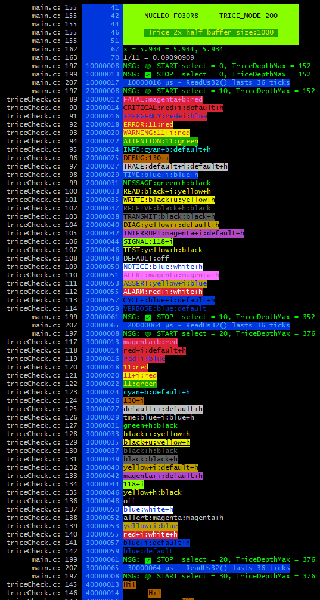

With `-color default`, recognized lower-case tag prefixes are removed and their configured colors are applied. With `-color none`, lower-case prefixes are removed without adding colors. With `-color off`, prefixes remain unchanged and no colors are added.

### 31.9. <a id="check-color-alternatives"></a>Check color alternatives

There are over 1000 foreground, background, and style combinations:

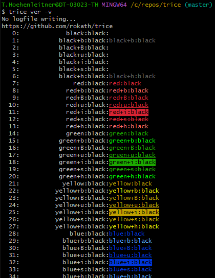

Run `trice generate -colors` to display them. Use `-ulabel name:color` for a per-command override. Modify [lineTransformerANSI.go](../internal/emitter/lineTransformerANSI.go) and rebuild the Trice tool with `go install ./...` or `./scripts/buildTriceTool.sh` to change the built-in palette.

### 31.10. <a id="color-issues-under-windows"></a>Color issues under Windows

If a Windows console displays ANSI escape sequences instead of colors, use a terminal with ANSI color support, such as Windows Terminal, Git Bash, or [Alacritty](../third_party/alacritty/ReadMe.md). Additional background is available in [Windows console with ANSI colors handling](https://superuser.com/questions/413073/windows-console-with-ansi-colors-handling/1050078#1050078).

<p align="right">(<a href="#top">back to top</a>)</p>

## 32. <a id="structured-logging"></a>Structured Logging

Machine-readable output requires the standard TREX wire format. CHAR and DUMP do not provide suitable event boundaries and are rejected with `-logFormat json` or `-logFormat kv`.

Structured Logging adds named, typed values to a readable message. A regular Trice call is enough:

```c
trice("info:Motor {motor_id}: {temperature_c:%.1f C}", motor_id, aFloat(temperature_c));
```

With `motor_id = 3` and `temperature_c = 87.5`, the output depends on the selected format:

These three outputs use `-li off -showID '' -hs off -ts off`, so no optional host or target metadata appears.

`tlog -logFormat text` (default):

```text
Motor 3: 87.5 C
```

`tlog -logFormat json` (NDJSON):

```json
{"tag":"INFO","level":"INFO","message":"Motor 3: 87.5 C","fields":{"motor_id":3,"temperature_c":87.5}}
```

`tlog -logFormat kv`:

```text
tag=INFO level=INFO message="Motor 3: 87.5 C" field.motor_id=3 field.temperature_c=87.5
```

Further output formats, such as CSV, could be added when needed.

The target continues to transmit the ID and values using the existing wire format. Field names are not transmitted as additional runtime arguments or payload; they reside in the dictionary on the host.

Scalar Trices with 8, 16, 32 or 64 bits and strings through `triceS` and `triceN` are supported. The target macros and their bit-width rules remain authoritative. Context Enrichment (`bind -ce`) can add supported structured fields; see [Context Enrichment](#trice-context-enrichment).

Try the [PC Feature Tour](#pc-feature-tour) or the [G0B1 Feature Tour](#g0b1-feature-tour): both demonstrate named numeric and string fields and text, NDJSON and KV output. The PC tour requires no hardware and immediately produces a short binary capture.

Named fields are currently unavailable for buffer formats such as `triceB`. These repeat a printf placeholder for each buffer element, whereas a structured field describes one named value. The current field schema does not define whether a named buffer should appear as a numeric list, a byte sequence or text. Therefore, `bind` and `insert` reject `trice8B("msg:{bytes:%02x}", bytes, 2)` with an error. `triceF` does not support named fields either.

Buffer logging without a named field remains available: for `0x01` and `0x02`, `trice8B("msg:%02x ", bytes, 2)` produces JSON `{"tag":"MESSAGE","message":"01 02 "}` without a `fields` object. For a fixed number of individually named values, use scalar Trices instead. Structured output of entire buffers requires a separate format and schema definition.

### 32.1. <a id="placeholders-and-names"></a>Placeholders and Names

| Format string syntax | Meaning |
|---|---|
| `{motor_id}` | Explicit field name, default display. |
| `{}` | Derive the name from the corresponding C argument. |
| `{plant.}` | Prefix the derived name with `plant.`. |
| `{:%.1f}` | Derived name and explicit display. |
| `{temperature:%.1f C}` | Explicit name and display. |
| `{: = %.1f C}` | Derived name and display. |
| `{motor_id:: %d, }` | Name `motor_id`, display `: %d, `. |
| `{{` and `}}` | Literal opening and closing braces. |

The first colon separates the name from its display. The display may contain free text and further colons, but must contain exactly one supported format specifier. `%%` is not an additional value. Dynamic widths such as `%*d` are not allowed in a structured field.

Without an explicit display, `%d` is used. If the entire argument is wrapped in `aFloat(...)` or `aDouble(...)`, the default is `%f`. There is no general C type inference: an unsigned value needs, for example, `{counter:%u}`, an address `{address:%p}`, and a string `{text:%s}`.

```c
trice("info:{} {}", motor_id, aFloat(temperature_c));
trice("info:{plant.}", motor->temperature);
trice("info:{temperature:%.2f}", aFloat(read_temperature()));
triceS("info:{message:%s}", "motor ready");
triceN("info:{message:%s}", buffer, length);
```

Names can be derived from individual identifiers and simple member chains. Both `motor.temperature` and `motor->temperature` yield `motor.temperature`. The `aFloat` and `aDouble` wrappers are removed when deriving names. Expressions such as `values[0]`, `a+b` or `read_temperature()` need an explicit name. Names consist of identifiers with optional dot-separated segments; whitespace within an identifier, empty segments and leading digits are invalid.

Canonical names must be unique within a call. `{motor->id}` and `{motor.id}` collide. However, `motor` and `motor.id` are two distinct, flat keys; dotted names do not create nested JSON objects.

Ordinary `%...` conversions and structured placeholders consume arguments together, from left to right:

```c
trice("info:%u {temperature:%.1f} %x {last}", sequence, aFloat(temperature), flags, last);
```

Only `temperature` and `last` are exported as fields here. `sequence` and `flags` appear only in the message. Instrumentation checks missing or extra arguments and duplicate or malformed fields. Schema errors prevent publication of partial changes from the instrumentation run.

The new syntax for literal braces also applies in text mode:

```c
trice("info:set={{1,2}}, value={value}", value);
```

This produces `set={1,2}, value=7` when `value = 7`. A backslash before a brace does not replace doubling it.

### 32.2. <a id="field-types-and-display"></a>Field Types and Display

| Format specifier | Structured value |
|---|---|
| `%d`, `%i` | Signed integer of the Trice bit width. |
| `%u`, `%o`, `%O`, `%x`, `%X`, `%b` | Unsigned integer. The selected numeric base affects only the message. |
| `%f`, `%F`, `%e`, `%E`, `%g`, `%G` | Floating-point number; 32 bits with `aFloat`, 64 bits with `aDouble`. |
| `%c`, `%q`, `%U` | Character as a string; invalid Unicode code points become the replacement character. |
| `%t` | Boolean: zero is `false`, other values are `true`. |
| `%s` | String from `triceS` or `triceN`. |
| `%p` | Address in the form `0x...`; does not imply the type of the referenced object. |

`%%` is a literal percent sign and creates neither a field nor an additional argument.

Supported C length modifiers such as `%lu` or `%llX` do not change these semantics; the Trice family determines the transmitted bit width. Precision, field width and display text affect only `message`. For example, `{value:%.1f}` displays `1.2` for a value of `1.25`, while the field contains `1.25`. Similarly, `{text:%.3s}` truncates only the message, not the exported string.

`-unsigned=false` does not change the meaning of structured unsigned fields either. It continues to control the corresponding classical text display.

Named string fields use `%s`; alternative classical string displays such as `%x` remain message text without a named field. A structured floating-point field in a 64-bit Trice requires `aDouble(...)`; `aFloat(...)` is rejected there to prevent interpreting the transmitted bits as a double.

### 32.3. <a id="instrumentation-and-dictionary"></a>Instrumentation and Dictionary

Both `bind` and `insert` support structured templates. As before, `clean` removes inserted IDs and preserves the original template spelling. Source shorthand is not replaced with canonical field names.

```sh
trice bind -src app -genDir generated -til til.json -li li.json
```

Alternatively, for the Insert/Clean workflow:

```sh
trice insert -src app -genDir generated -til til.json -li li.json
trice clean -src app -til til.json -li li.json
```

Like the existing workflows, these examples require an initialized TIL. The usual build integration of Bind sidecars is still required.

The [C test examples](../_test/testdata/triceCheck.c) also demonstrate 8-, 16-, 32- and 64-bit values, different stamps, `triceS`/`triceN`, mixed placeholders and the `aFloat()`/`aDouble()` wrappers. Their integration tests verify text output after `bind` and `insert`, using the same CLI settings as the PC target tests. Names from `motor.state` and `motorPtr->rpm` appear canonically in the field registry as `motor.state` and `motorPtr.rpm`.

In `til.json`, the only schema fields remain `Type` and `Strg`. `Strg` contains all information needed for decoding, including derived names and floating-point defaults. For example,

```c
trice("info:Motor {}: {} C", motor_id, aFloat(temperature_c));
```

is stored with a canonical `Strg` such as:

```json
{"Type":"trice","Strg":"info:Motor {motor_id}: {temperature_c:%f} C"}
```

The actual spelling of `Type` still follows the respective instrumentation path. Schema identity remains `Type + Strg`. Renaming a field creates a new schema identity and therefore a different ID; historical TIL entries remain available for older firmware. Equivalent name spellings such as `motor->temperature` and `motor.temperature` retain the same canonical identity. Repeating unchanged runs creates no additional schemas. Generated local C format data contains the derived printf format string.

### 32.4. <a id="output-formats-and-event-boundaries"></a>Output Formats and Event Boundaries

`trice log` and `tlog` support `-logFormat text`, `-logFormat json` and `-logFormat kv`, with `-logFormat key-value` as an alias for `kv`. Values are case-insensitive; the default remains `text`. The text-based remote display mode and test table output cannot be combined with machine-readable formats.

```sh
trice log -p FILEBUFFER -args capture.bin -pf TCOBSv1 -til til.json -li off -hs off -ts off -logFormat json
```

Framing and dictionary must match the capture. `-logFormat kv` reads the same capture as key/value output; `text` retains the existing text output.

`-logFormat json` produces NDJSON (JSON Lines): one JSON object followed by LF per accepted Trice event. There is no separate CLI value `ndjson`. KV also produces exactly one line per event. Partial calls are not combined, and multiline messages are not split into multiple events. An empty message is also an event. Newlines within the message are escaped.

Text prefixes, suffixes, colors, indentation, time-difference columns and `-addNL` do not decorate JSON/KV records. Actual metadata appears in separate fields instead. In JSON/KV mode, diagnostics and status messages go to stderr; stdout, `-logfile` and TCP log output contain application records. Write errors are returned to the caller.

`-pick`, `-ban` and `-logLevel` continue to select whole application events. Statistics count successfully decoded events before this selection. Visualization also follows selection; its existing restrictions, such as supported numeric single-line messages, still apply. After successful visualization, `log=drop` suppresses the entire normal record. Binary captures remain unfiltered and unaffected by the selected output format.

### 32.5. <a id="json-and-kv-contract"></a>JSON and KV Contract

Every record contains `tag` and `message`. `tag` is the canonical name of a registered format string tag; alias lookup for this metadata field is case-insensitive. For example, `inf:Hi` and `Inf:Hi` both yield `tag=INFO`. If no registered tag matches, the value is `untagged`.

`message` takes the message content of text output without ANSI colors, outer metadata, text prefixes or suffixes. With `-color none` or `default`, only an exactly registered, entirely lowercase format string tag is removed: `inf:Hi` becomes `Hi`, whereas `Inf:Hi` remains `Inf:Hi`. An unknown prefix such as `mgs:Hi` also remains visible. With `-color off`, explicitly written tag prefixes remain, as in text mode. Trice never adds `untagged:` to message text: `trice("Hi")` yields `message="Hi"` and `tag="untagged"`; `trice("mgs:Hi")` yields `message="mgs:Hi"` and `tag="untagged"`. Leading and trailing whitespace, empty messages and messages consisting only of whitespace are preserved.

A runtime string does not change tag classification: with `triceS("{text:%s}", value)` and a value starting with `err:`, `tag` remains `untagged`. Existing text output converts sequences such as `\n` and `\t` for display, including within runtime strings; `message` follows that display. The named field `fields.text` retains the transmitted string, except for outer whitespace.

An optional `level` is determined through a fixed alias table independent of colors and weights. Comparison is case-insensitive. For example, `err`, `ERR` and `Error` map to `ERROR`; `warn`, `wrn` and `Warning` map to `WARNING`. Supported canonical values are `FATAL`, `CRITICAL`, `EMERGENCY`, `ERROR`, `WARNING`, `ATTENTION`, `INFO`, `DEBUG`, `TRACE`, `NOTICE`, `ALERT`, `ASSERT`, `ALARM` and `VERBOSE`. A display-only tag such as `msg` or a freely defined user label receives no invented level. Alias lookup for `tag` does not change the existing tag registry or its filtering behavior; level classification remains independent of it as well.

In JSON, user fields reside under `fields`. Host and user fields therefore cannot overwrite each other: a user field named `tag` appears under `fields.tag`. User fields are emitted in template order. A record without exportable user fields has no empty `fields` object.

Integers remain JSON numbers, including the full 64-bit boundary values. Readers must use a sufficiently precise numeric type; converting every number to an IEEE-754 double may round large integers. Addresses are JSON strings such as `"0x20001234"`. Non-finite floating-point values (`NaN`, `+Inf`, `-Inf`) are omitted as JSON fields; their text display remains in `message`. Other fields of the same event are preserved.

In KV, user fields are named `field.<name>` and also follow template order. Numbers, Booleans and addresses are unquoted; strings, characters and messages are always double-quoted. Quotes, backslashes, LF, CR and tabs are escaped. Non-finite floats appear in KV as `NaN`, `+Inf` or `-Inf`.

Outer whitespace is removed from other string values such as `hs`, `file` and named string fields. A named field containing only whitespace is emitted as an empty string. This trimming does not apply to `message`.

```text
tag=INFO level=INFO message="Motor \"A\"\nready" field.message="Motor \"A\"\nready" field.address=0x20001234
```

### 32.6. <a id="optional-metadata"></a>Optional Metadata

| Field | Prerequisite and content |
|---|---|
| `id` | ID-based event and enabled `-showID`; numeric Trice ID without text padding. |
| `file`, `line` | Existing LI entry, enabled `-li` and `-liFmt`; only an available filename or a nonzero line number is emitted. |
| `ts16`, `ts32` | Existing 16- or 32-bit target stamp and output enabled through `-ts` or the corresponding `-ts16`/`-ts32` option. Each value is a string in its own CLI display format; an existing zero value is also emitted. |
| `ts16Delta`, `ts32Delta` | Enabled `-ts16delta` or `-ts32delta` option and a previous stamp of the same bit width. The first stamp has no delta field at all. Display follows the respective delta option. |
| `hs` | Enabled `-hs`; formatted host time string without trailing column padding. `-hs off` or `none` omits it. |

Target stamp values have no leading stamp tag such as `time:` or `dt:`, but retain configured additional text and units. Outer whitespace is removed. The four kinds remain separate: for example, `ts16` may represent a temperature and `ts32` a time. `-ts0` and `-ts0delta` are text placeholders only and create no metadata fields.

For example, `-ts off -ts16 'temp:%d C' -ts16delta 'step:%d C'` with two successive 16-bit stamps of 8 and 11 first yields `"ts16":"8 C"` and then `"ts16":"11 C","ts16Delta":"3 C"`. With `-logFormat kv`, these values appear as `ts16="11 C" ts16Delta="3 C"`.

The fixed order is `tag`, optional `level`, `message`, then any available `id`, `file`, `line`, target stamp and delta, `hs`, and finally user fields. Missing metadata is omitted rather than simulated with null or substitute values. Formatted ID-less `typeX0` events have no ID, TIL fields or target timestamps; they still receive `tag`, `message` and, where applicable, `level` and `hs`.

### 32.7. <a id="field-registry"></a>Field Registry

A successful `bind` or `insert` run produces `trice-fields.txt`, listing field names and their frequencies in the last successful run. `-genDir` selects the directory for both commands; the default is `./generated`, relative to the invocation directory. For `bind`, the sidecar headers are stored there too. `-buildDir` and `-bindDir` are rejected.

```text
       1 motor_id
       1 temperature_c
       4 motor.state
```

The count covers instrumented sites with that user field in the current invocation. The file is regenerated completely, without adding historical TIL fields. A run over part of the sources describes only that part; project-wide checks should therefore include all relevant sources. Cache hits are counted. Host metadata is excluded, but a field actually named `tag` by the user is included.

Sorting is by ascending count, then alphabetically by field name for equal counts. The line format is `%8d %s\n`; field names have no artificial length limit. A successful run without user fields creates an empty file. `-dry-run` publishes no new file and preserves an existing registry (`trice-fields.txt`).

<p align="right">(<a href="#top">back to top</a>)</p>

## 33. <a id="trice-context-enrichment"></a>Trice Context Enrichment

Context Enrichment (CE) adds extra values to selected Trice messages, such as task context, position or operating state. A CLI rule applies to all log sites with the matching selector prefix. This enables additional diagnostics for a build without extending every log site by hand.

The repeatable option has the same syntax for `bind`, `insert` and `clean`:

```text
-ce 'selector:"format-extension"[, comma-free C-expression]...'
```

For example, `-ce 'ctx7:", clock={}", clock' adds the value of `clock`, valid at that site, to `trice("msg:ctx7:hi\n");`. With `clock == 42` and `-color none`, the message is `hi, clock=42`. The custom `ctx7:` remains in the source as a selection marker. It disappears from the final log when it is entirely lowercase. The trailing `\n` remains after the appended value. (*Note: `{}` could also be `%d` or `%08x` in this example. The braces simply demonstrate that [Structured Logging](#structured-logging) and Context Enrichment are orthogonal: they can be used independently or together.*)

| Command | Effect |
|---|---|
| `trice bind -ce …` | Extends generated sidecars; the Trice calls themselves remain unchanged. Supports direct sites uniquely addressable by source line. |
| `trice insert -ce …` | Writes the ID, extension and arguments into recognized source calls. Repeating the same rules does not add the extension again. |
| `trice clean -ce …` | Removes the matching CE extension using the same rules and cleans IDs according to the usual rules. Repetition is harmless. |

CE requires no global runtime context or push/pop calls on the target. Every executed record transmits its own additional values. CE is therefore independent of [Structured Logging](#structured-logging): an extension may use classical printf placeholders or also create named fields.

Two runnable applications demonstrate the same idea: in the [PC example](#pc-feature-tour), `bind -ce` adds a cycle value at a shared log site. In the [FreeRTOS example](#g0b1-feature-tour), derived directly from `G0B1_inst`, the same log site adds the identity of its calling task. Both examples also use `triceS` for a runtime string; CE does not append additional runtime arguments to string Trices.

### 33.1. <a id="getting-started-with-position-and-speed"></a>Getting Started with Position and Speed

Start with a normally configured [Bind project](#trice-bind). `./generated` (the default, relative to the invocation directory) must be on the compiler include path. These values are visible at the log site:

```c
struct Position {
    int32_t x;
    int32_t y;
};
struct Position pos = {-444, 77};
float velocity = 33.33f;
```

The log site contains two freely chosen selector prefixes:

```c
trice32("info:pos:speed:Moving sample={sample}\n", 3);
```

The Bind invocation adds position and speed:

```sh
trice bind -ce 'pos:", x={}, y={}", pos.x, pos.y' -ce 'speed:", m/s=%f", aFloat(velocity)'
```

The final template now contains:

```text
info:Moving sample={sample}, x={pos.x}, y={pos.y}, m/s=%f\n
```

The transmitted values are the original `3`, followed by `pos.x`, `pos.y` and the floating-point bit representation of `velocity`. With `-color none`, the message portion of text output is:

```text
Moving sample=3, x=-444, y=77, m/s=33.330002
```

The same result could also be obtained with:

```c
trice32("info:Moving sample={sample}\n", 3);
```

and this Bind invocation:

```sh
trice bind -ce 'info:", x={}, y={}, m/s=%f", pos.x, pos.y, aFloat(velocity)'
```

The decimal digits follow the 32-bit floating-point representation and `%f`; `%.2f` would display `33.33`. JSON and KV contain the same message, including its trailing newline, as an escaped string. They also include the numeric fields `sample`, `pos.x` and `pos.y`. `%f` alone creates no named field; a rule such as `speed:", m/s={speed:%.2f}", aFloat(velocity)` can create one.

The CE examples in [triceCheck.c](../_test/testdata/triceCheck.c) immediately follow the Structured Logging examples. Their `//exp:` expectations describe the normal run without `-ce`. CE integration tests use the same calls and verify the actually transmitted values with the rules shown above.

### 33.2. <a id="rules-and-selectors"></a>Rules and Selectors

`bind`, `insert` for adding an extension, and `clean` for removing it use the same syntax. The resulting rule group at a log site must match completely in format and argument order:

```text
-ce 'selector:"format-extension"[, comma-free C-expression]...'
```

The shell must pass the entire option value as one argument; the examples use single quotes for this. Extensions use the same C escapes and placeholders as a Trice format string. They are placed before a trailing `\n` in the original template, or at its end otherwise. Leading and trailing whitespace is preserved.

Selectors are looked up in the contiguous prefix sequence at the beginning of the format string, for example `info:pos:speed:`. Comparison is case-insensitive; known built-in tag aliases belong to the same group, such as `warn` and `WARNING`.

Thus `-ce 'Wrn:", attempt={attempt}", 7'` and `-ce 'WARNING:", attempt={attempt}", 7'` select the same log sites, even when their tag aliases use mixed spellings in the source:

```c
trice("WARNING:Connection lost");
trice("wrn:Retrying");
```

Both calls receive the extension; `WARNING:` or `wrn:` retains its original spelling in the source. This alias resolution applies to log site selection with `bind`, `insert` and `clean`. The complete match of format and argument extensions for `insert` and `clean` is checked separately.

- Only configured selectors trigger CE. Without a matching rule, a prefix has no CE effect.
- A custom, entirely lowercase selector is removed from the final template when its rule is applied, but retained in the source. `pos:` disappears from output; `PoS:` and `POS:` remain visible and trigger the same rule.
- Registered Trice tags and `-ulabel` names retain their prefixes in the final template. Normal rules apply to tag metadata and display: for example, `-color off` preserves `info:`; CE does not remove this known tag.
- Different selectors act in source order. Multiple rules for the same selector act in CLI order.
- If a selector occurs more than once at a site, including through an alias, its rule group is applied only once. During extension, the tool emits a warning for that site.

Thus `info:pos:speed:` adds position first and speed second, even if the CLI lists the `speed` rule first. The same name may serve as both a user label and a CE selector; `-ulabel` and `-ce` have separate purposes.

### 33.3. <a id="reversible-workflow-with-insert-and-clean"></a>Reversible Workflow with insert and clean

Starting point in `main.c`:

```c
trice("msg:ctx7:hi\n");
```

Insert:

```sh
trice insert -src main.c -ce 'ctx7:", clock={}", clock'
```

The call then looks like this (ID `1234` is only an example):

```c
trice(iD(1234), "msg:ctx7:hi, clock={}\n", clock);
```

No ownership comments or additional CE metadata files are created. Recognition depends solely on the matching selector and the complete extension at the end of the format string and argument list. Whether that text was written by hand or by an earlier Insert invocation does not matter.

For this ID, `til.json` contains the canonical template `msg:hi, clock={clock}\n`. The source retains `ctx7:` and the original field spelling. The compiler receives the additional value; the decoder receives the matching schema. A second identical Insert invocation preserves the extension and ID.

Remove:

```sh
trice clean -src main.c -ce 'ctx7:", clock={}", clock'
```

The source then contains `trice("msg:ctx7:hi\n");` again. Fixed argument counts are adjusted accordingly: removing one CE argument turns `TRICE16_2(Id(1234), …)` into `TRICE16_1(Id(0), …)`. A generic fixed zero-argument form is written as `trice0` or `TRICE0`; without ownership data, the historical spelling `trice_0` cannot be distinguished. Usual Clean rules still apply to IDs: IDs of lowercase macro families are removed, while IDs of the corresponding uppercase variants are set to zero.

**A complete match must occur at exactly the right position.** For the rule above, `, clock={}` must end the format string, and `clock` must end the argument list. A trailing message `\n` remains after the extension. If the rule itself contains a trailing `\n`, that newline belongs to the extension and is removed with it. Format text, whitespace in the format and field spelling must match: `{}` and `{clock}` differ for this comparison. When comparing arguments, C comments are replaced with whitespace as during normal parsing, and outer whitespace is ignored; different expressions such as `clock`, `readClock()` or `clock + 0` are not considered equal.

Even an apparently matching text ending is not a match if it belongs to an existing format conversion. With `-ce 'ctx:"d"'`, the following format string ends in `d`, but that character is part of `%d`, the placeholder for `x`:

```c
trice("ctx:value=%d", x);
```

`clean -ce` leaves the call unchanged: removing `d` would turn `%d` into a lone `%`. Instead, `insert -ce` appends a separate `d`, producing `trice("ctx:value=%dd", x);`.

Similarly, with `-ce 'ctx:"%d", clock'`, the visible `%d` at the end of the next format string is not a value placeholder:

```c
trice("ctx:value=%d %%d", clock);
```

The first `%d` prints `clock`; `%%d` prints the literal text `%d` and needs no additional argument. Although the last characters `%d` and the last argument `clock` seem to match the rule, they do not belong together here. `clean -ce` leaves the call unchanged. `insert -ce` adds its own placeholder and argument, producing `trice("ctx:value=%d %%d%d", clock, clock);`.

| State at the selected log site | `insert -ce` | `clean -ce` |
|---|---|---|
| Complete format and argument extension present | Add nothing | Remove one complete extension |
| No complete match, including a partial match | Append the entire extension | Leave CE unchanged |

Normal ID processing occurs in both cases. When several rules match, the entire rule group is compared in application order. Individual matching parts are neither skipped nor removed separately. Repeated `insert` therefore adds nothing twice. `clean` removes at most one complete group per invocation; if two identical groups occur consecutively, a second Clean invocation can remove the second group too.

For example, this call is a partial match for the rule `ctx7:", clock=%d", clock`:

```c
trice("msg:ctx7:hi, clock=%d\n", other);
```

The format suffix matches, but the last argument `other` does not. `clean -ce` leaves the CE part unchanged. `insert -ce` appends the complete extension:

```c
trice(iD(1234), "msg:ctx7:hi, clock=%d, clock=%d\n", other, clock);
```

A subsequent `insert` now recognizes the complete match at the end. With the same rule, `clean` removes exactly the final `, clock=%d` and final argument `clock`; the previous partial match using `other` remains. Normal checks for valid Trice calls and unique structured field names still apply when appending to a partial match.

To replace an existing extension with another one, first remove the old matching group:

```sh
trice clean -src main.c -ce 'ctx7:", clock={}", clock'
trice insert -src main.c -ce 'ctx7:", clock={clock}", readClock()'
```

An `insert` or `clean` invocation **without** `-ce` performs only its normal ID task. It does not undo an existing CE extension. For full removal, supply the previous `-ce` options. Other options, such as `-src`, `-til`, `-li` and any Trice aliases, must match the project as in the normal workflow.

This handwritten call also contains a complete match:

```c
trice("msg:ctx7:manual, clock={clock}\n", clock);
```

`clean -ce 'ctx7:", clock={clock}", clock'` removes the field and last argument. A corresponding `insert -ce` adds nothing. The call may be moved to another line or file; recognition depends neither on its previous location nor on build files.

`insert -ce` and `clean -ce` respect `-src`, `-exclude` and `TRICE_INSERT_OFF`/`TRICE_INSERT_ON`. CE does not modify Trice calls in ordinary C comments; existing ID processing of those examples remains in place. Files already bound through sidecar includes are not automatically converted to Insert. Use [re-migration to `trice insert`](#re-migration-to-trice-insert) for these files.

The CE path validates all selected files before publication and writes source, TIL, LI and the Insert field registry together, rolling back on write errors. `-dry-run` publishes nothing. With `-ce`, the experimental timestamp-only `-cache` is bypassed to prevent changed rules from mixing with old source copies. `trice-fields.txt` still describes the last successful Insert/Bind run; Clean creates no new field registry.

### 33.4. <a id="expressions-fields-and-evaluation"></a>Expressions, Fields and Evaluation

Every CE expression must be comma-free, valid and visible at every selected log site. Suitable examples include `pos.x`, `motor->speed`, `array[i]`, `x + 1`, `aFloat(velocity)` and `condition ? a : b`. `getValue(a, b)` and the comma operator are not allowed in the CLI list; calculate such results in a local variable beforehand. Each option value occupies one complete line; `//` comments are not allowed in expressions.

`{}` derives a field name from a simple expression: `pos.x` becomes `pos.x`, and `motor->speed` becomes `motor.speed`. More complex expressions require a name, for example `ctx:", next={next}", x + 1`. Classical printf placeholders and named fields can be mixed. Literal braces are written as `{{` and `}}`. Duplicate field names in the final record are an error, including when one occurs in the source and another in a CE rule.

Original arguments precede additional CE arguments. Each additional expression is evaluated exactly once per actually executed call. A call that is not executed, or a build with `TRICE_OFF` or `TRICE_CLEAN`, does not evaluate it. CE adds no ordering guarantee between different C expressions; dependent side effects belong in separate statements before the call.

Scalar Trices still transmit at most twelve values of the same bit width. CE preserves bit width and stamp type and adjusts fixed arity, for example from `TRice32_1` to `TRice32_3`. Floating-point values explicitly require `aFloat(...)` at 32 bits and `aDouble(...)` at 64 bits; there is no automatic conversion. 8-/16-bit Trices cannot transmit floating-point values. The compiler checks actual C types and identifier visibility.

String, buffer and other special Trice families receive no additional runtime arguments through CE. A text-only extension without additional values is possible if the final format remains valid for the original family, for example `label:" online"` on a `triceS`. Named buffer fields remain excluded, as in Structured Logging.

### 33.5. <a id="using-global-and-local-values"></a>Using Global and Local Values

Global state values and functions available everywhere are often especially convenient:

```sh
trice insert -ce 'ctx7:", clock={clock}", readClock()'
```

Every selected log site must be able to call `readClock()`; its declaration must be known there. The value is read when the log call actually executes, not when the Trice tool runs. Without an executed log call, CE does not call the function either.

Local variables are also useful when all selected sites can use the same expression. For example, the rule `-ce 'job:", job={job}", jobId'` fits both functions:

```c
void startJob(int jobId) {
    trice("info:job:start\n");
}

void finishJob(int jobId) {
    trice("info:job:finish\n");
}
```

The shared rule reads the local parameter of whichever function executes. There is no global `jobId` storage or mixing of different calls.

The following variant cannot use that same rule:

```c
void startJob(int jobId) {
    trice("info:job:start\n");
}

void finishJob(int finishedJobId) {
    trice("info:job:finish\n");
}
```

`jobId` does not exist in `finishJob`. The compiler reports the missing name automatically; no additional CLI option is needed. Solutions include a consistent parameter name, a local helper value, separate selectors with appropriate rules, or a directly specified field: `trice("info:finish, job={job}\n", finishedJobId);`.

An ordinary helper function cannot access its caller's local variables either. This also applies to `static inline`: inlining adds no visibility. Values must be passed as parameters:

```c
static inline void logJob(int jobId) {
    trice("info:job:progress\n");
}

void worker(void) {
    int currentJob = 17;
    logJob(currentJob);
}
```

This limitation remains because CE produces ordinary C/C++ code. The Trice tool knows neither all types and declarations nor the preprocessor branches selected by the actual compiler. It checks syntax, schema and supported log forms itself; the compiler, already required for the build, checks exact visibility. A separate full compiler preprocessing pass solely to report errors earlier would unnecessarily complicate usage and builds.

### 33.6. <a id="build-ids-and-generated-files"></a>Build, IDs and Generated Files

CE is applied before schema and ID determination. The ID follows the final Trice type and canonical template, including field names. A different expression with the same schema does not change the ID: `ctx:", x={position}", pos.x` may change to `ctx:", x={position}", pos.y`. Changes to the field name, format or final type follow the existing ID assignment rules instead. Historical TIL entries remain available for older firmware.

After every source or CE configuration change, rerun `bind` with the complete desired rule list and rebuild the firmware. Without `-ce`, the next Bind run produces normal schemas without CE again. Rules are not carried forward from earlier runs. The dictionary and generated firmware must belong together; changing only `til.json` cannot create additional target values.

Normal Bind setup steps, such as the initial sidecar include, still apply. CE itself writes neither the extension nor additional arguments into user log sites. Repeated runs with the same configuration preserve source, IDs and generated contents. `trice-fields.txt` counts final CE fields together with directly specified fields for the current run. `-dry-run` publishes no changes. Invalid rules, field conflicts and selected unsupported Bind sites are rejected before writes; publication failures use the existing Bind rollback.

`generate -logC` uses the final CE schemas from TIL. Bind sidecars provide the mapping; Insert uses explicit IDs in the source. Rules need not be supplied again:

```sh
trice generate -til til.json -genDir generated -logC triceLog.c
```

With Bind, stale or contradictory CE metadata causes an error; after changing a Trice call, first bind again with the desired rules. With Insert, the source may contain custom lowercase selectors in addition to the TIL template. Message, field schema and Trice type must match the explicit ID's entry. For changed messages, rerun `insert` first; to replace a CE extension, use the workflow above: `clean -ce`, then `insert -ce`. The same source scope and TIL must be accessible; Bind also requires its sidecars in the corresponding build directory.

### 33.7. <a id="supported-log-sites-and-alternatives"></a>Supported Log Sites and Alternatives

`bind -ce` supports direct Trice calls uniquely addressable by file and source line, including within ordinary and `static inline` functions. This path requires no `__COUNTER__`. Multiline calls are also possible if no other Bind log site occupies their lines.

Selected wrapper macros and counter-rebase sites remain deferred. A typical error is:

```text
main.c:42: error: CE requires a direct, line-addressable bind site. Search UM for "bind-limits".
```

The [bind-limits](#bind-limits) section explains the cause and possible code adjustments without requiring compiler expertise. Suitable changes include separate source lines or ordinary functions with explicitly passed local values. Wrapper/rebase sites not selected by CE retain existing Bind behavior, including its compiler requirements.

`insert -ce` writes final arguments directly into each recognized log site. This avoids Bind selection through source lines or compiler counters. In particular, these calls can be extended with `-ce 'ctx7:", clock={}", clock'`:

```c
trice("msg:ctx7:first\n"); trice("msg:ctx7:second\n");

#define LOG_STATUS() trice("msg:ctx7:status\n")
```

For a wrapper, Insert extends the Trice call in the **macro definition**. Every later call to `LOG_STATUS()` uses this extension. `clock` must be visible at every expansion. This does not configure different rules per call site for the same wrapper; selectors belong to the recognized format string in its definition.

Parameters of such a wrapper can also be used:

```c
#define LOG_JOB(jobId) trice("info:job:progress\n")

void worker(void) {
    LOG_JOB(17);
}
```

With `insert -ce 'job:", job={job}", jobId'`, `jobId` is inserted directly into the definition and replaced with `17` during macro expansion. Normal macro rules remain unchanged; in particular, avoid arguments with mutually dependent side effects.

This requires a call with a known format string that the Trice parser can recognize. A definition such as `#define LOG_ANY(format) trice(format)` provides neither a static selector nor a complete schema. CE is not a general C preprocessor and does not promise support for arbitrary macro-assembled formats. An explicit Trice call or a function with a fixed format and passed values remains a simple alternative.

| Log form | `bind -ce` | `insert/clean -ce` |
|---|---|---|
| Direct, uniquely addressable call, including in an inline function | Supported | Supported |
| Multiple direct calls on the same line | Rejected when selected by CE | Recognizable calls are extended individually |
| Wrapper definition with a static Trice format | Still rejected when selected by CE | The recognized definition is extended and restored |
| Local name missing at the actual expansion | Compiler error | Compiler error |
| String/buffer record with additional scalar CE arguments | Error before publication | Error before publication |

**Why the Bind limitation remains despite a successful PoC:** Existing counter rebasing placed expressions from different log sites into multiple C branches. The compiler checks even branches that are not executed. A local variable valid only on the left can therefore cause an artificial error on the right. The extended PoC selects the adapter during macro expansion and avoids this error for the tested cases. It requires an additional preprocessing pass with the actual compiler per translation unit and build configuration, plus matching generated mapping files.

This build effort has not been introduced as a production workflow. Also, `__COUNTER__` is not available in every compiler and is neither a runtime counter nor a cycle counter. Even globally visible CE values therefore do not separately enable complex Bind sites. The uniform limitation is easy to explain and reject during Bind. `insert/clean -ce` requires neither this mapping nor this preliminary pass. Exact evidence, costs and open questions appear in the [PoC appendix within this chapter](#appendix-ce-feasibility-proofs).

### 33.8. <a id="test-coverage"></a>Test Coverage

The [rule and Bind tests](../internal/id/contextEnrichment_test.go) check selectors, aliases, order, invalid rules, limits, stable IDs, configuration changes, the field registry and unchanged files after rejection or write errors. The [Insert/Clean tests](../internal/id/contextSource_test.go) additionally cover complete and partial matches, format and argument suffix positions, multi-part rule groups, newlines, repetition, handwritten fields, comments, moved calls, exclusions and rollback after write errors. The [CLI and target tests](../internal/args/context_enrichment_test.go) exercise both public workflows through `generate -logC` and actual target records to text/JSON/KV output.

Evidence for the production implementation covers Clang in C11 and C++17, `clangd` with a real compile configuration, 8/16/32/64-bit values, different stamp types and builds without `__COUNTER__`. It checks separate local scopes, once-only evaluation, `TRICE_OFF`, `TRICE_CLEAN` and understandable compiler/editor errors for missing identifiers. Insert additionally tests two log sites in separate local blocks on the same wrapper line and their complete removal. The editor check excludes only clangd's `SwapBinaryOperands` refactoring action: Clangd 21 proposes overlapping edits within an explicit `Id(...)` for this action. Compiler diagnostics and missing-identifier errors remain checked. Other compilers are assessed separately in the PoC appendix.

Repeat the focused acceptance tests from the repository root:

```sh
TRICE_BIND_INTEGRATION=1 go test ./internal/id ./internal/args -run '^(TestBindContext|TestContextEnrichment|TestInsertCleanContext|TestSourceContext|TestContextInsertClean)' -count=1
```

### 33.9. <a id="appendix-ce-feasibility-proofs"></a>Appendix: CE Feasibility Proofs

As of 27 September 2026, the isolated proof for direct Bind log sites passes. It is in [context_enrichment_poc_test.go](../internal/id/context_enrichment_poc_test.go). The production option `trice bind -ce` has since been implemented on this foundation; usage and acceptance are described in [this chapter](#trice-context-enrichment). This appendix also contains the original rebase counterexample and the [extended PoC for wrapper macros and counter rebasing](#extended-poc-for-wrapper-macros-and-counter-rebasing). The latter informs a future decision and enables no additional production CE support.

#### 33.9.1. <a id="mechanism-under-test"></a>Mechanism Under Test

The existing Bind descriptor contains both the ID and a macro to apply. At selected log sites, the PoC uses a generated adapter macro that accepts the original arguments and appends the context expressions. These expressions are evaluated only during expansion of the original Trice call, where they can access local variables.

For an originally argument-free log site, the adapter is equivalent to:

```c
#define TRICE_CE_POC_SITE(ignoredImplementation, tid, format) \
    TRICE_INSERT_trice(tid, format, (x))
```

For calls with existing arguments, the adapter macro receives appropriate additional parameters. Each appears exactly once in the final call. Generic Trice macros determine arity from the extended argument list. For fixed-arity macros, the adapter selects the appropriate implementation, for example `TRICE_INSERT_trice_1` for an extended `trice_0` site.

The test first creates the extended template string and additional arguments solely in a private in-memory source view. Existing `SubCmdIdBind` runs on that view with the normal Structured Logging parser and ID assignment. The ID is therefore determined from the final schema. The compiler still sees unchanged user source and the generated sidecar with adapter macros. This is a test adapter for proving the architecture, not the production CE integration.

The fixture already contains the regular Bind sidecar include and a fixed file key. The test therefore checks the source preservation required by CE independently of initial Bind project setup.

#### 33.9.2. <a id="verified-behavior"></a>Verified Behavior

| Case | Expected result | Evidence |
|---|---|---|
| Argument-free `trice` | Local `x` is transmitted as an additional value | Binary record contains `7` |
| Already parameterized `trice` | Original value precedes CE value | Binary record contains `1, 1` |
| Simple expression | `x + 1` is evaluated at the call site | Binary record contains `8` |
| Fixed arity | `trice_0` and `trice_1` receive the appropriate final arity | Binary records contain `7` and `22, 7` respectively |
| Inner block scope | Uses `blockValue`, visible only there | Binary record contains `11` |
| Unselected log site | No additional values | Binary record remains argument-free |
| Side effects | Original and CE expressions are each evaluated exactly once | Two separate runtime counters equal `1` |
| Unexecuted call | No record or CE side effect | Seven records despite eight instrumented sites; CE counter remains `1` |
| TIL consistency | Final templates, arity, IDs and payload agree | Explicit template expectations and the actual Trice record parser/resolver |
| Repetition | Identical IDs and generated contents | Byte comparison of source, configuration, TIL, LI, sidecar and field registry after two PoC Bind runs |
| Invalid context | An invisible identifier is diagnosed | Compiler and `clangd` reject `ceMissingLocal` |

The runtime test uses the actual target macros and Trice library. Auxiliary output delivers the generated binary records to `TriceParseRecord`; `TriceResolveLog` checks them against a C metadata table generated from the final TIL. This also detects incorrect payload lengths or parameter counts. The PoC generates that C table directly from TIL; it does not test the public `generate -logC` workflow.

#### 33.9.3. <a id="compiler-and-editor-diagnostics"></a>Compiler and Editor Diagnostics

The test compiles and runs the same fixture as C11 and C++17 with `-Wall -Wextra -Werror`. Library sources are compiled as C. For both language modes, it creates a `compile_commands.json` with the actual compiler arguments. `clangd --check` must load this database and complete without errors. The negative test additionally demonstrates that missing context identifiers remain visibly diagnosed.

Tested environment: macOS on ARM64, Apple Clang/Clang++ 21.0.0 and Apple clangd 21.0.0. Both language modes and negative diagnostic checks passed. This demonstrates the language-server path for clangd-based editors with the generated include directory and real compile configuration. Other language servers, IDE-specific parsers, GCC and MSVC were not tested in this direct-site proof.

#### 33.9.4. <a id="reproducing-the-direct-site-proof"></a>Reproducing the Direct-Site Proof

Run from the repository root:

```sh
TRICE_BIND_INTEGRATION=1 go test ./internal/id -run '^TestContextEnrichmentPoC$' -count=1 -v
```

A GCC-/Clang-compatible C and C++ compiler and `clangd` must be in `PATH`. The focused test explicitly requires these tools. Without `TRICE_BIND_INTEGRATION=1`, it is skipped. All fixtures and build artifacts are created in a temporary test directory and removed afterwards. Existing repository workflows are not modified.

#### 33.9.5. <a id="relationship-to-production-support"></a>Relationship to Production Support

The proof covers the minimum cases from the [CE chapter](#trice-context-enrichment). It checks direct scalar 32-bit log sites with one site per physical line and the `iD` stamp type. PoC rules are fixed test data; the direct-site proof contains no CLI parser, complete selector/alias policy or production error validation.

The production implementation applies the transformation before schema/ID assignment and generates the sidecar extension persistently. Its first stage remains limited to direct sites uniquely addressable by source line. Additional [Bind behavior tests](../internal/id/contextEnrichment_test.go) and [CLI/target tests](../internal/args/context_enrichment_test.go) check broader acceptance separately from the direct-site PoC: 8/16/32/64 bits, different stamp types, `TRICE_OFF`/`TRICE_CLEAN`, rule conflicts, configuration changes, multiline calls, inline functions and real compiler/editor runs without `__COUNTER__`. Four examples come from `triceCheck.c`; fourteen records in total pass through the public `generate -logC` resolver and Go decoder for text, JSON and KV. CE for wrapper macros and counter rebasing remains a separate follow-up task.

For supported source constructs and practical alternatives, see [Bind Limits](#bind-limits). The feasibility tests below do not enable CE for Bind wrappers or counter-rebase sites.

#### 33.9.6. <a id="counterexample-for-the-original-rebase-approach"></a>Counterexample for the Original Rebase Approach

On 27 September 2026, direct transfer of the adapter approach to counter rebasing was tested. The additional `TestContextEnrichmentPoCRebaseScopeBoundary` test shows a limitation: two log sites supported by Bind, on the same source line, occupy separate blocks and each use a variable visible only in that block. The normal Bind build passes. Inserting both CE expressions into their respective branches of the generated rebase dispatcher makes compilation fail on names belonging to the other scope.

The reason is ordinal selection in C: even an `if` branch not selected at runtime is checked by the compiler for valid identifiers. The affected expressions are valid at their intended log sites. The error would therefore be an invalid additional scope requirement imposed by instrumentation. The test expects and demonstrates precisely this failed extension; it is not a successful CE rebase acceptance test.

The direct-site proof remains valid. Simply appending CE arguments to rebase branches is insufficient for general CE support, however. On 27 September, the first implementation stage was therefore limited to direct Bind sites uniquely addressable by source line. Production CE rejects selected wrapper/rebase sites before modifying files and points to the explanation in the Reference Manual with `Search UM for "bind-limits".` Without a matching CE rule, existing Bind capabilities remain available. The additional architecture proof for complex CE sites was deferred; this counterexample alone does not establish that a later solution is impossible.

The counterexample can be reproduced separately:

```sh
TRICE_BIND_INTEGRATION=1 go test ./internal/id -run '^TestContextEnrichmentPoCRebaseScopeBoundary$' -count=1 -v
```

#### 33.9.7. <a id="extended-poc-for-wrapper-macros-and-counter-rebasing"></a>Extended PoC for Wrapper Macros and Counter Rebasing

**Result:** Selecting the CE adapter in the preprocessor eliminates the demonstrated problem with local variables from other scopes. The new [context_enrichment_rebase_poc_test.go](../internal/id/context_enrichment_rebase_poc_test.go) test demonstrates a working approach with an additional compiler preprocessing pass. It also contains a simpler special case: a wrapper with exactly one log site can be enriched without this pass and without `__COUNTER__` if its line mapping is unambiguous. Both remain test code; `bind -ce` still rejects the previously excluded constructs.

##### How the Investigated Approach Works

With the existing C branching, expressions from all possible log sites reach the compiler. In the new PoC, macro expansion selects exactly one adapter. Only that adapter's expressions appear in the final C/C++ code. A wrapper can therefore use `branchLeft` in its left branch and `branchRight` in its right branch without either name needing to exist in the other block.

The mapping requires a value that the preprocessor can use directly as part of a macro name. The existing relative calculation from `__COUNTER__` and a C enum constant is unsuitable. The PoC therefore determines actual absolute counter values with the compiler being used:

1. Existing Bind sets up the temporary test sources normally. A private source view receives CE extensions and goes through existing schema/ID assignment. The user source actually compiled retains its original Trice calls and wrapper definitions.
2. The compiler preprocesses these sources with the actual language, target and preprocessor options. A file included only for the test emits a marker with the region and counter value for each rebase expansion.
3. The test maps these markers to numeric definition/location descriptors and expansion order from the generated Bind sidecar. It does not guess IDs from format strings. This produces a header with exactly one macro per observed expansion.
4. During normal compilation, `__COUNTER__` selects this macro. It passes existing arguments and adds only the associated CE expressions. Existing rebase end checks remain active. An additional base-value check rejects a shifted mapping even if it would happen to hit another valid entry.

This preliminary pass is required per translation unit and concrete build configuration. Here, a translation unit is, for example, a `.c` or `.cpp` file together with its included headers. The same shared wrapper may therefore need different counter mappings for different translation units while retaining the same logical IDs.

##### Verified Cases

| Case | Verified result |
|---|---|
| Simple wrapper with one log site | CE at the call site works even with `__COUNTER__` removed; an ordinary line descriptor suffices. |
| Wrapper with two log sites | Original values precede their CE values; generic and fixed arity work. |
| Repeated wrapper calls | The same logical IDs transmit different local context values from their callers. |
| Wrapper with separate branches | `branchLeft` and `branchRight` remain confined to their own blocks. |
| Two direct calls on the same line | Separate blocks with `onlyLeft` and `onlyRight` work without imposing visibility requirements from other scopes. |
| Unselected rebase sites | Existing records remain unchanged and have no additional values. |
| Side effects | Original and CE expressions are each evaluated exactly once per executed call. An unexecuted wrapper call has no effect. |
| Actual records | Eleven records are produced by the real target library, resolved against the final C TIL, and checked for IDs, parameter counts and all ordered values. |
| Repetition | Repeated private Bind generation preserves schema, IDs, region mapping and source. The same compiler pass reproduces the same mapping header. |
| Other counter uses before log sites | Additional uses at offsets 0, 1 and 7 change the mapping while IDs and expected records remain the same. |
| Stale mapping header | A normal build fails. In particular, a shift by one is detected even when it could otherwise hit an adjacent valid adapter. |
| Missing context identifier | The compiler and tested `clangd` variants report `cePocMissingLocal` as a real error. |
| Additional counter consumption in a CE expression | Rejected; the investigated preliminary pass assumes one counter per rebase expansion. |
| `TRICE_OFF` and `TRICE_CLEAN` | No records and no argument/CE evaluation, even without available `__COUNTER__`. |
| Active rebase without `__COUNTER__` | Clear build error including `Search UM for "bind-limits".` The PoC claims no solution for this case. |

The runtime proof uses scalar 32-bit records with `iD`. It does not replace the broader bit-width/stamp acceptance of production CE and is not complete acceptance of every conceivable wrapper.

##### Compiler Matrix and Evidence Limits

On 27 September 2026, the following installed tool variants were tested:

| Tool and target | Language modes | Evidence |
|---|---|---|
| Apple Clang/Clang++ 21.0.0, macOS ARM64 | C99, C11, C17, C++11, C++17 | Preprocessing, compilation with `-Wall -Wextra -Werror`, linking and actual program execution passed. |
| ARM GNU Toolchain 13.3.Rel1, GCC/G++ 13.3.1, Cortex-M0/Thumb | C99, C11, C17, C++11, C++17 | Preprocessing and generation of real ARM object files with `-Wall -Wextra -Werror` passed; no execution on an MCU or emulator. |
| Same ARM GCC version, Cortex-M4/Thumb | C99, C11, C17, C++11, C++17 | Preprocessing and generation of real ARM object files passed; no target runtime claim. |
| All three configurations | C++20 | Existing Bind code fails even without experimental CE on an enum warning promoted by `-Werror`. With only that warning downgraded to warning status, the CE PoC passes; Clang includes runtime execution, ARM GCC produces object files. |
| Apple clangd 21.0.0 | Host C11 and host C++17 | Loads a real `compile_commands.json` including the experimental header. Valid sources are error-free; the deliberately missing identifier is diagnosed. |

This covers 18 combinations of toolchain/target and language mode, each with three initial counter states and additional negative and disabled-build cases. In this environment, the macOS `gcc`/`g++` commands are Clang aliases and explicitly do not count as GCC evidence. Independent GCC evidence comes from the ARM cross-compiler. Native GCC variants are also included in the test matrix when available. MSVC, IAR, Arm Compiler/armclang and other language servers were not tested; their support cannot be inferred from these results.

The C++20 limitation comes from the existing rebase check: it subtracts values of different anonymous enum types. The test first demonstrates this with ordinary Bind, then uses only `-Wno-error=deprecated-anon-enum-enum-conversion` for Clang or `-Wno-error=deprecated-enum-enum-conversion` for GCC. This is explicitly not a successful strict C++20 build. Product code was not changed for the PoC. When simulating an unavailable `__COUNTER__`, the warning about undefining a built-in macro is also not treated as an error.

##### Implications for a Possible Implementation

**The scope obstacle is solved for the tested cases; the cost of this approach is an additional compiler-dependent build step.** A production decision must explicitly include this effort. The PoC provides neither such a workflow nor a new CLI option.

Before implementation, the following points in particular would need decisions or evidence:

- Integrating the preliminary pass into supported build systems, with the same defines, include paths, language modes and target options as the actual compilation.
- Separate mapping artifacts per translation unit and configuration, and reliable regeneration after relevant changes. Counter checks detect shifts but do not replace complete build dependency checking or protection against arbitrarily damaged artifacts.
- Behavior with precompiled headers, modules, additional counter uses in argument macros and other compiler families. The PoC makes no guarantees for these.
- If strict C++20 builds are a goal, a separate correction and acceptance of the existing enum rebase check.
- Deciding whether the simpler extension for uniquely addressable wrappers with one log site should be implemented independently of general CE rebasing first. The PoC proves this case without a counter preprocessing pass; enabling it in production remains a separate task.

A second compiler pass is therefore a demonstrated possibility, not a claim that no simpler approach could exist. The initial direct-site CE stage remains unchanged. This PoC does not investigate source transformation. The now available `insert/clean -ce` is implemented separately and described above with its own tests.

##### Repeating the Extended PoC

Run from the repository root:

```sh
TRICE_BIND_INTEGRATION=1 go test ./internal/id -run '^TestContextEnrichmentRebasePoC$' -count=1 -v
```

The test detects installed Clang/GCC C/C++ toolchains and ARM GCC itself, reports missing tools and compiler aliases, and installs nothing. At least one suitable C/C++ toolchain is required. Without `TRICE_BIND_INTEGRATION=1`, the compiler test is skipped. `clangd` is checked when available; a missing tool is explicitly reported. All source copies, experimental headers and build artifacts are created in temporary test directories. The production CLI, target headers and build scripts remain unchanged.

### 33.10. <a id="approach-and-boundaries"></a>Approach and Boundaries

CE is optional build-time instrumentation: rules select log sites whose records contain additional runtime values. It introduces no general implicit context state. There are therefore no push/pop calls, task-local state or context handles requiring special management during task switches or interrupts.

Other logging systems offer related but differently structured concepts, such as [Go `slog.Logger.With`](https://pkg.go.dev/log/slog), [Microsoft `ILogger.BeginScope`](https://learn.microsoft.com/dotnet/api/microsoft.extensions.logging.ilogger.beginscope), [Serilog `LogContext`](https://github.com/serilog/serilog/wiki/Enrichment) and [Rust `tracing` spans](https://docs.rs/tracing/latest/tracing/span/). These references imply no Trice dependencies or compatibility guarantees.

## 34. <a id="trice-without-uart"></a>Trice without UART

A very performant output path is RTT, if your MCU supports background memory access like the ARM-M ones.

Because the Trice tool needs only to receive, a single target UART-TX pin will do. But it is also possible to use a GPIO-Pin for Trice messages without occupying a UART resource.

* This slow path is usable because a Trice needs only few bytes for transmission.
* You can transmit each basic trice (4 or 8 bytes) as bare message over one pin:

  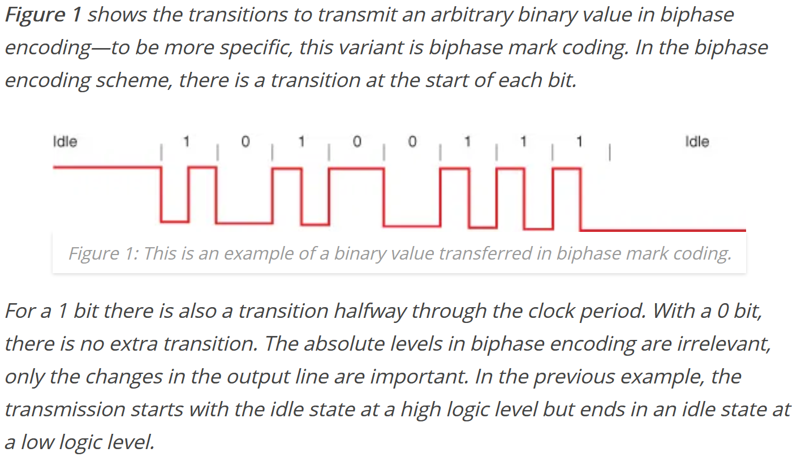
  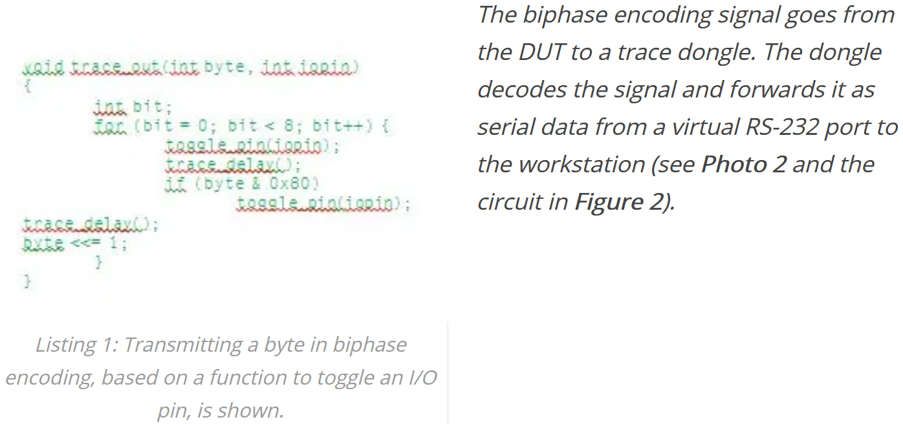

* The 2 images are taken from [https://circuitcellar.com/cc-blog/a-trace-tool-for-embedded-systems/](https://circuitcellar.com/cc-blog/a-trace-tool-for-embedded-systems/). See there for more information.
* As Trice dongle you can use any spare MCU board with an UART together with an FTDI USB converter.
  * This allowes also any other data path - method does'nt matter:\
  [UART](https://en.wikipedia.org/wiki/Universal_asynchronous_receiver-transmitter),\
  [I²C](https://en.wikipedia.org/wiki/I%C2%B2C),\
  [SPI](https://en.wikipedia.org/wiki/Serial_Peripheral_Interface),\
  [GPIO](https://circuitcellar.com/cc-blog/a-trace-tool-for-embedded-systems/),\
  [CAN](https://en.wikipedia.org/wiki/CAN_bus),\
  [LIN](https://en.wikipedia.org/wiki/Local_Interconnect_Network), ...
* [RTT](https://www.segger.com/products/debug-probes/j-link/technology/about-real-time-transfer/) is also a possible path to use - see [Trice over RTT](#trice-over-rtt) for options.

<p align="right">(<a href="#top">back to top</a>)</p>


## 35. <a id="trice-over-rtt"></a>Trice over RTT

> Allows Trice over the debug probe without using a pin or UART.

* RTT works good with a SEGGER J-Link debug probe but needs some closed source software components.
* Also ST-Link is usable for Trice logs, but maybe not parallel with debugging.
* Most investigations where done with a [NUCLEO64-STM32F030R8 evaluation board](https://www.st.com/en/evaluation-tools/nucleo-F030r8.html) which contains an on-board debug probe reflashed with a SEGGER J-Link OB software (see below).
  * When using very high Trice loads over RTT for a long time, sometimes an on-board J-Link (re-flashed ST-Link) could get internally into an inconsistent state (probably internal buffer overrun), what needs a power cycle then.
* You could consider RTT over open-OCD as an alternative.
* The default SEGGER up-buffer size is 1024 bytes, good for most cases. If not, adapt it in your *triceConfig.h* file **AND** in the *SEGGER_RTT_Conf.h* file:
  You need only one up-channel for Trice:

  ```C
  #define BUFFER_SIZE_UP (128)  // "TRICE_DIRECT_BUFFER_SIZE"
  ```
* Inside the [triceDefaultConfig.h](../src/triceDefaultConfig.h) you can find some other settings recommended for the *SEGGER_RTT_Conf.h* file. You have to set them manually in the *SEGGER_RTT_Conf.h* because the SEGGER target sources do not include *trice.h* (and implicit [triceDefaultConfig.h](../src/triceDefaultConfig.h) and *triceConfig.h*).
* **Possible:** Parallel usage of RTT direct mode with UART deferred mode. You can define `TRICE_UARTA_MIN_ID` and `TRICE_UARTA_MAX_ID` inside triceConfig.h to log only a specific ID range over UARTA in deferred mode for example. ([\#446](https://github.com/rokath/trice/issues/446))

<p align="right">(<a href="#top">back to top</a>)</p>

### 35.1. <a id="for-the-impatient-2-possibilities"></a>For the impatient (2 possibilities)

The default SEGGER tools only suport RTT channel 0.

#### 35.1.1. <a id="start-jlink-commander-and-connect-over-tcp"></a>Start JLink commander and connect over TCP

* JLink.exe → `connect ⏎ ⏎ S ⏎` and keep it active.
  * You can control the target with `r[eset], g[o], h[alt]` and use other commands too.
  * 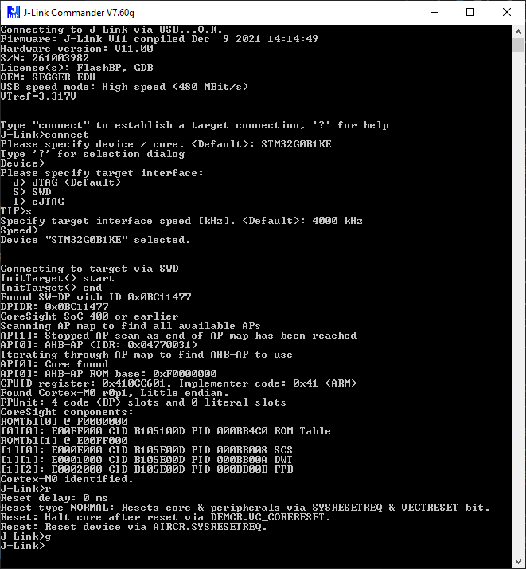
* Start in Git-Bash or something similar: `trice l -p TCP4 -args localhost:19021`
* You may need a Trice tool restart after firmware reload.


<a id='setup-tcp4-server-providing-the-trace-data'></a><h5>Setup TCP4 server providing the trace data</h5>

This is just the SEGGER J-Link server here for demonstration, but if your target device has an TCP4 interface, you can replace this with your target server.

```bash
ms@DESKTOP-7POEGPB MINGW64 ~/repos/trice (main)
$ jlink
SEGGER J-Link Commander V7.92g (Compiled Sep 27 2023 15:36:46)
DLL version V7.92g, compiled Sep 27 2023 15:35:10

Connecting to J-Link via USB...O.K.
Firmware: J-Link STLink V21 compiled Aug 12 2019 10:29:20
Hardware version: V1.00
J-Link uptime (since boot): N/A (Not supported by this model)
S/N: 770806762
VTref=3.300V


Type "connect" to establish a target connection, '?' for help
J-Link>connect
Please specify device / core. <Default>: STM32G0B1RE
Type '?' for selection dialog
Device>
Please specify target interface:
  J) JTAG (Default)
  S) SWD
  T) cJTAG
TIF>s
Specify target interface speed [kHz]. <Default>: 4000 kHz
Speed>
Device "STM32G0B1RE" selected.


Connecting to target via SWD
InitTarget() start
SWD selected. Executing JTAG -> SWD switching sequence.
DAP initialized successfully.
InitTarget() end - Took 36.3ms
Found SW-DP with ID 0x0BC11477
DPv0 detected
CoreSight SoC-400 or earlier
Scanning AP map to find all available APs
AP[1]: Stopped AP scan as end of AP map has been reached
AP[0]: AHB-AP (IDR: 0x04770031)
Iterating through AP map to find AHB-AP to use
AP[0]: Core found
AP[0]: AHB-AP ROM base: 0xF0000000
CPUID register: 0x410CC601. Implementer code: 0x41 (ARM)
Found Cortex-M0 r0p1, Little endian.
FPUnit: 4 code (BP) slots and 0 literal slots
CoreSight components:
ROMTbl[0] @ F0000000
[0][0]: E00FF000 CID B105100D PID 000BB4C0 ROM Table
ROMTbl[1] @ E00FF000
[1][0]: E000E000 CID B105E00D PID 000BB008 SCS
[1][1]: E0001000 CID B105E00D PID 000BB00A DWT
[1][2]: E0002000 CID B105E00D PID 000BB00B FPB
Memory zones:
  Zone: "Default" Description: Default access mode
Cortex-M0 identified.
J-Link>
```

Now the TCP4 server is running and you can start the Trice tool as TCP4 client, which connects to the TCP4 server to receive the binary log data:

```bash
$ trice l -p TCP4 -args="127.0.0.1:19021" -til ../examples/G0B1_inst/til.json -li ../examples/G0B1_inst/li.json -d16 -pf none
```

In this **G0B1_inst** example we use the additional `-d16` and `-pf none` switches to decode the RTT data correctly.

**This is a demonstration and test for the `-port TCP4` usage possibility**. Using RTT with J-Link is more easy possible as shown in the next point.

#### 35.1.2. <a id="start-using-jlinkrttlogger"></a>Start using JLinkRTTLogger

* Start inside Git-Bash or something similar: `trice l -p JLINK -args "-Device STM32F030R8 -if SWD -Speed 4000 -RTTChannel 0"`
  * Replace CLI details with your settings.
  * For **G0B1_inst**: `trice l -p JLINK -args "-Device STM32G0B1RE -if SWD -Speed 4000 -RTTChannel 0" -d16 -pf none`
  * You can add the `-verbose` CLI switch for more details.
* You may **not** need a Trice tool restart after firmware reload.

#### 35.1.3. <a id="jlinkrttlogger-issue"></a>JLinkRTTLogger Issue

* For some reason the RTT technique does not work well with Darwin (macOS) and also Linux right now. The problem seems to be that the JLinkRTTLogger app cannot work correctly in the background. But there is a workaround:
  * Example 1:
    * In one terminal run `JLinkRTTLogger -Device STM32G0B1RE -if SWD -Speed 4000 -RTTChannel 0 myLogFile.bin`
    * and in another terminal execute `trice l -p FILE -args myLogFile.bin -pf none -d16`.
  * Example 2:
    * Flash, start debugger and run to main()
    * Terminal 1: `rm ./temp/trice.bin && JLinkRTTLogger -Device STM32G0B1RE -If SWD -Speed 4000 -RTTChannel 0 ./temp/trice.bin`
    * Terminal 2: `touch ./temp/trice.bin && trice log -p FILE -args ./temp/trice.bin -prefix off -hs off -d16 -ts ms -i ../../demoTIL.json -li ../../demoLI.json -pf none`
    * Continue to run in debugger
    * Terminal 1:
    
      ```bash
      th@P51-DebianKDE:~/repos/trice/examples/G0B1_inst$ rm ./temp/trice.bin && JLinkRTTLogger -Device STM32G0B1RE -If SWD -Speed 4000 -RTTChannel 0 ./temp/trice.bin
      SEGGER J-Link RTT Logger
      Compiled Dec 18 2024 15:48:21
      (c) 2016-2017 SEGGER Microcontroller GmbH, www.segger.com
              Solutions for real time microcontroller applications

      Default logfile path: /home/th/.config/SEGGER

      ------------------------------------------------------------ 


      ------------------------------------------------------------ 
      Connected to:
        SEGGER J-Link ST-LINK
        S/N: 779220206

      Searching for RTT Control Block...OK.
      1 up-channels found:
      0: Terminal
      Selected RTT Channel description: 
        Index: 0
        Name:  Terminal
        Size:  1024 bytes.

      Output file: ./temp/trice.bin

      Getting RTT data from target. Press any key to quit.
      ------------------------------------------------------------ 

      Transfer rate: 0 Bytes/s Data written: 15.71 KB
      ```

    * Terminal 2:
    
      ```bash
      th@P51-DebianKDE:~/repos/trice/examples/G0B1_inst$ touch ./temp/trice.bin && trice log -p FILE -args ./temp/trice.bin -prefix off -hs off -d16 -ts ms  -i ../../demoTIL.json -li ../../demoLI.json -pf none 
            triceExamples.c    12        0,000  Hello! 👋🙂
              ✨✨✨✨✨✨✨✨✨✨✨✨✨✨✨✨✨        
              🎈🎈🎈🎈  NUCLEO-G0B1RE   🎈🎈🎈🎈        
              🍃🍃🍃🍃🍃🍃🍃🍃🍃🍃🍃🍃🍃🍃🍃🍃🍃        


            triceExamples.c    61              TRICE_DIRECT_OUTPUT == 1, TRICE_DEFERRED_OUTPUT == 1
            triceExamples.c    69              TRICE_RING_BUFFER, TRICE_MULTI_PACK_MODE
            triceExamples.c    76              _CYCLE == 1, _PROTECT == 1, _DIAG == 1, XTEA == 1
            triceExamples.c    77              _SINGLE_MAX_SIZE=104, _BUFFER_SIZE=172, _DEFERRED_BUFFER_SIZE=2000
            triceExamples.c    29  0:00:00,003 🐁 Speedy Gonzales a  32-bit timestamp
            triceExamples.c    30  0:00:00,003 🐁 Speedy Gonzales b  32-bit timestamp
            triceExamples.c    31  0:00:00,003 🐁 Speedy Gonzales c  32-bit timestamp
            triceExamples.c    32  0:00:00,003 🐁 Speedy Gonzales d  32-bit timestamp
            triceExamples.c    33        0,310 🐁 Speedy Gonzales e  16-bit timestamp
            triceExamples.c    34        0,328 🐁 Speedy Gonzales f  16-bit timestamp
            triceExamples.c    35        0,347 🐁 Speedy Gonzales g  16-bit timestamp
            triceExamples.c    36        0,365 🐁 Speedy Gonzales h  16-bit timestamp
            triceExamples.c    42        0,394 2.71828182845904523536 <- float number as string
            triceExamples.c    43        0,436 2.71828182845904509080 (double with more ciphers than precision)
            triceExamples.c    44        0,458 2.71828174591064453125 (float  with more ciphers than precision)
            triceExamples.c    45        0,479 2.718282 (default rounded float)
            triceExamples.c    46        0,500 A Buffer:
            triceExamples.c    47        0,520 32 2e 37 31 38 32 38 31 38 32 38 34 35 39 30 34 35 32 33 35 33 36 
            triceExamples.c    48        0,562 31372e32  31383238  34383238  34303935  35333235  
            triceExamples.c    49        0,601 ARemoteFunctionName(2e32)(3137)(3238)(3138)(3238)(3438)(3935)(3430)(3235)(3533)(3633)
            triceExamples.c    50              3 times a 16 byte long Trice messages, which may not be written all if the buffer is too small:
            triceExamples.c    52        0,664 i=44444400 aaaaaa00
            triceExamples.c    52        0,687 i=44444401 aaaaaa01
            triceExamples.c    52        0,709 i=44444402 aaaaaa02
                    main.c   312  0:00:00,003 StartDefaultTask
                    main.c   339  0:00:00,003 StartTask02:Diagnostics and TriceTransfer
        triceLogDiagData.c    21              RTT0_writeDepthMax=365 (BUFFER_SIZE_UP=1024)
        triceLogDiagData.c    44              triceSingleDepthMax =  96 of 172 (TRICE_BUFFER_SIZE)
        triceLogDiagData.c    75              triceRingBufferDepthMax =   0 of 2000
              triceCheck.c    57               line 57
              triceCheck.c    59  0:00:02,325 Hello World!
              triceCheck.c    61  0:00:02,405 This is a message without values and a 32-bit stamp.
              triceCheck.c    62        0,306 This is a message without values and a 16-bit stamp.
              triceCheck.c    63              This is a message without values and without stamp.
      ```
      * See also the configuration in [./examples/G0B1_inst/Core/Inc/triceConfig.h](../examples/G0B1_inst/Core/Inc/triceConfig.h)

* If you install the `tmux` command your life gets esier by using a shell script like [./examples/G0B1_inst/RTTLogTmux.sh](../examples/G0B1_inst/RTTLogTmux.sh):

```bash
mkdir -p ./temp
rm -f ./temp/trice.bin
touch ./temp/trice.bin
tmux new -s "tricerttlog" -d "JLinkRTTLogger -Device STM32G0B1RE -If SWD -Speed 4000 -RTTChannel 0 ./temp/trice.bin"
trice log -p FILE -args ./temp/trice.bin -pf none -prefix off -hs off -d16 -ts16 "time:offs:%4d µs" -showID "deb:%5d" -i ../../demoTIL.json -li ../../demoLI.json -stat
tmux kill-session -t "tricerttlog"
```

  * Usage:

    ```bash
    th@PaulPCdeb128KDE:~/repos/trice/examples/G0B1_inst$ ./RTTLogUnix.sh 
        triceExamples.c    12        0,000  Hello! 👋🙂
          ✨✨✨✨✨✨✨✨✨✨✨✨✨✨✨✨✨        
          🎈🎈🎈🎈  NUCLEO-G0B1RE   🎈🎈🎈🎈
          🍃🍃🍃🍃🍃🍃🍃🍃🍃🍃🍃🍃🍃🍃🍃🍃🍃        


        triceExamples.c    61              TRICE_DIRECT_OUTPUT == 1, TRICE_DEFERRED_OUTPUT == 1
        triceExamples.c    69              TRICE_RING_BUFFER, TRICE_MULTI_PACK_MODE
        triceExamples.c    76              _CYCLE == 1, _PROTECT == 1, _DIAG == 1, XTEA == 1
        triceExamples.c    77              _SINGLE_MAX_SIZE=104, _BUFFER_SIZE=172, _DEFERRED_BUFFER_SIZE=2000
        triceExamples.c    29  0:00:00,002 🐁 Speedy Gonzales a  32-bit timestamp
    ```

* **Hint:** If you use *RTTLogTmux.sh* with Darwin (macOS), the "control-C" key combination seems not to work immediately. That is simply because the keyboard focus switches away after script start. Simply click into the terminal window again and then use "control-C" to terminate the Trice logging.

<p align="right">(<a href="#top">back to top</a>)</p>

### 35.2. <a id="segger-real-time-transfer-rtt"></a>Segger Real Time Transfer (RTT)

* Prerequisite is a processor with memory background access support like ARM Cortex-M cores.
* If you can use a Segger J-Link or an STM ST-Link debug probe (ST Microelectronics eval boards have it) this is an easy and fast way to use Trice without any UART or other port.
* Detailed description can be found in document [UM08001_JLink.pdf](../third_party/segger.com/UM08001_JLink.pdf) in chapter 16 which is part of [https://www.segger.com/downloads/jlink/#J-LinkSoftwareAndDocumentationPack](https://www.segger.com/downloads/jlink/#J-LinkSoftwareAndDocumentationPack).
* Following examples are for Windows, but should work similar also on Linux and Darwin (macOS).
* Trice can use the Segger RTT protocol in different ways.
  * Hardware paths:
    * Use [J-Link](https://www.segger.com/products/debug-probes/j-link/) or [J-Link OB (on-board)](https://www.segger.com/products/debug-probes/j-link/models/j-link-ob/).
      J-Link OB can be flashed to many ST Microelectronics evaluation boards (v2.0 link hardware) and for example is also usable with NXP and Atmel. For that you can also use a spare STM32 evaluation board (10 EUR) with jumper changes and breakout wires.
    * Use ST-Link with [gostlink](../third_party/goST/ReadMe.md).
      It uses only one USB endpoint so debugging and Trice output in parallel is not possible.
    * Use some other Debug-Probe with target memory access (support welcome)
  * RTT channel selection (on target and on host)
    * RECOMMENDED:
      * `trice l -p JLINK` or shorter `trice l` for STM32F030R8 (default port is JLINK) starts in background a `JLinkRTTLogger.exe` which connects to J-Link and writes to a logfile which in turn is read by the Trice tool. On exit the `JLinkRTTLogger.exe` is killed automatically.
        * It expects a target sending messages over RTT channel **0** (zero). Chapter 16.3.3 in [UM08001_JLink.pdf](../third_party/segger.com/UM08001_JLink.pdf) refers to "Up-Channel 1" but this maybe is a typo and probably a 0 is mend. The `JLinkRTTLogger.exe` main advantage against other free available SEGGER tools is, that all bytes are transferred. Other SEGGER tools assume ASCII characters and use `FF 00` to `FF 0F` as a terminal switch command and filter that out causing Trice data disturbances.
        * It should be possible to start several instances on on different targets using `-SelectEmuBySN <SN>` inside the `-args` Trice CLI switch.
        * `JLinkRTTLogger` binaries for Linux & Darwin (macOS) can be found at [https://www.segger.com/downloads/jlink/](https://www.segger.com/downloads/jlink/).
      * `trice l -p STLINK` starts in background a `trice/third_party/goST/stRttLogger.exe` which connects to ST-Link and writes to a logfile which in turn is read by the Trice tool. On exit the `stRttLogger.exe` is killed automatically. It expects a target sending messages over RTT channel 0 (other channels supported too but may not work).\
      It is possible to start several instances on different channels as well as on different targets. The source code is in [https://github.com/bbnote/gostlink](https://github.com/bbnote/gostlink) and should work also at least under Linux.
    * If you have the choice, prefer J-Link. It allows parallel debugging and Trice output.
    * The full `-args` string is normally required and depends on the used device. Example: `trice l -args="-Device STM32F070RB -if SWD -Speed 4000 -RTTChannel 0 -RTTSearchRanges 0x20000000_0x1000"`. The `-RTTSearchRanges` part is mostly optional.
    * Enter `trice h -log` and read info for `-args` switch:

```bash
        -args string
        Use to pass port specific parameters. The "default" value depends on the used port:
        port "COMn": default="", use "TARM" for a different driver. (For baud rate settings see -baud.)
        port "J-LINK": default="-Device STM32F030R8 -if SWD -Speed 4000 -RTTChannel 0 -RTTSearchRanges 0x20000000_0x1000",
                The -RTTSearchRanges "..." need to be written without extra "" and with _ instead of space.
                For args options see JLinkRTTLogger in SEGGER UM08001_JLink.pdf.
        port "ST-LINK": default="-Device STM32F030R8 -if SWD -Speed 4000 -RTTChannel 0 -RTTSearchRanges 0x20000000_0x1000",
                The -RTTSearchRanges "..." need to be written without extra "" and with _ instead of space.
                For args options see JLinkRTTLogger in SEGGER UM08001_JLink.pdf.
        port "BUFFER": default="0 0 0 0", Option for args is any byte sequence.
         (default "default")
 ```

<p align="right">(<a href="#top">back to top</a>)</p>

### 35.3. <a id="j-link-option"></a>J-Link option

* Prerequisite is a SEGGER J-Link debug probe or a development board with an on-board J-Link option.

#### 35.3.1. <a id="convert-evaluation-board-onboard-st-link-to-j-link"></a>Convert Evaluation Board onboard ST-Link to J-Link

* Following steps describe the needed action for a ST Microelectronics evaluation board and windows - adapt them to your environment.
* It is always possible to turn back to the ST-Link OB firmware with the SEGGER `STLinkReflash.exe` tool but afterwards the ST-Link Upgrade tool should be used again to get the latest version.

<a id='first-step-(to-do-if-some-issues-occur---otherwise-you-can-skip-it)'></a><h5>First step (to do if some issues occur - otherwise you can skip it)</h5>

[Video](https://www.youtube.com/watch?app=desktop&v=g2Kf6RbdrIs)

See also [https://github.com/stlink-org/stlink](https://github.com/stlink-org/stlink)

* Get & install [STM32 ST-LINK utility](https://www.st.com/en/development-tools/stsw-link004.html)
* Run from default install location `"C:\Program Files (x86)\STMicroelectronics\STM32 ST-LINKUtility\ST-LINK Utility\ST-LinkUpgrade.exe"`)
* Enable checkbox `Change Type` and select radio button `STM32 Debug+Mass storage + VCP`. *The `STM32Debug+ VCP` won´t be detected by Segger reflash utility.*
  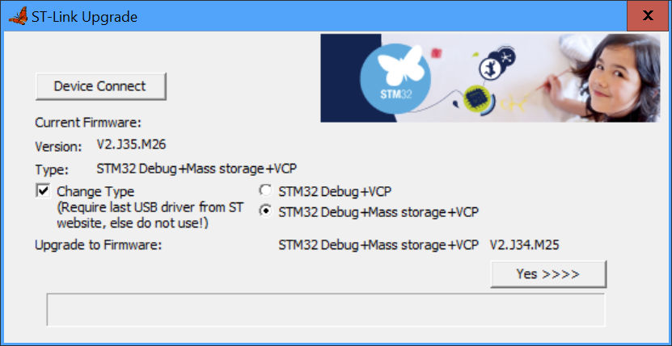

<a id='second-step'></a><h5>Second step</h5>

* Check [Converting ST-LINK On-Board Into a J-Link](https://www.segger.com/products/debug-probes/j-link/models/other-j-links/st-link-on-board/)
* Use `STLinkReflash.exe` to convert NUCLEO from ST-Link on-board to J-Link on-board. *`STM32 Debug+ VCP` won´t be detected by Segger reflash utility.*

#### 35.3.2. <a id="some-segger-tools-in-short"></a>Some SEGGER tools in short

* Download [J-Link Software and Documentation Pack](https://www.segger.com/downloads/jlink/#J-LinkSoftwareAndDocumentationPack) and install.
  * You may need to add `C:\Program Files\SEGGER\JLink` to the %PATH% variable.
* Tested with [NUCLEO64-STM32F030R8 evaluation board](https://www.st.com/en/evaluation-tools/nucleo-F030r8.html).
* For example: Compile and flash `../examples/F030_inst` project.
  * Check in [../examples/F030_inst/Core/Inc/triceConfig.h](../examples/F030_inst/Core/Inc/triceConfig.h) if `#define TRICE_RTT_CHANNEL 0` is set as output option.

<a id='jlink.exe'></a><h5>JLink.exe</h5>

* `JLink.exe` is the SEGGER J-Link commander. It starts the **J-Link driver/server** and one can connect to it
* Info found [here](https://gist.github.com/GaryLee/ecd8018d1ca046c1a40fcd265fa109c0):
  * J-Link Commander can be started with different command line options for test and automation
  * purposes. In the following, the command line options which are available for J-Link
  * Commander are explained. All command line options are case insensitive.
  * Command Explanation
  * -AutoConnect Automatically start the target connect sequence
  * -CommanderScript Passes a CommandFile to J-Link
  * -CommandFile Passes a CommandFile to J-Link
  * -Device Pre-selects the device J-Link Commander shall connect to
  * -ExitOnError Commander exits after error.
  * -If Pre-selects the target interface
  * -IP Selects IP as host interface
  * -JLinkScriptFile Passes a JLinkScriptFile to J-Link
  * -JTAGConf Sets IRPre and DRPre
  * -Log Sets logfile path
  * -RTTTelnetPort Sets the RTT Telnetport
  * -SelectEmuBySN Connects to a J-Link with a specific S/N over USB
  * -SettingsFile Passes a SettingsFile to J-Link
  * -Speed Starts J-Link Commander with a given initial speed
* Documentation: [https://kb.segger.com/J-Link_Commander](https://kb.segger.com/J-Link_Commander)
* If you run successful `jlink -device STM32F030R8 -if SWD -speed 4000 -autoconnect 1` the target is stopped.
  * To let in run you need manually execute `go` as command in the open jlink window.
  * To automate that create a text file named for example `jlink.go` containing the `go` command: `echo go > jlink.go` and do a `jlink -device STM32F030R8 -if SWD -speed 4000 -autoconnect 1 -CommandFile jlink.go`
* It is possible to see some output with Firefox (but not with Chrome?) for example: 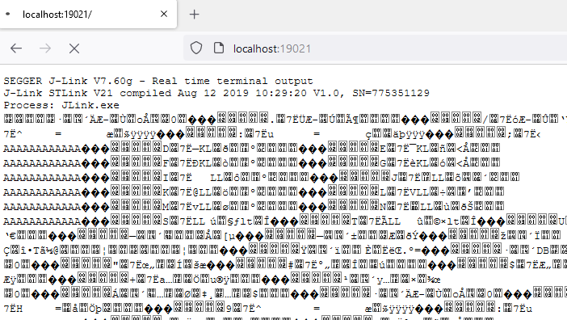.
* After closing the Firefox the Trice tool can connect to it too:
  * Open a commandline and run:
    ```b
    trice log -port TCP4 -args localhost:19021
    ```
    * Trice output is visible
    * With `h`alt and `g`o inside the Jlink window the MCU can get haltes and released
    * It is possible in parallel to debug-step with a debugger (tested with ARM-MDK)
* 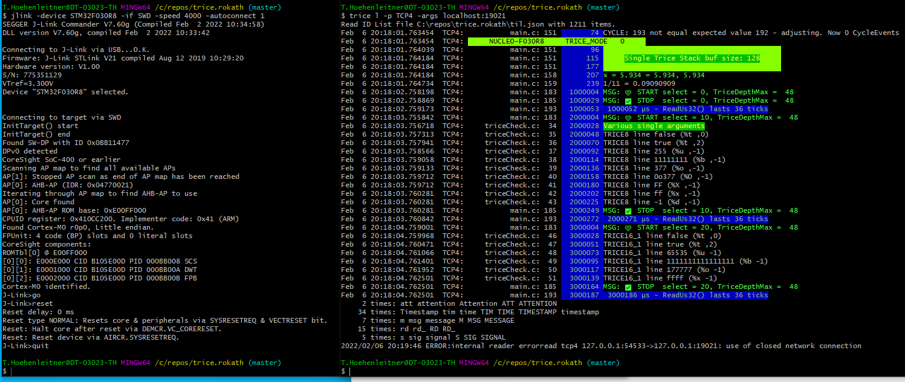
* **PLUS:**
  * Works reliable.
  * No file interface needed.
  * Trice can connect over TCP localhost:19021 and display logs over RTT channel 0.
  * The open `jlink` CLI can be handy to control the target: `[r]eset, [g]o. [h]alt`
  * No need to restart the Trice tool after changed firmware download.
* **MINUS:**
  * Uses RTT up-channel 0 and therefore RTT up-channel 0 is not usable differently.
  * No down-channel usable.
  * Needs a separate manual start of the `jlink` binary with CLI parameters.
    * I would not recommend to automate that too, because this step is needed only once after PC power on.

<a id='jlinkrttlogger.exe'></a><h5>JLinkRTTLogger.exe</h5>

* `JLinkRTTLogger.exe` is a CLI tool and connects via the SEGGER API to the target. It is usable for writing RTT channel 0 data from target into a file.
* **PLUS:**
  * Works reliable.
  * Is automatable.
  * Create file with raw log data: `JLinkRTTLogger.exe -Device STM32F030R8 -if SWD -Speed 4000 -RTTChannel 0 triceRaw.log`
    * It is possible to evaluate this file offline: `trice l -p FILE -args triceRaw.log`
    * 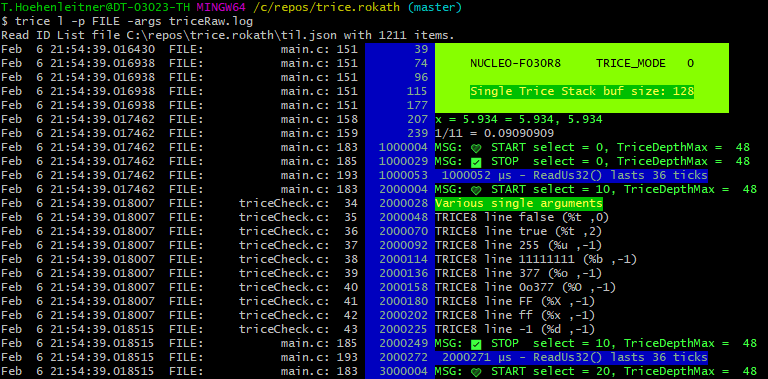
  * No need to restart the Trice tool after changed firmware download.
* **MINUS:**
  * Logs in a file, so the Trice tool needs to read from that file.
  * Maybe cannot write in a file as background process on Darwin (macOS).
* The Trice tool can watch the output file and display the *Trices*: `trice log -port JLINK -args "-Device STM32F030R8 -if SWD -Speed 4000 -RTTChannel 0"
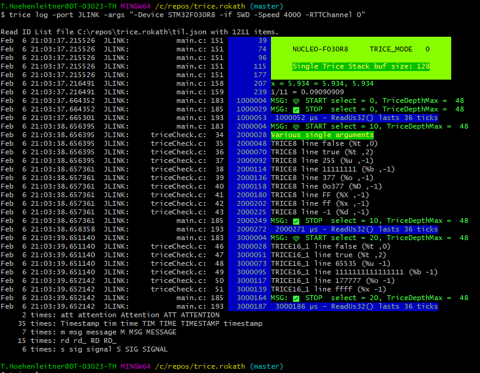

#### 35.3.3. <a id="jlinkrttclientexe"></a>JLinkRTTClient.exe

* `JLinkRTTClient.exe` can be used for simple text transmitting to the target, it also displays strings from target coming over channel 0. It is not used by the Trice tool.
  * **PLUS:**
    * Target stimulation with proprietary protocol over RTT down-channel 0 possible.
  * **MINUS:**
    * Unfortunately it cannot run separately parallel to stimulate the target with any proprietary protocol because it connects to localhost:19021 and therefore blockades the only one possible connection.

#### 35.3.4. <a id="jlinkrttviewerexe"></a>JLinkRTTViewer.exe

* `JLinkRTTViewer.exe` is a GUI tool and connects via the SEGGER API to the target. It expects ASCII codes and is not used by the Trice tool. The switching between the 16 possible terminals is done via `FF 00` ... `FF 0F`. These byte pairs can occur inside the Trice data.

<!---

* Start `"C:\Program Files (x86)\SEGGER\JLink\JLinkRTTViewer.exe"` and connect to the J-Link. You only need this as a running server to connect to.
  * Unfortunately the JLinkRTTViewer "steals" from time to time some Trice data packages and displays them as data garbage.
  * Better use JLink.exe or the *Segger J-Link SDK* instead.

-->

<p align="right">(<a href="#top">back to top</a>)</p>

### 35.4. <a id="segger-rtt"></a>Segger RTT

* The main advantages are:
  * Speed
  * No `TriceTransfer()` nor any interrupt is needed in the background
  * No UART or other output is needed
* This is, because automatically done by SeggerRTT. This way one can debug code as comfortable as with `printf()` but with all the TRICE advantages. Have a look here: 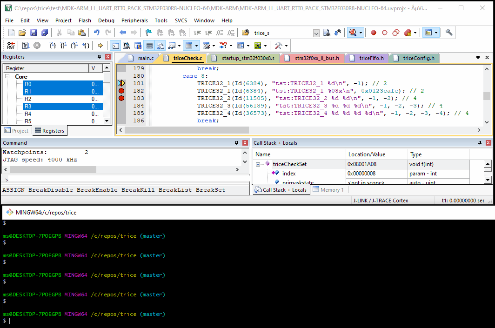
* Avoid Trice buffering inside target and write with TRICE macro directly into the RTT buffer (direct Trice mode = `#define TRICE_MODE 0` inside [triceConfig.h](../examples/F030_inst/Core/Inc/triceConfig.h)).
* Write the bytes per Trice directly (little time & some space overhead on target, but no changes on host side)

  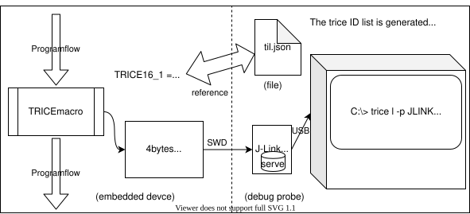

<p align="right">(<a href="#top">back to top</a>)</p>

### 35.5. <a id="segger-j-link-sdk-800-eur-option"></a>Segger J-Link SDK (~800 EUR) Option

* Segger offers a SeggerRTT SDK which allows to use more than just channel 0 and you can develop your own tooling with it.
* The `trice -port JLINK` is ok for usage **as is** right now. However if you wish more comfort check here:
* Question: [How-to-access-multiple-RTT-channels](https://forum.segger.com/thread/6688-solved-how-to-access-multiple-rtt-channels-from-telnet/)
  * "Developer pack used to write your own program for the J-Link. Please be sure you agree to the terms of the associated license found on the Licensing Information tab before purchasing this SDK. You will benefit from six months of free email support from the time that this product is ordered."
* The main [Segger J-Link SDK](https://www.segger.com/products/debug-probes/j-link/tools/j-link-sdk/) disadvantage beside closed source and payment is: **One is not allowed to distribute binaries written with the SDK.** That makes it only interesting for company internal automatization.

<p align="right">(<a href="#top">back to top</a>)</p>

### 35.6. <a id="additional-notes-leftovers"></a>Additional Notes (leftovers)

* `Downloading RTT target package` from [https://www.segger.com/products/debug-probes/j-link/technology/about-real-time-transfer/](https://www.segger.com/products/debug-probes/j-link/technology/about-real-time-transfer/).
* Read the manual [UM08001_JLink.pdf](../third_party/segger.com/UM08001_JLink.pdf).
* The stored RTT source package is [SEGGER_RTT_V812a.zip](../third_party/segger.com/SEGGER_RTT_V812a.zip). See [Third-party packages and retained versions](#third-party-packages-and-retained-versions) before changing target sources.
* Add `SEGGER_RTTI.c` to target project

<p align="right">(<a href="#top">back to top</a>)</p>

### 35.7. <a id="further-development"></a>Further development

* Check OpenOCD!
  * Use OpenOCD and its built-in RTT feature. OpenOCD then starts a server on localhost:17001 where it dumps all RTT messages.
* The GoST project offers a way bypassing JLINK. Used -port STLINK instead.
* Maybe `libusb` together with `libjaylink` offer some options too.
* Checkout [https://github.com/deadsy/jaylink](https://github.com/deadsy/jaylink).
* `"C:\Program Files (x86)\SEGGER\JLink\JMem.exe"` shows a memory dump.

* Go to [https://libusb.info/](https://libusb.info/)
  * -> Downloads -> Latest Windows Binaries
  * extract `libusb-1.0.23` (or later version)

```b
libusb-1.0.23\examples\bin64> .\listdevs.exe
2109:2811 (bus 2, device 8) path: 6
1022:145f (bus 1, device 0)
1022:43d5 (bus 2, device 0)
0a12:0001 (bus 2, device 1) path: 13
1366:0105 (bus 2, device 10) path: 5
```

* Repeat without connected Segger JLink

```b
libusb-1.0.23\examples\bin64> .\listdevs.exe
2109:2811 (bus 2, device 8) path: 6
1022:145f (bus 1, device 0)
1022:43d5 (bus 2, device 0)
0a12:0001 (bus 2, device 1) path: 13
```

* In this case `1366:0105 (bus 2, device 10) path: 5` is missing, so `vid=1366`, `did=0105` as example
* On Windows install WSL2. The real Linux kernel is needed for full USB access.

<p align="right">(<a href="#top">back to top</a>)</p>

### 35.8. <a id="nucleo-f030r8-example"></a>NUCLEO-F030R8 example

Info: [https://www.st.com/en/evaluation-tools/nucleo-F030r8.html](https://www.st.com/en/evaluation-tools/nucleo-F030r8.html)

#### 35.8.1. <a id="rtt-with-original-on-board-st-link-firmware"></a>RTT with original on-board ST-LINK firmware

* `#define TRICE_RTT_CHANNEL 0`:
* If you use a NUCLEO-F030R8 with the original ST-Link on board after firmware download enter: `trice l -p ST-LINK -args "-Device STM32F030R8 -if SWD -Speed 4000 -RTTChannel 0 -RTTSearchRanges 0x20000000_0x2000"`. After pressing the reset button output becomes visible: 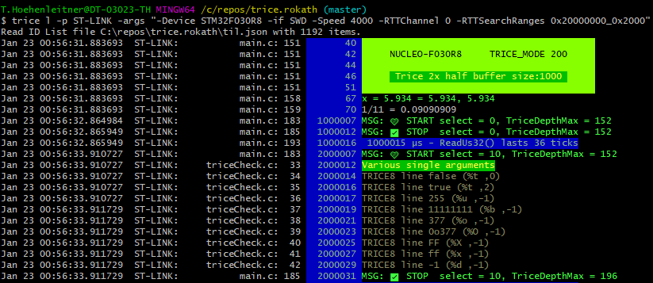
* It works with both ST-Link variants (with or without mass storage device.)

#### 35.8.2. <a id="change-to-j-link-onboard-firmware"></a>Change to J-LINK onboard firmware

 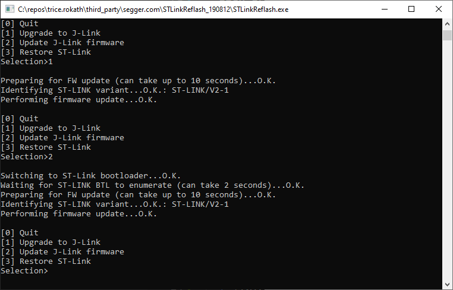

#### 35.8.3. <a id="rtt-with-j-link-firmware-on-board"></a>RTT with J-LINK firmware on-board

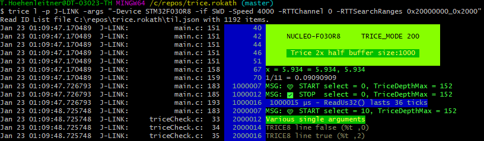

* Observations:
  * When pressing the black reset button, you need to restart the Trice tool.
  * When restarting the Trice tool, a target reset occurs.
  * Other channel numbers than `0` seam not to work for some reason.

<p align="right">(<a href="#top">back to top</a>)</p>

### 35.9. <a id="possible-issues"></a>Possible issues

* These boards seem not to work reliable with RTT over J-Link on-board firmware.
  * NUCLEO-G071RB
  * NUCLEO_G031K8
* After flashing back the ST-LINK OB firmware with the SEGGER tool, it is recommended to use the ST tool to update the ST-LINK OB firmware. Otherwise issues could occur.

<p align="right">(<a href="#top">back to top</a>)</p>

### 35.10. <a id="openocd-with-darwin-macos"></a>OpenOCD with Darwin (macOS)

* OpenOCD on macOS works out of the box after installing it.
* When using VS code with Cortex-Debug you cannot use OpenOCD at the same time.
* The `openocd.cfg` file is taylored to the flashed on-board J-Link adapter.

**Terminal 1:**

```bash
brew install open-ocd
...
cd ./trice/examples/G0B1_inst
openocd -f openocd.cfg
Open On-Chip Debugger 0.12.0
Licensed under GNU GPL v2
For bug reports, read
    http://openocd.org/doc/doxygen/bugs.html
srst_only separate srst_nogate srst_open_drain connect_deassert_srst

Info : Listening on port 6666 for tcl connections
Info : Listening on port 4444 for telnet connections
Info : J-Link STLink V21 compiled Aug 12 2019 10:29:20
Info : Hardware version: 1.00
Info : VTarget = 3.300 V
Info : clock speed 2000 kHz
Info : SWD DPIDR 0x0bc11477
Info : [stm32g0x.cpu] Cortex-M0+ r0p1 processor detected
Info : [stm32g0x.cpu] target has 4 breakpoints, 2 watchpoints
Info : starting gdb server for stm32g0x.cpu on 3333
Info : Listening on port 3333 for gdb connections
Info : rtt: Searching for control block 'SEGGER RTT'
Info : rtt: Control block found at 0x20001238
Info : Listening on port 9090 for rtt connections
Channels: up=1, down=0
Up-channels:
0: Terminal 1024 0
Down-channels:

Info : Listening on port 6666 for tcl connections
Info : Listening on port 4444 for telnet connections
```

**Terminal 2:**

```bash
ms@MacBook-Pro G0B1_inst % trice l -p TCP4 -args localhost:9090  -pf none -d16
Nov 14 17:32:33.319451  TCP4:       triceExamples.c    10        0_000  Hello! 👋🙂
Nov 14 17:32:33.319463  TCP4:
Nov 14 17:32:33.319463  TCP4:         ✨✨✨✨✨✨✨✨✨✨✨✨✨✨✨✨✨
Nov 14 17:32:33.319463  TCP4:         🎈🎈🎈🎈  NUCLEO-G0B1RE   🎈🎈🎈🎈
Nov 14 17:32:33.319463  TCP4:         🍃🍃🍃🍃🍃🍃🍃🍃🍃🍃🍃🍃🍃🍃🍃🍃🍃
Nov 14 17:32:33.319463  TCP4:
Nov 14 17:32:33.319463  TCP4:
Nov 14 17:32:33.406455  TCP4:       triceExamples.c    16        0_037 2.71828182845904523536 <- float number as string
Nov 14 17:32:33.505116  TCP4:       triceExamples.c    17        0_087 2.71828182845904509080 (double with more ciphers than precision)
Nov 14 17:32:33.607518  TCP4:       triceExamples.c    18        0_117 2.71828174591064453125 (float  with more ciphers than precision)
Nov 14 17:32:33.707851  TCP4:       triceExamples.c    19        0_146 2.718282 (default rounded float)
Nov 14 17:32:33.807685  TCP4:       triceExamples.c    20        0_175 A Buffer:
Nov 14 17:32:33.908202  TCP4:       triceExamples.c    21        0_204 32 2e 37 31 38 32 38 31 38 32 38 34 35 39 30 34 35 32 33 35 33 36
Nov 14 17:32:34.007148  TCP4:       triceExamples.c    22        0_254 31372e32  31383238  34383238  34303935  35333235
Nov 14 17:32:35.007949  TCP4:       triceExamples.c    23        0_301 ARemoteFunctionName(2e32)(3137)(3238)(3138)(3238)(3438)(3935)(3430)(3235)(3533)(3633)
Nov 14 17:32:35.112304  TCP4:       triceExamples.c    24              100 times a 16 byte long Trice messages, which not all will be written because of the TRICE_PROTECT:
Nov 14 17:32:35.307567  TCP4:       triceExamples.c    26        0_379 i=44444400 aaaaaa00
Nov 14 17:32:35.408257  TCP4:       triceExamples.c    27    0,000_002 i=44444400 aaaaaa00
Nov 14 17:32:35.509022  TCP4:       triceExamples.c    26        0_441 i=44444401 aaaaaa01
Nov 14 17:32:35.609439  TCP4:       triceExamples.c    27    0,000_002 i=44444401 aaaaaa01
Nov 14 17:32:35.710201  TCP4:       triceExamples.c    26        0_504 i=44444402 aaaaaa02
...
```

### 35.11. <a id="segger-j-link-on-darwin-macos"></a>SEGGER J-Link on Darwin (macOS)

TODO: Working example with SEGGER_RTT J-Link and Open OCD

### 35.12. <a id="links"></a>Links

<!--* [https://www.codeinsideout.com/blog/stm32/j-link-rtt/](https://www.codeinsideout.com/blog/stm32/j-link-rtt/) (A good explanation of SEGGER J-Link Realtime Transfer - Fast Debug protocol: - only suitable for ASCII transfer) -->
* [USB over WSL2?](https://twitter.com/beriberikix/status/1487127732190212102?s=20&t=NQVa27qvOqPi2uGz6pJNRA) (Maybe intersting for OpenOCD)
* https://kickstartembedded.com/2024/03/26/openocd-one-software-to-rule-debug-them-all/?amp=1
* https://mcuoneclipse.com/2021/10/03/visual-studio-code-for-c-c-with-arm-cortex-m-part-9-rtt/

<p align="right">(<a href="#top">back to top</a>)</p>

## 36. <a id="writing-the-trice-logs-into-an-sd-card-or-a-user-specific-output"></a>Writing the Trice logs into an SD-card (or a user specific output)

* Enable `TRICE_DEFERRED_AUXILIARY8` in your project specific _triceConfig.h_ file. 
* Enabling `TRICE_DEFERRED_AUXILIARY8` is possible parallel to any direct and/or deferred output.
* The `TRICE_DEFERRED_OUT_FRAMING` value is used also for the deferred auxiliary writes.
* Consider the value for `TRICE_DEFERRED_TRANSFER_MODE`. The `TRICE_SINGLE_PACK_MODE` would trigger a file write function on each single Trice message. 
* Provide a self-made function like this:

    ```C
    /// mySDcardWrite performs SD-card writing by appending to file myTriceLogs.bin.
    mySDcardWrite(const uint8_t* buf, size_t bufLen){
        ...
    }

    /// Assign this function pointer accordingly.
    UserNonBlockingDeferredWrite8AuxiliaryFn = mySDcardWrite; 
    ```

* If the SD-card write is more effective using 32-bits chunks, consider `TRICE_DEFERRED_AUXILIARY32`, what is recommended also if you use the encryption option.
  * `TRICE_DEFERRED_AUXILIARY32` writes whole 32-bit words and pads the last word with zero bytes when needed.
* There maybe use cases for `TRICE_DIRECT_AUXILIARY8` or `TRICE_DIRECT_AUXILIARY32`, but consider the max write time.
* Placing the files *til.json* and *li.json* anto the SD-card as well might be meaninjful.
* To decode *myTriceLogs.bin* later

    ```bash
    trice log -port FILEBUFFER -args myTriceLogs.bin -hs off
    ```

Related issues/discussions:
[\#253](https://github.com/rokath/trice/discussions/253)
[\#405](https://github.com/rokath/trice/discussions/405)
[\#425](https://github.com/rokath/trice/issues/425)
[\#447](https://github.com/rokath/trice/discussions/447)
[\#537](https://github.com/rokath/trice/discussions/537)

<p align="right">(<a href="#top">back to top</a>)</p>

## 37. <a id="trice-target-code-implementation"></a>Trice Target Code Implementation

### 37.1. <a id="trice-macro-structure"></a>TRICE Macro structure

#### 37.1.1. <a id="triceenter"></a>TRICE_ENTER

* Optionally disable interrupts.
* Prepare `TriceBufferWritePosition` and keep its initial value.

#### 37.1.2. <a id="triceput"></a>TRICE_PUT

* Use and increment `TriceBufferWritePosition`.

#### 37.1.3. <a id="triceleave"></a>TRICE_LEAVE

* Use `TriceBufferWritePosition` and its initial value for data transfer
* Optionally restore interrupt state.

### 37.2. <a id="tricestackbuffer"></a>TRICE_STACK_BUFFER

* `TRICE_ENTER`: Allocate stack
* `TRICE_LEAVE`: Call TriceDirectOut()

### 37.3. <a id="tricestaticbuffer"></a>TRICE_STATIC_BUFFER

* This is like `TRICE_STACK_BUFFER` but avoids stack allocation, what is better for many stacks.
* `TRICE_ENTER`: Set TriceBufferWritePosition to buffer start.
* `TRICE_LEAVE`: Call TriceDirectOut().

### 37.4. <a id="tricedoublebuffer"></a>TRICE_DOUBLE_BUFFER

* `TRICE_ENTER`: Keep TriceBufferWritePosition.
* `TRICE_LEAVE`: Optionally call TriceDirectOut().

### 37.5. <a id="triceringbuffer"></a>TRICE_RING_BUFFER

* `TRICE_ENTER`: Keep or wrap TriceBufferWritePosition and add offset.
* `TRICE_LEAVE`: Optionally call TriceDirectOut().

The `TRICE_RING_BUFFER` allocates incremental ring buffer space and each trice location is read by a deferred task.

### 37.6. <a id="deferred-out"></a>Deferred Out

#### 37.6.1. <a id="double-buffer"></a>Double Buffer

* TriceTransfer
  * TriceOut
  * TriceNonBlockingWrite( triceID, enc, encLen );

#### 37.6.2. <a id="ring-buffer"></a>Ring Buffer

* TriceTransfer
  * lastWordCount = TriceSingleDeferredOut(addr);
    * int triceID = TriceIDAndBuffer( pData, &wordCount, &pStart, &Length );
    * TriceNonBlockingWrite( triceID, pEnc, encLen );

#### 37.6.3. <a id="local-deferred-text-log"></a>Local Deferred Text Log

Local deferred logging keeps every time-critical Trice producer binary and
short, but turns complete records into plain text later on the target. A common
use is a low-priority FreeRTOS logging task which writes to UART, USB, a file,
or an existing application console without a host-side `trice log` process.

```text
tasks and interrupts
        |
        | trice(...)
        v
ring or double buffer containing ordinary binary Trice records
        |
        | one background consumer
        v
TriceLog(applicationBuffer, applicationBufferSize)
        |
        v
application UART, USB, file, or console writer
```

`TriceLog()` and `TriceTransfer()` are alternative consumers of the same
deferred buffer. Never call both for one buffer. The producer-side wire format,
the normal host decoder, `til.json`, and existing `trice insert`/`trice bind`
workflows are unchanged.

##### Basic configuration

Applications set local-log options in their ordinary `triceConfig.h`. The
library defaults and the detailed description of every switch live in
`src/triceLogDefaultConfig.h`; applications do not copy or edit that file.

```c
#define TRICE_BUFFER TRICE_RING_BUFFER
#define TRICE_DEFERRED_OUTPUT 1
#define TRICE_DIRECT_OUTPUT 0
#define TRICE_LOCAL_LOG 1
```

`TRICE_DOUBLE_BUFFER` is supported as an alternative. Producer tasks and
interrupts still only append compact records. Formatting begins when the
background consumer calls `TriceLog()`.

Local formatting needs an ID-to-format table in the target build. First make
source IDs authoritative with either `trice bind` or legacy `trice insert`,
then generate a table containing only the currently selected sources:

```sh
trice bind -src <source> -til til.json
# Alternatively: trice insert -src <source> -til til.json

trice generate -src <source> -til til.json -logC
```

Repeat `-src` for additional files or directories. Bind sidecars are read from
`./generated` by default; specify `-genDir` for a different sidecar
directory. Bare `-logC` writes `./generated/til.c`; `-logC=build/til.c` chooses an explicit location. `-logC` and `-abc` are separate generator modes and cannot be used
together.

The generated C file includes compile-time guards derived from its Trice type,
format string, and payload width. It therefore uses the same local-log switches
as the formatter. A disabled capability removes the affected format strings
from the compiled target image; regenerating `til.c` for every option change is
not required. Regeneration is required after source IDs, Trice types, or format
strings change.

##### Configuration switches

The switches are deliberately independent of any printf implementation. Their
names are similar to familiar nanoprintf choices where useful, but Trice neither
includes nanoprintf nor defines `NANOPRINTF_*` macros.

| Switch | Default | Effect when set to `1` |
| --- | ---: | --- |
| `TRICE_LOCAL_LOG` | `0` | Includes the local consumer and formatter. |
| `TRICE_LOCAL_LOG_USE_PRINTF_HOOK` | `1` | Declares and uses the runtime `UserTriceLogPrintfFn` hook. |
| `TRICE_LOCAL_LOG_USE_MINIMAL_FORMATTER` | `1` | Includes the separate exact `%d`/`%x` fallback. |
| `TRICE_LOCAL_LOG_USE_FIELD_WIDTH_FORMAT_SPECIFIERS` | `1` | Accepts fixed widths such as `%8d`, `%02x`, and `%-12s`. |
| `TRICE_LOCAL_LOG_USE_PRECISION_FORMAT_SPECIFIERS` | `1` | Accepts fixed precision such as `%.3f` and `%.5s`. |
| `TRICE_LOCAL_LOG_USE_FLOAT_FORMAT_SPECIFIERS` | `1` | Accepts `%e`, `%E`, `%f`, `%F`, `%g`, and `%G` through the hook. |
| `TRICE_LOCAL_LOG_USE_64_BIT_VALUES` | `1` | Includes 64-bit integer, buffer, and `aDouble()` paths. |
| `TRICE_LOCAL_LOG_USE_BINARY_FORMAT_SPECIFIERS` | `0` | Includes Trice's internal `%b` conversion. |
| `TRICE_LOCAL_LOG_USE_ALT_FORM_FLAG` | `1` | Accepts `#`, including the internal `%#b` prefix. |
| `TRICE_LOCAL_LOG_USE_EXTENDED_FORMAT_SPECIFIERS` | `0` | Includes internal `%O`, `%t`, `%p`, and `%q` conversions. |
| `TRICE_LOCAL_LOG_USE_DYNAMIC_STRING_TRICES` | `1` | Includes bounded `triceS` and string-form `triceN`. |
| `TRICE_LOCAL_LOG_USE_BUFFER_TRICES` | `0` | Includes `TRICE8_B` through `TRICE64_B`. |
| `TRICE_LOCAL_LOG_USE_PREFIX_HOOK` | `0` | Declares and calls `UserTriceLogPrefixFn` before each message body. |
| `TRICE_LOCAL_LOG_USE_ANSI_COLORS` | `0` | Colors records which begin with a recognized Trice tag. |
| `TRICE_LOCAL_LOG_STRIP_LOWER_CASE_TAGS` | `0` | Removes a recognized all-lower-case tag and its first colon. |
| `TRICE_LOCAL_LOG_KEEP_DISABLED_IDS` | `1` | Keeps ID and shape metadata, but no string, for disabled generated entries. |

Every switch is Boolean and invalid values fail during preprocessing. Defaults
preserve the original local-log integer, string, width, precision, float, and
64-bit capabilities. The newer binary, extended, buffer, and prefix paths are
opt-in so an existing target does not acquire avoidable code or data.

`TRICE_LOCAL_LOG_KEEP_DISABLED_IDS == 1` lets `TriceLog()` distinguish a known
ID whose formatter feature is off from an absent or obsolete ID. It returns
`TRICE_LOG_ERR_FEATURE_DISABLED` for the former. Set it to `0` for the smallest
table; such an ID then returns `TRICE_LOG_ERR_ID` because its row is absent.

##### Optional tag presentation

The two presentation switches are independent. With both set to `0`, local
logging returns exactly the formatted record body as before. Enabling only
`TRICE_LOCAL_LOG_STRIP_LOWER_CASE_TAGS` changes `msg:Hello` to `Hello`, but
keeps `MSG:Hello`, `Message:Hello`, and unknown `project:Hello` prefixes. The
test is an exact match against a recognized built-in alias; arbitrary text
before a colon is never removed.

Enabling only `TRICE_LOCAL_LOG_USE_ANSI_COLORS` retains the tag and surrounds
the complete record body with its matching ANSI Select Graphic Rendition
sequence. Enabling both removes a recognized lower-case tag and colors the
remaining body. A reset is inserted before trailing CR and LF bytes in every
record. Color state therefore never crosses a `TriceLog()` call, even when
several tasks produce records or the consumer encounters an error. An optional
prefix hook remains outside the colored body.

The target alias and palette table is in `src/triceLogAnsi.c`. It intentionally
mirrors the established host hints in
`internal/emitter/lineTransformerANSI.go` instead of generating a target
dependency on Go. Reciprocal comments in those files identify the manual,
optional synchronization point. User-defined host labels and host log-level
filtering are not part of local presentation. Applications which compile an
explicit source list must add `triceLogAnsi.c` when either presentation switch
is enabled; source-wildcard builds already pick it up with the other Trice C
files.

ANSI bytes are ordinary output bytes. A compatible serial terminal interprets
them as colors, while a redirected file retains the escape sequences. Disable
the color switch for consumers which require plain text. When both presentation
switches are off, the separately compiled `triceLogAnsi.c` contributes neither
code nor its alias and palette strings, even without link-time optimization.

##### Selecting a printf implementation

The optional hook has the `snprintf` contract:

```c
typedef int (*TriceLogPrintfFn_t)(
    char *buffer,
    size_t size,
    const char *format,
    ...);
```

When hook support is enabled, install the function before consuming records:

```c
#include <stdio.h>
#include "trice.h"

UserTriceLogPrintfFn = snprintf;
```

Possible implementations include a system or C-library `snprintf`, newlib,
picolibc, nanoprintf, eyalroz/printf, and an `snprintf`-compatible adapter
around stb_sprintf. The hook must return the number of bytes which would have
been written without the final NUL, including when its destination is too
small. A negative hook result becomes `TRICE_LOG_ERR_PRINTF`.

Trice calls the hook once per ordinary scalar conversion. It does not build an
argument array. This keeps stack use independent of the number of values and
lets the user formatter handle its normal `%d`, `%u`, `%x`, or float path. The
following features are deliberately handled inside Trice and never delegated:

- bounded dynamic `%s`, because the binary payload has a length but no required
  trailing NUL;
- `%b`, because it is not portable across printf implementations;
- `%O`, `%t`, `%p`, and `%q`, because Trice host semantics differ from standard
  C printf implementations;
- repeated Buffer-Trice iteration and prefix placement.

The small internal formatter lives in `triceLogMinimal.c`, separately from the
record decoder. With `TRICE_LOCAL_LOG_USE_MINIMAL_FORMATTER == 1`, a null printf
hook supports only exact `%d` and lowercase `%x`. Set the option to `0` when an
external hook is always installed. The fallback then contributes no code even
without LTO. Literal text, `%%`, and enabled dynamic strings need neither
formatter implementation.

For nanoprintf, configure both layers consistently. For example, float output
needs both `TRICE_LOCAL_LOG_USE_FLOAT_FORMAT_SPECIFIERS == 1` and
`NANOPRINTF_USE_FLOAT_FORMAT_SPECIFIERS == 1`. Trice's field-width, precision,
64-bit, and alternative-form switches describe what records Trice retains and
accepts; the corresponding nanoprintf switches describe what the selected hook
can actually print. Trice's internal `%b` does not require nanoprintf binary
support.

##### Formatter families

With a printf hook, ordinary fixed scalar Trices support `%d`, `%i`, `%u`,
`%o`, `%x`, `%X`, and `%c`. Constant flags, widths, and precisions are passed to
the hook when their Trice switches are enabled. Source integer length modifiers
are normalized to the `long` or `long long` argument supplied by Trice. Dynamic
`*` width or precision remains unsupported because it would consume an
additional argument which is not represented as a separate Trice value.

`TRICE_LOCAL_LOG_USE_BINARY_FORMAT_SPECIFIERS` adds `%b`. The formatter supports
fixed width, precision, zero padding, left alignment, and the `0b` prefix for
`%#b` when the related switches are enabled.

`TRICE_LOCAL_LOG_USE_EXTENDED_FORMAT_SPECIFIERS` adds the established host
meanings:

- `%O` prints octal with a `0o` prefix;
- `%t` prints `true` or `false`;
- `%p` prints the transported fixed-width value as lowercase hexadecimal, not
  a C pointer; `#` adds `0x` locally;
- scalar `%q` prints a quoted character and dynamic `%q` prints an escaped,
  quoted string.

`TRICE_LOCAL_LOG_USE_DYNAMIC_STRING_TRICES` accepts exactly one `%s`, or one
`%q` when extended formats are enabled, in a dynamic string record. The encoded
payload length is always the read boundary. An embedded NUL in an explicitly
sized `triceN` retains normal string semantics and ends visible text early.
Fixed width, precision, and left alignment are supported when enabled. Wide
strings and multiple dynamic conversions are rejected.

Buffer Trices use one scalar item conversion:

```c
uint16_t samples[] = {1u, 0x2au, 0x1234u};
TRICE16_B("buffer:%04x \n", samples, 3u);
```

Text through the first colon is written once. The remainder, without its final
newline, is repeated for each aligned payload element; one newline is appended
after all elements. The configured item conversion and its payload width must
also be enabled. The record stays at its ring- or double-buffer location while
the elements are interpreted.

For floating point, retain the established source convention:

```c
trice32("float:value=%.3f\n", aFloat(valueF));
trice64("float:value=%.9f\n", aDouble(valueD));
```

Trice reconstructs `aFloat()` from 32 payload bits and `aDouble()` from 64 bits,
then passes a promoted `double` to the hook. `%f`, `%F`, `%e`, `%E`, `%g`, and
`%G` are accepted. Float formats need hook support; `aDouble()` additionally
needs 64-bit support. The selected hook controls decimal rendering quality and
its Flash cost.

Dynamic function (`F`) and ABC records are not local text records and remain
unsupported. Other deliberate exclusions are `%n`, dynamic `*`, wide `%lc` and
`%ls`, byte-slice `%x`/`% x` formatting of dynamic string records, host
log-level filtering, user-defined host labels, and host-side location
presentation. These restrictions apply only to `TriceLog()` and its generated
target table; they do not remove the corresponding records or decoder behavior
from normal binary logging.

##### Optional prefix hook

An application can prepend presentation data without adding it to every format
string:

```c
#define TRICE_LOCAL_LOG_USE_PREFIX_HOOK 1

static int LocalPrefix(
    char *buffer,
    size_t size,
    uint16_t id,
    uint8_t stampBits,
    uint32_t stamp) {
    return snprintf(buffer, size, "[%u:%lu] ",
                    (unsigned)id, (unsigned long)stamp);
}

UserTriceLogPrefixFn = LocalPrefix;
```

The hook receives the parsed ID and raw stamp facts. It deliberately does not
assume that every stamp is time. It follows the same `snprintf` size contract;
a negative result becomes `TRICE_LOG_ERR_PREFIX`. A null hook produces no
prefix.

##### Calling `TriceLog`

One background task usually drains all complete records:

```c
char text[160];
int length;

while ((length = TriceLog(text, sizeof(text))) > 0) {
    ApplicationTextWrite(text, (size_t)length);
}
```

The API contract is:

- A positive result is the number of visible bytes, excluding the final NUL.
- Zero means no complete printable record is available.
- A negative result is a `TRICE_LOG_ERR_*` value from `triceLog.h`.
- `maxlen` is the complete destination capacity including the final NUL.
- Every valid non-null destination with `maxlen > 0` is NUL-terminated on every
  return path.
- With `maxlen == 1`, only an empty C string fits. A waiting non-empty record is
  consumed and `TRICE_LOG_ERR_OUTPUT_TOO_SMALL` is returned.

Invalid API arguments do not consume a record. Success and record-local errors
consume exactly one complete record so the next call can progress. Structural
corruption or conflicting metadata clears the queue because the next record
boundary is not trustworthy. Unknown IDs, disabled features, insufficient
output space, and formatter-hook errors consume only their current record.

There is no dynamic allocation. Payload data is interpreted at its current
deferred-buffer location and released only after formatting completes. The
application owns the separate text buffer and may immediately pass its first
`length` bytes to an existing writer.

##### Size-oriented configurations

A literal/string-oriented target without any printf code can use:

```c
#define TRICE_LOCAL_LOG 1
#define TRICE_LOCAL_LOG_USE_PRINTF_HOOK 0
#define TRICE_LOCAL_LOG_USE_MINIMAL_FORMATTER 0
#define TRICE_LOCAL_LOG_USE_FIELD_WIDTH_FORMAT_SPECIFIERS 0
#define TRICE_LOCAL_LOG_USE_PRECISION_FORMAT_SPECIFIERS 0
#define TRICE_LOCAL_LOG_USE_FLOAT_FORMAT_SPECIFIERS 0
#define TRICE_LOCAL_LOG_USE_64_BIT_VALUES 0
```

An integer target can leave the exact `%d`/`%x` minimal formatter enabled and
disable the hook. A feature-rich console can enable hook, width, precision,
float, 64-bit, binary, extended, string, and buffer switches explicitly. The
two approaches can use the same generated `til.c`; its preprocessor guards
select only rows valid for the active `triceConfig.h`.

##### Examples

[`examples/PC_log`](#pc-local-logging) is an immediately runnable
host program using the system `snprintf` and standard output. After a short
introductory sequence, it scans the complete shared
`_test/testdata/triceCheck.c` producer corpus and fails with the exact selector
and local-log error if an emitted record cannot be formatted.

[`examples/G0B1_log`](#g0b1-freertos-local-logging) is an independent STM32G0B1
FreeRTOS project using nanoprintf in its background task and plain-text USART2
output. Its existing default and diagnostics tasks retain their CubeMX names,
priorities, and stack sizes; the default task scans the same shared producer
corpus while the diagnostics task drains it in the background. Both examples
explicitly configure and exercise dynamic strings, float, double,
Trice-specific conversions, and a Buffer Trice. Their target configurations
disable command/RPC and selector-0 transport families, and `triceCheck.c`
guards its two host-only dynamic-byte-string conversions with
`TRICE_LOCAL_LOG`; ordinary host-decoder and legacy test configurations remain
unchanged.

### 37.7. <a id="direct-transfer"></a>Direct Transfer

* TRICE_LEAVE
  * TriceDirectWrite(triceSingleBufferStartWritePosition, wordCount);
    * optional RTT32 with optional XTEAwithCOBS
    * optional RTT8  with optional XTEAwithCOBS
    * optional
      * triceIDAndLen
      * triceDirectEncode
      * triceNonBlockingDirectWrite

### 37.8. <a id="possible-target-code-improvements"></a>Possible Target Code Improvements

There have been 3 similar implementations for trice encode

```C
static size_t triceDirectEncode(   uint8_t* enc, const uint8_t * buf, size_t len );
       size_t TriceDeferredEncode( uint8_t* enc, const uint8_t * buf, size_t len );

unsigned TriceEncryptAndCobsFraming32( uint32_t * const triceStart, unsigned wordCount ){
```

Now:

```C
size_t TriceEncode( unsigned encrypt, unsigned framing, uint8_t* dst, const uint8_t * buf, size_t len ){
unsigned TriceEncryptAndCobsFraming32( uint32_t * const triceStart, unsigned wordCount ){
```

Currently there are 3 similar implementations for trice buffer reads

```C
static size_t triceIDAndLen(    uint32_t* pBuf,               uint8_t** ppStart, int*      triceID );
static int    TriceNext(        uint8_t** buf,                size_t* pSize,     uint8_t** pStart,    size_t* pLen );
static int    TriceIDAndBuffer( uint32_t const * const pData, int* pWordCount,   uint8_t** ppStart,   size_t* pLength );
```

* The TriceID is only needed for routing and can go in a global variable just for speed.
* The source buffer should be `uint32_t const * const`.
* The destination should be given with `uint32_t * const` and the return value is the trice netto size. For efficiency the result should be ready encoded.

```C
//! \param pTriceID is filled with ID for routing
//! \param pCount is used for double or ring buffer to advance inside the buffer
//! \param dest provides space for the encoded trice
//! \param src is the location of the trice message we want encode
//! \retval is the netto size of the encoded trice data
size_t TriceEncode(int* pTriceID, unsigned int pCount, uint32_t * const dest, uint32_t const * const src );
```

* This function interface is used for all cases.
* First we use the existing code for implementation and then we clean the code.

<p align="right">(<a href="#top">back to top</a>)</p>

## 38. <a id="trice-similarities-and-differences-to-printf-usage"></a>Trice Similarities and Differences to printf Usage

### 38.1. <a id="printf-like-functions"></a>Printf-like functions

 ...have a lot of things to do: Copy format string from FLASH memory into a RAM buffer and parse it for format specifiers. Also parse the variadic parameter list and convert each parameter according to its format specifier into a character sequences, what includes several divisions - costly function calls. Concatenate the parts to a new string and deliver it to the output, what often means copying again. A full-featured printf library consumes plenty space and processing time and several open source projects try to make it better in this or that way. Never ever call a printf-like function in time critical code, like an interrupt - it would crash your target in most cases.
The *trice* calls are usable inside interrupts, because they only need a few MCU clocks for execution. Porting legacy code to use it with the Trice library, means mainly to replace Printf-like function calls with `trice` function calls. See also chapter [Legacy User Code Option Print Buffer Wrapping and Framing](#legacy-user-code-option-print-buffer-wrapping-and-framing).

### 38.2. <a id="trice-ids"></a>Trice IDs

* Each Trice caries a 14-bit nuber ID as replacement for the format string.
* This ID is automatically generated (controllable) and in the source code it is the first parameter inside the Trice macro followed by the format string and optional values.
* The user can decide not to spoil the code by having the IDs permanently in its source code, by just inserting them as a pre-compile step with `trice insert` and removing them as a post-compile step with `trice clean`.
  * The Trice cache makes this invisible to the build system, allowing full translation speed.
* The format string is **not** compiled into the target code. It goes together with the ID into a project specific reference list file [til.json](../demoTIL.json) (example).

### 38.3. <a id="trice-values-bit-width"></a>Trice values bit width

* No need to explicit express the value bit width.
* The default parameter width for the Trice macro is 32 bit. It is changeable to 8, 16 or 64-bit:
  * Adapt `TRICE_DEFAULT_PARAMETER_BIT_WIDTH` inside `triceConfig.h`. It influences 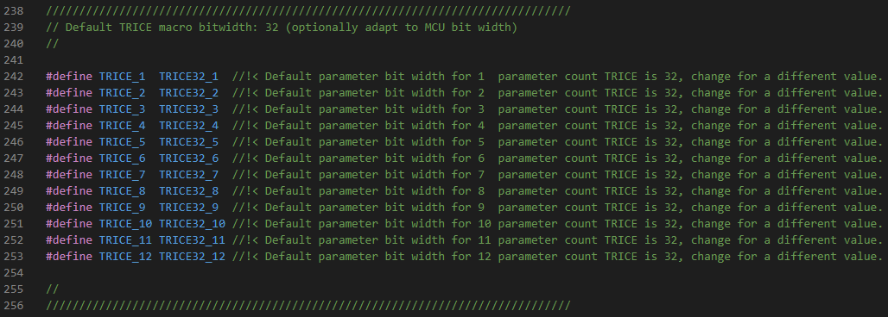
  * Use `-defaultTRICEBitwidth` switch during logging when changing this value.
* The macros `trice8`, `trice16`, `trice32`, `trice64` are usable too, to define the bit width explicit.
  * This leads for the smaller bit widths to less needed space and bandwidth. But when using the default package framing TCOBS, the influence is marginal because of the implicit compression.
* The fastest Trice macro execution is, when MCU bit width matches the macro bit width.
* The implicit TCOBS compression compacts the binary Trice data during the framing.

### 38.4. <a id="many-value-parameters"></a>Many value parameters

* No need to explicit express the values count.
* Up to 12 values are supported directly. Example:
  * `trice( "%p | %04x %04x %04x %04x %04x %04x %04x %04x %04x | %f\n", p, p[0], p[1], p[2], p[3], p[4], p[5], p[6], p[7], p[8], p[9], aFloat(x));`
  * To support more than 12 values for each Trice macro, the Trice code on target and host is straightforward extendable up to a total payload of 32764 bytes.
* Each macro can be prolonged with the used parameter count, for example `TRICE8_3` or `TRICE_2` to intense compile time checks.
  * This length code extension can be done automatically using `trice u -addParamCount`. This is not needed anymore:
* The _Trice_ tool compares the number of given format specifiers with the written parameters in a precimpile step to minimize the risk of runtime errors.
* There is no variadic values scanning during runtime. The C preprocessor does the work.

### 38.5. <a id="floating-point-values"></a>Floating Point Values

These types are mixable with integer types but need to be covered by converter function.

* *float* types use the `aFloat()` function and need a minimal value bit width of 32, to secure correct data transfer.
  * Example:

  ```c
   float x = 7.2;
   trice( "%f", aFloat(x));
  ```

* *double* types use the `aDouble()` function and need a value bit width of 64, to secure correct data transfer.
  * Example:

  ```c
   double y = 7.2;
   trice64( "float %f and double %f", aFloat(x), aDouble(y));
  ```

* Both functions are simple and fast:

```C

// aFloat returns passed float value x as bit pattern in a uint32_t type.
static inline uint32_t aFloat( float x ){
    union {
        float f;
        uint32_t u;
    } t;
    t.f = x;
    return t.u;
}

// aDouble returns passed double value x as bit pattern in a uint64_t type.
static inline uint64_t aDouble( double x ){
    union {
        double d;
        uint64_t u;
    } t;
    t.d = x;
    return t.u;
}
```

### 38.6. <a id="runtime-generated-0-terminated-strings-transfer-with-trices"></a>Runtime Generated 0-terminated Strings Transfer with triceS

* The `%s` format specifier is supported by the Trice macro too but needs specific treatment.
* Strings, known at compile time should be a part of a format string to reduce runtime overhead.
* Strings created at runtime, need a special `TRICE_S` (or `triceS`, `TriceS`, `TRiceS`) macro, which accepts exactly one type `%s` format specifier. Generated strings are allowed to a size of 32764 bytes each, if the configured Trice buffer size is sufficient.
  * Example:

  ```c
   char s[] = "Hello again!";
   triceS("A runtime string %20s\n", s);
  ```

Trice was designed mainly for speed. An universal `trice` like `printf` would cost too much runtime and destroy this main Trice advantage.

If you need several `%s`, like in 

```C
char* n = "Ann";
char* f = "Fox";
uint8_t dd = 22;
uint8_t mm = 11;
uint16_t yyyy = 1988;
// ...
print( "Name: %12s, Family: %s, Birthday %2u-%02u-%4u\n",  n, f, dd, mm, yyyy );
```
you can do:

```C
// ...
triceS( "Name: %12s, ",  n );
triceS( "Family: %s, ", f );
trice( "Birthday %2u-%02u-%4u\n", dd, mm, yyyy );
```
 or also

```C
// ...
triceS( "Name: %12s, ",  n ); triceS( "Family: %s, ", f ); trice( "Birthday %2u-%02u-%4u\n", dd, mm, yyyy );
```

### 38.7. <a id="runtime-generated-counted-strings-transfer-with--tricen"></a>Runtime Generated counted Strings Transfer with  triceN

* It is also possible to transfer a buffer with length n using the `TRICE_N` (or `triceN`, `TriceN`, `TRiceN`) macro.
* This becomes handy for example, when a possibly not 0-terminated string in FLASH memory needs transmission: `triceN( "msg: FLASH string is %s", addr, 16 );`
* There are also specific macros like `trice32B` or `trice16F`. Please look into [triceCheck.c](../_test/testdata/triceCheck.c) for usage or see the following.

### 38.8. <a id="runtime-generated-buffer-transfer-with-triceb"></a>Runtime Generated Buffer Transfer with triceB

* A buffer is transmittable with `TRICE_B` (or `triceB`, `TriceB`, `TRiceB`) and specifying just one format specifier, which is then repeated. Example:

```code
  s = "abcde 12345"; // assume this as runtime generated string
  triceS( "msg:Show s with triceS: %s\n", s );
  len = strlen(s);
  triceN( "sig:Show s with triceN:%s\n", s, len );
  triceB( "dbg: %02x\n", s, len ); // Show s as colored code sequence in hex code.
  triceB( "msg: %4d\n", s, len ); // Show s as colored code sequence in decimal code.
```

  This gives output similar to: 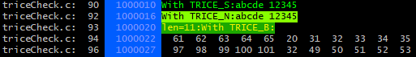

  Channel specifier within the `TRICE_B` format string are supported in Trice versions >= v0.66.0.

 If the buffer is not 8 but 16, 32 or 32 bits wide, the macros `TRICE8_B`, `TRICE16_B`, `TRICE32_B` and  `TRICE64_B`, are usable in the same manner.


### 38.9. <a id="extended-format-specifier-possibilities"></a>Extended format specifier possibilities

* Because the format string is interpreted by the Trice tool written in [Go](https://en.wikipedia.org/wiki/Go_(programming_language)), the **Go** capabilities partial usable.

#### 38.9.1. <a id="trice-format-specifier"></a>Trice format specifier

* The Trice macros are used in **C** code.
* The format strings are interpreted by the Trice tool, which is written in **Go**.
* The **C** and **Go** format specifier are not equal but similar.
* Therefore, a **T**rice adaptation is internally performed.

#### 38.9.2. <a id="length-modifier-support"></a>Length modifier support

* Trice now accepts the common C length modifiers `hh`, `h`, `l`, `ll`, `j`, `z`, `t`, and `L` together with the corresponding supported conversion specifiers.
* This is useful for ordinary Trice macros as well as for buffer macros such as `TRICE8_B`, `TRICE16_B`, `TRICE32_B`, and `TRICE64_B`.
* The original C format string stays unchanged in the lookup data. Internally, the Trice tool normalizes only a temporary working copy so that the host side can format the values with Go.
* Therefore, these examples are accepted and decoded as expected:
  * `%4ld` behaves like `%4d`
  * `%zu` behaves like `%u`
  * `%02zx` behaves like `%02x`
  * `%02llx` behaves like `%02x`
  * `%04Lf` behaves like `%04f`
* The normalization keeps flags, field width, and precision. Only the C length modifier itself is removed from the host side working copy.
* Invalid combinations are not legalized by Trice. For example, `%LX` is not treated as a valid integer format because `L` belongs to floating-point conversions such as `%Lf`, not to `%X`.

#### 38.9.3. <a id="overview-table"></a>Overview Table

| Format Specifier Type                                           | C | Go | T | (T =Trice) \| remark                                                        |
|-----------------------------------------------------------------|---|----|---|-----------------------------------------------------------------------------|
| signed decimal integer                                          | d | d  | d | Supported.                                                                  |
| unsigned decimal integer                                        | u | -  | u | The Trice tool changes %u into %d and treats value as unsigned.             |
| signed decimal integer                                          | i | d  | i | The Trice tool changes %i into %d and treats value as signed.               |
| signed octal integer                                            | - | o  | o | With `trice log -unsigned=false` value is treated as signed.                |
| unsigned octal integer                                          | o | -  | o | With `trice log` value is treated as unsigned.                              |
| signed octal integer with 0o prefix                             | - | O  | O | With `trice log -unsigned=false` value is treated as signed.                |
| unsigned octal integer with 0o prefix                           | - | -  | O | With `trice log` value is treated as unsigned.                              |
| signed hexadecimal integer lowercase                            | - | x  | x | With `trice log -unsigned=false` value is treated as signed.                |
| unsigned hexadecimal integer lowercase                          | x | -  | x | With `trice log` value is treated as unsigned.                              |
| signed hexadecimal integer uppercase                            | - | X  | X | With `trice log -unsigned=false` value is treated as signed.                |
| unsigned hexadecimal integer uppercase                          | X | -  | X | With `trice log` value is treated as unsigned.                              |
| signed binary integer                                           | - | b  | b | With `trice log -unsigned=false` value is treated as signed.                |
| unsigned binary integer                                         | - | -  | b | With `trice log` value is treated as unsigned.                              |
| decimal floating point, lowercase                               | f | f  | f | `aFloat(value)`\|`aDouble(value)`                                           |
| decimal floating point, uppercase                               | - | F  | F | `aFloat(value)`\|`aDouble(value)`                                           |
| scientific notation (mantissa/exponent), lowercase              | e | e  | e | `aFloat(value)`\|`aDouble(value)`                                           |
| scientific notation (mantissa/exponent), uppercase              | E | E  | E | `aFloat(value)`\|`aDouble(value)`                                           |
| the shortest representation of %e or %f                         | g | g  | g | `aFloat(value)`\|`aDouble(value)`                                           |
| the shortest representation of %E or %F                         | G | G  | G | `aFloat(value)`\|`aDouble(value)`                                           |
| a character as byte                                             | c | -  | c | Value can contain ASCII character.                                          |
| a character represented by the corresponding Unicode code point | c | c  | c | Value can contain UTF-8 characters if the C-File is edited in UTF-8 format. |
| a quoted character                                              | - | q  | q | Supported.                                                                  |
| the word true or false                                          | - | t  | t | Supported.                                                                  |
| a string                                                        | s | s  | s | Use `triceS` macro with one and only one runtime generated string.          |
| pointer address                                                 | p | p  | p | Supported.                                                                  |
| a double %% prints a single %                                   | % | %  | % | Supported.                                                                  |
| Unicode escape sequence                                         | - | U  | - | **Not supported.**                                                          |
| value in default format                                         | - | v  | - | **Not supported.**                                                          |
| Go-syntax representation of the value                           | - | #v | - | **Not supported.**                                                          |
| a Go-syntax representation of the type of the value             | - | T  | - | **Not supported.**                                                          |
| nothing printed                                                 | n | -  | - | **Not supported.**                                                          |

* [x] Long story short: Use the `-unsigned=false` switch when you like to see hex numbers and the like as signed values.
* [x] Look in [triceCheck.c](../_test/testdata/triceCheck.c) for exampe code producing this:


### 38.10. <a id="unsupported-printf-format-features"></a>Unsupported `printf` format features

Trice supports the common `printf`-style format specifiers used for embedded logging. Some less common `printf` features are intentionally not supported yet, because they do not fit well into the current lightweight Trice argument handling model or because they introduce side effects that are unsuitable for logging.

This mainly concerns:

* dynamic field width with `*`, for example `%*d`
* dynamic precision with `*`, for example `%.*s` or `%*.*f`
* wide character and wide string formats such as `%lc` and `%ls`
* the `%n` conversion specifier

#### 38.10.1. <a id="dynamic-field-width-with-"></a>Dynamic field width with `*`

In standard `printf`, a field width can either be fixed inside the format string or supplied dynamically.

Example with fixed width:

```c
printf("%10d", value);
```

Example with dynamic width:

```c
printf("%*d", width, value);
```

The `*` is not the value to be printed. It tells `printf` to consume an additional `int` argument from the argument list and to use that value as the field width. Therefore:

```c
printf("%*d", 10, value);
```

behaves like:

```c
printf("%10d", value);
```

A negative dynamic width has a special meaning and implies left-aligned output, similar to the `-` flag.

#### 38.10.2. <a id="dynamic-precision-with-"></a>Dynamic precision with `*`

The same principle exists for precision.

Example with fixed precision:

```c
printf("%.3f", value);
```

Example with dynamic precision:

```c
printf("%.*f", precision, value);
```

Again, the `*` consumes an additional `int` argument. For strings this is often used to limit the maximum number of emitted characters:

```c
printf("%.*s", maxLen, text);
```

#### 38.10.3. <a id="dynamic-width-and-precision-together"></a>Dynamic width and precision together

Both dynamic field width and dynamic precision can be used in the same conversion:

```c
printf("%*.*f", width, precision, value);
```

This consumes three arguments:

```c
int width;
int precision;
double value;
```

The important point is that each `*` consumes an additional `int` argument before the actual value argument. This means that `%*.*f` does not correspond to one runtime value only. It corresponds to `int, int, double`.

Trice is designed so that a format string usually maps to a compact and predictable sequence of transmitted values. Dynamic width and dynamic precision break that simple mapping because the `*` tokens are not visible output conversions, but they still consume additional arguments.

For that reason, Trice currently does not support these forms. Supporting them correctly would require the Trice format analysis to count and encode the hidden width and precision arguments in addition to the visible value arguments.

#### 38.10.4. <a id="wide-character-and-wide-string-formats-lc-and-ls"></a>Wide character and wide string formats: `%lc` and `%ls`

The `%lc` and `%ls` conversions are valid C `printf` forms for wide character and wide string data.

They are not equivalent to `%c` and `%s`:

* `%c` and `%s` operate on narrow character data
* `%lc` and `%ls` operate on wide character data such as `wchar_t`

For Trice this matters because `triceS` and related string handling transport runtime buffers, but the Trice tool does not automatically know how a target represents wide characters internally.

Without additional target-specific metadata, the host side would not know:

* whether `wchar_t` on the target is 16 bit or 32 bit
* which byte order is used
* which encoding semantics should be assumed for the transported code units

Therefore, simply removing the `l` and treating `%lc` like `%c` or `%ls` like `%s` would not be correct. That would silently change the meaning of the original C format string and could decode the payload differently from what the target-side C code actually describes.

For that reason, Trice currently does not support `%lc` and `%ls`. Proper support would require extra target-side type or encoding information so that the host can decode the transported data in an unambiguous and portable way.

#### 38.10.5. <a id="the-special-n-conversion-specifier"></a>The special `%n` conversion specifier

The `%n` specifier is fundamentally different from ordinary `printf` conversions.

Most conversions produce output:

```c
printf("%d", value);
printf("%s", text);
printf("%f", number);
```

The `%n` specifier prints nothing. Instead, it writes the number of characters printed so far into the object pointed to by the corresponding argument.

Example:

```c
int count = 0;

printf("abc%nxyz", &count);
```

The visible output is:

```text
abcxyz
```

After the call, `count` contains `3`, because three characters were printed before `%n` was reached.

Depending on the length modifier, `%n` expects different pointer types:

```c
printf("%n",   &i);   // int *
printf("%hn",  &s);   // short *
printf("%hhn", &c);   // signed char *
printf("%ln",  &l);   // long *
printf("%lln", &ll);  // long long *
```

This means `%n` is not a pure logging conversion. It has a side effect because it writes to memory.

#### 38.10.6. <a id="security-implications-of-n"></a>Security implications of `%n`

The `%n` specifier is also relevant for format-string security.

This is unsafe when `userInput` is not trusted:

```c
printf(userInput);
```

If `userInput` contains format specifiers, `printf` interprets them. If it contains `%n`, `printf` expects a pointer argument and writes through it. If no valid pointer was actually passed, this can cause undefined behavior, memory corruption, or a crash. In more serious cases, uncontrolled format strings can become a security vulnerability.

The correct way to print uncontrolled text is:

```c
printf("%s", userInput);
```

Because `%n` writes to memory and is strongly associated with format-string vulnerabilities, many coding standards and safety-oriented code bases discourage or forbid it.

#### 38.10.7. <a id="why-trice-does-not-support-n"></a>Why Trice does not support `%n`

Trice is a logging and tracing system. Its purpose is to transfer compact log information from the target to the host, where it is decoded into readable text.

The `%n` specifier does not fit this model for several reasons:

1. `%n` produces no log output.
2. `%n` writes to target memory through a pointer argument.
3. The written value depends on the number of characters formatted so far.
4. Trice intentionally avoids full target-side formatting in order to remain small and fast.
5. Supporting `%n` would introduce a side effect into what should be a side-effect-free logging operation.
6. `%n` has known security implications when format strings are not fully controlled.

For these reasons, Trice currently does not support `%n`.

This is intentional. Trice log statements should describe data to be logged, not modify application memory as a side effect of formatting.

### 38.11. <a id="utf-8-support"></a>UTF-8 Support

This is gratis, if you edit your source files containing the format strings in UTF-8:


The target does not even "know" about that, because it gets only the Trice IDs.

### 38.12. <a id="switch-the-language-without-changing-a-bit-inside-the-target-code"></a>Switch the language without changing a bit inside the target code

Once the [til.json](../demoTIL.json) list is done the user can translate it in any language and exchanging the list switches to another language. This is nowadays a simple AI agent task.

### 38.13. <a id="format-tags-prototype-specifier-examples"></a>Format tags prototype specifier examples

This syntax is supported: `%[flags][width][.precision][length]`

* Because the interpretation is done inside the Trice tool written in Go these all should work:
  * `%-d`
  * `%064b`
  * `%+9.3f`
  * `%+#012.12g`
  * `%+'#012.12E`
  * `%e`
  * `%9.f`

<p align="right">(<a href="#top">back to top</a>)</p>

## 39. <a id="trice-abc---asynchronous-broadcast-commands"></a>Trice ABC - Asynchronous Broadcast Commands

Trice ABC adds command-style communication to normal Trice records. The API is intentionally small and meant as a building block.

The [TriceAbc example](../examples/TriceAbc) demonstrates ABC communication with COBS framing and without encryption. Its node configurations define the framing explicitly; when experimenting with a different transport setup, update the sender, receiver and logging options together.

ABC means:

- **Asynchronous:** the sender emits a record and continues.
- **Broadcast:** zero, one, or several receivers may observe the same record.
- **Commands:** selected receivers may execute locally compiled handlers.

The key idea is the generated ID/function-pointer list on the receiver:

```text
sender source
  trice8C("cmd:setLeds", &mask, 1)
        |
        | trice insert
        v
til.json
  ID <-> "cmd:setLeds"
        |
        | trice generate -i til.json -abc device_abc
        v
device_abc.c
  { ID, 8, setLeds }
        |
        | receive runtime
        v
TriceParseRecord() -> TriceResolveAbc() -> TriceDispatchAbc() -> setLeds(&rx)
```

Only the Trice ID, optional ABC stamp, and optional payload are transferred. The command string stays in the TIL data and is used during receiver-code generation.

### 39.1. <a id="quick-use"></a>Quick use

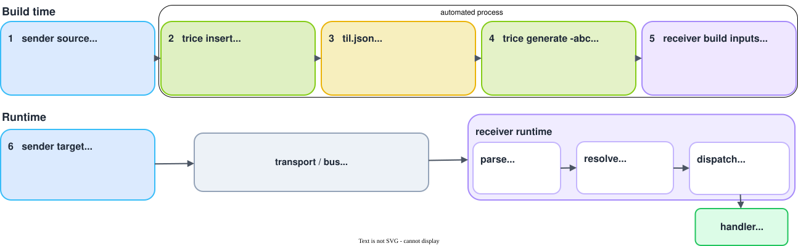

1. Enable sending and/or receiving in `triceConfig.h`:

```c
#define TRICE_TX_ABC_SUPPORT 1 // needed for ABC send macros
#define TRICE_RX_ABC_SUPPORT 1 // needed for ABC receive/dispatch
```

Sending and receiving are independent. A device may be send-only, receive-only, or both.

2. Send a command with an ABC macro:

```c
#include "trice.h"

void SetLeds(uint8_t mask) {
    trice8C("cmd:setLeds", &mask, 1);
}
```

3. Insert IDs into the sources and TIL file:

```bash
trice insert -til til.json -li li.json -src ./project_src
```

4. Generate the receiver selection/header pair and table:

```bash
trice generate -i til.json -abc ./device_abc
```

This creates:

```text
device_abc.h   generated once, then user-owned receiver selection header
device_abc.c   generated table, regenerated from til.json and device_abc.h
```

5. Edit `device_abc.h` and keep only the commands this target shall receive:

```c
#ifndef DEVICE_ABC_H_
#define DEVICE_ABC_H_

#include "triceRx.h"

#ifdef __cplusplus
extern "C" {
#endif

void setLeds(const triceRx_t* rx);

#ifdef __cplusplus
}
#endif

#endif /* DEVICE_ABC_H_ */
```

6. Implement the selected handlers:

```c
#include <stdint.h>
#include "device_abc.h"

static uint8_t boardLeds;

void setLeds(const triceRx_t* rx) {
    if (rx == 0 || rx->payloadBytes != 1u) {
        return;
    }
    boardLeds = rx->payload[0];
}
```

7. Feed decoded Trice records to the receive runtime:

```c
triceRx_t rx;
int used = TriceParseRecord(&rx, record, recordLen);

if (used > 0 && TriceResolveAbc(&rx, triceAbc, triceAbcElements) == TRICE_RX_RESULT_OK) {
    (void)TriceDispatchAbc(&rx);
}
```

`triceRx` parses already deframed and decrypted Trice records. UART, RTT, file, socket, COBS, TCOBS, and encryption handling stay outside this small receive core.

<!--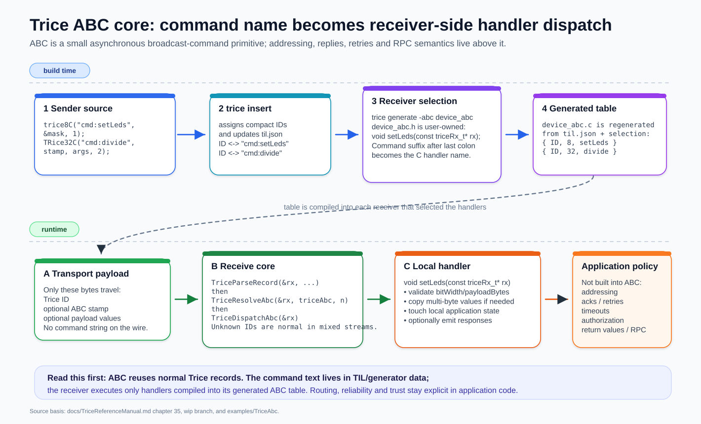-->

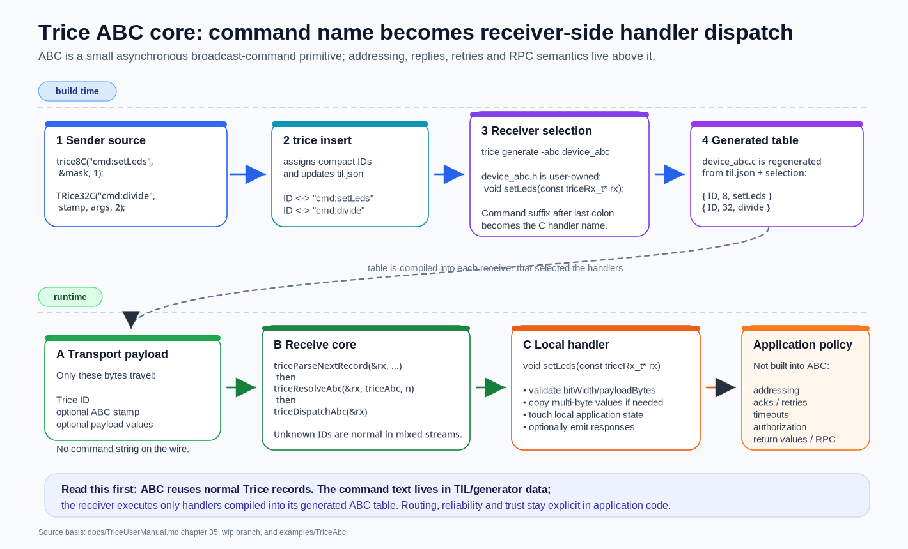

### 39.2. <a id="abc-macro-families"></a>ABC macro families

The suffix `C` means command. The optional number in the macro name is the payload element width.

| no stamp   | 16-bit stamp | 32-bit stamp | payload element width |
|------------|--------------|--------------|-----------------------|
| `triceC`   | `TriceC`     | `TRiceC`     | no payload            |
| `trice8C`  | `Trice8C`    | `TRice8C`    | 8-bit                 |
| `trice16C` | `Trice16C`   | `TRice16C`   | 16-bit                |
| `trice32C` | `Trice32C`   | `TRice32C`   | 32-bit                |
| `trice64C` | `Trice64C`   | `TRice64C`   | 64-bit                |

Examples:

```c
triceC("cmd:motorStop"); // no stamp, no value

uint16_t seq16 = NextSeq16();
TriceC("cmd:getLeds", seq16); // 16-bit stamp, no value

uint32_t unixTime = BoardTime();
trice32C("cmd:setTime", &unixTime, 1); // no stamp, one 32-bit value

int16_t step[] = { -50, 0, 300, 0 };
TRice16C("cmd:motorStep", 0x12345678, step, 4); // 32-bit stamp, 4 16-bit values
```

For stamped ABC macros, the explicit ABC stamp follows the command string and precedes the payload arguments.

ABC stamps are application-defined correlation values. They are not automatically generated Trice timestamps. Pass `TriceStamp16` or `TriceStamp32` explicitly if a real timestamp is desired.

```c
TriceC("cmd:sample", TriceStamp16);
TRiceC("cmd:sample", TriceStamp32);
```

### 39.3. <a id="command-names-and-handler-names"></a>Command names and handler names

The ABC command name is written where a normal Trice format string would stand. Treat it as a command name, not as a printf format string.

```c
triceC("cmd:motorStop");
trice32C("cmd:setTime", &unixTime, 1);
```

Everything before the last colon is tag/grouping text. The generator uses the part after the last colon as C handler name:

```text
cmd:motorStop       -> motorStop
cmd:deviceA:sample  -> sample
abc:LedsState       -> LedsState
```

The prefixes are not ABC addresses. They are useful for readable TIL data, filtering, grouping, and examples.

The final command part must be a valid C identifier. Do not add a trailing newline to ABC command strings.

### 39.4. <a id="receiver-selection-and-generated-table"></a>Receiver selection and generated table

`trice generate -abc target` creates `target.h` and `target.c` in `-genDir` (default `./generated`). The header is user-owned after its first creation: edit and version it to select the commands compiled into that target. The repository ignores generated C files but leaves this editable header visible to Git. An explicit target path such as `-abc path/target` keeps its existing location relative to the TIL directory.

The generator regenerates the C table from the intersection of:

- ABC entries found in `til.json`, and
- active handler declarations found in `device_abc.h`.

A command present in `til.json` but not declared in `device_abc.h` is ignored by this receiver. A declaration without a matching TIL entry is a build/configuration issue.

Generated `device_abc.c` has the essential shape:

```c
#include "device_abc.h"

const triceAbc_t triceAbc[] = {
    /* id, bitWidth, function pointer */
    { 5150u, 8u, setLeds },
    { 4818u, 0u, getLeds },
};

const unsigned triceAbcElements = sizeof(triceAbc) / sizeof(triceAbc[0]);
```

Do not edit `device_abc.c`. Implement the selected handlers in normal application code. Missing handler implementations fail as normal linker errors.

### 39.5. <a id="receive-runtime-contract"></a>Receive runtime contract

The common receive API is in `src/triceRx.h` and `src/triceRx.c`.

Use `TriceParseRecord()` to parse one decoded Trice record. It fills a `triceRx_t`:

```c
uint16_t id;              // Trice ID
uint8_t  bitWidth;        // payload element width after resolution
uint8_t  stampBits;       // 0, 16, or 32
uint32_t stamp;           // application-defined ABC stamp
const uint8_t* payload;   // points into caller-owned input buffer
uint16_t payloadBytes;    // payload byte count
```

The payload is not copied. Do not store `rx->payload` beyond the lifetime of the input buffer unless the handler copies the data.

`TriceResolveAbc()` looks up the parsed ID in the generated `triceAbc[]` table and attaches the resolved bit width and function pointer to `rx`.

`TriceDispatchAbc()` validates the payload size against the resolved bit width and calls the selected handler. Unknown IDs are normal in mixed streams and can be ignored.

For simple one-record receive paths, `TriceAbcOnReceive(pBuf, len)` is available as a convenience wrapper. Stream receivers should usually parse records explicitly, advance by the positive consumed byte count, and decide per record whether it is ABC, normal log traffic, counted typeX0 traffic, or unknown traffic.

### 39.6. <a id="handler-payload-handling"></a>Handler payload handling

Handlers get only `const triceRx_t*`. Application state must come from normal program context.

Use `rx->bitWidth`, `rx->payloadBytes`, and `rx->payload` to interpret the payload. For multi-byte values, prefer copying from the byte buffer instead of casting the pointer (alignment).

```c
#include <string.h>

void setTime(const triceRx_t* rx) {
    uint32_t t;

    if (rx == 0 || rx->bitWidth != 32u || rx->payloadBytes != sizeof(t)) {
        return;
    }

    memcpy(&t, rx->payload, sizeof(t));
    BoardSetTime(t);
}
```

Use the configured Trice transfer order consistently if payload values are exchanged between different endian architectures.

### 39.7. <a id="responses"></a>Responses

ABC has no built-in response model. A handler may send no response, one response, or several responses.

A common pattern is:

```c
// request
TriceC("cmd:getLeds", seq16);

// response from interested receiver
TRice8C("abc:LedsState", responseStamp32, &leds, 1);
```

The response is just another Trice message. It may be a normal log message or another ABC command. Use stamps to correlate responses with requests.

### 39.8. <a id="what-abc-is-not"></a>What ABC is not

ABC is not RPC by itself.

ABC does not define:

- addressed delivery,
- exactly-one receiver semantics,
- acknowledgements,
- retries,
- timeouts,
- authorization,
- discovery,
- routing,
- quorum logic,
- waiting for a return value.

Build these policies above ABC when needed.

ABC is also not remote code execution. A receiver can execute only handlers already compiled into the firmware and selected by its generated ABC table.

### 39.9. <a id="example-examplestriceabc"></a>Example: `examples/TriceAbc`

The host-native demo shows ABC without embedded hardware.

Run it from the example directory:

```bash
cd examples/TriceAbc
./build.sh
./demo.sh
```

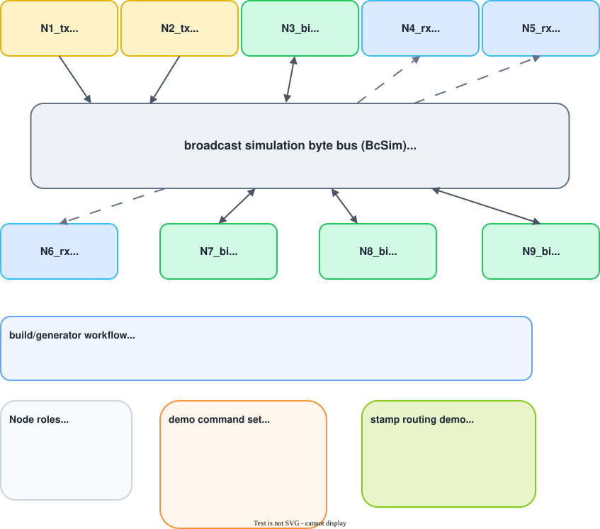

The demo uses `BcSim` as a small byte bus. It transports bytes only; the Trice-specific logic is in `NodeLib` and the node programs.

The build script demonstrates the full workflow:

```bash
trice insert ...
trice generate -i ../../demoTIL.json -abc NodeLib/nodeAbc
trice generate -i ../../demoTIL.json -src . -logC=NodeLib/til.c
```

It produces:

```text
NodeLib/nodeAbc.h   shared user-owned ABC selection header
NodeLib/nodeAbc.c   shared generated ABC table
NodeLib/til.c       compact generated log metadata for normal-log resolving
```

The demo nodes have different roles:

- `N1_tx`, `N2_tx`: send ABC commands.
- `N3_bi`, `N7_bi`, `N8_bi`, `N9_bi`: send and receive.
- `N4_rx`, `N5_rx`, `N6_rx`: receive only.
- `N6_rx` and `N7_bi`: additionally resolve normal Trice log traffic.

The demo commands include:

- `cmd:setLeds`
- `cmd:getLeds`
- `cmd:setKey`
- `cmd:logState`
- `cmd:divide`
- `abc:LedsState`
- `abc:DivideResult`

`cmd:getLeds` and `cmd:divide` show request/response behavior built above ABC. The stamped requests use low stamp bits as a small responder bitmap in the demo. That is application policy, not ABC core behavior.

The shared runtime flow is:

```text
normal Trice macro / ABC macro
  -> TriceWriteDevice()
  -> BcSim byte bus
  -> COBS frame collector
  -> TriceParseRecord()
  -> TriceResolveAbc() / TriceResolveLog()
  -> node handler or demo log printer
```

The example intentionally parses once and then decides whether the record is ABC, normal log traffic, counted typeX0 traffic, or unknown traffic. This is the recommended style for mixed receive streams.

An example log snippet:

```txt
...
N3_tx: ABC-> cmd:setLeds(0c)
N6_rx: log:tick=203
N6_rx: log:from=3 phase=3
N6_rx: log:text=N3 bidirectional
N6_rx: x0 3 bytes: 33 34 35
N6_rx: leds=[  **    ]
N7_bi: log:tick=203
N7_bi: log:from=3 phase=3
N7_bi: log:text=N3 bidirectional
N7_bi: x0 3 bytes: 33 34 35
N7_bi: leds=[  **    ]
N5_rx: x0 3 bytes: 33 34 35
N5_rx: leds=[  **    ]
...
```

The broadcast simulation _abc.bus_ log starts with:

```txt
# BcSim traffic log
# bc.bus is a pure binary byte stream. This text log is diagnostic only.
# offset and len are decimal values. Bytes are hexadecimal %02x values.
#   offset  len device       dir status               bytes
# -------- ---- ------------ --- -------------------- --------------------------------
         0   10 N3_bi        TX  trice                06 d2 53 c0 04 c8 01 01 01 00
        10   14 N3_bi        TX  trice                06 54 55 c0 08 03 01 01 01 01 01 01 01 00
        24   22 N3_bi        TX  trice                15 99 53 c0 10 4e 33 20 62 69 64 69 72 65 63 74 69 6f 6e 61 6c 00
        46    6 N3_bi        TX  trice                02 02 03 30 31 00
         0   52 N8_bi        RX  poll                 06 d2 53 c0 04 c8 01 01 01 00 06 54 55 c0 08 03 01 01 01 01 01 01 01 00 15 99 53 c0 10 4e 33 20 62 69 64 69 72 65 63 74 69 6f 6e 61 6c 00 02 02 03 30 31 00
         0   52 N6_rx        RX  poll                 06 d2 53 c0 04 c8 01 01 01 00 06 54 55 c0 08 03 01 01 01 01 01 01 01 00 15 99 53 c0 10 4e 33 20 62 69 64 69 72 65 63 74 69 6f 6e 61 6c 00 02 02 03 30 31 00
...
```

With `tlog.sh` one can see the Trice logs as well:

```txt
th@Thomass-MacBook-Pro-7 TriceAbc % ./tlog.sh 
Jul 27 22:26:51.574387  FILEBUFFER:          N3_bi/main.c    14              log:(from node=N3_bi) tick=200
Jul 27 22:26:51.574475  FILEBUFFER:          N3_bi/main.c    18              log:(from node=N3_bi) from=3 phase=0
Jul 27 22:26:51.574491  FILEBUFFER:          N3_bi/main.c    22              log:(from node=N3_bi) text=N3 bidirectional
Jul 27 22:26:51.574503  FILEBUFFER:                                          typeX0 buffer: [48 49]
Jul 27 22:26:51.574729  FILEBUFFER:          N3_bi/main.c    14              log:(from node=N3_bi) tick=201
Jul 27 22:26:51.574773  FILEBUFFER:          N3_bi/main.c    18              log:(from node=N3_bi) from=3 phase=1
Jul 27 22:26:51.574921  FILEBUFFER:          N3_bi/main.c    22              log:(from node=N3_bi) text=N3 bidirectional
Jul 27 22:26:51.574942  FILEBUFFER:                                          typeX0 buffer: [49 50 51]
Jul 27 22:26:51.574952  FILEBUFFER:          N3_bi/main.c    50        0_103 cmd:getLeds
Jul 27 22:26:51.574964  FILEBUFFER:        NodeLib/node.c   654        0_103 abc:LedsState(00)
...
Jul 27 22:26:51.576238  FILEBUFFER:          N3_bi/main.c    22              log:(from node=N3_bi) text=N3 bidirectional
Jul 27 22:26:51.576246  FILEBUFFER:                                          typeX0 buffer: [59 60 61]
Jul 27 22:26:51.576254  FILEBUFFER:          N3_bi/main.c   102    0,000_103 cmd:getLeds
Jul 27 22:26:51.576262  FILEBUFFER:        NodeLib/node.c   656    0,000_103 abc:LedsState(80)
Jul 27 22:26:51.576271  FILEBUFFER:        NodeLib/node.c   656    0,000_103 abc:LedsState(80)
Jul 27 22:26:51.576279  FILEBUFFER:        NodeLib/node.c   656    0,000_103 abc:LedsState(80)
Jul 27 22:26:51.576287  FILEBUFFER:          N2_tx/main.c    14              log:(from node=N2_tx) tick=107
Jul 27 22:26:51.576296  FILEBUFFER:          N2_tx/main.c    18              log:(from node=N2_tx) from=2 phase=0
Jul 27 22:26:51.576304  FILEBUFFER:          N2_tx/main.c    22              log:(from node=N2_tx) text=N2 sends data
Jul 27 22:26:51.576312  FILEBUFFER:                                          typeX0 buffer: [39 41 43 45 47]
Jul 27 22:26:51.576320  FILEBUFFER:          N2_tx/main.c    62        0_102 cmd:getLeds
Jul 27 22:26:51.576328  FILEBUFFER:        NodeLib/node.c   654        0_102 abc:LedsState(80)
Jul 27 22:26:51.576337  FILEBUFFER:        NodeLib/node.c   654        0_102 abc:LedsState(80)
th@Thomass-MacBook-Pro-7 TriceAbc %
```

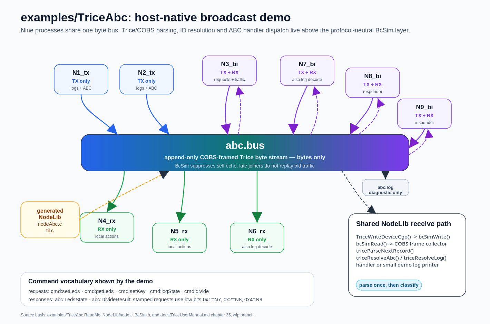

#### 39.9.1. <a id="abc-demo-layout-startup-and-runtime-policy"></a>ABC Demo Layout, Startup, and Runtime Policy

The [host-native example](../examples/TriceAbc/) requires Bash and a C compiler (`gcc`, `clang`, or `cc`); `CC` selects a compiler explicitly. Its build script uses `TRICE_BIN` if supplied, otherwise Go when available, or `trice` in `PATH`. It builds nine executables below `build` (`.exe` on Windows), inserts IDs before generating the tables, and runs `trice clean` on exit after a successful insert. `NodeLib/til.c` is regenerated for the selected source roots and is not a checked-in source. `NodeLib/nodeAbc.h` is the shared user-owned command selection, so preserve it when cleaning generated files.

The layout separates [BcSim](../examples/TriceAbc/BcSim/) (reusable protocol-neutral transport), [BcSimChk](../examples/TriceAbc/BcSimChk/) (standalone random-byte check), [NodeLib](../examples/TriceAbc/NodeLib/) (shared Trice runtime and generated tables), and the nine node directories. `tx`, `rx`, and `bi` describe bus capability, not command vocabulary. `N1_tx`/`N2_tx` emit logs, counted typeX0 buffers, and commands; `N3_bi` also receives and replies; `N4_rx`/`N5_rx` execute commands only; `N6_rx` adds received log presentation; `N7_bi` combines replies and log presentation; `N8_bi`/`N9_bi` reply without the normal-log printer.

`demo.sh` starts receive-capable nodes first, then pure transmitters. A BcSim participant joins at the current end of the bus and does not replay earlier traffic. Runtime files are `abc.bus` (binary framed stream), `abc.log` (human hex log), and `abc.bus.lock/` (writer lock). They are separate from BcSimChk's `bc.*` files. `abc.console.lock/` keeps each complete node or shell status line together; the console lock waits rather than falling back to interleaved writes. A killed lock owner may require manual cleanup after all participants stop.

The command shapes and effects are intentionally small:

| Command | Payload and effect |
| --- | --- |
| `cmd:setLeds` | One 8-bit mask; update the local simulated LED bar. |
| `cmd:getLeds` | No payload; every other bidirectional node can answer `abc:LedsState` with an 8-bit mask. Receive-only nodes cannot reply. |
| `cmd:setKey` | Counted 8-bit byte buffer; store a local key. |
| `cmd:logState` | No payload; local printf side effect, without a Trice/ABC response. |
| `cmd:divide` | Two 32-bit floats; bidirectional nodes answer `abc:DivideResult` with one float. |

Unstamped requests broadcast, so several identical-looking replies are expected. For stamped `getLeds` and `divide`, the demo's application policy uses low bits `0x0001`, `0x0002`, and `0x0004` to select `N7_bi`, `N8_bi`, and `N9_bi`. `N3_bi` demonstrates one and multiple selected responders. Replies retain stamp width and value. This is demonstration routing above ABC, not a built-in addressing protocol.

The node-local `triceConfig.h` files select TX, ABC RX, normal-log resolution, and direct output. Transmitting nodes select `TRICE_DIRECT_OUT_FRAMING TRICE_FRAMING_COBS`, for example in [N3_bi/triceConfig.h](../examples/TriceAbc/N3_bi/triceConfig.h); the shared [NodeLib/node.c](../examples/TriceAbc/NodeLib/node.c) collects and decodes COBS frames. All participants must agree on framing. The former separate `triceRxConfig.h` is no longer present. NodeLib implements the real generated handlers once; runtime `canSend` decides whether a node replies, avoiding forwarding wrappers in each node.

The host bridge preserves the normal send macros through `TriceWriteDevice()`. A persistent input buffer splits COBS frames at zero delimiters, keeps the incomplete tail, then iterates logical records inside each decoded frame. It skips record-alignment bytes only when the expected bytes are zero. Parsing happens once, followed by ABC, normal-log, typeX0, or unknown-record dispatch; `TriceAbcOnReceive()` is not the primary demo entry point. Selector-0 buffers have no ID or TIL lookup and are displayed as raw bytes. Nodes without normal-log resolution show ignored IDs; the small generated-`til.c` log printer is not a replacement for the Go host decoder and has no source-location column.

Self-written bus ranges are filtered, so a node does not receive its own frames or display its own logs as received traffic. `nodeSleepMs()` handles shared pacing. Process-local `TRICE_ENTER_CRITICAL_SECTION` hooks cannot protect a multi-process console; NodeLib's separate console lock does that. Each node formats a full line before acquiring the lock. LED output uses `*` for on and space for off, for example:

```text
N4_rx: leds=[**  *   ]
N6_rx: key=bravo7 leds=[***     ]
N7_bi: abc:DivideResult=3.140000
N6_rx: log:tick=4
N7_bi: x0 5 bytes: 10 11 12 13 14
```

### 39.10. <a id="bcsim-broadcast-byte-stream-simulator"></a>BcSim Broadcast Byte-Stream Simulator

[BcSim](../examples/TriceAbc/BcSim/) is a standalone C module: several PC processes append to a shared local file and poll bytes written by others. It knows nothing about IDs, framing, encryption, packet boundaries, source addresses, commands, or handlers. `bc.bus` contains exactly the supplied bytes, with no inserted name, timestamp, length, or metadata; optional `bc.log` is human-readable diagnostic output only.

Each process owns one `BcSim_t`. `bcSimOpen()` opens a local view and starts reading at the current end of the bus. `bcSimWrite()` appends bytes and remembers its own written offset ranges; `bcSimRead()` filters those ranges from subsequent reads; `bcSimClose()` closes the view and resets state. Filtering by offsets rather than byte contents preserves identical data legitimately sent by different processes or repeated by one process.

Writers serialize through an atomically created `bc.bus.lock/` directory: acquire lock, obtain file size, append, remember the `[start,end)` range, optionally append the TX log line, then remove the lock. Competing writers retry until the timeout. Reads normally take no writer lock and may see partial data, which the higher stream layer must buffer. Define `BCSIM_READ_USES_LOCK 1` for deterministic reads under the same writer lock.

The [public API](../examples/TriceAbc/BcSim/BcSim.h) is:

```c
int bcSimOpen(BcSim_t* io, const char* busPath,
              const char* logPath, const char* deviceName);
int bcSimRead(BcSim_t* io, uint8_t* p, size_t max, const char* status);
int bcSimWrite(BcSim_t* io, const uint8_t* p, size_t n, const char* status);
void bcSimClose(BcSim_t* io);
```

The three integer-returning functions return a non-negative byte count or a negative `BCSIM_ERR_*` value. The log starts with a header, then one TX/RX line per event: right-aligned decimal offsets and lengths without leading zeros, device, direction, optional status, and space-separated two-digit lowercase hexadecimal bytes.

```text
# BcSim traffic log
# bus file: bc.bus
# Columns: offset, len, device, direction, status, bytes
      0      12  A                 TX   tx-0                    35 6a 11 8e ...
     12      12  B                 RX   poll-1                  35 6a 11 8e ...
```

Try the transport alone, without Trice tables:

```sh
cd examples/TriceAbc/BcSimChk
./demo.sh
```

Its [build script](../examples/TriceAbc/BcSimChk/build.sh) compiles `main.c` and `../BcSim/BcSim.c`; `CC` and `CFLAGS` allow experiments, such as `CFLAGS='-DBCSIM_READ_USES_LOCK=1' ./build.sh`. The demo starts four participants with random byte blocks and shows `bc.log` and a bus hex dump. The reusable library files are `BcSim_config.h`, `BcSim.h`, and `BcSim.c`; BcSimChk is not needed by applications reusing the transport.

This is a local demonstration medium, not high-performance IPC or a real embedded link. The bus grows until removed, only finitely many self-write ranges are remembered, and a restarted process cannot identify a previous instance's writes. A killed writer can leave a lock directory requiring cleanup. Network filesystems may not offer the same atomic directory and visibility behavior as local filesystems.

### 39.11. <a id="host-tests"></a>Host tests

`_test/abc_tx_host` checks the transmit side. It compiles a small C fixture with ABC TX support, emits selected `triceC`, `TriceC`, `TRiceC`, `trice8C`, `trice16C`, and `trice32C` calls, and compares the produced bytes with fixed fixtures. It verifies wire format generation only; it does not use a receiver table.

`_test/abc_rx_host` checks the receive side against the production `src/triceRx.c` runtime and a generated `device_abc` pair. The tests cover selected IDs, unknown IDs, no-payload records, 8/16/32/64-bit payloads, 16/32-bit stamps, malformed payload lengths, truncated records, nested dispatch, long-count payload encoding, log-resolution coexistence, and one-record-at-a-time stream consumption.

Together, these tests document the current ABC boundary: transmit macros create normal Trice records, the generated table maps selected IDs to handlers, and the receive runtime parses/resolves/dispatches one decoded record at a time.

### 39.12. <a id="building-rpc-like-protocols-on-top"></a>Building RPC-like protocols on top

Use ABC as the transport primitive and define the RPC policy in the application.

A minimal RPC-like pattern is:

1. Define request commands, for example `rpc:getValue`. (requester)
2. Define response commands, for example `rpc:getValueResult`. (a receiver acting as "requester" in a response)
3. Put a correlation value into the 16-bit or 32-bit ABC stamp.
4. Encode arguments in the payload.
5. Let the receiver validate the payload, execute local code, and send a response (`rpc:getValueResult`) with the same or derived stamp.
6. Let the requester also be an ABC receiver and keep a pending-request table.
7. Implement timeout, retry, duplicate handling, authorization, and addressing at application level.

For addressed RPC over a broadcast bus, put the destination into the stamp or payload and let non-matching receivers ignore the command. ABC itself still broadcasts the record.

### 39.13. <a id="security-boundary"></a>Security boundary

ABC receiving allows incoming Trice records to trigger selected local application handlers. Do not enable ABC receive processing on untrusted inputs without an application-level trust model.

Typical protections are:

- enable ABC receive only on trusted transports,
- filter by time to avoid burst attacks,
- validate every payload,
- add authentication or encryption around the transport,
- compile out `TRICE_RX_ABC_SUPPORT` where it is not needed.

### 39.14. <a id="summary-1"></a>Summary

ABC turns selected Trice IDs into asynchronous broadcast commands.

The small core is:

```text
ABC send macro
  -> Trice ID in til.json
  -> generated *_abc.h selection
  -> generated *_abc.c ID/function-pointer table
  -> user handler(const triceRx_t* rx)
```

Everything else, including addressing, responses, reliability, retries, authorization, and RPC semantics, belongs to the application layer above ABC.

Using Trice ABC for the same (remote) handler from different devices assigns different IDs to the same handler. This way one can consider a Trice ABC ID as senders address and the activated handler has access over the passed triceRx_t pointer to it. 

<p align="right">(<a href="#top">back to top</a>)</p>

## 40. <a id="development-environment-setup"></a>Development Environment Setup

* Trice is usable with any C-compiler for any processor type, bit width and endianness. The example projects here are STM32 ones but illustrate how to setup Trice.
* The [examples](../examples) folder contains some instrumented example projects together with bare counterparts. Comparing a bare project with its intrumented counterpart gives a quick overview what needs to be done to get started.

### 40.1. <a id="common-information-1"></a>Common Information

- All used tools are **Open Source** (despite the [ARM-Keil µVision IDE](https://www2.keil.com/mdk5/uvision/), for new projects VS Code is a better choice).
- All provided information is just as example and needs adaptation to your needs.
- There is no need to setup the environment in the given order.

### 40.2. <a id="important-to-know"></a>Important to know

The [ARM-Keil µVision IDE](https://www2.keil.com/mdk5/uvision/) does sometimes not recognize external file modifications. That means for example: After editing `main.c` by adding a `trice( "Hi!\n" )` and executing `trice insert` as pre-compile step it could happen, that an updated `trice( iD(12345), "Hi!\n" )`  was inserted and correct compiled but the update in `main.c` is not shown. Simply close and reopen `main.c` before editing again. This seems to be a [ARM-Keil µVision IDE](https://www2.keil.com/mdk5/uvision/) "feature" or be caused Windows not signaling a file change.

### 40.3. <a id="animation"></a>Animation

(The trice IDs occur just during the compilation.)

  

### 40.4. <a id="setup-linux-pc---example-with-debian12---kde-desktop"></a>Setup Linux PC - Example with Debian12 - KDE Desktop

#### 40.4.1. <a id="basic-setup"></a>Basic setup

* Add yourself to the sudo group:

```bash
su
apt install sudo
adduser <your_user_name> sudo
exit
```

* Logout and login.
* Install and verify:

```bash
groups
sudo apt update
sudo apt upgrade
sudo apt install build-essential
make --version
gcc --version
git --version
git config --global user.email "you@example.com"
git config --global user.name "Your Name"
```

#### 40.4.2. <a id="github"></a>GitHub

* Create github account.
* Create ssh pair:

    ```bash
    ssh-keygen -t ed25519
    ```

* Add ssh key to your github account.
* Clone Trice repository:

    ```bash
    cd ~
    mkdir repos
    cd repos
    git clone git@github.com:rokath/trice.git
    ```

#### 40.4.3. <a id="vs-code"></a>VS Code

* Download VS Code from https://code.visualstudio.com/.
* Install VS Code (adapt to downloaded version) and start it inside the Trice folder:

    ```bash
    sudo apt update
    sudo apt upgrade
    sudo apt install ~/Downloads/code_1.96.2-1734607745_amd64.deb
    code .
    ```

Open the repository root to use the shared [Go launch configurations](../.vscode/launch.json).
Install the Go extension and its debugger tools first. The configurations use
`${workspaceFolder}` rather than a particular checkout location. UART and TCP
entries ask for the serial port or RTT endpoint at launch; these are VS Code
[input variables](https://code.visualstudio.com/docs/reference/variables-reference#_input-variables).

The G0B1 and L432 hardware entries use the root `demoTIL.json` and `demoLI.json`,
which belong to those instrumented examples. Build and flash the corresponding
example before connecting. The G0B1 UART entry matches its encrypted COBS output
at 115200 baud with password `MySecret`; the RTT entries match unframed direct
output with doubled IDs. TCP4 expects that same G0B1 RTT stream forwarded by a
server, normally at `localhost:17001`. These settings do not apply to arbitrary
firmware or captures: use the ID/location tables and framing from that firmware.

The `generate` entry creates `generated/til.c` from the current G0B1 main source;
run the example's bind/build step first so that its sidecars and ID table agree.
The insert/clean entries operate on that main source and update the root tables;
they are maintenance commands, not log viewers. Already bound code follows the
normal insert/clean ownership rules. The test entry runs one existing bind test.
For a hardware-free decoder session, select `trice l -p DUMP`: its retained
capture uses `testTIL.json`/`testLI.json` and includes a missing cycle-counter value
194, so one cycle-error diagnostic is expected. Entries whose captures, source
folders or command variants no longer exist have been removed.

When opening a G0B1 example itself, its C/C++ configuration finds
`arm-none-eabi-gcc` through `PATH`. Start VS Code from an environment containing
the installed ARM compiler and install the C/C++ and Makefile Tools extensions.
Only `USE_HAL_DRIVER` and `STM32G0B1xx` are supplied as project defines; builtin
defines are queried from the compiler with `-mcpu=cortex-m0plus` rather than
copied from an older version or inferred for the compiler's default CPU.
IntelliSense uses `gcc-arm` instead of the host platform's default architecture.

The shared [JetBrains settings](../.idea/ReadMe.md) retain the CLion CMake review
host, project inspections and XML spelling dictionary. Choose the host toolchain
locally; workspace layout and personal state are ignored. IDE launch, serial/RTT
connections and indexing still need checking in your installed IDE and hardware
environment; parsing the templates alone cannot establish those results.

#### 40.4.4. <a id="go"></a>Go

* Download the **Go** language from https://go.dev/doc/install and install:

    ```bash
    cd ~/Downloads
    sudo rm -rf /usr/local/go && sudo tar -C /usr/local -xzf go1.23.4.linux-amd64.tar.gz
    ```

    Extend PATH variable with `/usr/local/go/bin:~/go/bin` for example by by adding a file like `/etc/profile.d/gopath.sh`:

    ```bash
    su
    sudo echo export PATH='$PATH':/usr/local/go/bin:/home/<your_user_name>/go/bin > /etc/profile.d/gopath.sh
    exit
    ```

* Logout, login and compile Trice:

    ```bash
    th@P51-DebianKDE:~/repos$ go version
    go version go1.23.4 linux/amd64
    th@P51-DebianKDE:~/repos$ cd trice
    th@P51-DebianKDE:~/repos/trice$ go install ./cmd/...
    go: downloading github.com/spf13/afero v1.9.5
    go: downloading github.com/kr/pretty v0.1.0
    go: downloading go.bug.st/serial v1.6.0
    go: downloading github.com/mgutz/ansi v0.0.0-20200706080929-d51e80ef957d
    go: downloading github.com/rokath/cobs v0.0.0-20230425030040-4ebbe9b903b9
    go: downloading github.com/rokath/tcobs v0.9.1
    go: downloading golang.org/x/crypto v0.31.0
    go: downloading github.com/fsnotify/fsnotify v1.6.0
    go: downloading github.com/pkg/errors v0.9.1
    go: downloading golang.org/x/sys v0.28.0
    go: downloading golang.org/x/text v0.21.0
    go: downloading github.com/kr/text v0.1.0
    go: downloading github.com/mattn/go-colorable v0.1.13
    go: downloading github.com/creack/goselect v0.1.2
    go: downloading github.com/mattn/go-isatty v0.0.19
    th@P51-DebianKDE:~/repos/trice$ trice version
    version=devel, built 2025-01-04 16:29:30.51921408 +0100 CET
    th@P51-DebianKDE:~/repos/trice$ go test ./...
    go: downloading github.com/tj/assert v0.0.3
    go: downloading github.com/stretchr/testify v1.8.4
    go: downloading github.com/udhos/equalfile v0.3.0
    go: downloading github.com/pmezard/go-difflib v1.0.0
    go: downloading gopkg.in/yaml.v3 v3.0.1
    go: downloading github.com/davecgh/go-spew v1.1.1
    ?       github.com/rokath/trice/internal/do     [no test files]
    ?       github.com/rokath/trice/internal/translator     [no test files]
    ?       github.com/rokath/trice/pkg/ant [no test files]
    ok      github.com/rokath/trice/cmd/trice       1.014s
    ok      github.com/rokath/trice/internal/args   0.009s
    ok      github.com/rokath/trice/internal/charDecoder    0.005s
    ok      github.com/rokath/trice/internal/com    0.005s
    ok      github.com/rokath/trice/internal/decoder        0.005s
    ok      github.com/rokath/trice/internal/dumpDecoder    0.006s
    ok      github.com/rokath/trice/internal/emitter        0.006s
    ok      github.com/rokath/trice/internal/id     2.744s
    ok      github.com/rokath/trice/internal/keybcmd        0.006s
    ok      github.com/rokath/trice/internal/link   0.006s
    ok      github.com/rokath/trice/internal/receiver       0.007s
    ok      github.com/rokath/trice/internal/trexDecoder    0.008s
    ok      github.com/rokath/trice/pkg/cipher      0.006s
    ok      github.com/rokath/trice/pkg/endian      0.002s
    ok      github.com/rokath/trice/pkg/msg 0.005s
    ok      github.com/rokath/trice/pkg/tst 0.003s
    th@P51-DebianKDE:~/repos/trice$ 
    th@P51-DebianKDE:~/repos/trice$ gcc --version
    gcc (Debian 12.2.0-14) 12.2.0
    Copyright (C) 2022 Free Software Foundation, Inc.
    This is free software; see the source for copying conditions.  There is NO
    warranty; not even for MERCHANTABILITY or FITNESS FOR A PARTICULAR PURPOSE.

    th@P51-DebianKDE:~/repos/trice$ ./scripts/testAll.sh 
    Sa 4. Jan 16:33:57 CET 2025
    This can take several minutes ...
    ?       github.com/rokath/trice/internal/do     [no test files]
    ok      github.com/rokath/trice/cmd/trice       1.013s
    ok      github.com/rokath/trice/internal/args   0.007s
    ok      github.com/rokath/trice/internal/charDecoder    0.004s
    ok      github.com/rokath/trice/internal/com    0.004s
    ok      github.com/rokath/trice/internal/decoder        0.003s
    ok      github.com/rokath/trice/internal/dumpDecoder    0.004s
    ok      github.com/rokath/trice/internal/emitter        0.003s
    ?       github.com/rokath/trice/internal/translator     [no test files]
    ?       github.com/rokath/trice/pkg/ant [no test files]
    ok      github.com/rokath/trice/internal/id     2.742s
    ok      github.com/rokath/trice/internal/keybcmd        0.004s
    ok      github.com/rokath/trice/internal/link   0.004s
    ok      github.com/rokath/trice/internal/receiver       0.005s
    ok      github.com/rokath/trice/internal/trexDecoder    0.005s
    ok      github.com/rokath/trice/pkg/cipher      0.004s
    ok      github.com/rokath/trice/pkg/endian      0.002s
    ok      github.com/rokath/trice/pkg/msg 0.004s
    ok      github.com/rokath/trice/pkg/tst 0.004s
    ok      github.com/rokath/trice/_test/be_dblB_de_tcobs_ua       144.000s
    ok      github.com/rokath/trice/_test/be_staticB_di_xtea_cobs_rtt32     143.927s
    ok      github.com/rokath/trice/_test/dblB_de_cobs_ua   144.006s
    ok      github.com/rokath/trice/_test/dblB_de_multi_cobs_ua     143.824s
    ok      github.com/rokath/trice/_test/dblB_de_multi_nopf_ua     144.087s
    ok      github.com/rokath/trice/_test/dblB_de_multi_tcobs_ua    144.100s
    ok      github.com/rokath/trice/_test/dblB_de_multi_xtea_cobs_ua        143.928s
    ok      github.com/rokath/trice/_test/dblB_de_multi_xtea_tcobs_ua       144.034s
    ok      github.com/rokath/trice/_test/dblB_de_nopf_ua   142.399s
    ok      github.com/rokath/trice/_test/dblB_de_tcobs_ua  142.520s
    ok      github.com/rokath/trice/_test/dblB_de_xtea_cobs_ua      142.526s
    ok      github.com/rokath/trice/_test/dblB_de_xtea_tcobs_ua     142.246s
    ok      github.com/rokath/trice/_test/dblB_di_nopf_rtt32__de_cobs_ua    281.643s
    ok      github.com/rokath/trice/_test/dblB_di_nopf_rtt32__de_multi_cobs_ua      281.201s
    ok      github.com/rokath/trice/_test/dblB_di_nopf_rtt32__de_multi_tcobs_ua     281.518s
    ok      github.com/rokath/trice/_test/dblB_di_nopf_rtt32__de_tcobs_ua   281.536s
    ok      github.com/rokath/trice/_test/dblB_di_nopf_rtt32__de_xtea_cobs_ua       279.814s
    ok      github.com/rokath/trice/_test/dblB_di_nopf_rtt8__de_cobs_ua     280.173s
    ok      github.com/rokath/trice/_test/dblB_di_nopf_rtt8__de_multi_cobs_ua       280.095s
    ok      github.com/rokath/trice/_test/dblB_di_nopf_rtt8__de_multi_tcobs_ua      279.693s
    ok      github.com/rokath/trice/_test/dblB_di_nopf_rtt8__de_tcobs_ua    291.037s
    ok      github.com/rokath/trice/_test/ringB_de_cobs_ua  140.861s
    ok      github.com/rokath/trice/_test/ringB_de_multi_tcobs_ua   140.802s
    ok      github.com/rokath/trice/_test/ringB_de_multi_xtea_cobs_ua       141.037s
    ok      github.com/rokath/trice/_test/ringB_de_multi_xtea_tcobs_ua      149.046s
    ok      github.com/rokath/trice/_test/ringB_de_nopf_ua  149.114s
    ok      github.com/rokath/trice/_test/ringB_de_tcobs_ua 149.121s
    ok      github.com/rokath/trice/_test/ringB_de_xtea_cobs_ua     149.089s
    ok      github.com/rokath/trice/_test/ringB_de_xtea_tcobs_ua    149.164s
    ok      github.com/rokath/trice/_test/ringB_di_cobs_rtt32__de_tcobs_ua  288.603s
    ok      github.com/rokath/trice/_test/ringB_di_cobs_rtt8__de_tcobs_ua   288.569s
    ok      github.com/rokath/trice/_test/ringB_di_nopf_rtt32__de_tcobs_ua  278.409s
    ok      github.com/rokath/trice/_test/ringB_di_nopf_rtt32__de_xtea_cobs_ua      278.493s
    ok      github.com/rokath/trice/_test/ringB_di_nopf_rtt8__de_tcobs_ua   278.301s
    ok      github.com/rokath/trice/_test/ringB_di_tcobs_rtt32__de_tcobs_ua 278.462s
    ok      github.com/rokath/trice/_test/ringB_di_xtea_cobs_rtt32__de_xtea_cobs_ua 278.590s
    ok      github.com/rokath/trice/_test/special_for_debug 0.129s
    ok      github.com/rokath/trice/_test/special_protect_dblB_de_tcobs_ua  0.130s
    ok      github.com/rokath/trice/_test/stackB_di_nopf_aux32      139.984s
    ok      github.com/rokath/trice/_test/stackB_di_nopf_aux8       139.358s
    ok      github.com/rokath/trice/_test/stackB_di_nopf_rtt32      139.366s
    ok      github.com/rokath/trice/_test/stackB_di_nopf_rtt8       143.107s
    ok      github.com/rokath/trice/_test/stackB_di_xtea_cobs_rtt8  141.896s
    ok      github.com/rokath/trice/_test/staticB_di_nopf_aux32     141.398s
    ok      github.com/rokath/trice/_test/staticB_di_nopf_aux8      141.677s
    ok      github.com/rokath/trice/_test/staticB_di_nopf_rtt32     141.779s
    ok      github.com/rokath/trice/_test/staticB_di_nopf_rtt8      141.609s
    ok      github.com/rokath/trice/_test/staticB_di_tcobs_rtt32    141.487s
    ok      github.com/rokath/trice/_test/staticB_di_tcobs_rtt8     141.559s
    ok      github.com/rokath/trice/_test/staticB_di_xtea_cobs_rtt32        139.048s
    Script run 1300 seconds.
    th@P51-DebianKDE:~/repos/trice$ 
    ```

#### 40.4.5. <a id="gitkraken-or-other-gui-for-git"></a>Gitkraken (or other GUI for git)

* Gitkraken download from https://www.gitkraken.com/download and Install:

  ```bash
  mv ./gitkraken-amd64.deb /tmp; sudo apt install /tmp/gitkraken-amd64.deb
  ```

#### 40.4.6. <a id="arm-none-eabi-toolchain-or-other-target-system-compiler"></a>arm-none-eabi toolchain (or other target system compiler)

```bash
sudo apt install gcc-arm-none-eabi
sudo apt install binutils-arm-none-eabi
sudo apt install gdb-arm-none-eabi
sudo apt install openocd
arm-none-eabi-gcc --version
arm-none-eabi-gcc (15:12.2.rel1-1) 12.2.1 20221205
Copyright (C) 2022 Free Software Foundation, Inc.
This is free software; see the source for copying conditions.  There is NO
warranty; not even for MERCHANTABILITY or FITNESS FOR A PARTICULAR PURPOSE.
```
 * See installed toolchain:

  ```bash
  ls -l /usr/bin/ | grep arm-none-eabi
  -rwxr-xr-x 1 root root     1033504 Feb 28  2023 arm-none-eabi-addr2line
  -rwxr-xr-x 2 root root     1066088 Feb 28  2023 arm-none-eabi-ar
  -rwxr-xr-x 2 root root     2095024 Feb 28  2023 arm-none-eabi-as
  -rwxr-xr-x 2 root root     1514496 Dec 22  2022 arm-none-eabi-c++
  -rwxr-xr-x 1 root root     1032992 Feb 28  2023 arm-none-eabi-c++filt
  -rwxr-xr-x 1 root root     1514496 Dec 22  2022 arm-none-eabi-cpp
  -rwxr-xr-x 1 root root       43640 Feb 28  2023 arm-none-eabi-elfedit
  -rwxr-xr-x 2 root root     1514496 Dec 22  2022 arm-none-eabi-g++
  -rwxr-xr-x 2 root root     1514496 Dec 22  2022 arm-none-eabi-gcc
  -rwxr-xr-x 2 root root     1514496 Dec 22  2022 arm-none-eabi-gcc-12.2.1
  -rwxr-xr-x 1 root root       35376 Dec 22  2022 arm-none-eabi-gcc-ar
  -rwxr-xr-x 1 root root       35376 Dec 22  2022 arm-none-eabi-gcc-nm
  -rwxr-xr-x 1 root root       35376 Dec 22  2022 arm-none-eabi-gcc-ranlib
  -rwxr-xr-x 1 root root      749664 Dec 22  2022 arm-none-eabi-gcov
  -rwxr-xr-x 1 root root      585688 Dec 22  2022 arm-none-eabi-gcov-dump
  -rwxr-xr-x 1 root root      610328 Dec 22  2022 arm-none-eabi-gcov-tool
  -rwxr-xr-x 1 root root     1104256 Feb 28  2023 arm-none-eabi-gprof
  -rwxr-xr-x 4 root root     1709968 Feb 28  2023 arm-none-eabi-ld
  -rwxr-xr-x 4 root root     1709968 Feb 28  2023 arm-none-eabi-ld.bfd
  -rwxr-xr-x 1 root root    24982344 Dec 22  2022 arm-none-eabi-lto-dump
  -rwxr-xr-x 2 root root     1054720 Feb 28  2023 arm-none-eabi-nm
  -rwxr-xr-x 2 root root     1180744 Feb 28  2023 arm-none-eabi-objcopy
  -rwxr-xr-x 2 root root     1867744 Feb 28  2023 arm-none-eabi-objdump
  -rwxr-xr-x 2 root root     1066120 Feb 28  2023 arm-none-eabi-ranlib
  -rwxr-xr-x 2 root root      973400 Feb 28  2023 arm-none-eabi-readelf
  -rwxr-xr-x 1 root root     1033280 Feb 28  2023 arm-none-eabi-size
  -rwxr-xr-x 1 root root     1037504 Feb 28  2023 arm-none-eabi-strings
  -rwxr-xr-x 2 root root     1180744 Feb 28  2023 arm-none-eabi-strip
  ```

* For some reason `sudo apt install gdb-arm-none-eabi` gives the message `Note, selecting 'gdb-multiarch' instead of 'gdb-arm-none-eabi'` and *arm-none-eabi-gdb* is not installed afterwards.

##### Recommended complete Arm GNU Toolchain

For the Trice bare-metal examples, use a complete, internally consistent toolchain containing GCC, GNU Binutils, Newlib, and Newlib-Nano. The official [Arm GNU Toolchain installation guide](https://learn.arm.com/install-guides/gcc/arm-gnu/) covers matching packages for Linux, macOS, and Windows. Select the package for the host platform whose target name ends in `arm-none-eabi`, and verify its accompanying SHA-256 file before installing it.

Arm GNU Toolchain 15.3.Rel1 is the currently tested version for the Trice GCC example builds. It reports:

```text
arm-none-eabi-gcc (Arm GNU Toolchain 15.3.Rel1 (Build arm-15.149)) 15.3.1 20260627
GNU assembler (Arm GNU Toolchain 15.3.Rel1 (Build arm-15.149)) 2.45.1.20260126
```

Install new releases side by side instead of replacing a working toolchain immediately. Prepend the selected installation's `bin` directory to `PATH` for the current shell or configure it permanently using the host operating system's normal environment-variable settings. On Linux and macOS, an unpacked archive can be selected temporarily as follows:

```bash
toolchain_dir="$HOME/opt/arm-gnu-toolchain-15.3.rel1"
export PATH="$toolchain_dir/bin:$PATH"
```

On Windows, keep versioned installations side by side and prepend the selected
`bin` directory for the current terminal. See
[Inventory, select, and remove compiler versions](#inventory-select-and-remove-compiler-versions).
Make the selection persistent only after it passes the tests. Do not combine
GCC, `as`, libraries, or specifications from different toolchain installations.

Check which installation is active and whether the required runtime files are present:

```bash
command -v arm-none-eabi-gcc
command -v arm-none-eabi-as
arm-none-eabi-gcc --version
arm-none-eabi-as --version
arm-none-eabi-gcc -print-file-name=nano.specs
arm-none-eabi-gcc -print-file-name=libnosys.a
```

Use `where.exe` instead of `command -v` in a Windows command prompt. The last two commands must print resolved paths. Output containing only `nano.specs` or `libnosys.a` means that the active installation is incomplete.

On macOS, `brew install --cask gcc-arm-embedded` installs an official complete Arm package, but the cask can lag behind the newest Arm release. In contrast, the Homebrew formula installed by `brew install arm-none-eabi-gcc` builds GCC with `--without-headers` and installs GCC plus `libgcc`, but not Newlib/Newlib-Nano. A newer GCC version number from that formula therefore does not make it a complete replacement for the official package used by these examples.

##### GNU assembler `unable to rebuffer file` warning

The G0B1 build requests assembler listings with `-Wa,-a,...`. While generating such a listing, GNU `as` reopens and rereads source text associated with the temporary compiler-generated assembly file. A diagnostic such as

```text
ccXXXX.s: Warning: unable to rebuffer file: path/to/source.c
```

means that this second source-file read returned fewer bytes than expected. It is an assembler-listing diagnostic, not a C-language warning. The object and executable may still have been generated correctly, but the Trice full test intentionally treats every warning as a failure.

The warning was observed once with Arm GNU Toolchain 15.2.Rel1 on macOS and did not recur when the identical G0B1 build was repeated. The complete test with 15.3.Rel1, including the G0B1 X0 matrix and listing generation, completed without warnings. This establishes the warning as intermittent; it does not prove that 15.3.Rel1 contains a specific fix for it.

If the warning occurs:

1. Keep listing generation and strict warning checks enabled.
2. Confirm the active GCC and assembler paths and versions with the commands above.
3. Ensure that no editor, generator, formatter, synchronization tool, or parallel build step rewrites the named source file while `as` is running.
4. Repeat the affected build once with the complete 15.3.Rel1 package.
5. If it is reproducible, retain the complete compiler command, tool versions, source file, and generated listing and report the case as a GNU Binutils or Arm GNU Toolchain issue.

#### 40.4.7. <a id="j-link-if-needed"></a>J-Link (if needed)

* Download and install from https://www.segger.com/downloads/jlink/#J-LinkSoftwareAndDocumentationPack

```bash
sudo apt install ~/Downloads/JLink_Linux_V812_x86_64.deb
```

* Logout & login & check:

```bash
th@P51-DebianKDE:~/Downloads$ JLinkRTTLogger -?
SEGGER J-Link RTT Logger
Compiled Dec 18 2024 15:48:21
(c) 2016-2017 SEGGER Microcontroller GmbH, www.segger.com
         Solutions for real time microcontroller applications

Default logfile path: /home/th/.config/SEGGER

------------------------------------------------------------ 

Available options:
-Device <devicename>
-If <ifname>
-Speed <speed>
-USB <SN>
-IP <SN>
-RTTAddress <RTTAddress>
-RTTSearchRanges "<Rangestart> <RangeSize>[, <Range1Start> <Range1Size>, ...]
"-RTTChannel <RTTChannel>
-JLinkScriptFile <PathToScript>
<OutFilename>

Shutting down... Done.th@P51-DebianKDE:~/Downloads$ 
```

#### 40.4.8. <a id="beyond-compare-if-no-other-diff-tool"></a>Beyond Compare (if no other diff tool)

* Download and install from https://www.scootersoftware.com

### 40.5. <a id="setup-windows-pc-example"></a>Setup Windows PC Example

Setting up a PC is for Linux mostly straightforward but Windows PCs are more problematic. The steps shown here are just one example.

- Create folder `repos` in your home directory.
  - Clone all repositories here.
- Create `C:\bin` folder.
  - When installing toolchains, put them here then and avoid spaces in created paths.
- Add `C:\bin` to PATH variable at the beginning.
  - This allows to copy tools like `trice.exe` simply into `C:\bin`.
- Install "Git for windows" from https://git-scm.com/downloads/ to get the neat git bash.
  - Select the Standalone Installer. This gives you useful context menu entries in the Windows explorer.
- BTW: For managing git repositories I like https://www.gitkraken.com/. Its free of charge for open source programs.
- Install VS-Code
  - This is my favorite editor with many optional Add-Ons. It is used for debugging as well.
- Install Go if you wish to compile Go programs.
  - `go test ./...` should succeed in a terminal window.
  - Some Go tests use CGO and therefore additionally need a Windows host C
    compiler. This is not the ARM compiler used for the embedded examples.
    See [Choose the right Windows compiler](#choose-the-right-windows-compiler).
- Setup J-Link if you use this debug probe as hardware or software (see below).
  - Install SEGGER [J-Link Software and Documentation Pack](https://www.segger.com/downloads/jlink/#J-LinkSoftwareAndDocumentationPack)
- Install [Make for Windows](#install-make) and add its installation bin folder location to the PATH variable.

#### 40.5.1. <a id="choose-the-right-windows-compiler"></a>Choose the right Windows compiler

Three different compiler roles occur in this repository. A higher GCC version
number does not make one role a replacement for another:

| Role                               | Command or target                                                | Used for                                                                       | Recommended source                                                                                                                               |
|------------------------------------|------------------------------------------------------------------|--------------------------------------------------------------------------------|--------------------------------------------------------------------------------------------------------------------------------------------------|
| ARM bare-metal GCC cross-toolchain | `arm-none-eabi-gcc`; target `arm-none-eabi`                      | Firmware and `scripts/_210_gcc_example_builds_all_workflows.sh`                | Official [Arm GNU Toolchain installation guide](https://learn.arm.com/install-guides/gcc/arm-gnu/); choose a Windows package ending in `arm-none-eabi` |
| Windows host GCC                   | `gcc`; target such as `x86_64-w64-mingw32` or `i686-w64-mingw32` | CGO and native Windows C tests                                                 | Optional MinGW-w64 distribution, for example [WinLibs](https://winlibs.com/)                                                                     |
| Clang frontend                     | `clang`; use `--target=arm-none-eabi` for firmware               | Optional ARM firmware builds and, when correctly configured, native host tests | Official [LLVM releases](https://github.com/llvm/llvm-project/releases/latest)                                                                   |

WinLibs is a third-party distribution of upstream GCC and MinGW-w64 for
Windows. Its GCC 16.1 packages are Windows host compilers, not
`arm-none-eabi-gcc`. They cannot build the ARM examples or replace the Arm GNU
Toolchain. WinLibs is useful only when a Windows host GCC is needed. Normally
choose its Win64 `x86_64` build for a 64-bit Go installation; a Win32 package
reports `i686-w64-mingw32`. Use `go env GOARCH` to check the Go architecture;
`amd64` normally needs the Win64 host compiler.

Do not infer the compiler target from the download page, folder name, or
`--version` alone. Check it explicitly:

```bash
arm-none-eabi-gcc -dumpmachine # must print: arm-none-eabi
gcc -dumpmachine               # host GCC normally prints: x86_64-w64-mingw32
clang --target=arm-none-eabi -dumpmachine
```

For example, a `C:\bin\mingw32\bin\gcc.exe` reporting GCC 16.1 and
`i686-w64-mingw32` is an optional 32-bit Windows host compiler. The executable
needed by Step 12 is named `arm-none-eabi-gcc.exe` and comes from a separate
Arm GNU Toolchain installation.

At the time of writing, GCC 16.1 is the newest upstream GCC major release and
WinLibs offers it as its current Windows host build. The current official Arm
GNU Toolchain version can differ because Arm publishes an integrated
cross-toolchain on its own release schedule. Use the version identified as
tested in [Recommended complete Arm GNU Toolchain](#recommended-complete-arm-gnu-toolchain)
for the ARM examples; do not select a host GCC merely because its GCC number
is higher.

#### 40.5.2. <a id="setup-trice"></a>Setup Trice

- from inside folder `repos` clone trice repo with `git clone https://github.com/rokath/trice.git`.
- Run `go install ./cmd/trice/...` from folder `repos/trice`.

OR

- Download the latest release archive and extract.
- Put trice binary into C:\bin.
- Put trice/src into `repos` if you want access the trice library code from several projects and have it only once.
  - Alternatively copy it into your project.

#### 40.5.3. <a id="setup-arm-environment-example"></a>Setup ARM Environment Example

<a id='install-make'></a><h5>Install make</h5>

* Fast lane: Go to https://sourceforge.net/projects/ezwinports/files/, download ans extract **make-4.4.1-without-guile-w32-bin.zip**. Put the *make.exe* file somewhere in you $PATH.

* OR open the Windows Powershell and:

```bash
ms@PaulPCWin11 MINGW64 ~/repos/trice/examples (devel)
$ winget install ezwinports.make
The `msstore` source requires that you view the following agreements before using.
Terms of Transaction: https://aka.ms/microsoft-store-terms-of-transaction
The source requires the current machine's 2-letter geographic region to be sent to the backend service to function properly (ex. "US").

Do you agree to all the source agreements terms?
[Y] Yes  [N] No: Y
Found ezwinports: make [ezwinports.make] Version 4.4.1
This application is licensed to you by its owner.
Microsoft is not responsible for, nor does it grant any licenses to, third-party packages.
Downloading https://downloads.sourceforge.net/project/ezwinports/make-4.4.1-without-guile-w32-bin.zip
  ██████████████████████████████   383 KB /  383 KB
Successfully verified installer hash
Extracting archive...
Successfully extracted archive
Starting package install...
Path environment variable modified; restart your shell to use the new value.
Command line alias added: "make"
Successfully installed

ms@PaulPCWin11 MINGW64 ~/repos/trice/examples (devel)
```

* Check:

```bash
$ make --version
GNU Make 4.4.1
Built for Windows32
Copyright (C) 1988-2023 Free Software Foundation, Inc.
License GPLv3+: GNU GPL version 3 or later <https://gnu.org/licenses/gpl.html>
This is free software: you are free to change and redistribute it.
There is NO WARRANTY, to the extent permitted by law.
```

<a id='install-arm-gcc'></a><h5>Install ARM GCC</h5>

- Use the official [Arm GNU Toolchain installation guide](https://learn.arm.com/install-guides/gcc/arm-gnu/)
  to select a Windows package whose name ends in `arm-none-eabi`.
- Prefer a ZIP package for testing versions side by side. Verify the published
  checksum and extract each version to its own directory, for example:

  ```text
  C:\bin\ArmGNUToolchain-13.2.Rel1
  C:\bin\ArmGNUToolchain-15.3.Rel1
  ```

- Do not merge or copy files between toolchain directories. Compiler,
  assembler, linker, Newlib, specifications, and DLLs must stay from the same
  package.
- Do not uninstall the previous working version before the new version passes
  the tests. Select one version for the current terminal as described in
  [Inventory, select, and remove compiler versions](#inventory-select-and-remove-compiler-versions).
- Keep `C_INCLUDE_PATH` unset globally. The repository setup derives the ARM
  headers needed by Clang from the selected `arm-none-eabi-gcc`; a global ARM
  include path can break CGO and other host builds.
- Verify the complete selected toolchain in Git Bash:

  ```bash
  type -a arm-none-eabi-gcc
  type -a arm-none-eabi-as
  arm-none-eabi-gcc -dumpmachine
  arm-none-eabi-gcc --version
  arm-none-eabi-as --version
  arm-none-eabi-gcc -print-file-name=nano.specs
  arm-none-eabi-gcc -print-file-name=libnosys.a
  ```

  The target must be `arm-none-eabi`. The last two commands must print absolute
  paths inside the selected installation, not only `nano.specs` or
  `libnosys.a`.

<a id='macos'></a><h5>macOS</h5>

- In terminal `brew install arm-none-eabi-gcc`
- Restart terminal
- In teminal `arm-non-eabi-gcc --version` delivers `arm-none-eabi-gcc (GCC) 14.2.0`
- In terminal `brew install arm-none-eabi-clang`
- Restart terminal
- In teminal `clang -target arm-none-eabi --version` delivers:
    ```bash
    Apple clang version 15.0.0 (clang-1500.3.9.4)
    Target: arm-none-unknown-eabi
    Thread model: posix
    InstalledDir: /Library/Developer/CommandLineTools/usr/bin
    ```
- In terminal `brew install arm-none-eabi-gdb`
- In terminal `brew install --cask gcc-arm-embedded`
- In terminal to get objcopy:

  ```bash
  brew install binutils
  echo 'export PATH="/usr/local/opt/binutils/bin:$PATH"' >> ~/.zshrc
  source ~/.zshrc
  ```

<a id='install-arm-clang-(optional)'></a><h5>Install ARM Clang (optional)</h5>

With the ARM Clang you get quicker compilation runs and smaller images.

- You need to install ARM GCC as well to use ARM Clang for the embedded examples.
  - Clang supplies the compiler frontend, but it does not supply the ARM C library, target headers, linker, or debugger.
  - The repository setup script derives the required ARM header locations from `arm-none-eabi-gcc` and exports them through `CLANG_SYS_INCLUDES`.
  - Keep `C_INCLUDE_PATH` unset globally. A global value can leak ARM headers into host builds and CGO tests.
- Download a Windows x64 package from the official
  [LLVM releases](https://github.com/llvm/llvm-project/releases/latest).
  Install versions side by side, for example `C:\bin\LLVM-22.1.6`.
- Select the intended version temporarily in `PATH`; do not uninstall other
  Clang installations merely to hide them.
- Verify the ARM frontend explicitly with
  `clang --target=arm-none-eabi --version` and
  `clang --target=arm-none-eabi -dumpmachine`.
  - The reported target must be `arm-none-unknown-eabi`.
  - A plain `clang --version` reports the default host target and therefore does not verify the ARM build configuration.

On Windows, a globally visible `clang` is also detected by some Go regression tests as a host C compiler. LLVM does not include a Windows C runtime or its standard headers. Therefore, a host Clang installation must use one of these runtime setups:

- MSVC target: Install the Visual Studio C++ Build Tools and a Windows SDK. This is the native Microsoft setup, but it is a comparatively large installation.
- GNU target: Install a matching 64-bit MinGW-w64 distribution, such as TDM-GCC, and make its `bin` directory available in `PATH`. If Clang otherwise defaults to the MSVC target, create `clang.cfg` next to `clang.exe` containing:

  ```text
  --target=x86_64-w64-windows-gnu
  ```

  Explicit embedded options such as `--target=arm-none-eabi` still override this host default.

Check the host installation before running the Go test suite:

```bash
printf '#include <string.h>\n' | clang -std=c99 -fsyntax-only -x c -
```

The command must finish without diagnostics. An error such as `fatal error: 'string.h' file not found` means that the compiler executable exists, but its matching host C runtime headers are not configured. Do not add ARM include directories globally to work around that host error.

<a id='check-project-makefile-(if-it-already-exists)'></a><h5>Check Project Makefile (if it already exists)</h5>

- Do not hard-code a global `C_INCLUDE_PATH` or mix paths from different ARM
  toolchain versions in the Makefile.
- Select the intended ARM GCC and Clang `bin` directories in the terminal
  before invoking `make`. The repository setup script then computes
  `CLANG_SYS_INCLUDES` from the active complete ARM GCC installation.
- `make version` should give output like this:

```bash
$ make version
/c/bin/ArmGNUToolchain/bin/arm-none-eabi-gcc
arm-none-eabi-gcc (Arm GNU Toolchain 12.3.Rel1 (Build arm-12.35)) 12.3.1 20230626
Copyright (C) 2022 Free Software Foundation, Inc.
This is free software; see the source for copying conditions.  There is NO
warranty; not even for MERCHANTABILITY or FITNESS FOR A PARTICULAR PURPOSE.

/c/bin/ArmClang/bin/clang --target=arm-none-eabi
clang version 17.0.0
Target: arm-none-unknown-eabi
Thread model: posix
InstalledDir: C:\bin\ArmClang\bin
```

The paths and versions must match the installations selected in the current
terminal.

#### 40.5.4. <a id="inventory-select-and-remove-compiler-versions"></a>Inventory, select, and remove compiler versions

An extracted ZIP toolchain is usually not registered as an installed Windows
application. Therefore no single Windows dialog lists every compiler. Inspect
both command resolution and likely installation directories before changing
anything.

In PowerShell, list every matching executable visible through `Path`:

```powershell
Get-Command arm-none-eabi-gcc,gcc,clang -All -ErrorAction SilentlyContinue |
    Format-Table Name,Source
where.exe arm-none-eabi-gcc
where.exe gcc
where.exe clang

arm-none-eabi-gcc -dumpmachine
gcc -dumpmachine
clang --version

[Environment]::GetEnvironmentVariable('Path', 'User') -split ';'
[Environment]::GetEnvironmentVariable('Path', 'Machine') -split ';'
Get-ChildItem C:\bin -Directory
```

In Git Bash, use:

```bash
type -a arm-none-eabi-gcc
type -a gcc
type -a clang
arm-none-eabi-gcc -dumpmachine
gcc -dumpmachine
clang --version
printf '%s\n' "$PATH" | tr : '\n'
```

`where.exe` and `type -a` show all visible duplicates in search order. The first
entry is executed. `winget list` and Windows **Installed apps** provide an
additional list of registered installers, but they do not include manually
extracted archives.

Install compiler versions side by side and test a selection in a fresh terminal
before modifying the persistent user `Path`. For example, select Arm GNU
Toolchain 15.3.Rel1 for only the current PowerShell session:

```powershell
$savedPath = $env:Path
$env:Path = 'C:\bin\ArmGNUToolchain-15.3.Rel1\bin;' + $savedPath

where.exe arm-none-eabi-gcc
arm-none-eabi-gcc -dumpmachine
arm-none-eabi-gcc --version

# Restore the session when the test is complete.
$env:Path = $savedPath
```

The equivalent Git Bash commands are:

```bash
saved_path=$PATH
export PATH="/c/bin/ArmGNUToolchain-15.3.Rel1/bin:$saved_path"
hash -r

type -a arm-none-eabi-gcc
arm-none-eabi-gcc -dumpmachine
arm-none-eabi-gcc --version

# Restore the session when the test is complete.
export PATH="$saved_path"
hash -r
```

Use the same pattern for Clang or host GCC by prepending that version's `bin`
directory. Start from a fresh terminal for each comparison so that a path from
the previous test cannot leak into the next one. Shell command caches are
cleared by `hash -r` in Git Bash. Do not put several directories containing the
same compiler command permanently in `Path`; their order otherwise becomes an
implicit and easily missed version switch.

After selecting ARM GCC, test the known serial baseline and then the desired
parallelism from the repository root:

```bash
MAKE_JOBS=-j1 ./scripts/_210_gcc_example_builds_all_workflows.sh
MAKE_JOBS=-j4 ./scripts/_210_gcc_example_builds_all_workflows.sh
```

Record `type -a arm-none-eabi-gcc`, both tool versions, `MAKE_JOBS`, and the
`temp/log/_5*_test_gcc_*.log` files with every comparison. Windows exit
code `-1073741819` is `0xC0000005` (`STATUS_ACCESS_VIOLATION`): a compiler
process crashed; it is not a normal C diagnostic. If `-j1` succeeds but a
bounded parallel build crashes, preserve the evidence and compare another
complete official Arm GNU Toolchain before concluding that source code or job
count is the root cause.

Remove an old compiler only after all of the following are true:

1. A new terminal resolves every command to the intended replacement.
2. The relevant ARM, CGO, and Clang tests pass with that replacement.
3. Neither the user nor machine `Path`, a Makefile, `clang.cfg`, IDE setting, or
   debugger configuration refers to the old directory.
4. The old package name, version, source URL, and checksum have been recorded
   so that the setup can be reproduced.

Use **Installed apps** or the package manager that installed a registered
toolchain. For a manually extracted archive, first remove its `Path` entry,
open a new terminal, repeat the inventory commands, and only then delete that
one version directory. Keep at least one complete `arm-none-eabi` toolchain;
ARM Clang needs its target headers and libraries. Keep one Windows host compiler
when CGO tests require it. A 32-bit `i686-w64-mingw32` WinLibs installation is
normally unnecessary when Go and the required host builds are all 64-bit, but
verify that no project depends on 32-bit output before removing it.

#### 40.5.5. <a id="setup-stm32"></a>Setup STM32

<a id='generate-base-project'></a><h5>Generate Base Project</h5>

- Install and start STM32CubeMX code generator.
- Board-Selector -> STM32G0B1KE` or `STM32L432KC` or ...
- (Auto-)Initialize with default values.
- Clock-Generation -> Change PLL *N from "X 16" to "X 32" to get 64 MHz clocks.
  - Running at max clock speed and using `WFE` instructions in wait loops is slightly more energy efficient.
- Project Manager
  - Project
    - Set Project Name
    - Select Project Location
    - Toolchain / IDE -> Select Makefile
  - Code Generator
    - Select "Copy only the necessary library files".
  - Advanced Settings
    - Switch from HAL to LL at least for UART
- Generate Code as Makefile project

<a id='update-nucleo-onboard-debugger-(other-st-evaluation-boards-too)'></a><h5>Update NUCLEO Onboard Debugger (other ST evaluation boards too)</h5>

(https://www.st.com/en/development-tools/stsw-link007.html)

This step is recommended before re-flashing with the J-Link onboard debugger software.

- Connect STM evaluation board over USB
- Start ST-Link Upgrade (trice\third_party\st.com or look for a newer version at STM.).
  - Device Connect
  - Upgrade Firmware (select version **with** mass storage option)
    - Selecting the other option, would not allow to update with the SEGGER STLinkReflash tool.
  - Close

#### 40.5.6. <a id="setup-onboard-j-link-on-nucleo-other-st-evaluation-boards-too"></a>Setup Onboard J-Link on NUCLEO (other ST evaluation boards too)

(https://www.segger.com/products/debug-probes/j-link/models/other-j-links/st-link-on-board/)

Using the J-Link onboard debugger software allows parallel debugging and RTT usage.

Unfortunately this is not possible with **v3** onboard debugger hardware! But you can use a J-Link hardware instead. Also it is possible to use a v2 onboard debugger from a different evaluation board or a "Bluepill" Development Board Module with ARM Cortex M3 processor".

- Start STLinkReflash (trice\third_party\segger.com)
  - Accept and Accept
  - 1: Upgrade to J-Link
  - 0: Quit
- Download, extract & start https://raw.githubusercontent.com/rokath/trice/main/third_party/segger.com/STLinkReflash_190812.zip
  - Re-Flash onboard debugger.
    - You can undo this step anytime.

#### 40.5.7. <a id="setup-vs-code"></a>Setup VS-Code

- Start VS Code
  - Install Go rich language support if you want to use Go as well (not needed for ARM debugging).
  - Install "Cortex Debug" extension.
  - Open the generated project directory.
  - Click on Run and Debug.
    - Click Generate launch.json and select "Cortex Debug"
  - Open and edit .vscode/launch.json
    - change "executable" value into: "./build/STM32G0B1KE_generated.elf" (example)
  - add lines:
    - `"device": "STM32G0B1KE",` or `"STM32L432KC"` or ...
    - `"svdFile": "./STM32G0B1KE.svd",` or `"./STM32L4x2.svd"` or ...
    - `"runToMain": true`
  - Set the commas right.
- Latest SVD Files can be found here: https://www.st.com/content/st_com/en/search.html#q=svd-t=resources-page=1
- Download file `STM32G0B1.svd` from https://www.st.com/resource/en/svd/stm32G0_svd.zip (example)
  - Alternatively copy it from `"C:\ST\STM32CubeIDE_1.13.1\STM32CubeIDE\plugins\com.st.stm32cube.ide.mcu.productdb.debug_2.1.0.202306151215\resources\cmsis\STMicroelectronics_CMSIS_SVD\STM32G0B1.svd"` if you have the STM32CubeIDE installed.
  - Download file `STM32L4x2.svd` from https://www.st.com/resource/en/svd/stm32l4_svd.zip (example)
- Installing the **Cortex Debug** extension allow you to debug the target code.

### 40.6. <a id="makefile-with-clang-too"></a>Makefile with Clang too

- After STM32 CubeMX code generation the Makefile was edited and spitted.
- STM32 CubeMX code generation accepts the edited Makefile, so re-generation is no issue.
  - It modifies the settings according to the changes.

### 40.7. <a id="download-locations"></a>Download Locations

#### 40.7.1. <a id="clang"></a>Clang

https://releases.llvm.org/download.html -> https://github.com/llvm/llvm-project/releases/ (example)

The LLVM download supplies Clang and its builtin headers. It does not supply the target C runtime:

- ARM builds additionally need the ARM GNU toolchain headers and libraries.
- Windows host builds need either an MSVC/Windows SDK installation or a matching MinGW-w64 runtime.

#### 40.7.2. <a id="gcc-1"></a>GCC

- ARM firmware: official
  [Arm GNU Toolchain installation guide](https://learn.arm.com/install-guides/gcc/arm-gnu/);
  select a Windows package ending in `arm-none-eabi`.
- Windows host and CGO tests only: a MinGW-w64 host distribution such as
  [WinLibs](https://winlibs.com/).

These downloads are not interchangeable. Confirm the target with
`-dumpmachine` after selecting the compiler.

### 40.8. <a id="install-locations"></a>Install Locations

Do not use locations containing spaces, like `C:\Program Files`. Take `C:\bin`
for example. This avoids trouble caused by spaces inside path names.

Keep roles and versions distinguishable. For example, use
`C:\bin\ArmGNUToolchain-15.3.Rel1` for `arm-none-eabi-gcc`,
`C:\bin\LLVM-22.1.6` for Clang, and `C:\bin\WinLibs-GCC-16.1-x86_64`
for a MinGW-w64 host compiler. A compiler executable in `Path` is not sufficient
by itself; its matching standard headers, libraries, support programs, and DLLs
must also remain in the same installation.

### 40.9. <a id="environment-variables"></a>Environment Variables

Prepend only the currently selected compiler's `bin` directory to `Path`.
Prefer a temporary terminal selection while comparing versions. If the
selection is made persistent, place it before other directories containing the
same command and verify it from a new terminal with `where.exe` or `type -a`.
See
[Inventory, select, and remove compiler versions](#inventory-select-and-remove-compiler-versions).

The debugger path can be added independently, for example
`C:\Program Files\SEGGER\JLink` or a versioned `JLink_V...` directory.

### 40.10. <a id="build-command"></a>Build command

- Clang: `make` or to get it faster `make -j`.
- GCC: `make GCC`.

### 40.11. <a id="run--debug"></a>Run & Debug

- In terminal after `make` click Run&Debug & click green triangle.

### 40.12. <a id="logging"></a>Logging

- In terminal type `make log`. This executes the command in project folder:

`trice l -p JLINK -args="-Device STM32G0B1RE -if SWD -Speed 4000 -RTTChannel 0" -pf none -ts ms -d16` (example)

  

### 40.13. <a id="setting-up-a-new-project"></a>Setting up a new project

- Copy this project folder under a new name like `myAwesomeNewProject` or name it as you like.
- Make a temporary folder `myTemp` and generate with STM CubeMX the base project.
- Copy the *.ioc file from `myTemp` to `myAwesomeNewProject` and name it to the project name.
- Compare `myTemp\Makefile` with `myAwesomeNewProject\Makefile` and overwrite/extend in `myAwesomeNewProject\Makefile` the relevant settings, mainly the filenames, include path settings and DEFINES.
- Replace all generated files in `myAwesomeNewProject` with the ones in `myTemp`
- Replace the *.svd file if the MCU is different. You can find it in the internet.
- Run `make -j8` inside `myAwesomeNewProject` to check if all is ok.
- Open the copied *ioc file inside `myAwesomeNewProject` and re-generate and re-build to check.
- Compare the relevant files like `main.c` with the starting project and edit accordingly.
- Adapt `.vscode/launch.json` to the used MCU.
- Than the awesome new project should be ready to go for development.

<p align="right">(<a href="#top">back to top</a>)</p>

### 40.14. <a id="third-party-packages-and-retained-versions"></a>Third-party packages and retained versions

The [third_party directory](../third_party) stores optional transport tools,
terminal software, vendor documentation, and reference source snapshots.
It is not a list of mandatory installations. The example projects contain
their required target sources, including configured RTT sources where used;
building them does not require extracting these ZIPs. Select additional host
tools only for the transport you intend to use. The packages below are stored
versions, not a statement that they are current or compatible with every host.

| Stored archive | Contents and retained role |
| --- | --- |
| [cobs-c-0.5.0.zip](../third_party/cobs-c-0.5.0.zip) and [cobs-c-version_1.0.zip](../third_party/cobs-c-version_1.0.zip) | Craig McQueen's COBS/COBS-R source snapshots, both with `LICENSE.txt` and `README.rst`. They are comparison/reference sources, not the COBS files compiled from `src`. No active build extracts either version; the reason a manual user may still need both is unconfirmed, so both are retained. |
| [cJSON-1.7.15.zip](../third_party/cJSON-1.7.15.zip) | cJSON source snapshot with its MIT `LICENSE` and README. No active Trice build or structured-log output depends on this ZIP. Its original/manual use is unconfirmed; retaining it does not introduce a JSON dependency. |
| [SEGGER_RTT_V812a.zip](../third_party/segger.com/SEGGER_RTT_V812a.zip) | RTT target sources, configuration, examples, README, and `LICENSE.md`. It is a source reference for the 8.12a RTT files stored in `src`; the archive is not extracted by normal builds. |
| [JLinkRTTLogger.zip](../third_party/segger.com/JLinkRTTLogger.zip) | Windows `JLinkRTTLogger.exe` and `JLinkARM.dll`, retained for the optional J-Link transport. No version manifest or license file is bundled in this ZIP; its exact version and redistribution provenance are unconfirmed. |
| [STRTTLogger.zip](../third_party/goST/STRTTLogger.zip) | Windows `stRttLogger.exe` and `libusb-1.0.dll`, retained for optional ST-Link RTT logging. The earlier repository notes identify [phryniszak/strtt](https://github.com/phryniszak/strtt) and [gostlink](https://github.com/search?q=gostlink) as related sources. The ZIP has no license or version manifest; that relationship does not verify the exact binary build. |
| [STLinkReflash_190812.zip](../third_party/segger.com/STLinkReflash_190812.zip) | Windows `STLinkReflash.exe` and `JLinkARM.dll` for the documented onboard ST-Link/J-Link conversion. Retained as a dated vendor utility; the ZIP has no license or version manifest. |
| [en.stsw-link007_V2-37-26.zip](../third_party/st.com/en.stsw-link007_V2-37-26.zip) | ST-Link firmware upgrade package with Windows and Java/native platform tools. Its README lists V2J37S7/V2J37M26 and STLINK-V3 V3J7M2 firmware. Retained for the documented upgrade/conversion setup. |
| [stsw-link007.zip](../third_party/st.com/stsw-link007.zip) | Earlier upgrade package whose README lists V2J24S4/V2J24M11 firmware and older host prerequisites. It is a distinct legacy snapshot, not a duplicate of the V2-37-26 package. The continuing need for that old version is unconfirmed, so it is retained without recommending it as the default. |
| [en.stsw-link009_v2.0.2.zip](../third_party/st.com/en.stsw-link009_v2.0.2.zip) | Stored Windows USB driver package. Its README identifies Windows 7/8/10 and 32/64-bit support. It is an optional driver reference, not a verified claim of support for newer Windows versions. |
| [Alacritty.zip](../third_party/alacritty/Alacritty.zip) | A single Windows `Alacritty.exe`. Earlier repository notes identify it as the renamed `Alacritty-v0.7.2-portable.exe` from [Alacritty](https://github.com/alacritty/alacritty). No version/license manifest is bundled; the exact binary provenance is unconfirmed. It is an optional ANSI-capable terminal, not a Trice build dependency. |

For automatic RTT capture, the host tool resolves `JLinkRTTLogger` or
`stRttLogger` through `PATH`; it does not automatically unpack or locate these
ZIPs under `third_party`. For example, on Windows, extract a selected logger
and its accompanying DLL into the same directory and add that directory to
`PATH`. Installing the appropriate vendor package is another way to provide
the logger. See [Trice over RTT](#trice-over-rtt) for the capture workflow and
[onboard probe conversion](#convert-evaluation-board-onboard-st-link-to-j-link)
for the device-specific setup. No probe firmware is changed by a Trice build.

The stored [J-Link manual](../third_party/segger.com/UM08001_JLink.pdf) and
[online-manual snapshot](../third_party/segger.com/UM08001_JLink_Online.pdf)
are offline vendor references. Their chapter numbers and platform details
belong to those copies. The [J-Link download page](https://www.segger.com/downloads/jlink/),
[RTT page](https://www.segger.com/products/debug-probes/j-link/technology/about-real-time-transfer/),
and [ST website](https://www.st.com) provide the original vendor context.

Preserve the copyright and license notices supplied with source snapshots;
the Trice MIT license does not replace third-party terms. Replacing RTT
sources in `src` or an example is a separate, reviewed vendor update, including
its configuration and target validation. An archive's age or lack of an active
build reference alone does not authorize its removal. No archive contents,
vendor sources, or `Drivers`/`Middlewares` directories are changed by this
inventory.

## 41. <a id="example-projects-without-and-with-trice-instrumentation"></a>Example Projects without and with Trice Instrumentation

| Project Name                       | Description                                                                                                                                                                                                                                                                      |
|------------------------------------|----------------------------------------------------------------------------------------------------------------------------------------------------------------------------------------------------------------------------------------------------------------------------------|
|                                    |                                                                                                                                                                                                                                                                                  |
| [F030_bare](../examples/F030_bare) | This is a minimal STM32CubeMX generated Makefile project adapted to Clang and GCC. It serves as a reference for diff to [F030_inst](../examples/F030_inst) so see quickly the needed instrumentation steps you need for your own project.                                        |
| [F030_inst](../examples/F030_inst) | This is a minimal STM32CubeMX generated Makefile project adapted to Clang and GCC and afterward instrumented with the Trice library. Compare it with [F030_bare](../examples/F030_bare) to see quickly how to instrument your project.                                           |
|                                    |                                                                                                                                                                                                                                                                                  |
| [G0B1_bare](../examples/G0B1_bare) | This is a minimal FreeRTOS STM32CubeMX generated Makefile project adapted to Clang and GCC.                                                                                                                                                                                      |
| [G0B1_inst](../examples/G0B1_inst) | This is a minimal FreeRTOS STM32CubeMX generated Makefile project adapted to Clang and GCC and afterward instrumented with the Trice library.                                                                                                                                    |
| [PC_features](#pc-feature-tour) | Small PC capture with structured fields, CE, tags, runtime strings, timestamps, and text/JSON/KV decoder scripts. |
| [G0B1_features](#g0b1-feature-tour) | A copy of G0B1_inst showing CE task handles from two FreeRTOS tasks and matching decoder scripts. |
|                                    |                                                                                                                                                                                                                                                                                  |
| [L432_bare](../examples/L432_bare) | This is a minimal FreeRTOS STM32CubeMX generated Makefile project extended to compile also with Clang trying to perform minimal changes. It produces some warnings, because it is not finetuned. The [L432_inst](../examples/L432_inst) project is then a next step performable. |
| [L432_inst](../examples/L432_inst) | This is a minimal FreeRTOS STM32CubeMX generated Makefile project adapted to Clang and GCC and afterward instrumented with the Trice library.                                                                                                                                    |
|                                    |                                                                                                                                                                                                                                                                                  |

<p align="right">(<a href="#top">back to top</a>)</p>

### 41.1. <a id="minimal-pc-demos-direct-and-deferred"></a>Minimal PC Demos: Direct and Deferred

The two programs under [demo](../demo/) use the same binary output channel in two modes. `direct` writes each record immediately to `build/log.bin`; `deferred` first stores records in a ring buffer and drains it through `TriceTransfer()`. Both compile the repository's `src` directly, without copying a library or requiring a separate build system.

Put `trice` and a C compiler named `cc` or `gcc` in `PATH`, then use a POSIX shell (Git Bash on Windows):

```sh
cd demo
LC_ALL=C sh ./demo.sh
```

The [script](../demo/demo.sh) binds both programs once, builds and runs `deferred` followed by `direct`, and decodes both captures using `trice log -p FILEBUFFER`. Calling it through `sh` works even though its versioned file has no executable bit; alternatively, use `chmod +x demo.sh` before `./demo.sh`. `LC_ALL=C` makes the source glob's lowercase selection predictable. `tlog` is not required. The optional prerequisite checks near the start of the script can be enabled; the script installs nothing. On Windows the executables receive the `.exe` suffix automatically.

Ignoring optional location/prefix columns, the messages are:

```text
Hello from deferred mode.
Deferred value=42.
Hello from direct mode.
Direct value=42.
```

The layout separates project data from generated outputs:

```text
demo/til.json, demo/li.json   shared, persistent project ID/location tables
demo/generated/              generated sidecars and field registry
demo/deferred/main.c          deferred application
demo/deferred/triceConfig.h   deferred configuration
demo/deferred/build/          executable and log.bin
demo/direct/main.c            direct application
demo/direct/triceConfig.h     direct configuration
demo/direct/build/            executable and log.bin
```

Binding uses the defaults `til.json`, `li.json`, and `generated` relative to `demo`. On the first bind, a missing generated `#include "trice_main_c_K...h"` is inserted automatically; users neither invent nor maintain its name. The compiler's `../src/[a-z]*.c` glob is intended to exclude the uppercase vendor source `SEGGER_RTT.c`, so these demos need no RTT configuration. Inspect the selected source list if a locale causes that glob to include the vendor file.

Compare [direct/main.c](../demo/direct/main.c) and [deferred/main.c](../demo/deferred/main.c): the latter explicitly transfers until its ring buffer is empty. Change the value `42`, rerun the script, and compare the two decoded logs. The shared workflow is maintained only in `demo.sh`.

### 41.2. <a id="pc-feature-tour"></a>PC Feature Tour

The [PC program](../examples/PC_features/main.c) emits a short `capture.bin` for the normal host decoder. It groups Structured Logging, a runtime string, Context Enrichment (CE), tags, an untagged message, a buffer record, and both target-stamp widths in one editable application.

With `trice` and `cc` or `gcc` in `PATH`, run:

```sh
cd examples/PC_features
./build_and_run.sh
./show_text.sh
./show_json.sh
./show_kv.sh
./check_output.sh
```

The [build script](../examples/PC_features/build_and_run.sh) binds local IDs and applies `-ce 'ctx:", cycle={cycle:%u}", pc_sample_phase'`. The shared `emit_sample` call therefore gains a `cycle` field without editing its `Supply {voltage_mv:%u}` format. The device name uses `TriceS` because CE does not append runtime arguments to string Trices. `til.json` and `li.json` are versioned project tables; the capture, executable, and generated headers are build outputs. Rebuild after changing the source or CE rule.

| Feature | Source to edit | Observable result |
| --- | --- | --- |
| Numeric fields and runtime string | `emit_sample` and the device-name `TriceS` | JSON `fields.voltage_mv` and `fields.device`; the device is `pump A`. |
| CE at one shared call site | `info:ctx:` and `pc_sample_phase` | Supply readings contain `cycle=7` and `cycle=11`. |
| Built-in and custom tags | `wrn:`, `dbg:`, `sensor:` | Warning threshold filters events; `sensor` has weight 450 in the show scripts. |
| Two stamp widths | `TRice16` for Phase, `Trice8` for Humidity, and `TRice32` for Supply | Phase has a 32-bit stamp; Humidity has a 16-bit stamp. |
| Stamp delta | Two Supply calls | Second 32-bit stamp is 125 ms, with a 25 ms delta. |
| Untagged message and buffer | Last calls in `main` | Message `A message without a tag`, metadata tag `untagged`, and bytes `41 00 ff `. |

The [text](../examples/PC_features/show_text.sh), [JSON](../examples/PC_features/show_json.sh), and [KV](../examples/PC_features/show_kv.sh) scripts append your extra arguments to their `trice log` command:

```sh
./show_json.sh -logLevel wrn
./show_text.sh -pick info
./show_json.sh -ulabel sensor:650 -logLevel wrn
./show_text.sh -tagStat
```

The first retains Warning and higher weights; the third raises `sensor` so it also passes that threshold. JSON produces one object per event (NDJSON). Tag statistics count decoded groups, including events hidden by filters. For a complete macro/format corpus see [triceCheck.c](../_test/testdata/triceCheck.c); for live plotting see [the data producers](#setting-up-the-labplot-demo), and for local formatting see [the local-log examples](#local-logging-example-projects).

#### 41.2.1. <a id="updating-the-pc-tours-output-checks"></a>Updating the PC Tour's Output Checks

[check_output.sh](../examples/PC_features/check_output.sh) checks concrete values from `main.c`, the CE rule, and the show-script options. After editing any of those, rebuild, inspect JSON and KV output, update the corresponding shell `case` pattern, and run the check again. Keep each check tied to an observable result. If a feature is removed, deliberately replace or remove its assertion rather than leaving a commented-out check and a misleading `PASS` message.

Macro capitalization chooses stamp width: `trice...` has no target stamp, `Trice...` has 16 bits, and `TRice...` has 32 bits. Changing `Trice16(...)` to `TRice16(...)` changes the stamp, not the 16-bit payload value. The `-ts16` and `-ts32` options change display only. In this tour the 16-bit stamp represents a sample phase; the 32-bit stamp counts milliseconds. Adding stamped events can change subsequent `ts16Delta` or `ts32Delta` expectations. JSON displays a source newline as the two characters `\n`, which shell patterns must match literally.

### 41.3. <a id="g0b1-feature-tour"></a>G0B1 Feature Tour

[G0B1_features](../examples/G0B1_features/) is a direct copy of `G0B1_inst` with a short tour in its two existing FreeRTOS tasks. The original hardware configuration remains in place; the large `TriceCheck` loop is omitted to make task records easy to find. Its companion is the hardware-free [PC feature tour](#pc-feature-tour).

With `trice`, GNU Make, and the Arm GNU toolchain in `PATH`:

```sh
cd examples/G0B1_features
./demo_build.sh
./check_build.sh
```

The [build script](../examples/G0B1_features/demo_build.sh) binds this copy and its shared `exampleData` producers into a private `til.json`, applying `-ce 'ctx:", task={task:%p}", osThreadGetId()'`. The call in `LogFeatureSample` executes from both tasks, so the records have different task handles at the same C call site. The neighboring `triceS` transports the worker name. Edit [Core/Src/main.c](../examples/G0B1_features/Core/Src/main.c) to experiment with the named `sample` and `load_pct` fields, 16-/32-bit stamps, Warning, untagged text, buffer output, and the custom `sensor:` tag.

[check_build.sh](../examples/G0B1_features/check_build.sh) verifies the generated task adapter and the string, field, stamp, tag, and buffer entries; it needs no board. It is a compiler/build check, not evidence that firmware ran on an MCU.

Flash `out.gcc/G0B1.elf` using the [original board setup](#g0b1inst). In a separate terminal capture RTT channel 0 with J-Link:

```sh
mkdir -p temp
JLinkRTTLogger -Device STM32G0B1RE -If SWD -Speed 4000 -RTTChannel 0 temp/trice.bin
```

Stop the logger once startup records have arrived, then decode the saved capture:

```sh
./show_text.sh
./show_json.sh
./show_kv.sh
./show_json.sh -pick info
./show_kv.sh -logLevel wrn
```

The [text](../examples/G0B1_features/show_text.sh), [JSON](../examples/G0B1_features/show_json.sh), and [KV](../examples/G0B1_features/show_kv.sh) decoder scripts expect this project's `til.json` and accept extra `trice log` arguments. They use 16-bit stamps as microseconds and 32-bit stamps as milliseconds; JSON is NDJSON. The custom tag has weight 450. Rebuild and recapture after editing calls or CE rules. A board and J-Link are required for capture, but an existing `temp/trice.bin` can be decoded without hardware.

### 41.4. <a id="local-logging-example-projects"></a>Local Logging Example Projects

These applications demonstrate [local deferred text logging](#local-deferred-text-log): producers remain binary and short; one background consumer formats records on the target. `TriceLog()` and `TriceTransfer()` must never consume the same deferred buffer together.

#### 41.4.1. <a id="pc-local-logging"></a>PC Local Logging

The [PC application](../examples/PC_log/main.c) uses a ring buffer, system `snprintf`, and standard output. With `trice` and `cc` or `gcc` in `PATH`:

```sh
cd examples/PC_log
./build_and_run.sh
```

The [script](../examples/PC_log/build_and_run.sh) binds the application and shared `triceCheck.c` corpus, generates `build/til.c` with `trice generate -logC`, compiles against `../../src`, and runs the result. Sidecars are in `generated`; the table and executable are in `build`. No serial connection, RTT/J-Link installation, or host decoder is needed. A startup sequence shows integers, a runtime `%s`, string width/precision, `aFloat()`, `aDouble()`, Trice-specific conversions, and a buffer; the shared corpus then runs line by line.

The explicit switches in [triceConfig.h](../examples/PC_log/triceConfig.h) are a readable full-feature configuration. Command/RPC and selector-0 cases are disabled only for local logging; the two host-only dynamic-string byte-dump forms are likewise guarded only by `TRICE_LOCAL_LOG`, preserving ordinary corpus users.

#### 41.4.2. <a id="g0b1-freertos-local-logging"></a>G0B1 FreeRTOS Local Logging

The independent [G0B1_log](../examples/G0B1_log/) copy retains the original CubeMX setup, task names, priorities, and stack sizes. With `trice` and the Arm GNU toolchain in `PATH`:

```sh
cd examples/G0B1_log
./build.sh
```

The [build script](../examples/G0B1_log/build.sh) binds the application and shared corpus, generates `build/til.c`, and builds `out.gcc/G0B1_log.elf`; Bind sidecars remain in `generated`. The default task executes the corpus. The idle diagnostics task `StartTask02` alone calls `TriceLog()` with nanoprintf and may block while transmitting already formatted text:

```text
tasks and interrupts -> binary Trice ring buffer
                    -> idle StartTask02 -> TriceLog + nanoprintf
                    -> USART2 text at 115200 baud
```

Producer contexts neither call printf nor wait for USART2. Connect the USART2 virtual COM port to a serial terminal at 115200 baud. At runtime no `trice log`, TIL file, or binary host decoder is needed. The startup feature set matches the PC local-log example, including runtime strings, bounded string formatting, float/double, special conversions, and a buffer.

Both configurations enable ANSI colors and strip recognized all-lower-case tags independently. Set `TRICE_LOCAL_LOG_USE_ANSI_COLORS` to `0` for plain redirected text; an ANSI-capable terminal is required to display colors. `TRICE_LOCAL_LOG_STRIP_LOWER_CASE_TAGS` separately controls retaining tags. Floating-point nanoprintf support increases target code size; integer/string-only applications can disable both the corresponding nanoprintf options and Trice local-log options. See [configuration switches and formatter hooks](#local-deferred-text-log) and the [local-log integration tests](../internal/id/local_log_integration_test.go) for their behavior and limits.

### 41.5. <a id="shared-example-producers"></a>Shared Example Producers

The C files under [examples/exampleData](../examples/exampleData/) are shared producer sources used by several installed examples; this is not a standalone application. A Bind scan can generate sidecars for included shared producers even when an application does not invoke their demo functions at runtime. The large [triceCheck.c](../_test/testdata/triceCheck.c) corpus is separate and supplies the PC target tests and installed local-log examples.

### 41.6. <a id="nucleo-f030r8-examples"></a>Nucleo-F030R8 Examples


#### 41.6.1. <a id="f030bare"></a>F030_bare

Folder: [../examples/F030_bare/](../examples/F030_bare/)

This is a STMCubeMX generated project without Trice instrumentation for easy compare with [F030_inst](../examples/F030_inst) to figure out the needed changes to set up trice.

<h6>Steps performed as potential guide:</h6>

- Install STM32CubeMX to `C:\SMT32SubeMX`.
- Select NUCLEO-F030R8 board.
- Initialize with default values.
- Optionally set system clock to 32MHz for faster target timestamps.
- Optionally set UART baud rate to 115200.
- Mantadory set UART data bits including parity to **9**.
- Enable USART2 global interrupt.
- In Project Manager *Project*:
  - Set toolchain folder location to `E:\repos\trice\examples\F030_bare\`.
  - Set project name to `F030_bare`.
  - Set toolchain / IDE to `Makefile`.
- In Project Manager *Code Generator*:
  - Select "Copy only the necessary library files".
- In Project Manager *Advanced Settings*:
  - In Driver Selector change all to *LL*.
- Generate Code
- Start VS Code and open folder F030_bare with it.
- Start a terminal and type `make`. The output should be similar to:

```bash
PS E:\repos\trice\examples\F030_bare> make -j
mkdir build
arm-none-eabi-gcc -c -mcpu=cortex-m0 -mthumb   -DUSE_FULL_LL_DRIVER -DHSE_VALUE=8000000 -DHSE_STARTUP_TIMEOUT=100 -DLSE_STARTUP_TIMEOUT=5000 -DLSE_VALUE=32768 -DHSI_VALUE=8000000 -DLSI_VALUE=40000 -DVDD_VALUE=3300 -DPREFETCH_ENABLE=1 -DINSTRUCTION_CACHE_ENABLE=0 -DDATA_CACHE_ENABLE=0 -DSTM32F030x8 -ICore/Inc -IDrivers/STM32F0xx_HAL_Driver/Inc -IDrivers/CMSIS/Device/ST/STM32F0xx/Include -IDrivers/CMSIS/Include -Og -Wall -fdata-sections -ffunction-sections -g -gdwarf-2 -MMD -MP -MF"build/main.d" -Wa,-a,-ad,-alms=build/main.lst Core/Src/main.c -o build/main.o

...

arm-none-eabi-gcc -x assembler-with-cpp -c -mcpu=cortex-m0 -mthumb   -DUSE_FULL_LL_DRIVER -DHSE_VALUE=8000000 -DHSE_STARTUP_TIMEOUT=100 -DLSE_STARTUP_TIMEOUT=5000 -DLSE_VALUE=32768 -DHSI_VALUE=8000000 -DLSI_VALUE=40000 -DVDD_VALUE=3300 -DPREFETCH_ENABLE=1 -DINSTRUCTION_CACHE_ENABLE=0 -DDATA_CACHE_ENABLE=0 -DSTM32F030x8 -ICore/Inc -IDrivers/STM32F0xx_HAL_Driver/Inc -IDrivers/CMSIS/Device/ST/STM32F0xx/Include -IDrivers/CMSIS/Include -Og -Wall -fdata-sections -ffunction-sections -g -gdwarf-2 -MMD -MP -MF"build/startup_stm32F030x8.d" startup_stm32F030x8.s -o build/startup_stm32F030x8.o
arm-none-eabi-gcc build/main.o build/stm32f0xx_it.o build/stm32f0xx_ll_gpio.o build/stm32f0xx_ll_pwr.o build/stm32f0xx_ll_exti.o build/stm32f0xx_ll_usart.o build/stm32f0xx_ll_rcc.o build/stm32f0xx_ll_dma.o build/stm32f0xx_ll_utils.o build/system_stm32f0xx.o build/sysmem.o build/syscalls.o build/startup_stm32F030x8.o  -mcpu=cortex-m0 -mthumb   -specs=nano.specs -TSTM32F030R8Tx_FLASH.ld  -lc -lm -lnosys  -Wl,-Map=build/F030_bare.map,--cref -Wl,--gc-sections -o build/F030_bare.elf
C:/bin/ArmGNUToolchain/bin/../lib/gcc/arm-none-eabi/13.2.1/../../../../arm-none-eabi/bin/ld.exe: warning: build/F030_bare.elf has a LOAD segment with RWX permissions
arm-none-eabi-size build/F030_bare.elf
   text    data     bss     dec     hex filename
   2428      12    1564    4004     fa4 build/F030_bare.elf
arm-none-eabi-objcopy -O ihex build/F030_bare.elf build/F030_bare.hex
arm-none-eabi-objcopy -O binary -S build/F030_bare.elf build/F030_bare.bin
PS E:\repos\trice\examples\F030_bare>
```

- Install VS Code Cortex-Debug extension.
- Create a launch.json file inside the *.vscode* subfolder and edit it to get

```json
{
    // Use IntelliSense to learn about possible attributes.
    // Hover to view descriptions of existing attributes.
    // For more information, visit: https://go.microsoft.com/fwlink/?linkid=830387
    "version": "0.2.0",
    "configurations": [
        {
            "name": "Cortex Debug",
            "cwd": "${workspaceFolder}",
            "executable": "./build/F030_bare.elf",
            "request": "launch",
            "type": "cortex-debug",
            "runToEntryPoint": "main",
            "servertype": "jlink",
            "device": "STM32F030R8",
            "svdFile": "./STM32F030R8.svd",
            "runToMain": true

        }
    ]
}
```

- Download [STM32G030.svd](https://github.com/fullyautomated/st-svd/blob/main/STM32G030.svd) or get it from the STMCubeIDE installation folder if you want to install this Eclipse IDE as well, but IMHO you do not need it.
- You may need to extract and install the [STM32 USB drivers](https://www.st.com/en/development-tools/stsw-link009.html). You can find them also in `./third_party/st.com/en.stsw-link009_v2.0.2.zip`.
- It is assumed, that you converted the OB ST-Link to an OB J-Link already. See [Convert Evaluation Board onboard ST-Link to J-Link](#convert-evaluation-board-onboard-st-link-to-j-link) for details.
- Press the Debug-Button or "CTRL+SHIFT+D" and start debugging.

<h6>Hint</h6>

- During the code generation, the CubeMX tool did not copy `syscalls.c` and `sysmem.c` but added them to the Makefile. This seems to be a STM32CubeMX "feature".
  - You do not need these files for the example project, but you can add them manually to avoid some warnings or extend the code with:
  ```C
  __weak int _close(void) { return -1; }
  __weak int _lseek(void) { return -1; }
  __weak int _read (void) { return -1; }
  __weak int _write(void) { return -1; }
  ```

#### 41.6.2. <a id="f030inst"></a>F030_inst

Folder: [../examples/F030_inst/](../examples/F030_inst/)

This is a working example with deferred encrypted out over UART. By uncommenting 2 lines in [triceConfig.h](../examples/F030_inst/Core/Inc/triceConfig.h), you get also parallel direct out over RTT. For setup see [Trice over RTT](#trice-over-rtt) and adapt steps from [F030_bare](../examples/F030_bare/).

<h6>Intrumenting:</h6>

- Extend the Makefile with the information you get from comparing the *Makefile* here and in [../F030_bare/](../examples/F030_bare/).
- Add *build.sh* and *clean.sh*.
- Copy and adapt `Config/SEGGER_RTT_Conf.h` from the stored [SEGGER_RTT_V812a.zip](../third_party/segger.com/SEGGER_RTT_V812a.zip) to [./Core/Inc/](../examples/F030_inst/Core/Inc/) if creating a new project. Existing examples already contain their configuration; see [Third-party packages and retained versions](#third-party-packages-and-retained-versions).
- Copy and adapt a file [triceConfig.h](../examples/F030_inst/Core/Inc/triceConfig.h) to [./Core/Inc/](../examples/F030_inst/Core/Inc/). You can choose from another example project or one of the test folders.
- Create 2 empty files: `touch til.json li.json`inside [./](./)
- Run `build.sh`. This should build all.
- Add `#include "trice.h"` to *main.c* and to *stm32f0xx_it.c* and edit these files according to diff.
- Add to `int main( void )` some `Trice( "..." );` messages.

- Run `trice s` to determine the relevant comport.
- You can have this output:

  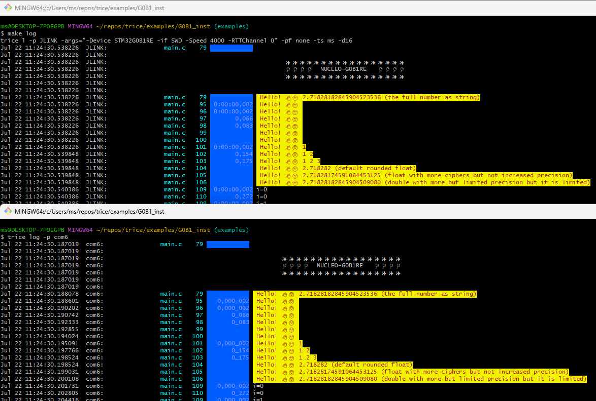

- The Trices with 16-bit timestamps are about 150 clocks away from each other. @32MHz this is a time of less 5 µs.

<p align="right">(<a href="#top">back to top</a>)</p>

### 41.7. <a id="nucleo-g0b1-examples"></a>Nucleo-G0B1 Examples


#### 41.7.1. <a id="g0b1bare"></a>G0B1_bare

Folder: [../examples/G0B1_bare/](../examples/G0B1_bare/)

<a id='g0b1_gen-description'></a><h5>G0B1_bare Description</h5>

- This is a working example with CLang and also GCC.
- This is a STMCubeMX generated project. It was then manually adapted to Clang.
- It is without TRICE instrumentation for easy compare with [../G0B1_inst](../examples/G0B1_inst) to figure out the needed changes to set up trice.

<a id='setting-up-g0b1_gen'></a><h5>Setting Up G0B1_bare</h5>

- See and adapt steps from [F030_bare](#f030bare).
- Then add/modify the files to reach this folder layot.

#### 41.7.2. <a id="g0b1inst"></a>G0B1_inst

Folder: [../examples/G0B1_inst/](../examples/G0B1_inst/)

This is an example with direct out without framing over RTT and deferred out in TCOBS framing over UART.

<a id='setting-up-1'></a><h5>Setting Up</h5>

- See and adapt steps from [G0B1_bare](#g0b1bare).

<a id='instrumenting'></a><h5>Instrumenting</h5>

- The steps are similar to the steps in [F030_bare](#f030bare).
- See comments in [triceConfig.h](../examples/G0B1_inst/Core/Inc/triceConfig.h) and commandlines in screenshot.

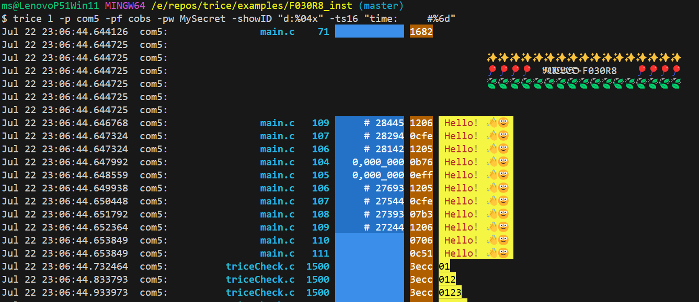

<p align="right">(<a href="#top">back to top</a>)</p>

### 41.8. <a id="nucleo-l432kc-examples"></a>Nucleo-L432KC Examples


#### 41.8.1. <a id="l432bare"></a>L432_bare

Folder: [../examples/L432_bare/](../examples/L432_bare/)

<!-- * [NUCLEO L432 User Manual](../../ref/dm00231744-stm32-nucleo32-boards-mb1180-stmicroelectronics.pdf) (example) -->
* This example is without Trice istrumentation and serves for comparing with [L432_inst](../examples/L432_inst/) to see the needed instrumentation steps quickly.
* This is a STMCubeMX generated project.
* See and adapt steps from [F030_bare](../examples/F030_bare) example.
* It was then manually adapted additionally to Clang.
* It was additionally configured for FreeRTOS.

#### 41.8.2. <a id="l432inst"></a>L432_inst

Folder: [../examples/L432_inst/](../examples/L432_inst/)

* This is the with Trice instrumented example project [L432_bare](../examples/L432_bare).
* It is for easy compare to figure out the needed setup changes.
* See and adapt steps in [F030_bare](../examples/F030_bare).
* Then add/modify the files to reach this folder layout.

<h5>Build:</h5>

Run `./build.sh` for configuration 0 or `./build.sh CONFIGURATION=34` for example.

<h6>Deferred Mode for max Speed</h6>

The stamps are MCU clocks here, so `🐁 Speedy Gonzales` lasts 9 processor clocks here.

```bash
ms@DESKTOP-7POEGPB MINGW64 ~/repos/trice_wt_devel/examples/L432_inst (devel)
$ trice l -p com8 -hs off -prefix off
      triceExamples.c    10        0_272  Hello! 👋🙂

        ✨✨✨✨✨✨✨✨✨✨✨✨✨✨✨✨✨
        🎈🎈🎈🎈  𝕹𝖀𝕮𝕷𝕰𝕺-L432KC   🎈🎈🎈🎈
        🍃🍃🍃🍃🍃🍃🍃🍃🍃🍃🍃🍃🍃🍃🍃🍃🍃


        triceConfig.h   369              CONFIGURATION == 34 - UART, no cycle counter, no critical sections.
      triceExamples.c    45              TRICE_DIRECT_OUTPUT == 0, TRICE_DEFERRED_OUTPUT == 1
      triceExamples.c    51              TRICE_DOUBLE_BUFFER, TRICE_MULTI_PACK_MODE
      triceExamples.c    60              _CYCLE == 0, _PROTECT == 0, _DIAG == 0, XTEA == 0
      triceExamples.c    61              _SINGLE_MAX_SIZE=512, _BUFFER_SIZE=580, _DEFERRED_BUFFER_SIZE=4096
      triceExamples.c    15    0,000_731 🐁 Speedy Gonzales
      triceExamples.c    16    0,000_745 🐁 Speedy Gonzales
      triceExamples.c    17    0,000_754 🐁 Speedy Gonzales
      triceExamples.c    18    0,000_763 🐁 Speedy Gonzales
      triceExamples.c    19    0,000_772 🐁 Speedy Gonzales
      triceExamples.c    20    0,000_781 🐁 Speedy Gonzales
      triceExamples.c    21    0,000_790 🐁 Speedy Gonzales
      triceExamples.c    22    0,000_799 🐁 Speedy Gonzales
      triceExamples.c    24        0_981 2.71828182845904523536 <- float number as string
      triceExamples.c    25        1_230 2.71828182845904509080 (double with more ciphers than precision)
      triceExamples.c    26        1_268 2.71828174591064453125 (float  with more ciphers than precision)
      triceExamples.c    27        1_296 2.718282 (default rounded float)
      triceExamples.c    28        1_310 A Buffer:
      triceExamples.c    29        1_348 32 2e 37 31 38 32 38 31 38 32 38 34 35 39 30 34 35 32 33 35 33 36
      triceExamples.c    30        1_603 31372e32  31383238  34383238  34303935  35333235
      triceExamples.c    31        1_799 ARemoteFunctionName(2e32)(3137)(3238)(3138)(3238)(3438)(3935)(3430)(3235)(3533)(3633)
      triceExamples.c    32              10 times a 16 byte long Trice messages, which not all will be written because of the TRICE_PROTECT:
      triceExamples.c    34        2_072 i=44444400 aaaaaa00
      triceExamples.c    34        2_119 i=44444401 aaaaaa01
      triceExamples.c    34        2_166 i=44444402 aaaaaa02
```

<a id='"hardware"-changes'></a><h5>"Hardware" Changes</h5>

* The used evaluation board is delivered with an on-board ST-Link software for debugging.
* This was changed to an on-board J-Link software for better debugging and RTT support.
* See [Trice over RTT](#trice-over-rtt) about that.

<a id='using-rtt-with-on-board-j-link-and-jlinkrttlogger'></a><h5>Using RTT with on-board J-Link and JLinkRTTLogger</h5>

* You need to install the "J-Link Software and Documentation pack" for yout OS.
* [./Core/Inc/triceConfig.h](../examples/L432_inst/Core/Inc/triceConfig.h) contains example Trice log commands.

<a id='using-rtt-with-on-board-j-link-and-openocd'></a><h5>Using RTT with on-board J-Link and OpenOCD</h5>

<a id='with-windows-not-possible'></a><h6>With Windows not possible</h6>

* OpenOCD does not support the installed JLink driver.
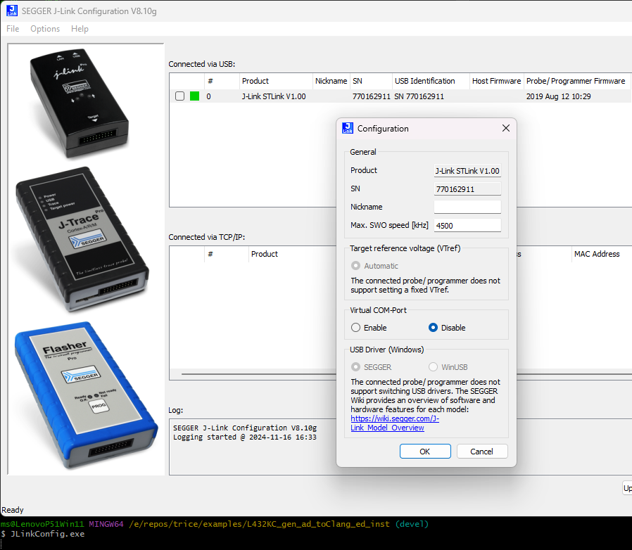
* Changing to the WinUSB buld device driver is here not supported :-(

<a id='darwin'></a><h6>Darwin (macOS)</h6>

* See **OpenOCD with Darwin** in [Trice over RTT](#trice-over-rtt)

<a id='using-rtt-with-on-board-st-link-and-openocd'></a><h5>Using RTT with on-board ST-Link and OpenOCD</h5>

**Terminal 1:**

```bash
ms@LenovoP51Win11 MINGW64 /e/repos/trice/examples/L432_inst (devel)
$ openocd -f STLinkOpenOCD.cfg
Open On-Chip Debugger 0.12.0 (2024-09-16) [https://github.com/sysprogs/openocd]
Licensed under GNU GPL v2
libusb1 d52e355daa09f17ce64819122cb067b8a2ee0d4b
For bug reports, read
        http://openocd.org/doc/doxygen/bugs.html
Info : The selected transport took over low-level target control. The results might differ compared to plain JTAG/SWD
Info : clock speed 100 kHz
Info : STLINK V2J24M11 (API v2) VID:PID 0483:374B
Info : Target voltage: 72.811768
Info : [stm32l4x.cpu] Cortex-M4 r0p1 processor detected
Info : [stm32l4x.cpu] target has 6 breakpoints, 4 watchpoints
Info : [stm32l4x.cpu] Examination succeed
Info : [stm32l4x.cpu] starting gdb server on 3333
Info : Listening on port 3333 for gdb connections
Info : rtt: Searching for control block 'SEGGER RTT'
Info : rtt: Control block found at 0x2000145c
Info : Listening on port 9090 for rtt connections
Channels: up=1, down=3
Up-channels:
0: Terminal 1024 0
Down-channels:
0: Terminal 16 0
Info : Listening on port 6666 for tcl connections
Info : Listening on port 4444 for telnet connections
```

**Terminal2:**

```bash
ms@LenovoP51Win11 MINGW64 /e/repos/trice/examples/L432_inst (devel)
$ trice l -p TCP4 -args localhost:9090  -pf none -d16
Nov 16 20:38:12.376056  TCP4:       triceExamples.c    10        1_595  Hello! 👋🙂
Nov 16 20:38:12.376056  TCP4:
Nov 16 20:38:12.376056  TCP4:         ✨✨✨✨✨✨✨✨✨✨✨✨✨✨✨✨✨
Nov 16 20:38:12.376056  TCP4:         🎈🎈🎈🎈  𝕹𝖀𝕮𝕷𝕰𝕺-L432KC   🎈🎈🎈🎈
Nov 16 20:38:12.376056  TCP4:         🍃🍃🍃🍃🍃🍃🍃🍃🍃🍃🍃🍃🍃🍃🍃🍃🍃
Nov 16 20:38:12.376056  TCP4:
Nov 16 20:38:12.376056  TCP4:
Nov 16 20:38:13.891033  TCP4:       triceExamples.c    16       43_439 2.71828182845904523536 <- float number as string
Nov 16 20:38:14.874024  TCP4:       triceExamples.c    17       44_949 2.71828182845904509080 (double with more ciphers than precision)
Nov 16 20:38:15.692614  TCP4:       triceExamples.c    18       45_802 2.71828174591064453125 (float  with more ciphers than precision)
Nov 16 20:38:16.323665  TCP4:       triceExamples.c    19       46_536 2.718282 (default rounded float)
```

<a id='using-on-board-st-link-and-vs-code-cortex-debug-extension'></a><h5>Using On-board ST-Link and VS-Code Cortex-Debug Extension</h5>

<a id='fail'></a><h6>Fail</h6>

* [https://www.st.com/resource/en/user_manual/um2576-stm32cubeide-stlink-gdb-server-stmicroelectronics.pdf](https://www.st.com/resource/en/user_manual/um2576-stm32cubeide-stlink-gdb-server-stmicroelectronics.pdf)
* Downloaded and installed
  * `en.stm32cubeprg-win64-v2-17-0.zip`
  * `en.st-link-server-v2-1-1.zip`
    * PATH variable extended with `C:\Program Files (x86)\STMicroelectronics\stlink_server`
    * Copied
      * From: "C:\Program Files (x86)\STMicroelectronics\stlink_server\stlinkserver.exe"
      * To: "C:\Program Files (x86)\STMicroelectronics\stlink_server\ST-LINK_gdbserver.exe"

<a id='ok'></a><h6>OK</h6>

* Download st-util from github.com
* Unpack to `C:\bin\stlink-1.8.0-win32` and add `C:\bin\stlink-1.8.0-win32\bin` to path
* Copy `C:\bin\stlink-1.8.0-win32\Program Files (x86)\stlink` to `C:\Program Files (x86)\stlink`
* Get `C:\bin\libusb-1.0.27`
* Copy `C:\bin\libusb-1.0.27\MinGW64\dll\libusb-1.0.dll` to `C:\bin\stlink-1.8.0-win32\bin\libusb-1.0.dll`
```bash
ms@LenovoP51Win11 MINGW64 /e/repos/trice/examples/L432_inst (devel)
$ st-util.exe
st-util 1.8.0
libusb: info [get_guid] no DeviceInterfaceGUID registered for 'USB\VID_056A&PID_5105\5&1140C04&0&10'
libusb: info [get_guid] no DeviceInterfaceGUID registered for 'USB\VID_056A&PID_5105&MI_01\6&13339912&0&0001'
libusb: info [get_guid] no DeviceInterfaceGUID registered for 'USB\VID_058F&PID_9540\5&1140C04&0&11'
libusb: info [get_guid] no DeviceInterfaceGUID registered for 'USB\VID_8087&PID_0A2B\5&1140C04&0&14'
libusb: info [get_guid] no DeviceInterfaceGUID registered for 'USB\ROOT_HUB30\4&20F1DF2E&0&0'
libusb: info [get_guid] no DeviceInterfaceGUID registered for 'USB\VID_0765&PID_5010\5&1140C04&0&13'
libusb: info [get_guid] no DeviceInterfaceGUID registered for 'USB\VID_0483&PID_374B&MI_01\6&224DEA1D&0&0001'
libusb: info [get_guid] no DeviceInterfaceGUID registered for 'USB\VID_5986&PID_111C&MI_00\6&104790C2&0&0000'
libusb: info [get_guid] no DeviceInterfaceGUID registered for 'USB\VID_046D&PID_C534\5&1140C04&0&6'
libusb: info [get_guid] no DeviceInterfaceGUID registered for 'USB\VID_0483&PID_374B&MI_02\6&224DEA1D&0&0002'
libusb: info [get_guid] no DeviceInterfaceGUID registered for 'USB\VID_0483&PID_374B\066CFF515570514867145144'
libusb: info [get_guid] no DeviceInterfaceGUID registered for 'USB\VID_138A&PID_0097\72FA8C531499'
libusb: info [get_guid] no DeviceInterfaceGUID registered for 'USB\VID_056A&PID_5105&MI_00\6&13339912&0&0000'
libusb: info [get_guid] no DeviceInterfaceGUID registered for 'USB\VID_046D&PID_C534&MI_01\6&C944391&0&0001'
libusb: info [get_guid] no DeviceInterfaceGUID registered for 'USB\VID_046D&PID_C534&MI_00\6&C944391&0&0000'
libusb: info [get_guid] no DeviceInterfaceGUID registered for 'USB\VID_5986&PID_111C\200901010001'
2024-11-17T22:20:05 INFO common.c: STM32L41x_L42x: 48 KiB SRAM, 256 KiB flash in at least 2 KiB pages.
2024-11-17T22:20:05 INFO gdb-server.c: Listening at *:4242...
Receive signal 0. Exiting...
```
(Last line after `CTRL-C`)

<p align="right">(<a href="#top">back to top</a>)</p>

## 42. <a id="trice-generate"></a>Trice Generate

For a compact, readable copy of the ID dictionaries, run `trice generate -onelineJSON -til til.json -li li.json`. This writes `til.oneline.json` and `li.oneline.json` in `-genDir` (default `./generated`) as complete JSON objects with one ID entry per line. In the LI copy, each entry shows `Line` before `File`. The original files remain authoritative and unchanged; rerun the command after updating them. Use `-li off` to export only the TIL copy. Missing or invalid requested input files cause an error without replacing either copy. This option cannot be combined with `-logC` or `-abc`.

### 42.1. <a id="colors"></a>Colors

Support for finding a color style:

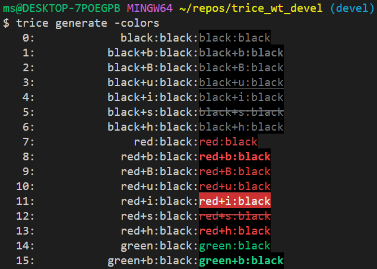

See [Check Alternatives](#check-color-alternatives) chapter.

### 42.2. <a id="c-code"></a>C-Code

To generate a compact C metadata table for current target-side Trice sites, first run `trice insert` or `trice bind` and then run `trice generate -src <source> -logC[=<output.c>]`. Multiple `-src` options are accepted. Explicit Insert IDs and numeric Bind sidecar descriptors are validated against the selected TIL; no ID is guessed from a matching format string. Historical TIL entries that are absent from the selected sources are omitted without changing the TIL itself. Bind sidecars are read from `./generated` by default; specify `-genDir` for a different directory. Bare `-logC` writes `./generated/til.c`; an explicit output path takes precedence. `-logC` and `-abc` are alternative generation modes and cannot be combined.

Commented Trice calls with explicit Insert IDs remain selectable. An ID-free call that exists only in a C comment has no Bind preprocessor site and therefore no exact sidecar ID; `-logC` reports it instead of guessing or silently omitting it. Use `trice insert` for such retained commented calls, give the commented example an explicit authoritative ID, or exclude that source from this generated table.

```C
// SPDX-License-Identifier: MIT

#include "triceRx.h"

const triceLog_t triceLog[] = {
	/* Trice type ( extended ) */ /*   id, bitWidth, paramCount, format-string */
	/* trice      ( trice_0   ) */ { 1000u, 32u, 0u, "ready\n" },
	/* trice      ( trice32_2 ) */ { 1001u, 32u, 2u, "value=%d hex=%x\n" },
};

const unsigned triceLogElements = sizeof(triceLog) / sizeof(triceLog[0]);
```

### 42.3. <a id="c-code-1"></a>C#-Code

The current `trice generate` command does not provide a C# source generator. C# applications can read the generated `til.json` as input to their own decoder or use the Trice host tool to produce text, JSON, or KV output.

### 42.4. <a id="generating-a-trice-abc-function-pointer-list"></a>Generating a Trice ABC Function Pointer List

Use `-abc=<target>` to generate the target-specific ABC receive selection and table files:

```text
trice generate -i til.json -abc=deviceX
```

Run from the project directory. This creates `generated/deviceX.h` if it does not exist, otherwise uses it as the user-edited selection input. It always regenerates `generated/deviceX.c` from `til.json` and the active declarations in `generated/deviceX.h`. `-genDir` changes the generated directory; an explicit target path such as `-abc=custom/deviceX` keeps that path. For the workflow and examples see [Trice ABC - Asynchronous Broadcast Commands](#trice-abc---asynchronous-broadcast-commands).


<p align="right">(<a href="#top">back to top</a>)</p>

## 43. <a id="testing-the-trice-library-c-code-for-the-target"></a>Testing the Trice Library C-Code for the Target

### 43.1. <a id="general-info"></a>General info

This folder is per default named to `_test` to avoid VS Code slow down. Also, when running `go test ./...`,  the tests in the `_test` folder are excluded, because they take a long time. Run `./scripts/testAll.sh` to include them.

The main aim of these tests is to automatic compile and run the target code in different compiler switch variants avoiding manual testing this way. 

`scripts/testAll.sh quick` performs the standard Bind compiler matrices and focused CE/SL checks for both Bind and Insert/Clean. `scripts/testAll.sh full` also runs the complete legacy Insert/Clean and extended compiler matrices; its duration depends strongly on the host. The runner orders short checks before long matrices and shows a hardware-independent percentage of expected relative test work. On an interactive terminal, a spinner changes in place every few seconds during a long step; it does not add repeated log lines or claim a time-based ETA.

Each result line shows the elapsed time for that script before its name, with right-aligned minutes and seconds: `[24/26 | ~ 76.7%] (  4m 30s) _620_test_l432_configs.sh: PASS`. The format is `(%3dm%3ds)`; four hours appear as `(240m  0s)`. This measures elapsed time including any preparation and restoration performed by the script, not accumulated CPU time or time since the entire suite started. The same column appears for `WARN`, `FAIL` and `ABORTED`, and is saved in `temp/log/testAll_summary.log`. The interactive spinner updates the current script's elapsed time in place.

Both selections include [step 515](../scripts/_515_test_logging_features.sh), which runs the existing compiler-to-decoder CE/SL checks and the feature examples:

| Check | Evidence |
| --- | --- |
| `TestContextEnrichmentTargetToDecoder` and `TestContextInsertCleanTargetToDecoder` | Real C/C++ records, text/JSON/KV output, structured fields, stamps, reversible Insert/Clean, disabled logging and exactly-once argument evaluation. |
| `TestContextEnrichmentPoC` and `TestContextEnrichmentPoCRebaseScopeBoundary` | Retained proofs for direct callsites and the scope limitation of the existing Rebase dispatcher. |
| [PC feature example](../examples/PC_features/check_output.sh) | Runtime string, fields, stamps/deltas, CE, tag filtering and KV output from the built example. |
| [G0B1 feature example](../examples/G0B1_features/check_build.sh) | Firmware build, task-context adapter, runtime-string and structured-field metadata, nonempty ELF/HEX/BIN artifacts. This does not execute the firmware on an MCU. |

The compiler/decoder checks require Go, Clang, Clang++ and clangd. The examples require the current repository's `trice` tool, Git and tar; the PC example needs `cc` or `gcc`, and G0B1 needs Make and ARM GNU GCC/objcopy/size with its bare-metal libraries. In `quick`, an unavailable group is explicitly skipped and the runner shows `WARN`. In `full`, missing tools make this step fail. A selected Go test that reports `SKIP`, or fails to report its named `PASS`, is also an error. This prevents an empty test selection from appearing to validate the features. The shared Library CI workflow invokes this same step in `full` mode.

The example checks run in a fresh copy under `temp/log/logging-features.*`. It contains the current bytes of tracked sources, including uncommitted source edits, and the same relative layout as the checkout. Existing captures, generated directories and object files are not reused or modified. Successful copies are removed; failed copies remain for inspection. Details are written to `temp/log/_515_test_logging_features.log`. Run just this acceptance step from the repository root with:

```bash
./scripts/_480_test_build_trice_tool.sh
./scripts/_515_test_logging_features.sh full
```

The larger experimental CE Rebase/Wrapper proof remains a separate, explicit investigation. It does not establish productive support for those constructs. To rerun it with the locally available compiler variants:

```bash
TRICE_BIND_INTEGRATION=1 go test ./internal/id -run '^TestContextEnrichmentRebasePoC$' -count=1 -v
```

It reports unavailable compiler variants and optional clangd evidence; missing variants are not platform acceptance. Ordinary Go unit/coverage runs continue to cover SL parser/renderer behavior; step 515 selects only the additional compiler checks instead of repeating those suites.

The PC matrix uses four independent configuration processes by default. Set `TRICE_PC_TEST_JOBS=1` for serial execution or choose another positive limit. ID preparation and source restoration remain sequential. A failing configuration stops at its first mismatch. `testAll.sh` continues with the remaining configurations and test steps by default (`--no-stop`), but the final result remains `FAIL` if any check failed. Use `--stop` to stop after the first failure; cancellation always stops the run. Failure summaries include source references, expected/actual output and the detailed log path.

For example, from the repository root:

```bash
TRICE_PC_TEST_JOBS=4 ./scripts/_640_test_pc_targets_bind.sh full
TRICE_PC_TEST_JOBS=1 TRICE_PC_TEST_MODE=line-by-line ./scripts/_630_test_pc_targets_insert.sh full
```

The second command explicitly selects the diagnostic single-expectation path. Normal runs use `TRICE_PC_TEST_MODE=auto`: bulk where packet boundaries are preserved, single-expectation decoding for unframed or special configurations. All expectations remain enabled.

The L432 matrix builds all 101 configurations (`CONFIGURATION=0` through `100`). It prepares the shared Bind state once and builds configurations concurrently, each with `make -j1`. The default concurrency follows the online CPU count; on Windows it uses the bounded budget from the shared build setup, which prefers physical cores. If detection fails, the matrix uses four jobs. Set `TRICE_L432_TEST_JOBS=1` for serial execution or choose another positive limit; this limits the total number of simultaneous compiler/linker commands, even when `MAKE_JOBS` normally requests unlimited parallelism. For example, to limit a run to four jobs from the repository root:

```bash
TRICE_L432_TEST_JOBS=4 ./scripts/_620_test_l432_configs.sh
```

Every invocation uses fresh, separate object directories for every configuration. All code-generation options, source files and ELF/HEX/BIN targets remain enabled; there is no reuse of potentially stale objects after a header, configuration, workflow or compiler change. The matrix skips the expensive assembler `.lst` text listings (`GCC_LISTINGS=0`); compiler warnings and errors remain enabled. Ordinary `build.sh CONFIGURATION=N` builds still generate listings for manual inspection. Existing `examples/L432_inst/out.gcc` builds remain untouched by the matrix. Full compiler logs stay in `temp/log/l432.*/config-N.log`. Successful temporary build outputs are removed to save disk space; failed or interrupted outputs are retained beside their logs.

The matrix reports each configuration's result, prints compiler error excerpts and gives the command to reproduce a failure. Under `testAll.sh`, the selected `--no-stop` or `--stop` policy applies. A directly invoked L432 matrix stops after a failed batch by default; use `TRICE_TEST_NO_STOP=1` to finish the remaining configurations. Already started jobs finish before source restoration. Cancellation terminates the compiler processes too and prevents further configurations from starting. The managed wrapper above restores the initial source and metadata state on success, failure and cancellation; a direct `examples/L432_inst/all_configs_build.sh` invocation performs the same Bind preparation as `build.sh` and leaves sources in Bind state.

* Partial tests:
  * In `./examples` you can build the target examples with `./buildAllTargets_TRICE_ON.sh` or `./buildAllTargets_TRICE_OFF.sh`.
  * In `./examples/L432_inst` the script `all_configs_build.sh` translates many different configurations.

For the user it could be helpful to start with a `triceConfig.h`file from here and to adapt the Trice tool command line from the matching `cgo_test.go` if no close match in the `examples` folder was found.

### 43.2. <a id="how-to-run-the-tests"></a>How to run the tests

* Host compiler prerequisites:
  * CGO and host-side target-code tests need a working host C compiler, not only a compiler executable in `PATH`.
  * On Windows, TDM-GCC or another matching MinGW-w64 GCC installation can provide the host compiler and C runtime.
  * Some Go regression tests execute every supported compiler found in `PATH`, including `clang`. If Clang is visible, verify it first with `printf '#include <string.h>\n' | clang -std=c99 -fsyntax-only -x c -`.
  * Keep `C_INCLUDE_PATH` unset globally so ARM cross-compiler headers do not leak into host and CGO builds.
* For direct `go test` calls outside the managed PC worker, execute `go clean -cache` from the repository root after editing externally included C files if CGO appears to reuse precompiled files. The managed PC workflows described below handle these repository inputs automatically.
* Normal tests use an overlay for the shared CGO test files. If you deliberately need to renew IDs and generated test files after editing `./examples` or `_test`, review the wider effects of `./scripts/_330_renew_ids_and_refresh_tests.sh` and use `keepHistory` to preserve the existing ID tables.
* To run direct Go tests from the repository root, use a repo-local Go cache if needed: `GOCACHE="$PWD/.gocache" go test ./...` on POSIX shells, or `$env:GOCACHE = "$PWD/.gocache"; go test ./...` in PowerShell. The `.gocache/` folder is ignored by Git.
* To run the tests manually `cd` into `_test` and execute `trice insert -i ../demoTIL.json -li ../demoLI.json` and then `go test ./...` from there. It is more convenient to run `scripts/_230_legacy_insert_ids.sh` from the Trice root folder.
* It is convenient to run `scripts/testAll.sh` from the Trice root folder to perform this.
* `scripts/testAll.sh` creates its local helper artifacts inside the ignored `./temp/log` folder. The versioned `demoTIL.json` and `demoLI.json` files in the repository root stay available as example reference files. When `GOCACHE` is unset, `scripts/testAll.sh` also uses the ignored repo-local cache folder `./.gocache`.
* A script name beginning with `_` marks an internal helper or an individually runnable test step. Its three-digit prefix groups the flat `scripts` folder: `100`--`250` are shared workflow helpers, `260`--`330` are maintenance helpers, and `400`--`640` are tests ordered broadly from short checks to long compiler matrices.
* It is possible to start the tests individually, but for some the default `-timeout 30s` maybe too short.

### 43.3. <a id="tests-details"></a>Tests Details

All folders despite `testdata` are test folders and the name `tf` is used as a place holder for them in this document.

To exclude a specific folder temporary, simply rename it to start with an underscore `_tf`.

The `tf` are serving for target code testing in different configuration variants on the host machine. The file [./testdata/triceCheck.c](../_test/testdata/triceCheck.c) is the main file for most tests and serves also as example usage.

[_test/testdata/cgoPackage.go](../_test/testdata/cgoPackage.go) is the common main for the `generated_cgoPackage.go` files and contains the common test code. 

The folders `tf` are Go packages just for tests. They all have the same package name `cgot` and are not included into the trice tool. The different `cgot` packages are independent and could have any names. They do not see each other and are used for target code testing independently. When the tests are executed for each package, a separate test binary is build and these run parallel.

The `tf/triceConfig.h` files differ and correspondent to the `tf/cgo_test.go` files in the same folder. On test execution, the `./testdata/*.c` files are compiled into the trice test executable together with the trice sources `../src` using the `tf/triceConfig.h` file.

The individual tests collect the expected results (`//exp: result`) together with the line numbers into a slice to execute the test loop on it. The `triceLogTest` function gets the `triceLog` function as parameter.

`triceLogTest` iterates over the results slice and calls for each line the C-function `triceCheck`. Then the line specific binary data buffer is passed to the `triceLog` parameter function which "logs" the passed buffer into an actual result string which in turn is compared with the expected result.

The bulk path still executes each C test site. It collects binary output and starts the host logger once per output channel, then compares every expected text range with its source line. This avoids repeated logger initialization. Finite replay inputs finish when their buffered records are drained; they do not wait for a fixed timeout after each expectation.

Framed direct and deferred channels are collected separately. Configurations that previously transferred after every test site retain that transfer schedule, so small target buffers cannot overflow merely because host decoding is batched. Existing deferred bulk tests retain their multi-site transfer schedule to exercise buffering. Unframed configurations keep the single-expectation path because concatenation can lose packet boundaries or change padding interpretation. Successful bulk runs are not repeated completely line by line.

Each configuration has its own `output.log` below `temp/log/pc-<workflow>.<run>/`. On a bulk mismatch, the original binary and text output are saved there, and the worker reruns that configuration line by line. A passing diagnostic rerun does not clear the bulk failure: it points to an interaction involving framing, buffering or state. The reported source line is the first divergent expectation, which may follow the actual cause. Expected and actual strings show escaped control characters; nearby text helps identify shifts. The failure report also gives a reproduction command, which requires the same prepared ID state and compiler include paths. Run directories are retained for diagnosis; subsequent runs use a new directory.

The managed PC worker preserves Go's build cache between runs. Before testing, [pc_cache_overlay.go](../scripts/pc_cache_overlay.go) hashes file names and contents in `src`, `_test/testdata`, each configuration directory and the applicable Bind sidecar directory, including a custom generation directory. It also records the ID workflow and compiler/header-search settings. The worker appends the resulting SHA-256 signature to temporary copies of the CGO Go sources and supplies them through a Go overlay. External C or header changes therefore become visible to Go's build cache without changing the original sources or discarding cached Go dependencies. Added, removed or renamed input files change the signature too; timestamps alone do not. A local configuration change rebuilds that configuration, while shared input changes rebuild all affected configurations. The ABC host bridges participate as well as the generated harnesses.

Every selected test still executes with `-count=1`; only compiled build artifacts are reused. The preceding normal Go and coverage steps also preserve the build cache and use `-count=1`, so a complete `testAll.sh` invocation does not discard the PC builds from the previous run. Overlay JSON and stamped sources remain beside the logs in `overlay.json` and `cache-inputs/` for diagnosis. The temporary Go filenames start with `_`, keeping them out of ordinary package discovery. Unreadable inputs or symbolic links inside the input trees stop preparation instead of silently running a potentially stale binary. This protection covers the repository's PC input trees, not independently modified external C libraries or SDK headers at an unchanged location. After such external changes, explicitly run `go clean -cache`. Go itself accounts for compiler identity and build flags; see [Go's build-cache documentation](https://pkg.go.dev/cmd/go#hdr-Build_and_test_caching).

The behavioral checks in [pc_cache_overlay_test.go](../scripts/pc_cache_overlay_test.go) include real cold and warm CGO builds. They verify current C runtime values after source, header, sidecar, configuration and compiler-option changes, verify that unchanged configurations avoid C recompilation, and independently count actual test executions.

The `testdata\cgoPackage.go` file contains a variable `testLines = n`, which limits the amount of performed trices for each test case to `n`. Changing this value will heavily influence the test duration. The value `-1` is reserved for testing all test lines.

### 43.4. <a id="how-to-add-new-test-cases"></a>How to add new test cases

- Choose a test folder similar to the intended test and copy it under a new descriptive name like `newTest`.
- Add the new package to the test-folder list in `scripts/_330_renew_ids_and_refresh_tests.sh` if it should receive refreshed generated test files.
- Edit files `newTest/triceConfig.h` and `newTest/cgo_test.go` in a matching way.
- Run `go test ./_test/newTest` from the repository root.

### 43.5. <a id="test-internals"></a>Test Internals

The `./trice/_test/testdata/*.c` and `./trice/src/*.c` are compiled together with the actual cgot package into one single Trice test binary, resulting in as many test binaries as there are test folders. Calling its TeCEFunction(s) causes the activation of the Trice statement(s) inside *triceCheck.c*. The ususally into an embedded device compiled Trice code generates a few bytes according to the configuration into a buffer. These bytes are transmitted usually in real life over a (serial) port or RTT. In the tests here, this buffer is then read out by the Trice tool handler function according to the used CLI switches and processed to a log string using the *til.json* file. This string is then compared to the expected string for the activated line.

Each `tf` is a **Go** package, which is not part of any **Go** application. They are all named `cgot` and are only used independently for testing different configurations. The `tf/generated_cgoPackage.go` file is identical in all `tf`. Its master is `_test/testdata/cgoPackage.go`. The test worker overlays the master during normal test runs. The maintenance script `./scripts/_330_renew_ids_and_refresh_tests.sh` copies the master into the listed packages, but also renews IDs and clears ID history by default; use `keepHistory` only when you deliberately run that wider maintenance workflow.

The test specific target code configuration is inside `tf/trice.Config.h` and the appropriate Trice tool CLI switches are in `tf/cgo_test.go`.

When running `go test ./tf`, a Trice tool test executable is build, using the Trice tool packages and the `tf` package `cgot`, and the function `TestLogs` is executed. Its internal closure `triceLog` contains the Trice tool CLI switches and is passed to the `ccgot` package function `triceLogTest` together with the number of testLines and the trice mode (`directTransfer` or `deferrerdTransfer`).

During the test, the file `triceCheck.c` is scanned for lines like

```C
break; case __LINE__: TRice( iD(3537), "info:This is a message without values and a 32-bit stamp.\n" ); //exp: time: 842,150_450default: info:This is a message without values and a 32-bit stamp.
```

Some C-code lines contain Trice statements and comments starting with `//exp: ` followed by the expected Trice tool output for that specific line. The **Go** teCEFunction collects these outputs in a slice together with the line numbers. Then for each found line number the execution of the **Go** function `func triceCheck(n int)` takes part, which in turn calls the CGO compiled C-function `TriceCheck(n)`. The now activated Trice C-code writes the generated trice bytes in a between **C** and **Go** shared buffer using the C-function `TriceWriteDeviceCgo`. After returning from the **Go** function `func triceCheck(n int)` and optionally calling `TriceTransfer` in deferred mode the Trice tool `triceLog()` function converts the Trice buffer bytes to the log string and compares the result with the expected data. The between **Go** and **C** shared buffer limits the executed Trices per line to one, because they use the same buffer from the beginning. This could be done better with an increment to allow several trices in one single line.

Because each test runs a different configuration, all possible combinations are testable.

### 43.6. <a id="test-results"></a>Test Results

```bash
ms@DESKTOP-7POEGPB MINGW64 ~/repos/trice (main)
$ ./scripts/testAll.sh
Thu, Dec 12, 2024  4:51:26 PM
This can take several minutes ...
?       github.com/rokath/trice/internal/decoder        [no test files]
?       github.com/rokath/trice/internal/do     [no test files]
?       github.com/rokath/trice/internal/translator     [no test files]
?       github.com/rokath/trice/pkg/ant [no test files]
ok      github.com/rokath/trice/cmd/trice       1.392s
ok      github.com/rokath/trice/internal/args   0.415s
ok      github.com/rokath/trice/internal/charDecoder    0.298s
ok      github.com/rokath/trice/internal/com    15.845s
ok      github.com/rokath/trice/internal/dumpDecoder    0.339s
ok      github.com/rokath/trice/internal/emitter        0.326s
ok      github.com/rokath/trice/internal/id     3.088s
ok      github.com/rokath/trice/internal/keybcmd        0.233s
ok      github.com/rokath/trice/internal/link   0.196s
ok      github.com/rokath/trice/internal/receiver       0.246s
?       github.com/rokath/trice/internal/translator     [no test files]
?       github.com/rokath/trice/pkg/ant [no test files]
ok      github.com/rokath/trice/cmd/trice       1.392s
ok      github.com/rokath/trice/internal/args   0.415s
ok      github.com/rokath/trice/internal/charDecoder    0.298s
ok      github.com/rokath/trice/internal/com    15.845s
ok      github.com/rokath/trice/internal/dumpDecoder    0.339s
ok      github.com/rokath/trice/internal/emitter        0.326s
ok      github.com/rokath/trice/internal/id     3.088s
ok      github.com/rokath/trice/internal/keybcmd        0.233s
ok      github.com/rokath/trice/internal/link   0.196s
ok      github.com/rokath/trice/internal/receiver       0.246s
ok      github.com/rokath/trice/internal/trexDecoder    0.264s
ok      github.com/rokath/trice/pkg/cipher      0.230s
ok      github.com/rokath/trice/pkg/endian      0.161s
ok      github.com/rokath/trice/internal/args   0.415s
ok      github.com/rokath/trice/internal/charDecoder    0.298s
ok      github.com/rokath/trice/internal/com    15.845s
ok      github.com/rokath/trice/internal/dumpDecoder    0.339s
ok      github.com/rokath/trice/internal/emitter        0.326s
ok      github.com/rokath/trice/internal/id     3.088s
ok      github.com/rokath/trice/internal/keybcmd        0.233s
ok      github.com/rokath/trice/internal/link   0.196s
ok      github.com/rokath/trice/internal/receiver       0.246s
ok      github.com/rokath/trice/internal/trexDecoder    0.264s
ok      github.com/rokath/trice/pkg/cipher      0.230s
ok      github.com/rokath/trice/pkg/endian      0.161s
ok      github.com/rokath/trice/internal/id     3.088s
ok      github.com/rokath/trice/internal/keybcmd        0.233s
ok      github.com/rokath/trice/internal/link   0.196s
ok      github.com/rokath/trice/internal/receiver       0.246s
ok      github.com/rokath/trice/internal/trexDecoder    0.264s
ok      github.com/rokath/trice/pkg/cipher      0.230s
ok      github.com/rokath/trice/pkg/endian      0.161s
ok      github.com/rokath/trice/pkg/msg 0.157s
ok      github.com/rokath/trice/pkg/tst 0.261s
ok      github.com/rokath/trice/_test/be_dblB_de_tcobs_ua       123.142s
ok      github.com/rokath/trice/_test/be_staticB_di_xtea_cobs_rtt32     123.159s
ok      github.com/rokath/trice/internal/trexDecoder    0.264s
ok      github.com/rokath/trice/pkg/cipher      0.230s
ok      github.com/rokath/trice/pkg/endian      0.161s
ok      github.com/rokath/trice/pkg/msg 0.157s
ok      github.com/rokath/trice/pkg/tst 0.261s
ok      github.com/rokath/trice/_test/be_dblB_de_tcobs_ua       123.142s
ok      github.com/rokath/trice/_test/be_staticB_di_xtea_cobs_rtt32     123.159s
ok      github.com/rokath/trice/pkg/msg 0.157s
ok      github.com/rokath/trice/pkg/tst 0.261s
ok      github.com/rokath/trice/_test/be_dblB_de_tcobs_ua       123.142s
ok      github.com/rokath/trice/_test/be_staticB_di_xtea_cobs_rtt32     123.159s
ok      github.com/rokath/trice/_test/dblB_de_cobs_ua   122.964s
ok      github.com/rokath/trice/_test/dblB_de_multi_cobs_ua     123.308s
ok      github.com/rokath/trice/_test/be_dblB_de_tcobs_ua       123.142s
ok      github.com/rokath/trice/_test/be_staticB_di_xtea_cobs_rtt32     123.159s
ok      github.com/rokath/trice/_test/dblB_de_cobs_ua   122.964s
ok      github.com/rokath/trice/_test/dblB_de_multi_cobs_ua     123.308s
ok      github.com/rokath/trice/_test/dblB_de_cobs_ua   122.964s
ok      github.com/rokath/trice/_test/dblB_de_multi_cobs_ua     123.308s
ok      github.com/rokath/trice/_test/dblB_de_multi_cobs_ua     123.308s
ok      github.com/rokath/trice/_test/dblB_de_multi_nopf_ua     123.244s
ok      github.com/rokath/trice/_test/dblB_de_multi_nopf_ua     123.244s
ok      github.com/rokath/trice/_test/dblB_de_multi_tcobs_ua    123.109s
ok      github.com/rokath/trice/_test/dblB_de_multi_tcobs_ua    123.109s
ok      github.com/rokath/trice/_test/dblB_de_multi_xtea_cobs_ua        123.213s
ok      github.com/rokath/trice/_test/dblB_de_multi_xtea_tcobs_ua       123.001s
ok      github.com/rokath/trice/_test/dblB_de_multi_xtea_cobs_ua        123.213s
ok      github.com/rokath/trice/_test/dblB_de_multi_xtea_tcobs_ua       123.001s
ok      github.com/rokath/trice/_test/dblB_de_nopf_ua   123.092s
ok      github.com/rokath/trice/_test/dblB_de_multi_xtea_tcobs_ua       123.001s
ok      github.com/rokath/trice/_test/dblB_de_nopf_ua   123.092s
ok      github.com/rokath/trice/_test/dblB_de_tcobs_ua  122.324s
ok      github.com/rokath/trice/_test/dblB_de_nopf_ua   123.092s
ok      github.com/rokath/trice/_test/dblB_de_tcobs_ua  122.324s
ok      github.com/rokath/trice/_test/dblB_de_tcobs_ua  122.324s
ok      github.com/rokath/trice/_test/dblB_de_xtea_cobs_ua      123.149s
ok      github.com/rokath/trice/_test/dblB_de_xtea_tcobs_ua     122.883s
ok      github.com/rokath/trice/_test/dblB_de_xtea_cobs_ua      123.149s
ok      github.com/rokath/trice/_test/dblB_de_xtea_tcobs_ua     122.883s
ok      github.com/rokath/trice/_test/dblB_di_nopf_rtt32__de_cobs_ua    246.703s
ok      github.com/rokath/trice/_test/dblB_de_xtea_tcobs_ua     122.883s
ok      github.com/rokath/trice/_test/dblB_di_nopf_rtt32__de_cobs_ua    246.703s
ok      github.com/rokath/trice/_test/dblB_di_nopf_rtt32__de_cobs_ua    246.703s
ok      github.com/rokath/trice/_test/dblB_di_nopf_rtt32__de_multi_cobs_ua      247.125s
ok      github.com/rokath/trice/_test/dblB_di_nopf_rtt32__de_multi_tcobs_ua     246.862s
ok      github.com/rokath/trice/_test/dblB_di_nopf_rtt32__de_tcobs_ua   246.531s
ok      github.com/rokath/trice/_test/dblB_di_nopf_rtt32__de_xtea_cobs_ua       247.072s
ok      github.com/rokath/trice/_test/dblB_di_nopf_rtt8__de_cobs_ua     246.639s
ok      github.com/rokath/trice/_test/dblB_di_nopf_rtt8__de_multi_cobs_ua       246.599s
ok      github.com/rokath/trice/_test/dblB_di_nopf_rtt8__de_multi_tcobs_ua      247.114s
ok      github.com/rokath/trice/_test/dblB_di_nopf_rtt8__de_tcobs_ua    246.851s
ok      github.com/rokath/trice/_test/ringB_de_cobs_ua  123.578s
ok      github.com/rokath/trice/_test/ringB_de_multi_tcobs_ua   123.517s
ok      github.com/rokath/trice/_test/ringB_de_multi_xtea_cobs_ua       123.497s
ok      github.com/rokath/trice/_test/ringB_de_multi_xtea_tcobs_ua      123.379s
ok      github.com/rokath/trice/_test/ringB_de_nopf_ua  123.555s
ok      github.com/rokath/trice/_test/ringB_de_tcobs_ua 123.300s
ok      github.com/rokath/trice/_test/ringB_de_xtea_cobs_ua     123.487s
ok      github.com/rokath/trice/_test/ringB_de_xtea_tcobs_ua    123.846s
ok      github.com/rokath/trice/_test/ringB_di_cobs_rtt32__de_tcobs_ua  247.400s
ok      github.com/rokath/trice/_test/ringB_di_cobs_rtt8__de_tcobs_ua   247.202s
ok      github.com/rokath/trice/_test/ringB_di_nopf_rtt32__de_tcobs_ua  247.204s
ok      github.com/rokath/trice/_test/ringB_di_nopf_rtt32__de_xtea_cobs_ua      246.818s
ok      github.com/rokath/trice/_test/ringB_di_nopf_rtt8__de_tcobs_ua   247.006s
ok      github.com/rokath/trice/_test/ringB_di_tcobs_rtt32__de_tcobs_ua 247.000s
ok      github.com/rokath/trice/_test/ringB_di_xtea_cobs_rtt32__de_xtea_cobs_ua 246.872s
ok      github.com/rokath/trice/_test/special_protect_dblB_de_tcobs_ua  0.444s
ok      github.com/rokath/trice/_test/stackB_di_nopf_aux32      123.819s
ok      github.com/rokath/trice/_test/stackB_di_nopf_aux8       123.830s
ok      github.com/rokath/trice/_test/stackB_di_nopf_rtt32      123.912s
ok      github.com/rokath/trice/_test/stackB_di_nopf_rtt8       123.976s
ok      github.com/rokath/trice/_test/stackB_di_xtea_cobs_rtt8  123.719s
ok      github.com/rokath/trice/_test/staticB_di_nopf_aux32     123.553s
ok      github.com/rokath/trice/_test/staticB_di_nopf_aux8      123.551s
ok      github.com/rokath/trice/_test/staticB_di_nopf_rtt32     123.596s
ok      github.com/rokath/trice/_test/staticB_di_nopf_rtt8      123.618s
ok      github.com/rokath/trice/_test/staticB_di_tcobs_rtt32    123.177s
ok      github.com/rokath/trice/_test/staticB_di_tcobs_rtt8     123.353s
ok      github.com/rokath/trice/_test/staticB_di_xtea_cobs_rtt32        123.126s

real    10m31.130s
user    0m0.000s
sys     0m0.015s

ms@DESKTOP-7POEGPB MINGW64 ~/repos/trice (main)
$
```

### 43.7. <a id="special-tests"></a>Special tests

### 43.8. <a id="test-cases"></a>Test Cases

#### 43.8.1. <a id="folder-naming-convention"></a>Folder Naming Convention

| Folder Name Part | Meaning                                                                                                  |
|:----------------:|----------------------------------------------------------------------------------------------------------|
|    `testdata`    | This is no test folder. It contains data common to all tests.                                            |
|      `_...`      | Folder starting with an undescore `_` are excluded when `go test ./...` is executed.                     |
|      `_di_`      | direct mode                                                                                              |
|      `_de_`      | deferred mode                                                                                            |
|    `special_`    | a test, not using `./testdata/triceCheck.c`                                                              |
|    `staticB_`    | static buffer, direct mode only possible                                                                 |
|    `stackB_`     | stack buffer, direct mode only possible                                                                  |
|     `ringB_`     | ring buffer, deferred mode and optional parallel direct mode                                             |
|     `dblB_`      | double buffer, deferred mode and optional parallel direct mode                                           |
|     `_rtt8_`     | (simulated) SEGGER_RTT byte transfer                                                                     |
|    `_rtt32_`     | (simulated) SEGGER_RTT word transfer                                                                     |
|       `__`       | direct and deferred mode together                                                                        |
|     `_xtea_`     | with encryption, otherwise without encryption                                                            |
|     `_tcobs`     | TCOBS package framing                                                                                    |
|     `_cobs`      | COBS package framing                                                                                     |
|     `_nopf`      | no package framing                                                                                       |
|    `_multi_`     | Usually each Trice is handled separately. In multi mode, groups of available Trices are framed together. |
|      `_ua`       | simulated UART A output (for deferred modes)                                                             |

<p align="right">(<a href="#top">back to top</a>)</p>

## 44. <a id="test-issues"></a>Test Issues

Test folders starting with `ERROR_` have issues. These cases are **usable** on the target. These tests fail for an unknown reason. Probably it is a test implementation issue. Especially when XTEA is used in one output but not in the other, the tests fail.

<p align="right">(<a href="#top">back to top</a>)</p>

## 45. <a id="add-on-hints"></a>Add-On Hints

### 45.1. <a id="trice-on-libopencm3"></a>Trice on LibOpenCM3

* This is a OpenCM3_STM32F411_Nucleo Contribution from [kraiskil](https://github.com/kraiskil).
* See also pull request [\#269](https://github.com/rokath/trice/pull/269).
* It is here because the code need some re-work to be compatible with Trice version 1.0.

[LibOpenCM3](https://libopencm3.org/) is a hardware abstraction library for many microcontrollers.

This is an exampe using STM's [STM32F411 Nucleo](https://www.st.com/en/evaluation-tools/nucleo-f411re.html) board.

```diff
--> This code uses a legacy Trice version and needs adaptation!
```

#### 45.1.1. <a id="prerequisites"></a>Prerequisites

- Suitable ARM GCC cross compiler (`arm-none-eabi-gcc`) found in your system's PATH
- GNU Make, or compatible
- Environment variable `OPENCM3_DIR` points to the base install of libopencm3.
  This is e.g. the libopencm3 source directory, if you also built it in the source directory.
- OpenOCD

#### 45.1.2. <a id="triceconfigh"></a>triceConfig.h

```C
/*! \file triceConfig.h
\author Thomas.Hoehenleitner [at] seerose.net
LibOpenCM3 adapatation by Kalle Raiskila.
*******************************************************************************/

#ifndef TRICE_CONFIG_H_
#define TRICE_CONFIG_H_

#ifdef __cplusplus
extern "C" {
#endif

#include <stdint.h>
#include <libopencm3/cm3/cortex.h>
#include <libopencm3/stm32/gpio.h>
#include <libopencm3/stm32/usart.h>

// Local (to this demo) time keeping functions
#include "time.h"

#define TRICE_UART USART2 //!< Enable and set UART for serial output.
// The alternative, TRICE_RTT_CHANNEL is not available with OpenCM3
// #define TRICE_RTT_CHANNEL 0

// Timestamping function to be provided by user. In this demo from time.h
#define TRICE_TIMESTAMP wallclock_ms() // todo: replace with TRICE_TREX_ENCODING stuff

// Enabling next 2 lines results in XTEA TriceEncryption  with the key.
// #define TRICE_ENCRYPT XTEA_KEY( ea, bb, ec, 6f, 31, 80, 4e, b9, 68, e2, fa, ea, ae, f1, 50, 54 ); //!< -password MySecret
// #define TRICE_DECRYPT //!< TRICE_DECRYPT is usually not needed. Enable for checks.

// #define TRICE_BIG_ENDIANNESS //!< TRICE_BIG_ENDIANNESS needs to be defined for TRICE64 macros on big endian devices. (Untested!)

//
///////////////////////////////////////////////////////////////////////////////

///////////////////////////////////////////////////////////////////////////////
// Predefined trice modes: Adapt or creeate your own trice mode.
//
#ifndef TRICE_MODE
#error Define TRICE_MODE to 0, 200 or 201
#endif

//! Direct output to UART or RTT with cycle counter. Trices inside interrupts forbidden. Direct TRICE macro execution.
//! This mode is mainly for a quick tryout start or if no timing constrains for the TRICE macros exist.
//! Only a putchar() function is required - look for triceBlockingPutChar().
//! UART Command line similar to: `trice log -p COM1 -baud 115200`
//! RTT needs additional tools installed - see RTT documentation.
//! J-LINK Command line similar to: `trice log -args="-Device STM32G071RB -if SWD -Speed 4000 -RTTChannel 0 -RTTSearchRanges 0x20000000_0x1000"`
//! ST-LINK Command line similar to: `trice log -p ST-LINK -args="-Device STM32G071RB -if SWD -Speed 4000 -RTTChannel 0 -RTTSearchRanges 0x20000000_0x1000"`
#if TRICE_MODE == 0                     // must not use TRICE_ENCRYPT!
#define TRICE_STACK_BUFFER_MAX_SIZE 128 //!< This  minus TRICE_DATA_OFFSET the max allowed single trice size. Usually ~40 is enough.
#ifndef TRICE_ENTER
#define TRICE_ENTER                                                                          \
	{                                                  /*! Start of TRICE macro */           \
		uint32_t co[TRICE_STACK_BUFFER_MAX_SIZE >> 2]; /* Check TriceDepthMax at runtime. */ \
		uint32_t* TriceBufferWritePosition = co + (TRICE_DATA_OFFSET >> 2);
#endif
#ifndef TRICE_LEAVE
#define TRICE_LEAVE                                                                 \
	{ /*! End of TRICE macro */                                                     \
		unsigned tLen = ((TriceBufferWritePosition - co) << 2) - TRICE_DATA_OFFSET; \
		TriceOut(co, tLen);                                                         \
	}                                                                               \
	}
#endif
#endif // #if TRICE_MODE == 0

//! Double Buffering output to RTT or UART with cycle counter. Trices inside interrupts allowed. Fast TRICE macro execution.
//! UART Command line similar to: `trice log -p COM1 -baud 115200`
//! RTT Command line similar to: `trice l -args="-Device STM32F030R8 -if SWD -Speed 4000 -RTTChannel 0 -RTTSearchRanges 0x20000000_0x1000"`
#if TRICE_MODE == 200
#ifndef TRICE_ENTER
#define TRICE_ENTER TRICE_ENTER_CRITICAL_SECTION //! TRICE_ENTER is the start of TRICE macro. The TRICE macros are a bit slower. Inside interrupts TRICE macros allowed.
#endif
#ifndef TRICE_LEAVE
#define TRICE_LEAVE TRICE_LEAVE_CRITICAL_SECTION //! TRICE_LEAVE is the end of TRICE macro.
#endif
#define TRICE_HALF_BUFFER_SIZE 1000 //!< This is the size of each of both buffers. Must be able to hold the max TRICE burst count within TRICE_TRANSFER_INTERVAL_MS or even more, if the write out speed is small. Must not exceed SEGGER BUFFER_SIZE_UP
#define TRICE_SINGLE_MAX_SIZE 100   //!< must not exeed TRICE_HALF_BUFFER_SIZE!
#endif                              // #if TRICE_MODE == 200

//! Double Buffering output to UART without cycle counter. No trices inside interrupts allowed. Fastest TRICE macro execution.
//! Command line similar to: `trice log -p COM1 -baud 115200`
#if TRICE_MODE == 201
#define TRICE_CYCLE_COUNTER 0       //! Do not add cycle counter, The TRICE macros are a bit faster. Lost TRICEs are not detectable by the trice tool.
#define TRICE_ENTER                 //! TRICE_ENTER is the start of TRICE macro. The TRICE macros are a bit faster. Inside interrupts TRICE macros forbidden.
#define TRICE_LEAVE                 //! TRICE_LEAVE is the end of TRICE macro.
#define TRICE_HALF_BUFFER_SIZE 2000 //!< This is the size of each of both buffers. Must be able to hold the max TRICE burst count within TRICE_TRANSFER_INTERVAL_MS or even more, if the write out speed is small. Must not exceed SEGGER BUFFER_SIZE_UP
#define TRICE_SINGLE_MAX_SIZE 800   //!< must not exeed TRICE_HALF_BUFFER_SIZE!
#endif                              // #if TRICE_MODE == 201

//
///////////////////////////////////////////////////////////////////////////////

///////////////////////////////////////////////////////////////////////////////
// Headline info
//

#ifdef TRICE_HALF_BUFFER_SIZE
#define TRICE_BUFFER_INFO                                                              \
	do {                                                                               \
		TRICE32(Id(0), "att: Trice 2x half buffer size:%4u ", TRICE_HALF_BUFFER_SIZE); \
	} while (0)
#else
#define TRICE_BUFFER_INFO                                                                                 \
	do {                                                                                                  \
		TRICE32(Id(0), "att:Single Trice Stack buf size:%4u", TRICE_SINGLE_MAX_SIZE + TRICE_DATA_OFFSET); \
	} while (0)
#endif

//! This is usable as the very first trice sequence after restart. Adapt and use it or ignore it.
#define TRICE_HEADLINE                                                           \
	TRICE0(Id(0), "s:                                          \n");             \
	TRICE8(Id(0), "s:     NUCLEO-F411RE     TRICE_MODE %3u     \n", TRICE_MODE); \
	TRICE0(Id(0), "s:                                          \n");             \
	TRICE0(Id(0), "s:     ");                                                    \
	TRICE_BUFFER_INFO;                                                           \
	TRICE0(Id(0), "s:     \n");                                                  \
	TRICE0(Id(0), "s:                                          \n");

//
///////////////////////////////////////////////////////////////////////////////

///////////////////////////////////////////////////////////////////////////////
// Compiler Adaptation
//

#if defined(__GNUC__) /* gnu compiler ###################################### */

#define TRICE_INLINE static inline //! used for trice code

#define ALIGN4                                 //!< align to 4 byte boundary preamble
#define ALIGN4_END __attribute__((aligned(4))) //!< align to 4 byte boundary post declaration

//! TRICE_ENTER_CRITICAL_SECTION saves interrupt state and disables Interrupts.
#define TRICE_ENTER_CRITICAL_SECTION               \
	{                                              \
		uint32_t old_mask = cm_mask_interrupts(1); \
		{

//! TRICE_LEAVE_CRITICAL_SECTION restores interrupt state.
#define TRICE_LEAVE_CRITICAL_SECTION \
	}                                \
	cm_mask_interrupts(old_mask);    \
	}

#else
#error unknown compliler
#endif // compiler adaptations ##################################################

//
///////////////////////////////////////////////////////////////////////////////

///////////////////////////////////////////////////////////////////////////////
// Optical feedback: Adapt to your device.
//

TRICE_INLINE void ToggleOpticalFeedbackLED(void) {
	// The only user controllable LED available on the
	// Nucleo is LD2, on port A5. This is set up in main.c
	gpio_toggle(GPIOA, GPIO5);
}

//
///////////////////////////////////////////////////////////////////////////////

///////////////////////////////////////////////////////////////////////////////
// UART interface: Adapt to your device.
//

#ifdef TRICE_UART

//! Check if a new byte can be written into trice transmit register.
//! \retval 0 == not empty
//! \retval !0 == empty
//! User must provide this function.
TRICE_INLINE uint32_t triceTxDataRegisterEmpty(void) {
	uint32_t reg = USART_SR(TRICE_UART);
	return (reg & USART_SR_TXE);
}

//! Write value v into trice transmit register.
//! \param v byte to transmit
//! User must provide this function.
TRICE_INLINE void triceTransmitData8(uint8_t v) {
	usart_send_blocking(TRICE_UART, v);
	ToggleOpticalFeedbackLED();
}

//! Allow interrupt for empty trice data transmit register.
//! User must provide this function.
TRICE_INLINE void triceEnableTxEmptyInterrupt(void) {
	usart_enable_tx_interrupt(TRICE_UART);
}

//! Disallow interrupt for empty trice data transmit register.
//! User must provide this function.
TRICE_INLINE void triceDisableTxEmptyInterrupt(void) {
	usart_disable_tx_interrupt(TRICE_UART);
}

#endif // #ifdef TRICE_UART

///////////////////////////////////////////////////////////////////////////////
// Default TRICE macro bitwidth: 32 (optionally adapt to MCU bit width)
//

#define TRICE_1 TRICE32_1   //!< Default parameter bit width for 1  parameter count TRICE is 32, change for a different value.
#define TRICE_2 TRICE32_2   //!< Default parameter bit width for 2  parameter count TRICE is 32, change for a different value.
#define TRICE_3 TRICE32_3   //!< Default parameter bit width for 3  parameter count TRICE is 32, change for a different value.
#define TRICE_4 TRICE32_4   //!< Default parameter bit width for 4  parameter count TRICE is 32, change for a different value.
#define TRICE_5 TRICE32_5   //!< Default parameter bit width for 5  parameter count TRICE is 32, change for a different value.
#define TRICE_6 TRICE32_6   //!< Default parameter bit width for 6  parameter count TRICE is 32, change for a different value.
#define TRICE_7 TRICE32_7   //!< Default parameter bit width for 7  parameter count TRICE is 32, change for a different value.
#define TRICE_8 TRICE32_8   //!< Default parameter bit width for 8  parameter count TRICE is 32, change for a different value.
#define TRICE_9 TRICE32_9   //!< Default parameter bit width for 9  parameter count TRICE is 32, change for a different value.
#define TRICE_10 TRICE32_10 //!< Default parameter bit width for 10 parameter count TRICE is 32, change for a different value.
#define TRICE_11 TRICE32_11 //!< Default parameter bit width for 11 parameter count TRICE is 32, change for a different value.
#define TRICE_12 TRICE32_12 //!< Default parameter bit width for 12 parameter count TRICE is 32, change for a different value.

//
///////////////////////////////////////////////////////////////////////////////

#ifdef __cplusplus
}
#endif

#endif /* TRICE_CONFIG_H_ */

```

#### 45.1.3. <a id="mainc"></a>main.c

```C
/*
 * Demo to test/show TRICE usage in a libopencm3
 * environment.
 */

#include <libopencm3/cm3/systick.h>
#include <libopencm3/stm32/gpio.h>
#include <libopencm3/stm32/exti.h>
#include <libopencm3/stm32/usart.h>
#include <libopencm3/stm32/rcc.h>
#include <libopencm3/cm3/nvic.h>

#include <stdint.h>
void msleep(uint32_t delay);
uint32_t wallclock_ms(void);

#include "trice.h"

static void hardware_setup(void)
{
	/* Set device clocks from opencm3 provided preset.*/
	const struct rcc_clock_scale *clocks = &rcc_hsi_configs[RCC_CLOCK_3V3_84MHZ];
	rcc_clock_setup_pll( clocks );

	/* Set up driving the LED connected to port A, pin 5. */
	rcc_periph_clock_enable(RCC_GPIOA);
	gpio_mode_setup(GPIOA, GPIO_MODE_OUTPUT, GPIO_PUPD_NONE, GPIO5);

	/* User-button is connected to port C, pin 13. Set up button push
	 * to cause an interrupt. */
	gpio_mode_setup(GPIOC, GPIO_MODE_INPUT, GPIO_PUPD_NONE, GPIO13);
	rcc_periph_clock_enable(RCC_SYSCFG);  // clock for the EXTI handler
	nvic_enable_irq(NVIC_EXTI15_10_IRQ);
	exti_select_source(EXTI13, GPIOC);
	exti_set_trigger(EXTI13, EXTI_TRIGGER_FALLING);
	exti_enable_request(EXTI13);

	/* USART2 is connected to the nucleo's onboard ST-Link, which forwards
	 * it as a serial terminal over the ST-Link USB connection.
	 * This UART is given to the Trice data. */
	rcc_periph_clock_enable(RCC_USART2);
	usart_set_baudrate(USART2, 115200);
	usart_set_databits(USART2, 8);
	usart_set_stopbits(USART2, USART_STOPBITS_1);
	usart_set_mode(USART2, USART_MODE_TX);
	usart_set_parity(USART2, USART_PARITY_NONE);
	usart_set_flow_control(USART2, USART_FLOWCONTROL_NONE);

	// Enable UART2 interrupts in the system's interrupt controller
	// but do NOT enable generating interrupts in the UART at this
	// time. Let Trice enable them with triceEnableTxEmptyInterrupt()
	nvic_enable_irq(NVIC_USART2_IRQ);
	//usart_enable_tx_interrupt(USART2);
	usart_enable(USART2);

	/* Configure USART TX pin only. We don't get any input via the TRICE
	 * channel, so the RX pin can be left unconnected to the USART2 */
	gpio_mode_setup(GPIOA, GPIO_MODE_AF, GPIO_PUPD_NONE, GPIO2);
	gpio_set_af(GPIOA, GPIO_AF7, GPIO2);

	/* Enable systick at a 1mS interrupt rate */
	systick_set_reload(84000);
	systick_set_clocksource(STK_CSR_CLKSOURCE_AHB);
	systick_counter_enable();
	systick_interrupt_enable();
}

//////////////////////////
// Time handling utilities
static volatile uint32_t system_millis;

/* "sleep" for delay milliseconds */
void msleep(uint32_t delay)
{
	uint32_t wake = system_millis + delay;
	while (wake > system_millis);
}

uint32_t wallclock_ms(void)
{
	return system_millis;
}

//////////////////////////
// Interupt handlers
// These are weak symbols in libopencm3
// that get overridden here.

// Trice USART
void usart2_isr(void)
{
	#if TRICE_MODE == 200
	triceServeTransmit();
	#endif
}

// External interrupts on pins 10-15, all ports.
// Only PC13 (User button on Nucleo) is enabled in this program.
void exti15_10_isr(void)
{
	exti_reset_request(EXTI13);
	#if TRICE_MODE == 200
	TRICE(Id(0), "Button press at, %d\n", system_millis);
	#endif
}

// Systick timer set to 1ms
void sys_tick_handler(void)
{
	system_millis++;
	#if TRICE_MODE == 200
	// Start sending what is currently in the Trice transmit buffer
	triceTriggerTransmit();
	#endif
}

int main(void)
{
	hardware_setup();
	TRICE_HEADLINE;
	while (1) {
		msleep(1000);

		// Depending on mode, either print this string to
		// UART (mode 0), or the Trice write buffer (mode 200).
		TRICE(Id(0), "Hello, TRICE, %d\n", 42);

		// TRICE("") with a string parameter only is problematic.
		// See discussion on https://github.com/rokath/trice/issues/279
		// TRICE0("") works in either case
		#ifdef __STRICT_ANSI__
		// if compiled with e.g. --std=c99
		TRICE0(Id(0), "Hello, TRICE\n");
		#else
		TRICE(Id(0), "Hello, TRICE\n");
		TRICE0(Id(0), "Hello, TRICE0()\n");
		#endif

		#if TRICE_MODE == 200
		// Swap Trice transmit/write ping-pong buffers.
		// Stuff printed with TRICE() since the last
		// call to TriceTransfer() will be sent once
		// triceTriggerTransmit() is called.
		TriceTransfer();
		#endif
	}

	return 0;
}

```

#### 45.1.4. <a id="nucleo-f411reld"></a>nucleo-f411re.ld

```ld
/* Use the LibOpenCM3-provided defaults for the linker details.
 */
MEMORY
{
	rom (rx)  : ORIGIN = 0x08000000, LENGTH = 512K
	ram (rwx) : ORIGIN = 0x20000000, LENGTH = 128K
}

INCLUDE cortex-m-generic.ld
```

#### 45.1.5. <a id="makefile"></a>Makefile

```mak
# Makefile for compiling the Trice demo on LibOpenCM3
# for STM32F411-Nucleo boards
CC=arm-none-eabi-gcc
C_FLAGS=-O0 -std=c99 -ggdb3
C_FLAGS+=-mthumb -mcpu=cortex-m4 -mfloat-abi=hard -mfpu=fpv4-sp-d16
C_FLAGS+=-Wextra -Wshadow -Wimplicit-function-declaration -Wredundant-decls -Wmissing-prototypes -Wstrict-prototypes
C_FLAGS+=-fno-common -ffunction-sections -fdata-sections  -MD -Wall -Wundef
C_FLAGS+=-DSTM32F4 -I/home/kraiskil/stuff/libopencm3/include
# These two are for trice.h and triceConfig.h
C_FLAGS+=-I../../pkg/src/ -I.

LFLAGS=-L${OPENCM3_DIR}/lib -lopencm3_stm32f4 -lm -Wl,--start-group -lc -lgcc -lnosys -Wl,--end-group
LFLAGS+=-T nucleo-f411re.ld
LFLAGS+=--static -nostartfiles
LFLAGS+=-Wl,-Map=memorymap.txt

all: direct_mode.elf irq_mode.elf
.PHONY: flash clean

# Annotate Trice-enabled code.
# trice does this annotation in-place, so here we take
# a copy before running trice.
# I.e. write TRICE macros in foo.c, and this will generate
# the TRICE( Id(1234) .. ) macros into foo.trice.c
%.trice.c: %.c til.json
	cp -f $< $<.bak
	trice update
	cp -f $< $@
	cp -f $<.bak $<

# trice expects this file to exist, can be empty.
til.json:
	touch til.json

direct_mode.elf: main.trice.c ../../pkg/src/trice.c
	${CC} ${C_FLAGS} $^ -o $@ ${LFLAGS} -DTRICE_MODE=0

flash_direct_mode: direct_mode.elf
	openocd -f interface/stlink-v2.cfg -f target/stm32f4x.cfg -c "program direct_mode.elf verify reset exit"

irq_mode.elf: main.trice.c ../../pkg/src/trice.c
	${CC} ${C_FLAGS} $^ -o $@ ${LFLAGS} -DTRICE_MODE=200

flash_irq_mode: irq_mode.elf
	openocd -f interface/stlink-v2.cfg -f target/stm32f4x.cfg -c "program irq_mode.elf verify reset exit"


clean:
	@rm -f *.elf til.json main.trice.c
```

#### 45.1.6. <a id="usage"></a>Usage

- Run `make direct_mode.elf` to compile with Trice mode 0.
- Run `make flash_direct_mode` to program the board.
- Run trice: `trice l -p /dev/ttyACM0`.

### 45.2. <a id="get-all-project-files-containing-trice-messages"></a>Get all project files containing Trice messages

We check the location information file. Every Trice is registered here.

```bash
cat demoLI.json | grep '"File":' | sort | uniq
		"File": "_test/_ringB_protect_de_tcobs_ua/TargetActivity.c",
		"File": "_test/special_dblB_de_tcobs_ua/TargetActivity.c",
		"File": "_test/special_for_debug/TargetActivity.c",
		"File": "_test/special_protect_dblB_de_tcobs_ua/TargetActivity.c",
		"File": "_test/testdata/triceCheck.c",
		"File": "examples/F030_inst/Core/Src/stm32f0xx_it.c",
		"File": "examples/G0B1_inst/Core/Src/main.c",
		"File": "examples/G0B1_inst/Core/Src/stm32g0xx_it.c",
		"File": "examples/L432_inst/Core/Inc/triceConfig.h",
		"File": "examples/L432_inst/Core/Src/main.c",
		"File": "examples/L432_inst/Core/Src/stm32l4xx_it.c",
		"File": "examples/exampleData/triceExamples.c",
		"File": "examples/exampleData/triceLogDiagData.c",
```

### 45.3. <a id="building-a-trice-library"></a>Building a trice library?

The triceConfig.h is mandatory for the trice code. It controls which parts of the trice code are included. There is no big advantage having a trice library, because it would work only with unchanged settings in the project specific triceConfig.h. Once the trice source files are translated, their objects are rebuilt automatically and only when the triceConfig.h is changed. So only the linker has a bit less to do when it finds a trice library compared to a bunch of trice objects. But does that influence the build time heavily?

The triceConfig.h is the only part of the trice sources which should be modified by the users. It is ment to be a individual part of the user projects. The examples folder shows the usage.

### 45.4. <a id="possible-compiler-issue-when-using-trice-macros-without-parameters-on-old-compiler-or-with-strict-c-settings"></a>Possible Compiler Issue when using Trice macros without parameters on old compiler or with strict-C settings

If you encounter a compilation error on `trice( "hi");` for example, but not on `trice( "%u stars", 5 );`, this is probably caused by the way your compiler interprets variadic macros. Simply change to `trice0( "hi");` or change your compiler settings. See issue [\#279](https://github.com/rokath/trice/issues/279) for more details. If your project needs to be translated with strict-C settings for some reason, you have to use the `trice0` macros when no values exist for the Trice macros.

<p align="right">(<a href="#top">back to top</a>)</p>

## 46. <a id="trice-and-legacy-user-code"></a>Trice And Legacy User Code

When it comes to use legacy sources together with Trice, there are several ways doing so, which do not exclude each other:

* [Legacy User Code Option Separate Physical Output Channel](#legacy-user-code-option-separate-physical-output-channel)
* [Legacy User Code Option Trice Adaptation Edits](#legacy-user-code-option-trice-adaptation-edits)
* [Legacy User Code Option Print Buffer Wrapping and Framing](#legacy-user-code-option-print-buffer-wrapping-and-framing)
* [Legacy User Code Option Trice Aliases Adaptation](#legacy-user-code-option-trice-aliases-adaptation)

### 46.1. <a id="legacy-user-code-option-separate-physical-output-channel"></a>Legacy User Code Option Separate Physical Output Channel

*Advantages:*

* No user code adaptation at all needed.
* Code can mix user prints and Trices.

*Disadvantages:*

* A 2nd physical output is needed.
* The log output goes to one or the other app, what may result in a partial sequence information loss.
* Suboptimal result for target image size and speed, because the legacy user code still prints and transmits strings.

*Details:*

* The legacy user code output drives a terminal app and the Trice output feeds the Trice binary data into the Trice tool.

### 46.2. <a id="legacy-user-code-option-trice-adaptation-edits"></a>Legacy User Code Option Trice Adaptation Edits

*Advantages:*

* This is the most straight forward method.
* Optimal result for target image size and speed.

*Disadvantages:*

* No mixed user prints and Trices.
* Legacy code gets changed, needs new testing and is not usable parallel in other existing projects anymore.
* Error prone, even when done KI supported.
  * Max 12 integers/floats **OR** a single runtime generated string in one Trice possible, otherwise splitting into several Trices is needed.
  * `float x` values need wrapping with `aFloat(x)`.
  * `double x` needs wrapping with `aDouble(x)`.
  * `int64` and `double` need `trice64` instead of `trice` or generally use 64-bit width `trice`.
* Not applicable for a large legacy code basis.
  * It is (probably) already tested code.
  * It is maybe used "as is" in other projects.
  * It needs a lot of manual editing work. -> This nowadays is expected to be easier with AI.

*Details:*

* All exising user prints are replaced with appropriate Trice macros according chapter [Trice Similarities and Differences to printf Usage](#trice-similarities-and-differences-to-printf-usage).
* When using 64-bit as default Trice bit width, more RAM is used compared to 32-bit, but in combination with the default [TCOBS](https://github.com/rokath/tcobs) compressing framing the transmitted Trice packets do not increase much compared to 32-bit width.

### 46.3. <a id="legacy-user-code-option-print-buffer-wrapping-and-framing"></a>Legacy User Code Option Print Buffer Wrapping and Framing

> **Trice >= v1.1 feature**, see also issue [\#550](https://github.com/rokath/trice/issues/550)

*Advantages:*

* Code can mix user prints and Trices.
* Legacy code stays unchanged and is usable parallel in other existing projects.

*Disadvantages:*

* Suboptimal result for target image size and speed, because the legacy user code still prints and transmits strings.
* The reserved case, both [Binary Encoding](#binary-encoding) stamp selector bits are 0, is not available anymore for additional use cases.
* The log output may have a partial sequence information loss.

*Details:*

The Trice binary encoding uses states 1, 2, 3 of the 4 states, the 2 [Binary Encoding](#binary-encoding) stamp selector bits can have. They located in the starting `uint16_t` ID value to encode the Trice (time) stamp size. If both bits are zero (state 0), the Trice tool can interpret the incoming data buffer according to a passed CLI switch; in this special case just printing it as string.

If the Trice library and the user print both write to the same output, an easy modification would be, to prepend the user print output with a 2-byte count as long its size is < 16383, so that the 2 most significant bits are zero. Additionally, the this way counted buffer needs the same buffer framing as the Trice binary data.

### 46.4. <a id="legacy-user-code-option-trice-aliases-adaptation"></a>Legacy User Code Option Trice Aliases Adaptation

> **Trice >= v1.1 feature**, see also accepted pull requests [\#533](https://github.com/rokath/trice/pull/533) and [\#536](https://github.com/rokath/trice/pull/536)

*Advantages:*

* Code can mix user prints and Trices.
* Legacy code stays unchanged or mainly unchanged and is usable parallel in other existing projects.
* Nearly optimal result for target image size and speed.
* No special wrapping and need to use the [Binary Encoding](#binary-encoding) stamp selector bits state 0 for this.
* Especially, when adapting user specific ASSERT macros with `-salias` (see below), even their strings are compiled into the Target image, only in error cases the strings are printed and transmitted.

*Disadvantages:*

* The legacy user code could *partially* still print and transmit strings, especially when `float` or `double` are used.

*Details:*

This cool functionality was contributed by [@srgg](https://github.com/srgg) in pull requests (PR) [\#533](https://github.com/rokath/trice/pull/533) and [\#536](https://github.com/rokath/trice/pull/536) (to be considered as one PR only). It allows code integration containing user specific log statements into Trice instrumented projects without the need to rename the user specific log statements.

In the assumption, most user `printi` statements having only up to 12 integers, those user prints could get covered by adding `-alias printi` to the `trice insert` and `trice clean` commands.

The user `printi` statements containing floats, doubles, strings could get simply renamed into user `prints` and then `-salias prints` will cover them too. That, of course, is a legacy user code change, but it allows to use this slightly modified legacy user code parallel in other projects.

Yes, user `printi` and user `prints` need to be defined too. See [./_test/alias_dblB_de_tcobs_ua/triceConfig.h/triceConfig](../_test/alias_dblB_de_tcobs_ua/triceConfig.h) as a simple example and its usage in [./_test/alias_dblB_de_tcobs_ua/TargetActivity.c](../_test/alias_dblB_de_tcobs_ua/TargetActivity.c)

This technique allows also to cover legacy user code specific ASSERT macros, as shown in [./_test/aliasassert_dblB_de_tcobs_ua/triceConfig.h](../_test/aliasassert_dblB_de_tcobs_ua/triceConfig.h) and used in the tests [./_test/aliasassert_dblB_de_tcobs_ua/TargetActivity.c](../_test/aliasassert_dblB_de_tcobs_ua/TargetActivity.c).

Despite of these 2 CGO tests the real-world example [./examples/G0B1_inst](../examples/G0B1_inst/Core/Src/main.c) shows the usage too.

The following sub-chapters are mainly written by [@srgg](https://github.com/srgg) as accompanying documentation to its pull requests.

#### 46.4.1. <a id="pr533-doc"></a>PR533 Doc

#### 46.4.2. <a id="pr533-summary"></a>PR533 Summary

This PR introduces support for treating user-defined macros as aliases to trice and triceS within the Trice CLI toolchain. The goal is to enable project-specific logging macros to be processed just like built-in Trice macros — including ID generation, decoding, and binary format support — without requiring projects to directly call `trice()` or `triceS()` in their source code.

PR leverages the `-exclude` source feature added in [\#529](https://github.com/rokath/trice/pull/529).

#### 46.4.3. <a id="pr533-motivation"></a>PR533 Motivation

Trice uses a source-scanning and ID generation approach, where the toolchain scans for `trice(...)` and `triceS(...)` calls, injects numeric trace IDs, and builds a mapping database. However, it currently only supports built-in(hardcoded) macros and allows only global on/off control via compile-time flags.

This makes it difficult to:

- Adopt custom naming conventions (`DBG()`, `APP_LOG()`, `MON()`, etc.).
- Redirect trace/logging behavior to other backends (e.g., MicroSD, raw printf, no-op).
- Change behavior per module or configuration without losing Trice tooling support.

#### 46.4.4. <a id="what-this-pr533-adds"></a>What This PR533 Adds

**CLI-level aliasing**: Developers can now declare custom macros to be treated as `trice` or `triceS` equivalents. These user-defined macros will be recognized during scanning, ID injection, and decoding. 

#### 46.4.5. <a id="pr533-example"></a>PR533 Example

*print_macro.h*:

```C
#ifndef TRICE_OFF
  #define DEBUG_PRINT(...)  trice(__VA_ARGS__)
  #define DEBUG_PRINT_S(...)  triceS(__VA_ARGS__)
#else
  #define DEBUG_PRINT(...)  Serial.println(__VA_ARGS__)
  #define DEBUG_PRINT_S(...)  Serial.printf(__VA_ARGS__)
#endif
```

*example.c*:

```C
#include "trice.h"
#include "print_macro.h"

void setup() {
    Serial.begin(115200);

    while (!Serial) {
        delay(10);
    }

   // Add code here to initialize whatever Trice sender TCP/UDP/UART, etc.
   
  // No argument
  DEBUG_PRINT("DEBUG_PRINT test: no args\n");

  char* str = "Test string";
  DEBUG_PRINT_S("DEBUG_PRINT_S test: %s\n", str);
 }
```

##### PR533 Check with Trice

Insert trice IDs:

```shell
trice insert -alias DEBUG_PRINT -salias DEBUG_PRINT_S  -exclude ./print_macro.h -v
```

Flash the MCU and run the trice receiver on your host machine to receive probes (cli command is config and receiver dependent), for UDP4, it can be:

```shell
   trice log -p UDP4 -v -pf none
```

##### PR533 Check without Trice:

Clean trice IDs, if any:

```shell
trice clean -alias DEBUG_PRINT -salias DEBUG_PRINT_S  -exclude ./print_macro.h -v
```

Flash with `-DTRICE_OFF`.

#### 46.4.6. <a id="pr536-doc"></a>PR536 Doc

##### What This PR536 Adds

This is a follow-up to [\#533](https://github.com/rokath/trice/pull/533). It **enforces the consistent use of the "%s" format in all triceS aliases** and fixes that behavior in the newly added test case.

The following simplified example reflects a real use case where custom macros wrap formatting logic:

```C
#define CUSTOM_PRINT_S(id, fmt, ....) triceS(id, "%s", format_message(fmt, ##__VA_ARGS__))
```

##### PR536 - The Problem Statement

Determining the Strg argument reliably is challenging due to:

* The unrestricted flexibility of macros (_which I would like to preserve and utilize_).
* Trice core’s limited parsing, which relies on regular expressions.

For instance, custom macros like these show the variability:

``` c
CUSTOM_ASSERT(false, "Message: %s", msg);
CUSTOM_ASSERT(false, "Message without args");
CUSTOM_ASSERT(false);
```

Improving this would likely require Clang integration—adding complexity (e.g., full build flags, complete source context)—whereas Trice’s current regex-based approach remains lightweight and simple to use.

##### PR536 Implementation Details:

`matchTrice()` was re-implemented to improve robustness. It now:

* Locates the macro or alias name followed by (.
* Finds the matching closing parenthesis, correctly handling nested structures.
* Parses the arguments within.

This approach simplifies the logic and allows the parser to skip invalid or partial matches without aborting, enabling continued scanning of the file for valid constructs.

#### 46.4.7. <a id="alias-example-project"></a>Alias Example Project

To use the Alias technique with `examples/G0B1_inst` the following adaptations were made:

* Copied file [./examples/G0B1_inst/Core/Inc/nanoprintf.h](../examples/G0B1_inst/Core/Inc/nanoprintf.h) from https://github.com/charlesnicholson/nanoprintf
* Created file [./examples/G0B1_inst/Core/Inc/triceCustomAliases.h](../examples/G0B1_inst/Core/Inc/triceCustomAliases.h) to cover the user code specific `CUSTUM_PRINT` and  `CUSTUM_ASSERT`.
* *Core/Src/main.c*:

  ```diff
  /* Private includes ----------------------------------------------------------*/
  /* USER CODE BEGIN Includes */
  - #include "trice.h"
  + #include "triceCustomAliases.h"
  #include <limits.h> // INT_MAX
  /* USER CODE END Includes */

  ...

    /* USER CODE BEGIN 2 */
  #if !TRICE_OFF
    LogTriceConfiguration();
    SomeExampleTrices(3);
  - #endif
  +   /* Some Custom Trice Alias Examples */  
  +   const int theRightAnswer = 42;
  +   const int theFaCEFoundAnswer = 24;
  +   const char* theQuestion = "What could be the answer to the Ultimate Question of + Life, the Universe, and Everything?";
  +   
  +   // Some Trice custom alias examples
  +   CUSTOM_PRINT("CUSTOM_PRINT example: the right answer is: %d\n", theRightAnswer);
  +   
  +   // Assert with condition 
  +   CUSTOM_ASSERT(theFaCEFoundAnswer == theRightAnswer);
  +   
  +   // Assert with condition and a message: This works too, but triggers a clang + compiler warning, we cannot suppress.
  +   CUSTOM_ASSERT(theFaCEFoundAnswer == theRightAnswer, (char*)theQuestion ); // + https://stackoverflow.com/questions/52692564/+ how-can-i-disable-format-security-error-with-clang
  +   
  +   // Assert with condition and a message and some extra message arguments
  +   CUSTOM_ASSERT(theFaCEFoundAnswer == theRightAnswer, (char*)"'%s' Am, it is %d", + (char*)theQuestion, theRightAnswer);
  + #endif
    /* USER CODE END 2 */

  ```

* After flashing:

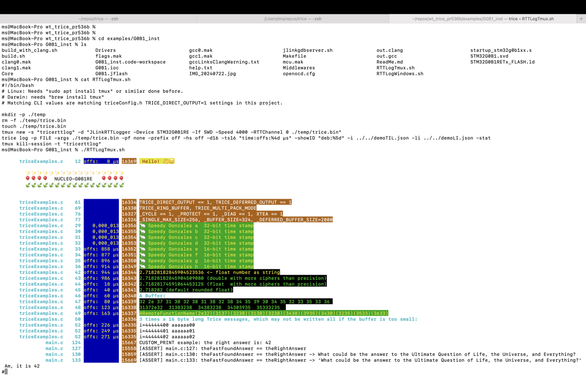

<p align="right">(<a href="#top">back to top</a>)</p>

## 47. <a id="future-development"></a>Future Development


<p align="right">(<a href="#top">back to top</a>)</p>

### 47.1. <a id="further-context-enrichment-variants"></a>Further Context Enrichment Variants

[Context Enrichment](#trice-context-enrichment) supports direct Bind log sites and reversible source extensions with `insert/clean`. Bind rejects selected CE sites in wrapper macros or counter-rebase regions. Use an ordinary function, put direct calls on separate source lines, or use `insert/clean` as described under [bind-limits](#bind-limits).


<p align="right">(<a href="#top">back to top</a>)</p>

### 47.2. <a id="improving-the-trice-tool-internal-parser-not-planned-right-now"></a>Improving the Trice Tool Internal Parser (not planned right now)

#### 47.2.1. <a id="trice-internal-log-code-short-description"></a>Trice Internal Log Code Short Description

##### Trice v1.0 Code

> **Hint:** To follow this explanation with the debugger, you can open in VSCode the trice folder, klick the Run & Debug Button or press CTRL-SHIFT-D, select `trice l -p DUMP` and set a breakpoint at `func main()` in [./cmd/trice/main.go](../cmd/trice/main.go) or directly in `translator.Translate` [./internal/translator/translator.go](../internal/translator/translator.go).
* In file [./internal/args/handler.go](../internal/args/handler.go) function `logLoop` calls `receiver.NewReadWriteCloser` and passes the created `rwc` object to `translator.Translate`.
* There `rwc` is used to create an appropriate decode object `dec` passed to `decodeAndComposeLoop`, which uses `func (p *trexDec) Read(b []byte) (n int, err error)` then, doing the byte interpretation.
  * Finally `n += p.sprintTrice(b[n:]) // use param info` is called doing the conversion. 
* Read returns a **single** Trice conversion result or a **single** error message in b[:n] or 0 and is called again and again.
* The returned Trice conversion result is the Trice format string with inserted values, but no timestamp, color or location information. The target timestamp, for this single Trice is hold in `decoder.TargetTimestamp`. It is used only when a new log line begins, what is the normal case. If a Trice format string ends not with a newline, the following Trice gets part of the same log line and therefore its target timestamp is discarded. Also additional data like the location information only displayed for the first Trice in a log line containing several Trices. Because the color is inherent to the Trice tag and needs no display space it is attached to the following Trices in a log line as well.
* The after `Read` following `emitter.BanOrPickFilter` could remove the Read result.
* If something is to write, the location information is generated if a new line starts and passed to the
 with `sw := emitter.New(w)` created object `sw.WriteString` method which internally keeps a slice of type `[]string` collecting all parts of an output line.
* The line `p.Line = append(p.Line, ts, p.prefix, sx)` adds host timestamp `ts`, the build `p.prefix` and the "printed Trice" (`sx` is here just the location information) to the line slice.
* In the next step the stored target timestamp `decoder.TargetTimestamp` is printed into a string and added to the Trice line.
* Optionally the Trice ID follows, if desired.
* The in a string printed Trice follows now and if the `sw.WriteString` method detects a `\n` at its end, the configured line suffix (usually `""`) follows and `p.completeLine()` is called then. It passes the line (slice of strings) to `p.lw.WriteLine(p.Line)`, which adds color, prints to the output device and clears the sw.Line slice for the next line.

#####  Disadvantages of Trice v1.0 Implementation

* The Reader can only return a **single** Trice, because its byte interface cannot distinguish between Trices anymore.
* The field order (prefix, host stamp, location information, target stamp optional ID, format string, suffix) is hardcoded.
* Trices with several newlines inside the format string cannot deal with tags after an (internal) line break (newline) 
* Binary parser needs to hold internal location after one Trice was decoded.
* Only one target timestamp value in a global variable.
* Line writing is not straight forward understandable.

#####  Aims for a better implementation

* Read should parse the binary data only and return a Trice struct slice.
* Cycle errors?
* Each Trice struct gets printed in a string.
* The printed string then is split into several strings, which all get the same stamp information or space fields.
* Finally we have a slice of such structs: hs, ts, loc, idString, format string. 
* The format string has no newline inside anymore, but has one at the end (usually) or not.
* The struct slice is cyclically passed to a line writer, which writes one line if it can find a format string ending with a newline.

### 47.3. <a id="using-trice-on-servers"></a>Using Trice on Servers

A server can ingest and analyze Trice streams from devices. Using Trice as the server application's own logger is a separate use case and needs evidence of a practical benefit. Claims about speed, energy use, storage, and additional compression require measurements with equivalent retained information.

<!--
* The internet traffic causes many megabytes logfiles, which need storage and are also often transferred by themselves.
* Of course it is possibe to compress them to save space and traffic.
* But if a server generates binary Trice log data directly:
  * The log generation is much faster and demands less energy.
  * An additional compression is not needed, because the Trice internal [TCOBS](https://github.com/rokath/tcobs) already does it in a reasonable way.
  * Less log data are to be transferred.
* To read the (binary) log data, the matching Trice-Id-List *til.json* is needed. Because this has a size of only a few kilobytes, the server can transmit it on request.
* The ~16000 usable IDs may be not enough for big systems. Options:
  1. Change the TREX binary format to
    * use 32- or 48- or 64-bit IDs. The many zeroes are efficiently compressed internally with TCOBS.
    * use the full 16-bit IDs for ~65000 IDs
  2. Use up to 2^16 or 2^32 different *til.json* files and transmit their index in the optional Trice stamp field. This requests minimal code adaptations.
-->

<p align="right">(<a href="#top">back to top</a>)</p>

## 48. <a id="working-with-the-trice-git-repository"></a>Working with the Trice Git Repository

| Action                                    | Command                                                                                                                                                                                                 |
|-------------------------------------------|---------------------------------------------------------------------------------------------------------------------------------------------------------------------------------------------------------|
| Get a local repository copy.              | `git clone github.com/rokath/trice.git trice`                                                                                                                                                           |
| Show current folder                       | `pwd`                                                                                                                                                                                                   |
| Show repository status.                   | `git status`                                                                                                                                                                                            |
| Clean the repo, if needed.                | `git stash push`                                                                                                                                                                                        |
| Show all branches.                        | `git branch -a`                                                                                                                                                                                         |
| Switch to main.                           | `git switch main`                                                                                                                                                                                       |
| Fetch a pull request as new branch PRIDa. | `git fetch origin pull/ID/head:PRIDa`                                                                                                                                                                   |
| List worktree.                            | `git worktree list`                                                                                                                                                                                     |
| Add to worktree.                          | `git worktree add ../trice_wt_PRIDa PRIDa`                                                                                                                                                              |
| Add branch dev to worktree                | `git worktree add ../trice-dev dev`                                                                                                                                                                     |
| Rstore the repo if needed.                | `git stash pop`                                                                                                                                                                                         |
| Change to new folder.                     | `cd ../trice_wt_PRIDa`                                                                                                                                                                                  |
| Show repository status.                   | `git status`                                                                                                                                                                                            |
| Test pull request.                        | `./scripts/testAll.sh full`                                                                                                                                                                             |
| Show repository status.                   | `git status`                                                                                                                                                                                            |
| Clean pull request.                       | `git restore .`                                                                                                                                                                                         |
| Change to previous folder.                | `cd -`                                                                                                                                                                                                  |
| Delete worktree branch.                   | `git worktree remove ../trice_wt_PRIDa`                                                                                                                                                                 |
| Delete git branch.                        | `git branch -d PRIDa`                                                                                                                                                                                   |
| Log last 3 commits in branch maste        | `git log -3 main`                                                                                                                                                                                       |
| Checkout by hash                          | `git checkout <hash>`                                                                                                                                                                                   |
| One Liner Log until shortly before v1.0.0 | `git log --graph --decorate --all --pretty=format:'%C(bold yellow)%h%Creset %C(bold green)%ad%Creset %C(bold cyan)%d%Creset %C(white)%s%Creset' --date=format:'%Y-%m-%d %H:%M' --since 2025-04-01`      |
| One Liner Log for branch `devel`          | `git log --graph --decorate devel --pretty=format:'%C(bold yellow)%h%Creset %C(bold green)%ad%Creset %C(bold cyan)%d%Creset %C(white)%s%Creset' --date=format:'%Y-%m-%d %H:%M'`                         |
| One Liner Log with author                 | `git log --graph --decorate --all --pretty=format:'%C(bold yellow)%h%Creset %C(bold green)%ad%Creset %C(bold blue)%an%Creset %C(bold cyan)%d%Creset %C(white)%s%Creset' --date=format:'%Y-%m-%d %H:%M'` |
| New worktree detached branch for compare  | `git worktree add --detach ../trice_9995fdc4b 9995fdc4b`                                                                                                                                                |
| Add a special commit worktree             | `./AddWorktreeFromGitLogLineData.sh <commit-hash> <YYYY-MM-DD> <HH:MM>`                                                                                                                                 |
| Create a bunch of worktrees               | `./AddWorktreesBetween.sh "<since-date>" "<until-date>"` or `./AddWorktreesBetween.sh <older-hash> <newer-hash>`                                                                                        |
| Delete all `trice_*` worktrees            | `cd ~/repos && rm trice_* && cd trice && git worktree prune && git worktree list`                                                                                                                       |
| Delete all `trice_*` branches             | ```git branch -D `git branch \| grep -E 'trice_'` ```                                                                                                                                                   |
| Show all opencommit parameter             | `oco config describe`                                                                                                                                                                                   |
| Show some config settings                 | `oco config get OCO_MODEL && oco config get OCO_PROMPT_MODULE && oco config get OCO_EMOJI`                                                                                                              |

### 48.1. <a id="install-opencommit-on-macos"></a>Install `opencommit` on macOS

* * *

<h4>🧰 Prerequisites</h4>

Before you begin, make sure you have:

* Install [Homebrew](https://brew.sh) first if you don’t have it.
* **Git**:  Check if Git is installed: `git --version`
If not, install the Xcode Command Line Tools:
  *  `xcode-select --install`   
*  **Node.js and npm**  
  OpenCommit runs on Node.js. Check with: `node -v` and `npm -v`
  If not installed: `brew install node` 
* **An OpenAI API key** (or compatible provider like OpenRouter, see below).
    
* * *

<h4>🔑 Step 1 — Get Your OpenAI API Key</h4>

* Go to **[https://platform.openai.com](https://platform.openai.com)**
* Log in (or sign up) using your email, Google, Microsoft, or Apple account.
* Navigate to your API Keys page: 👉 [https://platform.openai.com/account/api-keys](https://platform.openai.com/account/api-keys)
  * Click **“Create new secret key”**.
  * Give it a name (e.g., `opencommit-mac`) and copy it immediately.  
    It will look like this: `sk-proj-1a2b3c4d5e6f...`
    > ⚠️ You’ll only see it once — store it securely (e.g., 1Password, Bitwarden).
    
* * *

<h4>⚙️ Step 2 — Install OpenCommit</h4>

* Run the following in your Terminal: `npm install -g opencommit`
  You may see warnings about deprecated dependencies — those are safe to ignore.  
* Once installed, check: `opencommit --version`

* * *

<h4>🔧 Step 3 — Set Up Your API Key on macOS</h4>

* Add your key as an environment variable: `export OPENAI_API_KEY="sk-proj-your-key-here"`
* To make it **permanent**, add it to your shell configuration file (`~/.zshrc`):
  `echo 'export OPENAI_API_KEY="sk-proj-your-key-here"' >> ~/.zshrc source ~/.zshrc`
* Verify that it’s active: `echo $OPENAI_API_KEY`
  If it prints your key (or the beginning of it), you’re good.

* * *

<h4>⚙️ Step 4 — Optional Configuration</h4>

* You can customize OpenCommit’s behavior by setting additional environment variables, for example:

```bash
export OCO_LANG="en"           # or "de", "fr", etc. 
export OCO_MODEL="gpt-5"       # or another model like "gpt-4-turbo" 
export OCO_PROMPT_MODULE="conventional" 
export OCO_EMOJI=true
 ```

Add these to your `~/.zshrc` for persistence.

* * *

<h4>🚀 Step 5 — Use OpenCommit</h4>

* Go to a Git repository: `cd /path/to/your/repo` 
* Stage your changes: `git add .`
* Run OpenCommit: `opencommit`
* It will analyze your staged changes and automatically generate a commit message.  
    Example:
    `🔍 Analyzing changes... ✅ Commit message generated: feat(api): add endpoint for user authentication`
    
* * *

<h4>🔁 Step 6 — (Optional) Install Git Hook</h4>

* To have OpenCommit run automatically every time you commit: `npx opencommit install-hook`
* Now every time you run `git commit`, OpenCommit will propose a commit message for you.

* * *

<h4>🧩 Step 7 — Troubleshooting</h4>

If OpenCommit says:

* **“Missing API key”** → Check that `$OPENAI_API_KEY` is set (`echo $OPENAI_API_KEY`).    
* **“Unauthorized”** → Verify your key is valid or not expired.  
* **“Cannot find opencommit command”** → Reinstall globally with `npm install -g opencommit`.

* * *

### 48.2. <a id="install-opencommit-on-windows"></a>Install `opencommit` on Windows

<h4>🧭 Overview</h4>

OpenCommit is a tool that uses AI (like GPT models) to automatically generate meaningful Git commit messages based on your code changes.

This guide explains how to install and configure OpenCommit on Windows step by step.

* * *

<h4>⚙️ Prerequisites</h4>

* Before installing OpenCommit, make sure you have:
  * Git installed 👉 Download and install from https://git-scm.com/download/win
* Verify installation by running in PowerShell or CMD: `git --version`
* Node.js and npm (Node Package Manager) installed 👉 Download from https://nodejs.org/en (LTS version recommended).
  * Verify:

  ```bash
  node -v
  npm -v
  ```

* An OpenAI API key (for GPT access) 👉 Get it from https://platform.openai.com/account/api-keys

* * *

<h4>🪄 Installation Steps</h4>

**1. Install OpenCommit Globally**

* Open a terminal (PowerShell or CMD) and run: `npm install -g opencommit`
* Verify installation: `opencommit --version`
  If you get an error like “opencommit not recognized”, restart your terminal or ensure your npm global path is in your system PATH environment variable.

**2. Configure the API Key**

* Set your OpenAI API key as an environment variable permanently:
  * Press Win + R, type SystemPropertiesAdvanced, and press Enter.
  * Click Environment Variables...
  * Under User variables, click New, and add:
    * Variable name: OPENAI_API_KEY
    * Variable value: your_api_key_here
    * You can also customize OpenCommit’s behavior by setting additional environment variables, for example:

    ```bash
    OCO_LANG="en"            # or "de", "fr", etc. 
    OCO_MODEL="gpt-4o"       # or another model like "gpt-4-turbo" 
    OCO_PROMPT_MODULE="conventional" 
    OCO_EMOJI=true
    ```

    * Click OK on all windows.
* Then restart PowerShell.

**3. (Optional) Configure Defaults**

* You can set up default parameters in your Git repository or globally: `opencommit config`
  * Follow the interactive prompts to define:
    * Default model (e.g., gpt-3.5-turbo)
    * Commit style
    * Language

* * *

<h4>🚀 Usage</h4>

* Once installed, simply run: `opencommit`. This will:
  * Analyze your staged changes (git diff --cached)
  * Generate an AI-powered commit message
  * Ask for confirmation before committing
* You can also use: `opencommit --no-verify` to skip confirmation and commit directly.

<h4>🔧 Troubleshooting</h4>

* Issue	Solution
  * opencommit: command not found	Ensure npm global bin path is added to your Windows PATH (e.g., C:\Users\<YourUser>\AppData\Roaming\npm).
  * Error: Missing OPENAI_API_KEY	Set your OpenAI API key as shown above.
  * Model too slow / API errors	Try setting a smaller model: opencommit config --model gpt-3.5-turbo.

* * *

<h4>✅ Example</h4>

```bash
git add .
oco
```

Output:

```txt
Generated commit message:
...
```

<p align="right">(<a href="#top">back to top</a>)</p>

## 49. <a id="trice-maintenance"></a>Trice Maintenance

### 49.1. <a id="trice-project-structure-files-and-folders"></a>Trice Project structure (Files and Folders)

| Trice Root Folder File                                                                                                  | Details                                                                                                                           |
|-------------------------------------------------------------------------------------------------------------------------|-----------------------------------------------------------------------------------------------------------------------------------|
| [.clang-format](../.clang-format)                                                                                       | See [GitHub Action clang-format.yml - Check C Code Formatting](#github-action-clang-formatyml---check-c-code-formatting)          |
| [.clang-format-ignore](../.clang-format-ignore)                                                                         | See [GitHub Action clang-format.yml - Check C Code Formatting](#github-action-clang-formatyml---check-c-code-formatting)          |
| [.code_snippets](../.code_snippets)                                                                                     | Some legacy helper code for copying where to use                                                                                  |
| [.editorconfig](../.editorconfig)                                                                                       | See [GitHub Action clang-format.yml - Check C Code Formatting](#github-action-clang-formatyml---check-c-code-formatting)          |
| `.git/`                                                                                                                 | Git repository metadata (exists locally after cloning; not part of the repository content)                                        |
| [.gitattributes](../.gitattributes)                                                                                     | See [GitHub Action clang-format.yml - Check C Code Formatting](#github-action-clang-formatyml---check-c-code-formatting)          |
| [.github/](../.github/)                                                                                                 | [📁 The .github Folder — Purpose and Contents](#the-github-folder--purpose-and-contents)                                          |
| [.gitignore](../.gitignore)                                                                                             | git ignores these files                                                                                                           |
| [.goreleaser.yaml](../.goreleaser.yaml)                                                                                 | goreleaser configuration                                                                                                          |
| [.idea/](../.idea/)                                                                                                     | GoLand settings                                                                                                                   |
| [lychee.toml](../lychee.toml)                                                                                           | [GitHub Action link-check.yml - Broken Links Check](#github-action-link-checkyml---broken-links-check)                            |
| [.markdownlint.yaml](../.markdownlint.yaml)                                                                             | [Cleaning the Sources](#cleaning-the-sources)                                                                                     |
| [.markdownlintignore](../.markdownlintignore)                                                                           | [Cleaning the Sources](#cleaning-the-sources)                                                                                     |
| [.vscode/](../.vscode/)                                                                                                 | VS Code settings                                                                                                                  |
| [AUTHORS.md](../AUTHORS.md)                                                                                             | contributors                                                                                                                      |
| [CHANGELOG.md](../CHANGELOG.md)                                                                                         | History                                                                                                                           |
| [CODE_OF_CONDUCT.md](../CODE_OF_CONDUCT.md)                                                                             | How to communicate                                                                                                                |
| [CONTRIBUTING.md](../CONTRIBUTING.md)                                                                                   | Helper                                                                                                                            |
| [LICENSE.md](../LICENSE.md)                                                                                             | [MIT](https://opensource.org/license/mit)                                                                                         |
| [README.md](../README.md)                                                                                               | GitHub first page                                                                                                                 |
| [_config.yml](../_config.yml)                                                                                           | [jekyll configuration](https://jekyllrb.com/docs/configuration/)                                                                  |
| [_test](../_test)                                                                                                       | automatic target code tests                                                                                                       |
| [scripts/buildTriceTool.sh](../scripts/buildTriceTool.sh)                                                               | [Build Trice tool from Go sources](#build-trice-tool-from-go-sources)                                                             |
| [scripts/_150_setup_build_environment.sh](../scripts/_150_setup_build_environment.sh)                                   | see inside                                                                                                                        |
| [scripts/_280_format_c_code.sh](../scripts/_280_format_c_code.sh)                                                       | See [GitHub Action clang-format.yml - Check C Code Formatting](#github-action-clang-formatyml---check-c-code-formatting)          |
| [scripts/_300_clean_dsstore.sh](../scripts/_300_clean_dsstore.sh)                                                       | Run to remove macOS artifacts                                                                                                     |
| `temp/log/coverage.out`                                                                                                 | Go test coverage output                                                                                                           |


| [cmd/clang-filter](../cmd/clang-filter)                                                                                 | [ReadMe](../cmd/clang-filter/ReadMe.md)                                                                                           |
| [cmd/trice](../cmd/trice)                                                                                               | Trice tool command Go sources                                                                                                     |
| [demoLI.json](../demoLI.json)                                                                                           | location information example                                                                                                      |
| [demoTIL.json](../demoTIL.json)                                                                                         | Trice ID list example                                                                                                             |
| `dist/`                                                                                                                 | local distribution files folder created by GoReleaser                                                                             |
| [docs](../docs)                                                                                                         | documentation folder with link forwarding                                                                                         |
| [examples/](../examples)                                                                                                | example target projects                                                                                                           |
| [scripts/_310_refresh_trice_user_manual.sh](../scripts/_310_refresh_trice_user_manual.sh)                               | [Trice Reference Manual Maintenance (or any `*.md` file)](#trice-reference-manual-maintenance-or-any-md-file)                               |
| [scripts/gitAddWorktreeFromGitLogLineData.sh](../scripts/gitAddWorktreeFromGitLogLineData.sh)                           | helper to get easy a git worktree folder from any git hash for easy folder compare, see inside                                    |
| [scripts/gitAddWorktreesBetween.sh](../scripts/gitAddWorktreesBetween.sh)                                               | helper to get easy git worktree folders from any time range                                                                       |
| [scripts/gitLogWithBranches.sh](../scripts/gitLogWithBranches.sh)                                                       | helper to get easy a history view                                                                                                 |
| [go.mod](../go.mod)                                                                                                     | Go modules file                                                                                                                   |
| [go.sum](../go.sum)                                                                                                     | Go modules sums                                                                                                                   |
| [index.md](../index.md)                                                                                                 | Jekyll index site for README.md                                                                                                   |
| [internal/](../internal)                                                                                                | Trice tool internal Go packages                                                                                                   |
| [pkg/](../pkg)                                                                                                          | Trice tool common Go packages                                                                                                     |
| [scripts/_330_renew_ids_and_refresh_tests.sh](../scripts/_330_renew_ids_and_refresh_tests.sh)                           | renew all ID data                                                                                                                 |
| [src/](../src)                                                                                                          | C sources for trice instrumentation -> Add to target project                                                                      |
| `temp/`                                                                                                                 | ignored local workspace for binary logfiles and other runtime artifacts like `scripts/testAll.sh` helper files under `./temp/log` |
| `testAll.log`                                                                                                           | ignored local output of the last `./scripts/testAll.sh` run                                                                       |
| [scripts/testAll.sh](../scripts/testAll.sh)                                                                             | run all tests                                                                                                                     |
| [third_party/](../third_party)                                                                                          | external components                                                                                                               |
| [trice_bindIDs_in_examples_and_test_folder.sh](../trice_bindIDs_in_examples_and_test_folder.sh)                         | run the canonical Trice Bind workflow                                                                                              |
| [scripts/_240_legacy_clean_ids.sh](../scripts/_240_legacy_clean_ids.sh)                                                 | [Cleaning the Sources](#cleaning-the-sources)  [Activating the Trice Cache](#activating-the-trice-cache)                          |
| [scripts/_120_setup_trice_environment.sh](../scripts/_120_setup_trice_environment.sh)                                   | [Cleaning the Sources](#cleaning-the-sources)  [Activating the Trice Cache](#activating-the-trice-cache)                          |
| [scripts/_230_legacy_insert_ids.sh](../scripts/_230_legacy_insert_ids.sh)                                               | [Cleaning the Sources](#cleaning-the-sources)  [Activating the Trice Cache](#activating-the-trice-cache)                          |

<p align="right">(<a href="#top">back to top</a>)</p>

### 49.2. <a id="the-github-folder--purpose-and-contents"></a>📁 The .github Folder — Purpose and Contents

GitHub automatically recognizes and uses everything contained inside the [.github/](../.github/) directory.
This folder defines how the project behaves on GitHub: issue templates, automated workflows, labels, code scanning, greetings, and release automation. Details:

#### 49.2.1. <a id="github-root"></a>📁 `.github` Root

It contains issue templates, labels, workflow automation, code scanning, linting, and the CI/CD release pipeline.

* [ISSUE_TEMPLATE/](../.github/ISSUE_TEMPLATE/) Used to create structured bug reports and feature requests.
* [FUNDING.yml](../.github/FUNDING.yml) Enables the GitHub “Sponsor” button.
* [labeler.yml](../.github/labeler.yml) configuration file consumed by actions/labeler. It defines the labeling rules.
  * Because labeler.yml is configuration and not an executable workflow, it is placed directly under .github/, not under .github/workflows/.
  * The actions/labeler action expects .github/labeler.yml as the default configuration path, which is why this layout is standard and correct.
  * This is intentional and follows GitHub Actions conventions.
    * .github/workflows/label.yml is a workflow. It defines when and how the GitHub Action runs (triggers, permissions, runner, action reference).
    * .github/labeler.yml is not a workflow. It is a configuration file consumed by actions/labeler. It defines the labeling rules.
* [.github/workflows/](../.github/workflows) Contains GitHub Actions automation


#### 49.2.2. <a id="githubworkflows--github-actions-workflows"></a>📂 `.github/workflows` — GitHub Actions Workflows

The [.github/workflows/](../.github/workflows/) folder contains YAML descriptions for various actions, which will be triggered automatically on certain events or are started manually.
Every *yml* file in this directory defines an automated process. These processes run on GitHub’s servers (CI/CD).

* [README.md](../.github/workflows/README.md): Documentation specifically for the /workflows folder.
  * Can be useful for contributors who want to understand or modify CI behaviors.
Each workflow defines its own triggers and permissions in its YAML file. Depending on the workflow, it runs on pushes, pull requests, a schedule, a manual request, or a call from another workflow. The directory contains no separate icon or properties metadata for configuring these workflows.
 
| GitHub Action                                             | About                                                                                                                                                            |
|-----------------------------------------------------------|------------------------------------------------------------------------------------------------------------------------------------------------------------------|
| [clang-format.yml](../.github/workflows/clang-format.yml) | [GitHub Action clang-format.yml - Check C Code Formatting](#github-action-clang-formatyml---check-c-code-formatting)                                             |
| [codeql.yml](../.github/workflows/codeql.yml)             | [GitHub Action codeql.yml - Static Code Analysis](#github-action-codeqlyml---static-code-analysis)                                                               |
| [coverage.yml](../.github/workflows/coverage.yml)         | [GitHub Action coverage.yml - Test Coverage and Coveralls Integration](#github-action-coverageyml---test-coverage-and-coveralls-integration)                     |
| [go.yml](../.github/workflows/go.yml)                     | [GitHub Action go.yml - Building and Testing Go Code](#github-action-goyml---building-and-testing-go-code)                                                       |
| [goreleaser.yml](../.github/workflows/goreleaser.yml)     | [GitHub Action goreleaser.yml - Build & Pack Trice Distribution](#github-action-goreleaseryml---build--pack-trice-distribution)                                  |
| [label.yml](../.github/workflows/label.yml)               | [GitHub Action label.yml - Automatic Labeling Rules](#github-action-labelyml---automatic-labeling-rules)                                                         |
| [link-check.yml](../.github/workflows/link-check.yml)     | [GitHub Action link-check.yml - Broken Links Check](#github-action-link-checkyml---broken-links-check)                                                           |
| [shellcheck.yml](../.github/workflows/shellcheck.yml)     | [GitHub Action shellcheck.yml - Catching Common Bash Scripts Bugs](#github-action-shellcheckyml---catching-common-bash-scripts-bugs)                             |
| [shfmt.yml](../.github/workflows/shfmt.yml)               | [GitHub Action shfmt.yml - Ensure Consistent Shell Scripts Formatting](#github-action-shfmtyml---ensure-consistent-shell-scripts-formatting)                     |
| [stale.yml](../.github/workflows/stale.yml)               | [GitHub Action stale.yml - Automatic Stale Issue Handling](#github-action-staleyml---automatic-stale-issue-handling)                                             |
| [superlinter.ym](../.github/workflows/superlinter.yml)    | [GitHub Action superlinter.yml - Ensure Consistent YAML and Markdown Formatting](#github-action-superlinteryml---ensure-consistent-yaml-and-markdown-formatting) |
| [pages.yml](../.github/workflows/pages.yml)               | [GitHub Action pages.yml - Creates The Trice GitHub Pages](#github-action-pagesyml---creates-the-trice-github-pages)                                             |

#### 49.2.3. <a id="github-action-clang-formatyml---check-c-code-formatting"></a>GitHub Action clang-format.yml - Check C Code Formatting

* **Local Action (developer machine):** [./scripts/_280_format_c_code.sh](../scripts/_280_format_c_code.sh) - adjust all C files excluding [.clang-format-ignore](../.clang-format-ignore) according rule set in [.clang-format](../.clang-format).
  > The file [./scripts/_280_format_c_code.sh](../scripts/_280_format_c_code.sh) is used to auto-format the Trice code.
  > 
  > File [.clang-format](../.clang-format)
  > 
  > *Contributor: @Sazerac4*
  > 
  > Sazerac4 commented Aug 29, 2024:
  > I have a code formatter when I make changes to my application but I would like to keep the style of the library when modifying.
  > I couldn't find a code formatter, is there a tool used? If not, I propose this to provide one as an example by using clang-format.
  > 
  > ```bash
  > ## I have created a default style :
  > clang-format -style=llvm -dump-config > .clang-format
  > ## Then format the code:
  > find ./src  -name '*.c' -o  -name '*.h'| xargs clang-format-18 -style=file -i
  > ```
  > 
  > The style of the example does not correspond to the original one. Configurations are necessary for this to be the case. Tags can be placed to prevent certain macros from being formatted
  > 
  > ```C
  > int formatted_code;
  > // clang-format off
  >     void    unformatted_code  ;
  > // clang-format on
  > void formatted_code_again;
  > ```
  > 
  > I have tuned some settings for clang-format :
  > 
  > ```bash
  > * IndentWidth: 4  // original code size indentation
  > * ColumnLimit: 0  // avoid breaking long line (like macros)
  > * PointerAlignment: Left  // like original files (mostly)
  > ```
  > 
  > With preprocessor indentation, the result is a bit strange in some cases. It's possible with the option IndentPPDirectives ([doc](https://releases.llvm.org/18.1.6/tools/clang/docs/ClangFormatStyleOptions.html)).
  > 
  > Staying as close as possible to a default version (LLVM in this case) makes it easier to regenerate the style if necessary.
  > 
  > See also: https://github.com/rokath/trice/pull/487#issuecomment-2318003072
  > 
  > File [.clang-format-ignore](../.clang-format-ignore):
  > 
  > *Contributor: @Sazerac4*
  > 
  > Sazerac4 commented Aug 30, 2024:
  > I have added .clang-format-ignore to ignore formatting for specific files
  > 
  > File [.editorconfig](../.editorconfig):
  > 
  > *Contributor: @Sazerac4*
  > 
  > The`.editorconfig` file allows to better identify the basic style for every files. (endline, charset, ...). It is a file accepted by a wide list of IDEs and editors : [link](https://editorconfig.org/#file-format-details)
  > This addition is motivated by forgetting the end of line in the .gitattributes file.
  > 
  > File [.gitattributes](../.gitattributes)
  > 
  > *Contributor: @Sazerac4*
  > 
  > With the`.gitattributes` file avoid problems with "diff" and end of lines. [Here](https://www.aleksandrhovhannisyan.com/blog/crlf-vs-lf-normalizing-line-endings-in-git/) is an article that presents the problem.
  > 
  > To fill the`.gitattributes`, I used the command below to view all the extensions currently used.
  > 
  > ```bash
  > git ls-tree -r HEAD --name-only | perl -ne 'print $1 if m/\.([^.\/]+)$/' | sort -u
  > ```
* **GitHub Action (Continuous Integration):** [.github/workflows/clang-format.yml](../.github/workflows/clang-format.yml) does not format, it only checks.

#### 49.2.4. <a id="github-action-codeqlyml---static-code-analysis"></a>GitHub Action codeql.yml - Static Code Analysis

* This workflow runs CodeQL, GitHub’s static code analysis tool. Purpose:
  * scan the codebase for potential security vulnerabilities
  * detect unsafe code patterns
  * provide security alerts in the “Security” tab
  * Runs automatically on pushes and pull requests.
* **GitHub Action (Continuous Integration):** [.github/workflows/codeql.yml](../.github/workflows/codeql.yml)
  * This workflow configures **GitHub CodeQL code scanning** for the repository. 
  * This workflow continuously scans the codebase for security and quality problems using CodeQL.
  * It performs **static code analysis** on source code.
  * It looks for:
    * Security vulnerabilities (e.g. injection flaws, unsafe API usage)
    * Common programming errors
    * Code quality issues     
  *  It runs automatically:
    * On pushes to `main`
    * On pull requests targeting `main`
    * Manually via the GitHub Actions UI 
  * The results are uploaded to GitHub and appear under **Security → Code scanning alerts**.
  * The “QL” is the same concept as SQL, but specialized for code analysis.

#### 49.2.5. <a id="github-action-coverageyml---test-coverage-and-coveralls-integration"></a>GitHub Action coverage.yml - Test Coverage and Coveralls Integration

Trice uses Go’s built-in coverage tooling to measure how much of the Go codebase is exercised by automated tests.

* **Local Action (developer machine):** 

| Action                                        | Command                                                                 |
|-----------------------------------------------|-------------------------------------------------------------------------|
| Generate a coverage profile locally           | `go test ./... -covermode=atomic -coverprofile=./temp/log/coverage.out` |
| Show results as list in terminal              | `go tool cover -func=./temp/log/coverage.out`                           |
| Show results colored file specific in browser | `go tool cover -html=./temp/log/coverage.out`                           |

* **GitHub Action (Continuous Integration):**  
On GitHub, the workflow `.github/workflows/coverage.yml` runs automatically for every pull request and also on a monthly schedule. The workflow:
  1.  executes `go test` with coverage enabled,
  2.  prints a coverage summary in the CI logs,
  3.  uploads the raw `coverage.out` file as a workflow artifact, and
  4.  publishes the coverage results to Coveralls (if configured).
    
**Coverage badge:**  
The README displays the current coverage status for the default branch using the Coveralls badge:

`[](https://coveralls.io/github/rokath/trice?branch=master)`

This badge is updated whenever the CI workflow successfully uploads a new coverage report for the `master` branch.

#### 49.2.6. <a id="github-action-goyml---building-and-testing-go-code"></a>GitHub Action go.yml - Building and Testing Go Code

* A workflow for building and testing Go code. It runs GitHub CodeQL for Go and C (cpp language pack), detecting security vulnerabilities and code issues.
  * Typically includes steps such as:
  * setting up the Go toolchain
  * checking out the repository
  * compiling the project
  * running unit tests
* **Local Action (developer machine):** `go test ./...` or better `./scripts/testAll.sh full` (takes long)
* **GitHub Action (Continuous Integration):** [.github/workflows/go.yml](../.github/workflows/go.yml)

#### 49.2.7. <a id="github-action-goreleaseryml---build--pack-trice-distribution"></a>GitHub Action goreleaser.yml - Build & Pack Trice Distribution

This workflow runs GoReleaser, the tool that builds and packages Trice for distribution.
  * Purpose:
    * create release binaries for all supported platforms
    * generate archives (ZIP, tar.gz, etc.)
    * compute checksums
    * create a GitHub Release with all artifacts
  * Triggers:
    * manually from the GitHub UI (“Run workflow”)
    * automatically when pushing a tag matching v* (e.g., v0.44.0)
    * This is the workflow responsible for generating official Trice releases.
* **Local Action (developer machine):** `goreleaser`
* **GitHub Action (Continuous Integration):** [.github/workflows/goreleaser.yml](../.github/workflows/goreleaser.yml)

See also [Trigger a **real** Trice release via CI (with `git tag`)](#trigger-a-real-trice-release-via-ci-with-git-tag)

#### 49.2.8. <a id="github-action-labelyml---automatic-labeling-rules"></a>GitHub Action label.yml - Automatic Labeling Rules

* Defines automatic labeling rules for issues and PRs.
  * For example, files in certain directories may automatically get category labels.
  * This helps maintainers classify submissions more easily.
* **GitHub Action (Continuous Integration):** [.github/workflows/label.yml](../.github/workflows/label.yml)

#### 49.2.9. <a id="github-action-link-checkyml---broken-links-check"></a>GitHub Action link-check.yml - Broken Links Check

* **Local Action (developer machine):** `./scripts/_530_test_links.sh` from the repository root, also included in `./scripts/testAll.sh`.
  * Uses [lychee.toml](../lychee.toml) as configuration; the direct checker command is `lychee --config lychee.toml .`.
  * The script additionally maps the CLI-help source URL to the local checkout and records results in `temp/log/_530_test_links.log`. If Lychee is missing, it reports a skip.
  * For GitHub URLs, set `GITHUB_TOKEN` or `GH_TOKEN` locally as well to reduce API throttling and timeouts during checks
* **GitHub Action (Continuous Integration):** [.github/workflows/link-check.yml](../.github/workflows/link-check.yml)
  * The workflow already provides `GITHUB_TOKEN` to the Lychee action for GitHub-hosted links

#### 49.2.10. <a id="github-action-manualym---to-be-triggered-manually"></a>GitHub Action manual.ym - To Be Triggered Manually

A workflow that is designed to be triggered manually (similar to _workflow_dispatch_ workflows). Common use cases:
  * executing maintenance tasks
  * running scripts on demand
  * testing workflow behavior without making a commit
  * This workflow does not run automatically.

#### 49.2.11. <a id="github-action-shellcheckyml---catching-common-bash-scripts-bugs"></a>GitHub Action shellcheck.yml - Catching Common Bash Scripts Bugs

Runs ShellCheck on all *.sh files, catching common bugs in Bash scripts.

* **GitHub Action (Continuous Integration):** [.github/workflows/shellcheck.yml](../.github/workflows/shellcheck.yml)

#### 49.2.12. <a id="github-action-shfmtyml---ensure-consistent-shell-scripts-formatting"></a>GitHub Action shfmt.yml - Ensure Consistent Shell Scripts Formatting

Runs shfmt in diff mode on pull requests to ensure consistent formatting of shell scripts.

* **Local Action (developer machine):** `go test ./...` or better `./scripts/testAll.sh full` (takes long)
* **GitHub Action (Continuous Integration):** [.github/workflows/shfmt.yml](../.github/workflows/shfmt.yml)

#### 49.2.13. <a id="github-action-staleyml---automatic-stale-issue-handling"></a>GitHub Action stale.yml - Automatic Stale Issue Handling

Automates stale issue handling. Function:
  * marks inactive issues or PRs as “stale”
  * closes them after a configurable time period if there is no further activity
  * eps the issue tracker manageable.

Mark stale issues and pull requests

* **GitHub Action (Continuous Integration):** [.github/workflows/stale.yml](../.github/workflows/stale.yml)

#### 49.2.14. <a id="github-action-superlinteryml---ensure-consistent-yaml-and-markdown-formatting"></a>GitHub Action superlinter.yml - Ensure Consistent YAML and Markdown Formatting

* **Local Action (developer machine):** `markdownlint .`
* Runs GitHub Super Linter, a powerful linting suite. Purpose:
  * ensure consistent code formatting
  * detect stylistic issues
  * catch potential errors in supported languages
  * Helps maintain code quality across the entire repository.
* **GitHub Action (Continuous Integration):** [.github/workflows/superlinter.yml](../.github/workflows/superlinter.yml)
  * Checks YAML and Markdown files

#### 49.2.15. <a id="github-action-pagesyml---creates-the-trice-github-pages"></a>GitHub Action pages.yml - Creates The Trice GitHub Pages

This workflow creates the Trice github pages avaliable under [rokath.github.io/trice/](https://rokath.github.io/trice/).

* **GitHub Action (Continuous Integration):** [.github/workflows/pages.yml](../.github/workflows/pages.yml)

### 49.3. <a id="trice-reference-manual-maintenance-or-any-md-file"></a>Trice Reference Manual Maintenance (or any `*.md` file)

* Recommended Tool: VS Code with some extensions:
  * Markdown All in One (Yu Zhang)
  * Markdown Table Prettifier (Kristin Daroczi)
    * Click in mouse context menu the entry "Format Document" to adjust Markdown tables.
  * Markdown Preview Enhanced
    * Click the preview button in the top right.
  * `mdtoc`
    * The checked-in manual already contains the managed TOC container and persisted config. Keep these markers in place where the table of contents should be generated.
    ```md
    <!-- mdtoc -->
    <!-- mdtoc-config
    container-version=v2
    numbering=true
    min-level=2
    max-level=4
    anchor=github
    toc=true
    bullets=auto
    state=stripped
    -->
    <!-- /mdtoc -->
    ```
    * Run `./scripts/_310_refresh_trice_user_manual.sh format` to regenerate the reference manual's TOC, numbering, and anchors with `mdtoc`.
    * Run `./scripts/_310_refresh_trice_user_manual.sh check` to verify that the checked-in reference manual matches the persisted `mdtoc` state.
    * The repository no longer uses a VS Code TOC extension for manual maintenance.
  * Markdown Paste (telesoho)
    * Helpful to get web site content preformatted as Markdown. Use mouse context menu.
  * markdownlint (David Anson)
    * Uses [.markdownlint.yaml](../.markdownlint.yaml) as rule set and [.markdownlintignore](../.markdownlintignore) to ignore files.
    * You can also run `markdownlint .` in a terminal after installing the CLI tool. It uses the same control files.
    * The GitHub action [superlinter.yml](../.github/workflows/superlinter.yml) uses [.markdownlint.yaml](../.markdownlint.yaml) and the same config files.
  * Markdown PDF (yzane)
    * Use Shift-Command-P "markdown PDF:export" to generate a PDF
    * page break for PDF generation: `<div style="page-break-before: always;"></div>`

### 49.4. <a id="cleaning-the-sources"></a>Cleaning the Sources

In GitHub are some Actions defined. Some of them get triggered on a `git push` and perform some checks. To get no fail, some scripts should run before committing:

* `npx markdownlint *.md` (or just `markdownlint`) - uses [.markdownlint.yaml](../.markdownlint.yaml) to allow exceptions.
  * `npx markdownlint ./docs/TriceReferenceManual.md 2>&1 | awk '!seen[$2]++'` for example to reduce message count in case of errors. 
* [./scripts/_300_clean_dsstore.sh](../scripts/_300_clean_dsstore.sh) - remove macOS maintenance data.
* [./scripts/_240_legacy_clean_ids.sh](../scripts/_240_legacy_clean_ids.sh) removes all IDs in the legacy workflow.

<p align="right">(<a href="#top">back to top</a>)</p>

## 50. <a id="build-and-release-the-trice-tool"></a>Build and Release the Trice Tool

### 50.1. <a id="build-trice-tool-from-go-sources"></a>Build Trice tool from Go sources

* Install [Go](https://go.dev/).
* Run:

  ```bash
  ms@DESKTOP-7POEGPB MINGW64 /c/repos/trice (main)
  $ bash ./scripts/buildTriceTool.sh # internally runs go install ./cmd/trice/...
  ```

* Afterwards you should find executables `trice` and `tlog` inside `~/go/bin`.
* Extend PATH variable with `~/go/bin` **OR** copy the Trice binaries from there into a folder of your path.
* Check:

  ```bash
  ms@PaulPCWin11 MINGW64 ~/repos/trice (main)
  $ ./scripts/buildTriceTool.sh
  ----------------------------------------
  Building trice with embedded Git metadata:
    origin:     git@github.com:rokath/trice.git
    branch:     main
    version:    branch dirty
    commit:     f7edcc51
    date:       2025-11-27T13:59:50+01:00
    git_state:  dirty
    git_status:  M .vscode/launch.json  M docs/TriceReferenceManual.md  M internal/emitter/lineComposer.go
  ----------------------------------------
  Build complete.
  
  ms@PaulPCWin11 MINGW64 ~/repos/trice (main)
  $ trice version
  no version, branch=git@github.com:rokath/trice.git - main (local modifications at build time), commit=f7edcc51,   built at 2025-11-27T13:59:50+01:00
  
  ms@PaulPCWin11 MINGW64 ~/repos/trice (main)
  ```

* Hints
  * Use only the main branch. Other branches may be inconsistent.
  * When using [./scripts/buildTriceTool.sh](../scripts/buildTriceTool.sh), the generated Trice image is significant smaller (about 30%), because the build script removes debugging information from the Trice binary. The Trice release images contain this additionally information for a more verbose error reporting, just in case.  
  * `tlog` is a separate binary for the `trice log` runtime path. It accepts the log flags directly, for example `tlog -port HEX ...`, and release archives/packages ship it next to `trice`.
  * Give each Trice binary its own name when using different images. Otherwise you always get what is found first in the **$PATH**.
  * Use GoReleaser if you wish to create releases on your forked Trice repository.
  * On Windows, install [TDM-GCC](https://jmeubank.github.io/tdm-gcc/download/) or another compatible MinGW-w64 GCC distribution if you wish to execute the CGO and host C-code tests.
    * Match the compiler architecture to Go, normally 64-bit Go with a 64-bit host compiler.
    * The minimal TDM-GCC online installation is sufficient for these host tests.
    * Put the selected host compiler first in `PATH` when several GCC variants are installed.
    * If `clang` is also in `PATH`, the regression tests can execute it in addition to GCC. Clang must therefore have a usable host C runtime configuration; merely finding `clang.exe` is not enough.
    * A Windows Clang using the GNU target can reuse the installed MinGW-w64 runtime. A Clang using the MSVC target instead requires the Visual Studio C++ Build Tools and a Windows SDK.
    * Verify each visible host compiler can include `string.h` before running `go test ./...`.
  * Open a console inside the Trice directory, recommended is the git-bash, when using Windows.
  * Tests:

  ```b
  ms@DESKTOP-7POEGPB MINGW64 /c/repos/trice (main)
  $ go clean -cache
  
  ms@DESKTOP-7POEGPB MINGW64 /c/repos/trice (main)
  $ go vet ./...
  
  ms@DESKTOP-7POEGPB MINGW64 /c/repos/trice (main)
  $ go test ./...
  ?       github.com/rokath/trice/cmd/cui [no test files]
  ok      github.com/rokath/trice/cmd/stim        0.227s
  ok      github.com/rokath/trice/cmd/trice       0.577s
  ok      github.com/rokath/trice/internal/args   0.232s
  ok      github.com/rokath/trice/internal/charDecoder    0.407s
  ok      github.com/rokath/trice/internal/com    1.148s
  ok      github.com/rokath/trice/internal/decoder        0.412s [no tests to run]
  ?       github.com/rokath/trice/internal/do     [no test files]
  ok      github.com/rokath/trice/internal/dumpDecoder    0.388s
  ok      github.com/rokath/trice/internal/emitter        0.431s
  ok      github.com/rokath/trice/internal/id     0.421s
  ok      github.com/rokath/trice/internal/keybcmd        0.431s
  ok      github.com/rokath/trice/internal/link   0.404s
  ok      github.com/rokath/trice/internal/receiver       0.409s
  ok      github.com/rokath/trice/internal/tleDecoder     0.398s
  ?       github.com/rokath/trice/internal/translator     [no test files]
  ok      github.com/rokath/trice/internal/trexDecoder    0.391s
  ok      github.com/rokath/trice/pkg/cipher      0.377s
  ok      github.com/rokath/trice/pkg/endian      0.302s
  ok      github.com/rokath/trice/pkg/msg 0.299s
  ok      github.com/rokath/trice/pkg/tst 0.406s
  ```

To execute the target code tests, you can run `scripts/testAll.sh` or `cd` into `_test` and run `go test ./...` from there. ATTENTION: These tests run a significant long time (many minutes depending on your machine), because the **Go** - **C** border is crossed very often.
The last tests can last quite a while, depending on your machine.

```bash
ms@DESKTOP-7POEGPB MINGW64 /c/repos/trice (main)
$ go install ./cmd/trice/
```

Afterwards you should find an executable `trice` inside $GOPATH/bin/ and you can modify its source code.

After installing Go, in your home folder should exist a folder ./go/bin. Please add it to your path variable. OR: Copy the Trice binaries from there into a folder of your path after creating them with `go install ./cmd/trice/... ./cmd/tlog/...`. There is now a remommended script `./scripts/buildTriceTool.sh`. Using it, depending on your system you may need to enter `bash ./scripts/buildTriceTool.sh`, includes the actual Trice repository state into the Trice binaries, which is shown with `trice version` and `tlog --version` then - useful in case of issues.

### 50.2. <a id="prepare-a-release"></a>Prepare A Release

Prerequisite: Installed `goreleaser`.

#### 50.2.1. <a id="check-a-goreleaser-release-before-publishing"></a>Check a GoReleaser Release before Publishing

By cloning the Trice repo into an empty folder, you make sure no other files exist in the Trice folder.

```bash
mkdir ./tmp
cd /tmp
git clone https://github.com/rokath/trice.git
cd trice
goreleaser release --clean --snapshot --skip=publish
```

This just generates the artifacts locally in `/tmp/trice/dist` using the [./trice/.goreleaser.yaml](../.goreleaser.yaml) copy in `./temp/trice`.

Alternatively you can do in your local Trice clone directly, by removing everything not a part of the Trice repo, if you are sure not to loose any data:

```bash
git status
git clean -xfd
goreleaser release --clean --snapshot --skip=publish
```

Explanation:

* `release` – run the normal release pipeline (builds, archives, checksums, changelog, etc.).
* `--clean` – delete the `dist/` folder first so no old artefacts are reused. 
* `--snapshot` – build as a “snapshot” version, not a real tagged release.
* `--skip=publish` – **do not upload** anything (no GitHub Releases, no Homebrew, no Docker, etc.).

What you should see:

* GoReleaser building all your `builds:` targets from `.goreleaser.yaml`, including the `trice` and `tlog` host binaries.
* Creating archives in `dist/`.
* Generating checksums.
* No attempts to call the GitHub API for a real release.

If this **succeeds**, you’ve already tested 90% of what CI will do for a real release.
If it **fails**, fix the problem locally first (missing files, bad paths, etc.) – it would fail the same way in CI.

### 50.3. <a id="trigger-a-real-trice-release-via-ci-with-git-tag"></a>Trigger a **real** Trice release via CI (with `git tag`)

Letting CI build and publish an **official release**.

#### 50.3.1. <a id="make-sure-your-workflow-reacts-to-tags"></a>Make sure your workflow reacts to tags

In [.github/workflows/goreleaser.yml](../.github/workflows/goreleaser.yml), you need `on:   workflow_dispatch:   push:     tags:       - 'v*'`.

* `workflow_dispatch` = you can still run it manually from the Actions tab.
* `push -> tags: 'v*'` = whenever you push a tag like `v0.44.0`, this workflow will start automatically.

Commit & push this change (if you haven’t already):

```sh
git add .github/workflows/goreleaser.yml
git commit -m "Configure GoReleaser workflow to run on tags"
git push origin main
```

#### 50.3.2. <a id="final-checks-before-tagging"></a>Final checks before tagging

In your local `trice` repo:

* Update to latest main:
  * `git checkout main`
  * `git pull origin main`
* Run your tests: `go test ./...` or, for the full compiler matrix, `./scripts/testAll.sh full`.
* Optionally run the snapshot dry run again: `goreleaser release --clean --snapshot --skip=publish`.
    
If all of that is green, you’re ready to “bless” a version.

#### 50.3.3. <a id="choose-a-version-and-create-a-git-tag"></a>Choose a version and create a `git tag`

Decide on a version, for example:

* `v0.44.0`
* `v1.0.0`  
    (Important: GoReleaser expects **SemVer-style tags** like `vX.Y.Z`.)

Create an **annotated tag**:

`git tag -a v0.44.0 -m "Trice v0.44.0"`

Check your tags:

`git tag`

You should see `v0.44.0` in the list.

> 💡 The **tag** is what GoReleaser uses as the release version (`.Tag`, `.Version`, etc.) in your `.goreleaser.yaml`.  
> Your `ldflags` like `-X main.version={{ .Version }}` will use this.

#### 50.3.4. <a id="push-the-tag-to-github-this-triggers-ci"></a>Push the tag to GitHub (this triggers CI)

Now push the tag:

`git push origin v0.44.0`

This does **not** push all tags, only `v0.44.0`.

Because of your workflow’s `on: push: tags: 'v*'`, this **automatically starts** the GoReleaser workflow in GitHub Actions.

#### 50.3.5. <a id="watch-the-ci-release-run-on-github"></a>Watch the CI release run on GitHub

1.  Open your browser and go to your repo:
    
    `https://github.com/rokath/trice`
    
2.  Click the **“Actions”** tab at the top.
    
3.  In the list of workflows, click on **“goreleaser”**.
    
4.  You should see a new run with something like:
    
* Event: `push`
* Ref: `refs/tags/v0.44.0`
* Status: in progress → green (hopefully)
        
5.  Click on that run, then on the job (e.g. `goreleaser`):
    
* Step “Check out repository”
* Step “Set up Go”
* Step “Run GoReleaser”

If “Run GoReleaser” is green ✔, the CI release has succeeded.

#### 50.3.6. <a id="check-the-github-release"></a>Check the GitHub Release

Finally, verify the published release:

1.  In your repo, click the **“Releases”** section (right side or under “Code”).
    
2.  You should see a new release **`v0.44.0`** created by GoReleaser.
    
3.  Inside it you’ll find:
    
* the generated archives (tar.gz/zip), 
* checksums,
* etc., as defined in your `.goreleaser.yaml`.
        
This is now your **official Trice release built by CI**.

<p align="right">(<a href="#top">back to top</a>)</p>

## 51. <a id="ctrl-c-robust-use-of-trice-insert-and-trice-clean"></a>Ctrl-C robust use of `trice insert` and `trice clean`

`trice insert` and `trice clean` can modify many source files. This is useful for build workflows where IDs are inserted before compilation and removed afterwards, but it also means that interruption handling matters.

This chapter summarizes practical recommendations for robust build scripts and explains the background of GitHub issue #658.

### 51.1. <a id="background-github-issue-658"></a>Background: GitHub issue #658

GitHub issue #658 discusses the risk that `trice insert` or `trice clean` may be interrupted while source files are being modified.

There are two different kinds of interruption effects:

```text
1. Repository-level mixed state
   Some files are already processed, while others are not.

2. Single-file write-back risk
   A file could be left partially written if it is overwritten directly and
   the process is interrupted at the wrong time.
```

The first case is inconvenient but usually recoverable.

The second case is more serious, because a source file could become empty or incomplete.

The robust tool-side solution is that Trice should write changed files atomically:

```text
1. Write the new content to a temporary file next to the target file.
2. Flush and close the temporary file.
3. Atomically rename it over the target file.
```

The temporary file should be created in the same directory as the target file, for example:

```text
target: src/foo.c
temp:   src/.foo.c.trice-tmp-<pid>-<random>
```

This avoids cross-filesystem rename problems and ensures that the replacement is local to the target file.

The `-cache` mechanism can still be useful for recovery metadata, hashes, transaction manifests, and diagnostics, but it should not be required for the atomic replacement of source files.

### 51.2. <a id="what-bash-scripts-can-and-cannot-protect-against"></a>What Bash scripts can and cannot protect against

A shell script can improve the workflow by making sure that `trice clean` is called after a successful `trice insert`, even when a build fails or the user presses Ctrl-C.

However, a shell script cannot fully protect against interruption exactly inside the Trice process while Trice is writing one file. That must be solved inside Trice itself with atomic write-back.

Therefore, shell-script robustness and Trice-internal atomic writes solve different parts of the problem:

```text
Bash script:
- Can run cleanup after build failure.
- Can run cleanup after Ctrl-C during make.
- Can avoid leaving the repository intentionally inserted.

Trice implementation:
- Must prevent partially written files.
- Must handle interruption during file write-back safely.
- Can provide transaction/recovery diagnostics.
```

### 51.3. <a id="recommended-build-script-ownership-rule"></a>Recommended build-script ownership rule

Only one script level should own the full sequence:

```text
trice clean -> trice insert -> build -> trice clean
```

If an outer script calls many inner build scripts, and each inner build script already performs its own `trice insert` and `trice clean`, then the outer script should not also perform one global insert/clean around the whole sequence.

Otherwise both levels modify the same source tree, which can cause confusing behavior such as cleanup happening while another build step still expects inserted IDs.

Recommended ownership models:

```text
Model A: Outer script owns Trice state
------------------------------------
outer script:
  trice clean
  trice insert
  run all builds
  trice clean

inner build scripts:
  do not call trice insert/clean


Model B: Inner scripts own Trice state
-------------------------------------
outer script:
  run child build scripts
  optionally run final safety clean

inner build script:
  trice clean
  trice insert
  build
  trice clean
```

Do not mix both models unintentionally.

### 51.4. <a id="recommended-bash-pattern"></a>Recommended Bash pattern

The following pattern is a simplified example. It keeps cleanup in one place and makes the normal success path use the same cleanup logic as error and interruption paths.

```bash
#!/usr/bin/env bash

set -euo pipefail

SCRIPT_DIR="$(cd -- "$(dirname -- "${BASH_SOURCE[0]}")" && pwd)"
ROOT="$(cd -- "${SCRIPT_DIR}/../.." && pwd)"

ids_inserted=0

run_trice_clean_if_needed() {
  if [ "${ids_inserted}" -eq 1 ]; then
    echo "cleanup: running trice clean"

    local clean_status=0
    (
      cd "${ROOT}" || exit 1
      bash "${ROOT}/scripts/_240_legacy_clean_ids.sh"
    ) || clean_status=$?

    if [ "${clean_status}" -ne 0 ]; then
      echo "warning: cleanup: trice clean failed with exit code ${clean_status}" >&2
      return "${clean_status}"
    fi

    ids_inserted=0
  fi

  return 0
}

cleanup_and_exit() {
  local status="${1:-$?}"
  local clean_status=0

  trap - INT TERM EXIT

  run_trice_clean_if_needed || clean_status=$?
  if [ "${status}" -eq 0 ] && [ "${clean_status}" -ne 0 ]; then
    status="${clean_status}"
  fi

  exit "${status}"
}

trap 'cleanup_and_exit $?' EXIT
trap 'cleanup_and_exit 130' INT
trap 'cleanup_and_exit 143' TERM

(
  cd "${ROOT}" || exit 1
  bash "${ROOT}/scripts/_240_legacy_clean_ids.sh"
  bash "${ROOT}/scripts/_230_legacy_insert_ids.sh"
)

ids_inserted=1

cd "${SCRIPT_DIR}"
make

clean_status=0
run_trice_clean_if_needed || clean_status=$?

trap - INT TERM EXIT
exit "${clean_status}"
```

Important points in this pattern:

```text
- ids_inserted becomes 1 only after insert completed successfully.
- cleanup runs clean only if insert completed successfully.
- cleanup disables traps first to avoid recursive cleanup.
- helper scripts run from a controlled directory.
- directory changes for helper calls are done inside subshells where possible.
- the normal success path and abnormal paths use the same cleanup helper.
```

### 51.5. <a id="preserve-the-build-exit-code"></a>Preserve the build exit code

If the build command may fail and the script still needs to run cleanup afterwards, do not let `set -e` abort before the exit code is captured.

For example:

```bash
set +e
make ${MAKE_JOBS} TRICE_FLAGS="${flags}" gcc
make_status=$?
set -e

clean_status=0
run_trice_clean_if_needed || clean_status=$?
if [ "${make_status}" -eq 0 ] && [ "${clean_status}" -ne 0 ]; then
  make_status="${clean_status}"
fi

trap - INT TERM EXIT
exit "${make_status}"
```

This keeps the original build result unless cleanup itself fails after an otherwise successful build.

### 51.6. <a id="be-careful-with-current-working-directory-changes"></a>Be careful with current working directory changes

A subtle problem can occur when a cleanup helper changes the current working directory and does not change it back.

For example:

```bash
run_trice_clean_if_needed() {
  cd "${ROOT}" || exit 1
  bash "${ROOT}/scripts/_240_legacy_clean_ids.sh"
}
```

After this function returns, the caller is still in `${ROOT}`.

If the script later runs:

```bash
make clean
```

it may accidentally run in the repository root instead of the example directory.

Prefer one of these forms:

```bash
(
  cd "${ROOT}" || exit 1
  bash "${ROOT}/scripts/_240_legacy_clean_ids.sh"
)
```

or explicitly return to the build directory:

```bash
cd "${SCRIPT_DIR}"
make clean
```

### 51.7. <a id="prefer-makefile-clean-targets-when-available"></a>Prefer Makefile `clean` targets when available

If an example Makefile provides a clean target, prefer:

```bash
make clean
```

over hard-coded shell cleanup such as:

```bash
rm -rf out out.gcc
```

The Makefile knows the actual build output directories, for example:

```make
.PHONY: clean

clean:
	@rm -rf "$(GCC_BUILD)" "$(CLANG_BUILD)"
```

A direct `rm -rf out out.gcc` can be used as a fallback, but it is less precise.

### 51.8. <a id="example-scripts"></a>Example scripts

The following scripts are useful examples for Ctrl-C robust wrapping of `trice insert` and `trice clean`.

They illustrate slightly different situations:

```text
scripts/_160_pc_target_test_worker.sh
  PC/CGO test wrapper.
  Shows how an outer test script can run cleanup after insert and restore
  temporary environment changes such as C_INCLUDE_PATH.

scripts/_200_gcc_example_build_worker.sh
  First Step-12 variant.
  Shows a global outer-script cleanup owner.

scripts/_210_gcc_example_builds_all_workflows.sh
  Improved Step-12 orchestrator variant.
  Shows the case where child example build scripts own insert/clean, while the
  outer script only runs a final safety clean.

build_trice_safe_cleanup.sh
  Generic example build script.
  Shows pre-clean, insert, build, and final cleanup in one script.

build_with_clang_trice_safe_cleanup.sh
  Clang build script.
  Shows the same cleanup pattern for a clang build target.

build_pattern_preserving_trice_safe_cleanup.sh
  Pattern-preserving GCC build script with TRICE_OFF handling.
  Shows conditional insert behavior.

build_gcc_preserve_make_exit_trice_safe_cleanup.sh
  GCC build script that preserves the make exit code.
  Shows how to temporarily disable set -e around make and still run cleanup.

G0B1_inst_build_fixed_cwd_cleanup.sh
  Corrected G0B1_inst build script.
  Shows how to avoid current-working-directory bugs by running helper commands
  in subshells and returning to the example directory before make clean.
```

These scripts are examples for build-wrapper robustness. They do not replace the need for atomic file write-back inside Trice itself.

### 51.9. <a id="summary-2"></a>Summary

Recommended practical rules:

```text
1. Let exactly one script level own each insert/build/clean sequence.
2. Set a state flag only after trice insert completed successfully.
3. Run trice clean on every exit path after successful insert.
4. Disable traps at the beginning of cleanup to avoid recursion.
5. Preserve the original build exit code where needed.
6. Use subshells for cleanup helper calls that change directories.
7. Prefer Makefile clean targets over hard-coded rm -rf.
8. Treat Bash cleanup as a workflow aid, not as a substitute for atomic writes.
```

For the core safety issue, the Trice implementation should still ensure:

```text
A source file is never left partially written after Ctrl-C, SIGTERM, crash, or write error.
```

<p align="right">(<a href="#top">back to top</a>)</p>


<div id="bottom"></div>


<!-- hints:
```diff
- text in red
-- text in red
+ text in green
++ text in green
! text in orange
!! text in orange
# text in gray
## text in gray
@ text in purple
@@ text in purple
```

https://github.com/adam-p/markdown-here/wiki/Markdown-Cheatsheet

🟢✅🟡⛔🔴🔵💧❓↩෴⚓🛑❗🌡⏱∑✳‼♦♣🚫⚠🎥📷🌊🆘🧷🐢➡☕
⚙️🧭🔍🧠

RED APPLE (&#x1F34E;): 🍎
GREEN APPLE (&#x1F34F;): 🍏
BLUE HEART (&#x1F499;): 💙
GREEN HEART (&#x1F49A;): 💚
YELLOW HEART (&#x1F49B;): 💛
PURPLE HEART (&#x1F49C;): 💜
GREEN BOOK (&#x1F4D7;): 📗
BLUE BOOK (&#x1F4D8;): 📘
ORANGE BOOK (&#x1F4D9;): 📙
LARGE RED CIRCLE (&#x1F534;): 🔴
LARGE BLUE CIRCLE (&#x1F535;): 🔵
LARGE ORANGE DIAMOND (&#x1F536;): 🔶
LARGE BLUE DIAMOND (&#x1F537;): 🔷
SMALL ORANGE DIAMOND (&#x1F538;): 🔸
SMALL BLUE DIAMOND (&#x1F539;): 🔹
UP-POINTING RED TRIANGLE (&#x1F53A;): 🔺
DOWN-POINTING RED TRIANGLE (&#x1F53B;): 🔻
UP-POINTING SMALL RED TRIANGLE (&#x1F53C;): 🔼
DOWN-POINTING SMALL RED TRIANGLE (&#x1F53D;): 🔽

https://apps.timwhitlock.info/emoji/tables/unicode
-->
