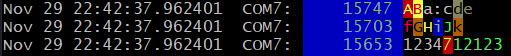
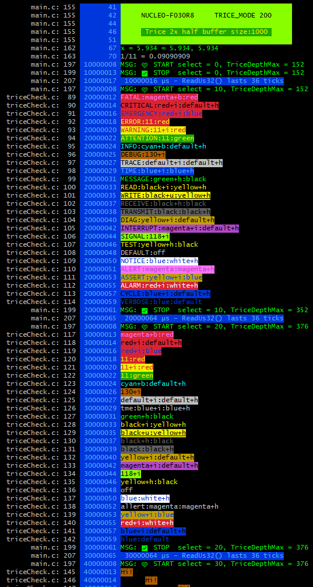
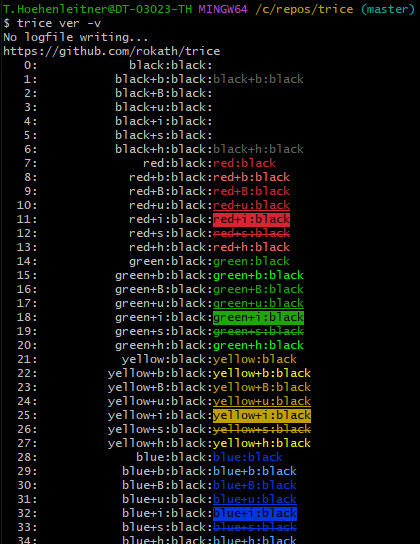

# Trice Tags, Color, and Weights

Tags label Trice messages on the host. They can control presentation, selection, ID assignment, and weight-based filtering without adding target runtime data because the tag is part of the format string stored in `til.json`.

## How to use tags

Add a tag and a colon in front of a Trice format string:

```c
trice("wrn:Motor temperature is %d C\n", temperature);
```

The Trice tool recognizes `wrn`, applies the Warning color, and removes the prefix when it is completely lower case. A mixed-case or uppercase prefix remains visible:

```text
wrn:fox  -> fox
Wrn:fox  -> Wrn:fox
```

The colors, aliases, and weights are defined in [`lineTransformerANSI.go`](../internal/emitter/lineTransformerANSI.go). The tag itself does not require a target-side enable switch. Use `-pick` or `-ban` to select complete tag groups during host logging. Tag-specific ID ranges can additionally assign and route target IDs.

Short aliases have one unambiguous meaning. `W` and `w` select Write, while `wrn`, `WARN`, and `WARNING` select Warning. `rx` selects Receive, `tx` selects Transmit, `s` and `S` select Seconds, and `sig` selects Signal. Configurations created for older Trice versions should replace an ambiguous short alias with the intended explicit name before using it for `-pick`, `-ban`, `-logLevel`, or `-IDRange`.

It is possible to concatenate individually tagged fragments to produce output such as:



The source for this example is in [`triceCheck.c`](../_test/testdata/triceCheck.c).

## Tag weights

Each tag group has one integer weight in the range `0..999`. A larger value means greater importance. The weight belongs to the group and therefore applies to every alias in that group. It is independent of the group's position in the tag table and independent of its color.

| Group | Weight |
|---|---:|
| Fatal | 790 |
| Critical | 780 |
| Emergency | 770 |
| Error, Assert, Alarm, Alert | 760 |
| Warning | 750 |
| Attention | 740 |
| Notice | 600 |
| INFO, Time, Message, Read, Write, Receive, Transmit, Diag, Interrupt, Signal, Test, Default, Config, Microseconds, Milliseconds, Seconds, Delta | 500 |
| Debug | 200 |
| Trace | 100 |
| Verbose | 50 |

`CYCLE_ERROR` is a Trice tool diagnostic rather than an application tag. Its stored value does not define application-message priority.

## Selecting tags and priority

Use the repeatable `-pick` option to display selected tag groups, or `-ban` to suppress selected groups. The two options are mutually exclusive. Separate names with colons or repeat the option:

```sh
trice log -pick err:wrn -pick notice
trice log -ban dbg -ban trace:verbose
```

Aliases select the complete group. `-pick all` selects every message and `-pick off` selects none; `-ban all` suppresses every message and `-ban off` suppresses none. Empty list entries and unknown names are command-line errors.

Use `-logLevel` with `all`, `off`, a registered tag or alias, or a numeric weight from `0` through `999`. A known tagged output fragment passes when its weight is greater than or equal to the threshold. A lower threshold therefore displays more messages:

```sh
trice log -logLevel info
trice log -logLevel 500
```

Both commands use the same threshold. Unknown level names and numeric values outside `0..999` are rejected before the input channel is opened. Numeric and tag thresholds leave text without a recognized tag unaffected until the reserved `untagged` group is introduced. `-logLevel off` suppresses all output fragments in the current implementation.

All `-ulabel` values are applied before `-pick`, `-ban`, and `-logLevel` are resolved. Option order therefore does not matter:

```sh
trice log -pick motor -ulabel motor:650
trice log -ulabel motor:650 -pick motor
```

The current level filter still operates on output fragments. Supplemental columns such as timestamps and source locations can therefore be affected separately. Event-wide filtering that keeps accepted messages and their metadata together is a separate change.

## User-defined tags and weights

Use the repeatable `-ulabel name[:weight]` option to register a new tag or change a known group's weight for one command:

```sh
trice log -ulabel motor -ulabel sensor:150
trice insert -ulabel motor:250
trice bind -ulabel motor:250
```

A new tag without an explicit weight receives the final INFO weight after all `-ulabel` options have been processed. An explicit weight must be between `0` and `999`, inclusive.

An existing name without a weight leaves its group unchanged. An existing name with a weight changes the complete group, including every alias. The last explicit assignment wins:

```sh
-ulabel msg:150 -ulabel M:600 -ulabel msg
```

This results in weight `600` for the complete Message group. It does not create additional groups for `msg` or `M`.

Each option accepts exactly one name. The old colon-separated name-list form is invalid. Empty names or weights, additional colons, non-decimal weights, weights outside `0..999`, purely numeric names, `all`, and `off` are rejected before the command opens or changes its input and output files.

For `insert` and `bind`, only the registered name participates in tag and `-IDRange` handling. A weight changes no target data and is not stored in the source or `til.json`.

Command-specific user tags and weight overrides are discarded before a later command in the same process starts.

## Output options



With `-color default`, recognized lower-case tag prefixes are removed and their configured colors are applied. With `-color none`, lower-case prefixes are removed without adding colors. With `-color off`, prefixes remain unchanged and no colors are added.

## Check color alternatives

There are over 1000 foreground, background, and style combinations:



Run `trice generate -color` to display them. Modify [`lineTransformerANSI.go`](../internal/emitter/lineTransformerANSI.go) and rebuild the Trice tool with `go install ./...` to change the built-in palette.

## Color issues under Windows

If a Windows console displays ANSI escape sequences instead of colors, use a terminal with ANSI color support, such as Windows Terminal, Git Bash, or [Alacritty](../third_party/alacritty/ReadMe.md). Additional background is available in [Windows console with ANSI colors handling](https://superuser.com/questions/413073/windows-console-with-ansi-colors-handling/1050078#1050078).
