# *Trice* user guide

> _(Read this)
>
> SORRY: This document is currently a mess and partially outdated.

<!-- TABLE OF CONTENTS -->
<details>
  <summary>Table of Contents</summary>
  <ol>

<!-- vscode-markdown-toc -->
- [*Trice* user guide](#trice-user-guide)
  - [1. Project structure](#1-project-structure)
  - [2. Get started](#2-get-started)
    - [2.1. Get it](#21-get-it)
    - [2.2. Install It](#22-install-it)
    - [2.3. Use It](#23-use-it)
    - [2.4. Port it](#24-port-it)
      - [2.4.1. Target Code Overview](#241-target-code-overview)
  - [3. Build `trice` tool from Go sources (you can skip that)](#3-build-trice-tool-from-go-sources-you-can-skip-that)
  - [4.  Embedded system code configuratio](#4--embedded-system-code-configuratio)
  - [5. `trice` tool in logging action](#5-trice-tool-in-logging-action)
  - [6. Encryption](#6-encryption)
  - [7. CLI Options for `trice` tool](#7-cli-options-for-trice-tool)
  - [8. *Trice* command line examples](#8-trice-command-line-examples)
    - [8.1. Common information](#81-common-information)
    - [8.2. Further examples](#82-further-examples)
      - [8.2.1. Automated pre-build update command example](#821-automated-pre-build-update-command-example)
      - [8.2.2. Some Log examples](#822-some-log-examples)
      - [8.2.3. Logging over a display server](#823-logging-over-a-display-server)
      - [8.2.4. Logfile output](#824-logfile-output)
      - [8.2.5. Binary Logfile](#825-binary-logfile)
      - [8.2.6. TCP output](#826-tcp-output)
      - [8.2.7. Set all IDs in a directory tree to 0](#827-set-all-ids-in-a-directory-tree-to-0)
      - [8.2.8. Stimulate target with a user command over UART](#828-stimulate-target-with-a-user-command-over-uart)
      - [8.2.9. Explpore and modify channels and their colors](#829-explpore-and-modify-channels-and-their-colors)
      - [8.2.10. Location Information](#8210-location-information)
  - [9. Additional hints](#9-additional-hints)
    - [9.1. Pre-built executables are available](#91-pre-built-executables-are-available)
    - [9.2. Configuration file `triceConfig.h`](#92-configuration-file-triceconfigh)
    - [9.3. Setting up the very first connection](#93-setting-up-the-very-first-connection)
    - [9.4. Avoid buffer overruns](#94-avoid-buffer-overruns)
    - [9.5. Limitation "trice u" requires TRICE macros on a single line](#95-limitation-trice-u-requires-trice-macros-on-a-single-line)
    - [9.6. Limitation TRICE in TRICE not possible](#96-limitation-trice-in-trice-not-possible)
    - [9.7. Dynamic strings/buffers only as variable inside `TRICE` macros](#97-dynamic-stringsbuffers-only-as-variable-inside-trice-macros)
    - [9.8. Logfile viewing](#98-logfile-viewing)
    - [9.9. Using the `trice` tool with 3rd party tools](#99-using-the-trice-tool-with-3rd-party-tools)
    - [9.10. Several targets at the same time](#910-several-targets-at-the-same-time)
    - [9.11. Executing `go test -race -count 100 ./...`](#911-executing-go-test--race--count-100-)
    - [9.12. Direct TRICE Out (TRICE\_MODE 0) could cause stack overflow with -o0 optimization](#912-direct-trice-out-trice_mode-0-could-cause-stack-overflow-with--o0-optimization)
  - [10. Target side *Trice* On-Off](#10-target-side-trice-on-off)
  - [11. Host side *Trice* On-Off](#11-host-side-trice-on-off)
  - [12. Using a different encoding](#12-using-a-different-encoding)
  - [13. Testing](#13-testing)
    - [13.1. Folder information](#131-folder-information)
    - [13.2. Package specific information](#132-package-specific-information)
    - [13.3. todo](#133-todo)
  - [14. Trice demo \& test project info](#14-trice-demo--test-project-info)
    - [14.1. Backup folder](#141-backup-folder)
    - [14.2. Terminal info](#142-terminal-info)
    - [14.3. RTT info](#143-rtt-info)
    - [14.4. UART](#144-uart)
    - [14.5. MDK-ARM projects](#145-mdk-arm-projects)
  - [15. Further info](#15-further-info)
  - [16. Third party Software](#16-third-party-software)
  - [17. alacritty](#17-alacritty)
    - [17.1. goST](#171-gost)
    - [17.2. keil.com](#172-keilcom)
    - [17.3. segger.com](#173-seggercom)
      - [17.3.1. SEGGER downloaded Software](#1731-segger-downloaded-software)
      - [17.3.2. JLink](#1732-jlink)
      - [17.3.3. SEGGER\_RTT](#1733-segger_rtt)
      - [17.3.4. STLinkReflash\_190812.zip](#1734-stlinkreflash_190812zip)
  - [18. st.com](#18-stcom)
  - [19. *Trice*  Version 1.0 Specification (Draft)](#19-trice--version-10-specification-draft)
  - [20.  Trice User Interface - Quick Start](#20--trice-user-interface---quick-start)
      - [20.1. User Code Adaption](#201-user-code-adaption)
      - [20.2. Limitations](#202-limitations)
      - [20.3. Trice (Time) Stamps](#203-trice-time-stamps)
      - [20.4. Trice Parameter Bit Widths](#204-trice-parameter-bit-widths)
    - [20.1. Trice Binary Data Format](#201-trice-binary-data-format)
      - [20.1.1. Framing](#2011-framing)
      - [20.1.2. Optional XTEA Encryption](#2012-optional-xtea-encryption)
      - [20.1.3. Endianness](#2013-endianness)
      - [20.1.4. `TRICE` (Time)Stamps](#2014-trice-timestamps)
      - [20.1.5. Binary Encoding](#2015-binary-encoding)
        - [2.5.1. Symbols](#251-symbols)
        - [2.5.2. Package Format](#252-package-format)
    - [20.2. Trice Decoding](#202-trice-decoding)
      - [20.2.1. *Trice* ID list `til.json`](#2021-trice-id-list-tiljson)
      - [20.2.2. *Trice* location information file `li.json`](#2022-trice-location-information-file-lijson)
    - [20.3. *Trice* ID Numbers](#203-trice-id-numbers)
      - [20.3.1. ID number selection](#2031-id-number-selection)
      - [20.3.2. ID number usage and stability](#2032-id-number-usage-and-stability)
      - [20.3.3. *Trice* ID 0](#2033-trice-id-0)
    - [20.4. Trice ID management](#204-trice-id-management)
      - [20.4.1. The `trice update` algorithm](#2041-the-trice-update-algorithm)
        - [5.1.1. Starting Conditions](#511-starting-conditions)
        - [5.1.2. Aims](#512-aims)
        - [5.1.3. Method](#513-method)
      - [20.4.2. User Code Patching (`trice update`)](#2042-user-code-patching-trice-update)
        - [5.2.1. User Code Patching Examples](#521-user-code-patching-examples)
      - [20.4.3. User Code Un-Patching](#2043-user-code-un-patching)
      - [20.4.4. ID Usage Options](#2044-id-usage-options)
      - [20.4.5. General ID Management Information](#2045-general-id-management-information)
      - [20.4.6. Option 1: Let the inserted Trice ID be a Part of the User Code](#2046-option-1-let-the-inserted-trice-id-be-a-part-of-the-user-code)
      - [20.4.7. Option 2: Un-patching in a Post-build process](#2047-option-2-un-patching-in-a-post-build-process)
      - [20.4.8. Option 3: Un-patching on Repository Check-In](#2048-option-3-un-patching-on-repository-check-in)
    - [20.5. Changelog](#205-changelog)


<!-- vscode-markdown-toc-config
	numbering=true
	autoSave=true
	/vscode-markdown-toc-config -->
<!-- /vscode-markdown-toc --><div id="top"></div>

  </ol>
</details>

##  1. <a name='Projectstructure'></a>Project structure

| name         | info                                            |
|--------------|-------------------------------------------------|
| [cmd/trice](../cmd/trice)    | `trice` tool command Go sources                 |
| cmd/cui      | (do not use) command user interface tryout code |
| cmd/stim     | (do not use) target stimulation tool tryout code|
| docs/        | documentation                                   |
| internal/    | `trice` tool internal Go packages               |
| pkg/         | `trice` tool common Go packages                 |
| [src/](../src/)         | C sources for trice instrumentation             |
| test/        | example target projects and tests               |
| third_party/ | external components                             |

<p align="right">(<a href="#top">back to top</a>)</p>

##  2. <a name='Getstarted'></a>Get started

###  2.1. <a name='Getit'></a>Get it

* OR [Download](https://github.com/rokath/trice/releases) latest release assets for your system: Source code and compressed binaries.
* OR Clone the repo: `git clone https://github.com/rokath/trice.git`
  * Later inside folder `trice`: `git pull` to get the latest changes.
* OR use the  button

###  2.2. <a name='InstallIt'></a>Install It

* Place the **trice** binary somewhere in your [PATH](https://en.wikipedia.org/wiki/PATH_(variable)).

###  2.3. <a name='UseIt'></a>Use It

* In a console type `trice help -all`. You should see the complete **trice** tool [CLI](https://en.wikipedia.org/wiki/Command-line_interface) documentation.
  * Don´t worry, most of it you will never need.
  * There are only 2 important commands: `trice u[pdate]` and `trice l[og]`. Call them with the right CLI switches.
    * `trice h -u[pdate]` and `trice h -l[og]` show partial help.
* `trice` does not make any assumptions about the target processor - 8-bit to 64-bit and any endianness are supported.
* The ARM µVision MDK is free downloadable and free usable for STM M0/M0+ MCUs, like the `./test/MDK-ARM_STM32F030R8` project.
  * Even if you do not have such hardware, you can download ARM µVision MDK and compile the `./test/MDK-ARM_STM32F030R8` project just to get started.
  * When adding or modifying `trice` macros inside `.test/MDK-ARM_STM32F030R8/Core/Src/main.c` and recompiling you should see automatically changed ID numbers inside the code.
  
###  2.4. <a name='Portit'></a>Port it 

Compair folder `./test/MDK-ARM_STM32F030R8_generated` with `./test/MDK-ARM_STM32F030R8` to see in a quick way any needed adaptions for your target project to port trice to it.

Main steps are:

* Add `./src/trice.c` to your project. It includes the files in ./src/box automatically.
* Add `./src/` to your library include path.
* Copy file `./test/MDK-ARM_STM32F030R8/Core/Inc/triceConfig.h` to your embedded project and adapt it to your needs.
  * Other `triceConfig.h` files are usable as well, but the above is usually the most actual one.
* Copy file `./test/MDK-ARM_STM32F030R8/Core/Inc/SEGGER_RTT_Conf.h` to your embedded project and adapt it to your needs, when using RTT.
* Add 2 functions to your project:
  
    ```c
    ///////////////////////////////////////////////////////////////////////////////
    // (time) stamp funktions, rewrite these hardware specific functions in your project.
    // 
    
    // 16-bit us stamp, wraps after 10 milliseconds
    uint16_t TriceStamp16( void ){
        return 0x1616;
    }
    
    // 32-bit us stamp, wraps after 71,58 seconds
    uint32_t TriceStamp32( void ){
        return 0x32323232;
    }
    
    //
    ///////////////////////////////////////////////////////////////////////////////
    ```

* Optionally copy all or parts parts of `./test/testdata/triceCheck.c` to your project if you wish to perform some checks.
  * Do not inlucde it directly, because it gets overwritten when `updateTestData.sh` is executed inside the `./test` folder.
* In your source.c files add line `#include "trice.h"`
* In a function write a trice message like: `TRice( "1/11 = %g\n", aFloat( 1.0/11 ) );`.
* In **project root**:
  * Create empty file: `touch til.json`.
  * Witch correct CLI switches `trice u` should perform **automatically** these things (The numbers are just examples.):
>>>    * Patch source.c to `TRice( iD(12363), "1/11 = %g\n", aFloat( 1.0/11 ) );`
>>>      * C & H files containing TRICE macros, are only modified if needed (missing or obsolete ID)
>>>    * Extend `til.json`
>>>      * If no `til.json` is found nothing happens. At least an empty file is needed (Safety feature).
* When the program runs later, it should output something similar to 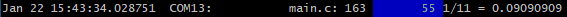
* It is up to the user to provide the 2 functions `void TriceStamp16(void)` and `void TriceStamp32(void)`.
  * They are usually provide time stamps but could be used in any manner.
  * They are defined as `__WEAK` functions, so that you can skip their coding in the beginning.
* For RTT the SEGGER source is already included.
* For UART transfer add UART write functionality.

####  2.4.1. <a name='TargetCodeOverview'></a>Target Code Overview

* `./src`:

| File                                  | description |
| -                                     | -           |
| `trice.h` & `trice.c`                 | trice runtime lib user interface, `#include trice.h` in project files, where to use `TRICE` macros. |

* `./src/box`:

| File                                  | description |
| -                                     | -           |
| `cobs*.*`                             | message packaging, alternatively for tcobs |
| `trice.h` & `trice.c`                 | trice runtime lib user interface, `#include trice.h` in project files, where to use `TRICE` macros. |
| `core.c`                              | trice core lib |
| `SEGGER_RTT.*`                        | Segger RTT code |
| `tcobs*.*`                            | message compression and packaging |
| `trice8.*`                            | 8-bit trice code |
| `trice16.*`                           | 16-bit trice code |
| `trice32.*`                           | 32-bit trice code |
| `trice64.*`                           | 64-bit trice code |
| `triceDoubleBuffer.c`                 | trice runtime lib extension needed for fastest indirect mode |
| `triceModbusBuffer.c`                 | trice runtime lib extension needed for Modbus mode (not usable yet) |
| `triceStackBuffer.c`                  | trice runtime lib extension needed for direct mode |
| `triceStreamBuffer.c`                 | trice runtime lib extension needed for recommended indirect mode |
| `xtea.*`                              | UNTESTED with TREX, needed for XTEA message encryption, if enabled |
  
* The TCOBS files are copied from [https://github.com/rokath/tcobs/tree/master/TCOBSv1](https://github.com/rokath/tcobs/tree/master/TCOBSv1). They are maintained there and extensively tested and probably not a matter of significant change.
* The SEGGER files are copied from and you could check for a newer version at [https://www.segger.com/downloads/jlink/](https://www.segger.com/downloads/jlink/).

<p align="right">(<a href="#top">back to top</a>)</p>

##  3. <a name='BuildtricetoolfromGosourcesyoucanskipthat'></a>Build `trice` tool from Go sources (you can skip that)

* Install [Go](https://golang.org/).
* On Windows you need to install [TDM-GCC](https://jmeubank.github.io/tdm-gcc/download/).
  * Take the 64-bit variant when Go is 64-bit or take the 32-bit variant when Go is 32-bit. If mixed installations work I doubt.
  * Recommendation: Minimal online installer.
  * GCC is only needed to test the target C-code on the host.
  * Make sure TDM-GCC is found first in the path, if you have several compilers installed.
  * Other gcc variants could work also but not tested.
* Open a console inside the `trice` directory, recommended is the git-bash, when using Windows.
* Check and install:

```b
ms@DESKTOP-7POEGPB MINGW64 /c/repos/trice (master)
$ go clean -cache

ms@DESKTOP-7POEGPB MINGW64 /c/repos/trice (master)
$ go vet ./...

ms@DESKTOP-7POEGPB MINGW64 /c/repos/trice (master)
$ go test ./...
?       github.com/rokath/trice/cmd/cui [no test files]
ok      github.com/rokath/trice/cmd/stim        0.227s
ok      github.com/rokath/trice/cmd/trice       0.577s
ok      github.com/rokath/trice/internal/args   0.232s
ok      github.com/rokath/trice/internal/charDecoder    0.407s
ok      github.com/rokath/trice/internal/com    1.148s
ok      github.com/rokath/trice/internal/decoder        0.412s [no tests to run]
?       github.com/rokath/trice/internal/do     [no test files]
ok      github.com/rokath/trice/internal/dumpDecoder    0.388s
ok      github.com/rokath/trice/internal/emitter        0.431s
ok      github.com/rokath/trice/internal/id     0.421s
ok      github.com/rokath/trice/internal/keybcmd        0.431s
ok      github.com/rokath/trice/internal/link   0.404s
ok      github.com/rokath/trice/internal/receiver       0.409s
ok      github.com/rokath/trice/internal/tleDecoder     0.398s
?       github.com/rokath/trice/internal/translator     [no test files]
ok      github.com/rokath/trice/internal/trexDecoder    0.391s
ok      github.com/rokath/trice/pkg/cipher      0.377s
ok      github.com/rokath/trice/pkg/endian      0.302s
ok      github.com/rokath/trice/pkg/msg 0.299s
ok      github.com/rokath/trice/pkg/tst 0.406s
ok      github.com/rokath/trice/test/cgo_stackBuffer_noCycle_cobs       40.910s
ok      github.com/rokath/trice/test/cgo_stackBuffer_noCycle_tcobs      40.926s

ms@DESKTOP-7POEGPB MINGW64 /c/repos/trice (master)
$ go install ./...

ms@DESKTOP-7POEGPB MINGW64 /c/repos/trice (master)
$
```

The last tests can last quite a while, depending on your machine.
Afterwards you should find an executable `trice` inside $GOPATH/bin/ and you can modify its source code.

<p align="right">(<a href="#top">back to top</a>)</p>

##  4. <a name='Embeddedsystemcodeconfiguratio'></a> Embedded system code configuratio

Check comments inside `triceConfig.h`.

<!--
* Each project gets its own [triceConfig.h](../test/MDK-ARM_STM32F030R8/Core/Inc/triceConfig.h) file.
* Modify [triceConfig.h](../test/MDK-ARM_STM32F030R8/Core/Inc/triceConfig.h) according your needs. Choose the *Trice* mode here:
  * Immediate mode: Straight output inside `TRICE` macro at the cost of the time it takes.
    * With `#define TRICE_MODE 0` (immediate mode) just provide a **putchar()** function but no inside interrupts *Trices*!
    * Or use [SEGGER_RTT](./TriceOverRTT.md) allowing *Trices* also inside interrupts. An other big plus during new hardware setup is, no need to connect an additional wire. All information goes thru the debug probe. Internally only a `memcpy` transfers maybe 16 bytes to the SEGGER_RTT buffer and *Trice* does even not need a own buffer and no background task.
  * Deferred mode: Output outside `TRICE` macro, a background output some milliseconds later is needed at the cost of RAM buffer.
    * Compare the **not** instrumented test project [./test/MDK-ARM_STM32F030R8_generated]([./test/MDK-ARM_STM32F030R8_generated) with the instrumented test project [./test/MDK-ARM_STM32F030R8]([./test/MDK-ARM_STM32F030R8) to see an implementation example.
* Recommendation:
  * [SEGGER_RTT](./TriceOverRTT.md) transfer: Immediate *Trice* mode.
  * None-[SEGGER_RTT](./TriceOverRTT.md) transfer (mostly UART):
    * *Trice* Kick-off: Immediate *Trice* mode, but **no** `TRICE` macros inside interrupts.
    * *Trice* usage:  Deferred mode which **allows to use** `TRICE` macros also inside interrupts.
    * In some cases, when logging a huge amount of data without timing constraints the immediate mode is a better choice.
* If speed **and** log volume is needed, care must be taken to avoid *Trice* buffer overflow for example by time triggering.
* Set options inside [triceConfig.h](../test/MDK-ARM_STM32F030R8/Core/Inc/triceConfig.h):
  * Target timestamps time base
  * A cycle counter is per default active.
    * `#define TRICE_CYCLE_COUNTER 0` to deactivate it for a bit more speed (and less code).
  * Allow `TRICE` usage inside interrupts for a bit less speed (and more code):
    * `#define TRICE_ENTER TRICE_ENTER_CRITICAL_SECTION`
    * `#define TRICE_LEAVE TRICE_LEAVE_CRITICAL_SECTION`
  * Buffer size (use function `TriceDepthMax()` to check the used buffer depth):
    * Immediate mode: `#define TRICE_STACK_BUFFER_MAX_SIZE 128` - space for one *Trice*
    * Deferred mode: `#define TRICE_HALF_BUFFER_SIZE 1000`- space for *Trices* within ~100ms
  * *Trice* output over UART 
    * `#define TRICE_UART USART2`:  In project root a command like `trice l -p COM14` is needed. It should show something similar to after app start.
  * *Trice* output over RTT: Please refer to the [./TriceOverRTT.md](./TriceOverRTT.md) document.
  * Further *Trice* output options: Please refer to the [./TriceOverOneWire.md](./TriceOverOneWire.md) document.
* All compiler and hardware specific adaption should be possible inside `triceConfig.h`
* Compile, load and start your app.
* Look in [triceCheck.c](../pkg/src/triceCheck.c) for usage examples.
  * It contains `TRICE` macros in different variants.
* Because of performance reasons there is no function call inside `TRICE`. Too much `TRICE` macros could take too much FLASH space. But you can deactivate the code generation for all`TRICE` macros on file granularity. See [Target side *Trice* On-Off](#TargetsideTriceOn-Off) below.

* It is sufficient for most cases just to use the `TRICE` macro with max 0 to 12 parameters as a replacement for `printf` and to use the default settings.
  * For more compact transfer consider `TRICE8` & `TRICE16` macros or if `double` is needed use `TRICE64`.
  * Further reading: [TriceVsPrintfSimilaritiesAndDifferences.md](TriceVsPrintfSimilaritiesAndDifferences.md).

<p align="right">(<a href="#top">back to top</a>)</p>

-##  5. <a name='Adaptyourlegacysourcecode'></a>Adapt your legacy source code

For example change the legacy source code line

```c
printf( "%d Kelvin\n", k );
```

into

```c
TRICE( "%d Kelvin\n", k );
```

This you could do automatically using a word processor. A `trice update` (run it later in the tool chain to keep everything automatically up-to-date) inserts the *Trice* IDs:

```c
TRICE( Id(12345), "%d Kelvin\n", k );
```

Care must be taken in the following cases:

* More than 12 printf parameters: use several printf-calls
* float numbers: surround each with `aFloat()`
* double numbers: surround each with `aDouble()` and use the `TRICE64` macro
* runtime generated strings: Each needs its own `TRICE_S` macro, example: 
  * Legacy code: `printf( "Entered name is %20s %30s, favorite numbers %d, %f\n", "Paul", "Luap", 42, 3.14159 );`
  * Trice code 1: `name = "Paul"; TRICE_S( "Entered name is %20s", name );`
  * Trice code 2: `surname = "Luap";  TRICE_S( " %30s, ", surname );`
  * Trice code 3: `TRICE( "favorite numbers %d, %f\n", 42, aFloat(3.14159) );`


<!--
and adds for example the *ID 12345* together with *"%d Kelvin\n"* into a **t**rice **I**D **l**ist, a [JSON](https://www.json.org/json-en.html) reference file named [til.json](../til.json). The *12345* is a random or policy generated ID not used so far. During compilation the `TRICE` macro is translated to only a *12345* reference and the variable *k*. The format string never sees the target.

When you compare the needed FLASH size before and after you probably will see more free space afterwards, because the *Trice* code is less than 1 KB, no format strings anymore inside the target and you do not need a printf library anymore. Be aware that `TRICE` is a macro adding each time it is used some code.


A `TRICE` macro is avoiding all the `printf()` internal overhead (space and time) but is nearly as easy to use. For example instead of writing

```c
printf("time is %d:%d:%d\n", hour, min, sec);
```

you can write

```c
TRICE8("time is %d:%d:%d\n", hour, min, sec);
```

into a source file of your project. The `8` stands here for 8 bit values (`16`, `32` and `64` also possible). Values of mixed size are allowed in one `TRICE` macro, so you can use `TRICE` consequently to match most cases for the prize of little data overhead.

Side note: If you look in detail at the *Trice* code you will see that a `TRICE8( "%d", 1 )` takes the same amount of transfer data as `TRICE( "%d", 1 )` and is even a bit slower because of the internal masking. But using `TRICE8( "%d%d%d%d%d%d%d%d%d%d%d%d", 1, 1, 1, 1, 1, 1, 1, 1, 1, 1, 1, 1 ;` instead of `TRICE( "%d%d%d%d%d%d%d%d%d%d%d%d", 1, 1, 1, 1, 1, 1, 1, 1, 1, 1, 1, 1 ;` will reduce the transfer bytes by 24 bytes.

When performing `trice update` the source (tree) is parsed and in result this line changes to

```c
TRICE8( Id(12345), "time is %d:%d:%d\n", hour, min, sec);
```
or 
```c
TRICE8_3( Id(12345), "time is %d:%d:%d\n", hour, min, sec);
```

as you like where `12345` is an as ID generated 16-bit random (upward|downward also possible) number not used so far. The TRICE8`_3` means 3 parameters in this example and allows efficient code and a compile time check. Per default the macro name `TRICE8` is not changed for a slightly more readable code. If you wish a compile time parameter count check use `-addParamCount` to the update command line, to convert a `TRICE8` into a `TRICE8_3` in the above example. Legacy code with valid IDs is not modified (You can use sub-command `zeroSourceTreeIds` to go around that.)

The total amount of data is currently limited to 12 parameters but this is easy to extend if needed.

When the embedded project is compiled, only the ID goes to the binary but not the format string, what results in a smaller memory footprint usually compared to a printf-like function call, because of the stored string.

On execution the ID is pushed into a buffer together with the optional *Trice* parameters and that is the real fast and important part which could be finished within 6-8 processor clocks ([measured](./TriceSpeed.md) on a ARM M0+). At 64 MHz in the time needed light travels about 30 meters. Slightly delayed in the background the *Trice* goes to the communication port, what is also fast compared to all the actions behind a `printf()` statement.

Please understand, that when debugging code containing `TRICE`macros, during a `TRICE` step-over only one ore more 32 bit values go into the internal buffer and no serial output immediately is visible because of the stopped target. But the SEGGER debug probe reads out the RTT memory and this way also during debug stepping real-time trice output is visible. That is (right now) not true for the ST-Link interface because there is only one USB endpoint.

trice instructions: `TRICE`, `Trice` or `trice` with or without ending letter 'i'?

There are several types of trice statements. All trice statements can have an additional letter 'i'. This means **i**nside critical section. \
You can use these when it is sure not to get interrupted by other trices. If for example an interrupt contains a trice statement this can be \
an i-trice but other trices not allowed to be an i-trice, they need to be normal trices, which are protected against interruption. \
If you are not sure it is always safe to use normal trices (without ending 'i'). The i-trices are a bit faster what is not relevant in most cases because of the general speed.

* Mixed case `Trice0`, `Trice8_1`, `Trice16_1` and `Trice8_2` are so called short trice macros.\
They use internal a smaller encoding and have only a 15-bit ID size, means ID's 1-32767 are usable.\
These are the fastest trices and with them the speed limit is reached.\
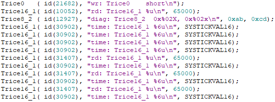\
\
\
The number in the blue lines is the current processor tick. For `Trice16_1i` the difference between neighbors is about 13 clocks. \
Short trices need 'id(0)' instead 'Id(0)' as important difference to normal trices. The `trice` tool will handle that for you.
* Upper case `TRICE0`, `TRICE8_1`, ... `TRICE8_8`, `TRICE16_1`, ... `TRICE16_4`, `TRICE32_1`, ... `TRICE32_4`, `TRICE64_1`, `TRICE64_2` are normal trice macros. \
They insert code directly (no function call) for better performance but the drawback is the rising code amount when many trices are used.
* Lower case `trice0`, `trice8_1`, ... `trice8_8`, `trice16_1`, ... `trice16_4`, `trice32_1`, ... `trice32_4`, `trice64_1`, `trice64_2` are normal trice functions. \
The function call overhead is reasonable and the advantage is significant less code amount when many trices are used.
* For most flexibility the code for each trice function can be enabled or not inside the triceConfig.h.

-->

<p align="right">(<a href="#top">back to top</a>)</p>

##  5. <a name='tricetoolinloggingaction'></a>`trice` tool in logging action

<!--
Executing `trice update` at the root of your project source updates in case of changes, the *Trice* statements inside the source code and the ID list. The `-src` switch can be used multiple times to keep the amount of parsed data small for better speed.
-->

With `trice log -port COM12 -baud 921600` you can visualize the trices on the PC, if for example `COM12` is receiving the data from the embedded device at this baudrate.

The following capture output comes from an example project inside`../test`

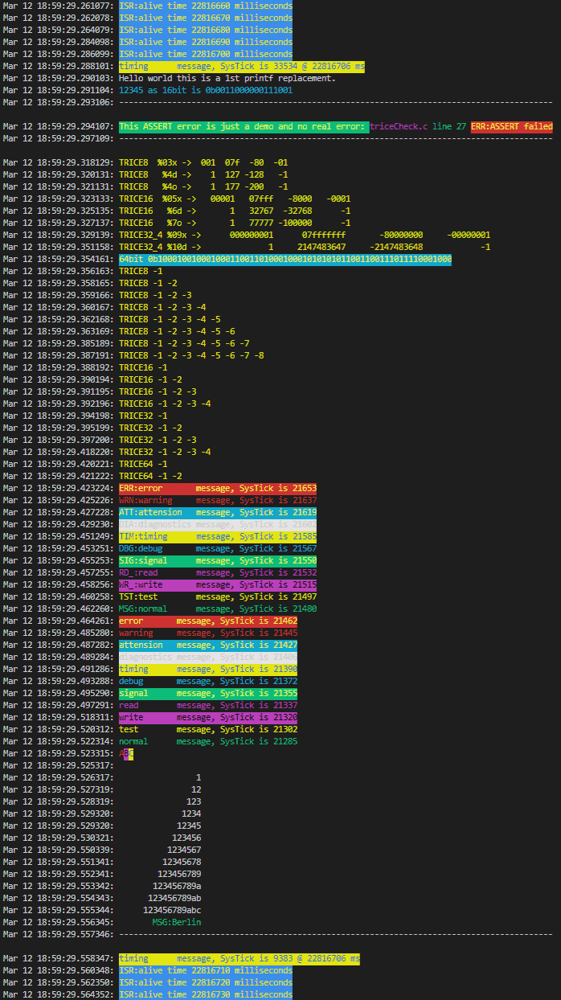

See [triceCheck.c](../pkg/src/triceCheck.c) for reference. The *Trices* can come mixed from inside interrupts (light blue `ISR:...`) or from normal code. For usage with a RTOS *Trices* are protected against breaks (`TRICE_ENTER_CRITICAL_SECTION`, `TRICE_LEAVE_CRITICAL_SECTION`). Regard the differences in the read SysTick values inside the GIF above These differences are the MCU clocks needed for one trice (~0,25µs@48MHz).

Use the `-color off` switch for piping output in a file.

<!---
//###  6.2. <a name='Checkthetricebinary'></a>Check the `trice` binary
* Copy command trice into a path directory.
* Run inside a shell `trice check -list path/to/trice/examples/triceDemoF030R8/MDK-ARM/`[til.json](../examples/triceDemoF030R8/MDK-ARM/til.json). You should see output like this:


//###  6.2. <a name='InstrumentatargetsourcecodeprojectHowtousetriceinyourproject'></a>Instrument a target source code project (How to use trice in your project)

Look at one of the appropriate test projects as example. In general:

* Copy [triceConfig.h](https://github.com/rokath/trice/tree/master/pkg/src/intern/triceConfig.h) and adapt to your needs.
* Make sure the [trice.h](https://github.com/rokath/trice/blob/master/pkg/src/trice.h) header file is found by your compiler.
* Include [trice.c](https://github.com/rokath/trice/blob/master/pkg/src/trice.c)

Next steps:

* Add `#include "trice.h"` to your project files where to use TRICE macros and put `TRICE0( "msg:Hello world!\n" );` after your initialization code.
* Run `trice u` at the root of your source code. Afterwards:
  * It should have changed into `TRICE0( Id(12345), "msg:Hello world!\n" );` as example. (The `12345` stays here for a 20-bit non-zero random number).
  * A file [til.json](https://github.com/rokath/trice/blob/master/til.json)  (**t**race **i**d **l**ist) should have been generated.
* Set up timer and UART interrupt and main loop in the right way. Analyze the test example projects for advice.
* For help have a look at the differences between these 2 projects:
  * `../test/MDK-ARM_LL_generatedDemo_STM32F030R8-NUCLEO-64` * It is just the STM32 CubeMX generated code.
  * `../test/MDK-ARM_LL_UART_RTT0_FLEX_STM32F030R8-NUCLEO-64` * It is a copy of the above enhanced with trice check code.

* Add your compiler definitions to `trice/pkg/src/intern/triceConfigCompiler.h`
* Make a copy of `trice/pkg/src/intern/triceUART_LL_STM32.h`, rename the copy appropriate an fill these 4 functions with the hardware specific code:

```C
TRICE_INLINE uint32_t triceTxDataRegisterEmpty(void){
}

TRICE_INLINE void triceTransmitData8(uint8_t v) {
}

TRICE_INLINE void triceEnableTxEmptyInterrupt(void) {
}

TRICE_INLINE void triceDisableTxEmptyInterrupt(void) {
}
```

Quick workaround:

```C
* Leave these definitions empty: 
  * triceTxDataRegisterEmpty()
  * triceEableTxEmptyInterrupt()
  * triceDisableTxEmptyInterrupt()
* Use:
  * void triceTransmitData8( uint8_t d ){
    my_putchar( (char)d); // your code
  }
  Call TxStart();TxContinue(); cyclically in sufficient long intervals like 1 ms
```

* After compiling and flashing run `trice -port COMn -baud m` with n and m set to correct values
* Now start your device and you should see the hello world message coming from your target. In fact the hello-world string never went to the embedded device, only the ID comes from  there and the string is found in the [til.json](https://github.com/rokath/trice/blob/master/til.json) file of your project.
* If you use a legacy project containing `printf()` statements you can simply transform them to **TRICE\*** statements. TRICE32 will do in most cases but for better performance take **TRICE8** or **TRICE16** where possible.
* `printf(...)` statements containing string format specifier are quickly portable by using `TRICE_P(...)` but without the trice space and speed advantage. The TRICE_P() is intended only for the few dynamic strings in a ported  project.  Enable `TRICE_PRINTF_ADAPTER` increases the needed code size by a few KB.
* It could be helpful to add `trice u ...` as prebuild step into your toolchain for each file or for the project as a whole.
  This way you cannot forget the update step, it performs automatically.
-->

<p align="right">(<a href="#top">back to top</a>)</p>

##  6. <a name='Encryption'></a>Encryption

* You can deliver your device with encrypted trices. This way only the service is able to read the *Trices*.
* Implemented is XTEA but this is easy exchangeable.
* The to 8 byte padded blocks can get encrypted by enabling `#define ENCRYPT...` inside *triceConfig.h*. You need to add `-key test` as **log** switch and you're done.
* Any password is usable instead of `test`. Simply add once the `-show` switch and copy the displayed passphrase into the *config.h* file.
* The encryption takes part **before** the [COBS](https://en.wikipedia.org/wiki/Consistent_Overhead_Byte_Stuffing) encoding.

<p align="right">(<a href="#top">back to top</a>)</p>

##  7. <a name='CLIOptionsfortricetool'></a>CLI Options for `trice` tool

The trice tool is very easy to use even it has a plenty of options. Most of them normally not needed.
The trice tool can be started in several modes (sub-commands), each with several mandatory or optional switches. Switches can have parameters or not.

```b
trice sub-command -switch1 -switch2 parameter -switch3 ...
```

Which sub-command switches are usable for each sub-command is shown with `trice help -all`. This gives also information about their default values.

Info for a special sub-command is shown with `trice h -l`, `trice h -u`, ... .

<p align="right">(<a href="#top">back to top</a>)</p>

##  8. <a name='Tricecommandlineexamples'></a>*Trice* command line examples

* The **trice** tool has many command line options, but is easy to use with default values.
* No [config file](./TriceConfigFile.md) implemented yet. But the command history is usable for example inside the bash, simply enter CTRL-R and start typing `trice...` and you can select from the history.

###  8.1. <a name='Commoninformation'></a>Common information

* `trice h -all` shows all options of the current version.
* `trice ver` prints version information.
* `trice s` shows you all found serial ports for your convenience.
* `trice l -p COM17` could fail if s.th. is wrong. Additional switches are for help tracking the issue:
  * Use log witch `-s[howInputBytes]` to check if any bytes are received at all. 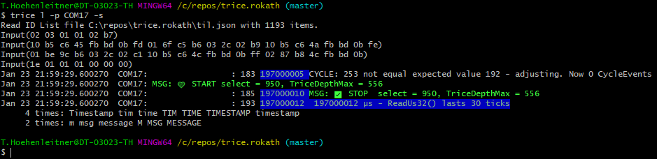
  * With `-debug` you can see the COBS and decoded and single *Trice* packages. 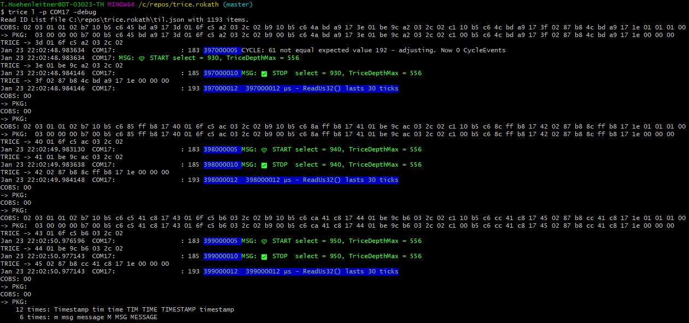

<!--
* `trice u` in the root of your project parses all source files for `TRICE` macros, adds automatically ID´s if needed and updates a file named **til.json** containing all ID´s with their format string information. To start simply generate an empty file named **til.json** in your project root. You can add `trice u` to your build process and need no further manual execution.

* `trice ds` starts a display server listening on default ip address *127.0.0.1:61487* or any specified value, so also on a remote device, lets say with ip address 192.168.1.200.
* `trice l -p COM18 -ds` sends the log strings to a display server with default ip address *127.0.0.1:61487* or any specified value, if for example `-ipa 192.168.1.200` the trice logs go to the remote device. You can start several trice log instances, all transmitting to the same display server.
-->

###  8.2. <a name='Furtherexamples'></a>Further examples

####  8.2.1. <a name='Automatedpre-buildupdatecommandexample'></a>Automated pre-build update command example

* Scan directories `../src`, `../lib/src` and `./` to update the IDs there and extend list file `../../../til.json`

```bash
trice u -v -i ../../../til.json -src ../src -src ../lib/src -src ./
```

This is a typical line you can add to your project as an automatic pre-compile step.

####  8.2.2. <a name='SomeLogexamples'></a>Some Log examples

* Log trice messages on COM3 8N1 115200 baud

```bash
trice log -i ./myProject/til.json -p=COM3
```

* Log trice messages on COM3 8N1 9600 baud and use default til.json

```bash
trice l -s COM3 -baud=9600
```

####  8.2.3. <a name='Loggingoveradisplayserver'></a>Logging over a display server

* Start displayserver on ip 127.0.0.1 (localhost) and port 61497

```bash
trice ds
```

* Log trice messages on COM3 and display on display server

```bash
trice l -ds -p COM3
```

* Shutdown remote display server on IP 192.168.1.23 port 45678

```bash
trice sd -r 192.168.1.23:45678
```

####  8.2.4. <a name='Logfileoutput'></a>Logfile output

```bash
trice l -p COM3 -logfile auto
```

This creates a new logfile `2022-05-16_2216-40_trice.log` with the actual timestamp on each **trice** start.

```bash
trice l -p COM3 -logfile trice.log
```

This creates a new logfile `trice.log` on first start and appends to it on each next **trice** start.

Logfiles are text files one can see with 3rd party tools. Example: `cat trice.log`. They contain also the PC reception timestamps if where enabled.

####  8.2.5. <a name='BinaryLogfile'></a>Binary Logfile

```bash
trice l -p COM3 -binaryLogfile auto
```

This creates a new binary logfile `2022-05-16_2216-40_trice.bin` with the actual timestamp on each **trice** start.

```bash
trice l -p COM3 -binaryLogfile trice.bin
```

This creates a new binary logfile `trice.bin` on first start and appends to it on each next **trice** start.

Binary logfiles store the **trice** messages as they come out of the target in binary form. They are much smaller than normal logfiles, but the **trice** tool with the *til.sjon* is needed for displaying them and the PC timestamps are the displaying time: `trice -p FILEBUFFER -args trice.log`.

Binary logfiles are handy in the field for long data recordings.
####  8.2.6. <a name='TCPoutput'></a>TCP output

```bash
trice l -p COM3 -tcp 127.0.0.1:23
```

This additionally sends **trice** output to a 3rd party TCP listener, for example like Putty:

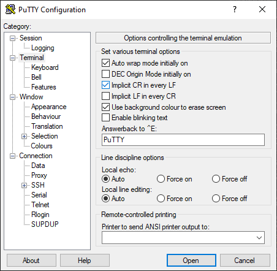 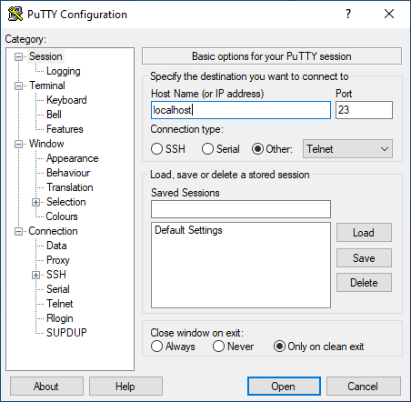
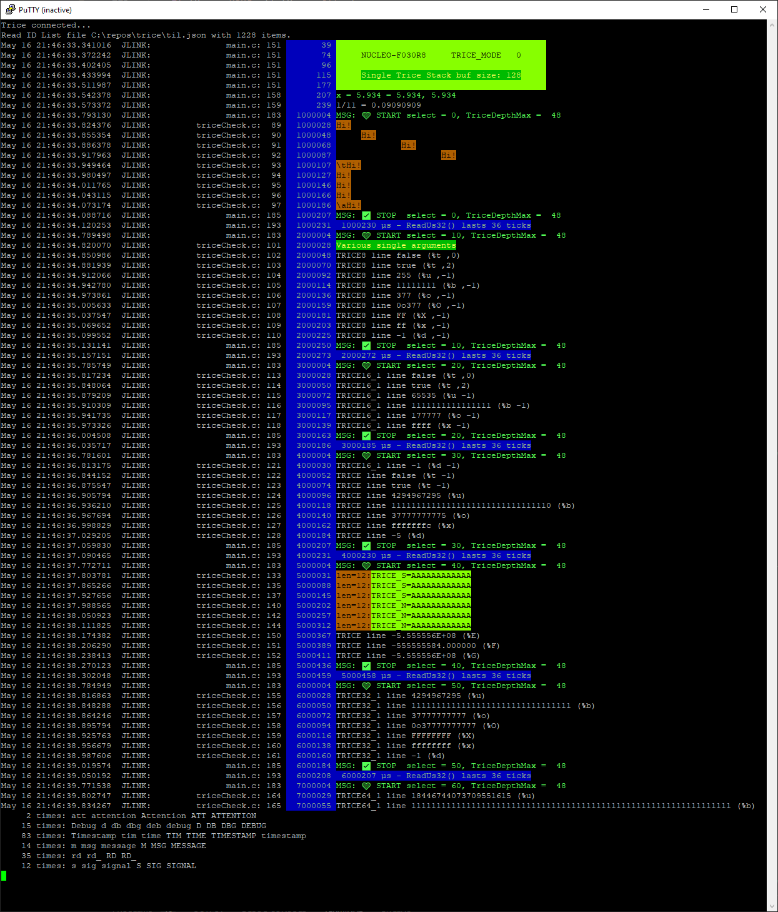

####  8.2.7. <a name='SetallIDsinadirectorytreeto0'></a>Set all IDs in a directory tree to 0

```bash
trice zeroSourceTreeIds -src ./ 
```

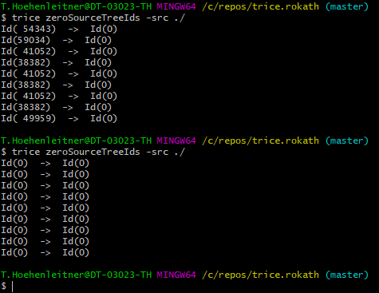

* Normally nobody uses that. But if you intend to integrate some existing sources into a project using [ID management](./TriceIDManagement.md) options, this could be a need.
* Calling `trice u` afterwards will assign new IDs, but calling `trice u -shared IDs` will assign the same IDs again.

####  8.2.8. <a name='StimulatetargetwithausercommandoverUART'></a>Stimulate target with a user command over UART

Sometimes it is handy to stimulate the target during development. For that a 2nd screen is helpful what is possible using the display server option:

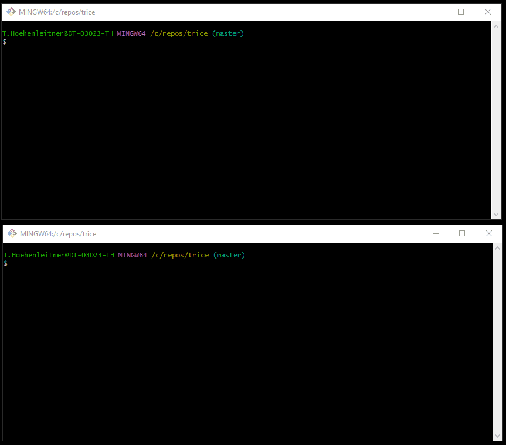

####  8.2.9. <a name='Explporeandmodifychannelsandtheircolors'></a>Explpore and modify channels and their colors

See file [./TriceColor.md](./TriceColor.md)

####  8.2.10. <a name='LocationInformation'></a>Location Information

When running  `trice update`, a file `li.json` is created, what you can control with the `-locationInformation` switch. During logging, when `li.json` is found, automatically the filename and line number is displayed in front of each log line, controllable with the `-liFmt` switch. This information is correct only with the right version of the `li.json` file. That is usually the case on the PC during development. Out in the field only the `til.json` reference is of importance. It serves an an accumulator of all firmware versions and usually the latest version of this file is the best fit. The `li.json` file should stay with the software developer only and needs no version control in the usual case because it is rebuild with each compilation, when `trice u` is a prebuild step.

<p align="right">(<a href="#top">back to top</a>)</p>

##  9. <a name='Additionalhints'></a>Additional hints

###  9.1. <a name='Pre-builtexecutablesareavailable'></a>Pre-built executables are available

See [https://github.com/rokath/trice/releases](https://github.com/rokath/trice/releases).
###  9.2. <a name='ConfigurationfiletriceConfig.h'></a>Configuration file `triceConfig.h`

* When setting up your first project you need a `triceConfig.h` file.
* You should **not** use the `./pkg/src/inc/triceConfig.h` because it is customized for internal tests with CGO.
* Please choose one of the `./test/.../triceConfig.h` files as starting point.
* Comparing them and understandig the differences helps quick starting.

###  9.3. <a name='Settinguptheveryfirstconnection'></a>Setting up the very first connection

If you see nothing in the beginning, what is normally ;-), add the `-s` (`-showInputBytes`) switch to see if any data arrive. There is also a switch `-debug` showing you the received packages, if you are interested in.

###  9.4. <a name='Avoidbufferoverruns'></a>Avoid buffer overruns

It is your responsibility to produce less data than transmittable. If this is not guarantied a data loss is not avoidable or you have to slow down the program. The double buffer as fastest solution has no overflow check. My recommendation: Make the buffer big and emit the maxDepth cyclically, every 10 or 1000 seconds. Then you know the needed size. It is influenced by the max trice burst and the buffer switch interval.

If the target application produces more *Trice* data than transmittable, a buffer overrun can let the target crash, because for performance reasons no overflow check is implemented in the double buffer. Also if such a check is added, the *Trice* code can only throw data away in such case.

It is planned to make the code secure against buffer overruns in the future. But anyway data losses will occur when producing more data than transmittable.
That is detectable with the cycle counter. The internal 8-bit cycle counter is usually enabled. If *Trice* data are lost, the receiver side will detect that because the cycle counter is not as expected. There is a chance of 1/256 that the detection does not work. You can check the detection by unplugging the trice UART cable for a time. Also resetting the target during transmission should display a cycle error.


###  9.5. <a name='LimitationtriceurequiresTRICEmacrosonasingleline'></a>Limitation "trice u" requires TRICE macros on a single line

* The implemented parser (currently) does not support `TRICE` macros over several source code lines. Each `TRICE` macro needs to be completely on one line.
* It is possible to have several (complete) `TRICE` macros on one source code line.

###  9.6. <a name='LimitationTRICEinTRICEnotpossible'></a>Limitation TRICE in TRICE not possible

* No-Good Example:

```C
int f0( void ){ TRICE( "msg:f0\n"); return 0; }
void f1( void ){ TRICE( "No; %d", f0() ); }
```

* This will compile normally but corrupt TRICE output.

The reason is: When f1() gets active, the "No" *Trice* header is created, than the f0() *Trice* is executed and afterwards the "No" *Trice* tail is written. This works well during compile time but causes a mismatch during runtime.

* Good Workaround:

```C
int f0( void ){ TRICE( "msg:f0\n"); return 0; }
void f1( void ){ int x = f0(); TRICE( "Yes: %d", x ); }
```

###  9.7. <a name='DynamicstringsbuffersonlyasvariableinsideTRICEmacros'></a>Dynamic strings/buffers only as variable inside `TRICE` macros

* No-Good Example:

```C
void f0( void ){ TRICE_S( "msg:%s\n", "Hello" ); } // will not work
```

* Possible, but not recommended Workaround:

```C
void f0( void ){ const char* s = "Hello"; TRICE_S( "msg:%s\n", s ); } // works, but ineffective
```

The above code line causes the string "Hello" to be transferred bytewise. One can rewrite it to much more effective and smaller code:

```C
void f0( void ){ TRICE( "msg:Hello\n" ); }
```

By the way, string concatenation within TRICE macros is untested and expected not to work. The reason lays inside the way the update tool works (right now):

```C
void f0( void ){ TRICE( "msg:" ## "Hello\n" ); } // ERROR!
```

**Usage intention and recommendation:** (given by @escherstair)

```C
char dynamic_string[50];
fillDynamicStringFromSomewhere(dynamic_string);   /* the content of dynamic_string is filled at run time */
TRICE_S( "msg:This part of the string is known at compile time. This part is dynamic: %s\n", dynamic_string);
```
All the string literals (i.e. compile-time known strings) should be put inside the format string.
Only the dynamic strings should be used as variables in TRICE_S macro.

###  9.8. <a name='Logfileviewing'></a>Logfile viewing

Logfiles, **trice** tool generated with sub-command switch `-color off`, are normal ASCII files. If they are with color codes, these are ANSI escape sequences.

* Simply `cat trice.log`. One view option is also `less -R trice.log`. The Linux command `less` is also available inside the windows git bash.
* Under Windows one could also download and use [ansifilter](https://sourceforge.net/projects/ansifilter/) for logfile viewing. A monospaced font is recommended.
* See also [Color issues under Windows](./TriceColor.md#color-issues-under-windows)

###  9.9. <a name='Usingthetricetoolwith3rdpartytools'></a>Using the `trice` tool with 3rd party tools

Parallel output as logfile, TCP or binary logfile is possible. See examples above.

###  9.10. <a name='Severaltargetsatthesametime'></a>Several targets at the same time

You can connect each target over its transmit channel with an own **trice** instance and integrate all transmissions line by line in an additional **trice** instance acting as display server. See [https://github.com/rokath/trice#display-server-option](https://github.com/rokath/trice#display-server-option).

###  9.11. <a name='Executinggotest-race-count100....'></a>Executing `go test -race -count 100 ./...`

The C-code is executed during some tests. Prerequisite is a installed GCC.

###  9.12. <a name='DirectTRICEOutTRICE_MODE0couldcausestackoverflowwith-o0optimization'></a>Direct TRICE Out (TRICE_MODE 0) could cause stack overflow with -o0 optimization

As discussed in [issue #294](https://github.com/rokath/trice/issues/294) it can happen, that several TRICE macros within one function call increase the stack usage more than expected, when compiler optimization is totally switched off.

<p align="right">(<a href="#top">back to top</a>)</p>

##  10. <a name='TargetsideTriceOn-Off'></a>Target side *Trice* On-Off

* If your code works well after checking, you can add `#define TRICE_OFF` just before the `#include "trice.h"` line and no *trice* code is generated anymore for that file, so no need to delete or comment out `TRICE` macros: : 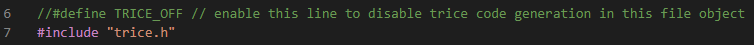
* No runtime On-Off switch is implemented for  several reasons:
  * Would need a control channel to the target.
  * Would add little performance and code overhead.
  * Would sligtly change target timing (testing).
  * User can add its own switches anywhere.
  * The short `TRICE` macro code is negligible.
  * The trice output is encryptable, if needed.
* Because of the low *Trice* bandwidth needs and to keep the target code as clear as possible the runtime On-Off decision should be done by the **trice** tool.
* See also issue [#243](https://github.com/rokath/trice/issues/243).

<p align="right">(<a href="#top">back to top</a>)</p>

##  11. <a name='HostsideTriceOn-Off'></a>Host side *Trice* On-Off

* The PC **trice** tool offers command line switches to `-pick` or `-ban` for *trice* channels and will be extended with display switches.
* A **trice** tool logLevel switch is usable too (Issue [#236](https://github.com/rokath/trice/issues/236)).

<p align="right">(<a href="#top">back to top</a>)</p>

##  12. <a name='Usingadifferentencoding'></a>Using a different encoding

It is possible to exchange the code behind the `TRICE` macros with a different encoding and to add an appropriate decoder to the **trice** tool.
The ID assignment is adjustable with `-IDMin` and `-IDMax`.

<!--

<p align="right">(<a href="#top">back to top</a>)</p>

//##  14. <a name='Sub-commandcheckNotimplemented'></a>Sub-command `check` (Not implemented!)

* `trice check` will check the JSON list and emit all TRICE statements inside the list once with a dataset.

//###  14.1. <a name='checkswitch-datasetNotimplemented'></a>`check` switch '-dataset' (Not implemented!)

* This is a `string` switch. It has one parameter. Its default value is `position`. That means each parameter has a different value. This is useful for testing.
* The `negative` value is uses a dataset with negative values for testing.
* Running `trice check` should show your message, indicating everything is fine so far.
-->

##  13. <a name='Testing'></a>Testing


###  13.1. <a name='Folderinformation'></a>Folder information

- The folders here, despite `testdata`, are helper "projects" for testing the target C-code located in `trice/src/`.
- Some folders are hardware specific implementations and some are Go packages. The Go packages can have all the same name, only the folder names are not equal.
- In each Go package a different triceConfig.h is used, this way allowing to check all modes automatically, including encryption.
- The file `./testdata/triceCheck.c.txt` is the master test pattern for all CGO tests and edited manually. It has the extension `.txt` to avoid accidentally modification by the `trice u` command.
- After editing and before executing the tests, `./updateTestData.sh` needs to be executed. It copies into `./testdate/generated_triceCheck.c`, and a `trice u -src triceCheck.c` is needed. Than the modified `./testdata/generated_triceCheck.c` is compiled into the test executables in the `./cgo_*` folders.
- The file `./testdata/generated_triceCheck.c` is copied into the memory filesystem and used there to extract the expected results (//exp: comments).
- The fresh `./testdata/til.json` is used inside the memory filesystem during the tests.
- They execute `cgo.TriceCheck(i)` this way activating the target code which writes into a buffer. The buffer is copied into a FILEBUFFER inside the memory file system and the trice tool is reading it.


- In a post-compile step a `trice z` should restore the `triceCheck.c` unmodified state to be identical to `./testdata/triceCheck_EditThisFile_NotTheTriceCheckDotC.txt`.
- Unfortunately this has to be done on the os filesystem.

###  13.2. <a name='Packagespecificinformation'></a>Package specific information

- Each C function gets a Go wrapper which ist tested in appropriate test functions.
- For some reason inside the trice_test.go an 'import "C"' is not possible.
- All C-files in the packages folder referring to the trice sources this way avoiding code duplication.
- The Go functions defined in the packages are not exported. They are called by the Go test functions in this package.
- This way the package test functions are executing the trice C-code compiled with the triceConfig.h there.

###  13.3. <a name='todo'></a>todo

- repair cgo0_tcobs
- repair cgo1_tcobs
- cgo2_tcobs: ref_cobs.c_?
- Parse "C:\repos\trice\cgo\test\cgo2_tcobs\triceCheck.c" and complete TestTriceCheck

<p align="right">(<a href="#top">back to top</a>)</p>

##  14. <a name='Tricedemotestprojectinfo'></a>Trice demo & test project info

Many demo projects are ARMKeil IDE STM32 here but the TRICE tool is easy adaptable to 8 - 64-bit architectures.

###  14.1. <a name='Backupfolder'></a>Backup folder

- This folder contains unmaintained legacy test projects.
- They are only for reference and need some corrections to work with the current release.
- See also [../docs/TestExamples.md](../docs/TestExamples.md)

###  14.2. <a name='Terminalinfo'></a>Terminal info

- Open an escape sequence capable terminal in trice root `C:\repos\trice\`opr where you put it.
  - Any directory will do as well but the `til.json` file needs to be found.
  - git-bash will do or also windows-terminal from Microsoft store.
    - Under Windows the DOS or powershell could have display issues with the escaped ASCII codes. Search the internet for answers.

###  14.3. <a name='RTTinfo'></a>RTT info

- The example projects support both, RTT and UART just for demonstration.
- RTT = Real Time Transfer is a technique developed by SEGGER for background memory access during processor runtime. This is possible for ARM cores over the JTAG or SWD interface if a debug probe is connected.
- Some STM development boards contain a debug probe you can use for the board itself or for another board.
- These are so called on-board ST-LINK debug probes. To use RTT use the `-p STLINK` switch.
  - `stRttLogger.exe` and `libusb-1.0.dll` must be in the PATH.
- You can also flash the on-board debug probe with J-LINK firmware. To use RTT use the `-p JLINK` switch.
  - `JLinkRTTLogger.exe` and `JLinkARM.dll` must be in the PATH.

###  14.4. <a name='UART'></a>UART

- The default baud rate is 115200 for all test projects and the trice tool assumes that baud rate automatically. Use the trice tool `-baud` switch for other settings.

###  14.5. <a name='MDK-ARMprojects'></a>MDK-ARM projects

The projects are generated with necessary library files *as reference* to keep them smaller. Therefore, the direct compilation will fail, probably. Projects should compile if you follow these steps:

- Install latest ARMKeil IDE.
  - STM32 M0 cores with up to 32 KB FLASH memory are usable directly.
  - You can get a free ST Microelectronics license with a 256 KB FLASH limitation.
- Install latest STM32CubeMX with the latest target firmware library.
  - It is free of charge.
- Open the project ioc file with STM32CubeMX and re-generate.
- Open the project with ARMKeil IDE and build.

<!-- ###  16.6. <a name='Details'></a>Details


- [MDK-ARM_LL_generatedDemo_STM32F030R8-NUCLEO-64\ReadMe.md](MDK-ARM_LL_generatedDemo_STM32F030R8-NUCLEO-64\ReadMe.md)
- [MDK-ARM_LL_UART_RTT0_BARE_STM32F030R8-NUCLEO-64/ReadMe.md](MDK-ARM_LL_UART_RTT0_BARE_STM32F030R8-NUCLEO-64/ReadMe.md)
- [MDK-ARM_LL_UART_RTT0_BARE_STM32F070RB_NUCLEO-64/ReadMe.md](MDK-ARM_LL_UART_RTT0_BARE_STM32F070RB_NUCLEO-64/ReadMe.md)
- [MDK-ARM_LL_UART_RTT0_BARE_STM32F091_NUCLEO-64/ReadMe.md](MDK-ARM_LL_UART_RTT0_BARE_STM32F091_NUCLEO-64/ReadMe.md)
- [MDK-ARM_LL_UART_RTT0_ESC_STM32F030R8_NUCLEO-64/ReadMe.md](MDK-ARM_LL_UART_RTT0_ESC_STM32F030R8_NUCLEO-64/ReadMe.md)
- [MDK-ARM_LL_UART_RTT0_ESC_STM32F070RB_NUCLEO-64/ReadMe.md](MDK-ARM_LL_UART_RTT0_ESC_STM32F070RB_NUCLEO-64/ReadMe.md)
- [MDK-ARM_LL_UART_RTT0_WRAP_STM32F030R8-NUCLEO-64/ReadMe.md](MDK-ARM_LL_UART_RTT0_WRAP_STM32F030R8-NUCLEO-64/ReadMe.md)
- [MDK-ARM_RTT0_BARE_STM32F0308-DISCO/ReadMe.md](MDK-ARM_RTT0_BARE_STM32F0308-DISCO/ReadMe.md)
- [MDK-ARM_RTT0_BARE_STM32F03051R8Tx-DISCOVERY/ReadMe.md](MDK-ARM_RTT0_BARE_STM32F03051R8Tx-DISCOVERY/ReadMe.md)
- [MDK-ARM_RTT0_BARE_STM32F03051R8Tx-DISCOVERY/ReadMe.md](MDK-ARM_RTT0_BARE_STM32F03051R8Tx-DISCOVERY/ReadMe.md)
- [MDK-ARM_LL_UART_WRAP_RTT0_BARE_STM32F030R8-NUCLEO-64/ReadMe.md](MDK-ARM_LL_UART_WRAP_RTT0_BARE_STM32F030R8-NUCLEO-64/ReadMe.md)

-->- [*Trice* user guide](#trice-user-guide)
- [*Trice* user guide](#trice-user-guide)
  - [1. Project structure](#1-project-structure)
  - [2. Get started](#2-get-started)
    - [2.1. Get it](#21-get-it)
    - [2.2. Install It](#22-install-it)
    - [2.3. Use It](#23-use-it)
    - [2.4. Port it](#24-port-it)
      - [2.4.1. Target Code Overview](#241-target-code-overview)
  - [3. Build `trice` tool from Go sources (you can skip that)](#3-build-trice-tool-from-go-sources-you-can-skip-that)
  - [4.  Embedded system code configuratio](#4--embedded-system-code-configuratio)
  - [5. `trice` tool in logging action](#5-trice-tool-in-logging-action)
  - [6. Encryption](#6-encryption)
  - [7. CLI Options for `trice` tool](#7-cli-options-for-trice-tool)
  - [8. *Trice* command line examples](#8-trice-command-line-examples)
    - [8.1. Common information](#81-common-information)
    - [8.2. Further examples](#82-further-examples)
      - [8.2.1. Automated pre-build update command example](#821-automated-pre-build-update-command-example)
      - [8.2.2. Some Log examples](#822-some-log-examples)
      - [8.2.3. Logging over a display server](#823-logging-over-a-display-server)
      - [8.2.4. Logfile output](#824-logfile-output)
      - [8.2.5. Binary Logfile](#825-binary-logfile)
      - [8.2.6. TCP output](#826-tcp-output)
      - [8.2.7. Set all IDs in a directory tree to 0](#827-set-all-ids-in-a-directory-tree-to-0)
      - [8.2.8. Stimulate target with a user command over UART](#828-stimulate-target-with-a-user-command-over-uart)
      - [8.2.9. Explpore and modify channels and their colors](#829-explpore-and-modify-channels-and-their-colors)
      - [8.2.10. Location Information](#8210-location-information)
  - [9. Additional hints](#9-additional-hints)
    - [9.1. Pre-built executables are available](#91-pre-built-executables-are-available)
    - [9.2. Configuration file `triceConfig.h`](#92-configuration-file-triceconfigh)
    - [9.3. Setting up the very first connection](#93-setting-up-the-very-first-connection)
    - [9.4. Avoid buffer overruns](#94-avoid-buffer-overruns)
    - [9.5. Limitation "trice u" requires TRICE macros on a single line](#95-limitation-trice-u-requires-trice-macros-on-a-single-line)
    - [9.6. Limitation TRICE in TRICE not possible](#96-limitation-trice-in-trice-not-possible)
    - [9.7. Dynamic strings/buffers only as variable inside `TRICE` macros](#97-dynamic-stringsbuffers-only-as-variable-inside-trice-macros)
    - [9.8. Logfile viewing](#98-logfile-viewing)
    - [9.9. Using the `trice` tool with 3rd party tools](#99-using-the-trice-tool-with-3rd-party-tools)
    - [9.10. Several targets at the same time](#910-several-targets-at-the-same-time)
    - [9.11. Executing `go test -race -count 100 ./...`](#911-executing-go-test--race--count-100-)
    - [9.12. Direct TRICE Out (TRICE\_MODE 0) could cause stack overflow with -o0 optimization](#912-direct-trice-out-trice_mode-0-could-cause-stack-overflow-with--o0-optimization)
  - [10. Target side *Trice* On-Off](#10-target-side-trice-on-off)
  - [11. Host side *Trice* On-Off](#11-host-side-trice-on-off)
  - [12. Using a different encoding](#12-using-a-different-encoding)
  - [13. Testing](#13-testing)
    - [13.1. Folder information](#131-folder-information)
    - [13.2. Package specific information](#132-package-specific-information)
    - [13.3. todo](#133-todo)
  - [14. Trice demo \& test project info](#14-trice-demo--test-project-info)
    - [14.1. Backup folder](#141-backup-folder)
    - [14.2. Terminal info](#142-terminal-info)
    - [14.3. RTT info](#143-rtt-info)
    - [14.4. UART](#144-uart)
    - [14.5. MDK-ARM projects](#145-mdk-arm-projects)
  - [15. Further info](#15-further-info)
  - [16. Third party Software](#16-third-party-software)
  - [17. alacritty](#17-alacritty)
    - [17.1. goST](#171-gost)
    - [17.2. keil.com](#172-keilcom)
    - [17.3. segger.com](#173-seggercom)
      - [17.3.1. SEGGER downloaded Software](#1731-segger-downloaded-software)
      - [17.3.2. JLink](#1732-jlink)
      - [17.3.3. SEGGER\_RTT](#1733-segger_rtt)
      - [17.3.4. STLinkReflash\_190812.zip](#1734-stlinkreflash_190812zip)
  - [18. st.com](#18-stcom)
  - [19. *Trice*  Version 1.0 Specification (Draft)](#19-trice--version-10-specification-draft)
  - [20.  Trice User Interface - Quick Start](#20--trice-user-interface---quick-start)
      - [20.1. User Code Adaption](#201-user-code-adaption)
      - [20.2. Limitations](#202-limitations)
      - [20.3. Trice (Time) Stamps](#203-trice-time-stamps)
      - [20.4. Trice Parameter Bit Widths](#204-trice-parameter-bit-widths)
    - [20.1. Trice Binary Data Format](#201-trice-binary-data-format)
      - [20.1.1. Framing](#2011-framing)
      - [20.1.2. Optional XTEA Encryption](#2012-optional-xtea-encryption)
      - [20.1.3. Endianness](#2013-endianness)
      - [20.1.4. `TRICE` (Time)Stamps](#2014-trice-timestamps)
      - [20.1.5. Binary Encoding](#2015-binary-encoding)
        - [2.5.1. Symbols](#251-symbols)
        - [2.5.2. Package Format](#252-package-format)
    - [20.2. Trice Decoding](#202-trice-decoding)
      - [20.2.1. *Trice* ID list `til.json`](#2021-trice-id-list-tiljson)
      - [20.2.2. *Trice* location information file `li.json`](#2022-trice-location-information-file-lijson)
    - [20.3. *Trice* ID Numbers](#203-trice-id-numbers)
      - [20.3.1. ID number selection](#2031-id-number-selection)
      - [20.3.2. ID number usage and stability](#2032-id-number-usage-and-stability)
      - [20.3.3. *Trice* ID 0](#2033-trice-id-0)
    - [20.4. Trice ID management](#204-trice-id-management)
      - [20.4.1. The `trice update` algorithm](#2041-the-trice-update-algorithm)
        - [5.1.1. Starting Conditions](#511-starting-conditions)
        - [5.1.2. Aims](#512-aims)
        - [5.1.3. Method](#513-method)
      - [20.4.2. User Code Patching (`trice update`)](#2042-user-code-patching-trice-update)
        - [5.2.1. User Code Patching Examples](#521-user-code-patching-examples)
      - [20.4.3. User Code Un-Patching](#2043-user-code-un-patching)
      - [20.4.4. ID Usage Options](#2044-id-usage-options)
      - [20.4.5. General ID Management Information](#2045-general-id-management-information)
      - [20.4.6. Option 1: Let the inserted Trice ID be a Part of the User Code](#2046-option-1-let-the-inserted-trice-id-be-a-part-of-the-user-code)
      - [20.4.7. Option 2: Un-patching in a Post-build process](#2047-option-2-un-patching-in-a-post-build-process)
      - [20.4.8. Option 3: Un-patching on Repository Check-In](#2048-option-3-un-patching-on-repository-check-in)
    - [20.5. Changelog](#205-changelog)

<p align="right">(<a href="#top">back to top</a>)</p>

##  15. <a name='Furtherinfo'></a>Further info

<p align="right">(<a href="#top">back to top</a>)</p>

##  16. <a name='ThirdpartySoftware'></a>Third party Software

<p align="right">(<a href="#top">back to top</a>)</p>

##  17. <a name='alacritty'></a>alacritty

- A fast, cross-platform, OpenGL terminal emulator

###  17.1. <a name='goST'></a>goST

- see Segger RTT over STLINK

###  17.2. <a name='keil.com'></a>keil.com

- Tooling info

<!--- ## microchip.com

- Planned 8 bit example

-->

<!--- ### nxp.com

- Planned NXP example

-->

###  17.3. <a name='segger.com'></a>segger.com

- Tooling around Segger RTT, Download latest version from SEGGER web site.

####  17.3.1. <a name='SEGGERdownloadedSoftware'></a>SEGGER downloaded Software

- Check in the Internet for newer versions.

####  17.3.2. <a name='JLink'></a>JLink

- Download and install [J-LinkSoftwareAndDocumentationPack](https://www.segger.com/downloads/jlink/#J-LinkSoftwareAndDocumentationPack) or simply use `JLinkRTTLogger.exe` and accompanying `JLinkARM.dll` copied from default install location `C:\Program Files (x86)\SEGGER\JLink`. Both files are inside `JLinkRTTLogger.zip` You need to put to a location in \$PATH or extend \$PATH.

####  17.3.3. <a name='SEGGER_RTT'></a>SEGGER_RTT

- Target code is expected inside SEGGER_RTT. This is the extracted SEGGER_RTT_V....zip.
- Optionally check for a newer version.

####  17.3.4. <a name='STLinkReflash_190812.zip'></a>STLinkReflash_190812.zip

- Tool for exchanging ST-LINK and J-LINK software on STM32 evaluation boards.
  - Works not for v3 Hardware but well for v2 Hardware.
  - In case of not accepting the ST-Link firmware use [../st.com/en.stsw-link007_V2-37-26.zip](../st.com/en.stsw-link007_V2-37-26.zip) for updating the ST-Link firmware first. It could be you need to exchange the ST-Link firmware variant into the variant with mass storage.

<p align="right">(<a href="#top">back to top</a>)</p>

##  18. <a name='st.com'></a>st.com

- STMicroelectronics

<p align="right">(<a href="#top">back to top</a>)</p>


##  19. <a name='TriceVersion1.0SpecificationDraft'></a>*Trice*  Version 1.0 Specification (Draft)

<!-- 🟢✅🟡⛔🔴🔵💧❓↩෴⚓🛑❗🌡⏱∑✳‼♦♣🚫⚠🎥📷🌊🆘🧷🐢➡☕ -->

##  20. <a name='TriceUserInterface-QuickStart'></a> Trice User Interface - Quick Start

####  20.1. <a name='UserCodeAdaption'></a>User Code Adaption

- Replace all strings `puts` with the string `trice`.
- Replace all strings `printf` with the string `trice`.
- Check for float and double format specifiers in the format strings. The appropriate parameters need to be covered with `aFloat()` or `a double()`. Example:

    ```c
    printf( "%d, %3.2f EUR, %g rate\n", i, price, change );
    ```

    ```c
    trice64( "%d, %3.2f EUR, %g rate\n", i, aFloat(price), aDouble(change) ); 
    ```

  - Because double needs 8 bytes the trice macro in this case needs to be trice64 (see [1.4. Trice Parameter Bit Widths](#14-trice-parameter-bit-widths)).

- Check for string format specifiers in the format strings. Put each in a separate trice message. Example:

    ```c
    printf( "name: %16s, surname: %32s, birthday: %4u-%02u-%02u\n", n, s, y, m, d);
    ```

    ```c
    trice( "name: %16s, ", n); trice( "surname: %32s, ", s ); trice( "birthday: %4u-%02u-%02u\n" y, m, d);
    ```

- Optionally add channel specifiers to get color. Example:

    ```c
    puts( "A message");
    ```

    ```c
   trice( "msg:A message");
    ```

- Add `#include trice.h` to all user files using trice.

####  20.2. <a name='Limitations'></a>Limitations

- The maximum parameter count per trice is 12.
- Each trice must fit into a single line.
  - Not ok:

    ```c
    trice( "hello %u\n", 
            year);
    ```

- But several trices can be in one line.
  - Ok:

    ```c
    trice( "hello %u\n", year); trice( "good time");
    ```

- Strings directly as parameter are forbidden.
  - Not ok:

    ```c
    trice( "hello %s\n", "world" );
    ```

  - Ok:

    ```c
    s = "world"; trice( "hello %s\n", s );
    #define WORLD "world"
    trice( "hello %s\n", WORLD );
    ```

- Excluded trices are seen by the trice update process.
  - Example: The following code will be patched and get an id as well:

    ```c
    // trice( "Hi!" );
    ```

- All parameters inside one trice have the same bit width. If for example there are a single double and 10 bytes values, the needed trice macro is `trice64` providing 8 bytes space for all parameter values, therefore increasing the transmit overhead, but this can be handled by splitting into 2 trices:

  ```C
  // 92 bytes: 4 bytes header plus 11 times 8 bytes
  trice64( "%g: %c%c%c%c%c%c%c%c%c%c", aDouble(3.14159), 61, 62, 63, 64, 65, 66, 67, 68, 69, 10 );
  
  // 24 bytes: 4 bytes header plus 1 times 8 bytes plus 4 bytes header plus 8 times 1 byte
  trice64( "%g: ", aDouble(3.14159)); trice8( "%c%c%c%c%c%c%c%c%c%c", 61, 62, 63, 64, 65, 66, 67, 68, 69, 10 );
  ```

####  20.3. <a name='TriceTimeStamps'></a>Trice (Time) Stamps

- Trice messages can have no or 16-bit or 32-bit (time) stamps.
  - recommended (function calling) syntax:

      ```c
      trice( "hello %u\n", year); // no (time) stamp
      Trice( "hello %u\n", year); // 16-bit (time) stamp
      TRice( "hello %u\n", year); // 32-bit (time) stamp
      ```

  - legacy (inlining) syntax:

      ```c
      TRICE( id(0), "hello %u\n", year); // no (time) stamp
      TRICE( Id(0), "hello %u\n", year); // 16-bit (time) stamp
      TRICE( ID(0), "hello %u\n", year); // 32-bit (time) stamp
      ```

- The user is asked to implement these 2 functions

  ```c
  #if 1 // us timestamps

  // 16-bit us stamp, wraps after 10 milliseconds
  uint16_t TriceStamp16( void ){
      return Us16();
  }

  // 32-bit us stamp, wraps after 71,58 seconds
  uint32_t TriceStamp32( void ){
      return Us64();
  }

  #else // ms timestamps

  // 16-bit ms stamp, wraps after 10 seconds 
  uint16_t TriceStamp16( void ){ 
      return ms16;
  }

  // 32-bit ms stamp, wraps after 49,71 days
  uint32_t TriceStamp32( void ){
      return ms32;
  }
  #endif
  ```

- Check the example Implementation on a 48 MHz clocked MCU in `C:\repos\trice\test\MDK-ARM_STM32F030R8` for details.
  - Counting the 16-bit part separately allows to avoid the `%` operator usage, which would imply a costly division.
- Using different timestamp bit width parallel allows to reduce the transmitted data size.
- Example showing one trice without, six with 16-bit and two with 32-bit (time)stamps:

  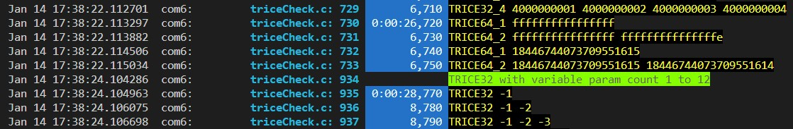

- Check the trice tool `ts` CLI switch to make life easy.
- It is also possible to use the (time) stamp option not for timestamps but for any values, like addresses or a voltage.

####  20.4. <a name='TriceParameterBitWidths'></a>Trice Parameter Bit Widths

- The macros `trice`, `Trice`, `TRice` and `TRICE` use 32-bit parameter values per default. See `TRICE_DEFAULT_PARAMETER_BIT_WIDTH` inside `triceConfig.h` to change that.
- If for example the bit width of all trice parameters is 8-bit, it is writable as trice8 macro, reducing the transmitted byte count per parameter from 4 to 1:

  ```C
  char b[8] = {1,2,3,4,5,6,7,8};

  // 36 bytes: 4 bytes plus 32 (8 times 4) bytes payload 
  trice( "%02x %02x %02x %02x %02x %02x %02x %02x\n", b[0], b[1], b[2], b[3], b[4], b[5], b[6], b[7]);`

  // 12 bytes: 4 bytes plus 8 (8 times 1) bytes payload 
  trice8( " %02x %02x %02x %02x %02x %02x %02x %02x\n", b[0], b[1], b[2], b[3], b[4], b[5], b[6], b[7]);`

  // 16 bytes: 4 bytes plus 8 (8 times 1) bytes payload in short notation plus 4 bytes
  TRICE8_B( id( 6468), " %02x ", &b, sizeof(b) ); TRICE( id( 2822), "\n" );
  ```

<p align="right">(<a href="#top">back to top</a>)</p>

###  20.1. <a name='TriceBinaryDataFormat'></a>Trice Binary Data Format

####  20.1.1. <a name='Framing'></a>Framing

- *Trice* messages are framed binary data, if framing is not disabled.
- Framing is important for data disruption cases and is done with [TCOBS](./TCOBSSpecification.md) (has included data reduction) but the user can force to use [COBS](https://github.com/rokath/COBS), what makes it easier to write an own decoder in some cases or disable framing at all. 
  - Change the setting `TRICE_FRAMING` inside `triceConfig.h` and use the **trice** tool `-packageFraming` switch accordingly.
- For robustness each *Trice* gets its own (T)COBS package per default. That is changeable for transfer data reduction. Use `#define TRICE_TRANSFER_MODE TRICE_PACK_MULTI_MODE.` inside `triceConfig.h`. This allows to reduce the data size a bit by avoiding many 0-delimiter bytes but results in some more data loss in case of data disruptions.

####  20.1.2. <a name='OptionalXTEAEncryption'></a>Optional XTEA Encryption

- If XTEA is used, the encrypted packages have a multiple-of-8 byte length containing 1-7 padding bytes.
- The optional decryption is the next step after unpacking a data frame.
- Enabling XTEA, automatically switches to COBS framing. There is no need to use the **trice** tool `-packageFraming` switch in that case because the **trice** tool, when getting the CLI switch `-password "phrase"` automatically assumes COBS encoded data, overwriting the default value for `-packageFraming`.

####  20.1.3. <a name='Endianness'></a>Endianness

- To interpret a decoded package, it´s endianness needs to be known.
- For efficiency binary trice data are stored and transmitted in MCU endianness and the **trice** tool expects binary data in little endian format as most MCUs are little endian.
- On big endian MCUs the compiler switch `TRICE_MCU_IS_BIG_ENDIAN` needs to be defined and the **trice** tool has a CLI switch "triceEndianness" which needs to be set to "bigEndian" then.
- If trice transmit data are needed to be not in MCU order for some reason, the macro `TRICE_TRANSFER_ORDER_IS_NOT_MCU_ENDIAN` is needed. This increases the critical trice storage time and target code amount.

####  20.1.4. <a name='TRICETimeStamps'></a>`TRICE` (Time)Stamps

- Each *Trice* message can carry stamp bits, which are free usable like for time, addressing or filtering.
- By selecting the letter case you decide for each single *Trice* macro about the stamp size.
- Default notation (function call):

  | notation              | stamp size | remark |
  | -                     | -          | -      |
  | `trice( "...", ...);` | 0-bit      | no stamp at all, shortest footprint |
  | `Trice( "...", ...);` | 16-bit     | calls internally `uint16_t TriceStamp16( void )` for trice message stamping |
  | `TRice( "...", ...);` | 32-bit     | calls internally `uint32_t TriceStamp32( void )` for trice message stamping |

- Legacy notation (code inlining):

  | notation                    | stamp size | remark |
  | -                           | -          | -      |
  | `TRICE( id(0), "...", ...)` | 0-bit      | no stamp at all, shortest footprint |
  | `TRICE( Id(0), "...", ...)` | 16-bit     | calls internally `uint16_t TriceStamp16( void )` for trice message stamping |
  | `TRICE( ID(0), "...", ...)` | 32-bit     | calls internally `uint32_t TriceStamp32( void )` for trice message stamping |

It is up to the user to provide the functions `TriceStamp16()` and/or `TriceStamp32()`. Normally they return a µs or ms tick count but any values are allowed.

####  20.1.5. <a name='BinaryEncoding'></a>Binary Encoding

#####  2.5.1. <a name='Symbols'></a>Symbols

| Symbol  | Meaning |
| :-:     | - | 
| `i`     | ID bit |
| `I`     | `iiiiiiii` = ID byte |
| `n`     | number bit |
| `s`     | selector bit
| `N`     | `snnnnnnnn` = 7-bit number byte |
| `c`     | cycle counter bit |
| `C`     | s==0 ? `cccccccc` : `nnnnnnnn` = cycle counter byte or number byte extension |
| `t`     | (time)stamp bit |
| `T`     | `tttttttt` = (time)stamp byte |
| `d`     | data bit |
| `D`     | `dddddddd` = data byte |
| `...`   | 0 to 32767 data bytes |
| `"..."` | format string |
| `x`     | unspecified bit |
| `X`     | =`xxxxxxxx` unspecified byte |

#####  2.5.2. <a name='PackageFormat'></a>Package Format

- All decoded frames of 0-, 1-, 2- and 3-byte size are considered as user data and ignored by the **trice** tool.

  | bytes                    | Comment                                                                                                       |
  | :-                       | -                                                                                                             |
  | ``                       | This is an empty package, which can have also a meaning. It is detectable by 2 consecutive 0-delimiter bytes. |
  | `X`                      | 1-byte message, reserved for extensions or user data                                                          |
  | `X` `X`                  | 2-byte message, reserved for extensions or user data                                                          |
  | `X` `X` `X`              | 3-byte message, reserved for extensions or user data                                                          |

- In decoded frames >= 4-byte the first 2 bytes are the 14-bit ID with 2 selector bits at the most significant position.
- The `0` selector is usable for any user encoding. The **trice** tool ignores such packages.

  | 16-bit groups            | Selector (2 msb)| Comment                                                 |
  | :-                       | :-:             | -                                                       |
  | `00xxxxxxX ...`          | 0               | >= 4-byte message, reserved for extensions or user data |
  | `01iiiiiiI NC  ...`      | 1               | >= 4-byte message, *Trice* format without     stamp     |
  | `10iiiiiiI TT NC ...`    | 2               | >= 4-byte message, *Trice* format with 16-bit stamp     |
  | `11iiiiiiI TT TT NC ...` | 3               | >= 4-byte message, *Trice* format with 32-bit stamp     |

<p align="right">(<a href="#top">back to top</a>)</p>

###  20.2. <a name='TriceDecoding'></a>Trice Decoding

The 14-bit IDs are used to display the log strings. These IDs are pointing in two reference files.

####  20.2.1. <a name='TriceIDlisttil.json'></a>*Trice* ID list `til.json`

- This file integrates all firmware variants and versions and is the key to display the message strings. With the latest version of this file all previous deployed firmware images are usable without the need to know the actual firmware version.
- The files `til.json.h`, `til.json.c` and the like are generated to help writing an own trice decoder tool in your preferred language. Use `trice u -v` for it. That can be interesting in environments, where Go compiled binaries not executable, like [PCs running QNX OS](https://github.com/rokath/trice/discussions/263#discussioncomment-4180692).

####  20.2.2. <a name='Tricelocationinformationfileli.json'></a>*Trice* location information file `li.json`

- If the generated `li.json` is available, the **trice** tool automatically displays file name and line number. But that is accurate only with the exact matching firmware version. That usually is the case right after compiling and of most interest at the developers table.
- The **trice** tool will silently not display location information, if the `li.json` file is not found. For in-field logging, the option `-showID string` could be used. This allows later an easy location of the relevant source code.
- An other option is to record the binary trice messages and to play them later with the **trice** tool using the correct `li.json`.

<p align="right">(<a href="#top">back to top</a>)</p>

###  20.3. <a name='TriceIDNumbers'></a>*Trice* ID Numbers
####  20.3.1. <a name='IDnumberselection'></a>ID number selection

- The default encoding TREX supports 14-bit IDs, so over 16000 IDs possible. Other encodings can work with other ID sizes.
- `trice("Hi!\n");` ➡ `trice u` ➡ `trice( 12345, "Hi!\n");` ➡ `trice z` ➡ `trice("Hi!\n");`
- The **ID** `12345` is a number assigned to `trice( "Hi!\n");` in the above example.
  - It is a so far unused number, according to rules you can control:
    - The `-IDMethod` switch allows a selection method for new IDs.
      - Per default new IDs determined randomly to keep the chance low, that several developers grab the same ID.
      - Example: `trice update -IDMin 1000 -IDMethod upward` will choose the smallest free ID >= 1000.
        - This allows to use the ID space without wholes.
    - The `-IDMin` and `-IDMax` switches are usable to control the ID range, a new ID is selected from, making it possible to divide the ID space. Each developer can gets it region.
      - Example: `trice update -IDMin 6000 -IDMax 6999` will choose new randomly IDs only between 6000 and 6999.
- In a future **trice** tool it can be possible to give each *trice* channel an **ID** range making it possible to implement *Trice* channel specific runtime on/off on the target side if that is needed. This could be interesting for routing purposes also.
  - To stay compatible with previous **trice** tool versions such implementation would use the `-args` switch, which then contains the relevant channels like `trice u -args "err:20:99,wrn:200:300"`. This needs to be specified in more detail, especially the error handling.

####  20.3.2. <a name='IDnumberusageandstability'></a>ID number usage and stability

- If you write `trice( "msg:%d", 1);` again on a 2nd location, the copy gets a different **ID**, because each *Trice* gets its own **ID**.
- If you change `trice( "msg:%d", 1);` to `trice8( "msg:%d", 1);`, to reduce the needed parameter space, a new **ID** is assigned. That is because the parameter bit width is implicit a part of the now changed *Trice*. If you change that back, the previous **ID** is assigned again.
- If you change `trice( "msg:%d", 1);` to `TRice8( "msg:%d", 1);`, to get a 32-bit stamp, the associated **ID** remains unchanged. That is because the optional stamp is not a part of the *Trice* itself.
- IDs stay constant and get only changed to solve conflicts.
- To make sure, a single ID will not be changed, you could change it manually to a hexadecimal syntax.
  - This lets the `trice update` command ignore such `TRICE` macros and therefore a full [til.json](../til.json) rebuild will not add them anymore. Generally this should not be done, because this could cause future bugs.
  - It is possible to assign an ID manually as decimal number. It will be added to the ID list automatically during the next `trice u` if no conflicts occur.
- If a *Trice* was deleted inside the source tree (or file removal) the appropriate ID stays inside the ID list.
- If the same string appears again this ID is active again.
- If a trice occurs more than one time, each occurrence gets a different ID. If then 2 of them disappear, their ID numbers stay in `til.json`. If then one of them comes back, it gets its ID back.

####  20.3.3. <a name='TriceID0'></a>*Trice* ID 0

- The trice ID 0 is a placeholder for "no ID", which is replaced automatically during the next `trice update` according to the used trice switches `-IDMethod`, `-IDMin` and `IDMax`.
  - It is sufficient to write the TRICE macros just without the `id(0),` `Id(0),` `ID(0),`. It will be inserted automatically according the `-stamp` switch.
- With `trice zeroSourceTreeIds` all IDs in the given source tree are set to 0. This gives the option afterwards to set-up a new `til.json` according to a different `-IDMethod`, `-IDMin` and `IDMax`.

###  20.4. <a name='TriceIDmanagement'></a>Trice ID management

####  20.4.1. <a name='Thetriceupdatealgorithm'></a>The `trice update` algorithm

#####  5.1.1. <a name='StartingConditions'></a>Starting Conditions

- Before `trice u` is executed on a source tree, the starting conditions are partially undefined:
  - A trice ID list file `til.json` file must exist, but it is allowed to be empty.
    - The `til.json` is a serialized key-value map, where
      - the keys are the IDs i and
      - the values are *Trice* format string structs (bit width plus format string) named f.
      - This ID look-up is the key-value map `ilu TriceIDLookUp` a `map[TriceID]TriceFmt`
        - each ID i as key, points to one and only one f.
        - The TriceFmt structs contain the parameter width and the format string.
      - The ilu is reverted then into `flu triceFmtLookUp` a map[TriceFmt]TriceIDs.
        - `TriceIDs` is a triceID slice because the identical f can have several ids (no shared IDs).
        - The format struct f look-up map flu is used internally for faster access and always in sync with ilu.
    - ilu and flu together are named lu.
  - A  location information file `li.json` may exist or not.
    - The `li.json` is a serialized key-value map `li TriceIDLookUpLI` a `map[TriceID]TriceLI` where
      - the keys are the IDs i and
      - the values are the location information (filename, line and position) structs.
    - Each ID as key points to one and only one li.

- The `til.json` IDs may occur in the source tree not at all, once or several times. Also it is not guarantied, that the source tree *Trice*s match the `til.json` value.
- The `li.json` IDs may occur in the source tree not at all, once or several times. Also it is not guarantied, that the source tree *Trice*s match the `li.json` value.
- The src tree can contain IDs not present inside `til.json`. This state is seldom, for example after adding sources containing IDs. To keep `trice u` short in execution. `trice refresh` could be run in such cases.

#####  5.1.2. <a name='Aims'></a>Aims

- The `trice u` main aim is to have a consistent state between `til.json`, `li.json` and the source tree with no **ID** used twice.
- Also the changes should be minimal.
- As a general rule lu (ilu and flu) is only extendable.
- li is rebuild from scratch

#####  5.1.3. <a name='Method'></a>Method

- li is renamed into oli, which stays untouched and is used only in cases when identical f are found.
- A new empty li is created and used for duplicate detection too.
- Walk the src and create a source tree map STM with
  - key=`Trice+LI` and
  - value=**ID**.
- During STM creation use these rules:
  - If the next found f src ID == 0:
    - Look in flu
      - If not there, create new id.
        - The new ID is "new", so forbidden to be inside ilu.
        - If it is accidentally somewhere in the so far unparsed src, we do not know that and therefore do not care about.
        - patch id into source and extend lu and li.
      - If there, it points to an id slice, because f could be n times in src.
      - In most cases the slice contains only one ID. Only if the same f is used several time there are several IDs in the appropriate slice. For each i in id slice check oli for a fitting file and the closest match and that this i is not yet inside li.
        - If success patch id into source and extend li.
        - If no success, that means, that all i of that file inside id slice are used, so create new id and patch id into source and extend lu and li.
        - If only i unused with different file names, assume them to be used in this moment and create a new ID.
          - This way IDs in not parsed src get the chance to get their old ID back.
          - After file renaming all f get new i, but this happens not often. 
        - For example after adding sources with IDs from a different project and not executing `trice refresh` before.
        
  - If the found f src ID != 0, check if found id->ilu->f is identical to src f.
    - If yes check li.
      - If yes (duplicate) create new id and extend lu and li and overwrite src ID.
      - If not, extend li.
    - If src ID not in lu, it cannot be in li, extend lu & li.
- STM is not needed but maybe helpful during debugging.
- If after `trice u` a `trice z` and a `trice u` again is executed, all IDs are expected to be at the same place again. If in between `trice u`, an optional `trice z`and a `trice u` src was edited, most IDs are expected to be at the same place again.

####  20.4.2. <a name='UserCodePatchingtriceupdate'></a>User Code Patching (`trice update`)

- A *Trice* **ID** is inserted by `trice update` as shown in the table:

  | Unpatched User Code       | After `trice update`          | Remark                                               |
  |---------------------------|-------------------------------|------------------------------------------------------|
  | `trice( "Hi!\n");`        | `trice( 12345, "Hi!\n");`     | no stamps                                            |
  | `Trice( "Hi!\n");`        | `Trice( 12345, "Hi!\n");`     | 16-bit stamps                                        |
  | `TRice( "Hi!\n");`        | `TRice( 12345, "Hi!\n");`     | 32-bit stamps                                        |

- Legacy code is handled this way:

  | Unpatched User Code       | After `trice update`          | Remark                                               |
  |---------------------------|-------------------------------|------------------------------------------------------|
  | `TRICE( "Hi!\n");`        | `TRICE( id(12345), "Hi!\n");` | no stamps after `trice u -defaultStampSize 0`        |
  | `TRICE( "Hi!\n");`        | `TRICE( Id(12345), "Hi!\n");` | 16-bit stamps after `trice u -defaultStampSize 16`   |
  | `TRICE( "Hi!\n");`        | `TRICE( ID(12345), "Hi!\n");` | 32-bit stamps after `trice u -defaultStampSize 32`   |
  | `TRICE( id(0), "Hi!\n");` | `TRICE( id(12345), "Hi!\n");` | no stamps                                            |
  | `TRICE( Id(0), "Hi!\n");` | `TRICE( ID(12345), "Hi!\n");` | 16-bit stamps                                        |
  | `TRICE( ID(0), "Hi!\n");` | `TRICE( ID(12345), "Hi!\n");` | 32-bit stamps                                        |

- A pre-build step `trice update` generates the `Id(12345)` part. Examples:
  - `trice u` in your project root expects a til.json file there and checks sources and **til.json** for changes to update.
  - `trice u -v -i ../../../til.json -src ../src -src ../lib/src -src ./` is a typical case as automated pre-build step in your project settings telling **trice** to scan the project dir and two external directories. Even `trice u` is fast, it is generally quicker to search only relevant places.

#####  5.2.1. <a name='UserCodePatchingExamples'></a>User Code Patching Examples

- A *Trice* **ID** is modified as shown in these cases:
  - Previously updated (patched) user code copied to a different location:

    ```C
    trice(12345, "Hi!\n"); // copied
    trice(12345, "Hi!\n"); // original
    trice(12345, "Hi!\n"); // copied
    ```

  - After updating (patching) again:

    ```C
    trice(12345, "Hi!\n");
    trice( 1233, "Hi!\n"); // re-patched
    trice( 1234, "Hi!\n"); // re-patched
    ```
  
    - If the code is copied inside the same file, the first occurrence after the copy stays unchanged and the following are modified.
    - If the code is copied to other files only, the copies get new IDs.
  - Previously updated (patched) user code copied and modified:

    ```C
    trice(12345, "Ha!\n"); // copied and modified
    trice(12345, "Hi!\n"); // original
    trice(12345, "Ha!\n"); // copied and modified
    ```

  - After updating (patching) again:

    ```C
    trice( 2333, "Ha!\n"); // re-patched
    trice(12345, "Hi!\n"); // unchanged
    trice( 1234, "Ha!\n"); // re-patched
    ```

  - If the code is copied to other files, it is re-patched.
- A *Trice* **ID** is stays the same if the stamp size is changed. Example:

  ```C
  trice( 12345, "Hi!" ); // original
  ```

  ```C
  TRice( 12345, "Hi!" ); // manually changed stamp size and then "trice u" performed.
  ```

####  20.4.3. <a name='UserCodeUn-Patching'></a>User Code Un-Patching

####  20.4.4. <a name='IDUsageOptions'></a>ID Usage Options

- Per default the `trice update` command chooses randomly a so far unused ID for new format strings and extends `til.json`.
- After `trice z` all src IDs are removed or 0. In this state the src should go into the version management system.
  
####  20.4.5. <a name='GeneralIDManagementInformation'></a>General ID Management Information

- The trice ID-instead-of-String idea lives from pre-compile patching of the user code.
- The user has full control how to deal with that.
- There are 3 options and the user has to decide which fits best for him.
- Each format string gets its unique trice ID. If the same format string is used on different source code locations it gets different trice IDs this way allowing a reliable location information.


####  20.4.6. <a name='Option1:LettheinsertedTriceIDbeaPartoftheUserCode'></a>Option 1: Let the inserted Trice ID be a Part of the User Code

- This is the legacy method. It allows unchanged src translation into code without using the trice tool.
- It is very robust and maybe needed in nasty debugging situations.
- It allows to reconstruct lost til.json information.
- Recommendet for small projects.

####  20.4.7. <a name='Option2:Un-patchinginaPost-buildprocess'></a>Option 2: Un-patching in a Post-build process

- The code is visually free of IDs all the time.

####  20.4.8. <a name='Option3:Un-patchingonRepositoryCheck-In'></a>Option 3: Un-patching on Repository Check-In

- The code is visually free of IDs only inside the repository.

<p align="right">(<a href="#top">back to top</a>)</p>

###  20.5. <a name='Changelog'></a>Changelog

<details><summary>Details</summary><ol>

| Date        | Version | Comment |
| -           | -       | - |
| 2022-MAR-15 |  0.0.0  | Initial Draft |
| 2022-MAR-15 |  0.1.0  | Minor corrections applied. |
| 2022-MAR-15 |  0.2.0  | Sigil byte encoding clarified. |
| 2022-MAR-15 |  0.3.0  | Forward versus backward COBS encoding discussion inserted. |
| 2022-MAR-15 |  0.4.0  | Forward versus backward COBS encoding reworked. Disruption detection added. |
| 2022-MAR-15 |  0.5.0  | Minor corrections |
| 2022-MAR-16 |  0.6.0  | TCOBS prime number comment added, simplified |
| 2022-MAR-17 |  0.7.0  | TCOBS move into a separate [TCOBS Specification](./TCOBSSpecification.md), Framing more detailed. |
| 2022-MAR-20 |  0.7.1  | Contributive *Trice* extension remark added. |
| 2022-APR-12 |  0.8.0  | TREX mainstream format changed to timestamps immediate after ID. |
| 2022-MAY-20 |  0.8.1  | Formatting, Spelling |
| 2022-JUN-19 |  0.9.0  | Implementation hint added to chapter Framing. |
| 2022-AUG-14 | 0.10.0  | Chapter ID Management added |
| 2022-AUG-19 | 0.11.0  | Chapter Main Stream Logs changed/extended |
| 2022-SEP-15 | 0.11.1  | TS32, TS16, NOTS, MOD7 added |
| 2022-OCT-08 | 0.11.2  | S0...X3 added |
| 2022-NOV-28 | 0.11.3  | +[#337](https://github.com/rokath/trice/issues/337) in [Framing](#Framing)|
| 2022-DEC-11 | 0.12.0  | restructured |
| 2022-DEC-13 | 0.13.0  | unneeded text removed, some clarifications |
| 2023-JAN-14 | 0.14.0  | Formatting improved, [1.  Trice User Interface - Quick Start](#1--trice-user-interface---quick-start) added. |
| 2023-JAN-14 | 0.15.0  | [5.1. The `trice update` algorithm](#51-the-trice-update-algorithm) added |
| 2023-JAN-21 | 0.15.1  | Corrections |
|             |         | |
|             |         | |

<p align="right">(<a href="#top">back to top</a>)</p></ol></details>

 <!-- 
 
-###  3. <a name='TREXTRiceEXtendableencoding'></a>TREX (*TR*ice *EX*tendable) encoding

* The extendable encoding leaves options for user specific data mixable with trice data. This allows filtering of the framed data by just checking a bit pattern.

<p align="right">(<a href="#top">back to top</a>)</p>

-###  4. <a name='IDManagement'></a>ID Management

* The IDs inside the source code are a "dealbreaker" as [bora](https://community.memfault.com/u/bora) mentioned in his [comment](https://interrupt.memfault.com/blog/trice). In fact it is not acceptable for library code used in several projects. An improved approach could look like this:


```c
TRICE( id(0), "...", ...); // a trice without stamp
TRICE( Id(0), "...", ...); // a trice with a 16-bit stamp
TRICE( ID(0), "...", ...); // a trice with a 32-bit stamp
```
 For the implementation of the optional *Trice* extensions (see below), a `til.json` format extension is needed because several files are unhandy. Both `til.json` formats will be accepted in the future. -->
<!-- With [TREX](#TREXTriceextendableencoding) encoding the location information needs no transmission anymore but goes not into the `til.json` file. In the field the location information is normally useless and probably outdated. The software developer is the one, mostly interested in the location information.  When the firmware left the developer table, only the file `til.json` is of interest.--> 
 <!-- Also the planned `-binaryLogfile` option is possible. See [issue #267 Add `-binaryLogfile` option](https://github.com/rokath/trice/issues/267). It allows a replay of the logs and the developer can provide the right version of the `li.json` file.-->
<!--


* [x] New *Trice* macros are writable without the ID, so when `trice u` is executed, a CLI switch controls the ID type selection:
  * The update switch `-stamp 32` defaults new ID´s to `ID`.
  * The update switch `-stamp 16` defaults new ID´s to `Id`.
  * The update switch `-stamp 0`  defaults new ID´s to `id`.
  * The update switch `-stamp to32` converts all `id` and `Id` to `ID`.
  * The update switch `-stamp to16` converts all `id` and `ID` to `Id`.
  * The update switch `-stamp to0`  converts all `ID` and `Id` to `id`.
* [x] `trice log`:
  * The log switch `-ttsf` is the same as `-ttsf32`.
  * There is a new log switch `ttsf16` for the 16 bit timestamps.
  * The `trice` tool alignes *Trice* messages with different timestamp sizes.

* The **trice** tool supports several encodings, old projects should be usable with newer **trice** tool versions by applying the `-encoding TLE` switch.


* The [TREX (**TR**ice **EX**tendable) encoding](#TREXTriceextendableencoding) format is planned to be stable.
The with name "COBS" branded [*Trice* v0.48.0 encoding](./TriceMessagesEncoding.md) is not optimal concerning the generated data amount:
* See discussion [#253 Save trice COBS encoded data on target and view it later on PC](https://github.com/rokath/trice/discussions/253).
* The location information is transmitted as 16 bit file ID plus 16 bit line number. It is possible to generate during `trice update` an additional file `li.json` containing the location information for each *Trice* ID avoiding the additional 4 bytes this way. But this could cause assignment issues, when the same *Trice* ID is used at different locations (see [https://github.com/rokath/trice/discussions/264](https://github.com/rokath/trice/discussions/264)). But it is possible to drop the option `trice u -sharedIDs`.
* The 32-bit "COBS" package descriptor is overkill for allowing user data and dropped in TREX.
* The additional padding bytes to achieve 32 bit sizes are not needed and dropped in TREX. The user could add them by himself if really needed.
* The 4 timestamp bytes in front of each *Trice* demand the "COBS" package descriptor. The timestamp should go inside the *Trice* message and be optionally smaller. That is done in TREX.


<p align="right">(<a href="#top">back to top</a>)</p>

-###  2. <a name='Compatibility'></a>Compatibility

* There is no guaranty for compatibility with legacy target trice versions but the aim is to provide it.


* The *Trice* v0.48.0 user syntax will remain mainly unchanged. The letter case of the ID codes the target timestamp size. (see below)
* The as "COBS" branded legacy [v0.48.0 *Trice* encoding](.TriceMessageEncoding.md) will stay unchanged as an option for compatibility. But it will not be the default encoding anymore. To use newer **trice** tool versions with legacy projects the CLI switch `-encoding TLE` needs to be used.
* The option `-sharedIDs` will be further available but depreciated to avoid location assignment issues.
* Legacy projects which used the option `-sharedIDs` will still work even with a `li.json` file. A several times used ID will get an assignment of one of the locations.
* The issue [#242 Add target context option](https://github.com/rokath/trice/issues/242) could get the label "wontfix". When a task ID is needed, it could be also a data value in such cases.
* The same user source files usable with the legacy *Trice* "COBS" encoding and the proposed additional [TREX](#TREXTriceextendableencoding) encoding. They will have 16 bit stamps instead of 32-bits if you keep the sub macros`Id(n)`.
* Exchange individually to `ID(n)` to get 32-bit timestamps back.
* Exchange individually to `id(n)` to avoid timestamps.

* User data are in separate TCOBS packages encoded. When *Trices* are accumulated in a double half buffer, their separation in TCOBS packages is possible until the first extended *Trice*. Because of the generally unknown extended *Trice* length from this point, all following *Trices* in this half buffer need to go in one TCOBS package (including optional padding bytes) what is ok. The only disadvantage with this is, that in case of a data disruption at this place, several *Trice* messages can get lost.

Possible better implementation: See issue [#290](https://github.com/rokath/trice/issues/290)

COBS: See [#337](https://github.com/rokath/trice/issues/337)


```c
TRICE( S0, "...", ...); // a trice without stamp
TRICE( S2, "...", ...); // a trice with a 16-bit stamp
TRICE( S4, "...", ...); // a trice with a 32-bit stamp
TRICE( S8, "...", ...); // a trice with a 64-bit stamp
```

```c
TRICE( X0, "...", ...); // an extended type 0 trice 
TRICE( X1, "...", ...); // an extended type 1 trice 
TRICE( X2, "...", ...); // an extended type 2 trice 
TRICE( X3, "...", ...); // an extended type 3 trice 
```

* When editing, the user needs to write only `TRICE( "...", ...);` and the trice tool inserts a S0, S2, S4 or S8 automatically according to the used `-stamp` switch parameter.
* After repository check-out and before compiling, following substitutions are done using `trice -u`:
  * `TRICE( S0, "...", ...);` → `TRICE( id(0), "...", ...);` → `TRICE( id(12345), "...", ...);`
  * `TRICE( S2, "...", ...);` → `TRICE( Id(0), "...", ...);` → `TRICE( Id(12345), "...", ...);`
  * `TRICE( S4, "...", ...);` → `TRICE( ID(0), "...", ...);` → `TRICE( ID(12345), "...", ...);`
  * `TRICE( S8, "...", ...);` → `TRICE( iD(0), "...", ...);` → `TRICE( ID(12345), "...", ...);`
* After compiling and before repository check-in, following substitutions are done using `trice -z`:
  * `TRICE( id(12345), "...", ...);` → `TRICE( id(0), "...", ...);` → `TRICE( S0, "...", ...);`
  * `TRICE( Id(12345), "...", ...);` → `TRICE( Id(0), "...", ...);` → `TRICE( S2, "...", ...);`
  * `TRICE( ID(12345), "...", ...);` → `TRICE( ID(0), "...", ...);` → `TRICE( S4, "...", ...);`
  * `TRICE( iD(12345), "...", ...);` → `TRICE( iD(0), "...", ...);` → `TRICE( S8, "...", ...);`
* The project specific `til.json` contains all IDs and during `trice u` the same IDs are used again for the same **trice** statement. For new or modified **trices** new IDs a chosen and `til.json` is extended as usual.
* Identical **trices** should have different IDs for the correctness of the location information. The switch `-sharedIDs` is obsolete and depreciated.
* There is no guaranty each **trice** gets its old ID back, if for example 5 identical **trices** with different IDs exist, but the probability for an exact restore can made high using the previous `li.json` file. Proposed method:
  * When `trice -u` is executed, the previous `li.json` is read into an internal `li_1.map` and `li.json` is reset to be an empty file and that is red into `li.map`.
  * The `til.json` is read into a `lu` as already done, but the reversal `flu` list format gets an ID slice assigned to each *trice*.
  * **Trices** occurring only once, what are probably the most, contain an ID slice of length 1.
  * If a trice occurs for example 5 times its ID slice has length 5 containing 5 different IDs.
  * When the `trice -u` command finds a **trice** with ID slice length > 1, it looks into `li_1.map` for all possible IDs and compares the location information with the actual location:
    * If no matching file name is found, a new ID is generated.
    * If file name is identical, the ID with the minimum difference to the line number is chosen if not already used.
    * Because all assigned IDs go into the `li.map` this is possible to check.
    * If all IDs in the slice with identical file name are used, a new ID is generated.
    * Of course there are cases possible, where some unwanted ID "shift" happens. But we have to consider, that first we are talking about rare identical **trices** and that such case, if, only happens once with the result, that the `til.json` file adds a bit data garbage. A `til.json` cleaning is always possible, but you loose history then.

#####  6.1. <a name='Triceformat'></a>*Trice* format

* Parameter data bytes start after the optional timestamp.
* N is the parameter data bytes count. Padding bytes are not counted.
* Usually N is < 127 but for buffer or string transfer N can get up to 32767 (15 bits).
* When N > 127 (s==1) `NC` is replaced by `1nnnnnnn nnnnnnnn`. C is incremented with each *Trice* but not transmitted when:
  * N > 127
  * extended *Trice* without C

-#####  3.2. <a name='FramingwithTCOBSencoding'></a>Framing with TCOBS encoding

* For maximum storage speed each **trice** message starts at a 32-bit boundary and has 1-3 padding bytes.
* In direct mode only a single message needs handling.
* In deferred mode after half buffer swap any count of trice messages is in the buffer.
* There are different policies possible:
  1. **TRICE_FAST_MULTI_MODE**: Compact buffer by removing all padding bytes, encode it as a single package, append one 0-delimiter and transmit. This allows to reduce the transmitted data amount by paying the price of possibly more data lost in case of an error. Also the data interpretation can perform less checks.
  2. **TRICE_SAFE_SINGLE_MODE**: Encode each buffer separate, append a 0-delimiter for each and pack them all together before transmitting. This increases the transmit data slightly but minimizes the amount of lost data in case of a data disruption.

<!-- ####  6.3. <a name='ExtendedTricesasfutureoption'></a>Extended *Trices* as future option

If for special cases, the main stream encoding is not sufficient, the user can add its own encoding.

See issue #313 for an other option. The user can write `TRICE16( 7, "%d,%d,%d", x, y, z);` For example 
the iD7 macro Packs the 3 16-bit values x, y, z as packed 12-bit, 12-bit, 8-bit into a 32-bit payload.
Additionally only 2 IDs (1 bit) are needed without cycle and count:
`00sssii dddddddd dddddddd dddddddd dddddddd`
* `00...` sub-options `TRICEX0`, `TRICEX1`, `TRICEX2`, `TRICEX3`
  * `-ex0 pos -ex1 pos -ex2 pos -ex3 pos`  Select position in extendable table for TRICEXn, 4 coding's selectable in one shot.
  * The table is creatable and extendable on demand.
  * For each line an appropriate target and host code needs to be done.
  * Then the target configuration must match the CLI switches.
  * Table example:
    |Position | Encoding                          | Remarks                                       |
    | -   | -                                     | -                                             |
    | pos | `00nniiii I D D`                      | 12 bit ID, no timestamp, 1x 16 bit data       |
    | pos | `00nniiii I D D`                      | 12 bit ID, no timestamp, 2x 8 bit data        |
    | pos | `00nniiii I D D D D`                  | 12 bit ID, no timestamp, 2x 16 bit data       |
    | pos | `00nniiii I T T  D D`                 | 12 bit ID, 16 bit timestamp,1x16 bit data     |
    | pos | `00nniiii I T T  D D D D`             | 12 bit ID, 16 bit timestamp, 1x32 bit data    |
    | pos | `00nniidd dddddddd`                   | 2 bit ID & 1x 10 bit data                     |
    |   6 | `00nndddd dddddddd`                   | no ID, 12 bit data as a 5 and a 7 bit value   |
    | pos | `00nndddd`                            | no ID, 4x 1 bit data                          |
    | pos | `00nniiii I`                          | 12 bit ID, no data                            |
    | pos | `00nniiii D D`                        | 4 bit ID, 1x 16 bit data                      |
    | pos | `00nniiii I D D`                      | 12 bit ID, 2x 8 bit data                      |
    | pos | `00nniiii I T T`                      | 12 bit ID, 16 bit timestamp, no data          |
    | pos | `00nniiii D D T`                      | ...                                           |
    |  13 | `00nniiii C T T  D D D D`             | 8 bit cyle counter, 16 bit timestamp, a float |
    | pos | `00nniiii C D D  T T T T`             | ...                                           |
    | pos | `00nniiii I D D  T`                   | ...                                           |
    | pos | `00nniiii tttttttt ttttdddd dddddddd` | 4 bit ID, 12 bit timestamp, 12 bit data       |
    | ... | `00nn...`                             | ...                                           |
  * Examples:
    * `-ex0 13` means TRICEX0 = `0000iiii C T T  D D D D`.
      * Usage: `TRICEX0( "result %f\n", aFloat(v));`
    * `-ex2 6`  means TRICEX2 = `0010dddd dddddddd`.
      * Usage: `TRICEX2( "point %x,%d\n", a, b);`
  * *Trice* extensions without cycle counter are counted as well.
  * Each TRICEXn has its own ID space.
* Several different *Trice* extensions are contributive.

- ###  6.4. <a name='Unknownuserdata'></a>Unknown user data

* Unknown user data are possible as part of the *Trice* extensions.
  * Without the `-ex0` switch, `0000...` packages are ignored as unknown user data.
  * Without the `-ex1` switch, `0001...` packages are ignored as unknown user data.
  * Without the `-ex2` switch, `0010...` packages are ignored as unknown user data.
  * Without the `-ex3` switch, `0011...` packages are ignored as unknown user data.
* So, if *Trice* extensions not used, all `00...` packages are ignored as unknown user data.
* Unknown user data have an unknown length. Therefore they cannot share a COBS packet with *Trices*.
* Unknown user data packets do not affect the cycle counter. The can have their own cycle counter.
-->
