<div id="top">

# Trice User Manual

```diff
--> To Long To Read - use it as reference only❗
+ Speed of Light `printf` Comfort Within Interrupts And Everywhere +
```

---
<h2>Table of Contents</h2>
<details><summary>(click to expand)</summary><ol><!-- TABLE OF CONTENTS START -->

<!--
Table of Contents Generation:
* Install vsCode extension "Markdown TOC" from dumeng
* Use Shift-Ctrl-P "markdownTOC:generate" to get the automatic numbering.
* replace "<a id=" with "<a id="
* replace "## " with "## "
-->

<!-- vscode-markdown-toc -->
* 1. [Abstract](#abstract)
* 2. [A brief history of Trice](#a-brief-history-of-trice)
* 3. [How it works - the main idea](#how-it-works---the-main-idea)
* 4. [Trice Features (Overview)](#trice-features-(overview))
  * 4.1. [Open source](#open-source)
  * 4.2. [Easy-to-use](#easy-to-use)
  * 4.3. [Small size - using Trice frees FLASH memory](#small-size---using-trice-frees-flash-memory)
  * 4.4. [Execution speed](#execution-speed)
  * 4.5. [Robustness](#robustness)
  * 4.6. [Minimal Transfer Bytes Amount](#minimal-transfer-bytes-amount)
  * 4.7. [More comfort than printf-like functions but small differences](#more-comfort-than-printf-like-functions-but-small-differences)
  * 4.8. [Tags, Color and Log Levels](#tags,-color-and-log-levels)
  * 4.9. [Compile Time Enable/Disable Trice Macros on File or Project Level](#compile-time-enable/disable-trice-macros-on-file-or-project-level)
  * 4.10. [Target and host timestamps](#target-and-host-timestamps)
  * 4.11. [Target source code location](#target-source-code-location)
  * 4.12. [ Several target devices in one log output](#-several-target-devices-in-one-log-output)
  * 4.13. [Any byte capable 1-wire connection usable](#any-byte-capable-1-wire-connection-usable)
  * 4.14. [Scalability](#scalability)
  * 4.15. [Portability and Modularity](#portability-and-modularity)
  * 4.16. [Optional Trice messages encryption](#optional-trice-messages-encryption)
  * 4.17. [Trice Protection](#trice-protection)
  * 4.18. [Trice Diagnostics](#trice-diagnostics)
  * 4.19. [Trice Cache](#trice-cache)
* 5. [Project structure (Files and Folders)](#project-structure-(files-and-folders))
* 6. [Start with Trice](#start-with-trice)
  * 6.1. [Get it](#get-it)
  * 6.2. [Install It](#install-it)
  * 6.3. [Try it](#try-it)
  * 6.4. [Use It](#use-it)
  * 6.5. [Port it](#port-it)
    * 6.5.1. [Target Macros](#target-macros)
    * 6.5.2. [Target Trice Stamps](#target-trice-stamps)
    * 6.5.3. [Trice Checks](#trice-checks)
    * 6.5.4. [Communication Ports](#communication-ports)
    * 6.5.5. [Target Code Overview](#target-code-overview)
    * 6.5.6. [User Code Adaption](#user-code-adaption)
    * 6.5.7. [Limitations](#limitations)
    * 6.5.8. [Trice (Time) Stamps](#trice-(time)-stamps)
    * 6.5.9. [Trice Parameter Bit Widths](#trice-parameter-bit-widths)
  * 6.6. [Avoid it](#avoid-it)
    * 6.6.1. [Parser Limitation](#parser-limitation)
    * 6.6.2. [Trice macros in header files](#trice-macros-in-header-files)
    * 6.6.3. [Trice macros inside other macros](#trice-macros-inside-other-macros)
* 7. [Trice Cache for Compilation Speed](#trice-cache-for-compilation-speed)
  * 7.1. [Trice Cache Idea](#trice-cache-idea)
  * 7.2. [Trice Cache Logic](#trice-cache-logic)
  * 7.3. [Trice Cache Remarks](#trice-cache-remarks)
  * 7.4. [Trice Cache Tests](#trice-cache-tests)
  * 7.5. [Possible Trice Cache Editor-Issues And How To Get Around](#possible-trice-cache-editor-issues-and-how-to-get-around)
* 8. [Trice Code Formatting](#trice-code-formatting)
  * 8.1. [File .clang-format](#file-.clang-format)
  * 8.2. [File .clang-format-ignore](#file-.clang-format-ignore)
  * 8.3. [File .editorconfig](#file-.editorconfig)
  * 8.4. [File .gitattributes](#file-.gitattributes)
* 9. [Build Trice tool from Go sources (you can skip that)](#build-trice-tool-from-go-sources-(you-can-skip-that))
* 10. [ Embedded system code configuration](#-embedded-system-code-configuration)
* 11. [Trice tool in logging action](#trice-tool-in-logging-action)
* 12. [Encryption](#encryption)
* 13. [Trice Command Line Interface & Examples](#trice-command-line-interface-&-examples)
  * 13.1. [Common information](#common-information)
  * 13.2. [Further examples](#further-examples)
    * 13.2.1. [Automated pre-build insert command example](#automated-pre-build-insert-command-example)
    * 13.2.2. [Some Log examples](#some-log-examples)
    * 13.2.3. [Logging over a display server](#logging-over-a-display-server)
    * 13.2.4. [Logfile output](#logfile-output)
    * 13.2.5. [Binary Logfile](#binary-logfile)
    * 13.2.6. [TCP output](#tcp-output)
    * 13.2.7. [TCP input](#tcp-input)
    * 13.2.8. [Stimulate target with a user command over UART](#stimulate-target-with-a-user-command-over-uart)
    * 13.2.9. [Explpore and modify tags and their colors](#explpore-and-modify-tags-and-their-colors)
    * 13.2.10. [Location Information](#location-information)
* 14. [Limitations](#limitations-1)
  * 14.1. [Permanent Limitations](#permanent-limitations)
    * 14.1.1. [Limitation TRICE in TRICE not possible](#limitation-trice-in-trice-not-possible)
  * 14.2. [Current Limitations](#current-limitations)
    * 14.2.1. [String Concatenation Within TRICE Macros Not Possible](#string-concatenation-within-trice-macros-not-possible)
    * 14.2.2. [Limited Trice Parser Capabilities](#limited-trice-parser-capabilities)
    * 14.2.3. [Special Care Demands](#special-care-demands)
* 15. [Additional hints](#additional-hints)
  * 15.1. [Pre-built executables are available](#pre-built-executables-are-available)
  * 15.2. [Configuration file triceConfig.h](#configuration-file-triceconfig.h)
  * 15.3. [Setting up the very first connection](#setting-up-the-very-first-connection)
  * 15.4. [Avoid buffer overruns](#avoid-buffer-overruns)
  * 15.5. [Buffer Macros](#buffer-macros)
  * 15.6. [Logfile viewing](#logfile-viewing)
  * 15.7. [Using the Trice tool with 3rd party tools](#using-the-trice-tool-with-3rd-party-tools)
  * 15.8. [Several targets at the same time](#several-targets-at-the-same-time)
  * 15.9. [TRICE_STACK_BUFFER could cause stack overflow with -o0 optimization](#trice_stack_buffer-could-cause-stack-overflow-with--o0-optimization)
  * 15.10. [Cycle Counter](#cycle-counter)
* 16. [Switching Trice ON and OFF](#switching-trice-on-and-off)
  * 16.1. [Target side compile-time  Trice On-Off](#target-side-compile-time-trice-on-off)
  * 16.2. [Host side Trice On-Off](#host-side-trice-on-off)
* 17. [Framing](#framing)
* 18. [Optional XTEA Encryption](#optional-xtea-encryption)
* 19. [Endianness](#endianness)
* 20. [Trice (Time)Stamps](#trice-(time)stamps)
* 21. [Binary Encoding](#binary-encoding)
  * 21.1. [Symbols](#symbols)
  * 21.2. [Package Format](#package-format)
* 22. [Trice Decoding](#trice-decoding)
  * 22.1. [Trice ID list til.json](#trice-id-list-til.json)
  * 22.2. [Trice location information file li.json](#trice-location-information-file-li.json)
* 23. [Trice ID Numbers](#trice-id-numbers)
  * 23.1. [ID number selection](#id-number-selection)
    * 23.1.1. [Trice tool internal Method to get fast a random ID](#trice-tool-internal-method-to-get-fast-a-random-id)
  * 23.2. [ID number usage and stability](#id-number-usage-and-stability)
  * 23.3. [Trice ID 0](#trice-id-0)
* 24. [Trice ID management](#trice-id-management)
  * 24.1. [Trice inside source code](#trice-inside-source-code)
    * 24.1.1. [Trice in source code comments](#trice-in-source-code-comments)
    * 24.1.2. [Different IDs for same Trices](#different-ids-for-same-trices)
    * 24.1.3. [Same IDs for different Trices](#same-ids-for-different-trices)
    * 24.1.4. [ID Routing](#id-routing)
* 25. [ID reference list til.json](#id-reference-list-til.json)
  * 25.1. [til.json Version control](#til.json-version-control)
  * 25.2. [Long Time Availability](#long-time-availability)
* 26. [The Trice Insert Algorithm](#the-trice-insert-algorithm)
  * 26.1. [Starting Conditions](#starting-conditions)
  * 26.2. [Aims](#aims)
  * 26.3. [Method](#method)
    * 26.3.1. [Trice Insert Initialization](#trice-insert-initialization)
  * 26.4. [User Code Patching (trice insert)](#user-code-patching-(trice-insert))
  * 26.5. [User Code Patching Examples](#user-code-patching-examples)
  * 26.6. [User Code Un-Patching](#user-code-un-patching)
  * 26.7. [ID Usage Options](#id-usage-options)
  * 26.8. [General ID Management Information](#general-id-management-information)
  * 26.9. [Option Cleaning in a Post-build process](#option-cleaning-in-a-post-build-process)
  * 26.10. [Option Let the inserted Trice ID be a Part of the User Code](#option-let-the-inserted-trice-id-be-a-part-of-the-user-code)
  * 26.11. [Option Cleaning on Repository Check-In](#option-cleaning-on-repository-check-in)
* 27. [Trice Speed](#trice-speed)
  * 27.1. [Target Implementation Options](#target-implementation-options)
    * 27.1.1. [Trice Use Cases TRICE_STATIC_BUFFER and TRICE_STACK_BUFFER - direct mode only](#trice-use-cases-trice_static_buffer-and-trice_stack_buffer---direct-mode-only)
    * 27.1.2. [Trice Use Case TRICE_DOUBLE_BUFFER - deferred mode, fastest Trice execution, more RAM needed](#trice-use-case-trice_double_buffer---deferred-mode,-fastest-trice-execution,-more-ram-needed)
    * 27.1.3. [Trice Use Case TRICE_RING_BUFFER - deferred mode, balanced Trice execution time and needed RAM](#trice-use-case-trice_ring_buffer---deferred-mode,-balanced-trice-execution-time-and-needed-ram)
  * 27.2. [A configuration for maximum Trice execution speed with the L432_inst example](#a-configuration-for-maximum-trice-execution-speed-with-the-l432_inst-example)
  * 27.3. [A configuration for normal Trice execution speed with the G0B1_inst example](#a-configuration-for-normal-trice-execution-speed-with-the-g0b1_inst-example)
* 28. [Trice memory needs](#trice-memory-needs)
  * 28.1. [F030_bare Size](#f030_bare-size)
  * 28.2. [F030_inst Size with TRICE_OFF=1](#f030_inst-size-with-trice_off=1)
  * 28.3. [F030_inst with ring buffer](#f030_inst-with-ring-buffer)
  * 28.4. [F030_inst with ring buffer](#f030_inst-with-ring-buffer-1)
  * 28.5. [A developer setting, only enabling SEGGER_RTT](#a-developer-setting,-only-enabling-segger_rtt)
  * 28.6. [A developer setting, only enabling SEGGER_RTT and without deferred output gives after running `./build.sh TRICE_DIAGNOSTICS=0 TRICE_PROTECT=0`:](#a-developer-setting,-only-enabling-segger_rtt-and-without-deferred-output-gives-after-running-`./build.sh-trice_diagnostics=0-trice_protect=0`:)
  * 28.7. [Settings Conclusion](#settings-conclusion)
  * 28.8. [Legacy Trice Space Example (Old Version)](#legacy-trice-space-example-(old-version))
  * 28.9. [Memory Needs for Old Example 1](#memory-needs-for-old-example-1)
  * 28.10. [Memory Needs for Old Example 2](#memory-needs-for-old-example-2)
* 29. [Trice Project Image Size Optimization](#trice-project-image-size-optimization)
  * 29.1. [Code Optimization -o3 or -oz (if supported)](#code-optimization--o3-or--oz-(if-supported))
  * 29.2. [Compiler Independent Setting (a bit outdated)](#compiler-independent-setting-(a-bit-outdated))
  * 29.3. [Linker Option --split-sections (if supported)](#linker-option---split-sections-(if-supported))
  * 29.4. [Linker Optimization -flto (if supported)](#linker-optimization--flto-(if-supported))
    * 29.4.1. [ARMCC compiler v5 "Linker Feedback"](#armcc-compiler-v5-"linker-feedback")
    * 29.4.2. [ARMCLANG compiler v6 "Link-Time Optimization"](#armclang-compiler-v6-"link-time-optimization")
    * 29.4.3. [GCC](#gcc)
    * 29.4.4. [LLVM ARM Clang](#llvm-arm-clang)
    * 29.4.5. [Other IDE´s and compilers](#other-ide´s-and-compilers)
  * 29.5. [Legacy STM32F030 Example Project - Different Build Sizes](#legacy-stm32f030-example-project---different-build-sizes)
    * 29.5.1. [ARMCC compiler v5](#armcc-compiler-v5)
* 30. [Trice Tags and Color](#trice-tags-and-color)
  * 30.1. [How to get](#how-to-get)
    * 30.1.1. [Output options](#output-options)
    * 30.1.2. [Check Alternatives](#check-alternatives)
  * 30.2. [Color issues under Windows](#color-issues-under-windows)
* 31. [Trice without UART](#trice-without-uart)
* 32. [Trice over RTT](#trice-over-rtt)
  * 32.1. [For the impatient (2 possibilities)](#for-the-impatient-(2-possibilities))
    * 32.1.1. [Start JLink commander and connect over TCP](#start-jlink-commander-and-connect-over-tcp)
    * 32.1.2. [Start using JLinkLogger](#start-using-jlinklogger)
  * 32.2. [Segger Real Time Transfer (RTT)](#segger-real-time-transfer-(rtt))
  * 32.3. [J-Link option](#j-link-option)
    * 32.3.1. [Convert Evaluation Board onboard ST-Link to J-Link](#convert-evaluation-board-onboard-st-link-to-j-link)
    * 32.3.2. [Some SEGGER tools in short](#some-segger-tools-in-short)
    * 32.3.3. [JLinkRTTClient.exe](#jlinkrttclient.exe)
    * 32.3.4. [JLinkRTTViewer.exe](#jlinkrttviewer.exe)
  * 32.4. [Segger RTT](#segger-rtt)
  * 32.5. [Segger J-Link SDK (~800 EUR) Option](#segger-j-link-sdk-(~800-eur)-option)
  * 32.6. [Additional Notes (leftovers)](#additional-notes-(leftovers))
  * 32.7. [Further development](#further-development)
  * 32.8. [NUCLEO-F030R8 example](#nucleo-f030r8-example)
    * 32.8.1. [RTT with original on-board ST-LINK firmware](#rtt-with-original-on-board-st-link-firmware)
    * 32.8.2. [Change to J-LINK onboard firmware](#change-to-j-link-onboard-firmware)
    * 32.8.3. [RTT with J-LINK firmware on-board](#rtt-with-j-link-firmware-on-board)
  * 32.9. [Possible issues](#possible-issues)
  * 32.10. [OpenOCD with Darwin](#openocd-with-darwin)
  * 32.11. [Links](#links)
* 33. [Trice Target Code Implementation](#trice-target-code-implementation)
  * 33.1. [TRICE Macro structure](#trice-macro-structure)
    * 33.1.1. [TRICE_ENTER](#trice_enter)
    * 33.1.2. [TRICE_PUT](#trice_put)
    * 33.1.3. [TRICE_LEAVE](#trice_leave)
  * 33.2. [TRICE_STACK_BUFFER](#trice_stack_buffer)
  * 33.3. [TRICE_STATIC_BUFFER](#trice_static_buffer)
  * 33.4. [TRICE_DOUBLE_BUFFER](#trice_double_buffer)
  * 33.5. [TRICE_RING_BUFFER](#trice_ring_buffer)
  * 33.6. [Deferred Out](#deferred-out)
    * 33.6.1. [Double Buffer](#double-buffer)
    * 33.6.2. [Ring Buffer](#ring-buffer)
  * 33.7. [Direct Transfer](#direct-transfer)
  * 33.8. [Possible Target Code Improvements](#possible-target-code-improvements)
* 34. [Trice Similarities and Differences to printf Usage](#trice-similarities-and-differences-to-printf-usage)
  * 34.1. [Printf-like functions](#printf-like-functions)
  * 34.2. [Trice IDs](#trice-ids)
  * 34.3. [Trice values bit width](#trice-values-bit-width)
  * 34.4. [Many value parameters](#many-value-parameters)
  * 34.5. [Floating Point Values](#floating-point-values)
  * 34.6. [Runtime Generated 0-terminated Strings Transfer with triceS](#runtime-generated-0-terminated-strings-transfer-with-trices)
  * 34.7. [Runtime Generated counted Strings Transfer with  triceN](#runtime-generated-counted-strings-transfer-with-tricen)
  * 34.8. [Runtime Generated Buffer Transfer with triceB](#runtime-generated-buffer-transfer-with-triceb)
  * 34.9. [Remote function call syntax support with triceF](#remote-function-call-syntax-support-with-tricef)
  * 34.10. [Extended format specifier possibilities](#extended-format-specifier-possibilities)
    * 34.10.1. [Trice format specifier](#trice-format-specifier)
    * 34.10.2. [Overview Table](#overview-table)
  * 34.11. [UTF-8 Support](#utf-8-support)
  * 34.12. [Switch the language without changing a bit inside the target code](#switch-the-language-without-changing-a-bit-inside-the-target-code)
  * 34.13. [Format tags prototype specifier examples](#format-tags-prototype-specifier-examples)
* 35. [Development Environment Setup](#development-environment-setup)
  * 35.1. [Common Information](#common-information-1)
  * 35.2. [Important to know](#important-to-know)
  * 35.3. [Animation](#animation)
  * 35.4. [Setup PC](#setup-pc)
    * 35.4.1. [Setup Trice](#setup-trice)
    * 35.4.2. [Setup ARM Environment](#setup-arm-environment)
    * 35.4.3. [Setup STM32](#setup-stm32)
    * 35.4.4. [Setup Onboard J-Link on NUCLEO (other ST evaluation boards too)](#setup-onboard-j-link-on-nucleo-(other-st-evaluation-boards-too))
    * 35.4.5. [Setup VS-Code](#setup-vs-code)
  * 35.5. [Makefile with Clang too](#makefile-with-clang-too)
  * 35.6. [Download Locations](#download-locations)
    * 35.6.1. [Clang](#clang)
    * 35.6.2. [GCC](#gcc-1)
  * 35.7. [Install Locations](#install-locations)
  * 35.8. [Environment Variables](#environment-variables)
  * 35.9. [Build command](#build-command)
  * 35.10. [Run & Debug](#run-&-debug)
  * 35.11. [Logging](#logging)
  * 35.12. [Setting up a new project](#setting-up-a-new-project)
* 36. [Example Projects without and with Trice Instrumentation](#example-projects-without-and-with-trice-instrumentation)
  * 36.1. [Nucleo-F030R8 Examples](#nucleo-f030r8-examples)
    * 36.1.1. [F030_bare](#f030_bare)
    * 36.1.2. [F030_inst](#f030_inst)
  * 36.2. [Nucleo-G0B1 Examples](#nucleo-g0b1-examples)
    * 36.2.1. [G0B1_bare](#g0b1_bare)
    * 36.2.2. [G0B1_inst](#g0b1_inst)
  * 36.3. [Nucleo-L432KC Examples](#nucleo-l432kc-examples)
    * 36.3.1. [L432_bare](#l432_bare)
    * 36.3.2. [L432_inst](#l432_inst)
* 37. [Trice Generate](#trice-generate)
  * 37.1. [Colors](#colors)
  * 37.2. [C-Code](#c-code)
  * 37.3. [C#-Code](#c#-code)
  * 37.4. [Generating a RPC Function Pointer List](#generating-a-rpc-function-pointer-list)
* 38. [Testing the Trice Library C-Code for the Target](#testing-the-trice-library-c-code-for-the-target)
  * 38.1. [General info](#general-info)
  * 38.2. [How to run the tests](#how-to-run-the-tests)
  * 38.3. [Tests Details](#tests-details)
  * 38.4. [How to add new test cases](#how-to-add-new-test-cases)
  * 38.5. [Test Internals](#test-internals)
  * 38.6. [Test Results](#test-results)
  * 38.7. [Special tests](#special-tests)
  * 38.8. [Test Cases](#test-cases)
    * 38.8.1. [Folder Naming Convention](#folder-naming-convention)
* 39. [Test Issues](#test-issues)
* 40. [Trice User Manual Changelog](#trice-user-manual-changelog)

<!-- vscode-markdown-toc-config
	numbering=true
	autoSave=true
	/vscode-markdown-toc-config -->
<!-- /vscode-markdown-toc -->

</div></ol></details><!-- TABLE OF CONTENTS END -->

---

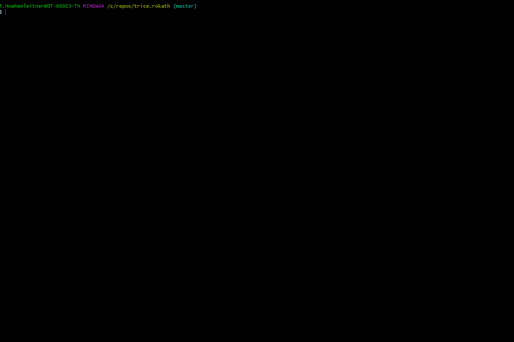

---

## 1. <a id='abstract'></a>Abstract

If you develop software for an embedded system, you need some kind of system feedback. Debuggers are awesome tools, but when it comes to analyze dynamic behavior in the field, they are not usable.

Logging then, usually done with printf-like functions, gets quick a result after having i.e. `putchar()` implemented. This turns out to be an expensive way in terms of processor clocks and needed FLASH memory, when you regard the library code and all the strings needing FLASH memory space. For small micro-controllers that´s it.

Bigger micro-controllers are coming with embedded trace hardware. To use it, an expensive tool is needed. Useful for analyzing complex systems, but for in-field related issues at least unhandy.

Unhappy with this situation, the developer starts thinking of using digital pins or starts emitting some proprietary LED blinking codes or byte sequences, difficult to interpret.

The Trice technique tries to fill this gap, being minimal invasive for the target and as comfortable as possible. It is the result of a long-year dissatisfaction and several attempts to find a loophole to make embedded programming more fun and this way more effective.

Trice is an unusual software tracer-logger, using [internally](#how-it-works---the-main-idea) IDs instead of format strings to get maximum [speed](#execution-speed) but provides the user with a printf-like comfort:

```C
trice("Hello! 👋🙂");

int a = -4;
float x = 3.14159265;
trice("info:π/%d is %f with the bit pattern %032b\n", a, aFloat(x/a), x );

string s = "world";
triceS("msg:A runtime generated string: %s", s);
```

Replacing a `printf` library, the [Trice target source code](../src) occupies 1-4 KB Flash [memory](#trice-memory-needs) and less than 1 KB RAM in dependence of the configuration which is done with a user file named `triceConfig.h`:

```C
#define TRICE_DEFERRED_OUTPUT 1
#define TRICE_BUFFER TRICE_DOUBLE_BUFFER
#define TRICE_DEFERRED_UARTA 1
#define TRICE_UARTA USART2
```

The open-source Trice PC tool is executable on all [Go](https://golang.org) platforms, at least:

* [x] Linux
* [x] MacOS
* [x] Windows

In the future other ports are possible:

* C/C++ or Rust program to run on a separate controller board
* [Go-mobile](https://github.com/golang/mobile)
* [tinyGo](https://tinygo.org/)
* [Wasm](https://webassembly.org/)
* [Phython](https://en.wikipedia.org/wiki/Python_(programming_language))


<p align="right">(<a href="#top">back to top</a>)</p>

## 2. <a id='a-brief-history-of-trice'></a>A brief history of Trice

Developing firmware means to deal also with interrupts and often with timing. How do you check, if an interrupt occurred? Ok, increment a counter and display it in a background loop with some printf-like function. What about time measurement? Set a digital output to 1 and 0 and connect a measurement device. Once, developing software for a real-time image processing device, I had no clue where in detail the processing time exploded when the image quality got bad. A spare analog output with a video interrupt synced oscilloscope gave me the needed information, after I changed the analog output on several points in my algorithm. But, hey guys, I want to deal with my programming tasks and do not like all this hassle connecting wires and steer into instruments.

A `printf` is so cool on a PC, developing software there. But an embedded device often cannot use it for performance reasons. My very first attempt was writing the format string `.const` offset together with its values in a FIFO during a log statement and to do the `printf` it in the background. But that is compiler specific. Ok the full string address is better but needs buffer space. [Zephyr](https://docs.zephyrproject.org/latest/reference/logging/index.html) for example does something like that calling it "deferred logging".

Then, one day I had the idea to compute short checksums for the format strings in a pre-compile step and to use them as ID in a list together with the format strings. That was a step forward but needed to write a supporting PC program. I did that in C++ in the assumption to get it better done that way. Finally, it worked, but I hated my PC code, as I dislike C++ now because of all its nuts and bolts to handle, accompanied by missing libraries on the next PC. The tool usability was also unhandy and therefore error prone and the need became clear for a full automatized solution. Also, what is, if 2 different format strings accidentally generate the same short checksum? There was a way around, but an ID based message filtering will never be possible that way.

The need became clear for controllable IDs and management options. And there was [Go](https://golang.org) now, an as-fast-as-**C** language, easy to learn, promising high programming efficiency and portability. It would be interesting to try it out on a real PC project.

Trying to add tags in form of partial Trice macro names was blowing up the header code amount and was a too rigid design. Which are the right tags? One lucky day I came to the conclusion to handle tags just as format string parts like `"debug:Here we are!\n"` and getting rid of them in the target code this way also giving the user [freedom](../internal/emitter/lineTransformerANSI.go) to invent any tags.

An other point in the design was the question how to re-sync after data stream interruption, because that happens often during firmware development. Several [encodings](./_Legacy/TriceObsoleteEncodings.md) where tried out and a proprietary escape sequence format and an alternative flexible data format with more ID bits where working reliable but with [COBS](https://en.wikipedia.org/wiki/Consistent_Overhead_Byte_Stuffing) things got satisfying. A side result of that trials is the Trice tool option to add different decoders if needed. Now the default Trice message framing is [TCOBSv1](https://github.com/rokath/tcobs) which includes short message compression and this way allows very low transmit bandwidths and/or saves storage, when binary Trice data are stored in Flash memory.

There was a learning **not** to reduce the transmit byte count to an absolute minimum, but to focus more on Trice macro [speed](#execution-speed) and universality. That led to a double buffer on the target side as an alternative to the ring buffer solution. The actual binary [encoding](#binary-encoding) encoding, allowing alongside user protocols, is result of the optional target timestamps and location info some users asked for, keeping the target code as light as possible. Float and double number support was implementable for free because this work is done mainly on the host side.

Trice grew, and as it got usable I decided to make it Open Source to say "Thank You" to the community this way.

Learning that Trice is also a [baby girl name](https://www.babynamespedia.com/meaning/Trice), our daughter Ida designed the little girl with the pen symbolizing the Trice macro for recording and the eyeglasses standing for the PC tool Trice visualizing the logs.


<p align="right">(<a href="#top">back to top</a>)</p>

## 3. <a id='how-it-works---the-main-idea'></a>How it works - the main idea

Trice performs **no** [costly](#trice-similarities-and-differences-to-printf-usage) printf-like functions on the target at all. The Trice macro, instead, just copies an ID together with the optional values to a buffer and is done. In the minimum case this can happen in [6(six!)](#trice-speed) processor clocks even with target timestamps included. When running on a 64 MHz clock, **light can travel about 30 meters in that time**.

To achieve that, a pre-compile step is needed, executing a `trice insert` command on the PC. This is fast enough not to disturb the build process. The Trice tool parses then the source tree for macros like `trice( "msg: %d Kelvin\n", k );` and patches them to `trice( iD(12345), "msg: %d Kelvin\n", k );`, where `12345` is a generated 14-bit identifier (ID) copied into a [**T**rice **I**D **L**ist](../_test/testdata/til.json). During compilation than, the Trice macro is translated to the `12345` ID only, and the optional parameter values. The format string is ignored by the compiler.

The target code is [project specific](../examples/F030_inst/Core/Inc/triceConfig.h) configurable.  In **direct mode** the the stack or a static buffer is used as Trice buffer and the Trice macro execution includes optionally the quick [COBS](https://en.wikipedia.org/wiki/Consistent_Overhead_Byte_Stuffing) encoding and the data transfer. This more straightforward and slower architecture can be interesting for many cases because it is anyway much faster than printf-like functions calls. Especially when using [Trice over RTT](#trice-over-rtt) a single Trice is executable within ~100 processor clocks. See `TRICE_DIRECT_SEGGER_RTT_32BIT_WRITE` inside [triceDefaultConfig.h](../src/triceDefaultConfig.h) and look into the [examples](../examples) folder. In **deferred mode** a service swaps the Trice double buffer or reads the Trice ring buffer periodically, the configured encoding, default is TCOBS, takes part and with the filled buffer the background transfer is triggered. Out buffer and Trice buffer share the same memory for efficiency.

During runtime the PC Trice tool receives all what happened in the last ~100ms as a package from the UART port. The `0x30 0x39` is the ID 12345 and a map lookup delivers the format string *"msg: %d Kelvin\n"* and also the bit width information. Now the Trice tool can write target timestamp, set msg color and execute `printf("%d Kelvin\n", 0x0000000e);`

---

  

The Trice tool is a background helper giving the developer focus on its programming task. The once generated ID is not changed anymore without need. If for example the format string gets changed into `"msg: %d Kelvin!\n"`, a new ID is inserted automatically and the reference list gets extended. Obsolete IDs are kept inside the [**T**rice **I**D **L**ist](../_test/testdata/til.json) for compatibility with older firmware versions. It could be possible, when merging code, an ID is used twice for different format strings. In that case, the ID inside the reference list wins and the additional source gets patched with a new ID. This maybe unwanted patching is avoidable with proper [Trice ID management](#trice-id-management). The reference list should be kept under source code control.

Moreover, using `trice i -cache && make && trice c -cache` in a build script makes the IDs invisible to the developer reducing the data noise giving more space to focus on the development task. See [build.sh](../examples/L432_inst/build.sh) as a working example and the [Trice Cache](#trice-cache) chapter for details.

<p align="right">(<a href="#top">back to top</a>)</p>

## 4. <a id='trice-features-(overview)'></a>Trice Features (Overview)

### 4.1. <a id='open-source'></a>Open source

Target code and PC tool are open source. The MIT license gives full usage freedom. Users are invited to support the further Trice development.

### 4.2. <a id='easy-to-use'></a>Easy-to-use

Making it facile for a user to use Trice was the driving point just to have

* one Trice tool
* one additional [target code](../src/) source folder
* a project specific simple to use [triceConfig.h](../examples/F030_inst/Core/Inc/triceConfig.h)
* and to get away with the one macro `trice` for most situations.

Trice understands itself as a silent helper in the background to give the developer more focus on its real task. If, for example, `trice log` is running and you re-flash the target, there is ***no need to restart*** the Trice tool. When [til.json](../til.json) was updated in an pre-build step, the Trice tool automatically reloads the new data during logging.

The Trice tool comes with many command line switches (`trice help -all`) for tailoring various needs, but mostly these are not needed. Usually only type:
* [./build.sh](../examples/L432_bare_inst/build.sh) containing `trice i -cache`, `make` and `trice c -cache`
* **`make log`** containing `trice l -p COMn` for logging with default baud rate.

In this example, the user code gets **not** polluted with Trice IDs - they exists only during the compilation step and the Trice cache makes this invisible for the user and the build system.

### 4.3. <a id='small-size---using-trice-frees-flash-memory'></a>Small size - using Trice frees FLASH memory

Compared to a printf-library code which occupies [1](https://github.com/mludvig/mini-printf) to over [20](https://github.com/mpaland/printf#a-printf--sprintf-implementation-for-embedded-systems) KB FLASH memory, the Trice code is normally [smaller](#trice-memory-needs) but provides full support.

### 4.4. <a id='execution-speed'></a>Execution speed

Can it get faster than [6 clocks only](#trice-speed)? Only 3 runtime Assembler instructions per Trice needed in the minimum case! Optional target timestamp, critical sections, cycle counter, diagnostics and overflow protection can consume a few more processor clocks, if enabled, but a Trice is still incomparable fast.

### 4.5. <a id='robustness'></a>Robustness

When a Trice data stream is interrupted, the optional [COBS](https://en.wikipedia.org/wiki/Consistent_Overhead_Byte_Stuffing) encoding allows an immediate re-sync with the next COBS package delimiter byte and a default Trice **cycle counter** gives a high chance to detect lost Trice messages.

### 4.6. <a id='minimal-transfer-bytes-amount'></a>Minimal Transfer Bytes Amount

A Trice message is 4 bytes long (2 ID bytes and 2 count bytes) plus optional time stamps and/or values. In conjunction with the compressing [TCOBS](https://github.com/rokath/tcobs) framing the Trice data stream is as small as imaginable.

### 4.7. <a id='more-comfort-than-printf-like-functions-but-small-differences'></a>More comfort than printf-like functions but small differences

Trice is usable also inside interrupts and [extended format specifier possibilities](#extended-format-specifier-possibilities) give options like binary or bool output. Transmitting runtime generated strings could be a need, so a `triceS` macro exists supporting the `%s` format specifier for strings up to 32737 bytes long. It is possible to log float/double numbers using `%f` and the like, but the numbers need to be covered with the function `aFloat(x)` or `aDouble(y)`. Also UTF-8 encoded strings are implicit supported, if you use UTF-8 for the source code. See chapter [Trice Similarities and differences to printf usage](#trice-similarities-and-differences-to-printf-usage) for more details.

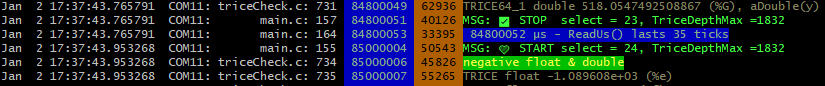

### 4.8. <a id='tags,-color-and-log-levels'></a>Tags, Color and Log Levels

You can label each Trice with a tag specifier to [colorize](#trice-tags-and-color) the output. This is free of any runtime costs because the tags are part of the log format strings, which are not compiled into the target. The Trice tool will strip full lowercase tag descriptors from the format string after setting the appropriate color, making it possible to give each letter its color.

Loggers use log levels and offer a setting like "log all above **INFO**" for example. The Trice tags can cover that but can do better: Inside [emitter.ColorChannels](../internal/emitter/lineTransformerANSI.go) all common log levels defined as Trice tags alongside with user tags. The user can adjust this. The Trice tool has the `-pick` and `-ban` switches to control the display in detail. Also a `-logLevel` switch is usable to determine a display threshold as tag position inside ColorChannels.

If an inside-target log selection is needed, the Trice tool can assign each log tag a separate ID range and a target side ID based log selector can control which IDs are transmitted over which output channel. See chapter [Trice ID management](#trice-id-management) or type `trice help -insert` and look for `-IDRange`.


### 4.9. <a id='compile-time-enable/disable-trice-macros-on-file-or-project-level'></a>Compile Time Enable/Disable Trice Macros on File or Project Level

After debugging code in a file, there is [no need to remove or comment out Trice macros](#switching-trice-on-and-off). Write a `#define TRICE_OFF 1` just before the `#include "trice.h"` line and all Trice macros in this file are ignored completely by the compiler, but not by the Trice tool. In case of re-constructing the [**T**rice **ID** **L**ist](../_test/testdata/til.json), these no code generating macros are regarded.

```C
#define TRICE_OFF 1 // Disable trice code generation for this file object.
#include "trice.h"
```

When you wish to build a firmware without any Trice code, it is sufficient to add

```make
C_DEFS += -DTRICE_OFF=1 // Define TRICE_OFF=1 for the whole project.
```

or similar to your Makefile.

### 4.10. <a id='target-and-host-timestamps'></a>Target and host timestamps

For each Trice you can have (time) stamps or not:

* `trice( "...", ...);` or `TRICE( id(0), ( "...", ...)`: no stamp:
* `Trice( "...", ...);` or `TRICE( Id(0), ( "...", ...)`: 16-bit stamp:
* `TRice( "...", ...);` or `TRICE( ID(0), ( "...", ...)`: 32-bit stamp:

The optional 16- or 32-bit value carry than the system clock, a millisecond second or an other event counter configured in the project specific [triceConfig.h](../examples/G0B1_inst/Core/Inc/triceConfig.h). The Trice tool will automatically recognize and display the stamps in a mode you can control. If several Trice macros form a single line, the Trice tool only displays the target timestamp of the first Trice macro.

Embedded devices often lack a real-time clock and some scenarios can last for weeks. Therefore the Trice tool precedes each Trice line with a PC timestamp, if not disabled. This is the Trice reception time on the PC, what can be some milliseconds later than the target Trice event.

### 4.11. <a id='target-source-code-location'></a>Target source code location

Some developers like to see the `filename.c` and `line` in front of each log line for quick source location. During `trice i` a file `li.json` is generated containing the location information. If `trice log` finds this file, filename and line number are displayed in front of each log line, otherwise not.

Because software is a matter of change it could happen you get obsolete information this way. Therefore the Trice tool log option `-showID` exists to display the Trice ID in front of each log line what gives a more reliable way for event localization in some cases. Also you can get it for free, because no target code is needed for that.

### 4.12. <a id='-several-target-devices-in-one-log-output'></a> Several target devices in one log output

Several Trice tool instances can run parallel on one or different PCs. Each Trice tool instance receives *Trices* from one embedded device. Instead of displaying the log lines, the Trice tool instances can transmit them over TCP/IP (`trice l -p COMx -ds`) to a Trice tool instance acting as display server (`trice ds`). The display server can fold these log lines in one output. For each embedded device a separate Trice line prefix and suffix is definable. This allows comparable time measurements in distributed systems.

### 4.13. <a id='any-byte-capable-1-wire-connection-usable'></a>Any byte capable 1-wire connection usable

The usual Trice output device is an UART but also [SEGGER-RTT](#trice-over-rtt) is supported over J-Link or ST-Link devices. Many micro controller boards can act as Trice bridge to a serial port from any port ([Trice without UART](#trice-without-uart)).

### 4.14. <a id='scalability'></a>Scalability

The various [Trice ID management](#trice-id-management) options allow the organization also of bigger software systems. 16383 possible different IDs should match also large projects. Just in case: 16-bit for the ID is a not to hard changeable value.

### 4.15. <a id='portability-and-modularity'></a>Portability and Modularity

The Trice tool is written in the open source language [*Go*](https://go.dev/) and is therefore usable on many platforms. That means the automatic code patching and ID handling side with `trice insert`.

All C-compilers should be usable to compile the target Trice code and there is no hardware dependency despite the byte transmission. MCUs with 8-bit to 64-bit, little or big endian are supported.

Any user program able to read a [JSON](../examples/F030_inst/til.json) file, can receive the [documented](#binary-encoding) Trice message format, look-up the ID and perform a printf-like action to translate into log strings. The Trice tool with its `log` switch is a working example.

Using no framing, [COBS](https://en.wikipedia.org/wiki/Consistent_Overhead_Byte_Stuffing) or [TCOBS](https://github.com/rokath/tcobs) packages starting with a [package descriptor](#package-format) allows alongside user protocols. The other way around is also implementable: In a user protocol embedded `Trice` messages.

The Trice tool is expandable with several decoders. So it is possible to implement a minimal Trice encoding, if bandwidth matters heavily and control that with switches.

When less RAM usage is more important the target double buffer is replaceable with a ring buffer. So the user will be able to decide at compile time about that. A ring buffer mode is selectable inside [triceConfig.h](../examples/F030_instCore/Inc/triceConfig.h) avoiding any buffer by paying a time toll.

The Trice tool supports [many command line switches](../internal/args/tricehelpall_test.go).

### 4.16. <a id='optional-trice-messages-encryption'></a>Optional Trice messages encryption

The encryption opportunity makes it possible to test thoroughly a binary with log output and releasing it without the need to change any bit but to make the log output unreadable for a not authorized person. Implemented is the lightweight [XTEA](https://de.wikipedia.org/wiki/Extended_Tiny_Encryption_Algorithm) as option, what will do for many cases. It should be no big deal to add a different algorithm.

### 4.17. <a id='trice-protection'></a>Trice Protection

### 4.18. <a id='trice-diagnostics'></a>Trice Diagnostics

### 4.19. <a id='trice-cache'></a>Trice Cache

One may think, automatically cleaning the IDs in the target code with `trice c` after building and re-inserting them just for the compilation needs file modifications all the time and a permanent rebuild of all files containing Trices will slow down the re-build process. That is true, but by using the Trice cache this is avoidable.
Simply one-time create a `~./trice/cache` folder and use `trice i -cache` and `trice c -cache` in your [build.sh](../examples/L432_inst/build.sh) script.

<p align="right">(<a href="#top">back to top</a>)</p>

## 5. <a id='project-structure-(files-and-folders)'></a>Project structure (Files and Folders)

| name                                                                                  | content                                                                                                                   |
|---------------------------------------------------------------------------------------|---------------------------------------------------------------------------------------------------------------------------|
| [_test](../_test)                                                                     | automatic target code tests                                                                                               |
| [.github/](../.github/)                                                               | [Github configuration](https://stackoverflow.com/questions/71235744/where-is-the-github-folder-in-the-project-repository) |
| [.idea/](../.idea/)                                                                   | GoLand settings                                                                                                           |
| [.vscode/](../.vscode/)                                                               | vsCode settings                                                                                                           |
| [cmd/_cui/](../cmd/_cui)                                                              | (do not use) command user interface tryout code                                                                           |
| [cmd/_stim/](../cmd/_stim)                                                            | (do not use) target stimulation tool tryout code                                                                          |
| [cmd/trice](../cmd/trice)                                                             | Trice tool command Go sources                                                                                             |
| [docs](../docs)                                                                       | documentation folder with link forwarding                                                                                 |
| [examples/](../examples)                                                              | example target projects                                                                                                   |
| [internal/](../internal)                                                              | Trice tool internal Go packages                                                                                           |
| [pkg/](../pkg)                                                                        | Trice tool common Go packages                                                                                             |
| [src/](../src)                                                                        | C sources for trice instrumentation -> Add to target project                                                              |
| [super-linter.report/](../super-linter.report/)                                       | super linter output                                                                                                       |
| [third_party/](../third_party)                                                        | external components                                                                                                       |
| [_config.yml](../_config.yml)                                                         | [jekyll configuration](https://jekyllrb.com/docs/configuration/)                                                          |
| [.clang-format](../.clang-format)                                                     | See [Trice Code Formatting](#trice-code-formatting)                                                                       |
| [.clang-format-ignore](../.clang-format-ignore)                                       | See [Trice Code Formatting](#trice-code-formatting)                                                                       |
| [.editorconfig](../.editorconfig)                                                     | See [Trice Code Formatting](#trice-code-formatting)                                                                       |
| `.git/`                                                                               | version control data base   (hidden)                                                                                      |
| [.gitattributes](../.gitattributes)                                                   | See[Trice Code Formatting](#trice-code-formatting)                                                                        |
| [.gitignore](../.gitignore)                                                           | Files git ignores                                                                                                         |
| [.goreleaser.yaml](../.goreleaser.yaml)                                               | goreleaser configuration                                                                                                  |
| [.travis.yml](../.travis.yml)                                                         | Travis CI configuration                                                                                                   |
| [AUTHORS.md](../AUTHORS.md)                                                           | contributors                                                                                                              |
| [CHANGELOG.md](../CHANGELOG.md)                                                       | History                                                                                                                   |
| [CODE_OF_CONDUCT.md](../CODE_OF_CONDUCT.md)                                           | How to communicate                                                                                                        |
| [CONTRIBUTING.md](../CONTRIBUTING.md)                                                 | Helper                                                                                                                    |
| [go.mod](../go.mod)                                                                   | Go modules file                                                                                                           |
| [go.sum](../go.sum)                                                                   | Go modules sums                                                                                                           |
| [LICENSE.md](../)                                                                     | [MIT](https://opensource.org/license/mit)                                                                                 |
| [README.md](../)                                                                      | Github first page                                                                                                         |
| [coverage.out](../)                                                                   | Go test coverage output                                                                                                   |
| `dist/`                                                                               | local distribution files folder created by goreleaser                                                                     |
| [renewIDs_in_examples_and_test_folder.sh](../renewIDs_in_examples_and_test_folder.sh) | renew all ID data                                                                                                         |
| [testAll.sh](../testAll.sh)                                                           | run all tests                                                                                                             |

<p align="right">(<a href="#top">back to top</a>)</p>

## 6. <a id='start-with-trice'></a>Start with Trice

### 6.1. <a id='get-it'></a>Get it

* Download [latest release assets](https://github.com/rokath/trice/releases) for your system: Compressed source code and binaries.
* OR Get the repo: 
* OR use the  button

### 6.2. <a id='install-it'></a>Install It

* Place the extracted Trice [binary](https://github.com/rokath/trice/releases/latest) somewhere in your [PATH](https://en.wikipedia.org/wiki/PATH_(variable)).
* Copy the src folder into your project and add all files.
* Copy a triceConfig.h from a subfolder in the examples or test folder and optionally adapt it. See file [*triceDefaultConfig.h*](../src/triceDefaultConfig.h) for help.
  * Inside the triceConfig.h file cou can control, if Trice works in direct or deferred mode or both parallel.

### 6.3. <a id='try-it'></a>Try it

* Create a file `tryTrice.c` and write in it:

```C
#include "trice.h"

int tryIt( void ){
    trice( "Hello! 👋🙂\a\n" ); // A message with sound and without target timestamp.
}
```

You can also edit any of your existing project files accordingly. Just replace any `printf` with `trice`. (Handle float or double numbers and runtime-generated stings, according to [Trice Similarities and Differences to printf Usage](#trice-similarities-and-differences-to-printf-usage). The file [_test/testdata/triceCheck.c](../_test/testdata/triceCheck.c) shows many usage examples.
The uppercase Trice macros are inlining the complete Trice code and the lowercase Trice macros are function calls, so most probably you want use `trice` to keep the overall code size smaller.

* Create 2 empty files `til.json` and `li.json` in your project root.
* Run `trice insert` and the trice code line changes to `trice( iD(1234), "Hello! 👋🙂\a\n" );`.
* The 2 JSON files are now filled with information.
* Run `trice clean` and the trice code line changes back to `trice( "Hello! 👋🙂\a\n" );`.

You can use `trice insert` as pre- and `trice clean` as post-compile step, to not spoil your source code with IDs.

> **The optional Trice cache technique avoids un-edited file changes at all, what means no Trice releated build speed disadvantages.**

See [Trice Cache for Compilation Speed](#trice-cache-for-compilation-speed) for more details and [examples/G1B1_inst/build.sh](../examples/G0B1_inst/build.sh) as example.

* Or, use `trice insert` in a post-checkout and `trice clean` in a pre-check-in script to keep just the repository clean of Trice IDs. Using only `trice insert` as pre-compile step is possible too, especially when the code is used just in a single project and you wish to have it as compiled.
* When using Trice in libraries for several projects, it may make sense to check-in the libraries with IDs and to use a dedicated ID space for them. See [../_test/testdata/triceCheck.c](../_test/testdata/triceCheck.c) as an example - especially when building several projects parallel like shown in the examples folder.

A quick setup is possible when using RTT as output channel. Otherwise you need to setup a serial port for Trice data transmission. Other output paths possible too using the auxiliary interface.

### 6.4. <a id='use-it'></a>Use It

* In a console, like [git bash](https://gitforwindows.org/), type `trice help -all`. You should see the complete Trice tool [CLI](https://en.wikipedia.org/wiki/Command-line_interface) documentation.
  * Don´t worry, most of it you will never need.
  * There are only 2 important commands: `trice insert` and `trice log`. Call them with the right CLI switches.
    * `trice help -insert` and `trice help -log` show partial help.
    * Examples:

      | CLI command                                     | Description                                                                                                                                   |
      |-------------------------------------------------|-----------------------------------------------------------------------------------------------------------------------------------------------|
      | `touch ./til.json`                              | Create an empty `til.json file`. This is needed only the very first time.                                                                     |
      | `trice i -src . -src ../myLib`                  | Insert IDs to the current and your `../myLib` folder. This will read\|extend\|modify `./til.json` and use & create the `./li.json` file.      |
      | ...                                             | Compile your project                                                                                                                          |
      | `trice c -src . -src ../myLib`                  | Optionally restore the current and your `../myLib` folder. This will read\|extend\|modify `./til.json` and use & create the `./li.json` file. |
      | `trice l -p com1 -baud 921600 -lf my/path/auto` | Start Logging over UART and create automatically a new log file in `my/path/`.                                                                |
      | `cat filename.log`                              | View a recorded log file.                                                                                                                     |
      | `trice l -p JLINK -args "..."`                  | Start Logging over RTT. Binary log files are collected in `./temp`.                                                                           |
      | `trice l -p FILEBUFFER -args logfile.bin`       | Play a recorded binary log file.                                                                                                              |

    * It is recommended to add `trice insert ...` as pre-compile step into the tool chain.
    * Hint: It is possible to add `trice clean ...` as a post-compile step, so that you can check in your project sources without IDs. That is supported in v0.61.0 and later. This allows to use library sources with trices in different projects and the source code is not spoiled with IDs.
* The command `trice` does not make any assumptions about the target processor - 8-bit to 64-bit, supports little and big endianness.
* The command `trice` is compiler agnostic - it should work with any compiler.
* The vsCode editor is free downloadable and free usable, like shown in the [`examples/F030_inst`](../examples/F030_inst) project.
  * Even if you do not have such hardware, you can compile the [`examples/F030_inst`](../examples/F030_inst) project just to get started.
  * When adding or modifying Trice macros inside [examples/F030_inst/Core/Src/main.c](../examples/F030_inst/Core/Src/main.c) and recompiling you should see automatically changed ID numbers inside the code.
* The examples and test sub-folders contains several vsCode Makefile projects and they are also usable as starting points for your configuration.
* You can use Trice calls also inside header files but when running `trice insert` as pre- and `trice clean` as post-compile step, all files including these headers will be re-compiled every time, what may be too time consuming. Enable the Trice cache then. See [Trice Cache for Compilation Speed](#trice-cache-for-compilation-speed) for more information.

<p align="right">(<a href="#top">back to top</a>)</p>

### 6.5. <a id='port-it'></a>Port it

Trice should be usable on any MCU with any compiler. On ARM MCUs the easiest way is to use SEGGER J-Link with RTT as output. Setting up UART transmission as alternative or additionally is also no big deal.

Compare folders of one of these folder groups:

| Without Instrumentation                         | With Trice Instrumentation                      | Remarks  |
|-------------------------------------------------|-------------------------------------------------|----------|
| [`./examples/F030_bare`](../examples/F030_bare) | [`./examples/F030_inst`](../examples/F030_inst) | no RTOS  |
| [`./examples/G0B1_bare`](../examples/G0B1_bare) | [`./examples/G0B1_inst`](../examples/G0B1_inst) | FreeRTOS |
| [`./examples/L432_bare`](../examples/L432_bare) | [`./examples/L432_inst`](../examples/L432_inst) | FreeRTOS |

This way you see in a quick way any needed adaptions for your target project to port trice to it.

The chapter [Example Projects without and with Trice Instrumentation](#example-projects-without-and-with-trice-instrumentation) contains further helpful information.

#### 6.5.1. <a id='target-macros'></a>Target Macros

The easiest and mostly sufficient way to use Trice on the target side is the Trice macro

```C
trice("Hello world!"); // without     time stamp
Trice("Hello world!"); // with 16-bit time stamp
TRice("Hello world!"); // with 32-bit time stamp
```

which you can mostly use as a `printf` replacement in legacy code. See [Trice Similarities and differences to printf usage](#trice-similarities-and-differences-to-printf-usage) for more details. Is uses the `TRICE_DEFAULT_PARAMETER_BIT_WIDTH` value (usually 32), which is equal for all values.

The additional macros

* `trice8`, `trice16`, `trice32`, `trice64`
* `Trice8`, `Trice16`, `Trice32`, `Trice64`
* `TRice8`, `TRice16`, `TRice32`, `TRice64`

are always usable and the number 8, 16, 32, 64 specifies the parameter width, which is equal for all values within one macro. Trice macros are partially disabled, when the value TRICE_SINGLE_MAX_SIZE is defined to be smaller than 104. For example with TRICE_SINGLE_MAX_SIZE == 8, `TRice32` can have no parameter value (4 byte Trice header, 4 byte stamp) and `trice8` can have up to 4 parameter values (4 byte Trice header, 4 byte values) That's mainly to get compiler errors rather than runtime errors.

More examples:

| Trice     | Header | Stamp | max. Values  | Trice Size |
|-----------|--------|-------|--------------|------------|
| `trice8`  | 4      | 0     | 0 \*1 byte   | 4          |
| ...       | ...    | ...   | ...          | ...        |
| `trice8`  | 4      | 0     | 12 \*1 byte  | 16         |
| `Trice8`  | 4      | 2     | 0 \*1 byte   | 6          |
| ...       | ...    | ...   | ...          | ...        |
| `Trice8`  | 4      | 2     | 12 \*1 byte  | 18         |
| `TRice8`  | 4      | 4     | 0  \*1 byte  | 8          |
| ...       | ...    | ...   | ...          | ...        |
| `TRice8`  | 4      | 4     | 12 \*1 byte  | 20         |
| `trice16` | 4      | 0     | 2  \*2 byte  | 8          |
| `Trice16` | 4      | 2     | 1  \*2 byte  | 8          |
| `trice32` | 4      | 0     | 1  \*4 byte  | 8          |
| `Trice32` | 4      | 2     | 1  \*4 byte  | 10         |
| `TRice32` | 4      | 4     | 2  \*4 byte  | 16         |
| `trice64` | 4      | 0     | 1  \*8 byte  | 12         |
| `TRice64` | 4      | 4     | 1  \*8 byte  | 16         |
| ...       | ...    | ...   | ...          | ...        |
| `TRice64` | 4      | 4     | 12  \*8 byte | 104        |

The value TRICE_DEFAULT_PARAMETER_BIT_WIDTH is the parameter bit with for the macros `trice`, `Trice`, `TRice` (without number). It can make sense to set this value to 16 on smaller machines.

The full uppercase macro Trice is a Trice macro only using inline code. Because the main design aim was speed, this was the original design. Then it became clear, that several hundred of Trice macros increase the needed code amount too much and that it is better to have just a function call instead of having inline macros. If speed matters use `TRICE(id(0)`, `TRICE(Id(0)`, `TRICE(ID(0)` else use `trice(iD(0)`, `Trice(iD(0)`, `TRice(iD(0)` or mix usage as you like. The lower case macros internally use Trice like code but each is only a function call and therefore needs less space.

#### 6.5.2. <a id='target-trice-stamps'></a>Target Trice Stamps

* If you wish to have your Trice messages stamped, most probably time stamped, add the 2 hardware specific macros/functions to your project (example in [./examples/F030_inst/Core/Inc/triceConfig.h](../examples/F030_inst/Core/Inc/triceConfig.h) and [./examples/F030_inst/Core/Src/stm32f0xx_it.c](../examples/F030_inst/Core/Src/stm32f0xx_it.c) ). The time base is in your hands and is allowed to be different for the 16-bit and 32-bit stamps. Example:

    ```c
    //! ms32 is a 32-bit millisecond counter, counting circular in steps of 1 every ms.
    extern uint32_t ms32;
    #define TriceStamp16 (SysTick->VAL) // Counts from 31999 -> 0 in each ms.
    #define TriceStamp32  ms32
    ```
* In the code snippet above the 32-bit timestamp is used for milliseconds and the 16.bit timestamp is used as clock counter what allows fine grained time measurements.
* In the screenshot below, the 16-bit timestamp is a parallel counter running between 0-9999 milliseconds, which allows to have 16-bit timestamps all the time and only every 10 seconds is a full 32-bit timestamp needed.

  


* The trice tool `-ts*` CLI switches allow customization. With `-hs off` host time stamps are suppressed.
* It is also possible to use the stamp option not for time stamps but for any values, like addresses or a voltage or a random number.

_Hint:_ I usually have the 32-bit timestamp as millisecond counter and the 16-bit timestamp as systick counter to measure short execution times.

#### 6.5.3. <a id='trice-checks'></a>Trice Checks

* Optionally copy parts of [./_test/testdata/triceCheck.c](../_test/testdata/triceCheck.c) to your project if you wish to perform some checks.
  * Do not inclucde this file directly, because it could get changed when `updateTestData.sh` is executed inside the `./test` folder.
  * The only-uppercase `TRICE*` macros include trice code sequences what can led to a significant code amount if you use plenty of them, whereas the lowercase macros `trice`, `Trice`, `TRice` and their relatives are just function calls and better suited to be used normally.
* In your source files add line `#include "trice.h"` at the top.
* In a function write a trice message like: `TRice( "1/11 = %g\n", aFloat( 1.0/11 ) );`.
* In **project root**:
  * Create empty file: `touch til.json`.
  * `trice insert` should perform **automatically** the following things (The numbers are just examples.):
    * Patch source.c to `TRice( iD(12363), "1/11 = %g\n", aFloat( 1.0/11 ) );`
      * C & H files containing Trice macros, are only modified if needed (missing IDs or changed format strings).
    * Extend `til.json`
      * If no `til.json` is found nothing happens. At least an empty file is needed (Safety feature).
* When the program runs later, it should output something similar to 
* Look into [Trice Similarities and differences to printf usage](#trice-similarities-and-differences-to-printf-usage) for options.
* Read chapter [Trice Project Image Size Optimization](#trice-project-image-size-optimization) if needed.

#### 6.5.4. <a id='communication-ports'></a>Communication Ports

* For RTT the [SEGGER](https://www.segger.com/downloads/jlink/) source is already included. See [Trice over RTT](#trice-over-rtt) for more info.
  * If RTT is used, no hardware specific adaptions needed and it is the fastest possible data transfer. But you cannot use it in the field usually.
  * The direct trice mode is recommended for RTT. The single trice execution is a bit longer then, but the log is completely done in one shot. It takes about 100-150 processor clocks, aka 1-2 microseconds.
    * Info: All deferred trice modes are faster in the runtime execution but the Trice logs appear slightly delayed. You can tune the Trices down to only 3 Assembler instructions **executable within 6 processor clocks**. See [Trice Speed](#trice-speed) as example.
* For UART transfer add UART write functionality. The deferred mode is recommended for UART transfer.
* It is possible to log over several channels parallel and to select an ID range for each tag.
* An additional device, like local file, GPIO pin or SPI, is possible by providing an appropriate write functionality.
* See also [Trice without UART](#trice-without-uart).

#### 6.5.5. <a id='target-code-overview'></a>Target Code Overview

* `./src`: **User Interface**

| File                      | description                                                                                                                                  |
|---------------------------|----------------------------------------------------------------------------------------------------------------------------------------------|
| [trice.h](../src/trice.h) | trice runtime lib user interface, `#include trice.h` in project files, where to use Trice macros. Add `./src` to your compiler include path. |
| `triceConfig.h`           | Create this file to overwrite  [triceDefaultConfig.h](../src/triceDefaultConfig.h) as needed.                                                |

* `./src`: **Internal Components** (only partially needed, add all to your project - the configuration selects automatically)

| File                                                | description                                                                                                          |
|-----------------------------------------------------|----------------------------------------------------------------------------------------------------------------------|
| [cobs.h](../src/cobs.h)                             | message packaging, alternatively for tcobs                                                                           |
| [cobsEncode.c](../src/cobsEncode.c)                 | message encoding, alternatively for tcobs                                                                            |
| [cobsDecode.c](../src/cobsDecode.c)                 | message decoding, normally not needed                                                                                |
| [trice.c](../src/trice.c)                           | trice core lib                                                                                                       |
| [trice8McuOrder.c](../src/trice8McuOrder.c)         | trice MCU endianness lib                                                                                             |
| [trice8McuReverse.c](../src/trice8McuReverse.c)     | trice MCU reverse endianness lib                                                                                     |
| [trice16McuOrder.c](../src/trice16McuOrder.c)       | trice MCU endianness lib                                                                                             |
| [trice16McuReverse.c](../src/trice16McuReverse.c)   | trice MCU reverse endianness lib                                                                                     |
| [trice32McuOrder.c](../src/trice32McuOrder.c)       | trice MCU endianness lib                                                                                             |
| [trice32McuReverse.c](../src/trice32McuReverse.c)   | trice MCU reverse endianness lib                                                                                     |
| [trice64McuOrder.c](../src/trice64McuOrder.c)       | trice MCU endianness lib                                                                                             |
| [trice64McuReverse.c](../src/trice64McuReverse.c)   | trice MCU reverse endianness lib                                                                                     |
| [SEGGER_RTT.h](../src/SEGGER_RTT.h)                 | Segger RTT code interface                                                                                            |
| [SEGGER_RTT.c](../src/SEGGER_RTT.c)                 | Segger RTT code                                                                                                      |
| [tcobs.h](../src/tcobs.h)                           | message compression and packaging interface                                                                          |
| [tcobsv1Encode.c](../src/tcobsv1Encode.c)           | message encoding and packaging                                                                                       |
| [tcobsv1Decode.c](../src/tcobsv1Decode.c)           | message decoding and packaging, normally not needed                                                                  |
| [tcobsv1Internal.h](../src/tcobsv1Internal.h)       | message decoding and packaging internal interface                                                                    |
| [trice8.h](../src/trice8.h)                         | 8-bit trice code interface                                                                                           |
| [trice8.c](../src/trice8.c)                         | 8-bit trice code                                                                                                     |
| [trice16.h](../src/trice16.h)                       | 16-bit trice code interface                                                                                          |
| [trice16.c](../src/trice16.c)                       | 16-bit trice code                                                                                                    |
| [trice32.h](../src/trice32.h)                       | 32-bit trice code interface                                                                                          |
| [trice32.c](../src/trice32.c)                       | 32-bit trice code                                                                                                    |
| [trice64.h](../src/trice64.h)                       | 64-bit trice code interface                                                                                          |
| [trice64.c](../src/trice64.c)                       | 64-bit trice code                                                                                                    |
| [triceAuxiliary.c](../src/triceAuxiliary.c)         | trice code for auxiliary interfaces                                                                                  |
| [triceDefaultConfig.h](../src/triceDefaultConfig.h) | This file contains the most probably settings and serves also as a reference for tuning your project *triceConfig.h* |
| [triceDoubleBuffer.c](../src/triceDoubleBuffer.c)   | trice runtime lib extension needed for fastest deferred mode                                                         |
| [triceStackBuffer.c](../src/triceStackBuffer.c)     | trice runtime lib extension needed for direct mode                                                                   |
| [triceRingBuffer.c](../src/triceRingBuffer.c)       | trice runtime lib extension needed for recommended deferred mode                                                     |
| [xtea.c](../src/xtea.h)                             | XTEA message encryption/decryption interface                                                                         |
| [xtea.c](../src/xtea.c)                             | XTEA message encryption/decryption code                                                                              |

* The *tcobs\*.\** files are copied from [https://github.com/rokath/tcobs/tree/master/v1](https://github.com/rokath/tcobs/tree/master/v1). They are maintained there and extensively tested and probably not a matter of significant change.
* The SEGGER files are copied and you could check for a newer version at [https://www.segger.com/downloads/jlink/](https://www.segger.com/downloads/jlink/).

<p align="right">(<a href="#top">back to top</a>)</p>

#### 6.5.6. <a id='user-code-adaption'></a>User Code Adaption

* Replace all strings `puts` with the string `trice`, when the string follows immediately. For runtime generated strings see `triceS`.
* Replace all strings `printf` with the string `trice`, when the format string follows immediately.
* Check for float and double format specifiers in the format strings. The appropriate parameters need to be covered with `aFloat()` or `a double()`. Example:

    ```c
    printf( "%d, %3.2f EUR, %g rate\n", i, price, change );
    ```

    ```c
    trice64( "%d, %3.2f EUR, %g rate\n", i, aFloat(price), aDouble(change) );
    ```

  * Because double needs 8 bytes the trice macro in this case needs to be trice64 (see <a href="#Trice Parameter Bit Widths">Trice Parameter Bit Widths</a>).

* Check for string format specifiers in the format strings. Put each in a separate trice message. Example:

    ```c
    printf( "name: %16s, surname: %32s, birthday: %4u-%02u-%02u\n", n, s, y, m, d);
    ```

    ```c
    trice( "name: %16s, ", n); trice( "surname: %32s, ", s ); trice( "birthday: %4u-%02u-%02u\n" y, m, d);
    ```

The Trice macros are designed for maximal execution speed and therefore we have to pay the price for their limited capabilities.

* Optionally add tags to get color. Example:

    ```c
    puts( "A message");
    ```

    ```c
   trice( "msg:A message");
    ```

* Add `#include trice.h` to all user files using trice.

#### 6.5.7. <a id='limitations'></a>Limitations

* The maximum parameter count per trice is 12, but buffer transfer allows up to 32764 bytes payload. See `triceB` and its relatives.
* Each trice must fit into a single line in trice versions before v0.61.0.
  * Not ok before v0.61.0 but ok for later versions:

    ```c
    trice( "hello %u\n",
            year);
    ```

* But several trices can be in one line.
  * Ok:

    ```c
    trice( "hello %u\n", year); trice( "good time");
    ```

* Strings directly as parameter are possible now.
  * Ok from v0.61.0 with `trice insert` and `trice clean`:

    ```c
    triceS( "hello %s\n", "world" );
    ```

  * Ok always:

    ```c
    s = "world"; TRICE_S( "hello %s\n", s );
    #define WORLD "world"
    triceS( "hello %s\n", WORLD );
    ```

You should be aware that these parameter strings go into the target and slow down the execution. So, whenever a string is known at compile time it should be part of the Trice format string.

The Trice source code parser has very limited capabilities, so it cannot handle C-preprocessor string concatenation.

* Excluded trices are seen by the trice insert process.
  * Example: The following code will be patched and get an ID as well:

    ```c
    // trice( "Hi!" );
    ```

* All parameters inside one trice have the same bit width. If for example there are a single double and 10 bytes values, the needed trice macro is `trice64` providing 8 bytes space for all parameter values, therefore increasing the transmit overhead. With the default TCOBS framing the overhead is marginal because of the compression. Also this can be handled by splitting into 2 trices:

  ```C
  // 92 bytes: 4 bytes header plus 11 times 8 bytes
  trice64( "%g: %c%c%c%c%c%c%c%c%c%c", aDouble(3.14159), 61, 62, 63, 64, 65, 66, 67, 68, 69, 10 );

  // 24 bytes: 4 bytes header plus 1 times 8 bytes plus 4 bytes header plus 8 times 1 byte
  trice64( "%g: ", aDouble(3.14159)); trice8( "%c%c%c%c%c%c%c%c%c%c", 61, 62, 63, 64, 65, 66, 67, 68, 69, 10 );
  ```

* See also [Avoid it](#avoid-it).

#### 6.5.8. <a id='trice-(time)-stamps'></a>Trice (Time) Stamps

* Trice messages can have no or 16-bit or 32-bit (time) stamps.
  * recommended (function calling) syntax:

      ```c
      trice( "hello %u\n", year); // no (time) stamp
      Trice( "hello %u\n", year); // 16-bit (time) stamp
      TRice( "hello %u\n", year); // 32-bit (time) stamp
      ```

  * legacy (inlining) syntax (usable for fastest execution):

      ```c
      TRICE( id(0), "hello %u\n", year); // no (time) stamp
      TRICE( Id(0), "hello %u\n", year); // 16-bit (time) stamp
      TRICE( ID(0), "hello %u\n", year); // 32-bit (time) stamp
      ```

<div id="Trice Parameter Bit Widths"></div>

#### 6.5.9. <a id='trice-parameter-bit-widths'></a>Trice Parameter Bit Widths

* The macros `trice`, `Trice`, `TRice` and `TRICE` use 32-bit parameter values per default. See `TRICE_DEFAULT_PARAMETER_BIT_WIDTH` inside [src/triceDefaultConfig.h](../src/triceDefaultConfig.h) to change that.
* If for example the bit width of all trice parameters is 8-bit, it is writable as trice8 macro, reducing the transmitted byte count per parameter from 4 to 1:

  ```C
  char b[8] = {1,2,3,4,5,6,7,8};

  // 36 bytes: 4 bytes plus 32 (8 times 4) bytes payload
  trice( "%02x %02x %02x %02x %02x %02x %02x %02x\n", b[0], b[1], b[2], b[3], b[4], b[5], b[6], b[7]);`

  // 12 bytes: 4 bytes plus 8 (8 times 1) bytes payload
  trice8( " %02x %02x %02x %02x %02x %02x %02x %02x\n", b[0], b[1], b[2], b[3], b[4], b[5], b[6], b[7]);`

  // 12 bytes: 4 bytes plus 8 (8 times 1) bytes payload in short notation.
  triceB( "deb: %02x\n", &b, sizeof(b) );
  ```

Hint: With the default TCOBS framing 8-bit values as 32-bit parameters typically occupy only 2-bytes during transmission.

### 6.6. <a id='avoid-it'></a>Avoid it

#### 6.6.1. <a id='parser-limitation'></a>Parser Limitation

Because the implemented source code parser for `trice insert` and `trice clean` is only a simple one, there is one important limitation:

* Do not use an unescaped singe double quote in source code comments. Example:

```C
trice( "hi 0" );
// An "allowed" example comment.
trice( "hi 1");
// An \" allowed example comment.
trice( "hi 2");
// A " NOT allowed example comment. This disrupts the parsing.
trice( "hi 3");
// A " NOT allowed example comment. This enables the parsing after a disruption.
trice( "hi 4");
```

* The `trice insert` and `trice clean` will not see the `trice( "hi 3");` line here, but the compiler will mark an error then.
* See also [issue #427](https://github.com/rokath/trice/issues/427), [issue #465](https://github.com/rokath/trice/issues/465) and see also [Limited Trice Parser Capabilities](#limited-trice-parser-capabilities).

#### 6.6.2. <a id='trice-macros-in-header-files'></a>Trice macros in header files

* There is nothing wrong, when putting _trice_ macros into header files.
* But: When you use `trice insert` as pre-build command and `trice clean` as post build command, those header files get touched on each build and therefore all source code files including them will be re-translated every time.
* For efficiency avoid that.
* **With inventing the [Trice Cache](#trice-cache-for-compilation-speed) this is of no relevance.**

#### 6.6.3. <a id='trice-macros-inside-other-macros'></a>Trice macros inside other macros

* There is nothing wrong, when putting Trice macros into other macros.
* But: When running the self made macro, the location information of the inner _trice_ macro will point to the self made macro definition and not to its execution location.

<p align="right">(<a href="#top">back to top</a>)</p>

## 7. <a id='trice-cache-for-compilation-speed'></a>Trice Cache for Compilation Speed

The `trice insert` and `trice clean` commands are parsing and modifying the source code files. Even this is a reasonable fast procedure, this could get time consuming on large projects, especially when using these commands as permanent pre-compile and post-compile steps. It is assumed, that usually between 2 compile steps not all project files are changed. The project files majority will stay unchanged despite the ID insertion and removal. This repeated parsing and modifying of unchanged source code is avoidable with the Trice cache technique. Also it could get annoying to recompile files all the time only because they got Trice IDs removed and inserted. With the Trice cache we get also a solution not to re-compile un-edited files as well.

### 7.1. <a id='trice-cache-idea'></a>Trice Cache Idea

Lets talk about just one source file `$HOME/my/src/foo.c` and imagine we process many in one shot.

* On `trice insert foo.c`, get full path of `foo.c`, then:
  If `.trice/cache/cleaned/home/my/src/foo.c` exists and has the same modification time as `/home/my/src/foo.c`, copy `.trice/cache/inserted/home/my/src/foo.c` (if existing) to `/home/my/src/foo.c`. Otherwise insert IDs into `/home/my/src/foo.c` and afterwards copy it to `.trice/cache/inserted/home/my/src/foo.c`.
* On `trice clean  foo.c`, get full path of `foo.c`, then:
  If `.trice/cache/inserted/home/my/src/foo.c` exists and has the same modification time as `/home/my/src/foo.c`, copy `.trice/cache/cleaned/home/my/src/foo.c` (if existing) to `/home/my/src/foo.c`. Otherwise remove IDs from `/home/my/src/foo.c` and copy it to `.trice/cache/cleaned/home/my/src/foo.c`.
* On any repeated or alternate `trice insert` and `trice clean`, we are done.
* When a file in cleaned or inserted ID state was edited somehow, its IDs are inserted/cleaned and the cache is updated accordingly on `trice clean` or `trice insert` because the file modification time has changed.

### 7.2. <a id='trice-cache-logic'></a>Trice Cache Logic

When `id.TriceCacheEnabled` is true (applied `-cache` CLI switch) and the folder `~/.trice/cache` exists, we have
* optionally a _cleaned cache file_   `~/.trice/cache/cleaned/fullpath/file`  with mtime of _IDs cleaned_
* optionally an _inserted cache file_ `~/.trice/cache/inserted/fullpath/file` with mtime of _IDs inserted_
* `fullpath/file` with mtime of _IDs cleaned_ **OR** _IDs inserted_ **OR** _last edit_. When mtime of `path/file` is:
  * _IDs cleaned_:
    * On command `trice c`, nothing to do
    * On command `trice i`, copy, if existing, _inserted cache file_ into `fullpath/file`. Otherwise process `trice i` and copy result into _inserted cache file_.
  * _IDs inserted_:
    * On command `trice c`, copy, if existing, _cleaned cache file_  into `fullpath/file`. Otherwise process `trice c` and copy result into _cleaned cache file_.
    * On command `trice i`, nothing to do
  * _last edit_:
    * On command `trice c`, invalidate cache, process `trice c` and update _cleaned cache file_, file gets a new mtime, the mtime of _IDs cleaned_. <sub>On a following command `trice i`, file mtime is _IDs cleaned_, BUT the cache is invalid, so process `trice i` and update cache/inserted.</sub>
    * On command `trice i`, invalidate cache, process `trice i` and update _inserted cache file_, file gets a new mtime, the mtime of _IDs inserted_. <sub>On a following command `trice c`, file mtime is _IDs inserted_, BUT the cache is invalid, so process `trice c` and update cache/cleaned.</sub>

### 7.3. <a id='trice-cache-remarks'></a>Trice Cache Remarks

* `fullpath/file` means `/home/me/proj3/file` for example. When copied to the cache, the real "fullpath" is there `/home/me/.trice/cache/cleaned/home/me/proj3/file`.

> Should the `.trice/cache` be better located inside the project folder? What, if the user has several projects and several users on the same machine working on projects together? What about libraries containing trice code?

* The `~/.trice/cache` folder should the Trice tool **not** create automatically in the users home folder `$HOME`. The existence of this folder is user controlled. The folder must exist. If several users work on the same project and some use the cache and some not - it is is possible this way, even build scripts are shared.
* The `~/.trice/cache` folder should **not** go under revision control.
* A CLI switch `-cache` does enable/disable the Trice cache. Default is off.
* The user should consider what happens, if other pre-compile or post-compile steps are modifying files as well, before enabling the Trice cache.

### 7.4. <a id='trice-cache-tests'></a>Trice Cache Tests

Nr    | Action   | cCache  | iCache  | ID state   | Edid state | Test function
------|----------|---------|---------|------------|------------|------------------------------------------------------------------------------
0,1   | 0:clean  | 0:inval | 0:inval | 0:cleaned  | X:any      | Test_0_1_0000X_clean_on_invalid_cCache_invalid_iCache_cleaned_file
2,3   | 0:clean  | 0:inval | 0:inval | 1:inserted | X:any      | Test_2_3_00011_clean_on_inalid_cCache_invalid_iCache_inserted_edited_file
4,5   | 0:clean  | 0:inval | 1:valid | 0:cleaned  | X:any      | Test_4_5_0010X_clean_on_invalid_cCache_valid_iCache_cleaned_file
6     | 0:clean  | 0:inval | 1:valid | 1:inserted | 0:not      | Test_6_00110_clean_on_invalid_cCache_valid_iCache_inserted_not_edited_file
7     | 0:clean  | 0:inval | 1:valid | 1:inserted | 1:yes      | Test_7_00111_clean_on_invalid_cCache_valid_iCache_inserted_edited_file
8     | 0:clean  | 1:valid | 0:inval | 0:cleaned  | 0:not      | Test_8_01000_clean_on_valid_cCache_invalid_iCache_cleaned_not_edited_file
9     | 0:clean  | 1:valid | 0:inval | 0:cleaned  | 1:yes      | Test_9_01001_clean_on_valid_cCache_invalid_iCache_cleaned_edited_file
10    | 0:clean  | 1:valid | 0:inval | 1:inserted | 0:not      | Test_10_01011_clean_on_valid_cCache_invalid_iCache_inserted_not_edited_file
11    | 0:clean  | 1:valid | 0:inval | 1:inserted | 1:yes      | Test_11_01011_clean_on_valid_cCache_invalid_iCache_inserted_edited_file
12    | 0:clean  | 1:valid | 1:valid | 0:cleaned  | 0:not      | Test_12_01100_clean_on_valid_iCache_valid_cCache_clean_file_not_edited
13    | 0:clean  | 1:valid | 1:valid | 0:cleaned  | 1:yes      | Test_13_01101_clean_on_valid_iCache_valid_cCache_clean_file_edited
14    | 0:clean  | 1:valid | 1:valid | 1:inserted | 0:not      | Test_14_01110_clean_on_valid_iCache_valid_cCache_inserted_file_not_edited
15    | 0:clean  | 1:valid | 1:valid | 1:inserted | 1:yes      | Test_15_01111_clean_on_valid_iCache_valid_cCache_inserted_file_edited
16,17 | 1:insert | 0:inval | 0:inval | 0:cleaned  | X:any      | Test_16_17_1000X_insert_on_invalid_cCache_invalid_iCache_cleaned_file
18,19 | 1:insert | 0:inval | 0:inval | 1:inserted | X:any      | Test_18_19_1001X_insert_on_invalid_cCache_invalid_iCache_inserted_edited_file
20,21 | 1:insert | 0:inval | 1:valid | 0:cleaned  | X:any      | Test_20_21_1010X_insert_on_invalid_cCache_valid_iCache_cleaned_file
22    | 1:insert | 0:inval | 1:valid | 1:inserted | 0:not      | Test_22_10100_insert_on_invalid_cCache_valid_iCache_inserted_not_edited_file
23    | 1:insert | 0:inval | 1:valid | 1:inserted | 1:yes      | Test_23_10101_insert_on_invalid_cCache_valid_iCache_inserted_edited_file
24    | 1:insert | 1:valid | 0:inval | 0:cleaned  | 0:not      | Test_24_11000_insert_on_valid_cCache_invalid_iCache_cleaned_not_edited_file
25    | 1:insert | 1:valid | 0:inval | 0:cleaned  | 1:yes      | Test_25_11001_insert_on_valid_cCache_invalid_iCache_cleaned_edited_file
26,27 | 1:insert | 1:valid | 0:inval | 1:inserted | X:any      | Test_26_27_1010X_insert_on_invalid_cCache_valid_iCache_cleaned_file
28    | 1:insert | 1:valid | 1:valid | 0:cleaned  | 0:not      | Test_28_11100_insert_on_valid_cCache_valid_iCache_cleaned_not_edited_file
29    | 1:insert | 1:valid | 1:valid | 0:cleaned  | 1:yes      | Test_29_11100_insert_on_valid_cCache_valid_iCache_cleaned_edited_file
30    | 1:insert | 1:valid | 1:valid | 1:inserted | 0:not      | Test_30_11110_insert_on_valid_cCache_valid_iCache_inserted_not_edited_file
31    | 1:insert | 1:valid | 1:valid | 1:inserted | 1:yes      | Test_31_11111_insert_on_valid_cCache_valid_iCache_inserted_edited_file

### 7.5. <a id='possible-trice-cache-editor-issues-and-how-to-get-around'></a>Possible Trice Cache Editor-Issues And How To Get Around

* When a `trice i -cache && make && trice c -cache` sequence is executed, it could happen that the editor-view is not refreshed for opened and unedited files containing Trice statements.
  * It looks like the Trice IDs were not cleaned.
  * Closing and opening the file again shows, that the Trice IDs are indeed cleaned.
  * If the file is edited then without refreshing the view, that means with the shown Trice IDs, this is no problem, because after saving the edited file, it gets processed anyway, so no data loss is possible.
  * An automatic view refresh (close & open) for the editor could help here. But how to do that in an universal way?
* A workaround is, at least for vsCode, to first run `trice clean` in the build script.
  * See `trice/examples/G0B1_inst/build.sh` for an implementation.

<p align="right">(<a href="#top">back to top</a>)</p>

## 8. <a id='trice-code-formatting'></a>Trice Code Formatting

The file [./clang-format.sh](../clang-format.sh) is used to auto-format the Trice code.

### 8.1. <a id='file-.clang-format'></a>File .clang-format

*Contributor: [Sazerac4](https://github.com/Sazerac4)*

Sazerac4 commented Aug 29, 2024:
I have a code formatter when I make changes to my application but I would like to keep the style of the library when modifying.
I couldn't find a code formatter, is there a tool used? If not, I propose this to provide one as an example by using clang-format.

```bash
## I have created a default style :
clang-format -style=llvm -dump-config > .clang-format
## Then format the code:
find ./src  -name '*.c' -o  -name '*.h'| xargs clang-format-18 -style=file -i
```

The style of the example does not correspond to the original one. Configurations are necessary for this to be the case. Tags can be placed to prevent certain macros from being formatted

```C
int formatted_code;
// clang-format off
    void    unformatted_code  ;
// clang-format on
void formatted_code_again;
```

I have tuned some settings for clang-format :

```bash
* IndentWidth: 4  // original code size indentation
* ColumnLimit: 0  // avoid breaking long line (like macros)
* PointerAlignment: Left  // like original files (mostly)
```

With preprocessor indentation, the result is a bit strange in some cases. It's possible with the option IndentPPDirectives ([doc](https://releases.llvm.org/18.1.6/tools/clang/docs/ClangFormatStyleOptions.html)).

Staying as close as possible to a default version (LLVM in this case) makes it easier to regenerate the style if necessary.

See also: https://github.com/rokath/trice/pull/487#issuecomment-2318003072

### 8.2. <a id='file-.clang-format-ignore'></a>File .clang-format-ignore

*Contributor: [Sazerac4](https://github.com/Sazerac4)*

Sazerac4 commented Aug 30, 2024:
I have added .clang-format-ignore to ignore formatting for specific files

### 8.3. <a id='file-.editorconfig'></a>File .editorconfig

*Contributor: [Sazerac4](https://github.com/Sazerac4)*

The`.editorconfig` file allows to better identify the basic style for every files. (endline, charset, ...). It is a file accepted by a wide list of IDEs and editors : [link](https://editorconfig.org/#file-format-details)
This addition is motivated by forgetting the end of line in the .gitattributes file.

### 8.4. <a id='file-.gitattributes'></a>File .gitattributes

*Contributor: [Sazerac4](https://github.com/Sazerac4)*

With the`.gitattributes` file avoid problems with "diff" and end of lines. [Here](https://www.aleksandrhovhannisyan.com/blog/crlf-vs-lf-normalizing-line-endings-in-git/) is an article that presents the problem.

To fill the`.gitattributes`, I used the command below to view all the extensions currently used.

```bash
git ls-tree -r HEAD --name-only | perl -ne 'print $1 if m/\.([^.\/]+)$/' | sort -u
```

## 9. <a id='build-trice-tool-from-go-sources-(you-can-skip-that)'></a>Build Trice tool from Go sources (you can skip that)

* Install [Go](https://golang.org/).
* On Windows you need to install [TDM-GCC](https://jmeubank.github.io/tdm-gcc/download/) if you wish to execute the CGO tests as well.
  * Take the 64-bit variant when Go is 64-bit or take the 32-bit variant when Go is 32-bit. If mixed installations work I doubt.
  * Recommendation: Minimal online installer.
  * GCC is only needed to test the target C-code on the host.
  * Make sure TDM-GCC is found first in the path, if you have several compilers installed.
  * Other gcc variants could work also but not tested.
* Open a console inside the Trice directory, recommended is the git-bash, when using Windows.
* Check and install:

```b
ms@DESKTOP-7POEGPB MINGW64 /c/repos/trice (master)
$ go clean -cache

ms@DESKTOP-7POEGPB MINGW64 /c/repos/trice (master)
$ go vet ./...

ms@DESKTOP-7POEGPB MINGW64 /c/repos/trice (master)
$ go test ./...
?       github.com/rokath/trice/cmd/cui [no test files]
ok      github.com/rokath/trice/cmd/stim        0.227s
ok      github.com/rokath/trice/cmd/trice       0.577s
ok      github.com/rokath/trice/internal/args   0.232s
ok      github.com/rokath/trice/internal/charDecoder    0.407s
ok      github.com/rokath/trice/internal/com    1.148s
ok      github.com/rokath/trice/internal/decoder        0.412s [no tests to run]
?       github.com/rokath/trice/internal/do     [no test files]
ok      github.com/rokath/trice/internal/dumpDecoder    0.388s
ok      github.com/rokath/trice/internal/emitter        0.431s
ok      github.com/rokath/trice/internal/id     0.421s
ok      github.com/rokath/trice/internal/keybcmd        0.431s
ok      github.com/rokath/trice/internal/link   0.404s
ok      github.com/rokath/trice/internal/receiver       0.409s
ok      github.com/rokath/trice/internal/tleDecoder     0.398s
?       github.com/rokath/trice/internal/translator     [no test files]
ok      github.com/rokath/trice/internal/trexDecoder    0.391s
ok      github.com/rokath/trice/pkg/cipher      0.377s
ok      github.com/rokath/trice/pkg/endian      0.302s
ok      github.com/rokath/trice/pkg/msg 0.299s
ok      github.com/rokath/trice/pkg/tst 0.406s
```

To execute the target code tests, you can run `test.sh` or `cd` into `_test` and run `go test ./...` from there. ATTENTION: These tests run a significant long time (many minutes depending on your machine), because the **Go** - **C** border is crossed very often.
The last tests can last quite a while, depending on your machine.

```bash
ms@DESKTOP-7POEGPB MINGW64 /c/repos/trice (master)
$ go install ./cmd/trice/
```

Afterwards you should find an executable `trice` inside $GOPATH/bin/ and you can modify its source code.

<p align="right">(<a href="#top">back to top</a>)</p>

## 10. <a id='-embedded-system-code-configuration'></a> Embedded system code configuration

Check comments inside [triceDefaultConfig.h](../src/triceDefaultConfig.h) and adapt your project configuration like shown in [triceConfig.h](../examples/F030_inst/Core/Inc/triceConfig.h) as example.

A Trice macro is avoiding all the `printf()` internal overhead (space and time) but is nearly as easy to use. For example instead of writing

```c
printf("time is %d:%d:%d\n", hour, min, sec);
```

you can write

```c
trice8("time is %d:%d:%d\n", hour, min, sec);
```

into a source file of your project. The `8` stands here for 8 bit values (`16`, `32` and `64` also possible). Values of mixed size up to 32-bit size are allowed in one `trice` macro, so you can use Trice consequently to match most cases for the prize of little data overhead.

<p align="right">(<a href="#top">back to top</a>)</p>

---

## 11. <a id='trice-tool-in-logging-action'></a>Trice tool in logging action


With `trice log -port COM12` you can visualize the trices on the PC, if for example `COM12` is receiving the data from the embedded device at the 115200 default baudrate.

The following capture output comes from an (old) example project inside [../examples](../examples).


See [../_test/testdata/triceCheck.c](../_test/testdata/triceCheck.c) for reference. The *Trices* can come mixed from inside interrupts (light blue `ISR:...`) or from normal code. For usage with a RTOS, *Trices* are protected against breaks (`TRICE_ENTER_CRITICAL_SECTION`, `TRICE_LEAVE_CRITICAL_SECTION`). Regard the differences in the read SysTick values inside the GIF above These differences are the MCU clocks needed for one trice (~0,25µs@48MHz).

Use the `-color off` switch for piping output in a file. More convenient is the `-lf auto` switch.

<p align="right">(<a href="#top">back to top</a>)</p>

## 12. <a id='encryption'></a>Encryption

* You can deliver your device with encrypted trices. This way only the service [wo]men is able to read the *Trices*.
* Implemented is [XTEA](https://en.wikipedia.org/wiki/XTEA) but this is exchangeable.
* The to 8 byte padded blocks can get encrypted by enabling `#define ENCRYPT...` inside [triceConfig.h](../examples/F030_inst/Core/Inc/triceConfig.h). You need to add `-password MySecret` as `trice log` switch and you're done.
* Any password is usable instead of `MySecret`. Simply add once the `-show` switch and copy the displayed passphrase into the [triceConfig.h](../examples/F030_inst/Core/Inc/triceConfig.h) file.
* The encryption takes part **before** the [COBS](https://en.wikipedia.org/wiki/Consistent_Overhead_Byte_Stuffing) encoding.
* TCOBS is usable but not recommended after encryption, because it cannot compress effective arbitrary data.

<p align="right">(<a href="#top">back to top</a>)</p>

## 13. <a id='trice-command-line-interface-&-examples'></a>Trice Command Line Interface & Examples

The trice tool is very easy to use even it has a plenty of options. Most of them normally not needed.
The trice tool can be started in several modes (sub-commands), each with several mandatory or optional switches. Switches can have a single parameter string or not.

```b
trice sub-command -switch1 -switch2 parameter -switch3 ...
```

Which sub-command switches are usable for each sub-command is shown with `trice help -all`. This gives also information about their default values.

Info for a special sub-command is shown with `trice help -log` for example.

* The command history is usable for example inside the bash, simply enter CTRL-R and start typing `trice...` and you can select from the history.
* The most convenient way is to use trice inside scripts like in [this](../examples/L432_inst/build.sh) example.

### 13.1. <a id='common-information'></a>Common information

* `trice h -all` shows all options of the current version.
* `trice ver` prints version information.
* `trice s` shows you all found serial ports for your convenience.
* `trice l -p COM17` could fail if something is wrong. Additional switches are for help tracking the issue:
  * Use log witch `-s[howInputBytes]` to check if any bytes are received at all. 
  * With `-debug` you can see the [T]COBS packages and decoded Trice packages. 

* `trice i` in the root of your project parses all source files for Trice macros, adds automatically ID´s if needed and updates a file named **til.json** containing all ID´s with their format string information. To start simply generate an empty file named **til.json** in your project root. You can add `trice i` to your build process and need no further manual execution.

* `trice ds` starts a display server listening on default ip address *127.0.0.1:61487* or any specified value. This is possible also on a remote device, lets say with ip address 192.168.1.200.
* `trice l -p COM18 -ds` sends the log strings to a display server with default ip address *127.0.0.1:61487* or any specified value, if for example `-ipa 192.168.1.200` the trice logs go to the remote device. You can start several trice log instances, all transmitting to the same display server.

### 13.2. <a id='further-examples'></a>Further examples

#### 13.2.1. <a id='automated-pre-build-insert-command-example'></a>Automated pre-build insert command example

* Scan directories `../src`, `../lib/src` and `./` to insert the IDs there and extend list file `../../../til.json`

```bash
trice i -v -i ../../../til.json -src ../src -src ../lib/src -src ./
```

This is a typical line you can add to your project as an automatic pre-compile step.

#### 13.2.2. <a id='some-log-examples'></a>Some Log examples

* Log trice messages on COM3 8N1 115200 baud

```bash
trice log -i ./myProject/til.json -p=COM3
```

* Log trice messages on COM3 8N1 9600 baud and use default til.json

```bash
trice l -s COM3 -baud=9600
```

#### 13.2.3. <a id='logging-over-a-display-server'></a>Logging over a display server

* Start displayserver on ip 127.0.0.1 (localhost) and port 61497

```bash
trice ds
```

* Log trice messages on COM3 and display on display server

```bash
trice l -ds -p COM3
```

* Shutdown remote display server on IP 192.168.1.23 port 45678

```bash
trice sd -r 192.168.1.23:45678
```

#### 13.2.4. <a id='logfile-output'></a>Logfile output

```bash
trice l -p COM3 -logfile auto
```

This creates a new logfile `2022-05-16_2216-40_trice.log` with the actual timestamp on each Trice start.

```bash
trice l -p COM3 -logfile trice.log
```

This creates a new logfile `trice.log` on first start and appends to it on each next Trice start.

Logfiles are text files one can see with 3rd party tools. Example: `cat trice.log`. They contain also the PC reception timestamps if where enabled.

#### 13.2.5. <a id='binary-logfile'></a>Binary Logfile

```bash
trice l -p COM3 -binaryLogfile auto
```

This creates a new binary logfile `2022-05-16_2216-40_trice.bin` with the actual timestamp on each Trice start.

```bash
trice l -p COM3 -binaryLogfile trice.bin
```

This creates a new binary logfile `trice.bin` on first start and appends to it on each next Trice start.

Binary logfiles store the Trice messages as they come out of the target in binary form. They are much smaller than normal logfiles, but the Trice tool with the *til.json* is needed for displaying them and the PC timestamps are the displaying time: `trice l -p FILEBUFFER -args trice.log`.

Binary logfiles are handy in the field for long data recordings.

When using RTT, the data are exchanged over a file interface. These binary logfiles are stored in the project [./temp] folder and accessable for later view: `trice l -p FILEBUFFER -args ./temp/logfileName.bin`. Of course the host timestamps are the playing time then.

#### 13.2.6. <a id='tcp-output'></a>TCP output

```bash
trice l -p COM3 -tcp 127.0.0.1:23
```

This additionally sends Trice output to a 3rd party TCP listener, for example like Putty:

 


#### 13.2.7. <a id='tcp-input'></a>TCP input

```bash
trice l -p TCP4 -args "192.168.2.3:45678"
```

This expects a TCP4 server at IP address `192.168.2.3` with port number `45678` to read binary Trice data from.

#### 13.2.8. <a id='stimulate-target-with-a-user-command-over-uart'></a>Stimulate target with a user command over UART

Sometimes it is handy to stimulate the target during development. For that a 2nd screen is helpful what is possible using the display server option:


#### 13.2.9. <a id='explpore-and-modify-tags-and-their-colors'></a>Explpore and modify tags and their colors

See chapter [Trice Tags and Color](#trice-tags-and-color).

#### 13.2.10. <a id='location-information'></a>Location Information

When running  `trice insert`, a file `li.json` is created, what you can control with the `-li|locationInformation` switch. During logging, when `li.json` is found, automatically the filename and line number is displayed in front of each log line, controllable with the `-liFmt` switch. This information is correct only with the right version of the `li.json` file. That is usually the case on the PC during development. Out in the field only the `til.json` reference is of importance. It serves as an accumulator of all firmware versions and usually the latest version of this file is the best fit. The `li.json` file should stay with the software developer only and needs no version control in the usual case because it is rebuild with each compilation, when `trice i` is a prebuild step. When `trice clean` is used, the file `li.json` should go into the version management too to secure that identical trices get the same ID back.

<p align="right">(<a href="#top">back to top</a>)</p>

## 14. <a id='limitations-1'></a>Limitations

### 14.1. <a id='permanent-limitations'></a>Permanent Limitations

#### 14.1.1. <a id='limitation-trice-in-trice-not-possible'></a>Limitation TRICE in TRICE not possible

* No-Good Example:

```C
int f0( void ){ TRICE( "msg:f0\n"); return 0; }
void f1( void ){ TRICE( "No; %d", f0() ); }
```

* This will compile normally but corrupt TRICE output.

The reason is: When f1() gets active, the "No" Trice header is created, than the f0() Trice is executed and afterwards the "No" Trice tail is written. This works well during compile time but causes a mismatch during runtime.

* Workaround:

```C
int f0( void ){ TRICE( "msg:f0\n"); return 0; }
void f1( void ){ int x = f0(); TRICE( "Yes: %d", x ); }
```

### 14.2. <a id='current-limitations'></a>Current Limitations

#### 14.2.1. <a id='string-concatenation-within-trice-macros-not-possible'></a>String Concatenation Within TRICE Macros Not Possible

String concatenation within TRICE macros does not work. The reason lays inside the way the trice tool parser works:

```C
void f0( void ){ TRICE( "msg:" ## "Hello\n" ); } // ERROR!
```

To implement this would need to build a trice preprocessor or to run the C preprocessor first and to modify the preprocessor output with the trice tool. That would make things unneccessary complicate and fragile for now.

#### 14.2.2. <a id='limited-trice-parser-capabilities'></a>Limited Trice Parser Capabilities

The Trice tool internal parser has only limited capabilities. In works well in most cases, but could led to problems in some cases. The compiler run will for sure end up with some error messages in the following examples, so the developer can fix the code.

An example, provided by [@KammutierSpule](https://github.com/kammutierspule), is this:

* started from a empty li.json/til.json

```C
void trice0_test() {
    Trice0( "OK");
    Trice( InvalidUse );
    Trice( "OK", Variable );
}
```

* run `trice insert`

```C
void trice0_test() {
    Trice0( iD(2740), "OK"); // ok, iD is added
    Trice( InvalidUse ); // no warning or error
    Trice( "OK", Variable ); // id is not added / inserted
}
```

As said, the compiler will complain about that in any case.

#### 14.2.3. <a id='special-care-demands'></a>Special Care Demands

<h6>More than 12 printf parameters</h6>

* use several printf-calls
* Use triceB and its relatives

<h6>Float Numbers</h6>

* surround each with `aFloat()`

<h6>Double numbers</h6>

* surround each with `aDouble()` and use the `trice64` macro and relatives

<h6>Runtime Generated Strings</h6>

* Each needs its own `triceS` macro, example:
  * Legacy code:

    ```C
    printf( "Entered name is %20s %30s, favorite numbers %d, %f\n", "Paul", "Luap", 42, 3.14159 );
    ```

  * Trice code:

    ```C
    name = "Paul"; triceS( "Entered name is %20s", name );`
    surname = "Luap";  triceS( " %30s, ", surname );`
    trice( "favorite numbers %d, %f\n", 42, aFloat(3.14159) );`
    ```

The `triceS` macro is ment to be used with strings not known at compile time.

*Usage intention and recommendation:* (given by [@escherstair](https://github.com/escherstair))

```C
char dynamic_string[50];
fillDynamicStringFromSomewhere(dynamic_string); // the content of dynamic_string is filled at run time
triceS( "msg:This part of the string is known at compile time. This part is dynamic: %s\n", dynamic_string);
```

All the string literals (i.e. compile-time known strings) should be put inside the format string.
Only the dynamic strings should be used as variables in triceS macro for best performance.

## 15. <a id='additional-hints'></a>Additional hints

### 15.1. <a id='pre-built-executables-are-available'></a>Pre-built executables are available

See [https://github.com/rokath/trice/releases](https://github.com/rokath/trice/releases).

### 15.2. <a id='configuration-file-triceconfig.h'></a>Configuration file triceConfig.h

* When setting up your first project you need a `triceConfig.h` file.
* You should **not** use the `./_test/cgo.../triceConfig.h` directly, because these are customized for internal tests with CGO. But you can use their settings as helper for a starting point.
* Please choose one of these files as starting point:
  *  [../examples/F030_inst/Core/Inc/triceConfig.h](../examples/F030_inst/Core/Inc/triceConfig.h)
  *  [../examples/G0B1_inst/Core/Inc/triceConfig.h](../examples/G0B1_inst/Core/Inc/triceConfig.h)
  *  [../examples/L432_inst/Core/Inc/triceConfig.h](../examples/L432_inst/Core/Inc/triceConfig.h)
* Comparing them and understandig the differences helps quick starting.
* The file [triceDefaultConfig.h](../src/triceDefaultConfig.h) contains all possible config keys with descriptions.

### 15.3. <a id='setting-up-the-very-first-connection'></a>Setting up the very first connection

If you see nothing in the beginning, what is normal ;-), add the `-s` (`-showInputBytes`) switch to see if any data arrive. There is also a switch `-debug` showing you the received packages, if you are interested in.

### 15.4. <a id='avoid-buffer-overruns'></a>Avoid buffer overruns

It is your responsibility to produce less data than transmittable. If this is not guarantied, a data loss is not avoidable or you have to slow down the user application. The buffers have an optional overflow protection (`TRICE_PROTECT`), which is enabled by default. Recommendation: Make the buffer big and emit the maxDepth cyclically, every 10 or 1000 seconds. Then you know the needed size. It is influenced by the max Trice data burst and the buffer switch interval. See [./examples/exampleData/triceLogDiagData.c](../examples/exampleData/triceLogDiagData.c) for help.

If the target application produces more Trice data than transmittable, a buffer overrun can let the target crash, because for performance reasons no overflow check is implemented in versions before v0.65.0. Such a check is added now per default using `TRICE_PROTECT`, but the Trice code can only throw data away in such case. Of course you can disable this protection to get more speed.

Configuring the ring buffer option with `TRICE_PROTECT == 0` makes buffer overruns not completely impossible, because due to partial Trice log overwrites, false data are not excluded anymore and overwriting the buffer boundaries is possible, because of wrong length information. Also losses will occur when producing more data than transmittable. This is detectable with the cycle counter. The internal 8-bit cycle counter is usually enabled. If Trice data are lost, the receiver side will detect that because the cycle counter is not as expected. There is a chance of 1/256 that the detection does not work for a single case. You can check the detection by unplugging the trice UART cable for a time. Also resetting the target during transmission should display a cycle error.

Gennerally it is recommended to enable `TRICE_PROTECT` during development and to disable it for performance, if you are 100% sure, that not more data are producable than transmittable.

Important to know: If the `TRICE_PROTECT` code inhibits the writing into a buffer, there will be later no cycle error because a non existing Trice cannot cause a cycle error. Therefore the `TriceDirectOverflowCount` and `TriceDeferredOverflowCount` values exist, which could be monitored.

### 15.5. <a id='buffer-macros'></a>Buffer Macros

(Examples in [../_test/testdata/triceCheck.c](../_test/testdata/triceCheck.c))

| Macro Name                                      | Description                                                                                                                                                                                                                                                                                                                   |
|-------------------------------------------------|-------------------------------------------------------------------------------------------------------------------------------------------------------------------------------------------------------------------------------------------------------------------------------------------------------------------------------|
| `triceS`  \|`TriceS`  \|`TRiceS`  \|`TRICE_S`   | Output of runtime generated 0-terminated strings.                                                                                                                                                                                                                                                                             |
| `triceN`  \|`TriceN`  \|`TRiceN`  \|`TRICE_N`   | Is for byte buffer output as string until the specified size. It allows limiting the string size to a specific value and does not rely on a terminating 0. If for example len = 7 is given and "Hello\0World\n" is in the buffer, the byte sequence "Hello\0W" is transmitted but the trice tool probably shows only "Hello". |
| `trice8B` \|`Trice8B` \|`TRice8B` \|`TRICE8_B`  | Is for byte buffer output according to the given format specifier for a single byte.                                                                                                                                                                                                                                          |
| `trice16B`\|`Trice16B`\|`TRice16B`\|`TRICE16_B` | Is for 16-bit buffer output according to the given format specifier for a 16-bit value.                                                                                                                                                                                                                                       |
| `trice32B`\|`Trice32B`\|`TRice32B`\|`TRICE32_B` | Is for 32-bit buffer output according to the given format specifier for a 32-bit value.                                                                                                                                                                                                                                       |
| `triceB`  \|`TriceB`  \|`TRiceB`  \|`TRICE_B`   | Is buffer output according to the given format specifier for a default unit according to configuration (8                                                                                                                                                                                                                     | 16 | 32-bit value). |

### 15.6. <a id='logfile-viewing'></a>Logfile viewing

Logfiles, Trice tool generated with sub-command switch `-color off`, are normal ASCII files. If they are with color codes, these are ANSI escape sequences.

* Simply `cat trice.log`. One view option is also `less -R trice.log`. The Linux command `less` is also available inside the windows git bash.
* Under Windows one could also download and use [ansifilter](https://sourceforge.net/projects/ansifilter/) for logfile viewing. A monospaced font is recommended.
* See also [Color issues under Windows](#color-issues-under-windows)

### 15.7. <a id='using-the-trice-tool-with-3rd-party-tools'></a>Using the Trice tool with 3rd party tools

Parallel output as logfile, TCP or binary logfile is possible. See examples above.

### 15.8. <a id='several-targets-at-the-same-time'></a>Several targets at the same time

You can connect each target over its transmit channel with an own Trice instance and integrate all transmissions line by line in an additional Trice instance acting as display server. See [https://github.com/rokath/trice#display-server-option](https://github.com/rokath/trice#display-server-option).

<!-- _### <a id='executing-`go-test--race--count-100-./...`'></a>Executing `go test -race -count 100 ./...`-->

The C-code is executed during some tests. Prerequisite is an installed GCC.

### 15.9. <a id='trice_stack_buffer-could-cause-stack-overflow-with--o0-optimization'></a>TRICE_STACK_BUFFER could cause stack overflow with -o0 optimization

As discussed in [issue #294](https://github.com/rokath/trice/issues/294) it can happen, that several TRICE macros within one function call increase the stack usage more than expected, when compiler optimization is totally switched off.

### 15.10. <a id='cycle-counter'></a>Cycle Counter

* The trice tool expects the first cycle counter to start with 0xC0 (=192). If the target is already running and you connect the trice tool then, the first message is marked with "CYCLE: ? not equal expected value 192 - adjusting. Now 1 CycleEvents".
* If the target is resetted asynchronous, the trice tool receives a cycle counter 192. Most probably the last cycle counter was not 191, so this triggers also a message  with "CYCLE: 192 not equal expected value ?- adjusting. Now n CycleEvents".
* In the Trice tool is some heuristics to suppress such obvious false positives.


<p align="right">(<a href="#top">back to top</a>)</p>

## 16. <a id='switching-trice-on-and-off'></a>Switching Trice ON and OFF

<div id="Target side Trice On-Off"></div>

### 16.1. <a id='target-side-compile-time-trice-on-off'></a>Target side compile-time  Trice On-Off

* If your code works well after checking, you can add `#define TRICE_OFF 1` just before the `#include "trice.h"` line and no Trice code is generated anymore for that file, so no need to delete or comment out Trice macros: <!--  -->

```C
#define TRICE_OFF 1
#include "trice.h"
void fn(void) {
    trice( iD(123), "Hi"); // Will generate code only, when TRICE_OFF == 0.
    trice( "Lo");          // Will generate code only, when TRICE_OFF == 0.
}
```

With `#define TRICE_OFF 1` macros in this file are ignored completely by the compiler, but not by the Trice tool. In case of re-constructing the [**T**rice **ID** **L**ist](../_test/testdata/til.json) these no code generating macros are regarded and go into (or stay inside) the ID reference list.

* Hint from @escherstair: With `-D TRICE_OFF=1` as compiler option, the trice code diappears completely from the binary.
* No runtime On-Off switch is implemented for several reasons:
  * Would need a control channel to the target.
  * Would add little performance and code overhead.
  * Would sligtly change target timing (testing).
  * User can add its own switches anywhere.
  * The short Trice macro code is negligible.
  * The trice output is encryptable, if needed.
* Because of the low Trice bandwidth needs and to keep the target code as clear as possible the runtime On-Off decision should be done by the Trice tool.

<p align="right">(<a href="#top">back to top</a>)</p>

### 16.2. <a id='host-side-trice-on-off'></a>Host side Trice On-Off

* The PC Trice tool offers command line switches to `-pick` or `-ban` for Trice tags and will be extended with display switches.
* A Trice tool `-logLevel` switch is usable too.

<p align="right">(<a href="#top">back to top</a>)</p>

## 17. <a id='framing'></a>Framing

* Trice messages are framed binary data, if framing is not disabled.
* Framing is important for data disruption cases and is done with [TCOBS](https://github.com/rokath/tcobs) (has included data compression) but the user can force to use [COBS](https://github.com/rokath/COBS), what makes it easier to write an own decoder in some cases or disable framing at all.
  * Change the setting `TRICE_FRAMING` inside `triceConfig.h` and use the Trice tool `-packageFraming` switch accordingly.
* For robustness each Trice can get its own (T)COBS package (`TRICE_DEFERRED_TRANSFER_MODE == TRICE_SINGLE_PACK_MODE`). That is configurable for transfer data reduction. Use `#define TRICE_DEFERRED_TRANSFER_MODE TRICE_MULTI_PACK_MODE` inside `triceConfig.h` (is now default). This allows to reduce the data size a bit by avoiding many 0-delimiter bytes but results in some more data loss in case of data disruptions.

<p align="right">(<a href="#top">back to top</a>)</p>

## 18. <a id='optional-xtea-encryption'></a>Optional XTEA Encryption

* If XTEA is used, the encrypted packages have a multiple-of-8 byte length containing 1-7 padding bytes.
* The optional decryption is the next step after unpacking a data frame.
* Enabling XTEA, automatically switches to COBS framing. There is no need to use the Trice tool `-packageFraming` switch in that case because the Trice tool, when getting the CLI switch `-password "phrase"` automatically assumes COBS encoded data, overwriting the default value for `-packageFraming`.

<p align="right">(<a href="#top">back to top</a>)</p>

## 19. <a id='endianness'></a>Endianness

* To interpret a decoded package, it´s endianness needs to be known.
* For efficiency, binary trice data are normally stored and transmitted in MCU endianness and the Trice tool expects binary data in little endian format as most MCUs are little endian.
* On big endian MCUs the compiler switch `TRICE_MCU_IS_BIG_ENDIAN` needs to be defined as 1 and `TRICE_TRANSFER_ORDER_IS_BIG_ENDIAN` should have the same value. The Trice tool has a CLI switch "triceEndianness" which needs to be set to "bigEndian" then.
* If trice transmit data are needed to be not in MCU order for some reason, that increases the critical trice storage time and target code amount.
* De facto different values for  `TRICE_MCU_IS_BIG_ENDIAN` and `TRICE_TRANSFER_ORDER_IS_BIG_ENDIAN` are mainly used to test the Trice CLI switch `-triceEndianness bigEndian` automatically.

<p align="right">(<a href="#top">back to top</a>)</p>

## 20. <a id='trice-(time)stamps'></a>Trice (Time)Stamps

* Each Trice message can carry stamp bits, which are free usable like for time, addressing or filtering.
* By selecting the letter case (**tr**ice, **Tr**ice, **TR**ice) you decide for each single Trice macro about the stamp size.
* Default notation (function call):

  | notation                     | stamp size | remark                                                                      |
  |------------------------------|------------|-----------------------------------------------------------------------------|
  | `trice( iD(n), "...", ...);` | 0-bit      | no stamp at all, shortest footprint                                         |
  | `Trice( iD(n), "...", ...);` | 16-bit     | calls internally `uint16_t TriceStamp16( void )` for trice message stamping |
  | `TRice( iD(n), "...", ...);` | 32-bit     | calls internally `uint32_t TriceStamp32( void )` for trice message stamping |

* No upper case macro, like `TRICE_S` works with the internal `iD(n)` macro. They need `id(n)`, `Id(n)` or `ID(n)`. See next table.

* Legacy notation (code inlining):

  | notation                    | stamp size | remark                                                                      |
  |-----------------------------|------------|-----------------------------------------------------------------------------|
  | `TRICE( id(n), "...", ...)` | 0-bit      | no stamp at all, shortest footprint                                         |
  | `TRICE( Id(n), "...", ...)` | 16-bit     | calls internally `uint16_t TriceStamp16( void )` for trice message stamping |
  | `TRICE( ID(n), "...", ...)` | 32-bit     | calls internally `uint32_t TriceStamp32( void )` for trice message stamping |

It is up to the user to provide the functions `TriceStamp16` and/or `TriceStamp32`. Normally they return a µs or ms tick count but any values are allowed.

<p align="right">(<a href="#top">back to top</a>)</p>

## 21. <a id='binary-encoding'></a>Binary Encoding

### 21.1. <a id='symbols'></a>Symbols

| Symbol  | Meaning                                                                      |
|:-------:|------------------------------------------------------------------------------|
|   `i`   | ID bit                                                                       |
|   `I`   | `iiiiiiii` = ID byte                                                         |
|   `n`   | number bit                                                                   |
|   `z`   | count selector bit                                                           |
|   `s`   | stamp selector bit                                                           |
|   `N`   | `znnnnnnnn` = count selector bit plus 7-bit number byte                      |
|   `c`   | cycle counter bit                                                            |
|   `C`   | z==0 ? `cccccccc` : `nnnnnnnn` = cycle counter byte or number byte extension |
|   `t`   | (time)stamp bit                                                              |
|   `T`   | `tttttttt` = (time)stamp byte                                                |
|   `d`   | data bit                                                                     |
|   `D`   | `dddddddd` = data byte                                                       |
|  `...`  | 0 to 32767 data bytes                                                        |
| `"..."` | format string                                                                |
|   `W`   | bit width 8, 16, 32 or 64 (uW stands for u8, u16, or u64)                    |
|   `x`   | unspecified bit                                                              |
|   `X`   | =`xxxxxxxx` unspecified byte                                                 |

### 21.2. <a id='package-format'></a>Package Format

* Because of the **TCOBS** or **COBS** package framing, the package sizes are detectable by the trice tool without additionlal length information.
* All decoded frames of 0-, 1-, 2- and 3-byte size are considered as user data and ignored by the Trice tool.

  | bytes       | Comment                                                                                                       |
  |:------------|---------------------------------------------------------------------------------------------------------------|
  | ``          | This is an empty package, which can have also a meaning. It is detectable by 2 consecutive 0-delimiter bytes. |
  | `X`         | 1-byte message, reserved for extensions or user data                                                          |
  | `X` `X`     | 2-byte message, reserved for extensions or user data                                                          |
  | `X` `X` `X` | 3-byte message, reserved for extensions or user data                                                          |

* In decoded frames with >= 4-bytes the first 2 bytes contain 2 stamp selector bits at the most significant position in the known endianness.
* The `0` stamp selector is usable for any user encoding. The Trice tool ignores such packages.
* The `1`, `2` and `3` stamp selector bits are followed by the 14-bit ID.

  | 16-bit groups                      | Stamp Selector (2 msb) | Comment                                                 | Endianness sizes                |
  |:-----------------------------------|:----------------------:|---------------------------------------------------------|:--------------------------------|
  | _________ `00xxxxxxX ...`          |           0            | >= 4-byte message, reserved for extensions or user data | ___ `u16 ?...?`                 |
  | _________ `01iiiiiiI NC  ...`      |           1            | >= 4-byte message, Trice format without     stamp       | ___ `u16 u16 [uW] ... [uW]`     |
  | _________ `10iiiiiiI TT NC ...`    |           2            | >= 4-byte message, Trice format with 16-bit stamp       | ___ `u16 u16 u16 [uW] ... [uW]` |
  | `10iiiiiiI 10iiiiiiI TT NC ...`    |           2            | First 16bit are doubled. Info over `-d16` trice switch. | `u16 u16 u16 u16 [uW] ... [uW]` |
  | _________ `11iiiiiiI TT TT NC ...` |           3            | >= 4-byte message, Trice format with 32-bit stamp       | ___ `u16 u32 u16 [uW] ... [uW]` |

* The stamp selector `2` encoding has 2 possibilities. When using `TRICE_DIRECT_SEGGER_RTT_32BIT_WRITE` or encryption, for alignment reasons the first 16bit ID field is doubled. The trice tool discards these 2 doubled bytes when the CLI switch `-d16` is given or encryption is active.
* Default endianness is little endian as most MCUs use little endianness. Otherwise the `-triceEndianness=bigEndian` CLI switch is needed.
* The receiving tool evaluates firstly the 2 stamp bits and follows some rules:
    * 0: reserved -> ignore the whole package (discard) or treat it as user data.
    * 1:                                    next 14 bits are the ID                                                              followed by 2 bytes u16=NC and optional parameter values. Package size is >= 4 bytes.
    * 2 and `-d16` CLI switch not provided: next 14 bits are the ID                            and convert then u16=TT=stamp16   followed by 2 bytes u16=NC and optional parameter values. Package size is >= 6 bytes.
    * 2 and `-d16` CLI switch     provided: next 14 bits are the ID, discard 2 following bytes and convert then u16=TT=stamp16   followed by 2 bytes u16=NC and optional parameter values. Package size is >= 8 bytes.
    * 3:                                    next 14 bits are the ID                            and convert then u32=TTTT=stamp32 followed by 2 bytes u16=NC and optional parameter values. Package size is >= 8 bytes.
* use ID to get parameters width `W`=8,16,32,64 from file *til.json* and and parameters count and convert appropriate.
  * Within one trice message the parameter bit width `W` does not change.

##### <a id='FramingwithTCOBSencoding'></a>Framing with COBS or TCOBS encoding

* For maximum storage speed each Trice message starts at a 32-bit boundary and has 1-3 padding bytes.
* In direct mode only a single message needs handling.
* In deferred mode after double buffer swap any count of trice messages is in the buffer.
* There are different policies possible:
  1. **TRICE_FAST_MULTI_MODE**: Compact buffer by removing all padding bytes, encode it as a single package, append one 0-delimiter and transmit. This allows to reduce the transmitted data amount by paying the price of possibly more data lost in case of an error. Also the data interpretation can perform less checks.
  2. **TRICE_SAFE_SINGLE_MODE**: Encode each buffer separate, append a 0-delimiter for each and pack them all together before transmitting. This increases the transmit data slightly but minimizes the amount of lost data in case of a data disruption.

<p align="right">(<a href="#top">back to top</a>)</p>

## 22. <a id='trice-decoding'></a>Trice Decoding

The 14-bit IDs are used to display the log strings. These IDs are pointing in two reference files.

### 22.1. <a id='trice-id-list-til.json'></a>Trice ID list til.json

* This file integrates all firmware variants and versions and is the key to display the message strings. With the latest version of this file all previous deployed firmware images are usable without the need to know the actual firmware version.
* The files `til.json.h`, `til.json.c` and the like are generated to help writing an own trice decoder tool in your preferred language. Use `trice i -v` for it. That can be interesting in environments, where Go compiled binaries not executable, like [PCs running QNX OS](https://github.com/rokath/trice/discussions/263#discussioncomment-4180692).

### 22.2. <a id='trice-location-information-file-li.json'></a>Trice location information file li.json

* If the generated `li.json` is available, the Trice tool automatically displays file name and line number. But that is accurate only with the exact matching firmware version. That usually is the case right after compiling and of most interest at the developers table.
* The Trice tool will silently not display location information, if the `li.json` file is not found. For in-field logging, the option `-showID string` could be used. This allows later an easy location of the relevant source code.
* An other option is to record the binary trice messages and to play them later with the Trice tool using the correct `li.json`.

<p align="right">(<a href="#top">back to top</a>)</p>

## 23. <a id='trice-id-numbers'></a>Trice ID Numbers

### 23.1. <a id='id-number-selection'></a>ID number selection

* The default encoding TREX supports 14-bit IDs, so over 16000 IDs possible. Other encodings can work with other ID sizes.
* `trice("Hi!\n");` ➡ `trice i` ➡ `trice( iD(12345), "Hi!\n");` ➡ `trice c` ➡ `trice("Hi!\n");`
* The **ID** `12345` is a number assigned to `trice( "Hi!\n");` in the above example.
  * It is a so far unused number, according to rules you can control:
    * The `-IDMethod` switch allows a selection method for new IDs.
      * Per default new IDs determined randomly to keep the chance low, that several developers grab the same ID.
      * Example: `trice insert -IDMin 1000 -IDMethod upward` will choose the smallest free ID >= 1000.
        * This allows to use the ID space without wholes.
    * The `-IDMin` and `-IDMax` switches are usable to control the ID range, a new ID is selected from, making it possible to divide the ID space. Each developer can gets it region.
      * Example: `trice insert -IDMin 6000 -IDMax 6999` will choose new randomly IDs only between 6000 and 6999.
* It is possible to give each Trice tag an **ID** range making it possible to implement Trice tag specific runtime on/off on the target side if that is needed. This could be interesting for routing purposes also. Please run `trice help -insert` and read about the `-IDRange` switch for more details.

#### 23.1.1. <a id='trice-tool-internal-method-to-get-fast-a-random-id'></a>Trice tool internal Method to get fast a random ID

* Create Slice with numbers 1...16383
* Remove all used ID numbers from this slice
* Get random number between 0 and len(slice)
* remove this ID from slice and use it as new ID

### 23.2. <a id='id-number-usage-and-stability'></a>ID number usage and stability

* If you write `trice( "msg:%d", 1);` again on a 2nd location, the copy gets a different **ID**, because each Trice gets its own **ID**.
* If you change `trice( "msg:%d", 1);` to `trice8( "msg:%d", 1);`, to reduce the needed parameter space, a new **ID** is assigned. That is because the parameter bit width is implicit a part of the now changed Trice. If you change that back, the previous **ID** is assigned again.
* If you change `trice( "msg:%d", 1);` to `TRice8( "msg:%d", 1);`, to get a 32-bit stamp, the associated **ID** remains unchanged. That is because the optional stamp is not a part of the Trice itself.
* IDs stay constant and get only changed to solve conflicts.
* To make sure, a single ID will not be changed, you could change it manually to a hexadecimal syntax.
  * This lets the `trice insert` command ignore such Trice macros and therefore a full [til.json](../_test/testdata/til.json) rebuild will not add them anymore. Generally this should not be done, because this could cause future bugs.
  * It is possible to assign an ID manually as decimal number. It will be added to the ID list automatically during the next `trice i|c` if no conflicts occur.
* If a Trice was deleted inside the source tree (or file removal) the appropriate ID stays inside the ID list.
* If the same string appears again in the same file this ID is active again.
* If a trice occurs more than one time, each occurrence gets a different ID. If then 2 of them disappear, their ID numbers stay in `til.json`. If then one of them comes back, it gets its ID back.

### 23.3. <a id='trice-id-0'></a>Trice ID 0

* The trice ID 0 is a placeholder for "no ID", which is replaced automatically during the next `trice insert` according to the used trice switches `-IDMethod`, `-IDMin` and `IDMax`.
  * It is sufficient to write the TRICE macros just without the `id(0),` `Id(0),` `ID(0),`. It will be inserted automatically according the `-stamp` switch.

<p align="right">(<a href="#top">back to top</a>)</p>

## 24. <a id='trice-id-management'></a>Trice ID management

### 24.1. <a id='trice-inside-source-code'></a>Trice inside source code

#### 24.1.1. <a id='trice-in-source-code-comments'></a>Trice in source code comments

* Trice macros commented out, are **visible** for the `trice insert` command and therefore regarded.
  * Example: `// trice("Hi!\n");` is still regarded by the `trice i`.
* During `trice insert` commented out Trice macros, are treated in the same way as active Trice macros. Even after deletion their content stays inside til.json. This is intensionally to get best stability across several firmware versions or variants.
* The trice tool does treat trice statements inside comments or excluded by compiler switches also.

#### 24.1.2. <a id='different-ids-for-same-trices'></a>Different IDs for same Trices

* When the same Trice is used several times with identical IDs, after copying, and `trice insert` is called, only one ID survives in the source code.

#### 24.1.3. <a id='same-ids-for-different-trices'></a>Same IDs for different Trices

* If duplicate ID's with different format strings found inside the source tree (case several developers or source code merging) one ID is replaced by a new ID. The probability for such case is low, because of the default random ID generation.
* Also you can simply copy a Trice statement and modify it without dealing with the ID.
* The Trice tool will detect the 2nd (or 3rd) usage of this ID and assign a new one, also extending the ID list.
* That is done silently for you during the next `trice insert`.
* When you use the Trice cache, the IDs are invisible and all happens in the background automatically.

#### 24.1.4. <a id='id-routing'></a>ID Routing

With the Trice insert CLI switch `-IDRange` each Trice [tag](#tags,-color-and-log-levels) can get a specific ID range assigned and inside the project specific *triceConfig.h* the user can control, which ID range is routed to specific output channels. Search for `_MIN_ID` inside **triceDefaultConfig.h** and extend your search than for example `TRICE_UARTA_MIN_ID` to explore how to use.

<p align="right">(<a href="#top">back to top</a>)</p>

## 25. <a id='id-reference-list-til.json'></a>ID reference list til.json

* The `trice insert` command demands a **til.json** file - it will not work without it. That is a safety feature to avoid unwanted file generations. If you are sure to create a new **til.json** file, create an empty one: `touch til.json`.
* The name **til.json** is a default one. With the command line parameter `-i` you can use any filename.
* It is possible to use several **til.json** files - for example one for each target project but it is easier to maintain only one **til.json*- file for all projects.
* The ID reference list keeps all obsolete IDs with their format strings allowing compatibility to former firmware versions.
* One can delete the ID reference list when IDs inside the code. It will be reconstructed automatically from the source tree with the next `trice clean` command, but history is lost then.
* Keeping obsolete IDs makes it more comfortable during development to deal with different firmware variants at the same time.

### 25.1. <a id='til.json-version-control'></a>til.json Version control

* The ID list should go into the version control repository of your project.
* To keep it clean from the daily development garbage one could delete the **til.json**, then check-out again and re-build just before check-in. A small script could do that.
* For a firmware release it makes sense to remove all unused IDs from til.json.
  * Just delete the **til.json** contents and run `trice clean`.
* An other option is to delete **til.json** just before a release build and then check-in the new generated **til.json**.

> For the no-ids option deleting **til.json** should not not be done when the sources are without IDs. That would result in a loss of the complete ID history and a assignment of a complete new set of IDs.

### 25.2. <a id='long-time-availability'></a>Long Time Availability

* You could place a download link for the Trice tool and the used **til.json** list.
* Link a compressed/encrypted **til.json** file as resource into the target binary and optionally get it back long years later in a safe way.
* Optionally add the (compressed/encrypted) ID reference list as resource into the target FLASH memory to be sure not to loose it in the next 200 years.

<p align="right">(<a href="#top">back to top</a>)</p>

## 26. <a id='the-trice-insert-algorithm'></a>The Trice Insert Algorithm

### 26.1. <a id='starting-conditions'></a>Starting Conditions

* Before `trice i` is executed on a source tree, the starting conditions are partially undefined:
  * A trice ID list file `til.json` file must exist, but it is allowed to be empty.
    * The `til.json` is a serialized key-value map, where
      * the keys are the IDs i and
      * the values are Trice format string structs (bit width plus format string) named f.
      * When de-serializing, it is not impossible, that an ID is used more than one times. This can only happen, when **til.json** was edited manually, what normally is not done.
        * The trice tool will report that as error and stop.
      * This ID look-up is the key-value map `idToFmt TriceIDLookUp` as `map[TriceID]TriceFmt`.
        * Each ID i as key, points to one and only one f.
        * The TriceFmt structs contains the parameter width and the format string.
      * The idToFmt is reverted then into `fmtToId triceFmtLookUp` as map[TriceFmt]TriceIDs.
        * `TriceIDs` is a triceID slice because the identical f can have several ids (no shared IDs).
        * The format struct f look-up map fmtToId is used internally for faster access and always in sync with idToFmt.
    * idToFmt and fmtToId together are named lu.
  * A location information file `li.json` may exist or not.
    * The `li.json` is a serialized key-value map `idToLocRef TriceIDLookUpLI`, a `map[TriceID]TriceLI`, where
      * the keys are the IDs i and
      * the values are the location information (filename, line and position in line) structs.
    * Each ID as key points to one and only one location information.
* The `til.json` IDs may occur in the source tree not at all, once or several times. Also it is not guarantied, that the source tree Trices match the `til.json` value.
  * That is possible after code edit, for example or code copied or modified.
  * One and only one position is used and relevant, all others are ignored. If no `til.json` exists on the expected location the user must provide one, at least an empty file.
* The `li.json` IDs may occur in the source tree not at all, once or several times. Also it is not guarantied, that the source tree Trices match the `li.json` value.
  * One and only one position is used and relevant, all others are ignored. If no `li.json` exists on the expected location trice insert creates one there.
* The src tree can contain IDs not present inside `til.json`. This state is seldom, for example after adding sources containing IDs. <!-- To keep `trice i` short in execution. `trice refresh` could be run in such cases. -->

### 26.2. <a id='aims'></a>Aims

* The `trice insert` main aim is to have a consistent state between `til.json`, `li.json` and the source tree with no **ID** used twice.
* Also the changes should be minimal.
* As a general rule lu is only extendable.
* li is rebuild from scratch.
* For faster operation files will be processed parallel.
* To keep the [Trice ID management](#trice-id-management) simple, the `insert` operation acts "per file". That means, that in case a file is renamed or code containing trice statements is copied to an other file, new IDs are generated for the affectes trices.
  * File name changes occur are not that often, so tha should be acceptable.

### 26.3. <a id='method'></a>Method

#### 26.3.1. <a id='trice-insert-initialization'></a>Trice Insert Initialization

```Go
// insertIDsData holds the insert run specific data.
type insertIDsData struct {
    idToFmt    TriceIDLookUp     // idToFmt is a trice ID lookup map and is generated from existing til.json file at the begin of SubCmdIdInsert. This map is only extended during SubCmdIdInsert and goes back into til.json afterwards.
    fmtToId    triceFmtLookUp    // fmtToId is a trice fmt lookup map (reversed idToFmt for faster operation) and kept in sync with idToFmt. Each fmt can have several trice IDs (slice).
    idToLocRef TriceIDLookUpLI   // idToLocInf is the trice ID location information as reference generated from li.json (if exists) at the begin of SubCmdIdInsert and is not modified at all. At the end of SubCmdIdInsert a new li.json is generated from itemToId.
    itemToId   TriceItemLookUpID // itemToId is a trice item lookup ID map, extended from source tree during SubCmdIdInsert after each found and maybe modified trice item.
    idToItem   TriceIDLookupItem // idToItem is a trice ID lookup item map (reversed itemToId for faster operation) and kept in sync with itemToId.
}
```

* Create a `insertIDsData` instance.
* De-serialize `til.json` into `idToFmt` and `fmtToId`. On error abort and report for manual correction. One result is a slice with used IDs.
* De-serialize `li.json` into `idToLocRef`. On error abort and report for manual correction. As result the slice with used IDs is extended.
  * If `li.json` contains IDs not already inside `til.json`, these are reported as warning.
  * `idToLocRef` stays untouched and is used only in cases when identical f are found.
* Create a slice `IDSpace` with numbers IDmin ... IDmax (1 ... 16383, or 1000 ... 1999 if specified in the command line that way)
* Remove all used IDs from `IDSpace`.
  * If used IDs outside IDmin and IDmax, for example IDmin=1000, IDmax=1999 and some used IDs are bigger or smaller these are not removable from IDroom what is ok.
* Create empty `itemToId` and `idToItem`.
* Walk the src and create a **s**ource **t**ree **m**ap STM with
  * key=`Trice+LI` and
  * value=**ID**.
* During STM creation use these rules:
  * If the next found f src ID == n != 0:
    * If ID n already inside STM set ID = 0 (that is brutal but ok)
    * Otherwise extend STM with ID n and remove n from ID space
      * It is possible, f is used n times with different IDs, so that is no problem.
      * It is possible, f is used n times with the same ID, so the first occurrence is the winner.
  * If the next found f src ID == 0 (normal case after trice z):
    * Look in flu
      * If not there, create new id and extend STM.
        * The new ID is "new", so forbidden to be inside ilu.
        * If it is accidentally somewhere in the so far unparsed src, we do not know that and therefore do not care about.
          * That is a seldom case and not worth to parse the source tree twice all the time.
        * Patch id into source and extend STM.
      * If the ID slice has len 1 (usually the case), take that n, extend STM and remove f from flu.
        * That is important because f could be copied before.
      * If the ID slice has a len > 1 (several IDs on the same string) check li
        * If li is empty, just remove the first id from the slice and extend STM
        * Loop over slice IDs
          * If a file matches, take the first occurrence, extend STM and remove id from the ID slice
          * If no file matches do the same as when li is empty.
          * That means, after file renaming or code copying between files during trice z state, new IDs are generated for that parts.
            * That is only for same f with several IDs cases
          * File changes during trice i state are ok, because STM is generated with the IDs inside the sources.

Until here the algorithm seem to be ok.

* STM is not needed but maybe helpful during debugging.
* STM than is usable to regenerate li.json and to extend til.json

* If after `trice i` a `trice c` and a `trice i` again is executed, all IDs are expected to be at the same place again. If in between `trice i`, an optional `trice c`and a `trice i` src was edited, most IDs are expected to be at the same place again.

### 26.4. <a id='user-code-patching-(trice-insert)'></a>User Code Patching (trice insert)

* A Trice **ID** is inserted by `trice insert` as shown in the table:

  | Unpatched User Code | After `trice insert`          | Remark        |
  |---------------------|-------------------------------|---------------|
  | `trice( "Hi!\n");`  | `trice( iD(12345), "Hi!\n");` | no stamps     |
  | `Trice( "Hi!\n");`  | `Trice( iD(12345), "Hi!\n");` | 16-bit stamps |
  | `TRice( "Hi!\n");`  | `TRice( iD(12345), "Hi!\n");` | 32-bit stamps |

* Legacy code is handled this way:

  | Unpatched User Code       | After `trice insert`          | Remark                                             |
  |---------------------------|-------------------------------|----------------------------------------------------|
  | `TRICE( "Hi!\n");`        | `TRICE( id(12345), "Hi!\n");` | no stamps after `trice i -defaultStampSize 0`      |
  | `TRICE( "Hi!\n");`        | `TRICE( Id(12345), "Hi!\n");` | 16-bit stamps after `trice i -defaultStampSize 16` |
  | `TRICE( "Hi!\n");`        | `TRICE( ID(12345), "Hi!\n");` | 32-bit stamps after `trice i -defaultStampSize 32` |
  | `TRICE( id(0), "Hi!\n");` | `TRICE( id(12345), "Hi!\n");` | no stamps                                          |
  | `TRICE( Id(0), "Hi!\n");` | `TRICE( Id(12345), "Hi!\n");` | 16-bit stamps                                      |
  | `TRICE( ID(0), "Hi!\n");` | `TRICE( ID(12345), "Hi!\n");` | 32-bit stamps                                      |

* A pre-build step `trice insert` generates the `Id(12345)` part. Examples:
  * `trice i` in your project root expects a til.json file there and checks sources and **til.json** for changes to insert.
  * `trice i -v -i ../../../til.json -src ../src -src ../lib/src -src ./` is a typical case as automated pre-build step in your project settings telling Trice to scan the project dir and two external directories. Even `trice i` is fast, it is generally quicker to search only relevant places.

### 26.5. <a id='user-code-patching-examples'></a>User Code Patching Examples

* A Trice **ID** is modified as shown in these cases:
  * Previously inserted (patched) user code copied to a different location:

    ```C
    trice(iD(12345), "Hi!\n"); // copied
    trice(iD(12345), "Hi!\n"); // original
    trice(iD(12345), "Hi!\n"); // copied
    ```

  * After updating (patching) again:

    ```C
    trice(iD(12345), "Hi!\n");
    trice(iD( 1233), "Hi!\n"); // re-patched
    trice(iD( 1234), "Hi!\n"); // re-patched
    ```

    * If the code is copied inside the same file, the first occurrence after the copy stays unchanged and the following are modified.
    * If the code is copied to other files only, the copies get new IDs.
  * Previously inserted (patched) user code copied and modified:

    ```C
    trice(iD(12345), "Ha!\n"); // copied and modified
    trice(iD(12345), "Hi!\n"); // original
    trice(iD(12345), "Ha!\n"); // copied and modified
    ```

  * After updating (patching) again:

    ```C
    trice(iD( 2333), "Ha!\n"); // re-patched
    trice(iD(12345), "Hi!\n"); // unchanged
    trice(iD( 1234), "Ha!\n"); // re-patched
    ```

  * If the code is copied to other files, it is re-patched.
* A Trice **ID** is stays the same if the stamp size is changed. Example:

  ```C
  trice( iD(12345), "Hi!" ); // original
  ```

  ```C
  TRice( iD(12345), "Hi!" ); // manually changed stamp size and then "trice i" performed.
  ```

### 26.6. <a id='user-code-un-patching'></a>User Code Un-Patching

### 26.7. <a id='id-usage-options'></a>ID Usage Options

* Per default the `trice insert` command chooses randomly a so far unused ID for new format strings and extends `til.json`.
* After `trice c` all src IDs are removed or 0. In this state the src should go into the version management system.

### 26.8. <a id='general-id-management-information'></a>General ID Management Information

* The trice ID-instead-of-String idea lives from pre-compile patching of the user code.
* The user has full control how to deal with that.
* There are 3 options and the user has to decide which fits best for him.
* Each format string gets its unique trice ID. If the same format string is used on different source code locations it gets different trice IDs this way allowing a reliable location information.


### 26.9. <a id='option-cleaning-in-a-post-build-process'></a>Option Cleaning in a Post-build process

* The code is visually free of IDs all the time.

### 26.10. <a id='option-let-the-inserted-trice-id-be-a-part-of-the-user-code'></a>Option Let the inserted Trice ID be a Part of the User Code

* This is the legacy method. It allows unchanged src translation into code without using the trice tool.
* It is very robust and maybe needed in nasty debugging situations.
* It allows to reconstruct lost til.json information.
* Recommendet for small projects.

### 26.11. <a id='option-cleaning-on-repository-check-in'></a>Option Cleaning on Repository Check-In

* The code is visually free of IDs only inside the repository.

<p align="right">(<a href="#top">back to top</a>)</p>

## 27. <a id='trice-speed'></a>Trice Speed

 A Trice macro execution can be as cheap like **3 Assembler instructions or 6 processor clocks**:

* Disassembly: 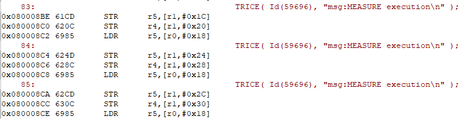
* Measurement: The blue SYSTICK clock counts backwards 6 clocks for each Trice macro (on an ARM M0+), what is less than 100 ns @64 MHz MCU clock: 

A more realistic (typical) timing with target location and µs timestamps, critical section and parameters is shown here with the STM32F030 M0 core:

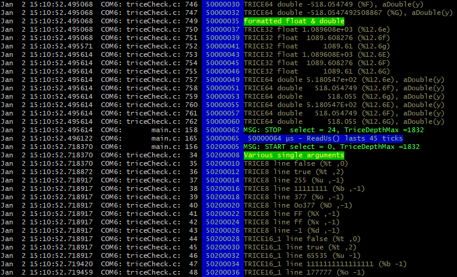

The MCU is clocked with 48 MHz and a Trice duration is about 2 µs, where alone the internal ReadUs() call is already nearly 1 µs long:

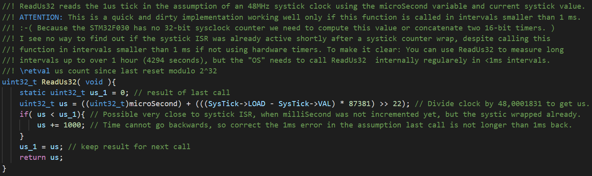

### 27.1. <a id='target-implementation-options'></a>Target Implementation Options

All trice macros use internally this sub-macro:

```C
#define TRICE_PUT(x) do{ *TriceBufferWritePosition++ = TRICE_HTOTL(x); }while(0); //! PUT copies a 32 bit x into the TRICE buffer.
```

The usual case is `#define TRICE_HTOTL(x) (x)`. The `uint32_t* TriceBufferWritePosition` points to a buffer, which is codified and used with the Trice framing sub-macros `TRICE_ENTER` and `TRICE_LEAVE` in dependence of the use case.

#### 27.1.1. <a id='trice-use-cases-trice_static_buffer-and-trice_stack_buffer---direct-mode-only'></a>Trice Use Cases TRICE_STATIC_BUFFER and TRICE_STACK_BUFFER - direct mode only

1. Each singe Trice is build inside a common buffer and finally copied inside the sub-macro `TRICE_LEAVE`.
2. Disabled relevant interrupts between `TRICE_ENTER` and `TRICE_LEAVE` are mantadory for `TRICE_STATIC_BUFFER`.
3. Usable for multiple non-blocking physical Trice channels but **not** recommended for some time blocking channels.
4. A copy call is executed inside `TRICE_LEAVE`.

* With appropriate mapping a direct write to physical output(s) is possible:
  * RTT0 without extra copy.
    * With `TRICE_DIRECT_SEGGER_RTT_32BIT_WRITE` about 100 MCU clocks do the whole work, what is within 1.5 us @ 64 MHz.
  * AUX without extra copy.
  * Not (yet) supported UART transfer loop with polling. With 1MBit baud rate, 4-12 bytes would last 40-120 µs.

#### 27.1.2. <a id='trice-use-case-trice_double_buffer---deferred-mode,-fastest-trice-execution,-more-ram-needed'></a>Trice Use Case TRICE_DOUBLE_BUFFER - deferred mode, fastest Trice execution, more RAM needed

1. Several *trices* are build in a half buffer.
1. No stack used.
1. Disabled interrupts between `TRICE_ENTER` and `TRICE_LEAVE`.
1. Usable for multiple blocking and non-blocking physical Trice channels.
1. No copy call inside `TRICE_LEAVE` but optionally an additional direct mode is supported.

#### 27.1.3. <a id='trice-use-case-trice_ring_buffer---deferred-mode,-balanced-trice-execution-time-and-needed-ram'></a>Trice Use Case TRICE_RING_BUFFER - deferred mode, balanced Trice execution time and needed RAM

1. Each single *trices* is build in a ring buffer segment.
1. No stack used.
1. Disabled interrupts between `TRICE_ENTER` and `TRICE_LEAVE`.
1. Usable for multiple blocking and non-blocking physical Trice channels.
1. No copy call inside `TRICE_LEAVE` but optionally an additional direct mode is supported.
1. Allocation call inside `TRICE_ENTER`

### 27.2. <a id='a-configuration-for-maximum-trice-execution-speed-with-the-l432_inst-example'></a>A configuration for maximum Trice execution speed with the L432_inst example

* To not loose any clocks, the function `SomeExampleTrices` in [triceExamples.c](../examples/exampleData/triceExamples.c) uses the upper case macro `TRICE` for the first "🐁 Speedy Gonzales" Trices.

* The `triceConfig.h` settings are

```C
#define TriceStamp16 (*DWT_CYCCNT) // @64MHz wraps after a bit more than 1ms (MCU clocks)
#define TriceStamp32 (*DWT_CYCCNT) // @64MHz -> 1 µs, wraps after 2^32 µs ~= 1.2 hours

#define TRICE_DEFERRED_UARTA 1
#define TRICE_UARTA USART2

#define TRICE_DEFERRED_OUTPUT 1
#define TRICE_BUFFER TRICE_DOUBLE_BUFFER

#define TRICE_PROTECT 0
#define TRICE_DIAGNOSTICS 0
#define TRICE_CYCLE_COUNTER 0
```

* Both time stamps use the debug watchdog counter running with the 64 MHz MCU clock.
* No direct output to not loose time during the Trice macro execution.
* Critical sections are disabled (default), so be careful where Trices are used.
* The Trice double buffer allows the Trice macros to write without checks.
* The Trice protection, diagnostics and cycle counter are disabled to not perform unneeded clocks.
* Additionally in file [flags.mak](../examples/L432_inst/flags.mak) the optimization is set to`C_FLAGS += -Ofast`.

After running [./build.sh](../examples/L432_inst/build.sh), executing ` arm-none-eabi-objdump.exe -D -S -l out.clang/triceExamples.o` shows:

```bash
out.clang/triceExamples.o:     file format elf32-littlearm


Disassembly of section .text.TriceHeadLine:

00000000 <TriceHeadLine>:
TriceHeadLine():
C:\Users\ms\repos\trice_wt_devel\examples\L432_inst/../exampleData/triceExamples.c:10
#include "trice.h"

//! TriceHeadLine emits a decorated name. The name length should be 18 characters.
void TriceHeadLine(char* name) {
	//! This is usable as the very first trice sequence after restart. Adapt it. Use a UTF-8 capable editor like VS-Code or use pure ASCII.
	TriceS("w: Hello! 👋🙂\n\n        ✨✨✨✨✨✨✨✨✨✨✨✨✨✨✨✨✨        \n        🎈🎈🎈🎈%s🎈🎈🎈🎈\n        🍃🍃🍃🍃🍃🍃🍃🍃🍃🍃🍃🍃🍃🍃🍃🍃🍃        \n\n\n", name);
   0:	f240 0100 	movw	r1, #0
   4:	4602      	mov	r2, r0
   6:	f2c0 0100 	movt	r1, #0
   a:	f643 70f1 	movw	r0, #16369	@ 0x3ff1
   e:	f7ff bffe 	b.w	0 <TriceS>

Disassembly of section .ARM.exidx.text.TriceHeadLine:

00000000 <.ARM.exidx.text.TriceHeadLine>:
   0:	00000000 	andeq	r0, r0, r0
   4:	00000001 	andeq	r0, r0, r1

Disassembly of section .text.SomeExampleTrices:

00000000 <SomeExampleTrices>:
SomeExampleTrices():
C:\Users\ms\repos\trice_wt_devel\examples\L432_inst/../exampleData/triceExamples.c:14
}

//! SomeExampleTrices generates a few Trice example logs and a burst of Trices.
void SomeExampleTrices(int burstCount) {
   0:	b5f0      	push	{r4, r5, r6, r7, lr}
   2:	af03      	add	r7, sp, #12
   4:	e92d 0700 	stmdb	sp!, {r8, r9, sl}
C:\Users\ms\repos\trice_wt_devel\examples\L432_inst/../exampleData/triceExamples.c:15
	TRICE(ID(0), "att:🐁 Speedy Gonzales A  32-bit time stamp\n");
   8:	f240 0100 	movw	r1, #0
   c:	f2c0 0100 	movt	r1, #0
  10:	680d      	ldr	r5, [r1, #0]
  12:	f240 0800 	movw	r8, #0
  16:	f2c0 0800 	movt	r8, #0
  1a:	4604      	mov	r4, r0
  1c:	6829      	ldr	r1, [r5, #0]
  1e:	f8d8 0000 	ldr.w	r0, [r8]
  22:	f06f 0212 	mvn.w	r2, #18
  26:	8041      	strh	r1, [r0, #2]
  28:	0c09      	lsrs	r1, r1, #16
  2a:	1cd3      	adds	r3, r2, #3
  2c:	8081      	strh	r1, [r0, #4]
  2e:	21c0      	movs	r1, #192	@ 0xc0
  30:	8003      	strh	r3, [r0, #0]
  32:	80c1      	strh	r1, [r0, #6]
C:\Users\ms\repos\trice_wt_devel\examples\L432_inst/../exampleData/triceExamples.c:16
	TRICE(ID(0), "att:🐁 Speedy Gonzales B  32-bit time stamp\n");
  34:	682b      	ldr	r3, [r5, #0]
  36:	1c96      	adds	r6, r2, #2
  38:	8143      	strh	r3, [r0, #10]
  3a:	0c1b      	lsrs	r3, r3, #16
  3c:	8106      	strh	r6, [r0, #8]
  3e:	8183      	strh	r3, [r0, #12]
  40:	81c1      	strh	r1, [r0, #14]
C:\Users\ms\repos\trice_wt_devel\examples\L432_inst/../exampleData/triceExamples.c:17
	TRICE(ID(0), "att:🐁 Speedy Gonzales C  32-bit time stamp\n");
  42:	682b      	ldr	r3, [r5, #0]
  44:	1c56      	adds	r6, r2, #1
  46:	8243      	strh	r3, [r0, #18]
  48:	0c1b      	lsrs	r3, r3, #16
  4a:	8206      	strh	r6, [r0, #16]
  4c:	8283      	strh	r3, [r0, #20]
  4e:	82c1      	strh	r1, [r0, #22]
C:\Users\ms\repos\trice_wt_devel\examples\L432_inst/../exampleData/triceExamples.c:18
	TRICE(ID(0), "att:🐁 Speedy Gonzales D  32-bit time stamp\n");
  50:	682b      	ldr	r3, [r5, #0]
  52:	8302      	strh	r2, [r0, #24]
  54:	0c1a      	lsrs	r2, r3, #16
  56:	8343      	strh	r3, [r0, #26]
  58:	8382      	strh	r2, [r0, #28]
  5a:	83c1      	strh	r1, [r0, #30]
  5c:	f64b 7ad4 	movw	sl, #49108	@ 0xbfd4
C:\Users\ms\repos\trice_wt_devel\examples\L432_inst/../exampleData/triceExamples.c:19
	TRICE(Id(0), "att:🐁 Speedy Gonzales E  16-bit time stamp\n");
  60:	682a      	ldr	r2, [r5, #0]
  62:	f6cb 7ad4 	movt	sl, #49108	@ 0xbfd4
  66:	f10a 1318 	add.w	r3, sl, #1572888	@ 0x180018
  6a:	6203      	str	r3, [r0, #32]
  6c:	8482      	strh	r2, [r0, #36]	@ 0x24
  6e:	84c1      	strh	r1, [r0, #38]	@ 0x26
C:\Users\ms\repos\trice_wt_devel\examples\L432_inst/../exampleData/triceExamples.c:20
	TRICE(Id(0), "att:🐁 Speedy Gonzales F  16-bit time stamp\n");
  70:	682a      	ldr	r2, [r5, #0]
  72:	f10a 1317 	add.w	r3, sl, #1507351	@ 0x170017
  76:	6283      	str	r3, [r0, #40]	@ 0x28
  78:	8582      	strh	r2, [r0, #44]	@ 0x2c
  7a:	85c1      	strh	r1, [r0, #46]	@ 0x2e
C:\Users\ms\repos\trice_wt_devel\examples\L432_inst/../exampleData/triceExamples.c:21
	TRICE(Id(0), "att:🐁 Speedy Gonzales G  16-bit time stamp\n");
  7c:	682a      	ldr	r2, [r5, #0]
  7e:	f10a 1316 	add.w	r3, sl, #1441814	@ 0x160016
  82:	6303      	str	r3, [r0, #48]	@ 0x30
  84:	8682      	strh	r2, [r0, #52]	@ 0x34
  86:	86c1      	strh	r1, [r0, #54]	@ 0x36
C:\Users\ms\repos\trice_wt_devel\examples\L432_inst/../exampleData/triceExamples.c:22
	TRICE(Id(0), "att:🐁 Speedy Gonzales H  16-bit time stamp\n");
  88:	682a      	ldr	r2, [r5, #0]
  8a:	f10a 1315 	add.w	r3, sl, #1376277	@ 0x150015
  8e:	8782      	strh	r2, [r0, #60]	@ 0x3c
  90:	f647 72e8 	movw	r2, #32744	@ 0x7fe8
C:\Users\ms\repos\trice_wt_devel\examples\L432_inst/../exampleData/triceExamples.c:23
	TRICE(id(0), "att:🐁 Speedy Gonzales I without time stamp\n");
  94:	f8a0 2040 	strh.w	r2, [r0, #64]	@ 0x40
  98:	f647 72e7 	movw	r2, #32743	@ 0x7fe7
C:\Users\ms\repos\trice_wt_devel\examples\L432_inst/../exampleData/triceExamples.c:24
	TRICE(id(0), "att:🐁 Speedy Gonzales J without time stamp\n");
  9c:	f8a0 2044 	strh.w	r2, [r0, #68]	@ 0x44
  a0:	f647 72e6 	movw	r2, #32742	@ 0x7fe6
C:\Users\ms\repos\trice_wt_devel\examples\L432_inst/../exampleData/triceExamples.c:25
	TRICE(id(0), "att:🐁 Speedy Gonzales K without time stamp\n");
  a4:	f8a0 2048 	strh.w	r2, [r0, #72]	@ 0x48
  a8:	f647 72e5 	movw	r2, #32741	@ 0x7fe5
C:\Users\ms\repos\trice_wt_devel\examples\L432_inst/../exampleData/triceExamples.c:22
	TRICE(Id(0), "att:🐁 Speedy Gonzales H  16-bit time stamp\n");
  ac:	6383      	str	r3, [r0, #56]	@ 0x38
  ae:	87c1      	strh	r1, [r0, #62]	@ 0x3e
C:\Users\ms\repos\trice_wt_devel\examples\L432_inst/../exampleData/triceExamples.c:23
	TRICE(id(0), "att:🐁 Speedy Gonzales I without time stamp\n");
  b0:	f8a0 1042 	strh.w	r1, [r0, #66]	@ 0x42
C:\Users\ms\repos\trice_wt_devel\examples\L432_inst/../exampleData/triceExamples.c:24
	TRICE(id(0), "att:🐁 Speedy Gonzales J without time stamp\n");
  b4:	f8a0 1046 	strh.w	r1, [r0, #70]	@ 0x46
C:\Users\ms\repos\trice_wt_devel\examples\L432_inst/../exampleData/triceExamples.c:25
	TRICE(id(0), "att:🐁 Speedy Gonzales K without time stamp\n");
  b8:	f8a0 104a 	strh.w	r1, [r0, #74]	@ 0x4a
C:\Users\ms\repos\trice_wt_devel\examples\L432_inst/../exampleData/triceExamples.c:26
	TRICE(id(0), "att:🐁 Speedy Gonzales L without time stamp\n");
  bc:	f8a0 204c 	strh.w	r2, [r0, #76]	@ 0x4c
  c0:	f8a0 104e 	strh.w	r1, [r0, #78]	@ 0x4e
TRice0():
C:\Users\ms\repos\trice_wt_devel\examples\L432_inst/../../src/trice.h:741
	Trice32m_0(tid);
	TRICE_UNUSED(pFmt)
}

...
```

* There are only 7 assembler instructions between two `TRICE` macros(around line 17).
* The log output is:

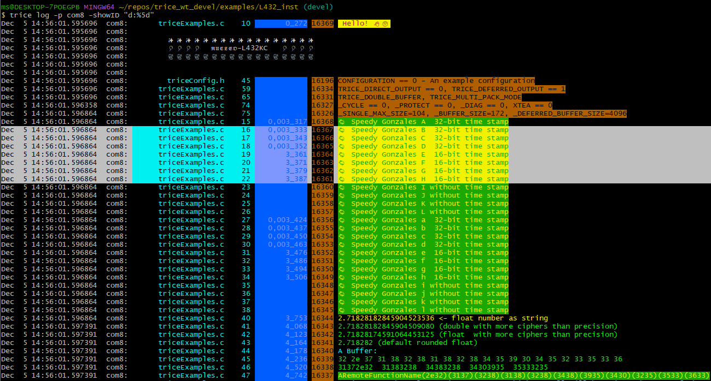

As you can see in the highlighted blue timestamp bar, typical 8-10 clocks are needed for one Trice macro. One clock duration @64MHz is 15.625 ns, so we need about 150 ns for a Trice. Light can travel about 50 meter in that time.

### 27.3. <a id='a-configuration-for-normal-trice-execution-speed-with-the-g0b1_inst-example'></a>A configuration for normal Trice execution speed with the G0B1_inst example

* The `triceConfig.h` settings are

```C
// hardware specific trice lib settings
#include "main.h"
#define TriceStamp16 TIM17->CNT     // 0...999 us
#define TriceStamp32 HAL_GetTick()  // 0...2^32-1 ms (wraps after 49.7 days)

#define TRICE_BUFFER TRICE_RING_BUFFER

// trice l -p JLINK -args="-Device STM32G0B1RE -if SWD -Speed 4000 -RTTChannel 0" -pf none  -d16 -ts ms
//#define TRICE_DIRECT_OUTPUT 1
//#define TRICE_DIRECT_SEGGER_RTT_32BIT_WRITE 1

// trice log -p com7 -pw MySecret -pf COBS
#define TRICE_DEFERRED_OUTPUT 1
#define TRICE_DEFERRED_XTEA_ENCRYPT 1
#define TRICE_DEFERRED_OUT_FRAMING TRICE_FRAMING_COBS
#define TRICE_DEFERRED_UARTA 1
#define TRICE_UARTA USART2

#include "cmsis_gcc.h"
#define TRICE_ENTER_CRITICAL_SECTION { uint32_t primaskstate = __get_PRIMASK(); __disable_irq(); {
#define TRICE_LEAVE_CRITICAL_SECTION } __set_PRIMASK(primaskstate); }
```

* The 16-bit time stamp counts the microseconds within 1 millisecond.
* The 32-bit time stamp counts the milliseconds.
* The ring buffer uses the RAM more effectively for the price of a bit speed.
* The encryption and framing has no influence on the Trice execution speed becuse this is done in the background.
* The critical section protects Trices in different tasks from each-other interruption and allows Trices inside interrupts parallel to normal usage.
* Per default are Trice protection, diagnostics and cycle counter active.

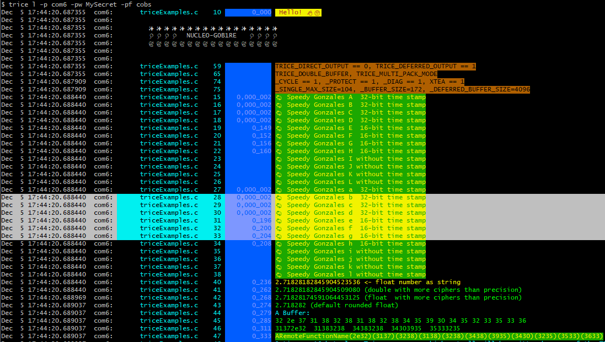

* A typical Trice duration is here 4 microseconds (with `-Ospeed`)
* Switcing the optimization to `-Oz` can result in typical 4-5 µs Trice execution time.
* Additionally enabling the Trice direct out over Segger RTT has this impact:

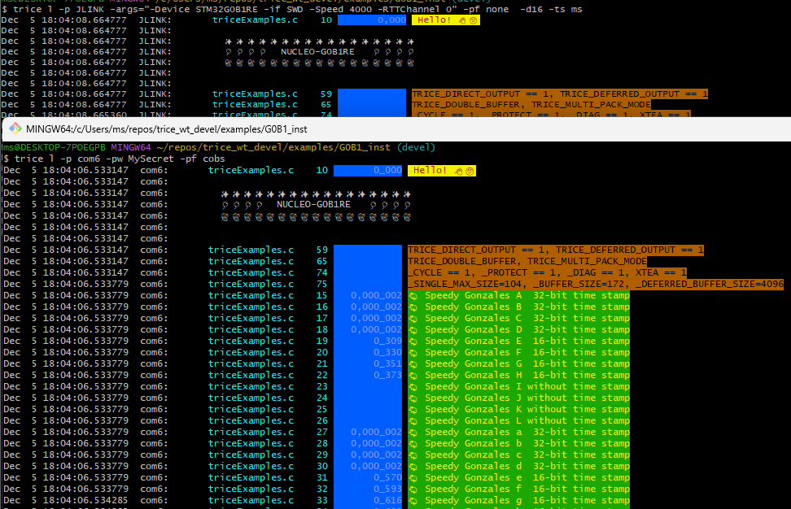

> 🛑 The Trice execution time is now over 20 microseconds❗

Still fast enough for many cases but you hopefully have a good knowledge now how to tune Trice best for your application.

<p align="right">(<a href="#top">back to top</a>)</p>

## 28. <a id='trice-memory-needs'></a>Trice memory needs

Depending on your target configuration the needed space can differ:

### 28.1. <a id='f030_bare-size'></a>F030_bare Size

* `./build.sh`:

```bash
arm-none-eabi-size build/F030_bare.elf
   text    data     bss     dec     hex filename
   2428      12    1564    4004     fa4 build/F030_bare.elf
```

That is the basic size of an empty generated project just containing some drivers.

### 28.2. <a id='f030_inst-size-with-trice_off=1'></a>F030_inst Size with TRICE_OFF=1

* `./build.sh TRICE_OFF=1` :

```bash
arm-none-eabi-size build/F030_inst.elf
   text    data     bss     dec     hex filename
   2428      12    1564    4004     fa4 build/F030_inst.elf
```

This is exactly the same result, proofing that `TRICE_OFF 1` is working correctly.

### 28.3. <a id='f030_inst-with-ring-buffer'></a>F030_inst with ring buffer

* `./build.sh`:

```bash
arm-none-eabi-size out/F030_inst.elf
   text    data     bss     dec     hex filename
   9416      28    2692   12136    2f68 out/F030_inst.elf
```

This is about 7 KB Flash and 1.2 KB RAM size for the Trice library and we see:

```bash
ms@DESKTOP-7POEGPB MINGW64 ~/repos/trice_wt_devel/examples/F030_inst (devel)
$ trice l -p com5 -ts16 "time:     #%6d" -hs off
com5:       triceExamples.c    12      # 65535  Hello! 👋🙂
com5:
com5:         ✨✨✨✨✨✨✨✨✨✨✨✨✨✨✨✨✨
com5:         🎈🎈🎈🎈  𝕹𝖀𝕮𝕷𝕰𝕺-F030R8   🎈🎈🎈🎈
com5:         🍃🍃🍃🍃🍃🍃🍃🍃🍃🍃🍃🍃🍃🍃🍃🍃🍃
com5:
com5:
com5:       triceExamples.c    61              TRICE_DIRECT_OUTPUT == 0, TRICE_DEFERRED_OUTPUT == 1
com5:       triceExamples.c    67              TRICE_DOUBLE_BUFFER, TRICE_MULTI_PACK_MODE
com5:       triceExamples.c    76              _CYCLE == 1, _PROTECT == 1, _DIAG == 1, XTEA == 0
com5:       triceExamples.c    77              _SINGLE_MAX_SIZE=104, _BUFFER_SIZE=172, _DEFERRED_BUFFER_SIZE=1024
com5:       triceExamples.c    29    0,031_804 🐁 Speedy Gonzales a  32-bit time stamp
com5:       triceExamples.c    30    0,031_646 🐁 Speedy Gonzales b  32-bit time stamp
com5:       triceExamples.c    31    0,031_488 🐁 Speedy Gonzales c  32-bit time stamp
com5:       triceExamples.c    32    0,031_330 🐁 Speedy Gonzales d  32-bit time stamp
com5:       triceExamples.c    33      # 31172 🐁 Speedy Gonzales e  16-bit time stamp
com5:       triceExamples.c    34      # 31012 🐁 Speedy Gonzales f  16-bit time stamp
com5:       triceExamples.c    35      # 30852 🐁 Speedy Gonzales g  16-bit time stamp
com5:       triceExamples.c    36      # 30692 🐁 Speedy Gonzales h  16-bit time stamp
com5:       triceExamples.c    42      # 30224 2.71828182845904523536 <- float number as string
com5:       triceExamples.c    43      # 29517 2.71828182845904509080 (double with more ciphers than precision)
com5:       triceExamples.c    44      # 29322 2.71828174591064453125 (float  with more ciphers than precision)
com5:       triceExamples.c    45      # 29145 2.718282 (default rounded float)
com5:       triceExamples.c    46      # 28969 A Buffer:
com5:       triceExamples.c    47      # 28790 32 2e 37 31 38 32 38 31 38 32 38 34 35 39 30 34 35 32 33 35 33 36
com5:       triceExamples.c    48      # 28076 31372e32  31383238  34383238  34303935  35333235
com5:       triceExamples.c    49      # 27430 ARemoteFunctionName(2e32)(3137)(3238)(3138)(3238)(3438)(3935)(3430)(3235)(3533)(3633)
com5:       triceExamples.c    50              5 times a 16 byte long Trice messages, which may not be written all if the buffer is too small:
com5:       triceExamples.c    52      # 26554 i=44444400 aaaaaa00
com5:       triceExamples.c    52      # 26342 i=44444401 aaaaaa01
com5:       triceExamples.c    52      # 26130 i=44444402 aaaaaa02
com5:       triceExamples.c    52      # 25918 i=44444403 aaaaaa03
com5:       triceExamples.c    52      # 25706 i=44444404 aaaaaa04
com5:       triceExamples.c    29    0,031_790 🐁 Speedy Gonzales a  32-bit time stamp
com5:       triceExamples.c    30    0,031_632 🐁 Speedy Gonzales b  32-bit time stamp
com5:       triceExamples.c    31    0,031_474 🐁 Speedy Gonzales c  32-bit time stamp
com5:       triceExamples.c    32    0,031_316 🐁 Speedy Gonzales d  32-bit time stamp
com5:       triceExamples.c    33      # 31158 🐁 Speedy Gonzales e  16-bit time stamp
com5:       triceExamples.c    34      # 30998 🐁 Speedy Gonzales f  16-bit time stamp
com5:       triceExamples.c    35      # 30838 🐁 Speedy Gonzales g  16-bit time stamp
com5:       triceExamples.c    36      # 30678 🐁 Speedy Gonzales h  16-bit time stamp
com5:       triceExamples.c    42      # 30210 2.71828182845904523536 <- float number as string
com5:       triceExamples.c    43      # 29503 2.71828182845904509080 (double with more ciphers than precision)
com5:       triceExamples.c    44      # 29308 2.71828174591064453125 (float  with more ciphers than precision)
com5:       triceExamples.c    45      # 29131 2.718282 (default rounded float)
com5:       triceExamples.c    46      # 28955 A Buffer:
com5:       triceExamples.c    47      # 28776 32 2e 37 31 38 32 38 31 38 32 38 34 35 39 30 34 35 32 33 35 33 36
com5:       triceExamples.c    48      # 28062 31372e32  31383238  34383238  34303935  35333235
com5:       triceExamples.c    49      # 27416 ARemoteFunctionName(2e32)(3137)(3238)(3138)(3238)(3438)(3935)(3430)(3235)(3533)(3633)
com5:       triceExamples.c    50              5 times a 16 byte long Trice messages, which may not be written all if the buffer is too small:
com5:       triceExamples.c    52      # 26540 i=44444400 aaaaaa00
com5:       triceExamples.c    52      # 26328 i=44444401 aaaaaa01
com5:       triceExamples.c    52      # 26116 i=44444402 aaaaaa02
com5:       triceExamples.c    52      # 25904 i=44444403 aaaaaa03
com5:       triceExamples.c    52      # 25692 i=44444404 aaaaaa04
com5:    triceLogDiagData.c    44              triceSingleDepthMax = 108 of 172 (TRICE_BUFFER_SIZE)
com5:    triceLogDiagData.c    67              TriceHalfBufferDepthMax = 388 of  512
com5:       triceExamples.c    29    0,031_344 🐁 Speedy Gonzales a  32-bit time stamp
com5:       triceExamples.c    30    0,031_186 🐁 Speedy Gonzales b  32-bit time stamp
```

### 28.4. <a id='f030_inst-with-ring-buffer-1'></a>F030_inst with ring buffer

* `./build.sh`:

We need 600 bytes more Flash but could have less RAM used:

```bash
   text    data     bss     dec     hex filename
  10060      24    2688   12772    31e4 out/F030_inst.elf
```

```bash
ms@DESKTOP-7POEGPB MINGW64 ~/repos/trice_wt_devel/examples/F030_inst (devel)
$ trice l -p com5 -ts16 "time:     #%6d" -hs off
com5:       triceExamples.c    12      # 65535  Hello! 👋🙂
com5:
com5:         ✨✨✨✨✨✨✨✨✨✨✨✨✨✨✨✨✨
com5:         🎈🎈🎈🎈  𝕹𝖀𝕮𝕷𝕰𝕺-F030R8   🎈🎈🎈🎈
com5:         🍃🍃🍃🍃🍃🍃🍃🍃🍃🍃🍃🍃🍃🍃🍃🍃🍃
com5:
com5:
com5:       triceExamples.c    61              TRICE_DIRECT_OUTPUT == 0, TRICE_DEFERRED_OUTPUT == 1
com5:       triceExamples.c    69              TRICE_RING_BUFFER, TRICE_MULTI_PACK_MODE
com5:       triceExamples.c    76              _CYCLE == 1, _PROTECT == 1, _DIAG == 1, XTEA == 0
com5:       triceExamples.c    77              _SINGLE_MAX_SIZE=104, _BUFFER_SIZE=172, _DEFERRED_BUFFER_SIZE=1024
com5:       triceExamples.c    29    0,031_732 🐁 Speedy Gonzales a  32-bit time stamp
com5:       triceExamples.c    30    0,031_531 🐁 Speedy Gonzales b  32-bit time stamp
com5:       triceExamples.c    31    0,031_330 🐁 Speedy Gonzales c  32-bit time stamp
com5:       triceExamples.c    32    0,031_129 🐁 Speedy Gonzales d  32-bit time stamp
com5:       triceExamples.c    33      # 30928 🐁 Speedy Gonzales e  16-bit time stamp
com5:       triceExamples.c    34      # 30725 🐁 Speedy Gonzales f  16-bit time stamp
com5:       triceExamples.c    35      # 30522 🐁 Speedy Gonzales g  16-bit time stamp
com5:       triceExamples.c    36      # 30319 🐁 Speedy Gonzales h  16-bit time stamp
com5:       triceExamples.c    42      # 29808 2.71828182845904523536 <- float number as string
com5:       triceExamples.c    43      # 29058 2.71828182845904509080 (double with more ciphers than precision)
com5:       triceExamples.c    44      # 28821 2.71828174591064453125 (float  with more ciphers than precision)
com5:       triceExamples.c    45      # 28602 2.718282 (default rounded float)
com5:       triceExamples.c    46      # 28383 A Buffer:
com5:       triceExamples.c    47      # 28162 32 2e 37 31 38 32 38 31 38 32 38 34 35 39 30 34 35 32 33 35 33 36
com5:       triceExamples.c    48      # 27406 31372e32  31383238  34383238  34303935  35333235
com5:       triceExamples.c    49      # 26718 ARemoteFunctionName(2e32)(3137)(3238)(3138)(3238)(3438)(3935)(3430)(3235)(3533)(3633)
com5:       triceExamples.c    50              5 times a 16 byte long Trice messages, which may not be written all if the buffer is too small:
com5:       triceExamples.c    52      # 25757 i=44444400 aaaaaa00
com5:       triceExamples.c    52      # 25502 i=44444401 aaaaaa01
com5:       triceExamples.c    52      # 25247 i=44444402 aaaaaa02
com5:       triceExamples.c    52      # 24992 i=44444403 aaaaaa03
com5:       triceExamples.c    52      # 24737 i=44444404 aaaaaa04
com5:       triceExamples.c    29    0,031_746 🐁 Speedy Gonzales a  32-bit time stamp
com5:       triceExamples.c    30    0,031_545 🐁 Speedy Gonzales b  32-bit time stamp
com5:       triceExamples.c    31    0,031_344 🐁 Speedy Gonzales c  32-bit time stamp
com5:       triceExamples.c    32    0,031_143 🐁 Speedy Gonzales d  32-bit time stamp
com5:       triceExamples.c    33      # 30942 🐁 Speedy Gonzales e  16-bit time stamp
com5:       triceExamples.c    34      # 30739 🐁 Speedy Gonzales f  16-bit time stamp
com5:       triceExamples.c    35      # 30536 🐁 Speedy Gonzales g  16-bit time stamp
com5:       triceExamples.c    36      # 30333 🐁 Speedy Gonzales h  16-bit time stamp
com5:       triceExamples.c    42      # 29822 2.71828182845904523536 <- float number as string
com5:       triceExamples.c    43      # 29072 2.71828182845904509080 (double with more ciphers than precision)
com5:       triceExamples.c    44      # 28835 2.71828174591064453125 (float  with more ciphers than precision)
com5:       triceExamples.c    45      # 28616 2.718282 (default rounded float)
com5:       triceExamples.c    46      # 28397 A Buffer:
com5:       triceExamples.c    47      # 28176 32 2e 37 31 38 32 38 31 38 32 38 34 35 39 30 34 35 32 33 35 33 36
com5:       triceExamples.c    48      # 27420 31372e32  31383238  34383238  34303935  35333235
com5:       triceExamples.c    49      # 26732 ARemoteFunctionName(2e32)(3137)(3238)(3138)(3238)(3438)(3935)(3430)(3235)(3533)(3633)
com5:       triceExamples.c    50              5 times a 16 byte long Trice messages, which may not be written all if the buffer is too small:
com5:       triceExamples.c    52      # 25771 i=44444400 aaaaaa00
com5:       triceExamples.c    52      # 25516 i=44444401 aaaaaa01
com5:       triceExamples.c    52      # 25261 i=44444402 aaaaaa02
com5:       triceExamples.c    52      # 25006 i=44444403 aaaaaa03
com5:       triceExamples.c    52      # 24751 i=44444404 aaaaaa04
com5:    triceLogDiagData.c    44              triceSingleDepthMax = 108 of 172 (TRICE_BUFFER_SIZE)
com5:    triceLogDiagData.c    75              triceRingBufferDepthMax = 324 of 1024
com5:       triceExamples.c    29    0,031_188 🐁 Speedy Gonzales a  32-bit time stamp
com5:       triceExamples.c    30    0,030_987 🐁 Speedy Gonzales b  32-bit time stamp
```

### 28.5. <a id='a-developer-setting,-only-enabling-segger_rtt'></a>A developer setting, only enabling SEGGER_RTT

* `./build.sh`:

```bash
arm-none-eabi-size out/F030_inst.elf
   text    data     bss     dec     hex filename
   6656      16    2768    9440    24e0 out/F030_inst.elf
```

About 4 KB Flash needed and we see:

```bash
ms@DESKTOP-7POEGPB MINGW64 ~/repos/trice_wt_devel/examples/F030_inst (devel)
$ trice l -p jlink -args "-Device STM32F030R8 -if SWD -Speed 4000 -RTTChannel 0" -pf none -d16 -showID "deb:%5d"
Dec  6 16:14:38.276356  jlink:       triceExamples.c    12       65_535 16369  Hello! 👋🙂
Dec  6 16:14:38.276356  jlink:
Dec  6 16:14:38.276356  jlink:         ✨✨✨✨✨✨✨✨✨✨✨✨✨✨✨✨✨
Dec  6 16:14:38.276356  jlink:         🎈🎈🎈🎈  𝕹𝖀𝕮𝕷𝕰𝕺-F030R8   🎈🎈🎈🎈
Dec  6 16:14:38.276356  jlink:         🍃🍃🍃🍃🍃🍃🍃🍃🍃🍃🍃🍃🍃🍃🍃🍃🍃
Dec  6 16:14:38.276356  jlink:
Dec  6 16:14:38.276356  jlink:
Dec  6 16:14:38.276356  jlink:       triceExamples.c    61              16334 TRICE_DIRECT_OUTPUT == 1, TRICE_DEFERRED_OUTPUT == 0
Dec  6 16:14:38.276356  jlink:       triceExamples.c    63              16333 TRICE_STACK_BUFFER, TRICE_MULTI_PACK_MODE
Dec  6 16:14:38.276920  jlink:       triceExamples.c    76              16327 _CYCLE == 1, _PROTECT == 1, _DIAG == 1, XTEA == 0
Dec  6 16:14:38.277424  jlink:       triceExamples.c    77              16326 _SINGLE_MAX_SIZE=104, _BUFFER_SIZE=172, _DEFERRED_BUFFER_SIZE=1024
Dec  6 16:14:39.181228  jlink:       triceExamples.c    29    0,031_848 16356 🐁 Speedy Gonzales a  32-bit time stamp
Dec  6 16:14:39.181228  jlink:       triceExamples.c    30    0,031_292 16355 🐁 Speedy Gonzales b  32-bit time stamp
Dec  6 16:14:39.181228  jlink:       triceExamples.c    31    0,030_736 16354 🐁 Speedy Gonzales c  32-bit time stamp
Dec  6 16:14:39.181228  jlink:       triceExamples.c    32    0,030_180 16353 🐁 Speedy Gonzales d  32-bit time stamp
Dec  6 16:14:39.181228  jlink:       triceExamples.c    33       29_624 16352 🐁 Speedy Gonzales e  16-bit time stamp
Dec  6 16:14:39.181228  jlink:       triceExamples.c    34       29_066 16351 🐁 Speedy Gonzales f  16-bit time stamp
Dec  6 16:14:39.181228  jlink:       triceExamples.c    35       28_508 16350 🐁 Speedy Gonzales g  16-bit time stamp
Dec  6 16:14:39.181228  jlink:       triceExamples.c    36       27_950 16349 🐁 Speedy Gonzales h  16-bit time stamp
Dec  6 16:14:39.181228  jlink:       triceExamples.c    42       27_086 16344 2.71828182845904523536 <- float number as string
Dec  6 16:14:39.181228  jlink:       triceExamples.c    43       25_906 16343 2.71828182845904509080 (double with more ciphers than precision)
Dec  6 16:14:39.181798  jlink:       triceExamples.c    44       25_305 16342 2.71828174591064453125 (float  with more ciphers than precision)
Dec  6 16:14:39.181798  jlink:       triceExamples.c    45       24_727 16341 2.718282 (default rounded float)
Dec  6 16:14:39.181798  jlink:       triceExamples.c    46       24_148 16340 A Buffer:
Dec  6 16:14:39.181798  jlink:       triceExamples.c    47       23_578 16339 32 2e 37 31 38 32 38 31 38 32 38 34 35 39 30 34 35 32 33 35 33 36
Dec  6 16:14:39.181798  jlink:       triceExamples.c    48       22_394 16338 31372e32  31383238  34383238  34303935  35333235
Dec  6 16:14:39.181798  jlink:       triceExamples.c    49       21_295 16337 ARemoteFunctionName(2e32)(3137)(3238)(3138)(3238)(3438)(3935)(3430)(3235)(3533)(3633)
Dec  6 16:14:39.181798  jlink:       triceExamples.c    50              16200 5 times a 16 byte long Trice messages, which may not be written all if the buffer is too small:
Dec  6 16:14:39.182303  jlink:       triceExamples.c    52       19_555 16335 i=44444400 aaaaaa00
Dec  6 16:14:39.182303  jlink:       triceExamples.c    52       18_941 16335 i=44444401 aaaaaa01
Dec  6 16:14:39.182303  jlink:       triceExamples.c    52       18_327 16335 i=44444402 aaaaaa02
Dec  6 16:14:39.182834  jlink:       triceExamples.c    52       17_713 16335 i=44444403 aaaaaa03
Dec  6 16:14:39.182834  jlink:       triceExamples.c    52       17_099 16335 i=44444404 aaaaaa04
Dec  6 16:14:40.187121  jlink:       triceExamples.c    29    0,031_855 16356 🐁 Speedy Gonzales a  32-bit time stamp
Dec  6 16:14:40.187121  jlink:       triceExamples.c    30    0,031_299 16355 🐁 Speedy Gonzales b  32-bit time stamp
Dec  6 16:14:40.187121  jlink:       triceExamples.c    31    0,030_743 16354 🐁 Speedy Gonzales c  32-bit time stamp
Dec  6 16:14:40.187121  jlink:       triceExamples.c    32    0,030_187 16353 🐁 Speedy Gonzales d  32-bit time stamp
Dec  6 16:14:40.187121  jlink:       triceExamples.c    33       29_631 16352 🐁 Speedy Gonzales e  16-bit time stamp
Dec  6 16:14:40.187121  jlink:       triceExamples.c    34       29_073 16351 🐁 Speedy Gonzales f  16-bit time stamp
Dec  6 16:14:40.187121  jlink:       triceExamples.c    35       28_515 16350 🐁 Speedy Gonzales g  16-bit time stamp
Dec  6 16:14:40.187121  jlink:       triceExamples.c    36       27_957 16349 🐁 Speedy Gonzales h  16-bit time stamp
Dec  6 16:14:40.187121  jlink:       triceExamples.c    42       27_093 16344 2.71828182845904523536 <- float number as string
Dec  6 16:14:40.187121  jlink:       triceExamples.c    43       25_913 16343 2.71828182845904509080 (double with more ciphers than precision)
Dec  6 16:14:40.187121  jlink:       triceExamples.c    44       25_310 16342 2.71828174591064453125 (float  with more ciphers than precision)
Dec  6 16:14:40.187121  jlink:       triceExamples.c    45       24_730 16341 2.718282 (default rounded float)
Dec  6 16:14:40.187121  jlink:       triceExamples.c    46       24_149 16340 A Buffer:
Dec  6 16:14:40.187121  jlink:       triceExamples.c    47       23_577 16339 32 2e 37 31 38 32 38 31 38 32 38 34 35 39 30 34 35 32 33 35 33 36
Dec  6 16:14:40.187630  jlink:       triceExamples.c    48       22_391 16338 31372e32  31383238  34383238  34303935  35333235
Dec  6 16:14:40.187690  jlink:       triceExamples.c    49       21_290 16337 ARemoteFunctionName(2e32)(3137)(3238)(3138)(3238)(3438)(3935)(3430)(3235)(3533)(3633)
Dec  6 16:14:40.187690  jlink:       triceExamples.c    50              16200 5 times a 16 byte long Trice messages, which may not be written all if the buffer is too small:
Dec  6 16:14:40.187690  jlink:       triceExamples.c    52       19_546 16335 i=44444400 aaaaaa00
Dec  6 16:14:40.188195  jlink:       triceExamples.c    52       18_930 16335 i=44444401 aaaaaa01
Dec  6 16:14:40.188195  jlink:       triceExamples.c    52       18_314 16335 i=44444402 aaaaaa02
Dec  6 16:14:40.188195  jlink:       triceExamples.c    52       17_698 16335 i=44444403 aaaaaa03
Dec  6 16:14:40.188195  jlink:       triceExamples.c    52       17_082 16335 i=44444404 aaaaaa04
Dec  6 16:14:41.191648  jlink:    triceLogDiagData.c    21              16382 RTT0_writeDepthMax=325 (BUFFER_SIZE_UP=1024)
Dec  6 16:14:41.191648  jlink:    triceLogDiagData.c    44              16378 triceSingleDepthMax = 108 of 172 (TRICE_BUFFER_SIZE)
Dec  6 16:14:41.191648  jlink:       triceExamples.c    29    0,030_628 16356 🐁 Speedy Gonzales a  32-bit time stamp
Dec  6 16:14:41.191648  jlink:       triceExamples.c    30    0,030_072 16355 🐁 Speedy Gonzales b  32-bit time stamp
```

"🐁 Speedy Gonzales" needs about 500 MCU clocks.

### 28.6. <a id='a-developer-setting,-only-enabling-segger_rtt-and-without-deferred-output-gives-after-running-`./build.sh-trice_diagnostics=0-trice_protect=0`:'></a>A developer setting, only enabling SEGGER_RTT and without deferred output gives after running `./build.sh TRICE_DIAGNOSTICS=0 TRICE_PROTECT=0`:

```bash
arm-none-eabi-size out/F030_inst.elf
   text    data     bss     dec     hex filename
   5796      16    2736    8548    2164 out/F030_inst.elf
```

That is nearly 1 KB less Flash needs.

The output:

```bash
ms@DESKTOP-7POEGPB MINGW64 ~/repos/trice_wt_devel/examples/F030_inst (devel)
$ trice l -p jlink -args "-Device STM32F030R8 -if SWD -Speed 4000 -RTTChannel 0" -pf none -d16 -showID "deb:%5d"
Dec  6 16:20:10.545274  jlink:       triceExamples.c    12       65_535 16369  Hello! 👋🙂
Dec  6 16:20:10.545274  jlink:
Dec  6 16:20:10.545274  jlink:         ✨✨✨✨✨✨✨✨✨✨✨✨✨✨✨✨✨
Dec  6 16:20:10.545274  jlink:         🎈🎈🎈🎈  𝕹𝖀𝕮𝕷𝕰𝕺-F030R8   🎈🎈🎈🎈
Dec  6 16:20:10.545274  jlink:         🍃🍃🍃🍃🍃🍃🍃🍃🍃🍃🍃🍃🍃🍃🍃🍃🍃
Dec  6 16:20:10.545274  jlink:
Dec  6 16:20:10.545274  jlink:
Dec  6 16:20:10.545274  jlink:       triceExamples.c    61              16334 TRICE_DIRECT_OUTPUT == 1, TRICE_DEFERRED_OUTPUT == 0
Dec  6 16:20:10.545274  jlink:       triceExamples.c    63              16333 TRICE_STACK_BUFFER, TRICE_MULTI_PACK_MODE
Dec  6 16:20:10.545890  jlink:       triceExamples.c    76              16327 _CYCLE == 1, _PROTECT == 0, _DIAG == 0, XTEA == 0
Dec  6 16:20:10.546396  jlink:       triceExamples.c    77              16326 _SINGLE_MAX_SIZE=104, _BUFFER_SIZE=172, _DEFERRED_BUFFER_SIZE=1024
Dec  6 16:20:11.448885  jlink:       triceExamples.c    29    0,031_859 16356 🐁 Speedy Gonzales a  32-bit time stamp
Dec  6 16:20:11.448885  jlink:       triceExamples.c    30    0,031_661 16355 🐁 Speedy Gonzales b  32-bit time stamp
Dec  6 16:20:11.448885  jlink:       triceExamples.c    31    0,031_463 16354 🐁 Speedy Gonzales c  32-bit time stamp
Dec  6 16:20:11.448885  jlink:       triceExamples.c    32    0,031_265 16353 🐁 Speedy Gonzales d  32-bit time stamp
Dec  6 16:20:11.448885  jlink:       triceExamples.c    33       31_067 16352 🐁 Speedy Gonzales e  16-bit time stamp
Dec  6 16:20:11.448885  jlink:       triceExamples.c    34       30_867 16351 🐁 Speedy Gonzales f  16-bit time stamp
Dec  6 16:20:11.448885  jlink:       triceExamples.c    35       30_667 16350 🐁 Speedy Gonzales g  16-bit time stamp
Dec  6 16:20:11.448885  jlink:       triceExamples.c    36       30_467 16349 🐁 Speedy Gonzales h  16-bit time stamp
Dec  6 16:20:11.549660  jlink:       triceExamples.c    42       29_961 16344 2.71828182845904523536 <- float number as string
Dec  6 16:20:11.549660  jlink:       triceExamples.c    43       29_141 16343 2.71828182845904509080 (double with more ciphers than precision)
Dec  6 16:20:11.549660  jlink:       triceExamples.c    44       28_897 16342 2.71828174591064453125 (float  with more ciphers than precision)
Dec  6 16:20:11.549660  jlink:       triceExamples.c    45       28_675 16341 2.718282 (default rounded float)
Dec  6 16:20:11.549660  jlink:       triceExamples.c    46       28_452 16340 A Buffer:
Dec  6 16:20:11.550166  jlink:       triceExamples.c    47       28_238 16339 32 2e 37 31 38 32 38 31 38 32 38 34 35 39 30 34 35 32 33 35 33 36
Dec  6 16:20:11.550247  jlink:       triceExamples.c    48       27_412 16338 31372e32  31383238  34383238  34303935  35333235
Dec  6 16:20:11.550247  jlink:       triceExamples.c    49       26_671 16337 ARemoteFunctionName(2e32)(3137)(3238)(3138)(3238)(3438)(3935)(3430)(3235)(3533)(3633)
Dec  6 16:20:11.550247  jlink:       triceExamples.c    50              16200 5 times a 16 byte long Trice messages, which may not be written all if the buffer is too small:
Dec  6 16:20:11.550754  jlink:       triceExamples.c    52       25_646 16335 i=44444400 aaaaaa00
Dec  6 16:20:11.550754  jlink:       triceExamples.c    52       25_389 16335 i=44444401 aaaaaa01
Dec  6 16:20:11.550754  jlink:       triceExamples.c    52       25_132 16335 i=44444402 aaaaaa02
Dec  6 16:20:11.551285  jlink:       triceExamples.c    52       24_875 16335 i=44444403 aaaaaa03
Dec  6 16:20:11.551285  jlink:       triceExamples.c    52       24_618 16335 i=44444404 aaaaaa04
Dec  6 16:20:12.453968  jlink:       triceExamples.c    29    0,031_859 16356 🐁 Speedy Gonzales a  32-bit time stamp
Dec  6 16:20:12.453968  jlink:       triceExamples.c    30    0,031_661 16355 🐁 Speedy Gonzales b  32-bit time stamp
```

"🐁 Speedy Gonzales" direct outout needs about 200 MCU clocks and not 500 as before.

### 28.7. <a id='settings-conclusion'></a>Settings Conclusion

* 4-8 KB Flash and 1.2 KB RAM needed for the Trice library.
* Switching off diagnostics and/or protection is ok for less memory needs and faster Trice execution after getting some experience with the project.

### 28.8. <a id='legacy-trice-space-example-(old-version)'></a>Legacy Trice Space Example (Old Version)

* STM32CubeMX generated empty default project: `Program Size: Code=2208 RO-data=236 RW-data=4 ZI-data=1636`
* Same project with default `Trice` instrumentation: `Program Size: Code=2828 RO-data=236 RW-data=44 ZI-data=1836`
* Needed [FLASH memory](https://en.wikipedia.org/wiki/Flash_memory): 620 Bytes
* Needed [RAM](https://en.wikipedia.org/wiki/Random-access_memory): 40 Bytes plus 200 Bytes for the 2 times 100 Bytes double buffer
* With increased/decreased buffers also more/less [RAM](https://en.wikipedia.org/wiki/Random-access_memory) is needed.
* With each additional Trice macro a few additional [FLASH memory](https://en.wikipedia.org/wiki/Flash_memory) bytes, like 10 assembler instructions, are needed.
* No printf-like library code is used anymore.
* No format strings go into the target code anymore.
* In general Trice instrumentation **reduces** the needed memory compared to a printf-like implementation.

### 28.9. <a id='memory-needs-for-old-example-1'></a>Memory Needs for Old Example 1

The following numbers are measured with a legacy encoding, showing that the instrumentation code can be even smaller.

| Program Size (STM32-F030R8 demo project)      | trice instrumentation | buffer size | compiler optimize for time | comment                         |
|-----------------------------------------------|-----------------------|-------------|----------------------------|---------------------------------|
| Code=1592 RO-data=236 RW-data= 4 ZI-data=1028 | none                  | 0           | off                        | CubeMX generated, no trice      |
| Code=1712 RO-data=240 RW-data=24 ZI-data=1088 | core                  | 64          | off                        | core added without trices       |
| Code=3208 RO-data=240 RW-data=36 ZI-data=1540 | TriceCheckSet()       | 512         | off                        | TRICE_SHORT_MEMORY is 1 (small) |
| Code=3808 RO-data=240 RW-data=36 ZI-data=1540 | TriceCheckSet()       | 512         | on                         | TRICE_SHORT_MEMORY is 0 (fast)  |

* The core instrumentation needs less 150 bytes FLASH and about 100 bytes RAM when buffer size is 64 bytes.
* The about 50 trices in TriceCheckSet() allocate roughly 2100 (fast mode) or 1500 (small mode) bytes.
* trices are removable without code changes with `#define TRICE_OFF 1` before `incude "trice.h"` on file level or generally on project level.

### 28.10. <a id='memory-needs-for-old-example-2'></a>Memory Needs for Old Example 2

| Project                        | Compiler    | Optimization | Link-Time-Optimization | Result                                        | Remark                                                             |
|--------------------------------|-------------|--------------|------------------------|-----------------------------------------------|--------------------------------------------------------------------|
| MDK-ARM_STM32F030_bareerated   | CLANG v6.19 | -Oz          | yes                    | Code=1020 RO-data=196 RW-data=0 ZI-data=1024  | This is the plain generated project without trice instrumentation. |
| MDK-ARM_STM32F030_instrumented | CLANG v6.19 | -Oz          | yes                    | Code=4726 RO-data=238 RW-data=16 ZI-data=4608 | This is with full trice instrumentation with example messages.     |

* The size need is less than 4 KB. See also [Trice Project Image Size Optimization](#trice-project-image-size-optimization).

<p align="right">(<a href="#top">back to top</a>)</p>

## 29. <a id='trice-project-image-size-optimization'></a>Trice Project Image Size Optimization

Modern compilers are optimizing out unused code automatically, but you can help to reduce trice code size if your compiler is not perfect.

### 29.1. <a id='code-optimization--o3-or--oz-(if-supported)'></a>Code Optimization -o3 or -oz (if supported)

For debugging it could be helpful to switch off code optimization what increases the code size. A good choice is `-o1`. See also
[TRICE_STACK_BUFFER could cause stack overflow with -o0 optimization](#direct-trice-out-(trice_mode-trice_stack_buffer)-could-cause-stack-overflow-with--o0-optimization).


### 29.2. <a id='compiler-independent-setting-(a-bit-outdated)'></a>Compiler Independent Setting (a bit outdated)

Maybe the following is a bit unhandy but it decreases the code amount, build time and the image size.

* For **X=8|16|32|64** and **N=0...12** selectively set `#define ENABLE_trice`**X**`fn_`**N**` 1` to ` 0` for unused functions in project specific file `triceConfig.h`.
* For **X=8|16|32|64** and **N=0...12** selectively set `#define ENABLE_Trice`**X**`fn_`**N**` 1` to ` 0` for unused functions in project specific file `triceConfig.h`.
* For **X=8|16|32|64** and **N=0...12** selectively set `#define ENABLE_TRice`**X**`fn_`**N**` 1` to ` 0` for unused functions in project specific file `triceConfig.h`.

When having lots of program memory simply let all values be `1`. With specific linker optimization unused functions can get stripped out automatically.

It is possible to `#define TRICE_SINGLE_MAX_SIZE 12` for example in *triceConfig.h*. This automaticaly disables all Trice messages with payloads > 8 bytes (Trice size is 4 bytes).

### 29.3. <a id='linker-option---split-sections-(if-supported)'></a>Linker Option --split-sections (if supported)

In ARM-MDK uVision `Project -> Options -> C/C++ -> "One EFL section for each function"` allows good optimization and getting rid of unused code without additional linker optimization. This leads to a faster build process and is fine for most cases. It allows excluding unused functions.

### 29.4. <a id='linker-optimization--flto-(if-supported)'></a>Linker Optimization -flto (if supported)

* To get the smallest possible image, do _not_ use option `--split sections`.
* Use linker optimization alone.
* This increases the build time but reduces the image size significantly.

#### 29.4.1. <a id='armcc-compiler-v5-"linker-feedback"'></a>ARMCC compiler v5 "Linker Feedback"

* In ARM-MDK uVision, when using ARMCC compiler v5, there is a check box `Project -> Options -> Target -> "Cross Module Optimization"`.
* In ARMCC this works also with the lite version.

#### 29.4.2. <a id='armclang-compiler-v6-"link-time-optimization"'></a>ARMCLANG compiler v6 "Link-Time Optimization"

* In ARM-MDK uVision, when using ARMCLANG compiler v6, the check box `Project -> Options -> C/C++(AC6) -> "Link-Time Optimization"` is usable to set the CLI `-flto` switch.
* LTO is not possible with ARMCLANG6 lite: https://developer.arm.com/documentation/ka004054/latest.

#### 29.4.3. <a id='gcc'></a>GCC

With GCC use the `-flto` CLI switch directly.

#### 29.4.4. <a id='llvm-arm-clang'></a>LLVM ARM Clang

This compiler is much faster and creates the smallest images. Right now it uses the GCC libs and linker.

#### 29.4.5. <a id='other-ide´s-and-compilers'></a>Other IDE´s and compilers

Please check the manuals and create a pull request or simply let me know.

### 29.5. <a id='legacy-stm32f030-example-project---different-build-sizes'></a>Legacy STM32F030 Example Project - Different Build Sizes

#### 29.5.1. <a id='armcc-compiler-v5'></a>ARMCC compiler v5

| Compiler | Linker         | Result                                          | Comment                           |
|----------|----------------|-------------------------------------------------|-----------------------------------|
| o0       |                | Code=46942 RO-data=266 RW-data=176 ZI-data=4896 | very big                          |
| o1       |                | Code=22582 RO-data=258 RW-data=168 ZI-data=4896 |                                   |
| o3       |                | Code=21646 RO-data=258 RW-data=168 ZI-data=4896 |                                   |
| o0       | split sections | Code= 7880 RO-data=268 RW-data=156 ZI-data=4892 | for debugging                     |
| o1       | split sections | Code= 5404 RO-data=260 RW-data=148 ZI-data=4892 | **for debugging**                 |
| o3       | split sections | Code= 4996 RO-data=260 RW-data=148 ZI-data=4892 | **good balance**                  |
| o0       | flto           | Code= 8150 RO-data=266 RW-data=176 ZI-data=4896 | builds slower                     |
| o1       | flto           | Code= 5210 RO-data=258 RW-data=148 ZI-data=4892 | builds slower                     |
| o3       | flto           | Code= 4818 RO-data=258 RW-data=148 ZI-data=4892 | builds slower, **smallest image** |

<p align="right">(<a href="#top">back to top</a>)</p>

## 30. <a id='trice-tags-and-color'></a>Trice Tags and Color

### 30.1. <a id='how-to-get'></a>How to get

* Add a tag name as color descriptor in front of each Trice format string like `"wrn:Peng!"`.
* In file [../internal/emitter/lineTransformerANSI.go](../internal/emitter/lineTransformerANSI.go) the colors are changeable and additional color tags definable.
* It is possible to concatenate single colorized letters to get output like this:


* [../_test/testdata/triceCheck.c](../_test/testdata/triceCheck.c) contains the code for this example.
* The Trice tool, if knowing `wrn:` as pattern, prepends the appropriate color code. It removes the sequence `wrn:`, if it is known and completely lower case.
* The user can define any pattern with any color code to create colored output with the Trice tool.
* There is no tag enable switch inside the target code. It would need a back channel and add overhead.
* An option using tag specific ID ranges with optional routing exists.
* The Trice tool offers the 2 command line switches `-pick` and `-ban` to control tag visualization during runtime.

#### 30.1.1. <a id='output-options'></a>Output options

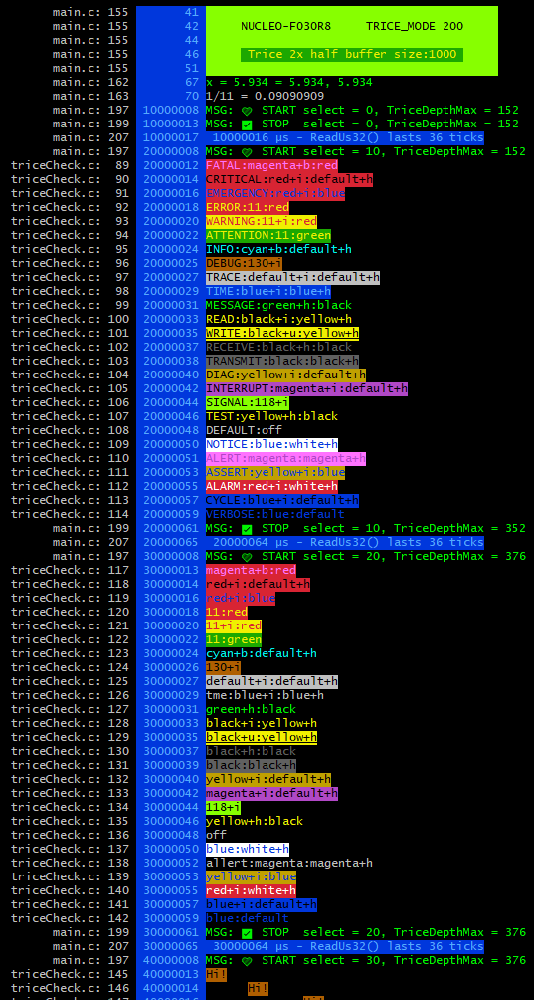

#### 30.1.2. <a id='check-alternatives'></a>Check Alternatives

There are over 1000 possibilities:

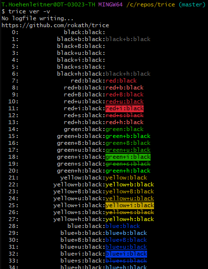

To see them all run `trice generate -color`. Only file [../internal/emitter/lineTransformerANSI.go](../internal/emitter/lineTransformerANSI.go) needs to be changed and the Trice tool needs to be rebuild afterwards: `go install ./...`. If you design a good looking flavour, feel free to propose it. 

### 30.2. <a id='color-issues-under-windows'></a>Color issues under Windows

**Currently console colors are not enabled by default in Win10**, so if you see no color but escape sequences on your powershell or cmd window, please refer to [Windows console with ANSI colors handling](https://superuser.com/questions/413073/windows-console-with-ansi-colors-handling/1050078#1050078) or simply use a Linux like terminal under windows, like git-bash. One option is also to install Microsoft *Windows Terminal (Preview)* from inside the Microsoft store and to start the Trice tool inside there. Unfortunately this can not be done automatically right now because of missing command line switches. [Alacritty](../third_party/alacritty/ReadMe.md) is one of other alternatives.

<p align="right">(<a href="#top">back to top</a>)</p>

## 31. <a id='trice-without-uart'></a>Trice without UART

A very performant output path is RTT, if your MCU supports background memory access like the ARM-M ones.

Because the Trice tool needs only to receive, a single target UART-TX pin will do. But it is also possible to use a GPIO-Pin for Trice messages without occupying a UART resource.

* This slow path is usable because a Trice needs only few bytes for transmission.
* You can transmit each basic trice (4 or 8 bytes) as bare message over one pin:

  
  

* The 2 images are taken from [https://circuitcellar.com/cc-blog/a-trace-tool-for-embedded-systems/](https://circuitcellar.com/cc-blog/a-trace-tool-for-embedded-systems/). See there for more information.
* As Trice dongle you can use any spare MCU board with an UART together with an FTDI USB converter.
  * This allowes also any other data path - method does'nt matter:\
  [UART](https://en.wikipedia.org/wiki/Universal_asynchronous_receiver-transmitter),\
  [I²C](https://en.wikipedia.org/wiki/I%C2%B2C),\
  [SPI](https://en.wikipedia.org/wiki/Serial_Peripheral_Interface),\
  [GPIO](https://circuitcellar.com/cc-blog/a-trace-tool-for-embedded-systems/),\
  [CAN](https://en.wikipedia.org/wiki/CAN_bus),\
  [LIN](https://en.wikipedia.org/wiki/Local_Interconnect_Network), ...
* [RTT](https://www.segger.com/products/debug-probes/j-link/technology/about-real-time-transfer/) is also a possible path to use - see [Segger RTT](#trice-over-rtt) for options.

<p align="right">(<a href="#top">back to top</a>)</p>


## 32. <a id='trice-over-rtt'></a>Trice over RTT

> Allows Trice over the debug probe without using a pin or UART.


* RTT works good with a SEGGER J-Link debug probe but needs some closed source software components.
* Also ST-Link is usable for Trice logs, but maybe not parallel with debugging.
* Most investigations where done with a [NUCLEO64-STM32F030R8 evaluation board](https://www.st.com/en/evaluation-tools/nucleo-f030r8.html) which contains an on-board debug probe reflashed with a SEGGER J-Link OB software (see below).
  * When using very high Trice loads over RTT for a long time, sometimes an on-board J-Link (re-flashed ST-Link) could get internally into an inconsistent state (probably internal buffer overrun), what needs a power cycle then.
* You could consider RTT over open-OCD as an alternative.
* The default SEGGER up-buffer size is 1024 bytes, enough for most cases. If not, adapt it in your [SEGGER_RTT_Conf.h](../examples/F030_inst/Core/Inc/SEGGER_RTT_Conf.h) file.
* Possible: Parallel usage of RTT direct mode with UART deferred mode. You can define `TRICE_UARTA_MIN_ID` and `TRICE_UARTA_MAX_ID` inside triceConfig.h to log only a specific ID range over UARTA in deferred mode for example. ([#446](https://github.com/rokath/trice/issues/446))

<p align="right">(<a href="#top">back to top</a>)</p>

### 32.1. <a id='for-the-impatient-(2-possibilities)'></a>For the impatient (2 possibilities)

The default SEGGER tools only suport RTT channel 0.

#### 32.1.1. <a id='start-jlink-commander-and-connect-over-tcp'></a>Start JLink commander and connect over TCP

* JLink.exe → `connect ⏎ ⏎ S ⏎` and keep it active.
  * You can control the target with `r[eset], g[o], h[alt]` and use other commands too.
  * 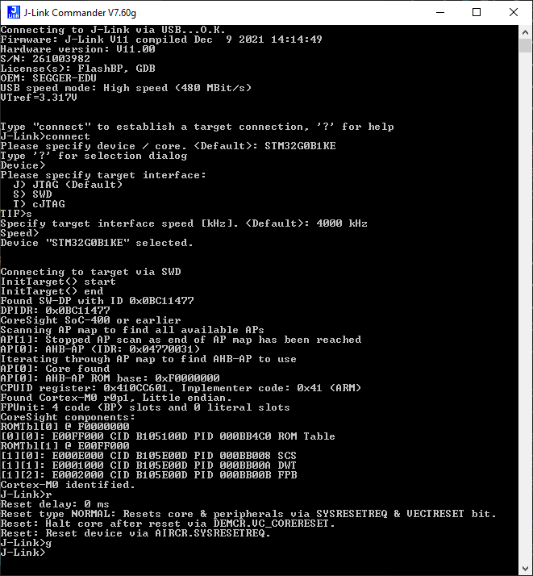
* Start in Git-Bash or s.th. similar: `trice l -p TCP4 -args localhost:19021`
* You may need a Trice tool restart after firmware reload.


<a id='setup-tcp4-server-providing-the-trace-data'></a><h5>Setup TCP4 server providing the trace data</h5>

This is just the SEGGER J-Link server here for demonstration, but if your target device has an TCP4 interface, you can replace this with your target server.

```bash
ms@DESKTOP-7POEGPB MINGW64 ~/repos/trice (master)
$ jlink
SEGGER J-Link Commander V7.92g (Compiled Sep 27 2023 15:36:46)
DLL version V7.92g, compiled Sep 27 2023 15:35:10

Connecting to J-Link via USB...O.K.
Firmware: J-Link STLink V21 compiled Aug 12 2019 10:29:20
Hardware version: V1.00
J-Link uptime (since boot): N/A (Not supported by this model)
S/N: 770806762
VTref=3.300V


Type "connect" to establish a target connection, '?' for help
J-Link>connect
Please specify device / core. <Default>: STM32G0B1RE
Type '?' for selection dialog
Device>
Please specify target interface:
  J) JTAG (Default)
  S) SWD
  T) cJTAG
TIF>s
Specify target interface speed [kHz]. <Default>: 4000 kHz
Speed>
Device "STM32G0B1RE" selected.


Connecting to target via SWD
InitTarget() start
SWD selected. Executing JTAG -> SWD switching sequence.
DAP initialized successfully.
InitTarget() end - Took 36.3ms
Found SW-DP with ID 0x0BC11477
DPv0 detected
CoreSight SoC-400 or earlier
Scanning AP map to find all available APs
AP[1]: Stopped AP scan as end of AP map has been reached
AP[0]: AHB-AP (IDR: 0x04770031)
Iterating through AP map to find AHB-AP to use
AP[0]: Core found
AP[0]: AHB-AP ROM base: 0xF0000000
CPUID register: 0x410CC601. Implementer code: 0x41 (ARM)
Found Cortex-M0 r0p1, Little endian.
FPUnit: 4 code (BP) slots and 0 literal slots
CoreSight components:
ROMTbl[0] @ F0000000
[0][0]: E00FF000 CID B105100D PID 000BB4C0 ROM Table
ROMTbl[1] @ E00FF000
[1][0]: E000E000 CID B105E00D PID 000BB008 SCS
[1][1]: E0001000 CID B105E00D PID 000BB00A DWT
[1][2]: E0002000 CID B105E00D PID 000BB00B FPB
Memory zones:
  Zone: "Default" Description: Default access mode
Cortex-M0 identified.
J-Link>
```

Now the TCP4 server is running and you can start the Trice tool as TCP4 client, which connects to the TCP4 server to receive the binary log data:

```bash
$ trice l -p TCP4 -args="127.0.0.1:19021" -til ../examples/G0B1_inst/til.json -li ../examples/G0B1_inst/li.json -d16 -pf none
```

In this **G0B1_inst** example we use the additional `-d16` and `-pf none` switches to decode the RTT data correctly.

**This is a demonstration and test for the `-port TCP4` usage possibility**. Using RTT with J-Link is more easy possible as shown in the next point.

#### 32.1.2. <a id='start-using-jlinklogger'></a>Start using JLinkLogger

* Start inside Git-Bash or s.th. similar: `trice l -p JLINK -args "-Device STM32F030R8 -if SWD -Speed 4000 -RTTChannel 0"`
  * Replace CLI details with your settings.
  * For **G0B1_inst**: `trice l -p JLINK -args "-Device STM32G0B1RE -if SWD -Speed 4000 -RTTChannel 0" -d16 -pf none`
  * You can add the `-verbose` CLI switch for more details.
* You may **not** need a Trice tool restart after firmware reload.
* For some reason the RTT technique does not work well with Darwin right now. The problem seems to be that the JLinkRTTLogger app cannot work correctly in the background. But there is a workaround:
  * In one terminal run `JLinkRTTLogger -Device STM32G0B1RE -if SWD -Speed 4000 -RTTChannel 0 myLogFile.bin`
  * and in an other terminal execute `trice l -p FILE -args myLogFile.bin -pf none -d16`.

<p align="right">(<a href="#top">back to top</a>)</p>

### 32.2. <a id='segger-real-time-transfer-(rtt)'></a>Segger Real Time Transfer (RTT)

* Prerequisite is a processor with memory background access support like ARM Cortex-M cores.
* If you can use a Segger J-Link or an STM ST-Link debug probe (ST Microelectronics eval boards have it) this is an easy and fast way to use Trice without any UART or other port.
* Detailed description can be found in document [UM08001_JLink.pdf](../third_party/segger.com/UM08001_JLink.pdf) in chapter 16 which is part of [https://www.segger.com/downloads/jlink/#J-LinkSoftwareAndDocumentationPack](https://www.segger.com/downloads/jlink/#J-LinkSoftwareAndDocumentationPack).
* Following examples are for Windows, but should work similar also on Linux and Darwin (MacOS).
* Trice can use the Segger RTT protocol in different ways.
  * Hardware paths:
    * Use [J-Link](https://www.segger.com/products/debug-probes/j-link/) or [J-Link OB (on-board)](https://www.segger.com/products/debug-probes/j-link/models/j-link-ob/).
      J-Link OB can be flashed to many ST Microelectronics evaluation boards (v2.0 link hardware) and for example is also usable with NXP and Atmel. For that you can also use a spare STM32 evaluation board (10 EUR) with jumper changes and breakout wires.
    * Use ST-Link with [gostlink](../third_party/goST/ReadMe.md).
      It uses only one USB endpoint so debugging and Trice output in parallel is not possible.
    * Use some other Debug-Probe with target memory access (support welcome)
  * RTT channel selection (on target and on host)
    * RECOMMENDED:
      * `trice l -p JLINK` or shorter `trice l` for STM32F030R8 (default port is JLINK) starts in background a `JLinkRTTLogger.exe` which connects to J-Link and writes to a logfile which in turn is read by the Trice tool. On exit the `JLinkRTTLogger.exe` is killed automatically.
        * It expects a target sending messages over RTT channel **0** (zero). Chapter 16.3.3 in [UM08001_JLink.pdf](../third_party/segger.com/UM08001_JLink.pdf) refers to "Up-Channel 1" but this maybe is a typo and probably a 0 is mend. The `JLinkRTTLogger.exe` main advantage against other free available SEGGER tools is, that all bytes are transferred. Other SEGGER tools assume ASCII characters and use `FF 00` to `FF 0F` as a terminal switch command and filter that out causing Trice data disturbances.
        * It should be possible to start several instances on on different targets using `-SelectEmuBySN <SN>` inside the `-args` Trice CLI switch.
        * `JLinkRTTLogger` binaries for Linux & Darwin can be found at [https://www.segger.com/downloads/jlink/](https://www.segger.com/downloads/jlink/).
      * `trice l -p STLINK` starts in background a `trice/third_party/goST/stRttLogger.exe` which connects to ST-Link and writes to a logfile which in turn is read by the Trice tool. On exit the `stRttLogger.exe` is killed automatically. It expects a target sending messages over RTT channel 0 (other channels supported too but may not work).\
      It is possible to start several instances on different channels as well as on different targets. The source code is in [https://github.com/bbnote/gostlink](https://github.com/bbnote/gostlink) and should work also at least under Linux.
    * If you have the choice, prefer J-Link. It allows parallel debugging and Trice output.
    * The full `-args` string is normally required and depends on the used device. Example: `trice l -args="-Device STM32F070RB -if SWD -Speed 4000 -RTTChannel 0 -RTTSearchRanges 0x20000000_0x1000"`. The `-RTTSearchRanges` part is mostly optional.
    * Enter `trice h -log` and read info for `-args` switch:

```bash
        -args string
        Use to pass port specific parameters. The "default" value depends on the used port:
        port "COMn": default="", use "TARM" for a different driver. (For baud rate settings see -baud.)
        port "J-LINK": default="-Device STM32F030R8 -if SWD -Speed 4000 -RTTChannel 0 -RTTSearchRanges 0x20000000_0x1000",
                The -RTTSearchRanges "..." need to be written without extra "" and with _ instead of space.
                For args options see JLinkRTTLogger in SEGGER UM08001_JLink.pdf.
        port "ST-LINK": default="-Device STM32F030R8 -if SWD -Speed 4000 -RTTChannel 0 -RTTSearchRanges 0x20000000_0x1000",
                The -RTTSearchRanges "..." need to be written without extra "" and with _ instead of space.
                For args options see JLinkRTTLogger in SEGGER UM08001_JLink.pdf.
        port "BUFFER": default="0 0 0 0", Option for args is any byte sequence.
         (default "default")
 ```

<p align="right">(<a href="#top">back to top</a>)</p>

### 32.3. <a id='j-link-option'></a>J-Link option

* Prerequisite is a SEGGER J-Link debug probe or a development board with an on-board J-Link option.

#### 32.3.1. <a id='convert-evaluation-board-onboard-st-link-to-j-link'></a>Convert Evaluation Board onboard ST-Link to J-Link

* Following steps describe the needed action for a ST Microelectronics evaluation board and windows - adapt them to your environment.
* It is always possible to turn back to the ST-Link OB firmware with the SEGGER `STLinkReflash.exe` tool but afterwards the ST-Link Upgrade tool should be used again to get the latest version.

<a id='first-step-(to-do-if-some-issues-occur---otherwise-you-can-skip-it)'></a><h5>First step (to do if some issues occur - otherwise you can skip it)</h5>

[Video](https://www.youtube.com/watch?app=desktop&v=g2Kf6RbdrIs)

See also [https://github.com/stlink-org/stlink](https://github.com/stlink-org/stlink)

* Get & install [STM32 ST-LINK utility](https://www.st.com/en/development-tools/stsw-link004.html)
* Run from default install location `"C:\Program Files (x86)\STMicroelectronics\STM32 ST-LINKUtility\ST-LINK Utility\ST-LinkUpgrade.exe"`)
* Enable checkbox `Change Type` and select radio button `STM32 Debug+Mass storage + VCP`. *The `STM32Debug+ VCP` won´t be detected by Segger reflash utility.*
  

<a id='second-step'></a><h5>Second step</h5>

* Check [Converting ST-LINK On-Board Into a J-Link](https://www.segger.com/products/debug-probes/j-link/models/other-j-links/st-link-on-board/)
* Use `STLinkReflash.exe` to convert NUCLEO from ST-Link on-board to J-Link on-board. *`STM32 Debug+ VCP` won´t be detected by Segger reflash utility.*

#### 32.3.2. <a id='some-segger-tools-in-short'></a>Some SEGGER tools in short

* Download [J-Link Software and Documentation Pack](https://www.segger.com/downloads/jlink/#J-LinkSoftwareAndDocumentationPack) and install.
  * You may need to add `C:\Program Files\SEGGER\JLink` to the %PATH% variable.
* Tested with [NUCLEO64-STM32F030R8 evaluation board](https://www.st.com/en/evaluation-tools/nucleo-f030r8.html).
* For example: Compile and flash `../examples/F030_inst` project.
  * Check in [../examples/F030_inst/Core/Inc/triceConfig.h](../examples/F030_inst/Core/Inc/triceConfig.h) if `#define TRICE_RTT_CHANNEL 0` is set as output option.

<a id='jlink.exe'></a><h5>JLink.exe</h5>

* `JLink.exe` is the SEGGER J-Link commander. It starts the **J-Link driver/server** and one can connect to it
* Info found [here](https://gist.github.com/GaryLee/ecd8018d1ca046c1a40fcd265fa109c0):
  * J-Link Commander can be started with different command line options for test and automation
  * purposes. In the following, the command line options which are available for J-Link
  * Commander are explained. All command line options are case insensitive.
  * Command Explanation
  * -AutoConnect Automatically start the target connect sequence
  * -CommanderScript Passes a CommandFile to J-Link
  * -CommandFile Passes a CommandFile to J-Link
  * -Device Pre-selects the device J-Link Commander shall connect to
  * -ExitOnError Commander exits after error.
  * -If Pre-selects the target interface
  * -IP Selects IP as host interface
  * -JLinkScriptFile Passes a JLinkScriptFile to J-Link
  * -JTAGConf Sets IRPre and DRPre
  * -Log Sets logfile path
  * -RTTTelnetPort Sets the RTT Telnetport
  * -SelectEmuBySN Connects to a J-Link with a specific S/N over USB
  * -SettingsFile Passes a SettingsFile to J-Link
  * -Speed Starts J-Link Commander with a given initial speed
* Documentation: [https://wiki.segger.com/J-Link_Commander](https://wiki.segger.com/J-Link_Commander)
* If you run successful `jlink -device STM32F030R8 -if SWD -speed 4000 -autoconnect 1` the target is stopped.
  * To let in run you need manually execute `go` as command in the open jlink window.
  * To automate that create a text file named for example `jlink.go` containing the `go` command: `echo go > jlink.go` and do a `jlink -device STM32F030R8 -if SWD -speed 4000 -autoconnect 1 -CommandFile jlink.go`
* It is possible to see some output with Firefox (but not with Chrome?) for example: 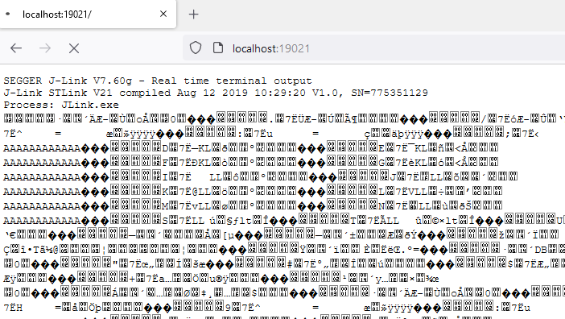.
* After closing the Firefox the Trice tool can connect to it too:
  * Open a commandline and run:
    ```b
    trice log -port TCP4 -args localhost:19021
    ```
    * Trice output is visible
    * With `h`alt and `g`o inside the Jlink window the MCU can get haltes and released
    * It is possible in parallel to debug-step with a debugger (tested with ARM-MDK)
* 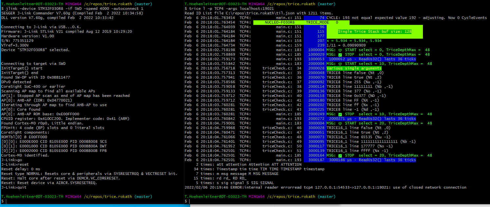
* **PLUS:**
  * Works reliable.
  * No file interface needed.
  * Trice can connect over TCP localhost:19021 and display logs over RTT channel 0.
  * The open `jlink` CLI can be handy to control the target: `[r]eset, [g]o. [h]alt`
  * No need to restart the Trice tool after changed firmware download.
* **MINUS:**
  * Uses RTT up-channel 0 and therefore RTT up-channel 0 is not usable differently.
  * No down-channel usable.
  * Needs a separate manual start of the `jlink` binary with CLI parameters.
    * I would not recommend to automate that too, because this step is needed only once after PC power on.

<a id='jlinkrttlogger.exe'></a><h5>JLinkRTTLogger.exe</h5>

* `JLinkRTTLogger.exe` is a CLI tool and connects via the SEGGER API to the target. It is usable for writing RTT channel 0 data from target into a file.
* **PLUS:**
  * Works reliable.
  * Is automatable.
  * Create file with raw log data: `JLinkRTTLogger.exe -Device STM32F030R8 -if SWD -Speed 4000 -RTTChannel 0 triceRaw.log`
    * It is possible to evaluate this file offline: `trice l -p FILE -args triceRaw.log`
    * 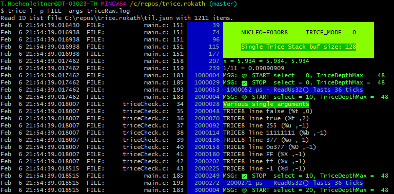
  * No need to restart the Trice tool after changed firmware download.
* **MINUS:**
  * Logs in a file, so the Trice tool needs to read from that file.
  * Maybe cannot write in a file as background process on Darwin.
* The Trice tool can watch the output file and display the *Trices*: `trice log -port JLINK -args "-Device STM32F030R8 -if SWD -Speed 4000 -RTTChannel 0"
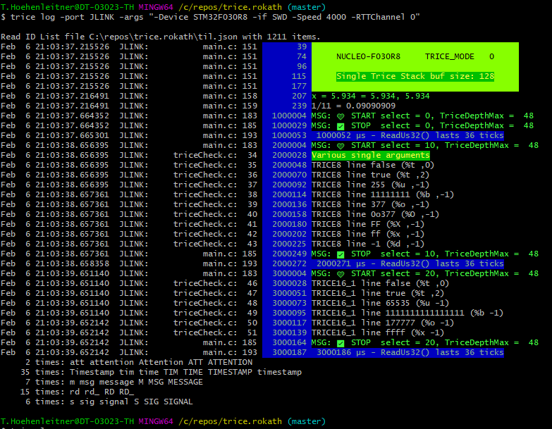

#### 32.3.3. <a id='jlinkrttclient.exe'></a>JLinkRTTClient.exe

* `JLinkRTTClient.exe` can be used for simple text transmitting to the target, it also displays strings from target coming over channel 0. It is not used by the Trice tool.
  * **PLUS:**
    * Target stimulation with proprietary protocol over RTT down-channel 0 possible.
  * **MINUS:**
    * Unfortunately it cannot run separately parallel to stimulate the target with any proprietary protocol because it connects to localhost:19021 and therefore blockades the only one possible connection.

#### 32.3.4. <a id='jlinkrttviewer.exe'></a>JLinkRTTViewer.exe

* `JLinkRTTViewer.exe` is a GUI tool and connects via the SEGGER API to the target. It expects ASCII codes and is not used by the Trice tool. The switching between the 16 possible terminals is done via `FF 00` ... `FF 0F`. These byte pairs can occur inside the Trice data.

<!---

* Start `"C:\Program Files (x86)\SEGGER\JLink\JLinkRTTViewer.exe"` and connect to the J-Link. You only need this as a running server to connect to.
  * Unfortunately the JLinkRTTViewer "steals" from time to time some Trice data packages and displays them as data garbage.
  * Better use JLink.exe or the *Segger J-Link SDK* instead.

-->

<p align="right">(<a href="#top">back to top</a>)</p>

### 32.4. <a id='segger-rtt'></a>Segger RTT

* The main advantages are:
  * Speed
  * No `TriceTransfer()` nor any interrupt is needed in the background
  * No UART or other output is needed
* This is, because automatically done by SeggerRTT. This way one can debug code as comfortable as with `printf()` but with all the TRICE advantages. Have a look here: 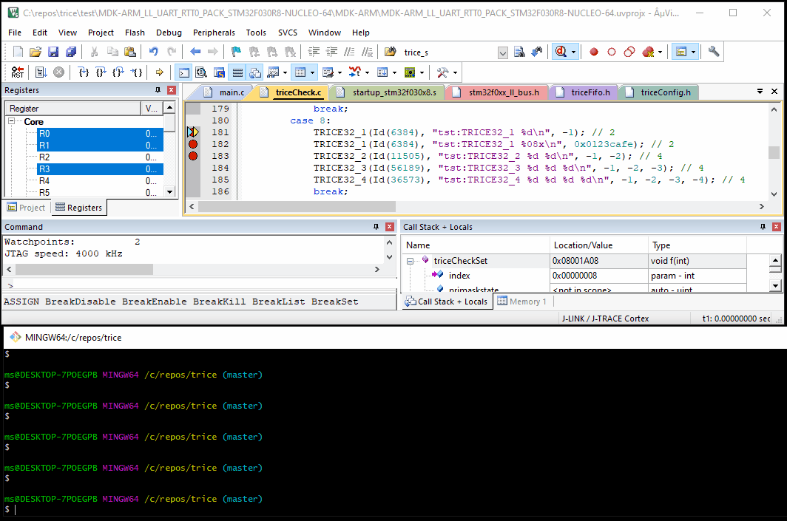
* Avoid Trice buffering inside target and write with TRICE macro directly into the RTT buffer (direct Trice mode = `#define TRICE_MODE 0` inside [triceConfig.h](../examples/F030_inst/Core/Inc/triceConfig.h)).
* Write the bytes per Trice directly (little time & some space overhead on target, but no changes on host side)

  

<p align="right">(<a href="#top">back to top</a>)</p>

### 32.5. <a id='segger-j-link-sdk-(~800-eur)-option'></a>Segger J-Link SDK (~800 EUR) Option

* Segger offers a SeggerRTT SDK which allows to use more than just channel 0 and you can develop your own tooling with it.
* The `trice -port JLINK` is ok for usage **as is** right now. However if you wish more comfort check here:
* Question: [How-to-access-multiple-RTT-channels](https://forum.segger.com/index.php/Thread/6688-SOLVED-How-to-access-multiple-RTT-channels-from-Telnet/)
  * "Developer pack used to write your own program for the J-Link. Please be sure you agree to the terms of the associated license found on the Licensing Information tab before purchasing this SDK. You will benefit from six months of free email support from the time that this product is ordered."
* The main [Segger J-Link SDK](https://www.segger.com/products/debug-probes/j-link/technology/j-link-sdk/) disadvantage beside closed source and payment is: **One is not allowed to distribute binaries written with the SDK.** That makes it only interesting for company internal automatization.

<p align="right">(<a href="#top">back to top</a>)</p>

### 32.6. <a id='additional-notes-(leftovers)'></a>Additional Notes (leftovers)

* `Downloading RTT target package` from [https://www.segger.com/products/debug-probes/j-link/technology/about-real-time-transfer/](https://www.segger.com/products/debug-probes/j-link/technology/about-real-time-transfer/).
* Read the manual [UM08001_JLink.pdf](../third_party/segger.com/UM08001_JLink.pdf).
* Extract `../third_party/segger.com/SEGGER_RTT_V760g.zip` to `../third_party/segger.com/SEGGER_RTT`. Check for an update @ SEGGER.
* Add `SEGGER_RTTI.c` to target project

<p align="right">(<a href="#top">back to top</a>)</p>

### 32.7. <a id='further-development'></a>Further development


* Check OpenOCD!
  * Use OpenOCD and its built-in RTT feature. OpenOCD then starts a server on localhost:17001 where it dumps all RTT messages.
* The GoST project offers a way bypassing JLINK. Used -port STLINK instead.
* Maybe `libusb` together with `libjaylink` offer some options too.
* Checkout [https://github.com/deadsy/jaylink](https://github.com/deadsy/jaylink).
* `"C:\Program Files (x86)\SEGGER\JLink\JMem.exe"` shows a memory dump.

* Go to [https://libusb.info/](https://libusb.info/)
  * -> Downloads -> Latest Windows Binaries
  * extract `libusb-1.0.23` (or later version)

```b
libusb-1.0.23\examples\bin64> .\listdevs.exe
2109:2811 (bus 2, device 8) path: 6
1022:145f (bus 1, device 0)
1022:43d5 (bus 2, device 0)
0a12:0001 (bus 2, device 1) path: 13
1366:0105 (bus 2, device 10) path: 5
```

* Repeat without connected Segger JLink

```b
libusb-1.0.23\examples\bin64> .\listdevs.exe
2109:2811 (bus 2, device 8) path: 6
1022:145f (bus 1, device 0)
1022:43d5 (bus 2, device 0)
0a12:0001 (bus 2, device 1) path: 13
```

* In this case `1366:0105 (bus 2, device 10) path: 5` is missing, so `vid=1366`, `did=0105` as example
* On Windows install WSL2. The real Linux kernel is needed for full USB access.

<p align="right">(<a href="#top">back to top</a>)</p>

### 32.8. <a id='nucleo-f030r8-example'></a>NUCLEO-F030R8 example

Info: [https://www.st.com/en/evaluation-tools/nucleo-f030r8.html](https://www.st.com/en/evaluation-tools/nucleo-f030r8.html)

#### 32.8.1. <a id='rtt-with-original-on-board-st-link-firmware'></a>RTT with original on-board ST-LINK firmware

* `#define TRICE_RTT_CHANNEL 0`:
* If you use a NUCLEO-F030R8 with the original ST-Link on board after firmware download enter: `trice l -p ST-LINK -args "-Device STM32F030R8 -if SWD -Speed 4000 -RTTChannel 0 -RTTSearchRanges 0x20000000_0x2000"`. After pressing the reset button output becomes visible: 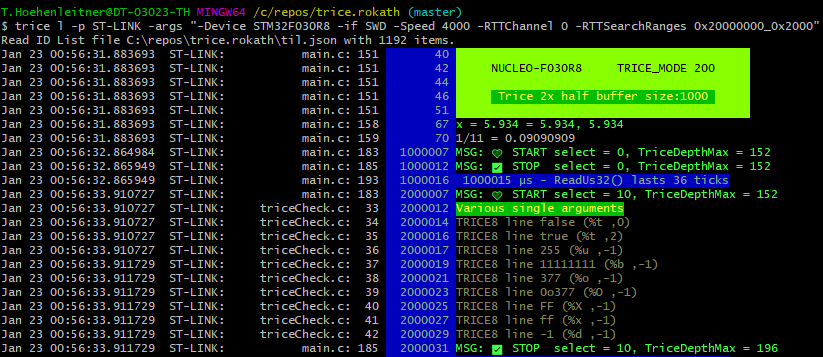
* It works with both ST-Link variants (with or without mass storage device.)

#### 32.8.2. <a id='change-to-j-link-onboard-firmware'></a>Change to J-LINK onboard firmware

 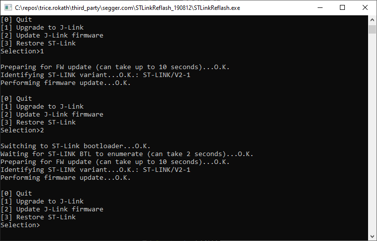

#### 32.8.3. <a id='rtt-with-j-link-firmware-on-board'></a>RTT with J-LINK firmware on-board

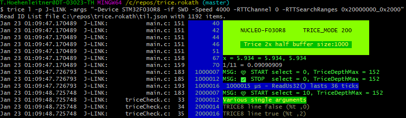

* Observations:
  * When pressing the black reset button, you need to restart the Trice tool.
  * When restarting the Trice tool, a target reset occurs.
  * Other channel numbers than `0` seam not to work for some reason.

<p align="right">(<a href="#top">back to top</a>)</p>

### 32.9. <a id='possible-issues'></a>Possible issues

* These boards seem not to work reliable with RTT over J-Link on-board firmware.
  * NUCLEO-G071RB
  * NUCLEO_G031K8
* After flashing back the ST-LINK OB firmware with the SEGGER tool, it is recommended to use the ST tool to update the ST-LINK OB firmware. Otherwise issues could occur.

<p align="right">(<a href="#top">back to top</a>)</p>

### 32.10. <a id='openocd-with-darwin'></a>OpenOCD with Darwin

* OpenOCD on MacOS works out of the box after installing it.
* When using VS code with Cortex-Debug you cannot use OpenOCD at the same time.
* The `openocd.cfg` file is taylored to the flashed on-board J-Link adapter.

**Terminal 1:**

```bash
brew install open-ocd
...
cd ./trice/examples/G0B1_inst
openocd -f openocd.cfg
Open On-Chip Debugger 0.12.0
Licensed under GNU GPL v2
For bug reports, read
    http://openocd.org/doc/doxygen/bugs.html
srst_only separate srst_nogate srst_open_drain connect_deassert_srst

Info : Listening on port 6666 for tcl connections
Info : Listening on port 4444 for telnet connections
Info : J-Link STLink V21 compiled Aug 12 2019 10:29:20
Info : Hardware version: 1.00
Info : VTarget = 3.300 V
Info : clock speed 2000 kHz
Info : SWD DPIDR 0x0bc11477
Info : [stm32g0x.cpu] Cortex-M0+ r0p1 processor detected
Info : [stm32g0x.cpu] target has 4 breakpoints, 2 watchpoints
Info : starting gdb server for stm32g0x.cpu on 3333
Info : Listening on port 3333 for gdb connections
Info : rtt: Searching for control block 'SEGGER RTT'
Info : rtt: Control block found at 0x20001238
Info : Listening on port 9090 for rtt connections
Channels: up=1, down=0
Up-channels:
0: Terminal 1024 0
Down-channels:

Info : Listening on port 6666 for tcl connections
Info : Listening on port 4444 for telnet connections
```

**Terminal 2:**

```bash
ms@MacBook-Pro G0B1_inst % trice l -p TCP4 -args localhost:9090  -pf none -d16
Nov 14 17:32:33.319451  TCP4:       triceExamples.c    10        0_000  Hello! 👋🙂
Nov 14 17:32:33.319463  TCP4:
Nov 14 17:32:33.319463  TCP4:         ✨✨✨✨✨✨✨✨✨✨✨✨✨✨✨✨✨
Nov 14 17:32:33.319463  TCP4:         🎈🎈🎈🎈  NUCLEO-G0B1RE   🎈🎈🎈🎈
Nov 14 17:32:33.319463  TCP4:         🍃🍃🍃🍃🍃🍃🍃🍃🍃🍃🍃🍃🍃🍃🍃🍃🍃
Nov 14 17:32:33.319463  TCP4:
Nov 14 17:32:33.319463  TCP4:
Nov 14 17:32:33.406455  TCP4:       triceExamples.c    16        0_037 2.71828182845904523536 <- float number as string
Nov 14 17:32:33.505116  TCP4:       triceExamples.c    17        0_087 2.71828182845904509080 (double with more ciphers than precision)
Nov 14 17:32:33.607518  TCP4:       triceExamples.c    18        0_117 2.71828174591064453125 (float  with more ciphers than precision)
Nov 14 17:32:33.707851  TCP4:       triceExamples.c    19        0_146 2.718282 (default rounded float)
Nov 14 17:32:33.807685  TCP4:       triceExamples.c    20        0_175 A Buffer:
Nov 14 17:32:33.908202  TCP4:       triceExamples.c    21        0_204 32 2e 37 31 38 32 38 31 38 32 38 34 35 39 30 34 35 32 33 35 33 36
Nov 14 17:32:34.007148  TCP4:       triceExamples.c    22        0_254 31372e32  31383238  34383238  34303935  35333235
Nov 14 17:32:35.007949  TCP4:       triceExamples.c    23        0_301 ARemoteFunctionName(2e32)(3137)(3238)(3138)(3238)(3438)(3935)(3430)(3235)(3533)(3633)
Nov 14 17:32:35.112304  TCP4:       triceExamples.c    24              100 times a 16 byte long Trice messages, which not all will be written because of the TRICE_PROTECT:
Nov 14 17:32:35.307567  TCP4:       triceExamples.c    26        0_379 i=44444400 aaaaaa00
Nov 14 17:32:35.408257  TCP4:       triceExamples.c    27    0,000_002 i=44444400 aaaaaa00
Nov 14 17:32:35.509022  TCP4:       triceExamples.c    26        0_441 i=44444401 aaaaaa01
Nov 14 17:32:35.609439  TCP4:       triceExamples.c    27    0,000_002 i=44444401 aaaaaa01
Nov 14 17:32:35.710201  TCP4:       triceExamples.c    26        0_504 i=44444402 aaaaaa02
...
```

### 32.11. <a id='links'></a>Links

* [https://www.codeinsideout.com/blog/stm32/j-link-rtt/](https://www.codeinsideout.com/blog/stm32/j-link-rtt/) (A good explanation of SEGGER J-Link Realtime Transfer - Fast Debug protocol: - only suitable for ASCII transfer)
* [USB over WSL2?](https://twitter.com/beriberikix/status/1487127732190212102?s=20&t=NQVa27qvOqPi2uGz6pJNRA) (Maybe intersting for OpenOCD)
* https://kickstartembedded.com/2024/03/26/openocd-one-software-to-rule-debug-them-all/?amp=1
* https://mcuoneclipse.com/2021/10/03/visual-studio-code-for-c-c-with-arm-cortex-m-part-9-rtt/

<p align="right">(<a href="#top">back to top</a>)</p>

## 33. <a id='trice-target-code-implementation'></a>Trice Target Code Implementation

### 33.1. <a id='trice-macro-structure'></a>TRICE Macro structure

#### 33.1.1. <a id='trice_enter'></a>TRICE_ENTER

* Optionally disable interrupts.
* Prepare `TriceBufferWritePosition` and keep its initial value.

#### 33.1.2. <a id='trice_put'></a>TRICE_PUT

* Use and increment `TriceBufferWritePosition`.

#### 33.1.3. <a id='trice_leave'></a>TRICE_LEAVE

* Use `TriceBufferWritePosition` and its initial value for data transfer
* Optionally restore interrupt state.

### 33.2. <a id='trice_stack_buffer'></a>TRICE_STACK_BUFFER

* `TRICE_ENTER`: Allocate stack
* `TRICE_LEAVE`: Call TriceDirectOut()

### 33.3. <a id='trice_static_buffer'></a>TRICE_STATIC_BUFFER

* This is like `TRICE_STACK_BUFFER` but avoids stack allocation, what is better for many stacks.
* `TRICE_ENTER`: Set TriceBufferWritePosition to buffer start.
* `TRICE_LEAVE`: Call TriceDirectOut().

### 33.4. <a id='trice_double_buffer'></a>TRICE_DOUBLE_BUFFER

* `TRICE_ENTER`: Keep TriceBufferWritePosition.
* `TRICE_LEAVE`: Optionally call TriceDirectOut().

### 33.5. <a id='trice_ring_buffer'></a>TRICE_RING_BUFFER

* `TRICE_ENTER`: Keep or wrap TriceBufferWritePosition and add offset.
* `TRICE_LEAVE`: Optionally call TriceDirectOut().

The `TRICE_RING_BUFFER` allocates incremental ring buffer space and each trice location is read by a deferred task.

### 33.6. <a id='deferred-out'></a>Deferred Out

#### 33.6.1. <a id='double-buffer'></a>Double Buffer

* TriceTransfer
  * TriceOut
  * TriceNonBlockingWrite( triceID, enc, encLen );

#### 33.6.2. <a id='ring-buffer'></a>Ring Buffer

* TriceTransfer
  * lastWordCount = TriceSingleDeferredOut(addr);
    * int triceID = TriceIDAndBuffer( pData, &wordCount, &pStart, &Length );
    * TriceNonBlockingWrite( triceID, pEnc, encLen );

### 33.7. <a id='direct-transfer'></a>Direct Transfer

* TRICE_LEAVE
  * TriceDirectWrite(triceSingleBufferStartWritePosition, wordCount);
    * optional RTT32 with optional XTEAwithCOBS
    * optional RTT8  with optional XTEAwithCOBS
    * optional
      * triceIDAndLen
      * triceDirectEncode
      * triceNonBlockingDirectWrite

### 33.8. <a id='possible-target-code-improvements'></a>Possible Target Code Improvements

There have been 3 similar implementations for trice encode

```C
static size_t triceDirectEncode(   uint8_t* enc, const uint8_t * buf, size_t len );
       size_t TriceDeferredEncode( uint8_t* enc, const uint8_t * buf, size_t len );

unsigned TriceEncryptAndCobsFraming32( uint32_t * const triceStart, unsigned wordCount ){
```

Now:

```C
size_t TriceEncode( unsigned encrypt, unsigned framing, uint8_t* dst, const uint8_t * buf, size_t len ){
unsigned TriceEncryptAndCobsFraming32( uint32_t * const triceStart, unsigned wordCount ){
```

Currently there are 3 similar implementations for trice buffer reads

```C
static size_t triceIDAndLen(    uint32_t* pBuf,               uint8_t** ppStart, int*      triceID );
static int    TriceNext(        uint8_t** buf,                size_t* pSize,     uint8_t** pStart,    size_t* pLen );
static int    TriceIDAndBuffer( uint32_t const * const pData, int* pWordCount,   uint8_t** ppStart,   size_t* pLength );
```

* The TriceID is only needed for routing and can go in a global variable just for speed.
* The source buffer should be `uint32_t const * const`.
* The destination should be given with `uint32_t * const` and the return value is the trice netto size. For efficiency the result should be ready encoded.

```C
//! \param pTriceID is filled with ID for routing
//! \param pCount is used for double or ring buffer to advance inside the buffer
//! \param dest provides space for the encoded trice
//! \param src is the location of the trice message we want encode
//! \retval is the netto size of the encoded trice data
size_t TriceEncode(int* pTriceID, unsigned int pCount, uint32_t * const dest, uint32_t const * const src );
```

* This function interface is used for all cases.
* First we use the existing code for implementation and then we clean the code.

<p align="right">(<a href="#top">back to top</a>)</p>

## 34. <a id='trice-similarities-and-differences-to-printf-usage'></a>Trice Similarities and Differences to printf Usage

### 34.1. <a id='printf-like-functions'></a>Printf-like functions

 ...have a lot of things to do: Copy format string from FLASH memory into a RAM buffer and parse it for format specifiers. Also parse the variadic parameter list and convert each parameter according to its format specifier into a character sequences, what includes several divisions - costly function calls. Concatenate the parts to a new string and deliver it to the output, what often means copying again. A full-featured printf library consumes plenty space and processing time and several open source projects try to make it better in this or that way. Never ever call a printf-like function in time critical code, like an interrupt - it would crash your target in most cases.
The *trice* calls are usable inside interrupts, because they only need a few MCU clocks for execution. Porting legacy code to use it with the Trice library, means mainly to replace Printf-like function calls with `trice` function calls.


### 34.2. <a id='trice-ids'></a>Trice IDs

* Each Trice caries a 14-bit nuber ID as replacement for the format string.
* This ID is automatically generated (controllable) and in the source code it is the first parameter inside the Trice macro followed by the format string and optional values.
* The user can decide not to spoil the code by having the IDs permanently in its source code, by just inserting them as a pre-compile step with `trice insert` and removing them as a post-compile step with `trice clean`.
  * The Trice cache makes this invisible to the build system, allowing full translation speed.
* The format string is **not** compiled into the target code. It goes together with the ID into a project specific reference list file [til.json](../_test/testdata/til.json) (example).

### 34.3. <a id='trice-values-bit-width'></a>Trice values bit width

* No need to explicit express the value bit width.
* The default parameter width for the Trice macro is 32 bit. It is changeable to 8, 16 or 64-bit:
  * Adapt `TRICE_DEFAULT_PARAMETER_BIT_WIDTH` inside `triceConfig.h`. It influences 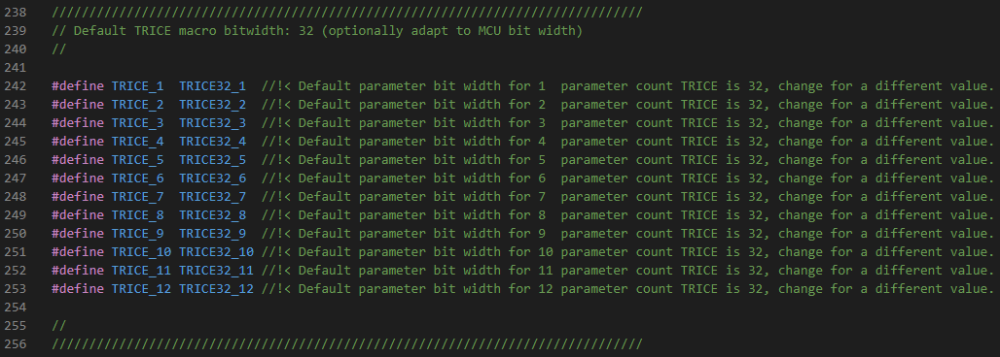
  * Use `-defaultTRICEBitwidth` switch during logging when changing this value.
* The macros `trice8`, `trice16`, `trice32`, `trice64` are usable too, to define the bit width explicit.
  * This leads for the smaller bit widths to less needed space and bandwidth. But when using the default package framing TCOBS, the influence is marginal because of the implicit compression.
* The fastest Trice macro execution is, when MCU bit width matches the macro bit width.
* The implicit TCOBS compression compacts the binary Trice data during the framing.

### 34.4. <a id='many-value-parameters'></a>Many value parameters

* No need to explicit express the values count.
* Up to 12 values are supported directly. Example:
  * `trice( "%p | %04x %04x %04x %04x %04x %04x %04x %04x %04x | %f\n", p, p[0], p[1], p[2], p[3], p[4], p[5], p[6], p[7], p[8], p[9], aFloat(x));`
  * To support more than 12 values for each Trice macro, the Trice code on target and host is straightforward extendable up to a total payload of 32764 bytes.
* Each macro can be prolonged with the used parameter count, for example `TRICE8_3` or `TRICE_2` to intense compile time checks.
  * This length code extension can be done automatically using `trice u -addParamCount`. This is not needed anymore:
* The _Trice_ tool compares the number of given format specifiers with the written parameters in a precimpile step to minimize the risk of runtime errors.
* There is no variadic values scanning during runtime. The C preprocessor does the work.

### 34.5. <a id='floating-point-values'></a>Floating Point Values

These types are mixable with integer types but need to be covered by converter function.

* *float* types use the `aFloat()` function and need a minimal value bit width of 32, to secure correct data transfer.
  * Example:

  ```c
   float x = 7.2;
   trice( "%f", aFloat(x));
  ```

* *double* types use the `aDouble()` function and need a value bit width of 64, to secure correct data transfer.
  * Example:

  ```c
   double y = 7.2;
   trice64( "float %f and double %f", aFloat(x), aDouble(y));
  ```

* Both functions are simple and fast:

```C

// aFloat returns passed float value x as bit pattern in a uint32_t type.
static inline uint32_t aFloat( float x ){
    union {
        float f;
        uint32_t u;
    } t;
    t.f = x;
    return t.u;
}

// aDouble returns passed double value x as bit pattern in a uint64_t type.
static inline uint64_t aDouble( double x ){
    union {
        double d;
        uint64_t u;
    } t;
    t.d = x;
    return t.u;
}
```

### 34.6. <a id='runtime-generated-0-terminated-strings-transfer-with-trices'></a>Runtime Generated 0-terminated Strings Transfer with triceS

* The `%s` format specifier is supported by the Trice macro too but needs specific treatment.
* Strings, known at compile time should be a part of a format string to reduce runtime overhead.
* Strings created at runtime, need a special `TRICE_S` (or `triceS`, `TriceS`, `TRiceS`) macro, which accepts exactly one type `%s` format specifier. Generated strings are allowed to a size of 32764 bytes each, if the configured Trice buffer size is sufficient.
  * Example:

  ```c
   char s[] = "Hello again!";
   triceS( "A runtime string %20s\n", s;
  ```

### 34.7. <a id='runtime-generated-counted-strings-transfer-with-tricen'></a>Runtime Generated counted Strings Transfer with  triceN

* It is also possible to transfer a buffer with length n using the `TRICE_N` (or `triceN`, `TriceN`, `TRiceN`) macro.
* This becomes handy for example, when a possibly not 0-terminated string in FLASH memory needs transmission: `triceN( "msg: FLASH string is %s", addr, 16 );`
* There are also specific macros like `trice32B` or `trice16F`. Please look into [triceCheck.c](../_test/testdata/triceCheck.c) for usage or see the following.

### 34.8. <a id='runtime-generated-buffer-transfer-with-triceb'></a>Runtime Generated Buffer Transfer with triceB

* A buffer is transmittable with `TRICE_B` (or `triceB`, `TriceB`, `TRiceB`) and specifying just one format specifier, which is then repeated. Example:

```code
  s = "abcde 12345"; // assume this as runtime generated string
  triceS( "msg:Show s with triceS: %s\n", s );
  len = strlen(s);
  triceN( "sig:Show s with triceN:%s\n", s, len );
  triceB( "dbg: %02x\n", s, len ); // Show s as colored code sequence in hex code.
  triceB( "msg: %4d\n", s, len ); // Show s as colored code sequence in decimal code.
```

  This gives output similar to: 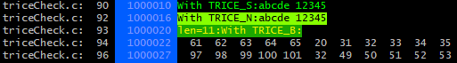

  Channel specifier within the `TRICE_B` format string are supported in Trice versions >= v0.66.0.

 If the buffer is not 8 but 16, 32 or 32 bits wide, the macros `TRICE8_B`, `TRICE16_B`, `TRICE32_B` and  `TRICE64_B`, are usable in the same manner.

### 34.9. <a id='remote-function-call-syntax-support-with-tricef'></a>Remote function call syntax support with triceF

The `TRICE8_F`, `TRICE16_F`, `TRICE32_F`, `TRICE64_F`, macros expect a string without format specifiers which is usable later as a function call. Examples:

```C
trice8F(   "call:FunctionNameW", b8,  sizeof(b8) /sizeof(int8_t) );   //exp: time:            default: call:FunctionNameW(00)(ff)(fe)(33)(04)(05)(06)(07)(08)(09)(0a)(0b)(00)(ff)(fe)(33)(04)(05)(06)(07)(08)(09)(0a)(0b)
TRICE16_F( "info:FunctionNameX", b16, sizeof(b16)/sizeof(int16_t) );  //exp: time: 842,150_450default: info:FunctionNameX(0000)(ffff)(fffe)(3344)
TRice16F(  "call:FunctionNameX", b16, sizeof(b16)/sizeof(int16_t) );  //exp: time: 842,150_450default: call:FunctionNameX(0000)(ffff)(fffe)(3344)
Trice16F(  "call:FunctionNameX", b16, sizeof(b16)/sizeof(int16_t) );  //exp: time:       5_654default: call:FunctionNameX(0000)(ffff)(fffe)(3344)
trice16F(  "call:FunctionNameX", b16, sizeof(b16)/sizeof(int16_t) );  //exp: time:            default: call:FunctionNameX(0000)(ffff)(fffe)(3344)
TRICE32_F( "info:FunctionNameY", b32, sizeof(b32)/sizeof(int32_t) );  //exp: time: 842,150_450default: info:FunctionNameY(00000000)(ffffffff)(fffffffe)(33445555)
TRice32F(  "call:FunctionNameY", b32, sizeof(b32)/sizeof(int32_t) );  //exp: time: 842,150_450default: call:FunctionNameY(00000000)(ffffffff)(fffffffe)(33445555)
Trice32F(  "call:FunctionNameY", b32, sizeof(b32)/sizeof(int32_t) );  //exp: time:       5_654default: call:FunctionNameY(00000000)(ffffffff)(fffffffe)(33445555)
trice32F(  "call:FunctionNameY", b32, sizeof(b32)/sizeof(int32_t) );  //exp: time:            default: call:FunctionNameY(00000000)(ffffffff)(fffffffe)(33445555)
TRICE64_F( "info:FunctionNameZ", b64, sizeof(b64)/sizeof(int64_t) );  //exp: time: 842,150_450default: info:FunctionNameZ(0000000000000000)(ffffffffffffffff)(fffffffffffffffe)(3344555566666666)
TRice64F(  "call:FunctionNameZ", b64, sizeof(b64)/sizeof(int64_t) );  //exp: time: 842,150_450default: call:FunctionNameZ(0000000000000000)(ffffffffffffffff)(fffffffffffffffe)(3344555566666666)
Trice64F(  "call:FunctionNameZ", b64, sizeof(b64)/sizeof(int64_t) );  //exp: time:       5_654default: call:FunctionNameZ(0000000000000000)(ffffffffffffffff)(fffffffffffffffe)(3344555566666666)
trice64F(  "call:FunctionNameZ", b64, sizeof(b64)/sizeof(int64_t) );  //exp: time:            default: call:FunctionNameZ(0000000000000000)(ffffffffffffffff)(fffffffffffffffe)(3344555566666666)
```

The Trice tool displays the parameter buffer in the shown manner. It is planned to code a FunctionPointerList Generator (See [issue #303](https://github.com/rokath/trice/issues/303), which generates mainly a function pointer list with associated IDs. This list can get part of the source code of a remote device. Then, when receiving a Trice message, the remote device can execute the assigned function call using the transferred parameters. This way several devices can communicate in an easy and reliable way.

* Future extensions are possible:
  * `triceD( "dump:32", addr, 160 );` -> The Trice tool dumps in 32 byte rows.
  * An appropriate syntax is needed.

### 34.10. <a id='extended-format-specifier-possibilities'></a>Extended format specifier possibilities

* Because the format string is interpreted by the Trice tool written in [Go](https://en.wikipedia.org/wiki/Go_(programming_language)), the **Go** capabilities partial usable.

#### 34.10.1. <a id='trice-format-specifier'></a>Trice format specifier

* The Trice macros are used in **C** code.
* The format strings are interpreted by the Trice tool, which is written in **Go**.
* The **C** and **Go** format specifier are not equal but similar.
* Therefore, a **T**rice adaption is internally performed.

#### 34.10.2. <a id='overview-table'></a>Overview Table

| Format Specifier Type                                           | C | Go | T | (T =Trice) \| remark                                                        |
|-----------------------------------------------------------------|---|----|---|-----------------------------------------------------------------------------|
| signed decimal integer                                          | d | d  | d | Supported.                                                                  |
| unsigned decimal integer                                        | u | -  | u | The Trice tool changes %u into %d and treats value as unsigned.             |
| signed decimal integer                                          | i | d  | i | The Trice tool changes %i into %d and treats value as signed.               |
| signed octal integer                                            | - | o  | o | With `trice log -unsigned=false` value is treated as signed.                |
| unsigned octal integer                                          | o | -  | o | With `trice log` value is treated as unsigned.                              |
| signed octal integer with 0o prefix                             | - | O  | O | With `trice log -unsigned=false` value is treated as signed.                |
| unsigned octal integer with 0o prefix                           | - | -  | O | With `trice log` value is treated as unsigned.                              |
| signed hexadecimal integer lowercase                            | - | x  | x | With `trice log -unsigned=false` value is treated as signed.                |
| unsigned hexadecimal integer lowercase                          | x | -  | x | With `trice log` value is treated as unsigned.                              |
| signed hexadecimal integer uppercase                            | - | X  | X | With `trice log -unsigned=false` value is treated as signed.                |
| unsigned hexadecimal integer uppercase                          | X | -  | X | With `trice log` value is treated as unsigned.                              |
| signed binary integer                                           | - | b  | b | With `trice log -unsigned=false` value is treated as signed.                |
| unsigned binary integer                                         | - | -  | b | With `trice log` value is treated as unsigned.                              |
| decimal floating point, lowercase                               | f | f  | f | `aFloat(value)`\|`aDouble(value)`                                           |
| decimal floating point, uppercase                               | - | F  | F | `aFloat(value)`\|`aDouble(value)`                                           |
| scientific notation (mantissa/exponent), lowercase              | e | e  | e | `aFloat(value)`\|`aDouble(value)`                                           |
| scientific notation (mantissa/exponent), uppercase              | E | E  | E | `aFloat(value)`\|`aDouble(value)`                                           |
| the shortest representation of %e or %f                         | g | g  | g | `aFloat(value)`\|`aDouble(value)`                                           |
| the shortest representation of %E or %F                         | G | G  | G | `aFloat(value)`\|`aDouble(value)`                                           |
| a character as byte                                             | c | -  | c | Value can contain ASCII character.                                          |
| a character represented by the corresponding Unicode code point | c | c  | c | Value can contain UTF-8 characters if the C-File is edited in UTF-8 format. |
| a quoted character                                              | - | q  | q | Supported.                                                                  |
| the word true or false                                          | - | t  | t | Supported.                                                                  |
| a string                                                        | s | s  | s | Use `triceS` macro with one and only one runtime generated string.          |
| pointer address                                                 | p | p  | p | Supported.                                                                  |
| a double %% prints a single %                                   | % | %  | % | Supported.                                                                  |
| Unicode escape sequence                                         | - | U  | - | **Not supported.**                                                          |
| value in default format                                         | - | v  | - | **Not supported.**                                                          |
| Go-syntax representation of the value                           | - | #v | - | **Not supported.**                                                          |
| a Go-syntax representation of the type of the value             | - | T  | - | **Not supported.**                                                          |
| nothing printed                                                 | n | -  | - | **Not supported.**                                                          |

* [x] Long story short: Use the `-unsigned=false` switch when you like to see hex numbers and the like as signed values.
* [x] Look in [triceCheck.c](../_test/testdata/triceCheck.c) for exampe code producing this:


### 34.11. <a id='utf-8-support'></a>UTF-8 Support

This is gratis, if you edit your source files containing the format strings in UTF-8:


The target does not even "know" about that, because it gets only the Trice IDs.

### 34.12. <a id='switch-the-language-without-changing-a-bit-inside-the-target-code'></a>Switch the language without changing a bit inside the target code

Once the [til.json](../examples/F030_inst/til.json) list is done the user can translate it in any language and exchanging the list switches to another language.

### 34.13. <a id='format-tags-prototype-specifier-examples'></a>Format tags prototype specifier examples

This syntax is supported: `%[flags][width][.precision][length]`

* Because the interpretation is done inside the Trice tool written in Go these all should work:
  * `%-d`
  * `%064b`
  * `%+9.3f`
  * `%+#012.12g`
  * `%+'#012.12E`
  * `%e`
  * `%9.f`

<p align="right">(<a href="#top">back to top</a>)</p>

## 35. <a id='development-environment-setup'></a>Development Environment Setup

* Trice is usable with any C-compiler for any processor type, bit width and endianness. The example projects here are STM32 ones but illustrate how to setup Trice.
* The [examples](../examples) folder contains some instrumented example projects together with bare counterparts. Comparing a bare project with its intrumented counterpart gives a quick overview what needs to be done to get started.

### 35.1. <a id='common-information-1'></a>Common Information

- All used tools are **Open Source** (despite the [ARM-Keil µVision IDE](https://www2.keil.com/mdk5/uvision/), for new projects vsCode is a better choice).
- All provided information is just as example and needs adaption to your needs.
- There is no need to setup the environment in the given order.

### 35.2. <a id='important-to-know'></a>Important to know

The [ARM-Keil µVision IDE](https://www2.keil.com/mdk5/uvision/) does sometimes not recognize external file modifications. That means for example: After editing `main.c` by adding a `trice( "Hi!\n" )` and executing `trice insert` as pre-compile step it could happen, that an updated `trice( iD(12345), "Hi!\n" )`  was inserted and correct compiled but the update in `main.c` is not shown. Simply close and reopen `main.c` before editing again. This seems to be a [ARM-Keil µVision IDE](https://www2.keil.com/mdk5/uvision/) "feature" or be caused Windows not signaling a file change.

### 35.3. <a id='animation'></a>Animation

(The trice IDs occur just during the compilation.)

  

### 35.4. <a id='setup-pc'></a>Setup PC

Setting up a PC is for Linux mostly straightforward but Windows PCs are more problematic. The steps shown here are just one example.

- Create folder `repos` in your home directory.
  - Clone all repositories here.
- Create `C:\bin` folder.
  - When installing toolchains, put them here then and avoid spaces in created paths.
- Add `C:\bin` to PATH variable at the beginning.
  - This allows to copy tools like `trice.exe` simply into `C:\bin`.
- Install "Git for windows" from https://git-scm.com/downloads to get the neat git bash.
  - Select the Standalone Installer. This gives you useful context menu entries in the Windows explorer.
- BTW: For managing git repositories I like https://www.gitkraken.com/. Its free of charge for open source programs.
- Install VS-Code
  - This is my favorite editor with many optional Add-Ons. It is used for debugging as well.
- Install Go if you wish to compile Go programs.
  - Install latest [TDM GCC](https://jmeubank.github.io/tdm-gcc/download/).
    - TDM GCC is needed only if you wish to use CGO as well.
    - If you just want compile the Trice tool TDM GCC is not needed. But for performing all tests it is nessecary.
- Setup J-Link if you use this debug probe as hardware or software (see below).
  - Install SEGGER [J-Link Software and Documentation Pack](https://www.segger.com/downloads/jlink/#J-LinkSoftwareAndDocumentationPack)
- Install [Make for Windows](https://sourceforge.net/projects/gnuwin32/) and add its installation bin folder location to the PATH variable.

#### 35.4.1. <a id='setup-trice'></a>Setup Trice

- from inside folder `repos` clone trice repo with `git clone https://github.com/rokath/trice.git`.
- Run `go install ./cmd/trice/...` from folder `repos/trice`.

OR

- Download the latest release archive and extract.
- Put trice binary into C:\bin.
- Put trice/src into `repos` if you want access the trice library code from several projects and have it only once.
  - Alternatively copy it into your project.

#### 35.4.2. <a id='setup-arm-environment'></a>Setup ARM Environment

<a id='install-arm-gcc'></a><h5>Install ARM GCC</h5>

- Uninstall existing ARM GCC compilers optionally.
- Check if $PATH is clean.
  - In fact you can leave it as it is.
- Check if `C_INCLUDE_PATH` is not defined.
  - It would cause issues performing Go tests with CGO.
  - The environment variable `C_INCLUDE_PATH` is needed by Clang, but is set temporarily inside the Makefile.
- Open a console.
  - `which arm-none-eabi-gcc` should return `no arm-none-eabi-gcc` if no legacy compilers installed.
- Download latest version from https://developer.arm.com/downloads/-/arm-gnu-toolchain-downloads.
- Install exactly into `C:\bin\ArmGNUToolchain` and add `C:\bin\ArmGNUToolchain\bin` it to the **beginning** of the path variable.
  - The path is temporarily extendable inside the manually edited Makefiles as well, but for debugging the Windows path is used directly.
  - The path is used directly also in generated Makefiles.
  - Extending the path variable at the beginning avoids accidentally usage of installed legacy compilers with the same name.
  - To use exactly `C:\bin\ArmGNUToolchain` as install location allows a more easy project collaboration.

<a id='macos'></a><h5>MacOS</h5>

- In terminal `brew install arm-none-eabi-gcc`
- Restart terminal
- In teminal `arm-non-eabi-gcc --version` delivers `arm-none-eabi-gcc (GCC) 14.2.0`
- In terminal `brew install arm-none-eabi-clang`
- Restart terminal
- In teminal `clang -target arm-none-eabi --version` delivers:
    ```bash
    Apple clang version 15.0.0 (clang-1500.3.9.4)
    Target: arm-none-unknown-eabi
    Thread model: posix
    InstalledDir: /Library/Developer/CommandLineTools/usr/bin
    ```
- In terminal `brew install arm-none-eabi-gdb`
- In terminal `brew install --cask gcc-arm-embedded`

<a id='install-arm-clang-(optional)'></a><h5>Install ARM Clang (optional)</h5>

With the ARM Clang you get quicker compilation runs and smaller images.

- You need to install ARM GCC as well to use ARM Clang.
  - ARM Clang uses the GCC libraries. For that it looks for `C_INCLUDE_PATH`.
  - ARM Clang uses the GCC debugger. For that it looks into the Windows path variable directly.
- Uninstall existing ARM clang compilers or make sure they are hidden.
- Check if $PATH is clean.
  - In fact you can leave is as it is.
- Check if `C_INCLUDE_PATH` is not defined.
  - It would cause issues performing Go tests with CGO.
- Open a console.
  - `which clang` should return `no clang`.
  - If you have other clang compilers installed, do not touch them.
- Download latest version from https://github.com/llvm/llvm-project/releases.
- Install exactly into `C:\bin\ArmClang` and do **not** add it to path variable.
  - The path is extended temporarily inside the Makefile for the compiler run.

<a id='check-project-makefile-(if-it-already-exists)'></a><h5>Check Project Makefile (if it already exists)</h5>

- The Makefile should start with these lines:

```mak
# Put ARM Clang first in path temporary to avoid compiler variants issues.
export PATH := C:\bin\ArmClang\bin:$(PATH)

# ARM Clang uses the ARM GNU toolchain libraries and finds them over C_INCLUDE_PATH.
export C_INCLUDE_PATH := C:\bin\ArmGNUToolchain\arm-none-eabi\include
```

The `C:\bin\ArmGNUToolchain\bin:` is in fact not needed, because it must be in the path anyway for debugging.

- `make version` should give output like that:

```bash
$ make version
/c/bin/ArmGNUToolchain/bin/arm-none-eabi-gcc
arm-none-eabi-gcc (Arm GNU Toolchain 12.3.Rel1 (Build arm-12.35)) 12.3.1 20230626
Copyright (C) 2022 Free Software Foundation, Inc.
This is free software; see the source for copying conditions.  There is NO
warranty; not even for MERCHANTABILITY or FITNESS FOR A PARTICULAR PURPOSE.

/c/bin/ArmClang/bin/clang
clang version 17.0.0
Target: x86_64-pc-windows-msvc
Thread model: posix
InstalledDir: C:\bin\ArmClang\bin
```

The paths must match with the installation locations.

#### 35.4.3. <a id='setup-stm32'></a>Setup STM32

<a id='generate-base-project'></a><h5>Generate Base Project</h5>

- Install and start STM32CubeMX code generator.
- Board-Selector -> STM32G0B1KE` or `STM32L432KC` or ...
- (Auto-)Initialize with default values.
- Clock-Generation -> Change PLL *N from "X 16" to "X 32" to get 64 MHz clocks.
  - Running at max clock speed and using `WFE` instructions in wait loops is slightly more energy efficient.
- Project Manager
  - Project
    - Set Project Name
    - Select Project Location
    - Toolchain / IDE -> Select Makefile
  - Code Generator
    - Select "Copy only the necessary library files".
  - Advanced Settings
    - Switch from HAL to LL at least for UART
- Generate Code as Makefile project

<a id='update-nucleo-onboard-debugger-(other-st-evaluation-boards-too)'></a><h5>Update NUCLEO Onboard Debugger (other ST evaluation boards too)</h5>

(https://www.st.com/en/development-tools/stsw-link007.html)

This step is recommended before re-flashing with the J-Link onboard debugger software.

- Connect STM evaluation board over USB
- Start ST-Link Upgrade (trice\third_party\st.com or look for a newer version at STM.).
  - Device Connect
  - Upgrade Firmware (select version **with** mass storage option)
    - Selecting the other option, would not allow to update with the SEGGER STLinkReflash tool.
  - Close

#### 35.4.4. <a id='setup-onboard-j-link-on-nucleo-(other-st-evaluation-boards-too)'></a>Setup Onboard J-Link on NUCLEO (other ST evaluation boards too)

(https://www.segger.com/products/debug-probes/j-link/models/other-j-links/st-link-on-board/)

Using the J-Link onboard debugger software allows parallel debugging and RTT usage.

Unfortunately this is not possible with **v3** onboard debugger hardware! But you can use a J-Link hardware instead. Also it is possible to use a v2 onboard debugger from a different evaluation board or a "Bluepill" Development Board Module with ARM Cortex M3 processor".

- Start STLinkReflash (trice\third_party\segger.com)
  - Accept and Accept
  - 1: Upgrade to J-Link
  - 0: Quit
- Download, extract & start https://github.com/rokath/trice/blob/master/third_party/segger.com/STLinkReflash_190812.zip
  - Re-Flash onboard debugger.
    - You can undo this step anytime.

#### 35.4.5. <a id='setup-vs-code'></a>Setup VS-Code

- Start VS Code
  - Install Go rich language support if you want to use Go as well (not needed for ARM debugging).
  - Install "Cortex Debug" extension.
  - Open the generated project directory.
  - Click on Run and Debug.
    - Click Generate launch.json and select "Cortex Debug"
  - Open and edit .vscode/launch.json
    - change "executable" value into: "./build/STM32G0B1KE_generated.elf" (example)
  - add lines:
    - `"device": "STM32G0B1KE",` or `"STM32L432KC"` or ...
    - `"svdFile": "./STM32G0B1KE.svd",` or `"./STM32L4x2.svd"` or ...
    - `"runToMain": true`
  - Set the commas right.
- Latest SVD Files can be found here: https://www.st.com/content/st_com/en/search.html#q=svd-t=resources-page=1
- Download file [`./STM32G0B1.svd`](./STM32G0B1.svd) from https://www.st.com/resource/en/svd/stm32G0_svd.zip (example)
  - Alternatively copy it from `"C:\ST\STM32CubeIDE_1.13.1\STM32CubeIDE\plugins\com.st.stm32cube.ide.mcu.productdb.debug_2.1.0.202306151215\resources\cmsis\STMicroelectronics_CMSIS_SVD\STM32G0B1.svd"` if you have the STM32CubeIDE installed.
  - Download file [`./STM32L4x2.svd`](./STM32L4x2.svd) from https://www.st.com/resource/en/svd/stm32l4_svd.zip (example)
- Installing the **Cortex Debug** extension allow you to debug the target code.

### 35.5. <a id='makefile-with-clang-too'></a>Makefile with Clang too

- After STM32 CubeMX code generation the Makefile was edited and spitted.
- STM32 CubeMX code generation accepts the edited Makefile, so re-generation is no issue.
  - It modifies the settings according to the changes.

### 35.6. <a id='download-locations'></a>Download Locations

#### 35.6.1. <a id='clang'></a>Clang

https://releases.llvm.org/download.html -> https://github.com/llvm/llvm-project/releases/tag/llvmorg-16.0.0 (example)

#### 35.6.2. <a id='gcc-1'></a>GCC

https://developer.arm.com/Tools%20and%20Software/GNU%20Toolchain -> https://developer.arm.com/downloads/-/arm-gnu-toolchain-downloads (example))

### 35.7. <a id='install-locations'></a>Install Locations

Do not use locations containing spaces, like `C:\Program Files`. Take `C:\bin` for example. This avoids trouble caused by spaces inside path names.

### 35.8. <a id='environment-variables'></a>Environment Variables

Extend the path variable:

- PATH += `C:\bin\ArmGNUToolchain\bin`
- PATH += `C:\Program Files\SEGGER\JLink`.

### 35.9. <a id='build-command'></a>Build command

- Clang: `make` or to get it faster `make -j8`.
- GCC: `make GCC`.

### 35.10. <a id='run-&-debug'></a>Run & Debug

- In terminal after `make` click Run&Debug & click green triangle.

### 35.11. <a id='logging'></a>Logging

- In terminal type `make log`. This executes the command in project folder:

`trice l -p JLINK -args="-Device STM32G0B1RE -if SWD -Speed 4000 -RTTChannel 0" -pf none -ts ms -d16` (example)

  

### 35.12. <a id='setting-up-a-new-project'></a>Setting up a new project

- Copy this project folder under a new name like `myAwesomeNewProject` or name it as you like.
- Make a temporary folder `myTemp` and generate with STM CubeMX the base project.
- Copy the *.ioc file from `myTemp` to `myAwesomeNewProject` and name it to the project name.
- Compare `myTemp\Makefile` with `myAwesomeNewProject\Makefile` and overwrite/extend in `myAwesomeNewProject\Makefile` the relevant settings, mainly the filenames, include path settings and DEFINES.
- Replace all generated files in `myAwesomeNewProject` with the ones in `myTemp`
- Replace the *.svd file if the MCU is different. You can find it in the internet.
- Run `make -j8` inside `myAwesomeNewProject` to check if all is ok.
- Open the copied *ioc file inside `myAwesomeNewProject` and re-generate and re-build to check.
- Compare the relevant files like `main.c` with the starting project and edit accordingly.
- Adapt `.vscode/launch.json` to the used MCU.
- Than the awesome new project should be ready to go for development.

<p align="right">(<a href="#top">back to top</a>)</p>

## 36. <a id='example-projects-without-and-with-trice-instrumentation'></a>Example Projects without and with Trice Instrumentation

| Project Name                                                     | Description                                                                                                                                                                                                                                                                      |
|------------------------------------------------------------------|----------------------------------------------------------------------------------------------------------------------------------------------------------------------------------------------------------------------------------------------------------------------------------|
|                                                                  |                                                                                                                                                                                                                                                                                  |
| [F030_bare](../examples/F030_bare)                               | This is a minimal STM32CubeMX generated Makefile project adapted to Clang and GCC. It serves as a reference for diff to [F030_inst](../examples/F030_inst) so see quickly the needed instrumentation steps you need for your own project.                                        |
| [F030_inst](../examples/F030_inst)                               | This is a minimal STM32CubeMX generated Makefile project adapted to Clang and GCC and afterward instrumented with the Trice library. Compare it with [F030_bare](../examples/F030_bare) to see quickly how to instrument your project.                                           |
|                                                                  |                                                                                                                                                                                                                                                                                  |
| [G0B1_bare](../examples/G0B1_bare)                               | This is a minimal FreeRTOS STM32CubeMX generated Makefile project adapted to Clang and GCC.                                                                                                                                                                                      |
| [G0B1_inst](../examples/G0B1_inst)                               | This is a minimal FreeRTOS STM32CubeMX generated Makefile project adapted to Clang and GCC and afterward instrumented with the Trice library.                                                                                                                                    |
|                                                                  |                                                                                                                                                                                                                                                                                  |
| [L432_bare](../examples/L432_bare)                               | This is a minimal FreeRTOS STM32CubeMX generated Makefile project extended to compile also with Clang trying to perform minimal changes. It produces some warnings, because it is not finetuned. The [L432_inst](../examples/L432_inst) project is then a next step performable. |
| [L432_inst](../examples/L432_inst)                               | This is a minimal FreeRTOS STM32CubeMX generated Makefile project adapted to Clang and GCC and afterward instrumented with the Trice library.                                                                                                                                    |
|                                                                  |                                                                                                                                                                                                                                                                                  |
| [OpenCM3_STM32F411_Nucleo](../examples/OpenCM3_STM32F411_Nucleo) | See the [Readme.md](../examples/OpenCM3_STM32F411_Nucleo/Readme.md) in this folder.                                                                                                                                                                                              |
|                                                                  |                                                                                                                                                                                                                                                                                  |

<p align="right">(<a href="#top">back to top</a>)</p>

### 36.1. <a id='nucleo-f030r8-examples'></a>Nucleo-F030R8 Examples


#### 36.1.1. <a id='f030_bare'></a>F030_bare

Folder: [../examples/F030_bare/](../examples/F030_bare/)

This is a STMCubeMX generated project without Trice instrumentation for easy compare with [F030_inst](#nucleo-f030r8-example-f030_inst) to figure out the needed changes to set up trice.

<h6>Steps performed as potential guide:</h6>

- Install STM32CubeMX to `C:\SMT32SubeMX`.
- Select NUCLEO-F030R8 board.
- Initialize with default values.
- Optionally set system clock to 32MHz for faster target timestamps.
- Optionally set UART baud rate to 115200.
- Mantadory set UART data bits including parity to **9**.
- Enable USART2 global interrupt.
- In Project Manager *Project*:
  - Set toolchain folder location to `E:\repos\trice\examples\F030_bare\`.
  - Set project name to `F030_bare`.
  - Set toolchain / IDE to `Makefile`.
- In Project Manager *Code Generator*:
  - Select "Copy only the necessary library files".
- In Project Manager *Advanced Settings*:
  - In Driver Selector change all to *LL*.
- Generate Code
- Start vsCode and open folder F030_bare with it.
- Start a terminal and type `make`. The output should be similar to:

```bash
PS E:\repos\trice\examples\F030_bare> make -j8
mkdir build
arm-none-eabi-gcc -c -mcpu=cortex-m0 -mthumb   -DUSE_FULL_LL_DRIVER -DHSE_VALUE=8000000 -DHSE_STARTUP_TIMEOUT=100 -DLSE_STARTUP_TIMEOUT=5000 -DLSE_VALUE=32768 -DHSI_VALUE=8000000 -DLSI_VALUE=40000 -DVDD_VALUE=3300 -DPREFETCH_ENABLE=1 -DINSTRUCTION_CACHE_ENABLE=0 -DDATA_CACHE_ENABLE=0 -DSTM32F030x8 -ICore/Inc -IDrivers/STM32F0xx_HAL_Driver/Inc -IDrivers/CMSIS/Device/ST/STM32F0xx/Include -IDrivers/CMSIS/Include -Og -Wall -fdata-sections -ffunction-sections -g -gdwarf-2 -MMD -MP -MF"build/main.d" -Wa,-a,-ad,-alms=build/main.lst Core/Src/main.c -o build/main.o

...

arm-none-eabi-gcc -x assembler-with-cpp -c -mcpu=cortex-m0 -mthumb   -DUSE_FULL_LL_DRIVER -DHSE_VALUE=8000000 -DHSE_STARTUP_TIMEOUT=100 -DLSE_STARTUP_TIMEOUT=5000 -DLSE_VALUE=32768 -DHSI_VALUE=8000000 -DLSI_VALUE=40000 -DVDD_VALUE=3300 -DPREFETCH_ENABLE=1 -DINSTRUCTION_CACHE_ENABLE=0 -DDATA_CACHE_ENABLE=0 -DSTM32F030x8 -ICore/Inc -IDrivers/STM32F0xx_HAL_Driver/Inc -IDrivers/CMSIS/Device/ST/STM32F0xx/Include -IDrivers/CMSIS/Include -Og -Wall -fdata-sections -ffunction-sections -g -gdwarf-2 -MMD -MP -MF"build/startup_stm32f030x8.d" startup_stm32f030x8.s -o build/startup_stm32f030x8.o
arm-none-eabi-gcc build/main.o build/stm32f0xx_it.o build/stm32f0xx_ll_gpio.o build/stm32f0xx_ll_pwr.o build/stm32f0xx_ll_exti.o build/stm32f0xx_ll_usart.o build/stm32f0xx_ll_rcc.o build/stm32f0xx_ll_dma.o build/stm32f0xx_ll_utils.o build/system_stm32f0xx.o build/sysmem.o build/syscalls.o build/startup_stm32f030x8.o  -mcpu=cortex-m0 -mthumb   -specs=nano.specs -TSTM32F030R8Tx_FLASH.ld  -lc -lm -lnosys  -Wl,-Map=build/F030_bare.map,--cref -Wl,--gc-sections -o build/F030_bare.elf
C:/bin/ArmGNUToolchain/bin/../lib/gcc/arm-none-eabi/13.2.1/../../../../arm-none-eabi/bin/ld.exe: warning: build/F030_bare.elf has a LOAD segment with RWX permissions
arm-none-eabi-size build/F030_bare.elf
   text    data     bss     dec     hex filename
   2428      12    1564    4004     fa4 build/F030_bare.elf
arm-none-eabi-objcopy -O ihex build/F030_bare.elf build/F030_bare.hex
arm-none-eabi-objcopy -O binary -S build/F030_bare.elf build/F030_bare.bin
PS E:\repos\trice\examples\F030_bare>
```

- Install vsCode Cortex-Debug extension.
- Create a launch.json file inside the *.vscode* subfolder and edit it to get

```json
{
    // Use IntelliSense to learn about possible attributes.
    // Hover to view descriptions of existing attributes.
    // For more information, visit: https://go.microsoft.com/fwlink/?linkid=830387
    "version": "0.2.0",
    "configurations": [
        {
            "name": "Cortex Debug",
            "cwd": "${workspaceFolder}",
            "executable": "./build/F030_bare.elf",
            "request": "launch",
            "type": "cortex-debug",
            "runToEntryPoint": "main",
            "servertype": "jlink",
            "device": "STM32F030R8",
            "svdFile": "./STM32F030R8.svd",
            "runToMain": true

        }
    ]
}
```

- Download [STM32G030.svd](https://github.com/fullyautomated/st-svd/blob/main/STM32G030.svd) or get it from the STMCubeIDE installation folder if you want to install this Eclipse IDE as well, but IMHO you do not need it.
- You may need to extract and install the [STM32 USB drivers](https://www.st.com/en/development-tools/stsw-link009.html). You can find them also in `./third_party/st.com/en.stsw-link009_v2.0.2.zip`.
- It is assumed, that you converted the OB ST-Link to an OB J-Link already. See [Convert Evaluation Board onboard ST-Link to J-Link](#convert-evaluation-board-onboard-st-link-to-j-link) for details.
- Press the Debug-Button or "CTRL+SHIFT+D" and start debugging.

<h6>Hint</h6>

- During the code generation, the CubeMX tool did not copy `syscalls.c` and `sysmem.c` but added them to the Makefile. This seems to be a STM32CubeMX "feature".
  - You do not need these files for the example project, but you can add them manually to avoid some warnings or extend the code with:
  ```C
  __weak int _close(void) { return -1; }
  __weak int _lseek(void) { return -1; }
  __weak int _read (void) { return -1; }
  __weak int _write(void) { return -1; }
  ```

#### 36.1.2. <a id='f030_inst'></a>F030_inst

Folder: [../examples/F030_inst/](../examples/F030_inst/)

This is a working example with deferred encrypted out over UART. By uncommenting 2 lines in [triceConfig.h](..examples/F030_inst/Core/Inc/triceConfig.h), you get also parallel direct out over RTT. For setup see [Trice over RTT](#trice-over-rtt) and adapt steps from [F030_bare](f030-bare).

<h6>Intrumenting:</h6>

- Extend the Makefile with the information you get from comparing the *Makefile* here and in [../F030R8_gen/](../F030R8_gen/).
- Add *build.sh* and *clean.sh*.
- Copy file *SEGGER_RTT_Conf.h* from *trice/third_party/segger.com/SEGGER_RTT_V760g.zip* to [./Core/Inc/](./Core/Inc/). Yu could also look for a newer version.
- Copy and adapt a file [triceConfig.h](./Core/Inc/triceConfig.h) to [./Core/Inc/](./Core/Inc/). You can choose from an other example project or one of the test folders.
- Create 2 empty files: `touch til.json li.json`inside [./](./)
- Run `build.sh`. This should build all.
- Add `#include "trice.h"` to *main.c* and to *stm32f0xx_it.c* and edit these files according to diff.
- Add to `int main( void )` some `Trice( "..." );` messages.

- Run `trice s` to determine the relevant comport.
- You can have this output:

  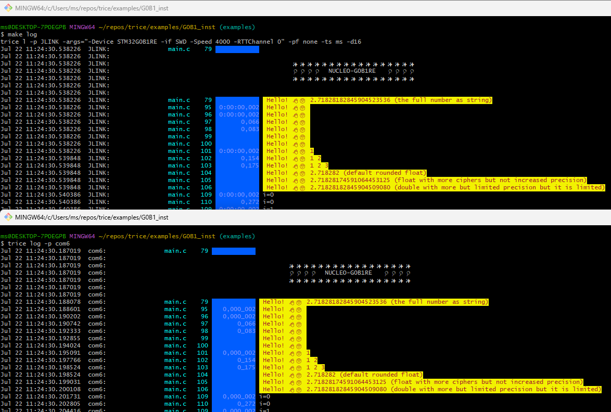

- The Trices with 16-bit timestamps are about 150 clocks away from each other. @32MHz this is a time of less 5 µs.

<p align="right">(<a href="#top">back to top</a>)</p>

### 36.2. <a id='nucleo-g0b1-examples'></a>Nucleo-G0B1 Examples


#### 36.2.1. <a id='g0b1_bare'></a>G0B1_bare

Folder: [../examples/G0B1_bare/](../examples/G0B1_bare/)

<a id='g0b1_gen-description'></a><h5>G0B1_gen Description</h5>

- This is a working example with CLang and also GCC.
- This is a STMCubeMX generated project. It was then manually adapted to Clang.
- It is without TRICE instrumentation for easy compare with [../G0B1_inst](../G0B1_inst) to figure out the needed changes to set up trice.

<a id='setting-up-g0b1_gen'></a><h5>Setting Up G0B1_gen</h5>

- See and adapt steps from [F030_bare](#f030_bare).
- Then add/modify the files to reach this folder layot.

#### 36.2.2. <a id='g0b1_inst'></a>G0B1_inst

Folder: [../examples/G0B1_inst/](../examples/G0B1_inst/)

This is an example with direct out without framing over RTT and deferred out in TCOBS framing over UART.

<a id='setting-up-1'></a><h5>Setting Up</h5>

- See and adapt steps from [G0B1_bare](#g0B1_bare).

<a id='instrumenting'></a><h5>Instrumenting</h5>

- The steps are similar to the steps in [F030_bare](#f030_bare).
- See comments in [triceConfig.h](../examples/G0B1_bare/Core/Inc/triceConfig.h) and commandlines in screenshot.


<p align="right">(<a href="#top">back to top</a>)</p>

### 36.3. <a id='nucleo-l432kc-examples'></a>Nucleo-L432KC Examples


#### 36.3.1. <a id='l432_bare'></a>L432_bare

Folder: [../examples/L432_bare/](../examples/L432_bare/)

* [NUCLEO L432 User Manual](../../ref/dm00231744-stm32-nucleo32-boards-mb1180-stmicroelectronics.pdf) (example)
* This example is without Trice istrumentation and serves for comparing with [L432_inst](l432-inst) to see the needed instrumentation steps quickly.
* This is a STMCubeMX generated project.
* See and adapt steps from [F030_bare](#f030_bare) example.
* It was then manually adapted additionally to Clang.
* It was additionally configured for FreeRTOS.

#### 36.3.2. <a id='l432_inst'></a>L432_inst

Folder: [../examples/L432_inst/](../examples/L432_inst/)

* This is the with Trice instrumented example project [L432_bare](#l432-bare).
* It is for easy compare to figure out the needed setup changes.
* See and adapt steps in [F030_bare](l432-bare).
* Then add/modify the files to reach this folder layout.

<h5>Build:</h5>

Run `./build.sh` for configuration 0 or `./build.sh CONFIGURATION=34` for example.

<h6>Deferred Mode for max Speed</h6>

The stamps are MCU clocks here, so `🐁 Speedy Gonzales` lasts 9 processor clocks here.

```bash
ms@DESKTOP-7POEGPB MINGW64 ~/repos/trice_wt_devel/examples/L432_inst (devel)
$ trice l -p com8 -hs off -prefix off
      triceExamples.c    10        0_272  Hello! 👋🙂

        ✨✨✨✨✨✨✨✨✨✨✨✨✨✨✨✨✨
        🎈🎈🎈🎈  𝕹𝖀𝕮𝕷𝕰𝕺-L432KC   🎈🎈🎈🎈
        🍃🍃🍃🍃🍃🍃🍃🍃🍃🍃🍃🍃🍃🍃🍃🍃🍃


        triceConfig.h   369              CONFIGURATION == 34 - UART, no cycle counter, no critical sections.
      triceExamples.c    45              TRICE_DIRECT_OUTPUT == 0, TRICE_DEFERRED_OUTPUT == 1
      triceExamples.c    51              TRICE_DOUBLE_BUFFER, TRICE_MULTI_PACK_MODE
      triceExamples.c    60              _CYCLE == 0, _PROTECT == 0, _DIAG == 0, XTEA == 0
      triceExamples.c    61              _SINGLE_MAX_SIZE=512, _BUFFER_SIZE=580, _DEFERRED_BUFFER_SIZE=4096
      triceExamples.c    15    0,000_731 🐁 Speedy Gonzales
      triceExamples.c    16    0,000_745 🐁 Speedy Gonzales
      triceExamples.c    17    0,000_754 🐁 Speedy Gonzales
      triceExamples.c    18    0,000_763 🐁 Speedy Gonzales
      triceExamples.c    19    0,000_772 🐁 Speedy Gonzales
      triceExamples.c    20    0,000_781 🐁 Speedy Gonzales
      triceExamples.c    21    0,000_790 🐁 Speedy Gonzales
      triceExamples.c    22    0,000_799 🐁 Speedy Gonzales
      triceExamples.c    24        0_981 2.71828182845904523536 <- float number as string
      triceExamples.c    25        1_230 2.71828182845904509080 (double with more ciphers than precision)
      triceExamples.c    26        1_268 2.71828174591064453125 (float  with more ciphers than precision)
      triceExamples.c    27        1_296 2.718282 (default rounded float)
      triceExamples.c    28        1_310 A Buffer:
      triceExamples.c    29        1_348 32 2e 37 31 38 32 38 31 38 32 38 34 35 39 30 34 35 32 33 35 33 36
      triceExamples.c    30        1_603 31372e32  31383238  34383238  34303935  35333235
      triceExamples.c    31        1_799 ARemoteFunctionName(2e32)(3137)(3238)(3138)(3238)(3438)(3935)(3430)(3235)(3533)(3633)
      triceExamples.c    32              10 times a 16 byte long Trice messages, which not all will be written because of the TRICE_PROTECT:
      triceExamples.c    34        2_072 i=44444400 aaaaaa00
      triceExamples.c    34        2_119 i=44444401 aaaaaa01
      triceExamples.c    34        2_166 i=44444402 aaaaaa02
```

<a id='"hardware"-changes'></a><h5>"Hardware" Changes</h5>

* The used evaluation board is delivered with an on-board ST-Link software for debugging.
* This was changed to an on-board J-Link software for better debugging and RTT support.
* See [Trice over RTT](#trice-over-rtt) about that.

<a id='using-rtt-with-on-board-j-link-and-jlinkrttlogger'></a><h5>Using RTT with on-board J-Link and JLinkRTTLogger</h5>

* You need to install the "J-Link Software and Documentation pack" for yout OS.
* [./Core/Inc/triceConfig.h](./Core/Inc/triceConfig.h) contains example Trice log commands.

<a id='using-rtt-with-on-board-j-link-and-openocd'></a><h5>Using RTT with on-board J-Link and OpenOCD</h5>

<a id='with-windows-not-possible'></a><h6>With Windows not possible</h6>

* OpenOCD does not support the installed JLink driver.

* Changing to the WinUSB buld device driver is here not supported :-(

<a id='darwin'></a><h6>Darwin</h6>

* See **OpenOCD with Darwin** in [Trice over RTT](#trice-over-rtt)

<a id='using-rtt-with-on-board-st-link-and-openocd'></a><h5>Using RTT with on-board ST-Link and OpenOCD</h5>

**Terminal 1:**

```bash
ms@LenovoP51Win11 MINGW64 /e/repos/trice/examples/L432_inst (devel)
$ openocd -f STLinkOpenOCD.cfg
Open On-Chip Debugger 0.12.0 (2024-09-16) [https://github.com/sysprogs/openocd]
Licensed under GNU GPL v2
libusb1 d52e355daa09f17ce64819122cb067b8a2ee0d4b
For bug reports, read
        http://openocd.org/doc/doxygen/bugs.html
Info : The selected transport took over low-level target control. The results might differ compared to plain JTAG/SWD
Info : clock speed 100 kHz
Info : STLINK V2J24M11 (API v2) VID:PID 0483:374B
Info : Target voltage: 72.811768
Info : [stm32l4x.cpu] Cortex-M4 r0p1 processor detected
Info : [stm32l4x.cpu] target has 6 breakpoints, 4 watchpoints
Info : [stm32l4x.cpu] Examination succeed
Info : [stm32l4x.cpu] starting gdb server on 3333
Info : Listening on port 3333 for gdb connections
Info : rtt: Searching for control block 'SEGGER RTT'
Info : rtt: Control block found at 0x2000145c
Info : Listening on port 9090 for rtt connections
Channels: up=1, down=3
Up-channels:
0: Terminal 1024 0
Down-channels:
0: Terminal 16 0
Info : Listening on port 6666 for tcl connections
Info : Listening on port 4444 for telnet connections
```

**Terminal2:**

```bash
ms@LenovoP51Win11 MINGW64 /e/repos/trice/examples/L432_inst (devel)
$ trice l -p TCP4 -args localhost:9090  -pf none -d16
Nov 16 20:38:12.376056  TCP4:       triceExamples.c    10        1_595  Hello! 👋🙂
Nov 16 20:38:12.376056  TCP4:
Nov 16 20:38:12.376056  TCP4:         ✨✨✨✨✨✨✨✨✨✨✨✨✨✨✨✨✨
Nov 16 20:38:12.376056  TCP4:         🎈🎈🎈🎈  𝕹𝖀𝕮𝕷𝕰𝕺-L432KC   🎈🎈🎈🎈
Nov 16 20:38:12.376056  TCP4:         🍃🍃🍃🍃🍃🍃🍃🍃🍃🍃🍃🍃🍃🍃🍃🍃🍃
Nov 16 20:38:12.376056  TCP4:
Nov 16 20:38:12.376056  TCP4:
Nov 16 20:38:13.891033  TCP4:       triceExamples.c    16       43_439 2.71828182845904523536 <- float number as string
Nov 16 20:38:14.874024  TCP4:       triceExamples.c    17       44_949 2.71828182845904509080 (double with more ciphers than precision)
Nov 16 20:38:15.692614  TCP4:       triceExamples.c    18       45_802 2.71828174591064453125 (float  with more ciphers than precision)
Nov 16 20:38:16.323665  TCP4:       triceExamples.c    19       46_536 2.718282 (default rounded float)
```

<a id='using-on-board-st-link-and-vs-code-cortex-debug-extension'></a><h5>Using On-board ST-Link and VS-Code Cortex-Debug Extension</h5>

<a id='fail'></a><h6>Fail</h6>

* [https://www.st.com/resource/en/user_manual/um2576-stm32cubeide-stlink-gdb-server-stmicroelectronics.pdf](https://www.st.com/resource/en/user_manual/um2576-stm32cubeide-stlink-gdb-server-stmicroelectronics.pdf)
* Downloaded and installed
  * [en.stm32cubeprg-win64-v2-17-0.zip]()
  * [en.st-link-server-v2-1-1.zip]()
    * PATH variable extended with `C:\Program Files (x86)\STMicroelectronics\stlink_server`
    * Copied
      * From: "C:\Program Files (x86)\STMicroelectronics\stlink_server\stlinkserver.exe"
      * To: "C:\Program Files (x86)\STMicroelectronics\stlink_server\ST-LINK_gdbserver.exe"

<a id='ok'></a><h6>OK</h6>

* Download st-util from github.com
* Unpack to `C:\bin\stlink-1.8.0-win32` and add `C:\bin\stlink-1.8.0-win32\bin` to path
* Copy `C:\bin\stlink-1.8.0-win32\Program Files (x86)\stlink` to `C:\Program Files (x86)\stlink`
* Get `C:\bin\libusb-1.0.27`
* Copy `C:\bin\libusb-1.0.27\MinGW64\dll\libusb-1.0.dll` to `C:\bin\stlink-1.8.0-win32\bin\libusb-1.0.dll`
```bash
ms@LenovoP51Win11 MINGW64 /e/repos/trice/examples/L432_inst (devel)
$ st-util.exe
st-util 1.8.0
libusb: info [get_guid] no DeviceInterfaceGUID registered for 'USB\VID_056A&PID_5105\5&1140C04&0&10'
libusb: info [get_guid] no DeviceInterfaceGUID registered for 'USB\VID_056A&PID_5105&MI_01\6&13339912&0&0001'
libusb: info [get_guid] no DeviceInterfaceGUID registered for 'USB\VID_058F&PID_9540\5&1140C04&0&11'
libusb: info [get_guid] no DeviceInterfaceGUID registered for 'USB\VID_8087&PID_0A2B\5&1140C04&0&14'
libusb: info [get_guid] no DeviceInterfaceGUID registered for 'USB\ROOT_HUB30\4&20F1DF2E&0&0'
libusb: info [get_guid] no DeviceInterfaceGUID registered for 'USB\VID_0765&PID_5010\5&1140C04&0&13'
libusb: info [get_guid] no DeviceInterfaceGUID registered for 'USB\VID_0483&PID_374B&MI_01\6&224DEA1D&0&0001'
libusb: info [get_guid] no DeviceInterfaceGUID registered for 'USB\VID_5986&PID_111C&MI_00\6&104790C2&0&0000'
libusb: info [get_guid] no DeviceInterfaceGUID registered for 'USB\VID_046D&PID_C534\5&1140C04&0&6'
libusb: info [get_guid] no DeviceInterfaceGUID registered for 'USB\VID_0483&PID_374B&MI_02\6&224DEA1D&0&0002'
libusb: info [get_guid] no DeviceInterfaceGUID registered for 'USB\VID_0483&PID_374B\066CFF515570514867145144'
libusb: info [get_guid] no DeviceInterfaceGUID registered for 'USB\VID_138A&PID_0097\72FA8C531499'
libusb: info [get_guid] no DeviceInterfaceGUID registered for 'USB\VID_056A&PID_5105&MI_00\6&13339912&0&0000'
libusb: info [get_guid] no DeviceInterfaceGUID registered for 'USB\VID_046D&PID_C534&MI_01\6&C944391&0&0001'
libusb: info [get_guid] no DeviceInterfaceGUID registered for 'USB\VID_046D&PID_C534&MI_00\6&C944391&0&0000'
libusb: info [get_guid] no DeviceInterfaceGUID registered for 'USB\VID_5986&PID_111C\200901010001'
2024-11-17T22:20:05 INFO common.c: STM32L41x_L42x: 48 KiB SRAM, 256 KiB flash in at least 2 KiB pages.
2024-11-17T22:20:05 INFO gdb-server.c: Listening at *:4242...
Receive signal 0. Exiting...
```
(Last line after `CTRL-C`)

<p align="right">(<a href="#top">back to top</a>)</p>

## 37. <a id='trice-generate'></a>Trice Generate

### 37.1. <a id='colors'></a>Colors

Support for finding a color style:

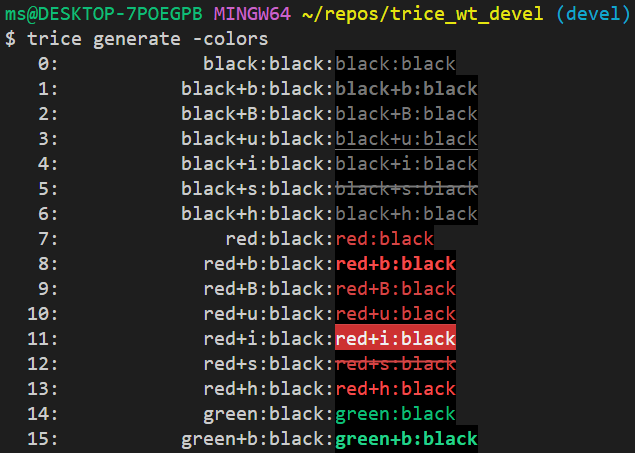

See [Check Alternatives](#check-alternatives) chapter.

### 37.2. <a id='c-code'></a>C-Code

If you intend to get the `trice log` functionality full or partially as a `tlog` C-Source and do not wish to parse the _til.json_ file, you can run `trice generate -tilH --tilC` to create a C-file with header as starting point. That could be interesting for compiling the log functionality into a small separate microcontroller board.

```C
//! \file til.c
//! ///////////////////////////////////////////////////////////////////////////

//! Trice generated code - do not edit!

#include "til.h"

//! triceFormatStringList contains all trice format strings together with id and parameter information.
//!
//! The bitWidth value is not transmitted in the binary data stream and needed for its decoding.
//! The paramCount is de-facto not needed. It is derivable from the received data, see docs/TriceUserManual.md/#binary-encoding.
//! It is recommended to check if both values are matching. A negative paramCount indicates, that its value is unknown at compile time.
const triceFormatStringList_t triceFormatStringList[] = {
	/* Trice type (  extended  ) */  //  id, bitWidth, paramCount, format-string
	/*      trice (  trice32_9 ) */ { 14016,  32,  9, "rd:trice %d, %d, %d, %d, %d, %d, %d, %d, %d\n" },
	/*      trice (     trice0 ) */ { 14224,  32,  0, "\n" },
	/*    trice32 (  trice32_1 ) */ { 14337,  32,  1, "msg:%u (%%u)\n" },
	/*     TRICE8 (  TRICE8_10 ) */ { 15063,   8, 10, "rd:TRICE8 %d, %d, %d, %d, %d, %d, %d, %d, %d, %d\n" },
	/*     Trice8 (   Trice8_9 ) */ { 15124,   8,  9, "rd:Trice8 %d, %d, %d, %d, %d, %d, %d, %d, %d\n" },
	/*     TRICE8 (   TRICE8_5 ) */ { 15058,   8,  5, "rd:TRICE8 %d, %d, %d, %d, %d\n" },
	/*      TRice (     TRice0 ) */ { 14885,  32,  0, "TEST:yellow+h:black\n" },
	/*    Trice64 (  Trice64_1 ) */ { 15560,  64,  1, "rd:Trice64 %d\n" },
	/*      trice (  trice32_1 ) */ { 15860,  32,  1, "rd:TRICE float %9.f (%%9.f)\n" },
...
	/*  TRICE64_0 (  TRICE64_0 ) */ { 16157,  64,  0, "w: Hello! 👋🙂 \a\n" },
	/*      TRICE (     TRICE0 ) */ { 14658,  32,  0, "interrupt:magenta+i:default+h\n" },
};

//! triceFormatStringListElements holds the compile time computed count of list elements.
const unsigned triceFormatStringListElements = sizeof(triceFormatStringList) / sizeof(triceFormatStringList_t);

```

### 37.3. <a id='c#-code'></a>C#-Code

With `trice generate -tilCS` a starting point for a C-Sharp application is generated:

```cs
//! \file til.cs 

// Trice generated code - do not edit!

// There is still a need to exchange the format specifier from C to C# !!!!!!!!!!!!!!!!!!!!!!!!!!!!!!!
// See https://stackoverflow.com/questions/33432341/how-to-use-c-language-format-specifiers-in-c-sharp
// and https://www.codeproject.com/Articles/19274/A-printf-implementation-in-C for possible help.

namespace TriceIDList;

	public class TilItem
	{
		public TilItem(int bitWidth, int paramCount, string strg)
		{
			BitWidth = bitWidth;
			ParamCount = paramCount;
			Strg = strg;
		}

		public int BitWidth { get; init; }
		public int ParamCount { get; init; }
		public string Strg { get; init; }
	}

	//! Til contains all trice format strings together with id and parameter information.
	//!
	//! The bitWidth value is not transmitted in the binary data stream and needed for its decoding.
	//! The paramCount is de-facto not needed. It is derivable from the received data, see docs/TriceUserManual.md/#binary-encoding.
	//! It is recommended to check if both values are matching. A negative paramCount indicates, that its value is unknown at compile time.
	public static class Til
	{
		public static readonly Dictionary<int, TilItem> TilList= new Dictionary<int, TilItem>
		{ /* triceType ( extended ) */ //   id,     TilItem( bitWidth, paramCount, Strg )
		/*   TRICE_12 ( TRICE32_12 )*/ { 14991, new TilItem( 32, 12, "rd:TRICE_12 %d, %d, %d, %d, %d, %d, %d, %d, %d, %d, %d, %d\n" ) },
		/*      TRICE (  TRICE32_1 )*/ { 15636, new TilItem( 32,  1, "WR:write        message, SysTick is %6u\n" ) },
		/*    TRICE_S (    TRICE_S )*/ { 14178, new TilItem( 32, -1, "msg:With TRICE_S:%s\n" ) },
...
		/*    TRICE16 (  TRICE16_2 )*/ { 16056, new TilItem( 16,  2, "rd:TRICE16 %p, %p\n" ) },
    };
}
```

### 37.4. <a id='generating-a-rpc-function-pointer-list'></a>Generating a RPC Function Pointer List

When several embedded devices are going to communicate, `trice generate -rpcH -rpcC` could be helpful.

You will get 2 files similar to:

```C
//! \file tilRpc.h
//! ///////////////////////////////////////////////////////////////////////////

//! Trice generated code - do not edit!

#include <stdint.h>

typedef void (*triceRpcHandler_t)(void* buffer, int count);

typedef struct{
    int id;
    triceRpcHandler_t fn;
} triceRpc_t;

extern triceRpc_t triceRpc[];
extern int triceRpcCount;

/*  TRICE16_F */ void FunctionNameXa( int16_t* p, int cnt );
/*  TRICE32_F */ void FunctionNameYa( int32_t* p, int cnt );
/*   TRICE8_F */ void TryoutBufferFunction( int8_t* p, int cnt );
/*   TRice16F */ void FunctionNameXb( int16_t* p, int cnt );
/*   trice32F */ void FunctionNameYd( int32_t* p, int cnt );
/*    TRice8F */ void FunctionNameWb( int8_t* p, int cnt );
/*   trice64F */ void FunctionNameZd( int64_t* p, int cnt );
/*   Trice16F */ void ARemoteFunctionName( int16_t* p, int cnt );
/*    Trice8F */ void FunctionNameWc( int8_t* p, int cnt );
/*   Trice16F */ void FunctionNameXc( int16_t* p, int cnt );
/*   TRICE8_F */ void TryoutStructFunction( int8_t* p, int cnt );
/*   Trice64F */ void FunctionNameZc( int64_t* p, int cnt );
/*    trice8F */ void FunctionNameWd( int8_t* p, int cnt );
/*   TRice64F */ void FunctionNameZb( int64_t* p, int cnt );
/*  TRICE64_F */ void FunctionNameZa( int64_t* p, int cnt );
/*   trice16F */ void FunctionNameXd( int16_t* p, int cnt );
/*   TRICE8_F */ void FunctionNameWa( int8_t* p, int cnt );
/*   TRice32F */ void FunctionNameYb( int32_t* p, int cnt );
/*   Trice32F */ void FunctionNameYc( int32_t* p, int cnt );

// End of file

```

```C
//! \file tilRpc.c
//! ///////////////////////////////////////////////////////////////////////////

//! Trice generated code - do not edit!

#include <stdio.h> // needed for __attribute__((weak)) 
#include "tilRpc.h"

//! triceRpc contains all rpc IDs together with their function pointer address.
const triceRpc_t triceRpc[] = {
	/* Trice type */  //  id, function pointer
	/*    TRice8F */ { 14227, FunctionNameWb },
	/*  TRICE32_F */ { 14234, FunctionNameYa },
	/*   TRICE8_F */ { 16179, TryoutBufferFunction },
	/*   Trice16F */ { 14232, FunctionNameXc },
	/*   Trice64F */ { 14240, FunctionNameZc },
	/*   TRice64F */ { 14239, FunctionNameZb },
	/*  TRICE16_F */ { 14230, FunctionNameXa },
	/*   TRICE8_F */ { 16178, TryoutStructFunction },
	/*    Trice8F */ { 14228, FunctionNameWc },
	/*   trice16F */ { 14233, FunctionNameXd },
	/*   trice64F */ { 14241, FunctionNameZd },
	/*   trice32F */ { 14237, FunctionNameYd },
	/*   TRICE8_F */ { 14226, FunctionNameWa },
	/*   TRice16F */ { 14231, FunctionNameXb },
	/*   TRice32F */ { 14235, FunctionNameYb },
	/*   Trice16F */ { 16337, ARemoteFunctionName },
	/*    trice8F */ { 14229, FunctionNameWd },
	/*   Trice32F */ { 14236, FunctionNameYc },
	/*  TRICE64_F */ { 14238, FunctionNameZa }
};

//! triceRpcListElements holds the compile time computed count of list elements.
const unsigned triceRpcElements = sizeof(triceRpc) / sizeof(triceRpc_t);

void TryoutBufferFunction( int8_t* p, int cnt) __attribute__((weak)) {}
void FunctionNameXc( int16_t* p, int cnt) __attribute__((weak)) {}
void FunctionNameZc( int64_t* p, int cnt) __attribute__((weak)) {}
void FunctionNameZb( int64_t* p, int cnt) __attribute__((weak)) {}
void FunctionNameXa( int16_t* p, int cnt) __attribute__((weak)) {}
void TryoutStructFunction( int8_t* p, int cnt) __attribute__((weak)) {}
void FunctionNameWc( int8_t* p, int cnt) __attribute__((weak)) {}
void FunctionNameXd( int16_t* p, int cnt) __attribute__((weak)) {}
void FunctionNameZd( int64_t* p, int cnt) __attribute__((weak)) {}
void FunctionNameYd( int32_t* p, int cnt) __attribute__((weak)) {}
void FunctionNameWa( int8_t* p, int cnt) __attribute__((weak)) {}
void FunctionNameXb( int16_t* p, int cnt) __attribute__((weak)) {}
void FunctionNameYb( int32_t* p, int cnt) __attribute__((weak)) {}
void ARemoteFunctionName( int16_t* p, int cnt) __attribute__((weak)) {}
void FunctionNameWd( int8_t* p, int cnt) __attribute__((weak)) {}
void FunctionNameYc( int32_t* p, int cnt) __attribute__((weak)) {}
void FunctionNameZa( int64_t* p, int cnt) __attribute__((weak)) {}
void FunctionNameWb( int8_t* p, int cnt) __attribute__((weak)) {}
void FunctionNameYa( int32_t* p, int cnt) __attribute__((weak)) {}

// End of file
```

Assume a project with several devices. You can add these 2 files to all targets and if a special target should execute any functions, simply implement them. These functions on their own can execute other Trice statements to transmit results. If a client performs a RPC call this way, the request is transmitted with the Trice speed. Several target devices (servers) can respond and the client can wait for the first or some of them. That waiting functionality is of course not the job of the Trice library. 

## 38. <a id='testing-the-trice-library-c-code-for-the-target'></a>Testing the Trice Library C-Code for the Target

### 38.1. <a id='general-info'></a>General info

This folder is per default named to `_test` to avoid vsCode slow down. Also, when running `go test ./...`,  the tests in the `_test` folder are excluded, because they take a long time. Run `./testAll.sh` to include them.

The main aim of these tests is to automatic compile and run the target code in different compiler switch variants avoiding manual testing this way.

* ALSO: In `./examples` you can translate all examples with `./buildAllTargets.sh`.
* ALSO: In `./examples/L432_inst` the script `all_configs_build.sh` translates many different configurations.

For the user it could be helpful to start with a `triceConfig.h`file from here and to adapt the Trice tool command line from the matching `cgo_test.go` if no close match in the `examples` folder was found.

### 38.2. <a id='how-to-run-the-tests'></a>How to run the tests

- In `_trice` folder first execute `go clean -cache`. Cleaning the **Go** cache is recommended, because the CGO tests keep pre-compiled files and when editing C-files, this can led to confusing results.
- Execute `./renewIDs_in_examples_and_test_folder.sh` after you edited files in the `./examples` or `_test` folder.
- To run the tests manually `cd` into `_test` and execute `trice insert -i ./testdata/til.json -li ./testdata/li.json` and then `go test ./...` fom there.
- It is convenient to run  `testAll.sh` from the Trice root folder to perform this.

### 38.3. <a id='tests-details'></a>Tests Details

All folders despite `testdata` are test folders and the name `tf` is used as a place holder for them in this document.

To exclude a specific folder temporary, simply rename it to start with an underscore `_tf`.

The `tf` are serving for target code testing in different configuration variants on the host machine. The file [./testdata/triceCheck.c](./testdata/triceCheck.c) is the master file for most tests and serves also as example usage.

[./testdata/cgoPackage.go](./testdata/cgoPackage.go) is the common master for the `generated_cgoPackage.go` files and contains the common test code. 

The folders `tf` are Go packages just for tests. They all have the same package name `cgot` and are not included into the trice tool. The different `cgot` packages are independent and could have any names. They do not see each other and are used for target code testing independently. When the tests are executed for each package, a separate test binary is build and these run parallel.

The `tf/triceConfig.h` files differ and correspondent to the `tf/cgo_test.go` files in the same folder. On test execution, the `./testdata/*.c` files are compiled into the trice test executable together with the trice sources `../src` using the `tf/triceConfig.h` file.

The individual tests collect the expected results (`//exp: result`) together with the line numbers into a slice to execute the test loop on it. The `triceLogTest` function gets the `triceLog` function as parameter.

`triceLogTest` iterates over the results slice and calls for each line the C-function `triceCheck`. Then the line specific binary data buffer is passed to the `triceLog` parameter function which "logs" the passed buffer into an actual result string which in turn is compared with the expected result.

The whole process is relatively slow because of the often passed Go - C barrier, but allows automated tests in different configuration variants in one shot.

The `testdata\cgoPackage.go` file contains a variable `testLines = n`, which limits the amount of performed trices for each test case to `n`. Changing this value will heavily influence the test duration. The value `-1` is reserved for testing all test lines.

### 38.4. <a id='how-to-add-new-test-cases'></a>How to add new test cases

- Choose a test folder similar to the intended test and copy it under a new descriptive name like `newTest`.
- Extend file `./renewIDs_in_examples_and_test_folder.sh` accordingly.
- Edit files `newTest/triceConfig.h` and `newTest/cgo_test.go` in a matching way.
- Run command `go test test/newTest/...`

### 38.5. <a id='test-internals'></a>Test Internals

The `./trice/_test/testdata/*.c` and `./trice/src/*.c` are compiled together with the actual cgot package into one singe Trice test binary, resulting in as many test binaries as there are test folders. Calling its TestFunction(s) causes the activation of the Trice statement(s) inside *triceCheck.c*. The ususally into an embedded device compiled Trice code generates a few bytes according to the configuration into a buffer. These bytes are transmitted usually in real life over a (serial) port or RTT. In the tests here, this buffer is then read out by the Trice tool handler function according to the used CLI switches and processed to a log string using the *til.json* file. This string is then compared to the expected string for the activated line.

Each `tf` is a **Go** package, which is not part of any **Go** application. They all named `cgot` and are only used independently for testing different configurations. The `tf/generated_cgoPackage.go` file is identical in all `tf`. Its master is `testdata/cgoPackage.go`. After editing the master, running the command `./renewIDs_in_examples_and_test_folder.sh` copies the master to all `tf` and renames it to `generated_cgoPackage.go`.

The test specific target code configuration is inside `tf/trice.Config.h` and the appropriate Trice tool CLI switches are in `tf/cgo_test.go`.

When running `go test ./tf`, a Trice tool test executable is build, using the Trice tool packages and the `tf` package `cgot`, and the function `TestLogs` is executed. Its internal closure `triceLog` contains the Trice tool CLI switches and is passed to the `ccgot` package function `triceLogTest` together with the number of testLines and the trice mode (`directTransfer` or `deferrerdTransfer`).

During the test, the file `triceCheck.c` is scanned for lines like

```C
break; case __LINE__: TRice( iD(3537), "info:This is a message without values and a 32-bit stamp.\n" ); //exp: time: 842,150_450default: info:This is a message without values and a 32-bit stamp.
```

Some C-code lines contain Trice statements and comments starting with `//exp: ` followed by the expected Trice tool output for that specific line. The **Go** testfunction collects these outputs in a slice together with the line numbers. Then for each found line number the execution of the **Go** function `func triceCheck(n int)` takes part, which in turn calls the CGO compiled C-function `TriceCheck(n)`. The now activated Trice C-code writes the generated trice bytes in a between **C** and **Go** shared buffer using the C-function `TriceWriteDeviceCgo`. After returning from the **Go** function `func triceCheck(n int)` and optionally calling `TriceTransfer` in deferred mode the Trice tool `triceLog()` function converts the Trice buffer bytes to the log string and compares the result with the expected data. The between **Go** and **C** shared buffer limits the executed Trices per line to one, because they use the same buffer from the beginning. This could be done better with an increment to allow several trices in one single line.

Because each test runs a different configuration, all possible combinations are testable.

### 38.6. <a id='test-results'></a>Test Results

```bash
ms@DESKTOP-7POEGPB MINGW64 ~/repos/trice_wt_devel (devel)
$ ./testAll.sh
Thu, Dec 12, 2024  4:29:20 PM
This can take several minutes ...
?       github.com/rokath/trice/internal/decoder        [no test files]
?       github.com/rokath/trice/internal/do     [no test files]
?       github.com/rokath/trice/internal/translator     [no test files]
?       github.com/rokath/trice/pkg/ant [no test files]
ok      github.com/rokath/trice/cmd/trice       1.386s
ok      github.com/rokath/trice/internal/args   0.482s
ok      github.com/rokath/trice/internal/charDecoder    0.335s
ok      github.com/rokath/trice/internal/com    15.920s
ok      github.com/rokath/trice/internal/dumpDecoder    0.321s
ok      github.com/rokath/trice/internal/emitter        0.341s
ok      github.com/rokath/trice/internal/id     3.108s
ok      github.com/rokath/trice/internal/keybcmd        0.293s
ok      github.com/rokath/trice/internal/link   0.259s
ok      github.com/rokath/trice/internal/receiver       0.290s
ok      github.com/rokath/trice/internal/trexDecoder    0.266s
ok      github.com/rokath/trice/pkg/cipher      0.214s
ok      github.com/rokath/trice/pkg/endian      0.155s
ok      github.com/rokath/trice/pkg/msg 0.163s
ok      github.com/rokath/trice/pkg/tst 0.234s
ok      github.com/rokath/trice/_test/be_dblB_de_tcobs_ua       123.214s
ok      github.com/rokath/trice/_test/be_staticB_di_xtea_cobs_rtt32     123.181s
ok      github.com/rokath/trice/_test/dblB_de_cobs_ua   123.259s
ok      github.com/rokath/trice/_test/dblB_de_multi_cobs_ua     123.367s
ok      github.com/rokath/trice/_test/dblB_de_multi_nopf_ua     123.216s
ok      github.com/rokath/trice/_test/dblB_de_multi_tcobs_ua    123.276s
ok      github.com/rokath/trice/_test/dblB_de_multi_xtea_cobs_ua        123.332s
ok      github.com/rokath/trice/_test/dblB_de_multi_xtea_tcobs_ua       122.964s
ok      github.com/rokath/trice/_test/dblB_de_nopf_ua   123.266s
ok      github.com/rokath/trice/_test/dblB_de_tcobs_ua  122.418s
ok      github.com/rokath/trice/_test/dblB_de_xtea_cobs_ua      123.149s
ok      github.com/rokath/trice/_test/dblB_de_xtea_tcobs_ua     123.117s
ok      github.com/rokath/trice/_test/dblB_di_nopf_rtt32__de_cobs_ua    247.155s
ok      github.com/rokath/trice/_test/dblB_di_nopf_rtt32__de_multi_cobs_ua      247.183s
ok      github.com/rokath/trice/_test/dblB_di_nopf_rtt32__de_multi_tcobs_ua     246.932s
ok      github.com/rokath/trice/_test/dblB_di_nopf_rtt32__de_tcobs_ua   246.965s
ok      github.com/rokath/trice/_test/dblB_di_nopf_rtt32__de_xtea_cobs_ua       247.484s
ok      github.com/rokath/trice/_test/dblB_di_nopf_rtt8__de_cobs_ua     247.237s
ok      github.com/rokath/trice/_test/dblB_di_nopf_rtt8__de_multi_cobs_ua       247.262s
ok      github.com/rokath/trice/_test/dblB_di_nopf_rtt8__de_multi_tcobs_ua      247.044s
ok      github.com/rokath/trice/_test/dblB_di_nopf_rtt8__de_tcobs_ua    247.536s
ok      github.com/rokath/trice/_test/ringB_de_cobs_ua  124.219s
ok      github.com/rokath/trice/_test/ringB_de_multi_tcobs_ua   123.666s
ok      github.com/rokath/trice/_test/ringB_de_multi_xtea_cobs_ua       123.858s
ok      github.com/rokath/trice/_test/ringB_de_multi_xtea_tcobs_ua      123.754s
ok      github.com/rokath/trice/_test/ringB_de_nopf_ua  123.900s
ok      github.com/rokath/trice/_test/ringB_de_tcobs_ua 123.647s
ok      github.com/rokath/trice/_test/ringB_de_xtea_cobs_ua     123.858s
ok      github.com/rokath/trice/_test/ringB_de_xtea_tcobs_ua    124.244s
ok      github.com/rokath/trice/_test/ringB_di_cobs_rtt32__de_tcobs_ua  248.032s
ok      github.com/rokath/trice/_test/ringB_di_cobs_rtt8__de_tcobs_ua   247.892s
ok      github.com/rokath/trice/_test/ringB_di_nopf_rtt32__de_tcobs_ua  247.737s
ok      github.com/rokath/trice/_test/ringB_di_nopf_rtt32__de_xtea_cobs_ua      247.479s
ok      github.com/rokath/trice/_test/ringB_di_nopf_rtt8__de_tcobs_ua   247.343s
ok      github.com/rokath/trice/_test/ringB_di_tcobs_rtt32__de_tcobs_ua 247.275s
ok      github.com/rokath/trice/_test/ringB_di_xtea_cobs_rtt32__de_xtea_cobs_ua 247.167s
ok      github.com/rokath/trice/_test/special_protect_dblB_de_tcobs_ua  0.554s
ok      github.com/rokath/trice/_test/stackB_di_nopf_aux32      123.970s
ok      github.com/rokath/trice/_test/stackB_di_nopf_aux8       124.183s
ok      github.com/rokath/trice/_test/stackB_di_nopf_rtt32      124.195s
ok      github.com/rokath/trice/_test/stackB_di_nopf_rtt8       123.880s
ok      github.com/rokath/trice/_test/stackB_di_xtea_cobs_rtt8  123.714s
ok      github.com/rokath/trice/_test/staticB_di_nopf_aux32     123.608s
ok      github.com/rokath/trice/_test/staticB_di_nopf_aux8      123.622s
ok      github.com/rokath/trice/_test/staticB_di_nopf_rtt32     123.708s
ok      github.com/rokath/trice/_test/staticB_di_nopf_rtt8      123.621s
ok      github.com/rokath/trice/_test/staticB_di_tcobs_rtt32    123.451s
ok      github.com/rokath/trice/_test/staticB_di_tcobs_rtt8     123.269s
ok      github.com/rokath/trice/_test/staticB_di_xtea_cobs_rtt32        122.980s

real    10m31.896s
user    0m0.000s
sys     0m0.045s
```

### 38.7. <a id='special-tests'></a>Special tests

### 38.8. <a id='test-cases'></a>Test Cases

#### 38.8.1. <a id='folder-naming-convention'></a>Folder Naming Convention

| Folder Name Part | Meaning                                                                                                  |
|:----------------:|----------------------------------------------------------------------------------------------------------|
|    `testdata`    | This is no test folder. It contains data common to all tests.                                            |
|      `_...`      | Folder starting with an undescore `_` are excluded when `go test ./...` is executed.                     |
|      `_di_`      | direct mode                                                                                              |
|      `_de_`      | deferred mode                                                                                            |
|    `special_`    | a test, not using `./testdata/triceCheck.c`                                                              |
|    `staticB_`    | static buffer, direct mode only possible                                                                 |
|    `stackB_`     | stack buffer, direct mode only possible                                                                  |
|     `ringB_`     | ring buffer, deferred mode and optional parallel direct mode                                             |
|     `dblB_`      | double buffer, deferred mode and optional parallel direct mode                                           |
|     `_rtt8_`     | (simulated) SEGGER_RTT byte transfer                                                                     |
|    `_rtt32_`     | (simulated) SEGGER_RTT word transfer                                                                     |
|       `__`       | direct and deferred mode together                                                                        |
|     `_xtea_`     | with encryption, otherwise without encryption                                                            |
|     `_tcobs`     | TCOBS package framing                                                                                    |
|     `_cobs`      | COBS package framing                                                                                     |
|     `_nopf`      | no package framing                                                                                       |
|    `_multi_`     | Usually each Trice is handled separately. In multi mode, groups of available Trices are framed together. |
|      `_ua`       | simulated UART A output (for deferred modes)                                                             |

## 39. <a id='test-issues'></a>Test Issues

Test folders starting with `ERROR_` have issues. These cases are **usable** on the target. These tests fail for an unknown reason. Probably it is a test implementation issue. Especially when XTEA is used in one output but not in the other, the tests fail.


## 40. <a id='trice-user-manual-changelog'></a>Trice User Manual Changelog

<details><summary>Details (click to expand)</summary><ol>

| Date        | Version | Comment       |
|-------------|---------|---------------|
| 2024-DEC-01 | 0.0.0   | Initial Draft |

<p align="right">(<a href="#top">back to top</a>)</p>


<!--

```diff
- text in red
+ text in green
! text in orange
# text in gray
@@ text in purple (and bold)@@
```

https://github.com/adam-p/markdown-here/wiki/Markdown-Cheatsheet

🟢✅🟡⛔🔴🔵💧❓↩෴⚓🛑❗🌡⏱∑✳‼♦♣🚫⚠🎥📷🌊🆘🧷🐢➡☕

RED APPLE (&#x1F34E;): 🍎
GREEN APPLE (&#x1F34F;): 🍏
BLUE HEART (&#x1F499;): 💙
GREEN HEART (&#x1F49A;): 💚
YELLOW HEART (&#x1F49B;): 💛
PURPLE HEART (&#x1F49C;): 💜
GREEN BOOK (&#x1F4D7;): 📗
BLUE BOOK (&#x1F4D8;): 📘
ORANGE BOOK (&#x1F4D9;): 📙
LARGE RED CIRCLE (&#x1F534;): 🔴
LARGE BLUE CIRCLE (&#x1F535;): 🔵
LARGE ORANGE DIAMOND (&#x1F536;): 🔶
LARGE BLUE DIAMOND (&#x1F537;): 🔷
SMALL ORANGE DIAMOND (&#x1F538;): 🔸
SMALL BLUE DIAMOND (&#x1F539;): 🔹
UP-POINTING RED TRIANGLE (&#x1F53A;): 🔺
DOWN-POINTING RED TRIANGLE (&#x1F53B;): 🔻
UP-POINTING SMALL RED TRIANGLE (&#x1F53C;): 🔼
DOWN-POINTING SMALL RED TRIANGLE (&#x1F53D;): 🔽

https://apps.timwhitlock.info/emoji/tables/unicode

-->
