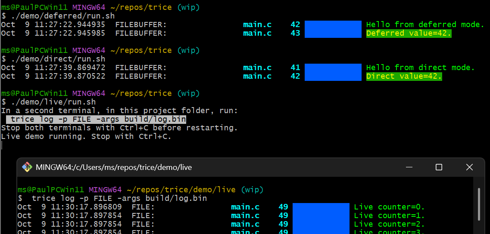
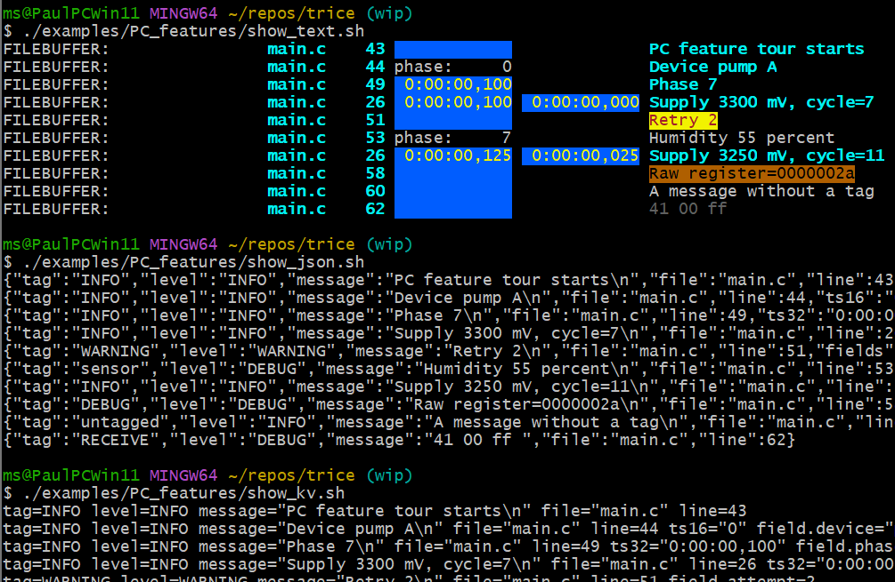
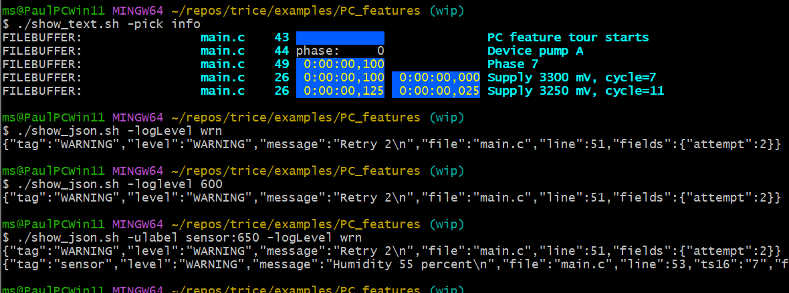

# Trice User Manual

Trice gives C code readable log calls without the need storing their format strings in the binary image. The target sends 4-byte binary records containing an ID with cycle & payload size followed by runtime values. The host tool combines them with a dictionary, `til.json`, to display text or structured data.

Start on your PC: no board, probe or serial cable is needed. This guide then takes the same workflow into your firmware. Use the [Reference Manual](./TriceReferenceManual.md) for complete syntax, configuration and limits.

<details markdown="1">
<summary>Contents</summary>

<!-- mdtoc -->

- [1. Get lib and tools](#get-lib-and-tools)
- [2. See your first log](#see-your-first-log)
- [3. Try fields, filters and context](#try-fields-filters-and-context)
  - [3.1. Keep values as fields](#keep-values-as-fields)
  - [3.2. Select messages by tag or priority](#select-messages-by-tag-or-priority)
  - [3.3. Read target stamps](#read-target-stamps)
  - [3.4. Add context with one build rule](#add-context-with-one-build-rule)
- [4. Bring Trice into your firmware](#bring-trice-into-your-firmware)
  - [4.1. Add the library and configuration](#add-the-library-and-configuration)
  - [4.2. Connect the writer and generate IDs](#connect-the-writer-and-generate-ids)
  - [4.3. Decode the bytes](#decode-the-bytes)
- [5. Know which files to keep](#know-which-files-to-keep)
- [6. Choose your next example](#choose-your-next-example)
- [7. If something does not work](#if-something-does-not-work)

<!-- numbering=true min=2 max=4 slug=github anchor=true link=true toc=true bullets=auto -->
<!-- /mdtoc -->

</details>

## 1. <a id="get-lib-and-tools"></a>Get lib and tools

For the PC examples you need:

- A checkout or extracted source snapshot of Trice, including `demo`, `examples` and the library `src`.
- Bash and the usual shell utilities. On Windows, use Git Bash or s.th. similar.
- The host tools from [GitHub Releases](https://github.com/rokath/trice/releases) in the `PATH`, CLI check: `trice --version`.
- A **native host C compiler** named `cc` or `gcc` with its matching runtime libraries and headers; see [compiler setup](./TriceReferenceManual.md#development-environment-setup).

`trice` manages IDs and decodes logs; the companion `tlog` is a shortcut for `trice log`. The examples below use `trice`.

## 2. <a id="see-your-first-log"></a>See your first log

From the repository [demo/deferred](../demo/deferred):

```sh
./run.sh
```

The script [demo/deferred/run.sh](../demo/deferred/run.sh) assigns IDs, compiles the PC program, runs it and decodes its `log.bin` file. It uses `cc` or, if unavailable, `gcc` from your `PATH`. Ignoring optional prefix and source-location columns, you should see colored:

```text
Hello from deferred mode.
Deferred value=42.
```

**Deferred output** first puts records in a buffer. The application calls `TriceTransfer()` later to send them.

Open [demo/deferred/main.c](../demo/deferred/main.c), change the value `42` to `43`, and run `./run.sh` again from `demo/deferred`. The message now reports `43`. You have changed firmware input, rebuilt it and decoded the resulting binary record.

**Bind** maintains the generated header includes; your calls stay readable, such as `trice("att:Deferred value=%d.\n", 43);`.

The sibling scripts [demo/direct/run.sh](../demo/direct/run.sh) and [demo/live/run.sh](../demo/live/run.sh) demonstrate direct and continuous output. Each demo is an independent project; its generated sidecars stay in `build/generated_sidecars`. Copy a whole demo folder and adjust `trice_src` in its script to point to the Trice library. See the [Reference Manual](./TriceReferenceManual.md#minimal-pc-demos-direct-and-deferred) for those examples and the full configuration details.



## 3. <a id="try-fields-filters-and-context"></a>Try fields, filters and context

The next project collects several small experiments in one program. [examples/PC_features/build_and_run.sh](../examples/PC_features/build_and_run.sh) assigns IDs, compiles the PC program and runs it to create `capture.bin`. [show_text.sh](../examples/PC_features/show_text.sh), [show_json.sh](../examples/PC_features/show_json.sh) and [show_kv.sh](../examples/PC_features/show_kv.sh) decode that same file; choosing another output format does not rebuild the target. Relevant messages include `Device pump A`, two `Supply` readings, `Retry 2`, `Humidity 55 percent` and `A message without a tag`.



### 3.1. <a id="keep-values-as-fields"></a>Keep values as fields

The source file [examples/PC_features/main.c](../examples/PC_features/main.c) contains:

```c
TRice32("info:ctx:Supply {voltage_mv:%u} mV\n", voltage_mv);
```

`{voltage_mv:%u}` both displays an unsigned integer and gives it the field name `voltage_mv`. In JSON the first Supply record contains:

```json
"message":"Supply 3300 mV, cycle=7\n",
"fields":{"voltage_mv":3300,"cycle":7}
```

This is an excerpt; the complete event also contains tag and other enabled metadata. The `cycle` field comes from the context rule explained below. `-logFormat json` produces **NDJSON**: one complete JSON object per event, on one output line. KV produces readable `key=value` entries. Numeric fields remain numbers; the device-name call uses `TriceS` to send the runtime string `pump A`.

Try changing `3300u` in the first `emit_sample` call to `3400u`, rebuild, then run `./show_json.sh` again. Both the message and `fields.voltage_mv` change. Plain `%u` still works when you only need a displayed value. Named fields are supported for scalar calls and strings; named buffer fields are rejected. See [Structured Logging](./TriceReferenceManual.md#structured-logging) for field types, literal braces and buffer output.

### 3.2. <a id="select-messages-by-tag-or-priority"></a>Select messages by tag or priority

A tag is the prefix before the first colon, for example `info:` or `wrn:`. Try these from `examples/PC_features`:

```sh
./show_text.sh -pick info
./show_json.sh -logLevel wrn
./show_json.sh -loglevel 600
./show_json.sh -ulabel sensor:650 -logLevel wrn
```

The first shows INFO events only. The second selects Warning and higher-priority events, including `Retry 2`; the third uses the equivalent lowercase option spelling and numeric Warning threshold. The fourth raises this tour's custom `sensor` tag above the Warning threshold, so `Humidity 55 percent` also appears. This is useful when you want all serious messages rather than a list of individual tags. Higher weights mean higher priority; a lower threshold admits more events.



Repeat `-pick` or `-ban` for several selectors: `./show_json.sh -pick info -pick wrn` displays either group. A number selects an exact weight: `-ban 450` hides this tour's sensor events, while `-pick 450` displays only events at weight 450. In comparison, `-loglevel 450` displays weights 450 and above. Colon-separated lists and weight ranges are rejected; use one selector per option.

JSON and KV derive `level` from the effective weight while keeping `tag` as the category. Here, `sensor` normally has weight 450 and appears as `tag=sensor level=DEBUG`. With `-ulabel sensor:650`, it becomes `tag=sensor level=WARNING`; its message and fields stay the same. RECEIVE normally has level DEBUG, and `untagged` has level INFO. The eight [level intervals](./TriceReferenceManual.md#json-and-kv-contract) stay fixed when tag weights are overridden.

Built-in tag names and aliases ignore case: `rx`, `RX` and `rX` all identify RECEIVE for selection, weights, colors, statistics and structured output. Lowercase tags normally disappear from the displayed message; mixed/uppercase ones remain visible, so `rX:payload` keeps its prefix. Free user tags match exactly: `new` and `NEW` can have separate weights; an unregistered spelling `NeW` is classified as `untagged`. A message without a recognized tag remains as written: `untagged` is classification metadata, not a prefix the tool invents in its message. Details: [tags, weights and selection](./TriceReferenceManual.md#trice-tags-color-and-weights).

Built-in aliases have at least two letters, for example `err`, `inf`, `msg`, `wrn`, `dbg`, `rx` and `tx`. Former one-letter aliases such as `e` are no longer recognized: `e:problem` remains visible and is classified as `untagged`. You can still explicitly register a one-letter user tag with `-ulabel x:200`.

### 3.3. <a id="read-target-stamps"></a>Read target stamps

Macro capitalization selects the stamp carried by a record: `trice` has none, `Trice` has 16 bits and `TRice` has 32 bits. A numeric suffix such as `32` in `TRice32` instead selects the parameter bit width.

This tour deliberately uses two different meanings. `TriceStamp16` reads `pc_sample_phase`; `TriceStamp32` reads `pc_sample_milliseconds`, as defined in [examples/PC_features/triceConfig.h](../examples/PC_features/triceConfig.h). The host scripts choose how to display each. The two Supply calls carry 32-bit values `100` and `125`, shown as milliseconds; the second has a delta of `25`. Humidity carries a 16-bit phase value of `7`.

```sh
./show_json.sh -ts16 'phase:%d' -ts32 ms -ts32delta ms
```

Change `pc_sample_milliseconds = 125u` to `150u`, rebuild and decode again: the second Supply stamp and its delta become `150` and `50`. The host cannot infer units; a 16-bit stamp could equally represent a temperature or application counter. See [timestamps and deltas](./TriceReferenceManual.md#trice-timestamps).

### 3.4. <a id="add-context-with-one-build-rule"></a>Add context with one build rule

**Context Enrichment (CE)** appends application values to selected log calls during ID generation. The script [examples/PC_features/build_and_run.sh](../examples/PC_features/build_and_run.sh) already passes:

```sh
-ce 'ctx:", cycle={cycle:%u}", pc_sample_phase'
```

This is an option fragment for `trice bind`, not a separate shell command. `ctx:` selects the second tag in `info:ctx:Supply ...`. The quoted text is appended to the message, and `pc_sample_phase` is evaluated at that call site. The same `emit_sample` function is called with phase values `7` and `11`, so its two records gain different `cycle` values without duplicating the format text at every caller.

Try changing `cycle` to `phase` in both places inside the CE format (`phase={phase:%u}`), then rebuild and decode. The displayed label and JSON field name change together. Every selected call must be able to access the expression. Current `bind -ce` supports direct, uniquely addressable calls; selected wrapper/rebase sites are rejected. CE does not append runtime parameters to `triceS`/`triceN`; use their own string argument for runtime text. These boundaries and the alternative `insert/clean -ce` workflow are explained in [Context Enrichment](./TriceReferenceManual.md#trice-context-enrichment).

When you edit an example, its output check may correctly fail because it still expects the original values. Run [examples/PC_features/check_output.sh](../examples/PC_features/check_output.sh) as `./check_output.sh` on the unchanged tour; after intentional edits, inspect the new output and update the corresponding expectations. The [guide to adapting these checks](./TriceReferenceManual.md#updating-the-pc-tours-output-checks) explains where they come from.

## 4. <a id="bring-trice-into-your-firmware"></a>Bring Trice into your firmware

Start with deferred logging through an existing byte-output function, such as a UART/USB transmit queue. The PC deferred demo demonstrates the same separation between collecting and sending records. If you already use J-Link, [the RTT quickstart](./TriceReferenceManual.md#quickstart-segger-rtt-direct-mode-with-j-link) is an alternative.

### 4.1. <a id="add-the-library-and-configuration"></a>Add the library and configuration

Copy or reference the target library [src](../src/). Add its C implementation files to your build. Configuration selects the enabled Trice backends; removing other unused code also depends on the linker settings, as explained in [image-size optimization](./TriceReferenceManual.md#trice-project-image-size-optimization). Compile the library as C even when your application uses C++. Keep your own `triceConfig.h` in the application's include directory; do not edit the library defaults.

For a first single-context application, the essential configuration is:

```c
#ifndef TRICE_CONFIG_H_
#define TRICE_CONFIG_H_

#define TRICE_BUFFER TRICE_RING_BUFFER
#define TRICE_DEFERRED_OUTPUT 1
#define TRICE_DEFERRED_AUXILIARY8 1

#endif
```

Before logging from interrupts or multiple tasks, define real `TRICE_ENTER_CRITICAL_SECTION` / `TRICE_LEAVE_CRITICAL_SECTION` protection appropriate to your MCU and scheduler. The default empty protection is only a starting point for a single context. Buffer sizing and the complete setup are in the [byte-writer quickstart](./TriceReferenceManual.md#quickstart-existing-non-blocking-byte-writer-deferred-auxiliary-8-bit).

### 4.2. <a id="connect-the-writer-and-generate-ids"></a>Connect the writer and generate IDs

Adapt the following outline to your existing initialization and main loop:

```c
#include "trice.h"

void UserWrite(const uint8_t* data, size_t length) {
    /* Copy into the application's bounded transmit queue before returning. */
}

void AppInit(void) {
    BoardInit();
    TriceInit();
    UserNonBlockingDeferredWrite8AuxiliaryFn = UserWrite;
    trice("info:Firmware started\n");
}

void AppMainLoop(void) {
    for (;;) {
        AppRun();
        TriceTransfer();
    }
}
```

Depending on the configuration, one `TriceTransfer()` call may not send all buffered messages. With a ring buffer and `TRICE_DEFERRED_TRANSFER_MODE` set to `TRICE_SINGLE_PACK_MODE`, each call handles at most one message. Call it regularly and often enough to keep up with the application's logging rate.

`BoardInit`, `AppRun` and `UserWrite` are your application's functions. Implement `UserWrite` with your byte-output function; the empty outline above does not transmit anything. The writer must accept the complete chunk or implement an explicit overflow policy. It must not retain the supplied pointer after returning; a DMA queue needs its own copy or another correctly managed transport adapter. Trice's target logging path needs no heap allocator, but that says nothing about allocations in your writer or other application functions.

Use **Bind** as the pre-build step. For a project whose application sources and configuration live in `application` and whose build directory is `build`, run from that project's root:

```sh
touch til.json li.json
trice bind -src application -genDir build/sidecars -til til.json -li li.json
```

For a new project, `touch` creates the initially empty dictionaries; it leaves existing contents intact. Bind deliberately rejects a missing TIL instead of silently replacing a lost dictionary with new IDs. It creates `build/sidecars`, including missing parent directories, automatically.

Add the application configuration and `build/sidecars` directories first, then the library's `src` directory, and finally `src/default_conf` to the compiler's include path. This keeps your own `SEGGER_RTT_Conf.h` ahead of the [RTT fallback configuration](./TriceReferenceManual.md#trice-over-rtt). Bind inserts generated includes into the sources and writes the corresponding **sidecars** (compiler headers) into `build/sidecars`. Run it again before compilation whenever log sources change; make it a dependency of compilation in your build system. Then build and flash normally. The generated sidecars are build artifacts and do not belong under version control.

Before placing several Trice calls on one source line or inside your own macros, read [Bind limits and wrapper macros](./TriceReferenceManual.md#bind-limits).

### 4.3. <a id="decode-the-bytes"></a>Decode the bytes

From the firmware project root, use the project's `til.json` and your actual serial port and baud rate:

```sh
trice log -p COM7 -baud 115200
```

Replace `COM7` with your device's port name (`trice s` can help with that). This command uses the default `til.json` and `li.json` in the current directory and TCOBSv1 framing, which matches the library default used by the configuration above. The result includes `Firmware started`. Binary bytes are expected on the wire, so a plain terminal will not display the original text. Other transport/configuration choices need matching decoder settings; copy the log script of the corresponding [working example](./TriceReferenceManual.md#example-projects-without-and-with-trice-instrumentation).

The same captured records can later be decoded with `-logFormat json` or `-logFormat kv`. The project's newest accumulated `til.json` also decodes older captures. For source locations, use the `li.json` from the corresponding firmware build; see the next chapter. While logging, the host automatically reloads changes to its existing TIL/LI files; see [automatic reload](./TriceReferenceManual.md#easy-to-use).

## 5. <a id="know-which-files-to-keep"></a>Know which files to keep

File or directory | What to do with it
--- | ---
Application sources and `triceConfig.h` | Keep under version control, including the generated include lines that Bind adds to sources.
`til.json` | Keep under version control and extend it across builds. Its newest accumulated version also decodes older firmware and captures.
`li.json` | Generated source-location table; normally leave it out of version control. Keep a copy with a firmware build or capture when you need that build's exact source locations.
`build/sidecars/` | Regenerable sidecar headers and field registry. Leave them out of version control; Bind recreates them before compilation.
Executables, object files and `capture.bin` / `log.bin` | Build/run outputs; retain firmware images and captures when useful for later investigation.

`til.json` is the long-lived ID-to-format dictionary: preserve existing entries when adding new messages. It does not need a separate matching copy for every build. `li.json` instead describes source files and line numbers, which can change between builds. A current TIL can decode an old capture while a current LI would point to the wrong source locations; use that build's LI or disable locations with `-li off`.

The generated headers are needed to compile, but do not need to be kept after the build. Recreate them with Bind from the version-controlled sources and TIL. The [generated-file layout](./TriceReferenceManual.md#command-line) covers other outputs, including user-edited ABC headers that remain project files even if stored in a generated directory.

## 6. <a id="choose-your-next-example"></a>Choose your next example

What you want to try | Project and next experiment | Full instructions
--- | --- | ---
Task context on an MCU | [G0B1_features](../examples/G0B1_features/): the same logging function called by two FreeRTOS tasks gains different task handles through CE. | [Build, flash and capture](./TriceReferenceManual.md#g0b1-feature-tour)
Integration changes in an STM32 project | Compare [F030_bare](../examples/F030_bare/) with [F030_inst](../examples/F030_inst/). | [Project setup](./TriceReferenceManual.md#f030inst)
Text generated on the target | [PC_log](../examples/PC_log/): build and run the local formatter without a host decoder. | [Local logging](./TriceReferenceManual.md#pc-local-logging)
Live plots | [LabPlotDemo](../examples/LabPlotDemo/): forward selected measurements to LabPlot. | [Plotting setup](./TriceReferenceManual.md#setting-up-the-labplot-demo)
Commands between nodes | [TriceAbc](../examples/TriceAbc/): run a host-native broadcast demo and change a command. | [ABC example](./TriceReferenceManual.md#example-examplestriceabc)

These projects have different prerequisites. In particular, the G0B1 build needs an ARM toolchain; flashing and capturing require the board and probe. A successful cross-build does not mean firmware has run on hardware.

## 7. <a id="if-something-does-not-work"></a>If something does not work

Symptom | Next check
--- | ---
`trice` or `tlog` is not found, or a documented option is unknown | Check `PATH` and `trice --version`. Install a tool version that supports the option; `trice help -all` lists the available switches.
PC compilation fails on standard headers | Use a native host compiler with its runtime/SDK, not `arm-none-eabi-gcc`. Follow the [compiler setup](./TriceReferenceManual.md#development-environment-setup).
A generated header is missing or points at a wrong call | Run Bind from the intended project root and check the generated include path. Do not edit individual sidecar definitions. See [Bind diagnostics](./TriceReferenceManual.md#diagnostics-and-troubleshooting).
The target runs but no bytes arrive | Use `tlog -p COM7 -baud 115200 -s` to display incoming bytes. Check the writer, output configuration and regular `TriceTransfer()` calls for deferred mode.
Bytes arrive but cannot be decoded | Use `tlog -p COM7 -baud 115200 -debug` to inspect framed and decoded packets. Check the project's accumulated `til.json`, port speed, framing and options against its log script.
Source locations point to the wrong lines | Use the `li.json` from the firmware build being decoded, or disable source locations with `-li off`.
Messages disappear after adding a filter | Remove `-pick`, `-ban` and `-logLevel` temporarily; check the tag or custom-tag weight.
CE reports an unknown identifier or unsupported site | Make the expression accessible at every selected call; follow [bind-limits](./TriceReferenceManual.md#bind-limits) for wrappers and alternatives.
An example's output check fails after an edit | Compare actual output with the new intended values, then [update the expectations](./TriceReferenceManual.md#updating-the-pc-tours-output-checks).

`tlog` is the CLI helper for `trice log`; it accepts the same logging options without the `log` subcommand. Replace the port and baud rate above with your connection settings. `-s` shows the received bytes before decoding; `-debug` adds framing and decoder diagnostics. You can combine them when checking a new transport.

For further examples and checks, inspect [triceCheck.c](../_test/testdata/triceCheck.c), the [PC tour's output assertions](../examples/PC_features/check_output.sh), and the [logging-feature test entry point](../scripts/_515_test_logging_features.sh). They are optional follow-up reading. The [Reference Manual](./TriceReferenceManual.md) and `trice help -all` remain the complete lookup sources.
