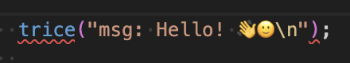
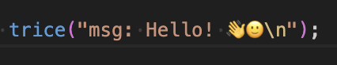
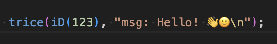

<!--

---

layout: default
title: Trice User Manual

---

-->

# Trice User Manual

<div id="top"></div>

```diff
+ Speed of Light `printf` Comfort Within Interrupts And Everywhere +
-   (TL;DR)   ->  Too Long; Don't Read - use it as reference only❗
```

<!-- 
PDF Generation
* Install vsCode extension "Markdown PDF" 
* Use Shift-Command-P "markdown PDF:export" to generata a PDF
* page break for PDF generation: <div style="page-break-before: always;"></div> 
-->

<p align="right">(<a href="#bottom">go to bottom</a>)</p>

---
<h2>Table of Contents</h2><!-- TABLE OF CONTENTS START -->

<details markdown="1"> <!-- parse this block as markdown -->
<summary>(click to expand)</summary>

<!-- vscode-markdown-toc -->
* [1. Abstract](#abstract)
* [2. A brief history of Trice](#a-brief-history-of-trice)
* [3. How it works - the main idea](#how-it-works---the-main-idea)
* [4. Trice Features (Overview)](#trice-features-(overview))
  * [4.1. Open source](#open-source)
  * [4.2. Easy-to-use](#easy-to-use)
  * [4.3. Small size - using Trice frees FLASH memory](#small-size---using-trice-frees-flash-memory)
  * [4.4. Execution speed](#execution-speed)
  * [4.5. Robustness](#robustness)
  * [4.6. Minimal Transfer Bytes Amount](#minimal-transfer-bytes-amount)
  * [4.7. More comfort than printf-like functions but small differences](#more-comfort-than-printf-like-functions-but-small-differences)
  * [4.8. Tags, Color and Log Levels](#tags,-color-and-log-levels)
  * [4.9. Compile Time Enable/Disable Trice Macros on File or Project Level](#compile-time-enable/disable-trice-macros-on-file-or-project-level)
  * [4.10. Target and host timestamps](#target-and-host-timestamps)
  * [4.11. Target source code location](#target-source-code-location)
  * [4.12. Several target devices in one log output](#several-target-devices-in-one-log-output)
  * [4.13. Any byte capable 1-wire connection usable](#any-byte-capable-1-wire-connection-usable)
  * [4.14. Scalability](#scalability)
  * [4.15. Portability and Modularity](#portability-and-modularity)
  * [4.16. Optional Trice messages encryption](#optional-trice-messages-encryption)
  * [4.17. Trice Protection](#trice-protection)
  * [4.18. Trice Diagnostics](#trice-diagnostics)
  * [4.19. Trice Cache](#trice-cache)
  * [4.20. Avoiding False-Positive Editor Warnings](#avoiding-false-positive-editor-warnings)
  * [4.21. Trice Generator](#trice-generator)
  * [4.22. Versions and Variants Trice Stability](#versions-and-variants-trice-stability)
  * [4.23. Legacy Project Code Integration](#legacy-project-code-integration)
* [5. Start with Trice](#start-with-trice)
  * [5.1. Get it](#get-it)
  * [5.2. Install It](#install-it)
  * [5.3. Try it](#try-it)
  * [5.4. Use It](#use-it)
  * [5.5. Fork It (get a contributor)](#fork-it-(get-a-contributor))
    * [5.5.1. ✅ What “forking” means](#✅-what-“forking”-means)
    * [5.5.2. 🧭 How to Fork (GitHub)](#🧭-how-to-fork-(github))
  * [5.6. Clone It](#clone-it)
  * [5.7. Build It](#build-it)
  * [5.8. Modify It](#modify-it)
  * [5.9. Port it](#port-it)
    * [5.9.1. Target Macros](#target-macros)
    * [5.9.2. Target Trice Stamps](#target-trice-stamps)
    * [5.9.3. Trice Checks](#trice-checks)
    * [5.9.4. Communication Ports](#communication-ports)
    * [5.9.5. Target Code Overview](#target-code-overview)
    * [5.9.6. User Code Adaption](#user-code-adaption)
    * [5.9.7. Limitations](#limitations)
    * [5.9.8. Trice (Time) Stamps](#trice-(time)-stamps)
    * [5.9.9. Trice Parameter Bit Widths](#trice-parameter-bit-widths)
  * [5.10. Avoid it](#avoid-it)
    * [5.10.1. Parser Limitation](#parser-limitation)
    * [5.10.2. Trice macros in header files](#trice-macros-in-header-files)
    * [5.10.3. Trice macros inside other macros](#trice-macros-inside-other-macros)
    * [5.10.4. Upper case only TRICE macros should be written with id(0), Id(0) or ID(0)](#upper-case-only-trice-macros-should-be-written-with-id(0),-id(0)-or-id(0))
* [6. Trice Trouble Shooting Hints](#trice-trouble-shooting-hints)
  * [6.1. Initial Data Transfer Setup Hints](#initial-data-transfer-setup-hints)
  * [6.2. Short Trouble Shooting Hints](#short-trouble-shooting-hints)
* [7. Trice Cache for Compilation Speed](#trice-cache-for-compilation-speed)
  * [7.1. Trice Cache Idea](#trice-cache-idea)
  * [7.2. Trice Cache Logic](#trice-cache-logic)
  * [7.3. Trice Cache Remarks](#trice-cache-remarks)
  * [7.4. Trice Cache Tests](#trice-cache-tests)
  * [7.5. Possible Trice Cache Editor-Issues And How To Get Around](#possible-trice-cache-editor-issues-and-how-to-get-around)
  * [7.6. Activating the Trice Cache](#activating-the-trice-cache)
* [8. Embedded system code configuration](#embedded-system-code-configuration)
* [9. Trice tool in logging action](#trice-tool-in-logging-action)
* [10. Encryption](#encryption)
* [11. Trice Command Line Interface & Examples](#trice-command-line-interface-&-examples)
  * [11.1. Common information](#common-information)
  * [11.2. Further examples](#further-examples)
    * [11.2.1. Automated pre-build insert command example](#automated-pre-build-insert-command-example)
    * [11.2.2. Some Log examples](#some-log-examples)
    * [11.2.3. Logging over a display server](#logging-over-a-display-server)
    * [11.2.4. Binary Logfile](#binary-logfile)
    * [11.2.5. TCP4 output](#tcp4-output)
    * [11.2.6. TCP4 input](#tcp4-input)
    * [11.2.7. UDP4 input](#udp4-input)
    * [11.2.8. Stimulate target with a user command over UART](#stimulate-target-with-a-user-command-over-uart)
    * [11.2.9. Explpore and modify tags and their colors](#explpore-and-modify-tags-and-their-colors)
    * [11.2.10. Location Information](#location-information)
* [12. Limitations](#limitations-1)
  * [12.1. Permanent Limitations](#permanent-limitations)
    * [12.1.1. Limitation TRICE in TRICE not possible](#limitation-trice-in-trice-not-possible)
  * [12.2. Current Limitations](#current-limitations)
    * [12.2.1. String Concatenation Within TRICE Macros Not Possible](#string-concatenation-within-trice-macros-not-possible)
    * [12.2.2. Limited Trice Parser Capabilities](#limited-trice-parser-capabilities)
    * [12.2.3. Special Care Demands](#special-care-demands)
* [13. Additional hints](#additional-hints)
  * [13.1. Pre-built executables are available](#pre-built-executables-are-available)
  * [13.2. Configuration file triceConfig.h](#configuration-file-triceconfig.h)
  * [13.3. Setting up the very first connection](#setting-up-the-very-first-connection)
  * [13.4. Avoid buffer overruns](#avoid-buffer-overruns)
  * [13.5. Buffer Macros](#buffer-macros)
  * [13.6. Logfile viewing](#logfile-viewing)
  * [13.7. Using the Trice tool with 3rd party tools](#using-the-trice-tool-with-3rd-party-tools)
  * [13.8. Several targets at the same time](#several-targets-at-the-same-time)
  * [13.9. TRICE_STACK_BUFFER could cause stack overflow with -o0 optimization](#trice_stack_buffer-could-cause-stack-overflow-with--o0-optimization)
  * [13.10. Cycle Counter](#cycle-counter)
* [14. Switching Trice ON and OFF](#switching-trice-on-and-off)
  * [14.1. Target side compile-time  Trice On-Off](#target-side-compile-time-trice-on-off)
  * [14.2. Host side Trice On-Off](#host-side-trice-on-off)
* [15. Framing](#framing)
* [16. Optional XTEA Encryption](#optional-xtea-encryption)
* [17. Endianness](#endianness)
* [18. Trice (Time)Stamps](#trice-(time)stamps)
  * [18.1. Target (Time)Stamps Formatting](#target-(time)stamps-formatting)
* [19. Binary Encoding](#binary-encoding)
  * [19.1. Symbols](#symbols)
  * [19.2. Package Format](#package-format)
    * [19.2.1. typeX0 Trices](#typex0-trices)
    * [19.2.2. Framing - NONE or with COBS or TCOBS encoding](#framing---none-or-with-cobs-or-tcobs-encoding)
* [20. Trice Decoding](#trice-decoding)
  * [20.1. Trice ID list til.json](#trice-id-list-til.json)
  * [20.2. Trice location information file li.json](#trice-location-information-file-li.json)
* [21. Trice ID Numbers](#trice-id-numbers)
  * [21.1. ID number selection](#id-number-selection)
    * [21.1.1. Trice tool internal Method to get fast a random ID](#trice-tool-internal-method-to-get-fast-a-random-id)
  * [21.2. ID number usage and stability](#id-number-usage-and-stability)
  * [21.3. Trice ID 0](#trice-id-0)
* [22. Trice ID management](#trice-id-management)
  * [22.1. Trice inside source code](#trice-inside-source-code)
    * [22.1.1. Trice in source code comments](#trice-in-source-code-comments)
    * [22.1.2. Different IDs for same Trices](#different-ids-for-same-trices)
    * [22.1.3. Same IDs for different Trices](#same-ids-for-different-trices)
    * [22.1.4. ID Routing](#id-routing)
    * [22.1.5. Possibility to create new tags without modifying trice tool source](#possibility-to-create-new-tags-without-modifying-trice-tool-source)
* [23. Trice version 1.0 Log-level Control](#trice-version-1.0-log-level-control)
  * [23.1. Trice version 1.0 Compile-time Log-level Control](#trice-version-1.0-compile-time-log-level-control)
  * [23.2. Trice version 1.0 Run-time Log-level Control](#trice-version-1.0-run-time-log-level-control)
  * [23.3. Trice Version 1.0 Compile-time - Run-time Log-level Control](#trice-version-1.0-compile-time---run-time-log-level-control)
* [24. ID reference list til.json](#id-reference-list-til.json)
  * [24.1. til.json Version control](#til.json-version-control)
  * [24.2. Long Time Availability](#long-time-availability)
* [25. The Trice Insert Algorithm](#the-trice-insert-algorithm)
  * [25.1. Starting Conditions](#starting-conditions)
  * [25.2. Aims](#aims)
  * [25.3. Method](#method)
    * [25.3.1. Trice Insert Initialization](#trice-insert-initialization)
  * [25.4. User Code Patching (trice insert)](#user-code-patching-(trice-insert))
  * [25.5. User Code Patching Examples](#user-code-patching-examples)
  * [25.6. Exclude folders & files from being parsed (pull request 529)](#exclude-folders-&-files-from-being-parsed-(pull-request-529))
  * [25.7. ID Usage Options](#id-usage-options)
  * [25.8. General ID Management Information](#general-id-management-information)
    * [25.8.1. Option Cleaning in a Post-build process](#option-cleaning-in-a-post-build-process)
    * [25.8.2. Option Let the inserted Trice ID be a Part of the User Code](#option-let-the-inserted-trice-id-be-a-part-of-the-user-code)
    * [25.8.3. Option Cleaning on Repository Check-In](#option-cleaning-on-repository-check-in)
* [26. Trice Speed](#trice-speed)
  * [26.1. Target Implementation Options](#target-implementation-options)
    * [26.1.1. Trice Use Cases TRICE_STATIC_BUFFER and TRICE_STACK_BUFFER - direct mode only](#trice-use-cases-trice_static_buffer-and-trice_stack_buffer---direct-mode-only)
    * [26.1.2. Trice Use Case TRICE_DOUBLE_BUFFER - deferred mode, fastest Trice execution, more RAM needed](#trice-use-case-trice_double_buffer---deferred-mode,-fastest-trice-execution,-more-ram-needed)
    * [26.1.3. Trice Use Case TRICE_RING_BUFFER - deferred mode, balanced Trice execution time and needed RAM](#trice-use-case-trice_ring_buffer---deferred-mode,-balanced-trice-execution-time-and-needed-ram)
  * [26.2. A configuration for maximum Trice execution speed with the L432_inst example](#a-configuration-for-maximum-trice-execution-speed-with-the-l432_inst-example)
  * [26.3. A configuration for normal Trice execution speed with the G0B1_inst example](#a-configuration-for-normal-trice-execution-speed-with-the-g0b1_inst-example)
* [27. Trice memory needs](#trice-memory-needs)
  * [27.1. F030_bare Size](#f030_bare-size)
  * [27.2. F030_inst Size with TRICE_OFF=1](#f030_inst-size-with-trice_off=1)
  * [27.3. F030_inst with ring buffer](#f030_inst-with-ring-buffer)
  * [27.4. F030_inst with ring buffer](#f030_inst-with-ring-buffer-1)
  * [27.5. A developer setting, only enabling SEGGER_RTT](#a-developer-setting,-only-enabling-segger_rtt)
  * [27.6. A developer setting, only enabling SEGGER_RTT and without deferred output gives after running `./build.sh TRICE_DIAGNOSTICS=0 TRICE_PROTECT=0`:](#a-developer-setting,-only-enabling-segger_rtt-and-without-deferred-output-gives-after-running-`./build.sh-trice_diagnostics=0-trice_protect=0`:)
  * [27.7. Settings Conclusion](#settings-conclusion)
  * [27.8. Legacy Trice Space Example (Old Version)](#legacy-trice-space-example-(old-version))
  * [27.9. Memory Needs for Old Example 1](#memory-needs-for-old-example-1)
  * [27.10. Memory Needs for Old Example 2](#memory-needs-for-old-example-2)
* [28. Trice Project Image Size Optimization](#trice-project-image-size-optimization)
  * [28.1. Code Optimization -o3 or -oz (if supported)](#code-optimization--o3-or--oz-(if-supported))
  * [28.2. Compiler Independent Setting (a bit outdated)](#compiler-independent-setting-(a-bit-outdated))
  * [28.3. Linker Option --split-sections (if supported)](#linker-option---split-sections-(if-supported))
  * [28.4. Linker Optimization -flto (if supported)](#linker-optimization--flto-(if-supported))
    * [28.4.1. ARMCC Compiler v5 Linker Feedback](#armcc-compiler-v5-linker-feedback)
    * [28.4.2. ARMCLANG Compiler v6 Link-Time Optimization](#armclang-compiler-v6-link-time-optimization)
    * [28.4.3. GCC](#gcc)
    * [28.4.4. LLVM ARM Clang](#llvm-arm-clang)
    * [28.4.5. Other IDE´s and compilers](#other-ide´s-and-compilers)
  * [28.5. Legacy STM32F030 Example Project - Different Build Sizes](#legacy-stm32f030-example-project---different-build-sizes)
    * [28.5.1. ARMCC compiler v5](#armcc-compiler-v5)
* [29. Trice Tags and Color](#trice-tags-and-color)
  * [29.1. How to get](#how-to-get)
    * [29.1.1. Output options](#output-options)
    * [29.1.2. Check Alternatives](#check-alternatives)
  * [29.2. Color issues under Windows](#color-issues-under-windows)
* [30. Trice without UART](#trice-without-uart)
* [31. Trice over RTT](#trice-over-rtt)
  * [31.1. For the impatient (2 possibilities)](#for-the-impatient-(2-possibilities))
    * [31.1.1. Start JLink commander and connect over TCP](#start-jlink-commander-and-connect-over-tcp)
    * [31.1.2. Start using JLinkRTTLogger](#start-using-jlinkrttlogger)
    * [31.1.3. JLinkRTTLogger Issue](#jlinkrttlogger-issue)
  * [31.2. Segger Real Time Transfer (RTT)](#segger-real-time-transfer-(rtt))
  * [31.3. J-Link option](#j-link-option)
    * [31.3.1. Convert Evaluation Board onboard ST-Link to J-Link](#convert-evaluation-board-onboard-st-link-to-j-link)
    * [31.3.2. Some SEGGER tools in short](#some-segger-tools-in-short)
    * [31.3.3. JLinkRTTClient.exe](#jlinkrttclient.exe)
    * [31.3.4. JLinkRTTViewer.exe](#jlinkrttviewer.exe)
  * [31.4. Segger RTT](#segger-rtt)
  * [31.5. Segger J-Link SDK (~800 EUR) Option](#segger-j-link-sdk-(~800-eur)-option)
  * [31.6. Additional Notes (leftovers)](#additional-notes-(leftovers))
  * [31.7. Further development](#further-development)
  * [31.8. NUCLEO-F030R8 example](#nucleo-f030r8-example)
    * [31.8.1. RTT with original on-board ST-LINK firmware](#rtt-with-original-on-board-st-link-firmware)
    * [31.8.2. Change to J-LINK onboard firmware](#change-to-j-link-onboard-firmware)
    * [31.8.3. RTT with J-LINK firmware on-board](#rtt-with-j-link-firmware-on-board)
  * [31.9. Possible issues](#possible-issues)
  * [31.10. OpenOCD with Darwin (MacOS)](#openocd-with-darwin-(macos))
  * [31.11. SEGGER J-Link on Darwin (MacOS)](#segger-j-link-on-darwin-(macos))
  * [31.12. Links](#links)
* [32. Writing the Trice logs into an SD-card (or a user specific output)](#writing-the-trice-logs-into-an-sd-card-(or-a-user-specific-output))
* [33. Trice Target Code Implementation](#trice-target-code-implementation)
  * [33.1. TRICE Macro structure](#trice-macro-structure)
    * [33.1.1. TRICE_ENTER](#trice_enter)
    * [33.1.2. TRICE_PUT](#trice_put)
    * [33.1.3. TRICE_LEAVE](#trice_leave)
  * [33.2. TRICE_STACK_BUFFER](#trice_stack_buffer)
  * [33.3. TRICE_STATIC_BUFFER](#trice_static_buffer)
  * [33.4. TRICE_DOUBLE_BUFFER](#trice_double_buffer)
  * [33.5. TRICE_RING_BUFFER](#trice_ring_buffer)
  * [33.6. Deferred Out](#deferred-out)
    * [33.6.1. Double Buffer](#double-buffer)
    * [33.6.2. Ring Buffer](#ring-buffer)
  * [33.7. Direct Transfer](#direct-transfer)
  * [33.8. Possible Target Code Improvements](#possible-target-code-improvements)
* [34. Trice Similarities and Differences to printf Usage](#trice-similarities-and-differences-to-printf-usage)
  * [34.1. Printf-like functions](#printf-like-functions)
  * [34.2. Trice IDs](#trice-ids)
  * [34.3. Trice values bit width](#trice-values-bit-width)
  * [34.4. Many value parameters](#many-value-parameters)
  * [34.5. Floating Point Values](#floating-point-values)
  * [34.6. Runtime Generated 0-terminated Strings Transfer with triceS](#runtime-generated-0-terminated-strings-transfer-with-trices)
  * [34.7. Runtime Generated counted Strings Transfer with  triceN](#runtime-generated-counted-strings-transfer-with-tricen)
  * [34.8. Runtime Generated Buffer Transfer with triceB](#runtime-generated-buffer-transfer-with-triceb)
  * [34.9. Remote function call syntax support with triceF](#remote-function-call-syntax-support-with-tricef)
  * [34.10. Extended format specifier possibilities](#extended-format-specifier-possibilities)
    * [34.10.1. Trice format specifier](#trice-format-specifier)
    * [34.10.2. Overview Table](#overview-table)
  * [34.11. UTF-8 Support](#utf-8-support)
  * [34.12. Switch the language without changing a bit inside the target code](#switch-the-language-without-changing-a-bit-inside-the-target-code)
  * [34.13. Format tags prototype specifier examples](#format-tags-prototype-specifier-examples)
* [35. Development Environment Setup](#development-environment-setup)
  * [35.1. Common Information](#common-information-1)
  * [35.2. Important to know](#important-to-know)
  * [35.3. Animation](#animation)
  * [35.4. Setup Linux PC - Example with Debian12 - KDE Desktop](#setup-linux-pc---example-with-debian12---kde-desktop)
    * [35.4.1. Basic setup](#basic-setup)
    * [35.4.2. Github](#github)
    * [35.4.3. vsCode](#vscode)
    * [35.4.4. Go](#go)
    * [35.4.5. Gitkraken (or other GUI for git)](#gitkraken-(or-other-gui-for-git))
    * [35.4.6. arm-none-eabi toolchain (or other target system compiler)](#arm-none-eabi-toolchain-(or-other-target-system-compiler))
    * [35.4.7. J-Link (if needed)](#j-link-(if-needed))
    * [35.4.8. Beyond Compare (if no other diff tool)](#beyond-compare-(if-no-other-diff-tool))
  * [35.5. Setup Windows PC Example](#setup-windows-pc-example)
    * [35.5.1. Setup Trice](#setup-trice)
    * [35.5.2. Setup ARM Environment Example](#setup-arm-environment-example)
    * [35.5.3. Setup STM32](#setup-stm32)
    * [35.5.4. Setup Onboard J-Link on NUCLEO (other ST evaluation boards too)](#setup-onboard-j-link-on-nucleo-(other-st-evaluation-boards-too))
    * [35.5.5. Setup VS-Code](#setup-vs-code)
  * [35.6. Makefile with Clang too](#makefile-with-clang-too)
  * [35.7. Download Locations](#download-locations)
    * [35.7.1. Clang](#clang)
    * [35.7.2. GCC](#gcc-1)
  * [35.8. Install Locations](#install-locations)
  * [35.9. Environment Variables](#environment-variables)
  * [35.10. Build command](#build-command)
  * [35.11. Run & Debug](#run-&-debug)
  * [35.12. Logging](#logging)
  * [35.13. Setting up a new project](#setting-up-a-new-project)
* [36. Example Projects without and with Trice Instrumentation](#example-projects-without-and-with-trice-instrumentation)
  * [36.1. Nucleo-F030R8 Examples](#nucleo-f030r8-examples)
    * [36.1.1. F030_bare](#f030_bare)
    * [36.1.2. F030_inst](#f030_inst)
  * [36.2. Nucleo-G0B1 Examples](#nucleo-g0b1-examples)
    * [36.2.1. G0B1_bare](#g0b1_bare)
    * [36.2.2. G0B1_inst](#g0b1_inst)
  * [36.3. Nucleo-L432KC Examples](#nucleo-l432kc-examples)
    * [36.3.1. L432_bare](#l432_bare)
    * [36.3.2. L432_inst](#l432_inst)
* [37. Trice Generate](#trice-generate)
  * [37.1. Colors](#colors)
  * [37.2. C-Code](#c-code)
  * [37.3. C#-Code](#c#-code)
  * [37.4. Generating a RPC Function Pointer List](#generating-a-rpc-function-pointer-list)
* [38. Testing the Trice Library C-Code for the Target](#testing-the-trice-library-c-code-for-the-target)
  * [38.1. General info](#general-info)
  * [38.2. How to run the tests](#how-to-run-the-tests)
  * [38.3. Tests Details](#tests-details)
  * [38.4. How to add new test cases](#how-to-add-new-test-cases)
  * [38.5. Test Internals](#test-internals)
  * [38.6. Test Results](#test-results)
  * [38.7. Special tests](#special-tests)
  * [38.8. Test Cases](#test-cases)
    * [38.8.1. Folder Naming Convention](#folder-naming-convention)
* [39. Test Issues](#test-issues)
* [40. Add-On Hints](#add-on-hints)
  * [40.1. Trice on LibOpenCM3](#trice-on-libopencm3)
    * [40.1.1. Prerequisites](#prerequisites)
    * [40.1.2. triceConfig.h](#triceconfig.h)
    * [40.1.3. main.c](#main.c)
    * [40.1.4. nucleo-f411re.ld](#nucleo-f411re.ld)
    * [40.1.5. Makefile](#makefile)
    * [40.1.6. Usage](#usage)
  * [40.2. Get all project files containing Trice messages](#get-all-project-files-containing-trice-messages)
  * [40.3. Building a trice library?](#building-a-trice-library?)
  * [40.4. Possible Compiler Issue when using Trice macros without parameters on old compiler or with strict-C settings](#possible-compiler-issue-when-using-trice-macros-without-parameters-on-old-compiler-or-with-strict-c-settings)
* [41. Trice And Legacy User Code](#trice-and-legacy-user-code)
  * [41.1. Legacy User Code Option Separate Physical Output Channel](#legacy-user-code-option-separate-physical-output-channel)
  * [41.2. Legacy User Code Option Trice Adaption Edits](#legacy-user-code-option-trice-adaption-edits)
  * [41.3. Legacy User Code Option Print Buffer Wrapping and Framing](#legacy-user-code-option-print-buffer-wrapping-and-framing)
  * [41.4. Legacy User Code Option Trice Aliases Adaption](#legacy-user-code-option-trice-aliases-adaption)
    * [41.4.1. PR533 Doc](#pr533-doc)
    * [41.4.2. PR533 Summary](#pr533-summary)
    * [41.4.3. PR533 Motivation](#pr533-motivation)
    * [41.4.4. What This PR533 Adds](#what-this-pr533-adds)
    * [41.4.5. PR533 Example](#pr533-example)
    * [41.4.6. PR536 Doc](#pr536-doc)
    * [41.4.7. Alias Example Project](#alias-example-project)
* [42. Future Development](#future-development)
  * [42.1. Trice Log-level Control Specification Draft](#trice-log-level-control-specification-draft)
    * [42.1.1. What log levels exist in general, including exotic ones, and what is their exact weighting relative to each other?](#what-log-levels-exist-in-general,-including-exotic-ones,-and-what-is-their-exact-weighting-relative-to-each-other?)
    * [42.1.2. Compile-time Log-level Control](#compile-time-log-level-control)
    * [42.1.3. Run-time Log-level Control](#run-time-log-level-control)
  * [42.2. Trice Structured Logging](#trice-structured-logging)
    * [42.2.1. Trice Structured Logging Compile-time Information](#trice-structured-logging-compile-time-information)
    * [42.2.2. Trice Structured Logging Runtime Information](#trice-structured-logging-runtime-information)
    * [42.2.3. Trice Structured Logging Limitations and Special Cases](#trice-structured-logging-limitations-and-special-cases)
    * [42.2.4. A Trice Structured Logging Example](#a-trice-structured-logging-example)
    * [42.2.5. Trice Structured Logging CLI Switches and Variables](#trice-structured-logging-cli-switches-and-variables)
    * [42.2.6. Trice Structured Logging User Defined Values](#trice-structured-logging-user-defined-values)
    * [42.2.7. Trice Structured Logging CLI Switches Usage Options](#trice-structured-logging-cli-switches-usage-options)
    * [42.2.8. Trice Structured Logging Level Specific Configuration](#trice-structured-logging-level-specific-configuration)
    * [42.2.9. Trice Structured Logging Assert Macros (TODO)](#trice-structured-logging-assert-macros-(todo))
  * [42.3. Improving the Trice Tool Internal Parser](#improving-the-trice-tool-internal-parser)
    * [42.3.1. Trice Internal Log Code Short Description](#trice-internal-log-code-short-description)
  * [42.4. Using Trice on Servers](#using-trice-on-servers)
* [43. Working with the Trice Git Repository](#working-with-the-trice-git-repository)
  * [43.1. Install `opencommit` on MacOS](#install-`opencommit`-on-macos)
  * [43.2. Install `opencommit` on Windows](#install-`opencommit`-on-windows)
* [44. Trice Maintenance](#trice-maintenance)
  * [44.1. Trice Project structure (Files and Folders)](#trice-project-structure-(files-and-folders))
  * [44.2. 📁 The .github Folder — Purpose and Contents](#📁-the-.github-folder-—-purpose-and-contents)
    * [44.2.1. 📁 `.github` Root](#📁-`.github`-root)
    * [44.2.2. 📂 `.github/workflows` — GitHub Actions Workflows](#📂-`.github/workflows`-—-github-actions-workflows)
    * [44.2.3. GitHub Action clang-format.yml - Check C Code Formatting](#github-action-clang-format.yml---check-c-code-formatting)
    * [44.2.4. GitHub Action codeql.yml - Static Code Analysis](#github-action-codeql.yml---static-code-analysis)
    * [44.2.5. GitHub Action coverage.yml - Test Coverage and Coveralls Integration](#github-action-coverage.yml---test-coverage-and-coveralls-integration)
    * [44.2.6. GitHub Action go.yml - Building and Testing Go Code](#github-action-go.yml---building-and-testing-go-code)
    * [44.2.7. GitHub Action goreleaser.yml - Build & Pack Trice Distribution](#github-action-goreleaser.yml---build-&-pack-trice-distribution)
    * [44.2.8. GitHub Action greetings.yml - Greeting Message](#github-action-greetings.yml---greeting-message)
    * [44.2.9. GitHub Action label.yml - Automatic Labeling Rules](#github-action-label.yml---automatic-labeling-rules)
    * [44.2.10. GitHub Action learn-github-actions.yml - Instructional Workflow](#github-action-learn-github-actions.yml---instructional-workflow)
    * [44.2.11. GitHub Action link-check.yml - Broken Links Check](#github-action-link-check.yml---broken-links-check)
    * [44.2.12. GitHub Action manual.ym - To Be Triggered Manually](#github-action-manual.ym---to-be-triggered-manually)
    * [44.2.13. GitHub Action shellcheck.yml - Catching Common Bash Scripts Bugs](#github-action-shellcheck.yml---catching-common-bash-scripts-bugs)
    * [44.2.14. GitHub Action shfmt.yml - Ensure Consistent Shell Scripts Formatting](#github-action-shfmt.yml---ensure-consistent-shell-scripts-formatting)
    * [44.2.15. GitHub Action stale.yml - Automatic Stale Issue Handling](#github-action-stale.yml---automatic-stale-issue-handling)
    * [44.2.16. GitHub Action superlinter.yml - Ensure Consistent YAML and Markdown Formatting](#github-action-superlinter.yml---ensure-consistent-yaml-and-markdown-formatting)
    * [44.2.17. Github Action pages.yml - Creates The Trice Github Pages](#github-action-pages.yml---creates-the-trice-github-pages)
    * [44.2.18. Github Action test_goreleaser.yml - Checks If Goreleaser Would Succeed](#github-action-test_goreleaser.yml---checks-if-goreleaser-would-succeed)
  * [44.3. Trice User Manual Maintenance (or any `*.md` file)](#trice-user-manual-maintenance-(or-any-`*.md`-file))
  * [44.4. Cleaning the Sources](#cleaning-the-sources)
* [45. Build and Release the Trice Tool](#build-and-release-the-trice-tool)
  * [45.1. Build Trice tool from Go sources](#build-trice-tool-from-go-sources)
  * [45.2. Prepare A Release](#prepare-a-release)
    * [45.2.1. Check a Goreleaser Release before Publishing](#check-a-goreleaser-release-before-publishing)
  * [45.3. Trigger a **real** Trice release via CI (with `git tag`)](#trigger-a-**real**-trice-release-via-ci-(with-`git-tag`))
    * [45.3.1. Make sure your workflow reacts to tags](#make-sure-your-workflow-reacts-to-tags)
    * [45.3.2. Final checks before tagging](#final-checks-before-tagging)
    * [45.3.3. Choose a version and create a `git tag`](#choose-a-version-and-create-a-`git-tag`)
    * [45.3.4. Push the tag to GitHub (this triggers CI)](#push-the-tag-to-github-(this-triggers-ci))
    * [45.3.5. Watch the CI release run on GitHub](#watch-the-ci-release-run-on-github)
    * [45.3.6. Check the GitHub Release](#check-the-github-release)
* [46. Scratch Pad](#scratch-pad)

<!-- vscode-markdown-toc-config
	numbering=true
	autoSave=true
	/vscode-markdown-toc-config -->
<!-- /vscode-markdown-toc -->

<p align="right">(<a href="#top">back to top</a>)</p>

</details><!-- TABLE OF CONTENTS END -->

---


---

##  1. <a id='abstract'></a>Abstract

If you develop software for an embedded system, you need some kind of system feedback. Debuggers are awesome tools, but when it comes to analyze dynamic behavior in the field, they are not usable.

Logging then, usually done with printf-like functions, gets quick a result after having i.e. `putchar()` implemented. This turns out to be an expensive way in terms of processor clocks and needed FLASH memory, when you regard the library code and all the strings needing FLASH memory space. For small micro-controllers that´s it.

Bigger micro-controllers are coming with embedded trace hardware. To use it, an expensive tool is needed. Useful for analyzing complex systems, but for in-field related issues at least unhandy.

Unhappy with this situation, the developer starts thinking of using digital pins or starts emitting some proprietary LED blinking codes or byte sequences, difficult to interpret.

The Trice technique tries to fill this gap, being minimal invasive for the target and as comfortable as possible. It is the result of a long-year dissatisfaction and several attempts to find a loophole to make embedded programming more fun and this way more effective.

Trice is an unusual software tracer-logger, using [internally](#how-it-works---the-main-idea) IDs instead of format strings to get maximum [speed](#execution-speed) but provides the user with a printf-like comfort:

```C
trice("Hello! 👋🙂");

int a = -4;
float x = 3.14159265;
trice("info:π/%d is %f with the bit pattern %032b\n", a, aFloat(x/a), x );

string s = "world";
triceS("msg:A runtime generated string: %s", s);
```

Replacing a `printf` library, the [Trice target source code](https://github.com/rokath/trice/blob/main/src) occupies 1-4 KB Flash [memory](#trice-memory-needs) and less than 1 KB RAM in dependence of the configuration which is done with a user file named `triceConfig.h`:

```C
#define TRICE_DEFERRED_OUTPUT 1
#define TRICE_BUFFER TRICE_DOUBLE_BUFFER
#define TRICE_DEFERRED_UARTA 1
#define TRICE_UARTA USART2
```

The open-source Trice PC tool is executable on all [Go](https://golang.org) platforms, at least:

* [x] Linux
* [x] MacOS
* [x] Windows

In the future other ports are possible:

* C/C++ or Rust program to run on a separate controller board
* [Go-mobile](https://github.com/golang/mobile)
* [tinyGo](https://tinygo.org/)
* [Wasm](https://webassembly.org/)
* [Phython](https://en.wikipedia.org/wiki/Python_(programming_language))


<p align="right">(<a href="#top">back to top</a>)</p>

##  2. <a id='a-brief-history-of-trice'></a>A brief history of Trice

Developing firmware means to deal also with interrupts and often with timing. How do you check, if an interrupt occurred? Ok, increment a counter and display it in a background loop with some printf-like function. What about time measurement? Set a digital output to 1 and 0 and connect a measurement device. Once, developing software for a real-time image processing device, I had no clue where in detail the processing time exploded when the image quality got bad. A spare analog output with a video interrupt synced oscilloscope gave me the needed information, after I changed the analog output on several points in my algorithm. But, hey guys, I want to deal with my programming tasks and do not like all this hassle connecting wires and steer into instruments.

A `printf` is so cool on a PC, developing software there. But an embedded device often cannot use it for performance reasons. My very first attempt was writing the format string `.const` offset together with its values in a FIFO during a log statement and to do the `printf` it in the background. But that is compiler specific. Ok the full string address is better but needs buffer space. [Zephyr](https://docs.zephyrproject.org/latest/reference/logging/index.html) for example does something like that calling it "deferred logging".

Then, one day I had the idea to compute short checksums for the format strings in a pre-compile step and to use them as ID in a list together with the format strings. That was a step forward but needed to write a supporting PC program. I did that in C++ in the assumption to get it better done that way. Finally, it worked, but I hated my PC code, as I dislike C++ now because of all its nuts and bolts to handle, accompanied by missing libraries on the next PC. The tool usability was also unhandy and therefore error prone and the need became clear for a full automatized solution. Also, what is, if 2 different format strings accidentally generate the same short checksum? There was a way around, but an ID based message filtering will never be possible that way.

The need became clear for controllable IDs and management options. And there was [Go](https://golang.org) now, an as-fast-as-**C** language, easy to learn, promising high programming efficiency and portability. It would be interesting to try it out on a real PC project.

Trying to add tags in form of partial Trice macro names was blowing up the header code amount and was a too rigid design. Which are the right tags? One lucky day I came to the conclusion to handle tags just as format string parts like `"debug:Here we are!\n"` and getting rid of them in the target code this way also giving the user [freedom](https://github.com/rokath/trice/blob/main/internal/emitter/lineTransformerANSI.go) to invent any tags.

An other point in the design was the question how to re-sync after data stream interruption, because that happens often during firmware development. Several [encodings](./_Legacy/TriceObsoleteEncodings.md) where tried out and a proprietary escape sequence format and an alternative flexible data format with more ID bits where working reliable but with [COBS](https://en.wikipedia.org/wiki/Consistent_Overhead_Byte_Stuffing) things got satisfying. A side result of that trials is the Trice tool option to add different decoders if needed. Now the default Trice message framing is [TCOBSv1](https://github.com/rokath/tcobs) which includes short message compression and this way allows very low transmit bandwidths and/or saves storage, when binary Trice data are stored in Flash memory.

There was a learning **not** to reduce the transmit byte count to an absolute minimum, but to focus more on Trice macro [speed](#execution-speed) and universality. That led to a double buffer on the target side as an alternative to the ring buffer solution. The actual binary [encoding](#binary-encoding), allowing alongside user protocols, is result of the optional target timestamps and location info some users asked for, keeping the target code as light as possible. Float and double number support was implementable for free because this work is done mainly on the host side.

Trice grew, and as it got usable I decided to make it Open Source to say "Thank You" to the community this way.

Learning that Trice is also a [baby girl name](https://www.babynamespedia.com/meaning/Trice), our daughter Ida designed the little girl with the pen symbolizing the Trice macro for recording and the eyeglasses standing for the PC tool Trice visualizing the logs.


<p align="right">(<a href="#top">back to top</a>)</p>

##  3. <a id='how-it-works---the-main-idea'></a>How it works - the main idea

Trice performs **no** [costly](#trice-similarities-and-differences-to-printf-usage) printf-like functions on the target at all. The Trice macro, instead, just copies an ID together with the optional values to a buffer and is done. In the minimum case this can happen in [6(six!)](#trice-speed) processor clocks even with target timestamps included. When running on a 64 MHz clock, **light can travel about 30 meters in that time**.

To achieve that, a pre-compile step is needed, executing a `trice insert` command on the PC. This is fast enough not to disturb the build process. The Trice tool parses then the source tree for macros like `trice( "msg: %d Kelvin\n", k );` and patches them to `trice( iD(12345), "msg: %d Kelvin\n", k );`, where `12345` is a generated 14-bit identifier (ID) copied into a [**T**rice **I**D **L**ist](https://github.com/rokath/trice/blob/main/demoTIL.json). During compilation than, the Trice macro is translated to the `12345` ID only, and the optional parameter values. The format string is ignored by the compiler.

The target code is [project specific](https://github.com/rokath/trice/blob/main/examples/F030_inst/Core/Inc/triceConfig.h) configurable.  In **direct mode** the the stack or a static buffer is used as Trice buffer and the Trice macro execution includes optionally the quick [COBS](https://en.wikipedia.org/wiki/Consistent_Overhead_Byte_Stuffing) encoding and the data transfer. This more straightforward and slower architecture can be interesting for many cases because it is anyway much faster than printf-like functions calls. Especially when using [Trice over RTT](#trice-over-rtt) a single Trice is executable within ~100 processor clocks. See `TRICE_DIRECT_SEGGER_RTT_32BIT_WRITE` inside [triceDefaultConfig.h](https://github.com/rokath/trice/blob/main/src/triceDefaultConfig.h) and look into the [examples](https://github.com/rokath/trice/blob/main/examples) folder. In **deferred mode** a service swaps the Trice double buffer or reads the Trice ring buffer periodically, the configured encoding, default is TCOBS, takes part and with the filled buffer the background transfer is triggered. Out buffer and Trice buffer share the same memory for efficiency.

During runtime the PC Trice tool receives all what happened in the last ~100ms as a package from the UART port. The `0x30 0x39` is the ID 12345 and a map lookup delivers the format string *"msg: %d Kelvin\n"* and also the bit width information. Now the Trice tool can write target timestamp, set msg color and execute `printf("%d Kelvin\n", 0x0000000e);`

---

  

The Trice tool is a background helper giving the developer focus on its programming task. The once generated ID is not changed anymore without need. If for example the format string gets changed into `"msg: %d Kelvin!\n"`, a new ID is inserted automatically and the reference list gets extended. Obsolete IDs are kept inside the [**T**rice **I**D **L**ist](https://github.com/rokath/trice/blob/main/demoTIL.json) for compatibility with older firmware versions. It could be possible, when merging code, an ID is used twice for different format strings. In that case, the ID inside the reference list wins and the additional source gets patched with a new ID. This maybe unwanted patching is avoidable with proper [Trice ID management](#trice-id-management). The reference list should be kept under source code control.

Moreover, using `trice i -cache && make && trice c -cache` in a build script makes the IDs invisible to the developer reducing the data noise giving more space to focus on the development task. See [build.sh](https://github.com/rokath/trice/blob/main/examples/L432_inst/build.sh) as a working example and the [Trice Cache](#trice-cache) chapter for details.

<p align="right">(<a href="#top">back to top</a>)</p>

##  4. <a id='trice-features-(overview)'></a>Trice Features (Overview)

###  4.1. <a id='open-source'></a>Open source

Target code and PC tool are open source. The MIT license gives full usage freedom. Users are invited to support the further Trice development.

###  4.2. <a id='easy-to-use'></a>Easy-to-use

Making it facile for a user to use Trice was the driving point just to have

* one Trice tool
* one additional [target code](https://github.com/rokath/trice/blob/main/src/) source folder
* a project specific simple to use [triceConfig.h](https://github.com/rokath/trice/blob/main/examples/F030_inst/Core/Inc/triceConfig.h)
* and to get away with the one macro `trice` for most situations.

Trice understands itself as a silent helper in the background to give the developer more focus on its real task. If, for example, `trice log` is running and you re-flash the target, there is ***no need to restart*** the Trice tool. When [til.json](https://github.com/rokath/trice/blob/main/demoTIL.json) was updated in an pre-build step, the Trice tool automatically reloads the new data during logging.

The Trice tool comes with many command line switches (`trice help -all`) for tailoring various needs, but mostly these are not needed. <small>In file [../internal/args/tricehelpall_test.go](https://github.com/rokath/trice/blob/main/internal/args/tricehelpall_test.go) the expected test output contains this information as well.</small>

Normal Trice tool usage is:
* [./build.sh](https://github.com/rokath/trice/blob/main/examples/L432_inst/build.sh) containing `trice insert -cache`, `make` and `trice clean -cache`
* **`make log`** containing `trice l -p COMn` for logging with default baud rate.

In this example, the user code gets **not** polluted with Trice IDs - they exists only during the compilation step and the Trice cache makes this invisible for the user and the build system.

###  4.3. <a id='small-size---using-trice-frees-flash-memory'></a>Small size - using Trice frees FLASH memory

Compared to a printf-library code which occupies [1](https://github.com/mludvig/mini-printf) to over [20](https://github.com/mpaland/printf#a-printf--sprintf-implementation-for-embedded-systems) KB FLASH memory, the Trice code is normally [smaller](#trice-memory-needs) but provides full support.

###  4.4. <a id='execution-speed'></a>Execution speed

Can it get faster than [6 clocks only](#trice-speed)? Only 3 runtime Assembler instructions per Trice needed in the minimum case! Optional target timestamp, critical sections, cycle counter, diagnostics and overflow protection can consume a few more processor clocks, if enabled, but a Trice is still incomparable fast.

###  4.5. <a id='robustness'></a>Robustness

When a Trice data stream is interrupted, the optional [COBS](https://en.wikipedia.org/wiki/Consistent_Overhead_Byte_Stuffing) or [TCOBS](https://github.com/rokath/tcobs) encoding allows an immediate re-sync with the next COBS/TCOBS package delimiter byte and a default Trice **cycle counter** gives a high chance to detect lost Trice messages. <small>See also [Versions and Variants Trice Stability](#versions-and-variants-trice-stability).</small>

###  4.6. <a id='minimal-transfer-bytes-amount'></a>Minimal Transfer Bytes Amount

A Trice message is 4 bytes long (2 ID bytes and 2 count bytes) plus optional time stamps and/or values. In conjunction with the compressing [TCOBS](https://github.com/rokath/tcobs) framing the Trice data stream is as small as possible. Use the `-debug` switch to see the compressed and framed packages alongside the decompressed ones together with the decoded messages.

To see the encoding for each single message `#define TRICE_DEFERRED_TRANSFER_MODE TRICE_SINGLE_PACK_MODE` inside the project specific _triceConfig.h_.

Without `-debug` CLI switch:

```bash
ms@MacBook-Pro G0B1_inst % trice log -p /dev/tty.usbmodem0007722641261 -prefix off -li off -hs off -ts off
...
This is a message without values and without stamp.
...
```

With `-debug` CLI switch:

```bash
ms@MacBook-Pro G0B1_inst % trice log -p /dev/tty.usbmodem0007722641261 -prefix off -li off -hs off -ts off -debug
...
TCOBSv1: c1 74 e2 23 00 
->TRICE: c1 74 e2 00 
This is a message without values and without stamp.
...
```

The TCOBS encoding cannot compress in the example above, because the data are too small, but here is a significant compression result shown:

```bash
ms@MacBook-Pro G0B1_inst % trice log -p /dev/tty.usbmodem0007722641261 -prefix off -hs off -debug
...
TCOBSv1: b8 76 7b 18 84 fe e1 fd e1 fc e1 fb e1 fa e1 00 
->TRICE: b8 76 7b 18 ff ff ff ff fe ff ff ff fd ff ff ff fc ff ff ff fb ff ff ff fa ff ff ff 
_test/testdata/triceCheck.c   805              value=-1, -2, -3, -4, -5, -6
...
```

* The `TRICE_SINGLE_PACK_MODE` inserts after each Trice a package delimiter `0`. 
* The `TRICE_MULTI_PACK_MODE` inserts after a group of Trice messages a package delimiter `0`, what minimizes the transmit data amount.

When encryption is active, a compression makes no sense, but the `TRICE_MULTI_PACK_MODE` can help to reduce the total amount of padding bytes, because each encrypted package must have a multiple of 8 as length.

```bash
ms@MacBook-Pro G0B1_inst % trice log -p /dev/tty.usbmodem0007722641261 -prefix off -hs off -pw MySecret -pf cobs -debug    
...
cobs: 21 84 b7 60 8b 21 89 1e e3 07 6d dc d9 2d 6f 59 04 8e 50 8f 24 1c a2 63 2e 3d 4a 57 ef 39 63 01 cb 00 
->TRICE: 84 b7 60 8b 21 89 1e e3 07 6d dc d9 2d 6f 59 04 8e 50 8f 24 1c a2 63 2e 3d 4a 57 ef 39 63 01 cb 
-> DEC:  cc b6 63 01 71 02 ff fe cd 76 72 03 ff fe fd ce f6 64 81 00 00 73 04 ff fe fd fc 00 00 00 00 00 
_test/testdata/triceCheck.c   827        0_355 value=-1, -2
_test/testdata/triceCheck.c   828              value=-1, -2, -3
_test/testdata/triceCheck.c   829    0,033_124 value=-1, -2, -3, -4
cobs: 19 50 70 79 d7 75 6f d7 99 dc d8 ec 06 e1 66 e7 a7 c1 0d 96 85 df 19 25 55 00 
->TRICE: 50 70 79 d7 75 6f d7 99 dc d8 ec 06 e1 66 e7 a7 c1 0d 96 85 df 19 25 55 
-> DEC:  cf b6 64 01 74 05 ff fe fd fc fb d0 76 75 06 ff fe fd fc fb fa 00 00 00 
_test/testdata/triceCheck.c   830        0_356 value=-1, -2, -3, -4, -5
_test/testdata/triceCheck.c   831              value=-1, -2, -3, -4, -5, -6
...
```

###  4.7. <a id='more-comfort-than-printf-like-functions-but-small-differences'></a>More comfort than printf-like functions but small differences

Trice is usable also inside interrupts and [extended format specifier possibilities](#extended-format-specifier-possibilities) give options like binary or bool output. Transmitting runtime generated strings could be a need, so a `triceS` macro exists supporting the `%s` format specifier for strings up to 32737 bytes long. It is possible to log float/double numbers using `%f` and its relatives, but the numbers need to be covered with the fast converter function `aFloat(x)` or `aDouble(y)`. Also UTF-8 encoded strings are implicit supported, if you use UTF-8 for the source code. See chapter [Trice Similarities and differences to printf usage](#trice-similarities-and-differences-to-printf-usage) for more details.


###  4.8. <a id='tags,-color-and-log-levels'></a>Tags, Color and Log Levels

You can label each Trice with a tag specifier to [colorize](#trice-tags-and-color) the output. This is free of any runtime costs because the tags are part of the Trice log format strings, which are not compiled into the target. The Trice tool will strip full lowercase tag descriptors from the format string after setting the appropriate color, making it possible to give each message its color.

Loggers use log levels and offer a setting like "log all above **INFO**" for example. The Trice tags can cover that but can do better: Inside package _emitter.ColorChannels_ in a single file [./internal/emitter/lineTransformerANSI.go](https://github.com/rokath/trice/blob/main/internal/emitter/lineTransformerANSI.go) all common log levels defined as Trice tags alongside with user tags. The user can adjust this. The Trice tool has the `-pick` and `-ban` switches to control the display in detail. Also a `-logLevel` switch is usable to determine a display threshold as tag position inside ColorChannels.

If an inside-target log selection is needed (routing), the Trice tool can assign each log tag a separate ID range and a target side ID based log selector can control which IDs are transmitted over which output channel. See chapter [Trice ID management](#trice-id-management) or type `trice help -insert` and look for `-IDRange`.


###  4.9. <a id='compile-time-enable/disable-trice-macros-on-file-or-project-level'></a>Compile Time Enable/Disable Trice Macros on File or Project Level

After debugging code in a file, there is [no need to remove or comment out Trice macros](#switching-trice-on-and-off). Write a `#define TRICE_OFF 1` just before the `#include "trice.h"` line and all Trice macros in this file are ignored completely by the compiler, but not by the Trice tool. In case of re-constructing the [**T**rice **ID** **L**ist](https://github.com/rokath/trice/blob/main/demoTIL.json), these no code generating macros are regarded.

```C
#define TRICE_OFF 1 // Disable trice code generation for this file object.
#include "trice.h"
```

When you wish to build a firmware without any Trice code, it is sufficient to add

```make
C_DEFS += -DTRICE_OFF=1 // Define TRICE_OFF=1 for the whole project.
```

or similar to your Makefile.

###  4.10. <a id='target-and-host-timestamps'></a>Target and host timestamps

For each Trice you can have (time) stamps or not:

* `trice( "...", ...);` or `TRICE( id(0), ( "...", ...)`: no stamp:
* `Trice( "...", ...);` or `TRICE( Id(0), ( "...", ...)`: 16-bit stamp:
* `TRice( "...", ...);` or `TRICE( ID(0), ( "...", ...)`: 32-bit stamp:

The optional 16- or 32-bit value carry than the system clock, a millisecond second or an other event counter configured in the project specific [triceConfig.h](https://github.com/rokath/trice/blob/main/examples/G0B1_inst/Core/Inc/triceConfig.h). The Trice tool will automatically recognize and display the stamps in a mode you can control. If several Trice macros form a single line, the Trice tool only displays the target timestamp of the first Trice macro.

Embedded devices often lack a real-time clock and some scenarios can last for weeks. Therefore the Trice tool precedes each Trice line with a PC timestamp, if not disabled. This is the Trice reception time on the PC, what can be some milliseconds later than the target Trice event.

###  4.11. <a id='target-source-code-location'></a>Target source code location

Some developers like to see the `filename.c` and `line` in front of each log line for quick source location. During `trice i` a file `li.json` is generated containing the location information. If `trice log` finds this file, filename and line number are displayed in front of each log line, otherwise not.

Because software is a matter of change it could happen you get obsolete information this way. Therefore the Trice tool log option `-showID` exists to display the Trice ID in front of each log line what gives a more reliable way for event localization in some cases. Also you can get it for free, because no target code is needed for that.

###  4.12. <a id='several-target-devices-in-one-log-output'></a>Several target devices in one log output

Several Trice tool instances can run parallel on one or different PCs. Each Trice tool instance receives *Trices* from one embedded device. Instead of displaying the log lines, the Trice tool instances can transmit them over TCP/IP (`trice l -p COMx -ds`) to a Trice tool instance acting as display server (`trice ds`). The display server can fold these log lines in one output. For each embedded device a separate Trice line prefix and suffix is definable. This allows comparable time measurements in distributed systems.

###  4.13. <a id='any-byte-capable-1-wire-connection-usable'></a>Any byte capable 1-wire connection usable

The usual Trice output device is an UART but also [SEGGER-RTT](#trice-over-rtt) is supported over J-Link or ST-Link devices. Many micro controller boards can act as Trice bridge to a serial port from any port ([Trice without UART](#trice-without-uart)).

###  4.14. <a id='scalability'></a>Scalability

The various [Trice ID management](#trice-id-management) options allow the organization also of bigger software systems. 16383 possible different IDs should match also large projects. Just in case: 16-bit for the ID is a not to hard changeable value.

###  4.15. <a id='portability-and-modularity'></a>Portability and Modularity

The Trice tool is written in the open source language [*Go*](https://go.dev/) and is therefore usable on many platforms. That means the automatic code patching and ID handling side with `trice insert`.

All C-compilers should be usable to compile the target Trice code and there is no hardware dependency despite the byte transmission. MCUs with 8-bit to 64-bit, little or big endian are supported.

Any user program able to read a [JSON](https://github.com/rokath/trice/blob/main/demoTIL.json) file, can receive the [documented](#binary-encoding) Trice message format, look-up the ID and perform a printf-like action to translate into log strings. The Trice tool with its `log` switch is a working example.

Using no framing, [COBS](https://en.wikipedia.org/wiki/Consistent_Overhead_Byte_Stuffing) or [TCOBS](https://github.com/rokath/tcobs) packages starting with a [package descriptor](#package-format) allows alongside user protocols. The other way around is also implementable: In a user protocol embedded `Trice` messages.

The Trice tool is expandable with several decoders. So it is possible to implement a minimal Trice encoding, if bandwidth matters heavily and control that with switches.

When less RAM usage is more important the target double buffer is replaceable with a ring buffer. So the user will be able to decide at compile time about that. A ring buffer mode is selectable inside [triceConfig.h](https://github.com/rokath/trice/blob/main/examples/F030_inst/Core/Inc/triceConfig.h) avoiding any buffer by paying a time toll.

The Trice tool supports [many command line switches](https://github.com/rokath/trice/blob/main/internal/args/tricehelpall_test.go).

###  4.16. <a id='optional-trice-messages-encryption'></a>Optional Trice messages encryption

The encryption opportunity makes it possible to test thoroughly a binary with log output and releasing it without the need to change any bit but to make the log output unreadable for a not authorized person. Implemented is the lightweight [XTEA](https://en.wikipedia.org/wiki/XTEA) as option, what will do for many cases. It should be no big deal to add a different algorithm.

###  4.17. <a id='trice-protection'></a>Trice Protection

When using Trice, data are written into buffers. A buffer overflow is impossible with the default configuration `#define TRICE_PROTECT 1` by simply ignoring possible overflow causing Trice statements. Those cases are not detectable by the cycle counter evaluation because non-existing Trice data on the embedded system cannot cause cycle errors. Therefore overflow error counters exists, which the user can watch. In [./examples/exampleData/triceLogDiagData.c](https://github.com/rokath/trice/blob/main/examples/exampleData/triceLogDiagData.c) an option is shown. Of course this buffer overflow protection costs valuable execution time. If you prefer speed over protection, simply write into your project specific _triceConfig.h_ `#define TRICE_PROTECT 0`.

###  4.18. <a id='trice-diagnostics'></a>Trice Diagnostics

A trice statement produces 4 bytes buffer data plus optional values data. When for example `TRice16("Voltage=%u\n"), x);` is called inside the ms system tick interrupt every 5th time, 10 bytes data are generated each 5 milliisecond. This needs a transfer baudrate of at least 20.000 bit/s. A UART running at 115.200 baud can easily handle that.
Anyway after 100 ms, a 200 Bytes buffer is filled and the question arises what is the optimal Trice buffer size. A caclulation is error prone, so measuring is better. So configure the buffer sizes bigger than estimated and watch the max depth of their usage. In [./examples/exampleData/triceLogDiagData.c](https://github.com/rokath/trice/blob/main/examples/exampleData/triceLogDiagData.c) an option is shown. After you optimized your buffer sizes, you can deactivate the Trice diagnostics in your project specific _triceConfig.h_ with `#define TRICE_DIAGNOSTICS 0`.

###  4.19. <a id='trice-cache'></a>Trice Cache

One may think, automatically cleaning the IDs in the target code with `trice c` after building and re-inserting them just for the compilation needs file modifications all the time and a permanent rebuild of all files containing Trices will slow down the re-build process. That is true, but by using the Trice cache this is avoidable.
Simply one-time create a `.trice/cache` folder in your home directory and use `trice insert -cache` and `trice clean -cache` in your [build.sh](https://github.com/rokath/trice/blob/main/examples/L432_inst/build.sh) script.
More details you find in chapter [Trice Cache for Compilation Speed](#trice-cache-for-compilation-speed).

###  4.20. <a id='avoiding-false-positive-editor-warnings'></a>Avoiding False-Positive Editor Warnings

When the user writes

```C
trice("msg: Hello! 👋🙂\n");
```

after `trice insert` this gets

```C
trice(iD(123), "msg: Hello! 👋🙂\n");
```

and the compiler builds and then with `trice clean`, this gets again

```C
trice("msg: Hello! 👋🙂\n");
```

Sophisticated editors may detect the missing ID and warn by underlining the trice command:



To avoid this you can add the following line to your project specific _triceConfig.h_ file:

```C
#define TRICE_CLEAN 1
```

The Trice tool, will change the value to 0 and change it back to 1, when performing the ID insertion and cleaning, when this line occurs inside the _triceConfig.h_ file. This way these false-positive editor warnings are avoidable:




It is recommended to use the Trice cache in conjunction with this to avoid a permanent re-translation of files including Trice code.

TRICE_CLEAN==1 changes all Trice macros into empty ones. It is used only to silence sophisticated editors. In the cleaned state, when the IDs are removed from the files, the editor could underline the Trice macros indicating a false positive.

Do not use TRICE_CLEAN for disabling Trice macros. The *triceConfig.h* line `#define TRICE_CLEAN 0` changes to `1` with every `trice clean` and to `0` with every `trice insert`. This line is optional and must not be in a different file. If you want to disable Trice macros use TRICE_OFF.

###  4.21. <a id='trice-generator'></a>Trice Generator

The Trice tool is able to generate colors or code to support various tasks. One interesting option is the Remote Procedure Call support, allowing RPC usage in a network of embedded devices.

Read chapter [Trice Generate](#trice-generate) or type:

```bash
trice help -generate
```

###  4.22. <a id='versions-and-variants-trice-stability'></a>Versions and Variants Trice Stability

When developing firmware, we get often different versions and variants in the developing process. When, for example, getting an older device back, it could be, we do not know the flashed firmware version at all. Because the Trice tool adds only IDs and their Trices to the project specific _til.json_ file, the complete development history remains in that file. So connecting an old device to the Trice tool will deliver correct output. Of course the location information will be outdated. But when reading the Trice logs the compiled version should get visible and it is no big deal to get the correspondenting _li.json_ from the repository. If not, using the `-showID "%6d"` Trice log option displays the Trice IDs and you can easily grab the source code file and line.

###  4.23. <a id='legacy-project-code-integration'></a>Legacy Project Code Integration

When it comes to instrument a legacy project with Trice or to intergrate legacy project files into a Trice instrumented project different approaches are possible:

1. Use for user specific log statements a different output channel. No special care has to be taken. This is maybe acceptable in some cases.
2. Replace user specific log statements with Trice statements using a text processor and adapt the float, double or runtime strings handling manually. This is acceptable for small code amounts and when is is no problem to edit the legacy sources.
3. Get the legacy output packages before transmitting them, add a 2-byte count in little-endian (0-16383) in front and frame them the same way the trice packages get framed (for example with COBS). This will set the 2 most significant bits to 00 and the Trice tool, can get informed via CLI switch to treat those packages accordingly. The user code containing specific logs will work unchanged together with Trice code over the same output channel.
4. Take advantage of the new support for dynamic trice and triceS macro aliases (Legacy User Code Option: Trice Aliases Adaption](#legacy-user-code-option:-trice-aliases-adaption)).

<p align="right">(<a href="#top">back to top</a>)</p>

##  5. <a id='start-with-trice'></a>Start with Trice

###  5.1. <a id='get-it'></a>Get it

* Download [latest release assets](https://github.com/rokath/trice/releases) for your system: Compressed source code and binaries.
* OR Get the repo: 
  * Create a Github Account
  * Create SSH key pair inside `~/.ssh/`: `ssh-keygen -t ed25510`
  * Add content of `~/.ssh/id_ed25519.pub` as SSH key to Github.
  * Execute `git clone git@github.com:rokath/trice.git` to get the trice repository.
* OR use the  button

###  5.2. <a id='install-it'></a>Install It

* Place the extracted Trice [binary](https://github.com/rokath/trice/releases/latest) somewhere in your [PATH](https://en.wikipedia.org/wiki/PATH_(variable)).
* Copy the src folder into your project and add all files.
* Copy a triceConfig.h from a subfolder in the examples or test folder and optionally adapt it. See file [*triceDefaultConfig.h*](https://github.com/rokath/trice/blob/main/src/triceDefaultConfig.h) for help.
  * Inside the triceConfig.h file you can control, if Trice works in direct or deferred mode or both parallel.

###  5.3. <a id='try-it'></a>Try it

* Create a file `tryTrice.c` and write in it:

```C
#include "trice.h"

int tryIt( void ){
    trice( "Hello! 👋🙂\a\n" ); // A message with sound and without target timestamp.
}
```

You can also edit any of your existing project files accordingly. Just replace any `printf` with `trice`. (Handle float or double numbers and runtime-generated stings, according to [Trice Similarities and Differences to printf Usage](#trice-similarities-and-differences-to-printf-usage). The file [_test/testdata/triceCheck.c](https://github.com/rokath/trice/blob/main/_test/testdata/triceCheck.c) shows many usage examples.
The uppercase Trice macros are inlining the complete Trice code and the lowercase Trice macros are function calls, so most probably you want use `trice` to keep the overall code size smaller.

* Create 2 empty files `til.json` and `li.json` in your project root.
* Run `trice insert` and the trice code line changes to `trice( iD(1234), "Hello! 👋🙂\a\n" );`.
* The 2 JSON files are now filled with information.
* Run `trice clean` and the trice code line changes back to `trice( "Hello! 👋🙂\a\n" );`.

You can use `trice insert` as pre- and `trice clean` as post-compile step, to not spoil your source code with IDs.

> **The optional Trice cache technique avoids un-edited file changes at all, what means no Trice releated build speed disadvantages.**

See [Trice Cache for Compilation Speed](#trice-cache-for-compilation-speed) for more details and [examples/G1B1_inst/build.sh](https://github.com/rokath/trice/blob/main/examples/G0B1_inst/build.sh) as example.

* Or, use `trice insert` in a post-checkout and `trice clean` in a pre-check-in script to keep just the repository clean of Trice IDs. Using only `trice insert` as pre-compile step is possible too, especially when the code is used just in a single project and you wish to have it as compiled.
* When using Trice in libraries for several projects, it may make sense to check-in the libraries with IDs and to use a dedicated ID space for them. See [../_test/testdata/triceCheck.c](https://github.com/rokath/trice/blob/main/_test/testdata/triceCheck.c) as an example - especially when building several projects parallel like shown in the examples folder.

A quick setup is possible when using RTT as output channel. Otherwise you need to setup a serial port for Trice data transmission. Other output paths possible too using the auxiliary interface.

###  5.4. <a id='use-it'></a>Use It

* In a console, like [git bash](https://gitforwindows.org/), type `trice help -all`. You should see the complete Trice tool [CLI](https://en.wikipedia.org/wiki/Command-line_interface) documentation.
  * Don´t worry, most of it you will never need.
  * There are only 2 important commands: `trice insert` and `trice log`. Call them with the right CLI switches.
    * `trice help -insert` and `trice help -log` show partial help.
    * Examples:

      | CLI command                                     | Description                                                                                                                                   |
      |-------------------------------------------------|-----------------------------------------------------------------------------------------------------------------------------------------------|
      | `touch ./til.json`                              | Create an empty `til.json file`. This is needed only the very first time.                                                                     |
      | `trice i -src . -src ../myLib`                  | Insert IDs to the current and your `../myLib` folder. This will read\|extend\|modify `./til.json` and use & create the `./li.json` file.      |
      | ...                                             | Compile your project                                                                                                                          |
      | `trice c -src . -src ../myLib`                  | Optionally restore the current and your `../myLib` folder. This will read\|extend\|modify `./til.json` and use & create the `./li.json` file. |
      | `trice l -p com1 -baud 921600 -lf my/path/auto` | Start Logging over UART and create automatically a new log file in `my/path/`.                                                                |
      | `cat filename.log`                              | View a recorded log file.                                                                                                                     |
      | `trice l -p JLINK -args "..."`                  | Start Logging over RTT. Binary log files are collected in `./temp`.                                                                           |
      | `trice l -p FILEBUFFER -args logfile.bin`       | Play a recorded binary log file.                                                                                                              |

    * It is recommended to add `trice insert ...` as pre-compile step into the tool chain.
    * Hint: It is possible to add `trice clean ...` as a post-compile step, so that you can check in your project sources without IDs. That is supported in v0.61.0 and later. This allows to use library sources with trices in different projects and the source code is not spoiled with IDs. The `-cache` CLI switch is recommended then. <small>See [Trice Cache for Compilation Speed](#trice-cache-for-compilation-speed)</small>.
* The command `trice` does not make any assumptions about the target processor - 8-bit to 64-bit, supports little and big endianness.
* The command `trice` is compiler agnostic - it should work with any compiler.
* The vsCode editor is free downloadable and free usable, like shown in the [`examples/F030_inst`](https://github.com/rokath/trice/blob/main/examples/F030_inst) project.
  * Even if you do not have such hardware, you can compile the [`examples/F030_inst`](https://github.com/rokath/trice/blob/main/examples/F030_inst) project just to get started.
  * When adding or modifying Trice macros inside [examples/F030_inst/Core/Src/main.c](https://github.com/rokath/trice/blob/main/examples/F030_inst/Core/Src/main.c) and recompiling you should see automatically changed ID numbers inside the code.
* The examples and test sub-folders contains several vsCode Makefile projects and they are also usable as starting points for your configuration.
* You can use Trice calls also inside header files but when running `trice insert` as pre- and `trice clean` as post-compile step, all files including these headers will be re-compiled every time, what may be too time consuming. Enable the Trice cache then. See [Trice Cache for Compilation Speed](#trice-cache-for-compilation-speed) for more information.

<p align="right">(<a href="#top">back to top</a>)</p>

###  5.5. <a id='fork-it-(get-a-contributor)'></a>Fork It (get a contributor)

If you wish to get a contributor please fork the Trice repository.

####  5.5.1. <a id='✅-what-“forking”-means'></a>✅ What “forking” means

Forking creates **your own copy** of someone else’s repository under your account.  
You can then:

* freely make changes,   
* push commits to your fork, 
* and later submit a **pull request** to propose changes back to the original repo.

####  5.5.2. <a id='🧭-how-to-fork-(github)'></a>🧭 How to Fork (GitHub)

**1\. Go to the repository you want to fork**

Example: `https://github.com/rokath/trice`

**2\. Click the **“Fork”** button (top-right)**

You’ll be taken to a _Create Fork_ page.

**3\. Choose options (usually leave defaults)**

* **Owner** → your GitHub account
* **Repository name** → auto-filled
* Optional: copy only the default branch
    
Click **Create Fork**.

**4\. Clone your fork locally**

`git clone https://github.com/YOUR_USERNAME/trice.git && cd trice`

**5\. (Optional but recommended) Add the original repo as `upstream`**

This lets you pull updates later.

`git remote add upstream https://github.com/rokath/trice.git`

Check remotes:

`git remote -v`

**6\. Keep your fork updated**

`git fetch upstream git merge upstream/main`

Or:

`git pull upstream main`

###  5.6. <a id='clone-it'></a>Clone It

**1\. Make sure Git is installed**

Check with:

`git --version`

If not installed, download from [https://git-scm.com](https://git-scm.com/)

**2\. Clone the repository**

Run this command in your terminal or command prompt:

`git clone https://github.com/rokath/trice.git`

This creates a local folder named **trice** with the full project history.

**3\. (Optional) Enter the project folder**

`cd trice`

###  5.7. <a id='build-it'></a>Build It

See [Build Trice tool from Go sources](#build-trice-tool-from-go-sources).

###  5.8. <a id='modify-it'></a>Modify It

If for example you wich to change the logging capablilities, like changing/extending CLI switches, thanks to **Go** this is very easy also if you are not familar with **Go**. [See this example](https://github.com/rokath/trice/issues/573#issuecomment-3585705996).

###  5.9. <a id='port-it'></a>Port it

Trice should be usable on any MCU with any compiler. On ARM MCUs the easiest way is to use SEGGER J-Link with RTT as output. Setting up UART transmission as alternative or additionally is also no big deal.

Compare folders of one of these folder groups:

| Without Instrumentation                                                                | With Trice Instrumentation                                                             | Remarks  |
|----------------------------------------------------------------------------------------|----------------------------------------------------------------------------------------|----------|
| [`./examples/F030_bare`](https://github.com/rokath/trice/blob/main/examples/F030_bare) | [`./examples/F030_inst`](https://github.com/rokath/trice/blob/main/examples/F030_inst) | no RTOS  |
| [`./examples/G0B1_bare`](https://github.com/rokath/trice/blob/main/examples/G0B1_bare) | [`./examples/G0B1_inst`](https://github.com/rokath/trice/blob/main/examples/G0B1_inst) | FreeRTOS |
| [`./examples/L432_bare`](https://github.com/rokath/trice/blob/main/examples/L432_bare) | [`./examples/L432_inst`](https://github.com/rokath/trice/blob/main/examples/L432_inst) | FreeRTOS |

This way you see in a quick way any needed adaptions for your target project to port trice to it.

The chapter [Example Projects without and with Trice Instrumentation](#example-projects-without-and-with-trice-instrumentation) contains further helpful information.

####  5.9.1. <a id='target-macros'></a>Target Macros

The easiest and mostly sufficient way to use Trice on the target side is the Trice macro

```C
trice("Hello world!"); // without     time stamp
Trice("Hello world!"); // with 16-bit time stamp
TRice("Hello world!"); // with 32-bit time stamp
```

which you can mostly use as a `printf` replacement in legacy code. See [Trice Similarities and differences to printf usage](#trice-similarities-and-differences-to-printf-usage) for more details. Is uses the `TRICE_DEFAULT_PARAMETER_BIT_WIDTH` value (usually 32), which is equal for all values.

The additional macros

* `trice8`, `trice16`, `trice32`, `trice64`
* `Trice8`, `Trice16`, `Trice32`, `Trice64`
* `TRice8`, `TRice16`, `TRice32`, `TRice64`

are always usable and the number 8, 16, 32, 64 specifies the parameter width, which is equal for all values within one macro. Trice macros are partially disabled, when the value TRICE_SINGLE_MAX_SIZE is defined to be smaller than 104. For example with TRICE_SINGLE_MAX_SIZE == 8, `TRice32` can have no parameter value (4 byte Trice header, 4 byte stamp) and `trice8` can have up to 4 parameter values (4 byte Trice header, 4 byte values) That's mainly to get compiler errors rather than runtime errors.

More examples:

| Trice     | Header | Stamp | max. Values  | Trice Size |
|-----------|--------|-------|--------------|------------|
| `trice8`  | 4      | 0     | 0 \*1 byte   | 4          |
| ...       | ...    | ...   | ...          | ...        |
| `trice8`  | 4      | 0     | 12 \*1 byte  | 16         |
| `Trice8`  | 4      | 2     | 0 \*1 byte   | 6          |
| ...       | ...    | ...   | ...          | ...        |
| `Trice8`  | 4      | 2     | 12 \*1 byte  | 18         |
| `TRice8`  | 4      | 4     | 0  \*1 byte  | 8          |
| ...       | ...    | ...   | ...          | ...        |
| `TRice8`  | 4      | 4     | 12 \*1 byte  | 20         |
| `trice16` | 4      | 0     | 2  \*2 byte  | 8          |
| `Trice16` | 4      | 2     | 1  \*2 byte  | 8          |
| `trice32` | 4      | 0     | 1  \*4 byte  | 8          |
| `Trice32` | 4      | 2     | 1  \*4 byte  | 10         |
| `TRice32` | 4      | 4     | 2  \*4 byte  | 16         |
| `trice64` | 4      | 0     | 1  \*8 byte  | 12         |
| `TRice64` | 4      | 4     | 1  \*8 byte  | 16         |
| ...       | ...    | ...   | ...          | ...        |
| `TRice64` | 4      | 4     | 12  \*8 byte | 104        |

The value TRICE_DEFAULT_PARAMETER_BIT_WIDTH is the parameter bit with for the macros `trice`, `Trice`, `TRice` (without number). It can make sense to set this value to 16 on smaller machines.

The full uppercase macro Trice is a Trice macro only using inline code. Because the main design aim was speed, this was the original design. Then it became clear, that several hundred of Trice macros increase the needed code amount too much and that it is better to have just a function call instead of having inline macros. If speed matters use `TRICE(id(0)`, `TRICE(Id(0)`, `TRICE(ID(0)` else use `trice(iD(0)`, `Trice(iD(0)`, `TRice(iD(0)` or mix usage as you like. The lower case macros internally use Trice like code but each is only a function call and therefore needs less space.

####  5.9.2. <a id='target-trice-stamps'></a>Target Trice Stamps

* If you wish to have your Trice messages stamped, most probably time stamped, add the 2 hardware specific macros/functions to your project (example in [./examples/F030_inst/Core/Inc/triceConfig.h](https://github.com/rokath/trice/blob/main/examples/F030_inst/Core/Inc/triceConfig.h) and [./examples/F030_inst/Core/Src/stm32f0xx_it.c](https://github.com/rokath/trice/blob/main/examples/F030_inst/Core/Src/stm32f0xx_it.c) ). The time base is in your hands and is allowed to be different for the 16-bit and 32-bit stamps. Example:

    ```c
    //! ms32 is a 32-bit millisecond counter, counting circular in steps of 1 every ms.
    extern uint32_t ms32;
    #define TriceStamp16 (SysTick->VAL) // Counts from 31999 -> 0 in each ms.
    #define TriceStamp32  ms32
    ```
* In the code snippet above the 32-bit timestamp is used for milliseconds and the 16.bit timestamp is used as clock counter what allows fine grained time measurements.
* In the screenshot below, the 16-bit timestamp is a parallel counter running between 0-9999 milliseconds, which allows to have 16-bit timestamps all the time and only every 10 seconds is a full 32-bit timestamp needed.

  


* The trice tool `-ts*` CLI switches allow customization. With `-hs off` host time stamps are suppressed.
* It is also possible to use the stamp option not for time stamps but for any values, like addresses or a voltage or a random number.

_Hint:_ I usually have the 32-bit timestamp as millisecond counter and the 16-bit timestamp as systick counter to measure short execution times.

####  5.9.3. <a id='trice-checks'></a>Trice Checks

* Optionally copy parts of [./_test/testdata/triceCheck.c](https://github.com/rokath/trice/blob/main/_test/testdata/triceCheck.c) to your project if you wish to perform some checks.
  * Do not inclucde this file directly, because it could get changed when `updateTestData.sh` is executed inside the `./test` folder.
  * The only-uppercase `TRICE*` macros include trice code sequences what can led to a significant code amount if you use plenty of them, whereas the lowercase macros `trice`, `Trice`, `TRice` and their relatives are just function calls and better suited to be used normally.
* In your source files add line `#include "trice.h"` at the top.
* In a function write a trice message like: `TRice( "1/11 = %g\n", aFloat( 1.0/11 ) );`.
* In **project root**:
  * Create empty file: `touch til.json`.
  * `trice insert` should perform **automatically** the following things (The numbers are just examples.):
    * Patch source.c to `TRice( iD(12363), "1/11 = %g\n", aFloat( 1.0/11 ) );`
      * C & H files containing Trice macros, are only modified if needed (missing IDs or changed format strings).
    * Extend `til.json`
      * If no `til.json` is found nothing happens. At least an empty file is needed (Safety feature).
* When the program runs later, it should output something similar to 
* Look into [Trice Similarities and differences to printf usage](#trice-similarities-and-differences-to-printf-usage) for options.
* Read chapter [Trice Project Image Size Optimization](#trice-project-image-size-optimization) if needed.

####  5.9.4. <a id='communication-ports'></a>Communication Ports

* For RTT the [SEGGER](https://www.segger.com/downloads/jlink/) source is already included. See [Trice over RTT](#trice-over-rtt) for more info.
  * If RTT is used, no hardware specific adaptions needed and it is the fastest possible data transfer. But you cannot use it in the field usually.
  * The direct trice mode is recommended for RTT. The single trice execution is a bit longer then, but the log is completely done in one shot. It takes about 100-150 processor clocks, aka 1-2 microseconds.
    * Info: All deferred trice modes are faster in the runtime execution but the Trice logs appear slightly delayed. You can tune the Trices down to only 3 Assembler instructions **executable within 6 processor clocks**. See [Trice Speed](#trice-speed) as example.
* For UART transfer add UART write functionality. The deferred mode is recommended for UART transfer.
* It is possible to log over several channels parallel and to select an ID range for each tag.
* An additional device, like local file, GPIO pin or SPI, is possible by providing an appropriate write functionality.
* See also [Trice without UART](#trice-without-uart).

####  5.9.5. <a id='target-code-overview'></a>Target Code Overview

* `./src`: **User Interface**

| File                                                             | description                                                                                                                                  |
|------------------------------------------------------------------|----------------------------------------------------------------------------------------------------------------------------------------------|
| [trice.h](https://github.com/rokath/trice/blob/main/src/trice.h) | trice runtime lib user interface, `#include trice.h` in project files, where to use Trice macros. Add `./src` to your compiler include path. |
| `triceConfig.h`                                                  | Create this file to overwrite  [triceDefaultConfig.h](https://github.com/rokath/trice/blob/main/src/triceDefaultConfig.h) as needed.         |

* `./src`: **Internal Components** (only partially needed, add all to your project - the configuration selects automatically)

| File                                                                                       | description                                                                                                          |
|--------------------------------------------------------------------------------------------|----------------------------------------------------------------------------------------------------------------------|
| [cobs.h](https://github.com/rokath/trice/blob/main/src/cobs.h)                             | message packaging, alternatively for tcobs                                                                           |
| [cobsEncode.c](https://github.com/rokath/trice/blob/main/src/cobsEncode.c)                 | message encoding, alternatively for tcobs                                                                            |
| [cobsDecode.c](https://github.com/rokath/trice/blob/main/src/cobsDecode.c)                 | message decoding, normally not needed                                                                                |
| [trice.c](https://github.com/rokath/trice/blob/main/src/trice.c)                           | trice core lib                                                                                                       |
| [trice8McuOrder.h](https://github.com/rokath/trice/blob/main/src/trice8McuOrder.h)         | trice MCU endianness lib                                                                                             |
| [trice8McuReverse.h](https://github.com/rokath/trice/blob/main/src/trice8McuReverse.h)     | trice MCU reverse endianness lib                                                                                     |
| [trice16McuOrder.h](https://github.com/rokath/trice/blob/main/src/trice16McuOrder.h)       | trice MCU endianness lib                                                                                             |
| [trice16McuReverse.h](https://github.com/rokath/trice/blob/main/src/trice16McuReverse.h)   | trice MCU reverse endianness lib                                                                                     |
| [trice32McuOrder.h](https://github.com/rokath/trice/blob/main/src/trice32McuOrder.h)       | trice MCU endianness lib                                                                                             |
| [trice32McuReverse.h](https://github.com/rokath/trice/blob/main/src/trice32McuReverse.h)   | trice MCU reverse endianness lib                                                                                     |
| [trice64McuOrder.h](https://github.com/rokath/trice/blob/main/src/trice64McuOrder.h)       | trice MCU endianness lib                                                                                             |
| [trice64McuReverse.h](https://github.com/rokath/trice/blob/main/src/trice64McuReverse.h)   | trice MCU reverse endianness lib                                                                                     |
| [SEGGER_RTT.h](https://github.com/rokath/trice/blob/main/src/SEGGER_RTT.h)                 | Segger RTT code interface                                                                                            |
| [SEGGER_RTT.c](https://github.com/rokath/trice/blob/main/src/SEGGER_RTT.c)                 | Segger RTT code                                                                                                      |
| [tcobs.h](https://github.com/rokath/trice/blob/main/src/tcobs.h)                           | message compression and packaging interface                                                                          |
| [tcobsv1Encode.c](https://github.com/rokath/trice/blob/main/src/tcobsv1Encode.c)           | message encoding and packaging                                                                                       |
| [tcobsv1Decode.c](https://github.com/rokath/trice/blob/main/src/tcobsv1Decode.c)           | message decoding and packaging, normally not needed                                                                  |
| [tcobsv1Internal.h](https://github.com/rokath/trice/blob/main/src/tcobsv1Internal.h)       | message decoding and packaging internal interface                                                                    |
| [trice8.h](https://github.com/rokath/trice/blob/main/src/trice8.h)                         | 8-bit trice code interface                                                                                           |
| [trice8.c](https://github.com/rokath/trice/blob/main/src/trice8.c)                         | 8-bit trice code                                                                                                     |
| [trice16.h](https://github.com/rokath/trice/blob/main/src/trice16.h)                       | 16-bit trice code interface                                                                                          |
| [trice16.c](https://github.com/rokath/trice/blob/main/src/trice16.c)                       | 16-bit trice code                                                                                                    |
| [trice32.h](https://github.com/rokath/trice/blob/main/src/trice32.h)                       | 32-bit trice code interface                                                                                          |
| [trice32.c](https://github.com/rokath/trice/blob/main/src/trice32.c)                       | 32-bit trice code                                                                                                    |
| [trice64.h](https://github.com/rokath/trice/blob/main/src/trice64.h)                       | 64-bit trice code interface                                                                                          |
| [trice64.c](https://github.com/rokath/trice/blob/main/src/trice64.c)                       | 64-bit trice code                                                                                                    |
| [triceAuxiliary.c](https://github.com/rokath/trice/blob/main/src/triceAuxiliary.c)         | trice code for auxiliary interfaces                                                                                  |
| [triceDefaultConfig.h](https://github.com/rokath/trice/blob/main/src/triceDefaultConfig.h) | This file contains the most probably settings and serves also as a reference for tuning your project *triceConfig.h* |
| [triceDoubleBuffer.c](https://github.com/rokath/trice/blob/main/src/triceDoubleBuffer.c)   | trice runtime lib extension needed for fastest deferred mode                                                         |
| [triceStackBuffer.c](https://github.com/rokath/trice/blob/main/src/triceStackBuffer.c)     | trice runtime lib extension needed for direct mode                                                                   |
| [triceRingBuffer.c](https://github.com/rokath/trice/blob/main/src/triceRingBuffer.c)       | trice runtime lib extension needed for recommended deferred mode                                                     |
| [xtea.h](https://github.com/rokath/trice/blob/main/src/xtea.h)                             | XTEA message encryption/decryption interface                                                                         |
| [xtea.c](https://github.com/rokath/trice/blob/main/src/xtea.c)                             | XTEA message encryption/decryption code                                                                              |

* The *tcobs\*.\** files are copied from [tcobs v1](https://github.com/rokath/tcobs). They are maintained there and extensively tested and probably not a matter of significant change.
* The SEGGER files are copied and you could check for a newer version at [https://www.segger.com/downloads/jlink/](https://www.segger.com/downloads/jlink/).

<p align="right">(<a href="#top">back to top</a>)</p>

####  5.9.6. <a id='user-code-adaption'></a>User Code Adaption

* Replace all strings `puts` with the string `trice`, when the string follows immediately. For runtime generated strings see `triceS`.
* Replace all strings `printf` with the string `trice`, when the format string follows immediately.
* Check for float and double format specifiers in the format strings. The appropriate parameters need to be covered with `aFloat()` or `a double()`. Example:

    ```c
    printf( "%d, %3.2f EUR, %g rate\n", i, price, change );
    ```

    ```c
    trice64( "%d, %3.2f EUR, %g rate\n", i, aFloat(price), aDouble(change) );
    ```

  * Because double needs 8 bytes the trice macro in this case needs to be trice64 (see <a href="#Trice Parameter Bit Widths">Trice Parameter Bit Widths</a>).

* Check for string format specifiers in the format strings. Put each in a separate trice message. Example:

    ```c
    printf( "name: %16s, surname: %32s, birthday: %4u-%02u-%02u\n", n, s, y, m, d);
    ```

    ```c
    trice( "name: %16s, ", n); trice( "surname: %32s, ", s ); trice( "birthday: %4u-%02u-%02u\n" y, m, d);
    ```

The Trice macros are designed for maximal execution speed and therefore we have to pay the price for their limited capabilities.

* Optionally add tags to get color. Example:

    ```c
    puts( "A message");
    ```

    ```c
   trice( "msg:A message");
    ```

* Add `#include trice.h` to all user files using trice.

####  5.9.7. <a id='limitations'></a>Limitations

* The maximum parameter count per trice is 12, but buffer transfer allows up to 32764 bytes payload. See `triceB` and its relatives.
* Each trice must fit into a single line in trice versions before v0.61.0.
  * Not ok before v0.61.0 but ok for later versions:

    ```c
    trice( "hello %u\n",
            year);
    ```

* But several trices can be in one line.
  * Ok:

    ```c
    trice( "hello %u\n", year); trice( "good time");
    ```

* Strings directly as parameter are possible now.
  * Ok from v0.61.0 with `trice insert` and `trice clean`:

    ```c
    triceS( "hello %s\n", "world" );
    ```

  * Ok always:

    ```c
    s = "world"; TRICE_S( "hello %s\n", s );
    #define WORLD "world"
    triceS( "hello %s\n", WORLD );
    ```

You should be aware that these parameter strings go into the target and slow down the execution. So, whenever a string is known at compile time it should be part of the Trice format string.

The Trice source code parser has very limited capabilities, so it cannot handle C-preprocessor string concatenation.

* Excluded trices are seen by the trice insert process.
  * Example: The following code will be patched and get an ID as well:

    ```c
    // trice( "Hi!" );
    ```

* All parameters inside one trice have the same bit width. If for example there are a single double and 10 bytes values, the needed trice macro is `trice64` providing 8 bytes space for all parameter values, therefore increasing the transmit overhead. With the default TCOBS framing the overhead is marginal because of the compression. Also this can be handled by splitting into 2 trices:

  ```C
  // 92 bytes: 4 bytes header plus 11 times 8 bytes
  trice64( "%g: %c%c%c%c%c%c%c%c%c%c", aDouble(3.14159), 61, 62, 63, 64, 65, 66, 67, 68, 69, 10 );

  // 24 bytes: 4 bytes header plus 1 times 8 bytes plus 4 bytes header plus 8 times 1 byte
  trice64( "%g: ", aDouble(3.14159)); trice8( "%c%c%c%c%c%c%c%c%c%c", 61, 62, 63, 64, 65, 66, 67, 68, 69, 10 );
  ```

* See also [Avoid it](#avoid-it).

####  5.9.8. <a id='trice-(time)-stamps'></a>Trice (Time) Stamps

* Trice messages can have no or 16-bit or 32-bit (time) stamps.
  * recommended (function calling) syntax:

      ```c
      trice( "hello %u\n", year); // no (time) stamp
      Trice( "hello %u\n", year); // 16-bit (time) stamp
      TRice( "hello %u\n", year); // 32-bit (time) stamp
      ```

  * legacy (inlining) syntax (usable for fastest execution):

      ```c
      TRICE( id(0), "hello %u\n", year); // no (time) stamp
      TRICE( Id(0), "hello %u\n", year); // 16-bit (time) stamp
      TRICE( ID(0), "hello %u\n", year); // 32-bit (time) stamp
      ```

<div id="Trice Parameter Bit Widths"></div>

####  5.9.9. <a id='trice-parameter-bit-widths'></a>Trice Parameter Bit Widths

* The macros `trice`, `Trice`, `TRice` and `TRICE` use 32-bit parameter values per default. See `TRICE_DEFAULT_PARAMETER_BIT_WIDTH` inside [src/triceDefaultConfig.h](https://github.com/rokath/trice/blob/main/src/triceDefaultConfig.h) to change that.
* If for example the bit width of all trice parameters is 8-bit, it is writable as trice8 macro, reducing the transmitted byte count per parameter from 4 to 1:

  ```C
  char b[8] = {1,2,3,4,5,6,7,8};

  // 36 bytes: 4 bytes plus 32 (8 times 4) bytes payload
  trice( "%02x %02x %02x %02x %02x %02x %02x %02x\n", b[0], b[1], b[2], b[3], b[4], b[5], b[6], b[7]);`

  // 12 bytes: 4 bytes plus 8 (8 times 1) bytes payload
  trice8( " %02x %02x %02x %02x %02x %02x %02x %02x\n", b[0], b[1], b[2], b[3], b[4], b[5], b[6], b[7]);`

  // 12 bytes: 4 bytes plus 8 (8 times 1) bytes payload in short notation.
  triceB( "deb: %02x\n", &b, sizeof(b) );
  ```

Hint: With the default TCOBS framing 8-bit values as 32-bit parameters typically occupy only 2-bytes during transmission.

###  5.10. <a id='avoid-it'></a>Avoid it

####  5.10.1. <a id='parser-limitation'></a>Parser Limitation

Because the implemented source code parser for `trice insert` and `trice clean` is only a simple one, there is one important limitation:

* Do not use an unescaped singe double quote in source code comments. Example:

```C
trice( "hi 0" );
// An "allowed" example comment.
trice( "hi 1");
// An \" allowed example comment.
trice( "hi 2");
// A " NOT allowed example comment. This disrupts the parsing.
trice( "hi 3");
// A " NOT allowed example comment. This enables the parsing after a disruption.
trice( "hi 4");
```

* The `trice insert` and `trice clean` will not see the `trice( "hi 3");` line here, but the compiler will mark an error then.
* See also [issue #427](https://github.com/rokath/trice/issues/427), [issue #465](https://github.com/rokath/trice/issues/465) and see also [Limited Trice Parser Capabilities](#limited-trice-parser-capabilities).

####  5.10.2. <a id='trice-macros-in-header-files'></a>Trice macros in header files

* There is nothing wrong, when putting _trice_ macros into header files.
* But: When you use `trice insert` as pre-build command and `trice clean` as post build command, those header files get touched on each build and therefore all source code files including them will be re-translated every time.
* For efficiency avoid that.
* **With inventing the [Trice Cache](#trice-cache-for-compilation-speed) this is of no relevance.**

####  5.10.3. <a id='trice-macros-inside-other-macros'></a>Trice macros inside other macros

There is nothing wrong, when putting Trice macros into other macros. But: When running the self made macro, the location information of the inner _trice_ macro will point to the self made macro definition and not to its execution location.

**Example:** When Functions fnA and fnB are executed, the MY_MESSAGE location information points to _file.h_ and not into the appropriate lines inside _file.c_.

_file.h_:

```C
#define MY_MESSAGE trice("msg:Hi\n"); // self made macro
```

_file.c_:

```C
void fnA( void ){
  ...
  MY_MESSAGE
  ...
}

void fnB( void ){
  ...
  MY_MESSAGE
  ...
}
```

####  5.10.4. <a id='upper-case-only-trice-macros-should-be-written-with-id(0),-id(0)-or-id(0)'></a>Upper case only TRICE macros should be written with id(0), Id(0) or ID(0)

The stamp size 0, 16 or 32 is usually controlled by writing `trice`, `Trice` or `TRICE` or for upper case only Trice macros by using id(0), Id(0) or ID(0). When wrting `TRICE("hi");` for example, the Trice CLI switch `-defaultStampSize` controls the ID insertion, but this is then equal for all new `TRICE` messages.

<p align="right">(<a href="#top">back to top</a>)</p>

##  6. <a id='trice-trouble-shooting-hints'></a>Trice Trouble Shooting Hints

###  6.1. <a id='initial-data-transfer-setup-hints'></a>Initial Data Transfer Setup Hints

If you do not succeed initially, you can try this:

*triceConfig.h*:

```C
#define TriceStamp32 0x44434241 // a fixed value

#define TRICE_DIRECT_OUT_FRAMING TRICE_FRAMING_NONE   // default
#define TRICE_DEFERRED_OUT_FRAMING TRICE_FRAMING_NONE // no framing to interpret the byte stream manually

```

*main.c*:

```C
int main( void) {
    // system init...
    TriceInit();
    TRice(iD(170), "Fun %x!\n", 0xadded ); // with "fixed" iD(170), 32-bit stamp, and with `\n`
    // system run ...
}
```

* Command line with expected output (`-s` is):

```bash
trice log -s -port com1 -v -ts32="att:%08x fix" # enter this (adapted)
#       /-------------------------------------- ID low byte (170)
#       |  /----------------------------------- ID high byte (6 bits=0) with 2 most significant bits set (32-bit stamp follows)
#       |  |       /--------------------------- 32-bit (time) stamp
#       |  |       |      /-------------------- initial cycle counter: 192
#       |  |       |      |  /----------------- payload size
#       |  |       |      |  |       /--------- payload (0x00added) 
#       |  |       |      |  |       |      / - 0-delimiter or next Trice
#       |  |       |      |  |       |      |
#       v  v  vvvvvvvvvvv v  v  vvvvvvvvvvv v
# Input(aa c0 41 42 43 44 c0 04 ed dd 0a 00 ... ) # expected byte stream
# ...
#              main.c    84 44434241 fix   170 Fun added!
# ...
```

* If you receive s.th. different, you have to debug your system.
* To interpret the bytes see Trice Binary encoding chapter.
  * `33 ff` ID as 16-bit little endian
    * `33` low part of ID 0x3333
    * `ff` high part if ID 0x3333 - the 6 least significant bits ored with 0b11000000 to signal a 32-bit timestamp
  * `41 42 43 44` 32-bit timerstamp, usually as little endian
  * `c0` cycle counter, initial value is 192
  * `04` parameter size
  * `22 22 22 22` 4 parameter bytes

###  6.2. <a id='short-trouble-shooting-hints'></a>Short Trouble Shooting Hints

Problem                        | Hint
-------------------------------|-----------------------------------------------------------------------------------------------
Missing `objcopy` in MacOS     | `brew install bunutils`
Small GUI Editor for MacOs     | `brew install cotedit` Usage: `cot` (not as root)
Small In-Terminal Editor Linux | https://cte.e10labs.com/, tilde, micro, joe, https://craigbarnes.gitlab.io/dte/ (also as root)
Nothing shown with `trice -s`  | Check that format strings end with `\n` and/or use `-addNL`

<p align="right">(<a href="#top">back to top</a>)</p>

##  7. <a id='trice-cache-for-compilation-speed'></a>Trice Cache for Compilation Speed

The `trice insert` and `trice clean` commands are parsing and modifying the source code files. Even this is a reasonable fast procedure, this could get time consuming on large projects, especially when using these commands as permanent pre-compile and post-compile steps. It is assumed, that usually between 2 compile steps not all project files are changed. The project files majority will stay unchanged despite the ID insertion and removal. This repeated parsing and modifying of unchanged source code is avoidable with the Trice cache technique. Also it could get annoying to recompile files all the time only because they got Trice IDs removed and inserted. With the Trice cache we get also a solution not to re-compile un-edited files as well.

###  7.1. <a id='trice-cache-idea'></a>Trice Cache Idea

Lets talk about just one source file `$HOME/my/src/foo.c` and imagine we process many in one shot.

* On `trice insert foo.c`, get full path of `foo.c`, then:
  If `.trice/cache/cleaned/home/my/src/foo.c` exists and has the same modification time as `/home/my/src/foo.c`, copy `.trice/cache/inserted/home/my/src/foo.c` (if existing) to `/home/my/src/foo.c`. Otherwise insert IDs into `/home/my/src/foo.c` and afterwards copy it to `.trice/cache/inserted/home/my/src/foo.c`.
* On `trice clean  foo.c`, get full path of `foo.c`, then:
  If `.trice/cache/inserted/home/my/src/foo.c` exists and has the same modification time as `/home/my/src/foo.c`, copy `.trice/cache/cleaned/home/my/src/foo.c` (if existing) to `/home/my/src/foo.c`. Otherwise remove IDs from `/home/my/src/foo.c` and copy it to `.trice/cache/cleaned/home/my/src/foo.c`.
* On any repeated or alternate `trice insert` and `trice clean`, we are done.
* When a file in cleaned or inserted ID state was edited somehow, its IDs are inserted/cleaned and the cache is updated accordingly on `trice clean` or `trice insert` because the file modification time has changed.

###  7.2. <a id='trice-cache-logic'></a>Trice Cache Logic

When `id.TriceCacheEnabled` is true (applied `-cache` CLI switch) and the folder `~/.trice/cache` exists, we have

* optionally a _cleaned cache file_   `~/.trice/cache/cleaned/fullpath/file`  with mtime of _IDs cleaned_
* optionally an _inserted cache file_ `~/.trice/cache/inserted/fullpath/file` with mtime of _IDs inserted_
* `fullpath/file` with mtime of _IDs cleaned_ **OR** _IDs inserted_ **OR** _last edit_. When mtime of `path/file` is:
  * _IDs cleaned_:
    * On command `trice c`, nothing to do
    * On command `trice i`, copy, if existing, _inserted cache file_ into `fullpath/file`. Otherwise process `trice i` and copy result into _inserted cache file_.
  * _IDs inserted_:
    * On command `trice c`, copy, if existing, _cleaned cache file_  into `fullpath/file`. Otherwise process `trice c` and copy result into _cleaned cache file_.
    * On command `trice i`, nothing to do
  * _last edit_:
    * On command `trice c`, invalidate cache, process `trice c` and update _cleaned cache file_, file gets a new mtime, the mtime of _IDs cleaned_. <sub>On a following command `trice i`, file mtime is _IDs cleaned_, BUT the cache is invalid, so process `trice i` and update cache/inserted.</sub>
    * On command `trice i`, invalidate cache, process `trice i` and update _inserted cache file_, file gets a new mtime, the mtime of _IDs inserted_. <sub>On a following command `trice c`, file mtime is _IDs inserted_, BUT the cache is invalid, so process `trice c` and update cache/cleaned.</sub>

###  7.3. <a id='trice-cache-remarks'></a>Trice Cache Remarks

* `fullpath/file` means `/home/me/proj3/file` for example. When copied to the cache, the real "fullpath" is there `/home/me/.trice/cache/cleaned/home/me/proj3/file`.

> Should the `.trice/cache` be better located inside the project folder? What, if the user has several projects and several users on the same machine working on projects together? What about libraries containing trice code?

* The `~/.trice/cache` folder should the Trice tool **not** create automatically in the users home folder `$HOME`. The existence of this folder is user controlled. The folder must exist. If several users work on the same project and some use the cache and some not - it is is possible this way, even build scripts are shared.
* The `~/.trice/cache` folder should **not** go under revision control.
* A CLI switch `-cache` does enable/disable the Trice cache. Default is off.
* The user should consider what happens, if other pre-compile or post-compile steps are modifying files as well, before enabling the Trice cache.

###  7.4. <a id='trice-cache-tests'></a>Trice Cache Tests

| Nr    | Action   | cCache  | iCache  | ID state   | Edid state | Test function                                                                 |
|-------|----------|---------|---------|------------|------------|-------------------------------------------------------------------------------|
| 0,1   | 0:clean  | 0:inval | 0:inval | 0:cleaned  | X:any      | Test_0_1_0000X_clean_on_invalid_cCache_invalid_iCache_cleaned_file            |
| 2,3   | 0:clean  | 0:inval | 0:inval | 1:inserted | X:any      | Test_2_3_00011_clean_on_inalid_cCache_invalid_iCache_inserted_edited_file     |
| 4,5   | 0:clean  | 0:inval | 1:valid | 0:cleaned  | X:any      | Test_4_5_0010X_clean_on_invalid_cCache_valid_iCache_cleaned_file              |
| 6     | 0:clean  | 0:inval | 1:valid | 1:inserted | 0:not      | Test_6_00110_clean_on_invalid_cCache_valid_iCache_inserted_not_edited_file    |
| 7     | 0:clean  | 0:inval | 1:valid | 1:inserted | 1:yes      | Test_7_00111_clean_on_invalid_cCache_valid_iCache_inserted_edited_file        |
| 8     | 0:clean  | 1:valid | 0:inval | 0:cleaned  | 0:not      | Test_8_01000_clean_on_valid_cCache_invalid_iCache_cleaned_not_edited_file     |
| 9     | 0:clean  | 1:valid | 0:inval | 0:cleaned  | 1:yes      | Test_9_01001_clean_on_valid_cCache_invalid_iCache_cleaned_edited_file         |
| 10    | 0:clean  | 1:valid | 0:inval | 1:inserted | 0:not      | Test_10_01011_clean_on_valid_cCache_invalid_iCache_inserted_not_edited_file   |
| 11    | 0:clean  | 1:valid | 0:inval | 1:inserted | 1:yes      | Test_11_01011_clean_on_valid_cCache_invalid_iCache_inserted_edited_file       |
| 12    | 0:clean  | 1:valid | 1:valid | 0:cleaned  | 0:not      | Test_12_01100_clean_on_valid_iCache_valid_cCache_clean_file_not_edited        |
| 13    | 0:clean  | 1:valid | 1:valid | 0:cleaned  | 1:yes      | Test_13_01101_clean_on_valid_iCache_valid_cCache_clean_file_edited            |
| 14    | 0:clean  | 1:valid | 1:valid | 1:inserted | 0:not      | Test_14_01110_clean_on_valid_iCache_valid_cCache_inserted_file_not_edited     |
| 15    | 0:clean  | 1:valid | 1:valid | 1:inserted | 1:yes      | Test_15_01111_clean_on_valid_iCache_valid_cCache_inserted_file_edited         |
| 16,17 | 1:insert | 0:inval | 0:inval | 0:cleaned  | X:any      | Test_16_17_1000X_insert_on_invalid_cCache_invalid_iCache_cleaned_file         |
| 18,19 | 1:insert | 0:inval | 0:inval | 1:inserted | X:any      | Test_18_19_1001X_insert_on_invalid_cCache_invalid_iCache_inserted_edited_file |
| 20,21 | 1:insert | 0:inval | 1:valid | 0:cleaned  | X:any      | Test_20_21_1010X_insert_on_invalid_cCache_valid_iCache_cleaned_file           |
| 22    | 1:insert | 0:inval | 1:valid | 1:inserted | 0:not      | Test_22_10100_insert_on_invalid_cCache_valid_iCache_inserted_not_edited_file  |
| 23    | 1:insert | 0:inval | 1:valid | 1:inserted | 1:yes      | Test_23_10101_insert_on_invalid_cCache_valid_iCache_inserted_edited_file      |
| 24    | 1:insert | 1:valid | 0:inval | 0:cleaned  | 0:not      | Test_24_11000_insert_on_valid_cCache_invalid_iCache_cleaned_not_edited_file   |
| 25    | 1:insert | 1:valid | 0:inval | 0:cleaned  | 1:yes      | Test_25_11001_insert_on_valid_cCache_invalid_iCache_cleaned_edited_file       |
| 26,27 | 1:insert | 1:valid | 0:inval | 1:inserted | X:any      | Test_26_27_1010X_insert_on_invalid_cCache_valid_iCache_cleaned_file           |
| 28    | 1:insert | 1:valid | 1:valid | 0:cleaned  | 0:not      | Test_28_11100_insert_on_valid_cCache_valid_iCache_cleaned_not_edited_file     |
| 29    | 1:insert | 1:valid | 1:valid | 0:cleaned  | 1:yes      | Test_29_11100_insert_on_valid_cCache_valid_iCache_cleaned_edited_file         |
| 30    | 1:insert | 1:valid | 1:valid | 1:inserted | 0:not      | Test_30_11110_insert_on_valid_cCache_valid_iCache_inserted_not_edited_file    |
| 31    | 1:insert | 1:valid | 1:valid | 1:inserted | 1:yes      | Test_31_11111_insert_on_valid_cCache_valid_iCache_inserted_edited_file        |

###  7.5. <a id='possible-trice-cache-editor-issues-and-how-to-get-around'></a>Possible Trice Cache Editor-Issues And How To Get Around

* When a `trice i -cache && make && trice c -cache` sequence is executed, it could happen that the editor-view is not refreshed for opened and unedited files containing Trice statements.
  * It looks like the Trice IDs were not cleaned.
  * Closing and opening the file again shows, that the Trice IDs are indeed cleaned.
  * If the file is edited then without refreshing the view, that means with the shown Trice IDs, this is no problem, because after saving the edited file, it gets processed anyway, so no data loss is possible.
  * An automatic view refresh (close & open) for the editor could help here. But how to do that in an universal way?
* A workaround is, at least for vsCode, to first run `trice clean` in the build script.
  * See [examples/G1B1_inst/build.sh](https://github.com/rokath/trice/blob/main/examples/G0B1_inst/build.sh) for an implementation.

###  7.6. <a id='activating-the-trice-cache'></a>Activating the Trice Cache

* Create Trice cache folder:

```bash
mkdir -p ~/.trice/cache
```

* Apply `-cache` CLI switch on `trice insert` and `trice clean`. See [./trice_insertIDs_in_examples_and_test_folder.sh](https://github.com/rokath/trice/blob/main/trice_insertIDs_in_examples_and_test_folder.sh) and [./trice_cleanIDs_in_examples_and_test_folder.sh](https://github.com/rokath/trice/blob/main/trice_cleanIDs_in_examples_and_test_folder.sh) which both call [./trice_environment.sh](https://github.com/rokath/trice/blob/main/trice_environment.sh) and used for example in [./examples/G0B1_inst/build.sh](https://github.com/rokath/trice/blob/main/examples/G0B1_inst/build.sh)

* Do **NOT** add the Trice cache to the version control.
* It is safe to `rm -rf ~/.trice/cache` and not to use the `-cache` CLI switch anymore.

<p align="right">(<a href="#top">back to top</a>)</p>

##  8. <a id='embedded-system-code-configuration'></a>Embedded system code configuration

Check comments inside [triceDefaultConfig.h](https://github.com/rokath/trice/blob/main/src/triceDefaultConfig.h) and adapt your project configuration like shown in [triceConfig.h](https://github.com/rokath/trice/blob/main/examples/F030_inst/Core/Inc/triceConfig.h) as example.

A Trice macro is avoiding all the `printf()` internal overhead (space and time) but is nearly as easy to use. For example instead of writing

```c
printf("time is %d:%d:%d\n", hour, min, sec);
```

you can write

```c
trice8("time is %d:%d:%d\n", hour, min, sec);
```

into a source file of your project. The `8` stands here for 8 bit values (`16`, `32` and `64` also possible). Values of mixed size up to 32-bit size are allowed in one `trice` macro, so you can use Trice consequently to match most cases for the prize of little data overhead.

<p align="right">(<a href="#top">back to top</a>)</p>

---

##  9. <a id='trice-tool-in-logging-action'></a>Trice tool in logging action


With `trice log -port COM12` you can visualize the trices on the PC, if for example `COM12` is receiving the data from the embedded device at the 115200 default baudrate.

The following capture output comes from an (old) example project inside [../examples](https://github.com/rokath/trice/blob/main/examples).


See [../_test/testdata/triceCheck.c](https://github.com/rokath/trice/blob/main/_test/testdata/triceCheck.c) for reference. The *Trices* can come mixed from inside interrupts (light blue `ISR:...`) or from normal code. For usage with a RTOS, *Trices* are protected against breaks (`TRICE_ENTER_CRITICAL_SECTION`, `TRICE_LEAVE_CRITICAL_SECTION`). Regard the differences in the read SysTick values inside the GIF above These differences are the MCU clocks needed for one trice (~0,25µs@48MHz).

Use the `-color off` switch for piping output in a file. More convenient is the `-lf auto` switch.

<p align="right">(<a href="#top">back to top</a>)</p>

##  10. <a id='encryption'></a>Encryption

* You can deliver your device with encrypted trices. This way only the service [wo]men is able to read the *Trices*.
* Implemented is [XTEA](https://en.wikipedia.org/wiki/XTEA) but this is exchangeable.
* The to 8 byte padded blocks can get encrypted by enabling `#define ENCRYPT...` inside [triceConfig.h](https://github.com/rokath/trice/blob/main/examples/F030_inst/Core/Inc/triceConfig.h). You need to add `-password MySecret` as `trice log` switch and you're done.
* Any password is usable instead of `MySecret`. Simply add once the `-show` switch and copy the displayed passphrase into the [triceConfig.h](https://github.com/rokath/trice/blob/main/examples/F030_inst/Core/Inc/triceConfig.h) file.
* The encryption takes part **before** the [COBS](https://en.wikipedia.org/wiki/Consistent_Overhead_Byte_Stuffing) encoding.
* TCOBS is usable but not recommended after encryption, because it cannot compress effective arbitrary data.

<p align="right">(<a href="#top">back to top</a>)</p>

##  11. <a id='trice-command-line-interface-&-examples'></a>Trice Command Line Interface & Examples

The trice tool is very easy to use even it has a plenty of options. Most of them normally not needed.
The trice tool can be started in several modes (sub-commands), each with several mandatory or optional switches. Switches can have a single parameter string or not.

```b
trice sub-command -switch1 -switch2 parameter -switch3 ...
```

Which sub-command switches are usable for each sub-command is shown with `trice help -all`. This gives also information about their default values.

Info for a special sub-command is shown with `trice help -log` for example.

* The command history is usable for example inside the bash, simply enter CTRL-R and start typing `trice...` and you can select from the history.
* The most convenient way is to use trice inside scripts like in [this](https://github.com/rokath/trice/blob/main/examples/L432_inst/build.sh) example.

###  11.1. <a id='common-information'></a>Common information

* `trice h -all` shows all options of the current version.
* `trice ver` prints version information.
* `trice s` shows you all found serial ports for your convenience.
* `trice l -p COM17` could fail if something is wrong. Additional switches are for help tracking the issue:
  * Use log witch `-s[howInputBytes]` to check if any bytes are received at all. 
  * With `-debug` you can see the [T]COBS packages and decoded Trice packages. 

* `trice i` in the root of your project parses all source files for Trice macros, adds automatically ID´s if needed and updates a file named **til.json** containing all ID´s with their format string information. To start simply generate an empty file named **til.json** in your project root. You can add `trice i` to your build process and need no further manual execution.

* `trice ds` starts a display server listening on default ip address *127.0.0.1:61487* or any specified value. This is possible also on a remote device, lets say with ip address 192.168.1.200.
* `trice l -p COM18 -ds` sends the log strings to a display server with default ip address *127.0.0.1:61487* or any specified value, if for example `-ipa 192.168.1.200` the trice logs go to the remote device. You can start several trice log instances, all transmitting to the same display server.

###  11.2. <a id='further-examples'></a>Further examples

####  11.2.1. <a id='automated-pre-build-insert-command-example'></a>Automated pre-build insert command example

* Scan directories `../src`, `../lib/src` and `./` to insert the IDs there and extend list file `../../../til.json`

```bash
trice i -v -i ../../../til.json -src ../src -src ../lib/src -src ./
```

This is a typical line you can add to your project as an automatic pre-compile step.

####  11.2.2. <a id='some-log-examples'></a>Some Log examples

* Log trice messages on COM3 8N1 115200 baud

```bash
trice log -i ./myProject/til.json -p=COM3
```

* Log trice messages on COM3 8N1 9600 baud and use default til.json

```bash
trice l -s COM3 -baud=9600
```

####  11.2.3. <a id='logging-over-a-display-server'></a>Logging over a display server

* Start displayserver on ip 127.0.0.1 (localhost) and port 61497

```bash
trice ds
```

* Log trice messages on COM3 and display on display server

```bash
trice l -ds -p COM3
```

* Shutdown remote display server on IP 192.168.1.23 port 45678

```bash
trice sd -r 192.168.1.23:45678
```

The IP address and port are free selectable. Using a display server, allows to watch the logs of one or many MCUs on a local or remote machine with the same or different display servers.

A local Trice instance sends Trice messages to a display server only, when a log line is complete (if consisting of several Trices). By using the CLI switches `-prefix` and `-suffix` you can decorate the loglines target specific to distinguish them in the output window(s).

##13.2.4. Logfile output

```bash
trice l -p COM3 -logfile auto
```

This creates a new logfile `2022-05-16_2216-40_trice.log` with the actual timestamp on each Trice start.

```bash
trice l -p COM3 -logfile trice.log
```

This creates a new logfile `trice.log` on first start and appends to it on each next Trice start.

Logfiles are text files one can see with 3rd party tools. Example: `cat trice.log`. They contain also the PC reception timestamps if where enabled.

####  11.2.4. <a id='binary-logfile'></a>Binary Logfile

```bash
trice l -p COM3 -binaryLogfile auto
```

This creates a new binary logfile `2022-05-16_2216-40_trice.bin` with the actual timestamp on each Trice start.

```bash
trice l -p COM3 -binaryLogfile trice.bin
```

This creates a new binary logfile `trice.bin` on first start and appends to it on each next Trice start.

Binary logfiles store the Trice messages as they come out of the target in binary form. They are much smaller than normal logfiles, but the Trice tool with the *til.json* is needed for displaying them and the PC timestamps are the displaying time: `trice l -p FILEBUFFER -args trice.log`.

Binary logfiles are handy in the field for long data recordings.

When using RTT, the data are exchanged over a file interface. These binary logfiles are stored in the project [./temp] folder and accessable for later view: `trice l -p FILEBUFFER -args ./temp/logfileName.bin`. Of course the host timestamps are the playing time then.

####  11.2.5. <a id='tcp4-output'></a>TCP4 output

```bash
trice l -p COM3 -tcp 127.0.0.1:23
```

This additionally sends Trice output to a 3rd party TCP listener, for example like Putty:

 


####  11.2.6. <a id='tcp4-input'></a>TCP4 input

```bash
trice l -p TCP4 -args "192.168.2.3:45678"
```

This expects a TCP4 server at IP address `192.168.2.3` with port number `45678` to read binary Trice data from.

####  11.2.7. <a id='udp4-input'></a>UDP4 input

The pull request [\#529](https://github.com/rokath/trice/pull/529) introduces key enhancement:

```b
    IPv4 UDP Receiver
    Adds support for receiving data over IPv4 using UDP. This enables integration with systems that broadcast or transmit telemetry, logs, or other messages over the network.
```

-port UDP4 Example

To receive Trice logs over IPv4 UDP, use the -port UDP4 option. By default, it listens on 0.0.0.0:17005, which accepts packets on all network interfaces. You can specify a different address or multicast group via -args.

trice log -p UDP4

####  11.2.8. <a id='stimulate-target-with-a-user-command-over-uart'></a>Stimulate target with a user command over UART

Sometimes it is handy to stimulate the target during development. For that a 2nd screen is helpful what is possible using the display server option:


####  11.2.9. <a id='explpore-and-modify-tags-and-their-colors'></a>Explpore and modify tags and their colors

See chapter [Trice Tags and Color](#trice-tags-and-color).

####  11.2.10. <a id='location-information'></a>Location Information

When running  `trice insert`, a file `li.json` is created, what you can control with the `-li|locationInformation` switch. During logging, when `li.json` is found, automatically the filename and line number is displayed in front of each log line, controllable with the `-liFmt` switch. This information is correct only with the right version of the `li.json` file. That is usually the case on the PC during development. Out in the field only the `til.json` reference is of importance. It serves as an accumulator of all firmware versions and usually the latest version of this file is the best fit. The `li.json` file should stay with the software developer only and needs no version control in the usual case because it is rebuild with each compilation, when `trice i` is a prebuild step. When `trice clean` is used, the file `li.json` should go into the version management too to secure that identical trices get the same ID back.

<p align="right">(<a href="#top">back to top</a>)</p>

##  12. <a id='limitations-1'></a>Limitations

###  12.1. <a id='permanent-limitations'></a>Permanent Limitations

####  12.1.1. <a id='limitation-trice-in-trice-not-possible'></a>Limitation TRICE in TRICE not possible

* No-Good Example:

```C
int f0( void ){ TRICE( "msg:f0\n"); return 0; }
void f1( void ){ TRICE( "No; %d", f0() ); }
```

* This will compile normally but corrupt TRICE output.

The reason is: When f1() gets active, the "No" Trice header is created, than the f0() Trice is executed and afterwards the "No" Trice tail is written. This works well during compile time but causes a mismatch during runtime.

* Workaround:

```C
int f0( void ){ TRICE( "msg:f0\n"); return 0; }
void f1( void ){ int x = f0(); TRICE( "Yes: %d", x ); }
```

###  12.2. <a id='current-limitations'></a>Current Limitations

####  12.2.1. <a id='string-concatenation-within-trice-macros-not-possible'></a>String Concatenation Within TRICE Macros Not Possible

String concatenation within TRICE macros does not work. The reason lays inside the way the trice tool parser works:

```C
void f0( void ){ TRICE( "msg:" ## "Hello\n" ); } // ERROR!
```

To implement this would need to build a trice preprocessor or to run the C preprocessor first and to modify the preprocessor output with the trice tool. That would make things unneccessary complicate and fragile for now.

####  12.2.2. <a id='limited-trice-parser-capabilities'></a>Limited Trice Parser Capabilities

The Trice tool internal parser has only limited capabilities. In works well in most cases, but could led to problems in some cases. The compiler run will for sure end up with some error messages in the following examples, so the developer can fix the code.

An example, provided by [@KammutierSpule](https://github.com/kammutierspule), is this:

* started from a empty li.json/til.json

```C
void trice0_test() {
    Trice0( "OK");
    Trice( InvalidUse );
    Trice( "%u", Variable );
}
```

* run `trice insert`

```C
void trice0_test() {
    Trice0( iD(2740), "OK"); // ok, iD is added
    Trice( InvalidUse ); // no warning or error
    Trice( "%u", Variable ); // id is not added / inserted
}
```

As said, the compiler will complain about that in any case.

####  12.2.3. <a id='special-care-demands'></a>Special Care Demands

<h6>More than 12 printf parameters</h6>

* use several printf-calls
* Use triceB and its relatives

<h6>Float Numbers</h6>

* surround each with `aFloat()`

<h6>Double numbers</h6>

* surround each with `aDouble()` and use the `trice64` macro and relatives

<h6>Runtime Generated Strings</h6>

* Each needs its own `triceS` macro, example:
  * Legacy code:

    ```C
    printf( "Entered name is %20s %30s, favorite numbers %d, %f\n", "Paul", "Luap", 42, 3.14159 );
    ```

  * Trice code:

    ```C
    name = "Paul"; triceS( "Entered name is %20s", name );`
    surname = "Luap";  triceS( " %30s, ", surname );`
    trice( "favorite numbers %d, %f\n", 42, aFloat(3.14159) );`
    ```

The `triceS` macro is ment to be used with strings not known at compile time.

*Usage intention and recommendation:* (given by [@escherstair](https://github.com/escherstair))

```C
char runtime_string[50];
fillRuntimeStringFromSomewhere(runtime_string); // the content of runtime_string is filled at run time
triceS( "msg:This part of the string is known at compile time. This part is dynamic: %s\n", runtime_string);
```

All the string literals (i.e. compile-time known strings) should be put inside the format string.
Only the runtime strings should be used as variables in triceS macro for best performance.

<p align="right">(<a href="#top">back to top</a>)</p>

##  13. <a id='additional-hints'></a>Additional hints

###  13.1. <a id='pre-built-executables-are-available'></a>Pre-built executables are available

See [https://github.com/rokath/trice/releases](https://github.com/rokath/trice/releases).

###  13.2. <a id='configuration-file-triceconfig.h'></a>Configuration file triceConfig.h

* When setting up your first project you need a `triceConfig.h` file.
* You should **not** use the `./_test/cgo.../triceConfig.h` directly, because these are customized for internal tests with CGO. But you can use their settings as helper for a starting point.
* Please choose one of these files as starting point:
  *  [../examples/F030_inst/Core/Inc/triceConfig.h](https://github.com/rokath/trice/blob/main/examples/F030_inst/Core/Inc/triceConfig.h)
  *  [../examples/G0B1_inst/Core/Inc/triceConfig.h](https://github.com/rokath/trice/blob/main/examples/G0B1_inst/Core/Inc/triceConfig.h)
  *  [../examples/L432_inst/Core/Inc/triceConfig.h](https://github.com/rokath/trice/blob/main/examples/L432_inst/Core/Inc/triceConfig.h)
* Comparing them and understandig the differences helps quick starting.
* The file [triceDefaultConfig.h](https://github.com/rokath/trice/blob/main/src/triceDefaultConfig.h) contains all possible config keys with descriptions.

###  13.3. <a id='setting-up-the-very-first-connection'></a>Setting up the very first connection

If you see nothing in the beginning, what is normal ;-), add the `-s` (`-showInputBytes`) switch to see if any data arrive. There is also a switch `-debug` showing you the received packages, if you are interested in.

###  13.4. <a id='avoid-buffer-overruns'></a>Avoid buffer overruns

It is your responsibility to produce less data than transmittable. If this is not guarantied, a data loss is not avoidable or you have to slow down the user application. The buffers have an optional overflow protection (`TRICE_PROTECT`), which is enabled by default. Recommendation: Make the buffer big and emit the maxDepth cyclically, every 10 or 1000 seconds. Then you know the needed size. It is influenced by the max Trice data burst and the buffer switch interval. See [./examples/exampleData/triceLogDiagData.c](https://github.com/rokath/trice/blob/main/examples/exampleData/triceLogDiagData.c) for help.

If the target application produces more Trice data than transmittable, a buffer overrun can let the target crash, because for performance reasons no overflow check is implemented in versions before v0.65.0. Such a check is added now per default using `TRICE_PROTECT`, but the Trice code can only throw data away in such case. Of course you can disable this protection to get more speed.

Configuring the ring buffer option with `TRICE_PROTECT == 0` makes buffer overruns not completely impossible, because due to partial Trice log overwrites, false data are not excluded anymore and overwriting the buffer boundaries is possible, because of wrong length information. Also losses will occur when producing more data than transmittable. This is detectable with the cycle counter. The internal 8-bit cycle counter is usually enabled. If Trice data are lost, the receiver side will detect that because the cycle counter is not as expected. There is a chance of 1/256 that the detection does not work for a single case. You can check the detection by unplugging the trice UART cable for a time. Also resetting the target during transmission should display a cycle error.

Gennerally it is recommended to enable `TRICE_PROTECT` during development and to disable it for performance, if you are 100% sure, that not more data are producable than transmittable.

Important to know: If the `TRICE_PROTECT` code inhibits the writing into a buffer, there will be later no cycle error because a non existing Trice cannot cause a cycle error. Therefore the `TriceDirectOverflowCount` and `TriceDeferredOverflowCount` values exist, which could be monitored.

###  13.5. <a id='buffer-macros'></a>Buffer Macros

(Examples in [../_test/testdata/triceCheck.c](https://github.com/rokath/trice/blob/main/_test/testdata/triceCheck.c))

| Macro Name                                      | Description                                                                                                                                                                                                                                                                                                                   |
|-------------------------------------------------|-------------------------------------------------------------------------------------------------------------------------------------------------------------------------------------------------------------------------------------------------------------------------------------------------------------------------------|
| `triceS`  \|`TriceS`  \|`TRiceS`  \|`TRICE_S`   | Output of runtime generated 0-terminated strings.                                                                                                                                                                                                                                                                             |
| `triceN`  \|`TriceN`  \|`TRiceN`  \|`TRICE_N`   | Is for byte buffer output as string until the specified size. It allows limiting the string size to a specific value and does not rely on a terminating 0. If for example len = 7 is given and "Hello\0World\n" is in the buffer, the byte sequence "Hello\0W" is transmitted but the trice tool probably shows only "Hello". |
| `trice8B` \|`Trice8B` \|`TRice8B` \|`TRICE8_B`  | Is for byte buffer output according to the given format specifier for a single byte.                                                                                                                                                                                                                                          |
| `trice16B`\|`Trice16B`\|`TRice16B`\|`TRICE16_B` | Is for 16-bit buffer output according to the given format specifier for a 16-bit value.                                                                                                                                                                                                                                       |
| `trice32B`\|`Trice32B`\|`TRice32B`\|`TRICE32_B` | Is for 32-bit buffer output according to the given format specifier for a 32-bit value.                                                                                                                                                                                                                                       |
| `triceB`  \|`TriceB`  \|`TRiceB`  \|`TRICE_B`   | Is buffer output according to the given format specifier for a default unit according to configuration (8\|16\|32\|64-bit value) - default is `#define TRICE_B TRICE8_B`.                                                                                                                                                     |

###  13.6. <a id='logfile-viewing'></a>Logfile viewing

Logfiles, Trice tool generated with sub-command switch `-color off`, are normal ASCII files. If they are with color codes, these are ANSI escape sequences.

* Simply `cat trice.log`. One view option is also `less -R trice.log`. The Linux command `less` is also available inside the windows git bash.
* Under Windows one could also download and use [ansifilter](https://sourceforge.net/projects/ansifilter/) for logfile viewing. A monospaced font is recommended.
* See also [Color issues under Windows](#color-issues-under-windows)

###  13.7. <a id='using-the-trice-tool-with-3rd-party-tools'></a>Using the Trice tool with 3rd party tools

Parallel output as logfile, TCP or binary logfile is possible. See examples above.

###  13.8. <a id='several-targets-at-the-same-time'></a>Several targets at the same time

You can connect each target over its transmit channel with an own Trice instance and integrate all transmissions line by line in an additional Trice instance acting as display server. See [https://github.com/rokath/trice#display-server-option](https://github.com/rokath/trice#display-server-option).

<!-- _### Executing `go test -race -count 100 ./...`-->

The C-code is executed during some tests. Prerequisite is an installed GCC.

###  13.9. <a id='trice_stack_buffer-could-cause-stack-overflow-with--o0-optimization'></a>TRICE_STACK_BUFFER could cause stack overflow with -o0 optimization

As discussed in [issue #294](https://github.com/rokath/trice/issues/294) it can happen, that several TRICE macros within one function call increase the stack usage more than expected, when compiler optimization is totally switched off.

###  13.10. <a id='cycle-counter'></a>Cycle Counter

* The trice tool expects the first cycle counter to start with 0xC0 (=192). If the target is already running and you connect the trice tool then, the first message is marked with "CYCLE: ? not equal expected value 192 - adjusting. Now 1 CycleEvents".
* If the target is resetted asynchronous, the trice tool receives a cycle counter 192. Most probably the last cycle counter was not 191, so this triggers also a message  with "CYCLE: 192 not equal expected value ?- adjusting. Now n CycleEvents".
* In the Trice tool is some heuristics to suppress such obvious false positives.

<p align="right">(<a href="#top">back to top</a>)</p>

##  14. <a id='switching-trice-on-and-off'></a>Switching Trice ON and OFF

<div id="Target side Trice On-Off"></div>

###  14.1. <a id='target-side-compile-time-trice-on-off'></a>Target side compile-time  Trice On-Off

* If your code works well after checking, you can add `#define TRICE_OFF 1` just before the `#include "trice.h"` line and no Trice code is generated anymore for that file, so no need to delete or comment out Trice macros: <!--  -->

```C
#define TRICE_OFF 1
#include "trice.h"
void fn(void) {
    trice( iD(123), "Hi"); // Will generate code only, when TRICE_OFF == 0.
    trice( "Lo");          // Will generate code only, when TRICE_OFF == 0.
}
```

With `#define TRICE_OFF 1`, macros in this file are ignored completely by the compiler, but not by the Trice tool. In case of re-constructing the [**T**rice **ID** **L**ist](https://github.com/rokath/trice/blob/main/demoTIL.json) these no code generating macros are regarded and go into (or stay inside) the ID reference list.

* Hint from [@escherstair](https://github.com/escherstair): With `-D TRICE_OFF=1` as compiler option, the trice code diappears completely from the binary.
* No runtime On-Off switch is implemented for several reasons:
  * Would need a control channel to the target.
  * Would add little performance and code overhead.
  * Would sligtly change target timing (testing).
  * User can add its own switches anywhere.
  * The short Trice macro code is negligible.
  * The trice output is encryptable, if needed.
* Because of the low Trice bandwidth needs and to keep the target code as clear as possible the runtime On-Off decision should be done by the Trice tool.

<p align="right">(<a href="#top">back to top</a>)</p>

###  14.2. <a id='host-side-trice-on-off'></a>Host side Trice On-Off

* The PC Trice tool offers command line switches to `-pick` or `-ban` for Trice tags and will be extended with display switches.
* A Trice tool `-logLevel` switch is usable too.

<p align="right">(<a href="#top">back to top</a>)</p>

##  15. <a id='framing'></a>Framing

* Trice messages are framed binary data, if framing is not disabled.
* Framing is important for data disruption cases and is done with [TCOBS](https://github.com/rokath/tcobs) (has included data compression) but the user can force to use [COBS](https://github.com/rokath/COBS), what makes it easier to write an own decoder in some cases or disable framing at all.
  * Change the setting `TRICE_FRAMING` inside `triceConfig.h` and use the Trice tool `-packageFraming` switch accordingly.
* For robustness each Trice can get its own (T)COBS package (`TRICE_DEFERRED_TRANSFER_MODE == TRICE_SINGLE_PACK_MODE`). That is configurable for transfer data reduction. Use `#define TRICE_DEFERRED_TRANSFER_MODE TRICE_MULTI_PACK_MODE` inside `triceConfig.h` (is now default). This allows to reduce the data size a bit by avoiding many 0-delimiter bytes but results in some more data loss in case of data disruptions.

<p align="right">(<a href="#top">back to top</a>)</p>

##  16. <a id='optional-xtea-encryption'></a>Optional XTEA Encryption

* If XTEA is used, the encrypted packages have a multiple-of-8 byte length containing 1-7 padding bytes.
* The optional decryption is the next step after unpacking a data frame.
* Enabling XTEA, automatically switches to COBS framing. There is no need to use the Trice tool `-packageFraming` switch in that case because the Trice tool, when getting the CLI switch `-password "phrase"` automatically assumes COBS encoded data, overwriting the default value for `-packageFraming`.

<p align="right">(<a href="#top">back to top</a>)</p>

##  17. <a id='endianness'></a>Endianness

* To interpret a decoded package, it´s endianness needs to be known.
* For efficiency, binary trice data are normally stored and transmitted in MCU endianness and the Trice tool expects binary data in little endian format as most MCUs are little endian.
* On big endian MCUs the compiler switch `TRICE_MCU_IS_BIG_ENDIAN` needs to be defined as 1 and `TRICE_TRANSFER_ORDER_IS_BIG_ENDIAN` should have the same value. The Trice tool has a CLI switch "triceEndianness" which needs to be set to "bigEndian" then.
* If trice transmit data are needed to be not in MCU order for some reason, that increases the critical trice storage time and target code amount.
* De facto different values for  `TRICE_MCU_IS_BIG_ENDIAN` and `TRICE_TRANSFER_ORDER_IS_BIG_ENDIAN` are mainly used to test the Trice CLI switch `-triceEndianness bigEndian` automatically.

<p align="right">(<a href="#top">back to top</a>)</p>

##  18. <a id='trice-(time)stamps'></a>Trice (Time)Stamps

* Each Trice message can carry stamp bits, which are free usable like for time, addressing or filtering.
* By selecting the letter case (**tr**ice, **Tr**ice, **TR**ice) you decide for each single Trice macro about the stamp size.
* Default notation (function call):

  | notation                     | stamp size | remark                                                                      |
  |------------------------------|------------|-----------------------------------------------------------------------------|
  | `trice( iD(n), "...", ...);` | 0-bit      | no stamp at all, shortest footprint                                         |
  | `Trice( iD(n), "...", ...);` | 16-bit     | calls internally `uint16_t TriceStamp16( void )` for trice message stamping |
  | `TRice( iD(n), "...", ...);` | 32-bit     | calls internally `uint32_t TriceStamp32( void )` for trice message stamping |

* No upper case macro, like `TRICE_S` works with the internal `iD(n)` macro. They need `id(n)`, `Id(n)` or `ID(n)`. See next table.

* Legacy notation (code inlining):

  | notation                    | stamp size | remark                                                                      |
  |-----------------------------|------------|-----------------------------------------------------------------------------|
  | `TRICE( id(n), "...", ...)` | 0-bit      | no stamp at all, shortest footprint                                         |
  | `TRICE( Id(n), "...", ...)` | 16-bit     | calls internally `uint16_t TriceStamp16( void )` for trice message stamping |
  | `TRICE( ID(n), "...", ...)` | 32-bit     | calls internally `uint32_t TriceStamp32( void )` for trice message stamping |

It is up to the user to provide the functions `TriceStamp16` and/or `TriceStamp32`. Normally they return a µs or ms tick count but any values are allowed.

###  18.1. <a id='target-(time)stamps-formatting'></a>Target (Time)Stamps Formatting

To get a short overview run [trice help -log](https://github.com/rokath/trice/blob/main/internal/args/tricehelpall_test.go) and read about the CLI switches `ts`, `ts0`, `ts16`, `ts32`. The `ts32` switch supports also "epoch" now as format. That is useful for example, if the binary logs are stored internally in the device flash and read out later. Such usage assumes 1 second as ts32 unit in `uint32_t` format and the Trice tool displays the UTC time. It is also possible to adapt the displayed format like this for example: `trice log -ts32='epoch"06-01-02_15:04:05"'`. The additional passed string must match the Go time package capabilities. A few examples:

```bash
trice log -port FILEBUFFER -args myLogs.bin -ts32='"Mon Jan _2 15:04:05 2006"'             # ANSIC   
trice log -port FILEBUFFER -args myLogs.bin -ts32='"Mon Jan _2 15:04:05 MST 2006"'         # UnixDate    
trice log -port FILEBUFFER -args myLogs.bin -ts32='"Mon Jan 02 15:04:05 -0700 2006"'       # RubyDate      
trice log -port FILEBUFFER -args myLogs.bin -ts32='"02 Jan 06 15:04 MST")'                 # RFC822    
trice log -port FILEBUFFER -args myLogs.bin -ts32='"02 Jan 06 15:04 -0700")'               # RFC822Z     (RFC822 with numeric zone)     
trice log -port FILEBUFFER -args myLogs.bin -ts32='"Monday, 02-Jan-06 15:04:05 MST")'      # RFC850    
trice log -port FILEBUFFER -args myLogs.bin -ts32='"Mon, 02 Jan 2006 15:04:05 MST")'       # RFC1123     
trice log -port FILEBUFFER -args myLogs.bin -ts32='"Mon, 02 Jan 2006 15:04:05 -0700")'     # RFC1123Z    (RFC1123 with numeric zone)        
trice log -port FILEBUFFER -args myLogs.bin -ts32='"2006-01-02T15:04:05Z07:00")'           # RFC3339    
trice log -port FILEBUFFER -args myLogs.bin -ts32='"2006-01-02T15:04:05.999999999Z07:00")' # RFC3339Nano        
trice log -port FILEBUFFER -args myLogs.bin -ts32='"3:04PM")'                              # Kitchen    
```

After the year 2106 the Trice tool needs a small modification to correctly compute the epoch time then. Probably I will not be alive anymore to do that then, but, hey, Trice is Open Source!

<p align="right">(<a href="#top">back to top</a>)</p>

##  19. <a id='binary-encoding'></a>Binary Encoding

###  19.1. <a id='symbols'></a>Symbols

| Symbol  | Meaning                                                                      |
|:-------:|------------------------------------------------------------------------------|
|   `i`   | ID bit                                                                       |
|   `I`   | `iiiiiiii` = ID byte                                                         |
|   `n`   | number bit                                                                   |
|   `z`   | count selector bit                                                           |
|   `s`   | stamp selector bit                                                           |
|   `N`   | `znnnnnnnn` = count selector bit plus 7-bit number byte                      |
|   `c`   | cycle counter bit                                                            |
|   `C`   | z==0 ? `cccccccc` : `nnnnnnnn` = cycle counter byte or number byte extension |
|   `t`   | (time)stamp bit                                                              |
|   `T`   | `tttttttt` = (time)stamp byte                                                |
|   `d`   | data bit                                                                     |
|   `D`   | `dddddddd` = data byte                                                       |
|  `...`  | 0 to 32767 data bytes                                                        |
| `"..."` | format string                                                                |
|   `W`   | bit width 8, 16, 32 or 64 (uW stands for u8, u16, or u64)                    |
|   `x`   | unspecified bit                                                              |
|   `X`   | =`xxxxxxxx` unspecified byte                                                 |

###  19.2. <a id='package-format'></a>Package Format

* Because of the **TCOBS** or **COBS** package framing, the package sizes are detectable by the trice tool without additional length information.
* All decoded frames of 0-, 1-, 2- and 3-byte size are considered as user data and ignored by the Trice tool.

  | bytes       | Comment                                                                                                       |
  |:------------|---------------------------------------------------------------------------------------------------------------|
  | ` `         | This is an empty package, which can have also a meaning. It is detectable by 2 consecutive 0-delimiter bytes. |
  | `X`         | 1-byte message, reserved for extensions or user data                                                          |
  | `X` `X`     | 2-byte message, reserved for extensions or user data                                                          |
  | `X` `X` `X` | 3-byte message, reserved for extensions or user data                                                          |

* In decoded frames with >= 4-bytes the first 2 bytes contain 2 stamp selector bits at the most significant position in the known endianness.
* The `0` stamp selector is usable for any user encoding. The Trice tool handles such packages according to a CLI switch `-typeX0`.
* The `1`, `2` and `3` stamp selector bits are followed by the 14-bit ID.

  | 16-bit groups                      | Stamp Selector (2 msb) | Comment                                                                                                  | Endianness sizes                |
  |:-----------------------------------|:----------------------:|----------------------------------------------------------------------------------------------------------|:--------------------------------|
  | _________ `00xxxxxxX ...`          |           0            | [typeX0 Trice]([typeX0 Trices](#typex0-trices)), >= 4-byte message, reserved for extensions or user data | ___ `u16 ?...?`                 |
  | _________ `01iiiiiiI NC  ...`      |           1            | >= 4-byte message, Trice format without     stamp                                                        | ___ `u16 u16 [uW] ... [uW]`     |
  | _________ `10iiiiiiI TT NC ...`    |           2            | >= 4-byte message, Trice format with 16-bit stamp                                                        | ___ `u16 u16 u16 [uW] ... [uW]` |
  | `10iiiiiiI 10iiiiiiI TT NC ...`    |           2            | First 16bit are doubled. Info over `-d16` trice switch.                                                  | `u16 u16 u16 u16 [uW] ... [uW]` |
  | _________ `11iiiiiiI TT TT NC ...` |           3            | >= 4-byte message, Trice format with 32-bit stamp                                                        | ___ `u16 u32 u16 [uW] ... [uW]` |

* The stamp selector `2` encoding has 2 possibilities. When using `TRICE_DIRECT_SEGGER_RTT_32BIT_WRITE` or encryption, for alignment reasons the first 16bit ID field is doubled. The trice tool discards these 2 doubled bytes when the CLI switch `-d16` is given or encryption is active.
* Default endianness is little endian as most MCUs use little endianness. Otherwise the `-triceEndianness=bigEndian` CLI switch is needed.
* The receiving tool evaluates firstly the 2 stamp bits and follows some rules:
  * 0: treat it as user data when CLI switch `-typeX0` is passed or error and ignore the whole package (discard).
  * 1:                                    next 14 bits are the ID                                                              followed by 2 bytes u16=NC and optional parameter values. Package size is >= 4 bytes.
  * 2 and `-d16` CLI switch not provided: next 14 bits are the ID                            and convert then u16=TT=stamp16   followed by 2 bytes u16=NC and optional parameter values. Package size is >= 6 bytes.
  * 2 and `-d16` CLI switch     provided: next 14 bits are the ID, discard 2 following bytes and convert then u16=TT=stamp16   followed by 2 bytes u16=NC and optional parameter values. Package size is >= 8 bytes.
  * 3:                                    next 14 bits are the ID                            and convert then u32=TTTT=stamp32 followed by 2 bytes u16=NC and optional parameter values. Package size is >= 8 bytes.
* use ID to get parameters width `W`=8,16,32,64 from file *til.json* and and parameters count and convert appropriate.
  * Within one trice message the parameter bit width `W` does not change.

> Example for Trices without timestamps

* The ([T]COBS decoded) binary Trice data start alway with a little endian u16 Trice ID value.
* All following values are encoded in the known endianness.

value   | byte offset | type              | comment
--------|------------:|-------------------|------------------------------------------------------------------------------------------------------------------------------------------------------------------------------------------------------------------------------------------------------------------------------------------------------------------------------
IdLo    |           0 | byte              | The first byte are always the Trice ID lower 8 bits.
IdHi    |           1 | byte              | The second byte 2 most significant bits are `01` and the 6 least significat bits are the Trice ID upper 6 bits.
NC      |           2 | u16               | The most significant bit is the count selector bit `z` and usually **0**, telling, that the following 7 bits are the payload byte count and that the 8 least significant bits are the cycle counter. If `z`is **1**, the current Trice contains no cycle counter and hat a 15-bit payload count instead (for payloads > 127).
payload |           4 | u8\|u16\|u32\|u64 | The payload contains a number of equal size values.

####  19.2.1. <a id='typex0-trices'></a>typeX0 Trices

The user can insert any data with a well-defined structure into the Trice data stream. The Trice tool, when interpreting the Trice binary data, will behave on typeX0 Trices according to a passed CLI switch `-typeX0`.

One possible use case is to have user **printi** statements parallel to Trices (see [Legacy User Code Option Print Buffer Wrapping and Framing](#legacy-user-code-option-print-buffer-wrapping-and-framing). The user needs to prepend a generated **printi** buffer with its size as 16-bit count (<16384!) for example. See [./_test/userprint_dblB_de_tcobs_ua/TargetActivity.c](https://github.com/rokath/trice/blob/main/_test/_userprint_dblB_de_tcobs_ua/TargetActivity.c) for an implementation option.

####  19.2.2. <a id='framing---none-or-with-cobs-or-tcobs-encoding'></a>Framing - NONE or with COBS or TCOBS encoding

> Summary Information for Trice Data Parsing

* With (T)COBS framing:
  * 1-3 package delimiter zeroes possible between 2 packages.
  * One or more Trices packed together and only at the package end are 0-3(7) padding zero bytes possible.
  * typeX0 Trices do not occur together with normal Trices together in a package.

* With NONE framing:
  * With XTEA encryption and `-pf=none`or `-pf=none64` 64-bit alignment: 0-7 zero bytes after a single Trice.
  * Without encryption the stream is compact or 32-bit aligned. That does not change for one session and is detectable.
    * `-pf=none` -> detect stream (depreciated, only for backward compability)
    * `-pf=none8` -> stream is compact
    * `-pf=none32` -> stream is 32-bit aligned
  * A stream with alignment is allowed to have only a single Trice between two alignments. An alignment is just a multiple of 4(8)-bytes distance.
  * These combinations are forbidden, because we cannot safely know the actual padding count: `|TriceATriceB0|TriceC00|` <- Is the `0` after `TriceB` a padding zero or part of `TiceC`?
    * Framing NONE && TRICE_MULTI_PACK_MODE && 32-bit write
    * Framing NONE && TRICE_MULTI_PACK_MODE && XTEA encryption

> Details

* For maximum storage speed each Trice message starts at a 32-bit boundary and has 1-3 padding bytes inside the target device RAM.
* The macro `TRICE_LEAVE` and/or function `TriceTransfer` ([Trice Target Code Implementation](#trice-target-code-implementation)) are the Trice data output.
  * In **direct mode** each single message gets its own transfer buffer.
  * In **deferred mode** any count of Trice messages is in the transfer buffer.
  * Additional **typeX0 Trices** are always in a separate transfer buffer or, when without framing, follow immediate after 0-3 padding bytes.

<!--
* To create the transfer buffer, there are different policies possible:
  1. **TRICE_MULTI_PACK_MODE**: Compact RAM buffer by removing all padding bytes, encode it as a single (T)COBS package, append one 0-delimiter and transmit. This allows to reduce the transmitted data amount by paying the price of possibly more data loss in case of an error. Also the Trice tool internal data interpretation can perform less checks. TRICE_MULTI_PACK_MODE makes only sense for deferred output.
     * When Trice is used without framing, the data stream interpretation is possible, but not 100% secure for 32-bit writes, because in some cases we do not know, if 1-3 zeroes after a Trice, part of those are padding bytes or not. We allow such configuration, but will issue a warning: *Combination TRICE_MULTI_PACK_MODE && framing NONE && 32-bit write is depreachiated.*
  2. **TRICE_SINGLE_PACK_MODE**: Encode each Trice separate as (T)COBS, append a 0-delimiter for each and pack them all together before transmitting. This increases the transmit data slightly but minimizes the amount of lost data in case of a data disruption.
     * When Trice is used without framing, the data stream interpretation is possible, but not 100% secure for 32-bit writes, because in some cases we do not know, if 1-3 zeroes after a Trice, part of those are padding bytes or not. To avoid that specify `-pf=none32`. We allow such configuration, because even with `pf=none` a one-time detection will work well in almost every case.
  3. Additional **typeX0 Trices**: Those messages are not mixed into (T)COBS packages. They get their own (T)COBS packages.
-->

*Framing NONE Overview Table:*

| *mode* | *packed* | `-pf=`   | encr | *wr* | *use* | pad | stream  | remark   |
|--------|----------|----------|------|------|-------|-----|---------|----------|
| *di*   | *single* | `none32` | NONE | *32* | *32*  | 0-3 | aligned | done     |
| *de*   | *single* | `none8`  | NONE | *8*  | *8*   | 0   | compact | done     |
| *de*   | *single* | `none32` | NONE | *8*  | *32*  | 0   | aligned | **plan** |
| *de*   | *multi*  | `none8`  | NONE | *8*  | *8*   | 0   | compact | done     |
| *de*   | *multi*  | `none32` | NONE | *8*  | *32*  | 0   | unknown | forbid   |
| *de*   | *multi*  | `none`   | NONE | *8*  | *32*  | 0   | unknown | forbid   |
| *di*   | *single* | `none64` | XTEA | *32* | *32*  | 0-7 | aligned | done     |
| *de*   | *single* | `none64` | XTEA | *8*  | *8*   | 0-7 | aligned | done     |
| *de*   | *single* | `none64` | XTEA | *8*  | *32*  | 0-7 | aligned | **plan** |
| *de*   | *multi*  | `none`   | XTEA | *8*  | *8*   | 0-7 | unknown | forbid   |
| *de*   | *multi*  | `none`   | XTEA | *8*  | *32*  | 0-7 | unknown | forbid   |

* wr: The internal write function bit width.
* use: The possible user write function bit width (auxiliary write)

<!--

* The information, if the stream is aligned or not can be passed wit `-pf=none32` or `-pf=none8` but is also detectable.
* In multi-pack mode only unaligned  

* The Trice tool, when receiving the transfer buffers, knows the framing and also if encryption is active, but does not know if TRICE_SINGLE_PACK_MODE or TRICE_MULTI_PACK_MODE is active. Additionally the information direct or deferred is not used by the Trice tool. It has to deal with the option of 0-7 padding zeroes after a decoded Trice message:
  * Encryption with framing NONE: forbidden - uninteresting case and resync is difficult
  * Encryption with framing COBS: 0-7 padding zero bytes inside the decoded buffer only at its end possible.
  * Encryption with framing TCOBS: 0-7 padding zero bytes inside the decoded buffer only at its end possible. This configuration is not recommended, because random data not compressble.
  * No Encryption with framing NONE: 0-3 padding zero bytes after each Trice possible.
  * No Encryption with framing COBS: 0-3 padding zero bytes inside the decoded buffer only at its end possible.
  * No Encryption with framing TCOBS: 0-3 padding zero bytes inside the decoded buffer only at its end possible.
  * *In short*:
    * Only inside at package end: 0-7 padding zeroes with encryption and 0-3 without encryption are possible.
    * When package framing NONE 0-3 padding zeroes possible and typeX0 Trices are mixed with normal Trices.
  * Usually, when transmitting over UART unencrypted for example, there are no padding bytes at all.
  * But with `TRICE_LEAVE` is called `TriceNonBlockingDirectWrite`, what could add padding bytes inside the (T)COBS buffers at their end.
  * In deferred mode, padding bytes inside a (T)COBS package only possible together with encryption. After packing and when using a 32-bit write function, after (outside) the packages are 1-3 zero bytes possible. Those are treated as package delimiters.
* The further transfer buffer interpretation after successfully decoding one Trice is:
  * No encryption:
    * If framing (T)COBS or NONE and at least 4 bytes left: Try to interpret next bytes.
    * If framing (T)COBS and max 3 bytes left:
      * If all 3 are zero: these are padding bytes to be removed before next package is read.
      * If at least one of the 3 remaining bytes is != 0, this is an error.
    * If framing (T)COBS and the 4 bytes are not a full Trice -> error
    * If framing NONE and the 4 bytes are not a full Trice -> read more
      * Even if we get more, we do not know, if there are 0-4 padding bytes before the next Trice starts. Cases:

        ```C
        d n n n n // case  1:                                start of next Trice is n n

        d 0 n n n // case  2: 0 is         padding byte  and start of next Trice is n n
        d 0 n n n // case  3: 0 is no      padding byte  and start of next Trice is 0 n

        d 0 0 n n // case  4: 0 0 are      padding bytes and start of next Trice is n n
        d 0 0 n n // case  5: first 0 is   padding byte  and start of next Trice is 0 n
        d 0 0 n n // case  6: no           padding bytes and start of next Trice is 0 0 (error)

        d 0 0 0 n // case  7: 0 0 0 are    padding bytes and start of next Trice is n
        d 0 0 0 n // case  8: 0 0   are    padding bytes and start of next Trice is 0 n
        d 0 0 0 n // case  9: 0     is     padding byte  and start of next Trice is 0 0 (error)
        d 0 0 0 n // case 10: no           padding bytes and start of next Trice is 0 0 (error)
        ```

      * The padding bytes positions must fit the ByteCount. But even they fit, cases 2 & 3, 4 & 5, 7 & 8 are not distinguishable.
      * Also the error cases could by interpreting one or two zeroes as padding byte get valid cases.
      * For a consistent interpretation we need to know if padding is used. That is a use case especially when using RTT8 or RTT32.
      * Is it possible to detect that automatically for `pf=none`? As soon we have case 2 or 3 and cannot distinguish, there is a high probalbility that one of them will fail. Then we silently know for the current Trice tool life time.
      * We could invent additional CLI switches `-pf=none8` and `pf=none32` to tell explicitely if package framing none is with padding or not.
    * We invent a global variable `NopfPadding` witch we set to 0 with `-pf=none`, to 8 with `pf=none8` and 32 with `pf=none32`.
    * With NopfPadding != 0 we know exactly how to interpret framing NONE streams.
    * With NopfPadding == 0 we check the ByteCount and if ByteCount mod 4 != 0 and there are no matching zeroes afterwards we set NopfPadding = 8.
    * With NopfPadding == 0 we check the ByteCount and if ByteCount mod 4 != 0 and there are    matching zeroes afterwards we try to interpret the variants and set NopfPadding = 8||32 according to the success.

    * If framing NONE and max 3 bytes left:
        * If no more data within 100ms, try to interpret them as typeX0 message and report an error if no success.
        * If more data arrive, the Trice tool has to determine the correct count of padding bytes.** That can be easily done with the already interpreted byte count **ByteCount**.
          * BC mod 4 == 0 -> no padding bytes
          * BC mod 4 == 1 -> 1 padding byte, which is expected to be 0.
          * BC mod 4 == 2 -> 2 padding bytes, which are expected to be 0.
          * BC mod 4 == 3 -> 3 padding bytes, which are expected to be 0.

  * With encryption:
    * If framing (T)COBS or NONE and at least 8 bytes left: Try to interpret next bytes.
    * If framing (T)COBS and max 7 bytes left:
      * If all 7 are zero: these are padding bytes to be removed before next package is read.
      * If at least one of the 7 remaining bytes is != 0, this is an error.
    * If framing NONE: forbidden situation

-->

<p align="right">(<a href="#top">back to top</a>)</p>
