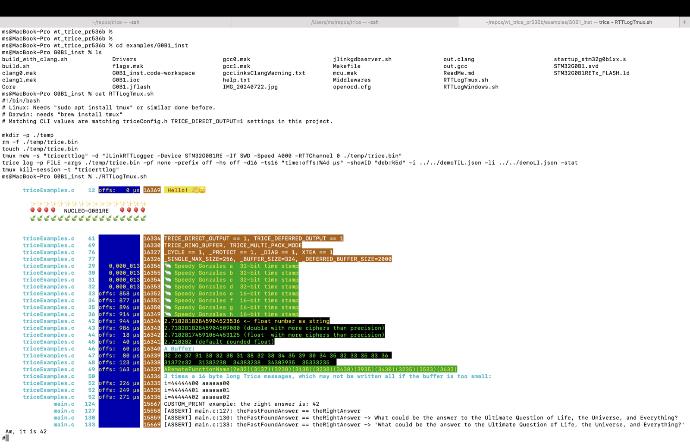

##  40. <a id='add-on-hints'></a>Add-On Hints

###  40.1. <a id='trice-on-libopencm3'></a>Trice on LibOpenCM3

* This is a OpenCM3_STM32F411_Nucleo Contribution from [kraiskil](https://github.com/kraiskil).
* See also pull request [\#269](https://github.com/rokath/trice/pull/269).
* It is here because the code need some re-work to be compatible with Trice version 1.0.

[LibOpenCM3](https://libopencm3.org/) is a hardware abstraction library for many microcontrollers.

This is an exampe using STM's [STM32F411 Nucleo](https://www.st.com/en/evaluation-tools/nucleo-f411re.html) board.

```diff
--> This code uses a legacy Trice version and needs adaption!
```

####  40.1.1. <a id='prerequisites'></a>Prerequisites

- Suitable ARM GCC cross compiler (`arm-none-eabi-gcc`) found in your system's PATH
- GNU Make, or compatible
- Environment variable `OPENCM3_DIR` points to the base install of libopencm3.
  This is e.g. the libopencm3 source directory, if you also built it in the source directory.
- OpenOCD

####  40.1.2. <a id='triceconfig.h'></a>triceConfig.h

```C
/*! \file triceConfig.h
\author Thomas.Hoehenleitner [at] seerose.net
LibOpenCM3 adapatation by Kalle Raiskila.
*******************************************************************************/

#ifndef TRICE_CONFIG_H_
#define TRICE_CONFIG_H_

#ifdef __cplusplus
extern "C" {
#endif

#include <stdint.h>
#include <libopencm3/cm3/cortex.h>
#include <libopencm3/stm32/gpio.h>
#include <libopencm3/stm32/usart.h>

// Local (to this demo) time keeping functions
#include "time.h"

#define TRICE_UART USART2 //!< Enable and set UART for serial output.
// The alternative, TRICE_RTT_CHANNEL is not available with OpenCM3
// #define TRICE_RTT_CHANNEL 0

// Timestamping function to be provided by user. In this demo from time.h
#define TRICE_TIMESTAMP wallclock_ms() // todo: replace with TRICE_TREX_ENCODING stuff

// Enabling next 2 lines results in XTEA TriceEncryption  with the key.
// #define TRICE_ENCRYPT XTEA_KEY( ea, bb, ec, 6f, 31, 80, 4e, b9, 68, e2, fa, ea, ae, f1, 50, 54 ); //!< -password MySecret
// #define TRICE_DECRYPT //!< TRICE_DECRYPT is usually not needed. Enable for checks.

// #define TRICE_BIG_ENDIANNESS //!< TRICE_BIG_ENDIANNESS needs to be defined for TRICE64 macros on big endian devices. (Untested!)

//
///////////////////////////////////////////////////////////////////////////////

///////////////////////////////////////////////////////////////////////////////
// Predefined trice modes: Adapt or creeate your own trice mode.
//
#ifndef TRICE_MODE
#error Define TRICE_MODE to 0, 200 or 201
#endif

//! Direct output to UART or RTT with cycle counter. Trices inside interrupts forbidden. Direct TRICE macro execution.
//! This mode is mainly for a quick tryout start or if no timing constrains for the TRICE macros exist.
//! Only a putchar() function is required - look for triceBlockingPutChar().
//! UART Command line similar to: `trice log -p COM1 -baud 115200`
//! RTT needs additional tools installed - see RTT documentation.
//! J-LINK Command line similar to: `trice log -args="-Device STM32G071RB -if SWD -Speed 4000 -RTTChannel 0 -RTTSearchRanges 0x20000000_0x1000"`
//! ST-LINK Command line similar to: `trice log -p ST-LINK -args="-Device STM32G071RB -if SWD -Speed 4000 -RTTChannel 0 -RTTSearchRanges 0x20000000_0x1000"`
#if TRICE_MODE == 0                     // must not use TRICE_ENCRYPT!
#define TRICE_STACK_BUFFER_MAX_SIZE 128 //!< This  minus TRICE_DATA_OFFSET the max allowed single trice size. Usually ~40 is enough.
#ifndef TRICE_ENTER
#define TRICE_ENTER                                                                          \
	{                                                  /*! Start of TRICE macro */           \
		uint32_t co[TRICE_STACK_BUFFER_MAX_SIZE >> 2]; /* Check TriceDepthMax at runtime. */ \
		uint32_t* TriceBufferWritePosition = co + (TRICE_DATA_OFFSET >> 2);
#endif
#ifndef TRICE_LEAVE
#define TRICE_LEAVE                                                                 \
	{ /*! End of TRICE macro */                                                     \
		unsigned tLen = ((TriceBufferWritePosition - co) << 2) - TRICE_DATA_OFFSET; \
		TriceOut(co, tLen);                                                         \
	}                                                                               \
	}
#endif
#endif // #if TRICE_MODE == 0

//! Double Buffering output to RTT or UART with cycle counter. Trices inside interrupts allowed. Fast TRICE macro execution.
//! UART Command line similar to: `trice log -p COM1 -baud 115200`
//! RTT Command line similar to: `trice l -args="-Device STM32F030R8 -if SWD -Speed 4000 -RTTChannel 0 -RTTSearchRanges 0x20000000_0x1000"`
#if TRICE_MODE == 200
#ifndef TRICE_ENTER
#define TRICE_ENTER TRICE_ENTER_CRITICAL_SECTION //! TRICE_ENTER is the start of TRICE macro. The TRICE macros are a bit slower. Inside interrupts TRICE macros allowed.
#endif
#ifndef TRICE_LEAVE
#define TRICE_LEAVE TRICE_LEAVE_CRITICAL_SECTION //! TRICE_LEAVE is the end of TRICE macro.
#endif
#define TRICE_HALF_BUFFER_SIZE 1000 //!< This is the size of each of both buffers. Must be able to hold the max TRICE burst count within TRICE_TRANSFER_INTERVAL_MS or even more, if the write out speed is small. Must not exceed SEGGER BUFFER_SIZE_UP
#define TRICE_SINGLE_MAX_SIZE 100   //!< must not exeed TRICE_HALF_BUFFER_SIZE!
#endif                              // #if TRICE_MODE == 200

//! Double Buffering output to UART without cycle counter. No trices inside interrupts allowed. Fastest TRICE macro execution.
//! Command line similar to: `trice log -p COM1 -baud 115200`
#if TRICE_MODE == 201
#define TRICE_CYCLE_COUNTER 0       //! Do not add cycle counter, The TRICE macros are a bit faster. Lost TRICEs are not detectable by the trice tool.
#define TRICE_ENTER                 //! TRICE_ENTER is the start of TRICE macro. The TRICE macros are a bit faster. Inside interrupts TRICE macros forbidden.
#define TRICE_LEAVE                 //! TRICE_LEAVE is the end of TRICE macro.
#define TRICE_HALF_BUFFER_SIZE 2000 //!< This is the size of each of both buffers. Must be able to hold the max TRICE burst count within TRICE_TRANSFER_INTERVAL_MS or even more, if the write out speed is small. Must not exceed SEGGER BUFFER_SIZE_UP
#define TRICE_SINGLE_MAX_SIZE 800   //!< must not exeed TRICE_HALF_BUFFER_SIZE!
#endif                              // #if TRICE_MODE == 201

//
///////////////////////////////////////////////////////////////////////////////

///////////////////////////////////////////////////////////////////////////////
// Headline info
//

#ifdef TRICE_HALF_BUFFER_SIZE
#define TRICE_BUFFER_INFO                                                              \
	do {                                                                               \
		TRICE32(Id(0), "att: Trice 2x half buffer size:%4u ", TRICE_HALF_BUFFER_SIZE); \
	} while (0)
#else
#define TRICE_BUFFER_INFO                                                                                 \
	do {                                                                                                  \
		TRICE32(Id(0), "att:Single Trice Stack buf size:%4u", TRICE_SINGLE_MAX_SIZE + TRICE_DATA_OFFSET); \
	} while (0)
#endif

//! This is usable as the very first trice sequence after restart. Adapt and use it or ignore it.
#define TRICE_HEADLINE                                                           \
	TRICE0(Id(0), "s:                                          \n");             \
	TRICE8(Id(0), "s:     NUCLEO-F411RE     TRICE_MODE %3u     \n", TRICE_MODE); \
	TRICE0(Id(0), "s:                                          \n");             \
	TRICE0(Id(0), "s:     ");                                                    \
	TRICE_BUFFER_INFO;                                                           \
	TRICE0(Id(0), "s:     \n");                                                  \
	TRICE0(Id(0), "s:                                          \n");

//
///////////////////////////////////////////////////////////////////////////////

///////////////////////////////////////////////////////////////////////////////
// Compiler Adaption
//

#if defined(__GNUC__) /* gnu compiler ###################################### */

#define TRICE_INLINE static inline //! used for trice code

#define ALIGN4                                 //!< align to 4 byte boundary preamble
#define ALIGN4_END __attribute__((aligned(4))) //!< align to 4 byte boundary post declaration

//! TRICE_ENTER_CRITICAL_SECTION saves interrupt state and disables Interrupts.
#define TRICE_ENTER_CRITICAL_SECTION               \
	{                                              \
		uint32_t old_mask = cm_mask_interrupts(1); \
		{

//! TRICE_LEAVE_CRITICAL_SECTION restores interrupt state.
#define TRICE_LEAVE_CRITICAL_SECTION \
	}                                \
	cm_mask_interrupts(old_mask);    \
	}

#else
#error unknown compliler
#endif // compiler adaptions ##################################################

//
///////////////////////////////////////////////////////////////////////////////

///////////////////////////////////////////////////////////////////////////////
// Optical feedback: Adapt to your device.
//

TRICE_INLINE void ToggleOpticalFeedbackLED(void) {
	// The only user controllable LED available on the
	// Nucleo is LD2, on port A5. This is set up in main.c
	gpio_toggle(GPIOA, GPIO5);
}

//
///////////////////////////////////////////////////////////////////////////////

///////////////////////////////////////////////////////////////////////////////
// UART interface: Adapt to your device.
//

#ifdef TRICE_UART

//! Check if a new byte can be written into trice transmit register.
//! \retval 0 == not empty
//! \retval !0 == empty
//! User must provide this function.
TRICE_INLINE uint32_t triceTxDataRegisterEmpty(void) {
	uint32_t reg = USART_SR(TRICE_UART);
	return (reg & USART_SR_TXE);
}

//! Write value v into trice transmit register.
//! \param v byte to transmit
//! User must provide this function.
TRICE_INLINE void triceTransmitData8(uint8_t v) {
	usart_send_blocking(TRICE_UART, v);
	ToggleOpticalFeedbackLED();
}

//! Allow interrupt for empty trice data transmit register.
//! User must provide this function.
TRICE_INLINE void triceEnableTxEmptyInterrupt(void) {
	usart_enable_tx_interrupt(TRICE_UART);
}

//! Disallow interrupt for empty trice data transmit register.
//! User must provide this function.
TRICE_INLINE void triceDisableTxEmptyInterrupt(void) {
	usart_disable_tx_interrupt(TRICE_UART);
}

#endif // #ifdef TRICE_UART

///////////////////////////////////////////////////////////////////////////////
// Default TRICE macro bitwidth: 32 (optionally adapt to MCU bit width)
//

#define TRICE_1 TRICE32_1   //!< Default parameter bit width for 1  parameter count TRICE is 32, change for a different value.
#define TRICE_2 TRICE32_2   //!< Default parameter bit width for 2  parameter count TRICE is 32, change for a different value.
#define TRICE_3 TRICE32_3   //!< Default parameter bit width for 3  parameter count TRICE is 32, change for a different value.
#define TRICE_4 TRICE32_4   //!< Default parameter bit width for 4  parameter count TRICE is 32, change for a different value.
#define TRICE_5 TRICE32_5   //!< Default parameter bit width for 5  parameter count TRICE is 32, change for a different value.
#define TRICE_6 TRICE32_6   //!< Default parameter bit width for 6  parameter count TRICE is 32, change for a different value.
#define TRICE_7 TRICE32_7   //!< Default parameter bit width for 7  parameter count TRICE is 32, change for a different value.
#define TRICE_8 TRICE32_8   //!< Default parameter bit width for 8  parameter count TRICE is 32, change for a different value.
#define TRICE_9 TRICE32_9   //!< Default parameter bit width for 9  parameter count TRICE is 32, change for a different value.
#define TRICE_10 TRICE32_10 //!< Default parameter bit width for 10 parameter count TRICE is 32, change for a different value.
#define TRICE_11 TRICE32_11 //!< Default parameter bit width for 11 parameter count TRICE is 32, change for a different value.
#define TRICE_12 TRICE32_12 //!< Default parameter bit width for 12 parameter count TRICE is 32, change for a different value.

//
///////////////////////////////////////////////////////////////////////////////

#ifdef __cplusplus
}
#endif

#endif /* TRICE_CONFIG_H_ */

```

####  40.1.3. <a id='main.c'></a>main.c

```C
/*
 * Demo to test/show TRICE usage in a libopencm3
 * environment.
 */

#include <libopencm3/cm3/systick.h>
#include <libopencm3/stm32/gpio.h>
#include <libopencm3/stm32/exti.h>
#include <libopencm3/stm32/usart.h>
#include <libopencm3/stm32/rcc.h>
#include <libopencm3/cm3/nvic.h>

#include <stdint.h>
void msleep(uint32_t delay);
uint32_t wallclock_ms(void);

#include "trice.h"

static void hardware_setup(void)
{
	/* Set device clocks from opencm3 provided preset.*/
	const struct rcc_clock_scale *clocks = &rcc_hsi_configs[RCC_CLOCK_3V3_84MHZ];
	rcc_clock_setup_pll( clocks );

	/* Set up driving the LED connected to port A, pin 5. */
	rcc_periph_clock_enable(RCC_GPIOA);
	gpio_mode_setup(GPIOA, GPIO_MODE_OUTPUT, GPIO_PUPD_NONE, GPIO5);

	/* User-button is connected to port C, pin 13. Set up button push
	 * to cause an interrupt. */
	gpio_mode_setup(GPIOC, GPIO_MODE_INPUT, GPIO_PUPD_NONE, GPIO13);
	rcc_periph_clock_enable(RCC_SYSCFG);  // clock for the EXTI handler
	nvic_enable_irq(NVIC_EXTI15_10_IRQ);
	exti_select_source(EXTI13, GPIOC);
	exti_set_trigger(EXTI13, EXTI_TRIGGER_FALLING);
	exti_enable_request(EXTI13);

	/* USART2 is connected to the nucleo's onboard ST-Link, which forwards
	 * it as a serial terminal over the ST-Link USB connection.
	 * This UART is given to the Trice data. */
	rcc_periph_clock_enable(RCC_USART2);
	usart_set_baudrate(USART2, 115200);
	usart_set_databits(USART2, 8);
	usart_set_stopbits(USART2, USART_STOPBITS_1);
	usart_set_mode(USART2, USART_MODE_TX);
	usart_set_parity(USART2, USART_PARITY_NONE);
	usart_set_flow_control(USART2, USART_FLOWCONTROL_NONE);

	// Enable UART2 interrupts in the system's interrupt controller
	// but do NOT enable generating interrupts in the UART at this
	// time. Let Trice enable them with triceEnableTxEmptyInterrupt()
	nvic_enable_irq(NVIC_USART2_IRQ);
	//usart_enable_tx_interrupt(USART2);
	usart_enable(USART2);

	/* Configure USART TX pin only. We don't get any input via the TRICE
	 * channel, so the RX pin can be left unconnected to the USART2 */
	gpio_mode_setup(GPIOA, GPIO_MODE_AF, GPIO_PUPD_NONE, GPIO2);
	gpio_set_af(GPIOA, GPIO_AF7, GPIO2);

	/* Enable systick at a 1mS interrupt rate */
	systick_set_reload(84000);
	systick_set_clocksource(STK_CSR_CLKSOURCE_AHB);
	systick_counter_enable();
	systick_interrupt_enable();
}

//////////////////////////
// Time handling utilities
static volatile uint32_t system_millis;

/* "sleep" for delay milliseconds */
void msleep(uint32_t delay)
{
	uint32_t wake = system_millis + delay;
	while (wake > system_millis);
}

uint32_t wallclock_ms(void)
{
	return system_millis;
}

//////////////////////////
// Interupt handlers
// These are weak symbols in libopencm3
// that get overridden here.

// Trice USART
void usart2_isr(void)
{
	#if TRICE_MODE == 200
	triceServeTransmit();
	#endif
}

// External interrupts on pins 10-15, all ports.
// Only PC13 (User button on Nucleo) is enabled in this program.
void exti15_10_isr(void)
{
	exti_reset_request(EXTI13);
	#if TRICE_MODE == 200
	TRICE(Id(0), "Button press at, %d\n", system_millis);
	#endif
}

// Systick timer set to 1ms
void sys_tick_handler(void)
{
	system_millis++;
	#if TRICE_MODE == 200
	// Start sending what is currently in the Trice transmit buffer
	triceTriggerTransmit();
	#endif
}

int main(void)
{
	hardware_setup();
	TRICE_HEADLINE;
	while (1) {
		msleep(1000);

		// Depending on mode, either print this string to
		// UART (mode 0), or the Trice write buffer (mode 200).
		TRICE(Id(0), "Hello, TRICE, %d\n", 42);

		// TRICE("") with a string parameter only is problematic.
		// See discussion on https://github.com/rokath/trice/issues/279
		// TRICE0("") works in either case
		#ifdef __STRICT_ANSI__
		// if compiled with e.g. --std=c99
		TRICE0(Id(0), "Hello, TRICE\n");
		#else
		TRICE(Id(0), "Hello, TRICE\n");
		TRICE0(Id(0), "Hello, TRICE0()\n");
		#endif

		#if TRICE_MODE == 200
		// Swap Trice transmit/write ping-pong buffers.
		// Stuff printed with TRICE() since the last
		// call to TriceTransfer() will be sent once
		// triceTriggerTransmit() is called.
		TriceTransfer();
		#endif
	}

	return 0;
}

```

####  40.1.4. <a id='nucleo-f411re.ld'></a>nucleo-f411re.ld

```ld
/* Use the LibOpenCM3-provided defaults for the linker details.
 */
MEMORY
{
	rom (rx)  : ORIGIN = 0x08000000, LENGTH = 512K
	ram (rwx) : ORIGIN = 0x20000000, LENGTH = 128K
}

INCLUDE cortex-m-generic.ld
```

####  40.1.5. <a id='makefile'></a>Makefile

```mak
# Makefile for compiling the Trice demo on LibOpenCM3
# for STM32F411-Nucleo boards
CC=arm-none-eabi-gcc
C_FLAGS=-O0 -std=c99 -ggdb3
C_FLAGS+=-mthumb -mcpu=cortex-m4 -mfloat-abi=hard -mfpu=fpv4-sp-d16
C_FLAGS+=-Wextra -Wshadow -Wimplicit-function-declaration -Wredundant-decls -Wmissing-prototypes -Wstrict-prototypes
C_FLAGS+=-fno-common -ffunction-sections -fdata-sections  -MD -Wall -Wundef
C_FLAGS+=-DSTM32F4 -I/home/kraiskil/stuff/libopencm3/include
# These two are for trice.h and triceConfig.h
C_FLAGS+=-I../../pkg/src/ -I.

LFLAGS=-L${OPENCM3_DIR}/lib -lopencm3_stm32f4 -lm -Wl,--start-group -lc -lgcc -lnosys -Wl,--end-group
LFLAGS+=-T nucleo-f411re.ld
LFLAGS+=--static -nostartfiles
LFLAGS+=-Wl,-Map=memorymap.txt

all: direct_mode.elf irq_mode.elf
.PHONY: flash clean

# Annotate Trice-enabled code.
# trice does this annotation in-place, so here we take
# a copy before running trice.
# I.e. write TRICE macros in foo.c, and this will generate
# the TRICE( Id(1234) .. ) macros into foo.trice.c
%.trice.c: %.c til.json
	cp -f $< $<.bak
	trice update
	cp -f $< $@
	cp -f $<.bak $<

# trice expects this file to exist, can be empty.
til.json:
	touch til.json

direct_mode.elf: main.trice.c ../../pkg/src/trice.c
	${CC} ${C_FLAGS} $^ -o $@ ${LFLAGS} -DTRICE_MODE=0

flash_direct_mode: direct_mode.elf
	openocd -f interface/stlink-v2.cfg -f target/stm32f4x.cfg -c "program direct_mode.elf verify reset exit"

irq_mode.elf: main.trice.c ../../pkg/src/trice.c
	${CC} ${C_FLAGS} $^ -o $@ ${LFLAGS} -DTRICE_MODE=200

flash_irq_mode: irq_mode.elf
	openocd -f interface/stlink-v2.cfg -f target/stm32f4x.cfg -c "program irq_mode.elf verify reset exit"


clean:
	@rm -f *.elf til.json main.trice.c
```

####  40.1.6. <a id='usage'></a>Usage

- Run `make direct_mode.elf` to compile with Trice mode 0.
- Run `make flash_direct_mode` to program the board.
- Run trice: `trice l -p /dev/ttyACM0`.

###  40.2. <a id='get-all-project-files-containing-trice-messages'></a>Get all project files containing Trice messages

We check the location information file. Every Trice is registered here.

```bash
cat demoLI.json | grep '"File":' | sort | uniq
		"File": "_test/_ringB_protect_de_tcobs_ua/TargetActivity.c",
		"File": "_test/special_dblB_de_tcobs_ua/TargetActivity.c",
		"File": "_test/special_for_debug/TargetActivity.c",
		"File": "_test/special_protect_dblB_de_tcobs_ua/TargetActivity.c",
		"File": "_test/testdata/triceCheck.c",
		"File": "examples/F030_inst/Core/Src/stm32f0xx_it.c",
		"File": "examples/G0B1_inst/Core/Src/main.c",
		"File": "examples/G0B1_inst/Core/Src/stm32g0xx_it.c",
		"File": "examples/L432_inst/Core/Inc/triceConfig.h",
		"File": "examples/L432_inst/Core/Src/main.c",
		"File": "examples/L432_inst/Core/Src/stm32l4xx_it.c",
		"File": "examples/exampleData/triceExamples.c",
		"File": "examples/exampleData/triceLogDiagData.c",
```

###  40.3. <a id='building-a-trice-library?'></a>Building a trice library?

The triceConfig.h is mandatory for the trice code. It controls which parts of the trice code are included. There is no big advantage having a trice library, because it would work only with unchanged settings in the project specific triceConfig.h. Once the trice source files are translated, their objects are rebuilt automatically and only when the triceConfig.h is changed. So only the linker has a bit less to do when it finds a trice library compared to a bunch of trice objects. But does that influence the build time heavily?

The triceConfig.h is the only part of the trice sources which should be modified by the users. It is ment to be a individual part of the user projects. The examples folder shows the usage.

###  40.4. <a id='possible-compiler-issue-when-using-trice-macros-without-parameters-on-old-compiler-or-with-strict-c-settings'></a>Possible Compiler Issue when using Trice macros without parameters on old compiler or with strict-C settings

If you encounter a compilation error on `trice( "hi");` for example, but not on `trice( "%u stars", 5 );`, this is probably caused by the way your compiler interprets variadic macros. Simply change to `trice0( "hi");` or change your compiler settings. See issue [\#279](https://github.com/rokath/trice/issues/279) for more details. If your project needs to be translated with strict-C settings for some reason, you have to use the `trice0` macros when no values exist for the Trice macros.

<p align="right">(<a href="#top">back to top</a>)</p>

##  41. <a id='trice-and-legacy-user-code'></a>Trice And Legacy User Code 

When it comes to use legacy sources together with Trice, there are several ways doing so, which do not exclude each other:

* [Legacy User Code Option: Separate Physical Output Channel](#legacy-user-code-option-separate-physical-output-channel)
* [Legacy User Code Option: Trice Adaption Edits](#legacy-user-code-option-trice-adaption-edits)
* [Legacy User Code Option: Print Buffer Wrapping and Framing](#legacy-user-code-option-print-buffer-wrapping-and-framing)
* [Legacy User Code Option: Trice Aliases Adaption](#legacy-user-code-option-trice-aliases-adaption)

###  41.1. <a id='legacy-user-code-option-separate-physical-output-channel'></a>Legacy User Code Option Separate Physical Output Channel 

*Advantages:*

* No user code adaption at all needed.
* Code can mix user prints and Trices.

*Disadvantages:*

* A 2nd physical output is needed.
* The log output goes to one or the other app, what may result in a partial sequence information loss.
* Suboptimal result for target image size and speed, because the legacy user code still prints and transmits strings.

*Details:*

* The legacy user code output drives a terminal app and the Trice output feeds the Trice binary data into the Trice tool.

###  41.2. <a id='legacy-user-code-option-trice-adaption-edits'></a>Legacy User Code Option Trice Adaption Edits

*Advantages:*

* This is the most straight forward method.
* Optimal result for target image size and speed.

*Disadvantages:*

* No mixed user prints and Trices.
* Legacy code gets changed, needs new testing and is not usable parallel in other existing projects anymore.
* Error prone, even when done KI supported.
  * Max 12 integers/floats **OR** a single runtime generated string in one Trice possible, otherwise splitting into several Trices is needed.
  * `float x` values need wrapping with `aFloat(x)`.
  * `double x` needs wrapping with `aDouble(x)`.
  * `int64` and `double` need `trice64` instead of `trice` or generally use 64-bit width `trice`.
* Not applicable for a large legacy code basis.
  * It is (probably) already tested code.
  * It is maybe used "as is" in other projects.
  * It needs a lot of manual editing work. -> This nowadays is expected to be easier with AI.

*Details:*

* All exising user prints are replaced with appropriate Trice macros according chapter [Trice Similarities and Differences to printf Usage](#trice-similarities-and-differences-to-printf-usage).
* When using 64-bit as default Trice bit width, more RAM is used compared to 32-bit, but in combination with the default [TCOBS](https://github.com/rokath/tcobs) compressing framing the transmitted Trice packets do not increase much compared to 32-bit width.

###  41.3. <a id='legacy-user-code-option-print-buffer-wrapping-and-framing'></a>Legacy User Code Option Print Buffer Wrapping and Framing 

> **Trice >= v1.1 feature**, see also issue [\#550](https://github.com/rokath/trice/issues/550)

*Advantages:*

* Code can mix user prints and Trices.
* Legacy code stays unchanged and is usable parallel in other existing projects.

*Disadvantages:*

* Suboptimal result for target image size and speed, because the legacy user code still prints and transmits strings.
* The reserved case, both [Binary Encoding](#binary-encoding) stamp selector bits are 0, is not available anymore for additional use cases.
* The log output may have a partial sequence information loss.

*Details:*

The Trice binary encoding uses states 1, 2, 3 of the 4 states, the 2 [Binary Encoding](#binary-encoding) stamp selector bits can have. They located in the starting `uint16_t` ID value to encode the Trice (time) stamp size. If both bits are zero (state 0), the Trice tool can interpret the incoming data buffer according to a passed CLI switch; in this special case just printing it as string.

If the Trice library and the user print both write to the same output, an easy modification would be, to prepend the user print output with a 2-byte count as long its size is < 16383, so that the 2 most significant bits are zero. Additionally, the this way counted buffer needs the same buffer framing as the Trice binary data.

###  41.4. <a id='legacy-user-code-option-trice-aliases-adaption'></a>Legacy User Code Option Trice Aliases Adaption

> **Trice >= v1.1 feature**, see also accepted pull requests [\#533](https://github.com/rokath/trice/pull/533) and [\#536](https://github.com/rokath/trice/pull/536)

*Advantages:*

* Code can mix user prints and Trices.
* Legacy code stays unchanged or mainly unchanged and is usable parallel in other existing projects.
* Nearly optimal result for target image size and speed.
* No special wrapping and need to use the [Binary Encoding](#binary-encoding) stamp selector bits state 0 for this.
* Especially, when adapting user specific ASSERT macros with `-salias` (see below), even their strings are compiled into the Target image, only in error cases the strings are printed and transmitted.

*Disadvantages:*

* The legacy user code could *partially* still print and transmit strings, especially when `float` or `double` are used.

*Details:*

This cool functionality was contributed by [@srgg](https://github.com/srgg) in pull requests (PR) [\#533](https://github.com/rokath/trice/pull/533) and [\#536](https://github.com/rokath/trice/pull/536) (to be considered as one PR only). It allows code integration containing user specific log statements into Trice instrumented projects without the need to rename the user specific log statements.

In the assumption, most user `printi` statements having only up to 12 integers, those user prints could get covered by adding `-alias printi` to the `trice insert` and `trice clean` commands.

The user `printi` statements containing floats, doubles, strings could get simply renamed into user `prints` and then `-salias prints` will cover them too. That, of course, is a legacy user code change, but it allows to use this slightly modified legacy user code parallel in other projects.

Yes, user `printi` and user `prints` need to be defined too. See [./_test/alias_dblB_de_tcobs_ua/triceConfig.h/triceConfig](https://github.com/rokath/trice/blob/main/_test/alias_dblB_de_tcobs_ua/triceConfig.h) as a simple example and its usage in [./_test/alias_dblB_de_tcobs_ua/TargetActivity.c](https://github.com/rokath/trice/blob/main/_test/alias_dblB_de_tcobs_ua/TargetActivity.c)

This technique allows also to cover legacy user code specific ASSERT macros, as shown in [./_test/aliasassert_dblB_de_tcobs_ua/triceConfig.h](https://github.com/rokath/trice/blob/main/_test/aliasassert_dblB_de_tcobs_ua/triceConfig.h) and used in the tests [./_test/aliasassert_dblB_de_tcobs_ua/TargetActivity.c](https://github.com/rokath/trice/blob/main/_test/aliasassert_dblB_de_tcobs_ua/TargetActivity.c).

Despite of these 2 CGO tests the real-world example [./examples/G0B1_inst](https://github.com/rokath/trice/blob/main/examples/G0B1_inst/Core/Src/main.c) shows the usage too.

The following sub-chapters are mainly written by [@srgg](https://github.com/srgg) as accompanying documentation to its pull requests.

####  41.4.1. <a id='pr533-doc'></a>PR533 Doc

####  41.4.2. <a id='pr533-summary'></a>PR533 Summary

This PR introduces support for treating user-defined macros as aliases to trice and triceS within the Trice CLI toolchain. The goal is to enable project-specific logging macros to be processed just like built-in Trice macros — including ID generation, decoding, and binary format support — without requiring projects to directly call `trice()` or `triceS()` in their source code.

PR leverages the `-exclude` source feature added in [\#529](https://github.com/rokath/trice/pull/529).

####  41.4.3. <a id='pr533-motivation'></a>PR533 Motivation

Trice uses a source-scanning and ID generation approach, where the toolchain scans for `trice(...)` and `triceS(...)` calls, injects numeric trace IDs, and builds a mapping database. However, it currently only supports built-in(hardcoded) macros and allows only global on/off control via compile-time flags.

This makes it difficult to:

- Adopt custom naming conventions (`DBG()`, `APP_LOG()`, `MON()`, etc.).
- Redirect trace/logging behavior to other backends (e.g., MicroSD, raw printf, no-op).
- Change behavior per module or configuration without losing Trice tooling support.

####  41.4.4. <a id='what-this-pr533-adds'></a>What This PR533 Adds

**CLI-level aliasing**: Developers can now declare custom macros to be treated as `trice` or `triceS` equivalents. These user-defined macros will be recognized during scanning, ID injection, and decoding. 

####  41.4.5. <a id='pr533-example'></a>PR533 Example

*print_macro.h*:

```C
#ifndef TRICE_OFF
  #define DEBUG_PRINT(...)  trice(__VA_ARGS__)
  #define DEBUG_PRINT_S(...)  triceS(__VA_ARGS__)
#else
  #define DEBUG_PRINT(...)  Serial.println(__VA_ARGS__)
  #define DEBUG_PRINT_S(...)  Serial.printf(__VA_ARGS__)
#endif
```

*example.c*:

```C
#include "trice.h"
#include "print_macro.h"

void setup() {
    Serial.begin(115200);

    while (!Serial) {
        delay(10);
    }

   // Add code here to initialize whatever Trice sender TCP/UDP/UART, etc.
   
  // No argument
  DEBUG_PRINT("DEBUG_PRINT test: no args\n");

  char* str = "Test string";
  DEBUG_PRINT_S("DEBUG_PRINT_S test: %s\n", str);
 }
```

##### PR533 Check with Trice

Insert trice IDs:

```shell
trice insert -alias DEBUG_PRINT -salias DEBUG_PRINT_S  -exclude ./print_macro.h -v
```

Flash the MCU and run the trice receiver on your host machine to receive probes (cli command is config and receiver dependent), for UDP4, it can be:

```shell
   trice log -p UDP4 -v -pf none
```

##### PR533 Check without Trice:

Clean trice IDs, if any:

```shell
trice clean -alias DEBUG_PRINT -salias DEBUG_PRINT_S  -exclude ./print_macro.h -v
```

Flash with `-DTRICE_OFF`.

####  41.4.6. <a id='pr536-doc'></a>PR536 Doc

##### What This PR536 Adds

This is a follow-up to [\#533](https://github.com/rokath/trice/pull/533). It **enforces the consistent use of the "%s" format in all triceS aliases** and fixes that behavior in the newly added test case.

The following simplified example reflects a real use case where custom macros wrap formatting logic:

```C
#define CUSTOM_PRINT_S(id, fmt, ....) triceS(id, "%s", format_message(fmt, ##__VA_ARGS__))
```

##### PR536 - The Problem Statement

Determining the Strg argument reliably is challenging due to:

* The unrestricted flexibility of macros (_which I would like to preserve and utilize_).
* Trice core’s limited parsing, which relies on regular expressions.

For instance, custom macros like these show the variability:

``` c
CUSTOM_ASSERT(false, "Message: %s", msg);
CUSTOM_ASSERT(false, "Message without args");
CUSTOM_ASSERT(false);
```

Improving this would likely require Clang integration—adding complexity (e.g., full build flags, complete source context)—whereas Trice’s current regex-based approach remains lightweight and simple to use.

##### PR536 Implementation Details:

`matchTrice()` was re-implemented to improve robustness. It now:

* Locates the macro or alias name followed by (.
* Finds the matching closing parenthesis, correctly handling nested structures.
* Parses the arguments within.

This approach simplifies the logic and allows the parser to skip invalid or partial matches without aborting, enabling continued scanning of the file for valid constructs.

####  41.4.7. <a id='alias-example-project'></a>Alias Example Project

To use the Alias technique with `examples/G0B1_inst` the following adaptions where made:

* Copied file [./examples/G0B1_inst/Core/Inc/nanoprintf.h](https://github.com/rokath/trice/blob/main/examples/G0B1_inst/Core/Inc/nanoprintf.h) from https://github.com/charlesnicholson/nanoprintf
* Created file [./examples/G0B1_inst/Core/Inc/triceCustomAliases.h](https://github.com/rokath/trice/blob/main/examples/G0B1_inst/Core/Inc/triceCustomAliases.h) to cover the user code specific `CUSTUM_PRINT` and  `CUSTUM_ASSERT`.
* *Core/Src/main.c*:

  ```diff
  /* Private includes ----------------------------------------------------------*/
  /* USER CODE BEGIN Includes */
  - #include "trice.h"
  + #include "triceCustomAliases.h"
  #include <limits.h> // INT_MAX
  /* USER CODE END Includes */

  ...

    /* USER CODE BEGIN 2 */
  #if !TRICE_OFF
    LogTriceConfiguration();
    SomeExampleTrices(3);
  - #endif
  +   /* Some Custom Trice Alias Examples */  
  +   const int theRightAnswer = 42;
  +   const int theFastFoundAnswer = 24;
  +   const char* theQuestion = "What could be the answer to the Ultimate Question of + Life, the Universe, and Everything?";
  +   
  +   // Some Trice custom alias examples
  +   CUSTOM_PRINT("CUSTOM_PRINT example: the right answer is: %d\n", theRightAnswer);
  +   
  +   // Assert with condition 
  +   CUSTOM_ASSERT(theFastFoundAnswer == theRightAnswer);
  +   
  +   // Assert with condition and a message: This works too, but triggers a clang + compiler warning, we cannot suppress.
  +   CUSTOM_ASSERT(theFastFoundAnswer == theRightAnswer, (char*)theQuestion ); // + https://stackoverflow.com/questions/52692564/+ how-can-i-disable-format-security-error-with-clang
  +   
  +   // Assert with condition and a message and some extra message arguments
  +   CUSTOM_ASSERT(theFastFoundAnswer == theRightAnswer, (char*)"'%s' Am, it is %d", + (char*)theQuestion, theRightAnswer);
  + #endif
    /* USER CODE END 2 */

  ```

* After flashing:



<p align="right">(<a href="#top">back to top</a>)</p>

##  42. <a id='future-development'></a>Future Development

###  42.1. <a id='trice-log-level-control-specification-draft'></a>Trice Log-level Control Specification Draft

> Specification Draft

```diff
--> IMPORTANT: No breaking changes!
```

####  42.1.1. <a id='what-log-levels-exist-in-general,-including-exotic-ones,-and-what-is-their-exact-weighting-relative-to-each-other?'></a>What log levels exist in general, including exotic ones, and what is their exact weighting relative to each other?

🧭 **Basic principle**

* Lower level → more noise / diagnostic detail
* Higher level → more severe / critical condition

🔢 **Common standardized levels (by severity)**

Level | Name                      | Weight          | Meaning
------|---------------------------|-----------------|-----------------------------------------------------------------------------------------------------
0     | TRACE                     | lowest          | Finest-grained details — e.g., every function call or variable change. Used for deep debugging only.
1     | DEBUG                     | low             | Developer-level details about execution flow. No failure.
2     | INFO                      | medium          | Normal operational messages — startup, config loaded, connection established.
3     | NOTICE                    | slightly higher | Significant but expected events (e.g., user login). Exists in syslog.
4     | WARN / WARNING            | rather high     | Something unexpected but not yet a failure. System continues running.
5     | ERROR                     | high            | A problem occurred — operation failed, but program still runs.
6     | CRITICAL                  | very high       | A subsystem failure. Urgent attention required.
7     | ALERT                     | extremely high  | Immediate human intervention needed.
8     | EMERGENCY / FATAL / PANIC | highest         | System unusable. Shutdown or restart required.

🧩 **Rare or exotic variants**

Name                       | Origin / Context                | Severity                | Description
---------------------------|---------------------------------|-------------------------|-----------------------------------------------
VERBOSE                    | Windows, Android, C/C++ loggers | Between TRACE and DEBUG | Very detailed, but not quite as deep as TRACE.
SUCCESS / OK / PASS        | Test frameworks                 | Between INFO and NOTICE | Indicates successful operations.
FAIL                       | Test frameworks                 | ERROR                   | Failed test but not system error.
SECURITY / AUDIT           | Compliance systems              | Variable                | Logs security or compliance events separately.
CONFIG / INIT              | Embedded / frameworks           | INFO                    | Configuration or initialization messages.
DEPRECATION                | Compilers, frameworks           | WARN                    | Deprecated feature warnings.
ASSERT                     | Debuggers, C/C++                | CRITICAL                | Assertion failure, usually aborts program.
NOTICE / IMPORTANT / EVENT | Various                         | Between INFO and WARN   | Events worth attention but not errors.
OFF                        | Logging frameworks              | none                    | Turns off all logging.
ALL                        | Logging frameworks              | lowest                  | Enables every log level.

🧮 **Example comparison across systems**

Severity | Syslog  | Log4J / Java | Python   | .NET        | Meaning
---------|---------|--------------|----------|-------------|-----------------
0        | debug   | TRACE        | NOTSET   | Trace       | Internal details
1        | info    | DEBUG        | DEBUG    | Debug       | Developer info
2        | notice  | INFO         | INFO     | Information | Normal ops
3        | warning | WARN         | WARNING  | Warning     | Unexpected
4        | err     | ERROR        | ERROR    | Error       | Operation failed
5        | crit    | FATAL        | CRITICAL | Critical    | Severe
6        | alert   | —            | —        | —           | Immediate action
7        | emerg   | —            | —        | —           | System crash

🧠 **Suggested numeric scale**

| Level                     | Weight | Meaning           |
|---------------------------|--------|-------------------|
| TRACE                     | 10     | Ultra-detailed    |
| VERBOSE                   | 20     | Very detailed     |
| DEBUG                     | 30     | Developer info    |
| INFO                      | 40     | Normal operation  |
| NOTICE                    | 50     | Significant event |
| WARN                      | 60     | Warning           |
| ERROR                     | 70     | Error             |
| CRITICAL                  | 80     | Serious problem   |
| ALERT                     | 90     | Urgent            |
| EMERGENCY / FATAL / PANIC | 100    | Total failure     |

For The Trice project (an embedded logging tool), logging must be:

* lightweight,
* memory-efficient (Flash/RAM),
* but still expressive enough for both developers and customers.

Here’s a 7-level scheme, embedded-friendly yet compatible with syslog/log4j conventions:

🔧 Recommended Trice Log Level Scale

| Macro/Level           | Name                | Weight | Meaning                            | Typical Use                                 |
|-----------------------|---------------------|--------|------------------------------------|---------------------------------------------|
| **0 – trice_SILENT**  | **OFF / NONE**      | 0      | No output at all.                  | Disable logging in release builds.          |
| **1 – trice_FATAL**   | **FATAL / PANIC**   | 100    | System unusable, restart required. | Watchdog reset, hard fault, stack overflow. |
| **2 – trice_ERROR**   | **ERROR**           | 80     | Recoverable error.                 | CRC failure, timeout, file missing.         |
| **3 – trice_WARN**    | **WARN**            | 60     | Unexpected but tolerable.          | Retry, threshold exceeded.                  |
| **4 – trice_INFO**    | **INFO**            | 40     | Regular operation messages.        | Init complete, connection established.      |
| **5 – trice_DEBUG**   | **DEBUG**           | 30     | Developer-level diagnostics.       | Variable states, state transitions.         |
| **6 – trice_VERBOSE** | **VERBOSE / TRACE** | 10     | Deepest trace level.               | Function calls, ISR entry, timings.         |

🎯 Advantages

* [x] Compatible with Syslog conventions
* [x] Filtered by one threshold (if(level <= currentLevel))
* [x] Backward-compatible (old log constants still valid)
* [x] Easily extendable (e.g., add NOTICE or ASSERT later)

####  42.1.2. <a id='compile-time-log-level-control'></a>Compile-time Log-level Control

In [Trice Structured Logging Compile-time Information](#trice-structured-logging-compile-time-information) we see, how `trice insert ...` could modify (temporarily) the source code. With an additional *insert* switch like `-loglevel` the shown example could get changed in this way:

User may have written inside *val.c*:

```C
void doStuff( void ){
    // ...
    trice("info:The answer is %d.\n", 42);
    // ...
}
```

and a `trice insert -loglevel` command could change that into (revertable with `trice clean`):

```C
void doStuff( void ){
    // ...
    trice_INFO(iD(123), "info:The answer is %d.\n", 42);
    // ...
}
```

The idea here is to modify also the `trice` macro name into `trice_INFO`, when a Trice tag "info" or "inf" was found. We could define this way:

```C
#define TRICE_LOG_LEVEL TRICE_LEVEL_INFO

#if TRICE_LOG_LEVEL >= TRICE_LEVEL_INFO
#define trice_INFO(...) trice( __VA_ARGS__)
#else
#define trice_INFO(...) ((void)0)
#endif

#if TRICE_LOG_LEVEL >= TRICE_LEVEL_DEBUG
#define trice_DEBUG(...) trice(__VA_ARGS__)
#else
#define trice_DEBUG(...) ((void)0)
#endif
```

That results in no code generation for `trice("info:The answer is %d.\n", 42);` for TRICE_LOG_LEVEL < TRICE_LEVEL_INFO. What we get this way is:

* A fine-granular compile-time log-level control.
* The user is free to add its own log-levels.
* No run-time costs at all.

####  42.1.3. <a id='run-time-log-level-control'></a>Run-time Log-level Control

Trice logs are very light-weight and usually is no need for their run-time control. Nevertheless there could be a need for that. The very first we need, is a control channel to tell the target device about a changing log-level. See for example chapter [Stimulate target with a user command over UART](#stimulate-target-with-a-user-command-over-uart).

When we are able to set a value *LogLevel* in the target device, we can use this value as an ID threshold in combination with the `-IDRange` switch. More in detail as an example:

```bash
trice insert -loglevel -IDRange debug:1,999 -IDRange info:2000,2999 -IDMin 4000 -IDMax 9999 -IDRange err:10000,10999
```

It is important to understand, that all other Trice messages get IDs in the range `-IDMin` and `-IDMax` and that no range overlapping is allowed.

| LogLevel | Result                                    |
|---------:|-------------------------------------------|
|    16384 | no output                                 |
|    10000 | only error messages                       |
|     4000 | normal messages and error messages        |
|     2000 | all output except info and debug messages |
|     1000 | all output except debug messages          |
|        0 | all output                                |

That implies a small Trice library extension, which gets active only with a `LOGLEVELS` switch. In that case we get a small additional run-time overhead. What we cannot achieve this way is a tag specific target-side selection, but that would be no big deal to add as well.

<p align="right">(<a href="#top">back to top</a>)</p>

###  42.2. <a id='trice-structured-logging'></a>Trice Structured Logging

> **Specification Draft**

Structured logging, in contrast to unformatted logging, automatically adds compile time and runtime data to logs as well as log level information. The user should be able to configure, which data get added and also should have control about the data formatting. The generic data insertion allows later an automatic log file analysis and frees the developer from manually typing defaults, what is also error-prone.

Trice is considerable already a bit as a (very limited) structured logger, if we look at the file and line insertion capability and the timestamp options. The following is about how Trice could get full structured logging capability without making a breaking change.

####  42.2.1. <a id='trice-structured-logging-compile-time-information'></a>Trice Structured Logging Compile-time Information

*file, line, function, compiler version, module, build time, firmware version, machine name, user name, locale, host OS version, log level, an (unstructured) format string, compiler flags, (locally) defined values...*

These data can be strings or numbers.

####  42.2.2. <a id='trice-structured-logging-runtime-information'></a>Trice Structured Logging Runtime Information

*uptime, timestamp, hw serial, task ID, stack depth, event count, core ID, position, variables values, parameter values ...*

In an initial approach we assume, these data do not contain runtime generated strings. If really needed, a derived hash is usable instead for now. Despite of this, runtime generated strings are an important feature and therefore Trice supports `triceS`, capable to transmit a single string up to 32KB long, and `triceS` relatives like `triceB`. We could add compile-time data (as inserted fixed strings) but runtime information can only get as an additional part of the runtime generated string into the structured log. This should be acceptable and we will deal with this later.

####  42.2.3. <a id='trice-structured-logging-limitations-and-special-cases'></a>Trice Structured Logging Limitations and Special Cases

For performance reasons, Trice was designed to only transmit 0-12 (straight forward extendable) numbers of equal bit-width **OR** a single runtime generated string. Firstly we look at only "normal" Trice macros `trice`, `Trice`, `TRice` and exclude the special cases `triceS`, `TriceS`, `TRiceS`. Also we consider just trices without specified bit-width, assume 32-bit and exlude cases like `trice32_4` firstly.

####  42.2.4. <a id='a-trice-structured-logging-example'></a>A Trice Structured Logging Example

User may have written inside *val.c*:

```C
void doStuff( void ){
    // ...
    trice("info:The answer is %d.\n", 42);
    // ...
}
```

and (as we know) a `trice insert` command would change that into (revertable with `trice clean`):

```C
void doStuff( void ){
    // ...
    trice(iD(123), "info:The answer is %d.\n", 42);
    // ...
}
```

But a `trice insert` command with context option will, for example, change that line into (revertable with `trice clean`):

```C
void doStuff( void ){
    // ...
    trice(iD(456), "[level=info][file=\"val.c\"][line=321][func=doStuff][taskID=%x][fmt=\"The answer is %d.\"][uptime=%08us][temperature=%3.1f°C]\n", getTaskID(), 42, uptime(), aFloat(sensorValue));
    // ...
}
```

####  42.2.5. <a id='trice-structured-logging-cli-switches-and-variables'></a>Trice Structured Logging CLI Switches and Variables

To achieve that, 2 structured logging CLI switches `-stf` and `-stv` on `trice insert` and `trice clean` are usable:

| CLI switch | meaning                   |
|------------|---------------------------|
| `-stf`     | structured logging format |
| `-stv`     | structured logging values |

Additionally the Trice tool uses these internal variables (no bash variables!) as replacements during `trice insert` and `trice clean`:

| Variable  | Example               | Comment                                                                                                                                          |
|-----------|-----------------------|--------------------------------------------------------------------------------------------------------------------------------------------------|
| `$level`  | `info`                | The bare trice format string part until the first colon (`:`), if known as channel/tag value.                                                    |
| `$file`   | `val.c`               | The file name, where the Trice log occures.                                                                                                      |
| `$line`   | `321`                 | The file line, where the Trice log occures.                                                                                                      |
| `$func`   | `doStuff`             | The function name, where the Trice log occures.                                                                                                  |
| `$fmt`    | `The asnwer is %d.`   | The bare Trice format string stripped from the channel/tag specifier including the colon (`:`) according to the Trice rule (lowercase-only ones) |
| `$values` | `42`                  | The bare Trice statement values.                                                                                                                 |
| `$usr0`   | `abc` \| ` ` \| `xyz` | A predefined string value with location dependent values (see below).                                                                            |

####  42.2.6. <a id='trice-structured-logging-user-defined-values'></a>Trice Structured Logging User Defined Values

This use case is not expected for most cases, but mentioned here to show the possibilities. Adding user specific values like `$usr0` can be done in this way:

* File *main.c*:

```C
 88 | ...
 89 | #define XSTR(x) STR(x)
 90 | #define STR(x) #x
 91 | 
 92 | trice("info:hi");
 93 |  
 94 | #define TRICE_ETC "xyz"
 95 | #pragma message "$usr0=" XSTR(TRICE_ETC)
 96 | trice("info:hi");
 97 | 
 98 | #undef TRICE_ETC
 99 | #pragma message "$usr0=" XSTR(TRICE_ETC)
100 | trice("info:hi");
101 | 
102 | #define TRICE_ETC "abc"
103 | #pragma message "$usr0=" XSTR(TRICE_ETC)
104 | trice("info:hi");
105 | ...
```

This is just a demonstration. The `#pragma message "$usr0=" XSTR(TRICE_ETC)` line probably is needed only on a few lines in the project. A pre-compile output 

```bash
$ ./build.sh 2>&1 | grep "pragma message:"
Core/Src/main.c:95:9: note: '#pragma message: $usr0="xyz"'
Core/Src/main.c:99:9: note: '#pragma message: $usr0=""'
Core/Src/main.c:103:9: note: '#pragma message: $usr0="abc"'
```

could get transferred automatically to the Trice tool, with a user generator script to tell, that normally `$usr0=""`, but `$usr0="xyz"` for Trices in file *main.c* from line 95 to 99, that `$usr0="abc"` is valid for *main.c* after line 103.

Those things are compiler and user specific and not part of the Trice tool design. But on demand a CLI multi switch `-stu` can get invented, to inject such information into the `trice insert` process automatically. With

```bash

STF='{"level":"%s","loc":"%s:%d","fmt":"$fmt","etc":"%s"}'
STV='$level, $file, $line, $values, $usr0'

# user script generated begin ################################################
ST0='usr0="xyz":main.c:95'                        # user script generated line
ST1='usr0="":main.c:99'                           # user script generated line
ST2='usr0="abc":main.c:103'                       # user script generated line
STU="-stu $ST0 -stu $ST1 -stu $ST2"               # user script generated line
# user script generated end ##################################################

trice insert $STU -stf $STF -stv $STV
```

The structured log output would be:

```bash
{...}
{"level":"info","loc":"main.c:92","fmt":"hi","etc":""}
{"level":"info","loc":"main.c:96","fmt":"hi","etc":"xyz"}
{"level":"info","loc":"main.c:100","fmt":"hi","etc":""}
{"level":"info","loc":"main.c:104","fmt":"hi","etc":"abc"}
{...}
```

####  42.2.7. <a id='trice-structured-logging-cli-switches-usage-options'></a>Trice Structured Logging CLI Switches Usage Options

The in [A Trice Structured Logging Example](#a-trice-structured-logging-example) shown `trice insert` result is possible with
 
```bash
trice insert \
-stf='[level=$level][file=$file][line=$line][func=$func][taskID=%x][fmt=$fmt][uptime=%08us][temperature=%3.1f°C]' \
-stv='getTaskID(), $values, uptime(), aFloat(sensorValue)'
```

The raw string syntax is mandatory here, to pass the internal Trice tool variables names. 

Adding variable values like `$line` as strings has performance advantages, but on each such value change a new Trice ID is generated then. Those variables are better inserted as values, if the code is under development. A `$line` value insertion looks like this:

```bash
trice insert \
-stf='[level=$level][file=$file][line=%5d][func=$func][taskID=%04x][fmt=$fmt][uptime=%08us][temperature=%3.1f°C]' \
-stv='$line, getTaskID(), $values, uptime(), aFloat(sensorValue)'
```

It is also possible to use string format specifiers to allow somehow aligned values. For example:

```bash
trice insert \
-stf='[level=%-6s][file=%24s][line=%5d][func=%-16s][taskID=%04x][fmt=$fmt][uptime=%08us][temperature=%3.1f°C]' \
-stv='$level, $file, $line, $func, getTaskID(), $values, uptime(), aFloat(sensorValue)'
```

Or, if you like alignment after the format string, even:

```bash
trice insert \
-stf='[level=%-6s][file=%24s][line=%5d][func=%-16s][taskID=%04x][fmt=%64s][uptime=%08us][temperature=%3.1f°C]' \
-stv='$level, $file, $line, $func, getTaskID(), $fmt, $values, uptime(), aFloat(sensorValue)'
```

The user has full control and could also use any other syntax like a JSON format. Only the format specifiers are requested to match the passed values after the Trice tool internal variables replacement during `trice insert`, so that the Trice tool can perform a printf during logging.

To achieve a log output in compact JSON with line as string we can use:

```bash
trice insert \
-stf='{"level":"$level","file":"$file","line:"$line","taskID":"%04x","fmt":$fmt,"uptime":%08u us"}' \
-stv='getTaskID(), $values, uptime()'
```

**To put things together:** Any structured format string design is possible and the user can insert the $line (example) value:

* directly as string (fastest execution, straight forward)
* indirectly as formatted string (fastest execution alignment option)
* indirectly as formatted number (recommended when often changing)

After `trice insert` we get this (compact JSON) log line according to `-stf` and `-stv`:

```C
void doStuff( void ){
    // ...
    trice(iD(789), "{\"level\":\"info\",\"file\":\"val.c\",\"line\":\"321\",\"taskID\":\"%04x\",\"fmt\":\"The answer is %d.\",\"uptime\":\"%08u us\"}\n', getTaskID(), 42, uptime());
    // ...
}
```

All compile time strings are part of the Trice format string now, which is registered inside the *til.json* file. The needed Trice byte count stays 4 bytes only plus the 3 times 4 bytes for the runtime parameter values taskID, 42, uptime. The default [TCOBS](https://github.com/rokath/tcobs) compression will afterwards reduce these 16 bytes to 12 or 13 or so.

A `trice clean` command will remove the context information completely including the ID. Please keep in mind, that with `trice insert` as a pre-compile and `trice clean` as post-compile step, the user all the time sees only the original written code:

```C
void doStuff( void ){
    // ...
    trice("info:The answer is %d.\n", 42);
    // ...
}
```

The optional `-cache` switch makes things blazing fast.

The appropriate Trice tool log line output would be similar to

```bash
{...}
{"level":"info","file":"val.c","line":"321","taskID":"0123","fmt":"The answer is 42.","uptime":"12345678 us"}
{...}
```

When *stf* and *stv* are empty strings (default), `trice insert` and `trice clean` commands will work the ususal way. If they are not empty, the `trice insert` command will on each Trice statement use a heuristic to check if the context information was inserted already and update it or otherwise insert it. **ATTENTION:** That will work only, if *stf* and *stv* where not changed by the user inbetween. In the same way `trice clean` would remove the context information only, if *stf* and *stv* kept unchanged. If the user wants to change *stf* and *stv* during development, first a `trice clean` is needed. Use a `build.sh` script like this:

```bash
#!/bin/bash

# Run "rm -rf ~/.trice/cache/*" automatically after changing this file !!! 

STF='{"level":"$level","file":"$file","line:"$line","taskID":"%04x","fmt":$fmt,"uptime":%08u us"}'
STV='getTaskID(), $values, uptime()'

trice insert -cache -stf="$STF" -stv="$STV"
# make
trice clean  -cache -stf="$STF" -stv="$STV"
```

The `-cache` switch is still experimental - to stay safe, use (here again with `$line` as string):

```bash
#!/bin/bash
STF='{"level":"$level","file":"$file","line:"$line","taskID":"%04x","fmt":$fmt,"uptime":%08u us"}'
STV='getTaskID(), $values, uptime()'

trice insert -stf="$STF" -stv="$STV"
# make
trice clean  -stf="$STF" -stv="$STV"
```

####  42.2.8. <a id='trice-structured-logging-level-specific-configuration'></a>Trice Structured Logging Level Specific Configuration

Configure the Trice Structured Logging selectively in a way, to provide as much helpful diagnostic info as possible on `ERROR` level for example. Example script:

```bash
#!/bin/bash

# Specify `-stf` and `-stv` differently for different channels/tags.

STL="" # Trice Structured Logging configuration

# Trices with an `ERROR:` tag `trice("err:...", ...);`:
STF_ERROR='ERROR:{"log level":"%-6s","file":"%24s","line:"%5d","func":"%-16s","taskID":"%x","fmt":"$fmt","uptime":"%08u us"}'` # (with location)
STV_ERROR='ERROR:$level, $file, $line, $func, getTaskID(), $values, uptime()'`
STL+=" -stf $STF_ERROR -stv $STV_ERROR "

# Trices with an underscore tag, like `trice("_DEBUG:...", ...);` or `trice("_info:...", ...);`:
STF_underscoreTagStart='_*:{"log level":"%-6s","file":"%24s","line:"%5d","func":"%-16s","fmt":"$fmt","uptime":"%08u us"}'` # (no task ID)
STV_underscoreTagStart='_*:$level, $file, $line, $func, $values, uptime()'`
STL+=" -stf $STF_underscoreTagStart -stv $STV_underscoreTagStart "

# Tices with any other tag:
STF_anyTag='*:{"log level":"%-6s","file":"%24s","line:"%5d","func":"%-16s","fmt":"$fmt"}'` # (no task ID, no uptime)
STV_anyTag='*:$level, $file, $line, $func, $values'`
STL+=" -stf $STF_anyTag -stv $STV_anyTag "

# Trices with no tag at all:
STF_noTag='{"file":"%24s","line:"%5d","fmt":"$fmt"}'` # (only location information)
STV_noTag='$file, $line, $values'`
STL+=" -stf $STF_noTag -stv $STV_noTag "

trice insert $STL ...
source make.sh # build process
trice clean  $STL ...
```

####  42.2.9. <a id='trice-structured-logging-assert-macros-(todo)'></a>Trice Structured Logging Assert Macros (TODO)

Configure `TriceAssert` like macros and this works also with the `-salias` switch.

<p align="right">(<a href="#top">back to top</a>)</p>

###  42.3. <a id='improving-the-trice-tool-internal-parser'></a>Improving the Trice Tool Internal Parser

####  42.3.1. <a id='trice-internal-log-code-short-description'></a>Trice Internal Log Code Short Description

##### Trice v1.0 Code

> **Hint:** To follow this explanation with the debugger, you can open in VSCode the trice folder, klick the Run & Debug Button or press CTRL-SHIFT-D, select `trice l -p DUMP` and set a breakpoint at `func main()` in [./cmd/trice/main.go](https://github.com/rokath/trice/blob/main/cmd/trice/main.go) or directly in `translator.Translate` [./internal/translator/translator.go](https://github.com/rokath/trice/blob/main/internal/translator/translator.go).
* In file [./internal/args/handler.go](https://github.com/rokath/trice/blob/main/internal/args/handler.go) function `logLoop` calls `receiver.NewReadWriteCloser` and passes the created `rwc` object to `translator.Translate`.
* There `rwc` is used to create an appropriate decode object `dec` passed to `decodeAndComposeLoop`, which uses `func (p *trexDec) Read(b []byte) (n int, err error)` then, doing the byte interpretation.
  * Finally `n += p.sprintTrice(b[n:]) // use param info` is called doing the conversion. 
* Read returns a **single** Trice conversion result or a **single** error message in b[:n] or 0 and is called again and again.
* The returned Trice conversion result is the Trice format string with inserted values, but no timestamp, color or location information. The target timestamp, for this single Trice is hold in `decoder.TargetTimestamp`. It is used only when a new log line begins, what is the normal case. If a Trice format string ends not with a newline, the following Trice gets part of the same log line and therefore its target time stamp is discarded. Also additional data like the location information only displayed for the first Trice in a log line containing several Trices. Because the color is inherent to the Trice tag and needs no display space it is attached to the following Trices in a log line as well.
* The after `Read` following `emitter.BanOrPickFilter` could remove the Read result.
* If something is to write, the location information is generated if a new line starts and passed to the
 with `sw := emitter.New(w)` created object `sw.WriteString` method which internally keeps a slice of type `[]string` collecting all parts of an output line.
* The line `p.Line = append(p.Line, ts, p.prefix, sx)` adds host timestamp `ts`, the build `p.prefix` and the "printed Trice" (`sx` is here just the location information) to the line slice.
* In the next step the stored target timestamp `decoder.TargetTimestamp` is printed into a string and added to the Trice line.
* Optionally the Trice ID follows, if desired.
* The in a string printed Trice follows now and if the `sw.WriteString` method detects a `\n` at its end, the configured line suffix (usually `""`) follows and `p.completeLine()` is called then. It passes the line (slice of strings) to `p.lw.WriteLine(p.Line)`, which adds color, prints to the output device and clears the sw.Line slice for the next line.

#####  Disadvantages of Trice v1.0 Implementation

* The Reader can only return a **single** Trice, because its byte interface cannot distinguish between Trices anymore.
* The field order (prefix, host stamp, location information, target stamp optional ID, format string, suffix) is hardcoded.
* Trices with several newlines inside the format string cannot deal with tags after an (internal) line break (newline) 
* Binary parser needs to hold internal location after one Trice was decoded.
* Only one target timestamp value in a global variable.
* Line writing is not straight forward understandable.

#####  Aims for a better implementation

* Read should parse the binary data only and return a Trice struct slice.
* Cycle errors?
* Each Trice struct gets printed in a string.
* The printed string then is split into several strings, which all get the same stamp information or space fields.
* Finally we have a slice of such structs: hs, ts, loc, idString, format string. 
* The format string has no newline inside anymore, but has one at the end (usually) or not.
* The struct slice is cyclically passed to a line writer, which writes one line if it can find a format string ending with a newline.

###  42.4. <a id='using-trice-on-servers'></a>Using Trice on Servers

* The internet traffic causes many megabytes logfiles, which need storage and are also often transferred by themselves.
* Of course it is possibe to compress them to save space and traffic.
* But if a server generates binary Trice log data directly:
  * The log generation is much faster and demands less energy.
  * An additional compression is not needed, because the Trice internal [TCOBS](https://github.com/rokath/tcobs) already does it in a reasonable way.
  * Less log data are to be transferred.
* To read the (binary) log data, the matching Trice-Id-List *til.json* is needed. Because this has a size of only a few kilobytes, the server can transmit it on request.
* The ~16000 usable IDs may be not enough for big systems. Options:
  1. Change the TREX binary format to
    * use 32- or 48- or 64-bit IDs. The many zeroes are efficiently compressed internally with TCOBS.
    * use the full 16-bit IDs for ~65000 IDs
  2. Use up to 2^16 or 2^32 different *til.json* files and transmit their index in the optional Trice stamp field. This requests minimal code adaptions.


<p align="right">(<a href="#top">back to top</a>)</p>

##  43. <a id='working-with-the-trice-git-repository'></a>Working with the Trice Git Repository

Action                                    | Command
------------------------------------------|--------------------------------------------------------------------------------------------------------------------------------------------------------------------------------------------------------
Get a local repository copy.              | `git clone github.com/rokath/trice.git trice`
Show current folder                       | `pwd`
Show repository status.                   | `git status`
Clean the repo, if needed.                | `git stash push`
Show all branches.                        | `git branch -a`
Switch to main.                           | `git switch main`
Fetch a pull request as new branch PRIDa. | `git fetch origin pull/ID/head:PRIDa`
List worktree.                            | `git worktree list`
Add to worktree.                          | `git worktree add ../trice_wt_PRIDa PRIDa`
Add branch dev to worktree                | `git worktree add ../trice-dev dev`
Rstore the repo if needed.                | `git stash pop`
Change to new folder.                     | `cd ../trice_wt_PRIDa`
Show repository status.                   | `git status`
Test pull request.                        | `./testAll.sh full`
Show repository status.                   | `git status`
Clean pull request.                       | `git restore .`
Change to previous folder.                | `cd -`
Delete worktree branch.                   | `git worktree remove ../trice_wt_PRIDa`
Delete git branch.                        | `git branch -d PRIDa`
Log last 3 commits in branch maste        | `git log -3 main`
Checkout by hash                          | `git checkout <hash>`
One Liner Log until shortly before v1.0.0 | `git log --graph --decorate --all --pretty=format:'%C(bold yellow)%h%Creset %C(bold green)%ad%Creset %C(bold cyan)%d%Creset %C(white)%s%Creset' --date=format:'%Y-%m-%d %H:%M' --since 2025-04-01`
One Liner Log for branch `devel`          | `git log --graph --decorate devel --pretty=format:'%C(bold yellow)%h%Creset %C(bold green)%ad%Creset %C(bold cyan)%d%Creset %C(white)%s%Creset' --date=format:'%Y-%m-%d %H:%M'`
One Liner Log with author                 | `git log --graph --decorate --all --pretty=format:'%C(bold yellow)%h%Creset %C(bold green)%ad%Creset %C(bold blue)%an%Creset %C(bold cyan)%d%Creset %C(white)%s%Creset' --date=format:'%Y-%m-%d %H:%M'`
New worktree detached branch for compare  | `git worktree add --detach ../trice_9995fdc4b 9995fdc4b`
Add a special commit worktree             | `./AddWorktreeFromGitLogLineData.sh <commit-hash> <YYYY-MM-DD> <HH:MM>`
Create a bunch of worktrees               | `./AddWorktreesBetween.sh "<since-date>" "<until-date>"` or `./AddWorktreesBetween.sh <older-hash> <newer-hash>`
Delete all `trice_*` worktrees            | `cd ~/repos && rm trice_* && cd trice && git worktree prune && git worktree list`
Delete all `trice_*` branches             | ```git branch -D `git branch \| grep -E 'trice_'` ```
Show all opencommit parameter             | `oco config describe`
Show some config settings                 | `oco config get OCO_MODEL && oco config get OCO_PROMPT_MODULE && oco config get OCO_EMOJI`

###  43.1. <a id='install-`opencommit`-on-macos'></a>Install `opencommit` on MacOS

* * *

<h4>🧰 Prerequisites</h4>

Before you begin, make sure you have:

* Install [Homebrew](https://brew.sh) first if you don’t have it.
* **Git**:  Check if Git is installed: `git --version`
If not, install the Xcode Command Line Tools:
  *  `xcode-select --install`   
*  **Node.js and npm**  
  OpenCommit runs on Node.js. Check with: `node -v` and `npm -v`
  If not installed: `brew install node` 
* **An OpenAI API key** (or compatible provider like OpenRouter, see below).
    
* * *

<h4>🔑 Step 1 — Get Your OpenAI API Key</h4>

* Go to **[https://platform.openai.com](https://platform.openai.com)**
* Log in (or sign up) using your email, Google, Microsoft, or Apple account.
* Navigate to your API Keys page: 👉 [https://platform.openai.com/account/api-keys](https://platform.openai.com/account/api-keys)
  * Click **“Create new secret key”**.
  * Give it a name (e.g., `opencommit-mac`) and copy it immediately.  
    It will look like this: `sk-proj-1a2b3c4d5e6f...`
    > ⚠️ You’ll only see it once — store it securely (e.g., 1Password, Bitwarden).
    
* * *

<h4>⚙️ Step 2 — Install OpenCommit</h4>

* Run the following in your Terminal: `npm install -g opencommit`
  You may see warnings about deprecated dependencies — those are safe to ignore.  
* Once installed, check: `opencommit --version`

* * *

<h4>🔧 Step 3 — Set Up Your API Key on macOS</h4>

* Add your key as an environment variable: `export OPENAI_API_KEY="sk-proj-your-key-here"`
* To make it **permanent**, add it to your shell configuration file (`~/.zshrc`):
  `echo 'export OPENAI_API_KEY="sk-proj-your-key-here"' >> ~/.zshrc source ~/.zshrc`
* Verify that it’s active: `echo $OPENAI_API_KEY`
  If it prints your key (or the beginning of it), you’re good.

* * *

<h4>⚙️ Step 4 — Optional Configuration</h4>

* You can customize OpenCommit’s behavior by setting additional environment variables, for example:

```bash
export OCO_LANG="en"           # or "de", "fr", etc. 
export OCO_MODEL="gpt-5"       # or another model like "gpt-4-turbo" 
export OCO_PROMPT_MODULE="conventional" 
export OCO_EMOJI=true
 ```

Add these to your `~/.zshrc` for persistence.

* * *

<h4>🚀 Step 5 — Use OpenCommit</h4>

* Go to a Git repository: `cd /path/to/your/repo` 
* Stage your changes: `git add .`
* Run OpenCommit: `opencommit`
* It will analyze your staged changes and automatically generate a commit message.  
    Example:
    `🔍 Analyzing changes... ✅ Commit message generated: feat(api): add endpoint for user authentication`
    
* * *

<h4>🔁 Step 6 — (Optional) Install Git Hook</h4>

* To have OpenCommit run automatically every time you commit: `npx opencommit install-hook`
* Now every time you run `git commit`, OpenCommit will propose a commit message for you.

* * *

<h4>🧩 Step 7 — Troubleshooting</h4>

If OpenCommit says:

* **“Missing API key”** → Check that `$OPENAI_API_KEY` is set (`echo $OPENAI_API_KEY`).    
* **“Unauthorized”** → Verify your key is valid or not expired.  
* **“Cannot find opencommit command”** → Reinstall globally with `npm install -g opencommit`.

* * *

###  43.2. <a id='install-`opencommit`-on-windows'></a>Install `opencommit` on Windows

<h4>🧭 Overview</h4>

OpenCommit is a tool that uses AI (like GPT models) to automatically generate meaningful Git commit messages based on your code changes.

This guide explains how to install and configure OpenCommit on Windows step by step.

* * *

<h4>⚙️ Prerequisites</h4>

* Before installing OpenCommit, make sure you have:
  * Git installed 👉 Download and install from https://git-scm.com/download/win
* Verify installation by running in PowerShell or CMD: `git --version`
* Node.js and npm (Node Package Manager) installed 👉 Download from https://nodejs.org (LTS version recommended).
  * Verify:

  ```bash
  node -v
  npm -v
  ```

* An OpenAI API key (for GPT access) 👉 Get it from https://platform.openai.com/account/api-keys

* * *

<h4>🪄 Installation Steps</h4>

**1. Install OpenCommit Globally**

* Open a terminal (PowerShell or CMD) and run: `npm install -g opencommit`
* Verify installation: `opencommit --version`
  If you get an error like “opencommit not recognized”, restart your terminal or ensure your npm global path is in your system PATH environment variable.

**2. Configure the API Key**

* Set your OpenAI API key as an environment variable permanently:
  * Press Win + R, type SystemPropertiesAdvanced, and press Enter.
  * Click Environment Variables...
  * Under User variables, click New, and add:
    * Variable name: OPENAI_API_KEY
    * Variable value: your_api_key_here
    * You can also customize OpenCommit’s behavior by setting additional environment variables, for example:

    ```bash
    OCO_LANG="en"            # or "de", "fr", etc. 
    OCO_MODEL="gpt-4o"       # or another model like "gpt-4-turbo" 
    OCO_PROMPT_MODULE="conventional" 
    OCO_EMOJI=true
    ```

    * Click OK on all windows.
* Then restart PowerShell.

**3. (Optional) Configure Defaults**

* You can set up default parameters in your Git repository or globally: `opencommit config`
  * Follow the interactive prompts to define:
    * Default model (e.g., gpt-3.5-turbo)
    * Commit style
    * Language

* * *

<h4>🚀 Usage</h4>

* Once installed, simply run: `opencommit`. This will:
  * Analyze your staged changes (git diff --cached)
  * Generate an AI-powered commit message
  * Ask for confirmation before committing
* You can also use: `opencommit --no-verify` to skip confirmation and commit directly.

<h4>🔧 Troubleshooting</h4>

* Issue	Solution
  * opencommit: command not found	Ensure npm global bin path is added to your Windows PATH (e.g., C:\Users\<YourUser>\AppData\Roaming\npm).
  * Error: Missing OPENAI_API_KEY	Set your OpenAI API key as shown above.
  * Model too slow / API errors	Try setting a smaller model: opencommit config --model gpt-3.5-turbo.

* * *

<h4>✅ Example</h4>

```bash
git add .
oco
```

Output:

```txt
Generated commit message:
...
```

<p align="right">(<a href="#top">back to top</a>)</p>

##  44. <a id='trice-maintenance'></a>Trice Maintenance

###  44.1. <a id='trice-project-structure-(files-and-folders)'></a>Trice Project structure (Files and Folders)

Trice Root Folder File                                                                                                                     | Details
-------------------------------------------------------------------------------------------------------------------------------------------|--------------------------------------------------------------------------------------------------------------------------
[.clang-format](https://github.com/rokath/trice/blob/main/.clang-format)                                                                   | See [GitHub Action clang-format.yml - Check C Code Formatting](#github-action-clang-format.yml---check-c-code-formatting)
[.clang-format-ignore](https://github.com/rokath/trice/blob/main/.clang-format-ignore)                                                     | See [GitHub Action clang-format.yml - Check C Code Formatting](#github-action-clang-format.yml---check-c-code-formatting)
[.code_snippets](https://github.com/rokath/trice/blob/main/.code_snippets)                                                                 | Some legacy helper code for copying where to use
[.editorconfig](https://github.com/rokath/trice/blob/main/.editorconfig)                                                                   | See [GitHub Action clang-format.yml - Check C Code Formatting](#github-action-clang-format.yml---check-c-code-formatting)
`.git/`                                                                                                                                    | Git repository metadata (exists locally after cloning; not part of the repository content)
[.gitattributes](https://github.com/rokath/trice/blob/main/.gitattributes)                                                                 | See [GitHub Action clang-format.yml - Check C Code Formatting](#github-action-clang-format.yml---check-c-code-formatting)
[.github/](https://github.com/rokath/trice/blob/main/.github/)                                                                             | [📁 The .github Folder — Purpose and Contents](#📁-the-.github-folder-—-purpose-and-contents)
[.gitignore](https://github.com/rokath/trice/blob/main/.gitignore)                                                                         | git ignores these files
[.goreleaser.yaml](https://github.com/rokath/trice/blob/main/.goreleaser.yaml)                                                             | goreleaser configuration
[.idea/](https://github.com/rokath/trice/blob/main/.idea/)                                                                                 | GoLand settings
[lychee.toml](https://github.com/rokath/trice/blob/main/lychee.toml)                                                                       | [GitHub Action link-check.yml - Broken Links Check](#github-action-link-check.yml---broken-links-check)
[.markdownlinkcheck.json](https://github.com/rokath/trice/blob/main/.markdownlinkcheck.json)                                               | [GitHub Action link-check.yml - Broken Links Check](#github-action-link-check.yml---broken-links-check)
[.markdownlint.yaml](https://github.com/rokath/trice/blob/main/.markdownlint.yaml)                                                         | [Cleaning the Sources](#cleaning-the-sources)
[.markdownlintignore](https://github.com/rokath/trice/blob/main/.markdownlintignore)                                                       | [Cleaning the Sources](#cleaning-the-sources)
[.vscode/](https://github.com/rokath/trice/blob/main/.vscode/)                                                                             | vsCode settings
[AUTHORS.md](https://github.com/rokath/trice/blob/main/AUTHORS.md)                                                                         | contributors
[CHANGELOG.md](https://github.com/rokath/trice/blob/main/CHANGELOG.md)                                                                     | History
[CODE_OF_CONDUCT.md](https://github.com/rokath/trice/blob/main/CODE_OF_CONDUCT.md)                                                         | How to communicate
[CONTRIBUTING.md](https://github.com/rokath/trice/blob/main/CONTRIBUTING.md)                                                               | Helper
[LICENSE.md](https://github.com/rokath/trice/blob/main/LICENSE.md)                                                                         | [MIT](https://opensource.org/license/mit)
[README.md](https://github.com/rokath/trice/blob/main/README.md)                                                                           | Github first page
[_config.yml](https://github.com/rokath/trice/blob/main/_config.yml)                                                                       | [jekyll configuration](https://jekyllrb.com/docs/configuration/)
[_test](https://github.com/rokath/trice/blob/main/_test)                                                                                   | automatic target code tests
[buildTriceTool.sh](https://github.com/rokath/trice/blob/main/buildTriceTool.sh)                                                           | [Build Trice tool from Go sources](#build-trice-tool-from-go-sources)
[build_environment.sh](https://github.com/rokath/trice/blob/main/build_environment.sh)                                                     | see inside
[clang-format.sh](https://github.com/rokath/trice/blob/main/clang-format.sh)                                                               | See [GitHub Action clang-format.yml - Check C Code Formatting](#github-action-clang-format.yml---check-c-code-formatting)
[clean-dsstore.sh](https://github.com/rokath/trice/blob/main/clean-dsstore.sh)                                                             | Ru to remove MacOS artifacts
`coverage.out`                                                                                                                             | Go test coverage output
[cmd/_cui/](https://github.com/rokath/trice/blob/main/cmd/_cui)                                                                            | (do not use) command user interface tryout code
[cmd/_stim/](https://github.com/rokath/trice/blob/main/cmd/_stim)                                                                          | (do not use) target stimulation tool tryout code
[cmd/clang-filter](https://github.com/rokath/trice/blob/main/cmd/clang-filter)                                                             | [ReadMe](https://github.com/rokath/trice/blob/main/cmd/clang-filter/ReadMe.md)
[cmd/trice](https://github.com/rokath/trice/blob/main/cmd/trice)                                                                           | Trice tool command Go sources
[demoLI.json](https://github.com/rokath/trice/blob/main/demoLI.json)                                                                       | location information example
[demoTIL.json](https://github.com/rokath/trice/blob/main/demoTIL.json)                                                                     | Trice ID list example
`dist/`                                                                                                                                    | local distribution files folder created by goreleaser
[docs](https://github.com/rokath/trice/blob/main/docs)                                                                                     | documentation folder with link forwarding
[examples/](https://github.com/rokath/trice/blob/main/examples)                                                                            | example target projects
[format-dumeng-toc.sh](https://github.com/rokath/trice/blob/main/format-dumeng-toc.sh)                                                     | [Trice User Manual Maintenance (or any `*.md` file)](#trice-user-manual-maintenance-(or-any-`*.md`-file))
[gitAddWorktreeFromGitLogLineData.sh](https://github.com/rokath/trice/blob/main/gitAddWorktreeFromGitLogLineData.sh)                       | helper to get easy a git worktree folder from any git hash for easy folder compare, see inside
[gitAddWorktreesBetween.sh](https://github.com/rokath/trice/blob/main/gitAddWorktreesBetween.sh)                                           | helper to get easy git worktree folders from any time range
[gitLogWithBranches.sh](https://github.com/rokath/trice/blob/main/gitLogWithBranches.sh)                                                   | helper to get easy a history view
[go.mod](https://github.com/rokath/trice/blob/main/go.mod)                                                                                 | Go modules file
[go.sum](https://github.com/rokath/trice/blob/main/go.sum)                                                                                 | Go modules sums
[index.md](https://github.com/rokath/trice/blob/main/index.md)                                                                             | Jekyll index site for RERADME.md
[internal/](https://github.com/rokath/trice/blob/main/internal)                                                                            | Trice tool internal Go packages
[pkg/](https://github.com/rokath/trice/blob/main/pkg)                                                                                      | Trice tool common Go packages
[renewIDs_in_examples_and_test_folder.sh](https://github.com/rokath/trice/blob/main/renewIDs_in_examples_and_refresh_test_folder.sh)       | renew all ID data
[src/](https://github.com/rokath/trice/blob/main/src)                                                                                      | C sources for trice instrumentation -> Add to target project
`temp/`                                                                                                                                    | binary logfiles could appear here
[testAll.log](https://github.com/rokath/trice/blob/main/testAll.log)                                                                       | Accumulated output of last `./testAll.sh` run
[testAll.sh](https://github.com/rokath/trice/blob/main/testAll.sh)                                                                         | run all tests
[third_party/](https://github.com/rokath/trice/blob/main/third_party)                                                                      | external components
[trice_cleanIDs_in_examples_and_test_folder.sh](https://github.com/rokath/trice/blob/main/trice_cleanIDs_in_examples_and_test_folder.sh)   | [Cleaning the Sources](#cleaning-the-sources)  [Activating the Trice Cache](#activating-the-trice-cache)
[trice_environment.sh](https://github.com/rokath/trice/blob/main/trice_environment.sh)                                                     | [Cleaning the Sources](#cleaning-the-sources)  [Activating the Trice Cache](#activating-the-trice-cache)
[trice_insertIDs_in_examples_and_test_folder.sh](https://github.com/rokath/trice/blob/main/trice_insertIDs_in_examples_and_test_folder.sh) | [Cleaning the Sources](#cleaning-the-sources)  [Activating the Trice Cache](#activating-the-trice-cache)

<p align="right">(<a href="#top">back to top</a>)</p>

###  44.2. <a id='📁-the-.github-folder-—-purpose-and-contents'></a>📁 The .github Folder — Purpose and Contents

GitHub automatically recognizes and uses everything contained inside the [.github/](https://github.com/rokath/trice/blob/main/.github/) directory.
This folder defines how the project behaves on GitHub: issue templates, automated workflows, labels, code scanning, greetings, and release automation. Details:

####  44.2.1. <a id='📁-`.github`-root'></a>📁 `.github` Root

It contains issue templates, labels, workflow automation, code scanning, linting, and the CI/CD release pipeline.

* [ISSUE_TEMPLATE/](https://github.com/rokath/trice/blob/main/.github/ISSUE_TEMPLATE/) Used to create structured bug reports and feature requests.
* [FUNDING.yml](https://github.com/rokath/trice/blob/main/.github/FUNDING.yml) Enables the GitHub “Sponsor” button.
* [labeler.yml](https://github.com/rokath/trice/blob/main/.github/labeler.yml) configuration file consumed by actions/labeler. It defines the labeling rules.
  * Because labeler.yml is configuration and not an executable workflow, it is placed directly under .github/, not under .github/workflows/.
  * The actions/labeler action expects .github/labeler.yml as the default configuration path, which is why this layout is standard and correct.
  * This is intentional and follows GitHub Actions conventions.
    * .github/workflows/label.yml is a workflow. It defines when and how the GitHub Action runs (triggers, permissions, runner, action reference).
    * .github/labeler.yml is not a workflow. It is a configuration file consumed by actions/labeler. It defines the labeling rules.
* [.github/workflows/](https://github.com/rokath/trice/tree/main/.github/workflows) Contains GitHub Actions automation

<!--

##### 🧩 Visual Architecture Diagram — Trice .github Automation System

```pgsql
                                       ┌───────────────────────────────────────┐
                                       │               GitHub UI               │
                                       │  (Issues, Pull Requests, Actions)     │
                                       └───────────────────┬───────────────────┘
                                                           │
                                                           ▼
                                       ┌───────────────────────────────────────┐
                                       │               .github/                │
                                       │  Project automation & CI/CD settings  │
                                       └───────────────────┬───────────────────┘
                                                           │
     ┌─────────────────────────────────────────────────────┼──────────────────────────────────────────────────┐
     │                                                     │                                                  │
     ▼                                                     ▼                                                  ▼
┌────────────────┐                                 ┌───────────────────┐                          ┌──────────────────────────┐
│ ISSUE_TEMPLATE │                                 │   FUNDING.yml     │                          │        labeler.yml       │
│  bug/feature   │                                 │ Sponsor settings  │                          │ Automatic PR labelling   │
└───────┬────────┘                                 └───────────────────┘                          └───────────┬──────────────┘
        │                                                                                                     │
        ▼                                                                                                     ▼
┌────────────────┐                                                                                ┌─────────────────────────┐
│ New Issue form │   Contributors create issues → GitHub loads templates                          │ Labels added to PRs     │
│ Guided inputs  │──────────────────────────────────────────────────────────────────────────────► │ based on files & title  │
└────────────────┘                                                                                └─────────────────────────┘


───────────────────────────────────────────────────────────────────────────────────────────────────────────────────────────────
                                   GITHUB ACTIONS WORKFLOWS (.github/workflows/)
───────────────────────────────────────────────────────────────────────────────────────────────────────────────────────────────

                                           (Triggered by pushes, PRs, tags, or manually)
        ┌─────────────────────────┬────────────────────────┬─────────────────────────┬──────────────────────────────┐
        │                         │                        │                         │                              │
        ▼                         ▼                        ▼                         ▼                              ▼
┌────────────────────┐    ┌────────────────────┐   ┌──────────────────┐   ┌────────────────────────┐   ┌──────────────────────┐
│     go.yml         │    │   codeql.yml       │   │ superlinter.yml  │   │    goreleaser.yml      │   │     stale.yml        │
│ Build & test Go    │    │ Security scanning  │   │ Linting of code  │   │ Build+release pipeline │   │ Auto-close inactive  │
│ on every push/PR   │    │ for vulnerabilities│   │ for consistency  │   │ for multi-platform     │   │ issues & PRs         │
└─────────┬──────────┘    └──────────┬───────V─┘   └──────────┬───────┘   └────────────┬───────────┘   └───────────┬──────────┘
          │                          │                        │                        │                           │
          ▼                          ▼                        ▼                        ▼                           ▼
┌────────────────┐     ┌───────────────────────┐   ┌────────────────────┐   ┌──────────────────────────┐   ┌─────────────────────┐
│ CI test result │     │ Security report       │   │ Linter annotations │   │ Build artifacts (dist/)  │   │ Issues marked stale │
│ pass/fail      │     │ shown in Security tab │   │ shown in PR checks │   │ GitHub Release published │   │ Closed after timeout│
└────────────────┘     └───────────────────────┘   └────────────────────┘   └──────────────────────────┘   └─────────────────────┘

───────────────────────────────────────────────────────────────────────────────────────────────────────────────────────────────
                                      COMMUNITY AUTOMATION (.github/workflows/)
───────────────────────────────────────────────────────────────────────────────────────────────────────────────────────────────

                             ┌───────────────────────┬────────────────────────┐
                             │                       │                        │
                             ▼                       ▼                        ▼
                    ┌─────────────────┐     ┌──────────────────┐     ┌─────────────────────────┐
                    │ greetings.yml   │     │ manual.yml       │     │ learn-github-actions.yml│
                    │ Welcome message │     │ Run tasks manually│    │ Example workflow        │
                    │ for new PR/issue│     │ on demand        │     │ for contributors        │
                    └─────────────────┘     └──────────────────┘     └─────────────────────────┘

───────────────────────────────────────────────────────────────────────────────────────────────────────────────────────────────
                                   SUPPORTING FILES (.github/properties/, icons/)
───────────────────────────────────────────────────────────────────────────────────────────────────────────────────────────────

                       ┌──────────────────────────┐       ┌────────────────────────────┐
                       │ properties/*.json        │       │ icons/* (e.g., go.svg)     │
                       │ Metadata for workflows   │       │ Used in badges or UI       │
                       │ (category, permissions)  │       │ decorations in README      │
                       └──────────────────────────┘       └────────────────────────────┘

───────────────────────────────────────────────────────────────────────────────────────────────────────────────────────────────
                                              GITHUB ACTIONS OUTPUT FLOW
───────────────────────────────────────────────────────────────────────────────────────────────────────────────────────────────


                                               User pushes commit / PR / tag
                                                       │
                                                       ▼
                                               GitHub triggers matching workflows
                                                       │
                                                       ▼
                                               Workflows run in parallel:
                                               - Build & test
                                               - Security scan
                                               - Linting
                                               - Release packaging
                                               - Labeling PRs
                                               - Greetings
                                               - Stale handling
                                                       │
                                                       ▼
                                               Results appear in:
                                               - Pull request checks
                                               - Security dashboard
                                               - GitHub Releases page
                                               - Automated comments and labels
```

-#### Automatic Pull Request Labeling in Trice

Trice uses GitHub’s **Labeler** workflow to automatically assign labels to pull requests.  
These labels help maintainers and contributors quickly understand what a PR affects, without having to inspect every file manually.

The labeling is triggered by two factors:

1.  **Which files were changed** (file-based labeling)
    
2.  **What is written in the PR title or description** (text-based labeling)
    

This system ensures consistent categorization and improves the review workflow.

```sql
                           ┌───────────────────────────┐
                           │   Contributor opens a     │
                           │      Pull Request         │
                           └──────────────┬────────────┘
                                          │
                                          ▼
                          ┌─────────────────────────────────┐
                          │ GitHub Action: "Labeler" starts │
                          │ (.github/labeler.yml)           │
                          └─────────────────┬───────────────┘
                                            │
                      ┌─────────────────────┼─────────────────────┐
                      │                     │                     │
                      ▼                     ▼                     ▼
        ┌────────────────────┐  ┌──────────────────────┐ ┌──────────────────────┐
        │ File-based rules   │  │ Title-based rules    │ │ Body-based rules     │
        │(changed-files)     │  │(contains keywords)   │ │(contains keywords)   │
        └──────────┬─────────┘  └───────────┬──────────┘ └──────────┬───────────┘
                   │                        │                       │
                   ▼                        ▼                       ▼
       ┌───────────────────┐     ┌───────────────────┐     ┌───────────────────┐
       │ Example outputs:  │     │ Example outputs:  │     │ Example outputs:  │
       │  go, c, docs, ci  │     │  fix, feature     │     │  fix, feature     │
       └──────────┬────────┘     └──────────┬────────┘     └──────────┬────────┘
                  │                         │                         │
                  └──────────────┬──────────┴──────────────┬──────────┘
                                 │                         │
                                 ▼                         ▼
                        ┌────────────────────────────────────────┐
                        │ Labels are attached to the PR          │
                        │ automatically within seconds           │
                        └────────────────────────────────────────┘
```

* * *

##### File-based labels

Github automatically applies specific labels depending on which files a pull request changes.  
Below is an overview of the most relevant label categories.

###### **`AnyChange`**

Applied to **every** pull request that modifies at least one file.  
Useful as a catch-all label for triggers or filtering.

* * *

###### **`go`**

Applied when the PR changes any Go source file:

`**/*.go`

This marks PRs that affect Go code, modules, or logic.

* * *

###### **`c`**

Applied when the PR touches C or header files inside:

-   `src/`
    
-   `examples/`
    
-   `_test/`
    

Examples:

`src/foo.c examples/demo.h _test/bar.c`

This helps identify changes relevant to embedded/low-level components.

* * *

###### **`docs`**

Applied when documentation is modified, including:

-   any file in `docs/`
    
-   any Markdown file (`*.md`) anywhere in the repo
    

This is helpful for changes affecting documentation only.

* * *

###### **`tests`**

Applied when the PR updates or adds tests:

-   Go test files (`*_test.go`)
    
-   any files inside the `_test/` directory
    

* * *

###### **`ci`**

Applied when the PR modifies continuous integration or GitHub configuration files:

`.github/**`

This includes workflow files, templates, automation settings, and metadata.

* * *

##### Text-based labels

Some labels are applied based on **keywords** in the pull request title or description.

###### **`fix`**

Applied when the PR title or body contains the keyword:

`fix`

This is useful when PRs follow conventional commit messages (e.g., `fix: prevent overflow`).

* * *

###### **`feature`**

Applied when the title or description contains:

`feat feature`

This marks PRs that introduce new functionality.

* * *

##### Benefits of automatic labeling

-   **Faster reviews**: reviewers instantly see what areas of the project are affected.
    
-   **Better filtering**: maintainers can filter for categories such as documentation, CI, features, etc.
    
-   **Consistent classification**: no need for contributors to manually apply labels.
    
-   **Supports larger workflows**: labels can trigger additional automations, such as notifications or CI behavior.
    

* * *

##### How contributors can help

Contributors can ensure correct labeling by:

-   writing clear PR titles (e.g., `fix: handle invalid input`)
    
-   using structured commit messages
    
-   modifying files within appropriate directories
    

Labels will be applied automatically within seconds after opening or updating a pull request.

-->

####  44.2.2. <a id='📂-`.github/workflows`-—-github-actions-workflows'></a>📂 `.github/workflows` — GitHub Actions Workflows

The [.github/workflows/](https://github.com/rokath/trice/blob/main/.github/workflows/) folder contains YAML descriptions for various actions, which will be triggered automatically on certain events or are started manually.
Every *yml* file in this directory defines an automated process. These processes run on GitHub’s servers (CI/CD).

* [README.md](https://github.com/rokath/trice/blob/main/.github/workflows/README.md): Documentation specifically for the /workflows folder.
  * Can be useful for contributors who want to understand or modify CI behaviors.
* **Additional Subdirectories**
  * [icons/](https://github.com/rokath/trice/blob/main/.github/workflows/icons/): Stores custom icons used inside workflows (e.g., for badges or reporting).
    * Example: go.svg — used in the Go workflow or README badges.
  * [properties/](https://github.com/rokath/trice/blob/main/.github/workflows/properties/): Contains metadata files used by GitHub for configuration purposes such as:
    * enabling/disabling features
    * controlling workflow permissions
    * defining workflow categories for the Actions UI

These workflows run automatically on pushes and pull requests to main, and can also be triggered manually via the GitHub Actions UI.
These files are not executed; they simply inform GitHub how certain workflows behave or should be displayed.
 
Github Action                                                                                                    | About
-----------------------------------------------------------------------------------------------------------------|------------------------------------------------------------------------------------------------------------------------------------------------------------------
[clang-format.yml](https://github.com/rokath/trice/blob/main/.github/workflows/clang-format.yml)                 | [GitHub Action clang-format.yml - Check C Code Formatting](#github-action-clang-format.yml---check-c-code-formatting)
[codeql.yml](https://github.com/rokath/trice/blob/main/.github/workflows/codeql.yml)                             | [GitHub Action codeql.yml - Static Code Analysis](#github-action-codeql.yml---static-code-analysis)
[coverage.yml](https://github.com/rokath/trice/blob/main/.github/workflows/coverage.yml)                         | [GitHub Action coverage.yml - Test Coverage and Coveralls Integration](#github-action-coverage.yml---test-coverage-and-coveralls-integration)
[go.yml](https://github.com/rokath/trice/blob/main/.github/workflows/go.yml)                                     | [GitHub Action go.yml - Building and Testing Go Code](#github-action-go.yml---building-and-testing-go-code)
[goreleaser.yml](https://github.com/rokath/trice/blob/main/.github/workflows/goreleaser.yml)                     | [GitHub Action goreleaser.yml - Build & Pack Trice Distribution](#github-action-goreleaser.yml---build-&-pack-trice-distribution)
[greetings.yml](https://github.com/rokath/trice/blob/main/.github/workflows/greetings.yml)                       | [GitHub Action greetings.yml - Greeting Message](#github-action-greetings.yml---greeting-message)
[label.yml](https://github.com/rokath/trice/blob/main/.github/workflows/label.yml)                               | [GitHub Action label.yml - Automatic Labeling Rules](#github-action-label.yml---automatic-labeling-rules)
[learn-github-actions.yml](https://github.com/rokath/trice/blob/main/.github/workflows/learn-github-actions.yml) | [GitHub Action learn-github-actions.yml - Instructional Workflow](#github-action-learn-github-actions.yml---instructional-workflow)
[link-check.yml](https://github.com/rokath/trice/blob/main/.github/workflows/link-check.yml)                     | [GitHub Action link-check.yml - Broken Links Check](#github-action-link-check.yml---broken-links-check)
[manual.yml](https://github.com/rokath/trice/blob/main/.github/workflows/manual.yml)                             | [GitHub Action manual.ym - To Be Triggered Manually](#github-action-manual.ym---to-be-triggered-manually)
[shellcheck.yml](https://github.com/rokath/trice/blob/main/.github/workflows/shellcheck.yml)                     | [GitHub Action shellcheck.yml - Catching Common Bash Scripts Bugs](#github-action-shellcheck.yml---catching-common-bash-scripts-bugs)
[shfmt.yml](https://github.com/rokath/trice/blob/main/.github/workflows/shfmt.yml)                               | [GitHub Action shfmt.yml - Ensure Consistent Shell Scripts Formatting](#github-action-shfmt.yml---ensure-consistent-shell-scripts-formatting)
[stale.yml](https://github.com/rokath/trice/blob/main/.github/workflows/stale.yml)                               | [GitHub Action stale.yml - Automatic Stale Issue Handling](#github-action-stale.yml---automatic-stale-issue-handling)
[superlinter.ym](https://github.com/rokath/trice/blob/main/.github/workflows/superlinter.yml)                    | [GitHub Action superlinter.yml - Ensure Consistent YAML and Markdown Formatting](#github-action-superlinter.yml---ensure-consistent-yaml-and-markdown-formatting)
[pages.yml](https://github.com/rokath/trice/blob/main/.github/workflows/pages.yml)                               | [Github Action pages.yml - Creates The Trice Github Pages](#github-action-pages.yml---creates-the-trice-github-pages)
[test_goreleaser.yml](https://github.com/rokath/trice/blob/main/.github/workflows/test_goreleaser.yml)           | [Github Action test_goreleaser.yml - Checks If Goreleaser Would Succeed](#github-action-test_goreleaser.yml---checks-if-goreleaser-would-succeed)

####  44.2.3. <a id='github-action-clang-format.yml---check-c-code-formatting'></a>GitHub Action clang-format.yml - Check C Code Formatting

* **Local Action (developer machine):** [./clang-format.sh](https://github.com/rokath/trice/blob/main/clang-format.sh) - adjust all C files excluding [.clang-format-ignore](https://github.com/rokath/trice/blob/main/.clang-format-ignore) according rule set in [.clang-format](https://github.com/rokath/trice/blob/main/.clang-format).
  > The file [./clang-format.sh](https://github.com/rokath/trice/blob/main/clang-format.sh) is used to auto-format the Trice code.
  > 
  > File [.clang-format](https://github.com/rokath/trice/blob/main/.clang-format)
  > 
  > *Contributor: [Sazerac4](https://github.com/Sazerac4)*
  > 
  > Sazerac4 commented Aug 29, 2024:
  > I have a code formatter when I make changes to my application but I would like to keep the style of the library when modifying.
  > I couldn't find a code formatter, is there a tool used? If not, I propose this to provide one as an example by using clang-format.
  > 
  > ```bash
  > ## I have created a default style :
  > clang-format -style=llvm -dump-config > .clang-format
  > ## Then format the code:
  > find ./src  -name '*.c' -o  -name '*.h'| xargs clang-format-18 -style=file -i
  > ```
  > 
  > The style of the example does not correspond to the original one. Configurations are necessary for this to be the case. Tags can be placed to prevent certain macros from being formatted
  > 
  > ```C
  > int formatted_code;
  > // clang-format off
  >     void    unformatted_code  ;
  > // clang-format on
  > void formatted_code_again;
  > ```
  > 
  > I have tuned some settings for clang-format :
  > 
  > ```bash
  > * IndentWidth: 4  // original code size indentation
  > * ColumnLimit: 0  // avoid breaking long line (like macros)
  > * PointerAlignment: Left  // like original files (mostly)
  > ```
  > 
  > With preprocessor indentation, the result is a bit strange in some cases. It's possible with the option IndentPPDirectives ([doc](https://releases.llvm.org/18.1.6/tools/clang/docs/ClangFormatStyleOptions.html)).
  > 
  > Staying as close as possible to a default version (LLVM in this case) makes it easier to regenerate the style if necessary.
  > 
  > See also: https://github.com/rokath/trice/pull/487#issuecomment-2318003072
  > 
  > File [.clang-format-ignore](https://github.com/rokath/trice/blob/main/.clang-format-ignore):
  > 
  > *Contributor: [Sazerac4](https://github.com/Sazerac4)*
  > 
  > Sazerac4 commented Aug 30, 2024:
  > I have added .clang-format-ignore to ignore formatting for specific files
  > 
  > File [.editorconfig](https://github.com/rokath/trice/blob/main/.editorconfig):
  > 
  > *Contributor: [Sazerac4](https://github.com/Sazerac4)*
  > 
  > The`.editorconfig` file allows to better identify the basic style for every files. (endline, charset, ...). It is a file accepted by a wide list of IDEs and editors : [link](https://editorconfig.org/#file-format-details)
  > This addition is motivated by forgetting the end of line in the .gitattributes file.
  > 
  > File [.gitattributes](https://github.com/rokath/trice/blob/main/.gitattributes)
  > 
  > *Contributor: [Sazerac4](https://github.com/Sazerac4)*
  > 
  > With the`.gitattributes` file avoid problems with "diff" and end of lines. [Here](https://www.aleksandrhovhannisyan.com/blog/crlf-vs-lf-normalizing-line-endings-in-git/) is an article that presents the problem.
  > 
  > To fill the`.gitattributes`, I used the command below to view all the extensions currently used.
  > 
  > ```bash
  > git ls-tree -r HEAD --name-only | perl -ne 'print $1 if m/\.([^.\/]+)$/' | sort -u
  > ```
* **Github Action (Continuous Integration):** [.github/workflows/clang-format.yml](https://github.com/rokath/trice/blob/main/.github/workflows/clang-format.yml) does not format, it only checks.

####  44.2.4. <a id='github-action-codeql.yml---static-code-analysis'></a>GitHub Action codeql.yml - Static Code Analysis 

* This workflow runs CodeQL, GitHub’s static code analysis tool. Purpose:
  * scan the codebase for potential security vulnerabilities
  * detect unsafe code patterns
  * provide security alerts in the “Security” tab
  * Runs automatically on pushes and pull requests.
* **Github Action (Continuous Integration):** [.github/workflows/codeql.yml](https://github.com/rokath/trice/blob/main/.github/workflows/codeql.yml)
  * This workflow configures **GitHub CodeQL code scanning** for the repository. 
  * This workflow continuously scans the codebase for security and quality problems using CodeQL.
  * It performs **static code analysis** on source code.
  * It looks for:
    * Security vulnerabilities (e.g. injection flaws, unsafe API usage)
    * Common programming errors
    * Code quality issues     
  *  It runs automatically:
    * On pushes to `main`
    * On pull requests targeting `main`
    * Manually via the GitHub Actions UI 
  * The results are uploaded to GitHub and appear under **Security → Code scanning alerts**.
  * The “QL” is the same concept as SQL, but specialized for code analysis.

####  44.2.5. <a id='github-action-coverage.yml---test-coverage-and-coveralls-integration'></a>GitHub Action coverage.yml - Test Coverage and Coveralls Integration

Trice uses Go’s built-in coverage tooling to measure how much of the Go codebase is exercised by automated tests.

* **Local Action (developer machine):** 

Action                                        | Command
----------------------------------------------|-------------------------------------------------------------
Generate a coverage profile locally           | `go test ./... -covermode=atomic -coverprofile=coverage.out`
Show results as list in terminal              | `go tool cover -func=coverage.out`
Show results colored file specific in browser | `go tool cover -html=coverage.out`

* **Github Action (Continuous Integration):**  
On GitHub, the workflow `.github/workflows/coverage.yml` runs automatically for every pull request and also on a monthly schedule. The workflow:
  1.  executes `go test` with coverage enabled,
  2.  prints a coverage summary in the CI logs,
  3.  uploads the raw `coverage.out` file as a workflow artifact, and
  4.  publishes the coverage results to Coveralls (if configured).
    
**Coverage badge:**  
The README displays the current coverage status for the default branch using the Coveralls badge:

`[](https://coveralls.io/github/rokath/trice?branch=master)`

This badge is updated whenever the CI workflow successfully uploads a new coverage report for the `master` branch.

####  44.2.6. <a id='github-action-go.yml---building-and-testing-go-code'></a>GitHub Action go.yml - Building and Testing Go Code

* A workflow for building and testing Go code. It runs GitHub CodeQL for Go and C (cpp language pack), detecting security vulnerabilities and code issues.
  * Typically includes steps such as:
  * setting up the Go toolchain
  * checking out the repository
  * compiling the project
  * running unit tests
* **Local Action (developer machine):** `go test ./...` or better `./testAll.sh full` (takes long)
* **Github Action (Continuous Integration):** [.github/workflows/go.yml](https://github.com/rokath/trice/blob/main/.github/workflows/go.yml)

####  44.2.7. <a id='github-action-goreleaser.yml---build-&-pack-trice-distribution'></a>GitHub Action goreleaser.yml - Build & Pack Trice Distribution

This workflow runs GoReleaser, the tool that builds and packages Trice for distribution.
  * Purpose:
    * create release binaries for all supported platforms
    * generate archives (ZIP, tar.gz, etc.)
    * compute checksums
    * create a GitHub Release with all artifacts
  * Triggers:
    * manually from the GitHub UI (“Run workflow”)
    * automatically when pushing a tag matching v* (e.g., v0.44.0)
    * This is the workflow responsible for generating official Trice releases.
* **Local Action (developer machine):** `goreleaser`
* **Github Action (Continuous Integration):** [.github/workflows/goreleaser.yml](https://github.com/rokath/trice/blob/main/.github/workflows/goreleaser.yml)

See also [Trigger a **real** Trice release via CI (with `git tag`)](#trigger-a-**real**-trice-release-via-ci-(with-`git-tag`))

####  44.2.8. <a id='github-action-greetings.yml---greeting-message'></a>GitHub Action greetings.yml - Greeting Message

A small automation that posts a friendly greeting message when somebody:
  * opens their first issue
  * opens their first pull request
  * Used to make new contributors feel welcome.

####  44.2.9. <a id='github-action-label.yml---automatic-labeling-rules'></a>GitHub Action label.yml - Automatic Labeling Rules 

* Defines automatic labeling rules for issues and PRs.
  * For example, files in certain directories may automatically get category labels.
  * This helps maintainers classify submissions more easily.
* **Github Action (Continuous Integration):** [.github/workflows/label.yml](https://github.com/rokath/trice/blob/main/.github/workflows/label.yml)

####  44.2.10. <a id='github-action-learn-github-actions.yml---instructional-workflow'></a>GitHub Action learn-github-actions.yml - Instructional Workflow

An instructional workflow provided by GitHub. Purpose:
  * demonstrate basic GitHub Actions usage
  * serve as documentation or a teaching example for new contributors
  * It does not affect the Trice build or release process.

####  44.2.11. <a id='github-action-link-check.yml---broken-links-check'></a>GitHub Action link-check.yml - Broken Links Check

* **Local Action (developer machine):** (deprechiated) `markdown-link-check ./docs/TriceUserManual.md`
  * Ignore patterns: [.markdownlinkcheck.json](https://github.com/rokath/trice/blob/main/.markdownlinkcheck.json)
  * Info: `[/] #%F0%9F%93%82-%60.github/workflows%60-%E2%80%94-github-actions-workflows` = skipped check
* **Local Action (developer machine):** `lychee .`
  * Uses [.lychee.toml](https://github.com/rokath/trice/blob/main/lychee.toml) as configuration
* **Github Action (Continuous Integration):** [.github/workflows/link-check.yml](https://github.com/rokath/trice/blob/main/.github/workflows/link-check.yml)
<!--  * Exclude files: [.lycheeignore](https://github.com/rokath/trice/blob/main/.lycheeignore) -->

####  44.2.12. <a id='github-action-manual.ym---to-be-triggered-manually'></a>GitHub Action manual.ym - To Be Triggered Manually

A workflow that is designed to be triggered manually (similar to _workflow_dispatch_ workflows). Common use cases:
  * executing maintenance tasks
  * running scripts on demand
  * testing workflow behavior without making a commit
  * This workflow does not run automatically.

####  44.2.13. <a id='github-action-shellcheck.yml---catching-common-bash-scripts-bugs'></a>GitHub Action shellcheck.yml - Catching Common Bash Scripts Bugs

Runs ShellCheck on all *.sh files, catching common bugs in Bash scripts.

* **Github Action (Continuous Integration):** [.github/workflows/shellcheck.yml](https://github.com/rokath/trice/blob/main/.github/workflows/shellcheck.yml)

####  44.2.14. <a id='github-action-shfmt.yml---ensure-consistent-shell-scripts-formatting'></a>GitHub Action shfmt.yml - Ensure Consistent Shell Scripts Formatting

Runs shfmt in diff mode on pull requests to ensure consistent formatting of shell scripts.

* **Local Action (developer machine):** `go test ./...` or better `./testAll.sh full` (takes long)
* **Github Action (Continuous Integration):** [.github/workflows/shfmt.yml](https://github.com/rokath/trice/blob/main/.github/workflows/shfmt.yml)

####  44.2.15. <a id='github-action-stale.yml---automatic-stale-issue-handling'></a>GitHub Action stale.yml - Automatic Stale Issue Handling

Automates stale issue handling. Function:
  * marks inactive issues or PRs as “stale”
  * closes them after a configurable time period if there is no further activity
  * eps the issue tracker manageable.

Mark stale issues and pull requests

* **Github Action (Continuous Integration):** [.github/workflows/stale.yml](https://github.com/rokath/trice/blob/main/.github/workflows/stale.yml)

####  44.2.16. <a id='github-action-superlinter.yml---ensure-consistent-yaml-and-markdown-formatting'></a>GitHub Action superlinter.yml - Ensure Consistent YAML and Markdown Formatting

* **Local Action (developer machine):** `markdownlint .`
* Runs GitHub Super Linter, a powerful linting suite. Purpose:
  * ensure consistent code formatting
  * detect stylistic issues
  * catch potential errors in supported languages
  * Helps maintain code quality across the entire repository.
* **Github Action (Continuous Integration):** [.github/workflows/superlinter.yml](https://github.com/rokath/trice/blob/main/.github/workflows/superlinter.yml)
  * Checks YAML and Markdown files

####  44.2.17. <a id='github-action-pages.yml---creates-the-trice-github-pages'></a>Github Action pages.yml - Creates The Trice Github Pages

This workflow creates the Trice github pages avaliable under [rokath.github.io/trice/](https://rokath.github.io/trice/).

* **Github Action (Continuous Integration):** [.github/workflows/pages.yml](https://github.com/rokath/trice/blob/main/.github/workflows/pages.yml)

####  44.2.18. <a id='github-action-test_goreleaser.yml---checks-if-goreleaser-would-succeed'></a>Github Action test_goreleaser.yml - Checks If Goreleaser Would Succeed

Test Goreleaser

* **Local Action (developer machine):** `goreleaser release --clean --snapshot --skip=publish`
* **Github Action (Continuous Integration):** [.github/workflows/test_goreleaser.yml](https://github.com/rokath/trice/blob/main/.github/workflows/test_goreleaser.yml)
  * Checks if Goreleaser would succeed.

###  44.3. <a id='trice-user-manual-maintenance-(or-any-`*.md`-file)'></a>Trice User Manual Maintenance (or any `*.md` file)

* Recommended Tool: VS Code with some extensions:
  * Markdown All in One (Yu Zhang)
  * Markdown Table Prettifier (Kristin Daroczi)
    * Click in mouse context menu the entry "Format Document" to adjust Markdown tables.
  * Markdown Preview Enhanced
    * Click the preview button in the top right.
  * Markdown TOC (dumeng)
    * Make sure to have `numbering=true` and place the following code to the place where the table of contend should be generated.
    ```md
    <!-- vscode-markdown-toc-config
	  numbering=true
	  autoSave=true
	  /vscode-markdown-toc-config -->
    <!-- /vscode-markdown-toc -->
    ```
    * Use Shift-Command-P and select `markdownTOC:generate` to get the TOC with automatic numbering.
      * If you do not place any configuration, the TOC is build at the document start.
    * There are other TOC generators, but this one creates numbers for all headlines.
    * We need to tweak the TOC a bit afterwards with `./format-dumeng-toc.sh`, which also exhanges `<a name` with `<a id`.
  * Markdown Paste (telesoho)
    * Helpful to get web site content preformatted as Markdown. Use mouse context menu.
  * markdownlint (David Anson)
    * Uses [.markdownlint.yaml](https://github.com/rokath/trice/blob/main/.markdownlint.yaml) as rule set and [.markdownlintignore](https://github.com/rokath/trice/blob/main/.markdownlintignore) to ignore files.
    * You can also run `markdownlint .` in a terminal after installing the CLI tool. It uses the same control files.
    * The Github action [superlinter.yml](https://github.com/rokath/trice/blob/main/.github/workflows/superlinter.yml) uses [.markdownlint.yaml](https://github.com/rokath/trice/blob/main/.markdownlint.yaml) and the same config files.
  * Markdown PDF (yzane)
    * Use Shift-Command-P "markdown PDF:export" to generata a PDF
    * page break for PDF generation: `<div style="page-break-before: always;"></div>`

###  44.4. <a id='cleaning-the-sources'></a>Cleaning the Sources

In Github are some Actions defined. Some of them get triggered on a `git push` and perform some checks. To get no fail, some scripts should run before committing:

* `npx markdownlint *.md` (or just `markdownlint`) - uses [.markdownlint.yaml](https://github.com/rokath/trice/blob/main/.markdownlint.yaml) to allow exeptions.
  * `npx markdownlint ./docs/TriceUserManual.md 2>&1 | awk '!seen[$2]++'` for example to reduce message count in case of errors. 
* [./clean-dsstore.sh](https://github.com/rokath/trice/blob/main/clean-dsstore.sh) - remove MacOS maintenance data. 
* [./trice_cleanIDs_in_examples_and_test_folder.sh](https://github.com/rokath/trice/blob/main/trice_cleanIDs_in_examples_and_test_folder.sh) removes all IDs.

<p align="right">(<a href="#top">back to top</a>)</p>

##  45. <a id='build-and-release-the-trice-tool'></a>Build and Release the Trice Tool

###  45.1. <a id='build-trice-tool-from-go-sources'></a>Build Trice tool from Go sources 

* Install [Go](https://golang.org/).
* Run:

  ```bash
  ms@DESKTOP-7POEGPB MINGW64 /c/repos/trice (main)
  $ bash ./buildTriceTool.sh # does internal do go install ./cmd/trice/...
  ```

* Afterwards you should find an executable `trice` inside `~/go/bin`.
* Extend PATH variable with `~/go/bin` **OR** copy the Trice binary from there into a folder of your path.
* Check:

  ```bash
  ms@PaulPCWin11 MINGW64 ~/repos/trice (main)
  $ ./buildTriceTool.sh
  ----------------------------------------
  Building trice with embedded Git metadata:
    origin:     git@github.com:rokath/trice.git
    branch:     main
    version:    branch dirty
    commit:     f7edcc51
    date:       2025-11-27T13:59:50+01:00
    git_state:  dirty
    git_status:  M .vscode/launch.json  M docs/TriceUserManual.md  M internal/emitter/lineComposer.go
  ----------------------------------------
  Build complete.
  
  ms@PaulPCWin11 MINGW64 ~/repos/trice (main)
  $ trice version
  no version, branch=git@github.com:rokath/trice.git - main (local modifications at build time), commit=f7edcc51,   built at 2025-11-27T13:59:50+01:00
  
  ms@PaulPCWin11 MINGW64 ~/repos/trice (main)
  ```

* Hints
  * Use only the main branch. Other branches may be inconsistent.
  * When using [./buildTriceTool.sh](https://github.com/rokath/trice/blob/main/buildTriceTool.sh), the generated Trice image is significant smaller (about 30%), because the build script removes debugging information from the Trice binary. The Trice release images contain this additionally information for a more verbose error reporting, just in case.  
  * Give each Trice binary its own name when using different images. Otherwise you always get what is found first in the **$PATH**.
  * Use Goreleaser if you wish to create releases on your forked Trice repository.
  * On Windows you need to install [TDM-GCC](https://jmeubank.github.io/tdm-gcc/download/) if you wish to execute the CGO tests as well.
    * Take the 64-bit variant when Go is 64-bit or take the 32-bit variant when Go is 32-bit. If mixed installations work I doubt.
    * Recommendation: Minimal online installer.
    * GCC is only needed to test the target C-code on the host.
    * Make sure TDM-GCC is found first in the path, if you have several compilers installed.
    * Other gcc variants could work also but not tested.
  * Open a console inside the Trice directory, recommended is the git-bash, when using Windows.
  * Tests:

  ```b
  ms@DESKTOP-7POEGPB MINGW64 /c/repos/trice (main)
  $ go clean -cache
  
  ms@DESKTOP-7POEGPB MINGW64 /c/repos/trice (main)
  $ go vet ./...
  
  ms@DESKTOP-7POEGPB MINGW64 /c/repos/trice (main)
  $ go test ./...
  ?       github.com/rokath/trice/cmd/cui [no test files]
  ok      github.com/rokath/trice/cmd/stim        0.227s
  ok      github.com/rokath/trice/cmd/trice       0.577s
  ok      github.com/rokath/trice/internal/args   0.232s
  ok      github.com/rokath/trice/internal/charDecoder    0.407s
  ok      github.com/rokath/trice/internal/com    1.148s
  ok      github.com/rokath/trice/internal/decoder        0.412s [no tests to run]
  ?       github.com/rokath/trice/internal/do     [no test files]
  ok      github.com/rokath/trice/internal/dumpDecoder    0.388s
  ok      github.com/rokath/trice/internal/emitter        0.431s
  ok      github.com/rokath/trice/internal/id     0.421s
  ok      github.com/rokath/trice/internal/keybcmd        0.431s
  ok      github.com/rokath/trice/internal/link   0.404s
  ok      github.com/rokath/trice/internal/receiver       0.409s
  ok      github.com/rokath/trice/internal/tleDecoder     0.398s
  ?       github.com/rokath/trice/internal/translator     [no test files]
  ok      github.com/rokath/trice/internal/trexDecoder    0.391s
  ok      github.com/rokath/trice/pkg/cipher      0.377s
  ok      github.com/rokath/trice/pkg/endian      0.302s
  ok      github.com/rokath/trice/pkg/msg 0.299s
  ok      github.com/rokath/trice/pkg/tst 0.406s
  ```

To execute the target code tests, you can run `testAll.sh` or `cd` into `_test` and run `go test ./...` from there. ATTENTION: These tests run a significant long time (many minutes depending on your machine), because the **Go** - **C** border is crossed very often.
The last tests can last quite a while, depending on your machine.

```bash
ms@DESKTOP-7POEGPB MINGW64 /c/repos/trice (main)
$ go install ./cmd/trice/
```

Afterwards you should find an executable `trice` inside $GOPATH/bin/ and you can modify its source code.

After installing Go, in your home folder should exist a folder ./go/bin. Please add it to your path variable. OR: Copy the Trice binary from there into a folder of your path after creating it with `go install ./cmd/trice/...`. There is now a remommended script `./buildTriceTool.sh`. Using it, depending on your system you may need to enter `bash ./buildTriceTool.sh`, includes the actual Trice repository state into the Trice binary, which is shown with `trice version` then - useful in case of issues.

###  45.2. <a id='prepare-a-release'></a>Prepare A Release

Prerequisite: Installed `goreleaser`.

####  45.2.1. <a id='check-a-goreleaser-release-before-publishing'></a>Check a Goreleaser Release before Publishing

By cloning the Trice repo into an empty folder, you make sure no other files exist in the Trice folder.

```bash
mkdir ./tmp
cd /tmp
git clone https://github.com/rokath/trice.git
cd trice
goreleaser release --clean --snapshot --skip=publish
```

This just generates the artifacts locally in `/tmp/trice/dist` using the [./trice/.goreleaser.yaml](https://github.com/rokath/trice/blob/main/.goreleaser.yaml) copy in `./temp/trice`.

Alternatively you can do in your local Trice clone directly, by removing everything not a part of the Trice repo, if you are sure not to loose any data:

```bash
git status
git clean -xfd
goreleaser release --clean --snapshot --skip=publish
```

Explanation:

* `release` – run the normal release pipeline (builds, archives, checksums, changelog, etc.).
* `--clean` – delete the `dist/` folder first so no old artefacts are reused. 
* `--snapshot` – build as a “snapshot” version, not a real tagged release.
* `--skip=publish` – **do not upload** anything (no GitHub Releases, no Homebrew, no Docker, etc.).

What you should see:

* GoReleaser building all your `builds:` targets from `.goreleaser.yaml`.
* Creating archives in `dist/`.
* Generating checksums.
* No attempts to call the GitHub API for a real release.

If this **succeeds**, you’ve already tested 90% of what CI will do for a real release.
If it **fails**, fix the problem locally first (missing files, bad paths, etc.) – it would fail the same way in CI.

###  45.3. <a id='trigger-a-**real**-trice-release-via-ci-(with-`git-tag`)'></a>Trigger a **real** Trice release via CI (with `git tag`)

Letting CI build and publish an **official release**.

####  45.3.1. <a id='make-sure-your-workflow-reacts-to-tags'></a>Make sure your workflow reacts to tags

In [.github/workflows/goreleaser.yml](https://github.com/rokath/trice/blob/main/.github/workflows/goreleaser.yml), you need `on:   workflow_dispatch:   push:     tags:       - 'v*'`.

* `workflow_dispatch` = you can still run it manually from the Actions tab.
* `push -> tags: 'v*'` = whenever you push a tag like `v0.44.0`, this workflow will start automatically.

Commit & push this change (if you haven’t already):

`git add .github/workflows/goreleaser.yml git commit -m "Configure GoReleaser workflow to run on tags" git push origin main`

####  45.3.2. <a id='final-checks-before-tagging'></a>Final checks before tagging

In your local `trice` repo:

* Update to latest main:
  * `git checkout main git pull origin main`
  * Run your tests:
  * `go test ./...` or better `./testAll.sh full`
  * Optional but recommended: **run the snapshot dry run** again, just to be safe:
* `goreleaser release --clean --snapshot --skip=publish`
    
If all of that is green, you’re ready to “bless” a version.

####  45.3.3. <a id='choose-a-version-and-create-a-`git-tag`'></a>Choose a version and create a `git tag`

Decide on a version, for example:

* `v0.44.0`
* `v1.0.0`  
    (Important: GoReleaser expects **SemVer-style tags** like `vX.Y.Z`.)

Create an **annotated tag**:

`git tag -a v0.44.0 -m "Trice v0.44.0"`

Check your tags:

`git tag`

You should see `v0.44.0` in the list.

> 💡 The **tag** is what GoReleaser uses as the release version (`.Tag`, `.Version`, etc.) in your `.goreleaser.yaml`.  
> Your `ldflags` like `-X main.version={{ .Version }}` will use this.

####  45.3.4. <a id='push-the-tag-to-github-(this-triggers-ci)'></a>Push the tag to GitHub (this triggers CI)

Now push the tag:

`git push origin v0.44.0`

This does **not** push all tags, only `v0.44.0`.

Because of your workflow’s `on: push: tags: 'v*'`, this **automatically starts** the GoReleaser workflow in GitHub Actions.

####  45.3.5. <a id='watch-the-ci-release-run-on-github'></a>Watch the CI release run on GitHub

1.  Open your browser and go to your repo:
    
    `https://github.com/rokath/trice`
    
2.  Click the **“Actions”** tab at the top.
    
3.  In the list of workflows, click on **“goreleaser”**.
    
4.  You should see a new run with something like:
    
* Event: `push`
* Ref: `refs/tags/v0.44.0`
* Status: in progress → green (hopefully)
        
5.  Click on that run, then on the job (e.g. `goreleaser`):
    
* Step “Check out repository”
* Step “Set up Go”
* Step “Run GoReleaser”

If “Run GoReleaser” is green ✔, the CI release has succeeded.

####  45.3.6. <a id='check-the-github-release'></a>Check the GitHub Release

Finally, verify the published release:

1.  In your repo, click the **“Releases”** section (right side or under “Code”).
    
2.  You should see a new release **`v0.44.0`** created by GoReleaser.
    
3.  Inside it you’ll find:
    
* the generated archives (tar.gz/zip), 
* checksums,
* etc., as defined in your `.goreleaser.yaml`.
        
This is now your **official Trice release built by CI**.

<p align="right">(<a href="#top">back to top</a>)</p>

##  46. <a id='scratch-pad'></a>Scratch Pad

```txt

```
<p align="right">(<a href="#top">back to top</a>)</p>

<div id="bottom"></div>


<!-- hints:
```diff
- text in red
-- text in red
+ text in green
++ text in green
! text in orange
!! text in orange
# text in gray
## text in gray
@ text in purple
@@ text in purple
```

https://github.com/adam-p/markdown-here/wiki/Markdown-Cheatsheet

🟢✅🟡⛔🔴🔵💧❓↩෴⚓🛑❗🌡⏱∑✳‼♦♣🚫⚠🎥📷🌊🆘🧷🐢➡☕
⚙️🧭🔍🧠

RED APPLE (&#x1F34E;): 🍎
GREEN APPLE (&#x1F34F;): 🍏
BLUE HEART (&#x1F499;): 💙
GREEN HEART (&#x1F49A;): 💚
YELLOW HEART (&#x1F49B;): 💛
PURPLE HEART (&#x1F49C;): 💜
GREEN BOOK (&#x1F4D7;): 📗
BLUE BOOK (&#x1F4D8;): 📘
ORANGE BOOK (&#x1F4D9;): 📙
LARGE RED CIRCLE (&#x1F534;): 🔴
LARGE BLUE CIRCLE (&#x1F535;): 🔵
LARGE ORANGE DIAMOND (&#x1F536;): 🔶
LARGE BLUE DIAMOND (&#x1F537;): 🔷
SMALL ORANGE DIAMOND (&#x1F538;): 🔸
SMALL BLUE DIAMOND (&#x1F539;): 🔹
UP-POINTING RED TRIANGLE (&#x1F53A;): 🔺
DOWN-POINTING RED TRIANGLE (&#x1F53B;): 🔻
UP-POINTING SMALL RED TRIANGLE (&#x1F53C;): 🔼
DOWN-POINTING SMALL RED TRIANGLE (&#x1F53D;): 🔽

https://apps.timwhitlock.info/emoji/tables/unicode
-->
