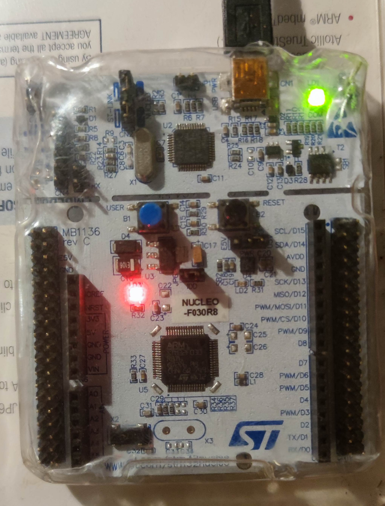
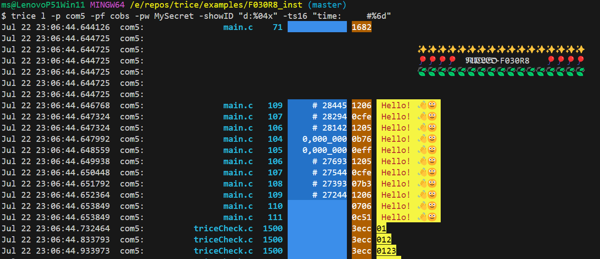

# Example F030R8_inst

Table of Contents
<ol><!-- TABLE OF CONTENTS START -->

<!-- 
Table of Contents Generation:
- Install vsCode extension "Markdown TOC" from dumeng 
- Use Shift-Ctrl-P "markdownTOC:generate" to get the automatic numbering.
- replace "<a id=" with "<a id=" 
-->

<!-- vscode-markdown-toc -->
* 1. [Description](#description)
* 2. [Setting Up](#setting-up)
* 3. [Intrumenting](#intrumenting)

<!-- vscode-markdown-toc-config
	numbering=true
	autoSave=true
	/vscode-markdown-toc-config -->
<!-- /vscode-markdown-toc -->

</ol>
<!-- TABLE OF CONTENTS END -->

##  1. Description

This is a working example with deferred encrypted out over UART. By uncommenting 2 lines in [triceConfig.h](./Core/Inc/triceConfig.h), you get also parallel direct out over RTT.

##  2. Setting Up

- See and adapt steps in [../F030R8_gen/ReadMe.md](../F030R8_gen/ReadMe.md).

##  3. Intrumenting

- Extend the Makefile with the information you get from comparing the *Makefile* here and in [../F030R8_gen/](../F030R8_gen/).
- Add *build.sh* and *clean.sh*.
- Copy file *SEGGER_RTT_Conf.h* from *trice/third_party/segger.com/SEGGER_RTT_V760g.zip* to [./Core/Inc/](./Core/Inc/). Yu could also look for a newer version.
- Copy and adapt a file [triceConfig.h](./Core/Inc/triceConfig.h) to [./Core/Inc/](./Core/Inc/). You can choose from an other example project or one of the test folders.
- Create 2 empty files: `touch til.json li.json`inside [./](./)
- Run `build.sh`. This should build all.
- Add `#include "trice.h"` to *main.c* and to *stm32f0xx_it.c* and edit these files according to diff.
- Add to `int main( void )` some `Trice( "..." );` messages.

- Run `trice s` to determine the relevant comport.
- You can have this output:

  

- The Trices with 16-bit timestamps are about 150 clocks away from each other. @32MHz this is a time of less 5 µs.

(<a href="#top">back to top</a>)
</ol>

