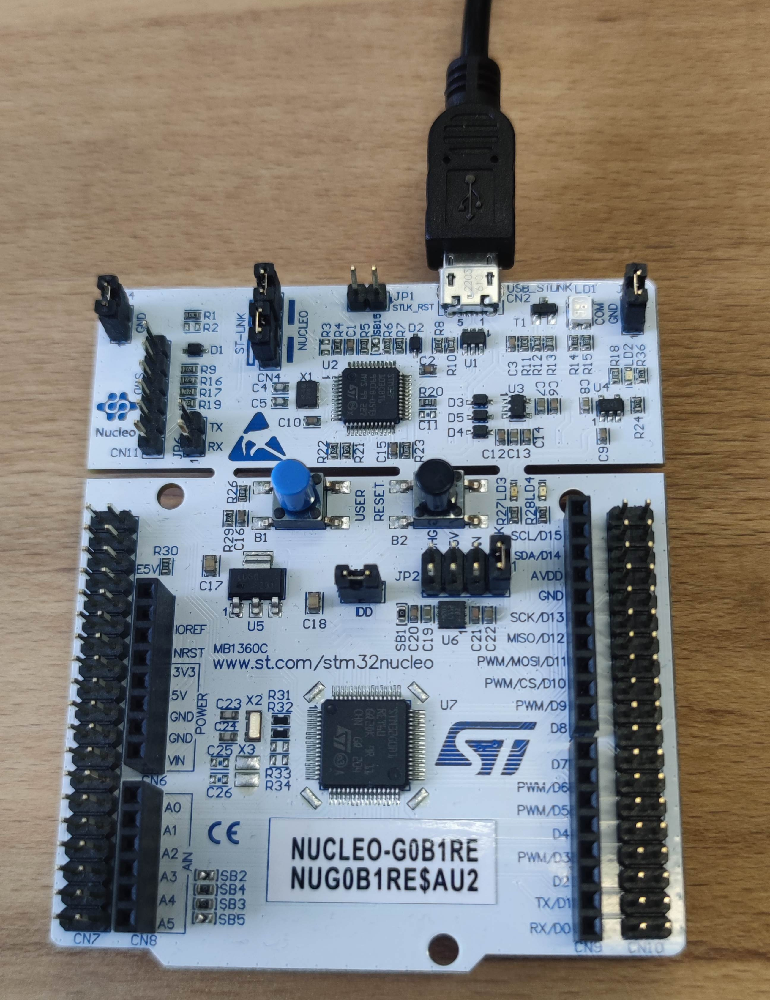

# Example G01B_inst

## Description

- This is a working example with deferred out in TCOBS framing over UART.
- To see the logs type `trice log -p com1`.

## Setting Up

- See and adapt steps in [../G01B_gen/ReadMe.md](../G01B_gen/ReadMe.md).

## Instrumenting

- The steps are similar to the steps in [../F030R8_inst/ReadMe.md](../F030R8_inst/ReadMe.md).
- See comments in [triceConfig.h](./Core/Inc/triceConfig.h) and commandlines in screenshot.

