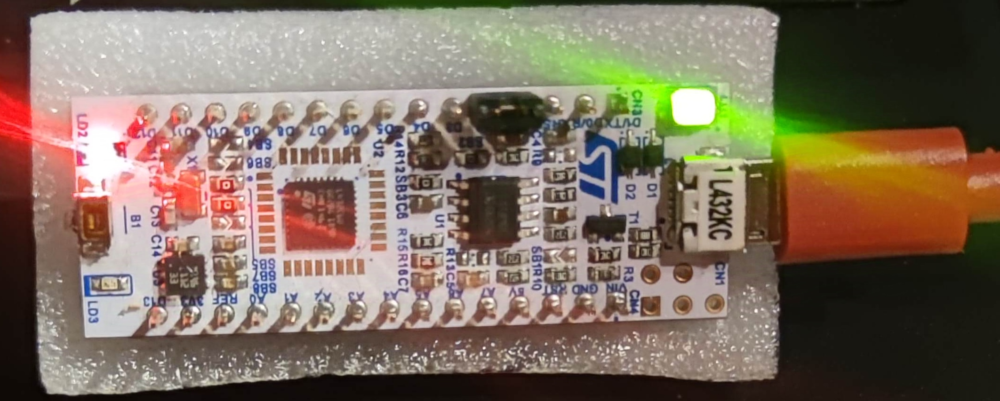
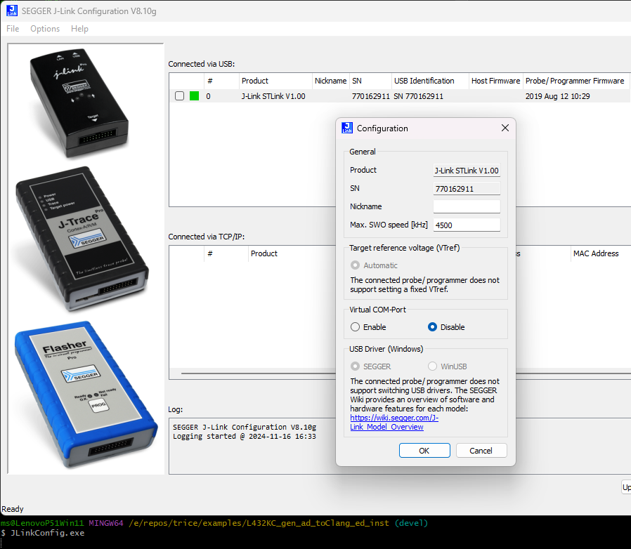

# Example L432KC_gen_ad_toClang_ed_instr

## Description

- This is a with Trice instrumented project.
- It is for easy compare with  [../L432KC_gen_ad_toClang_ed](../L432KC_gen_ad_toClang_ed) to figure out the needed setup changes.

## Setting Up

- See and adapt steps in [../F030R8_gen/ReadMe.md](../F030R8_gen/ReadMe.md).
- Then add/modify the files to reach this folder layout.

## "Hardware" Changes

- The used evaluation board is delivered with an on-board ST-Link software for debugging.
- This was changed to an on-board J-Link software for better debugging and RTT support.
- See [../../docs/TriceOverRTT.md](../../docs/TriceOverRTT.md) about that.

## Using RTT with JLinkRTTLogger

- You need to install the "J-Link Software and Documentation pack" for yout OS.
- [./Core/Inc/triceConfig.h](./Core/Inc/triceConfig.h) contains example Trice log commands.

## Using RTT with OpenOCD

### Windows

- OpenOCD does not support the installed JLink driver.

- Changing to the WinUSB buld device driver is here not supported :-(

### Darwin

- See **OpenOCD with Darwin** in [../../docs/TriceOverRTT.md](../../docs/TriceOverRTT.md)
